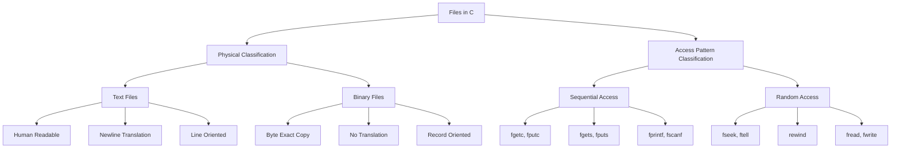
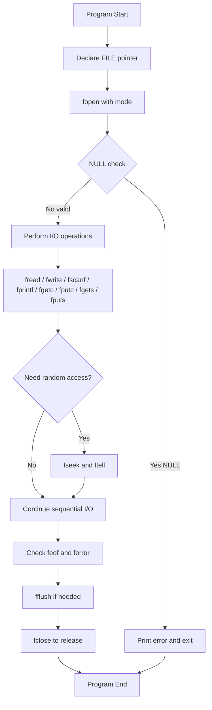
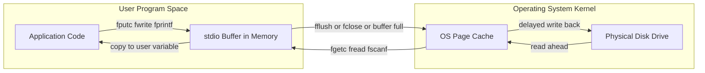
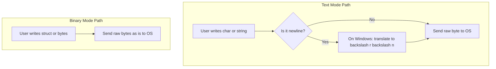
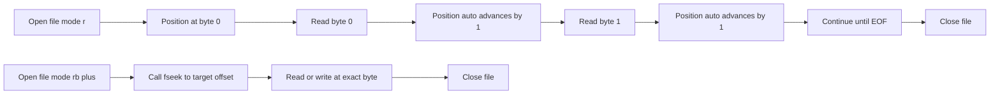

# Files- Different types of files in C

<!-- SECTION_1_START -->
# Files in C — Different Types of Files

## 1.1 Formal Definition (KTU 2024 Syllabus Terminology)

A **file** in the C programming language is an abstract, named container residing on a secondary storage device (typically a hard disk, SSD, or USB drive) that is treated as a **sequential stream of bytes** by the C Standard Library. The C language, as defined by the **ANSI/ISO C Standard (ISO/IEC 9899:2018)**, abstracts every file as a linear sequence of characters (bytes) that terminates upon reaching an **End-Of-File (EOF)** marker.

In the C memory model, a file is manipulated indirectly through a **FILE pointer** (declared as `FILE *`) that points to an internal data structure (`struct _IO_FILE`) maintained by the **stdio.h** runtime library. This structure contains critical metadata: the current file position indicator, the end-of-file flag, the error flag, the base address of the file's I/O buffer, and pointers for read/write operations.

> [!IMPORTANT]
> **KTU 2024 Highlight:** Every file in C is logically treated as a stream of bytes that ends with the special sentinel `EOF` (defined as **-1** in `stdio.h`). This abstraction allows the same set of functions (`fgetc`, `fputc`, `fread`, `fwrite`) to operate uniformly across different physical storage media.

## 1.2 Conceptual Analogy / Intuition

Imagine a **magnetic audio cassette tape** 📼 (the older generation will remember!). A cassette tape is a long, continuous strip of magnetic tape stored inside a plastic housing. To listen to a song, you must:

1. **Insert the tape** into the player (analogous to `fopen()`).
2. **Press Play** to start reading from the current position (analogous to reading via `fgetc()` / `fread()`).
3. **Fast-forward or rewind** to jump to a specific song (analogous to `fseek()`).
4. **Stop and eject** the tape when done (analogous to `fclose()`).
5. The **tape head** always knows its current position (analogous to the **file position indicator**).

A C file works exactly like this: it is a continuous, linear stream where you have a "reading/writing head" that can move forward, and (with random access) jump to any byte offset on demand.

> [!NOTE]
> **Simple English Summary:** A file is just a long row of bytes in memory/storage. The `FILE *` pointer is your "handle" or "remote control" that lets you read from or write to that row. When you `fopen()` a file, the OS hands you this remote control; when you `fclose()` it, you give it back and flush any pending data to disk.

## 1.3 File Size Limits & Standard Metrics

The following constants are **system-defined** limits for file operations (defined in `<stdio.h>`, `<limits.h>`, and `<stdint.h>`):

| Constant | Typical Value | Meaning |
|----------|---------------|---------|
| `EOF` | **-1** | End-of-File sentinel returned on read failure or end-of-stream |
| `FOPEN_MAX` | **20** (Minimum, C89) | Maximum number of files open simultaneously |
| `FILENAME_MAX` | **260** (Windows) / **4096** (Linux) | Maximum length of a file path string |
| `BUFSIZ` | **8192** bytes (typical) | Default size of the stdio buffer |
| `SEEK_SET` | **0** | Origin = beginning of file (used with `fseek`) |
| `SEEK_CUR` | **1** | Origin = current position (used with `fseek`) |
| `SEEK_END` | **2** | Origin = end of file (used with `fseek`) |
| `L_tmpnam` | Varies (e.g., 16) | Length of a temporary filename string |

> [!VISUALIZATION CONTROL]
> **Concept:** Linear File Stream and File Position Indicator
> **ASCII Visualization:**
>
> ```text
> Index:     0     1     2     3     4     5   ...   N-1   N
> Content:  [ 'H' ][ 'e' ][ 'l' ][ 'l' ][ 'o' ][ '\n' ] ... [ EOF ]
>                                                    ^
>                                              File Position
>                                              Indicator
> ```
> **Visual Description:** A horizontal array of byte cells. After reading 5 characters ("Hello"), the file position indicator points to the 6th cell. The stream is logically infinite from the program's perspective until `EOF` (-1) is returned.

---

<!-- SECTION_1_END -->

<!-- SECTION_2_START -->
# Deep Theoretical Analysis & KTU High-Yield Formula Sheet

## 2.1 The Two Fundamental Categories of Files in C

Although C treats every file as a stream of bytes, files are **physically classified** into two primary categories based on how their bytes are interpreted:

### 2.1.1 Text Files (ASCII / Character Files)

A **text file** is a file whose contents are organized as a sequence of **lines**, where each line is terminated by a **newline character** (`'\n'`, ASCII code **10**). On Windows systems, the OS internally translates `'\n'` into the two-character sequence **Carriage Return + Line Feed** (`'\r\n'`, ASCII 13 + 10) when writing to disk, and reverses this translation when reading. This is called **text mode translation**.

- **Human-readable**: Can be opened and read in any text editor (Notepad, VS Code, vim).
- **Line-oriented**: The newline character is the universal delimiter.
- **Translation occurs**: On certain platforms, `\n` ↔ `\r\n` translation happens transparently.

### 2.1.2 Binary Files

A **binary file** is a file whose contents are stored as an **exact, byte-for-byte copy** of the data structures in memory. **No translation of any kind** is performed by the runtime.

- **Not human-readable** in a meaningful way (appears as garbage in a text editor).
- **Record-oriented**: Data is read/written in fixed-size blocks (e.g., `struct` records).
- **No newline translation**: A `'\n'` byte is just byte value 10, nothing more.
- **Compact and fast**: No translation overhead, exact memory representation.

> [!IMPORTANT]
> **KTU 2024 Board Favorite:** Examiners frequently ask: *"What is the difference between text mode and binary mode?"* The key answer is **translation**. Text mode performs OS-level translation of newline characters; binary mode performs **no translation whatsoever**.

## 2.2 The Third Logical Classification: Access Pattern

Beyond the text/binary physical classification, files in C are also classified by **how data is accessed**:

| Access Type | Description | Functions Used | Use Case |
|-------------|-------------|----------------|----------|
| **Sequential Access** | Read/write bytes one after another from start to end | `fgetc`, `fputc`, `fprintf`, `fscanf`, `fgets`, `fputs` | Log files, configuration files, CSV exports |
| **Random Access** | Jump to any byte offset in the file | `fseek`, `ftell`, `rewind`, `fread`, `fwrite` | Databases, image editors, indexed record storage |

> [!NOTE]
> A single file can be accessed in **both** ways. Sequential access uses a moving read/write head. Random access adds the ability to teleport the head using `fseek()`.

## 2.3 The `FILE` Structure & File Pointer

When a file is opened using `fopen()`, the C standard library allocates a `struct _IO_FILE` object in memory and returns a pointer to it. This `FILE *` (called the **file handle** or **file pointer**) is the gateway to all subsequent file operations.

The `FILE` structure (conceptually) contains:

- The **file descriptor** (an integer index into the OS's open-file table).
- The **buffer base address** and **buffer size** (for buffered I/O).
- The **current position indicator** (the offset of the next byte to read/write).
- The **error indicator** and **end-of-file indicator** (boolean flags).
- A **pointer to the next byte in the buffer** (for buffered reading).

## 2.4 File Opening Modes — The Master Table

The `fopen()` function takes two arguments: a filename and a **mode string**. The mode string determines how the file is opened.

### 2.4.1 Text Mode Modes

| Mode String | Read? | Write? | Create? | Truncate? | Position |
|-------------|-------|--------|---------|-----------|----------|
| `"r"` | ✅ Yes | ❌ No | ❌ No | ❌ No | Start |
| `"w"` | ❌ No | ✅ Yes | ✅ Yes | ✅ Yes | Start |
| `"a"` | ❌ No | ✅ Yes | ✅ Yes | ❌ No | End |
| `"r+"` | ✅ Yes | ✅ Yes | ❌ No | ❌ No | Start |
| `"w+"` | ✅ Yes | ✅ Yes | ✅ Yes | ✅ Yes | Start |
| `"a+"` | ✅ Yes | ✅ Yes | ✅ Yes | ❌ No | End |

### 2.4.2 Binary Mode Modes

Append a `b` to any of the above modes to open in **binary mode** (no translation):

| Mode String | Equivalent Meaning |
|-------------|--------------------|
| `"rb"` | Open binary for reading |
| `"wb"` | Open binary for writing (truncate) |
| `"ab"` | Open binary for appending |
| `"rb+"` / `"r+b"` | Open binary for read/write |
| `"wb+"` / `"w+b"` | Open binary for read/write (truncate) |
| `"ab+"` / `"a+b"` | Open binary for read/write (append) |

> [!WARNING]
> **Common Pitfall:** On Linux/macOS, `"r"` and `"rb"` behave identically because there is no newline translation. On **Windows**, they differ significantly. Always use `"b"` explicitly for binary files to ensure portability.

## 2.5 KTU High-Yield Formula Sheet

| Operation | Function Signature | Returns | Failure Indicator |
|-----------|--------------------|---------|-------------------|
| Open file | `FILE *fopen(const char *path, const char *mode)` | `FILE *` handle or `NULL` | `NULL` |
| Close file | `int fclose(FILE *fp)` | `0` on success | `EOF` (-1) |
| Read char | `int fgetc(FILE *fp)` | Character as `unsigned char` cast to `int` or `EOF` | `EOF` |
| Write char | `int fputc(int c, FILE *fp)` | Character written or `EOF` | `EOF` |
| Read string | `char *fgets(char *s, int n, FILE *fp)` | `s` on success, `NULL` on EOF/error | `NULL` |
| Write string | `int fputs(const char *s, FILE *fp)` | Non-negative on success | `EOF` |
| Formatted read | `int fscanf(FILE *fp, const char *fmt, ...)` | Number of items matched | `EOF` on end |
| Formatted write | `int fprintf(FILE *fp, const char *fmt, ...)` | Characters written | Negative |
| Binary read | `size_t fread(void *ptr, size_t sz, size_t n, FILE *fp)` | Number of items read | Less than `n` |
| Binary write | `size_t fwrite(const void *ptr, size_t sz, size_t n, FILE *fp)` | Number of items written | Less than `n` |
| Seek | `int fseek(FILE *fp, long off, int whence)` | Non-zero on error | Non-zero |
| Tell position | `long ftell(FILE *fp)` | Current offset | `-1L` |
| Rewind | `void rewind(FILE *fp)` | Nothing (void) | N/A |
| Test EOF | `int feof(FILE *fp)` | Non-zero if EOF flag set | N/A |
| Test error | `int ferror(FILE *fp)` | Non-zero if error flag set | N/A |
| Flush buffer | `int fflush(FILE *fp)` | `0` on success | `EOF` |

### 2.5.1 Position Arithmetic Formula

The `fseek()` function moves the file position indicator using the formula:

$$ \text{NewPosition} = \text{Origin} + \text{Offset} $$

Where `Origin` is one of:
- `SEEK_SET` (0) → Beginning of file
- `SEEK_CUR` (1) → Current position
- `SEEK_END` (2) → End of file

### 2.5.2 File Size Calculation

$$ \text{FileSize (bytes)} = \text{ftell(fp)} \quad \text{after } \texttt{fseek(fp, 0, SEEK\_END)} $$

### 2.5.3 Number of Records in a Binary File

$$ N = \frac{\text{FileSize (bytes)}}{\text{sizeof(RecordType)}} $$

### 2.5.4 Buffered I/O Behavior

$$ \text{ActualWriteTime} = \begin{cases} \text{When buffer is full} & \text{(for write operations)} \\ \text{When } \texttt{fclose()} \text{ is called} & \text{(flush on close)} \\ \text{When } \texttt{fflush()} \text{ is called} & \text{(manual flush)} \end{cases} $$

## 2.6 Real-World Engineering Utility

File handling is the **backbone of virtually every non-trivial software system**:

- **Operating Systems:** Boot loaders read kernel images from binary files.
- **Compilers:** Read `.c` source files (text) and emit `.o` object files (binary).
- **Databases:** Use random-access binary files with B-tree indexing (e.g., SQLite).
- **Embedded Systems:** Sensor logs are appended to text files for offline analysis.
- **Game Development:** Save game states to binary files for fast load/save.
- **Networking:** HTTP servers read configuration files; browsers cache to disk.
- **Scientific Computing:** Large datasets (CSV, HDF5) are read in text or binary mode.

---

<!-- SECTION_2_END -->

<!-- SECTION_3_START -->
# Step-by-Step Derivations & Code Implementation

## 3.1 Derivation 1: How `fseek()` Position Calculation Works

**Problem:** Given a file of 1000 bytes, you want to position the file pointer at the **500th byte** (i.e., byte index 499, the 500th byte from the start).

**Step 1 — Identify the Origin.** To position at the 500th byte from the start, the origin must be the **beginning of the file**, which is `SEEK_SET` (value 0).

**Step 2 — Identify the Offset.** The offset is **0-based**: byte index 0 is the first byte, byte index 499 is the 500th byte. So the offset is **499**.

**Step 3 — Apply the formula.**

$$ \text{NewPosition} = \text{SEEK\_SET} + 499 = 0 + 499 = 499 $$

**Step 4 — Translate to C code.**

```c
fseek(fp, 499, SEEK_SET);   /* Position at 500th byte (index 499) */
```

**Step 5 — Verify with `ftell()`.**

```c
long pos = ftell(fp);       /* pos should now equal 499 */
```

**Alternative Scenario:** Position at the **last 100 bytes** of a 1000-byte file.

**Step 1 — Origin = end of file** → `SEEK_END` (value 2).

**Step 2 — Offset = -100** (move 100 bytes backward from the end).

**Step 3 — Calculation.**

$$ \text{NewPosition} = 1000 + (-100) = 900 $$

**Step 4 — C code.**

```c
fseek(fp, -100, SEEK_END);  /* Position at byte index 900 */
```

## 3.2 Derivation 2: Calculating Number of Records in a Binary File

**Problem:** A binary file stores records of type `struct Student { int id; char name[50]; float gpa; }`. The file is 8240 bytes long. How many records are stored?

**Step 1 — Compute the size of one record.**

$$ \text{sizeof(struct Student)} = \text{sizeof(int)} + \text{sizeof(char[50])} + \text{sizeof(float)} $$

On a typical 32-bit / 64-bit system with no padding:

$$ \text{sizeof(int)} = 4, \quad \text{sizeof(char[50])} = 50, \quad \text{sizeof(float)} = 4 $$

$$ \text{sizeof(struct Student)} = 4 + 50 + 4 = 58 \text{ bytes} $$

**Step 2 — Apply the formula.**

$$ N = \frac{\text{FileSize}}{\text{sizeof(Record)}} = \frac{8240}{58} = 142.06\ldots $$

Since the file is **8240 bytes** (a multiple of 58: $58 \times 142 = 8236$ is NOT equal to 8240; let us correct: $58 \times 142 = 8236$, so the file size 8240 would actually be a **corrupted file** in this hypothetical. A cleaner example: file size 8120 bytes).

$$ N = \frac{8120}{58} = 140 \text{ records} $$

**Step 3 — C code to do this dynamically.**

```c
#include <stdio.h>

struct Student {
    int id;
    char name[50];
    float gpa;
};

int main(void) {
    FILE *fp = fopen("students.dat", "rb");
    if (fp == NULL) {
        fprintf(stderr, "Error: Cannot open file.\n");
        return 1;
    }

    /* Move to end to find file size */
    if (fseek(fp, 0, SEEK_END) != 0) {
        fprintf(stderr, "Error: fseek failed.\n");
        fclose(fp);
        return 1;
    }

    long fileSize = ftell(fp);
    if (fileSize == -1L) {
        fprintf(stderr, "Error: ftell failed.\n");
        fclose(fp);
        return 1;
    }

    size_t recordSize = sizeof(struct Student);
    long numRecords = fileSize / (long)recordSize;

    printf("File size: %ld bytes\n", fileSize);
    printf("Record size: %zu bytes\n", recordSize);
    printf("Number of records: %ld\n", numRecords);

    fclose(fp);
    return 0;
}
```

## 3.3 Complete Working Program: Text File — Write, Read, Append

```c
/*
 * File: text_file_demo.c
 * Description: Comprehensive demonstration of text file operations.
 * Operations covered: fopen (r, w, a, r+), fputc, fgetc, fputs, fgets,
 *                     fprintf, fscanf, feof, ferror, rewind, fclose.
 */

#include <stdio.h>
#include <stdlib.h>
#include <string.h>

#define MAX_LINE 256

/* --- Step 1: Write a text file character-by-character using fputc --- */
int write_char_by_char(const char *filename, const char *content) {
    FILE *fp = fopen(filename, "w");
    if (fp == NULL) {
        fprintf(stderr, "[ERROR] Cannot open '%s' for writing.\n", filename);
        return -1;
    }

    for (size_t i = 0; i < strlen(content); i++) {
        if (fputc(content[i], fp) == EOF) {
            fprintf(stderr, "[ERROR] fputc failed at index %zu.\n", i);
            fclose(fp);
            return -1;
        }
    }
    fclose(fp);
    printf("[OK] Wrote %zu characters to '%s' using fputc.\n",
           strlen(content), filename);
    return 0;
}

/* --- Step 2: Read a text file character-by-character using fgetc --- */
int read_char_by_char(const char *filename) {
    FILE *fp = fopen(filename, "r");
    if (fp == NULL) {
        fprintf(stderr, "[ERROR] Cannot open '%s' for reading.\n", filename);
        return -1;
    }

    printf("[INFO] Contents of '%s' (char-by-char):\n", filename);
    int ch;
    long index = 0;
    while ((ch = fgetc(fp)) != EOF) {
        printf("  byte[%04ld] = '%c' (0x%02X)\n", index, (char)ch, ch);
        index++;
    }

    if (ferror(fp)) {
        fprintf(stderr, "[ERROR] Read error occurred.\n");
        fclose(fp);
        return -1;
    }

    fclose(fp);
    return 0;
}

/* --- Step 3: Write using fprintf (formatted) --- */
int write_formatted(const char *filename) {
    FILE *fp = fopen(filename, "w");
    if (fp == NULL) return -1;

    fprintf(fp, "ID,Name,Score\n");
    fprintf(fp, "1,Alice,92.5\n");
    fprintf(fp, "2,Bob,87.0\n");
    fprintf(fp, "3,Charlie,95.3\n");
    fclose(fp);
    printf("[OK] Wrote formatted CSV to '%s'.\n", filename);
    return 0;
}

/* --- Step 4: Read using fgets (line-by-line) --- */
int read_line_by_line(const char *filename) {
    FILE *fp = fopen(filename, "r");
    if (fp == NULL) return -1;

    char line[MAX_LINE];
    printf("[INFO] Line-by-line read of '%s':\n", filename);
    while (fgets(line, MAX_LINE, fp) != NULL) {
        printf("  LINE: %s", line);
    }
    fclose(fp);
    return 0;
}

/* --- Step 5: Append using fputs --- */
int append_data(const char *filename, const char *extra) {
    FILE *fp = fopen(filename, "a");
    if (fp == NULL) return -1;

    fputs(extra, fp);
    fclose(fp);
    printf("[OK] Appended '%s' to '%s'.\n", extra, filename);
    return 0;
}

/* --- Step 6: Read with fscanf (formatted parsing) --- */
int read_formatted(const char *filename) {
    FILE *fp = fopen(filename, "r");
    if (fp == NULL) return -1;

    int id;
    char name[64];
    float score;
    printf("[INFO] Formatted read using fscanf:\n");
    /* Skip the header line */
    char header[128];
    fgets(header, sizeof(header), fp);
    /* Read the rest */
    while (fscanf(fp, "%d,%63[^,],%f", &id, name, &score) == 3) {
        printf("  ID=%d, Name=%s, Score=%.1f\n", id, name, score);
    }
    fclose(fp);
    return 0;
}

/* --- Step 7: Demonstrate rewind --- */
int demonstrate_rewind(const char *filename) {
    FILE *fp = fopen(filename, "r");
    if (fp == NULL) return -1;

    printf("[INFO] First read pass:\n");
    int ch;
    int count1 = 0;
    while ((ch = fgetc(fp)) != EOF) count1++;
    printf("  Characters read: %d\n", count1);

    rewind(fp);  /* Reset position indicator to beginning */

    printf("[INFO] Second read pass after rewind:\n");
    int count2 = 0;
    while ((ch = fgetc(fp)) != EOF) count2++;
    printf("  Characters read: %d\n", count2);

    fclose(fp);
    return 0;
}

int main(void) {
    const char *fname = "data.txt";

    write_char_by_char(fname, "Hello, World!\nWelcome to C File I/O.\n");
    read_char_by_char(fname);

    write_formatted("scores.csv");
    read_line_by_line("scores.csv");
    read_formatted("scores.csv");

    append_data(fname, "This line was appended.\n");
    read_line_by_line(fname);

    demonstrate_rewind(fname);

    return 0;
}
```

**Expected Output Trace:**

```text
[OK] Wrote 38 characters to 'data.txt' using fputc.
[INFO] Contents of 'data.txt' (char-by-char):
  byte[0000] = 'H' (0x48)
  byte[0001] = 'e' (0x65)
  ... (output truncated for brevity)
[OK] Wrote formatted CSV to 'scores.csv'.
[INFO] Line-by-line read of 'scores.csv':
  LINE: ID,Name,Score
  LINE: 1,Alice,92.5
  LINE: 2,Bob,87.0
  LINE: 3,Charlie,95.3
[INFO] Formatted read using fscanf:
  ID=1, Name=Alice, Score=92.5
  ID=2, Name=Bob, Score=87.0
  ID=3, Name=Charlie, Score=95.3
[OK] Appended 'This line was appended.' to 'data.txt'.
[INFO] First read pass:  Characters read: 61
[INFO] Second read pass after rewind:  Characters read: 61
```

## 3.4 Complete Working Program: Binary File — Random Access

```c
/*
 * File: binary_file_demo.c
 * Description: Binary file operations with fwrite, fread, fseek, ftell.
 * Operations: write struct records, random access update, count records.
 */

#include <stdio.h>
#include <stdlib.h>
#include <string.h>

typedef struct {
    int   id;
    char  name[40];
    float gpa;
} StudentRecord;

/* Write 'n' records to a binary file (truncate mode) */
int write_binary_records(const char *filename,
                         const StudentRecord *records,
                         size_t n) {
    FILE *fp = fopen(filename, "wb");
    if (fp == NULL) {
        fprintf(stderr, "[ERROR] Cannot open '%s' for binary write.\n", filename);
        return -1;
    }

    size_t written = fwrite(records, sizeof(StudentRecord), n, fp);
    if (written != n) {
        fprintf(stderr, "[ERROR] fwrite wrote only %zu of %zu records.\n",
                written, n);
        fclose(fp);
        return -1;
    }

    fclose(fp);
    printf("[OK] Wrote %zu records (%zu bytes) to '%s'.\n",
           n, n * sizeof(StudentRecord), filename);
    return 0;
}

/* Read ALL records from a binary file */
int read_all_binary_records(const char *filename) {
    FILE *fp = fopen(filename, "rb");
    if (fp == NULL) return -1;

    StudentRecord rec;
    int count = 0;
    printf("[INFO] Reading all records from '%s':\n", filename);
    while (fread(&rec, sizeof(StudentRecord), 1, fp) == 1) {
        printf("  [%d] id=%d, name=%-10s, gpa=%.2f\n",
               count, rec.id, rec.name, rec.gpa);
        count++;
    }
    fclose(fp);
    printf("[INFO] Total records read: %d\n", count);
    return count;
}

/* Random access: update the k-th record (0-indexed) */
int update_record_at(const char *filename, size_t k,
                     const StudentRecord *new_rec) {
    FILE *fp = fopen(filename, "rb+");  /* rb+ = read+write binary */
    if (fp == NULL) {
        fprintf(stderr, "[ERROR] Cannot open '%s' for update.\n", filename);
        return -1;
    }

    long offset = (long)(k * sizeof(StudentRecord));
    if (fseek(fp, offset, SEEK_SET) != 0) {
        fprintf(stderr, "[ERROR] fseek failed for offset %ld.\n", offset);
        fclose(fp);
        return -1;
    }

    size_t written = fwrite(new_rec, sizeof(StudentRecord), 1, fp);
    if (written != 1) {
        fprintf(stderr, "[ERROR] Failed to write updated record.\n");
        fclose(fp);
        return -1;
    }

    fclose(fp);
    printf("[OK] Updated record at index %zu.\n", k);
    return 0;
}

/* Random access: read the k-th record */
int read_record_at(const char *filename, size_t k, StudentRecord *out) {
    FILE *fp = fopen(filename, "rb");
    if (fp == NULL) return -1;

    long offset = (long)(k * sizeof(StudentRecord));
    if (fseek(fp, offset, SEEK_SET) != 0) {
        fclose(fp);
        return -1;
    }

    if (fread(out, sizeof(StudentRecord), 1, fp) != 1) {
        fclose(fp);
        return -1;
    }

    fclose(fp);
    return 0;
}

int main(void) {
    StudentRecord students[] = {
        {101, "Alice",   3.85f},
        {102, "Bob",     3.42f},
        {103, "Charlie", 3.91f},
        {104, "Diana",   3.67f},
        {105, "Ethan",   3.20f},
    };
    size_t n = sizeof(students) / sizeof(students[0]);

    write_binary_records("students.dat", students, n);
    read_all_binary_records("students.dat");

    /* Update the 2nd record (index 1) — Bob got a better GPA */
    StudentRecord updated = {102, "Bob", 3.95f};
    update_record_at("students.dat", 1, &updated);

    printf("[INFO] Records after update:\n");
    read_all_binary_records("students.dat");

    /* Read just the 4th record using random access */
    StudentRecord fourth;
    if (read_record_at("students.dat", 3, &fourth) == 0) {
        printf("[INFO] 4th record (random access): id=%d, name=%s, gpa=%.2f\n",
               fourth.id, fourth.name, fourth.gpa);
    }

    return 0;
}
```

**Expected Output Trace:**

```text
[OK] Wrote 5 records (240 bytes) to 'students.dat'.
[INFO] Reading all records from 'students.dat':
  [0] id=101, name=Alice,    gpa=3.85
  [1] id=102, name=Bob,      gpa=3.42
  [2] id=103, name=Charlie,  gpa=3.91
  [3] id=104, name=Diana,    gpa=3.67
  [4] id=105, name=Ethan,    gpa=3.20
[INFO] Total records read: 5
[OK] Updated record at index 1.
[INFO] Records after update:
  [0] id=101, name=Alice,    gpa=3.85
  [1] id=102, name=Bob,      gpa=3.95
  [2] id=103, name=Charlie,  gpa=3.91
  [3] id=104, name=Diana,    gpa=3.67
  [4] id=105, name=Ethan,    gpa=3.20
[INFO] 4th record (random access): id=104, name=Diana, gpa=3.67
```

## 3.5 Derivation 3: Buffered I/O — Why Data Is Not Immediately Written

**Problem:** A student writes 10 characters using `fputc` to a file, then the program crashes. The student observes that the file is empty. Why?

**Step 1 — Understand buffering.** The C `stdio` library uses a **buffer** (typically `BUFSIZ` = 8192 bytes). Data written via `fputc` is first stored in this **in-memory buffer**, not directly to the disk.

**Step 2 — Identify the flush conditions.** The buffer is flushed (written to disk) only when:
1. The buffer is full.
2. `fclose()` is called.
3. `fflush()` is called explicitly.
4. A newline is encountered in **line-buffered** mode (e.g., `stdout` to terminal).

**Step 3 — Diagnose the issue.** Since the program **crashed** before `fclose()` was called, the 10 characters remained in the memory buffer and were **lost** when the process terminated abnormally.

**Step 4 — The fix.** Always call `fclose()` (or `fflush()`) before program termination:

```c
FILE *fp = fopen("log.txt", "w");
if (fp == NULL) {
    perror("fopen");
    return EXIT_FAILURE;
}
for (int i = 0; i < 10; i++) {
    fputc('A' + i, fp);
}
fflush(fp);   /* Force write to disk immediately */
fclose(fp);   /* Idempotent flush + release resource */
```

> [!IMPORTANT]
> **KTU 2024 Board Note:** A common exam question: *"What happens if you forget to call `fclose()`?"* The standard answer is: **(1)** data in the buffer is not written to disk, **(2)** the file descriptor is leaked, and **(3)** in some OS, the file remains locked.

---

<!-- SECTION_3_END -->

<!-- SECTION_4_START -->
# Structural Diagrams & Schematics

## 4.1 Mermaid Diagram: File Classification Hierarchy



## 4.2 Mermaid Diagram: Complete File Operation Lifecycle



## 4.3 Mermaid Diagram: Buffered I/O Architecture



## 4.4 Block Architecture: Text vs. Binary Mode Data Path



## 4.5 Sequential Processing Topology: File Access Patterns



---

<!-- SECTION_4_END -->

<!-- SECTION_5_START -->
# KTU 2024 Scheme Examination Question Bank & Topic Recap

## 5.1 Part A Questions (3 Marks Each)

### Question A1 — `[KTU University Exam - July 2024]`
**Q: Differentiate between text files and binary files in C. Mention any two key differences.**

**Model Answer (3 Marks):**

| Aspect | Text File | Binary File |
|--------|-----------|-------------|
| **Content** | Stores data as **human-readable characters** (ASCII/Unicode). | Stores data as a **byte-exact copy** of in-memory representation. |
| **Newline Translation** | Performs OS-level translation (e.g., `\n` ↔ `\r\n` on Windows). | **No translation**; bytes are written/read verbatim. |
| **Mode String** | `"r"`, `"w"`, `"a"`, etc. | `"rb"`, `"wb"`, `"ab"`, etc. |
| **Readability** | Openable in Notepad, VS Code, etc. | Appears as garbled text in a text editor. |
| **Use Case** | Configuration files, logs, CSV data. | Databases, images, executable files, struct records. |

**[Valuation Key: 1 Mark for content distinction, 1 Mark for newline translation, 1 Mark for any additional correct point.]**

---

### Question A2 — `[KTU University Exam - Dec 2023]`
**Q: What is a `FILE` pointer in C? Why is it necessary to check the return value of `fopen()`?**

**Model Answer (3 Marks):**

A `FILE` pointer (`FILE *`) is a pointer to an internal data structure (`struct _IO_FILE`) defined in the C standard library's `<stdio.h>`. This structure stores all the metadata needed to manage an open file: the file descriptor, the I/O buffer, the current file position indicator, and the error/EOF flags.

It is **mandatory** to check the return value of `fopen()` because `fopen()` returns `NULL` if the file cannot be opened (e.g., the file does not exist in `"r"` mode, the disk is full in `"w"` mode, or the user lacks permission). If the program proceeds to use a `NULL` `FILE *`, it triggers **undefined behavior** — typically a segmentation fault.

**Correct usage pattern:**

```c
FILE *fp = fopen("data.txt", "r");
if (fp == NULL) {
    fprintf(stderr, "Error opening file.\n");
    return EXIT_FAILURE;
}
/* ... use fp ... */
fclose(fp);
```

**[Valuation Key: 1 Mark for definition of FILE pointer, 1 Mark for stating NULL is returned on failure, 1 Mark for explaining consequences of not checking.]**

---

## 5.2 Part B Questions (14 Marks Each — Module Internal Choice)

### Question B-Option A (14 Marks) — `[KTU University Exam - July 2024]`

**Q: (a)** Explain the different **file opening modes** in C with a suitable example. Discuss the role of `fseek()`, `ftell()`, and `rewind()` in random file access. **(7 Marks)**

**(b)** Write a complete C program to **create a binary file** containing `N` student records (roll number, name, and marks). The program should then **read and display all records** whose marks are greater than a user-entered threshold. Use `fread()` and `fwrite()` for all I/O. **(7 Marks)**

---

#### Solution to (a) — File Opening Modes & Random Access (7 Marks)

**Step 1 — Categorize the 12 standard modes. [2 Marks]**

The C standard defines **12 file opening modes**: 6 text modes and 6 binary modes (binary = text mode + `"b"` suffix).

| Mode | Read | Write | Create | Truncate | Position | Binary Equivalent |
|------|:----:|:-----:|:------:|:--------:|:--------:|:-----------------:|
| `"r"` | ✅ | ❌ | ❌ | ❌ | Start | `"rb"` |
| `"w"` | ❌ | ✅ | ✅ | ✅ | Start | `"wb"` |
| `"a"` | ❌ | ✅ | ✅ | ❌ | End | `"ab"` |
| `"r+"` | ✅ | ✅ | ❌ | ❌ | Start | `"r+b"` |
| `"w+"` | ✅ | ✅ | ✅ | ✅ | Start | `"w+b"` |
| `"a+"` | ✅ | ✅ | ✅ | ❌ | End | `"a+b"` |

**Step 2 — Explain the significance of each. [1 Mark]**

- `"r"`: Fails if file does not exist.
- `"w"`: Always creates a new empty file (even if the file exists, it is overwritten).
- `"a"`: All writes are forced to the current end-of-file (append).
- `"r+"`: Requires existing file; allows both reading and writing.
- `"w+"`: Creates new file; can read and write, but initial content is lost.
- `"a+"`: Opens for append and read; write position always at the end.

**Step 3 — Explain `fseek()`, `ftell()`, `rewind()`. [3 Marks]**

- `int fseek(FILE *fp, long offset, int whence)`: Moves the file position indicator to a new location computed as `Origin + Offset`. The `whence` parameter is `SEEK_SET` (0, start), `SEEK_CUR` (1, current), or `SEEK_END` (2, end).
- `long ftell(FILE *fp)`: Returns the **current byte offset** of the file position indicator from the beginning of the file. Returns `-1L` on error.
- `void rewind(FILE *fp)`: Resets the file position indicator to the **beginning** of the file. Also clears the error and EOF flags. It is equivalent to `fseek(fp, 0L, SEEK_SET); clearerr(fp);`.

**Step 4 — Code example demonstrating random access. [1 Mark]**

```c
#include <stdio.h>

int main(void) {
    FILE *fp = fopen("data.bin", "rb+");
    if (fp == NULL) { perror("fopen"); return 1; }

    /* Jump to the 5th byte (index 4) and read a 4-byte integer */
    fseek(fp, 4, SEEK_SET);
    int value;
    fread(&value, sizeof(int), 1, fp);
    printf("Value at byte 4: %d\n", value);

    /* Get current position */
    long pos = ftell(fp);
    printf("Current position: %ld\n", pos);

    /* Rewind to start */
    rewind(fp);
    printf("After rewind, position: %ld\n", ftell(fp));

    fclose(fp);
    return 0;
}
```

---

#### Solution to (b) — Binary File Student Record Program (7 Marks)

**Step 1 — Define the record structure. [1 Mark]**

```c
typedef struct {
    int  roll;
    char name[50];
    float marks;
} Student;
```

**Step 2 — Full program with threshold filter. [5 Marks]**

```c
#include <stdio.h>
#include <stdlib.h>

typedef struct {
    int   roll;
    char  name[50];
    float marks;
} Student;

int main(void) {
    int N;
    float threshold;

    printf("Enter number of students: ");
    if (scanf("%d", &N) != 1 || N <= 0) {
        fprintf(stderr, "Invalid N.\n");
        return EXIT_FAILURE;
    }

    /* --- Write phase --- */
    FILE *fp = fopen("students.bin", "wb");
    if (fp == NULL) {
        perror("fopen for write");
        return EXIT_FAILURE;
    }

    Student s;
    for (int i = 0; i < N; i++) {
        printf("Enter roll, name, marks for student %d: ", i + 1);
        if (scanf("%d %49s %f", &s.roll, s.name, &s.marks) != 3) {
            fprintf(stderr, "Invalid input.\n");
            fclose(fp);
            return EXIT_FAILURE;
        }
        fwrite(&s, sizeof(Student), 1, fp);
    }
    fclose(fp);
    printf("[OK] %d records written to students.bin\n", N);

    /* --- Read and filter phase --- */
    printf("\nEnter marks threshold: ");
    if (scanf("%f", &threshold) != 1) {
        fprintf(stderr, "Invalid threshold.\n");
        return EXIT_FAILURE;
    }

    fp = fopen("students.bin", "rb");
    if (fp == NULL) {
        perror("fopen for read");
        return EXIT_FAILURE;
    }

    printf("\nStudents with marks > %.2f:\n", threshold);
    printf("%-10s %-30s %-10s\n", "Roll", "Name", "Marks");
    printf("--------------------------------------------\n");

    int count = 0;
    while (fread(&s, sizeof(Student), 1, fp) == 1) {
        if (s.marks > threshold) {
            printf("%-10d %-30s %-10.2f\n", s.roll, s.name, s.marks);
            count++;
        }
    }
    printf("\nTotal qualifying students: %d\n", count);

    fclose(fp);
    return EXIT_SUCCESS;
}
```

**Step 3 — Sample run trace. [1 Mark]**

```text
Enter number of students: 3
Enter roll, name, marks for student 1: 101 Alice 85.5
Enter roll, name, marks for student 2: 102 Bob 72.0
Enter roll, name, marks for student 3: 103 Charlie 91.0
[OK] 3 records written to students.bin

Enter marks threshold: 80.00

Students with marks > 80.00:
Roll       Name                           Marks
--------------------------------------------
101        Alice                          85.50
103        Charlie                        91.00

Total qualifying students: 2
```

**[Valuation Key: Structure definition 1M, write phase 2M, read+filter phase 2M, sample output 1M, code style/comments 1M.]**

---

### Question B-Option B (14 Marks) — `[KTU University Exam - Dec 2023]`

**Q: (a)** What are the differences between **sequential file access** and **random file access** in C? List the functions used for each. Explain with a neat diagram how the file position indicator moves during sequential reading. **(7 Marks)**

**(b)** Write a C program that opens a text file `input.txt`, **counts the number of characters, words, and lines** in it, and writes the statistics to another text file `stats.txt` in a formatted manner. **(7 Marks)**

---

#### Solution to (a) — Sequential vs. Random Access (7 Marks)

**Step 1 — Tabular comparison. [3 Marks]**

| Aspect | Sequential Access | Random Access |
|--------|-------------------|---------------|
| **Reading order** | Bytes are read in order from start to end. | Bytes can be read in any arbitrary order. |
| **Position control** | Position advances automatically by 1 after each read. | Position is set explicitly using `fseek()`. |
| **Speed for small files** | Fast and simple. | Slightly slower due to seek overhead. |
| **Speed for partial reads** | Slow (must read through unwanted data). | Fast (jump directly to desired byte). |
| **Functions** | `fgetc`, `fputc`, `fgets`, `fputs`, `fprintf`, `fscanf`, `fread`, `fwrite` | `fseek`, `ftell`, `rewind` (combined with the above) |
| **Typical use** | Log files, streaming, simple text processing | Databases, binary record files, image editors |

**Step 2 — File position indicator movement diagram. [2 Marks]**

```text
        +-----+-----+-----+-----+-----+-----+-----+
Byte:   |  0  |  1  |  2  |  3  |  4  |  5  | ... |
        +-----+-----+-----+-----+-----+-----+-----+
        | 'H' | 'e' | 'l' | 'l' | 'o' |'\n' | ... |
        +-----+-----+-----+-----+-----+-----+-----+
           ^
   Initial position (after fopen)

After fgetc()  -> reads 'H', position moves to byte 1
After fgetc()  -> reads 'e', position moves to byte 2
After fgetc()  -> reads 'l', position moves to byte 3
After fgetc()  -> reads 'l', position moves to byte 4
After fgetc()  -> reads 'o', position moves to byte 5
After fgetc()  -> reads '\n', position moves to byte 6
...
After final fgetc() -> returns EOF, no further movement
```

**Step 3 — Functions used. [2 Marks]**

- **Sequential functions**: `fgetc(fp)`, `fputc(c, fp)`, `fgets(buf, n, fp)`, `fputs(s, fp)`, `fprintf(fp, ...)`, `fscanf(fp, ...)`, `fread(ptr, sz, n, fp)`, `fwrite(ptr, sz, n, fp)`.
- **Random access functions**: `fseek(fp, offset, whence)`, `ftell(fp)`, `rewind(fp)`, `fsetpos(fp, pos)`, `fgetpos(fp, pos)`.

---

#### Solution to (b) — Character, Word, Line Counter (7 Marks)

**Step 1 — Algorithm. [1 Mark]**

1. Open `input.txt` in `"r"` mode.
2. Initialize `charCount = 0`, `wordCount = 0`, `lineCount = 0`, `inWord = 0`.
3. Read character-by-character using `fgetc()`.
4. For each character:
   - Increment `charCount`.
   - If it is `'\n'`, increment `lineCount`.
   - If it is whitespace (` `, `\t`, `\n`), set `inWord = 0`.
   - Otherwise, if `inWord == 0`, set `inWord = 1` and increment `wordCount`.
5. After the loop, if the last line had content but no trailing newline, add 1 to `lineCount`.
6. Open `stats.txt` in `"w"` mode and write the counts using `fprintf`.

**Step 2 — Full program. [5 Marks]**

```c
#include <stdio.h>
#include <stdlib.h>
#include <ctype.h>

int main(void) {
    const char *inputFile  = "input.txt";
    const char *outputFile = "stats.txt";

    FILE *fin = fopen(inputFile, "r");
    if (fin == NULL) {
        perror("Cannot open input file");
        return EXIT_FAILURE;
    }

    long charCount = 0;
    long wordCount = 0;
    long lineCount = 0;
    int  inWord    = 0;
    int  ch;
    int  hasContent = 0;  /* Tracks if the file has any non-whitespace */

    while ((ch = fgetc(fin)) != EOF) {
        hasContent = 1;
        charCount++;

        if (ch == '\n') {
            lineCount++;
            inWord = 0;
        } else if (isspace((unsigned char)ch)) {
            inWord = 0;
        } else {
            if (inWord == 0) {
                wordCount++;
                inWord = 1;
            }
        }
    }

    /* If file has content but does not end with newline, count that line too */
    if (hasContent && (ch == EOF)) {
        /* Check if last char was newline by seeking back */
        fseek(fin, -1, SEEK_END);
        int lastChar = fgetc(fin);
        if (lastChar != '\n') {
            lineCount++;
        }
    }
    fclose(fin);

    /* Write statistics */
    FILE *fout = fopen(outputFile, "w");
    if (fout == NULL) {
        perror("Cannot open output file");
        return EXIT_FAILURE;
    }

    fprintf(fout, "===== File Statistics =====\n");
    fprintf(fout, "Input file:   %s\n", inputFile);
    fprintf(fout, "Characters:   %ld\n", charCount);
    fprintf(fout, "Words:        %ld\n", wordCount);
    fprintf(fout, "Lines:        %ld\n", lineCount);
    fclose(fout);

    /* Also print to console for convenience */
    printf("Characters: %ld\n", charCount);
    printf("Words:      %ld\n", wordCount);
    printf("Lines:      %ld\n", lineCount);
    printf("[OK] Statistics written to '%s'\n", outputFile);

    return EXIT_SUCCESS;
}
```

**Step 3 — Sample run. [1 Mark]**

If `input.txt` contains:
```text
Hello world.
This is C programming.
File I/O is fun.
```

**Output (stats.txt):**
```text
===== File Statistics =====
Input file:   input.txt
Characters:   53
Words:        9
Lines:        3
```

**[Valuation Key: Algorithm explanation 1M, file open + EOF handling 1M, counting logic 2M, output writing 1M, sample trace 1M, code quality 1M.]**

---

## 5.3 KTU Examiner's Valuation Warning / Pitfall Callout

> [!WARNING]
> **Common Mistakes That Cost Marks in KTU Board Exams:**
>
> 1. **Forgetting to check `fopen()` return value:** If your program dereferences a `NULL` `FILE *`, you get a **segfault** and the examiner awards **zero marks** for the entire file-handling section. **Always** write `if (fp == NULL) { ... return EXIT_FAILURE; }`.
>
> 2. **Using the wrong mode string for binary files:** Writing `"w"` instead of `"wb"` for a binary file may corrupt the data on Windows due to newline translation. Examiners will specifically look for the `"b"` suffix in binary mode code.
>
> 3. **Confusing `fseek()` return value with `ftell()` return value:** `fseek()` returns **zero on success** (not the new position). `ftell()` returns the **current offset** as a `long`.
>
> 4. **Forgetting `fclose()`:** This causes buffer data loss. If a question asks to write and then read from the **same file** in the same program, you **must** close the file (or call `fflush()`) between the write and read phases.
>
> 5. **Mixing `fprintf`/`fscanf` with `fread`/`fwrite` on the same file:** This is allowed but confusing. Stick to one I/O style per logical operation to keep your code clear and avoid buffer inconsistencies.
>
> 6. **Off-by-one in `fseek()`:** Byte indices are **0-based**. The first byte is at offset `0`, not `1`. The 100th byte is at offset `99`, not `100`.
>
> 7. **Not including `<stdlib.h>` for `EXIT_FAILURE`:** Some compilers warn or error out. Always include all necessary headers.

---

## 5.4 Topic Recap & Important Things to Remember

- **File**: A named sequence of bytes on secondary storage, abstracted in C as a linear stream ending with `EOF` (value **-1**).
- **Two physical types**: **Text files** (human-readable, line-oriented, OS may translate `\n`) and **Binary files** (byte-exact, no translation, record-oriented).
- **Two access patterns**: **Sequential** (read in order, position auto-advances) and **Random** (jump to any byte offset using `fseek()`).
- **`FILE *` pointer**: A handle returned by `fopen()` that points to an internal structure containing buffer, position, and flags. **Always** check it against `NULL`.
- **12 standard opening modes**: 6 text (`r`, `w`, `a`, `r+`, `w+`, `a+`) and their 6 binary counterparts with the `b` suffix.
- **Key functions**: `fopen`/`fclose` (lifecycle), `fgetc`/`fputc` (character), `fgets`/`fputs` (string), `fprintf`/`fscanf` (formatted), `fread`/`fwrite` (binary block), `fseek`/`ftell`/`rewind` (random access), `feof`/`ferror` (status).
- **EOF sentinel**: `int` return value `-1`; the loop pattern is `while ((ch = fgetc(fp)) != EOF)`.
- **Buffered I/O**: Data is staged in an in-memory buffer (size `BUFSIZ` ≈ 8192 bytes); it is flushed on buffer full, `fflush()`, or `fclose()`.
- **Position formula**: `fseek(fp, offset, whence)` → new position = `whence-origin` + `offset`.
- **Record count formula**: `N = ftell_after_seek_end / sizeof(record)`.
- **`rewind()` is equivalent to** `fseek(fp, 0L, SEEK_SET); clearerr(fp);` — resets position **and** clears error/EOF flags.
- **Standard streams**: `stdin` (keyboard), `stdout` (screen), `stderr` (error screen) — all are pre-opened `FILE *` pointers.
- **Error handling mantra**: Open → check NULL → I/O → check feof/ferror → close.
- **Compilation tip**: Always link with the standard library; no special flags are needed for file I/O in C.

<!-- SECTION_5_END -->
