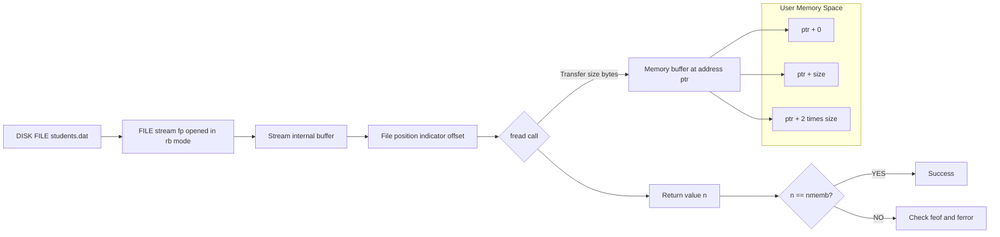
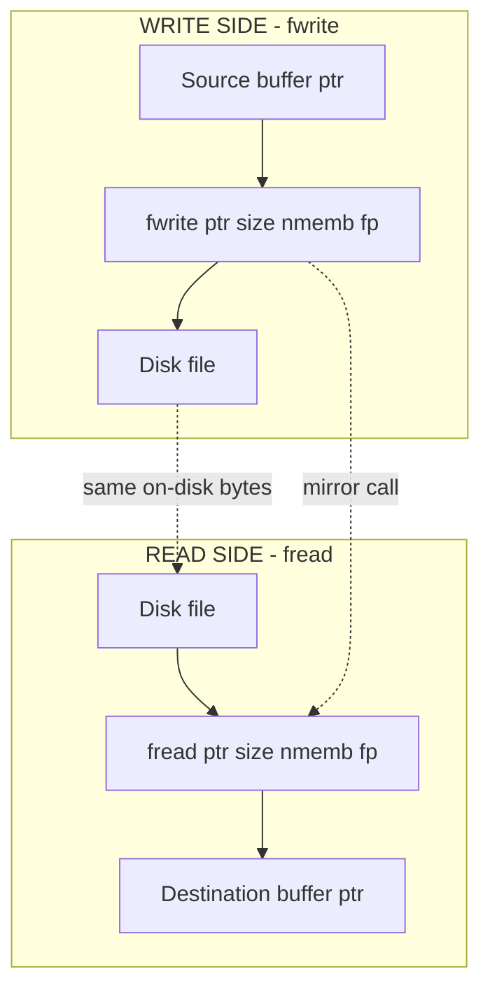
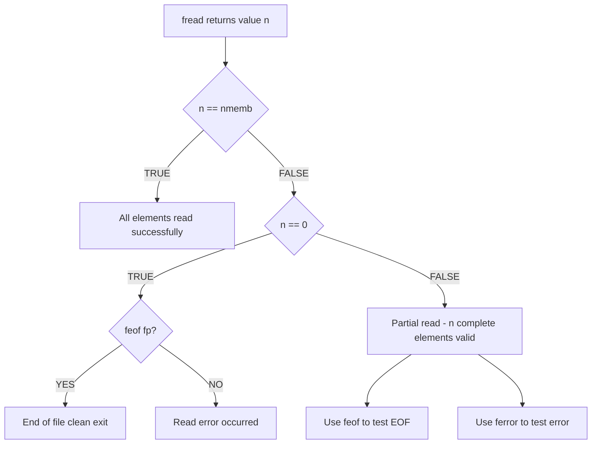

# fread()

<!-- SECTION_1_START -->
# fread() — Binary Stream Block Reader in C

> [!IMPORTANT]
> **KTU 2024 Scheme — Module 4: Pointers | Course: GXEST204 — Programming in C**
> This note covers `fread()` — a foundational function in **binary file handling** that operates directly on memory addresses (pointers), making it a critical pointer-centric utility in the KTU syllabus.

## 1.1 Formal Definition (KTU Syllabus Terminology)

`fread()` is a **standard library function** declared in `<stdio.h>` that performs **block-oriented, unformatted (binary) input** from an open `FILE` stream. It transfers a specified number of *elements* (each of a given byte size) directly from the stream into a memory location referenced by a pointer.

The function signature is:

```c
size_t fread(void *ptr, size_t size, size_t nmemb, FILE *stream);
```

| Parameter | Meaning |
|---|---|
| `ptr` | Pointer to a memory block (buffer) that will **receive** the data. |
| `size` | Size (in bytes) of **each element** to be read. |
| `nmemb` | Number of **elements** (blocks) to be read. |
| `stream` | Pointer to the open `FILE` object (source). |

**Return value:** `size_t` — the number of elements **successfully read**. A value **smaller than `nmemb`** signals *end-of-file* or an *error condition*.

> [!NOTE]
> **Key Insight for KTU:** Because `ptr` is a *generic* (`void *`) pointer, `fread()` can read into **any data type** — primitives (`int`, `float`), arrays, or user-defined `struct` aggregates — without type-specific variants. This is why it sits naturally inside the **Pointers module**.

## 1.2 Intuitive Analogy — The Cargo Truck at the Warehouse Dock

Imagine a **warehouse dock** (the file on disk) where boxes of a known size are stacked.

- A **cargo truck** (`fread()`) pulls up to the dock.
- You tell it: *"Pick up **`nmemb` boxes**, each weighing **`size` kilograms**, and deliver them to **warehouse B** (`ptr`)."*
- The truck reports back: *"I successfully delivered **N boxes**"* (the return value).

**Why a "generic" pointer matters:** The truck doesn't care whether it is delivering *apples*, *books*, or *machine parts*. It just moves raw bytes between two locations. This is exactly how `fread()` treats memory — it has **no idea** what data type is at `ptr`; it only knows how many bytes to copy.

**GeoGebra / Desmos Integration (if relevant):**

> [!VISUALIZATION CONTROL]
> **Concept:** Memory Buffer Offset Diagram
> **GeoGebra / Desmos Input Equations:**
> * `Buffer: f(x) = piecewise(0 ≤ x < 50, 1, 50 ≤ x < 100, 2)` *(a step function representing filled vs empty buffer regions)*
> **Visual Description:** Plot a 1-D number line where the x-axis is byte offset. After `fread()`, the segment `[ptr, ptr + nmemb*size)` is marked "filled"; everything else is "untouched".

## 1.3 Why fread() Belongs in the Pointers Module

`fread()` is **intrinsically a pointer-manipulation function**:

1. Its first argument is a **pointer to a memory destination**.
2. Internally, it performs **pointer arithmetic** (advancing through the buffer).
3. It is the **dual** of `fwrite()` and is the canonical example used in KTU to demonstrate **pointer-to-aggregate** operations with `struct`.

> [!IMPORTANT]
> **Memory address example (assuming `ptr = 0x1000`):**
> If `size = 4` and `nmemb = 3`, then after a successful call, the bytes at addresses $0x1000, 0x1004, 0x1008$ will be populated, because each element advances the internal cursor by `size` bytes.

<!-- SECTION_1_END -->

<!-- SECTION_2_START -->
# Deep Theoretical Analysis & KTU High-Yield Formula Sheet

## 2.1 Operational Logic — How fread() Works Step-by-Step

When `fread()` is invoked, the C runtime performs the following deterministic sequence:

1. **Validate the stream** — check that `stream` is a valid, open `FILE *` (and that it was opened in a *readable* mode such as `"rb"`, `"r"`, `"r+"`).
2. **Internal position check** — read the stream's current file position indicator (offset).
3. **Byte transfer loop** — for each of the `nmemb` elements:
   - Attempt to copy `size` bytes from the stream's internal buffer to `ptr + i * size` *(pointer arithmetic)*.
   - Increment the stream's file position indicator by `size` bytes.
4. **Error / EOF check** — if fewer than `nmemb` elements are read, stop early and return the *partial count*.
5. **Return** — the number of **whole elements** successfully transferred.

> [!NOTE]
> **Why "elements" and not "bytes" in the return value?**
> Returning the *element count* lets the caller detect short reads cleanly. If you pass `nmemb = 10` but get `5`, you know exactly that **5 complete records** are valid — not 50 or some other number. This is critical when reading `struct` records.

## 2.2 fread() vs fscanf() — The Crucial Distinction

| Feature | `fscanf()` | `fread()` |
|---|---|---|
| File mode | Text (`"r"`) | Binary (`"rb"`) preferred |
| Formatting | Parses text per format specifiers | Raw byte copy — no parsing |
| Works with `struct` | No (needs custom format) | **Yes (direct, one call)** |
| Speed | Slower (text conversion) | **Faster (memory-to-memory copy)** |
| Portability of data | Cross-platform safe | Endianness/size-sensitive |
| Pointer argument | Pointer to formatted variable | `void *` to raw buffer |

## 2.3 KTU Formula Sheet / Cheat Sheet

| Concept | Expression / Rule | Notes |
|---|---|---|
| Function signature | $f_{read}(p, s, n, F) \rightarrow k$ | $k \leq n$ |
| Total bytes requested | $B_{req} = s \times n$ | In bytes |
| Actual bytes transferred | $B_{act} = k \times s$ | $k$ = return value |
| Required header | `#include <stdio.h>` | Mandatory |
| Required file mode | `"rb"`, `"r+b"`, `"ab+"` | For reading |
| Pointer type | `void *` (generic) | Cast not required in C |
| EOF detection | `feof(stream) != 0` | After a short read |
| Error detection | `ferror(stream) != 0` | After a short read |
| Mismatched size risk | UB if `s > sizeof(T)` | Buffer overflow |
| Standard C standard | **C89 / C99 / C11** | Stable API |

> [!IMPORTANT]
> **Engineering Utility:** In production C systems, `fread()` is the backbone of: image processing (reading PNG/RAW pixel data), audio engines (WAV sample buffers), database engines (page-level disk I/O), embedded firmware (loading config from flash), and serialization of custom binary protocols. Anywhere a *bulk, fast* data transfer is needed, `fread()` is the go-to primitive.

## 2.4 Pre-Conditions and Pitfalls (Pre-Execution Checklist)

| # | Pre-condition | What happens if violated |
|---|---|---|
| 1 | `stream` opened in read/binary mode | Undefined behavior |
| 2 | `ptr` points to **allocated, large enough** memory | Buffer overflow, segmentation fault |
| 3 | `size` and `nmemb` are non-zero | Function is a no-op; returns 0 |
| 4 | File exists and is readable | `fread` returns 0, sets error indicator |

> [!WARNING]
> **Common KTU Mistake:** Students often confuse `size` and `nmemb`. Remember — `size` is the *width of one record*; `nmemb` is the *count of records*. Swapping them corrupts the data layout because the file position advances by the wrong stride.

<!-- SECTION_2_END -->

<!-- SECTION_3_START -->
# Step-by-Step Derivations & Code Implementation

## 3.1 Worked Example 1 — Reading a Single Struct Record

**Problem Statement (KTU Style):** Write a C program to write three student records (`name`, `roll`, `marks`) to a binary file using `fwrite()`, then read the **second record** back using `fread()` and display it.

### Full Source Code

```c
#include <stdio.h>
#include <stdlib.h>
#include <string.h>

/* Define a struct - KTU syllabus standard example */
struct Student {
    char  name[50];
    int   roll;
    float marks;
};

int main(void) {
    FILE *fp = NULL;
    struct Student db[3] = {
        {"Anand",   101, 89.5f},
        {"Bhavana", 102, 92.0f},
        {"Catherine", 103, 78.25f}
    };
    struct Student out;
    size_t n;

    /* ---- STEP 1: Open file in binary write mode ---- */
    fp = fopen("students.dat", "wb");
    if (fp == NULL) {
        perror("fopen for write");
        return EXIT_FAILURE;
    }

    /* ---- STEP 2: Write 3 records with fwrite ---- */
    n = fwrite(db, sizeof(struct Student), 3, fp);
    printf("Written: %zu records (expected 3)\n", n);
    fclose(fp);

    /* ---- STEP 3: Reopen in binary read mode ---- */
    fp = fopen("students.dat", "rb");
    if (fp == NULL) {
        perror("fopen for read");
        return EXIT_FAILURE;
    }

    /* ---- STEP 4: Seek to second record (offset = 1 * sizeof(Student)) ---- */
    if (fseek(fp, 1L * (long)sizeof(struct Student), SEEK_SET) != 0) {
        perror("fseek");
        fclose(fp);
        return EXIT_FAILURE;
    }

    /* ---- STEP 5: Read ONE struct using fread ---- */
    n = fread(&out, sizeof(struct Student), 1, fp);

    if (n == 1) {
        printf("\n--- Record 2 ---\n");
        printf("Name : %s\n", out.name);
        printf("Roll : %d\n", out.roll);
        printf("Marks: %.2f\n", out.marks);
    } else {
        if (feof(fp))   printf("End of file reached.\n");
        if (ferror(fp)) printf("Read error occurred.\n");
    }

    fclose(fp);
    return EXIT_SUCCESS;
}
```

### Expected Output
```
Written: 3 records (expected 3)

--- Record 2 ---
Name : Bhavana
Roll : 102
Marks: 92.00
```

### Line-by-Line Logic Trace
- `fopen("students.dat", "wb")` — creates an empty binary file; `"b"` is mandatory for portable binary I/O.
- `fwrite(db, sizeof(struct Student), 3, fp)` — writes **3 elements**, each `sizeof(struct Student)` bytes wide.
- `fseek(fp, 1L * sizeof(struct Student), SEEK_SET)` — moves the file position indicator to **byte offset = 60** (typical `sizeof(Student)` on 64-bit systems may differ due to padding — this is a known KTU interview trap).
- `fread(&out, sizeof(struct Student), 1, fp)` — reads **1 full record** of width `sizeof(struct Student)`. Return value `1` confirms success.
- The `&out` argument is the **pointer to the destination buffer**, exactly as required by the signature.

## 3.2 Worked Example 2 — Reading an Array of Integers (Pointer Arithmetic)

**Problem Statement:** Read a 5-element integer array from a binary file using `fread()` and compute the average.

```c
#include <stdio.h>
#include <stdlib.h>

#define N 5

int main(void) {
    int  arr[N] = {0};
    FILE *fp = NULL;
    size_t n;
    int i;
    long sum = 0L;

    fp = fopen("ints.bin", "rb");
    if (fp == NULL) {
        perror("fopen");
        return EXIT_FAILURE;
    }

    /* Read N integers (each sizeof(int) bytes) in ONE call */
    n = fread(arr, sizeof(int), N, fp);

    if (n != N) {
        if (feof(fp))   fprintf(stderr, "EOF after %zu elements\n", n);
        if (ferror(fp)) fprintf(stderr, "Read error\n");
        fclose(fp);
        return EXIT_FAILURE;
    }

    /* Pointer-driven traversal to compute sum */
    int *p = arr;                 /* points to arr[0] */
    for (i = 0; i < N; ++i) {
        sum += *(p + i);          /* pointer arithmetic dereference */
    }

    printf("Sum = %ld, Average = %.2f\n", sum, (double)sum / N);

    fclose(fp);
    return EXIT_SUCCESS;
}
```

### Mathematical / Algorithmic Derivation
Let $D = \{d_0, d_1, d_2, d_3, d_4\}$ be the integers on disk. The function performs:

$$
\text{arr}[k] = D[k] \quad \forall k \in [0, N-1]
$$

Then the average is computed as:

$$
\bar{x} = \frac{1}{N} \sum_{k=0}^{N-1} \text{arr}[k]
$$

$$
\bar{x} = \frac{1}{5} (d_0 + d_1 + d_2 + d_3 + d_4)
$$

For a sample input file containing `10 20 30 40 50`:
- $N = 5$
- $\text{sum} = 10 + 20 + 30 + 40 + 50 = 150$
- $\bar{x} = 150 / 5 = 30.00$

> [!NOTE]
> **Pointer-Module Connection (KTU):** Notice `*(p + i)` — this is *pointer arithmetic*, the very concept Module 4 emphasizes. `fread` deposits the data starting at `arr[0]` (equivalently `*p`), and we walk the buffer with `p + i`, demonstrating that `arr[i] == *(arr + i)`.

## 3.3 Worked Example 3 — Robust Loop Reading Until EOF

```c
#include <stdio.h>
#include <stdlib.h>

struct Sensor {
    int   id;
    float value;
    long  timestamp;
};

int main(void) {
    FILE *fp = fopen("sensors.bin", "rb");
    if (!fp) { perror("fopen"); return EXIT_FAILURE; }

    struct Sensor s;
    size_t n;
    long count = 0L;

    while ((n = fread(&s, sizeof s, 1, fp)) == 1) {
        printf("Sensor #%ld  id=%d  value=%.3f  t=%ld\n",
               count, s.id, s.value, s.timestamp);
        ++count;
    }

    if (ferror(fp)) {
        fprintf(stderr, "I/O error during read.\n");
        fclose(fp);
        return EXIT_FAILURE;
    }
    /* Reaching here means feof(fp) is true - normal termination */
    printf("Total records: %ld\n", count);

    fclose(fp);
    return EXIT_SUCCESS;
}
```

### Why `n == 1` Is the Loop Condition
`fread` returns the number of *complete* elements read. Reading `1` element of width `sizeof(struct Sensor)` will return `1` for every full record, and `0` only when EOF is hit or an error occurs. This makes the loop condition **idiomatic and safe**.

<!-- SECTION_3_END -->

<!-- SECTION_4_START -->
# Structural Diagrams & Schematics

## 4.1 fread() Data Flow Architecture

The following Mermaid diagram illustrates how data flows from the **disk file** through the **`FILE` stream buffer** to the **user's memory buffer** when `fread()` is invoked.



> [!NOTE]
> **Reading the diagram:** Each rectangle in `UserSpace` is one "slot" of width `size` bytes. The arrows into them show the byte-level transfer performed by `fread`. The `K` decision node represents the post-call return value check that every KTU exam answer should include.

## 4.2 fread()-fwrite() Symmetry Block Diagram



> [!IMPORTANT]
> **Mirror-Call Property:** `fread` and `fwrite` are *semantic duals*. If a record $R$ is written with `fwrite(&R, sizeof R, 1, fp)`, the *exact* same call shape — `fread(&R, sizeof R, 1, fp)` — will reconstruct $R$ in memory. This is a frequent KTU Part B question.

## 4.3 Return Value Decision Tree



## 4.4 Memory Layout Schematic (ASCII Block Diagram)

```
BEFORE fread():                    AFTER fread(&buf, 4, 3, fp):
+--------+--------+--------+        +--------+--------+--------+
|  ??    |  ??    |  ??    |        |  0x0A  |  0x14  |  0x1E  |
+--------+--------+--------+        +--------+--------+--------+
  buf+0     buf+4     buf+8          buf+0     buf+4     buf+8
                                          ↑
                                File "data.bin" contents:
                                0x0A 0x14 0x1E (3 ints: 10, 20, 30)
```

<!-- SECTION_4_END -->

<!-- SECTION_5_START -->
# KTU 2024 Scheme Examination Question Bank & Topic Recap

## 5.1 Part A — Short Answer Questions (3 Marks Each)

### Question A1
**[KTU University Exam — July 2024 | CO2 | Remember]**
**Q: Write the syntax of `fread()` and explain its parameters.**

**Model Answer (3 marks):**

```c
size_t fread(void *ptr, size_t size, size_t nmemb, FILE *stream);
```

- `ptr` — pointer to the memory block where the read data will be stored. **[1 mark]**
- `size` — size in bytes of each element to be read. **[1 mark]**
- `nmemb` — number of elements (each of `size` bytes) to be read. **[0.5 mark]**
- `stream` — pointer to the open `FILE` object from which data is read. **[0.5 mark]**

> [!WARNING]
> **Examiner's Pitfall:** Do *not* write `fread(ptr, size, count, fp)` with parameter names changed. KTU strict valuation requires the **standard library name** `nmemb` or its equivalent in your own words. Always mention the header `<stdio.h>`.

### Question A2
**[KTU University Exam — Dec 2023 | CO2 | Understand]**
**Q: Differentiate between `fread()` and `fscanf()`.**

**Model Answer (3 marks):**

| Aspect | `fread()` | `fscanf()` |
|---|---|---|
| File type | Binary (preferred) | Text |
| Reads | Raw bytes | Formatted text |
| Can read `struct` directly | Yes **[1 mark]** | No **[1 mark]** |
| Speed | Faster (no parsing) **[0.5 mark]** | Slower (parses input) |
| Format specifier required | No **[0.5 mark]** | Yes |

---

## 5.2 Part B — Long Answer Questions (14 Marks Each, with Internal Choice)

### Question B-A (14 Marks)

**[KTU University Exam — July 2024 | CO3 | Apply / Analyze]**

**Q: (a)** Explain the function `fread()` in C with its syntax and return value. Describe any two situations where `fread()` is preferred over `fscanf()`. **[7 marks]**

**(b)** Write a complete C program to:
   - Define a structure `Employee` with fields: `id` (int), `name` (char[40]), and `salary` (float).
   - Write **three** employee records to a binary file `"emp.dat"` using `fwrite()`.
   - Use `fread()` to read back the **third** record and display it.
   - Handle file-open errors gracefully.
   **[7 marks]**

#### Model Solution

**(a) Explanation `[7 marks]`**

`fread()` is a standard C library function defined in `<stdio.h>` used to read a block of data from a binary file. **[1 mark — definition]**

Syntax: **[1 mark]**
```c
size_t fread(void *ptr, size_t size, size_t nmemb, FILE *stream);
```

**Return value:** It returns the number of *elements* (of `size` bytes each) **successfully read** as a `size_t` value. If the return value is less than `nmemb`, it indicates EOF or an error. **[1 mark]**

**Parameter meanings:** **[1 mark]**
- `ptr` — destination buffer pointer.
- `size` — bytes per element.
- `nmemb` — number of elements.
- `stream` — source `FILE *`.

**Two situations where `fread()` is preferred:** **[3 marks]**

1. **Reading composite data structures (structs) directly.** `fread()` can read an entire `struct` in a single call, preserving the binary layout including padding bytes. `fscanf()` would require writing a custom format string for each field and would not preserve padding or raw layout.

2. **Performance-critical bulk data transfer.** Because `fread()` copies raw bytes without any text parsing, it is significantly faster than `fscanf()` when reading large volumes of binary data (e.g., images, audio samples, sensor logs).

---

**(b) Complete Program `[7 marks]`**

```c
#include <stdio.h>
#include <stdlib.h>
#include <string.h>

struct Employee {
    int   id;
    char  name[40];
    float salary;
};

int main(void) {
    FILE *fp = NULL;
    struct Employee emps[3] = {
        {1, "Ramesh", 45000.0f},
        {2, "Suresh", 52000.0f},
        {3, "Kamala", 61000.0f}
    };
    struct Employee e;
    size_t n;

    /* --- Step 1: Open for binary write [0.5 mark] --- */
    fp = fopen("emp.dat", "wb");
    if (fp == NULL) { perror("fopen write"); return EXIT_FAILURE; }

    /* --- Step 2: Write 3 records with fwrite [1 mark] --- */
    n = fwrite(emps, sizeof(struct Employee), 3, fp);
    if (n != 3) {
        fprintf(stderr, "Write failed: %zu of 3 records\n", n);
        fclose(fp); return EXIT_FAILURE;
    }
    fclose(fp);

    /* --- Step 3: Reopen for binary read [0.5 mark] --- */
    fp = fopen("emp.dat", "rb");
    if (fp == NULL) { perror("fopen read"); return EXIT_FAILURE; }

    /* --- Step 4: Seek to 3rd record (offset = 2 * sizeof) [1.5 marks] --- */
    if (fseek(fp, 2L * (long)sizeof(struct Employee), SEEK_SET) != 0) {
        perror("fseek"); fclose(fp); return EXIT_FAILURE;
    }

    /* --- Step 5: Read one record with fread [1.5 marks] --- */
    n = fread(&e, sizeof(struct Employee), 1, fp);
    if (n == 1) {
        printf("--- Third Employee ---\n");
        printf("ID     : %d\n",   e.id);
        printf("Name   : %s\n",   e.name);
        printf("Salary : %.2f\n", e.salary);
    } else {
        if (feof(fp))   puts("EOF reached before record found.");
        if (ferror(fp)) puts("Read error.");
    }

    /* --- Step 6: Close [0.5 mark] --- */
    fclose(fp);
    return EXIT_SUCCESS;
}
```

**Valuation Key Breakup:**
- `[Defining struct correctly: 1 Mark]`
- `[Opening file in binary mode + error check: 0.5 Mark]`
- `[fwrite call with correct arguments: 1 Mark]`
- `[fseek to 2 * sizeof offset: 1.5 Marks]`
- `[fread call with correct arguments: 1.5 Marks]`
- `[Display output + return-value check: 1 Mark]`
- `[fclose and program structure: 0.5 Mark]`

**Sample Output:**
```
--- Third Employee ---
ID     : 3
Name   : Kamala
Salary : 61000.00
```

---

### Question B-B (14 Marks) — *Internal Choice Alternative*

**[KTU University Exam — Dec 2023 | CO3 | Apply]**

**Q: (a)** What is the purpose of `fread()`? Explain with a neat diagram how data flows from a file into a memory buffer when `fread()` is called. **[7 marks]**

**(b)** Write a C program to read **ten floating-point numbers** from a binary file `"marks.bin"` using `fread()` into a one-dimensional array and print:
   - The largest value
   - The smallest value
   - The average of all ten values
   Use pointer notation (`*(arr + i)`) for array access.
   **[7 marks]**

#### Model Solution

**(a) Purpose and Data-Flow Diagram `[7 marks]`**

**Purpose:** `fread()` is used to read a *block* of raw (unformatted) bytes from a binary file into a memory buffer referenced by a pointer. **[1 mark]**

**Data-flow diagram (textual block diagram — KTU accepted):** **[4 marks]**

```
+----------+      +-----------+      +---------------+      +------------------+
|  FILE    | ---> |  FILE*    | ---> |  Stream       | ---> |  User Buffer     |
|  on disk | read |  stream   | read |  internal buf | copy |  at address ptr  |
+----------+      +-----------+      +---------------+      +------------------+
                                                                   |
                                                                   v
                                                          +------------------+
                                                          | ptr+0  | ptr+s  | ...
                                                          +------------------+
```

**Explanation of the flow:** **[2 marks]**
- The OS reads bytes from the disk file into the stream's internal buffer.
- `fread()` then copies `size * nmemb` bytes from that internal buffer into the user's memory starting at `ptr`.
- The stream's file-position indicator advances by the number of bytes read, so successive `fread()` calls read successive chunks of the file.

---

**(b) Program to Analyze 10 Floats `[7 marks]`**

```c
#include <stdio.h>
#include <stdlib.h>
#include <float.h>   /* for FLT_MAX / FLT_MIN */

#define N 10

int main(void) {
    FILE *fp = NULL;
    float arr[N];
    size_t n;
    int i;

    fp = fopen("marks.bin", "rb");
    if (fp == NULL) {
        perror("fopen");
        return EXIT_FAILURE;
    }

    /* Read N floats in a single fread call */
    n = fread(arr, sizeof(float), N, fp);
    if (n != N) {
        fprintf(stderr, "Short read: got %zu of %d\n", n, N);
        fclose(fp);
        return EXIT_FAILURE;
    }

    /* Pointer-driven analysis */
    float *p    = arr;             /* base pointer [0.5 mark] */
    float max_v = *p;              /* initialize to first [0.5 mark] */
    float min_v = *p;
    double sum  = 0.0;

    for (i = 0; i < N; ++i) {
        float cur = *(p + i);      /* pointer arithmetic [1.5 marks] */
        if (cur > max_v) max_v = cur;
        if (cur < min_v) min_v = cur;
        sum += cur;
    }

    printf("Largest : %.2f\n",  max_v);
    printf("Smallest: %.2f\n",  min_v);
    printf("Average : %.2f\n",  sum / (double)N);

    fclose(fp);
    return EXIT_SUCCESS;
}
```

**Valuation Key Breakup:**
- `[Opening file in rb mode + error check: 0.5 Mark]`
- `[fread call with sizeof(float) and N: 2 Marks]`
- `[Return-value check (n == N): 1 Mark]`
- `[Pointer initialization p = arr: 0.5 Mark]`
- `[*(p + i) pointer arithmetic in loop: 1.5 Marks]`
- `[Max, min, sum logic correct: 1 Mark]`
- `[Final print and cleanup: 0.5 Mark]`

**Mathematical Formulation Used in the Program:**

For inputs $\{a_0, a_1, \ldots, a_9\}$:

$$
\text{max} = \max_{0 \le i \le 9} a_i, \quad
\text{min} = \min_{0 \le i \le 9} a_i
$$

$$
\bar{a} = \frac{1}{10} \sum_{i=0}^{9} a_i
$$

> [!WARNING]
> **Examiner's Pitfall — fread() Specific:**
> - Do **not** open the file in text mode (`"r"`) when reading binary data — line-ending translation on Windows (`\r\n` ↔ `\n`) will corrupt your float values. Always use `"rb"`.
> - Do **not** forget to check the **return value**. If you ignore it, a short read leaves uninitialized data in your buffer, producing garbage output.
> - Do **not** use `fseek` with `SEEK_SET` and an offset of `0` if you intend to skip records — the offset must be `k * sizeof(record_type)`, not `k`.

---

## 5.3 Topic Recap & Important Things to Remember

> [!IMPORTANT]
> **Rapid Revision Checklist — fread() for KTU 2024 Exams**

- **Header file:** `fread()` is declared in `<stdio.h>`. Always include it.
- **Signature:** `size_t fread(void *ptr, size_t size, size_t nmemb, FILE *stream);`
- **File mode:** Use `"rb"`, `"r+b"`, or `"ab+"` for reading. **Never** assume text mode is fine for binary data.
- **Generic pointer:** `ptr` is a `void *` — works with **any** data type, including `struct` aggregates.
- **Return semantics:** Returns the number of *complete elements* read, **not** the number of bytes.
- **Short read = partial success or error:** Always inspect the return value. Use `feof()` and `ferror()` to disambiguate.
- **Pointer arithmetic connection:** `fread` internally advances by `size` bytes; combined with `fseek`, this enables random access to records of known width.
- **fread vs fscanf:** `fread` = raw byte copy (binary, fast, struct-friendly); `fscanf` = text parser (formatted, slow, primitive-only).
- **Mirror-call property:** `fread(&x, sizeof x, 1, fp)` and `fwrite(&x, sizeof x, 1, fp)` are semantic duals.
- **No-op behavior:** If `size == 0` or `nmemb == 0`, the call is a valid no-op and returns 0.
- **Pre-conditions:** `ptr` must point to allocated memory of at least `size * nmemb` bytes.
- **Common KTU errors:** (1) wrong file mode, (2) ignoring return value, (3) wrong `fseek` offset, (4) confusion between `size` and `nmemb`.
- **Loop idiom:** `while (fread(&rec, sizeof rec, 1, fp) == 1) { ... }` is the canonical EOF-reading pattern.

<!-- SECTION_5_END -->
