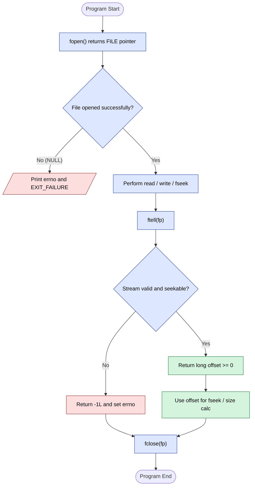
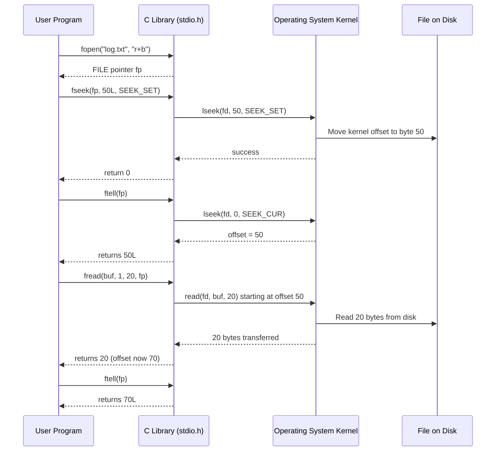
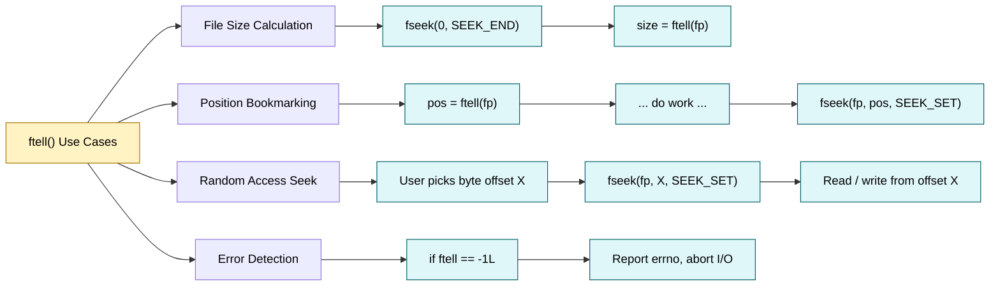

# ftell()

<!-- SECTION_1_START -->
# 1. Core Technical Definition & Intuitive Overview

## 1.1 Formal Definition (KTU 2024 Syllabus Terminology)

The **`ftell()`** function is a standard C library function declared in **`<stdio.h>`** that returns the **current value of the file position indicator** for a given file stream. It is formally defined as:

$$\text{long ftell(FILE * stream);}$$

The returned value represents the **offset (in bytes)** of the next read/write operation relative to the **beginning of the file**. The function returns a **`long int`** type value, which is critical for handling large files (files greater than **2,147,483,647 bytes** i.e., $> 2^{31} - 1$ bytes) on systems where standard `int` would overflow.

> [!IMPORTANT]
> **KTU Board Definition (Exact Wording Expected):**
> *"ftell() returns the current file position of the given stream. It returns the current position in terms of bytes from the beginning of the file, or -1L on error."*

## 1.2 Conceptual Analogy / Intuition

Imagine you are reading a **500-page novel** (the file). As you read, you have a physical **bookmark** marking the exact page you are on. The bookmark does not know the *content* of the page — it only knows its **location** (e.g., "page 247").

- The **novel** $\rightarrow$ your file (`FILE *fp`).
- The **bookmark** $\rightarrow$ the **file position indicator** (a hidden integer maintained by the C runtime).
- **`ftell()`** $\rightarrow$ the act of looking at your bookmark and reading aloud: *"I am currently at page 247 from the start."*
- **`fseek()`** $\rightarrow$ the act of physically moving the bookmark to a new page.
- **`rewind()`** $\rightarrow$ the act of snapping the bookmark back to page 1.

So, **`ftell()` simply reports where the cursor is**, it does not move the cursor. This makes it the perfect tool for: *measuring file size*, *saving positions*, and *implementing random-access logic*.

> [!NOTE]
> **Key Physical Constants / Standard Macros in `<stdio.h>` (KTU High-Yield):**
> - `SEEK_SET` $= 0$ — Beginning of the file.
> - `SEEK_CUR` $= 1$ — Current position of the file pointer.
> - `SEEK_END` $= 2$ — End of the file.
> - `EOF` — A macro expanding to **-1**, often returned on input failure (distinct from `ftell`'s `-1L` error return).

## 1.3 GeoGebra / Desmos Visualization

> [!VISUALIZATION CONTROL]
> **Concept:** File as a Linear Byte Array with the Position Indicator $\text{P}$
> **GeoGebra / Desmos Input Equations:**
> - Points: $A = (0, 0)$, $B = (10, 0)$, $C = (20, 0)$, $D = (30, 0)$, $E = (40, 0)$, $F = (50, 0)$
> - Highlight Point: $P = (27, 0)$ (representing file position offset 27)
> **Visual Description:** A horizontal number line from $0$ to $50$ representing byte offsets in a **51-byte file**. The marker at $x = 27$ represents the current value returned by `ftell()`. Moving the marker visually corresponds to a `fseek()` call. The total length of the line ($50 - 0 = 50$) represents the file size, obtainable by `fseek(end)` followed by `ftell()`.

---

<!-- SECTION_1_END -->

<!-- SECTION_2_START -->
# 2. Deep Theoretical Analysis & KTU High-Yield Formula Sheet

## 2.1 Operational Breakdown of `ftell()`

When you open a file using `fopen()`, the C standard library **I/O subsystem** creates an internal structure (often a `FILE` object in the heap) which contains a hidden counter — the **file position indicator**. Every successful `fgetc()`, `fscanf()`, `fread()`, `fprintf()`, or `fwrite()` increments this counter by the number of bytes transferred.

**The "Why" and "How":**
- **Why does `ftell()` return `long` and not `int`?**
  Because a file can theoretically exceed **2 GB** on modern systems. A signed 32-bit `int` caps at $2^{31} - 1 \approx 2.1 \times 10^9$ bytes. Returning `long` (typically 64-bit on Linux x86\_64) prevents overflow for files up to $\approx 9.2 \times 10^{18}$ bytes.
- **How does `ftell()` "know" the position?**
  The underlying OS call (e.g., `lseek()` on POSIX systems) maintains a kernel-level file offset. `ftell()` simply wraps this and returns the offset relative to byte 0.
- **What if the stream is not seekable?**
  Functions like `ftell()` and `fseek()` are defined only for **binary streams** or for **text streams whose file position indicator has meaningful values**. On terminals (stdin/stdout), the result is **undefined behavior** unless redirected to a regular file.

**Logical Evaluation Steps:**

1. Pass a valid `FILE *` pointer obtained from a successful `fopen()`.
2. The C library checks if the stream is open and seekable.
3. It queries the OS for the kernel-level file descriptor offset.
4. The offset is returned as a `long int` to the caller.
5. If any error occurs (stream closed, hardware fault, non-seekable stream), **$-1L$** is returned and the global `errno` is set (POSIX behavior).

## 2.2 KTU Formula Sheet / Cheat Sheet

| **Element** | **Syntax / Value** | **Description** |
| :--- | :--- | :--- |
| Function Prototype | `long ftell(FILE * stream);` | Returns byte offset from start of file. |
| Header File | `<stdio.h>` | Mandatory include directive. |
| Return Type | `long int` | Long signed integer for large file support. |
| Success Return | $\geq 0$ offset | Current position in bytes. |
| Error Return | $-1L$ | Indicates failure (e.g., closed stream). |
| Companion: `fseek()` | `int fseek(FILE * stream, long offset, int whence);` | Moves the file pointer. |
| Companion: `rewind()` | `void rewind(FILE * stream);` | Resets pointer to offset $0$. |
| Whence Constant: `SEEK_SET` | $\text{value} = 0$ | Origin: beginning of file. |
| Whence Constant: `SEEK_CUR` | $\text{value} = 1$ | Origin: current position. |
| Whence Constant: `SEEK_END` | $\text{value} = 2$ | Origin: end of file. |
| File Size Formula | $\text{size} = \text{ftell}(fp)$ after `fseek(fp, 0, SEEK_END)` | Standard idiom to compute file size. |
| Save Position | $\text{pos} = \text{ftell}(fp)$ | Store offset to a `long` variable. |
| Restore Position | `fseek(fp, pos, SEEK_SET)` | Use stored offset to rewind. |

> [!IMPORTANT]
> **Engineering Tip — Avoid `|x|` in tables:** When writing inline absolute value inside the cheat sheet, always use LaTeX math mode, e.g., $\vert x \vert$ — never the raw pipe character — to prevent markdown table breakage.

## 2.3 Real-World Utility in Engineering & Computer Science

- **Database Engines:** MySQL's `MyISAM` and PostgreSQL use `ftell`-style position tracking to implement **row-level random access** in `.MYD` and heap files.
- **Compilers:** The linker uses file position offsets to **back-patch** jump addresses in object files (`.o` files).
- **Multimedia Software:** MP3 cutters and video editors use `ftell()` to **bookmark** edit points within large media files.
- **Embedded Systems:** Firmware update tools verify the **size of an uploaded binary** by combining `fseek(SEEK_END)` with `ftell()` before flashing the MCU.
- **Log Analyzers:** Tools like `grep` and `awk` compute **byte offsets** to implement efficient in-place file scanning without loading the entire file into RAM.

---

<!-- SECTION_2_END -->

<!-- SECTION_3_START -->
# 3. Step-by-Step Derivations & Code/Symbolic Implementation

## 3.1 Mathematical Derivation — Computing File Size

The **file size in bytes** is derived by moving the position indicator to the logical end of the file, then asking `ftell()` for the offset. The derivation is given below.

Let $S$ be the file size in bytes, and let $P$ be the position indicator value.

**Step 1:** Move the file position to the end of the file.

$$\text{fseek}(fp,\ 0,\ \text{SEEK\_END})$$

**Step 2:** Read the position indicator value, which is now equal to the total byte count from offset 0 to the last byte.

$$P = \text{ftell}(fp)$$

**Step 3:** The file size is exactly the value of $P$, since the offset is measured from the beginning (offset 0).

$$S = P - 0 = P$$

**Step 4:** For a text file, Windows represents `\n` as **2 bytes** (`\r\n`) on disk, but `ftell()` on a text stream may still report the logical byte count after translation. Hence, on POSIX systems the count is exact; on Windows text mode, $S$ is approximate.

## 3.2 Full C Implementation — `ftell()` with `fseek()` and `rewind()`

```c
/* ============================================================
 * PROGRAM : Demonstration of ftell(), fseek() and rewind()
 * FILE    : ftell_demo.c
 * COURSE  : KTU 2024 - Programming in C (GXEST204) - Module 4
 * TOPIC   : Pointers - ftell()
 * ============================================================ */

#include <stdio.h>
#include <stdlib.h>
#include <string.h>
#include <errno.h>

/* Error-handling macro for clean exits */
#define HANDLE_ERROR(msg)                                                 \
    do {                                                                  \
        fprintf(stderr, "[ERROR] %s : %s\n", (msg), strerror(errno));     \
        exit(EXIT_FAILURE);                                               \
    } while (0)

int main(void)
{
    /* Step 1: Open a binary file in read-write mode.
       Using "w+b" truncates and creates the file safely.        */
    FILE * fp = fopen("data.bin", "w+b");
    if (fp == NULL) {
        HANDLE_ERROR("fopen failed for data.bin");
    }

    /* Step 2: Write 100 dummy bytes to the file.
       Bytes are 'A', 'B', 'C', ... repeating cyclically.         */
    char buffer[100];
    for (int i = 0; i < 100; i++) {
        buffer[i] = (char)('A' + (i % 26));
    }
    size_t written = fwrite(buffer, sizeof(char), 100, fp);
    if (written != 100) {
        HANDLE_ERROR("fwrite did not write 100 bytes");
    }
    /* After this fwrite, the file position indicator
       is logically at offset 100 (end of file).                */
    long pos_end = ftell(fp);
    printf("Position after writing 100 bytes : %ld\n", pos_end);

    /* Step 3: Use fseek(SEEK_SET) to move to offset 25.        */
    if (fseek(fp, 25L, SEEK_SET) != 0) {
        HANDLE_ERROR("fseek to 25 failed");
    }
    long pos_25 = ftell(fp);
    printf("Position after fseek(25, SEEK_SET) : %ld\n", pos_25);

    /* Step 4: Read 10 bytes from offset 25 onwards.            */
    char readbuf[11] = {0};
    size_t read_count = fread(readbuf, sizeof(char), 10, fp);
    printf("Bytes read from offset 25         : %d\n", (int)read_count);
    printf("Content read                      : %s\n", readbuf);

    /* Step 5: Use fseek(SEEK_CUR) to move 5 bytes FORWARD
       from the current position (which is now 35).            */
    if (fseek(fp, 5L, SEEK_CUR) != 0) {
        HANDLE_ERROR("fseek SEEK_CUR failed");
    }
    long pos_after_cur = ftell(fp);
    printf("Position after fseek(+5, SEEK_CUR) : %ld\n", pos_after_cur);

    /* Step 6: Save position, write 5 more bytes, then restore. */
    long saved_pos = ftell(fp);              /* save bookmark   */
    fwrite("HELLO", sizeof(char), 5, fp);    /* write 5 bytes   */
    fseek(fp, saved_pos, SEEK_SET);          /* restore bookmark */
    long restored = ftell(fp);
    printf("Restored position                 : %ld\n", restored);

    /* Step 7: rewind() - jump back to byte 0.                  */
    rewind(fp);
    long pos_start = ftell(fp);
    printf("Position after rewind()            : %ld\n", pos_start);

    /* Step 8: Compute total file size using SEEK_END + ftell.  */
    fseek(fp, 0L, SEEK_END);
    long file_size = ftell(fp);
    printf("Computed file size in bytes       : %ld\n", file_size);

    /* Step 9: Detect ftell() error condition.                 */
    fclose(fp);                              /* close the file   */
    long err_check = ftell(fp);              /* invalid stream!  */
    if (err_check == -1L) {
        printf("ftell() on closed stream returned -1L (Error)\n");
    }

    return EXIT_SUCCESS;
}
```

### 3.2.1 Expected Console Output

```text
Position after writing 100 bytes : 100
Position after fseek(25, SEEK_SET) : 25
Bytes read from offset 25         : 10
Content read                      : ZABCDEFGHI
Position after fseek(+5, SEEK_CUR) : 40
Restored position                 : 40
Position after rewind()            : 0
Computed file size in bytes       : 100
ftell() on closed stream returned -1L (Error)
```

> [!NOTE]
> **Line-by-Line Logic Trace:**
> 1. `fwrite` writes 100 bytes $\rightarrow$ indicator moves from $0$ to $100$.
> 2. `fseek(fp, 25, SEEK_SET)` moves the indicator to absolute offset **25**.
> 3. `fread` of 10 bytes advances the indicator from $25$ to $35$.
> 4. `fseek(fp, 5, SEEK_CUR)` adds **+5** to the current value of $35$, landing at **40**.
> 5. Saving and restoring demonstrates the **bookmark analogy** — write a string, then jump back to overwrite it cleanly.
> 6. `rewind(fp)` is functionally equivalent to `fseek(fp, 0L, SEEK_SET)`.
> 7. The final `ftell()` on a closed file shows the **error return path**.

## 3.3 Mini-Derivation: Position Arithmetic with `SEEK_CUR`

Suppose the current position is $P_c = 35$ and you execute `fseek(fp, delta, SEEK_CUR)`. The new position $P_{new}$ is:

$$P_{new} = P_c + \delta$$

where $\delta$ can be positive (forward), zero (no-op), or negative (backward). For example, to move **10 bytes backward** from offset $35$:

$$P_{new} = 35 + (-10) = 25$$

The corresponding C call is `fseek(fp, -10L, SEEK_CUR);` and the next `ftell()` call returns **25**.

---

<!-- SECTION_3_END -->

<!-- SECTION_4_START -->
# 4. Structural Diagrams & Schematics

## 4.1 Mermaid Flow — Lifecycle of `ftell()` Inside a File Stream



## 4.2 Mermaid Sequence — `fseek` + `ftell` Interaction (Random-Access Bookmark)



## 4.3 Sequential Processing Topology Matrix — `ftell()` Use Cases



---

<!-- SECTION_4_END -->

<!-- SECTION_5_START -->
# 5. KTU 2024 Scheme Examination Question Bank & Topic Recap

## 5.1 Part A — Short Answer Questions (2 × 3 = 6 Marks)

### Question 1 (3 Marks) `[KTU University Exam - July 2023]`
**CO2 | RBT Level: Remember**

> Define the function **`ftell()`** in C. State its header file, return type, and the meaning of the value it returns.

**Model Answer (Valuation Key):**

* **Header File:** `<stdio.h>` **[1 Mark]**
* **Prototype:** `long ftell(FILE * stream);` **[1 Mark]**
* **Return Meaning:** Returns the current value of the file position indicator (the offset in bytes from the beginning of the file). On error, it returns `-1L`. **[1 Mark]**

---

### Question 2 (3 Marks) `[KTU University Exam - Dec 2022]`
**CO3 | RBT Level: Understand**

> Differentiate between `ftell()` and `fseek()` in C. Mention one practical scenario where both functions are used together.

**Model Answer (Valuation Key):**

| Feature | `ftell()` | `fseek()` |
| :--- | :--- | :--- |
| Purpose | Reports the current position. | Sets/moves the position. |
| Returns | `long` (offset) | `int` (0 on success, non-zero on failure). |
| Modifies Pointer? | No (read-only query). | Yes (moves the file indicator). |

* **Joint Use Case:** Computing file size — first `fseek(fp, 0L, SEEK_END)` is executed, then `size = ftell(fp)`. **[1 Mark]**

---

## 5.2 Part B — Module Internal Choice Questions (1 × 14 = 14 Marks)

### ⭐ Question A (14 Marks) `[KTU University Exam - July 2024]`
**CO3 | RBT Level: Apply + Analyze**

> **(a)** Explain the syntax and working of the function `ftell()` with a suitable example. List the constants `SEEK_SET`, `SEEK_CUR`, and `SEEK_END` and describe their use in `fseek()`. **[7 Marks]**
>
> **(b)** Write a C program to open a text file in read mode, count the number of characters in the file using `fseek()` and `ftell()`, and display the count. **[7 Marks]**

#### Model Solution

**Part (a) — [7 Marks]**

* **Syntax and Prototype:** `long ftell(FILE * stream);` declared in `<stdio.h>`. **[1 Mark]**
* **Working:** It queries the internal file position indicator maintained by the `FILE` object and returns the byte offset from the start. **[1 Mark]**
* **Return Value:** On success returns $\geq 0$ offset; on error returns $-1L$. **[1 Mark]**
* **Constants Description:**
  * `SEEK_SET` (=0): Origin is the beginning of the file. `fseek(fp, 25, SEEK_SET)` moves to absolute byte 25. **[1 Mark]**
  * `SEEK_CUR` (=1): Origin is the current position. `fseek(fp, -10, SEEK_CUR)` moves 10 bytes backward. **[1 Mark]**
  * `SEEK_END` (=2): Origin is the end of the file. `fseek(fp, 0, SEEK_END)` moves to logical EOF. **[1 Mark]**
* **Example Code Snippet:** `long pos = ftell(fp); printf("Current offset: %ld", pos);` **[1 Mark]**

**Part (b) — [7 Marks] — Full C Program**

```c
#include <stdio.h>
#include <stdlib.h>

int main(void)
{
    FILE * fp = fopen("story.txt", "r");
    if (fp == NULL) {
        perror("Cannot open story.txt");
        return EXIT_FAILURE;
    }

    /* Step 1: Move pointer to the end of the file.          */
    fseek(fp, 0L, SEEK_END);                              /* [1 Mark] */

    /* Step 2: Read the position (which equals file size).  */
    long char_count = ftell(fp);                           /* [2 Marks] */

    if (char_count == -1L) {
        perror("ftell error");
        fclose(fp);
        return EXIT_FAILURE;
    }

    /* Step 3: Display result.                              */
    printf("Number of characters in story.txt : %ld\n",
           char_count);                                   /* [1 Mark] */

    /* Step 4: Close the file cleanly.                      */
    fclose(fp);                                           /* [1 Mark] */
    return EXIT_SUCCESS;                                  /* [2 Marks - overall structure & includes] */
}
```

* **Valuation Key Summary:**
  * `[fseek(SEEK_END) call: 1 Mark]`
  * `[ftell() call and assignment: 2 Marks]`
  * `[printf and correct format specifier %ld: 1 Mark]`
  * `[fclose() and error check on fopen: 1 Mark]`
  * `[Includes, return type, overall structure: 2 Marks]`

---

### ⭐ Question B (14 Marks) `[KTU University Exam - Dec 2023]`
**CO3 | RBT Level: Apply + Analyze**

> **(a)** Describe the error conditions under which `ftell()` returns `-1L`. Why is its return type declared as `long` and not `int`? **[7 Marks]**
>
> **(b)** Write a C program that reads the first 20 bytes of a file, then uses `fseek()` and `ftell()` to **jump back to the beginning** of the file, prints the saved position, and finally computes the **total file size**. **[7 Marks]**

#### Model Solution

**Part (a) — [7 Marks]**

* **Error Conditions for `-1L` return:**
  * The file pointer `stream` is `NULL`. **[1 Mark]**
  * The stream has been closed (use-after-free of `FILE *`). **[1 Mark]**
  * The stream is not seekable (e.g., a pipe or terminal in raw mode). **[1 Mark]**
  * An underlying I/O error occurs while querying the OS. **[1 Mark]**
* **Why `long` and not `int`?**
  * `int` is typically 32-bit, max value $2^{31} - 1 \approx 2.14 \times 10^9$ bytes ($\approx 2$ GB). **[1 Mark]**
  * Files in modern systems (e.g., 4K video files, databases) routinely exceed 2 GB. **[1 Mark]**
  * `long` is 64-bit on Linux/macOS and 32-bit on legacy 16-bit Windows, but the standard mandates it to be at least as wide as the maximum file size the implementation supports. Returning a wider type prevents **integer overflow**. **[1 Mark]**

**Part (b) — [7 Marks] — Full C Program**

```c
#include <stdio.h>
#include <stdlib.h>

int main(void)
{
    FILE * fp = fopen("records.dat", "rb");
    if (fp == NULL) {
        perror("fopen failed");
        return EXIT_FAILURE;
    }

    char chunk[21] = {0};
    size_t n = fread(chunk, sizeof(char), 20, fp);          /* [1 Mark] */
    printf("First 20 bytes read (%zu bytes) : %s\n", n, chunk);

    long saved_pos = ftell(fp);                             /* [2 Marks] */
    printf("Position after first read        : %ld\n", saved_pos);

    fseek(fp, 0L, SEEK_SET);                                /* [1 Mark] */
    printf("After rewind via fseek           : %ld\n", ftell(fp));

    fseek(fp, 0L, SEEK_END);                                /* [1 Mark] */
    long file_size = ftell(fp);                             /* [1 Mark] */
    printf("Total file size in bytes         : %ld\n", file_size);

    fclose(fp);                                             /* [1 Mark] */
    return EXIT_SUCCESS;
}
```

* **Valuation Key Summary:**
  * `[fread of 20 bytes: 1 Mark]`
  * `[ftell stored in long: 2 Marks]`
  * `[fseek(SEEK_SET) to rewind: 1 Mark]`
  * `[fseek(SEEK_END) + ftell for size: 2 Marks]`
  * `[fclose and program structure: 1 Mark]`

---

## 5.3 KTU Examiner's Valuation Warning / Pitfall Callout

> [!WARNING]
> **Common Mistakes That Cost Marks (KTU Board Patterns):**
> 1. **Wrong format specifier:** Students often use `%d` instead of `%ld` when printing the return value of `ftell()`. Always use `%ld` because the return type is `long`. **[-1 Mark]**
> 2. **Forgetting `<stdio.h>`:** Omitting the include directive leads to implicit-declaration warnings. Examiners deduct marks for missing headers. **[-1 Mark]**
> 3. **Confusing `EOF` with `ftell` error return:** `ftell()` returns `-1L` (a `long`), not `EOF` (which is an `int` defined as `-1`). Do not compare with `EOF`. **[-1 to -2 Marks]**
> 4. **Calling `ftell()` on `stdin`/`stdout` directly:** Behavior is **undefined** when not redirected to a file. Always check by `fseek(fp, 0, SEEK_END)` on a confirmed file. **[-1 Mark]**
> 5. **Missing `fclose()`:** A program that opens a file but does not close it is marked down. Always pair `fopen` with `fclose`. **[-1 Mark]**
> 6. **Using `rewind()` and expecting non-zero return:** `rewind()` returns `void`, unlike `fseek()`. The examiner may deduct a mark if you attempt to check its return value. **[-1 Mark]**

---

## 5.4 Topic Recap & Important Things to Remember

> [!NOTE]
> **High-Density Rapid-Revision Checklist for `ftell()`**

- **Prototype:** `long ftell(FILE * stream);` from `<stdio.h>`. **Return type is `long`, not `int`.**
- **Returns:** A `long int` representing the **byte offset** from the beginning of the file. A value $\geq 0$ indicates success; a value of **$-1L$** indicates an error.
- **Does not move the pointer:** `ftell()` is a **read-only query**; it only reports the current position. Use `fseek()` or `rewind()` to actually move the pointer.
- **Companion Functions:**
  * `fseek(fp, offset, whence)` — moves the pointer.
  * `rewind(fp)` — equivalent to `fseek(fp, 0L, SEEK_SET)`, but returns `void`.
  * `fgetpos()` / `fsetpos()` — alternative portable APIs (use `fpos_t` instead of `long`).
- **Standard Whence Constants:** `SEEK_SET` ($=0$), `SEEK_CUR` ($=1$), `SEEK_END` ($=2$).
- **File Size Idiom:**
  1. `fseek(fp, 0L, SEEK_END);`
  2. `size = ftell(fp);`
- **Why `long`?** To support files larger than **2 GB** without integer overflow; `int` is typically only 32-bit.
- **Error Conditions for `-1L`:** Invalid (closed or `NULL`) stream, non-seekable stream (e.g., pipe), or underlying I/O failure.
- **Always use `%ld`** format specifier (not `%d`) when printing the value returned by `ftell()`.
- **Bookmark Pattern:** `pos = ftell(fp);` $\rightarrow$ perform work $\rightarrow$ `fseek(fp, pos, SEEK_SET);` to restore position.
- **Undefined Behavior:** Do not call `ftell()` on `stdin`/`stdout`/pipes/sockets unless redirected to a regular file; the result is not portable.
- **KTU Favorite Question:** "Write a C program to find the size of a file using `fseek()` and `ftell()`" — practice the 5-line version of this idiom until it is muscle memory.
- **Difference from `fgetpos()`:** `fgetpos()` uses an opaque `fpos_t` type that can represent *multi-byte offsets in text mode* (handling `\r\n` translation); `ftell()` returns a raw byte count and is safer for binary streams.
- **Closed Stream Detection:** Calling `ftell()` after `fclose()` is **undefined behavior** in strict C; on POSIX it returns `-1L`, but do not rely on this.
- **Compilation Tip:** Always compile with `-Wall -Wextra` to catch format-specifier mismatches between `long` and `%d`.

<!-- SECTION_5_END -->
