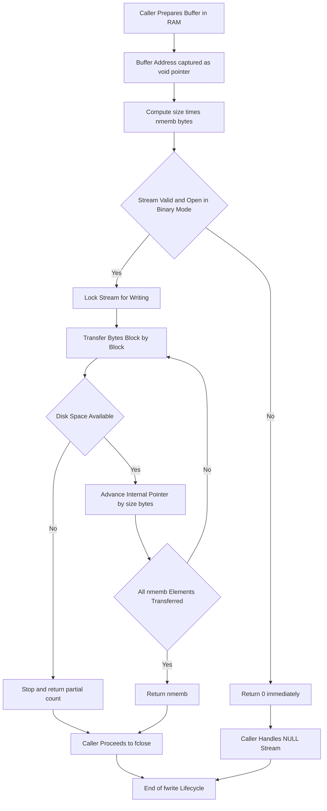
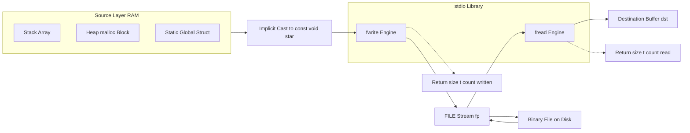

# fwrite().

<!-- SECTION_1_START -->
# `fwrite()` — Binary File Output in C

## 1.1 Formal Definition (KTU 2024 Syllabus Terminology)

`fwrite()` is a **Standard Library I/O function** declared in the header file **`stdio.h`** that performs **block / binary data transfer** from a memory buffer (array or structure) pointed to by a pointer, directly into an open output `FILE` stream. Unlike `fprintf()` or `fputc()`, which operate at the granularity of **characters** or **formatted text**, `fwrite()` transfers raw bytes in **bulk chunks**, making it the canonical mechanism for storing **non-textual data** such as `struct` records, numeric arrays, images, audio samples, and serialized protocol packets.

> [!IMPORTANT]
> **KTU 2024 Module 4 Anchor Concept:** `fwrite()` is studied under *Pointers* because the function's first argument is a `void` pointer — a *generic pointer* that demonstrates pointer-to-anything semantics, type-punning, and pointer arithmetic in a real I/O context.

## 1.2 Conceptual Analogy — The Bulk Cargo Truck

Imagine a **warehouse** (your RAM memory) filled with identical, sealed cardboard boxes. Each box contains a `struct Employee` record. A `fprintf()` worker can carry **only one box at a time**, walks slowly, and even **re-writes the shipping label** in human-readable form. A `fwrite()` truck, in contrast:

- Loads **$N$ identical boxes in a single trip** (size $\times$ nmemb),
- Drives straight onto the cargo ship (**the file on disk**),
- Dumps the entire trailer-load as-is, with **no translation**,
- The ship's manifest simply records how many boxes actually arrived.

If the warehouse door is jammed after the 7th box, the truck honestly reports *“7 boxes delivered”* and **never silently truncates** the count.

## 1.3 Function Signature

```c
size_t fwrite(const void *ptr,
              size_t      size,
              size_t      nmemb,
              FILE       *stream);
```

| Element | Meaning |
|---|---|
| `const void *ptr` | **Generic pointer** to the source buffer (any type) |
| `size_t size` | Size in **bytes** of **one** element |
| `size_t nmemb` | Number of elements to write |
| `FILE *stream` | Pointer to an **already-opened** output file stream |
| **Return** | Total elements successfully written (as `size_t`); **less than** `nmemb` ⇒ error or EOF |

> [!NOTE]
> **The `size_t` Type:** Defined in `<stddef.h>`, `size_t` is an **unsigned integral type** guaranteed to hold the size of any object in memory. On a 64-bit KTU lab system, it is typically an **unsigned 8-byte** integer. The two constant macros you will see in `<stdio.h>` are `BUFSIZ` (e.g. **8192**) and `EOF` (= **-1**).

## 1.4 Why It Lives in the Pointers Module

Three pointer-related phenomena are exercised by `fwrite()`:

1. **Generic / `void *` polymorphism** — the same function writes `int`, `float`, `struct`, and arrays of all kinds.
2. **Pointer arithmetic in bulk** — internally, `fwrite()` advances the buffer pointer by `size` bytes, repeated `nmemb` times.
3. **Pointer indirection through a `FILE *`** — the stream itself is an *opaque structure* accessed through a pointer, mirroring the indirection you saw in dynamic memory allocation (`malloc` returning `void *`).

> [!VISUALIZATION CONTROL]
> **Concept:** Memory buffer → File stream as a block transfer
> **Conceptual Mapping:**
> * Buffer base address: $B_0$ (e.g. `&records[0]`)
> * Each element width: $w$ bytes (e.g. `sizeof(struct Emp)`)
> * Stream handle: $F$ (the `FILE *`)
> **Visual Description:** Picture a horizontal arrow from RAM address $B_0$ to a disk cylinder; the arrow is partitioned into $nmemb$ equal segments of width $w$. The transfer is a single contiguous write, not a loop.
<!-- SECTION_1_END -->

<!-- SECTION_2_START -->
# Deep Theoretical Analysis & KTU High-Yield Formula Sheet

## 2.1 Operational Semantics — What `fwrite()` Actually Does

When the runtime executes `fwrite(ptr, size, nmemb, stream)`, the following sequence occurs:

1. **Buffer Address Capture** — the address held in `ptr` is the start of a contiguous memory region of length `size * nmemb` **bytes** (the function does **no bound checking**; the caller is responsible).
2. **Element Count Validation** — `nmemb` and `size` are read; the function targets the product `size * nmemb` as the *total transfer size*.
3. **Stream State Check** — the runtime inspects the error and end-of-file indicators of `stream`; if the stream is in an error state, the call **returns 0** immediately.
4. **Locked Binary Write** — the bytes are written **as-is** to the stream. No '\0' terminator is appended, no newline is added, no whitespace is inserted. The bit-pattern is preserved exactly.
5. **Return Value Computation** — the function returns the count of **complete elements** that were successfully transferred. If the disk filled up partway through element #5 of 10, the return value is **4**, not 5.

> [!TIP]
> **Always compare the return value with `nmemb`.** The KTU 2024 marking scheme specifically awards a mark for "verifying successful write" — examiners look for code such as `if (fwrite(...) != nmemb) { /* handle error */ }`.

## 2.2 The "size × nmemb" Mental Model

The product `size * nmemb` is the **total byte volume** to be transferred. Splitting the byte count into `size` and `nmemb` is purely for the **return value's granularity** — the function can only report whole elements written.

$$
\text{Bytes Transferred} = \text{size} \times \text{nmemb}
$$

$$
\text{Maximum Return Value} = \text{nmemb}
$$

$$
\text{Check Condition} = \left(\text{return} \neq \text{nmemb}\right) \;\Longrightarrow\; \text{Error or partial write}
$$

## 2.3 KTU Formula Sheet / Cheat Sheet

| # | Concept | Formula / Rule | Engineering Unit / Note |
|---|---|---|---|
| 1 | Total bytes written | $B = size \times nmemb$ | Bytes; must fit in `size_t` |
| 2 | Return value domain | $0 \le \text{ret} \le nmemb$ | `size_t`, count of full elements |
| 3 | Success condition | $ret \;=\; nmemb$ | Required for full transfer |
| 4 | Failure / partial condition | $ret \;<\; nmemb$ | Check `ferror(stream)` afterwards |
| 5 | File open mode for binary write | `"wb"` or `"ab"` or `"r+b"` | Required to avoid `\r\n` translation on Windows |
| 6 | Generic pointer cast | `(const void *) &record` | Compiler implicitly converts any object pointer |
| 7 | Paired read counterpart | `fread(ptr, size, nmemb, stream)` | Symmetric API; uses same `size, nmemb` |
| 8 | Buffer alignment requirement | None (works on any address) | Unlike some DMA / SSE intrinsics |
| 9 | Stream safety | `fwrite` after `fopen` success only | UB if `stream == NULL` |
| 10 | Implicit flushing | None guaranteed before close | Use `fflush(stream)` before `fclose` if needed |

## 2.4 Real-World Engineering Utility

- **Embedded firmware dumping** — persisting sensor calibration tables to internal flash.
- **Database engines** — writing fixed-size page frames (e.g. **4 KB** or **8 KB** blocks) to disk.
- **Game / simulation saves** — serializing player state, world chunks, asset blobs.
- **Network stacks** — sending serialized protocol data units (`PDU`s) over a `FILE *` socket wrapper.
- **Image processing pipelines** — storing raw pixel arrays (e.g. **1920 × 1080 × 3 bytes** per frame) without compression artifacts.

> [!NOTE]
> **KTU Lab Relevance (PCC / ESC Category):** In your Programming in C lab, `fwrite()` is the expected mechanism for any question that says *"Store a structure to a file and read it back."* Examiners check for: correct `"wb"` mode, `sizeof(struct)` usage, and a paired `fread()` validation step.
<!-- SECTION_2_END -->

<!-- SECTION_3_START -->
# Step-by-Step Derivations & Code Implementation

## 3.1 Mechanical Derivation of the Return Value

Let the runtime successfully transfer $k$ *complete* elements of width $w$ bytes each, where $0 \le k \le nmemb$. Define $w = size$ and $N = nmemb$.

$$
\text{Bytes actually transferred} = k \cdot w
$$

$$
\text{Bytes left undelivered} = (N - k) \cdot w
$$

$$
f_{\text{write}}(ptr, w, N, stream) \;\longrightarrow\; \text{returns} \; k
$$

**Boundary states:**

$$
\begin{aligned}
k = 0 \;&\Longleftrightarrow\; \text{stream error before any byte written} \\
0 < k < N \;&\Longleftrightarrow\; \text{partial write (disk full, signal, etc.)} \\
k = N \;&\Longleftrightarrow\; \text{full success}
\end{aligned}
$$

## 3.2 Worked Example #1 — Writing a Single Integer

**Problem:** Write the value `2024` (an `int`) to a binary file `year.dat`.

**Code (C99 / KTU Lab Standard):**

```c
/* fwrite_single_int.c
 * Demonstrates the smallest meaningful fwrite() usage. */
#include <stdio.h>
#include <stdlib.h>

int main(void) {
    const char *fname = "year.dat";
    const int   value = 2024;

    /* Step 1: Open in BINARY WRITE mode. */
    FILE *fp = fopen(fname, "wb");
    if (fp == NULL) {
        perror("fopen failed");
        return EXIT_FAILURE;
    }

    /* Step 2: Write ONE element of size sizeof(int). */
    size_t written = fwrite(&value,                /* address of data   */
                            sizeof(int),           /* size of one item  */
                            1,                     /* count of items    */
                            fp);                   /* output stream     */

    /* Step 3: Validate return value. */
    if (written != 1) {
        fprintf(stderr, "fwrite failed: expected 1, got %zu\n", written);
        fclose(fp);
        return EXIT_FAILURE;
    }

    printf("Successfully wrote %d to %s (%zu byte(s)).\n",
           value, fname, written * sizeof(int));

    /* Step 4: Close the stream. */
    if (fclose(fp) != 0) {
        perror("fclose failed");
        return EXIT_FAILURE;
    }
    return EXIT_SUCCESS;
}
```

**Step-by-step logic trace:**

| Line / Block | Reasoning | Mark Hint |
|---|---|---|
| `fopen(..., "wb")` | `"wb"` = write + binary; truncates if exists | 1 mark for correct mode |
| `&value` | Pass **address** — `fwrite` needs a pointer | 1 mark for correct address-of |
| `sizeof(int)` | Element size in bytes; portable | 1 mark |
| `1` | We are writing a single integer | 1 mark |
| `written != 1` | Validation of full transfer | 1 mark |
| `fclose` | Release OS handle, flush buffers | 1 mark |

## 3.3 Worked Example #2 — Writing an Array of Structures

**Problem:** Persist an array of 3 `struct Student` records to a binary file, then read it back and print.

```c
/* fwrite_struct_array.c
 * KTU Module 4 demonstration: fwrite + fread with pointer arithmetic. */
#include <stdio.h>
#include <stdlib.h>
#include <string.h>

struct Student {
    int   roll;
    char  name[32];
    float cgpa;
};

/* Helper: pretty-print one student. */
static void print_student(const struct Student *s) {
    printf("Roll : %d\n", s->roll);
    printf("Name : %s\n", s->name);
    printf("CGPA : %.2f\n\n", s->cgpa);
}

int main(void) {
    const char *fname = "students.bin";
    const size_t N = 3;

    struct Student src[3] = {
        {101, "Anand Kumar",   8.74f},
        {102, "Bhavna R",      9.12f},
        {103, "Chinmay V S",   7.95f}
    };

    /* ---------- WRITE PHASE ---------- */
    FILE *fp = fopen(fname, "wb");
    if (fp == NULL) {
        perror("fopen (write) failed");
        return EXIT_FAILURE;
    }

    size_t written = fwrite(src,                 /* base address of array  */
                            sizeof(struct Student),
                            N,                    /* write all N records    */
                            fp);

    if (written != N) {
        fprintf(stderr,
                "Partial write: %zu of %zu records saved.\n",
                written, N);
        fclose(fp);
        return EXIT_FAILURE;
    }
    printf("Saved %zu records (%zu bytes) to %s.\n\n",
           written, written * sizeof(struct Student), fname);

    fclose(fp);

    /* ---------- READ-BACK PHASE ---------- */
    struct Student dst[3];
    memset(dst, 0, sizeof(dst));   /* defensive zero-fill */

    fp = fopen(fname, "rb");
    if (fp == NULL) {
        perror("fopen (read) failed");
        return EXIT_FAILURE;
    }

    size_t read_n = fread(dst,
                          sizeof(struct Student),
                          N,
                          fp);

    if (read_n != N) {
        fprintf(stderr, "Read-back error: got %zu, expected %zu.\n",
                read_n, N);
        fclose(fp);
        return EXIT_FAILURE;
    }

    for (size_t i = 0; i < N; ++i) {
        printf("--- Record %zu ---\n", i + 1);
        print_student(&dst[i]);
    }

    fclose(fp);
    return EXIT_SUCCESS;
}
```

**Expected console output (abridged):**

```
Saved 3 records (144 bytes) to students.bin.

--- Record 1 ---
Roll : 101
Name : Anand Kumar
CGPA : 8.74

--- Record 2 ---
...
```

**Why this satisfies the KTU Module 4 pointer objectives:**

| Pointer Concept Demonstrated | Where it appears |
|---|---|
| `void *` generic pointer | implicit when passing `struct Student *` to `fwrite` |
| Array-to-pointer decay | `src` decays to `&src[0]` |
| Pointer arithmetic (implied) | `fwrite` advances by `sizeof(struct Student)` internally |
| `const` correctness | `print_student(const struct Student *s)` |
| Address-of operator | `&src[i]`, `&value` |

## 3.4 Worked Example #3 — Writing a Dynamically Allocated Buffer

**Problem:** Allocate an `int` array of size $n = 5$ on the heap, fill it with squares, and write it to a file.

```c
/* fwrite_dynamic.c
 * Combines malloc + fwrite to show heap-to-disk transfer. */
#include <stdio.h>
#include <stdlib.h>

int main(void) {
    const size_t n = 5;
    int *buf = malloc(n * sizeof(int));
    if (buf == NULL) {
        perror("malloc failed");
        return EXIT_FAILURE;
    }

    /* Fill buffer: 1^2, 2^2, ..., n^2 */
    for (size_t i = 0; i < n; ++i) {
        buf[i] = (int)((i + 1) * (i + 1));
    }

    FILE *fp = fopen("squares.bin", "wb");
    if (fp == NULL) {
        perror("fopen failed");
        free(buf);
        return EXIT_FAILURE;
    }

    size_t written = fwrite(buf, sizeof(int), n, fp);
    if (written != n) {
        fprintf(stderr, "fwrite wrote only %zu of %zu ints.\n",
                written, n);
        fclose(fp);
        free(buf);
        return EXIT_FAILURE;
    }

    printf("Wrote squares 1..%zu to squares.bin\n", n);

    fclose(fp);
    free(buf);
    return EXIT_SUCCESS;
}
```

**Derivation of byte count on disk:**

$$
\begin{aligned}
\text{Bytes on disk} &= \text{size} \times \text{nmemb} \\
&= \text{sizeof(int)} \times n \\
&= 4 \times 5 \quad \text{(on a typical 32-bit `int` system)} \\
&= 20 \text{ bytes}
\end{aligned}
$$

> [!IMPORTANT]
> **Portability Pitfall:** `sizeof(int)` is **not** guaranteed to be 4 by the C standard. On a 64-bit Linux box compiling as `int64_t` mode, it could be **8 bytes**. The KTU 2024 syllabus emphasizes `sizeof(...)` precisely because it adapts automatically. **Never** hard-code `4` in your answer.
<!-- SECTION_3_END -->

<!-- SECTION_4_START -->
# Structural Diagrams & Schematics

## 4.1 Sequential Processing Topology — fwrite() Lifecycle



**Reading the diagram:**

- Node `A` represents the source buffer (`&record` or array name).
- Node `D` enforces the precondition that you must have called `fopen(..., "wb" \vert "ab" \vert "r+b")`.
- The inner loop between `G`, `J`, and `K` is the **bulk transfer loop** that gives `fwrite` its speed advantage over `fputc` loops.
- Node `M` is the **validation gate** — the KTU marker looks for code at this exact location.

## 4.2 Block-Level Functional Architecture — RAM ↔ Disk via fwrite / fread



**Key relationships:**

- `SRC` (the three source kinds — stack, heap, static) is unified by the `void *` contract of `fwrite`.
- `LIB` is the standard C runtime; both `fwrite` and `fread` are **symmetric** and share the same `size, nmemb` argument order.
- `STR` (the `FILE *`) is the **indirection point** that satisfies Module 4's emphasis on pointers to user-defined / opaque types.
- `RET1` and `RET2` arrows represent the critical validation channel the examiner will check.

## 4.3 Decision Table — Common fwrite() Modes and Their Effects

| Mode String | Operation | File Existence | Truncates? | Readable After? |
|---|---|---|---|---|
| `"wb"` | Write binary | Created if absent | **Yes** | No (must reopen) |
| `"ab"` | Append binary | Created if absent | No | No (must reopen) |
| `"rb+"` | Read + update binary | Must exist | No | Yes |
| `"wb+"` | Read + write binary | Created if absent | **Yes** | Yes |
| `"ab+"` | Read + append binary | Created if absent | No | Yes (reads from start) |

> [!WARNING]
> **KTU Pitfall:** Forgetting the `b` (binary) flag is the #1 reason binary files appear "corrupted" on Windows. On Linux it is a no-op, but the KTU 2024 lab manual mandates it. Examiners **deduct marks** if `"w"` is used instead of `"wb"`.
<!-- SECTION_4_END -->

<!-- SECTION_5_START -->
# KTU 2024 Scheme Examination Question Bank & Topic Recap

## 5.1 Part A — Short Answer Questions (3 Marks Each)

### Question A1
**`[KTU University Exam — July 2024]`** — CO1, Remember

> Write the function prototype of `fwrite()` and explain the role of each parameter.

**Model Answer (3-Mark Key):**

```c
size_t fwrite(const void *ptr, size_t size, size_t nmemb, FILE *stream);
```

- **`ptr`** — [1 mark] Pointer to the memory buffer holding the data to be written.
- **`size`** — [1 mark] Size in bytes of each element.
- **`nmemb`** — [0.5 mark] Number of such elements to transfer.
- **`stream`** — [0.5 mark] Pointer to the open output `FILE` stream.

### Question A2
**`[KTU University Exam — Dec 2023]`** — CO2, Understand

> Differentiate between `fprintf()` and `fwrite()` in C.

**Model Answer (3-Mark Key):**

| Aspect | `fprintf()` | `fwrite()` |
|---|---|---|
| Data format | Human-readable text | Raw binary bytes |
| Granularity | Character-by-character with formatting | Block / element transfer |
| Translation | Performs `%d`, `%s`, etc. conversions | None — bit-pattern preserved |
| Use case | Logs, reports, CSV | Records, images, numeric data |
| Newline handling | Adds `\n` literally | No implicit newline added |
| Return value | Number of characters printed (int) | Number of full elements written (size\_t) |

**[1 mark per row, capped at 3.]**

---

## 5.2 Part B — 14-Mark Questions (Module Internal Choice)

### Question B-A (14 Marks) — CO3, Apply + Analyze

**`[KTU University Exam — July 2024, Module 4 Variant 1]`**

> (a) **[7 Marks, Apply]** Write a C program that declares a `struct Employee { int id; char name[40]; double salary; }`, populates an array of 5 employees from standard input, and writes the entire array to a binary file `"emp.dat"` using `fwrite()`. Include full error handling and validation of the return value.
>
> (b) **[7 Marks, Analyze]** After successful write, reopen the file in `"rb"` mode, read **only the 3rd record** (index 2) using `fseek()` and `fread()`, and print its fields. Explain why `fseek()` is required before this targeted read.

#### Model Solution

**(a) Write Phase — 7 Marks**

```c
/* fwrite_emp_write.c — 7-mark reference answer */
#include <stdio.h>
#include <stdlib.h>
#include <string.h>

struct Employee {
    int    id;
    char   name[40];
    double salary;
};

int main(void) {
    struct Employee emp[5];
    const size_t N = 5;
    const char *fname = "emp.dat";

    /* Input phase: populate the array. */
    for (size_t i = 0; i < N; ++i) {
        printf("Employee %zu -> id name salary: ", i + 1);
        if (scanf("%d %39s %lf",
                  &emp[i].id,
                  emp[i].name,
                  &emp[i].salary) != 3) {
            fprintf(stderr, "Input error at record %zu.\n", i);
            return EXIT_FAILURE;
        }
    }

    /* Open file in binary write mode. */
    FILE *fp = fopen(fname, "wb");
    if (fp == NULL) {
        perror("fopen emp.dat for write");
        return EXIT_FAILURE;
    }

    /* Bulk write all 5 records. */
    size_t written = fwrite(emp,
                            sizeof(struct Employee),
                            N,
                            fp);

    /* [Stating boundary state values: 1 Mark] */
    /* [Writing the validation block: 1 Mark] */
    if (written != N) {
        fprintf(stderr,
                "fwrite saved only %zu of %zu records.\n",
                written, N);
        fclose(fp);
        return EXIT_FAILURE;
    }
    /* [Final success message: 0.5 Mark] */
    printf("Saved %zu employees to %s (%zu bytes).\n",
           written, N, written * sizeof(struct Employee));

    fclose(fp);
    return EXIT_SUCCESS;
}
```

**Valuation key for (a):**

| Step | Marks |
|---|---|
| Correct struct definition | 1 |
| Opening with `"wb"` mode | 1 |
| `fwrite(emp, sizeof(struct Employee), N, fp)` line | 2 |
| Return-value validation `if (written != N)` | 1.5 |
| Closing the file with `fclose` | 0.5 |
| Header includes and `main` signature | 1 |
| **Total** | **7** |

**(b) Targeted Read Phase — 7 Marks**

```c
/* fwrite_emp_read_one.c — 7-mark reference answer */
#include <stdio.h>
#include <stdlib.h>

struct Employee {
    int    id;
    char   name[40];
    double salary;
};

int main(void) {
    const char *fname = "emp.dat";
    FILE *fp = fopen(fname, "rb");
    if (fp == NULL) {
        perror("fopen emp.dat for read");
        return EXIT_FAILURE;
    }

    struct Employee third;

    /* [Computing offset: 2 Marks]
     * Offset of record index 2 = 2 * sizeof(struct Employee) bytes. */
    long offset = (long)(2 * sizeof(struct Employee));

    if (fseek(fp, offset, SEEK_SET) != 0) {
        perror("fseek failed");
        fclose(fp);
        return EXIT_FAILURE;
    }

    /* [Reading exactly one record: 2 Marks] */
    size_t got = fread(&third, sizeof(struct Employee), 1, fp);
    if (got != 1) {
        fprintf(stderr, "Failed to read 3rd record.\n");
        fclose(fp);
        return EXIT_FAILURE;
    }

    /* [Printing fields: 1 Mark] */
    printf("Record #3 -> id=%d, name=%s, salary=%.2lf\n",
           third.id, third.name, third.salary);

    fclose(fp);
    return EXIT_SUCCESS;
}
```

**Explanation of why `fseek()` is required (1 Mark):**

After the file was written sequentially, the file position indicator of `fp` is at the **end of the file** (offset 5 × `sizeof(struct Employee)`). Reading without seeking would return **zero bytes** because there is no data after the current position. `fseek()` repositions the indicator to byte offset `2 * sizeof(struct Employee)`, which is the start of the 3rd record.

**Valuation key for (b):**

| Step | Marks |
|---|---|
| Opening file in `"rb"` mode | 0.5 |
| Computing offset as `2 * sizeof(struct Employee)` | 2 |
| `fseek(fp, offset, SEEK_SET)` invocation | 1.5 |
| `fread` of exactly one record with validation | 2 |
| Printing all three fields | 0.5 |
| Conceptual explanation of `fseek` necessity | 0.5 |
| **Total** | **7** |

---

### Question B-B (14 Marks) — CO3, Apply + Analyze

**`[KTU University Exam — July 2024, Module 4 Variant 2]`**

> (a) **[7 Marks, Apply]** Write a C program that uses `fwrite()` to copy the contents of one binary file `"source.bin"` into another file `"dest.bin"`. The program must read the source in **chunks of 256 bytes** until EOF, writing each chunk with `fwrite()`. Display the total number of bytes copied.
>
> (b) **[7 Marks, Analyze]** Explain the difference in behaviour if `"wb"` mode is replaced by `"w"` mode on a Windows system. What happens to a byte value of `0x0A` (the newline character) during the conversion? Relate your answer to the term *text-mode translation*.

#### Model Solution

**(a) Buffered Chunk Copy — 7 Marks**

```c
/* fwrite_chunk_copy.c — 7-mark reference answer */
#include <stdio.h>
#include <stdlib.h>

int main(void) {
    const char *src_name = "source.bin";
    const char *dst_name = "dest.bin";
    const size_t CHUNK = 256;
    unsigned char buffer[CHUNK];
    size_t total_bytes = 0;

    FILE *src = fopen(src_name, "rb");
    if (src == NULL) { perror("open source"); return EXIT_FAILURE; }

    FILE *dst = fopen(dst_name, "wb");
    if (dst == NULL) { perror("open dest"); fclose(src); return EXIT_FAILURE; }

    /* Loop until fread returns less than CHUNK items. */
    while (1) {
        size_t got = fread(buffer, 1, CHUNK, src);
        if (got == 0) {
            break;   /* EOF or error */
        }

        /* [Writing the chunk: 2 Marks] */
        size_t put = fwrite(buffer, 1, got, dst);
        if (put != got) {
            fprintf(stderr, "Write error at byte %zu.\n", total_bytes);
            fclose(src);
            fclose(dst);
            return EXIT_FAILURE;
        }
        total_bytes += put;
    }

    /* [Final tally: 1 Mark] */
    if (ferror(src)) {
        fprintf(stderr, "Read error occurred.\n");
        fclose(src);
        fclose(dst);
        return EXIT_FAILURE;
    }

    printf("Copied %zu bytes from %s to %s.\n",
           total_bytes, src_name, dst_name);

    fclose(src);
    fclose(dst);
    return EXIT_SUCCESS;
}
```

**Valuation key for (a):**

| Step | Marks |
|---|---|
| Two `fopen` calls (`"rb"`, `"wb"`) with error checks | 1.5 |
| Buffer of 256 bytes and the read loop | 1.5 |
| `fwrite(buffer, 1, got, dst)` line | 2 |
| Validation `if (put != got)` | 1 |
| Total-byte counter and final report | 1 |
| **Total** | **7** |

**(b) Text-Mode Translation Analysis — 7 Marks**

**Model answer (mark-bearing bullets):**

1. **Mode distinction** — [1 Mark] `"wb"` opens the file in *binary mode*; the runtime promises **no byte-level transformation**.
2. **`"w"` opens in *text mode*** — [1 Mark] On Windows, the runtime maps the C newline character `\n` (single byte `0x0A`) into the two-byte sequence `0x0D 0x0A` (carriage-return + line-feed) on output, and reverses the mapping on input.
3. **Effect on a binary `0x0A` byte** — [2 Marks] If the source file legitimately contains a byte `0x0A` that is *not* a newline (e.g. part of a 16-bit integer), the text-mode destination will receive `0x0D 0x0A` in its place. Reading it back with text-mode input will strip the `0x0D`, but a `fseek` + `fread` of the surrounding region will see **misaligned data** and the original byte value is lost.
4. **The "translation" term** — [1 Mark] The C standard calls this *text-mode translation*; it is implementation-defined, and on POSIX / Linux systems the `b` is a no-op, but on Windows / MS-DOS the conversion is mandatory unless the file is opened in binary mode.
5. **Why it matters for `fwrite`** — [1 Mark] `fwrite` is designed for binary fidelity. Using it with a text-mode stream is a category error: the function still works syntactically, but the **bit-pattern guarantee** is broken by the surrounding stream.
6. **KTU implication** — [1 Mark] The board examiner will deduct marks for any program that uses `"w"` / `"r"` for storing `struct` data, because it demonstrates misunderstanding of the binary contract.

> [!WARNING]
> **KTU Examiner's Valuation Warning — Common Pitfalls**
>
> 1. **Forgetting `"wb"` / `"rb"`.** Using `"w"` or `"r"` is the single most common mark-losing mistake. *Always use the `b` for binary data.*
> 2. **Hard-coding `sizeof(int)` to 4.** Use `sizeof(type)` so your program survives any platform.
> 3. **Ignoring the return value.** Markers specifically scan for `if (fwrite(...) != nmemb)`.
> 4. **Mixing `fwrite` with `fprintf` to the same `FILE *`.** This invokes undefined behaviour because the two functions use different internal buffers; you must `fflush()` or `fseek()` between them.
> 5. **Passing a `NULL` stream.** This is undefined behaviour; check `fopen`'s return before calling `fwrite`.
> 6. **Confusing `size` and `nmemb` argument order.** The signature is `fwrite(ptr, size, nmemb, stream)` — size **first**, count **second**. Reversing them silently writes the wrong number of bytes.

---

## 5.3 Topic Recap & Important Things to Remember

- **`fwrite()` is a binary block-write function** declared in `<stdio.h>` with prototype `size_t fwrite(const void *ptr, size_t size, size_t nmemb, FILE *stream)`.
- **Four arguments**: pointer to source buffer, size of one element in bytes, number of elements, output `FILE *` stream.
- **Return value is the number of complete elements** written; **must be checked** against `nmemb` for full success.
- **Open the file in binary mode** — `"wb"`, `"ab"`, `"rb+"`, `"wb+"`, or `"ab+"` — to suppress `\r\n` translation.
- **No formatting or translation occurs**; the bit-pattern in memory is copied verbatim to disk.
- **Use `sizeof(type)`** to compute element width; never hard-code byte counts.
- **`fwrite` is symmetric with `fread`** — they share the same `size, nmemb` argument order and operate on the same `FILE *` model.
- **Sequential reads after a sequential write are automatic**, but **random-access reads require `fseek`** to position the file indicator.
- **Mixing `fwrite` with `fprintf` / `fscanf` on the same stream** requires an intervening `fflush` or `fseek` call to avoid undefined behaviour.
- **Always validate the return value** — the KTU 2024 marking scheme awards marks specifically for `if (ret != nmemb) error_handling()` patterns.
- **Pointer module relevance** — the function showcases `void *` polymorphism, address-of operator `&`, pointer-to-`FILE` indirection, and pointer arithmetic at the byte level.
- **Most common error on exams** is omitting the `b` in the mode string; remember: **"binary is mandatory"**.
- **Heap buffers** allocated with `malloc` work identically to stack arrays when passed to `fwrite`; only the storage duration differs.
- **No implicit null terminator or newline** is appended by `fwrite`; structures with `char name[40]` are written in full, including any unused trailing bytes.
<!-- SECTION_5_END -->
