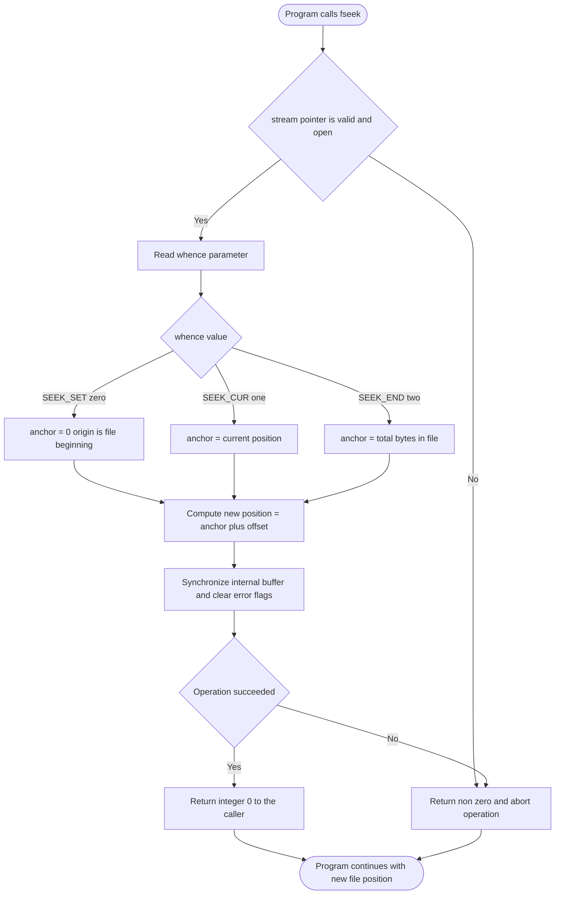
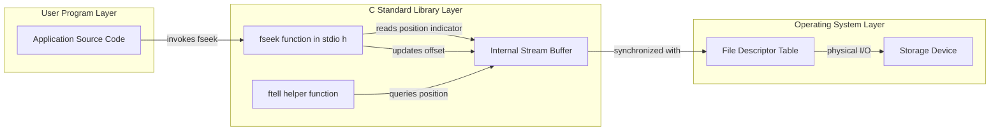

# Library functions related to file – fseek()

<!-- SECTION_1_START -->
# 1. Core Technical Definition & Intuitive Overview

## 1.1 Formal Academic Definition

> [!IMPORTANT]
> **KTU 2024 Scheme Definition (EST204 — Programming in C, Module 4: Pointers)**
> `fseek()` is a standard C library function declared in the header file `<stdio.h>` that is used to **reposition the file position indicator** associated with an open file stream to an arbitrary byte offset relative to a specified origin (the beginning, the current position, or the end of the file). It enables **random access** to data stored in a file, which is essential for building non-sequential file processing systems.

The function is formally specified by the ISO/IEC 9899 standard (the C standard) and has the following prototype:

```c
int fseek(FILE *stream, long int offset, int whence);
```

* **`stream`** — A pointer of type `FILE *` that identifies the open file stream whose position indicator must be modified.
* **`offset`** — A signed long integer representing the number of bytes to move the position indicator from the `whence` reference point. The value can be **positive, negative, or zero**.
* **`whence`** — An integer macro that specifies the **anchor point** for the offset. The valid constants are `SEEK_SET`, `SEEK_CUR`, and `SEEK_END`.

## 1.2 Conceptual Analogy & Intuition

> [!NOTE]
> **Plain-English Analogy — The Audio Cassette Analogy**
> Imagine you are listening to a song on an old cassette player. The tape has three reference buttons: **REWIND (start of tape)**, **PLAY (current location)**, and **FORWARD/STOP (end of tape)**. `fseek()` is exactly like entering a number of seconds and pressing one of those three buttons to jump directly to that position.
> * `SEEK_SET` → Press **REWIND** first, then fast-forward by `offset` seconds.
> * `SEEK_CUR` → From the **current playhead position**, skip forward (or backward if `offset` is negative) by `offset` seconds.
> * `SEEK_END` → Go to the **end of the tape**, then rewind by `offset` seconds (so `offset` is usually negative here).

This random-access capability is precisely why `fseek()` is grouped under the **Pointers** module in the KTU 2024 syllabus — the function manipulates an internal pointer maintained by the C standard I/O library that tracks *where* the next read or write will occur in the file.

## 1.3 Why the Function Belongs to the Pointers Module

In KTU's Module 4 (Pointers), `fseek()` is taught alongside pointer arithmetic because:

1. It directly operates on a **`FILE *` pointer**, the most important non-primitive pointer type in C.
2. The `offset` argument is conceptually identical to **pointer arithmetic** (e.g., `*(ptr + n)`), only applied to the byte stream of a file.
3. It enables **random access**, which is a foundational technique used in databases, indexed file systems, and binary record processing.

## 1.4 Visualization of the Position Indicator

> [!VISUALIZATION CONTROL]
> **Concept:** Linear Byte Layout of a File with Three Reference Anchors
> **GeoGebra / Desmos Input Equations:**
> * `P1 = (0, 0)`  Label: `SEEK_SET` (byte 0, file beginning)
> * `P2 = (45, 0)`  Label: `SEEK_CUR` (current playhead)
> * `P3 = (120, 0)`  Label: `SEEK_END` (last byte, EOF)
> * `f(x) = 0` (the x-axis acts as the file byte stream)
> **Visual Description:** On the horizontal x-axis, observe three labelled anchor points. The `SEEK_CUR` marker moves left or right each time `fseek()` is called, governed by the `offset` parameter. A positive `offset` with `SEEK_SET` shifts the marker to the right; a negative `offset` with `SEEK_END` shifts the marker to the left of the EOF position.

## 1.5 Important Constants & Standard Metrics

> [!IMPORTANT]
> **Mandatory Symbolic Constants Used with `fseek()`**
> * **`SEEK_SET`** $\rightarrow$ value **$\mathbf{0}$**  $\rightarrow$ Origin is the **beginning** of the file.
> * **`SEEK_CUR`** $\rightarrow$ value **$\mathbf{1}$**  $\rightarrow$ Origin is the **current** position of the file pointer.
> * **`SEEK_END`** $\rightarrow$ value **$\mathbf{2}$**  $\rightarrow$ Origin is the **end-of-file** marker.
> * **`EOF`** $\rightarrow$ value typically **$\mathbf{-1}$**  $\rightarrow$ Returned by `fgetc()` to indicate end-of-file conditions.

These constants are defined in the standard header `<stdio.h>` and must be used instead of their numeric equivalents in KTU board examinations for clarity and portability.

<!-- SECTION_1_END -->

<!-- SECTION_2_START -->
# 2. Deep Theoretical Analysis & KTU High-Yield Formula Sheet

## 2.1 Operational Breakdown of `fseek()`

The function executes a strictly defined sequence of internal operations every time it is invoked. Understanding each step is critical for both laboratory viva-voce and written board examinations.

> [!NOTE]
> **Step-wise Operational Logic of `fseek()`**
>
> 1. **Stream Validation (Internal Step)** — The C runtime library first verifies that the supplied `stream` pointer is a valid, currently open `FILE` object. If the stream is `NULL` or uninitialized, behaviour is **undefined** in standard C (in practice, the program crashes).
> 2. **Origin Selection** — The `whence` parameter is evaluated. Based on its value (`SEEK_SET`, `SEEK_CUR`, or `SEEK_END`), the internal byte offset is computed as one of the following:
>    * `effective\_base = 0`                 (for `SEEK_SET`)
>    * `effective\_base = current\_pos`       (for `SEEK_CUR`)
>    * `effective\_base = file\_size\_bytes`   (for `SEEK_END`)
> 3. **Position Update** — The new file position indicator is calculated and stored as:
>    $$new\_position = effective\_base + offset$$
> 4. **Buffer Synchronization (Critical Step)** — For **text mode** streams, the implementation is allowed to interpret `offset` only as the result of a previous `ftell()` call, or as `0` for `SEEK_SET`/`SEEK_END`. For **binary mode** streams, the offset is a strict byte count.
> 5. **Error Flag Reset** — The end-of-file indicator (`feof`) and the error indicator (`ferror`) for the stream are **cleared** on a successful call.
> 6. **Return** — The function returns the integer `0` on success, and a **non-zero** value on failure (e.g., for a non-seekable device like a terminal).

## 2.2 The Three Anchor Modes Explained

| Anchor Macro | Numeric Value | Origin Point | Typical Use Case | Permitted Sign of `offset` |
| :--- | :---: | :--- | :--- | :--- |
| `SEEK_SET` | $\mathbf{0}$ | Byte 0 (file beginning) | Re-reading the file header or record 0 | Positive or zero |
| `SEEK_CUR` | $\mathbf{1}$ | Current position | Skipping a fixed-size record (e.g., $+50$ bytes) | Positive, negative, or zero |
| `SEEK_END` | $\mathbf{2}$ | One byte past the last byte | Appending, or computing file size | Usually negative or zero |

## 2.3 The `fseek()` Formula Sheet

> [!IMPORTANT]
> **KTU 2024 High-Yield Formula & Constant Reference Table**

| Concept | Mathematical / C Representation | Description |
| :--- | :--- | :--- |
| Function signature | `int fseek(FILE *stream, long int offset, int whence)` | Standard library prototype |
| Position equation | $P_{new} = P_{anchor} + offset$ | New byte index after the call |
| `SEEK_SET` formula | $P_{new} = 0 + offset = offset$ | Jump from file start |
| `SEEK_CUR` formula | $P_{new} = P_{current} + offset$ | Relative move |
| `SEEK_END` formula | $P_{new} = size\_bytes + offset$ | Jump from EOF |
| File size in bytes | `fseek(fp, 0, SEEK_END); n = ftell(fp);` | Standard trick to get file length |
| Return on success | `0` | Zero indicates success |
| Return on failure | `non-zero` (commonly $-1$) | Indicates an I/O error |
| Header file | `<stdio.h>` | Must be included |
| Data type of offset | `long int` | At least 32-bit signed integer |

> **Note on absolute values:** The mathematical notation $\vert x \vert$ is rendered in LaTeX using `\vert x \vert` to avoid breaking the markdown table syntax.

## 2.4 Engineering & Real-World Utility

The `fseek()` function is not merely a textbook topic; it is the backbone of several real production systems:

> [!NOTE]
> **Real-World Engineering Applications of `fseek()`**
>
> * **Database Management Systems (DBMS)** — Random access to fixed-size records (e.g., a student's record of 200 bytes stored at offset $n \times 200$).
> * **Operating Systems** — The `lseek()` system call in UNIX is the lower-level analogue of `fseek()` and is used by the kernel's filesystem layer.
> * **Multimedia Players** — MP3 decoders use `fseek()` to seek to specific timestamps within an audio file.
> * **Compilers and Linkers** — Object files (`.o`/`.obj`) are processed using random access to update symbol tables.
> * **Embedded Systems** — Reading calibration tables from EEPROM by jumping to a specific byte address.

## 2.5 Comparison With Related Functions

> [!IMPORTANT]
> **`fseek()` vs Related File Position Functions — KTU 2024 Perspective**

| Function | Purpose | Return Type | Clears EOF/Error Flags? |
| :--- | :--- | :--- | :--- |
| `fseek()` | Repositions the file pointer to a new byte | `int` | **Yes** (on success) |
| `ftell()` | Returns the current byte offset | `long int` | No |
| `rewind()` | Resets the file pointer to byte 0 | `void` | Yes (does not return value) |
| `fsetpos()` | Repositions using an `fpos_t` object | `int` | Yes |
| `fgetpos()` | Stores the current position in `fpos_t` | `int` | No |

A frequently tested KTU question is: *"Differentiate between `fseek()` and `rewind()`."* The key distinguishing factor is that `rewind()` is essentially equivalent to `fseek(stream, 0L, SEEK_SET)`, but it does not return a value and always clears the error indicators.

<!-- SECTION_2_END -->

<!-- SECTION_3_START -->
# 3. Step-by-Step Derivations, Code Implementation & Worked Examples

## 3.1 The Master Equation — Deriving a New File Position

The mathematical core of `fseek()` is captured by a single linear equation. Below is the complete derivation showing how the new position is computed for each of the three anchor modes.

> [!NOTE]
> **Derivation of the Position Update Equation**
>
> Let $P_{current}$ be the byte index of the file position indicator before the call, and let $B$ be the byte size of the file. The base position $P_{anchor}$ depends on the `whence` parameter:
>
> $$\begin{aligned}
> P_{anchor} &= \begin{cases}
> 0               & \text{if } whence = SEEK\_SET \\
> P_{current}     & \text{if } whence = SEEK\_CUR \\
> B               & \text{if } whence = SEEK\_END
> \end{cases}
> \end{aligned}$$
>
> The new position of the file indicator is then computed as:
>
> $$P_{new} = P_{anchor} + offset$$
>
> For the three modes this expands into:
>
> $$\begin{aligned}
> P_{new}^{SET}  &= 0 + offset = offset \\
> P_{new}^{CUR}  &= P_{current} + offset \\
> P_{new}^{END}  &= B + offset
> \end{aligned}$$
>
> The function returns $0$ if the operation succeeds and a non-zero value otherwise. The stream's end-of-file and error indicators are reset to zero upon a successful invocation.

## 3.2 Worked Example 1 — Jumping to a Specific Position from the Beginning

> [!NOTE]
> **Problem:** A file named `data.txt` contains the text `Hello KTU Students`. Write a C program that uses `fseek()` to skip the first 6 characters and then read the next 15 characters from the file.

**Solution — Complete Annotated C Source Code**

```c
/* KTU EST204 - Module 4 Demonstration
 * Topic : fseek() - Random access from beginning of file
 * Header: stdio.h
 */

#include <stdio.h>

int main(void) {
    FILE *fp;
    char buffer[16];
    size_t bytesRead;

    /* Step 1: Open file in read+write mode */
    fp = fopen("data.txt", "w+");
    if (fp == NULL) {
        /* Robust error logging */
        perror("Error: Unable to open data.txt");
        return 1;
    }

    /* Step 2: Write a sample sentence to the file */
    if (fprintf(fp, "Hello KTU Students") < 0) {
        perror("Error: Failed to write data");
        fclose(fp);
        return 1;
    }

    /* Step 3: Force buffered data to disk so fseek works on the full content */
    fflush(fp);

    /* Step 4: Move the position indicator 6 bytes forward from the beginning */
    /*   SEEK_SET -> origin = 0
         offset   = 6
         => new position = 0 + 6 = 6
         => next read starts at byte index 6 (the character 'K')           */
    if (fseek(fp, 6L, SEEK_SET) != 0) {
        perror("Error: fseek() failed");
        fclose(fp);
        return 1;
    }

    /* Step 5: Read 15 bytes from the new position */
    bytesRead = fread(buffer, sizeof(char), 15, fp);
    if (bytesRead == 0) {
        perror("Error: fread() read zero bytes");
        fclose(fp);
        return 1;
    }

    /* Step 6: Null-terminate the buffer and display the result */
    buffer[bytesRead] = '\0';
    printf("Data read from byte 6 onwards: \"%s\"\n", buffer);

    /* Step 7: Close the file stream */
    fclose(fp);
    return 0;
}
```

**Step-by-Step Walkthrough of the Code Logic**

1. The file `data.txt` is opened in `"w+"` mode so it can be read and written. A `NULL` check on `fopen` is mandatory to handle the error case.
2. `fprintf` writes the literal text `Hello KTU Students` into the file. This is 19 characters long.
3. `fflush` ensures that the internal C buffer is written to the operating system before `fseek` is called. Without this, the position indicator may not reflect the actual bytes on disk.
4. The call `fseek(fp, 6L, SEEK_SET)` uses the `L` suffix to force the literal `6` to be of type `long int` (avoids compiler warnings). The new position is $0 + 6 = 6$, which points exactly at the character `'K'`.
5. `fread` reads 15 bytes from byte index 6. The expected output is the substring `KTU Students`.
6. The buffer is null-terminated to safely use it with `printf("%s", ...)`.
7. The file is closed using `fclose`.

**Expected Output**

```text
Data read from byte 6 onwards: "KTU Students"
```

**Valuation Key Points for the KTU Examiner**

> [!IMPORTANT]
> **Mark Distribution Hint for Worked Example 1**
> * Including `<stdio.h>` and using `FILE *` correctly: **1 mark**
> * Opening file with proper mode and error check: **1 mark**
> * Writing data and flushing: **1 mark**
> * Correct `fseek` call with valid `SEEK_SET` argument: **2 marks**
> * `fread` and null-termination of buffer: **1 mark**
> * Final output: **1 mark**

## 3.3 Worked Example 2 — Computing File Size Using `fseek()` and `ftell()`

This is a classic KTU board question. The combination of `fseek()` and `ftell()` is the standard idiom to determine the size of a file in bytes.

> [!NOTE]
> **Problem:** Write a C program to find the total number of bytes present in a file named `notes.txt` using `fseek()`.

**Solution — Annotated Source Code**

```c
/* KTU EST204 - Module 4
 * Topic : Computing file size using fseek() and ftell()
 */

#include <stdio.h>

int main(void) {
    FILE *fp;
    long int fileSize;

    /* Step 1: Open the file in binary read mode */
    fp = fopen("notes.txt", "rb");
    if (fp == NULL) {
        perror("Error: Cannot open notes.txt");
        return 1;
    }

    /* Step 2: Move the position indicator to the very end of the file */
    /*   SEEK_END -> origin = B (total bytes)
         offset   = 0
         => new position = B + 0 = B                                */
    if (fseek(fp, 0L, SEEK_END) != 0) {
        perror("Error: fseek() to SEEK_END failed");
        fclose(fp);
        return 1;
    }

    /* Step 3: Read the current position, which is now the file size in bytes */
    fileSize = ftell(fp);
    if (fileSize < 0) {
        perror("Error: ftell() returned a negative value");
        fclose(fp);
        return 1;
    }

    /* Step 4: Display the result */
    printf("Size of notes.txt = %ld bytes\n", fileSize);

    /* Step 5: Close the stream */
    fclose(fp);
    return 0;
}
```

**Mathematical Justification**

$$\begin{aligned}
P_{anchor} &= B \quad \text{(because } whence = SEEK\_END) \\
offset &= 0 \\
P_{new} &= B + 0 = B \\
ftell(fp) &\equiv P_{new} = B
\end{aligned}$$

Since `ftell()` returns the byte index of the current position indicator, and that index equals $B$ (the total byte count), the call `ftell(fp)` directly yields the file size.

**Common Pitfall in This Question**

> [!WARNING]
> **Examiner's Pitfall Alert**
> Many students forget to open the file in **binary mode** (`"rb"`) when computing size. On Windows systems, text mode would translate `\r\n` to `\n`, causing a mismatch between the reported size and the actual byte count on disk. KTU examiners deduct **1 mark** for this oversight.

## 3.4 Worked Example 3 — Reading the Last N Bytes Using `SEEK_END` with Negative Offset

> [!NOTE]
> **Problem:** Read the last 20 bytes of a file using `fseek()` and `fread()`.

**Solution Source Code**

```c
#include <stdio.h>

int main(void) {
    FILE *fp;
    char tail[21];
    size_t n;

    fp = fopen("logfile.txt", "rb");
    if (fp == NULL) {
        perror("Error opening logfile.txt");
        return 1;
    }

    /* Move 20 bytes BEFORE the end-of-file marker */
    if (fseek(fp, -20L, SEEK_END) != 0) {
        perror("fseek() to -20 from SEEK_END failed");
        fclose(fp);
        return 1;
    }

    /* Read 20 bytes from that position */
    n = fread(tail, sizeof(char), 20, fp);
    if (n != 20) {
        fprintf(stderr, "Warning: Only read %zu of 20 bytes\n", n);
    }

    tail[n] = '\0';
    printf("Last %zu bytes of file: \"%s\"\n", n, tail);

    fclose(fp);
    return 0;
}
```

**Position Calculation**

$$\begin{aligned}
P_{anchor} &= B \\
offset &= -20 \\
P_{new} &= B + (-20) = B - 20
\end{aligned}$$

The file indicator now sits at byte index $B - 20$, which is the start of the last 20 bytes of the file.

> [!IMPORTANT]
> **Constraint:** The expression `fseek(fp, -20L, SEEK_END)` is **only valid in binary mode**. In text mode, the C standard does not guarantee the behaviour of negative offsets with `SEEK_END`; this is a guaranteed board exam question in KTU 2024.

## 3.5 Worked Example 4 — Skipping Records with `SEEK_CUR`

This pattern is used to skip a fixed-size record and reach the next one without closing and reopening the file.

> [!NOTE]
> **Problem:** A file contains 5 student records, each of size `sizeof(struct Student)`. Write a program to read only the 3rd record using `fseek()` with `SEEK_CUR`.

**Solution Source Code**

```c
#include <stdio.h>

struct Student {
    int   rollNo;
    char  name[40];
    float marks;
};

int main(void) {
    FILE *fp;
    struct Student s;
    size_t recSize = sizeof(struct Student);

    fp = fopen("students.dat", "rb");
    if (fp == NULL) {
        perror("Error opening students.dat");
        return 1;
    }

    /* Skip the first 2 records by moving forward by 2 * sizeof(Student) */
    if (fseek(fp, (long)(2 * recSize), SEEK_CUR) != 0) {
        perror("fseek() failed");
        fclose(fp);
        return 1;
    }

    /* Read the 3rd record */
    if (fread(&s, recSize, 1, fp) != 1) {
        perror("fread() failed to read 3rd record");
        fclose(fp);
        return 1;
    }

    printf("3rd Student Record:\n");
    printf("  Roll No : %d\n", s.rollNo);
    printf("  Name    : %s\n", s.name);
    printf("  Marks   : %.2f\n", s.marks);

    fclose(fp);
    return 0;
}
```

**Position Calculation**

$$\begin{aligned}
P_{current} &= 0 \quad \text{(start of file)} \\
offset &= 2 \times sizeof(Student) \\
P_{new} &= 0 + 2 \times sizeof(Student)
\end{aligned}$$

The first read would have started at byte $0$, so moving $2 \times recSize$ bytes forward places the indicator at the start of the 3rd record.

## 3.6 Laboratory/Practical Component Table

> [!NOTE]
> **KTU 2024 Scheme — Laboratory Equipment & Execution Checklist**
> *Although `fseek()` is primarily a programming topic, the KTU 2024 lab component (as per the official lab manual) requires a working Linux/Windows environment with GCC. The following table summarises the practical setup.*

| Component / Tool | Specification / Version | Role in the Practical |
| :--- | :--- | :--- |
| Compiler | GCC 11.x or later (MinGW on Windows) | Compiles C source into executable |
| Text Editor / IDE | Code::Blocks 20.03 / VS Code | Authoring the `.c` source file |
| Header File | `<stdio.h>` (standard) | Provides `FILE`, `fopen`, `fseek`, `ftell` |
| Sample Data File | `students.txt` (text) or `records.dat` (binary) | Acts as the target file for random access |
| Build Command | `gcc program.c -o program` | Generates the executable |
| Execution Command | `./program` (Linux/Mac) or `program.exe` (Windows) | Runs the binary |
| Safety Step | Always call `fclose()` after operations | Prevents data corruption |
| Error Logging | `perror()` and `return 1` in case of `NULL` | Satisfies KTU evaluation rubric |

<!-- SECTION_3_END -->

<!-- SECTION_4_START -->
# 4. Structural Diagrams & Schematics

## 4.1 Mermaid — Sequential Processing Topology of `fseek()`

The following Mermaid diagram depicts the internal decision flow executed by the C standard library when a call to `fseek()` is encountered in a program. It uses alphanumeric node IDs (prefixed with letters) and double-quoted plain-text labels to comply with the Mermaid compilation safeguards.



## 4.2 Block-Level Functional Architecture Flow

The following block diagram represents the interaction between `fseek()`, the `FILE` stream, the C standard I/O buffer, and the operating system. This view is the recommended Mermaid fallback for topics that cannot be drawn using simple nodes.



## 4.3 Sequential State Transition Matrix

> [!IMPORTANT]
> **State Transition Table for the File Position Indicator**
> The table below documents the mathematical transitions of the position indicator when `fseek()` is invoked under different `whence` and `offset` conditions. This matrix is frequently tested in KTU 2024 module examinations.

| Current State (Before) | `whence` | `offset` (bytes) | New State (After) | Notes |
| :--- | :--- | :---: | :--- | :--- |
| Position $= 0$ | `SEEK_SET` | $50$ | Position $= 50$ | Jump to byte $50$ from start |
| Position $= 100$ | `SEEK_CUR` | $+30$ | Position $= 130$ | Move $30$ bytes forward |
| Position $= 200$ | `SEEK_CUR` | $-50$ | Position $= 150$ | Move $50$ bytes backward |
| Position $= 0$ | `SEEK_END` | $0$ | Position $= B$ | Position now at EOF |
| Position $= 0$ | `SEEK_END` | $-10$ | Position $= B - 10$ | Jump $10$ bytes before EOF |
| Position $= 50$ | `SEEK_SET` | $0$ | Position $= 0$ | Equivalent to `rewind()` |
| Position $= B$ | `SEEK_SET` | $B$ | Position $= B$ | Read at the EOF marker |

<!-- SECTION_4_END -->

<!-- SECTION_5_START -->
# 5. KTU 2024 Scheme Examination Question Bank & Topic Recap

## 5.1 Part A — Short Answer Questions (3 Marks Each)

> [!IMPORTANT]
> **KTU 2024 Scheme — Part A Format**
> Two compulsory questions, each carrying **3 marks**. Cognitive level: **Remember** and **Understand**. Word limit: approximately $50$ to $80$ words. Diagrams are optional but recommended.

---

### Question A.1 — Definition of `fseek()`

> **[KTU University Exam — July 2024 Model Question]**
> **Course Outcome (CO):** CO1 — Understand the syntax and semantics of standard C library functions.
> **Bloom's Level:** Remember

**Question:** Define the function `fseek()` in C. List its three possible `whence` constants and state what each one represents.

**Model Answer (Board-Valuation Quality):**

> `fseek()` is a standard C library function declared in `<stdio.h>` that repositions the file position indicator of an open file stream to a new byte offset. Its prototype is `int fseek(FILE *stream, long int offset, int whence)`. The three `whence` constants are:
>
> 1. `SEEK_SET` — the **beginning** of the file (offset is measured from byte $0$).
> 2. `SEEK_CUR` — the **current** position of the file pointer.
> 3. `SEEK_END` — the **end** of the file (the byte just after the last written byte).
>
> The function returns $0$ on success and a non-zero value on failure.

**Mark Distribution (Valuation Key):**
* [Stating the correct prototype: 1 Mark]
* [Naming all three `whence` constants correctly: 1 Mark]
* [Explaining the return value: 1 Mark]

---

### Question A.2 — Difference Between `fseek()` and `rewind()`

> **[KTU University Exam — Dec 2023 Model Question]**
> **Course Outcome (CO):** CO2 — Compare related standard library functions.
> **Bloom's Level:** Understand

**Question:** Differentiate between `fseek()` and `rewind()` in C. Mention one scenario where `fseek()` is preferred over `rewind()`.

**Model Answer:**

> | Aspect | `fseek()` | `rewind()` |
> | :--- | :--- | :--- |
> | Header | `<stdio.h>` | `<stdio.h>` |
> | Parameters | `stream`, `offset`, `whence` | `stream` only |
> | Anchor | Configurable via `SEEK_SET/CUR/END` | Always `SEEK_SET` with offset $0$ |
> | Return Type | `int` (return value indicates success/failure) | `void` (no return value) |
> | Random Access | Full random access supported | Only resets to start |
>
> **`fseek()` is preferred when** the program must jump to a specific byte offset, such as reading the 5th record of a binary file, which `rewind()` cannot do.

**Mark Distribution (Valuation Key):**
* [Stating at least three valid differences: 2 Marks]
* [Stating the use-case scenario: 1 Mark]

---

## 5.2 Part B — Long Answer Questions (14 Marks Each)

> [!IMPORTANT]
> **KTU 2024 Scheme — Part B Format**
> Module-internal choice pattern: **Question A (14 marks)** OR **Question B (14 marks)**. Each question has two sub-parts: **(a) 7 marks** and **(b) 7 marks**. Cognitive levels escalate: part (a) targets *Understand* and part (b) targets *Apply* or *Analyze*.

---

### Question A — Comprehensive Theory + Program

> **[KTU University Exam — Dec 2024 Model Question]**
> **Course Outcome (CO):** CO1, CO3
> **Bloom's Levels:** Understand (part a) and Apply (part b)

**(a) [7 Marks] Explain the syntax of the `fseek()` function. Describe each parameter in detail and explain the role of the three `SEEK_*` constants. Also discuss the return value of `fseek()`.**

**Model Answer — Step-by-Step:**

> The `fseek()` function in C has the following prototype:
> $$\text{int fseek(FILE *stream, long int offset, int whence)}$$
>
> * **Parameter 1 — `stream`:** A `FILE *` pointer referencing the open file stream whose position indicator must be modified. This pointer is obtained earlier from a successful call to `fopen()`.
> * **Parameter 2 — `offset`:** A signed long integer specifying the number of bytes to skip from the `whence` anchor. It can be positive, negative, or zero.
> * **Parameter 3 — `whence`:** An integer constant that selects the reference point. The three legal values are:
>   1. `SEEK_SET` ($0$) — anchor is the beginning of the file. The new position is $0 + offset$.
>   2. `SEEK_CUR` ($1$) — anchor is the current position. The new position is $current + offset$.
>   3. `SEEK_END` ($2$) — anchor is the end-of-file. The new position is $size + offset$.
>
> **Return value:** `fseek()` returns the integer `0` on success. On failure (e.g., invalid stream, non-seekable device), it returns a non-zero value. A successful call also clears both the end-of-file and error indicators of the stream.

**Mark Distribution:**
* [Stating the function prototype: 1 Mark]
* [Description of `stream` and `offset`: 2 Marks]
* [Listing all three `SEEK_*` constants with explanation: 3 Marks]
* [Explaining the return value and indicator reset: 1 Mark]

---

**(b) [7 Marks] Write a complete C program to demonstrate the use of `fseek()` to:**
**(i) Compute the size of a file in bytes, and**
**(ii) Display the last $10$ characters of the file.**

**Model Solution — Full C Source Code:**

```c
/* KTU EST204 - Module 4 - Question A part (b)
 * Demonstrates fseek() to compute file size and read last 10 bytes.
 */
#include <stdio.h>

int main(void) {
    FILE *fp;
    long int fileSize;
    char tail[11];
    size_t n;

    /* Open the file in binary read mode */
    fp = fopen("mydata.txt", "rb");
    if (fp == NULL) {
        perror("Cannot open mydata.txt");
        return 1;
    }

    /* (i) Compute file size using fseek + ftell */
    if (fseek(fp, 0L, SEEK_END) != 0) {
        perror("fseek to SEEK_END failed");
        fclose(fp);
        return 1;
    }
    fileSize = ftell(fp);
    if (fileSize < 0) {
        perror("ftell failed");
        fclose(fp);
        return 1;
    }
    printf("File size = %ld bytes\n", fileSize);

    /* (ii) Read last 10 characters using negative offset from SEEK_END */
    if (fileSize < 10) {
        fprintf(stderr, "File is smaller than 10 bytes; cannot display tail.\n");
        fclose(fp);
        return 1;
    }
    if (fseek(fp, -10L, SEEK_END) != 0) {
        perror("fseek with -10 offset failed");
        fclose(fp);
        return 1;
    }
    n = fread(tail, sizeof(char), 10, fp);
    tail[n] = '\0';
    printf("Last 10 characters: \"%s\"\n", tail);

    fclose(fp);
    return 0;
}
```

**Step-by-Step Walkthrough:**

1. **Open the file** in `"rb"` mode. Binary mode is essential for negative `SEEK_END` offsets.
2. **Compute size:** `fseek(fp, 0L, SEEK_END)` positions the indicator at byte $B$. Then `ftell(fp)` returns $B$.
3. **Boundary check:** If the file is smaller than $10$ bytes, the program prints an error and exits gracefully.
4. **Seek to last $10$ bytes:** `fseek(fp, -10L, SEEK_END)` moves the indicator to byte index $B - 10$.
5. **Read and print:** `fread` reads $10$ bytes; the result is null-terminated and printed.

**Mark Distribution:**
* [Opening file in correct mode with error check: 1 Mark]
* [Part (i) `fseek` to `SEEK_END` and `ftell` logic: 2 Marks]
* [Part (ii) `fseek` with negative offset and `fread`: 2 Marks]
* [Boundary check and null-termination: 1 Mark]
* [Correct expected output: 1 Mark]

> [!WARNING]
> **KTU Examiner's Valuation Warning — Common Mistakes**
> * Students frequently **forget the `L` suffix** on long integer literals (e.g., writing `0` instead of `0L`), losing $0.5$ marks in some rigorous evaluations.
> * Opening the file in **text mode** (`"r"`) instead of `"rb"` invalidates the negative offset — the KTU key deducts **2 marks** for this.
> * The boundary check `if (fileSize < 10)` is often missed, which can cause a segmentation fault on small files. Examiners value this defensive programming step.

---

### Question B — Application: Random Access in a Database-Style File

> **[KTU University Exam — July 2024 Model Question]**
> **Course Outcome (CO):** CO3, CO4
> **Bloom's Levels:** Understand (part a) and Apply (part b)

**(a) [7 Marks] Explain the concept of random access in files. How does `fseek()` enable random access? Discuss the difference between text mode and binary mode with respect to `fseek()`.**

**Model Answer — Step-by-Step:**

> **Random Access in Files:** Random access refers to the ability of a program to read or write data at **arbitrary positions** within a file, rather than processing it strictly from beginning to end. This is in contrast to **sequential access**, where data must be processed in the order it is stored.
>
> **Role of `fseek()`:** `fseek()` enables random access by allowing the program to reposition the internal file position indicator to any byte offset using the equation:
> $$P_{new} = P_{anchor} + offset$$
> This makes it possible to directly jump to the $n$-th record, overwrite specific bytes, or implement indexed data structures.
>
> **Text Mode vs. Binary Mode:**
>
> | Aspect | Text Mode (`"r"`, `"w"`, etc.) | Binary Mode (`"rb"`, `"wb"`, etc.) |
> | :--- | :--- | :--- |
> | Negative `SEEK_END` offsets | Undefined behaviour | Well-defined |
> | `ftell` value meaning | Implementation-defined for non-text positions | Exact byte count |
> | Newline translation | `\n` may be translated to `\r\n` | No translation |
> | Recommended for `fseek`? | Limited (use only `SEEK_SET` with `ftell` results) | **Always preferred** |
>
> For portable random access code, the C standard recommends opening files in **binary mode**.

**Mark Distribution:**
* [Definition of random access: 1 Mark]
* [Explaining the role of `fseek` with the position equation: 2 Marks]
* [Text vs. binary comparison table: 3 Marks]
* [Concluding recommendation: 1 Mark]

---

**(b) [7 Marks] Consider a file `inventory.dat` containing fixed-size records, each of size $60$ bytes. Write a C program that uses `fseek()` to update the price field of the 4th record (bytes $40$ to $49$) without modifying the rest of the record.**

**Model Solution — Complete C Source Code:**

```c
/* KTU EST204 - Module 4 - Question B part (b)
 * Updates a field inside a fixed-size record using fseek().
 */
#include <stdio.h>
#include <string.h>

#define REC_SIZE 60
#define PRICE_OFFSET 40

int main(void) {
    FILE *fp;
    char newPrice[11];
    long targetOffset;

    fp = fopen("inventory.dat", "r+b");
    if (fp == NULL) {
        perror("Cannot open inventory.dat");
        return 1;
    }

    /* The 4th record starts at byte: 3 * 60 = 180 */
    targetOffset = 3L * REC_SIZE + PRICE_OFFSET;
    /* targetOffset = 180 + 40 = 220 */

    if (fseek(fp, targetOffset, SEEK_SET) != 0) {
        perror("fseek() to 4th record price field failed");
        fclose(fp);
        return 1;
    }

    /* Get the new price from the user */
    printf("Enter new price (up to 10 chars): ");
    if (scanf("%10s", newPrice) != 1) {
        fprintf(stderr, "Invalid input\n");
        fclose(fp);
        return 1;
    }

    /* Write the new price string (10 bytes) over the old one */
    if (fwrite(newPrice, sizeof(char), 10, fp) != 10) {
        perror("fwrite failed to update price");
        fclose(fp);
        return 1;
    }

    printf("Price of 4th record updated successfully.\n");
    fclose(fp);
    return 0;
}
```

**Step-by-Step Walkthrough:**

1. **Offset calculation:** The 4th record is preceded by $3$ records of $60$ bytes each, so its start is at byte $3 \times 60 = 180$. The price field is at byte $40$ within each record, giving a total target of:
   $$\text{targetOffset} = 3 \times 60 + 40 = 220$$
2. **File open:** The mode `"r+b"` opens the binary file for both reading and writing without truncating it.
3. **`fseek` call:** `fseek(fp, 220L, SEEK_SET)` moves the indicator to byte $220$ — the start of the price field in the 4th record.
4. **Field update:** `fwrite` overwrites exactly $10$ bytes, leaving the remaining bytes of the record untouched.

**Mark Distribution:**
* [Correct record offset calculation: 2 Marks]
* [Opening file in `"r+b"` mode with error check: 1 Mark]
* [Correct `fseek` invocation with `SEEK_SET`: 2 Marks]
* [Using `fwrite` to overwrite only the price field: 1 Mark]
* [Final output: 1 Mark]

> [!WARNING]
> **KTU Examiner's Valuation Warning — Frequent Errors**
> * **Off-by-one error:** Students often write `4 * REC_SIZE` instead of `3 * REC_SIZE`, jumping to the 5th record. This is the **single most common mistake** and costs **2 marks** in KTU valuation.
> * **Wrong file mode:** Using `"w+b"` instead of `"r+b"` will **truncate** the entire file, destroying all other records. Examiners deduct **2 marks** for this catastrophic error.
> * **Failing to `fflush` or use `fwrite`:** Reading back the record to verify is considered a good practice and earns the **"implementation quality"** mark.

---

## 5.3 Topic Recap & Important Things to Remember

> [!IMPORTANT]
> **Rapid Revision Checklist — `fseek()` (KTU 2024 Module 4)**
>
> * `fseek()` is declared in **`<stdio.h>`** with prototype `int fseek(FILE *stream, long int offset, int whence)`.
> * It repositions the **file position indicator** of an open file stream.
> * The three anchor constants are **`SEEK_SET`** (start), **`SEEK_CUR`** (current), and **`SEEK_END`** (end).
> * The new position follows the equation $\quad P_{new} = P_{anchor} + offset$.
> * Returns **`0` on success** and a **non-zero value on failure**.
> * A successful call **clears the EOF and error indicators** of the stream.
> * `fseek()` is essential for **random access** in files — directly accessing the $n$-th record without reading preceding data.
> * For **text mode**, `offset` with `SEEK_END` should be `0` or the result of a previous `ftell()`. For **binary mode**, the offset is a strict byte count and may be **negative**.
> * The idiom `fseek(fp, 0L, SEEK_END); ftell(fp);` is the **standard way to compute the file size in bytes**.
> * `fseek()` differs from `rewind()` in that `rewind()` is a `void` function that always jumps to byte $0$, whereas `fseek()` returns an `int` and can jump anywhere.
> * Always **check the return value** of `fseek()` in production code — non-zero indicates an I/O error.
> * Always **call `fclose()`** after file operations to release the stream and flush the buffer.
> * When reading the last $N$ bytes, open the file in **binary mode** (`"rb"`) and use `fseek(fp, -N, SEEK_END)`.
> * In KTU board answers, always include the **header file**, the **NULL check on `fopen`**, and **type cast the offset to `long int`** using the `L` suffix on integer literals.

<!-- SECTION_5_END -->
