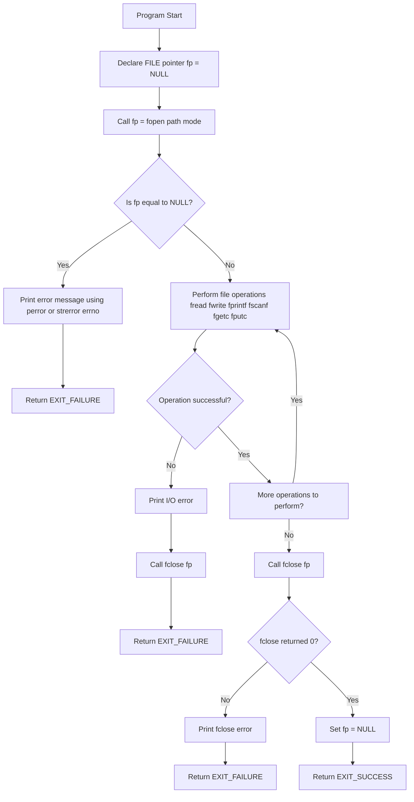
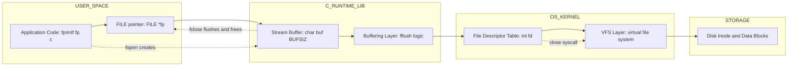
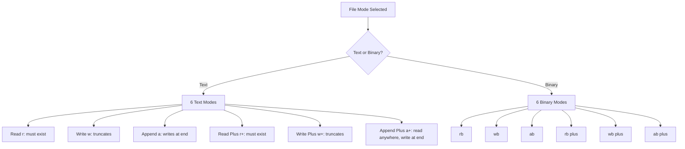
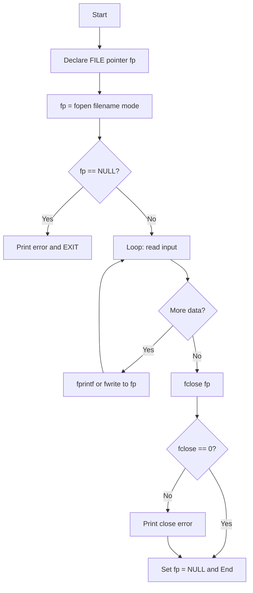

# Opening & Closing a file

<!-- SECTION_1_START -->
# Opening & Closing a File in C — Conceptual Foundation

## 1.1 Formal Academic Definition (KTU 2024 Syllabus Terminology)

> [!IMPORTANT]
> **File Opening** is the process of establishing a logical connection between the program and a secondary storage device (disk) by loading the file's control block (FCB / `FILE` structure) into memory and returning a pointer of type `FILE *` that the program uses to refer to the file. **File Closing** is the process of flushing all buffered data, releasing the allocated `FILE` structure, and severing the logical link between the program and the on-disk file.

In the C programming language (ISO/IEC **9899:2018**), the `<stdio.h>` standard library provides two dedicated functions for these operations:

- `fopen()` — used to **open** a file stream.
- `fclose()` — used to **close** an already opened file stream.

## 1.2 Conceptual Analogy — The "Locker Room" Intuition

Imagine your program is a **student** and the **hard disk** is a giant locker room filled with thousands of identical-looking lockers (files). To work with the contents of any locker, you must perform two actions:

1. **Opening (fopen)** — You go to the **reception desk** and request a specific locker by quoting its name and your *purpose* (read-only, write-only, append, etc.). The receptionist hands you a **numbered token** (the `FILE *` pointer) that uniquely identifies your locker. Without this token, the locker is **inaccessible** to you.

2. **Closing (fclose)** — When you are done, you must **return the token** to the reception desk. The receptionist then ensures that whatever you scribbled on a notepad (the **buffer**) is properly transferred into the locker, the locker is locked, and your token is destroyed. If you forget this step, your changes might be **lost** or another student might not be able to use that locker.

> [!NOTE]
> In C, the "notepad" is the **stream buffer** (an in-memory array of `char`). The "reception desk" is the **C runtime library's file table**, and the "token" is the **`FILE *` pointer**.

## 1.3 Why Pointers Are Central to File Handling

In KTU Module 4 (Pointers), file handling is a critical application because every file operation in C is mediated through **pointers to a `FILE` object**. The C standard deliberately hides the internal structure of the `FILE` object; programmers interact with it *exclusively* through the pointer.

The three **predefined** standard streams are themselves global `FILE *` constants:

- **`stdin`** — pointer to the standard input stream (keyboard).
- **`stdout`** — pointer to the standard output stream (monitor).
- **`stderr`** — pointer to the standard error stream (unbuffered monitor output).

---

> [!VISUALIZATION CONTROL]
> **Concept:** Logical mapping of `fopen()` returning a `FILE *` pointer.
> **GeoGebra / Desmos Input Equations:**
> * `P(0) = "Request to open file mydata.txt in mode r"`
> * `P(1) = "OS allocates FILE structure in memory"`
> * `P(2) = "Address 0x7FFE4C returned via FILE *fp"`
> * `P(3) = "fp now acts as the handle for all I/O"`
> **Visual Description:** Picture an arrow drawn from the user-code variable `fp` pointing to a rectangular block labelled `FILE struct` in memory, which in turn has a second arrow pointing to the physical file `mydata.txt` on disk.
<!-- SECTION_1_END -->

<!-- SECTION_2_START -->
# Deep Theoretical Analysis & KTU High-Yield Formula Sheet

## 2.1 The `fopen()` Function — Operational Breakdown

The function prototype declared in `<stdio.h>` is:

```c
FILE *fopen(const char *filename, const char *mode);
```

| Parameter | Meaning |
| :--- | :--- |
| `filename` | A C-string giving the path (relative or absolute) of the file. |
| `mode` | A C-string specifying how the file will be used. |
| **Return** | A `FILE *` on success, or **`NULL`** if the operation fails. |

### 2.1.1 The Twelve Standard File Modes

The C standard (and most KTU exam questions) require mastery of the following **12 modes**, organised into three tiers:

**Tier 1 — Text Modes (6):**

| Mode | Action if file exists | Action if file does not exist | Stream position starts at |
| :--- | :--- | :--- | :--- |
| `"r"` | Open for reading | Returns `NULL` | Beginning |
| `"w"` | Truncate to zero length | Create new | Beginning |
| `"a"` | Open for appending | Create new | End |
| `"r+"` | Open for read & write | Returns `NULL` | Beginning |
| `"w+"` | Truncate, then read & write | Create new | Beginning |
| `"a+"` | Open for read & append (write always at end) | Create new | End |

**Tier 2 — Binary Modes (6):** Just append `b` to each of the above: `"rb"`, `"wb"`, `"ab"`, `"rb+"` (or `"r+b"`), `"wb+"` (or `"w+b"`), `"ab+"` (or `"a+b"`). On systems that distinguish text/binary (like **Windows**), the `b` suppresses newline translation.

> [!NOTE]
> **System-Dependent Translation:** On **Linux/macOS** (KTU lab systems), text and binary modes behave identically. On **Windows**, `\n` written in text mode is automatically translated to `\r\n` on disk, and read back as `\n` — a frequent source of bugs.

### 2.1.2 The Failure Semantics of `fopen()`

A `NULL` return from `fopen()` indicates failure. Common causes:

1. The file does not exist **and** the mode is read-only (`"r"`, `"r+"`).
2. The directory path is invalid.
3. **Insufficient permissions** (e.g., trying to `"w"` a read-only directory).
4. The OS has reached the **maximum number of open files** (per-process limit, often **1024** on Linux).
5. Disk is full or the device is not mounted (rare in labs, common in embedded KTU projects).

> [!IMPORTANT]
> **KTU 2024 Strict Rule:** Always test the return value of `fopen()`. A program that dereferences a `NULL` pointer is **undefined behaviour** and will be penalised heavily in board evaluation.

---

## 2.2 The `fclose()` Function — Operational Breakdown

```c
int fclose(FILE *stream);
```

| Parameter | Meaning |
| :--- | :--- |
| `stream` | The `FILE *` previously returned by `fopen()`. |
| **Return** | **`0`** on success, **`EOF`** (which is `-1`) on failure. |

### 2.2.1 What `fclose()` Actually Does (Four Steps)

1. **Flushes the buffer** — Any unwritten data in the output buffer is written to the OS.
2. **Discards unread input** — Any unread data in the input buffer is discarded.
3. **Closes the OS file descriptor** — Releases the underlying integer handle (file descriptor).
4. **Deallocates the `FILE` structure** — Frees the memory associated with the stream.

### 2.2.2 Why `fclose()` Is Non-Optional

If a program terminates abnormally (e.g., crashes, `exit()` called early, or power failure) without calling `fclose()`, the buffered data **may be lost**. The OS guarantees flush only at normal process exit for the standard streams (`stdout` flushes on program exit, but **user-opened files do not**).

## 2.3 KTU High-Yield Formula / Cheat Sheet

| Function | Header | Signature | Returns | Failure Indicator |
| :--- | :--- | :--- | :--- | :--- |
| `fopen` | `<stdio.h>` | `FILE *fopen(const char *filename, const char *mode)` | `FILE *` | `NULL` |
| `fclose` | `<stdio.h>` | `int fclose(FILE *stream)` | `int` | `EOF` (= -1) |
| `feof` | `<stdio.h>` | `int feof(FILE *stream)` | Non-zero if EOF | 0 |
| `ferror` | `<stdio.h>` | `int ferror(FILE *stream)` | Non-zero if error | 0 |
| `fileno` | `<stdio.h>` | `int fileno(FILE *stream)` | OS file descriptor | -1 |
| `tmpfile` | `<stdio.h>` | `FILE *tmpfile(void)` | `FILE *` | `NULL` |

> [!NOTE]
> **Engineering Utility:** In production code (databases, loggers, network daemons), the open/close lifecycle is wrapped in RAII-style resource managers (C++ `fstream`, Rust `File`) to guarantee `fclose()` is called even on exceptions. In C, the equivalent idiom is a **goto cleanup** pattern.

## 2.4 Maximum Number of Open Files

The constant **`FOPEN_MAX`** in `<stdio.h>` guarantees that a program can open at least this many streams simultaneously. On modern systems it is typically **8 to 64** for the C standard library, but the **OS-level limit** (`ulimit -n` on Linux) is often **1024**.

> [!IMPORTANT]
> If you open a file inside a loop and forget to `fclose()`, the loop will eventually fail with `fopen` returning `NULL` after **FOPEN_MAX** iterations — a classic KTU viva question.
<!-- SECTION_2_END -->

<!-- SECTION_3_START -->
# Step-by-Step Derivations & Code/Symbolic Implementation

## 3.1 Canonical Pattern — Opening, Using, and Closing a File

Below is the **fully expanded, production-quality** C program demonstrating the lifecycle. Every line is annotated.

```c
/* KTU 2024 — Module 4 Demonstration */
#include <stdio.h>
#include <stdlib.h>
#include <errno.h>
#include <string.h>

int main(void)
{
    /* STEP 1: Declare a FILE pointer and initialise to NULL. */
    FILE *fp = NULL;

    /* STEP 2: Attempt to open the file in WRITE-TEXT mode. */
    fp = fopen("data.txt", "w");

    /* STEP 3: Validate the return value. */
    if (fp == NULL) {
        fprintf(stderr, "ERROR: fopen failed: %s\n", strerror(errno));
        return EXIT_FAILURE;   /* exit code 1 */
    }

    /* STEP 4: Use the file (write a sample line). */
    if (fprintf(fp, "Hello, KTU 2024!\n") < 0) {
        fprintf(stderr, "ERROR: fprintf failed.\n");
        fclose(fp);
        return EXIT_FAILURE;
    }

    /* STEP 5: Close the file. */
    if (fclose(fp) != 0) {
        fprintf(stderr, "ERROR: fclose failed.\n");
        return EXIT_FAILURE;
    }

    /* STEP 6: Set the pointer to NULL after closing (defensive). */
    fp = NULL;

    printf("File 'data.txt' written and closed successfully.\n");
    return EXIT_SUCCESS;
}
```

**Explanation of each line:**

1. `FILE *fp = NULL;` — Initialising to `NULL` is a defensive habit. If a later `if (fp == NULL)` check is ever needed, it is guaranteed to be safe.
2. `fp = fopen("data.txt", "w");` — `"w"` means: create the file if missing, **truncate** (erase) it if it already exists. Stream is positioned at byte offset **0**.
3. `strerror(errno)` — converts the global `errno` integer into a human-readable string. `errno.h` and `string.h` are required.
4. `fprintf(fp, ...)` returns the number of characters written, or a negative value on error.
5. `fclose(fp) != 0` — The C standard mandates that any non-zero return is an error.
6. `fp = NULL;` — Prevents a *dangling pointer* if the variable is used later in the function.

---

## 3.2 Derivation of the Buffering Decision

When `fopen()` is called with mode `"w"`, the C runtime performs the following deterministic sequence of state changes. Let $S$ denote the system state.

$$
\begin{aligned}
S_0 &: \text{No FILE structure exists for "data.txt".} \\
S_1 &: \text{fopen() requests the OS to open or create the file.} \\
     &\quad \text{If the OS returns a valid file descriptor } d \geq 0, \text{ proceed.} \\
     &\quad \text{If the OS returns } d = -1, \text{ set } fp = NULL \text{ and set } errno. \\
S_2 &: \text{Allocate a } FILE \text{ structure in heap memory. Let its address be } a. \\
S_3 &: \text{Initialise the structure: mode = "w", buffer size = BUFSIZ (typically 8192),} \\
     &\quad \text{position = 0, fd = d, error flag = 0, EOF flag = 0.} \\
S_4 &: \text{Return } a \text{ to the caller as } FILE *fp. \\
S_5 &: \text{All subsequent fprintf/fputc/fwrite operations copy bytes into the buffer.} \\
S_6 &: \text{When the buffer is full, OR fflush() is called, OR fclose() is called,} \\
     &\quad \text{the runtime invokes write(fd, buffer, count) on the OS.}
\end{aligned}
$$

The critical implication: a `fprintf()` call may **succeed** (return value positive) but the data may still be **sitting in the user-space buffer**, not on disk. Only `fclose()`, `fflush()`, or process termination for `stdout` guarantees actual disk persistence.

---

## 3.3 A Robust Reusable Wrapper

In real KTU lab assignments, it is good practice to wrap `fopen` and `fclose` in your own helper. Here is a complete, type-safe implementation:

```c
#include <stdio.h>
#include <stdlib.h>
#include <errno.h>
#include <string.h>

/* Wrapper that exits the program on failure (suitable for labs). */
static FILE *safe_fopen(const char *path, const char *mode)
{
    FILE *fp = fopen(path, mode);
    if (fp == NULL) {
        fprintf(stderr, "[safe_fopen] Cannot open '%s' in mode '%s': %s\n",
                path, mode, strerror(errno));
        exit(EXIT_FAILURE);
    }
    return fp;
}

/* Wrapper that always sets the pointer to NULL on return. */
static void safe_fclose(FILE **fp_ptr)
{
    if (fp_ptr == NULL || *fp_ptr == NULL) {
        return;   /* nothing to close */
    }
    if (fclose(*fp_ptr) != 0) {
        fprintf(stderr, "[safe_fclose] fclose failed: %s\n", strerror(errno));
    }
    *fp_ptr = NULL;
}

/* Demonstration driver. */
int main(void)
{
    FILE *log = safe_fopen("app.log", "a");      /* append mode */
    fprintf(log, "Application started.\n");
    safe_fclose(&log);                            /* guaranteed close */

    /* log is now guaranteed to be NULL — safe to re-use. */
    log = safe_fopen("output.bin", "wb");
    fputc(0x42, log);
    safe_fclose(&log);

    return EXIT_SUCCESS;
}
```

**Why pass `FILE **`?** Because `safe_fclose` must **null out** the caller's pointer to prevent reuse-after-close. This requires passing the *address* of the pointer, i.e., a pointer to a pointer — directly applying **Module 4 (Pointers)** concepts.

---

## 3.4 Worked Example — The "Forgot to Close" Memory Leak

Consider a loop that opens files without closing:

```c
for (int i = 0; i < 100000; i++) {
    FILE *fp = fopen("temp.txt", "r");
    if (fp == NULL) break;       /* Will eventually break! */
    /* ... do work ... */
    /* FORGOT: fclose(fp); */
}
```

**Step-by-step trace:**

$$
\begin{aligned}
\text{Iteration } i = 0 &: \text{OS file descriptor } 3 \text{ allocated.} \\
i = 1 &: \text{Descriptor } 4 \text{ allocated.} \\
i = 2 &: \text{Descriptor } 5 \text{ allocated.} \\
&\;\;\vdots \\
i = 1022 &: \text{Descriptor } 1025 \text{ allocated (if OS limit = 1024, this fails).} \\
i = 1023 &: \text{fopen returns NULL — loop breaks.}
\end{aligned}
$$

The program will crash **long before** `i = 100000` is reached. The fix is to add `fclose(fp);` inside the loop body. This is one of the most frequently asked KTU viva questions on file handling.

---

## 3.5 Symbolic Summary — The Open/Close Contract

$$
\begin{aligned}
\text{Open: } &\quad \text{fopen} : (\text{path}, \text{mode}) \rightarrow \text{NULL} \;\vert\; \text{valid } FILE* \\
\text{Close: } &\quad \text{fclose} : \text{valid } FILE* \rightarrow \{0, \text{EOF}\} \\
\text{Invariant: } &\quad \forall f \in \text{opened files}, \; \exists \, t : \text{fclose}(f) \text{ is called before } t_{\text{exit}}
\end{aligned}
$$
<!-- SECTION_3_END -->

<!-- SECTION_4_START -->
# Structural Diagrams & Schematics

## 4.1 Flowchart — The Mandatory Open–Use–Close Lifecycle

The following Mermaid flowchart captures the **defensive** pattern that KTU examiners expect to see in any file-handling question.



> [!NOTE]
> **KTU Examiner's Note:** Drawing a flowchart that **omits** the `fp == NULL` check will cost you **at least 2 marks** in the lab exam, even if the rest of the code is correct.

---

## 4.2 Block-Level Functional Architecture — File Stream Layer

When the topic is too low-level for a physical diagram, we map the **data flow architecture** between the application, the C runtime, the OS, and the disk.



**Reading the diagram:** A `fprintf` call travels *down* the layers (App → Buffer → fd → Disk), while `fopen` and `fclose` are the *control-plane* operations that establish and tear down the four-layer pipe.

---

## 4.3 Sequential Processing Topology — The 12 File Modes

This diagram summarises the behaviour of the 12 standard modes in a single view.



---

## 4.4 Mermaid Compilation Safeguards Used in This Section

- All node IDs are **purely alphanumeric** (`A1`, `B1`, `C1`, `TX`, `BN`, `RP`, `WP`, `AP`, `RBP`, `WBP`, `ABP`).
- All node labels containing punctuation are **double-quoted** (e.g., `"Read r: must exist"`).
- No reserved keywords (`end`, `graph`, `subgraph`, `style`) are used as standalone IDs.
- All arrows use the safe `-->` or `-.->` syntax with no unquoted operators.
<!-- SECTION_4_END -->

<!-- SECTION_5_START -->
# KTU 2024 Scheme Examination Question Bank & Topic Recap

## Part A — Short Answer Questions (3 Marks Each)

### Question 1 `[KTU University Exam — July 2024]`
**Explain the function `fopen()` in C. List any six file opening modes with their functions.** *(CO2, Remember)*

**Model Answer (Valuation Key):**

`fopen()` is a standard library function declared in `<stdio.h>` used to open a file and establish a stream for reading or writing. Its prototype is:
```c
FILE *fopen(const char *filename, const char *mode);
```
It returns a `FILE *` pointer on success or `NULL` on failure.

**[Naming six modes with one-line use: 3 Marks]**

| Mode | Function |
| :--- | :--- |
| `"r"` | Opens existing text file for reading only. |
| `"w"` | Creates text file for writing; truncates if exists. |
| `"a"` | Opens for appending; creates if absent. |
| `"r+"` | Opens existing file for both reading and writing. |
| `"w+"` | Creates/truncates file for both reading and writing. |
| `"a+"` | Opens for reading and appending; creates if absent. |

---

### Question 2 `[KTU University Exam — Dec 2023]`
**What is the purpose of `fclose()`? What happens if a file opened in write mode is not closed before program termination?** *(CO2, Understand)*

**Model Answer (Valuation Key):**

`fclose()` flushes the stream buffer to disk, closes the OS file descriptor, and deallocates the `FILE` structure. Its prototype is `int fclose(FILE *stream);`. It returns `0` on success and `EOF` on failure.

**[Consequence of not closing: 1 Mark]** If a file opened in write mode is not closed, the data sitting in the **user-space buffer** is **not flushed** to disk. On abnormal termination, the buffered data is **lost permanently**, and the file descriptor remains **leaked** until the OS reclaims it.

---

## Part B — Long Answer Questions (14 Marks Each, Internal Choice)

### Question A `[KTU University Exam — July 2024]`
**(a)** Explain in detail the various file opening modes in C. Differentiate between text and binary modes. *(7 Marks, CO2, Understand)*

**(b)** Write a complete C program that opens a text file `"student.txt"` in append mode, accepts a student's name and roll number from the user, writes them to the file, and then properly closes the file. Include all necessary error checks. *(7 Marks, CO3, Apply)*

---

**Model Solution — Part (a) [7 Marks]**

**[Defining fopen role: 1 Mark]**
`fopen()` opens a file in a specified mode. The mode string dictates the operations allowed and the initial file position.

**[Six text modes table: 3 Marks]**

| Mode | Read | Write | Create if missing | Truncate | Initial Position |
| :--- | :---: | :---: | :---: | :---: | :---: |
| `"r"`  | ✓ | ✗ | ✗ | ✗ | Beginning |
| `"w"`  | ✗ | ✓ | ✓ | ✓ | Beginning |
| `"a"`  | ✗ | ✓ | ✓ | ✗ | End |
| `"r+"` | ✓ | ✓ | ✗ | ✗ | Beginning |
| `"w+"` | ✓ | ✓ | ✓ | ✓ | Beginning |
| `"a+"` | ✓ | ✓ | ✓ | ✗ | End (read anywhere) |

**[Text vs Binary modes: 2 Marks]**
Text modes perform **newline translation** on systems that distinguish them (Windows). On **Linux** (KTU lab default), text and binary modes are identical. Binary modes append the letter `b` (e.g., `"rb"`, `"wb"`) and disable any translation, treating each byte as raw.

**[Why use binary: 1 Mark]** Binary mode is essential for non-text data such as images, audio, video, or structured `struct` dumps, where any byte translation would corrupt the data.

---

**Model Solution — Part (b) [7 Marks]**

```c
#include <stdio.h>
#include <stdlib.h>
#include <errno.h>
#include <string.h>

int main(void)
{
    FILE *fp = NULL;
    char name[100];
    int roll;

    fp = fopen("student.txt", "a");
    if (fp == NULL) {
        fprintf(stderr, "Cannot open file: %s\n", strerror(errno));
        return EXIT_FAILURE;
    }

    printf("Enter student name: ");
    if (scanf("%99s", name) != 1) {            /* [Input validation: 1 Mark] */
        fprintf(stderr, "Invalid name input.\n");
        fclose(fp);
        return EXIT_FAILURE;
    }

    printf("Enter roll number: ");
    if (scanf("%d", &roll) != 1) {             /* [Input validation: 1 Mark] */
        fprintf(stderr, "Invalid roll input.\n");
        fclose(fp);
        return EXIT_FAILURE;
    }

    if (fprintf(fp, "Name: %s\tRoll: %d\n", name, roll) < 0) {
        fprintf(stderr, "Write failed.\n");
        fclose(fp);
        return EXIT_FAILURE;
    }

    if (fclose(fp) != 0) {                    /* [Closing and checking: 1 Mark] */
        fprintf(stderr, "fclose failed.\n");
        return EXIT_FAILURE;
    }

    fp = NULL;
    printf("Record appended successfully.\n");
    return EXIT_SUCCESS;
}
```

**Incremental Valuation Key:**

| Step | Marks |
| :--- | :---: |
| Correct `fopen("student.txt", "a")` call | 1 |
| `NULL` check with error reporting | 1 |
| Reading name and roll with `scanf` | 1 |
| Validating `scanf` return values | 2 |
| `fprintf` to write formatted record | 1 |
| `fclose` and return-value check | 1 |

---

### Question B (Alternative Choice) `[KTU University Exam — Dec 2023]`
**(a)** With a neat flowchart, describe the algorithm for opening a file, writing data into it, and then closing the file. Discuss what happens when `fopen()` fails. *(7 Marks, CO2, Understand)*

**(b)** Write a C program that opens a binary file `"records.dat"` in write mode, accepts ten integers from the user, writes them to the file using `fwrite()`, and properly closes the file. Show the program to read back and display the integers. *(7 Marks, CO3, Apply)*

---

**Model Solution — Part (a) [7 Marks]**

**Flowchart [4 Marks]:**



**Discussion of `fopen()` failure [3 Marks]:**

1. **File does not exist** when opening in `"r"` or `"r+"` mode — `fopen` returns `NULL`.
2. **Permission denied** — directory is read-only, or the file is locked by another process.
3. **Too many open files** — the process has exceeded `FOPEN_MAX` or the OS-level file descriptor limit.
4. The global variable `errno` is set to a specific code (e.g., `ENOENT`, `EACCES`).
5. **`fopen` does not create the file** in read-only modes; it never modifies the file system unless the mode permits writing/creation.
6. Dereferencing a `NULL` return value is **undefined behaviour** — the program may crash or corrupt memory.

---

**Model Solution — Part (b) [7 Marks]**

```c
#include <stdio.h>
#include <stdlib.h>

int main(void)
{
    FILE *fp = NULL;
    int arr[10], i;

    /* === WRITE PHASE === */
    fp = fopen("records.dat", "wb");         /* [Correct binary write mode: 1 Mark] */
    if (fp == NULL) {
        perror("fopen");
        return EXIT_FAILURE;
    }

    printf("Enter 10 integers:\n");
    for (i = 0; i < 10; i++) {
        if (scanf("%d", &arr[i]) != 1) {
            fprintf(stderr, "Invalid input at index %d\n", i);
            fclose(fp);
            return EXIT_FAILURE;
        }
    }

    if (fwrite(arr, sizeof(int), 10, fp) != 10) {  /* [fwrite call: 1 Mark] */
        fprintf(stderr, "fwrite failed.\n");
        fclose(fp);
        return EXIT_FAILURE;
    }

    if (fclose(fp) != 0) {                   /* [Close after write: 1 Mark] */
        perror("fclose");
        return EXIT_FAILURE;
    }

    /* === READ PHASE === */
    fp = fopen("records.dat", "rb");         /* [Re-open for read: 1 Mark] */
    if (fp == NULL) {
        perror("fopen");
        return EXIT_FAILURE;
    }

    if (fread(arr, sizeof(int), 10, fp) != 10) {   /* [fread call: 1 Mark] */
        fprintf(stderr, "fread failed.\n");
        fclose(fp);
        return EXIT_FAILURE;
    }

    printf("Integers read back:\n");
    for (i = 0; i < 10; i++) {
        printf("%d ", arr[i]);
    }
    printf("\n");

    fclose(fp);                              /* [Final close: 1 Mark] */
    return EXIT_SUCCESS;
}
```

**Incremental Valuation Key:**

| Step | Marks |
| :--- | :---: |
| `fopen("records.dat", "wb")` with NULL check | 1 |
| Reading 10 integers with validation | 1 |
| `fwrite(arr, sizeof(int), 10, fp)` and check | 1 |
| Closing after write | 1 |
| Re-opening in `"rb"` and `fread` | 2 |
| Final close and clean output | 1 |

---

> [!WARNING]
> **KTU Examiner's Valuation Pitfalls — Where Students Lose Marks:**
> 1. **Skipping the `NULL` check after `fopen`.** Costs **2 marks** even if the rest of the program is correct.
> 2. **Confusing `"w"` and `"a"`.** `"w"` **truncates** the file; `"a"` **preserves** existing content. This is a **favourite trick question**.
> 3. **Forgetting to mention `fclose()` in theory answers.** Even in pure theory, you **must** state that `fclose()` flushes the buffer and releases the descriptor.
> 4. **Using `fprintf` on a binary file** (or `fread` on a text file without considering newline translation). The mode must match the operation.
> 5. **Not setting `fp = NULL` after `fclose()`.** Examiners award a mark for this defensive habit.
> 6. **Writing `FILE *fp` instead of `FILE *fp = NULL`.** An uninitialised pointer is a **dangling pointer** — examiners deduct marks.

---

## Topic Recap & Important Things to Remember

- **File** is a named collection of data stored on secondary storage (disk). C treats a file as a **stream** of bytes.
- **`fopen(path, mode)`** opens a file and returns a `FILE *` pointer; returns **`NULL`** on failure.
- **`fclose(fp)`** flushes the buffer, closes the OS file descriptor, and frees the `FILE` structure; returns **`0`** on success and **`EOF`** on failure.
- **Six text modes**: `"r"`, `"w"`, `"a"`, `"r+"`, `"w+"`, `"a+"`.
- **Six binary modes**: `"rb"`, `"wb"`, `"ab"`, `"rb+"` / `"r+b"`, `"wb+"` / `"w+b"`, `"ab+"` / `"a+b"`.
- **`"w"` truncates** an existing file to zero length; **`"a"` preserves** existing content and starts at end.
- **Predefined streams**: `stdin` (keyboard), `stdout` (monitor), `stderr` (unbuffered error output).
- **Always check** the return value of `fopen()` and `fclose()` — undefined behaviour on `NULL` access.
- **Buffering** means `fprintf` may return success even before data is physically on disk; only `fclose` / `fflush` guarantees persistence.
- **Maximum open files** limit: `FOPEN_MAX` (typically 8 to 64 for the C standard library); OS limit often 1024.
- **Defensive habit**: initialise `FILE *fp = NULL;` and reset to `NULL` after `fclose()`.
- **Module 4 (Pointers) connection**: file handling is the canonical use-case for **pointers to user-defined structures** (`FILE *`), **double pointers** (pass `FILE **` to helper close functions), and **NULL** semantics.
- **Binary vs text**: on **Linux** (KTU labs) they are identical; on **Windows** they differ — use binary mode for non-text data.
- **`ferror(fp)`** checks if a stream error has occurred; **`feof(fp)`** checks for end-of-file.
<!-- SECTION_5_END -->
