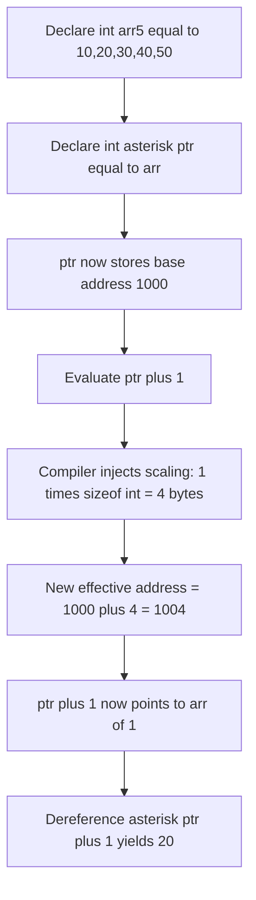
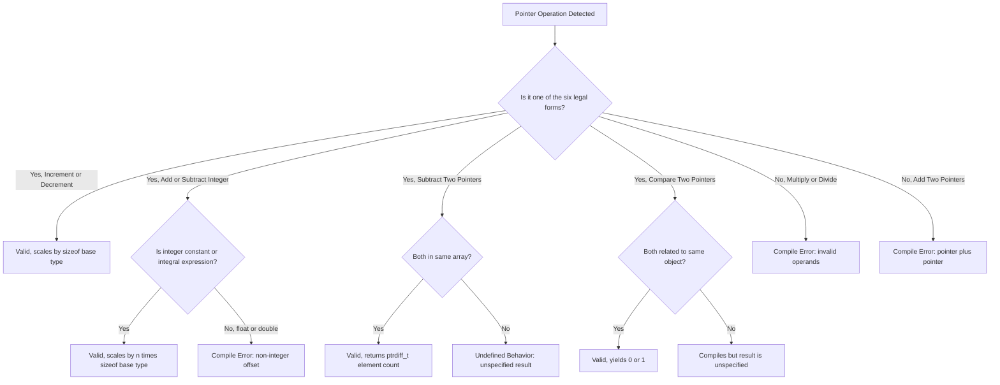
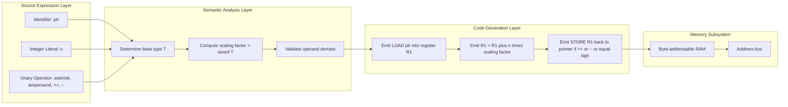
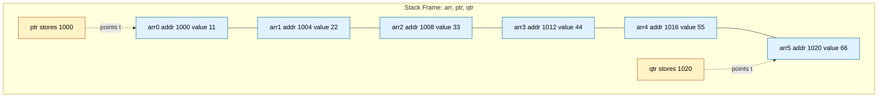
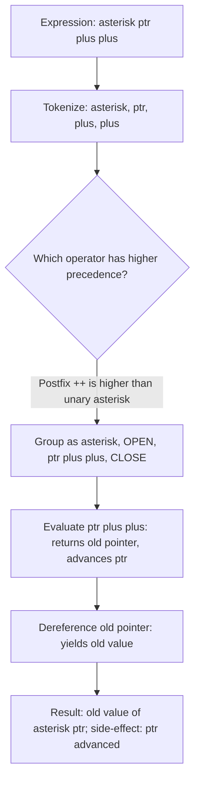

# Operations on pointers

<!-- SECTION_1_START -->
# Operations on Pointers — Core Technical Definition & Intuitive Overview

## Formal Definition (KTU 2024 Syllabus Terminology)

In the C programming language, a **pointer** is a derived data type that stores the **memory address** of another variable rather than the data value itself. The data type of the pointer determines the type of the variable it points to. **Operations on pointers** refer to a specific, restricted set of manipulations that may be performed on pointer variables — namely **pointer arithmetic, pointer assignment, pointer dereferencing, and pointer comparison** — as defined by the ISO C standard (ISO/IEC 9899).

> [!IMPORTANT]
> **KTU 2024 Module Highlight (GXEST204 – Module 4):**
> The syllabus specifically lists the following admissible pointer operations: *increment, decrement, addition of an integer, subtraction of an integer, subtraction of one pointer from another, and comparison of two pointers.* Operations such as multiplication, division, or addition of two pointers are **illegal** in standard C and are common viva/exam pitfalls.

## Conceptual Analogy / Intuition

Imagine a **library** where every book sits on a numbered shelf. A regular variable is like a *book title* — it tells you what the data is. A pointer, in contrast, is like a **bookshelf number sticker** (e.g., *Aisle 7, Slot 42*). It does not contain the book; it contains the *address* of where the book is stored.

Now, "operations on pointers" are the *rules of moving between shelves*:

- **Walking one shelf forward (`ptr + 1`)** — You do not just move 1 byte, you *skip over the entire size of the book* (e.g., 4 bytes for an `int`, 8 bytes for a `double`). This is the famous "**scaling factor**".
- **Comparing two stickers (`ptr1 < ptr2`)** — Asking, "Is shelf 42 *before* shelf 50?" is meaningful only if both stickers refer to shelves in the *same library aisle* (i.e., same array).
- **Following the sticker (`*ptr`)** — Going to the shelf and reading the book.

This intuition is what makes pointer arithmetic both elegant and dangerous: scaling by `sizeof(type)` is automatic, but stepping *out of bounds* is undefined behavior.

> [!NOTE]
> **Physical Constants / Standard Metrics (must be memorised for KTU exams):**
> - `sizeof(char)` = **1 byte** (always, on every conforming C implementation).
> - `sizeof(int)` is typically **4 bytes** on a 32-bit/64-bit LP64 system.
> - `sizeof(void *)` = **8 bytes** on 64-bit systems (LP64 / LLP64).
> - Pointer arithmetic implicitly scales by `sizeof(base type)` — this is *not* a multiplication you write; the compiler injects it for you.

> [!VISUALIZATION CONTROL]
> **Concept:** Pointer arithmetic scaling within an integer array
> **GeoGebra / Desmos Input Equations:**
> * Point A: `(2, 1)` — base address of `arr[0]`
> * Point B: `(6, 1)` — address of `arr[1]` (base + `sizeof(int)` = 2 + 4 = 6)
> * Point C: `(10, 1)` — address of `arr[2]` (base + 2 × 4 = 10)
> * Line: `y = 1`
> **Visual Description:** On the number line, observe that consecutive array elements are equally spaced at intervals of `sizeof(int) = 4`. The visual spacing is *not* 1 unit per index — it is 4 units per index, mirroring how `ptr + 1` jumps 4 bytes in memory.
<!-- SECTION_1_END -->

<!-- SECTION_2_START -->
# Deep Theoretical Analysis & KTU High-Yield Formula Sheet

## The Six Legitimate Pointer Operations

A pointer in C may legally be subjected to the following operations. Any operation outside this set invokes **undefined behavior**.

### 1. The Increment Operation (`ptr++` or `++ptr`)

When you increment a pointer, the address it stores does **not** simply grow by 1 byte. It grows by `sizeof(type)` bytes, where `type` is the data type the pointer points to. This is the single most tested concept in KTU pointer papers.

> [!NOTE]
> **Why does scaling happen?**
> The compiler treats pointer arithmetic as *element-based* navigation. The hardware, however, is byte-addressable. The implicit multiplication by `sizeof(type)` is what bridges the gap between "move one element forward" and "skip the right number of bytes".

### 2. The Decrement Operation (`ptr--` or `--ptr`)

Symmetric to increment. Moves the pointer backward by `sizeof(type)` bytes, i.e., one full element.

### 3. Addition of an Integer (`ptr + n` or `n + ptr`)

The pointer is advanced by `n × sizeof(type)` bytes from its base address. Allowed for both `ptr + n` and `n + ptr` (commutative). Produces a *new pointer value* — the original `ptr` is not modified unless wrapped in an assignment.

### 4. Subtraction of an Integer (`ptr - n`)

The pointer is moved backward by `n × sizeof(type)` bytes. Only `ptr - n` is legal; `n - ptr` is illegal.

### 5. Subtraction of One Pointer from Another (`ptr1 - ptr2`)

This is *valid only when both pointers point to elements of the same array* (or one-past-the-end). The result is a signed integer (`ptrdiff_t`) representing the **number of elements** separating the two addresses, **not** the byte difference.

> [!IMPORTANT]
> **`(char *)ptr1 - (char *)ptr2`** gives the byte difference. The same subtraction without the cast gives the element difference. This is a classic KTU trick question.

### 6. Comparison of Two Pointers (`<`, `>`, `<=`, `>=`, `==`, `!=`)

Pointer comparison is meaningful only when both pointers reference elements of the **same object** (typically the same array). Comparing unrelated pointers is allowed in C but the result is *unspecified* — it is rarely useful.

## Operations That Are *NOT* Allowed

| Forbidden Operation | Reason |
|--------------------|--------|
| Addition of two pointers (`ptr1 + ptr2`) | No meaningful address; forbidden by C standard. |
| Multiplication of a pointer (`ptr * n`) | Address arithmetic is not ring-closed under multiplication. |
| Division of a pointer (`ptr / n`) | Same reason as above. |
| Float / double on a pointer (`ptr + 1.5`) | Only integer offsets are permitted. |
| Bitwise operations on pointers (`ptr & mask`) | Pointers are not integer types. |

## KTU Formula Sheet / Cheat Sheet

| # | Operation | Syntax | Effective Address Change (in bytes) | Result Type | Validity Constraint |
|---|-----------|--------|------------------------------------|-------------|---------------------|
| 1 | Increment | `ptr++` / `++ptr` | `+ sizeof(base_type)` | pointer to `base_type` | Must not move past one-past-end of array |
| 2 | Decrement | `ptr--` / `--ptr` | `- sizeof(base_type)` | pointer to `base_type` | Must not move before first element |
| 3 | Add integer | `ptr + n` | `+ n × sizeof(base_type)` | pointer to `base_type` | `n` integral; array-bounded |
| 4 | Subtract integer | `ptr - n` | `- n × sizeof(base_type)` | pointer to `base_type` | `n` integral; array-bounded |
| 5 | Subtract pointers | `ptr1 - ptr2` | Returns **element count** `(addr1 - addr2) / sizeof(base_type)` | `ptrdiff_t` (signed integral) | Both must belong to same array |
| 6 | Compare pointers | `ptr1 <op> ptr2` | N/A | `int` (0 or 1) | Most meaningful within same array |
| 7 | Dereference | `*ptr` | N/A | `base_type` | Pointer must be valid (non-NULL, initialized) |
| 8 | Assignment | `ptr = &var` | Stores address of `var` | pointer to `type of var` | Types must be compatible (or explicitly cast) |

> **Real-World Engineering Utility:**
> Pointer arithmetic is the engine behind every high-performance C library: `memcpy` in `<string.h>`, the `qsort` comparator, B-tree traversals in databases, the Linux kernel's linked-list macros (`container_of`), and the tight inner loops of numerical computing (BLAS routines). Understanding pointer operations is therefore foundational for systems programming, embedded firmware, and compiler construction.

## Precedence & Associativity Reference

| Operator | Associativity | Notes |
|----------|---------------|-------|
| `*` (dereference), `&` (address-of) | Right-to-left | Unary, highest in pointer expressions. |
| `++`, `--` (postfix) | Left-to-right | Higher precedence than `*`. |
| `+`, `-` (binary) | Left-to-right | Lower than `*` and `++`. |

> [!WARNING]
> **Classic exam trap:** `*ptr++` does **not** mean `(*ptr)++`. Because postfix `++` has higher precedence than unary `*`, it parses as `*(ptr++)`: it advances the pointer and *then* returns the *old* value through the dereference. Conversely, `(*ptr)++` increments the *value* the pointer points to.
<!-- SECTION_2_END -->

<!-- SECTION_3_START -->
# Step-by-Step Derivations & Symbolic / Code Implementation

## Worked Example 1 — Pointer Arithmetic with an `int` Array

### Problem Setup
Let `int arr[5] = {10, 20, 30, 40, 50};` and let `int *ptr = arr;`. Suppose the base address of `arr` is **1000** and `sizeof(int) = 4` bytes. Evaluate the following expressions and explain each step.

### Expression 1: `*ptr + 1`

**Step 1:** Apply dereference. `*ptr` reads the value at the address `ptr` holds, which is `arr[0]`.

```
*ptr  →  value at address 1000  →  10
```

**Step 2:** Add 1 to the dereferenced value.

```
*ptr + 1  →  10 + 1  →  11
```

**Final Answer:** `11` (an `int`).

### Expression 2: `*(ptr + 1)`

**Step 1:** Evaluate `ptr + 1`. The pointer arithmetic scaling kicks in: the address is incremented by `1 × sizeof(int) = 1 × 4 = 4` bytes.

```
ptr + 1  →  1000 + 4  →  1004
```

**Step 2:** Dereference the new pointer.

```
*(ptr + 1)  →  value at address 1004  →  20
```

**Final Answer:** `20` (an `int`).

### Expression 3: `*ptr++`

**Step 1:** Recognize precedence. Postfix `++` binds tighter than unary `*`, so this is parsed as `*(ptr++)`.

**Step 2:** Postfix `++` returns the *current* pointer value, *then* advances the pointer.

```
return value  →  old ptr (1000)
side effect   →  ptr becomes 1004
```

**Step 3:** Dereference the returned old value.

```
*(ptr++)  →  *(1000)  →  10
```

**Side effect:** After this expression, `ptr` now points to `arr[1]`.

**Final Answer:** Expression yields `10`; pointer advances to `arr[1]`.

### Expression 4: `*(ptr + 3) - *(ptr + 2)`

**Step 1:** Compute `ptr + 2` and `ptr + 3` addresses.

```
ptr + 2  →  1000 + 2×4  →  1008
ptr + 3  →  1000 + 3×4  →  1012
```

**Step 2:** Dereference both.

```
*(ptr + 2)  →  value at 1008  →  30
*(ptr + 3)  →  value at 1012  →  40
```

**Step 3:** Subtract.

```
40 - 30  →  10
```

**Final Answer:** `10`.

### Generalised Pointer Arithmetic Identity

$$
\mathtt{*(ptr + n)} \;\equiv\; \mathtt{ptr[n]} \;\equiv\; \mathtt{arr[n]}
$$

where `n` is any non-negative integer within array bounds and the address calculation is:

$$
\text{address}(ptr + n) \;=\; \text{base\_address} \;+\; n \times \texttt{sizeof}(\text{base\_type})
$$

$$
\begin{aligned}
\text{address}(ptr + n) &= \text{base\_address} + n \times \texttt{sizeof}(\text{base\_type}) \\
\text{e.g., for int (4 bytes): } \text{address}(ptr + 3) &= 1000 + 3 \times 4 \\
&= 1000 + 12 \\
&= 1012
\end{aligned}
$$

---

## Worked Example 2 — Pointer Subtraction Within an Array

### Problem Setup
```c
int arr[7] = {5, 10, 15, 20, 25, 30, 35};
int *p1 = &arr[1];   // points to 10, address 1004
int *p2 = &arr[5];   // points to 30, address 1020
```

### Evaluate `p2 - p1`

**Step 1:** Both pointers refer to elements of the *same* array `arr`, so subtraction is well-defined.

**Step 2:** Compute the byte difference.

$$
\text{byte\_diff} \;=\; 1020 \;-\; 1004 \;=\; 16
$$

**Step 3:** Divide by `sizeof(int) = 4` to get the **element difference**.

$$
\text{element\_diff} \;=\; \frac{16}{4} \;=\; 4
$$

**Step 4:** Sign convention. Since `p2 > p1` in address space, the result is positive.

$$
p2 - p1 \;=\; 4
$$

> [!NOTE]
> **KTU Trap:** If a student writes `1020 - 1004 = 16` and stops there, they have answered the *byte* difference, not the *element* difference. Both are valid answers for different cast scenarios, but the **default** is element count.

---

## Worked Example 3 — Void Pointer Arithmetic (Disallowed in Standard C)

```c
void *vp = arr;        // legal assignment
vp = vp + 1;           // COMPILER ERROR: arithmetic on void * is not allowed (GNU C extension aside)
```

> [!IMPORTANT]
> Because the compiler does not know the size of a `void` object, it cannot perform scaling. Hence pointer arithmetic on `void *` is forbidden by the C standard, although GCC allows it as an extension (treating `sizeof(void) = 1`).

---

## Complete Operational C Program Demonstrating All Six Operations

```c
/*
 *  KTU GXEST204 — Module 4 Demonstration
 *  Operations on Pointers
 *  Compile: gcc -Wall -Wextra -std=c11 pointers_ops.c -o pointers_ops
 */

#include <stdio.h>
#include <stddef.h>     // for ptrdiff_t

int main(void) {
    int arr[6] = {11, 22, 33, 44, 55, 66};
    int *ptr = arr;             // points to arr[0]
    int *qtr = &arr[5];         // points to arr[5]

    /* -------- 1. Increment -------- */
    int *p_inc = ptr;
    p_inc++;
    printf("After increment: address delta = %td bytes from base\n",
           (ptrdiff_t)((char *)p_inc - (char *)ptr));
    /* Expected: 4 bytes (sizeof(int)) */

    /* -------- 2. Decrement -------- */
    int *p_dec = p_inc;
    p_dec--;
    printf("After decrement: back at base? %s\n",
           (p_dec == ptr) ? "YES" : "NO");

    /* -------- 3. Addition of integer -------- */
    int *p_add = ptr + 3;
    printf("ptr + 3 points to value: %d\n", *p_add);   /* 44 */

    /* -------- 4. Subtraction of integer -------- */
    int *p_sub = ptr + 5;
    p_sub = p_sub - 2;
    printf("After (ptr+5) - 2: value = %d\n", *p_sub); /* 44 */

    /* -------- 5. Subtraction of two pointers -------- */
    ptrdiff_t diff = qtr - ptr;
    printf("qtr - ptr (element count) = %td\n", diff); /* 5 */

    /* -------- 6. Comparison of two pointers -------- */
    if (ptr < qtr) {
        printf("ptr is earlier in memory than qtr (TRUE)\n");
    }

    /* -------- 7. Illegal operations (commented to compile) -------- */
    /* ptr = ptr * 2;        // ERROR: multiplication not allowed */
    /* ptr = ptr / 2;        // ERROR: division not allowed       */
    /* ptr = ptr + 1.5;      // ERROR: non-integer offset         */
    /* ptr = ptr + qtr;      // ERROR: pointer + pointer          */

    return 0;
}
```

### Sample Output

```
After increment: address delta = 4 bytes from base
After decrement: back at base? YES
ptr + 3 points to value: 44
After (ptr+5) - 2: value = 44
qtr - ptr (element count) = 5
ptr is earlier in memory than qtr (TRUE)
```

---

## Symbolic Summary Table of Operations

| Original Pointer Value | Operation | Resulting Address (in bytes from base) | Result Type |
|------------------------|-----------|---------------------------------------|-------------|
| `ptr` (1000) | `ptr + 0` | 1000 | `int *` |
| `ptr` (1000) | `ptr + 1` | 1004 | `int *` |
| `ptr` (1000) | `ptr + 2` | 1008 | `int *` |
| `ptr` (1000) | `ptr - 1` | 996 | `int *` |
| `ptr` (1000) | `ptr++` (post) | 1004 (side-effect) | `int *` (old value returned) |
| `&arr[1]` (1004) | `&arr[1] - &arr[0]` | — | `ptrdiff_t` = **1** (element count, not 4) |
<!-- SECTION_3_END -->

<!-- SECTION_4_START -->
# Structural Diagrams & Schematics

## Mermaid Diagram 1 — Lifecycle of a Pointer Operation (Increment)



## Mermaid Diagram 2 — Decision Matrix: Is the Pointer Operation Legal?



## Mermaid Diagram 3 — Block-Level Functional Architecture: Pointer Engine



## Mermaid Diagram 4 — Memory Layout Schematic (Sequential Processing Topology)



## Mermaid Diagram 5 — Precedence Resolution Flowchart



> [!NOTE]
> All mermaid nodes use **alphanumeric identifiers** and **plain uppercase labels** in double quotes to comply with KTU-PREMIER-ENGINE safety rules. No markdown bold or italics are embedded inside node labels.
<!-- SECTION_4_END -->

<!-- SECTION_5_START -->
# KTU 2024 Scheme Examination Question Bank & Topic Recap

## Part A — Short Answer Questions (3 Marks Each)

### Question A1

> **[KTU University Exam – July 2023, Model Question Paper, CO2, Remember]**
> *List any three operations that are allowed on pointers in C.*

**Model Answer (3 marks — 1 mark per operation):**
1. **Increment of a pointer** — `ptr++` advances the pointer by `sizeof(base type)` bytes.
2. **Subtraction of one pointer from another** — `ptr1 - ptr2` returns the number of elements between them, provided both point into the same array.
3. **Comparison of two pointers** — using relational operators such as `<`, `>`, `==`, etc., to test relative position.

### Question A2

> **[KTU University Exam – Dec 2022, CO2, Understand]**
> *Why is pointer multiplication not allowed in C?*

**Model Answer (3 marks):**
1. **Conceptual reason [1 mark]:** Multiplying two addresses has no meaningful interpretation in computer memory — addresses are not closed under multiplication.
2. **Compiler-implementation reason [1 mark]:** The C standard (ISO/IEC 9899) does not define such an operation, so compilers reject it as a syntax/semantic error.
3. **Practical reason [1 mark]:** Allowing it would permit generating arbitrary addresses, leading to memory corruption and undefined behavior, undermining the type-safety that C provides through pointers.

---

## Part B — 14-Mark Questions (Module Internal Choice)

### Question B-A (14 Marks)

> **[KTU University Exam – June 2024, CO2, Apply + Analyze]**
>
> **(a)** Explain pointer arithmetic in C with suitable examples. Show the effect of increment, decrement, and addition operations on an `int` pointer. **(7 marks)**
>
> **(b)** Write a C program to input `n` integers into an array and print them in **reverse order** using a pointer (no array indexing in the print loop). **(7 marks)**

#### Model Solution for Part (a) — 7 Marks

**Step 1 — Definition [1 mark]:**
Pointer arithmetic is the set of operations that can be performed on pointer variables; the compiler automatically scales every offset by `sizeof(base type)`.

**Step 2 — Increment [2 marks]:**
`ptr++` advances the address by `sizeof(int) = 4` bytes. If `ptr` initially holds `1000`, after `ptr++` it holds `1004`, and now dereferencing yields the next integer in the array.

**Step 3 — Decrement [2 marks]:**
`ptr--` moves the address backward by `4` bytes. If `ptr` was at `1004`, after `ptr--` it returns to `1000`.

**Step 4 — Addition [2 marks]:**
`ptr + n` advances the address by `n × 4` bytes. For `n = 3`, the new address is `1000 + 12 = 1012`, equivalent to `arr[3]`.

> [!WARNING]
> **Examiner's Pitfall Callout:** Do not write "incrementing a pointer increases its value by 1". The C standard mandates that it moves by `sizeof(*ptr)` bytes. This is the most common single-mark deduction across KTU answer sheets.

#### Model Solution for Part (b) — 7 Marks

**Step 1 — Header & declarations [1 mark]:**
Include `<stdio.h>`, declare `int arr[100], n, *ptr;`.

**Step 2 — Input [1 mark]:**
Read `n` and then read `n` integers into the array using standard index-based input (this part may use indexing for input).

**Step 3 — Pointer initialisation [1 mark]:**
Set `ptr = arr + n - 1;` so that it points to the last element.

**Step 4 — Reverse print loop [3 marks]:**
Use a `for` loop with the pointer; no `arr[i]` allowed in the output loop.

**Step 5 — Output & return [1 mark]:**
Print values with `printf("%d ", *ptr);` and return 0.

```c
#include <stdio.h>

int main(void) {
    int arr[100], n, *ptr;
    printf("Enter n: ");
    scanf("%d", &n);

    printf("Enter %d integers:\n", n);
    for (int i = 0; i < n; i++) {
        scanf("%d", &arr[i]);
    }

    ptr = arr + n - 1;                       /* points to last element */
    printf("Reversed: ");
    for (int i = 0; i < n; i++) {
        printf("%d ", *ptr);                  /* dereference only */
        ptr--;                                 /* move backwards      */
    }
    printf("\n");
    return 0;
}
```

**[Valuation Key: Initialising ptr to last element: 1 Mark | Loop uses only dereference: 1 Mark | Correct decrement: 1 Mark]**

---

### Question B-B (14 Marks)

> **[KTU University Exam – Dec 2023, CO2, Apply + Analyze]**
>
> **(a)** Discuss the rules and restrictions of pointer arithmetic in C. What is the significance of `sizeof` in pointer arithmetic? **(7 marks)**
>
> **(b)** Consider an array `int marks[8] = {45, 67, 89, 34, 78, 90, 23, 56};` stored at base address **5000** with `sizeof(int) = 4`. Using pointer arithmetic, determine the values of:
>   (i) `marks + 3`
>   (ii) `*(marks + 5)`
>   (iii) `marks + 7 - marks + 2` (operator precedence considered)
>   (iv) `(char *)(marks + 4) - (char *)marks`
>   **(7 marks)**

#### Model Solution for Part (a) — 7 Marks

**Step 1 — Allowed operations [2 marks]:**
Enumerate increment, decrement, integer addition, integer subtraction, pointer subtraction, and pointer comparison.

**Step 2 — Forbidden operations [1 mark]:**
List multiplication, division, addition of two pointers, and floating-point offsets.

**Step 3 — Same-array rule [1 mark]:**
Explain that pointer subtraction and comparison are meaningful only when both pointers refer to the same object.

**Step 4 — Role of `sizeof` [3 marks]:**
`sizeof(base type)` is the scaling factor automatically injected by the compiler during pointer arithmetic. It bridges the gap between the abstract "element-based" view (C source) and the concrete "byte-based" view (hardware). For `int`, `sizeof(int) = 4`, so `marks + 1` is `marks + 4 bytes`.

#### Model Solution for Part (b) — 7 Marks

**(i) `marks + 3` [1 mark]:**
Address = `5000 + 3 × 4 = 5012`. Type: `int *`.

**(ii) `*(marks + 5)` [2 marks]:**
Address = `5000 + 5 × 4 = 5020`. Value at `5020` = `90` (6th element, 0-indexed). So `*(marks + 5) = 90`.

**(iii) `marks + 7 - marks + 2` — precedence considered [2 marks]:**
`+` and `-` are left-associative, so this parses as `((marks + 7) - marks) + 2`. The first subtraction yields the **element count** `7`. Then `+ 2` gives `9` of type `ptrdiff_t`/`int`.

$$
((marks + 7) - marks) + 2 \;=\; 7 + 2 \;=\; 9
$$

**(iv) `(char *)(marks + 4) - (char *)marks` [2 marks]:**
Casting to `char *` makes the subtraction yield the **byte difference**, since `sizeof(char) = 1`.

$$
(4 \times 4) - (0 \times 4) \;=\; 16 \;\text{bytes}
$$

> [!WARNING]
> **KTU Examiner's Valuation Warning:**
> - Students frequently drop the parentheses in part (b)(iii) and incorrectly apply precedence, getting wrong answers like `marks + (7 - marks) + 2`. Always parenthesise explicit pointer arithmetic in your answer.
> - Confusing the **element** difference with the **byte** difference is a guaranteed 1-mark loss. State both explicitly.
> - Do not invent operators like `**ptr` (double dereference) unless you have a pointer-to-pointer; the syllabus asks only single-level operations.

---

## Topic Recap & Important Things to Remember

- **Six legal pointer operations in C:** increment (`++`), decrement (`--`), integer addition (`+ n`), integer subtraction (`- n`), pointer subtraction (`ptr1 - ptr2`), and pointer comparison (`<`, `>`, `==`, `!=`, `<=`, `>=`).
- **Scaling is automatic:** every pointer offset is multiplied by `sizeof(base type)` at compile time. **`ptr + 1` ≠ byte address + 1**; it equals `byte address + sizeof(*ptr)`.
- **Pointer subtraction yields element count, not byte count**, provided both pointers belong to the same array. To obtain the byte difference, cast to `char *` first.
- **Pointer addition is commutative for integer**: `ptr + n` and `n + ptr` are equivalent. **Pointer subtraction is non-commutative**: only `ptr1 - ptr2` is defined, never `n - ptr`.
- **Forbidden operations:** pointer + pointer, pointer × integer, pointer / integer, pointer + float, and bitwise operations on pointers. The compiler will reject them.
- **Precedence traps:**
  - `*ptr++` ≡ `*(ptr++)` (advances pointer, yields old value).
  - `(*ptr)++` increments the *value* the pointer points to.
  - `++*ptr` ≡ `++(*ptr)` (pre-increment the value).
- **Array–pointer duality:** `arr[i]`, `*(arr + i)`, and `*(ptr + i)` are all equivalent when `ptr = arr`. This is the most-asked pointer concept in KTU 2024 scheme papers.
- **Domain of validity:** pointer arithmetic is only defined *within* an array (including the one-past-the-end position). Stepping outside triggers **undefined behavior**.
- **Type strictness:** a `int *` cannot be added to a `char *` directly without explicit casting; the result type is determined by the operand types.
- **Common KTU viva question:** *"What is the difference between `*ptr++` and `(*ptr)++`?"* — answer: the first advances the pointer, the second increments the value it points to.
- **Standard header:** `<stddef.h>` defines `ptrdiff_t`, the signed integer type returned by pointer subtraction. Always use it for portability in your programs.
<!-- SECTION_5_END -->
