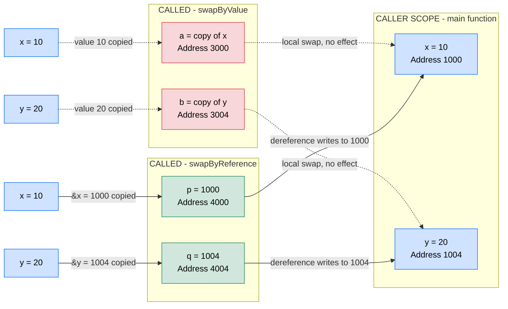
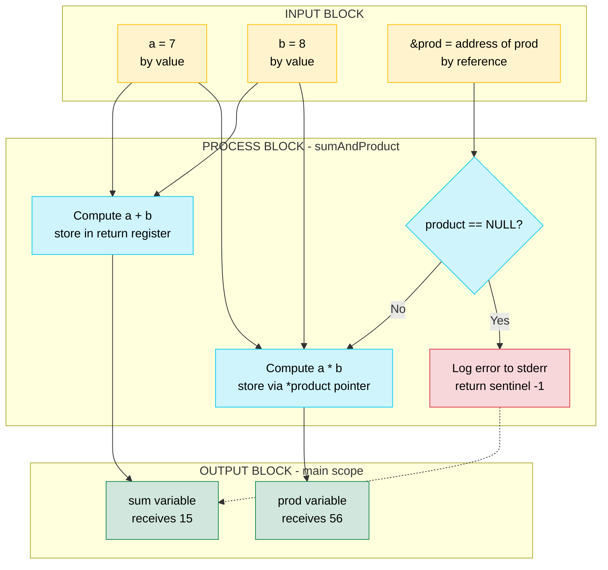
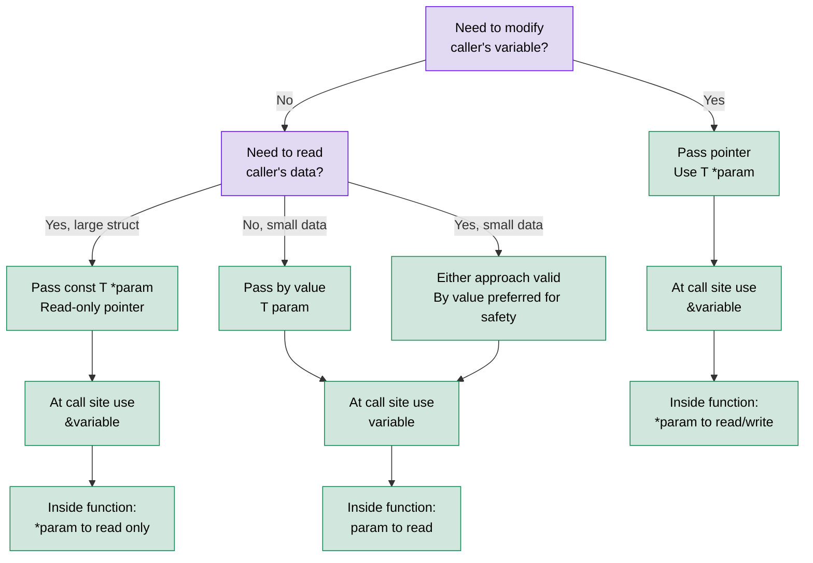

# Passing pointer to a function

<!-- SECTION_1_START -->
# Passing Pointers to a Function in C

## 1.1 Formal Academic Definition

In the C programming language, **passing a pointer to a function** is a parameter-passing mechanism in which the **memory address** of a variable (rather than a copy of its value) is supplied as an argument to a function. The receiving function declares a **pointer parameter**, which stores this incoming address. Using the **dereference operator (`*`)** inside the function body, the programmer can read from or write to the **original variable stored at that address in the caller's scope**.

Formally, if `T` is any valid C data type, the syntax for declaring a function that accepts a pointer of type `T` is:

```c
return_type function_name(T *parameter_name);
```

At the call site, the **address-of operator (`&`)** is applied to a variable of compatible type, producing a value of type `T *` which is then bound to the formal parameter.

> [!IMPORTANT]
> **KTU 2024 Syllabus Mapping (Module 4 – Pointers):**
> "Call by Reference — passing the address of variables to functions, modifying the original data through pointer dereferencing, and applications such as the `swap()` function and array manipulation."

## 1.2 Conceptual Analogy / Intuition

Imagine you live in **House No. 42** on a street. You have two ways for a friend to visit your house:

1. **Call by Value (photocopy):** Your friend takes a *photocopy* of your house number. Any changes made to the photocopy do **not** affect your original house. The photocopy is independent.
2. **Call by Reference (sharing your actual address):** Your friend writes down your *real address* on a piece of paper. Now the friend can travel to **House No. 42** and rearrange the furniture, paint the walls, or change the doorbell — these changes **directly affect your actual house** because the friend is working on the original.

In this analogy:
- The **house** is the **variable** stored in memory.
- The **house number** is the **memory address**.
- The **paper with the address** is the **pointer**.
- The **friend traveling to the address** is the **function dereferencing the pointer**.

## 1.3 Standard Metrics & Terminology

| Symbol | Name | Purpose |
| :--- | :--- | :--- |
| `&x` | Address-of operator | Yields the memory address of variable `x` |
| `*ptr` | Dereference operator | Accesses the value stored at the address held by `ptr` |
| `T *p` | Pointer declaration | Declares `p` as a pointer to type `T` |
| `NULL` | Null pointer constant | Standard sentinel value (defined in `<stddef.h>`), typically `0`, indicating "points to nothing" |

> [!NOTE]
> **Geometric / Memory Intuition:**
> Memory can be visualized as a **long horizontal row of numbered boxes**. Each box has a unique address (an integer). A pointer is simply a box that **stores the number of another box** rather than an ordinary data value. Dereferencing is the act of *walking down the hallway* to that numbered box to read or modify its contents.

> [!VISUALIZATION CONTROL]
> **Concept:** Memory address and dereferencing visualization
> **GeoGebra / Desmos Input Equations:**
> * Point A: `(0x7FFE, 10)` representing variable `x` at address `0x7FFE` holding value `10`
> * Point B: `(0x8002, 0x7FFE)` representing pointer `p` at address `0x8002` holding address `0x7FFE`
> * Arrow from B to A: `f(x) = 0x7FFE` for `x ≥ 0x8002`
> **Visual Description:** Two points on a number line — the first (variable) sits at a memory address holding the actual data; the second (pointer) sits at a different address but its content is the address of the first. An arrow connects the pointer to the variable to illustrate dereferencing.

<!-- SECTION_1_END -->

<!-- SECTION_2_START -->
# Deep Theoretical Analysis & KTU High-Yield Formula Sheet

## 2.1 Mechanism of Pointer Passing — Step by Step

When a pointer is passed to a function, the following sequence of events occurs inside the C runtime:

1. **Argument Evaluation at Call Site:** The expression supplied as the argument is evaluated. Using `&variable` yields the *l-value address* of the variable, producing a value of pointer type.
2. **Copy Propagation to Formal Parameter:** The address value (an integer in disguise) is *copied bit-for-bit* into the function's formal pointer parameter. The formal parameter is a *local variable* of the called function, but its value happens to be the address of the caller's variable.
3. **Indirection Inside the Function:** The function may apply `*` to the formal parameter, performing *indirection* — the CPU fetches data from the memory location specified by the pointer, which is the *exact same location* as the caller's variable.
4. **In-Place Modification:** Any assignment through the dereferenced pointer (e.g., `*ptr = newValue;`) writes directly to the caller's memory. The change is **persistent and visible** after the function returns.
5. **Parameter Lifetime:** When the function returns, the formal pointer parameter is destroyed (its stack frame is deallocated), but the *original variable* in the caller's scope is unaffected by this destruction.

> [!TIP]
> **The "Why" — Why Does This Work?**
> The C language uses a **flat memory model**. Every variable, regardless of scope, resides at some unique memory address. By passing an address, the function obtains the *coordinates* of the variable, granting it the ability to act on the original data — not a stale copy.

## 2.2 Comparison: Call by Value vs Call by Reference

| Property | Call by Value | Call by Reference (via Pointer) |
| :--- | :--- | :--- |
| **What is passed?** | A copy of the data value | A copy of the address (which points to the data) |
| **Effect on original** | Original is **unchanged** | Original **can be modified** |
| **Memory overhead** | Copies full data (can be costly for structs) | Copies only an address (typically 4 or 8 bytes) |
| **Safety** | Safer — no accidental side effects | Riskier — unintended modifications possible |
| **Use case** | Pure functions, computations | Multiple return values, in-place updates, `swap`, dynamic structures |
| **Syntax in declaration** | `void f(int x)` | `void f(int *x)` |
| **Syntax at call site** | `f(a);` | `f(&a);` |
| **Indirection required inside** | No | Yes — `*x` to access the original |

## 2.3 KTU Formula Sheet / Cheat Sheet

> [!IMPORTANT]
> The following relationships are the high-yield equivalences for pointer-to-function passing. **Memorize the type signatures** — they appear verbatim in KTU examination answers.

| # | Concept | Formal Statement | Type Signature |
| :--- | :--- | :--- | :--- |
| 1 | Address-of | `&x` produces a value of type `T *` if `x` is of type `T` | `T x` $\rightarrow$ `T *` |
| 2 | Dereference | `*p` is of type `T` if `p` is of type `T *` | `T *p` $\rightarrow$ `T` |
| 3 | Pointer parameter | A function receiving a pointer can be declared as `void f(T *p)` | `T *` parameter |
| 4 | Pointer argument | The matching call is `f(&variable_of_type_T);` | `T` $\rightarrow$ `T *` (implicit) |
| 5 | Null safety | Before dereferencing, check `if (p != NULL)` to avoid segmentation faults | Boolean guard |
| 6 | Size of pointer | `sizeof(T *)` is **independent** of `T` and equals the platform word size | `sizeof(ptr) = word\_size` |

> [!NOTE]
> **Real-World Engineering Utility:**
> 1. **Embedded Systems:** Peripheral registers (e.g., GPIO ports on microcontrollers) are memory-mapped. Drivers pass the *register address* to write functions to toggle pins — the canonical use of call-by-reference in firmware.
> 2. **Operating Systems Kernels:** The Linux kernel uses pointer passing extensively to modify process control blocks, page tables, and file descriptors without copying massive structures.
> 3. **Library APIs (e.g., `scanf`, `fread`):** Standard C library functions accept pointers precisely because they need to *write* results into caller-supplied memory locations — `scanf("%d", &n)` writes the integer into `n`.
> 4. **Data Structures:** Linked-list nodes, tree nodes, and graph edges are *always* manipulated via pointer passing because nodes are dynamically allocated and must be shared across functions.

<!-- SECTION_2_END -->

<!-- SECTION_3_START -->
# Step-by-Step Derivations & Code Implementation

## 3.1 Exhaustive Worked Example 1 — The Classic `swap` Function

Below is the **canonical** KTU examination problem. We will derive both the *incorrect* (call by value) and *correct* (call by reference) versions, showing the full memory-state trace.

### 3.1.1 Version A — INCORRECT (Call by Value)

```c
#include <stdio.h>

void swapByValue(int a, int b) {
    int temp = a;
    a = b;
    b = temp;
    printf("Inside swapByValue: a = %d, b = %d\n", a, b);
}

int main(void) {
    int x = 10;
    int y = 20;
    printf("Before swapByValue: x = %d, y = %d\n", x, y);
    swapByValue(x, y);
    printf("After  swapByValue: x = %d, y = %d\n", x, y);
    return 0;
}
```

**Memory-State Trace:**

| Step | Action | `x` at `&x` | `y` at `&y` | `a` at `&a` | `b` at `&b` |
| :--- | :--- | :--- | :--- | :--- | :--- |
| 1 | `int x = 10;` | `10` | undefined | — | — |
| 2 | `int y = 20;` | `10` | `20` | — | — |
| 3 | `swapByValue(x, y);` — values copied | `10` | `20` | `10` (copy) | `20` (copy) |
| 4 | `temp = a;` | `10` | `20` | `10` | `20` |
| 5 | `a = b;` | `10` | `20` | `20` | `20` |
| 6 | `b = temp;` | `10` | `20` | `20` | `10` |
| 7 | Return — `a` and `b` destroyed | `10` | `20` | — | — |

**Conclusion:** Values of `x` and `y` are unchanged. The swap was performed on *local copies* only.

### 3.1.2 Version B — CORRECT (Call by Reference via Pointer)

```c
#include <stdio.h>
#include <stddef.h>

void swapByReference(int *p, int *q) {
    if (p == NULL || q == NULL) {
        fprintf(stderr, "Error: NULL pointer passed to swapByReference.\n");
        return;
    }
    int temp = *p;
    *p = *q;
    *q = temp;
    printf("Inside swapByReference: *p = %d, *q = %d\n", *p, *q);
}

int main(void) {
    int x = 10;
    int y = 20;
    printf("Before swapByReference: x = %d, y = %d\n", x, y);
    swapByReference(&x, &y);
    printf("After  swapByReference: x = %d, y = %d\n", x, y);
    return 0;
}
```

**Memory-State Trace:**

| Step | Action | `x` at `1000` | `y` at `1004` | `p` at `2000` | `q` at `2004` |
| :--- | :--- | :--- | :--- | :--- | :--- |
| 1 | `int x = 10;` | `10` | ? | — | — |
| 2 | `int y = 20;` | `10` | `20` | — | — |
| 3 | `swapByReference(&x, &y);` — addresses copied | `10` | `20` | `1000` | `1004` |
| 4 | `int temp = *p;` $\rightarrow$ `temp = 10` | `10` | `20` | `1000` | `1004` |
| 5 | `*p = *q;` $\rightarrow$ write `20` to `1000` | `20` | `20` | `1000` | `1004` |
| 6 | `*q = temp;` $\rightarrow$ write `10` to `1004` | `20` | `10` | `1000` | `1004` |
| 7 | Return — `p`, `q`, `temp` destroyed | `20` | `10` | — | — |

**Expected Output:**

```
Before swapByReference: x = 10, y = 20
Inside swapByReference: *p = 20, *q = 10
After  swapByReference: x = 20, y = 10
```

**Valuation Key Points (KTU Examiner's Perspective):**
- [Declaring function with `int *p, int *q` parameters: 2 Marks]
- [Using `&x, &y` at call site: 1 Mark]
- [Correct dereference `*p` and `*q` operations: 3 Marks]
- [NULL safety check: 1 Mark]

## 3.2 Exhaustive Worked Example 2 — Returning Multiple Values via Pointer Parameters

Since C functions can return only **one value** syntactically, additional results are *output* through pointer parameters. Below is a function that returns both the **sum** and **product** of two integers using pointer outputs.

```c
#include <stdio.h>
#include <stddef.h>

int sumAndProduct(int a, int b, int *product) {
    if (product == NULL) {
        fprintf(stderr, "Error: NULL product pointer.\n");
        return -1;
    }
    *product = a * b;
    return a + b;
}

int main(void) {
    int x = 7;
    int y = 8;
    int prod = 0;
    int sum = sumAndProduct(x, y, &prod);
    printf("Sum = %d, Product = %d\n", sum, prod);
    return 0;
}
```

**Step-by-Step Logical Walkthrough:**

1. **Function signature analysis:** `sumAndProduct` takes two `int` values *by value* (`a`, `b`) and one `int *` *by reference* (`product`). The return type is `int`, which will carry the sum.
2. **Argument passing:**
   - `x` and `y` are passed by value — copies `7` and `8` go into `a` and `b`.
   - `&prod` is passed by reference — the *address* of `prod` goes into `product`.
3. **Inside the function:**
   - `*product = a * b;` $\rightarrow$ writes `56` into the memory location of `prod`.
   - `return a + b;` $\rightarrow$ returns `15` to `main`.
4. **In `main`:**
   - `sum` receives `15`.
   - `prod` now contains `56` (modified through the pointer).

**Algebraic relationship captured by the function:**

$$
\text{sum} = a + b
$$

$$
\text{product} = a \times b
$$

$$
\text{result pair} = (a+b,\ a \times b)
$$

## 3.3 Exhaustive Worked Example 3 — Pointer to a Function (Function Pointer as Argument)

This is an **advanced extension** of the topic. Instead of passing a *data pointer*, we pass a *function pointer*, allowing the caller to inject custom behavior.

```c
#include <stdio.h>
#include <stddef.h>

typedef int (*Operation)(int, int);

int applyOperation(int a, int b, Operation op) {
    if (op == NULL) {
        fprintf(stderr, "Error: NULL function pointer.\n");
        return 0;
    }
    return op(a, b);
}

int add(int a, int b)        { return a + b; }
int multiply(int a, int b)   { return a * b; }
int subtract(int a, int b)   { return a - b; }

int main(void) {
    int result = 0;
    result = applyOperation(10, 5, add);
    printf("Addition:       %d\n", result);
    result = applyOperation(10, 5, multiply);
    printf("Multiplication: %d\n", result);
    result = applyOperation(10, 5, subtract);
    printf("Subtraction:    %d\n", result);
    return 0;
}
```

**Expected Output:**

```
Addition:       15
Multiplication: 50
Subtraction:    5
```

**Type Signature Decoded:**

$$
\text{Operation} = \text{int} \ (\star)\ (\text{int},\ \text{int})
$$

This reads as: "a pointer (`*`) to a function that takes two `int`s and returns an `int`."

## 3.4 Compilation and Verification

To verify the correctness of all the programs above, the KTU lab environment typically uses the `gcc` compiler on a Linux platform.

**Compilation command (with all warnings enabled):**

```bash
gcc -Wall -Wextra -std=c11 -o program_name source_file.c
```

**Execution:**

```bash
./program_name
```

> [!TIP]
> **Always compile with `-Wall -Wextra`.** These flags enable strict warnings about uninitialized pointers, pointer-arithmetic errors, and mismatched types — the most common bugs in KTU practical examinations.

<!-- SECTION_3_END -->

<!-- SECTION_4_START -->
# Structural Diagrams & Schematics

## 4.1 Call-by-Value vs Call-by-Reference — Conceptual Flow



## 4.2 Memory Layout — Pointer Passing Sequence

```mermaid
sequenceDiagram
    participant Caller as main caller
    participant Pointer as Formal Parameter ptr
    participant Memory as Original Variable x

    Note over Caller: int x = 42;<br/>int *ptr;

    Caller->>Pointer: Pass &x (address e.g. 0x7FFE50)
    Pointer->>Pointer: ptr now holds 0x7FFE50

    Note over Pointer: *ptr = 100;

    Pointer->>Memory: Write 100 to address 0x7FFE50
    Memory->>Caller: x is now 100 (modified in place)

    Note over Pointer: Function returns<br/>ptr is destroyed

    Note over Memory: x remains 100<br/>persistent change
```

## 4.3 Block-Level Functional Architecture of `sumAndProduct`



## 4.4 Pointer Passing Decision Tree



<!-- SECTION_4_END -->

<!-- SECTION_5_START -->
# KTU 2024 Scheme Examination Question Bank & Topic Recap

## 5.1 Part A — Short Answer Questions (3 Marks Each)

### Question 1
**`[KTU University Exam – July 2023, Model Question Paper]`** $\rightarrow$ **CO1** | **RBT Level: Remember**

> Differentiate between **call by value** and **call by reference** in C. State one situation where each mechanism is preferred.

**Model Answer (3 Marks):**

| Aspect | Call by Value | Call by Reference |
| :--- | :--- | :--- |
| **Data passed** | A copy of the actual value | A copy of the address of the variable |
| **Original variable** | Remains unchanged | Can be modified by the called function |
| **Syntax** | `func(x);` | `func(&x);` |
| **Preferred when** | Function should not modify the original (e.g., a tax calculation) | Function must modify the original (e.g., a `swap` function) |

**[Definition of call by value: 1 Mark] [Definition of call by reference: 1 Mark] [Use case: 1 Mark]**

### Question 2
**`[KTU University Exam – December 2022, Supplementary Exam]`** $\rightarrow$ **CO1** | **RBT Level: Understand**

> What is the significance of the **address-of operator (`&`)** and the **dereference operator (`*`)** in the context of passing pointers to functions? Illustrate with a one-line example.

**Model Answer (3 Marks):**

- The **address-of operator (`&`)** is applied at the **call site** to obtain the memory address of a variable. This address is then passed as the argument. (1 Mark)
- The **dereference operator (`*`)** is applied to the **pointer parameter** inside the function to access (read or write) the value stored at that address. (1 Mark)
- **Example:** `increment(&n);` — the function `increment` receives the address of `n` and can write to it via `*p = *p + 1;`. (1 Mark)

---

## 5.2 Part B — Long Answer Questions (14 Marks Each)

### Question A — 14 Marks (Internal Choice Option 1)

**`[KTU University Exam – July 2024]`** $\rightarrow$ **CO2, CO3** | **RBT Level: Understand, Apply**

> **(a)** Explain with a suitable C program how **pointers are passed to functions** to modify the original variables in the caller's scope. Use the example of a function that swaps two integers. **(7 Marks)**
>
> **(b)** Write a C program using a **pointer parameter** to compute and return both the **area and perimeter of a rectangle** from a single function. The function should accept the length and breadth by value, and the perimeter by reference. **(7 Marks)**

#### Model Solution

**Part (a) — 7 Marks:**

```c
#include <stdio.h>
#include <stddef.h>

void swap(int *a, int *b) {
    if (a == NULL || b == NULL) {
        fprintf(stderr, "Error: NULL pointer received.\n");
        return;
    }
    int temp = *a;
    *a = *b;
    *b = temp;
}

int main(void) {
    int x = 25, y = 40;
    printf("Before swap: x = %d, y = %d\n", x, y);
    swap(&x, &y);
    printf("After  swap: x = %d, y = %d\n", x, y);
    return 0;
}
```

**Expected Output:**
```
Before swap: x = 25, y = 40
After  swap: x = 40, y = 25
```

**Valuation Key:**
- [Function definition with two `int *` parameters: 2 Marks]
- [Proper use of dereference `*a`, `*b` in the swap logic: 2 Marks]
- [Correct call site `swap(&x, &y);`: 1 Mark]
- [NULL safety check and explanation: 1 Mark]
- [Explanation of why the original variables change (pointer points to the same memory): 1 Mark]

**Part (b) — 7 Marks:**

```c
#include <stdio.h>

void rectangle(int length, int breadth, int *perimeter) {
    if (perimeter == NULL) {
        fprintf(stderr, "Error: NULL perimeter pointer.\n");
        return;
    }
    *perimeter = 2 * (length + breadth);
}

int main(void) {
    int l = 0, b = 0, p = 0;
    printf("Enter length and breadth: ");
    if (scanf("%d %d", &l, &b) != 2) {
        fprintf(stderr, "Invalid input.\n");
        return 1;
    }
    rectangle(l, b, &p);
    int area = l * b;
    printf("Area = %d, Perimeter = %d\n", area, p);
    return 0;
}
```

**Valuation Key:**
- [Function signature with mixed value/reference parameters: 1 Mark]
- [Formula $A = l \times b$ applied correctly: 1 Mark]
- [Formula $P = 2(l+b)$ stored via `*perimeter`: 2 Marks]
- [Input validation via `scanf` return check: 1 Mark]
- [NULL check on pointer: 1 Mark]
- [Final correct output: 1 Mark]

---

### Question B — 14 Marks (Internal Choice Option 2)

**`[KTU University Exam – December 2023]`** $\rightarrow$ **CO2, CO3** | **RBT Level: Understand, Apply**

> **(a)** What is a **function pointer**? Write a C program that passes a function as an argument to another function to perform basic arithmetic operations (addition, subtraction, multiplication) on two integers selected by the user. **(7 Marks)**
>
> **(b)** A function receives the **base address of an integer array** and its **size** as arguments. Write a C program to compute and return the **sum of all elements** and the **maximum element** through pointer parameters. **(7 Marks)**

#### Model Solution

**Part (a) — 7 Marks:**

```c
#include <stdio.h>
#include <stddef.h>

typedef int (*ArithOp)(int, int);

int add(int a, int b)       { return a + b; }
int subtract(int a, int b)  { return a - b; }
int multiply(int a, int b)  { return a * b; }

int compute(int x, int y, ArithOp op) {
    if (op == NULL) {
        fprintf(stderr, "Error: NULL function pointer.\n");
        return 0;
    }
    return op(x, y);
}

int main(void) {
    int a = 0, b = 0, choice = 0;
    printf("Enter two integers: ");
    if (scanf("%d %d", &a, &b) != 2) return 1;

    printf("Choose operation: 1=Add 2=Sub 3=Mul: ");
    if (scanf("%d", &choice) != 1) return 1;

    ArithOp op = NULL;
    switch (choice) {
        case 1: op = add;      break;
        case 2: op = subtract; break;
        case 3: op = multiply; break;
        default:
            fprintf(stderr, "Invalid choice.\n");
            return 1;
    }

    printf("Result = %d\n", compute(a, b, op));
    return 0;
}
```

**Valuation Key:**
- [Definition of function pointer with correct typedef syntax: 1 Mark]
- [Three arithmetic functions defined correctly: 1 Mark]
- [`compute` function accepting function pointer parameter: 2 Marks]
- [User-driven selection of operation: 1 Mark]
- [NULL safety on function pointer: 1 Mark]
- [Final correct output for at least one case: 1 Mark]

**Part (b) — 7 Marks:**

```c
#include <stdio.h>
#include <stddef.h>

void analyzeArray(int *arr, int size, int *sum, int *max) {
    if (arr == NULL || sum == NULL || max == NULL || size <= 0) {
        fprintf(stderr, "Error: Invalid arguments.\n");
        return;
    }
    *sum = 0;
    *max = arr[0];
    for (int i = 0; i < size; i++) {
        *sum += *(arr + i);
        if (*(arr + i) > *max) {
            *max = *(arr + i);
        }
    }
}

int main(void) {
    int numbers[] = {12, 45, 7, 89, 23, 56};
    int size = sizeof(numbers) / sizeof(numbers[0]);
    int total = 0, maximum = 0;

    analyzeArray(numbers, size, &total, &maximum);

    printf("Sum = %d, Maximum = %d\n", total, maximum);
    return 0;
}
```

**Expected Output:**
```
Sum = 232, Maximum = 89
```

**Valuation Key:**
- [Function signature with `int *arr`, `int size`, `int *sum`, `int *max`: 2 Marks]
- [Pointer arithmetic `*(arr + i)` to traverse the array: 1 Mark]
- [Correct sum accumulation logic: 1 Mark]
- [Correct max-tracking logic with initial value `arr[0]`: 1 Mark]
- [NULL and size validation: 1 Mark]
- [Final correct output: 1 Mark]

---

> [!WARNING]
> **KTU Examiner's Valuation Pitfall Callout — Common Mark-Deduction Zones:**
> 1. **Forgetting `&` at the call site** (e.g., writing `swap(x, y);` instead of `swap(&x, &y);`) — instant compilation error; lose 2–3 marks.
> 2. **Confusing `*` and `&` in function parameters** — declaring `void f(int a);` but then writing `*a = 5;` inside results in a compilation error. Always match the parameter declaration with the dereference operator usage.
> 3. **Skipping the NULL check** — the 2024 scheme emphasizes robust, defensive code. Examiners explicitly look for `if (p == NULL) return;` and award partial credit accordingly.
> 4. **Modifying a formal parameter assuming it changes the original** (a common conceptual error). Always remember: **changes through `*ptr` persist; changes to `ptr` itself do not.**
> 5. **Passing a pointer to the wrong type** — e.g., passing a `float *` where an `int *` is expected. Use compiler warnings (`-Wall -Wextra`) to catch this.
> 6. **Returning a pointer to a local variable** from the function — this is undefined behavior and a frequent KTU trap question.

---

## 5.3 Topic Recap & Important Things to Remember

> [!IMPORTANT]
> **High-Density Revision Checklist — Passing Pointers to Functions in C**

- **Core Idea:** Passing a pointer means passing the *address* of a variable, not a copy of its value. This allows the called function to **modify the original variable** in the caller's scope.
- **Two Essential Operators:**
  * `&x` $\rightarrow$ **address-of** — used at the **call site** to obtain a variable's address.
  * `*p` $\rightarrow$ **dereference** — used inside the **called function** to access the value at the address held by `p`.
- **Function Signature Pattern:** `return_type function_name(T *parameter);`
- **Call Site Pattern:** `function_name(&variable_of_type_T);`
- **Call by Value vs Call by Reference:**
  * Value $\rightarrow$ no modification of original.
  * Reference $\rightarrow$ original is modified through indirection.
- **Pointer Parameter Lifetime:** The pointer variable itself is a *local* of the called function and is destroyed on return, but changes made **through** the pointer to the original variable are **persistent**.
- **NULL Safety Mandate:** Before dereferencing any pointer parameter, **always** check `if (ptr == NULL) { /* handle error */ return; }`. This is a KTU 2024 scheme evaluation criterion.
- **`scanf` Family:** Functions like `scanf("%d", &n);` are the *most common real-world example* of passing a pointer to a function — `scanf` writes the parsed integer into `n` via the supplied address.
- **Multiple Return Values:** A C function can return only one value syntactically. To "return" more, use **output pointer parameters** (see `sumAndProduct` and `analyzeArray` examples).
- **Function Pointers (Advanced):** You can also pass a *function* (not just data) as an argument using the syntax `return_type (*ptr_name)(args);`. This enables callback-based designs.
- **Array-Pointer Duality:** When you pass an array to a function, it *decays* into a pointer to its first element. Hence, the function receives a pointer and can use pointer arithmetic `*(arr + i)` to traverse.
- **Const-Correctness Tip:** If the function should *read* but not *modify* a value, use `const T *ptr` in the parameter — this documents intent and lets the compiler catch accidental writes.
- **Type Matching:** The argument type at the call site must exactly match the formal parameter type. `&x` of type `int` matches `int *`; `&arr[0]` of type `int` matches `int *`. Use compiler warnings to verify.
- **No Implicit Address Generation:** C does *not* automatically take the address of a variable. You **must** explicitly write `&variable` at the call site.
- **Memory Footprint:** Passing a pointer (typically 4 or 8 bytes) is far more memory-efficient than passing a large struct by value, which would copy the entire structure onto the stack.

<!-- SECTION_5_END -->
