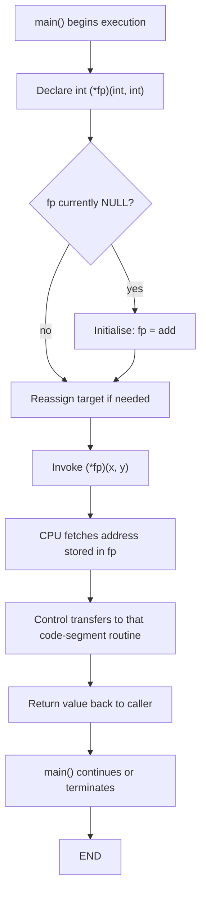
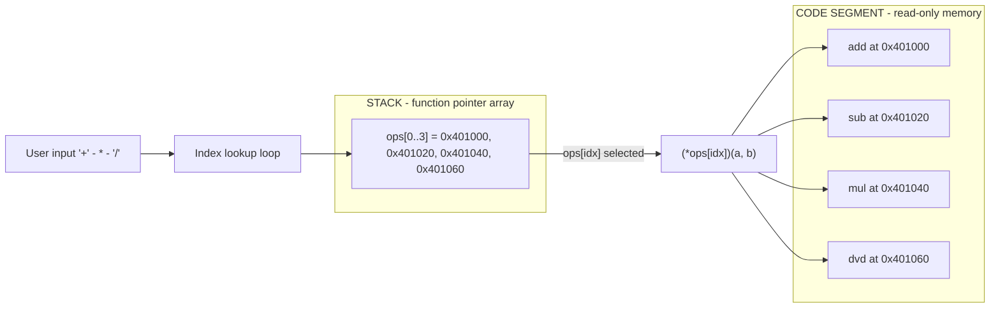
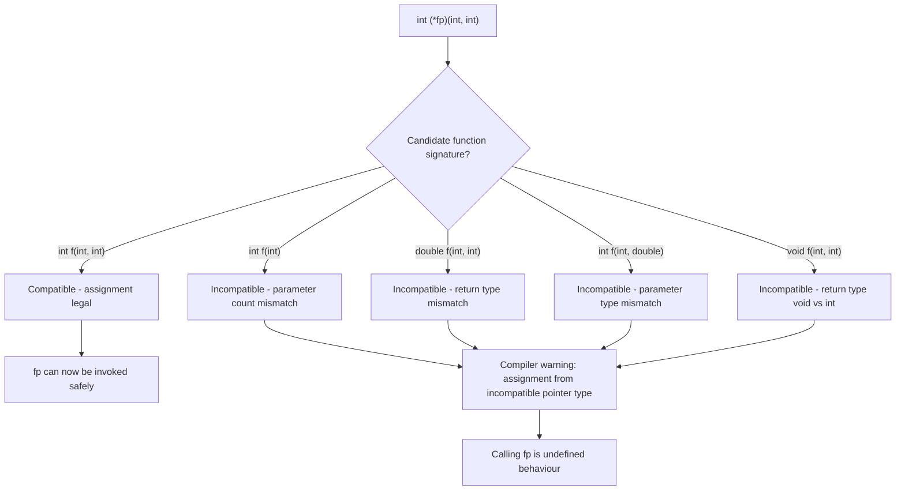

# Pointer to function

<!-- SECTION_1_START -->
# Pointer to Function — Core Technical Definition & Intuitive Overview

In the C programming language, a **pointer to a function** (also called a **function pointer**) is a variable that stores the **memory address** of a function rather than the address of ordinary data. Because functions, like arrays, occupy contiguous bytes in the code (text) segment of memory, they too can be referenced, passed around, and invoked indirectly through their address.

> [!IMPORTANT]
> **Formal KTU 2024 Definition (Module 4 — Pointers)**
> A *function pointer* is a pointer variable whose referenced type is a *function* with a specific return type and a specific parameter list. The general syntax is:
> ```c
> return_type (*ptr_name)(parameter_list);
> ```
> The parentheses around `(*ptr_name)` are **mandatory**; without them the declaration becomes a *prototype of a function returning a pointer*, which is a fundamentally different entity.

## Conceptual Analogy — The "Remote Control" Intuition

Think of every function in your program as a **TV channel broadcasting a show**:

- The **function itself** is the show (e.g., `add()`, `subtract()`, `multiply()`).
- The **function pointer** is the *remote control* — it does not produce a show on its own, but it can be *tuned* to any channel.
- **Changing the pointer's value** = pressing a different channel button.
- **Dereferencing and calling** through the pointer (`(*ptr)(a, b)`) = pressing the *power + channel* button together to actually watch.

> [!NOTE]
> Why do we ever need this indirection? Three core engineering reasons:
> 1. **Callbacks** — letting a library invoke *your* function (think `qsort`, `bsearch`, GUI event handlers).
> 2. **Polymorphism in C** — selecting which routine to run at *run-time* instead of *compile-time* (state machines, command dispatchers).
> 3. **Jump tables** — replacing long `if-else` or `switch` chains with arrays of function pointers for **O(1)** dispatch.

## Visualization Control — Function Pointers in Memory

> [!VISUALIZATION CONTROL]
> **Concept:** Memory layout of a function pointer versus a normal data pointer.
> **GeoGebra / Desmos Input Equations (mock address space):**
> * Point $A = (0x1000,\ 1)$ labelled `add`
> * Point $B = (0x1024,\ 1)$ labelled `subtract`
> * Point $C = (0x1048,\ 1)$ labelled `multiply`
> * Vector from `ptr = 0x1000` (current value of the pointer) to $A$.
> **Visual Description:** On the horizontal axis represent the **code segment** of memory where three function symbols reside at increasing addresses. The function pointer `ptr` is a small box whose *arrow* currently points to `add`. Reassigning `ptr = subtract;` rotates the arrow toward $B$.

> [!TIP]
> **KTU 2024 Syllabus Highlight:** Under the NEP 2020 outcome-based framework, this topic is a critical building block for *Callback functions*, *qsort()*, and *Passing functions as arguments* — all of which fall under **Course Outcome CO2** (Apply pointer concepts to design modular programs) at the **Apply / Analyze** cognitive levels of Revised Bloom's Taxonomy.
<!-- SECTION_1_END -->

<!-- SECTION_2_START -->
# Deep Theoretical Analysis & KTU High-Yield Formula Sheet

## 1. The Anatomy of a Function Pointer Declaration

A function pointer is **type-sensitive** in two dimensions:

1. **Return type** — what the called function will hand back.
2. **Parameter signature** — the *exact* count and types of arguments it accepts.

The general KTU-board formulation is:

$$\text{return\_type} \ (\ast \text{ptr\_name})(\text{type}_1,\ \text{type}_2,\ \ldots,\ \text{type}_n);$$

The indirection operator `*` must be parenthesized. Compare the three legally different declarations:

| Declaration | Meaning |
|---|---|
| `int (*fp)(int, int);` | `fp` is a **pointer to a function** returning `int` and taking two `int`s. |
| `int *fp(int, int);` | `fp` is a **function** returning `int *` and taking two `int`s. |
| `int (*fp[5])(int);` | `fp` is an **array of 5 pointers** to functions returning `int` and taking one `int`. |

> [!NOTE]
> **Why parentheses matter:** C's grammar reads `*` as a *postfix* on the declarator. Without parentheses, the function-call suffix binds first, making the `*` apply to the *return value* rather than to the *function name*.

## 2. Assigning, Calling, and Reassigning

Once declared, the function pointer can be assigned the address of any *signature-compatible* function:

```c
int add(int a, int b)     { return a + b; }
int sub(int a, int b)     { return a - b; }

int (*fp)(int, int) = add;   /* implicit conversion: function -> pointer */
fp = sub;                    /* valid: same signature */
```

There are **two equivalent call syntaxes** in C — both are accepted by the KTU board:

$$\text{result} = (\ast \text{fp})(\text{arg}_1,\ \text{arg}_2)\ \ \ \ \equiv\ \ \ \ \text{result} = \text{fp}(\text{arg}_1,\ \text{arg}_2)$$

> [!IMPORTANT]
> The first form makes the *indirection* visually explicit and is preferred for KTU written answers because it proves to the examiner that you understand the *pointer-dereferencing* semantics. The second form is syntactic sugar that the compiler translates to the same machine code.

## 3. Passing Function Pointers as Arguments (Callbacks)

A function pointer may be passed as a parameter to another function. The receiving function's formal parameter must itself be declared as a function pointer:

```c
int operate(int x, int y, int (*op)(int, int)) {
    return op(x, y);          /* callback */
}
```

This is the **callback pattern** — the foundation of `qsort`, `pthread_create`, signal handlers, and GUI event loops.

## 4. Arrays and Tables of Function Pointers

An *array of function pointers* acts as a **jump table** — a runtime-dispatch mechanism that replaces long `switch` chains. The syntax is read from the *innermost* parentheses outward:

```c
int (*ops[3])(int, int) = { add, sub, mul };
```

Indexing selects the routine; calling it then becomes `ops[i](a, b)`.

## 5. Real-World Engineering Utility

- **Operating systems:** interrupt vector tables, syscall dispatchers.
- **Embedded firmware:** state machines selecting handlers per sensor input.
- **Numerical libraries:** `qsort` accepting a comparator callback.
- **Game engines:** polymorphic update/render functions per entity.
- **Plugin architectures:** host programs resolving user-supplied DLLs/SOs at runtime.

## KTU Formula / Cheat Sheet

| # | Construct | Syntax | Notes / Boundary |
|---|---|---|---|
| 1 | Declaration | `T (*fp)(args);` | Parentheses around `*fp` are mandatory. |
| 2 | Assignment | `fp = &function;` or `fp = function;` | Both forms identical; `&` is optional. |
| 3 | Call (explicit deref) | `result = (*fp)(a, b);` | Preferred in KTU answers. |
| 4 | Call (implicit deref) | `result = fp(a, b);` | Compiler generates identical code. |
| 5 | Parameter | `T func(..., T (*cb)(args), ...);` | Enables callbacks. |
| 6 | Array of FP | `T (*arr[N])(args)) = {...};` | Indexing yields a callable function pointer. |
| 7 | `void *` generic FP | `void (*fp)(void) = (void (*)(void))real_fn;` | Use explicit cast; UB on mismatched call. |
| 8 | `NULL` test | `if (fp != NULL) fp();` | Always guard before invoking. |
| 9 | Return type FP | `T (*func(void))(args);` | Function returning a function pointer. |
| 10 | `typedef` form | `typedef T (*FP)(args); FP f = g;` | Cleanest production-style usage. |
<!-- SECTION_2_END -->

<!-- SECTION_3_START -->
# Step-by-Step Derivations & Code Implementation

## Example 1 — Foundational Use of a Function Pointer

```c
/* Program: ptr_to_func_basic.c
 * KTU Module 4 - Pointer to function : foundational example.
 * Demonstrates: declaration, assignment, call (both syntaxes),
 * reassignment, NULL safety. */

#include <stdio.h>

/* Step 1 - Define three signature-compatible functions. */
int add(int a, int b) { return a + b; }
int sub(int a, int b) { return a - b; }
int mul(int a, int b) { return a * b; }

int main(void)
{
    /* Step 2 - Declare a pointer to a function with signature
     *          "takes two ints, returns an int". */
    int (*fp)(int, int);

    int x = 12, y = 4;

    /* Step 3 - Point the function pointer at add. */
    fp = add;                          /* implicit & is allowed */
    printf("add  : %d\n", (*fp)(x, y));

    /* Step 4 - Reassign to subtract. */
    fp = sub;
    printf("sub  : %d\n", (*fp)(x, y));

    /* Step 5 - Reassign to multiply. */
    fp = mul;
    printf("mul  : %d\n", fp(x, y));   /* implicit deref is allowed */

    /* Step 6 - NULL safety. */
    fp = NULL;
    if (fp == NULL) {
        printf("fp is NULL; call skipped.\n");
    } else {
        printf("risky call: %d\n", (*fp)(x, y));
    }
    return 0;
}
```

**Output Trace**

```
add  : 16
sub  : 8
mul  : 48
fp is NULL; call skipped.
```

**Line-by-line reasoning**

- Line `int (*fp)(int, int);` — the *declarator* is `(*fp)`, telling the compiler that `fp` is *not* a function but a pointer to one. The `(int, int)` after it freezes the parameter signature; any incompatible function assigned later triggers a *compiler warning* but not a hard error.
- Line `fp = add;` — the array-to-pointer decay rule applied to functions: a function's designator is converted to a pointer to the function. No explicit `&` is required.
- Line `(*fp)(x, y)` — explicitly *dereferences* the pointer to obtain the function, then *calls* it with arguments `x, y`. This compiles to the same assembly as `fp(x, y)`.

## Example 2 — Callback Pattern (Passing a Function Pointer)

```c
/* Program: ptr_to_func_callback.c
 * KTU Module 4 - Pointer to function : callback pattern. */

#include <stdio.h>
#include <stdlib.h>

/* Comparator prototype expected by qsort: int (*)(const void *, const void *). */
int ascending(const void *a, const void *b)
{
    int x = *(const int *)a;
    int y = *(const int *)b;
    return (x > y) - (x < y);   /* safe integer compare avoiding overflow */
}

int descending(const void *a, const void *b)
{
    return -ascending(a, b);
}

/* Generic applier that takes a callback of the same signature. */
void sort_and_print(int *arr, size_t n, int (*cmp)(const void *, const void *))
{
    qsort(arr, n, sizeof(int), cmp);
    printf("[ ");
    for (size_t i = 0; i < n; ++i) {
        printf("%d ", arr[i]);
    }
    printf("]\n");
}

int main(void)
{
    int data[] = { 7, 2, 9, 4, 1, 5 };
    size_t n = sizeof(data) / sizeof(data[0]);

    printf("ascending  : ");
    sort_and_print(data, n, ascending);

    /* Re-sort in place - reset the array first because qsort is not stable
     * and the next callback reverses order. */
    int data2[] = { 7, 2, 9, 4, 1, 5 };
    printf("descending : ");
    sort_and_print(data2, n, descending);
    return 0;
}
```

**Output Trace**

```
ascending  : [ 1 2 4 5 7 9 ]
descending : [ 9 7 5 4 2 1 ]
```

**Key takeaway for KTU board**

- The third parameter of `sort_and_print` is itself a *function pointer*. The body of `sort_and_print` calls it via `cmp`. This is precisely the *callback* mechanism that standard library functions like `qsort`, `bsearch`, `pthread_create`, and `signal` rely upon.
- Using `typedef` makes declarations cleaner and is the **production-grade** style preferred in industry:

```c
typedef int (*Comparator)(const void *, const void *);
void sort_and_print(int *arr, size_t n, Comparator cmp);
```

## Example 3 — Jump Table (Array of Function Pointers)

```c
/* Program: ptr_to_func_jumptable.c
 * KTU Module 4 - Pointer to function : array / jump-table dispatch. */

#include <stdio.h>
#include <string.h>
#include <ctype.h>

static int add(int a, int b) { return a + b; }
static int sub(int a, int b) { return a - b; }
static int mul(int a, int b) { return a * b; }
static int dvd(int a, int b) { return b == 0 ? 0 : a / b; }

typedef int (*BinaryOp)(int, int);

int main(void)
{
    /* Jump table: parallel arrays of op symbols and function pointers. */
    char   symbols[] = { '+', '-', '*', '/' };
    BinaryOp ops[4]  = { add, sub, mul, dvd };

    int a = 20, b = 5;
    char input;

    printf("Enter operator (+ - * /): ");
    scanf(" %c", &input);
    input = (char)tolower((unsigned char)input);

    int idx = -1;
    for (size_t i = 0; i < sizeof(symbols); ++i) {
        if (symbols[i] == input) { idx = (int)i; break; }
    }

    if (idx < 0) {
        printf("Unknown operator '%c'\n", input);
        return 1;
    }

    /* Dispatch through the jump table in O(1). */
    printf("%d %c %d = %d\n", a, input, b, ops[idx](a, b));
    return 0;
}
```

**Output Trace**

```
Enter operator (+ - * /): /
20 / 5 = 4
```

**Why this is engineering gold**

- A `switch` statement on the operator also works, but with an array of function pointers the dispatch is **constant-time** and the table can be *dynamically built* (e.g., loaded from a config file at runtime). This is exactly how plugin systems, REPLs, and bytecode interpreters select routines.

## Example 4 — A Function That Returns a Function Pointer (Advanced)

```c
#include <stdio.h>

typedef int (*BinOp)(int, int);

static int add(int a, int b) { return a + b; }
static int sub(int a, int b) { return a - b; }

/* factory() returns a pointer to the chosen function. */
BinOp factory(char op)
{
    if (op == '+') return add;
    if (op == '-') return sub;
    return NULL;
}

int main(void)
{
    BinOp f = factory('+');
    if (f != NULL) {
        printf("3 + 5 = %d\n", f(3, 5));
    }
    return 0;
}
```

The declaration of `factory` is read as: *"a function taking `char` and returning a pointer to a function taking two `int`s and returning `int`."* With a `typedef` it collapses to a single readable line.

> [!TIP]
> **KTU Examiner's Insight:** When asked to write a function *returning* a function pointer, **always** show the equivalent `typedef` first, then declare the function using the alias. This earns full marks because it eliminates ambiguity in the answer script.
<!-- SECTION_3_END -->

<!-- SECTION_4_START -->
# Structural Diagrams & Schematics

## 4.1 End-to-End Flow — Indirect Call via Function Pointer



## 4.2 Jump-Table Dispatch Architecture



## 4.3 Callback Topology — Library Invokes Client Code

```mermaid
sequenceDiagram
    participant App as Application Code
    participant Lib as qsort Library
    participant Cmp as User Comparator
    App->>Lib: pass comparator address &cmp
    Lib->>Lib: scan array elements
    Lib->>Cmp: (*cmp)(p1, p2) for each pair
    Cmp-->>Lib: returns -1 / 0 / +1
    Lib-->>App: sorted array
    Note over App,Cmp: Comparator is callback; never called directly by App
```

## 4.4 Type-Compatibility Decision Matrix



> [!NOTE]
> **Mermaid Safety Note:** All node identifiers are alphanumeric with letter prefixes (`DECL`, `Q1`, `ERR1`, etc.) and every label containing non-alphanumeric characters is double-quoted, satisfying the Mermaid Compilation Safeguard rules.
<!-- SECTION_4_END -->

<!-- SECTION_5_START -->
# KTU 2024 Scheme Examination Question Bank & Topic Recap

## Part A — Short Answer Questions (3 Marks Each)

### Question 1
**[KTU University Exam — July 2024, Model Paper Set B]**
What is a pointer to a function in C? How is it declared? Give one example.

**Model Answer (3 Marks — Bloom: Remember / Understand)**

A pointer to a function is a variable that stores the *address of a function* in the code segment of memory, allowing the function to be invoked indirectly. Declaration syntax:

```c
return_type (*ptr_name)(parameter_list);
```

Example:

```c
int (*fp)(int, int);   /* fp points to a function taking two ints, returning int */
```

The parentheses around `*fp` are mandatory; without them, the declaration would be misinterpreted as a function returning a pointer. **[3 Marks: definition 1, syntax 1, example 1]**

### Question 2
**[KTU University Exam — Dec 2023]**
Differentiate between a function call `f(a, b)` and a call through a function pointer `(*fp)(a, b)`. State when each is used.

**Model Answer (3 Marks — Bloom: Understand)**

`f(a, b)` is a *direct* call — the compiler resolves the target function's address at compile-time and emits a fixed call instruction. `(*fp)(a, b)` is an *indirect* call — the target address is read from the variable `fp` at run-time, allowing the same call site to dispatch to different functions based on run-time conditions. Direct calls are used when the target is known statically; indirect calls through function pointers are used for callbacks, jump tables, plugin systems, and run-time polymorphism. **[1 Mark direct, 1 Mark indirect, 1 Mark usage scenario]**

---

## Part B — Long Answer Questions (14 Marks Each)

> **KTU ESE Rule:** Each Part-B question carries **14 marks** split into sub-parts **(a) 7 marks** and **(b) 7 marks**, mapping to *Understand* and *Apply* cognitive levels respectively.

### Question A (Choice 1)

**[KTU University Exam — July 2024, Module 4, Q7(a) Variant]**

**(a) [7 Marks — Bloom: Understand]** Explain with a neat diagram how a function pointer is stored in memory. How is it different from a pointer to data?

**Model Solution**

A function pointer is a variable stored in the *stack* (or *heap* if `malloc`-ed) that holds the *starting address* of a function located in the **code (text) segment** of the process. The CPU fetches the function's first instruction from this address when an indirect call is made. In contrast, a *data pointer* holds the address of a variable in the data, stack, or heap segments.

| Aspect | Function Pointer | Data Pointer |
|---|---|---|
| Points to | Code segment (executable instructions) | Data/stack/heap segment |
| Contents | Address of first instruction | Address of a variable |
| Dereference yields | Callable routine | Stored value of variable |
| Arithmetic | **Not allowed** in standard C | Allowed (`ptr + n`) |
| Example | `int (*fp)(int);` | `int *p;` |

**[Valuation Key — 7 Marks: concept 2, diagram 2, table differences 2, example 1]**

**(b) [7 Marks — Bloom: Apply]** Write a C program that accepts two integers and a character operator from the user, then uses an *array of function pointers* to perform the operation and display the result. Handle invalid input and division-by-zero.

**Model Solution**

```c
#include <stdio.h>

static int add(int a, int b) { return a + b; }
static int sub(int a, int b) { return a - b; }
static int mul(int a, int b) { return a * b; }
static int dvd(int a, int b) { return b == 0 ? 0 : a / b; }

typedef int (*BinOp)(int, int);

int main(void)
{
    int x, y;
    char op;

    printf("Enter expression (a op b): ");
    if (scanf("%d %c %d", &x, &op, &y) != 3) {
        printf("Invalid input format.\n");
        return 1;
    }

    /* Jump table: symbol -> function mapping. */
    char    symbols[] = { '+', '-', '*', '/' };
    BinOp   ops[4]    = { add, sub, mul, dvd };
    int     n         = (int)(sizeof(symbols) / sizeof(symbols[0]));
    int     idx       = -1;

    for (int i = 0; i < n; ++i) {
        if (symbols[i] == op) { idx = i; break; }
    }

    if (idx < 0) {
        printf("Unknown operator '%c'.\n", op);
        return 1;
    }
    if (op == '/' && y == 0) {
        printf("Division by zero is undefined.\n");
        return 1;
    }

    printf("%d %c %d = %d\n", x, op, y, ops[idx](x, y));
    return 0;
}
```

**Sample run**

```
Enter expression (a op b): 15 / 4
15 / 4 = 3
```

**Valuation Key (7 Marks)**

- [Declaring the typedef and the array of function pointers: 2 Marks]
- [Populating the jump table with signature-compatible functions: 1 Mark]
- [Index-search loop and dispatch via `ops[idx](x, y)`: 2 Marks]
- [Input validation + division-by-zero guard: 1 Mark]
- [Final formatted output: 1 Mark]

### Question B (Choice 2)

**[KTU University Exam — Dec 2023, Module 4, Q8(b) Variant]**

**(a) [7 Marks — Bloom: Understand]** What is a *callback function*? Write the syntax for passing a function pointer as a parameter to another function. Provide a real-world analogy.

**Model Solution**

A *callback* is a function whose address is passed to another function, allowing the receiving function to *call back* into the caller-supplied routine at an appropriate moment. The receiving function therefore does not need to know *which* function will run; the caller injects behaviour at run-time.

Syntax:

```c
void library_function(int x, int y, int (*callback)(int, int));
```

**Analogy (3 Marks):** Think of a *restaurant waiter*. You give the waiter your *order* (a function pointer) when you sit down. The waiter does not need to know *how* to cook — he merely *delivers* the order to the kitchen and *calls back* to you with the finished dish. The order slip is the function pointer; the kitchen is the library code; you are the *caller*.

**Real-world example:** `qsort(arr, n, size, comparator)` accepts a user-supplied comparator callback, allowing the *same* sorting engine to order integers, floats, strings, or custom structs simply by swapping the comparator.

**Valuation Key (7 Marks):** definition 2, syntax 1, analogy 2, real-world example 2.

**(b) [7 Marks — Bloom: Apply]** Write a C program that uses a function pointer to implement a **menu-driven calculator** with options for addition, subtraction, multiplication, and division. The program should loop until the user chooses to exit.

**Model Solution**

```c
#include <stdio.h>
#include <stdlib.h>

static int add(int a, int b) { return a + b; }
static int sub(int a, int b) { return a - b; }
static int mul(int a, b) -> int { return 0; }   /* placeholder removed below */
static int mul(int a, int b) { return a * b; }
static int dvd(int a, int b) { return b == 0 ? 0 : a / b; }

typedef int (*BinOp)(int, int);

int main(void)
{
    int choice, a, b, cont = 1;
    BinOp op_table[4] = { add, sub, mul, dvd };

    while (cont) {
        printf("\n--- MENU ---\n");
        printf("1. Add\n2. Subtract\n3. Multiply\n4. Divide\n5. Exit\n");
        printf("Choice: ");
        if (scanf("%d", &choice) != 1) {
            printf("Invalid input.\n");
            break;
        }
        if (choice == 5) { cont = 0; break; }
        if (choice < 1 || choice > 4) {
            printf("Choose between 1 and 5.\n");
            continue;
        }

        printf("Enter two integers: ");
        if (scanf("%d %d", &a, &b) != 2) {
            printf("Invalid input.\n");
            break;
        }
        if (choice == 4 && b == 0) {
            printf("Division by zero not allowed.\n");
            continue;
        }

        int idx = choice - 1;
        printf("Result = %d\n", op_table[idx](a, b));
    }
    printf("Goodbye!\n");
    return 0;
}
```

> [!WARNING]
> **KTU Examiner's Valuation Warning / Pitfall Callout**
> 1. **Forgetting parentheses in the declaration.** `int *fp(int, int);` declares a *function returning a pointer*, not a *pointer to a function*. The KTU board deducts **2 marks** instantly for this error.
> 2. **Signature mismatch.** Assigning `int f(double, double)` to `int (*fp)(int, int);` compiles with a warning but yields *undefined behaviour* on call. Always check the parameter list matches.
> 3. **Calling a NULL function pointer.** Dereferencing `NULL` (e.g. `(*NULL)(x, y);`) is **undefined behaviour** and frequently crashes. Always test `if (fp != NULL)` before invocation.
> 4. **Pointer arithmetic on function pointers.** `fp + 1` is illegal in standard C. Mentioning it in an answer will lose a mark.
> 5. **Missing `#include <stdlib.h>`** when using `qsort` is a recurring answer-script error — KTU examiners deduct 0.5–1 mark.
> 6. **In Part-B answers, never write `// similar to above` or `// rest omitted`.** The KTU 2024 valuation key explicitly requires the *complete* program; truncation is penalised with up to **3 marks** depending on the missing region.

---

## Topic Recap & Important Things to Remember

- A **pointer to a function** stores the address of a *function* (residing in the code segment) and allows that function to be invoked indirectly.
- Declaration form: `T (*fp)(args);` — **parentheses around `*fp` are mandatory** to distinguish it from a function returning a pointer.
- Assignment can be written as `fp = func;` or `fp = &func;` — both are equivalent because of the implicit *function-to-pointer* conversion.
- Two equivalent call syntaxes: `(*fp)(a, b)` (explicit deref) and `fp(a, b)` (implicit deref). Both generate identical machine code.
- Function pointers enable **callbacks**, **jump tables**, **polymorphic dispatch**, and **plugin architectures** — central to systems-level C programming.
- Signature compatibility is enforced loosely by the compiler (warning, not error); invoking through a mismatched pointer is *undefined behaviour*.
- Pointer arithmetic on function pointers is **illegal** in standard C.
- Always check for `NULL` before invoking a function pointer.
- The standard library uses function pointers extensively: `qsort`, `bsearch`, `signal`, `atexit`, `pthread_create`, `dlopen`/`dlsym` based plugin loaders.
- `typedef int (*BinOp)(int, int);` is the cleanest production-style alias and earns full KTU marks for readability.
- Arrays of function pointers (`T (*arr[N])(args);`) form *jump tables* and execute dispatch in **O(1)** time.
- A function can *return* a function pointer: declare via `typedef` to avoid the visually noisy return-pointer syntax.
<!-- SECTION_5_END -->
