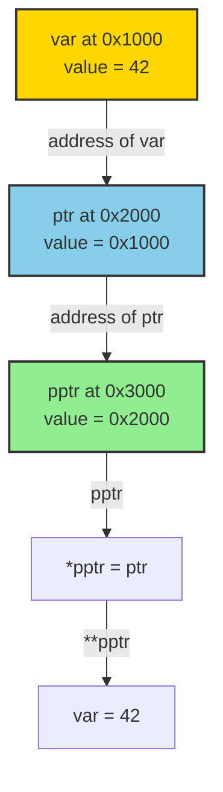
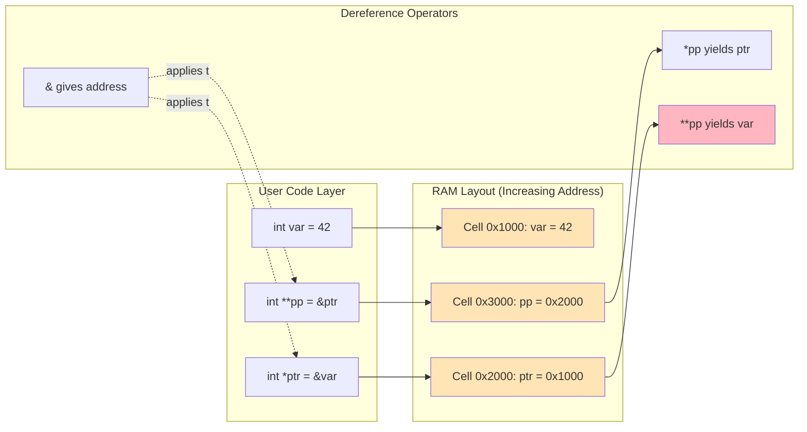
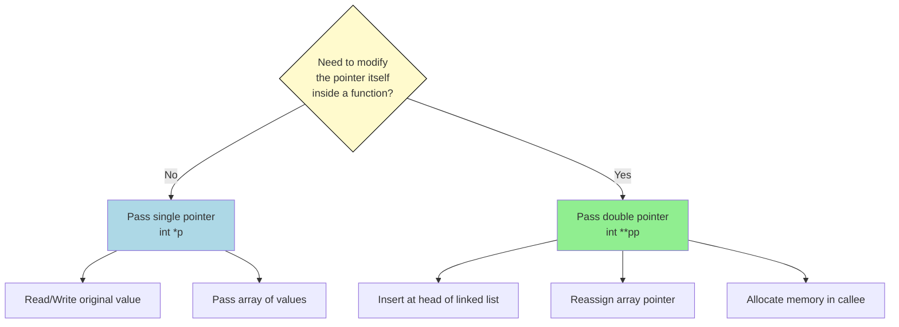
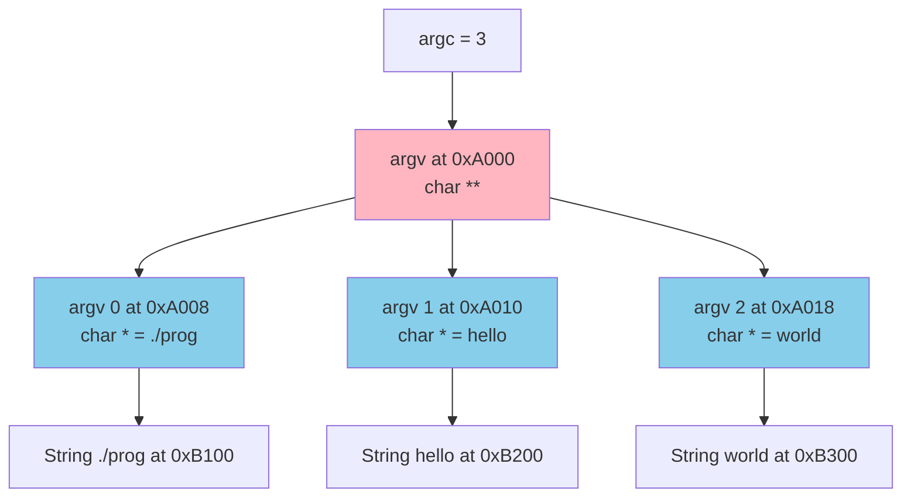
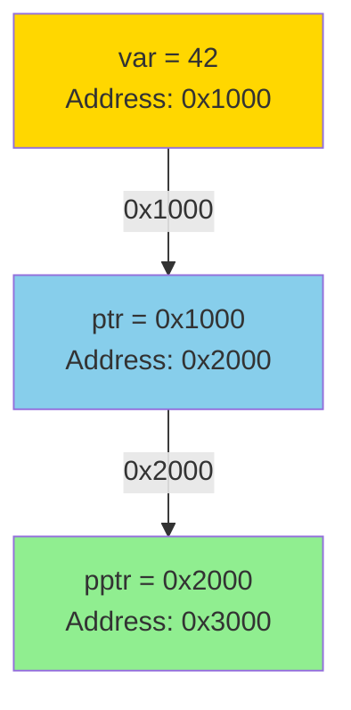

# Pointer to pointer

<!-- SECTION_1_START -->
# Pointer to Pointer (Double Pointer) — Core Technical Definition & Intuitive Overview

## Formal KTU 2024 Definition

> [!IMPORTANT]
> **Pointer to Pointer (Double Pointer):** A *pointer to pointer* is a variable that stores the **memory address of another pointer variable**. It introduces one additional level of indirection, allowing a pointer to be manipulated indirectly through a reference to its address. In the C programming language, it is declared using **two asterisk (`**`) symbols**.

In standard C (ISO/IEC 9899:2018, §6.7.6), a pointer-to-pointer is a derived type whose referenced type is itself a pointer type. If `T` is any valid C type, then `T **` denotes a pointer to (pointer to `T`).

## Conceptual Analogy / Intuition

Imagine a **treasure hunt**:
- The **treasure** = an actual integer value (e.g., `42`) sitting in a memory cell.
- The **first map** = a regular pointer that tells you where the treasure is.
- The **second map** = a pointer-to-pointer that tells you where the **first map** is stored.

To reach the treasure, you must follow **two arrows** instead of one. Each `*` (dereference operator) peels off one level of indirection and "unlocks" the next layer.

## Why Does C Need This Concept?

- **Dynamic 2D arrays** (e.g., `int **matrix`) — required for rows whose lengths may differ (jagged arrays).
- **Modifying a pointer inside a function** (e.g., linked list insertion where the head pointer must be updated).
- **Arrays of strings** — `char **argv` passed to `main()` is itself a pointer-to-pointer.
- **Callback structures** and **function pointer tables** in system programming.

## Memory Model Snapshot (32-bit / 64-bit Address Spaces)

| Platform | `sizeof(int *)` | `sizeof(int **)` |
| :--- | :---: | :---: |
| 32-bit system | **4 bytes** | **4 bytes** |
| 64-bit system | **8 bytes** | **8 bytes** |

> [!NOTE]
> The size of *any* pointer (single, double, triple…) is **identical** on a given platform, because each pointer stores only a raw address — the level of indirection is a *type-system* concept, not a storage concept.

## Visualization Block

> [!VISUALIZATION CONTROL]
> **Concept:** Three-tier memory indirection with address arrows
>
> **Desmos Input Equations (represent the address–value relationship):**
> * $x = 1000$ (address of `var`)
> * $p = 2000$ (address of `ptr`)
> * $pp = 3000$ (address of `ptrPtr`)
> * Value at $x$: $f(x) = 42$
> * Value at $p$: $f(p) = x = 1000$
> * Value at $pp$: $f(pp) = p = 2000$
>
> **Visual Description:** Three stacked rectangular cells on the y-axis representing RAM addresses. The bottom cell holds `42`, the middle cell holds the address of the bottom cell, and the top cell holds the address of the middle cell. Arrows point from each pointer cell to the cell it references, forming a **chain of length 2**.

<!-- SECTION_1_END -->

<!-- SECTION_2_START -->
# Deep Theoretical Analysis & KTU High-Yield Formula Sheet

## Operational Mechanics — Structured Logic

1. **Declaration Stage**
   - Syntax: `T **identifier;` where `T` is a base type.
   - Memory allocated: one pointer-sized slot (4 or 8 bytes).
   - Initial value: **indeterminate (garbage)** until initialized.

2. **Initialization Stage**
   - Must point to *another pointer*, not directly to a plain variable.
   - Pattern: `pp = &p;` — address-of operator on a pointer variable.
   - Cannot do: `pp = &var;` if `pp` is `int **` (type mismatch — generates a *diagnostic-required* warning in C23).

3. **Dereferencing Chain (Read Path)**
   - `*pp` → fetches the value of the pointer it points to (i.e., an address).
   - `**pp` → fetches the value at that fetched address (i.e., the original variable).
   - Each `*` traverses **one arrow** in the indirection chain.

4. **Assignment Chain (Write Path)**
   - `*pp = someAddress;` → modifies the *first-level* pointer.
   - `**pp = newValue;` → modifies the *original variable* through two hops.

5. **Operator Precedence Rules**
   - Unary `*` and `&` have **right-to-left** associativity and higher precedence than arithmetic.
   - `*pp + 1` is parsed as `(*pp) + 1` — increments the *value* the first pointer references, not the pointer itself.
   - To move the pointer forward: `(*pp)++` or `++(*pp)`.

6. **Type Compatibility Invariant**
   - For safe pointer arithmetic, all levels must agree on the base type: `int **` ↔ `int **`, never `int **` ↔ `char **` without an explicit cast.

## KTU Formula Sheet / Cheat Sheet

| Symbol | Operation | Result Type | Side Effect | Typical Use |
| :---: | :---: | :---: | :---: | :--- |
| `&p` | Address of pointer | `int **` | None | Initialize a double pointer |
| `*pp` | Single dereference | `int *` | None | Access the inner pointer |
| `**pp` | Double dereference | `int` | None | Access the original value |
| `*pp = &x` | Single-level write | `int *` | Modifies `p` | Change what `p` points to |
| `**pp = val` | Double-level write | `int` | Modifies `x` | Change the value via two hops |
| `pp + 1` | Pointer arithmetic | `int **` | None (new address) | Walk an array of pointers |
| `*pp + 1` | Value increment via deref. | `int` | None | Read with offset |
| `sizeof(pp)` | Size query | `size_t` | None | Confirms 4 / 8 bytes |

> [!NOTE]
> **Critical Invariant (Karnaugh-style simplification not applicable here — it's a memory-address identity):**
>
> $$\text{Value of } pp = \text{Address of } p = \&p$$
> $$\text{Value of } *pp = \text{Value of } p = \&x$$
> $$\text{Value of } **pp = \text{Value of } x$$

## Real-World Engineering Utility

- **Command-line argument parsing in OS kernels:** `int main(int argc, char **argv)` — every shell-launched program receives a pointer-to-pointer to strings.
- **Sparse matrix representations** in scientific computing: each row stored as a separate `int *`, all gathered under an `int **`.
- **Linked list insertion at head:** the function signature must accept `Node **head` to mutate the caller's head pointer — a classic KTU interview pattern.
- **Plugin / module systems:** arrays of function pointers (`void (**operations)(void)`) enable runtime polymorphism in C.

<!-- SECTION_2_END -->

<!-- SECTION_3_START -->
# Step-by-Step Derivations & Code Implementation

## Worked Example 1 — Exhaustive Memory Walk-Through

Consider the following snippet. We trace every byte of state through the program.

```c
#include <stdio.h>

int main(void) {
    int var    = 42;
    int *ptr   = NULL;
    int **pptr = NULL;

    ptr   = &var;
    pptr  = &ptr;

    printf("var        = %d\n",   var);
    printf("*ptr       = %d\n",  *ptr);
    printf("**pptr     = %d\n", **pptr);
    printf("ptr        = %p\n",  (void *)ptr);
    printf("*pptr      = %p\n", (void *)*pptr);
    printf("pptr       = %p\n", (void *)pptr);

    **pptr = 100;
    printf("After **pptr = 100, var = %d\n", var);

    return 0;
}
```

### State Trace (line-by-line derivation)

Assume the following fictitious (but realistic) 64-bit addresses assigned by the OS:

$$
\begin{aligned}
\text{Address of } var  &= 0x7FFE4B30 \\
\text{Address of } ptr  &= 0x7FFE4B38 \\
\text{Address of } pptr &= 0x7FFE4B40
\end{aligned}
$$

**After `int var = 42;`**

| Variable | Address | Stored Value |
| :---: | :---: | :---: |
| `var` | `0x7FFE4B30` | `42` |

**After `int *ptr = NULL;`**

| Variable | Address | Stored Value |
| :---: | :---: | :---: |
| `var` | `0x7FFE4B30` | `42` |
| `ptr` | `0x7FFE4B38` | `0x0` (NULL) |

**After `int **pptr = NULL;`**

| Variable | Address | Stored Value |
| :---: | :---: | :---: |
| `var` | `0x7FFE4B30` | `42` |
| `ptr` | `0x7FFE4B38` | `0x0` |
| `pptr` | `0x7FFE4B40` | `0x0` |

**After `ptr = &var;`**

$$
ptr \leftarrow \&var = 0x7FFE4B30
$$

**After `pptr = &ptr;`**

$$
pptr \leftarrow \&ptr = 0x7FFE4B38
$$

**Output derivation for each `printf`:**

$$
\begin{aligned}
var        &= 42                              &\text{(direct read of the integer)} \\
*ptr       &= \text{value at } \&var = 42     &\text{(one deref hops to var)} \\
**pptr     &= *(*pptr) = *(ptr) = *(\&var) = 42 &\text{(two deref hops)} \\
ptr        &= 0x7FFE4B30                     &\text{(address stored in ptr)} \\
*pptr      &= ptr = 0x7FFE4B30                &\text{(one deref of pptr)} \\
pptr       &= \&ptr = 0x7FFE4B38              &\text{(raw content of pptr)}
\end{aligned}
$$

**After `**pptr = 100;`**

The write expands as:

$$
\begin{aligned}
**pptr &= *( *pptr ) \\
       &= *( ptr ) \quad \text{because } *pptr = ptr \\
       &= *( \&var ) \quad \text{because } ptr = \&var \\
       &= var \quad \text{(LHS as memory location)} \\
\text{var} &\leftarrow 100
\end{aligned}
$$

Hence, after the assignment, `var == 100`, which `printf` confirms.

## Worked Example 2 — Modifying a Pointer Through a Function

A classic KTU question: **why does passing `int *x` not let us change the original pointer?**

```c
#include <stdio.h>
#include <stdlib.h>

void failSwap(int *p) {
    p = (int *)0xDEADBEEF;   /* only changes local copy */
}

void realSwap(int **pp, int *newAddr) {
    *pp = newAddr;           /* changes the caller's pointer */
}

int main(void) {
    int a = 5, b = 10;
    int *p = &a;

    failSwap(p);
    printf("After failSwap: p still points to a = %d\n", *p);

    realSwap(&p, &b);
    printf("After realSwap: p now points to b = %d\n", *p);

    return 0;
}
```

**Output (expected):**

```
After failSwap: p still points to a = 5
After realSwap: p now points to b = 10
```

**Derivation of `realSwap` mechanics:**

$$
\begin{aligned}
\text{pp} &= \&p = \text{address of the caller's pointer} \\
*pp &= p \quad \text{(the pointer the caller passed)} \\
*pp = newAddr \quad &\Rightarrow \quad p \leftarrow newAddr = \&b
\end{aligned}
$$

## Worked Example 3 — Dynamic 2D Array with Pointer-to-Pointer

```c
#include <stdio.h>
#include <stdlib.h>

int main(void) {
    int rows = 3, cols = 4;
    int **matrix = (int **)malloc(rows * sizeof(int *));
    if (matrix == NULL) {
        perror("malloc rows failed");
        return EXIT_FAILURE;
    }

    for (int i = 0; i < rows; ++i) {
        matrix[i] = (int *)malloc(cols * sizeof(int));
        if (matrix[i] == NULL) {
            perror("malloc cols failed");
            return EXIT_FAILURE;
        }
        for (int j = 0; j < cols; ++j) {
            matrix[i][j] = (i + 1) * 10 + (j + 1);
        }
    }

    /* Read using pointer-to-pointer dereferencing */
    for (int i = 0; i < rows; ++i) {
        for (int j = 0; j < cols; ++j) {
            printf("%3d ", *(*(matrix + i) + j));
        }
        putchar('\n');
    }

    /* Free in reverse order */
    for (int i = 0; i < rows; ++i) free(matrix[i]);
    free(matrix);
    return EXIT_SUCCESS;
}
```

**Derivation of `*(*(matrix + i) + j)`:**

$$
\begin{aligned}
\text{matrix} &: \text{pointer to first row-pointer} \\
\text{matrix} + i &: \text{pointer to the } (i+1)\text{-th row-pointer} \\
*(\text{matrix} + i) &: \text{the } (i+1)\text{-th row (an } int *\text{)} \\
*(\text{matrix} + i) + j &: \text{pointer to the } (j+1)\text{-th column} \\
*(*(\text{matrix} + i) + j) &: \text{the integer at } (i, j)
\end{aligned}
$$

This is mathematically equivalent to `matrix[i][j]` and is the KTU-preferred demonstration of why `[][]` is just syntactic sugar over two dereference operations.

## Worked Example 4 — `argv` Walk-Through

```c
#include <stdio.h>

int main(int argc, char **argv) {
    printf("Program name : %s\n", argv[0]);
    printf("Argument count: %d\n", argc);

    for (int i = 1; i < argc; ++i) {
        printf("argv[%d] = %s\n", i, argv[i]);
        /* Same access via dereferencing chain: */
        printf("  via *(*(argv + %d)) = %s\n", i, *(*(argv + i)));
    }
    return 0;
}
```

> [!IMPORTANT]
> `char **argv` is the textbook *real-world* example of pointer-to-pointer: the OS places each command-line argument as a `char[]` somewhere in memory, builds an **array of pointers to those strings**, and passes the array's address as `argv`.

<!-- SECTION_3_END -->

<!-- SECTION_4_START -->
# Structural Diagrams & Schematics

## Diagram 1 — Indirection Chain (Mermaid Flow)



## Diagram 2 — Modular Block Architecture (Memory & Operation Flow)



## Diagram 3 — Decision Topology: When to Use Double Pointer



## Diagram 4 — `argv` Architectural Topology



<!-- SECTION_4_END -->

<!-- SECTION_5_START -->
# KTU 2024 Scheme Examination Question Bank & Topic Recap

## Part A — Short Answer Questions (3 Marks Each)

### Question 1 `[KTU University Exam – Dec 2023]` — **CO1, Remember**

**Q: What is a pointer to pointer in C? Write its declaration syntax with an example.**

**Model Answer:**

A pointer to pointer is a variable that stores the **address of another pointer variable**. It provides two levels of indirection. The declaration uses two asterisk symbols.

```c
int var = 10;
int *ptr = &var;     /* single pointer  */
int **pptr = &ptr;   /* pointer to pointer */
```

Here, `pptr` holds the address of `ptr`, which in turn holds the address of `var`. The size of `pptr` equals the size of any pointer on the system (typically **4 bytes on a 32-bit system** and **8 bytes on a 64-bit system**).

**Valuation Key:**
- [Definition of pointer-to-pointer: 1 Mark]
- [Correct declaration syntax with two asterisks: 1 Mark]
- [Example initialization with `&`: 1 Mark]

---

### Question 2 `[KTU University Exam – July 2024]` — **CO1, Understand**

**Q: Differentiate between `*ptr` and `**ptr` when `int **ptr` is given. Illustrate with one line of code each.**

**Model Answer:**

`int **ptr` means `ptr` is a pointer that points to *another* pointer, which in turn points to an integer.

- `*ptr` performs a **single dereference** and yields the value of the inner pointer, which is an `int *` (an address).
- `**ptr` performs a **double dereference** and yields the original integer value.

```c
int x = 25;
int *p = &x;
int **pp = &p;

printf("%p", *pp);   /* prints the address of x */
printf("%d", **pp);  /* prints 25 */
```

**Valuation Key:**
- [Explanation of `*ptr`: 1 Mark]
- [Explanation of `**ptr`: 1 Mark]
- [Code illustration: 1 Mark]

---

## Part B — Long Answer Questions (14 Marks Each, Internal Choice)

### Question A `[KTU University Exam – Dec 2023]` — **CO2, Apply / Analyze**

**(a)** Explain the concept of pointer to pointer with a neat memory diagram. Show how a value can be modified using `**pp`. **\[7 Marks\]**

**Model Answer:**

A pointer to pointer (`T **p`) is a variable that stores the address of another pointer of type `T *`. It enables **two-step indirection**, which is essential when the caller wants the callee to modify the pointer itself (e.g., during dynamic memory allocation in functions).

**Memory Diagram:**



**Code:**

```c
#include <stdio.h>

int main(void) {
    int var    = 42;
    int *ptr   = &var;
    int **pptr = &ptr;

    **pptr = 99;   /* double deref to modify var */
    printf("var = %d\n", var);   /* prints 99 */
    return 0;
}
```

**Step-by-step evaluation of `**pptr = 99;`:**

$$
\begin{aligned}
**pptr &= 99 \\
*( *pptr ) &= 99 \\
*( ptr ) &= 99 \quad \text{(since } *pptr = ptr\text{)} \\
*( \&var ) &= 99 \quad \text{(since } ptr = \&var\text{)} \\
var &\leftarrow 99
\end{aligned}
$$

**Valuation Key:**
- [Concept explanation with 2 levels of indirection: 2 Marks]
- [Memory diagram with three cells and arrows: 3 Marks]
- [Correct dereferencing chain derivation leading to value modification: 2 Marks]

**(b)** Write a C program that uses pointer to pointer to **swap two integer pointers** using a function `void swapPtr(int **a, int **b)`. Show the output. **\[7 Marks\]**

**Model Answer:**

```c
#include <stdio.h>

void swapPtr(int **a, int **b) {
    int *temp = *a;
    *a = *b;
    *b = temp;
}

int main(void) {
    int x = 10, y = 20;
    int *p = &x;
    int *q = &y;

    printf("Before swap: *p = %d, *q = %d\n", *p, *q);
    swapPtr(&p, &q);
    printf("After  swap: *p = %d, *q = %d\n", *p, *q);

    return 0;
}
```

**Output:**

```
Before swap: *p = 10, *q = 20
After  swap: *p = 20, *q = 10
```

**Derivation inside `swapPtr`:**

$$
\begin{aligned}
a &= \&p, \quad b = \&q \\
*a &= p, \quad *b = q \\
temp &= p \\
*a &\leftarrow q \Rightarrow p \leftarrow q \\
*b &\leftarrow temp \Rightarrow q \leftarrow p
\end{aligned}
$$

**Valuation Key:**
- [Function signature with `int **a, int **b`: 1 Mark]
- [Correct use of temporary variable: 2 Marks]
- [Correct dereferencing to mutate caller's pointers: 2 Marks]
- [Working `main` with output: 2 Marks]

---

### Question B `[KTU University Exam – July 2024]` — **CO2, Apply / Analyze**

**(a)** With a suitable example, explain how pointer to pointer is used to **allocate a 2-D dynamic array** in C. Write the complete program. **\[7 Marks\]**

**Model Answer:**

A 2-D dynamic array is implemented using a **pointer to pointer**: the outer pointer points to an array of row pointers, and each row pointer points to a contiguous block of column elements.

**Program:**

```c
#include <stdio.h>
#include <stdlib.h>

int main(void) {
    int rows = 3, cols = 4;
    int **arr = (int **)malloc(rows * sizeof(int *));
    if (arr == NULL) return EXIT_FAILURE;

    for (int i = 0; i < rows; ++i) {
        arr[i] = (int *)malloc(cols * sizeof(int));
        if (arr[i] == NULL) return EXIT_FAILURE;
        for (int j = 0; j < cols; ++j) {
            arr[i][j] = i * cols + j + 1;
        }
    }

    /* Print using pointer dereference chain */
    for (int i = 0; i < rows; ++i) {
        for (int j = 0; j < cols; ++j) {
            printf("%4d", *(*(arr + i) + j));
        }
        putchar('\n');
    }

    /* Free memory */
    for (int i = 0; i < rows; ++i) free(arr[i]);
    free(arr);
    return EXIT_SUCCESS;
}
```

**Equivalence proof:**

$$
arr[i][j] \;\;\equiv\;\; *(*(arr + i) + j)
$$

**Valuation Key:**
- [Concept of two-tier allocation: 2 Marks]
- [First `malloc` for row pointers: 1 Mark]
- [Second `malloc` loop for column data: 2 Marks]
- [Memory deallocation in reverse order: 1 Mark]
- [Output demonstration: 1 Mark]

**(b)** Explain the role of `char **argv` in `int main(int argc, char **argv)`. How would you print all command-line arguments using pointer-to-pointer dereferencing? **\[7 Marks\]**

**Model Answer:**

`char **argv` is a **pointer to pointer to char**. The operating system constructs an array of `char *`, where each element points to a null-terminated string representing one command-line argument. The base address of this array is passed to `main` through `argv`.

**Program:**

```c
#include <stdio.h>

int main(int argc, char **argv) {
    printf("Number of arguments = %d\n", argc);

    for (int i = 0; i < argc; ++i) {
        printf("Argument %d : %s\n", i, *(argv + i));
        /* Same as argv[i] */
    }
    return 0;
}
```

**Equivalence derivation:**

$$
argv[i] \;\;\equiv\;\; *(argv + i)
$$

`argv` holds the address of the first element of the argument pointer-array. Adding `i` and dereferencing yields the `i`-th `char *`, which `printf` with `%s` prints character-by-character until the null terminator.

**Valuation Key:**
- [Explanation of OS-level argument passing: 2 Marks]
- [Diagram or description of `argv` as array of `char *`: 2 Marks]
- [Loop using `*(argv + i)`: 2 Marks]
- [Correct `%s` format and final note on null terminator: 1 Mark]

---

> [!WARNING]
> **KTU Examiner's Valuation Pitfalls — Read Carefully!**
>
> 1. **Confusing `&ptr` with `*ptr`:** Many students write `int **pp = *ptr;`. This is a *type* error — `*ptr` is an `int`, not an `int *`. The correct form is `int **pp = &ptr;`. **Loss: 2 marks per occurrence.**
>
> 2. **Forgetting the `void *` cast in `printf("%p", ptr)`:** This produces a *diagnostic warning* under `-Wformat` and may be penalized as "unsafe code" in KTU valuation. Always write `(void *)ptr`.
>
> 3. **Skipping the memory deallocation order:** A 2-D array allocated as `int **` must be freed **row by row first, then the outer pointer** — not the reverse. Failing to show this loses 1–2 marks.
>
> 4. **Misinterpreting `*pp + 1`:** This is *not* pointer arithmetic on `pp`. It is *value* increment through dereferencing. To advance the pointer, use `(*pp)++` or `pp + 1`. **Loss: 1 mark for conceptual clarity.**
>
> 5. **Missing the `NULL` checks** after `malloc()` in dynamic 2-D questions. KTU's 2024 scheme emphasizes *safe coding*; no `NULL` check = partial deduction.

---

## Topic Recap & Important Things to Remember

- **Definition:** A pointer to pointer (`T **p`) stores the address of another pointer. It introduces **one additional level of indirection** beyond a regular pointer.
- **Declaration syntax:** Two asterisks — `data_type **pointer_name;`
- **Initialization rule:** Must be initialized with the address of *another pointer*, never with the address of a plain variable.
- **Dereferencing chain:** `*pp` retrieves the inner pointer; `**pp` retrieves the original value. Each `*` peels off **one level**.
- **Size invariant:** `sizeof(pp)` is the same as `sizeof(p)` on any given platform — only the *type system* differs.
- **Operator precedence:** Unary `*` and `&` are right-associative; `*pp + 1` is parsed as `(*pp) + 1`.
- **Key real-world uses:** `argv` in `main()`, dynamic 2-D arrays, modifying caller's pointer inside a function, jagged arrays, arrays of strings.
- **Function signature pattern:** When the callee must change the caller's pointer → use `T **`; when the callee must change the value pointed to → use `T *`.
- **C23 compatibility:** `int **pp = &var;` is a *constraint violation* if `var` is not an `int *`. KTU exams may test this with a small MCQ.
- **Memory deallocation mantra:** Free the *innermost* allocations first, then walk outwards.
- **NULL safety:** Every `malloc()` returning a pointer-to-pointer must be checked for `NULL` before use.
- **Pointer arithmetic on double pointer:** `pp + 1` moves the outer pointer by `sizeof(T *)` bytes (i.e., one pointer slot).
- **Array equivalence to remember:** `pp[i][j]  ≡  *(*(pp + i) + j)` — this single identity is the **highest-weight concept** in pointer-to-pointer questions.

<!-- SECTION_5_END -->
