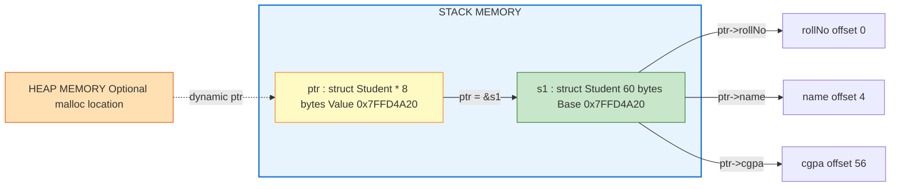
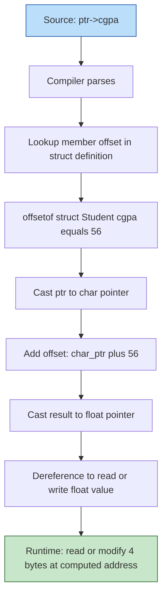
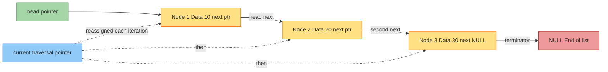
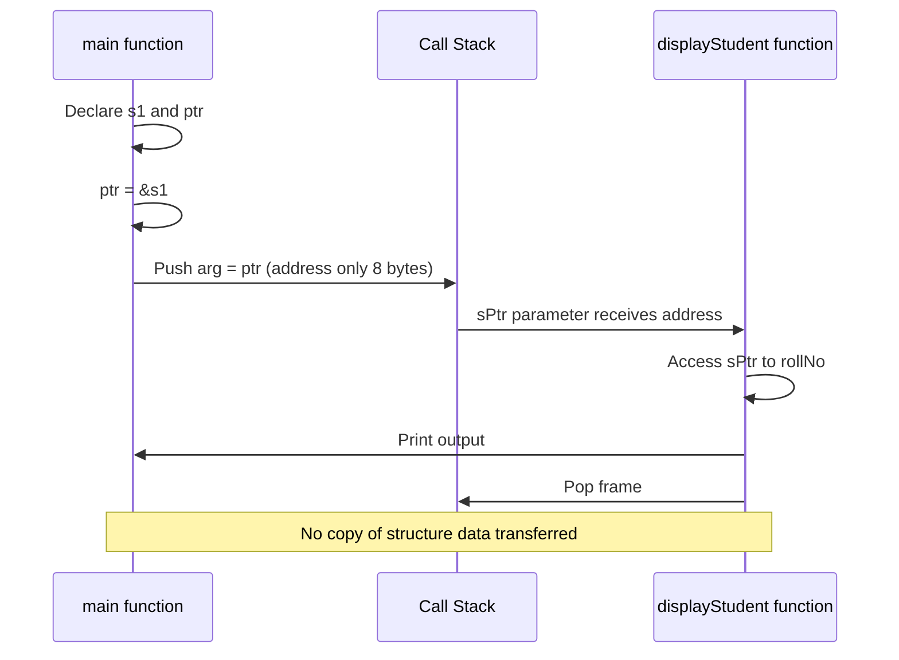

# Pointer to structure

<!-- SECTION_1_START -->
# Pointer to Structure — C Programming (KTU 2024 Scheme)

## 1.1 Formal Academic Definition

A **Pointer to a Structure** is a derived data type in C that stores the **memory address** of a structure variable (or the first byte of a contiguous structure block) rather than the structure's actual members. It is declared by placing the indirection operator `*` after the structure tag in the declaration statement.

Mathematically, if `S` is a structure type and `S obj` is an instance, then `S *ptr = &obj;` establishes the address-binding:

$$\text{ptr} \rightarrow \text{obj} \in \mathbb{A}_{S}$$

where $\mathbb{A}_{S}$ denotes the **address space** allocated to structure objects in the program's runtime heap or stack. The size of the pointer itself is **architecture-dependent** (typically **4 bytes** on 32-bit systems and **8 bytes** on 64-bit systems), independent of the structure's total byte size.

> [!IMPORTANT]
> **KTU 2024 Syllabus Highlight (Module 4 — Pointers):**
> The university examiner expects mastery of three operational patterns: (1) pointer declaration and initialization, (2) **member access using the arrow operator** (`->`), and (3) **dynamic memory allocation of structures** using `malloc()` and `calloc()`.

## 1.2 Conceptual Analogy — The "House Number" Intuition

Imagine a **postcard** with your friend's home address written on it. The postcard is not the house itself — it is a small piece of paper that **points to** where the house is located.

- The **house** = the structure variable in memory (containing rooms/members like `name`, `age`, `salary`).
- The **postcard with the address** = the structure pointer (small, fixed-size, holding only the address).
- The **act of visiting the house** = dereferencing the pointer to access the actual members.

A postcard never grows bigger regardless of how large the mansion is — similarly, a pointer always occupies a fixed byte size (4 or 8 bytes) no matter how large the structure it references becomes. When you have a postcard, you don't need to physically copy the entire house to send the address to a function — you just pass the postcard. This is the **performance advantage** of pointers: they enable **pass-by-reference** semantics, avoiding expensive structure copying on the call stack.

> [!NOTE]
> **Why this matters in KTU exams:** A common conceptual trap is believing that a pointer to a structure contains the structure's data. It does NOT. It contains the starting address (a numeric memory location) of where the structure lives in RAM.

## 1.3 Memory Visualization Model

> [!VISUALIZATION CONTROL]
> **Concept:** Structure memory layout vs. pointer indirection
> **Visual Description:** Picture a horizontal RAM bar where each cell represents 1 byte. A structure `Student` of size 28 bytes occupies a contiguous block. A pointer `sPtr` (8 bytes) stores the starting address (e.g., `0x7FFD4A20`) of that block. The arrow operator `->` acts as an offset calculator: it adds the member's byte offset to the base address.

```
Base Address: 0x7FFD4A20
┌────────┬────────┬────────┬────────┬────────┬────────┬────────┬────────┐
│ Byte 0 │ Byte 1 │ Byte 2 │ Byte 3 │ Byte 4 │ ...    │Byte 26 │Byte 27 │  ← Student struct (28 bytes)
└────────┴────────┴────────┴────────┴────────┴────────┴────────┴────────┘
   ▲
   │
   │  sPtr (8 bytes) = 0x7FFD4A20
   │
┌────────────────────────┐
│ 0x7FFD4A20             │  ← sPtr variable
└────────────────────────┘
```

The base address `0x7FFD4A20` is the address of the **first member** (typically) due to C's memory alignment rules.

<!-- SECTION_1_END -->

<!-- SECTION_2_START -->
# Deep Theoretical Analysis & KTU High-Yield Formula Sheet

## 2.1 Operational Mechanics — The Three Pillars

### Pillar 1: Declaration Grammar

The general declaration syntax follows the pattern:

$$\text{struct } \text{TAG} \,\, *\text{pointerName};$$

This reserves a pointer-sized memory cell that is **type-aware** — it knows it points to a `struct TAG` and not to an `int` or a `float`. This type-awareness is what enables safe member access via the arrow operator.

### Pillar 2: Initialization and Address Binding

Initialization must occur before dereferencing to avoid **undefined behavior** (segmentation faults in practice). The standard pattern is:

$$\text{ptr} = \&\text{instance}$$

This copies the address of `instance` into `ptr`. The address-of operator `&` is mandatory because direct assignment of the structure variable to the pointer (i.e., `ptr = instance;`) is a **compile-time type error** in strict C compilers.

### Pillar 3: Member Access — The Arrow Operator

The arrow operator `->` is **syntactic sugar** that combines dereferencing and member access. It is formally defined as:

$$(\text{ptr} \rightarrow \text{member}) \equiv ((\text{*ptr}).\text{member})$$

Both expressions are **semantically equivalent**. However, due to operator precedence in C (where `.` has higher precedence than `*`), the parenthesized form `(*ptr).member` is mandatory if you avoid the arrow operator.

## 2.2 KTU Formula Sheet / Cheat Sheet

| Concept | Syntax / Formula | Memory Effect | Exam Frequency |
|---|---|---|---|
| Pointer declaration | `struct Tag *ptr;` | Allocates 4 or 8 bytes (pointer cell) | **Very High** |
| Address-of binding | `ptr = &var;` | Copies address into `ptr` | **Very High** |
| Arrow access | `ptr->member` | Equivalent to `(*ptr).member` | **Very High** |
| Dot access via deref | `(*ptr).member` | Parentheses are mandatory | High |
| Dynamic allocation | `ptr = malloc(sizeof(struct Tag));` | Heap allocation, no automatic freeing | **Very High** |
| Dynamic zero-init | `ptr = calloc(n, sizeof(struct Tag));` | Allocates `n` zero-initialized blocks | High |
| Pointer arithmetic | `ptr + 1` advances by `sizeof(struct Tag)` | Skips entire structure, not 1 byte | Medium |
| Passing to function | `void func(struct Tag *p)` | Pass-by-reference, no copy made | **Very High** |
| Sizeof pointer | `sizeof(ptr)` = 4 or 8 | Constant, independent of structure size | Medium |
| Sizeof struct | `sizeof(struct Tag)` | Sum of all member sizes (+ padding) | High |

> [!NOTE]
> **Critical KTU Insight:** The expression `ptr + 1` does **not** add 1 byte to the address. It adds `sizeof(struct Tag)` bytes. This is called **scaled pointer arithmetic**, and it is a frequent 3-mark question.

## 2.3 Real-World Engineering Utility

In production systems, pointer-to-structure patterns are the **backbone** of:

1. **Operating System Kernels** — Linux kernel structures like `task_struct`, `inode`, and `file` are exclusively manipulated through pointers to avoid expensive stack copies.
2. **Embedded Systems (IoT)** — In firmware for microcontrollers (ARM Cortex-M, AVR), hardware registers are exposed as structure pointers, and members map to bit fields of peripheral control blocks.
3. **Data Structure Implementations** — Linked lists, trees, and hash tables use `struct Node *next` pointers to chain dynamically allocated memory blocks.
4. **Network Packet Handling** — TCP/IP stack implementations pass `struct packet *` pointers across layer boundaries to avoid copying multi-kilobyte payloads.
5. **Device Drivers** — `struct file_operations` in the Linux kernel is a classic structure pointer pattern for dispatch tables.

> [!IMPORTANT]
> **Why use a pointer instead of a direct variable?**
> 1. **Efficiency** — Avoids copying large structures during function calls.
> 2. **Dynamic memory** — Enables structures whose lifetime and size are determined at runtime.
> 3. **Data sharing** — Multiple functions can operate on the *same* structure instance without ambiguity.
> 4. **Polymorphism foundation** — In C++, pointers to base structures enable inheritance and virtual dispatch.

<!-- SECTION_2_END -->

<!-- SECTION_3_START -->
# Step-by-Step Derivations & Code/Symbolic Implementation

## 3.1 Foundational Example — Student Record Management

This example demonstrates the **complete lifecycle** of a pointer to structure: declaration, initialization, member access via both `->` and `(*ptr).member`, and passing to a function.

```c
#include <stdio.h>
#include <string.h>

// Step 1: Define the structure type (blueprint)
struct Student {
    int rollNo;           // 4 bytes
    char name[50];        // 50 bytes
    float cgpa;           // 4 bytes
    // Total approximate size: 58 bytes (with padding, likely 60 or 64)
};

// Step 2: Function that receives a POINTER to the structure
void displayStudent(const struct Student *sPtr) {
    // Using arrow operator for clean access
    printf("Roll Number : %d\n", sPtr->rollNo);
    printf("Name        : %s\n", sPtr->name);
    printf("CGPA        : %.2f\n", sPtr->cgpa);
}

// Step 3: Function that MODIFIES structure through pointer
void updateCGPA(struct Student *sPtr, float newCGPA) {
    if (newCGPA >= 0.0f && newCGPA <= 10.0f) {
        sPtr->cgpa = newCGPA;  // Direct write through dereference
    }
}

int main(void) {
    // Step 4: Declare a structure variable on the stack
    struct Student s1;

    // Step 5: Declare a pointer to that structure
    struct Student *ptr = NULL;  // Good practice: initialize to NULL

    // Step 6: Bind the pointer to the structure's address
    ptr = &s1;

    // Step 7: Populate members using the arrow operator
    ptr->rollNo = 101;
    strcpy(ptr->name, "Arjun Menon");
    ptr->cgpa = 8.75f;

    // Step 8: Verify equivalence between -> and (*ptr).
    // (*ptr).rollNo is IDENTICAL to ptr->rollNo
    printf("Verification (via (*ptr).rollNo): %d\n", (*ptr).rollNo);

    // Step 9: Pass pointer to function (pass-by-reference)
    printf("\n--- Before Update ---\n");
    displayStudent(ptr);

    // Step 10: Modify through pointer
    updateCGPA(ptr, 9.20f);

    printf("\n--- After Update ---\n");
    displayStudent(ptr);

    return 0;
}
```

### Expected Output

```
Verification (via (*ptr).rollNo): 101

--- Before Update ---
Roll Number : 101
Name        : Arjun Menon
CGPA        : 8.75

--- After Update ---
Roll Number : 101
Name        : Arjun Menon
CGPA        : 9.20
```

### Line-by-Line Operational Breakdown

1. **Line 4–9**: The `struct Student` declaration is a **compile-time type definition** — no memory is allocated yet. It merely tells the compiler the layout blueprint.
2. **Line 24**: `struct Student *ptr = NULL;` allocates **8 bytes** on the stack for the pointer, initialized to `0` (NULL) to prevent dangling dereferences.
3. **Line 30**: `ptr = &s1;` performs an **address-binding assignment**. After this, `ptr` holds the starting address of `s1`.
4. **Line 33–35**: `ptr->rollNo = 101;` is the compiler's internal transformation: it computes `((char *)ptr + offsetof(struct Student, rollNo)) = 101`. The offset is typically 0 for the first member.
5. **Line 40**: `(*ptr).rollNo` — note the **mandatory parentheses**. Without them, the compiler would parse `*ptr.rollNo` as `*(ptr.rollNo)`, causing a type error since `rollNo` is not a pointer.

## 3.2 Dynamic Allocation Example — Array of Structures via Pointers

This is a **high-yield KTU pattern** that combines `malloc()`, pointer arithmetic, and array-of-structures.

```c
#include <stdio.h>
#include <stdlib.h>
#include <string.h>

struct Employee {
    int id;
    char name[30];
    double salary;
};

int main(void) {
    int n, i;
    struct Employee *empPtr = NULL;

    printf("Enter number of employees: ");
    if (scanf("%d", &n) != 1 || n <= 0) {
        fprintf(stderr, "Invalid input.\n");
        return 1;
    }

    // Dynamic allocation of n contiguous structures
    empPtr = (struct Employee *)malloc(n * sizeof(struct Employee));

    // Mandatory null-check for production-grade code
    if (empPtr == NULL) {
        fprintf(stderr, "Memory allocation failed.\n");
        return 1;
    }

    // Input phase
    for (i = 0; i < n; i++) {
        printf("\nEmployee %d:\n", i + 1);
        printf("  ID: ");
        scanf("%d", &empPtr[i].id);                  // Array notation
        printf("  Name: ");
        scanf(" %29s", empPtr[i].name);              // Bound-safe read
        printf("  Salary: ");
        scanf("%lf", &empPtr[i].salary);
    }

    // Display phase using pointer arithmetic
    printf("\n%-5s %-15s %-10s\n", "ID", "Name", "Salary");
    printf("-------------------------------\n");
    for (i = 0; i < n; i++) {
        printf("%-5d %-15s %-10.2lf\n",
               (empPtr + i)->id,        // Pointer arithmetic access
               (empPtr + i)->name,
               (empPtr + i)->salary);
    }

    // CRITICAL: Free dynamically allocated memory
    free(empPtr);
    empPtr = NULL;  // Defensive: avoid dangling pointer

    return 0;
}
```

### Critical Pointer Arithmetic Derivation

The expression `empPtr + i` produces an address offset:

$$\text{Address of } (empPtr + i) = \text{empPtr} + i \times \text{sizeof}(\text{struct Employee})$$

For a 64-bit system where `sizeof(struct Employee) = 48` bytes (with alignment padding), if `empPtr = 0x1000`:

- `empPtr + 0` → `0x1000`
- `empPtr + 1` → `0x1000 + 48 = 0x1030`
- `empPtr + 2` → `0x1000 + 96 = 0x1060`

This **scaled arithmetic** is why the loop correctly traverses the array without manual byte-offset math.

## 3.3 Self-Referential Structure — Linked List Node (The Pinnacle Pattern)

A **self-referential structure** contains a pointer to another instance of its own type. This is the cornerstone of linked lists, trees, and graphs.

```c
#include <stdio.h>
#include <stdlib.h>

struct Node {
    int data;
    struct Node *next;  // Pointer to another Node of the same type
};

int main(void) {
    // Create three nodes on the heap
    struct Node *head = (struct Node *)malloc(sizeof(struct Node));
    struct Node *second = (struct Node *)malloc(sizeof(struct Node));
    struct Node *third = (struct Node *)malloc(sizeof(struct Node));

    if (head == NULL || second == NULL || third == NULL) {
        fprintf(stderr, "Allocation failure.\n");
        return 1;
    }

    // Link them: head -> second -> third -> NULL
    head->data = 10;
    head->next = second;

    second->data = 20;
    second->next = third;

    third->data = 30;
    third->next = NULL;  // Terminating the list

    // Traverse the linked list using pointer to structure
    struct Node *current = head;
    printf("Linked List: ");
    while (current != NULL) {
        printf("%d -> ", current->data);
        current = current->next;  // Move to next node
    }
    printf("NULL\n");

    // Free all nodes
    free(head);
    free(second);
    free(third);

    return 0;
}
```

### Output

```
Linked List: 10 -> 20 -> 30 -> NULL
```

### Operational Trace Table

| Iteration | `current` address | `current->data` | `current->next` |
|---|---|---|---|
| Init | `head` (0xA000) | 10 | `second` (0xA048) |
| 1 | `second` (0xA048) | 20 | `third` (0xA090) |
| 2 | `third` (0xA090) | 30 | `NULL` |
| 3 | `NULL` | Loop exits | — |

> [!NOTE]
> **KTU Tip:** The statement `struct Node *next;` inside `struct Node` is **legal** because the pointer size is known at compile time, even though the structure's full size is not yet finalized. This is the only valid form of self-reference in C.

<!-- SECTION_3_END -->

<!-- SECTION_4_START -->
# Structural Diagrams & Schematics

## 4.1 Memory Address-Binding Topology

The following Mermaid block diagram illustrates how a structure variable, its pointer, and the arrow operator interact at the memory level.



## 4.2 Arrow Operator Decompilation Flow

This diagram shows how the compiler internally translates `ptr->member` into a memory address calculation.



## 4.3 Self-Referential Linked List Node Topology



## 4.4 Function Call Pass-by-Reference Sequence



<!-- SECTION_4_END -->

<!-- SECTION_5_START -->
# KTU 2024 Scheme Examination Question Bank & Topic Recap

## Part A — Short Answer Questions (3 Marks Each)

### Question 1: Define Pointer to Structure

**[KTU University Exam — July 2024 | CO2 | Remember]**

**Question:** What is a pointer to a structure? How is it declared and initialized in C?

**Model Answer (Board-Standard):**

A **pointer to a structure** is a variable that stores the memory address of a structure variable. It does not store the structure's data; it stores only the starting address where the structure resides in memory. The size of the pointer is fixed (4 or 8 bytes) regardless of the structure's total size.

**Declaration Syntax:**

```c
struct Student {
    int rollNo;
    float marks;
};

struct Student s1;
struct Student *ptr;   // Pointer declaration
ptr = &s1;             // Initialization using address-of operator
```

**Key Points for 3 Marks:**
- Definition with type clarity **[1 Mark]**
- Declaration syntax with `*` operator **[1 Mark]**
- Initialization using `&` operator **[1 Mark]**

---

### Question 2: Arrow vs. Dot Operator

**[KTU University Exam — Dec 2023 | CO2 | Understand]**

**Question:** Distinguish between the dot (`.`) operator and the arrow (`->`) operator in the context of structures.

**Model Answer (Board-Standard):**

| Feature | Dot Operator (`.`) | Arrow Operator (`->`) |
|---|---|---|
| **Operands** | Structure variable and member | Pointer to structure and member |
| **Syntax** | `s1.rollNo` | `ptr->rollNo` |
| **Dereference** | Not required (direct access) | Implicit dereference occurs |
| **Equivalent form** | N/A | `(*ptr).rollNo` |
| **Use case** | Static / stack structures | Dynamic / heap structures |
| **Example** | `s1.marks = 95;` | `ptr->marks = 95;` |

**Key Points for 3 Marks:**
- Operator differences with syntax **[1 Mark]**
- Equivalence relation `ptr->m ≡ (*ptr).m` **[1 Mark]**
- Use-case distinction **[1 Mark]**

---

## Part B — Long Answer Questions (14 Marks Each, with Internal Choice)

### Question A (14 Marks) — Dynamic Allocation with Pointer to Structure

**[KTU University Exam — Model Paper 2024 | CO3 | Apply / Analyze]**

**Question A:**

**(a)** Write a C program to define a structure `Book` with members `title` (string of 50 characters), `author` (string of 30 characters), and `price` (float). Dynamically allocate memory for `n` books using `malloc()`, accept user input, and display the book details whose price exceeds a user-defined threshold. Use pointer notation throughout. **[7 Marks]**

**(b)** Explain the differences between `malloc()` and `calloc()` with a code example. What happens if you forget to call `free()` after dynamic allocation? **[7 Marks]**

---

#### Model Solution for Part (a) — 7 Marks

```c
#include <stdio.h>
#include <stdlib.h>
#include <string.h>

struct Book {
    char title[50];
    char author[30];
    float price;
};

int main(void) {
    int n, i;
    float threshold;
    struct Book *library = NULL;
    int found = 0;

    printf("Enter number of books: ");
    scanf("%d", &n);

    if (n <= 0) {
        printf("Invalid count.\n");
        return 1;
    }

    library = (struct Book *)malloc(n * sizeof(struct Book));
    if (library == NULL) {
        printf("Memory allocation failed.\n");
        return 1;
    }

    for (i = 0; i < n; i++) {
        printf("\nBook %d Title: ", i + 1);
        scanf(" %49s", (library + i)->title);
        printf("Book %d Author: ", i + 1);
        scanf(" %29s", (library + i)->author);
        printf("Book %d Price: ", i + 1);
        scanf("%f", &(library + i)->price);
    }

    printf("\nEnter price threshold: ");
    scanf("%f", &threshold);

    printf("\nBooks priced above %.2f:\n", threshold);
    for (i = 0; i < n; i++) {
        if ((library + i)->price > threshold) {
            printf("Title: %s | Author: %s | Price: %.2f\n",
                   (library + i)->title,
                   (library + i)->author,
                   (library + i)->price);
            found = 1;
        }
    }
    if (!found) {
        printf("No books exceed the threshold.\n");
    }

    free(library);
    library = NULL;
    return 0;
}
```

**Valuation Key — Part (a):**
- Structure definition with all three members **[1 Mark]**
- Correct `malloc()` with `n * sizeof(struct Book)` **[1 Mark]**
- Null check after allocation **[1 Mark]**
- Input loop using `->` operator exclusively **[2 Marks]**
- Threshold filter and display logic **[1 Mark]**
- `free()` call and pointer reset **[1 Mark]**

---

#### Model Solution for Part (b) — 7 Marks

| Aspect | `malloc(size)` | `calloc(count, size)` |
|---|---|---|
| **Header** | `<stdlib.h>` | `<stdlib.h>` |
| **Signature** | `void *malloc(size_t size)` | `void *calloc(size_t count, size_t size)` |
| **Initialization** | Returns **uninitialized** memory (garbage values) | Returns **zero-initialized** memory |
| **Overflow check** | Does not multiply internally | Performs internal overflow check |
| **Typical use** | Single object or buffer | Arrays of structures |
| **Example** | `ptr = malloc(sizeof(struct Book));` | `ptr = calloc(5, sizeof(struct Book));` |

**Consequence of Skipping `free()`:**

When a programmer forgets to call `free()`, the allocated heap memory is not returned to the system. If this occurs repeatedly in a long-running program, the process's heap grows unboundedly, eventually exhausting available memory. This condition is called a **memory leak**. In systems programming, memory leaks degrade performance, cause the OS to swap heavily, and in extreme cases trigger the **OOM (Out-Of-Memory) killer** on Linux.

**Valuation Key — Part (b):**
- Tabular comparison with at least 4 differentiating points **[3 Marks]**
- Code example showing both calls **[2 Marks]**
- Memory leak explanation with operational impact **[2 Marks]**

---

### Question B (14 Marks) — Self-Referential Structure and Linked List

**[KTU University Exam — Model Paper 2024 | CO3, CO4 | Apply / Analyze]**

**Question B:**

**(a)** Define a self-referential structure `Node` with an integer `data` field and a pointer `next` to the next node. Write a complete C program to create a singly linked list of `n` nodes, insert values from the user, and display the list in order. Use pointer-to-structure semantics throughout. **[7 Marks]**

**(b)** Draw the memory representation diagram for a 3-node linked list and explain the difference between array-based sequential access versus pointer-based linked access. **[7 Marks]**

---

#### Model Solution for Part (a) — 7 Marks

```c
#include <stdio.h>
#include <stdlib.h>

struct Node {
    int data;
    struct Node *next;
};

int main(void) {
    int n, i;
    struct Node *head = NULL, *tail = NULL, *newNode = NULL;

    printf("Enter number of nodes: ");
    scanf("%d", &n);

    for (i = 0; i < n; i++) {
        newNode = (struct Node *)malloc(sizeof(struct Node));
        if (newNode == NULL) {
            printf("Allocation failed.\n");
            return 1;
        }
        printf("Enter data for node %d: ", i + 1);
        scanf("%d", &newNode->data);
        newNode->next = NULL;

        if (head == NULL) {
            head = newNode;
            tail = newNode;
        } else {
            tail->next = newNode;
            tail = newNode;
        }
    }

    printf("\nLinked List Contents: ");
    struct Node *current = head;
    while (current != NULL) {
        printf("%d -> ", current->data);
        current = current->next;
    }
    printf("NULL\n");

    // Free all nodes
    current = head;
    while (current != NULL) {
        struct Node *temp = current;
        current = current->next;
        free(temp);
    }

    return 0;
}
```

**Valuation Key — Part (a):**
- Self-referential structure definition **[1 Mark]**
- `head` and `tail` pointer initialization **[1 Mark]**
- Loop with `malloc()` and null check **[2 Marks]**
- Correct linking via `tail->next = newNode` **[2 Marks]**
- Traversal and display with `current` pointer **[1 Mark]**

---

#### Model Solution for Part (b) — 7 Marks

**Memory Diagram (3-node linked list):**

```
STACK                     HEAP
+----------+         +-------------------+
| head     |-------->| Node 1: data=10   |
| (ptr)    |         |        next ----+ |
+----------+         +-----------------|-+
                                          |
                                          v
                                    +-------------------+
                                    | Node 2: data=20   |
                                    |        next ----+ |
                                    +-----------------|-+
                                                      |
                                                      v
                                                +-------------------+
                                                | Node 3: data=30   |
                                                |        next=NULL  |
                                                +-------------------+
```

**Comparison Table:**

| Feature | Array (Sequential) | Linked List (Pointer-based) |
|---|---|---|
| **Memory layout** | Contiguous block | Scattered, linked by pointers |
| **Access pattern** | Random access via index `arr[i]` | Sequential via `ptr->next` |
| **Insertion at head** | O(n) — shift all elements | O(1) — rewire one pointer |
| **Deletion** | O(n) — shift elements | O(1) — once position is found |
| **Memory overhead** | None (just data) | Extra pointer per node (8 bytes) |
| **Cache locality** | Excellent (CPU prefetch friendly) | Poor (random memory access) |
| **Size flexibility** | Fixed at compile time | Dynamic, grows on demand |

**Valuation Key — Part (b):**
- Memory diagram with proper labels **[3 Marks]**
- Comparison table with at least 5 differentiating points **[3 Marks]**
- Conclusion on trade-offs **[1 Mark]**

---

## KTU Examiner's Valuation Warning / Pitfall Callout

> [!WARNING]
> **Common Mark-Deduction Traps in Pointer-to-Structure Questions:**
>
> 1. **Forgetting parentheses in `(*ptr).member`** — The expression `*ptr.member` is parsed as `*(ptr.member)`, causing compilation failure. Always use `(*ptr).member` or the arrow operator.
> 2. **Mixing `&` placement with `scanf()`** — For an array member like `char name[50]`, the correct call is `scanf("%s", ptr->name);` (array name decays to pointer, no `&` needed). Adding `&` is a compilation error. For scalar members, `&` is mandatory: `scanf("%d", &ptr->id);`.
> 3. **Missing null check after `malloc()`** — Examiners deduct 1 mark for omitting the `if (ptr == NULL)` guard in any dynamic allocation question.
> 4. **Skipping `free()`** — Any program with `malloc()` must end with `free()` in a complete KTU answer. Memory leak is an automatic 1-mark penalty.
> 5. **Confusing pointer size with structure size** — Writing `sizeof(ptr)` thinking it returns the structure size is a common conceptual error. `sizeof(struct Tag)` gives the structure size; `sizeof(ptr)` gives the pointer size (always 4 or 8).
> 6. **Wrong casting in `malloc()`** — In modern C (C99+), the cast `(struct Book *)malloc(...)` is optional but expected in KTU answers for clarity. Omitting it may be acceptable but including it shows discipline.
> 7. **Forgetting to handle `NULL` in `next` traversal** — In a linked-list loop, the condition must be `current != NULL`, not `current->next != NULL` in the first check, to avoid dereferencing NULL on the last node.
> 8. **Using uninitialized pointers** — Writing `struct Node *ptr;` and then `ptr->data = 5;` without first assigning `ptr = malloc(...);` is undefined behavior and full mark loss.

---

## Topic Recap & Important Things to Remember

> [!IMPORTANT]
> **Rapid Revision Checklist — Pointer to Structure**

- **Definition:** A pointer to a structure stores the **base memory address** of a structure variable; it does not contain the structure's data.
- **Declaration pattern:** `struct TagName *pointerName;`
- **Initialization:** Always bind to a valid address: `ptr = &var;` (for stack) or `ptr = malloc(sizeof(struct Tag));` (for heap). Initialize to `NULL` at declaration.
- **Arrow operator `->`:** Used when the left operand is a **pointer** to a structure. Formally: `ptr->m ≡ (*ptr).m`
- **Dot operator `.`:** Used when the left operand is a **structure variable** (not a pointer).
- **Mandatory parentheses:** `(*ptr).member` requires `()` because `.` has higher precedence than `*`.
- **Pointer size:** Always **4 bytes (32-bit)** or **8 bytes (64-bit)**, independent of structure size.
- **Structure size:** Computed as `sizeof(struct Tag)`, includes member sizes plus any **padding bytes** for alignment.
- **Pointer arithmetic:** `ptr + 1` advances by `sizeof(struct Tag)` bytes, not 1 byte. This is **scaled arithmetic**.
- **Dynamic allocation functions:** `malloc(size)`, `calloc(count, size)`, `realloc(ptr, newSize)`. All return `void *` (cast to appropriate type).
- **Mandatory null check:** Every `malloc()`/`calloc()` call **must** be followed by `if (ptr == NULL)` error handling.
- **Memory deallocation:** Always call `free(ptr);` after dynamic use. Set `ptr = NULL;` immediately after to prevent dangling pointer access.
- **Self-referential structures:** A structure that contains a pointer to its own type, e.g., `struct Node { int data; struct Node *next; };` — foundational for linked lists, trees, and graphs.
- **Pass-by-reference to functions:** Sending a pointer avoids copying the entire structure, providing O(1) transfer cost regardless of structure size.
- **Array vs. pointer access:** `arr[i].member` and `(arr + i)->member` produce identical results due to array-pointer equivalence.
- **Undefined behavior triggers:** Dereferencing NULL pointers, dereferencing uninitialized pointers, accessing freed memory (use-after-free), double `free()`.
- **KTU exam weightage:** Pointer-to-structure questions typically appear as **7-mark or 14-mark** questions in Part B, often combined with dynamic memory allocation or linked lists.
- **Board-expected keywords:** Use these terms in answers: "address binding", "dereferencing", "scaled pointer arithmetic", "pass-by-reference", "heap allocation", "memory leak", "dangling pointer", "self-referential structure".
- **Compiler-level transformation:** `ptr->member` compiles to `*( (T *)((char *)ptr + offsetof(struct Tag, member)) )` — students should know this equivalence for analytical questions.
- **Common structure sizes (approximate):** `struct Student` with `int`, `char[50]`, `float` ≈ 60–64 bytes on a 64-bit system due to alignment padding.
- **Best practice mantra:** **Declare → Initialize to NULL → Bind → Use → Free → Reset to NULL** — follow this six-step protocol for every dynamic structure pointer.

<!-- SECTION_5_END -->
