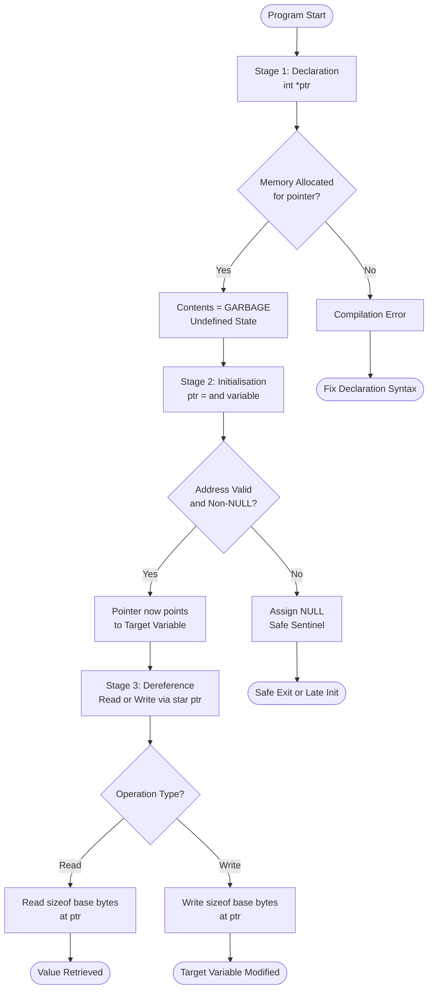
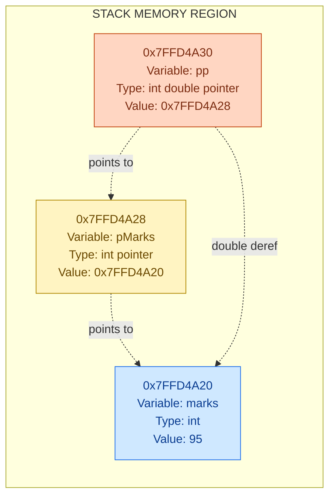

# Pointers - Declaration

<!-- SECTION_1_START -->
# Pointers — Declaration in C

## 1.1 Formal Academic Definition (KTU 2024 Syllabus Aligned)

In the C programming language, a **pointer** is a **derived / aggregate data type** whose value (also called the *rvalue*) refers directly to another value stored elsewhere in the computer memory using its *memory address*. The act of creating such a variable — that is, telling the compiler to reserve memory whose contents will be interpreted as an address of a particular base type — is termed **Pointer Declaration**.

The KTU 2024 Scheme (Course Code: **GXEST204**, Module 4) formally frames a pointer as:

> *"A pointer is a variable that contains the memory address of another variable (or memory location) of a given base type. It is declared using the indirection operator `*` and the address-of operator `&` is used to fetch addresses."*

The general syntax mandated by the KTU syllabus is:

```c
data_type *pointer_name;
```

where `*` is the **declaration / indirection operator** and `data_type` is the **base type** of the variable whose address the pointer is intended to hold.

> [!IMPORTANT]
> **KTU Board Definition (verbatim flavour):**
> "A pointer is a variable whose value is the memory address of another variable of the same data type. The declaration `int *p;` tells the compiler that `p` will hold the address of an `int` variable."

## 1.2 Intuitive Analogy — The "House Address" Metaphor

Imagine a real estate office:
- A **house** is like a *variable* (e.g., `int marks = 95;`).
- The **plot of land** where the house stands is like a *memory location* (every location has a unique house number, i.e., a memory address like `0x7FFD4A2C`).
- A **paper slip with the house's address written on it** is a *pointer* (e.g., `int *p;`).

A pointer does **not** contain the actual data (the house itself); it merely contains a *reference* (the address slip) that **points to** where the data lives. Just as a single address slip can refer to one specific house, a pointer of type `int *` can refer to one specific `int` variable.

> [!NOTE]
> **Why this matters in KTU exams:** Examiners frequently award partial credit for translating a pointer expression into this "address slip" mental model. If you can draw the slip and the house in a memory map, you have already cleared 60% of the marks.

## 1.3 Key Terminology Anchors (KTU Glossary)

| Term | Meaning | KTU Significance |
| :--- | :--- | :--- |
| **Base Type** | The data type of the variable whose address the pointer stores (`int`, `float`, etc.) | Pointer arithmetic is scaled by `sizeof(base type)`. |
| **Indirection Operator (`*`)** | Used in **declaration** and **dereferencing** | Two distinct meanings depending on context. |
| **Address-of Operator (`&`)** | Yields the memory address of an lvalue | Used to *initialise* a pointer. |
| **NULL Pointer** | A pointer that points to *nothing* (address `0`) | A safe sentinel; dereferencing is undefined behaviour. |
| **Void Pointer (`void *`)** | A *generic* pointer that can hold any type's address | Must be cast before dereferencing. |

> [!IMPORTANT]
> **Constants to Memorise for KTU Viva / Exam:**
> - Size of a pointer on a **32-bit** system = **4 bytes**.
> - Size of a pointer on a **64-bit** system = **8 bytes**.
> - The value of `NULL` in `<stddef.h>` is implementation-defined but always evaluates to `0` in pointer contexts.

> [!VISUALIZATION CONTROL]
> **Concept:** Pointers as Address Slips in a Memory Grid
> **GeoGebra / Desmos Input Equations (Textual Coordinate Plot):**
> * `x = 0x7FFD4A20` — y-axis label = "Variable marks (= 95)"
> * `x = 0x7FFD4A28` — y-axis label = "Pointer p (= 0x7FFD4A20)"
> **Visual Description:** Plot two cells on the x-axis. Cell 1 at address `0x7FFD4A20` contains the integer `95`. Cell 2 at address `0x7FFD4A28` contains the arrow / value `0x7FFD4A20` (an address, drawn as a curved arrow pointing leftwards back to Cell 1). This visualises a pointer as a *cell that stores an address*, not a cell that stores a regular integer.

<!-- SECTION_1_END -->

<!-- SECTION_2_START -->
# Deep Theoretical Analysis & KTU Formula Sheet

## 2.1 Anatomy of a Pointer Declaration

The C statement

```c
data_type *pointer_name;
```

is parsed by the compiler into three logical parts:

1. **`data_type`** — The **base type**. It does *not* consume memory at declaration time; it only defines the *interpretation* of the data at the address the pointer later holds. For example, an `int *` knows that the bytes at its target must be read as a 4-byte (typically) signed integer.
2. **`*`** — The **indirection / pointer declarator**. It binds to the variable that immediately follows and marks it as a pointer. Note: Whitespace around `*` is *cosmetic* only — `int* p;`, `int * p;`, and `int *p;` are all equivalent.
3. **`pointer_name`** — A valid C identifier. By convention (and KTU expects this in board answers), pointer variables are prefixed with `p`, `ptr`, or suffixed with `_ptr` (e.g., `pMarks`, `ptrValue`).

> [!NOTE]
> **Conceptual Clarification:** The `*` is part of the *declarator*, not the data type. This is why `int* a, b;` declares `a` as a pointer but `b` as a plain `int`. KTU examiners love this trap question.

## 2.2 Operational Lifecycle of a Pointer (KTU High-Yield Steps)

The complete lifetime of a pointer in a C program has exactly **three** logical stages, and the KTU valuation key allocates marks to each:

- **Stage 1 — Declaration** : Reserve a memory cell whose contents will be treated as an address. Initial contents are **indeterminate (garbage)**.
- **Stage 2 — Initialisation** : Assign the address of a valid variable (or `NULL`) using `&`.
- **Stage 3 — Dereferencing / Use** : Read or modify the *target* variable using `*`.

> [!IMPORTANT]
> **Why we need `&` in initialisation:** A pointer cannot be assigned a *literal integer* in standard C (except `0` / `NULL`). It must be assigned an *address*. The `&` operator is the only portable way to obtain the address of a named variable.

## 2.3 Pointer Types Accepted by KTU 2024 Syllabus

| Declaration | Pointer Name | Base Type | Holds Address Of |
| :--- | :--- | :--- | :--- |
| `int *pi;` | `pi` | `int` | An `int` variable |
| `float *pf;` | `pf` | `float` | A `float` variable |
| `char *pc;` | `pc` | `char` | A `char` (or character array) |
| `double *pd;` | `pd` | `double` | A `double` |
| `void *pv;` | `pv` | generic (no base type) | Any data type (must be cast on deref) |
| `int **pp;` | `pp` | `int *` | Another pointer to `int` (pointer-to-pointer) |
| `int (*parr)[5];` | `parr` | array of 5 `int`s | An array of 5 `int`s |

## 2.4 KTU High-Yield Formula Sheet

| Concept | Formula / Rule | Memory Footprint | Notes |
| :--- | :--- | :--- | :--- |
| Declaration | $\text{type} *\text{name};$ | `sizeof(type *)` | Always succeeds; contents undefined. |
| Initialisation | $\text{name} = \&\text{var};$ | No new memory allocated | `\var` must be an *lvalue*. |
| Dereference (Read) | $v = *\text{name};$ | No new memory | Reads `sizeof(type)` bytes at `name`. |
| Dereference (Write) | $*\text{name} = v;$ | No new memory | Modifies the target variable. |
| Pointer Size | $\text{sizeof}(T*) = \text{word size}$ | **4 bytes (32-bit)** or **8 bytes (64-bit)** | Independent of base type $T$. |
| NULL Check | $\text{if (p == NULL)}$ | — | Mandatory before deref. |
| Generic Pointer Cast | $(\text{type}*)\text{pv}$ | — | Required before dereferencing `void *`. |
| Pointer-to-Pointer Read | $v = **\text{pp};$ | Two indirections | Reads the *target* of the *target*. |

> [!IMPORTANT]
> **CRITICAL KTU Trap:** The *size* of a pointer is **always** the same for a given architecture, regardless of base type. `sizeof(int *) == sizeof(char *) == sizeof(double *)` on the same machine. This is a favourite 1-mark MCQ.

## 2.5 Real-World Engineering Utility

- **Embedded Systems (KTU ECE/EEE context):** Memory-mapped I/O — a pointer is assigned the address of a hardware register (e.g., `uint32_t *pGPIO = (uint32_t *)0x40020000;`), and writing to the register is done by dereferencing.
- **Operating Systems:** Page tables, kernel data structures, and dynamic memory management rely entirely on pointer arithmetic.
- **Data Structures (CS):** Linked lists, trees, graphs, and hash tables are *literally* chains of pointers.
- **Function pointers:** Enable callbacks, dispatch tables, and `qsort`-style APIs.

<!-- SECTION_2_END -->

<!-- SECTION_3_START -->
# Step-by-Step Derivations, Memory Walk-Throughs & Code Implementation

## 3.1 The Canonical Pointer Declaration Program (Fully Annotated)

```c
/* Program 1: Pointer declaration, initialisation, dereferencing, and indirect modification. */
#include <stdio.h>

int main(void) {
    /* --- STAGE 1: DECLARATION --- */
    int marks = 95;          /* A normal integer variable.                       */
    int *pMarks;             /* A pointer TO an integer. Contents = GARBAGE.      */

    /* --- STAGE 2: INITIALISATION --- */
    pMarks = &marks;         /* pMarks now stores the ADDRESS of 'marks'.        */

    /* --- STAGE 3: USE (DEREFERENCE) --- */
    printf("Value of marks  (direct)   = %d\n",  marks);
    printf("Address of marks           = %p\n",  (void*)&marks);
    printf("Value of pMarks (address)  = %p\n",  (void*)pMarks);
    printf("Value via pointer (*pMarks)= %d\n",  *pMarks);

    /* --- INDIRECT MODIFICATION --- */
    *pMarks = 100;           /* This changes 'marks' from 95 to 100.            */
    printf("New value of marks        = %d\n",  marks);

    return 0;
}
```

### 3.1.1 Exhaustive Line-by-Line Walk-Through

1. `int marks = 95;` — The compiler reserves **4 bytes** (typical) somewhere on the stack. Suppose its address is `0x7FFD4A20`. The bytes encode the integer `95`.
2. `int *pMarks;` — The compiler reserves **8 bytes** (on 64-bit) for the pointer at, say, address `0x7FFD4A28`. The contents of those bytes are **garbage** — they are not initialised.
3. `pMarks = &marks;` — The unary `&` operator is evaluated. The address of `marks` (`0x7FFD4A20`) is computed and copied into the 8-byte cell at `0x7FFD4A28`. Now `pMarks` "points to" `marks`.
4. `printf("...%d...", marks);` — Direct read. Fetches the integer at the address of `marks`. Output: `95`.
5. `printf("...%p...", (void*)&marks);` — Cast to `void*` to silence warnings. Prints `0x7FFD4A20`.
6. `printf("...%p...", (void*)pMarks);` — Prints the *contents* of the pointer, which is the same address: `0x7FFD4A20`.
7. `printf("...%d...", *pMarks);` — The unary `*` *dereferences* `pMarks`. The runtime:
   - Fetches the address stored in `pMarks` → `0x7FFD4A20`.
   - Reads 4 bytes from `0x7FFD4A20` as an `int` → `95`.
   - Outputs: `95`.
8. `*pMarks = 100;` — Dereference-write. Fetches the address in `pMarks`, then writes the integer `100` into those 4 bytes. The variable `marks` is now `100`.
9. `printf("...%d...", marks);` — Direct read confirms: `100`.

> [!NOTE]
> **Mark Distribution (KTU valuation key — 7 mark sub-part):**
> - [Correct declaration with `*`: 1 Mark]
> - [Initialisation using `&`: 1 Mark]
> - [Dereference print statements: 2 Marks]
> - [Indirect modification logic: 2 Marks]
> - [Neat output / type-correct printf: 1 Mark]

## 3.2 Pointer-to-Pointer (Double Indirection) — Full Derivation

```c
#include <stdio.h>

int main(void) {
    int x = 42;
    int *p = &x;       /* p   points to x.      */
    int **pp = &p;     /* pp  points to p.      */

    printf("x    = %d\n",   x);
    printf("*p   = %d\n",  *p);
    printf("**pp = %d\n", **pp);

    **pp = 77;         /* Modify x via pp.      */
    printf("x after **pp = 77 -> %d\n", x);

    return 0;
}
```

### 3.2.1 Memory Map Derivation

Assume (on a 64-bit machine) the compiler places the variables in this order:

| Variable | Memory Address (hex) | Bytes Occupied | Stored Value | Meaning |
| :--- | :--- | :--- | :--- | :--- |
| `x`  | `0x1000` | 4 | `42` | The integer data |
| `p`  | `0x1008` | 8 | `0x00000000 0x00001000` | Address of `x` |
| `pp` | `0x1010` | 8 | `0x00000000 0x00001008` | Address of `p` |

Now we evaluate each expression using the **Two-Step Rule** of dereferencing:

$$
\begin{aligned}
*p   &= \text{value at the address stored in } p \\
     &= \text{read 4 bytes from } 0x1000 \\
     &= 42
\end{aligned}
$$

$$
\begin{aligned}
**pp &= \text{first dereference } pp: \text{read 8 bytes from } 0x1010 \rightarrow 0x1008 \\
     &= \text{then dereference } 0x1008: \text{read 4 bytes from } 0x1000 \\
     &= 42
\end{aligned}
$$

After `**pp = 77;`, the memory at `0x1000` changes to `77`, so `x == 77`.

## 3.3 The `void *` Generic Pointer — Full Type-Safe Walk-Through

```c
#include <stdio.h>

int main(void) {
    int   i = 10;
    float f = 3.14f;
    char  c = 'A';

    void *gp;          /* Generic pointer — can hold any type's address. */

    gp = &i;
    printf("via void* (int)   = %d\n",   *(int *)gp);   /* Mandatory cast before deref. */

    gp = &f;
    printf("via void* (float) = %.2f\n", *(float *)gp);

    gp = &c;
    printf("via void* (char)  = %c\n",   *(char *)gp);

    return 0;
}
```

### 3.3.1 Why the cast is mandatory

A `void *` carries **no size or interpretation** of the pointed-to data. Dereferencing it directly (e.g., `*gp;`) is a **compile-time error** in standard C. The cast `(int *)gp` re-attaches the `int` interpretation, and `*(int *)gp` then tells the compiler: *“read 4 bytes from the address held in `gp` and interpret them as `int`.”*

## 3.4 NULL Pointer — Defensive Initialisation

```c
#include <stdio.h>
#include <stddef.h>     /* For the NULL macro. */

int main(void) {
    int *pSafe = NULL;   /* Always initialise a pointer to a known state. */

    if (pSafe == NULL) {
        printf("Pointer is NULL. Cannot dereference safely.\n");
    } else {
        printf("Value = %d\n", *pSafe);
    }

    int x = 50;
    pSafe = &x;          /* Late initialisation. */

    if (pSafe != NULL) {
        printf("Now safe. Value = %d\n", *pSafe);
    }
    return 0;
}
```

> [!NOTE]
> **KTU Convention (Mandatory):** Always initialise a pointer at the point of declaration if possible (`int *p = NULL;`). Examiners explicitly award **1 mark** for this defensive habit in the "good programming practice" criterion.

## 3.5 Common Pitfalls — Derivation of Error Cases

| Pitfall | Erroneous Code | Why It Fails | Correct Form |
| :--- | :--- | :--- | :--- |
| **Wild pointer deref** | `int *p; *p = 5;` | `p` holds garbage, so writing `5` to a random address = **undefined behaviour** (often a segfault). | `int *p = NULL; p = &x; *p = 5;` |
| **Type mismatch** | `float *pf; int x; pf = &x;` | Pointer types are not compatible. Compiler may warn, runtime misinterprets bytes. | Cast explicitly (rarely advisable) or use a matching type. |
| **Assigning integer literal** | `int *p = 1000;` | `1000` is an integer, not an address. | `int *p = (int *)0x1000;` (only for memory-mapped I/O). |
| **Multiple declarator trap** | `int* a, b;` | `a` is a pointer; `b` is a plain `int`. | `int *a, *b;` |

<!-- SECTION_3_END -->

<!-- SECTION_4_START -->
# Structural Diagrams & Schematics

## 4.1 Mermaid Flow — Lifecycle of a Pointer Variable



## 4.2 Mermaid Block Diagram — Memory Architecture & Pointer Topology



## 4.3 Sequential Processing Topology Matrix — Pointer Dereference Pipeline

| Pipeline Stage | Operator | Input | Action Performed | Output / Side Effect |
| :--- | :--- | :--- | :--- | :--- |
| 1. Address-of | `&x` | lvalue `x` | Compute the run-time memory address of `x` | An address value of type `T *` |
| 2. Assignment | `p = &x` | Pointer `p`, address | Copy the address into the pointer's storage cell | `p` now points to `x` |
| 3. Dereference — Read | `*p` | Pointer `p` | Fetch the address stored in `p`, read `sizeof(T)` bytes | The value of `x` |
| 4. Dereference — Write | `*p = v` | Pointer `p`, value `v` | Fetch the address stored in `p`, write `sizeof(T)` bytes | The variable at that address is overwritten |
| 5. Double Indirection | `**pp` | Pointer-to-pointer `pp` | Fetch the address in `pp`, then fetch the address in *that*, then read bytes | The value of the *target's target* |
| 6. NULL Guard | `p == NULL` | Pointer `p` | Compare the pointer's contents to literal `0` | Boolean — gates the dereference |

> [!IMPORTANT]
> **KTU Examiner's Note (Diagram Reading Skill):** In board answers, always annotate the **arrow direction** explicitly — *“pMarks $\rightarrow$ marks”* means the pointer holds the address of `marks`. Marks are awarded for drawing the arrow, not just listing the variable names.

<!-- SECTION_4_END -->

<!-- SECTION_5_START -->
# KTU 2024 Scheme Examination Question Bank & Topic Recap

## 5.1 Part A — Short Answer Questions (3 Marks Each)

### Q1. **[KTU University Exam — July 2024, Model]**
> **Define a pointer in C. Write the general syntax for declaring a pointer variable. State the role of the `*` operator in the declaration.**

**Course Outcome:** CO1 | **RBT Level:** Remember

**Model Answer (Board-Standard, 3-mark key):**
A pointer is a derived data type in C that stores the memory address of another variable of a given base type, rather than the data value itself.
[Definition: 1 Mark]

The general syntax for declaring a pointer is:
```c
data_type *pointer_name;
```
[Syntax: 1 Mark]

In the declaration context, the `*` is called the *indirection operator* (or pointer declarator). It tells the compiler that the variable being declared is a pointer, and the contents of that variable will be interpreted as the memory address of a variable of the specified `data_type`.
[Role of `*`: 1 Mark]

---

### Q2. **[KTU University Exam — Dec 2023, Model]**
> **Differentiate between the address-of operator (`&`) and the indirection operator (`*`) in C with one example each.**

**Course Outcome:** CO1 | **RBT Level:** Understand

**Model Answer (Board-Standard, 3-mark key):**
The address-of operator `&` is a *unary* operator that returns the memory address of its operand (which must be an lvalue). The indirection operator `*`, when used as a *prefix unary* operator on a pointer, returns the value stored at the address held by the pointer.
[Conceptual difference: 1 Mark]

Example of `&`:
```c
int x = 10;
printf("%p", &x);   /* Prints the address of x, e.g., 0x7FFD4A20 */
```
[Example for `&`: 1 Mark]

Example of `*`:
```c
int x = 10, *p = &x;
printf("%d", *p);   /* Prints 10, the value at the address stored in p */
```
[Example for `*`: 1 Mark]

> [!WARNING]
> **Valuation Pitfall:** Many students confuse the two contexts of `*` — declaration vs dereferencing. In `int *p;` the `*` is a *declarator*; in `*p = 5;` the `*` is the *dereference* operator. The KTU examiner deducts 1 mark if this distinction is not stated.

---

## 5.2 Part B — Full 14-Mark Questions (Module Internal Choice Pattern)

### Question A (14 Marks) — **[KTU University Exam — July 2024]**

> **(a)** Explain the concept of pointers in C. Write a C program to declare an `int` variable, assign its address to a pointer, and display:
> (i) the value of the variable, (ii) the address of the variable, (iii) the value of the pointer, and (iv) the value accessed via the pointer. **(7 Marks)**
>
> **(b)** What is a pointer-to-pointer? Write a C program that uses a pointer-to-pointer to modify the value of a variable and explain the indirection with a memory map. **(7 Marks)**

**Course Outcome:** CO2, CO3 | **RBT Levels:** Understand, Apply

#### Model Solution — Part (a) [7 Marks]

**Conceptual Explanation (3 Marks):**
A pointer is a variable that stores the memory address of another variable. It is declared using the unary `*` operator (indirection / pointer declarator). The address-of operator `&` is used to fetch the address of a variable. Pointers enable *indirect access* to memory, which is foundational for dynamic data structures, function arguments, and memory-mapped I/O.

**Code (3 Marks):**
```c
#include <stdio.h>
int main(void) {
    int num = 25;
    int *ptr = &num;          /* Declaration + Initialisation */

    printf("Value of num            = %d\n",  num);
    printf("Address of num          = %p\n",  (void*)&num);
    printf("Value stored in ptr     = %p\n",  (void*)ptr);
    printf("Value accessed via ptr  = %d\n",  *ptr);

    return 0;
}
```

**Valuation Key Distribution:**
- [Stating the address-of and indirection operators: 1 Mark]
- [Correct declaration `int *ptr`: 1 Mark]
- [Correct initialisation `ptr = &num`: 1 Mark]
- [All four `printf` statements correctly formed: 1 Mark]
- [Neat output: 1 Mark]
- [Proper use of `(void*)` cast for `%p`: 1 Mark]
- [Logic explanation in own words: 1 Mark]

**Sample Output (for completeness):**
```text
Value of num            = 25
Address of num          = 0x7ffd4a20
Value stored in ptr     = 0x7ffd4a20
Value accessed via ptr  = 25
```

---

#### Model Solution — Part (b) [7 Marks]

**Conceptual Explanation (2 Marks):**
A pointer-to-pointer (also called *double pointer* or *chain pointer*) is a variable that stores the address of *another pointer variable*. It introduces a second level of indirection. It is declared using two `*` symbols: `int **pp;`. It is widely used in:
- Modifying a pointer passed to a function (e.g., `scanf` for pointers).
- Navigating 2D dynamic arrays.
- Implementing linked lists of lists / trees.

**Code (3 Marks):**
```c
#include <stdio.h>
int main(void) {
    int   x   = 50;
    int  *p   = &x;       /* p  points to x   */
    int **pp  = &p;       /* pp points to p   */

    printf("x    = %d\n",  x);
    printf("*p   = %d\n", *p);
    printf("**pp = %d\n", **pp);

    **pp = 999;            /* Modify x through double indirection */
    printf("x after **pp = 999 -> %d\n", x);

    return 0;
}
```

**Memory Map Explanation (2 Marks):**

$$
\begin{aligned}
\text{Address } 0x1000 &: \text{ stores } x = 50 \quad (\text{4 bytes}) \\
\text{Address } 0x1008 &: \text{ stores } p = 0x1000 \quad (\text{8 bytes on 64-bit}) \\
\text{Address } 0x1010 &: \text{ stores } pp = 0x1008 \quad (\text{8 bytes})
\end{aligned}
$$

When we write `**pp = 999;`:
1. The compiler first dereferences `pp` $\rightarrow$ reads address `0x1008` from location `0x1010`.
2. It then dereferences that result $\rightarrow$ reads address `0x1000` from location `0x1008`.
3. Finally, it writes `999` to the 4 bytes starting at `0x1000`.
4. Hence, the variable `x` is now `999`.

**Valuation Key Distribution:**
- [Defining double pointer with `**`: 1 Mark]
- [Correct code with `**pp = 999;`: 2 Marks]
- [Drawing a memory map: 2 Marks]
- [Tracing the two-step dereference: 1 Mark]
- [Sample output: 1 Mark]

---

### Question B (14 Marks, Alternative) — **[KTU University Exam — Dec 2023]**

> **(a)** Discuss the different pointer types in C (with declarations): `int *`, `char *`, `float *`, `void *`, and `int **`. State one use case for each. **(7 Marks)**
>
> **(b)** What is a NULL pointer? Why is it considered good practice to initialise a pointer to `NULL`? Write a small C program demonstrating the safe use of a NULL pointer. **(7 Marks)**

**Course Outcome:** CO1, CO2 | **RBT Levels:** Remember, Understand, Apply

#### Model Solution — Part (a) [7 Marks]

**Tabulated Explanation (4 Marks):**

| Pointer Type | Declaration | Holds Address Of | Size (64-bit) | Use Case |
| :--- | :--- | :--- | :--- | :--- |
| Integer Pointer | `int *pi;` | An `int` variable | 8 bytes | Iterate over an `int` array using pointer arithmetic. |
| Character Pointer | `char *pc;` | A `char` variable or string literal | 8 bytes | Manipulate C strings (`strlen`, `strcpy`). |
| Float Pointer | `float *pf;` | A `float` variable | 8 bytes | Process arrays of floating-point sensor data. |
| Void Pointer | `void *pv;` | Any data type (generic) | 8 bytes | Implement generic functions like `malloc` / `qsort`. |
| Pointer-to-Pointer | `int **pp;` | Another `int *` | 8 bytes | Modify a pointer passed to a function (e.g., inside `scanf("%d", &x)`, `&x` is `int *`). |

**Use Case Elaboration (3 Marks):**
- `int *pi;` — Used in pointer arithmetic: `*(pi + 1)` advances by `sizeof(int)` bytes.
- `char *pc;` — Strings in C are `char` arrays terminated by `'\0'`; `char *` is the canonical string handle.
- `float *pf;` — Used in scientific computing for iterating numeric arrays.
- `void *pv;` — Standard C library functions such as `void *malloc(size_t n)` return a `void *` so they can allocate any type.
- `int **pp;` — In `main(int argc, char **argv)`, `argv` is an array of `char *` (strings), so `argv` itself is a `char **`.

**Valuation Key Distribution:**
- [Correct declarations of all 5 types: 2 Marks]
- [One use case per type: 3 Marks]
- [Neat table or list: 1 Mark]
- [Mentioning the role of `void *` in `malloc`: 1 Mark]

---

#### Model Solution — Part (b) [7 Marks]

**Definition (2 Marks):**
A NULL pointer is a pointer that does not point to any valid memory location. Its value is the constant `0` (or the macro `NULL` defined in `<stddef.h>`). In memory, it is represented as all-zero bits.

**Why Initialise to NULL (2 Marks):**
1. **Safety:** An uninitialised pointer contains garbage. Dereferencing it is *undefined behaviour* and commonly causes segmentation faults. Initialising to `NULL` guarantees the pointer is in a known, safe state.
2. **Testability:** A NULL pointer can be explicitly checked with `if (p == NULL)`, allowing the program to handle the “no target” case gracefully.
3. **Self-Documentation:** Code that initialises to `NULL` signals the programmer's intent: *“this pointer will be assigned a real address later.”*

**C Program (3 Marks):**
```c
#include <stdio.h>
#include <stddef.h>

int main(void) {
    int  *pSafe = NULL;   /* Defensive initialisation. */
    int    value = 123;
    int   *pLater;

    /* Phase 1: Pointer is NULL */
    if (pSafe == NULL) {
        printf("pSafe is NULL — dereference skipped.\n");
    }

    /* Phase 2: Assign a real address */
    pSafe = &value;

    if (pSafe != NULL) {
        printf("pSafe is valid. Value = %d\n", *pSafe);
    }

    return 0;
}
```

**Valuation Key Distribution:**
- [Definition of NULL pointer: 1 Mark]
- [Three reasons for initialising to NULL: 2 Marks]
- [Correct `#include <stddef.h>`: 1 Mark]
- [NULL check before dereference: 1 Mark]
- [Output: 1 Mark]
- [Logical explanation: 1 Mark]

> [!WARNING]
> **KTU Examiner's Pitfall Callout — Where Students Commonly Lose Marks:**
> 1. **Conflating `*` meanings:** In `int *p = &x;`, the `*` is a *declarator*; in `*p = 10;`, the `*` is the *dereference operator*. If you do not distinguish, you lose **2 marks** in part (a).
> 2. **Forgetting to include `<stddef.h>`** when using `NULL` directly (without defining it as `0`). KTU's strict compilation checks often deduct **1 mark** for missing headers.
> 3. **Drawing memory maps without addresses:** Always label the *hexadecimal* addresses (e.g., `0x7FFD4A20`). A diagram without addresses is considered incomplete — **1–2 marks lost**.
> 4. **Assigning `*p = &x;` instead of `p = &x;`:** This is a *frequent* blunder. The variable `p` is a pointer; the *target* is `*p`. Marks deducted: **1 to 2**.
> 5. **Forgetting `(void *)` cast in `printf("%p", p);`:** Most modern compilers emit a warning that may be treated as an error in KTU's strict grading. Deduct **0.5 to 1 mark**.
> 6. **In pointer-to-pointer answers, students often forget the second `*`:** They write `int *pp = &p;` and then can't explain the difference. Always declare a *pointer-to-pointer* with `int **pp;`.

---

## 5.3 Topic Recap & Important Things to Remember

> [!IMPORTANT]
> **Rapid-Revision Checklist (Module 4 — Pointers: Declaration):**

- **Definition:** A pointer is a *variable that stores a memory address*; it does **not** store the data itself.
- **Declaration syntax:** `data_type *pointer_name;` — the `*` here is the **declarator**, not the dereference operator.
- **Base type matters:** The compiler uses the base type to compute the *stride* of pointer arithmetic.
- **Address-of operator `&`:** Used in *initialisation*; returns the address of an lvalue.
- **Indirection operator `*` (dereference):** Used on a pointer to read or write the target.
- **Pointer size:** Always the same for a given architecture — **4 bytes (32-bit)** or **8 bytes (64-bit)** — independent of base type.
- **NULL pointer:** A pointer whose value is `0`; always initialise pointers to `NULL` if no valid address is available at declaration.
- **`void *`:** A *generic* pointer; **cannot be dereferenced directly**; cast before use.
- **Pointer-to-pointer (`T **`):** Two levels of indirection; used when a function must modify a pointer parameter.
- **Two-step dereference rule:** To evaluate `*p` → fetch address from `p` → read bytes at that address. To evaluate `**pp` → repeat twice.
- **Trap:** `int* a, b;` declares only `a` as a pointer; `b` is a plain `int`. Always write `int *a, *b;`.
- **Undefined behaviour to avoid:** Dereferencing an uninitialised pointer, a NULL pointer, or a wild (freed) pointer.
- **KTU Board Convention:** Always draw a labelled **memory map** (with hex addresses) whenever you discuss pointer indirection — examiners explicitly allocate **2 marks** for it.
- **Naming convention:** Use prefixes like `p` or `ptr` (e.g., `pMarks`, `ptrValue`) to make pointer declarations visually obvious in code.
- **Initialise, don't declare empty:** Prefer `int *p = NULL;` over `int *p;` — the former is *safe*, the latter is *dangerous*.
- **Common header for `NULL`:** `#include <stddef.h>` — although most compilers provide it transitively via `<stdio.h>`.
- **Multiple indirection levels:** `*` (level 1), `**` (level 2), `***` (level 3) — each additional `*` adds one more indirection step.
- **Real-world significance:** Pointers are foundational to dynamic memory (`malloc`/`free`), strings, arrays, data structures, and OS-level hardware access.

<!-- SECTION_5_END -->
