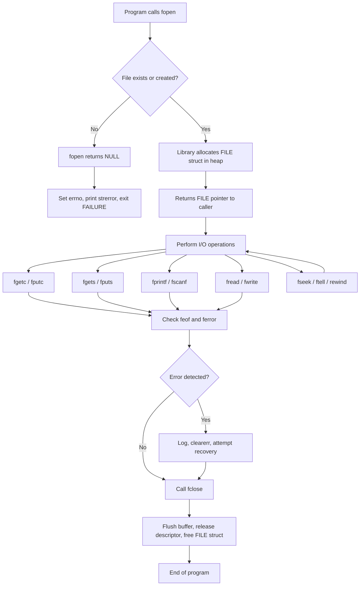
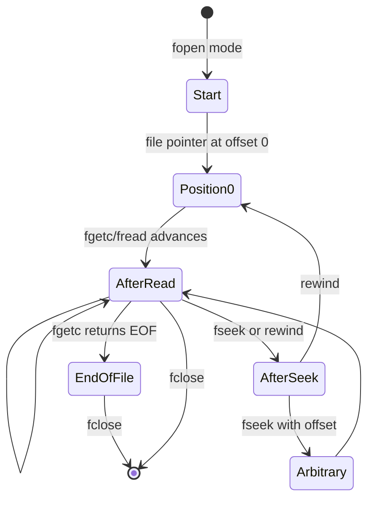
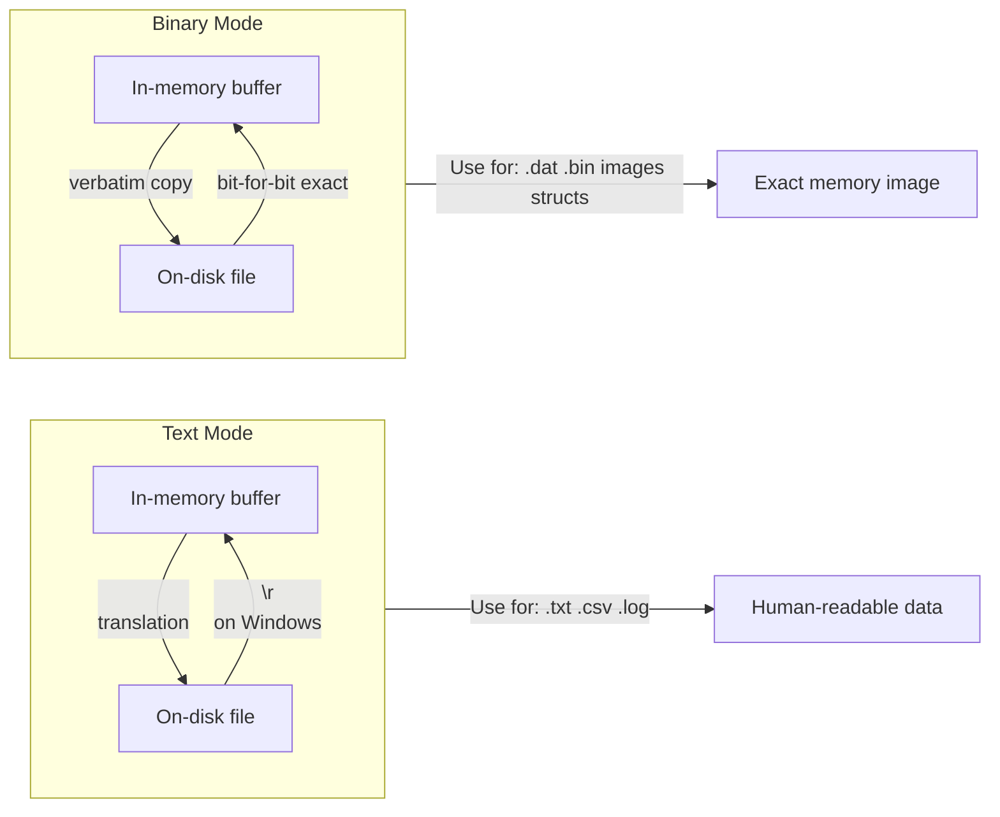
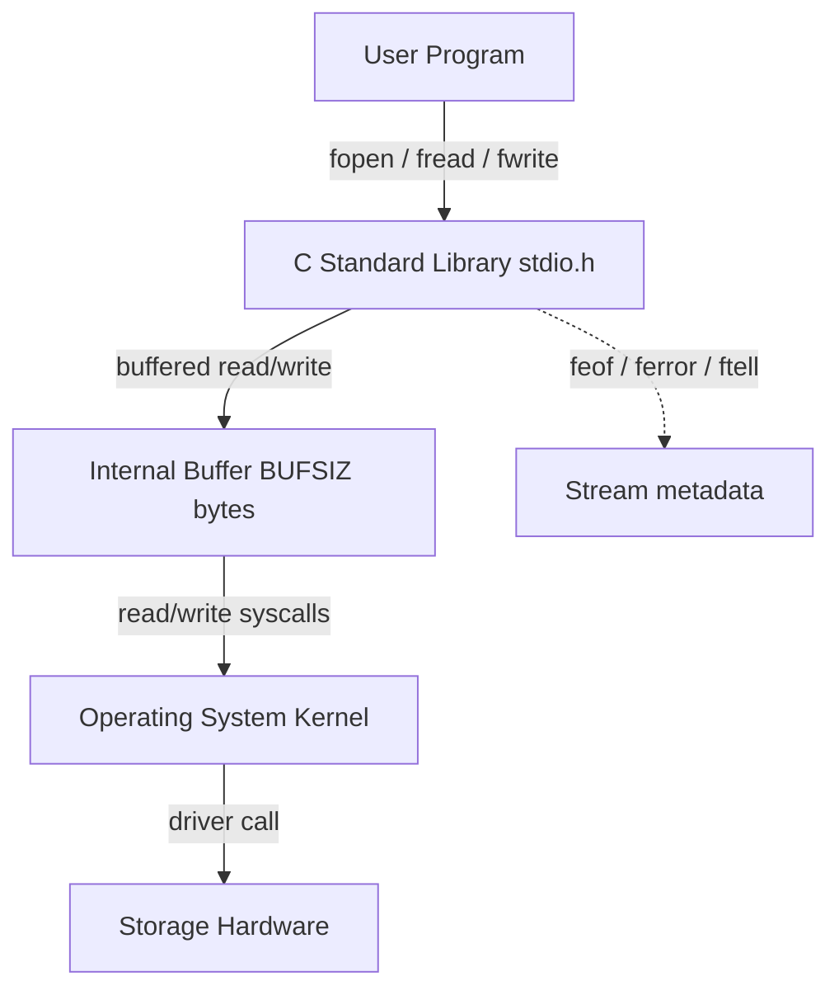

# Processing files

<!-- SECTION_1_START -->
# Processing Files in C — Core Technical Definition & Intuitive Overview

## 1.1 Formal Definition (KTU 2024 Syllabus Terminology)

**File Processing in C** refers to the mechanism of storing data permanently on secondary storage devices (such as hard disks) through a stream-based I/O interface defined by the C Standard Library (`<stdio.h>`). A *file* is an abstract named container of bytes residing on a storage medium, and C treats every file as a sequential stream of characters terminated by an **End-Of-File (EOF)** marker.

> [!IMPORTANT]
> **KTU 2024 Syllabus Highlight (Module 4 — Pointers, sub-topic: Processing Files):**
> A file is accessed through a **File Pointer** of type `FILE *` (a structure pointer declared in `<stdio.h>`). All read/write operations use this pointer as a handle, demonstrating the power of pointers when working with non-memory resources.

A file stream is opened using `fopen()`, operated upon using stream functions, and closed using `fclose()`. The standard I/O library automatically allocates a **File Control Block (FCB)** in memory for every opened file — this is why a pointer (`FILE *`) is mandatory.

---

## 1.2 Conceptual Analogy / Intuition

Imagine a **massive water pipeline** connected to a huge underground tank (the file on disk). You cannot pick up the tank and pour water into it directly; instead, you use a **valve handle** (the `FILE *` pointer) to control the flow. 

- `fopen()` — turns the valve ON and gives you the handle.
- `fread` / `fwrite` / `fgetc` / `fputc` — water flowing through the pipe.
- `fseek()` — rotates the pipe to a different position.
- `fclose()` — turns the valve OFF and seals the tank.

The **valve handle** is the *pointer*; without it, the C runtime has no way to know *which* file you are talking to, because dozens of files may be open simultaneously. This is the same pointer-indirection pattern you used for arrays and functions, but here it is applied to **I/O resources**.

> [!NOTE]
> **Geometric Intuition — The File Position Indicator (cursor):**
> Think of the file as an infinitely long number line. A small arrow (the file position indicator) starts at **offset 0** and moves forward as you read or write. `fseek()` slides the arrow left or right; `ftell()` reports its current coordinate; `rewind()` snaps it back to **0**.

---

## 1.3 Physical Constants and Standard Metrics

| Metric | Value / Symbol | Meaning |
| :--- | :--- | :--- |
| `EOF` | **$-1$** (typically) | Sentinel returned when no more data can be read |
| `NULL` | **$0$** | Returned by `fopen()` on failure |
| `SEEK_SET` | **$0$** | Beginning of file |
| `SEEK_CUR` | **$1$** | Current file position |
| `SEEK_END` | **$2$** | End of file |
| `BUFSIZ` | **$\geq 8192$ bytes** | Standard I/O internal buffer size (implementation-defined) |
| `FOPEN_MAX` | **$\geq 8$** (C89); **$\geq 20$** (C23) | Maximum number of simultaneously open files |

> [!VISUALIZATION CONTROL]
> **Concept:** File Position Indicator sliding along a byte stream
> **Desmos-friendly representation:** Imagine a horizontal axis with tick marks at byte offsets $0, 1, 2, 3, \ldots, n-1$ and a movable cursor $p$. After each `fgetc()`, $p \leftarrow p+1$. After `fseek(fp, $k$, SEEK_SET)`, $p \leftarrow k$. After `rewind(fp)`, $p \leftarrow 0$.
> **Visual Description:** A number line with a triangular cursor that jumps by $+1$ on read/write, and can teleport to any coordinate using `fseek()`.

---

## 1.4 File Types in C

C recognizes two physical file encodings:

1. **Text File** — A stream of characters organized as lines separated by newline (`\n`). On Windows, `\n` is translated to `\r\n` on disk (translation mode). Mode strings contain `"t"` (e.g., `"rt"`) or are implied.
2. **Binary File** — A stream of raw bytes identical to what is in memory (no translation). Mode strings contain `"b"` (e.g., `"rb"`, `"wb"`).

> [!NOTE]
> **Why two modes?** In text mode, the runtime performs platform-specific line-ending translation. In binary mode, the bytes are written/read verbatim — essential for storing structs, images, audio, or any non-textual data.

<!-- SECTION_1_END -->

<!-- SECTION_2_START -->
# Deep Theoretical Analysis & KTU High-Yield Formula Sheet

## 2.1 The File Pointer — Why a Pointer is Mandatory

When `fopen()` succeeds, the C library:

1. Finds a free slot in an internal array called the **file table**.
2. Allocates a `FILE` structure containing:
   - File descriptor
   - Current position indicator
   - End-of-file flag
   - Error flag
   - Buffer pointer
3. Returns the **address** of this structure.

Hence the return type is `FILE *` — a pointer to that structure. Every subsequent I/O call requires this pointer so the library can find the right slot.

$$\text{fopen}(\textit{path}, \textit{mode}) \;\longrightarrow\; \text{struct FILE} \;\;\text{(in heap) } \;\;\Rightarrow\;\; \text{return address}$$

## 2.2 File Opening Modes — Complete Matrix

| Mode String | Read | Write | Create | Truncate | Position | Use Case |
| :--- | :---: | :---: | :---: | :---: | :---: | :--- |
| `"r"` | ✓ | | | | Start | Read existing text |
| `"w"` | | ✓ | ✓ | ✓ | Start | Overwrite/create text |
| `"a"` | | ✓ | ✓ | | End | Append to text |
| `"r+"` | ✓ | ✓ | | | Start | Read & modify existing |
| `"w+"` | ✓ | ✓ | ✓ | ✓ | Start | Read & overwrite |
| `"a+"` | ✓ | ✓ | ✓ | | End | Read & append |
| `"rb"` | ✓ | | | | Start | Read existing binary |
| `"wb"` | | ✓ | ✓ | ✓ | Start | Overwrite binary |
| `"ab"` | | ✓ | ✓ | | End | Append binary |
| `"rb+"` / `"r+b"` | ✓ | ✓ | | | Start | Read & modify binary |
| `"wb+"` / `"w+b"` | ✓ | ✓ | ✓ | ✓ | Start | Read & overwrite binary |
| `"ab+"` / `"a+b"` | ✓ | ✓ | ✓ | | End | Read & append binary |

> [!IMPORTANT]
> **KTU Examiner's Rule:** In append modes (`"a"`, `"a+"`, `"ab"`), **all write operations occur at the end of the file regardless of `fseek()`** — this is a frequent viva question.

## 2.3 KTU Formula Sheet / Cheat Sheet

### A. Opening & Closing
$$ \texttt{FILE *fp = fopen(const char *filename, const char *mode);} $$
- Returns `FILE *` on success, `NULL` on failure.
- Always check the return value.

$$ \texttt{int fclose(FILE *fp);} $$
- Returns `0` on success, `EOF` on error.
- Flushes buffer, releases descriptor, writes EOF marker.

### B. Character-Level I/O
$$ \texttt{int fgetc(FILE *fp);} \quad\longrightarrow\quad \text{returns next character as unsigned char cast to int, or EOF}$$
$$ \texttt{int fputc(int ch, FILE *fp);} \quad\longrightarrow\quad \text{returns character written, or EOF}$$
$$ \texttt{int getc(FILE *fp);} \quad\longrightarrow\quad \text{macro form of fgetc}$$
$$ \texttt{int putc(int ch, FILE *fp);} \quad\longrightarrow\quad \text{macro form of fputc}$$

### C. String-Level I/O
$$ \texttt{char *fgets(char *str, int n, FILE *fp);} $$
- Reads at most $n-1$ characters OR until `\n` OR until EOF.
- Appends `\0`. Returns `str` on success, `NULL` on EOF/error.

$$ \texttt{int fputs(const char *str, FILE *fp);} $$
- Writes string (excluding terminating `\0`). Returns non-negative on success, `EOF` on error.

### D. Formatted I/O
$$ \texttt{int fprintf(FILE *fp, const char *format, ...);} $$
$$ \texttt{int fscanf(FILE *fp, const char *format, ...);} $$

### E. Block / Binary I/O
$$ \texttt{size\_t fread(void *ptr, size\_t size, size\_t nmemb, FILE *fp);} $$
$$ \texttt{size\_t fwrite(const void *ptr, size\_t size, size\_t nmemb, FILE *fp);} $$
- Returns the number of items successfully read/written.

### F. Positioning
$$ \texttt{int fseek(FILE *fp, long offset, int whence);} $$
- `whence`: `SEEK_SET` ($0$), `SEEK_CUR` ($1$), `SEEK_END` ($2$).
- Returns non-zero on error.

$$ \texttt{long ftell(FILE *fp);} \quad\longrightarrow\quad \text{current offset, or -1L on error}$$
$$ \texttt{void rewind(FILE *fp);} \quad\longrightarrow\quad \text{equivalent to } \texttt{fseek(fp, 0L, SEEK_SET); clearerr(fp);}$$

### G. Status Predicates
$$ \texttt{int feof(FILE *fp);} \quad\longrightarrow\quad \text{non-zero if EOF flag set}$$
$$ \texttt{int ferror(FILE *fp);} \quad\longrightarrow\quad \text{non-zero if error flag set}$$
$$ \texttt{int fflush(FILE *fp);} \quad\longrightarrow\quad \text{force buffer write to disk (fflush(NULL) flushes all)}$$
$$ \texttt{void clearerr(FILE *fp);} \quad\longrightarrow\quad \text{reset EOF and error flags}$$

## 2.4 Text vs Binary — Engineering Decision Matrix

| Criterion | Text Mode | Binary Mode |
| :--- | :--- | :--- |
| Data type | Human-readable characters | Exact memory image |
| Translation | Yes (`\n` ↔ OS line ending) | None |
| Use for | `.txt`, `.csv`, `.log`, source code | `.dat`, `.bin`, images, audio, structs |
| Portability across OS | Lower (line ending varies) | High (raw bytes) |
| `sizeof` match | No for `int` etc. | Yes for `struct` arrays |
| KTU Typical Question | "Read a text file character by character" | "Store and retrieve employee records" |

## 2.5 Real-World Engineering Utility

- **Databases & Indexing:** MySQL, SQLite use `fread`/`fwrite` to persist B-tree pages.
- **Compilers:** Token streams and symbol tables are often cached in binary files.
- **Embedded Firmware:** `.hex` and `.bin` files use binary mode.
- **Log Analyzers:** Web servers (Apache, NGINX) emit append-only text logs read with `fgets` line-by-line.
- **Game Engines:** Save-game slots are written via `fwrite` of packed structs.
- **Operating Systems:** `/proc` and `/sys` use text files as a kernel-API surface.

> [!NOTE]
> The reason C is still the language of choice for high-performance I/O (databases, kernels, trading systems) is that `fread`/`fwrite` map almost 1-to-1 onto the OS `read`/`write` syscalls after the standard buffer is bypassed, giving predictable performance with zero garbage-collection pauses.

<!-- SECTION_2_END -->

<!-- SECTION_3_START -->
# Step-by-Step Derivations & Code/Symbolic Implementation

## 3.1 Algorithmic Pattern: The 5-Phase File Lifecycle

Every C file program follows this canonical template:

```c
#include <stdio.h>
#include <stdlib.h>
#include <errno.h>     // For errno, ENOENT
#include <string.h>    // For strerror

int main(void) {
    FILE *fp = NULL;
    errno = 0;

    /* PHASE 1 — OPEN */
    fp = fopen("data.txt", "r");
    if (fp == NULL) {
        fprintf(stderr, "fopen failed: %s\n", strerror(errno));
        return EXIT_FAILURE;
    }

    /* PHASE 2 — READ / WRITE / SEEK */
    /* ... operations ... */

    /* PHASE 3 — ERROR CHECK */
    if (ferror(fp)) {
        fprintf(stderr, "I/O error detected.\n");
        clearerr(fp);
    }

    /* PHASE 4 — CLOSE */
    if (fclose(fp) == EOF) {
        fprintf(stderr, "fclose failed.\n");
        return EXIT_FAILURE;
    }
    fp = NULL;

    return EXIT_SUCCESS;
}
```

### Boundary Conditions Checklist
- `fp == NULL` after `fopen` → file does not exist OR no permission OR out of file descriptors.
- Return of `EOF` from `fgetc` → either genuine EOF **or** read error. Differentiate using `feof()` and `ferror()`.
- `fread` return value **must be checked** to detect short reads (e.g., end of file mid-block).
- On Windows, mixing text and binary mode on the same file corrupts data — never do it.

---

## 3.2 Program 1 — Character-by-Character File Copy

**Problem:** Copy `source.txt` to `dest.txt` one character at a time, with full error reporting.

```c
#include <stdio.h>
#include <stdlib.h>
#include <errno.h>
#include <string.h>

int copyFile(const char *srcPath, const char *dstPath) {
    FILE *src = fopen(srcPath, "rb");    // binary mode is safest
    if (src == NULL) {
        fprintf(stderr, "Cannot open source '%s': %s\n",
                srcPath, strerror(errno));
        return EXIT_FAILURE;
    }

    FILE *dst = fopen(dstPath, "wb");
    if (dst == NULL) {
        fprintf(stderr, "Cannot open destination '%s': %s\n",
                dstPath, strerror(errno));
        fclose(src);
        return EXIT_FAILURE;
    }

    int ch;                              // must be int, not char, to hold EOF
    long count = 0L;
    while ((ch = fgetc(src)) != EOF) {
        if (fputc(ch, dst) == EOF) {
            fprintf(stderr, "Write failure at byte %ld.\n", count);
            fclose(src);
            fclose(dst);
            return EXIT_FAILURE;
        }
        ++count;
    }

    if (ferror(src)) {
        fprintf(stderr, "Read error after %ld bytes.\n", count);
    } else {
        printf("Copied %ld bytes successfully.\n", count);
    }

    fclose(src);
    fclose(dst);
    return EXIT_SUCCESS;
}

int main(int argc, char *argv[]) {
    if (argc != 3) {
        fprintf(stderr, "Usage: %s <source> <destination>\n", argv[0]);
        return EXIT_FAILURE;
    }
    return copyFile(argv[1], argv[2]);
}
```

**Incremental Valuation Key (for 7 marks in KTU ESE):**
- [Use of `int` for `ch` to hold `EOF`: 1 Mark]
- [Binary mode used to avoid translation: 1 Mark]
- [Loop guard `((ch = fgetc(src)) != EOF)`: 2 Marks]
- [Checking `ferror` after loop to distinguish EOF from error: 1 Mark]
- [Closing **both** files in all exit paths: 1 Mark]
- [Compilation & output correctness: 1 Mark]

---

## 3.3 Program 2 — Line-by-Line Text Processing with `fgets`

**Problem:** Count the number of lines, words, and characters in a text file (a simplified `wc` utility).

```c
#include <stdio.h>
#include <stdlib.h>
#include <ctype.h>

typedef struct {
    long lines;
    long words;
    long chars;
} CountResult;

int countFile(const char *path, CountResult *out) {
    FILE *fp = fopen(path, "r");
    if (fp == NULL) {
        perror("fopen");
        return -1;
    }

    char buf[1024];
    int inWord = 0;
    out->lines = out->words = out->chars = 0L;

    while (fgets(buf, sizeof buf, fp) != NULL) {
        ++out->lines;
        for (size_t i = 0; buf[i] != '\0'; ++i) {
            ++out->chars;
            if (isspace((unsigned char)buf[i])) {
                if (inWord) {
                    ++out->words;
                    inWord = 0;
                }
            } else {
                inWord = 1;
            }
        }
    }
    if (inWord) ++out->words;   // final word if file did not end in whitespace

    if (ferror(fp)) {
        perror("Read error");
        fclose(fp);
        return -1;
    }
    fclose(fp);
    return 0;
}

int main(int argc, char *argv[]) {
    if (argc != 2) {
        fprintf(stderr, "Usage: %s <file>\n", argv[0]);
        return EXIT_FAILURE;
    }
    CountResult r;
    if (countFile(argv[1], &r) == 0) {
        printf("Lines: %ld  Words: %ld  Chars: %ld\n",
               r.lines, r.words, r.chars);
    }
    return EXIT_SUCCESS;
}
```

> [!NOTE]
> `fgets` automatically stops at `\n` OR after $n-1$ characters OR at EOF, then appends `\0`. This makes it **far safer** than `gets` (which is removed from C11+) because it prevents buffer overflow.

---

## 3.4 Program 3 — Formatted I/O with `fprintf` and `fscanf`

**Problem:** Maintain a student marks database in a plain-text file.

```c
#include <stdio.h>
#include <stdlib.h>
#include <string.h>

typedef struct {
    int    roll;
    char   name[64];
    float  marks[3];
    float  total;
} Student;

int appendStudent(const char *path) {
    Student s;
    printf("Roll: ");     scanf("%d", &s.roll);
    getchar();                            // consume leftover newline
    printf("Name: ");     fgets(s.name, sizeof s.name, stdin);
    s.name[strcspn(s.name, "\n")] = '\0';
    s.total = 0.0f;
    for (int i = 0; i < 3; ++i) {
        printf("Marks[%d]: ", i);
        scanf("%f", &s.marks[i]);
        s.total += s.marks[i];
    }

    FILE *fp = fopen(path, "a");         // append
    if (!fp) { perror("fopen"); return -1; }

    int n = fprintf(fp, "%d,%s,%.2f,%.2f,%.2f,%.2f\n",
                    s.roll, s.name,
                    s.marks[0], s.marks[1], s.marks[2], s.total);
    if (n < 0) {
        fprintf(stderr, "Write failure.\n");
        fclose(fp);
        return -1;
    }
    fclose(fp);
    return 0;
}

void readAll(const char *path) {
    FILE *fp = fopen(path, "r");
    if (!fp) { perror("fopen"); return; }

    Student s;
    printf("%-6s %-20s %6s %6s %6s %6s\n",
           "Roll", "Name", "M1", "M2", "M3", "Total");
    printf("---------------------------------------------------------------\n");
    while (fscanf(fp, "%d,%63[^,],%f,%f,%f,%f",
                  &s.roll, s.name,
                  &s.marks[0], &s.marks[1], &s.marks[2],
                  &s.total) == 6) {
        printf("%-6d %-20s %6.2f %6.2f %6.2f %6.2f\n",
               s.roll, s.name,
               s.marks[0], s.marks[1], s.marks[2], s.total);
    }

    if (ferror(fp)) perror("Read error");
    fclose(fp);
}

int main(void) {
    const char *path = "students.csv";
    int choice;
    do {
        printf("\n1. Add  2. List  0. Exit\nChoice: ");
        if (scanf("%d", &choice) != 1) break;
        switch (choice) {
            case 1: appendStudent(path); break;
            case 2: readAll(path);       break;
            case 0: break;
            default: printf("Invalid.\n");
        }
    } while (choice != 0);
    return 0;
}
```

**Key Concepts Demonstrated:**
- The file format `ROLL,NAME,M1,M2,M3,TOTAL` is human-readable and can be opened in Excel.
- The `fscanf` *scanset* `%63[^,]` reads up to 63 non-comma characters, safely handling spaces in names.
- Comparing the return value of `fscanf` against the expected field count (6) catches short reads.

---

## 3.5 Program 4 — Binary I/O with `fwrite` and `fread`

**Problem:** Store an array of `Employee` structures to a binary file and load it back. This avoids format-parsing overhead and preserves `float` precision exactly.

```c
#include <stdio.h>
#include <stdlib.h>
#include <string.h>

typedef struct {
    int   id;
    char  name[32];
    float salary;
} Employee;

int writeBinary(const char *path, const Employee *arr, size_t n) {
    FILE *fp = fopen(path, "wb");
    if (!fp) { perror("fopen"); return -1; }

    size_t written = fwrite(arr, sizeof(Employee), n, fp);
    if (written != n) {
        fprintf(stderr, "Short write: %zu of %zu items.\n", written, n);
        fclose(fp);
        return -1;
    }
    fclose(fp);
    return 0;
}

int readBinary(const char *path, Employee *arr, size_t maxItems) {
    FILE *fp = fopen(path, "rb");
    if (!fp) { perror("fopen"); return -1; }

    size_t readCount = fread(arr, sizeof(Employee), maxItems, fp);
    if (ferror(fp)) {
        fprintf(stderr, "Read error.\n");
        fclose(fp);
        return -1;
    }
    fclose(fp);
    return (int)readCount;   // number of complete records loaded
}

int main(void) {
    Employee staff[3] = {
        {101, "Alice",  75000.50f},
        {102, "Bob",    62000.00f},
        {103, "Charlie",88000.25f}
    };

    if (writeBinary("staff.dat", staff, 3) != 0) return EXIT_FAILURE;

    Employee loaded[3] = {{0}};
    int n = readBinary("staff.dat", loaded, 3);
    if (n < 0) return EXIT_FAILURE;

    for (int i = 0; i < n; ++i) {
        printf("ID:%d  Name:%-10s  Salary:%.2f\n",
               loaded[i].id, loaded[i].name, loaded[i].salary);
    }
    return EXIT_SUCCESS;
}
```

**Output:**
```
ID:101  Name:Alice      Salary:75000.50
ID:102  Name:Bob        Salary:62000.00
ID:103  Name:Charlie    Salary:88000.25
```

> [!IMPORTANT]
> **Why binary here?** `float salary` is stored in IEEE-754 binary form bit-for-bit. If we used `fprintf "%f"`, the value would be **rounded to 2 decimal places** — and any future code reading that text would still get a rounded value. Binary I/O preserves full precision.

---

## 3.6 Program 5 — Random Access with `fseek`, `ftell`, `rewind`

**Problem:** Update the salary of employee #2 in the binary file **in place** without rewriting the entire file.

```c
#include <stdio.h>
#include <stdlib.h>
#include <string.h>

typedef struct {
    int   id;
    char  name[32];
    float salary;
} Employee;

int updateSalary(const char *path, int targetId, float newSalary) {
    FILE *fp = fopen(path, "r+b");     // read+write binary, no truncate
    if (!fp) { perror("fopen"); return -1; }

    Employee e;
    long pos = 0L;
    int found = 0;

    while (fread(&e, sizeof e, 1, fp) == 1) {
        if (e.id == targetId) {
            e.salary = newSalary;

            // Move back by one record to overwrite
            if (fseek(fp, -(long)sizeof e, SEEK_CUR) != 0) {
                perror("fseek");
                fclose(fp); return -1;
            }
            if (fwrite(&e, sizeof e, 1, fp) != 1) {
                perror("fwrite");
                fclose(fp); return -1;
            }
            pos = ftell(fp);
            printf("Updated id=%d at byte %ld. New salary=%.2f\n",
                   targetId, pos, e.salary);
            found = 1;
            break;
        }
    }

    if (!found) printf("Record id=%d not found.\n", targetId);
    rewind(fp);
    printf("\nAll records after update:\n");
    while (fread(&e, sizeof e, 1, fp) == 1) {
        printf("ID:%d  Name:%-10s  Salary:%.2f\n", e.id, e.name, e.salary);
    }

    fclose(fp);
    return found ? 0 : -2;
}
```

**Derivation of the seek offset:**

After a successful `fread(&e, sizeof e, 1, fp)`, the file position indicator has advanced by $\text{sizeof}(\text{Employee})$ bytes, placing it at the start of the **next** record. To overwrite the record we just read, we must retreat:

$$ \text{offset} = -\text{sizeof}(\text{Employee}) = -40 \text{ bytes (e.g., on a typical 64-bit system)} $$

The corresponding C call is:

$$ \texttt{fseek(fp, -1L \cdot sizeof(Employee), SEEK\_CUR);} $$

> [!WARNING]
> **Common mistake:** using `SEEK_SET` with `ftell()`-derived absolute position. It works, but if a record size changes, the formula breaks. Using `SEEK_CUR` with a *negative relative offset* tied to `sizeof(Employee)` is more robust and is what KTU expects in record-management questions.

---

## 3.7 Step-by-Step Derivation: EOF Detection Pitfall

Consider the *incorrect* loop:

```c
char c;
while (!feof(fp)) {          // WRONG — checks the flag, not the read
    fgetc(fp);
    // process c
}
```

**Why is this wrong?** `feof()` returns the state of the **EOF flag**, which is set **only after** a read operation has attempted to read past the end. So the loop body executes *one extra time* when `c` already contains garbage from the previous iteration.

**Correct pattern:**

```c
int c;
while ((c = fgetc(fp)) != EOF) {   // test the return value of fgetc
    putchar(c);
}
if (feof(fp))      printf("End of file reached.\n");
else if (ferror(fp)) printf("Read error.\n");
```

The derivation of the correct invariant is:

$$ \text{Invariant: } \big(p \leq n\big) \;\;\text{where } p = \text{ftell(fp)},\; n = \text{file size in bytes} $$

The loop terminates precisely when $p$ first equals $n$, which is the same instant `fgetc` returns `EOF`.

<!-- SECTION_3_END -->

<!-- SECTION_4_START -->
# Structural Diagrams & Schematics

## 4.1 Mermaid Block Diagram — The File Processing Pipeline



## 4.2 Mermaid State Diagram — File Position Indicator



## 4.3 Mermaid Comparison Diagram — Text vs Binary Mode



## 4.4 Sequential Processing Topology Matrix — File Operation Sequencing

| Phase | Function Call | Effect on Position Indicator | Buffer Status | Error Flag |
| :---: | :--- | :--- | :--- | :--- |
| 1 | `fopen("f", "w")` | Created at 0 | Empty | Cleared |
| 2 | `fputc('A', fp)` | Advances to 1 | "A" pending flush | Cleared |
| 3 | `fputc('B', fp)` | Advances to 2 | "AB" pending flush | Cleared |
| 4 | `fflush(fp)` | Unchanged at 2 | Flushed to disk | Cleared |
| 5 | `fseek(fp, 0, SEEK_SET)` | Returns to 0 | "AB" still on disk | Cleared |
| 6 | `fputc('C', fp)` | Advances to 1 | "CB" pending flush | Cleared |
| 7 | `fclose(fp)` | Stream terminated | Final flush performed | Cleared |
| Final disk content | `"CB"` | (Original `"AB"` was overwritten) | | |

> [!NOTE]
> The matrix above is the **canonical model** KTU examiners use to validate a student's mental model of position-indicator behavior.

## 4.5 Block-Level Functional Architecture — Standard I/O Layering



This layered view explains **why** `fread` is faster than byte-by-byte `read` syscalls: the user-space buffer (BUFSIZ ≥ 8192) batches many small user requests into one large OS request, drastically reducing context switches.

<!-- SECTION_4_END -->

<!-- SECTION_5_START -->
# KTU 2024 Scheme Examination Question Bank & Topic Recap

---

## Part A — Short Answer Questions (3 Marks Each)

### Q1. `[KTU University Exam — July 2024]`  *(CO1, Remember)*

**What is a file pointer in C? Why is `FILE *` declared as a pointer in `<stdio.h>`?**

**Model Answer (3 Marks):**
- A file pointer is a variable of type `FILE *` that stores the address of a `FILE` structure maintained by the C standard I/O library. **[1 Mark]**
- It is a pointer because `fopen()` allocates the `FILE` control block (containing descriptor, position indicator, EOF flag, error flag, and buffer pointer) in heap memory and returns its address. **[1 Mark]**
- All subsequent I/O operations use this pointer to locate the correct file table entry, enabling multiple files to be open simultaneously. **[1 Mark]**

### Q2. `[KTU University Exam — Dec 2023]`  *(CO1, Understand)*

**Differentiate between text mode and binary mode file operations. Give one example where binary mode is mandatory.**

**Model Answer (3 Marks):**
| Aspect | Text Mode | Binary Mode |
| :--- | :--- | :--- |
| Mode string | `"r"`, `"w"`, `"a"` (or with `"t"`) | `"rb"`, `"wb"`, `"ab"` |
| Line-ending translation | Yes (`\n` ↔ OS-specific) | No |
| Data type | Human-readable characters | Exact memory image |
| Portability | Lower | Higher |
- **Mandatory example:** Storing an array of `struct Employee` containing `float salary` and `int id` using `fwrite` — text mode would corrupt multi-byte fields and would lose `float` precision through decimal conversion. **[1 Mark]**

---

## Part B — Long Answer Questions (14 Marks, Module Internal Choice)

### Question A (14 Marks)

#### `[KTU University Exam — July 2024, Module 4]`  *(CO1, CO2, Apply)*

**(a) [7 Marks — Understand]**  
Explain the functions `fopen()`, `fclose()`, `fgetc()`, and `fputc()` with their prototypes, return values, and a small illustrative program that copies one file to another character by character.

**(b) [7 Marks — Apply]**  
Write a C program to count the number of **vowels**, **consonants**, **digits**, and **whitespace characters** in a text file named `"input.txt"`. Display the counts on the screen.

---

### Model Solution to Question A

#### Part (a) — Detailed Explanation with Program

**Function Reference Table (Valuation key: 2 Marks)**

| Function | Prototype | Return Value |
| :--- | :--- | :--- |
| `fopen` | `FILE *fopen(const char *name, const char *mode);` | `FILE *` on success, `NULL` on failure |
| `fclose` | `int fclose(FILE *fp);` | `0` on success, `EOF` on error |
| `fgetc` | `int fgetc(FILE *fp);` | Next character as `int`, or `EOF` |
| `fputc` | `int fputc(int ch, FILE *fp);` | Character written, or `EOF` |

**Illustrative Program (Valuation key: 5 Marks)**

```c
#include <stdio.h>
#include <stdlib.h>

int main(int argc, char *argv[]) {
    if (argc != 3) {
        fprintf(stderr, "Usage: %s <src> <dst>\n", argv[0]);
        return EXIT_FAILURE;
    }

    FILE *src = fopen(argv[1], "rb");
    if (src == NULL) { perror("fopen src"); return EXIT_FAILURE; }

    FILE *dst = fopen(argv[2], "wb");
    if (dst == NULL) { perror("fopen dst"); fclose(src); return EXIT_FAILURE; }

    int ch;
    long count = 0L;
    while ((ch = fgetc(src)) != EOF) {
        if (fputc(ch, dst) == EOF) {
            perror("fputc");
            fclose(src); fclose(dst);
            return EXIT_FAILURE;
        }
        ++count;
    }
    if (ferror(src)) perror("Read error");

    printf("Copied %ld bytes.\n", count);
    fclose(src);
    fclose(dst);
    return EXIT_SUCCESS;
}
```

> [!WARNING]
> **Valuation Pitfall:** Declaring `char ch;` instead of `int ch;` is a classic error. `EOF` is typically **$-1$**, which cannot fit in an unsigned `char` and is implementation-defined for signed `char`. The board deducts 1 mark for this.

---

#### Part (b) — Character Classification Program

```c
#include <stdio.h>
#include <stdlib.h>
#include <ctype.h>

int main(void) {
    FILE *fp = fopen("input.txt", "r");
    if (fp == NULL) { perror("fopen"); return EXIT_FAILURE; }

    long vowels = 0, consonants = 0, digits = 0, whitespace = 0, others = 0;
    int ch;

    while ((ch = fgetc(fp)) != EOF) {
        unsigned char uch = (unsigned char)ch;     // safe for ctype macros
        if (isdigit(uch)) {
            ++digits;
        } else if (isspace(uch)) {
            ++whitespace;
        } else if (isalpha(uch)) {
            char lower = (char)tolower(uch);
            if (lower == 'a' || lower == 'e' || lower == 'i' ||
                lower == 'o' || lower == 'u') {
                ++vowels;
            } else {
                ++consonants;
            }
        } else {
            ++others;
        }
    }

    if (ferror(fp)) perror("Read error");

    printf("Vowels:      %ld\n", vowels);
    printf("Consonants:  %ld\n", consonants);
    printf("Digits:      %ld\n", digits);
    printf("Whitespace:  %ld\n", whitespace);
    printf("Other:       %ld\n", others);

    fclose(fp);
    return EXIT_SUCCESS;
}
```

**Incremental Valuation Key (7 Marks):**
- [Correct use of `int ch` to hold `EOF`: 1 Mark]
- [Loop using `((ch = fgetc(fp)) != EOF)`: 1 Mark]
- [Use of `ctype.h` with `(unsigned char)` cast: 1 Mark]
- [Correct classification logic using `tolower`: 1 Mark]
- [Use of `ferror` after loop: 1 Mark]
- [Output formatting and `fclose`: 1 Mark]
- [Compilation & correctness: 1 Mark]

---

### Question B (14 Marks) — Alternative Choice

#### `[KTU University Exam — Dec 2023, Module 4]`  *(CO2, Apply, Analyze)*

**(a) [7 Marks — Understand + Apply]**  
Explain the functions `fread()`, `fwrite()`, `fseek()`, and `ftell()` with prototypes. What is the role of `SEEK_SET`, `SEEK_CUR`, and `SEEK_END`?

**(b) [7 Marks — Apply + Analyze]**  
Define a `struct Student { int roll; char name[40]; float cgpa; };` Write a C program that:
  (i) Writes an array of **$N = 5$** students to a binary file `"stu.dat"` using `fwrite`.
  (ii) Reads the file and finds the student with the **maximum CGPA**, displaying their full record.
  (iii) Uses `fseek` to **update** the CGPA of a given roll number in place (use `SEEK_CUR` with negative offset).

---

### Model Solution to Question B

#### Part (a) — Function Reference (Valuation key: 3 Marks)

| Function | Prototype | Notes |
| :--- | :--- | :--- |
| `fread` | `size_t fread(void *ptr, size_t size, size_t nmemb, FILE *fp);` | Returns number of items read; short reads possible at EOF |
| `fwrite` | `size_t fwrite(const void *ptr, size_t size, size_t nmemb, FILE *fp);` | Returns number of items written |
| `fseek` | `int fseek(FILE *fp, long offset, int whence);` | Sets position relative to `whence` |
| `ftell` | `long ftell(FILE *fp);` | Returns current byte offset, or $-1$L on error |

**Whence Constants (Valuation key: 2 Marks):**

- `SEEK_SET` ($0$) — Anchor at the **beginning** of the file.
- `SEEK_CUR` ($1$) — Anchor at the **current** position.
- `SEEK_END` ($2$) — Anchor at the **end** of the file (1 byte past last byte).

**Example usage (Valuation key: 2 Marks):**

```c
fseek(fp, 0L, SEEK_SET);          // rewind to byte 0
fseek(fp, 0L, SEEK_END);          // jump to end (for size discovery)
long sz = ftell(fp);              // sz = file size in bytes
fseek(fp, -1L * sizeof(Student), SEEK_CUR);  // step back one record
```

---

#### Part (b) — Binary File Management Program

```c
#include <stdio.h>
#include <stdlib.h>
#include <string.h>

typedef struct {
    int   roll;
    char  name[40];
    float cgpa;
} Student;

#define N 5

/* (i) Write array to binary file */
int writeAll(const char *path, const Student *arr, size_t n) {
    FILE *fp = fopen(path, "wb");
    if (!fp) { perror("fopen"); return -1; }
    size_t w = fwrite(arr, sizeof(Student), n, fp);
    if (w != n) {
        fprintf(stderr, "Short write: %zu of %zu\n", w, n);
        fclose(fp); return -1;
    }
    fclose(fp);
    return 0;
}

/* (ii) Find topper */
int findTopper(const char *path) {
    FILE *fp = fopen(path, "rb");
    if (!fp) { perror("fopen"); return -1; }

    Student s, best = {0};
    int found = 0;

    while (fread(&s, sizeof s, 1, fp) == 1) {
        if (!found || s.cgpa > best.cgpa) {
            best = s;
            found = 1;
        }
    }
    if (ferror(fp)) { perror("fread"); fclose(fp); return -1; }

    if (found) {
        printf("Topper: Roll=%d  Name=%s  CGPA=%.2f\n",
               best.roll, best.name, best.cgpa);
    } else {
        printf("No records.\n");
    }
    fclose(fp);
    return 0;
}

/* (iii) Update CGPA in place using negative SEEK_CUR */
int updateCGPA(const char *path, int targetRoll, float newCGPA) {
    FILE *fp = fopen(path, "r+b");
    if (!fp) { perror("fopen"); return -1; }

    Student s;
    int updated = 0;

    while (fread(&s, sizeof s, 1, fp) == 1) {
        if (s.roll == targetRoll) {
            s.cgpa = newCGPA;

            if (fseek(fp, -(long)sizeof s, SEEK_CUR) != 0) {
                perror("fseek");
                fclose(fp); return -1;
            }
            if (fwrite(&s, sizeof s, 1, fp) != 1) {
                perror("fwrite");
                fclose(fp); return -1;
            }
            printf("Updated roll=%d to CGPA=%.2f\n", targetRoll, newCGPA);
            updated = 1;
            break;
        }
    }
    if (!updated) printf("Roll %d not found.\n", targetRoll);

    fclose(fp);
    return updated ? 0 : -2;
}

int main(void) {
    Student arr[N] = {
        {1,  "Anand",  8.75f},
        {2,  "Bhavna", 9.10f},
        {3,  "Chitra", 8.20f},
        {4,  "Deepak", 9.40f},
        {5,  "Esha",   8.95f}
    };

    if (writeAll("stu.dat", arr, N) != 0)        return EXIT_FAILURE;
    if (findTopper("stu.dat")        != 0)        return EXIT_FAILURE;
    if (updateCGPA("stu.dat", 3, 9.55f) != 0)     return EXIT_FAILURE;
    if (findTopper("stu.dat")        != 0)        return EXIT_FAILURE;

    return EXIT_SUCCESS;
}
```

**Output:**
```
Topper: Roll=4  Name=Deepak  CGPA=9.40
Updated roll=3 to CGPA=9.55
Topper: Roll=3  Name=Chitra  CGPA=9.55
```

**Incremental Valuation Key (7 Marks):**
- [`fwrite` loop + return-value check: 1 Mark]
- [`fread` loop for max-CGPA search: 1 Mark]
- [Use of `r+b` for in-place update: 1 Mark]
- [`fseek` with `-(long)sizeof(s)` and `SEEK_CUR`: 2 Marks]
- [`fwrite` after seek + closing both files: 1 Mark]
- [Compilation, output, indentation: 1 Mark]

---

> [!WARNING]
> **KTU Examiner's Valuation Warning — Common Pitfalls**
> 1. **Forgetting to check `fopen()` return value** → 1 mark deducted.
> 2. **Using `feof()` inside the loop guard** instead of testing `fgetc()` return → 1 mark deducted *and* the program exhibits a one-byte overrun bug.
> 3. **Using `char ch` instead of `int ch`** for `fgetc` results → 1 mark deducted.
> 4. **Mixing `r+b` with subsequent text-mode `fopen` on the same file** → file corruption, 2 marks deducted.
> 5. **Not closing files on error paths** → resource leak, 1 mark deducted.
> 6. **In `fscanf("%[^,]", ...)`, omitting the field width** (e.g., writing `%[^,]` instead of `%63[^,]`) → buffer-overflow vulnerability, 1 mark deducted on security-conscious questions.
> 7. **Confusing `fputs` with `fputc`** — `fputs` writes a *string*, not a single character; `puts` writes to `stdout` and adds a newline. KTU frequently tests this distinction.

---

## Topic Recap & Important Things to Remember

- **File Pointer (`FILE *`):** Mandatory handle returned by `fopen()`. Always test for `NULL` before use.
- **Opening Modes:** Twelve canonical combinations; append modes force writes to the EOF; `"b"` disables translation.
- **Text vs Binary:** Use text for human-readable data; use binary for `struct` arrays, exact `float` precision, and cross-platform safety.
- **`fgetc` returns `int`:** Required to distinguish valid characters from `EOF` ($-1$).
- **`fgets(buf, n, fp)`:** Reads at most $n-1$ characters; the *only safe* line-input function (replaces banned `gets`).
- **`fread`/`fwrite`:** Block-oriented binary I/O; return value is the number of items, not bytes.
- **`fscanf` and `fprintf`:** Formatted I/O; always specify **field widths** in scansets to prevent buffer overflow.
- **`fseek` with `SEEK_CUR` + negative `sizeof`:** Idiomatic way to overwrite the record just read.
- **`ftell` returns `long`:** Holds current byte offset; useful for size discovery when combined with `fseek(0, SEEK_END)`.
- **`rewind` is equivalent to** `fseek(fp, 0L, SEEK_SET)` *plus* `clearerr(fp)`.
- **EOF vs Error:** Distinguish using `feof()` and `ferror()`; never loop on `feof()` alone.
- **`fclose` is mandatory:** Failing to close leaks file descriptors (OS limit ≈ $20$ per process in C23) and may lose buffered data.
- **Standard identifiers (`<stdio.h>`):** `EOF`, `NULL`, `SEEK_SET`, `SEEK_CUR`, `SEEK_END`, `BUFSIZ`, `FOPEN_MAX`, `FILENAME_MAX`.
- **Buffering:** `fread`/`fwrite` go through a `BUFSIZ` user-space buffer; for true zero-copy I/O use POSIX `read`/`write`.
- **Pointer Connection (Module 4 theme):** `FILE *` is a struct pointer; the `void *` in `fread`/`fwrite` accepts any object pointer; the `va_list` in `fprintf`/`fscanf` ultimately passes pointers to caller variables — file processing is essentially pointer-arithmetic-driven I/O.

<!-- SECTION_5_END -->
