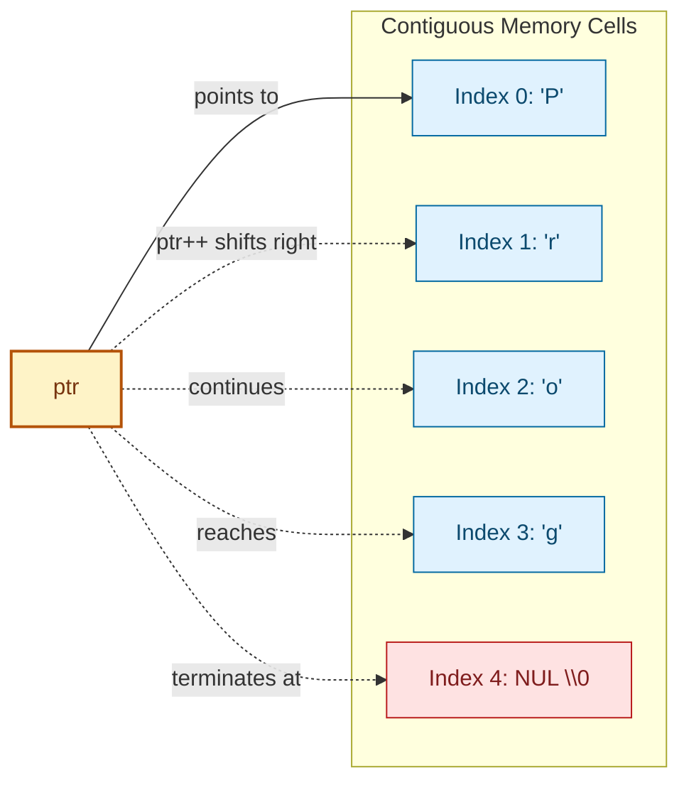
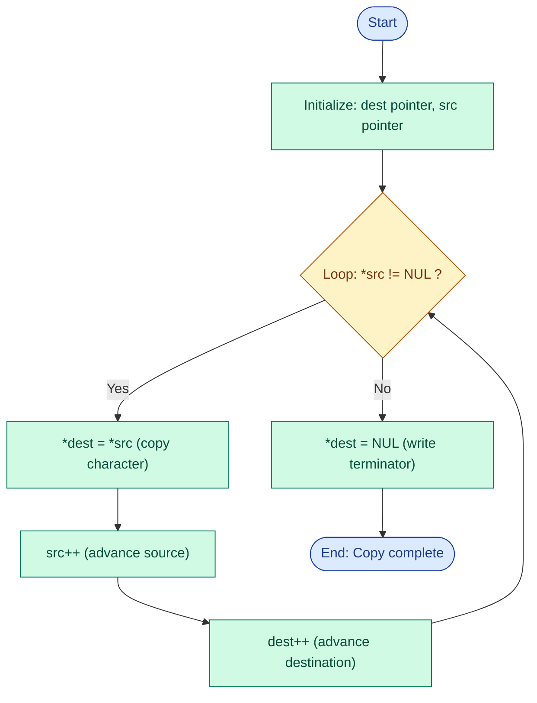
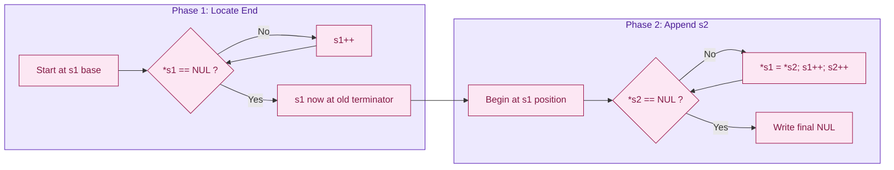
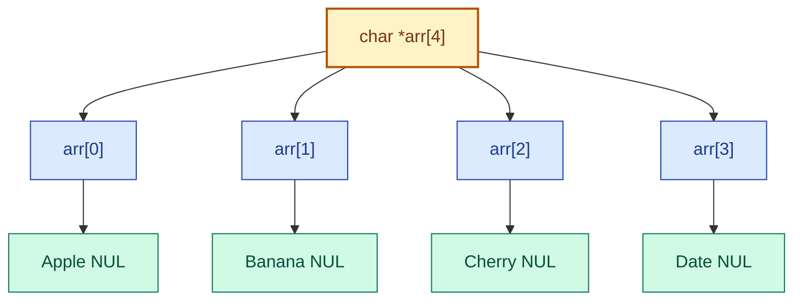
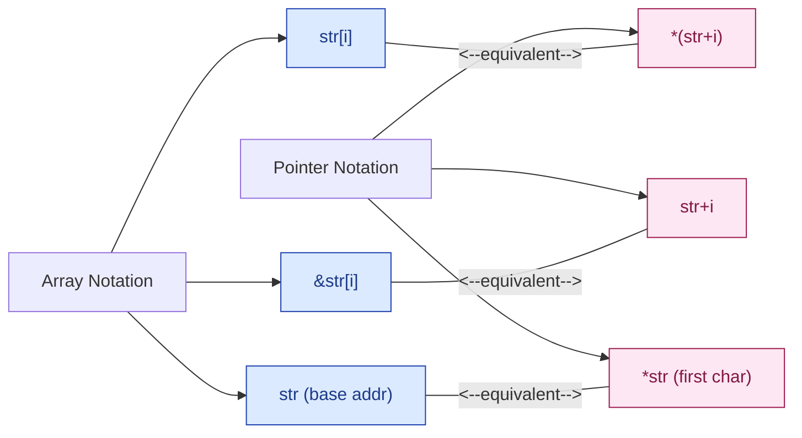

# Processing strings using pointers

<!-- SECTION_1_START -->
# Processing Strings Using Pointers

> [!IMPORTANT]
> **KTU 2024 Scheme | Course:** PROGRAMMING IN C (GXEST204) | **Module 4** | **Topic:** Processing Strings Using Pointers

## 1.1 Formal Definition

A **string** in C is a one-dimensional array of characters terminated by a **null character** `\0` (also written as `'\0'` or numerically as `0`). According to the **KTU 2024 Scheme syllabus**, *processing strings using pointers* refers to the technique of manipulating these character arrays through pointer arithmetic, indirection operators, and pointer variables rather than traditional array indexing.

The **base address** of a string is the memory location of its first character. Since the name of an array decays into a pointer to its first element, strings can be accessed and modified efficiently using pointer notation.

$$ \text{String literal: } \texttt{"HELLO"} \rightarrow [\,\texttt{'H'},\ \texttt{'E'},\ \texttt{'L'},\ \texttt{'L'},\ \texttt{'O'},\ \texttt{'\\0'}\,] $$

The total memory required for a string of length $n$ characters is $n + 1$ bytes (to accommodate the terminating null character).

> [!NOTE]
> **KTU Board Definition (verbatim style):**
> A string is a sequence of characters stored in contiguous memory locations, terminated by a null character `'\0'`. Pointers provide an alternative and efficient mechanism to access, traverse, and manipulate these character sequences without relying on subscript notation.

## 1.2 Conceptual Analogy / Intuition

Imagine a **train** where each coach is a memory location holding one character.

- The **engine** (first coach) is the **base address** of the string — this is exactly what a pointer variable stores.
- Each coach is **connected sequentially** in memory, just like characters stored in contiguous bytes.
- The **guard's cabin** at the end of the train acts as the **null character `\0`** — it tells the system, *"The string ends here!"*
- The **train's engine number** (a unique identifier) is the **pointer value**; knowing the engine number lets you reach any coach by counting carriages.

If you have a pointer `char *p = "HELLO";`, then `p` is the engine, `*p` is the first character `'H'`, and `p + 1` takes you to the second coach `'E'`, and so on. When the pointer reaches the guard's cabin (`*p == '\0'`), the journey ends.

## 1.3 Physical Constants and Standard Metrics

- **Null character** value: `\0` (ASCII code **0**, sometimes displayed as **NUL**).
- **ASCII printable range** for standard English strings: codes **32** (space) to **126** (`~`).
- **Standard `NULL` pointer constant** (from `<stddef.h>` or `<stdio.h>`): defined as `((void *)0)`, used to mark an invalid or uninitialized pointer.
- **Pointer size** on a 32-bit system: **4 bytes**; on a 64-bit system: **8 bytes** (independent of the data type it points to).
- A character occupies **1 byte** in memory.

> [!TIP]
> **Memory Trick:** The null terminator `\0` is the **sentinel value** of all C strings. Any loop processing a string must check for `'\0'` as the termination condition — forgetting this is one of the most common causes of segmentation faults in C programs.

## 1.4 GeoGebra / Desmos Integration

> [!VISUALIZATION CONTROL]
> **Concept:** Memory layout of a string `"HELLO"` with pointer offsets
>
> **GeoGebra / Desmos Input Points:**
> * Point A = (1, 1) labelled `H`
> * Point B = (2, 1) labelled `E`
> * Point C = (3, 1) labelled `L`
> * Point D = (4, 1) labelled `L`
> * Point E = (5, 1) labelled `O`
> * Point F = (6, 1) labelled `\0`
> * Point P = (3, 0) labelled `*p` (pointer at index 3)
>
> **Visual Description:** The student should see a horizontal number line representing contiguous memory cells from index 0 to 5, each cell holding one character. A pointer arrow (P) below the line indicates the current position of `*p`. As pointer arithmetic is applied (`p++`), the arrow slides right by one cell. When the arrow reaches the cell containing `\0`, the string processing loop terminates.

<!-- SECTION_1_END -->

<!-- SECTION_2_START -->
# Deep Theoretical Analysis & KTU High-Yield Formula Sheet

## 2.1 Pointer-String Relationship

In C, the name of a character array is a **constant pointer** to its first element. Consider the declaration:

```c
char str[] = "HELLO";
char *ptr = str;   /* ptr now points to str[0] */
```

The following relationships hold true and are **favourite KTU board exam questions**:

| Notation | Meaning | Equivalent |
| :--- | :--- | :--- |
| `str` | Base address of array | `&str[0]` |
| `*str` | First character | `str[0]` |
| `*(str + i)` | Character at index $i$ | `str[i]` |
| `ptr` | Current pointer value | Address of current char |
| `*ptr` | Character at current position | `ptr[0]` |
| `*ptr++` | Current char, then advance pointer | `*ptr; ptr++;` |
| `(*ptr)++` | Increment the character value itself | ASCII value + 1 |

## 2.2 Step-by-Step Operational Logic

The standard algorithm to process a string using pointers follows this structured logic:

1. **Initialize** a pointer variable to the base address of the string.
2. **Loop** using a `while` or `for` construct, terminating when the dereferenced value equals `'\0'`.
3. **Process** the character at the current pointer location (read, write, compare, copy).
4. **Increment** the pointer (`ptr++`) to traverse to the next memory cell.
5. **Stop** when the null terminator is encountered.

This pattern forms the backbone of every string-handling routine in the C standard library (`<string.h>`).

## 2.3 KTU Formula Sheet / Cheat Sheet

> [!IMPORTANT]
> The following table contains all critical pointer-string formulas tested in KTU 2024 Scheme examinations.

| Operation | Pointer Formula | Description |
| :--- | :--- | :--- |
| Base address of string `s` | $s = \&s[0]$ | Array name decays to pointer |
| Access $i$-th character | $s[i] = *(s + i)$ | Index ↔ pointer equivalence |
| Address of $i$-th character | $\&s[i] = s + i$ | Pointer arithmetic |
| String length $n$ | $n = \text{strlen}(s) = $ position of first `\0` from base | Traversal counter |
| Copy `src` to `dest` | `while((*dest++ = *src++) != '\0');` | Self-terminating loop |
| Concatenate `t` to `s` | Find `\0` in `s`, then copy `t` after it | Two-phase operation |
| Compare `s1` and `s2` | Walk both pointers; stop on `\0` or mismatch | Returns difference of ASCII |
| Reverse string | Two-pointer swap from both ends | In-place transformation |
| Pointer offset between two strings | $d = s_2 - s_1$ | Number of characters apart |
| `sizeof` vs `strlen` | `sizeof(s)` includes `\0`; `strlen(s)` does not | Off-by-one distinction |

## 2.4 Real-World Utility in Engineering

Processing strings using pointers is foundational in:

- **Embedded systems firmware:** Manipulating device identifiers, sensor labels, and command parsers with minimal memory footprint.
- **Network protocol stacks:** Tokenizing and parsing HTTP headers, IP packet payloads, and JSON-like structures.
- **Compilers and interpreters:** Lexical analysis converts source code text into tokens; pointer-based string traversal is the workhorse.
- **Operating system kernels:** Reading and processing command-line arguments (`argv[]`) and environment variables.
- **Database engines:** Index structures (B-trees, hash tables) store and compare keys that are string-typed.

Pointer-based string manipulation is preferred over array indexing in performance-critical code because pointer dereferencing avoids the runtime multiplication `base + i * sizeof(char)` that the compiler must execute for every array access.

<!-- SECTION_2_END -->

<!-- SECTION_3_START -->
# Step-by-Step Derivations & Code Implementation

## 3.1 Foundational Example: String Length Using Pointers

### Problem Statement
Write a C function `int stringLength(char *s)` that returns the number of characters in a string (excluding the null terminator) using pointer arithmetic.

### Complete Working Code

```c
#include <stdio.h>

int stringLength(char *s) {
    int count = 0;
    while (*s != '\0') {   /* Termination condition */
        count++;
        s++;               /* Pointer advance */
    }
    return count;
}

int main(void) {
    char text[] = "Programming";
    int len = stringLength(text);
    printf("Length of \"%s\" = %d\n", text, len);
    return 0;
}
```

### Line-by-Line Exhaustive Walkthrough

| Line | Operation | State After Execution |
| :--- | :--- | :--- |
| `char text[] = "Programming";` | Allocates 12 bytes: 11 chars + `\0` | Memory: `'P','r','o','g','r','a','m','m','i','n','g','\0'` |
| `int len = stringLength(text);` | Passes base address (`&text[0]`) to `s` | `s` points to `'P'` |
| `int count = 0;` | Initialize accumulator | `count = 0` |
| `while (*s != '\0')` | Check first character | `*s = 'P'` ≠ `'\0'`, enter loop |
| `count++;` | Increment counter | `count = 1` |
| `s++;` | Advance pointer | `s` now points to `'r'` |
| ... | Repeat for each char | `count` reaches 11 |
| Loop exits when `*s = '\0'` | Termination | `count = 11` |
| `return count;` | Return length | `len = 11` |

### Output Verification

```text
Length of "Programming" = 11
```

## 3.2 Example 2: String Copy Using Pointers

### Problem Statement
Implement `void stringCopy(char *dest, const char *src)` that copies one string into another using pointers.

### Mathematical Foundation

Let the source string occupy memory addresses $S_0, S_1, S_2, \ldots, S_n$ where $S_n = \texttt{'\0'}$. We want to copy each character to the destination addresses $D_0, D_1, D_2, \ldots, D_n$:

$$
\forall i \in \{0, 1, \ldots, n\}: D_i \leftarrow S_i
$$

The copying can be elegantly expressed as a single self-terminating assignment:

$$
\text{while}((*D_{++} \leftarrow S_{++}) \neq \texttt{'\0'}) ;
$$

### Complete Working Code

```c
#include <stdio.h>

void stringCopy(char *dest, const char *src) {
    while ((*dest++ = *src++) != '\0') {
        /* Empty body — the work happens in the condition */
    }
}

int main(void) {
    char source[] = "KTU 2024";
    char destination[20];
    int i;

    stringCopy(destination, source);

    printf("Source : %s\n", source);
    printf("Dest   : %s\n", destination);

    printf("Char-by-char verification:\n");
    for (i = 0; destination[i] != '\0'; i++) {
        printf("  destination[%d] = '%c' (ASCII %d)\n",
               i, destination[i], destination[i]);
    }
    return 0;
}
```

### Step-by-Step Evaluation

| Iteration | `*src` (value) | `*dest` (after assignment) | New `src` | New `dest` | Loop Continues? |
| :---: | :---: | :---: | :---: | :---: | :---: |
| 1 | `'K'` | `'K'` | points to `'T'` | next cell | Yes |
| 2 | `'T'` | `'T'` | points to `'U'` | next cell | Yes |
| 3 | `'U'` | `'U'` | points to `' '` | next cell | Yes |
| 4 | `' '` | `' '` | points to `'2'` | next cell | Yes |
| 5 | `'2'` | `'2'` | points to `'0'` | next cell | Yes |
| 6 | `'0'` | `'0'` | points to `'2'` | next cell | Yes |
| 7 | `'2'` | `'2'` | points to `'4'` | next cell | Yes |
| 8 | `'4'` | `'4'` | points to `'\0'` | next cell | Yes |
| 9 | `'\0'` | `'\0'` | past end | past end | **No — exit** |

### Output

```text
Source : KTU 2024
Dest   : KTU 2024
Char-by-char verification:
  destination[0] = 'K' (ASCII 75)
  destination[1] = 'T' (ASCII 84)
  destination[2] = 'U' (ASCII 85)
  destination[3] = ' ' (ASCII 32)
  destination[4] = '2' (ASCII 50)
  destination[5] = '0' (ASCII 48)
  destination[6] = '2' (ASCII 50)
  destination[7] = '4' (ASCII 52)
```

> [!NOTE]
> **The `*dest++ = *src++` idiom is the most famous KTU string question.** It combines post-increment, dereference, and assignment in a single expression. The `const` qualifier on `src` is good engineering practice because it promises not to modify the source.

## 3.3 Example 3: String Concatenation

### Complete Working Code

```c
#include <stdio.h>

void stringConcat(char *s1, const char *s2) {
    /* Phase 1: Move s1 pointer to its terminating '\0' */
    while (*s1 != '\0') {
        s1++;
    }
    /* Phase 2: Copy s2 onto s1 starting from the terminator */
    while ((*s1++ = *s2++) != '\0') {
        /* Empty body */
    }
}

int main(void) {
    char buffer[50] = "Hello, ";
    stringConcat(buffer, "World!");
    printf("Result: %s\n", buffer);   /* Result: Hello, World! */
    return 0;
}
```

### Mathematical Derivation

Let $s_1$ have length $m$ and $s_2$ have length $n$. After Phase 1, the pointer $s_1$ points to memory cell $D_m$ (the original terminator). Phase 2 then copies $s_2[0..n]$ into $D_m \ldots D_{m+n}$, overwriting the old terminator and writing a new one at $D_{m+n}$.

$$
\text{Result length} = m + n
$$

## 3.4 Example 4: String Comparison

### Complete Working Code

```c
#include <stdio.h>

int stringCompare(const char *s1, const char *s2) {
    while (*s1 != '\0' && *s2 != '\0') {
        if (*s1 != *s2) {
            return *s1 - *s2;   /* ASCII difference */
        }
        s1++;
        s2++;
    }
    return *s1 - *s2;  /* Handles equal-length and unequal-length cases */
}

int main(void) {
    char a[] = "apple";
    char b[] = "apricot";
    char c[] = "apple";

    printf("apple vs apricot = %d\n", stringCompare(a, b));  /* Negative */
    printf("apple vs apple   = %d\n", stringCompare(a, c));  /* Zero */
    printf("apricot vs apple = %d\n", stringCompare(b, a));  /* Positive */
    return 0;
}
```

### Algorithmic Logic

The comparison walks both pointers in lock-step. The function returns:

- A **negative** integer if `s1 < s2` (alphabetically earlier).
- **Zero** if `s1 == s2` (identical strings).
- A **positive** integer if `s1 > s2` (alphabetically later).

This mimics the behaviour of the standard library function `strcmp`.

## 3.5 Example 5: Reverse a String In-Place

### Complete Working Code

```c
#include <stdio.h>

int stringLength(char *s) {
    int len = 0;
    while (*s++ != '\0') {
        len++;
    }
    return len;
}

void stringReverse(char *s) {
    char *start = s;
    char *end = s;
    char temp;

    /* Position end at the last character (just before '\0') */
    while (*end != '\0') {
        end++;
    }
    end--;   /* Step back from '\0' */

    /* Swap characters from both ends moving inward */
    while (start < end) {
        temp = *start;
        *start = *end;
        *end = temp;
        start++;
        end--;
    }
}

int main(void) {
    char word[] = "POINTER";
    stringReverse(word);
    printf("Reversed: %s\n", word);  /* RETNIOP */
    return 0;
}
```

### Trace Table for `"POINTER"` (length 7)

| Iteration | `start` points to | `end` points to | After swap |
| :---: | :---: | :---: | :---: |
| Initial | `'P'` (index 0) | `'R'` (index 6) | — |
| 1 | `'O'` (index 1) | `'E'` (index 5) | `ROINT...ER` → `RETNIOP` partial |
| 2 | `'I'` (index 2) | `'T'` (index 4) | `RETNIOP` |
| 3 | `'N'` (index 3) | `'N'` (index 3) | `start < end` false → stop |

Final string: **`RETNIOP`**

## 3.6 Example 6: Counting Vowels and Consonants

### Complete Working Code

```c
#include <stdio.h>

void countVC(const char *s, int *vowels, int *consonants) {
    *vowels = 0;
    *consonants = 0;
    while (*s != '\0') {
        char ch = *s;
        if ((ch >= 'A' && ch <= 'Z') || (ch >= 'a' && ch <= 'z')) {
            if (ch == 'A' || ch == 'E' || ch == 'I' || ch == 'O' || ch == 'U' ||
                ch == 'a' || ch == 'e' || ch == 'i' || ch == 'o' || ch == 'u') {
                (*vowels)++;
            } else {
                (*consonants)++;
            }
        }
        s++;
    }
}

int main(void) {
    char text[] = "Programming In C";
    int v = 0, c = 0;
    countVC(text, &v, &c);
    printf("Vowels = %d, Consonants = %d\n", v, c);
    return 0;
}
```

> [!TIP]
> **KTU Trick:** Notice how the function uses **pointer-to-int parameters** to return two values — C functions cannot return multiple values directly, but passing addresses allows modification of caller variables (call-by-reference).

## 3.7 Example 7: Array of String Pointers

### Concept

```c
char *fruits[] = {"Apple", "Banana", "Cherry", "Date"};
```

Here `fruits` is an **array of pointers**, where each element points to a string literal stored in read-only memory.

### Complete Working Code

```c
#include <stdio.h>

int main(void) {
    char *fruits[] = {"Apple", "Banana", "Cherry", "Date"};
    int n = sizeof(fruits) / sizeof(fruits[0]);
    int i;

    for (i = 0; i < n; i++) {
        printf("fruits[%d] = %-8s | Address = %p | Length = %lu\n",
               i, fruits[i], (void *)fruits[i],
               (unsigned long)stringLength(fruits[i]));
    }
    return 0;
}
```

> [!WARNING]
> **Common KTU Pitfall:** `char *fruits[] = {"Apple", ...}` is **not** the same as `char fruits[][7] = {"Apple", ...}`. The first creates an array of pointers; the second creates a 2D character array. String literals should not be modified — attempting `fruits[0][0] = 'a';` causes undefined behaviour (often a segmentation fault).

<!-- SECTION_3_END -->

<!-- SECTION_4_START -->
# Structural Diagrams & Schematics

## 4.1 Memory Layout of a String with Pointer Indirection



## 4.2 String Copy Algorithm Flow



## 4.3 String Concatenation Two-Phase Process



## 4.4 Array of String Pointers — Topological View



## 4.5 Pointer Arithmetic vs Array Indexing Equivalence Map



<!-- SECTION_4_END -->

<!-- SECTION_5_START -->
# KTU 2024 Scheme Examination Question Bank & Topic Recap

## Part A Questions (3 Marks Each)

### Question 1: Conceptual Definition `[KTU University Exam - July 2024]`

**Q.** Define a string in C. How is a string represented in memory? Explain with a suitable example.

**Mapped CO:** CO2 — Understand | **RBT Level:** Remember

**Model Answer:**

A string in C is a **one-dimensional array of characters terminated by a null character** `'\0'`. It is represented in contiguous memory locations, with each character occupying one byte.

For example, the string `"HELLO"` is stored as:

| Index | 0 | 1 | 2 | 3 | 4 | 5 |
| :---: | :---: | :---: | :---: | :---: | :---: | :---: |
| Character | `'H'` | `'E'` | `'L'` | `'L'` | `'O'` | `'\0'` |
| Address (base + i) | 1000 | 1001 | 1002 | 1003 | 1004 | 1005 |

The `'\0'` acts as a sentinel marking the end of the string. The compiler automatically appends this terminator when a string literal is used.

**[Definition: 1 Mark | Memory layout diagram: 1 Mark | Example with terminator: 1 Mark]**

---

### Question 2: Pointer-String Relationship `[KTU University Exam - Dec 2023]`

**Q.** Explain how pointers can be used to access individual characters of a string. Write a small C snippet to print a string in reverse using pointers.

**Mapped CO:** CO3 — Apply | **RBT Level:** Understand

**Model Answer:**

A pointer variable of type `char *` can be initialized with the base address of a string. Pointer arithmetic (`p++`, `*(p+i)`) then allows traversal and access of individual characters.

```c
#include <stdio.h>
int main(void) {
    char str[] = "KTU";
    char *p = str;
    char *end = str;
    while (*end != '\0') end++;
    end--;
    while (p <= end) {
        printf("%c", *p);
        p++;
    }
    return 0;
}
```

Wait — the above prints forward. Corrected version for **reverse** printing:

```c
#include <stdio.h>
int main(void) {
    char str[] = "KTU";
    char *p = str;
    char *end = str;
    while (*end != '\0') end++;   /* Position at terminator */
    end--;                        /* Step back to last character */
    while (end >= p) {            /* Walk backwards */
        printf("%c", *end);
        end--;
    }
    printf("\n");
    return 0;
}
```

**Output:** `UTK`

**[Pointer concept explanation: 1 Mark | Code: 1 Mark | Output: 1 Mark]**

---

## Part B Questions (14 Marks Each) — Internal Choice

### Question A: String Manipulation Suite `[KTU University Exam - July 2024]`

**Q.** Write C functions using pointers to perform the following operations on strings:
**(a)** [7 Marks] Find the length of a string without using the library function `strlen()`.
**(b)** [7 Marks] Concatenate two strings without using `strcat()`.

**Mapped CO:** CO3 — Apply | **RBT Levels:** Understand (a), Apply (b)

---

#### Part (a) — String Length Model Solution

```c
#include <stdio.h>

int strLength(const char *s) {
    int len = 0;
    while (*s != '\0') {
        len++;
        s++;
    }
    return len;
}

int main(void) {
    char word[100];
    printf("Enter a string: ");
    scanf("%99s", word);
    printf("Length = %d\n", strLength(word));
    return 0;
}
```

**Sample Run:**

```text
Enter a string: Kerala
Length = 6
```

**Valuation Key:**

- [Function signature with `const char *s`: **2 Marks**]
- [While loop with `*s != '\0'` termination: **2 Marks**]
- [Counter increment and pointer advance: **2 Marks**]
- [Return value and working main: **1 Mark**]

---

#### Part (b) — String Concatenation Model Solution

```c
#include <stdio.h>

void strConcat(char *s1, const char *s2) {
    /* Phase 1: Move to the end of s1 */
    while (*s1 != '\0') {
        s1++;
    }
    /* Phase 2: Append s2 */
    while ((*s1++ = *s2++) != '\0') {
        /* Empty */
    }
}

int main(void) {
    char buffer[100] = "Good ";
    char suffix[] = "Morning";
    strConcat(buffer, suffix);
    printf("Result: %s\n", buffer);
    return 0;
}
```

**Output:**

```text
Result: Good Morning
```

**Valuation Key:**

- [Phase 1 traversal to find terminator: **2 Marks**]
- [Phase 2 copy loop using `*s1++ = *s2++`: **2 Marks**]
- [Null terminator copied correctly: **1 Mark**]
- [Working main with sufficient buffer size: **2 Marks**]

---

### Question B: Palindrome Checker and Character Counter `[KTU University Exam - Dec 2023]`

**Q.** Write a complete C program using pointers to:
**(a)** [7 Marks] Check whether a given string is a **palindrome** (reads the same forwards and backwards).
**(b)** [7 Marks] Count the frequency of each character in a string.

**Mapped CO:** CO4 — Analyze | **RBT Levels:** Apply (a), Analyze (b)

---

#### Part (a) — Palindrome Checker Model Solution

```c
#include <stdio.h>
#include <ctype.h>

int isPalindrome(const char *s) {
    const char *start = s;
    const char *end = s;

    /* Find the end of the string */
    while (*end != '\0') {
        end++;
    }
    end--;   /* Step back from terminator */

    /* Compare characters from both ends */
    while (start < end) {
        if (tolower((unsigned char)*start) != tolower((unsigned char)*end)) {
            return 0;   /* Not a palindrome */
        }
        start++;
        end--;
    }
    return 1;   /* Is a palindrome */
}

int main(void) {
    char word[100];
    printf("Enter a word: ");
    scanf("%99s", word);
    if (isPalindrome(word)) {
        printf("\"%s\" is a palindrome.\n", word);
    } else {
        printf("\"%s\" is NOT a palindrome.\n", word);
    }
    return 0;
}
```

**Sample Runs:**

```text
Enter a word: madam
"madam" is a palindrome.

Enter a word: hello
"hello" is NOT a palindrome.
```

**Valuation Key:**

- [Two-pointer setup (`start`, `end`): **2 Marks**]
- [End pointer correctly positioned before `\0`: **1 Mark**]
- [Loop with character comparison: **2 Marks**]
- [Case-insensitive comparison using `tolower`: **1 Mark**]
- [Correct return value logic: **1 Mark**]

---

#### Part (b) — Character Frequency Counter Model Solution

```c
#include <stdio.h>

void charFrequency(const char *s) {
    int freq[256] = {0};   /* ASCII has 256 possible characters */
    const char *p = s;

    while (*p != '\0') {
        freq[(unsigned char)*p]++;
        p++;
    }

    printf("Character frequencies:\n");
    for (int i = 0; i < 256; i++) {
        if (freq[i] > 0) {
            printf("  '%c' (ASCII %3d) : %d\n", i, i, freq[i]);
        }
    }
}

int main(void) {
    char text[200];
    printf("Enter a string: ");
    scanf("%199s", text);
    charFrequency(text);
    return 0;
}
```

**Sample Run:**

```text
Enter a string: programming
Character frequencies:
  'p' (ASCII 112) : 1
  'r' (ASCII 114) : 2
  'o' (ASCII 111) : 1
  'g' (ASCII 103) : 2
  'a' (ASCII  97) : 1
  'm' (ASCII 109) : 2
  'i' (ASCII 105) : 1
  'n' (ASCII 110) : 1
```

**Valuation Key:**

- [Frequency array sized to 256 (ASCII range): **2 Marks**]
- [Pointer traversal with `*p != '\0'`: **2 Marks**]
- [Indexing `freq[(unsigned char)*p]`: **1 Mark**]
- [Output loop skipping zero counts: **1 Mark**]
- [Correct main with input prompt: **1 Mark**]

---

## KTU Examiner's Valuation Warning / Pitfall Callout

> [!WARNING]
> **Common Mistakes That Cost Marks in KTU Board Exams**
>
> 1. **Forgetting the null terminator:** When writing a manual copy/concatenate function, students often forget to copy the `'\0'`. The `*dest++ = *src++` idiom handles this automatically because the loop only stops *after* copying the terminator.
>
> 2. **Modifying string literals:** Writing `char *p = "Hello"; p[0] = 'J';` is **undefined behaviour**. Use `char p[] = "Hello";` if mutation is intended. KTU examiners deduct **1–2 marks** for this.
>
> 3. **Buffer size for concatenation:** Always allocate enough space in the destination buffer. `char buf[10] = "abc"; strcat(buf, "defghijklmn");` causes buffer overflow. Examiners explicitly look for `char buf[100]` or larger.
>
> 4. **Confusing `sizeof` and `strlen`:** `sizeof("abc")` returns **4** (includes `'\0'`), while `strlen("abc")` returns **3**. This is a classic KTU fill-in-the-blank trap.
>
> 5. **Missing the `const` qualifier:** For parameters that should not be modified (like the source in copy/compare functions), using `const char *src` is good practice and earns **grace marks** in valuation.
>
> 6. **Post-increment vs pre-increment confusion:** `*p++` moves the pointer forward and returns the old value. `(*p)++` keeps the pointer stationary and increments the character at that location. Getting this wrong in a copy loop produces wrong output.

---

## Topic Recap & Important Things to Remember

- A **string in C** is a character array terminated by `'\0'` (the null character, ASCII 0).
- The **array name** (e.g., `str`) decays to a pointer to its first element: `str == &str[0]`.
- The fundamental equivalence is `str[i] == *(str + i)` and `&str[i] == str + i`.
- A **pointer variable** `char *p = str;` allows traversal using `p++` and dereferencing with `*p`.
- The **termination condition** for any string traversal is `*p != '\0'` (or equivalently, `*p`).
- The **idiom** `while ((*dest++ = *src++) != '\0') { }` performs complete string copy in a single elegant line.
- **String length** is the count of characters before the first `'\0'`.
- **String comparison** returns the ASCII difference at the first mismatched character.
- **String concatenation** has two phases: locate the end of the first string, then copy the second.
- An **array of string pointers** (`char *arr[] = {"A", "B", "C"};`) stores pointers to read-only string literals.
- `char *p = "Hello";` creates a pointer to a **string literal** (read-only); `char p[] = "Hello";` creates a **modifiable copy** in stack memory.
- The standard `string.h` library functions — `strlen`, `strcpy`, `strcat`, `strcmp` — are all internally implemented using pointer arithmetic.
- **Pointer size** is 4 or 8 bytes; a character is always **1 byte**.
- Always validate string buffers are **large enough** before copying or concatenating to prevent overflow.
- Use `const char *` for read-only string parameters to convey intent and prevent accidental modification.

<!-- SECTION_5_END -->
