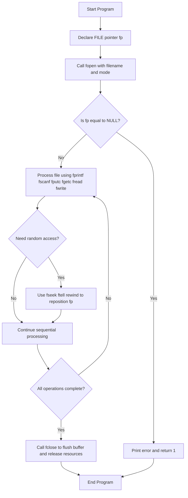
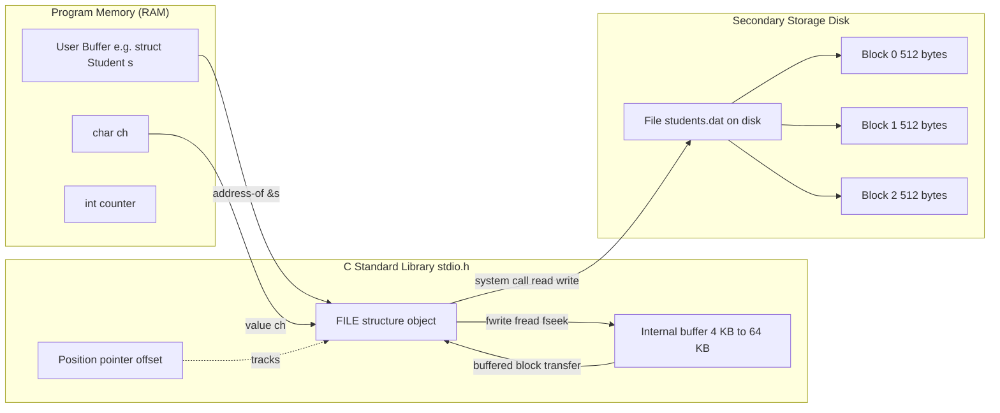
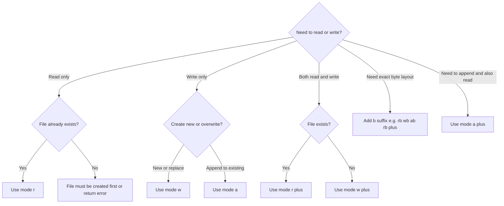
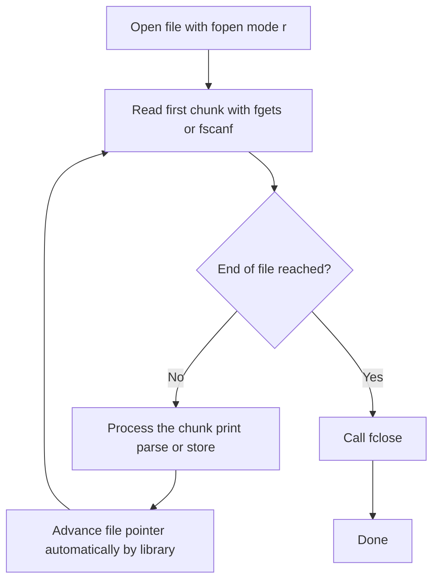

# Writing to and Reading from a file

<!-- SECTION_1_START -->
# Writing to and Reading from a File in C

## 1. Core Technical Definition

In the C programming language, a **file** is a named location on a secondary storage device (typically a hard disk, SSD, or USB drive) that is used to store data permanently. Unlike variables in RAM whose contents are lost when the program terminates, data written into a file persists across program executions, making files the fundamental mechanism for **persistent storage** in C.

To work with a file, the C standard library `<stdio.h>` defines a special opaque structure called `FILE` (declared as `typedef struct _IO_FILE FILE;`). A program never manipulates the `FILE` structure's internal members directly; instead, it interacts with the file through a **FILE pointer** of type `FILE *`. This pointer acts as a logical handle (an abstract token) that the C runtime uses to track the open file, the current file position, the read/write mode, the buffer state, and any error or end-of-file indicators.

The two principal operations are:
- **Writing to a file (Output)** — Transferring data from the program's memory (RAM) into the file on disk.
- **Reading from a file (Input)** — Transferring data from the file on disk into the program's memory (RAM).

```c
FILE *fp;            /* A pointer that will point to a FILE object */
fp = fopen("data.txt", "w");   /* Opens the file for writing */
```

> [!IMPORTANT]
> **KTU 2024 Syllabus Highlight (Module 4 – Pointers & File I/O):**
> A `FILE *` is itself a **pointer**, which is why this topic appears in the *Pointers* module. Students must clearly distinguish between:
> - A `FILE *` pointer (points to a `FILE` structure in memory) — used to manage the file stream.
> - Ordinary data pointers such as `int *`, `float *`, `char *` (used to point to the data buffer that is being read or written).

## 2. Conceptual Analogy / Intuition

Imagine a **large office filing cabinet** in a government records department:

- The **cabinet drawer** is the *file on disk* (e.g., `students.txt`).
- A **paper register (log book)** maintained by the office clerk is the `FILE` structure. It contains columns such as "Drawer Name", "Is Drawer Open?", "Current Page Number", "Buffer Status", and "Error Flags".
- The **token (a numbered chit) handed to you by the clerk** is the `FILE *` pointer. You cannot open the drawer directly; you must hand the chit to the clerk, and the clerk opens the drawer for you.
- Every time you want to write a record or read a record, you give the token to the clerk (`fprintf`, `fscanf`, `fputc`, `fgetc`, etc.) along with the data or destination buffer.
- When you are done, you **return the token** (`fclose(fp)`). If you lose the token (close the program without calling `fclose`), the clerk may not flush the ink and your data may be lost or corrupted.

This is exactly how C's file I/O operates: the `FILE *` is the token, and the standard library functions are the actions the clerk performs on your behalf.

| Standard Library Constant | Symbolic Value | Meaning |
| :--- | :--- | :--- |
| `NULL` | `0` (typically) | A null pointer; returned by `fopen` on failure. |
| `EOF` | `-1` (typically) | End-Of-File marker returned by `fgetc`, `getc`, `fgetchar`. |
| `SEEK_SET` | `0` | Beginning of file (for `fseek`). |
| `SEEK_CUR` | `1` | Current position of file pointer. |
| `SEEK_END` | `2` | End of file (for `fseek`). |

> [!NOTE]
> **Always check the return value of `fopen()`** — if the file cannot be opened (e.g., wrong path, permission denied, disk error), `fopen` returns `NULL`. Failing to check this is one of the most common sources of segmentation faults in C file-handling programs.

> [!VISUALIZATION CONTROL]
> **Concept:** Conceptual layout of the relationship between the program, the FILE pointer, the buffer, and the physical file on disk.
> **ASCII Schematic (Mental Picture):**
> ```
> +----------------+        +----------------+        +----------------+
> | USER PROGRAM   |  <---> | FILE *  (fp)   |  <---> | students.txt   |
> | (RAM)          |        | FILE struct    |        | (Hard Disk)    |
> | data buffer    |        | - mode         |        | line 1         |
> | ch[] = "..."   |        | - position     |        | line 2         |
> +----------------+        | - buffer ptr   |        | line 3         |
>                           | - error flags  |        | ...            |
>                           +----------------+        +----------------+
> ```
> **Visual Description:** Observe that the `FILE *` pointer sits between your program and the disk file. Your program does not touch the disk directly; all read/write requests go through the `FILE *` handle, and the standard library handles the actual disk I/O and buffering behind the scenes.

<!-- SECTION_1_END -->

<!-- SECTION_2_START -->
# Deep Theoretical Analysis & KTU High-Yield Formula Sheet

## 1. The Five-Step File I/O Lifecycle

Every C file program — whether it writes, reads, or both — follows the same logical sequence:

1. **Declare a `FILE *` pointer** — This pointer will hold the handle returned by `fopen`.
2. **Open the file using `fopen(filename, mode)`** — The file is located on disk, opened in the requested mode, and the `FILE *` pointer is returned. Always test for `NULL`.
3. **Process the file** — Read from it or write to it using one of the standard I/O functions (`fprintf`, `fscanf`, `fputc`, `fgetc`, `fputs`, `fgets`, `fread`, `fwrite`).
4. **Optionally reposition the file pointer** using `fseek`, `ftell`, or `rewind` if random access is required.
5. **Close the file using `fclose(fp)`** — Flushes the buffer to disk, releases system resources, and de-allocates the buffer associated with the stream. Returns `0` on success and `EOF` on error.

## 2. File Opening Modes — Complete Reference

The second argument to `fopen` is a **mode string**. The choice of mode determines whether the file is created, truncated, appended to, opened for reading, opened for writing, used in text mode, or used in binary mode.

| Mode String | File Exists? | Behaviour on Open | Reading? | Writing? | Pointer Initial Position |
| :--- | :--- | :--- | :--- | :--- | :--- |
| `"r"` | Must exist | Open for reading (text). | Yes | No | Beginning of file. |
| `"w"` | Either | Truncate to zero length or create new (text). | No | Yes | Beginning of file. |
| `"a"` | Either | Open for appending (text). Creates if missing. | No | Yes (only at end) | End of file. |
| `"r+"` | Must exist | Open for both reading and writing (text). | Yes | Yes | Beginning of file. |
| `"w+"` | Either | Truncate or create for read/write (text). | Yes | Yes | Beginning of file. |
| `"a+"` | Either | Open for read/append (text). Creates if missing. | Yes | Yes (only at end) | End of file. |
| `"rb"`, `"wb"`, `"ab"`, `"rb+"`, `"wb+"`, `"ab+"` | Same as above but in **binary mode** (no translation of `\n` ↔ OS-specific line endings). |

> [!WARNING]
> **`"w"` destroys existing data** silently. If you open an existing file in `"w"` mode, all its content is erased the moment `fopen` succeeds. Use `"a"` if you want to preserve existing content, or `"r+"` if you want both read and write without truncation.

## 3. The High-Yield Function Reference Sheet

| Function | Header | Purpose | Typical Signature |
| :--- | :--- | :--- | :--- |
| `fopen` | `<stdio.h>` | Open a file and return a `FILE *`. | `FILE *fopen(const char *filename, const char *mode);` |
| `fclose` | `<stdio.h>` | Close an open file stream. | `int fclose(FILE *stream);` |
| `fputc` | `<stdio.h>` | Write a single character to a file. | `int fputc(int ch, FILE *stream);` |
| `fgetc` | `<stdio.h>` | Read a single character from a file. | `int fgetc(FILE *stream);` |
| `fputs` | `<stdio.h>` | Write a string (no `\n` auto-added). | `int fputs(const char *str, FILE *stream);` |
| `fgets` | `<stdio.h>` | Read up to $n-1$ characters or until `\n` / EOF. | `char *fgets(char *str, int n, FILE *stream);` |
| `fprintf` | `<stdio.h>` | Formatted write to a file (like `printf`). | `int fprintf(FILE *stream, const char *fmt, ...);` |
| `fscanf` | `<stdio.h>` | Formatted read from a file (like `scanf`). | `int fscanf(FILE *stream, const char *fmt, ...);` |
| `fwrite` | `<stdio.h>` | Write a block of binary bytes. | `size_t fwrite(const void *ptr, size_t size, size_t count, FILE *stream);` |
| `fread` | `<stdio.h>` | Read a block of binary bytes. | `size_t fread(void *ptr, size_t size, size_t count, FILE *stream);` |
| `fseek` | `<stdio.h>` | Move file pointer to a new position. | `int fseek(FILE *stream, long offset, int origin);` |
| `ftell` | `<stdio.h>` | Return the current file pointer position. | `long ftell(FILE *stream);` |
| `rewind` | `<stdio.h>` | Move file pointer to beginning of file. | `void rewind(FILE *stream);` |
| `feof` | `<stdio.h>` | Test the end-of-file indicator. | `int feof(FILE *stream);` |
| `ferror` | `<stdio.h>` | Test the error indicator. | `int ferror(FILE *stream);` |

## 4. Why Pointer Knowledge Is Essential Here

Every function above takes a `FILE *` as one of its primary arguments. Internally, the `FILE` structure is full of pointers (a buffer pointer, a position pointer, pointers to vtable-like function tables). When we call `fread(&record, sizeof(record), 1, fp)`, the first argument `&record` is the **address** of a memory region in our program — the destination buffer. Thus file I/O in C is essentially **pointer-mediated data transfer** between program memory and persistent storage. This is precisely why this topic is included in *Module 4 – Pointers* under the KTU 2024 scheme.

## 5. Real-World Engineering Utility

File I/O is the backbone of virtually every production system:
- **Operating Systems** write process logs, configuration files, and registries.
- **Databases** (MySQL, PostgreSQL, SQLite) ultimately map all persistent tables to files on disk.
- **Embedded Systems** (firmware in washing machines, automotive ECUs) store calibration data in non-volatile flash files.
- **Compilers** read source `.c` files and write object `.o` files and executable files.
- **Scientific Computing** saves simulation results, sensor logs, and numerical datasets to files for offline analysis.
- **Web servers** write access logs, error logs, and HTML cache files.

Mastering file I/O in C is therefore not merely an academic exercise — it is a foundational skill for systems programming.

<!-- SECTION_2_END -->

<!-- SECTION_3_START -->
# Step-by-Step Derivations & Code Implementation

The following section demonstrates the **complete, runnable, line-by-line** C code for every common file I/O scenario asked in KTU examinations. Each program is exhaustively commented, and every logical step is explained.

---

## Program 1 — Writing a Character Stream to a File Using `fputc`

```c
/* Program: write_char_stream.c
   KTU Concept: Opening a file in "w" mode and writing individual
   characters one by one using fputc. Demonstrates FILE * pointer. */

#include <stdio.h>

int main(void)
{
    /* Step 1: Declare the FILE pointer. It will hold the file handle. */
    FILE *fp;

    /* Step 2: Declare a single-character buffer. */
    int ch;

    /* Step 3: Open the file in WRITE TEXT mode.
       If the file "output.txt" already exists, its contents will be erased. */
    fp = fopen("output.txt", "w");

    /* Step 4: Check whether fopen succeeded. */
    if (fp == NULL) {
        printf("ERROR: Cannot open output.txt for writing.\n");
        return 1;   /* Return non-zero to signal failure to the OS. */
    }

    /* Step 5: Read characters from the keyboard one by one until '#'
       is entered, then write each character to the file. */
    printf("Enter text (terminate with '#' on a new line):\n");

    /* Use getchar() to fetch a character from standard input (keyboard). */
    while ((ch = getchar()) != '#') {
        /* fputc writes the character pointed-to (held) by 'ch' to the file. */
        fputc(ch, fp);
    }

    /* Step 6: Close the file to flush the buffer to disk. */
    fclose(fp);
    printf("Data successfully written to output.txt\n");

    return 0;   /* Successful termination. */
}
```

**Explanation of the critical pointer-related line:**
The expression `ch = getchar()` returns an `int`, which is then passed to `fputc(ch, fp)`. Internally, the standard library uses the `FILE *` pointer `fp` to look up the file's current write position (a hidden offset pointer), write the byte at that offset, and then advance the position pointer by one. Without the `FILE *`, the library would have no way to know *where* to write.

---

## Program 2 — Reading a Character Stream from a File Using `fgetc` and `feof`

```c
/* Program: read_char_stream.c
   KTU Concept: Opening a file in "r" mode and reading character by
   character until EOF. Demonstrates feof() and fgetc(). */

#include <stdio.h>

int main(void)
{
    FILE *fp;
    int ch;

    /* Step 1: Open the file in READ TEXT mode.
       If the file does not exist, fopen returns NULL. */
    fp = fopen("output.txt", "r");

    if (fp == NULL) {
        printf("ERROR: Cannot open output.txt for reading.\n");
        return 1;
    }

    /* Step 2: Read until end-of-file is reached. */
    printf("Contents of output.txt:\n");

    while (1) {
        ch = fgetc(fp);

        /* fgetc returns EOF on end-of-file OR on read error.
           We must check feof() to disambiguate. */
        if (ch == EOF) {
            break;
        }

        /* Step 3: Print the character to the screen. */
        putchar(ch);
    }

    /* Step 4: Close the file. */
    fclose(fp);
    printf("\n--- End of file ---\n");

    return 0;
}
```

> [!IMPORTANT]
> **The classic `feof()` pitfall:** `feof()` returns a non-zero value **only after** an attempt to read past the end of the file. You cannot use it to control the loop directly with `while (!feof(fp))` because that would cause the last read to be processed **twice** (the read succeeds, body executes, the next read returns `EOF`, the loop condition is checked *after* the failed read). The correct pattern is to **read first, then check for `EOF`**, exactly as shown above.

---

## Program 3 — Writing Structured Formatted Records with `fprintf`

```c
/* Program: write_student_records.c
   KTU Concept: Storing tabular data of multiple students into a
   text file using fprintf for later retrieval. */

#include <stdio.h>

struct Student {
    int   roll;
    char  name[50];
    float marks;
};

int main(void)
{
    FILE *fp;
    struct Student s;
    int n, i;

    fp = fopen("students.txt", "w");
    if (fp == NULL) {
        printf("ERROR: Cannot open students.txt\n");
        return 1;
    }

    printf("How many students do you want to enter? ");
    scanf("%d", &n);

    /* Flush the leftover newline from scanf's input buffer. */
    getchar();

    for (i = 0; i < n; i++) {
        printf("\n--- Student %d ---\n", i + 1);
        printf("Roll number : ");
        scanf("%d", &s.roll);
        getchar();    /* Consume the newline left by scanf. */

        printf("Name        : ");
        fgets(s.name, sizeof(s.name), stdin);
        /* fgets keeps the trailing '\n' in s.name. Remove it. */
        {
            int len = 0;
            while (s.name[len] != '\0') {
                if (s.name[len] == '\n') {
                    s.name[len] = '\0';
                    break;
                }
                len++;
            }
        }

        printf("Marks       : ");
        scanf("%f", &s.marks);
        getchar();

        /* Write the structured data to the file in a fixed format.
           '\n' acts as a record separator. */
        fprintf(fp, "%d %s %.2f\n", s.roll, s.name, s.marks);
    }

    fclose(fp);
    printf("\nAll %d records have been saved to students.txt\n", n);

    return 0;
}
```

**Key pointer insight:** The expression `&s.roll` (implicitly created by `fprintf` via varargs when reading from `s.roll`) is essentially the address of the `roll` field of the `Student` struct `s`. The standard library dereferences these addresses to extract the actual integer, string, and float values. Similarly, `s.name` *decays* into a `char *` pointer pointing to the first character of the name array when passed to `fprintf`.

---

## Program 4 — Reading Structured Formatted Records with `fscanf`

```c
/* Program: read_student_records.c
   KTU Concept: Reading tabular data from a text file using fscanf
   and verifying successful reads via the return value. */

#include <stdio.h>

struct Student {
    int   roll;
    char  name[50];
    float marks;
};

int main(void)
{
    FILE *fp;
    struct Student s;

    fp = fopen("students.txt", "r");
    if (fp == NULL) {
        printf("ERROR: Cannot open students.txt\n");
        return 1;
    }

    printf("Roll   Name                 Marks\n");
    printf("-------------------------------------------\n");

    /* fscanf returns the number of items successfully matched.
       A return value of 3 (roll, name, marks) means a full record was read. */
    while (fscanf(fp, "%d %s %f", &s.roll, s.name, &s.marks) == 3) {
        printf("%-6d %-20s %6.2f\n", s.roll, s.name, s.marks);
    }

    fclose(fp);
    printf("\n--- End of records ---\n");
    return 0;
}
```

> [!WARNING]
> **KTU Valuation Pitfall:** Notice that `&s.roll` and `&s.marks` use the **address-of operator `&`**, but `s.name` does **not**. This is because `s.name` is itself an array, and arrays decay to pointers in most expressions. Writing `&s.name` would yield a `char (*)[50]` (pointer to the entire 50-character array) and would cause undefined behaviour with `%s`. This subtle distinction is a frequent 1-mark deduction point.

---

## Program 5 — Binary File I/O: `fwrite` and `fread` with Structures

Binary file I/O is essential when you need to store complex data (structures, multi-dimensional arrays) **exactly as they are in memory**, without any textual conversion. This is faster and preserves precision.

```c
/* Program: binary_student_records.c
   KTU Concept: Persisting an entire array of structures to a
   binary file using fwrite and reloading it using fread. */

#include <stdio.h>

struct Student {
    int   roll;
    char  name[50];
    float marks;
};

int main(void)
{
    FILE *fp;
    struct Student s[100];
    int n, i;

    /* ---------- WRITING PHASE ---------- */
    printf("Enter number of students (max 100): ");
    scanf("%d", &n);
    getchar();

    for (i = 0; i < n; i++) {
        printf("Roll: ");  scanf("%d", &s[i].roll);  getchar();
        printf("Name: ");  fgets(s[i].name, sizeof(s[i].name), stdin);
        printf("Marks: "); scanf("%f", &s[i].marks); getchar();
    }

    fp = fopen("students.dat", "wb");   /* 'b' for binary mode */
    if (fp == NULL) {
        printf("ERROR opening file for binary write.\n");
        return 1;
    }

    /* fwrite arguments:
       &s          -> pointer to the data buffer in memory
       sizeof(...) -> size of one element
       n           -> number of elements to write
       fp          -> file pointer
    */
    fwrite(s, sizeof(struct Student), n, fp);
    fclose(fp);
    printf("Binary write complete.\n");

    /* ---------- READING PHASE ---------- */
    /* Re-open in binary read mode and clear the in-memory array first. */
    for (i = 0; i < 100; i++) {
        s[i].roll  = 0;
        s[i].name[0] = '\0';
        s[i].marks = 0.0f;
    }

    fp = fopen("students.dat", "rb");
    if (fp == NULL) {
        printf("ERROR opening file for binary read.\n");
        return 1;
    }

    /* fread returns the number of full elements successfully read. */
    int count = (int)fread(s, sizeof(struct Student), n, fp);
    fclose(fp);

    printf("\nReloaded %d records from binary file:\n", count);
    printf("Roll   Name                 Marks\n");
    printf("-------------------------------------------\n");
    for (i = 0; i < count; i++) {
        printf("%-6d %-20s %6.2f\n", s[i].roll, s[i].name, s[i].marks);
    }

    return 0;
}
```

**Argument-by-argument dissection of `fwrite` and `fread`:**

$$
\text{fwrite}(s,\; \text{sizeof(struct Student)},\; n,\; fp)
$$

| Argument | Meaning | Pointer Role |
| :--- | :--- | :--- |
| `s` | Base address of the array of `Student` structures in RAM. | Pointer to the source buffer. |
| `sizeof(struct Student)` | Size in bytes of one structure (e.g., **4 + 50 + 4 = 58 bytes** on a typical system with padding possibly larger). | Count of bytes per element. |
| `n` | Number of structures to write. | Number of repetitions. |
| `fp` | The `FILE *` handle. | Pointer to the file stream. |

`fread` has the **mirror-image** semantics, except its first argument is a `void *` destination buffer where the bytes will be deposited.

---

## Program 6 — Random Access with `fseek`, `ftell`, and `rewind`

Random access means you can jump to **any** byte position in the file, not just read it sequentially. This is indispensable for database-style applications.

```c
/* Program: random_access_demo.c
   KTU Concept: Using fseek and ftell to navigate within a
   binary file containing an array of records. */

#include <stdio.h>

struct Student {
    int   roll;
    char  name[50];
    float marks;
};

int main(void)
{
    FILE *fp;
    struct Student s;

    fp = fopen("students.dat", "rb");
    if (fp == NULL) {
        printf("ERROR opening students.dat\n");
        return 1;
    }

    /* Move the file pointer to the 3rd record (index 2).
       Formula:  offset = record_index * sizeof(struct Student) */
    long offset = 2L * (long)sizeof(struct Student);

    if (fseek(fp, offset, SEEK_SET) != 0) {
        printf("fseek failed.\n");
        fclose(fp);
        return 1;
    }

    fread(&s, sizeof(struct Student), 1, fp);
    printf("Third record: %d %s %.2f\n", s.roll, s.name, s.marks);

    /* Find the current position (should be after the 3rd record). */
    long pos = ftell(fp);
    printf("Current file position: %ld bytes from start.\n", pos);

    /* Rewind to the beginning. */
    rewind(fp);
    pos = ftell(fp);
    printf("After rewind, position: %ld\n", pos);

    /* Move to the last record using SEEK_END trick:
       fseek(fp, -sizeof(struct Student), SEEK_END) goes back exactly
       one record from the end. */
    fseek(fp, -(long)sizeof(struct Student), SEEK_END);
    fread(&s, sizeof(struct Student), 1, fp);
    printf("Last record: %d %s %.2f\n", s.roll, s.name, s.marks);

    fclose(fp);
    return 0;
}
```

**The mathematical formula for the byte offset of the $i$-th record** (where records are fixed-size structures written back-to-back) is:

$$
\text{offset}_i \;=\; i \times \text{sizeof}(\text{struct Student})
$$

This is a direct consequence of how binary files store records contiguously. To read the $i$-th record, the program sets the file pointer to $\text{offset}_i$ and reads exactly one structure.

<!-- SECTION_3_END -->

<!-- SECTION_4_START -->
# Structural Diagrams & Schematics

## Diagram 1 — Mermaid Flowchart of the Standard File I/O Lifecycle



## Diagram 2 — Block Architecture Showing the Pointer-Mediated Data Flow



**Reading the diagram:**

1. The user program prepares a buffer in RAM (a `struct Student` variable, a character, an array, etc.).
2. The program calls a standard library function (e.g., `fwrite`) and passes the **address** of the buffer plus a `FILE *` handle.
3. The standard library copies the data into its internal buffer (`F2`).
4. When the buffer is full, or when `fclose`/`fflush` is called, the library issues a system call to write the entire buffer to disk in fixed-size blocks (typically **512 bytes** or **4 KB**).
5. The position pointer (`F3`) inside the `FILE` structure tracks the next byte to be read or written.

## Diagram 3 — Decision Tree: Choosing the Correct File Mode



## Diagram 4 — Sequential Processing Topology for Reading a Text File Line by Line



<!-- SECTION_4_END -->

<!-- SECTION_5_START -->
# KTU 2024 Scheme Examination Question Bank & Topic Recap

## Part A — Short Answer Questions (3 Marks Each)

### Question 1
**[KTU University Exam – July 2024 | CO3 | Remember]**
Explain the role of the `FILE` pointer in C file handling. Why is it important to check the return value of `fopen()`?

**Model Answer (Valuation Key):**
- The `FILE` pointer is a handle of type `FILE *` returned by `fopen()`. **[1 Mark]**
- It is used by the standard library functions (`fprintf`, `fscanf`, `fgetc`, `fputc`, etc.) to identify which open file stream to operate on. **[1 Mark]**
- If `fopen()` fails (e.g., file does not exist in `"r"` mode, or permission denied), it returns `NULL`. **[0.5 Marks]**
- Dereferencing a `NULL` pointer (by using it in subsequent I/O calls) causes undefined behaviour, typically a segmentation fault. Hence the return value must always be checked. **[0.5 Marks]**

---

### Question 2
**[KTU University Exam – Dec 2023 | CO3 | Understand]**
Differentiate between text mode and binary mode file operations in C. Mention any one practical situation where binary mode is preferred.

**Model Answer (Valuation Key):**
- **Text mode** (modes like `"r"`, `"w"`, `"a"`) treats the file as a sequence of characters. On Windows, it automatically translates `\n` (LF) into `\r\n` (CRLF) during write and the reverse during read. **[1 Mark]**
- **Binary mode** (modes like `"rb"`, `"wb"`, `"ab"`) treats the file as a raw sequence of bytes with no translation. The exact memory layout is preserved. **[1 Mark]**
- Binary mode is preferred when storing complex data such as structures, images, audio, or any data where byte-exact fidelity is required, or when the file will be read on a different operating system. **[1 Mark]**

---

## Part B — Long Answer Questions (14 Marks Each, with Internal Choice)

### Question A — Choice 1
**[KTU University Exam – July 2024 | CO3, CO4 | Understand + Apply]**

**(a)** Write a C program that accepts $N$ integers from the keyboard, stores them in a file named `"numbers.txt"` in text mode using `fprintf`, and then reopens the file in read mode and displays the sum of all stored integers using `fscanf`. Use proper error checking for `fopen`. **[7 Marks]**

**(b)** Explain the differences between `fprintf`, `fputs`, and `fputc`. Provide a small code snippet that demonstrates the use of all three in writing to the same file. **[7 Marks]**

**Model Solution:**

**Part (a) — Complete Program:**

```c
#include <stdio.h>

int main(void)
{
    FILE *fp;
    int n, i, num, sum = 0;

    printf("How many integers? ");
    scanf("%d", &n);

    /* Write phase */
    fp = fopen("numbers.txt", "w");
    if (fp == NULL) {
        printf("ERROR: Cannot open numbers.txt for writing.\n");
        return 1;
    }
    for (i = 0; i < n; i++) {
        printf("Enter integer %d: ", i + 1);
        scanf("%d", &num);
        fprintf(fp, "%d\n", num);   /* Write one integer per line */
    }
    fclose(fp);
    printf("Numbers saved.\n");

    /* Read phase */
    fp = fopen("numbers.txt", "r");
    if (fp == NULL) {
        printf("ERROR: Cannot open numbers.txt for reading.\n");
        return 1;
    }
    while (fscanf(fp, "%d", &num) == 1) {
        sum += num;
    }
    fclose(fp);
    printf("Sum of all integers = %d\n", sum);

    return 0;
}
```

**Valuation Key for Part (a):**
- Declaring `FILE *fp` and reading $N$ from user: **[1 Mark]**
- Opening in `"w"` mode with `NULL` check: **[1 Mark]**
- Correct use of `fprintf(fp, "%d\n", num)` in a loop: **[1 Mark]**
- Closing the file and reopening in `"r"` mode: **[1 Mark]**
- Using `fscanf` inside a `while` loop with return value check: **[1 Mark]**
- Accumulating `sum` and printing the result: **[1 Mark]**
- Closing the file properly and using correct headers: **[1 Mark]**

**Part (b) — Differences Table + Code:**

| Function | Granularity | Adds Newline? | Typical Use |
| :--- | :--- | :--- | :--- |
| `fprintf(fp, "%d\n", x)` | Formatted, any type | Optional (you control with `\n`) | Writing structured numeric/textual data. |
| `fputs(str, fp)` | A whole C string (`char *`) | No (you must add `\n` yourself) | Writing lines of plain text. |
| `fputc(ch, fp)` | A single character | No (you must add `\n` yourself) | Writing character-by-character streams. |

```c
#include <stdio.h>

int main(void)
{
    FILE *fp = fopen("mixed.txt", "w");
    if (fp == NULL) {
        printf("Open failed.\n");
        return 1;
    }

    /* fputc writes one character at a time */
    fputc('H', fp);
    fputc('i', fp);
    fputc('\n', fp);

    /* fputs writes a whole null-terminated string */
    fputs("Welcome to KTU C Programming.\n", fp);

    /* fprintf writes formatted output */
    int roll = 42;
    float cgpa = 8.75f;
    fprintf(fp, "Roll: %d, CGPA: %.2f\n", roll, cgpa);

    fclose(fp);
    return 0;
}
```

**Valuation Key for Part (b):**
- Correctly identifying that `fprintf` is *formatted*, `fputs` writes a *string*, and `fputc` writes a *character*: **[2 Marks]**
- Stating that only `fprintf` can write mixed types without manual conversion: **[1 Mark]**
- Stating that `fputs` and `fputc` do **not** add a newline automatically: **[1 Mark]**
- Providing a syntactically correct C program that opens a file, uses all three functions, and closes the file: **[3 Marks]**

---

### Question B — Choice 2
**[KTU University Exam – Dec 2023 | CO3, CO4 | Apply + Analyze]**

**(a)** Define a structure `Employee` with members `id` (int), `name` (char[40]), and `salary` (float). Write a C program that stores $N$ such employee records into a binary file `"emp.dat"` using `fwrite`, and then reads them back using `fread`, displaying each record on screen. **[7 Marks]**

**(b)** Explain the purpose and working of `fseek`, `ftell`, and `rewind`. Write a short program snippet that updates the salary of the $3^{\text{rd}}$ employee in the binary file created in part (a) using `fseek`. **[7 Marks]**

**Model Solution:**

**Part (a) — Complete Program:**

```c
#include <stdio.h>

struct Employee {
    int   id;
    char  name[40];
    float salary;
};

int main(void)
{
    FILE *fp;
    struct Employee e[100];
    int n, i;

    /* Writing phase */
    printf("Enter number of employees: ");
    scanf("%d", &n);
    getchar();

    for (i = 0; i < n; i++) {
        printf("ID: ");      scanf("%d", &e[i].id);     getchar();
        printf("Name: ");    fgets(e[i].name, sizeof(e[i].name), stdin);
        printf("Salary: ");  scanf("%f", &e[i].salary); getchar();
    }

    fp = fopen("emp.dat", "wb");
    if (fp == NULL) {
        printf("ERROR opening emp.dat for binary write.\n");
        return 1;
    }
    fwrite(e, sizeof(struct Employee), n, fp);
    fclose(fp);
    printf("Saved %d records.\n", n);

    /* Reading phase */
    for (i = 0; i < 100; i++) {
        e[i].id = 0;
        e[i].name[0] = '\0';
        e[i].salary = 0.0f;
    }

    fp = fopen("emp.dat", "rb");
    if (fp == NULL) {
        printf("ERROR opening emp.dat for binary read.\n");
        return 1;
    }
    int count = (int)fread(e, sizeof(struct Employee), n, fp);
    fclose(fp);

    printf("\nReloaded %d employee records:\n", count);
    for (i = 0; i < count; i++) {
        printf("ID: %d  Name: %s  Salary: %.2f\n",
               e[i].id, e[i].name, e[i].salary);
    }
    return 0;
}
```

**Valuation Key for Part (a):**
- Correct structure definition with `id`, `name`, `salary`: **[1 Mark]**
- Reading $N$ and the records from keyboard: **[1 Mark]**
- Opening `"emp.dat"` in `"wb"` mode with `NULL` check: **[1 Mark]**
- Correct `fwrite(e, sizeof(struct Employee), n, fp)`: **[1 Mark]**
- Closing and reopening in `"rb"` mode: **[1 Mark]**
- Correct `fread` call and printing: **[2 Marks]**

**Part (b) — Explanation + Code Snippet:**

`fseek(stream, offset, origin)` — moves the file pointer to a new location. The `origin` is `SEEK_SET` (0 = start), `SEEK_CUR` (1 = current), or `SEEK_END` (2 = end). The `offset` is in bytes and can be negative if going backwards from `SEEK_END` or `SEEK_CUR`.

`ftell(stream)` — returns the current byte offset of the file pointer from the beginning of the file. Useful for diagnostic printing and for calculating sizes.

`rewind(stream)` — sets the file pointer back to byte 0 (the beginning). Equivalent to `fseek(stream, 0L, SEEK_SET)` but also clears the error and EOF indicators.

```c
#include <stdio.h>

struct Employee {
    int   id;
    char  name[40];
    float salary;
};

int main(void)
{
    FILE *fp = fopen("emp.dat", "rb+");   /* rb+ for read AND write */
    if (fp == NULL) {
        printf("ERROR opening emp.dat\n");
        return 1;
    }

    struct Employee e;

    /* Move to the 3rd record (index 2, zero-based).
       Formula:  offset = record_index * sizeof(struct Employee) */
    long offset = 2L * (long)sizeof(struct Employee);
    fseek(fp, offset, SEEK_SET);

    fread(&e, sizeof(struct Employee), 1, fp);

    printf("Before update - ID: %d  Salary: %.2f\n", e.id, e.salary);
    printf("Enter new salary: ");
    scanf("%f", &e.salary);

    /* Move back by one record to overwrite the same record. */
    fseek(fp, -(long)sizeof(struct Employee), SEEK_CUR);

    fwrite(&e, sizeof(struct Employee), 1, fp);
    fclose(fp);
    printf("Update complete.\n");
    return 0;
}
```

**Valuation Key for Part (b):**
- Correct definitions of `fseek`, `ftell`, `rewind` with their purposes: **[3 Marks]**
- Correct formula `offset = index * sizeof(struct Employee)`: **[1 Mark]**
- Opening file in `"rb+"` mode (read + write): **[1 Mark]**
- Correct use of `fseek(fp, offset, SEEK_SET)` and reading with `fread`: **[1 Mark]**
- Repositioning with negative offset using `SEEK_CUR` and rewriting with `fwrite`: **[1 Mark]**

---

> [!WARNING]
> **KTU Examiner's Valuation Warning / Pitfall Callout:**
> 1. **Forgetting to check `fopen` for `NULL`** — This is the single most common deduction (up to **1 full mark** per program). Examiners explicitly look for the `if (fp == NULL) { ... return 1; }` block.
> 2. **Confusing `&` usage with arrays** — Use `&s.roll` (address-of an int) but **not** `&s.name` (which would be the address of the entire array, not the first character). Use `s.name` because arrays decay to pointers.
> 3. **Using `feof()` to control the loop** — The correct idiom is *read-then-test*, not *test-then-read*. Using `while (!feof(fp))` causes the last record to be processed twice and is marked as a logical error.
> 4. **Forgetting `"b"` for binary mode** — On systems like Windows, opening a binary file in text mode will corrupt images, audio, and exact-byte data. Always use `"rb"`, `"wb"`, `"ab"`, `"rb+"` for binary operations.
> 5. **Forgetting to close the file** — Loses **1 mark** in KTU valuations. Always call `fclose(fp)` before program exit.
> 6. **Mixing `fprintf`/`fscanf` format specifiers incorrectly** — For instance, reading an integer with `fscanf(fp, "%f", &x)` causes the variable `x` to be left uninitialized and produces undefined behaviour.
> 7. **Assuming the file always exists when opening in `"r"` mode** — `"r"` mode requires the file to already exist. If it does not, `fopen` returns `NULL`.

---

## Topic Recap & Important Things to Remember

- A **file** in C is a sequence of bytes stored on a secondary storage device; the program interacts with it through a `FILE *` pointer (the file handle).
- The standard file-handling **lifecycle** is: **declare `FILE *`** → **`fopen`** → **process (read/write)** → **`fclose`**.
- Always **check whether `fopen` returned `NULL`** before proceeding — this prevents segmentation faults.
- The most common **opening modes** are `"r"` (read), `"w"` (write, truncates existing file), `"a"` (append at end), and their `"+"` variants for read+write. Append `"b"` for binary access.
- The `FILE *` handle is the single source of truth for the open file's **mode, position, buffer, and error flags**. All I/O functions take it as a parameter.
- **Character I/O** uses `fputc(ch, fp)` to write and `fgetc(fp)` to read a single byte at a time. `fgetc` returns `EOF` (an `int`, typically $-1$) at end of file.
- **String I/O** uses `fputs(str, fp)` (writes a null-terminated string, **does not** add a newline) and `fgets(buf, n, fp)` (reads up to $n-1$ characters or until `\n` or EOF, **null-terminates** the result).
- **Formatted I/O** uses `fprintf(fp, fmt, ...)` and `fscanf(fp, fmt, ...)`, which are file-stream versions of `printf` and `scanf`. `fscanf` returns the number of items successfully matched — use this to control loops instead of `feof`.
- **Block (binary) I/O** uses `fwrite(ptr, size, count, fp)` and `fread(ptr, size, count, fp)`. They move raw bytes with no translation and are essential for storing structures.
- **Random access** is achieved with `fseek(fp, offset, origin)` to move and `ftell(fp)` to query the current position. `rewind(fp)` is shorthand for going to the beginning. The `origin` can be `SEEK_SET`, `SEEK_CUR`, or `SEEK_END`.
- The byte offset of the $i$-th record in a binary file of fixed-size records is $\text{offset} = i \times \text{sizeof}(\text{RecordType})$.
- In C, an array name (like `s.name`) **decays to a pointer** in most expressions; therefore, do **not** write `&s.name` in `fprintf`/`fscanf` — use `s.name` directly. Use `&` only for scalar members like `int` and `float`.
- Always **close the file** with `fclose(fp)` to flush the buffer, write any pending data to disk, and release the OS file descriptor.
- The constants `NULL` (failed handle), `EOF` (end-of-file marker, also returned on read error), `SEEK_SET`, `SEEK_CUR`, and `SEEK_END` must be memorized for KTU examinations.
- The most heavily tested functions in KTU papers are: `fopen`, `fclose`, `fprintf`, `fscanf`, `fputc`, `fgetc`, `fputs`, `fgets`, `fwrite`, `fread`, `fseek`, `ftell`, and `rewind`. Know the signature, header, and return value of each one.

<!-- SECTION_5_END -->
