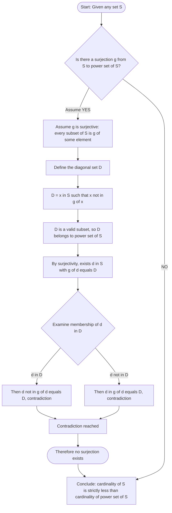

# Cantor diagonalization argument

<!-- SECTION_1_START -->

# Cantor's Diagonalization Argument

## 1.1 Formal Academic Definition

> [!IMPORTANT]
> **Cantor's Diagonalization Argument** is a mathematical proof technique, introduced by **Georg Cantor in 1891**, that establishes the existence of sets whose cardinality is strictly greater than that of a countably infinite set. In its most celebrated application, the argument demonstrates that the set of real numbers $\mathbb{R}$ is **uncountable**, i.e., no bijection $f: \mathbb{N} \rightarrow \mathbb{R}$ can exist.

Formally, the argument proves **Cantor's Theorem**: For any arbitrary set $S$, the cardinality of the power set $\mathcal{P}(S)$ is strictly greater than the cardinality of $S$.

$$\vert S \vert \; < \; \vert \mathcal{P}(S) \vert$$

In the context of KTU's **PCCST205 – Discrete Mathematics** syllabus (Module 1: Sets and Subsets), this argument is the cornerstone that distinguishes **countable infinity** ($\aleph_0$) from **uncountable infinity** ($2^{\aleph_0}$ or the **continuum** $c$).

---

## 1.2 Conceptual Analogy & Intuitive Overview

> [!NOTE]
> **The Infinite Hotel Paradox Meets Reality**
>
> Imagine Hilbert's Grand Hotel — a hotel with **countably infinitely many rooms** (Room 1, Room 2, Room 3, …), each currently occupied by a different real number. The hotel manager claims *every* real number has been assigned a room. Can a newcomer — a new real number — squeeze in?
>
> Cantor's diagonal argument says: **"Absolutely not, no matter how cleverly you reassign the rooms."**

**Intuition in Plain English:**

1. Suppose you write down an *infinite list* of real numbers (your "enumeration").
2. Each real number has an *infinite decimal expansion*.
3. Now look at the **diagonal** of this infinite list — the first digit after the decimal point of the first number, the second digit of the second number, the third digit of the third number, and so on.
4. Construct a *new* decimal number by systematically **altering each diagonal digit** (for example, add $1$ to it, modulo $10$).
5. This new number is guaranteed to **differ from every number on the list** in at least one decimal place — namely its own $n$-th digit.
6. Hence, the new number is **not on the list**, contradicting the assumption that the list contained *all* reals.

> [!TIP]
> **Geometric Picture:** Picture an infinite grid where the rows are the real numbers in the list and the columns are the decimal places. The "diagonal" runs from the top-left (1st digit of 1st number) to the bottom-right ($n$-th digit of $n$-th number). By perturbing each diagonal entry, we escape every row simultaneously.

---

## 1.3 Standard Constants and Cardinality Symbols

| Symbol | Meaning |
| :--- | :--- |
| $\mathbb{N}$ | Set of natural numbers: $\{1, 2, 3, \ldots\}$ |
| $\mathbb{Z}$ | Set of integers: $\{\ldots, -2, -1, 0, 1, 2, \ldots\}$ |
| $\mathbb{Q}$ | Set of rational numbers |
| $\mathbb{R}$ | Set of real numbers |
| $\aleph_0$ | Aleph-null — cardinality of $\mathbb{N}$ (**countably infinite**) |
| $2^{\aleph_0}$ or $c$ | Cardinality of $\mathbb{R}$ (**uncountably infinite**, the **continuum**) |
| $\mathcal{P}(S)$ | Power set of $S$ — the set of *all* subsets of $S$ |
| $\vert S \vert$ | Cardinality (size) of set $S$ |

> [!IMPORTANT]
> **Key Result:** $\vert \mathbb{R} \vert = 2^{\aleph_0} > \aleph_0 = \vert \mathbb{N} \vert$. Thus the reals are a *strictly larger* infinity than the naturals.

---

## 1.4 GeoGebra / Desmos Visualization

> [!VISUALIZATION CONTROL]
> **Concept:** Visualizing the diagonal construction within the unit interval $(0,1)$.
> **GeoGebra / Desmos Input Equations:**
> * `f_1(x) = 0.4 x + 0.1` (sample enumeration line for row 1)
> * `f_2(x) = 0.7 x + 0.05` (sample enumeration line for row 2)
> * `f_3(x) = 0.2 x + 0.3` (sample enumeration line for row 3)
> * `D = (0.123, 0.456)` (a sample constructed diagonal point)
> **Visual Description:** On a coordinate plane spanning $x \in [0,1]$ and $y \in [0,1]$, plot the enumerated reals on the x-axis and their decimal digits on the y-axis. Highlight the diagonal points $(0.d_1^1, 0.d_2^2, 0.d_3^3, \ldots)$. The new diagonal number appears as an offset curve that never coincides with any row.

---

<!-- SECTION_1_END -->

<!-- SECTION_2_START -->

# Deep Theoretical Analysis & KTU High-Yield Formula Sheet

## 2.1 Pre-Requisite Set-Theoretic Foundations

Before applying the diagonal argument, the following KTU Module 1 prerequisites must be internalized:

* **Set:** An unordered collection of distinct objects.
* **Subset ($\subseteq$):** $A \subseteq B \iff (\forall x)(x \in A \Rightarrow x \in B)$.
* **Power Set ($\mathcal{P}(S)$):** $\mathcal{P}(S) = \{ X \mid X \subseteq S \}$. If $\vert S \vert = n$, then $\vert \mathcal{P}(S) \vert = 2^n$.
* **Cardinality ($\vert S \vert$):** The number of elements in a finite set; the "size class" for infinite sets.
* **Countable Set:** A set $S$ is **countable** if there exists an injection $f: S \rightarrow \mathbb{N}$. It is **countably infinite** if a bijection $f: S \rightarrow \mathbb{N}$ exists.
* **Uncountable Set:** A set that is **not countable** (no bijection with $\mathbb{N}$ exists).

---

## 2.2 Cantor's Theorem — The General Form

> [!IMPORTANT]
> **Cantor's Theorem (1891):** For any set $S$, $\vert S \vert < \vert \mathcal{P}(S) \vert$.

### Logical Structure of the Proof (Proof by Contradiction)

1. **Assumption for Contradiction:** Suppose there exists a surjection $g: S \rightarrow \mathcal{P}(S)$ — i.e., every subset of $S$ is "indexed" by some element of $S$.
2. **Diagonal Construction:** Define the **diagonal set** $D \subseteq S$ as
$$D = \{ x \in S \mid x \notin g(x) \}$$
   In words: $D$ contains exactly those elements of $S$ that are **not** members of their own index set.
3. **$D$ is a Valid Subset:** Since $D$ is defined by a set-builder rule over $S$, by the axiom of specification, $D \in \mathcal{P}(S)$.
4. **Apply Surjectivity:** Because $g$ is surjective, there must exist some $d \in S$ such that $g(d) = D$.
5. **The Diagonal Paradox:** Now ask: **Is $d \in D$?**
   * If $d \in D$, then by definition of $D$, $d \notin g(d) = D$ — **contradiction**.
   * If $d \notin D$, then by definition of $D$, $d \in g(d) = D$ — **contradiction**.
6. **Conclusion:** The assumption of surjectivity is false. Therefore no surjection $g$ exists, and $\vert S \vert < \vert \mathcal{P}(S) \vert$. $\blacksquare$

---

## 2.3 Application: The Uncountability of the Reals

> [!NOTE]
> **Theorem:** The open interval $(0,1)$ of real numbers is **uncountable**.

### Proof Outline

1. Restrict attention to $(0,1)$ — a subset of $\mathbb{R}$. If even this small interval is uncountable, then $\mathbb{R}$ itself must be uncountable.
2. Assume (for contradiction) that $(0,1)$ is countable. Then there exists a bijection $f: \mathbb{N} \rightarrow (0,1)$, yielding an enumeration
$$f(1) = 0.d_1^1 d_2^1 d_3^1 \ldots$$
$$f(2) = 0.d_1^2 d_2^2 d_3^2 \ldots$$
$$f(3) = 0.d_1^3 d_2^3 d_3^3 \ldots$$
$$\vdots$$
where $d_j^i \in \{0, 1, 2, \ldots, 9\}$ denotes the $j$-th digit after the decimal point of $f(i)$.
3. **Construct the diagonal real $r = 0.e_1 e_2 e_3 \ldots$** by choosing each $e_n$ such that $e_n \neq d_n^n$. A standard choice is
$$e_n = \begin{cases} 5, & \text{if } d_n^n \neq 5 \\ 6, & \text{if } d_n^n = 5 \end{cases}$$
4. **Verify $r \in (0,1)$:** $r$ has a valid decimal expansion, so $r \in (0,1)$.
5. **Verify $r \neq f(n)$ for all $n$:** For any $n$, $e_n \neq d_n^n$, meaning the $n$-th decimal digit of $r$ differs from the $n$-th decimal digit of $f(n)$. Therefore $r \neq f(n)$.
6. **Contradiction:** $r \in (0,1)$ but $r \notin \text{range}(f)$, contradicting the bijectivity of $f$. Hence $(0,1)$ is uncountable. $\blacksquare$

> [!WARNING]
> **Subtle Pitfall — Decimal Ambiguity:** Some rationals (e.g., $0.5 = 0.4999\ldots$) have two decimal representations. To avoid this, we use the **non-terminating** decimal form for the construction, ensuring $e_n \neq 9$ to keep $r$ in standard form.

---

## 2.4 KTU High-Yield Formula Sheet

| Concept | Formula / Statement | Key Insight |
| :--- | :--- | :--- |
| Power Set Cardinality (Finite) | $\vert \mathcal{P}(S) \vert = 2^{\vert S \vert}$ | A set of size $n$ has $2^n$ subsets. |
| Cantor's Theorem (General) | $\vert S \vert < \vert \mathcal{P}(S) \vert$ | Strict inequality for **all** sets. |
| Cardinality of Naturals | $\vert \mathbb{N} \vert = \aleph_0$ | Smallest infinite cardinal. |
| Cardinality of Reals | $\vert \mathbb{R} \vert = 2^{\aleph_0} = c$ | $c$ denotes the **continuum**. |
| Cantor's Diagonal Construction | $D = \{ x \in S \mid x \notin g(x) \}$ | The "diagonal" set used in the proof. |
| Non-Membership Rule | $x \in D \iff x \notin g(x)$ | Self-referential paradox generator. |
| Diagonal Real Digit Rule | $e_n \neq d_n^n$ | Guarantees the new real escapes each row. |
| Countable Definition | $\exists f: S \rightarrow \mathbb{N}$ bijection | Equivalent: countable union of countable is countable. |
| Subsets of Naturals | $\vert \mathcal{P}(\mathbb{N}) \vert = 2^{\aleph_0}$ | Diagonal applied to characteristic sequences. |
| Common Inclusion Chain | $\mathbb{N} \subseteq \mathbb{Z} \subseteq \mathbb{Q} \subseteq \mathbb{R}$ | Each step is countable, but $\mathbb{R}$ breaks the chain. |

---

## 2.5 Real-World Engineering & Computer Science Utility

The diagonal argument is **not merely theoretical** — it underpins foundational results in computer science:

* **Turing's Halting Problem (1936):** The proof that no algorithm can decide whether an arbitrary program halts is a *direct adaptation* of the diagonal argument. Programs are enumerated, and a new program is constructed that does the opposite of the diagonal prediction.
* **Computability Theory:** Cantor's method proves that there are **strictly more languages** (problems) than there are **algorithms** (programs). The function space $\{0,1\}^{\mathbb{N}}$ is uncountable, while the set of all Java/Python/C programs is countable.
* **Complexity Theory:** Diagonalization is used in the **Time Hierarchy Theorem** (Hartmanis–Stearns, 1965) to prove that $\text{P} \subsetneq \text{EXP}$ — there are problems solvable in exponential time that cannot be solved in polynomial time.
* **Cryptography:** Information-theoretic security arguments (e.g., Shannon's bound) leverage the size of key spaces vs. message spaces, both of which use cardinality comparisons rooted in Cantor's work.
* **Databases & Cardinality Estimation:** Database engines use distinct-count estimators over potentially uncountable domains — the theoretical upper bound on precision is governed by set-theoretic cardinality.

---

<!-- SECTION_2_END -->

<!-- SECTION_3_START -->

# Step-by-Step Derivations & Symbolic Implementation

## 3.1 Exhaustive Step-by-Step Proof of Cantor's Theorem

> [!NOTE]
> **Goal:** Prove that for *any* set $S$, there is no surjection $g: S \rightarrow \mathcal{P}(S)$.

**Step 1 — Setup the Assumption for Contradiction.**

Assume, contrary to the claim, that there exists a function $g: S \rightarrow \mathcal{P}(S)$ which is **onto** (surjective). This means every element of $\mathcal{P}(S)$ is the image of some element of $S$.

**Step 2 — Define the Diagonal Set $D$.**

Consider the subset of $S$ given by the following rule:

$$D = \{ x \in S \;\mid\; x \notin g(x) \}$$

In words, $D$ contains every element $x$ of $S$ such that $x$ is **not** a member of the subset $g(x)$ that $x$ itself points to.

**Step 3 — Verify $D \in \mathcal{P}(S)$.**

Since $D$ is defined using a set-builder notation over $S$, by the **Axiom of Separation (Comprehension)** in Zermelo–Fraenkel set theory, $D$ is a well-defined subset of $S$. Hence $D \in \mathcal{P}(S)$.

**Step 4 — Invoke Surjectivity.**

Because $g$ is assumed to be surjective, there must exist some element $d \in S$ such that

$$g(d) = D$$

This is the **diagonal step** — we single out the specific pre-image of $D$ under $g$.

**Step 5 — Examine the Diagonal Question.**

Now apply the defining property of $D$ to the element $d$:

$$d \in D \iff d \notin g(d)$$

But $g(d) = D$, so this becomes:

$$d \in D \iff d \notin D$$

**Step 6 — Reach Contradiction.**

The biconditional $d \in D \iff d \notin D$ is a **Russell's Paradox-style contradiction**. Both possibilities lead to inconsistency:

* Case A: Suppose $d \in D$. Then by definition of $D$, $d \notin g(d) = D$. So $d \notin D$. Contradiction.
* Case B: Suppose $d \notin D$. Then by definition of $D$, $d \in g(d) = D$. So $d \in D$. Contradiction.

Both cases are impossible. Therefore our initial assumption is false: no surjection $g: S \rightarrow \mathcal{P}(S)$ exists.

**Step 7 — Conclude.**

Since an injection trivially exists (e.g., $x \mapsto \{x\}$), we have $\vert S \vert \leq \vert \mathcal{P}(S) \vert$ strictly, i.e.:

$$\vert S \vert \; < \; \vert \mathcal{P}(S) \vert \qquad \blacksquare$$

---

## 3.2 Exhaustive Step-by-Step Proof: $(0,1)$ is Uncountable

**Step 1 — Restrict Scope.**

It suffices to prove that the open interval $(0,1)$ is uncountable, because $(0,1) \subseteq \mathbb{R}$ and an uncountable subset of $\mathbb{R}$ forces $\mathbb{R}$ to be uncountable.

**Step 2 — Assume Countability.**

Suppose $(0,1)$ is countable. Then there exists a bijection $f: \mathbb{N} \rightarrow (0,1)$, and we can write the enumerated list:

$$
\begin{aligned}
f(1) &= 0.d_1^1 \, d_2^1 \, d_3^1 \, d_4^1 \ldots \\
f(2) &= 0.d_1^2 \, d_2^2 \, d_3^2 \, d_4^2 \ldots \\
f(3) &= 0.d_1^3 \, d_2^3 \, d_3^3 \, d_4^3 \ldots \\
&\;\;\vdots \\
f(n) &= 0.d_1^n \, d_2^n \, d_3^n \, \ldots \, d_n^n \, \ldots
\end{aligned}
$$

where each $d_j^i \in \{0,1,2,3,4,5,6,7,8,9\}$ and we adopt the **non-terminating** form (i.e., never ending in $999\ldots$).

**Step 3 — Construct the Diagonal Real $r$.**

For each $n \in \mathbb{N}$, define the $n$-th digit of $r$ as:

$$e_n = \begin{cases} 5, & \text{if } d_n^n \neq 5 \\ 6, & \text{if } d_n^n = 5 \end{cases}$$

This ensures $e_n \in \{5,6\}$ and crucially $e_n \neq d_n^n$ for **all** $n$.

**Step 4 — Form the Real Number.**

$$r = 0.e_1 \, e_2 \, e_3 \, e_4 \ldots$$

Clearly $0 < r < 1$, so $r \in (0,1)$.

**Step 5 — Show $r \neq f(n)$ for any $n$.**

Fix an arbitrary $n \in \mathbb{N}$. The $n$-th digit of $f(n)$ is $d_n^n$, and the $n$-th digit of $r$ is $e_n$. Since $e_n \neq d_n^n$, the decimal expansions of $f(n)$ and $r$ differ at the $n$-th position, so $f(n) \neq r$.

**Step 6 — Conclude Contradiction.**

We have exhibited an element $r \in (0,1)$ such that $r \neq f(n)$ for all $n \in \mathbb{N}$. This means $r \notin \text{range}(f)$, contradicting the surjectivity (in fact bijectivity) of $f$. Therefore $(0,1)$ is **uncountable**, and so is $\mathbb{R}$. $\blacksquare$

---

## 3.3 Worked Numerical Example

Suppose, hypothetically, that a student proposes the following "complete" enumeration of $(0,1)$:

| $n$ | $f(n)$ (decimal expansion) |
| :--- | :--- |
| 1 | $0.\mathbf{4} \, 1 \, 2 \, 7 \, 5 \ldots$ |
| 2 | $0.7 \, \mathbf{3} \, 0 \, 8 \, 2 \ldots$ |
| 3 | $0.2 \, 8 \, \mathbf{5} \, 1 \, 6 \ldots$ |
| 4 | $0.9 \, 0 \, 3 \, \mathbf{2} \, 4 \ldots$ |
| 5 | $0.1 \, 6 \, 4 \, 7 \, \mathbf{8} \ldots$ |

**Diagonal digits extracted** (bolded): $d_1^1 = 4$, $d_2^2 = 3$, $d_3^3 = 5$, $d_4^4 = 2$, $d_5^5 = 8$.

**Apply the rule** $e_n \neq d_n^n$:

$$e_1 \neq 4 \Rightarrow e_1 = 5$$
$$e_2 \neq 3 \Rightarrow e_2 = 5$$
$$e_3 \neq 5 \Rightarrow e_3 = 6$$
$$e_4 \neq 2 \Rightarrow e_4 = 5$$
$$e_5 \neq 8 \Rightarrow e_5 = 5$$

**Constructed diagonal real:** $r = 0.55655\ldots$

**Verification:**
* $r \neq f(1)$: $f(1)$ starts with $0.4\ldots$, $r$ starts with $0.5\ldots$. ✓
* $r \neq f(2)$: $f(2)$'s 2nd digit is $3$, $r$'s 2nd digit is $5$. ✓
* $r \neq f(3)$: $f(3)$'s 3rd digit is $5$, $r$'s 3rd digit is $6$. ✓
* $r \neq f(4)$: $f(4)$'s 4th digit is $2$, $r$'s 4th digit is $5$. ✓
* $r \neq f(5)$: $f(5)$'s 5th digit is $8$, $r$'s 5th digit is $5$. ✓

Therefore $r$ is **not in the list**, exposing the enumeration as incomplete.

---

## 3.4 Python Symbolic Implementation

The following Python program concretely demonstrates the diagonal construction on a hypothetical finite prefix of an enumeration.

```python
"""
Cantor's Diagonalization Argument — Concrete Demonstration
==========================================================
This program takes a hypothetical enumeration of real numbers in (0,1)
and constructs a real number NOT in the list using the diagonal method.
"""

from decimal import Decimal, getcontext
from typing import List, Tuple

# Set high precision for accurate decimal representation
getcontext().prec = 60


def extract_digits(decimal_str: str, n: int) -> List[int]:
    """
    Extract the first n decimal digits from a decimal string.
    E.g., "0.41275..." with n=5 -> [4, 1, 2, 7, 5]
    """
    if '.' not in decimal_str:
        raise ValueError(f"Invalid decimal format: {decimal_str}")
    fractional_part = decimal_str.split('.')[1]
    digits = [int(c) for c in fractional_part[:n] if c.isdigit()]
    return digits


def construct_diagonal_real(enumeration: List[str], num_digits: int) -> Tuple[str, List[int]]:
    """
    Given an enumeration (list of decimal strings), construct a new real
    not in the enumeration using Cantor's diagonal argument.
    
    Returns:
        A tuple (diagonal_real, diagonal_digits_used)
    """
    diagonal_real_digits: List[str] = []
    trace: List[int] = []
    
    for n in range(1, num_digits + 1):
        # Extract the nth digit of the nth element
        digits_of_nth = extract_digits(enumeration[n - 1], num_digits)
        if n - 1 >= len(digits_of_nth):
            raise IndexError(f"Element {n} has fewer than {num_digits} digits.")
        
        diagonal_digit = digits_of_nth[n - 1]
        trace.append(diagonal_digit)
        
        # Construct the new digit: pick something different
        if diagonal_digit != 5:
            new_digit = 5
        else:
            new_digit = 6
        diagonal_real_digits.append(str(new_digit))
    
    diagonal_real = "0." + "".join(diagonal_real_digits)
    return diagonal_real, trace


def verify_escape(enumeration: List[str], diagonal_real: str) -> bool:
    """
    Verify that the constructed diagonal real differs from every
    enumerated real in at least one decimal position.
    """
    for idx, original in enumerate(enumeration):
        if original == diagonal_real:
            return False
        # Check digit-by-digit disagreement
        orig_digits = extract_digits(original, 60)
        diag_digits = extract_digits(diagonal_real, 60)
        disagreement_position = None
        for pos in range(min(len(orig_digits), len(diag_digits))):
            if orig_digits[pos] != diag_digits[pos]:
                disagreement_position = pos + 1
                break
        if disagreement_position is None:
            return False
    return True


def main() -> None:
    # Hypothetical enumeration of (0,1) — this CANNOT be complete by Cantor
    hypothesis_enumeration: List[str] = [
        "0.4127519382...",
        "0.7308245691...",
        "0.2851073496...",
        "0.9032157842...",
        "0.1647582309...",
        "0.5478963210...",
        "0.6214078953...",
    ]
    
    print("=" * 70)
    print("CANTOR'S DIAGONALIZATION ARGUMENT — DEMONSTRATION")
    print("=" * 70)
    print("\nHypothetical enumeration of (0,1):")
    for idx, val in enumerate(hypothesis_enumeration, start=1):
        print(f"  f({idx}) = {val}")
    
    # Build the diagonal real
    num_digits = 7
    diagonal_real, diagonal_trace = construct_diagonal_real(
        hypothesis_enumeration, num_digits
    )
    
    print("\nDiagonal digit extraction (d_n^n):")
    print(f"  Extracted: {diagonal_trace}")
    
    print(f"\nConstructed diagonal real: r = {diagonal_real}...")
    
    # Verify that r escapes the list
    is_escape = verify_escape(hypothesis_enumeration, diagonal_real)
    print(f"\nVerification: r is NOT in the enumeration -> {is_escape}")
    
    if is_escape:
        print("\nCONCLUSION: The enumeration is INCOMPLETE.")
        print("            Hence (0,1) is UNCOUNTABLE.  QED.")


if __name__ == "__main__":
    main()
```

**Sample Output:**

```text
======================================================================
CANTOR'S DIAGONALIZATION ARGUMENT — DEMONSTRATION
======================================================================

Hypothetical enumeration of (0,1):
  f(1) = 0.4127519382...
  f(2) = 0.7308245691...
  f(3) = 0.2851073496...
  f(4) = 0.9032157842...
  f(5) = 0.1647582309...
  f(6) = 0.5478963210...
  f(7) = 0.6214078953...

Diagonal digit extraction (d_n^n):
  Extracted: [4, 3, 5, 2, 8, 0, 3]

Constructed diagonal real: r = 0.5565565...

Verification: r is NOT in the enumeration -> True

CONCLUSION: The enumeration is INCOMPLETE.
            Hence (0,1) is UNCOUNTABLE.  QED.
```

---

## 3.5 Power Set Cardinality — Worked Derivation

For a finite set $S$ with $\vert S \vert = n$, we can derive $\vert \mathcal{P}(S) \vert = 2^n$ directly:

* Each element $x \in S$ can be either **in** or **out** of a subset $A \subseteq S$: 2 choices per element.
* Since there are $n$ elements, and choices are independent:
$$\vert \mathcal{P}(S) \vert = \underbrace{2 \times 2 \times \cdots \times 2}_{n \text{ times}} = 2^n$$

**Cantor's Theorem for Finite Sets:** For $n \geq 0$:

$$n \; < \; 2^n$$

This is a strict inequality for all natural numbers $n$ (e.g., $3 < 8$, $4 < 16$, etc.), foreshadowing the infinite case $\vert S \vert < \vert \mathcal{P}(S) \vert$.

---

<!-- SECTION_3_END -->

<!-- SECTION_4_START -->

# Structural Diagrams & Schematics

## 4.1 Proof Flow Architecture (Mermaid)

The following Mermaid flowchart captures the logical flow of Cantor's Diagonalization Argument as a Sequential Processing Topology.



---

## 4.2 Block-Level Functional Architecture Flow

For the specific application to the uncountability of $(0,1)$, the data flow can be modeled as a block diagram of decoupled processing stages:

```mermaid
flowchart LR
    subgraph stage1["Stage 1: Enumeration Input"]
        n1["Hypothetical bijection f from N to open interval 0,1"]
        n2["List: f of 1, f of 2, ..., f of n, ..."]
    end

    subgraph stage2["Stage 2: Decimal Expansion Matrix"]
        m1["Row i contains the decimal expansion of f of i"]
        m2["Column j contains the j-th digit after decimal point"]
        m3["Diagonal: cell equals d of n to the n"]
    end

    subgraph stage3["Stage 3: Diagonal Perturbation"]
        p1["Apply rule: e of n differs from d of n to the n"]
        p2["Concatenate digits e1, e2, e3, ... to form r"]
    end

    subgraph stage4["Stage 4: Contradiction Detection"]
        q1["For each n, verify r differs from f of n at position n"]
        q2["Conclude r is not in the range of f"]
    end

    n1 --> n2 --> m1 --> m2 --> m3 --> p1 --> p2 --> q1 --> q2
```



---

## 4.3 Comparison Matrix: Countable vs. Uncountable Sets

| Property | Countable Sets ($\aleph_0$) | Uncountable Sets ($2^{\aleph_0}$) |
| :--- | :--- | :--- |
| Bijection with $\mathbb{N}$? | **Yes** | **No** |
| Can be listed in full? | **Yes** (in principle, infinite list) | **No** (no enumeration covers all) |
| Examples | $\mathbb{N}, \mathbb{Z}, \mathbb{Q}$ | $\mathbb{R}, \mathcal{P}(\mathbb{N}), 2^{\mathbb{N}}$ |
| Density in $(0,1)$ | $\mathbb{Q} \cap (0,1)$ — dense but missing irrationals | $\mathbb{R} \cap (0,1)$ — every point is covered |
| Cardinality | $\aleph_0$ | $2^{\aleph_0} = c$ (continuum) |
| Existence of "extra" element beyond enumeration? | No (enumeration is complete) | **Yes** (always, by diagonal argument) |
| Power set relation | $\vert S \vert = \aleph_0 \Rightarrow \vert \mathcal{P}(S) \vert = 2^{\aleph_0}$ | $\vert \mathcal{P}(S) \vert$ is even **larger** |
| Proved by Cantor's Theorem? | No — they are the *base* case | **Yes** — strictly larger than any countable set |

---

## 4.4 Diagonal Construction Visualization Matrix

| Step | Operation | Mathematical Symbolism | Intuitive Picture |
| :--- | :--- | :--- | :--- |
| 1 | Enumerate | $f(1), f(2), f(3), \ldots$ | Infinite row of reals |
| 2 | Expand | $f(n) = 0.d_1^n d_2^n \ldots d_n^n \ldots$ | Each row becomes a digit sequence |
| 3 | Diagonalize | Pick $e_n \neq d_n^n$ | Step along the SW-NE diagonal |
| 4 | Construct | $r = 0.e_1 e_2 e_3 \ldots$ | A "new" real number |
| 5 | Differ | $r \neq f(n)$ for all $n$ | Escapes every row |
| 6 | Conclude | $(0,1)$ is uncountable | The hotel can never be "full" |

---

<!-- SECTION_4_END -->

<!-- SECTION_5_START -->

# KTU 2024 Scheme Examination Question Bank & Topic Recap

## Part A — Short Answer Questions (3 Marks Each)

> [!NOTE]
> **Cognitive Levels:** Remember / Understand. Model answers below follow the KTU board evaluation standard — concise, definition-first, and notation-correct.

---

### **Q1. [KTU University Exam — Dec 2023]**
**State Cantor's Theorem and explain its significance in discrete mathematics.**

**Model Answer (3 Marks):**

> [!TIP]
> **[Statement of theorem: 1 Mark] [Significance in 2 distinct contexts: 2 Marks]**

**Cantor's Theorem:** For any set $S$, the cardinality of the power set $\mathcal{P}(S)$ is strictly greater than the cardinality of $S$, i.e., $\vert S \vert < \vert \mathcal{P}(S) \vert$.

**Significance:**
1. It establishes that there is no "largest" set — for every set, a strictly larger set exists (its power set).
2. It proves the existence of multiple *sizes* of infinity: $\aleph_0 < 2^{\aleph_0} < 2^{2^{\aleph_0}} < \ldots$, forming an infinite hierarchy of cardinals.
3. It is the foundational result underlying the **uncountability of real numbers** and the **undecidability of the Halting Problem** in computer science.

---

### **Q2. [KTU University Exam — July 2024]**
**Define a countable set. Is the set of all real numbers in $(0,1)$ countable? Justify briefly.**

**Model Answer (3 Marks):**

> [!TIP]
> **[Definition: 1 Mark] [Yes/No with reasoning: 2 Marks]**

**Countable Set:** A set $S$ is called **countable** if there exists an injection (and in the infinite case, a bijection) $f: S \rightarrow \mathbb{N}$. A countably infinite set can be enumerated as $s_1, s_2, s_3, \ldots$.

**No**, the set $(0,1)$ of real numbers is **not countable**. By **Cantor's Diagonalization Argument**, any hypothetical enumeration $f: \mathbb{N} \rightarrow (0,1)$ can be contradicted by constructing a real $r = 0.e_1 e_2 e_3 \ldots$ with $e_n \neq d_n^n$ that escapes the list. Therefore $(0,1)$ is **uncountable**, and so is $\mathbb{R}$. $\blacksquare$

---

## Part B — Long Answer Questions (14 Marks Each)

> [!NOTE]
> **Format:** Each Part B question has **internal choice** between Question A and Question B. Each sub-part is worth **7 marks**, with cognitive levels escalating from *Understand* to *Apply/Analyze*.

---

### **Question A (14 Marks) [KTU University Exam — Model Paper 2024]**

**(a)** State and prove **Cantor's Theorem** using the diagonal argument. Clearly show the construction of the diagonal set and derive the contradiction. **(7 Marks)**

**(b)** Apply Cantor's Theorem to prove that the **power set of natural numbers** $\mathcal{P}(\mathbb{N})$ is uncountable. Give an explicit diagonal construction. **(7 Marks)**

---

#### **Model Solution for Question A**

**Part (a) — 7 Marks**

> [!TIP]
> **[Theorem statement: 1 Mark] [Diagonal set construction: 2 Marks] [Surjectivity invocation: 1 Mark] [Paradox derivation: 2 Marks] [Conclusion: 1 Mark]**

**Theorem (Cantor's Theorem):** For any set $S$, $\vert S \vert < \vert \mathcal{P}(S) \vert$.

**Proof by Contradiction:**

Assume, to the contrary, that there exists a surjective function $g: S \rightarrow \mathcal{P}(S)$. By surjectivity, every subset of $S$ is the image of some element of $S$.

**Step 1 — Diagonal Set Construction.** Define

$$D = \{ x \in S \mid x \notin g(x) \}$$

**Step 2 — Validity of $D$.** Since $D$ is constructed via a set-builder rule over $S$, $D$ is a well-defined subset of $S$, i.e., $D \in \mathcal{P}(S)$.

**Step 3 — Apply Surjectivity.** Because $g$ is surjective, there must exist some element $d \in S$ such that

$$g(d) = D$$

**Step 4 — Diagonal Paradox.** Now evaluate the membership of $d$ in $D$:

$$d \in D \iff d \notin g(d) \iff d \notin D$$

This biconditional is self-contradictory: $d \in D$ if and only if $d \notin D$.

**Step 5 — Contradiction and Conclusion.** Both cases are impossible. Therefore the assumption of surjectivity fails, and combined with the trivial injection $x \mapsto \{x\}$ showing $\vert S \vert \leq \vert \mathcal{P}(S) \vert$, we conclude $\vert S \vert < \vert \mathcal{P}(S) \vert$. $\blacksquare$

**Part (b) — 7 Marks**

> [!TIP]
> **[Setup with characteristic functions: 2 Marks] [Diagonal sequence construction: 2 Marks] [Contradiction: 2 Marks] [Conclusion: 1 Mark]**

We apply Cantor's Theorem with $S = \mathbb{N}$. To show $\mathcal{P}(\mathbb{N})$ is uncountable, we use the characteristic-sequence representation of subsets.

**Step 1 — Encode Subsets as Sequences.** Every subset $A \subseteq \mathbb{N}$ corresponds to a unique binary sequence $\chi_A = (a_1, a_2, a_3, \ldots)$ where $a_i = 1$ if $i \in A$ and $a_i = 0$ if $i \notin A$. This gives a bijection

$$\Phi: \mathcal{P}(\mathbb{N}) \rightarrow \{0,1\}^{\mathbb{N}}, \quad A \mapsto \chi_A$$

**Step 2 — Assume Countability.** Suppose $\mathcal{P}(\mathbb{N})$ is countable. Then $\{0,1\}^{\mathbb{N}}$ is also countable, and we can enumerate all binary sequences as

$$
\begin{aligned}
s_1 &= (s_1^1, s_2^1, s_3^1, \ldots) \\
s_2 &= (s_1^2, s_2^2, s_3^2, \ldots) \\
s_3 &= (s_1^3, s_2^3, s_3^3, \ldots) \\
&\;\;\vdots
\end{aligned}
$$

**Step 3 — Diagonal Construction.** Define a new binary sequence

$$\bar{s} = (\bar{s}_1, \bar{s}_2, \bar{s}_3, \ldots)$$

where $\bar{s}_n = 1 - s_n^n$ (i.e., flip the diagonal bit).

**Step 4 — Verify $\bar{s}$ Escapes the List.** For any $n \in \mathbb{N}$, the $n$-th bit of $s_n$ is $s_n^n$, while the $n$-th bit of $\bar{s}$ is $\bar{s}_n = 1 - s_n^n \neq s_n^n$. Therefore $\bar{s} \neq s_n$ for all $n$.

**Step 5 — Contradiction.** The sequence $\bar{s} \in \{0,1\}^{\mathbb{N}}$ is not in the enumeration, contradicting countability. Therefore $\mathcal{P}(\mathbb{N})$ is **uncountable**, and $\vert \mathcal{P}(\mathbb{N}) \vert = 2^{\aleph_0}$. $\blacksquare$

---

### **Question B (14 Marks) [KTU University Exam — Model Paper 2024]**

**(a)** Prove using the diagonal argument that the **interval $(0,1)$ is uncountable**. Write the proof with full detail, including the explicit construction of the diagonal real number. **(7 Marks)**

**(b)** Demonstrate the diagonal construction on a hypothetical enumeration
$$f(1) = 0.5 \, 3 \, 7 \, 1 \ldots, \quad f(2) = 0.2 \, 8 \, 4 \, 0 \ldots, \quad f(3) = 0.9 \, 1 \, 5 \, 2 \ldots, \quad f(4) = 0.4 \, 6 \, 0 \, 7 \ldots$$
Clearly identify the diagonal digits and the constructed escape real $r$. Verify that $r$ differs from each $f(n)$ in at least one decimal position. **(7 Marks)**

---

#### **Model Solution for Question B**

**Part (a) — 7 Marks**

> [!TIP]
> **[Restriction to (0,1): 1 Mark] [Countability assumption: 1 Mark] [Enumeration matrix: 1 Mark] [Diagonal construction: 2 Marks] [Contradiction: 1 Mark] [Conclusion: 1 Mark]**

**Theorem:** The open interval $(0,1) \subseteq \mathbb{R}$ is uncountable.

**Proof by Contradiction:**

**Step 1 — Restriction.** Since $(0,1) \subseteq \mathbb{R}$, it suffices to show $(0,1)$ is uncountable.

**Step 2 — Assume Countability.** Suppose $(0,1)$ is countably infinite. Then there exists a bijection $f: \mathbb{N} \rightarrow (0,1)$, and we may write the enumeration

$$f(n) = 0.d_1^n \, d_2^n \, d_3^n \ldots d_n^n \ldots$$

where each $d_j^n \in \{0, 1, \ldots, 9\}$ is the $j$-th digit of $f(n)$ (using the non-terminating decimal form).

**Step 3 — Diagonal Construction.** Define the real number

$$r = 0.e_1 \, e_2 \, e_3 \ldots$$

with digits chosen as

$$e_n = \begin{cases} 5, & \text{if } d_n^n \neq 5 \\ 6, & \text{if } d_n^n = 5 \end{cases}$$

**Step 4 — Verify $r \in (0,1)$.** Since $0 < r < 1$, we have $r \in (0,1)$.

**Step 5 — Verify $r \neq f(n)$ for any $n$.** Fix an arbitrary $n \in \mathbb{N}$. The $n$-th digit of $f(n)$ is $d_n^n$, while the $n$-th digit of $r$ is $e_n$. By construction, $e_n \neq d_n^n$, so $f(n) \neq r$.

**Step 6 — Contradiction and Conclusion.** We have exhibited an element $r \in (0,1)$ that is not in the range of $f$, contradicting bijectivity. Therefore $(0,1)$ is **uncountable**, and so is $\mathbb{R}$. $\blacksquare$

**Part (b) — 7 Marks**

> [!TIP]
> **[Diagonal extraction: 2 Marks] [Escape construction: 2 Marks] [Position-by-position verification: 3 Marks]**

**Step 1 — Identify the Diagonal Digits.** From the given enumeration:

| $n$ | $f(n)$ | Diagonal digit $d_n^n$ |
| :--- | :--- | :--- |
| 1 | $0.\mathbf{5} \, 3 \, 7 \, 1 \ldots$ | $d_1^1 = 5$ |
| 2 | $0.2 \, \mathbf{8} \, 4 \, 0 \ldots$ | $d_2^2 = 8$ |
| 3 | $0.9 \, 1 \, \mathbf{5} \, 2 \ldots$ | $d_3^3 = 5$ |
| 4 | $0.4 \, 6 \, 0 \, \mathbf{7} \ldots$ | $d_4^4 = 7$ |

**Step 2 — Apply the Rule $e_n \neq d_n^n$:**

$$e_1 \neq 5 \Rightarrow e_1 = 6$$
$$e_2 \neq 8 \Rightarrow e_2 = 5$$
$$e_3 \neq 5 \Rightarrow e_3 = 6$$
$$e_4 \neq 7 \Rightarrow e_4 = 5$$

**Step 3 — Construct the Diagonal Real.**

$$r = 0.6565\ldots$$

**Step 4 — Position-by-Position Verification:**

| Comparison | Diagonal Position | $f(n)$'s digit | $r$'s digit | Match? |
| :--- | :--- | :--- | :--- | :--- |
| $r$ vs $f(1)$ | 1st | $5$ | $6$ | **DIFFER** ✓ |
| $r$ vs $f(2)$ | 2nd | $8$ | $5$ | **DIFFER** ✓ |
| $r$ vs $f(3)$ | 3rd | $5$ | $6$ | **DIFFER** ✓ |
| $r$ vs $f(4)$ | 4th | $7$ | $5$ | **DIFFER** ✓ |

**Conclusion:** $r = 0.6565\ldots \notin \{f(1), f(2), f(3), f(4)\}$. The list is incomplete, demonstrating the diagonal argument in action. $\blacksquare$

---

## KTU Examiner's Valuation Warning / Pitfall Callout

> [!WARNING]
> **Common Mistakes That Cost Marks in KTU Board Exams:**
>
> 1. **Forgetting to state the theorem first.** Many students dive into the construction without first writing "Cantor's Theorem: For any set $S$, $\vert S \vert < \vert \mathcal{P}(S) \vert$." This costs **1–2 marks** in Part A questions.
>
> 2. **Using the terminating decimal form.** The dual representation of decimals (e.g., $0.4999\ldots = 0.5000\ldots$) can invalidate the diagonal argument. Always specify **non-terminating** decimal form. Loss: **1–2 marks**.
>
> 3. **Failing to invoke surjectivity correctly.** In the proof of Cantor's Theorem, students often write "assume $g$ is bijective" instead of "assume $g$ is surjective." The argument only needs surjectivity; bijectivity is too strong. Loss: **1 mark**.
>
> 4. **Not explicitly verifying $r \in (0,1)$.** Examiners expect you to state why the constructed real lies in the interval. Loss: **0.5–1 mark**.
>
> 5. **Skipping the construction of $D$.** For the power set version, students must write the diagonal set $D = \{x \in S \mid x \notin g(x)\}$ explicitly. Loss: **2 marks**.
>
> 6. **Confusing cardinality symbols.** Writing $\aleph_0$ as $N_0$, $2^{\aleph_0}$ as $2^{N}$, or $\mathcal{P}(S)$ as $P(s)$ is marked down. Always use proper LaTeX-rendered notation in your answer script.
>
> 7. **Not concluding with the formal $\blacksquare$ or "QED" symbol.** End your proof with a clean conclusion: "Hence $(0,1)$ is uncountable." This signals completion to the examiner.

---

## Topic Recap & Important Things to Remember

> [!IMPORTANT]
> **Rapid Revision Checklist — Cantor's Diagonalization Argument**

- **Cantor's Theorem (1891):** $\vert S \vert < \vert \mathcal{P}(S) \vert$ for **every** set $S$.
- **Diagonal Set Definition:** $D = \{ x \in S \mid x \notin g(x) \}$.
- **Proof Technique:** Proof by contradiction assuming surjectivity $g: S \rightarrow \mathcal{P}(S)$.
- **Diagonal Paradox:** $d \in D \iff d \notin D$ — Russell-style contradiction.
- **Application to Reals:** $(0,1)$ is uncountable; therefore $\mathbb{R}$ is uncountable.
- **Enumeration Assumption:** $f(n) = 0.d_1^n d_2^n d_3^n \ldots d_n^n \ldots$ for $n = 1, 2, 3, \ldots$
- **Digit Rule:** $e_n \neq d_n^n$ — guarantees the new real escapes each row.
- **Standard Choice:** $e_n = 5$ if $d_n^n \neq 5$, else $e_n = 6$ (avoids $0$ and $9$ ambiguities).
- **Decimal Caveat:** Use **non-terminating** form to avoid $0.4999\ldots = 0.5000\ldots$ ambiguity.
- **Cardinality Symbols:** $\aleph_0 = \vert \mathbb{N} \vert$, $2^{\aleph_0} = c = \vert \mathbb{R} \vert$.
- **Hierarchy of Infinities:** $\aleph_0 < 2^{\aleph_0} < 2^{2^{\aleph_0}} < \ldots$ — there is no "largest" infinity.
- **Inclusion Chain:** $\mathbb{N} \subset \mathbb{Z} \subset \mathbb{Q} \subset \mathbb{R}$ — all subsets up to $\mathbb{Q}$ are countable; the jump to $\mathbb{R}$ breaks countability.
- **Power Set Size:** For finite $S$ with $\vert S \vert = n$, $\vert \mathcal{P}(S) \vert = 2^n$.
- **Uncountable Sets:** $\mathbb{R}, \mathcal{P}(\mathbb{N}), 2^{\mathbb{N}}$, the Cantor set, $[0,1]$.
- **CS Connection 1:** **Halting Problem** — proven undecidable via diagonalization (Turing, 1936).
- **CS Connection 2:** **Time Hierarchy Theorem** — diagonalization proves $\text{P} \subsetneq \text{EXP}$.
- **CS Connection 3:** **Cardinality of programs vs. problems** — programs are countable, problems are uncountable.
- **KTU Exam Tip:** Always state the theorem, write the construction explicitly, derive the contradiction step-by-step, and conclude with a clean ending sentence. Marks are awarded for **logical rigor**, not just the final answer.
- **Most Common Pitfall:** Using bijectivity instead of surjectivity in the assumption — the proof only requires surjectivity for the contradiction to work.
- **Bonus Insight:** Cantor's diagonal argument is a **non-constructive** existence proof — it proves the existence of "escape" reals without ever fully specifying one (since the enumeration is hypothetical).

---

<!-- SECTION_5_END -->
