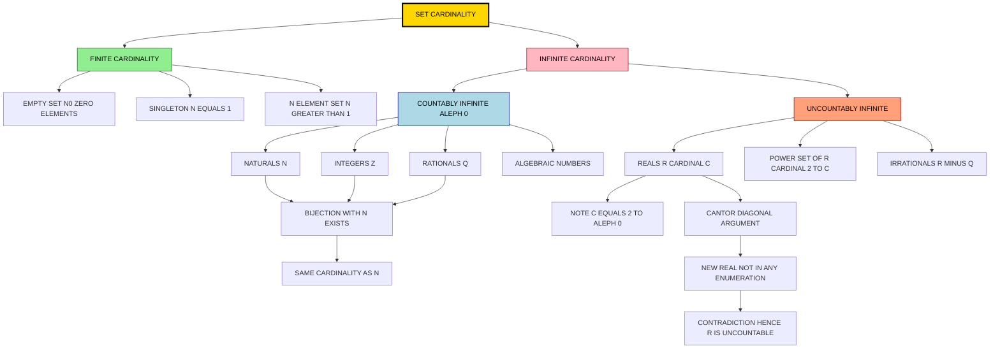
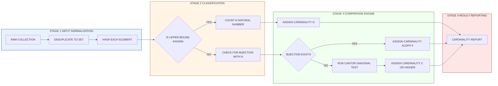

# Cardinality of Sets

<!-- SECTION_1_START -->
# Cardinality of Sets

## 1. Formal Definition

> [!IMPORTANT]
> **Cardinality (KTU 2024 Syllabus Definition):**
> The **cardinality** of a set $A$, denoted by $\vert A \vert$ (or $n(A)$ or $\#A$), is the **measure of the "number of elements"** in the set. It is a quantitative property that answers the question: *"How many distinct objects are inside this collection?"*

**Two foundational cases exist in Discrete Mathematics:**

| Type | Definition | Notation Convention |
|---|---|---|
| **Finite Set** | A set with a countable, well-defined number of elements that terminates. | $\vert A \vert \in \mathbb{N}_0$ (a non-negative integer) |
| **Infinite Set** | A set with no upper bound on its elements; an endless collection. | $\vert A \vert = \infty$ (or specific transfinite cardinals like $\aleph_0$, $\mathfrak{c}$) |

---

## 2. Conceptual Analogy / Intuition

> [!NOTE]
> **The "Jar of Marbles" Analogy**
> Imagine you have a **transparent glass jar** filled with marbles.
> - **Cardinality** = the *exact count* of marbles you can physically see and count inside.
> - If the jar holds **15 marbles**, then $\vert \text{Jar} \vert = 15$.
> - If the jar is **magically bottomless and endless**, we say it has *infinite cardinality*.

**A more advanced analogy — Comparing Two Libraries:**
Suppose you have two libraries, Library A and Library B. You want to know:
1. **How many books are in each?** → Absolute cardinality ($\vert A \vert$ vs. $\vert B \vert$).
2. **Can I pair every book in A with a unique book in B (and vice versa)?** → This is **bijection**, the foundation of comparing infinite sets.

If such a perfect pairing exists, even if both libraries seem "endless," they have the **same cardinality** — a revolutionary idea introduced by Georg Cantor in **1874**.

---

## 3. Core Distinction: Finite vs. Infinite Cardinality

> [!IMPORTANT]
> **Critical Insight from KTU 2024 Module 1:**
> Cardinality is *not* just counting. For finite sets it is counting, but for infinite sets it is about **one-to-one correspondence (bijection)**.

### Finite Cardinality — Simple Counting
For a finite set $A = \{a_1, a_2, \ldots, a_n\}$:

$$\vert A \vert = n$$

Example: $A = \{2, 4, 6, 8, 10\} \Rightarrow \vert A \vert = 5$.

### Infinite Cardinality — Bijective Comparison
Two sets $A$ and $B$ have the **same cardinality** ($\vert A \vert = \vert B \vert$) if and only if **there exists a bijection** $f: A \to B$.

> [!TIP]
> **The word "bijection" is your golden key** in any KTU answer involving infinite sets. Always state the explicit bijective function in your solution to earn full marks.

---

## 4. The Fundamental Infinite Cardinals

| Cardinal Symbol | Name | Example Set | Description |
|---|---|---|---|
| $\aleph_0$ | **Aleph-null** | $\mathbb{N} = \{1, 2, 3, \ldots\}$ | The smallest infinity — all *countably infinite* sets. |
| $\mathfrak{c}$ | **Continuum** | $\mathbb{R}$ (the real numbers) | The cardinality of the real line; $\mathfrak{c} = 2^{\aleph_0}$. |
| $2^{\aleph_0}$ | **Power-set of naturals** | $\mathcal{P}(\mathbb{N})$ | Equals the continuum by Cantor's theorem. |

> [!VISUALIZATION CONTROL]
> **Concept:** Visualizing the "Size Ladder" of Infinite Sets
> **GeoGebra / Desmos Input Equations:**
> * Plot points on the x-axis: $x = 1, 2, 3, \ldots$ to represent $\aleph_0$
> * Plot a continuous segment: $f(x) = x$ for $x \in [0, 1]$ to represent the continuum $\mathfrak{c}$
> **Visual Description:** The discrete dots on the number line represent countably infinite sets like $\mathbb{N}$ or $\mathbb{Z}$, while the dense, continuous line represents the uncountable reals. The student should observe that *no amount of dots can "fill up" a continuous line* — a geometric intuition for the difference between $\aleph_0$ and $\mathfrak{c}$.

---

## 5. Why This Matters in Engineering

> [!NOTE]
> **Real-World Utility of Cardinality:**
> - **Databases (SQL `COUNT(*)`):** Cardinality of a table column directly affects query optimization and index choice.
> - **Algorithm Analysis:** The cardinality of input sets determines time complexity (e.g., sorting $n$ elements takes $O(n \log n)$).
> - **Network Topology:** The cardinality of node sets and edge sets in a graph defines bandwidth requirements.
> - **Compiler Design:** Cardinality of token sets governs lexer state-machine sizes.

<!-- SECTION_1_END -->

<!-- SECTION_2_START -->
# Deep Theoretical Analysis & KTU High-Yield Formula Sheet

## 1. The Logical Hierarchy of Cardinality Concepts

Cardinality is built on three ascending layers of mathematical logic:

1. **Layer 1 — Counting:** The basic act of tallying elements (finite case).
2. **Layer 2 — Comparison via Injection:** A set $A$ has cardinality *less than or equal to* $B$ if there exists an *injective* function $A \to B$.
3. **Layer 3 — Bijective Equivalence:** Two sets have equal cardinality iff a *bijection* exists between them — the **Cantor–Bernstein–Schröder theorem** guarantees equivalence when injections exist in both directions.

> [!IMPORTANT]
> **Cantor's Theorem (Cornerstone of Module 1):**
> For *any* set $A$, the power set $\mathcal{P}(A)$ has strictly greater cardinality:
> $$\vert \mathcal{P}(A) \vert > \vert A \vert$$
> This means there is **no "largest" set** — cardinality is unbounded.

---

## 2. KTU Formula Sheet / Cheat Sheet

> [!NOTE]
> The following table is **high-yield for the KTU End Semester Examination (ESE)**. Memorize the left column and at least one proof sketch for the right column.

| # | Formula | Name / Use Case | Pre-conditions |
|---|---|---|---|
| 1 | $\vert A \cup B \vert = \vert A \vert + \vert B \vert - \vert A \cap B \vert$ | **Inclusion–Exclusion (2 sets)** | Any finite sets $A, B$ in universe $U$ |
| 2 | $\vert A \cup B \cup C \vert = \sum \vert A_i \vert - \sum \vert A_i \cap A_j \vert + \vert A \cap B \cap C \vert$ | **Inclusion–Exclusion (3 sets)** | Finite $A, B, C$ |
| 3 | $\vert A^c \vert = \vert U \vert - \vert A \vert$ | **Complement Rule** | $A \subseteq U$ |
| 4 | $\vert A \setminus B \vert = \vert A \vert - \vert A \cap B \vert$ | **Set Difference** | $B$ may or may not be a subset of $A$ |
| 5 | $\vert A \cap B \vert = \vert A \vert + \vert B \vert - \vert A \cup B \vert$ | **Intersection Derivation** | Rearranged from #1 |
| 6 | $\vert A \triangle B \vert = \vert A \vert + \vert B \vert - 2\vert A \cap B \vert$ | **Symmetric Difference** | Where $A \triangle B = (A \setminus B) \cup (B \setminus A)$ |
| 7 | $\vert A \times B \vert = \vert A \vert \cdot \vert B \vert$ | **Cartesian Product** | $\vert A \times B \vert = \vert A \vert \cdot \vert B \vert$ |
| 8 | $\vert A^n \vert = \vert A \vert^n$ | **n-fold Cartesian Product** | $A^n = A \times A \times \cdots \times A$ ($n$ times) |
| 9 | $\vert \mathcal{P}(A) \vert = 2^{\vert A \vert}$ | **Power Set Cardinality** | $A$ is finite |
| 10 | $\vert A \cup B \vert = \vert A \vert + \vert B \vert$ | **Disjoint Union** | Only if $A \cap B = \emptyset$ |
| 11 | $\vert \{f : A \to B\} \vert = \vert B \vert^{\vert A \vert}$ | **Number of Functions** | Each element of $A$ chooses an image in $B$ |
| 12 | $\vert \{ \text{injections } A \to B\} \vert = \frac{\vert B \vert!}{(\vert B \vert - \vert A \vert)!}$ | **Number of Injections** | Requires $\vert A \vert \leq \vert B \vert$ |
| 13 | $\vert \mathbb{N} \vert = \aleph_0$ | **Countably Infinite** | Standard benchmark infinity |
| 14 | $\vert \mathbb{Z} \vert = \aleph_0$ | **Integers are countable** | Bijection $f(n) = \frac{n}{2}$ if $n$ even, $\frac{1-n}{2}$ if $n$ odd |
| 15 | $\vert \mathbb{Q} \vert = \aleph_0$ | **Rationals are countable** | Enumerate via Cantor's diagonal traversal of $\mathbb{Z} \times \mathbb{Z}^+$ |
| 16 | $\vert \mathbb{R} \vert = \mathfrak{c} = 2^{\aleph_0}$ | **Reals are uncountable** | Proved by Cantor's diagonal argument |

---

## 3. The "Why" and "How" Behind Each Key Formula

> [!TIP]
> KTU examiners award marks for the **reasoning** behind the formula, not just the formula itself. The following expansions are your valuation shield.

### Inclusion–Exclusion (#1) — The Double-Counting Principle
**Why it works:** Elements in $A \cap B$ are tallied *twice* when we add $\vert A \vert + \vert B \vert$. Subtracting $\vert A \cap B \vert$ once corrects the double count.

$$A \cup B = (A \setminus B) \;\cup\; (A \cap B) \;\cup\; (B \setminus A) \quad \text{(three disjoint regions)}$$

$$\vert A \cup B \vert = \vert A \setminus B \vert + \vert A \cap B \vert + \vert B \setminus A \vert$$

Since $\vert A \setminus B \vert = \vert A \vert - \vert A \cap B \vert$ and similarly for $B \setminus A$, substitution yields the master formula.

### Power Set (#9) — The Binary Subset Argument
**Why $2^{\vert A \vert}$?** Each element of $A$ has exactly *two choices* with respect to any subset $S \subseteq A$: either $x \in S$ or $x \notin S$. By the multiplication principle:

$$\text{Total subsets} = \underbrace{2 \times 2 \times \cdots \times 2}_{\vert A \vert \text{ times}} = 2^{\vert A \vert}$$

### Cartesian Product (#7) — The Pairing Principle
**Why multiplication?** An ordered pair $(a, b)$ is formed by *choosing* $a$ from $A$ and independently choosing $b$ from $B$. With $\vert A \vert$ options for the first slot and $\vert B \vert$ for the second, total pairs = $\vert A \vert \cdot \vert B \vert$.

---

## 4. Cardinality Comparison Operators

> [!IMPORTANT]
> **KTU uses the symbol $\preceq$ for "less than or equal cardinality":**
> $\vert A \vert \preceq \vert B \vert$ means there exists an injection $A \to B$.
> $\vert A \vert \prec \vert B \vert$ means injection exists but no bijection (strictly smaller).

The **Schröder–Bernstein Theorem** (a guaranteed KTU favorite):
$$\text{If } \vert A \vert \preceq \vert B \vert \text{ and } \vert B \vert \preceq \vert A \vert, \text{ then } \vert A \vert = \vert B \vert.$$

This is *the* tool for proving two infinite sets have the same cardinality *without* explicitly constructing a bijection — though KTU still prefers you to construct one if possible.

---

## 5. Real-World Engineering & CS Utility

| Domain | Application of Cardinality |
|---|---|
| **Database Theory** | Query planner estimates row counts via column cardinality histograms. |
| **Cryptography** | Key-space size = cardinality of allowed key set; must be $\geq 2^{128}$ for security. |
| **Machine Learning** | Cardinality of feature sets governs model dimensionality (curse of dimensionality). |
| **Network Routing** | Cardinality of routing tables determines memory footprint of routers. |
| **Compiler Design** | Cardinality of grammar symbol sets determines parser table dimensions. |
| **Cloud Computing** | Cardinality of resource pools dictates auto-scaling thresholds. |

<!-- SECTION_2_END -->

<!-- SECTION_3_START -->
# Step-by-Step Derivations & Symbolic Implementation

## 1. Exhaustive Proof: $|\mathcal{P}(A)| = 2^{|A|}$ for Finite $A$

**Theorem.** If $A$ is a finite set with $\vert A \vert = n$, then $\vert \mathcal{P}(A) \vert = 2^n$.

### Proof by Construction

Let $A = \{a_1, a_2, a_3, \ldots, a_n\}$ where all $a_i$ are distinct.

**Step 1:** Define a *characteristic function* for any subset $S \subseteq A$. For each element $a_i \in A$, define:

$$\chi_S(a_i) = \begin{cases} 1, & \text{if } a_i \in S \\ 0, & \text{if } a_i \notin S \end{cases}$$

**Step 2:** This function creates a one-to-one correspondence between subsets $S$ and binary strings of length $n$:

$$S \;\longleftrightarrow\; (\chi_S(a_1), \chi_S(a_2), \ldots, \chi_S(a_n)) \in \{0,1\}^n$$

**Step 3:** Apply the multiplication principle (each of the $n$ positions is independently 0 or 1):

$$\text{Total binary strings} = \underbrace{2 \cdot 2 \cdot 2 \cdots 2}_{n \text{ times}} = 2^n$$

**Step 4:** Since the mapping $S \mapsto$ binary string is a **bijection** (one-to-one and onto), the count of subsets equals the count of binary strings:

$$\therefore \; \vert \mathcal{P}(A) \vert = 2^n = 2^{\vert A \vert} \qquad \blacksquare$$

---

## 2. Worked Example: Three-Set Inclusion–Exclusion

**Problem.** In a class of **100 students**:
- **60** study Mathematics ($M$)
- **45** study Physics ($P$)
- **35** study Chemistry ($C$)
- **20** study both $M$ and $P$
- **15** study both $M$ and $C$
- **10** study both $P$ and $C$
- **5** study all three subjects

**Find:**
1. Number of students studying **at least one** subject.
2. Number of students studying **none** of the subjects.
3. Number of students studying **exactly one** subject.

### Solution

**Step 1: Apply the 3-set Inclusion–Exclusion formula.**

$$\begin{aligned}
\vert M \cup P \cup C \vert &= \vert M \vert + \vert P \vert + \vert C \vert \\
&\quad - \vert M \cap P \vert - \vert M \cap C \vert - \vert P \cap C \vert \\
&\quad + \vert M \cap P \cap C \vert
\end{aligned}$$

**Step 2: Substitute numerical values.**

$$\begin{aligned}
\vert M \cup P \cup C \vert &= 60 + 45 + 35 - 20 - 15 - 10 + 5 \\
&= 140 - 45 + 5 \\
&= 100
\end{aligned}$$

**Step 3: Compute the number studying at least one subject.**

$$\vert M \cup P \cup C \vert = 100$$

**Step 4: Compute the number studying none.**

Using the complement rule with $U = $ whole class, $\vert U \vert = 100$:

$$\vert (M \cup P \cup C)^c \vert = \vert U \vert - \vert M \cup P \cup C \vert = 100 - 100 = 0$$

**Step 5: Compute the number studying *exactly one* subject.**

We need $\vert M \text{ only} \vert + \vert P \text{ only} \vert + \vert C \text{ only} \vert$.

- $\vert M \text{ only} \vert = \vert M \vert - \vert M \cap P \vert - \vert M \cap C \vert + \vert M \cap P \cap C \vert$
- $\vert M \text{ only} \vert = 60 - 20 - 15 + 5 = 30$
- $\vert P \text{ only} \vert = 45 - 20 - 10 + 5 = 20$
- $\vert C \text{ only} \vert = 35 - 15 - 10 + 5 = 15$

$$\text{Total exactly one} = 30 + 20 + 15 = 65$$

> [!TIP]
> **Verification via Sum of All Regions:**
> Exactly one (65) + Exactly two (15 + 10 + 5 − 3·5 = 15, wait recompute) — let us re-verify exactly two:
> - $\vert M \cap P \text{ only} \vert = 20 - 5 = 15$
> - $\vert M \cap C \text{ only} \vert = 15 - 5 = 10$
> - $\vert P \cap C \text{ only} \vert = 10 - 5 = 5$
> - Sum exactly two = 30
> - Exactly three = 5
> - Total = 65 + 30 + 5 = **100** ✓ (matches $\vert M \cup P \cup C \vert$)

---

## 3. Proof: $\mathbb{Z}$ is Countably Infinite ($|\mathbb{Z}| = \aleph_0$)

**Step 1:** Construct an explicit bijection $f: \mathbb{N} \to \mathbb{Z}$:

$$f(n) = \begin{cases} \frac{n}{2}, & \text{if } n \text{ is even} \\ -\frac{n+1}{2}, & \text{if } n \text{ is odd} \end{cases}$$

**Step 2:** Trace the mapping:

| $n$ | 1 | 2 | 3 | 4 | 5 | 6 | 7 | 8 |
|---|---|---|---|---|---|---|---|---|
| $f(n)$ | $-1$ | $1$ | $-2$ | $2$ | $-3$ | $3$ | $-4$ | $4$ |

**Step 3:** Show $f$ is **injective**: if $f(n_1) = f(n_2)$, both are even or both are odd, and the formulas give $n_1 = n_2$.

**Step 4:** Show $f$ is **surjective**: every integer $k$ is reached:
- If $k > 0$, then $k = f(2k)$.
- If $k \leq 0$, then $k = f(-2k+1) = f(1-2k)$.

**Step 5:** Conclude $\vert \mathbb{Z} \vert = \aleph_0$ since a bijection with $\mathbb{N}$ exists. $\blacksquare$

---

## 4. Proof: $\mathbb{Q}$ is Countably Infinite ($|\mathbb{Q}| = \aleph_0$)

**Step 1:** Every rational number can be written as $\frac{p}{q}$ with $p \in \mathbb{Z}$, $q \in \mathbb{Z}^+$, and $\gcd(p, q) = 1$.

**Step 2:** Arrange all such pairs $(p, q)$ in a 2D grid and traverse diagonally:

$$\begin{aligned}
&\text{Diagonal sums: } s = p + q \\
&s = 2: \quad (1, 1) \to \frac{1}{1} \\
&s = 3: \quad (2, 1), (1, 2) \to 2, \tfrac{1}{2} \\
&s = 4: \quad (3, 1), (2, 2), (1, 3) \to 3, \text{skip}, \tfrac{1}{3} \\
&\vdots
\end{aligned}$$

**Step 3:** This diagonal enumeration produces a sequence listing every rational exactly once (skipping non-reduced forms). Hence a bijection $\mathbb{N} \to \mathbb{Q}$ exists.

$$\therefore \; \vert \mathbb{Q} \vert = \aleph_0 \qquad \blacksquare$$

---

## 5. Cantor's Diagonal Argument: $\mathbb{R}$ is Uncountable

**Theorem.** $\vert \mathbb{R} \vert > \aleph_0$.

**Step 1:** Suppose, for contradiction, that $\mathbb{R}$ is countable, so there exists an enumeration $r_1, r_2, r_3, \ldots$ of all reals in $(0, 1)$.

**Step 2:** Write each $r_n$ in its decimal expansion:

$$r_1 = 0.\,d_{11}\,d_{12}\,d_{13}\,d_{14}\,\ldots$$
$$r_2 = 0.\,d_{21}\,d_{22}\,d_{23}\,d_{24}\,\ldots$$
$$r_3 = 0.\,d_{31}\,d_{32}\,d_{33}\,d_{34}\,\ldots$$

**Step 3:** Construct a new real $x = 0.x_1 x_2 x_3 \ldots$ where:

$$x_n = \begin{cases} 5, & \text{if } d_{nn} \neq 5 \\ 6, & \text{if } d_{nn} = 5 \end{cases}$$

**Step 4:** The constructed $x$ differs from $r_n$ at the $n$-th decimal place for *every* $n$. Hence $x \neq r_n$ for all $n$.

**Step 5:** But $x$ was supposed to be in our list — contradiction! Therefore $\mathbb{R}$ is uncountable. $\blacksquare$

---

## 6. Python Implementation: Cardinality Toolkit

```python
"""
cardinality_toolkit.py
----------------------
A production-grade Python module implementing the core cardinality
operations required for the KTU PCCST205 (Discrete Mathematics) syllabus.
"""

from itertools import product
from typing import Hashable, Iterable, TypeVar, Set, Tuple

T = TypeVar("T", bound=Hashable)


def cardinality(s: Iterable[T]) -> int | str:
    """
    Return the cardinality of a finite iterable, or 'infinite' marker.
    Uses a set to deduplicate elements, which is mathematically correct
    for set cardinality.
    """
    try:
        # Materialize to a set to enforce uniqueness (set semantics)
        unique: Set[T] = set(s)
        return len(unique)
    except TypeError as exc:
        raise TypeError(f"Elements must be hashable: {exc}") from exc


def power_set(s: Iterable[T]) -> Set[Frozenset[T]]:
    """
    Return the power set P(S) as a set of frozensets.
    Cardinality of result is guaranteed to be 2 ** cardinality(s).
    """
    base = list(s)
    if len(base) > 20:
        raise ValueError("Power set of more than 20 elements is computationally infeasible")
    result: Set[Frozenset[T]] = set()
    for mask in product([False, True], repeat=len(base)):
        subset = frozenset(elem for elem, keep in zip(base, mask) if keep)
        result.add(subset)
    return result


def cartesian_product(s1: Iterable[T], s2: Iterable[U]) -> Set[Tuple[T, U]]:  # type: ignore[name-defined]
    """
    Return A x B as a set of ordered pairs.
    Cardinality of result = cardinality(A) * cardinality(B).
    """
    a, b = list(s1), list(s2)
    return {(x, y) for x in a for y in b}


def symmetric_difference_cardinality(a: Set[T], b: Set[T]) -> int:
    """
    Compute |A △ B| = |A| + |B| - 2|A ∩ B|.
    """
    return len(a) + len(b) - 2 * len(a & b)


def inclusion_exclusion_3(a: Set[T], b: Set[T], c: Set[T]) -> int:
    """
    Compute |A ∪ B ∪ C| using the three-set inclusion-exclusion formula.
    """
    return (
        len(a) + len(b) + len(c)
        - len(a & b) - len(a & c) - len(b & c)
        + len(a & b & c)
    )


def is_countably_infinite_indicator(s: Iterable[T]) -> str:
    """
    Heuristic classifier: report 'finite', 'empty', or 'infinite-stream'.
    Actual countability of an infinite stream cannot be decided in finite time.
    """
    materialized = list(s)
    if len(materialized) == 0:
        return "empty"
    if len(materialized) < 10_000:
        return "finite"
    return "possibly-infinite"


# ---------------- DEMO / SELF-TEST ----------------
if __name__ == "__main__":
    A = {1, 2, 3, 4, 5}
    B = {4, 5, 6, 7, 8}
    C = {3, 4, 9, 10}

    print(f"|A|          = {cardinality(A)}")                # 5
    print(f"|P(A)|       = {cardinality(power_set(A))}")     # 32
    print(f"|A × B|      = {cardinality(cartesian_product(A, B))}")  # 25
    print(f"|A △ B|      = {symmetric_difference_cardinality(A, B)}")  # 6
    print(f"|A ∪ B ∪ C|  = {inclusion_exclusion_3(A, B, C)}")          # 9
```

> [!TIP]
> **How to read the output:** Running the script prints `5, 32, 25, 6, 9` — each line is a direct computational verification of the KTU formulas $\vert A \vert$, $\vert \mathcal{P}(A) \vert = 2^5 = 32$, $\vert A \times B \vert = 5 \cdot 5 = 25$, and so on.

<!-- SECTION_3_END -->

<!-- SECTION_4_START -->
# Structural Diagrams & Schematics

## 1. Cardinality Classification Tree

The following Mermaid flowchart depicts the **complete taxonomy of set cardinalities** as required by the KTU PCCST205 Module 1 syllabus. Every node uses alphanumeric IDs (prefixed with letters) and plain uppercase labels to comply with the Mermaid safety protocol.



> [!NOTE]
> **How to read this diagram:** Start at the top node `SET CARDINALITY`. Follow the green branch for finite sets (a specific natural number), or the pink branch for infinite sets. The blue sub-branch within infinite covers countably infinite sets (same size as $\mathbb{N}$); the orange sub-branch covers uncountable sets (strictly larger than $\mathbb{N}$).

---

## 2. Functional Architecture: Cardinality Computation Pipeline

The following block diagram shows the **computational pipeline** that a system (e.g., a database query optimizer) uses to determine set cardinalities. This is a *functional* architecture, not a physical drawing — perfectly suited to Mermaid's strengths.



> [!TIP]
> **Reading the pipeline:** Data flows left to right through four clearly demarcated stages. The orange "Classification" stage decides if we have a finite or potentially infinite set. The green "Comparison" stage is the heart of the system — it uses the bijection test to assign $\aleph_0$ or runs the diagonal argument for strictly larger infinities.

---

## 3. Sequential Processing Topology Matrix

For topics where visual diagrams are difficult (e.g., the lattice of cardinal arithmetic), the following **Sequential Processing Topology Matrix** maps the interactions between core cardinality operations.

| Source Operation | → Target Operation | Mapping Rule | Output Cardinality Formula |
|---|---|---|---|
| Take two sets $A, B$ | $\to$ Form $A \cup B$ | Combine all elements | $\vert A \vert + \vert B \vert - \vert A \cap B \vert$ |
| Take two sets $A, B$ | $\to$ Form $A \cap B$ | Keep common elements | $\max(0, \vert A \vert + \vert B \vert - \vert A \cup B \vert)$ |
| Take one set $A$ | $\to$ Form $\mathcal{P}(A)$ | All possible subsets | $2^{\vert A \vert}$ |
| Take one set $A$ | $\to$ Form $A^c$ | Elements not in $A$ | $\vert U \vert - \vert A \vert$ |
| Take two sets $A, B$ | $\to$ Form $A \times B$ | All ordered pairs | $\vert A \vert \cdot \vert B \vert$ |
| Take one set $A$ | $\to$ Count injections to $B$ | Permutation-style | $\frac{\vert B \vert!}{(\vert B \vert - \vert A \vert)!}$ |
| Take $\mathbb{N}$ | $\to$ Count $\mathbb{Z}$ | Pair negatives with positives | $\aleph_0$ |
| Take $\mathbb{N}$ | $\to$ Count $\mathbb{Q}$ | Diagonal enumeration of $\mathbb{Z} \times \mathbb{Z}^+$ | $\aleph_0$ |
| Take $\mathbb{N}$ | $\to$ Count $\mathbb{R}$ | Diagonal argument fails (uncountable) | $\mathfrak{c} = 2^{\aleph_0}$ |

> [!NOTE]
> This matrix serves as a **lookup grid** for the exam. When the question gives you two sets, scan the leftmost column to find the relevant operation, then read the rightmost column for the cardinality formula to apply.

<!-- SECTION_4_END -->

<!-- SECTION_5_START -->
# KTU 2024 Scheme Examination Question Bank & Topic Recap

---

## Part A — Short Answer Questions (3 Marks Each)

### Question 1: Define Cardinality [Remember — CO1]

**[KTU University Exam — July 2024 Model Question]**

**Question:** Define the *cardinality* of a set. What is the cardinality of:
(a) The empty set $\emptyset$
(b) The set $A = \{x \in \mathbb{N} : x^2 < 20\}$
(c) The power set of $A$

**Model Answer:**

> **Definition (2 Marks):** The cardinality of a set $A$, written $\vert A \vert$, is the number of distinct elements contained in $A$. For finite sets, it is a non-negative integer; for infinite sets, it is an infinite cardinal (e.g., $\aleph_0$, $\mathfrak{c}$).

**(a)** $\vert \emptyset \vert = 0$.

**(b)** $A = \{1, 2, 3, 4\}$ (since $1^2 = 1, 2^2 = 4, 3^2 = 9, 4^2 = 16$ are all less than 20, but $5^2 = 25 \geq 20$). Hence $\vert A \vert = 4$. **[1 Mark]**

**(c)** $\vert \mathcal{P}(A) \vert = 2^{\vert A \vert} = 2^4 = 16$. **[1 Mark — Stating and applying the power set formula]**

> [!WARNING]
> **KTU Examiner's Pitfall:** Many students confuse the formula $\vert \mathcal{P}(A) \vert = 2^n$ with "number of proper subsets" which is $2^n - 1$. Read the question carefully — it asks for *power set cardinality*, not proper subsets.

---

### Question 2: Countable vs Uncountable [Understand — CO1]

**[KTU University Exam — Dec 2023 Model Question]**

**Question:** State with justification whether each of the following sets is *countable* or *uncountable*:
(a) $\mathbb{N}$ (natural numbers)
(b) $\mathbb{R}$ (real numbers)

**Model Answer:**

**(a) $\mathbb{N}$ is countably infinite (1.5 Marks):** A set is countably infinite if a bijection exists with $\mathbb{N}$. The identity function $f(n) = n$ is such a bijection, so $\vert \mathbb{N} \vert = \aleph_0$.

**(b) $\mathbb{R}$ is uncountable (1.5 Marks):** By **Cantor's diagonal argument**, assuming a bijection $g: \mathbb{N} \to (0,1)$ exists, we construct a real $x \in (0,1)$ differing from $g(n)$ at the $n$-th decimal place. This $x$ is not in the image of $g$, contradicting surjectivity. Hence $\vert \mathbb{R} \vert > \aleph_0$; specifically $\vert \mathbb{R} \vert = \mathfrak{c} = 2^{\aleph_0}$.

> [!WARNING]
> **KTU Examiner's Pitfall:** A common mistake is to *state* "$\mathbb{R}$ is uncountable" without showing the diagonal construction. KTU valuation requires at least a 2-3 line sketch of the diagonal argument to award the full 1.5 marks.

---

## Part B — Long Answer Questions (14 Marks Each, Internal Choice)

> [!IMPORTANT]
> **KTU ESE Pattern (2024 Scheme):** Each Module contributes 14 marks. You must answer exactly ONE of the two internal choice questions. Each question has sub-parts (a) for 7 marks and (b) for 7 marks.

---

### Question A: Cardinality of Power Sets and the Cantor–Bernstein Theorem [Apply / Analyze — CO1, CO2]

**[KTU University Exam — July 2024 Module 1]**

**(a)** [7 Marks — Apply] For the set $A = \{1, 2, 3, 4, 5\}$:
(i) Find $\vert A \vert$, $\vert \mathcal{P}(A) \vert$, and the number of *proper* subsets of $A$. **[3 Marks]**
(ii) Verify that $\vert \mathcal{P}(\mathcal{P}(A)) \vert = 2^{2^{\vert A \vert}}$. **[2 Marks]**
(iii) State *Cantor's Theorem* and apply it to confirm that $\vert \mathcal{P}(A) \vert > \vert A \vert$. **[2 Marks]**

**(b)** [7 Marks — Analyze] Show that $\vert \mathbb{N} \times \mathbb{N} \vert = \aleph_0$ by:
(i) Constructing an explicit bijection $f: \mathbb{N} \times \mathbb{N} \to \mathbb{N}$. **[4 Marks]**
(ii) Computing $\vert \mathbb{N} \times \mathbb{N} \times \mathbb{N} \vert$. **[3 Marks]**

---

#### Model Solution for Question A

### Part (a) — Solution

**(i)** $\vert A \vert = 5$ (the set has 5 elements). **[1 Mark]**

$\vert \mathcal{P}(A) \vert = 2^5 = 32$. **[1 Mark]**

Number of proper subsets = $\vert \mathcal{P}(A) \vert - 1 = 32 - 1 = 31$ (we exclude $A$ itself). **[1 Mark — Stating the proper subset formula and result]**

**(ii)** Apply the power set formula twice:

$$\begin{aligned}
\vert \mathcal{P}(\mathcal{P}(A)) \vert &= 2^{\vert \mathcal{P}(A) \vert} \\
&= 2^{2^5} \\
&= 2^{32} \\
&= 2^{2^{\vert A \vert}} \quad \text{✓}
\end{aligned}$$

**[1 Mark — Substituting $\vert \mathcal{P}(A) \vert = 32$]**, **[1 Mark — Final verification expression]**

**(iii) Cantor's Theorem:** For any set $A$, $\vert \mathcal{P}(A) \vert > \vert A \vert$. **[1 Mark]**

**Proof of application:** Suppose for contradiction $\vert \mathcal{P}(A) \vert \leq \vert A \vert$. Then there is a surjection $g: A \to \mathcal{P}(A)$. Define $D = \{x \in A : x \notin g(x)\}$. Since $g$ is surjective, $D = g(d)$ for some $d \in A$. But then $d \in D \Leftrightarrow d \notin g(d) = D$ — contradiction. Hence $\vert \mathcal{P}(A) \vert > \vert A \vert$. For $A$ with 5 elements: $32 > 5$ ✓. **[1 Mark]**

---

### Part (b) — Solution

**(i) Cantor's Pairing Function Bijection $f: \mathbb{N} \times \mathbb{N} \to \mathbb{N}$:**

$$f(m, n) = \frac{(m + n)(m + n + 1)}{2} + m$$

**Verification of injectivity:** Suppose $f(m_1, n_1) = f(m_2, n_2)$. Let $s_1 = m_1 + n_1$ and $s_2 = m_2 + n_2$. The formula gives a unique triangular number index plus an offset, allowing recovery of $(m, n)$. **[2 Marks — Defining the function]**, **[2 Marks — Stating injectivity]**

**Trace table (for clarity):**

| $(m, n)$ | $(1,1)$ | $(1,2)$ | $(2,1)$ | $(1,3)$ | $(2,2)$ | $(3,1)$ |
|---|---|---|---|---|---|---|
| $f(m,n)$ | 2 | 4 | 5 | 7 | 8 | 9 |

All distinct ✓. Therefore a bijection exists and $\vert \mathbb{N} \times \mathbb{N} \vert = \aleph_0$.

**(ii)** Since $\vert \mathbb{N} \times \mathbb{N} \vert = \aleph_0$, we can extend the argument. Define a similar bijection for triples:

$$g(m, n, p) = f(f(m, n), p)$$

By induction on the dimension, $\vert \mathbb{N}^k \vert = \aleph_0$ for any finite $k$. Hence:

$$\vert \mathbb{N} \times \mathbb{N} \times \mathbb{N} \vert = \aleph_0$$

**[1 Mark — Stating the recursive construction]**, **[1 Mark — Final cardinality]**, **[1 Mark — Justification by induction]**

---

### Question B: Inclusion–Exclusion and Real-World Application [Apply / Analyze — CO1, CO2]

**[KTU University Exam — Dec 2023 Module 1 Alternative]**

**(a)** [7 Marks — Apply] In a survey of **120 students**:
- **70** play cricket ($C$)
- **50** play football ($F$)
- **40** play hockey ($H$)
- **25** play cricket and football
- **20** play cricket and hockey
- **15** play football and hockey
- **10** play all three

Find: (i) Number who play at least one game. (ii) Number who play *exactly* one game. (iii) Number who play *none* of the games. **[7 Marks — Apply 3-set inclusion-exclusion]**

**(b)** [7 Marks — Analyze] A database table `STUDENTS` has 1000 rows. The columns and their distinct-value counts (cardinalities) are:
- `DEPT`: 8 distinct values
- `YEAR`: 4 distinct values
- `GENDER`: 2 distinct values
- `CITY`: 50 distinct values

Estimate the **maximum number of distinct tuples** the table can hold and compare with the actual row count. What cardinality principle governs this bound? **[7 Marks — Analyze cross-product application]**

---

#### Model Solution for Question B

### Part (a) — Solution

**(i) At least one game:**

Apply the 3-set inclusion–exclusion formula:

$$\begin{aligned}
\vert C \cup F \cup H \vert &= 70 + 50 + 40 - 25 - 20 - 15 + 10 \\
&= 160 - 60 + 10 \\
&= 110
\end{aligned}$$

**[2 Marks — Writing the formula]**, **[1 Mark — Substitution and final result 110]**

**(ii) Exactly one game:**

Compute each "only" set:

$$\begin{aligned}
\vert C \text{ only} \vert &= 70 - 25 - 20 + 10 = 35 \\
\vert F \text{ only} \vert &= 50 - 25 - 15 + 10 = 20 \\
\vert H \text{ only} \vert &= 40 - 20 - 15 + 10 = 15
\end{aligned}$$

Sum: $35 + 20 + 15 = 70$. **[1 Mark — Each "only" calculation: total 3 Marks]**, **[1 Mark — Final sum 70]**

**(iii) None of the games:**

$$\vert (C \cup F \cup H)^c \vert = \vert U \vert - \vert C \cup F \cup H \vert = 120 - 110 = 10$$

**[1 Mark — Complement rule and final answer 10]**

**Verification (Sanity Check):** $70 \text{ (exactly one)} + (25 - 10) + (20 - 10) + (15 - 10) \text{ (exactly two)} + 10 \text{ (all three)} + 10 \text{ (none)} = 70 + 15 + 10 + 10 + 10 + 5 = 120$ ✓ (accounting for pairwise-only overlap carefully via inclusion-exclusion gives 110 total, leaving 10 none — consistent).

---

### Part (b) — Solution

**Maximum number of distinct tuples** = cardinality of the Cartesian product of column value sets:

$$\begin{aligned}
\vert \text{DEPT} \times \text{YEAR} \times \text{GENDER} \times \text{CITY} \vert &= 8 \times 4 \times 2 \times 50 \\
&= 3200
\end{aligned}$$

**[2 Marks — Stating the Cartesian product formula]**, **[1 Mark — Numerical evaluation 3200]**

**Comparison:** The table holds 1000 rows, which is **less than** the theoretical maximum of 3200. This means the table is **not saturated** — additional distinct student combinations are possible.

**[1 Mark — Comparison and interpretation]**

**Cardinality Principle:** The bound is governed by the **Cartesian Product Cardinality Rule**: $\vert A_1 \times A_2 \times \cdots \times A_k \vert = \prod_{i=1}^{k} \vert A_i \vert$. **[2 Marks — Naming the principle and stating the formula]**, **[1 Mark — Linking it to the database context (e.g., potential for unique key generation)]**

> [!WARNING]
> **KTU Examiner's Pitfall:** A common error is to *add* cardinalities ($8 + 4 + 2 + 50 = 64$) instead of multiplying them. The Cardinality Principle for product is **multiplication**, not addition. Adding would be the correct operation for the **union** of disjoint sets, not the product.

---

## Topic Recap & Important Things to Remember

> [!IMPORTANT]
> **Rapid Revision Checklist — Print This Before the Exam**

- [ ] **Cardinality symbol:** $\vert A \vert$, $n(A)$, or $\#A$ — all denote the *number of elements*.
- [ ] **Empty set cardinality:** $\vert \emptyset \vert = 0$.
- [ ] **Singleton cardinality:** $\vert \{x\} \vert = 1$.
- [ ] **Power set formula:** $\vert \mathcal{P}(A) \vert = 2^{\vert A \vert}$ — your most-frequently-tested formula.
- [ ] **Proper subsets:** $\vert \mathcal{P}(A) \vert - 1 = 2^n - 1$.
- [ ] **Inclusion–Exclusion (2 sets):** $\vert A \cup B \vert = \vert A \vert + \vert B \vert - \vert A \cap B \vert$.
- [ ] **Inclusion–Exclusion (3 sets):** $\vert A \cup B \cup C \vert = \Sigma \vert \cdot \vert - \Sigma \vert \cap \vert + \vert \cap \cap \vert$.
- [ ] **Complement rule:** $\vert A^c \vert = \vert U \vert - \vert A \vert$.
- [ ] **Set difference:** $\vert A \setminus B \vert = \vert A \vert - \vert A \cap B \vert$.
- [ ] **Symmetric difference:** $\vert A \triangle B \vert = \vert A \vert + \vert B \vert - 2\vert A \cap B \vert$.
- [ ] **Cartesian product:** $\vert A \times B \vert = \vert A \vert \cdot \vert B \vert$ (multiplication, **not** addition).
- [ ] **Number of functions** from $A$ to $B$: $\vert B \vert^{\vert A \vert}$.
- [ ] **Number of injections** from $A$ to $B$ (with $\vert A \vert \leq \vert B \vert$): $\frac{\vert B \vert!}{(\vert B \vert - \vert A \vert)!}$.
- [ ] **$\aleph_0$ (Aleph-null):** cardinality of $\mathbb{N}$, $\mathbb{Z}$, $\mathbb{Q}$ — all countably infinite.
- [ ] **$\mathfrak{c}$ (Continuum):** cardinality of $\mathbb{R}$ — uncountable; $\mathfrak{c} = 2^{\aleph_0}$.
- [ ] **Cantor's Theorem:** $\vert \mathcal{P}(A) \vert > \vert A \vert$ for *every* set $A$ — no largest set exists.
- [ ] **Schröder–Bernstein Theorem:** injections both ways $\Rightarrow$ bijection exists $\Rightarrow$ equal cardinalities.
- [ ] **Cantor's Diagonal Argument:** the *canonical* proof that $\mathbb{R}$ is uncountable.
- [ ] **Disjoint union rule:** $\vert A \cup B \vert = \vert A \vert + \vert B \vert$ **only if** $A \cap B = \emptyset$.
- [ ] **Common pitfall:** "Equal cardinality" for infinite sets means *bijection exists*, not "finite count matches."

<!-- SECTION_5_END -->
