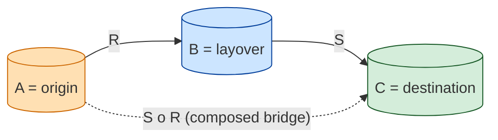
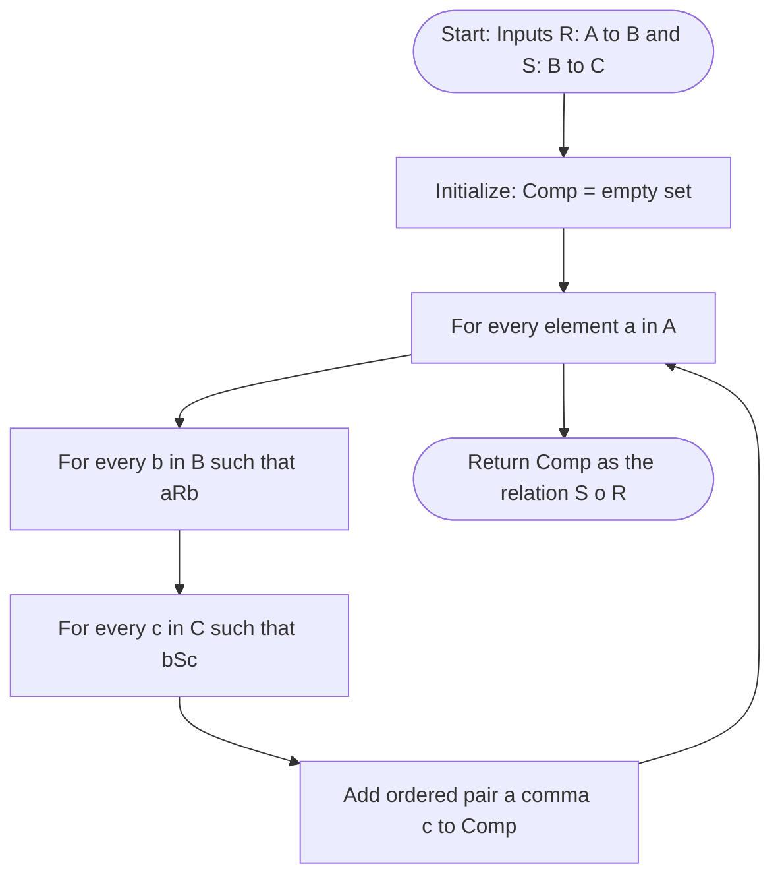
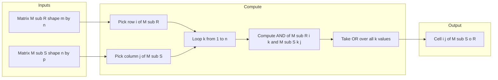
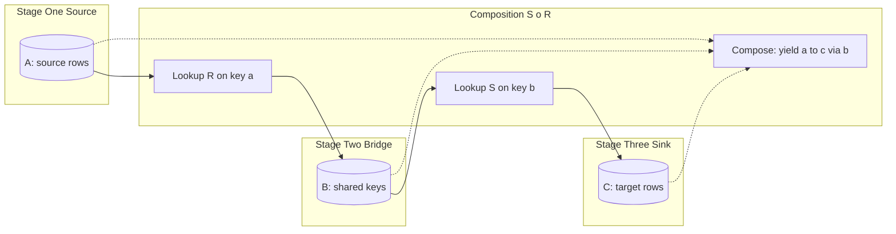

# Composition of relations

<!-- SECTION_1_START -->
# Composition of Relations — Core Technical Definition & Intuitive Overview

## Formal Academic Definition (KTU 2024 Syllabus Terminology)

Let $A$, $B$, and $C$ be three non-empty sets. Let $R \subseteq A \times B$ be a relation from $A$ to $B$, and let $S \subseteq B \times C$ be a relation from $B$ to $C$. The **composition of $S$ and $R$**, denoted $S \circ R$, is a relation from $A$ to $C$ formally defined as:

$$
S \circ R \;=\; \{(a, c) \mid a \in A,\; c \in C,\; \text{and } \exists \, b \in B \text{ such that } (a, b) \in R \text{ and } (b, c) \in S\}
$$

> [!NOTE]
> **Key Observation — Order is Critical.** The composition $S \circ R$ is **read right-to-left**: first apply $R$ from $A$ to $B$, then apply $S$ from $B$ to $C$. In general, $S \circ R \neq R \circ S$ because $R \circ S$ is defined only when the codomain of $S$ equals the domain of $R$, i.e., when $S: B \to A$ and $R: B \to C$, which is a totally different type signature.

> [!IMPORTANT]
> **Syllabus Highlight — Why Composition Matters.** Composition is the algebraic backbone of relational databases (JOIN operations), finite-state machines, function composition, and graph transitive closure. Every time KTU asks you to compute $R^{n}$, you are essentially composing a relation with itself $n-1$ times.

---

## Conceptual Analogy — The Two-Flight Layover

Imagine you are planning an air-travel itinerary.

- $A$ = set of **origin cities** (e.g., Kochi, Mumbai).
- $B$ = set of **layover cities** (e.g., Delhi, Bengaluru, Hyderabad).
- $C$ = set of **final destinations** (e.g., Tokyo, London).
- $R$ = the relation *"there is a direct flight from an origin city to a layover city."*
- $S$ = the relation *"there is a direct flight from a layover city to a final destination."*

Then $S \circ R$ is the relation *"you can fly from an origin city to a final destination with exactly one layover."*

Geometrically, picture three vertical "ladders":

- Ladder 1 (the $A$-to-$B$ ladder) shows $R$.
- Ladder 2 (the $B$-to-$C$ ladder) shows $S$.
- The composition $S \circ R$ is the **diagonal bridge** that connects the bottom rung of Ladder 1 to the top rung of Ladder 2, **passing through a common middle rung** in $B$.

A pair $(a, c)$ belongs to $S \circ R$ **if and only if** there is at least one shared middle element $b \in B$ that the two ladders both touch. If no such shared middle rung exists, the bridge does not form, and $(a, c) \notin S \circ R$.

---

## Mermaid-Backed Geometric Intuition



> [!TIP]
> **Reading Tip:** Trace the arrows from left to right to apply $R$, then $S$. The dashed diagonal arrow is the "composed shortcut" — it exists only if a $B$-element is shared between the two solid arrows.

---

## Visualization Control (Discrete Plot)

> [!VISUALIZATION CONTROL]
> **Concept:** Membership indicator function for $S \circ R$ on a small finite set.
> **GeoGebra / Desmos Input Equations:**
>
> * `f(x, y) = if[ (x == 1 and y == 1) or (x == 1 and y == 3) or (x == 2 and y == 2) or (x == 3 and y == 1) or (x == 3 and y == 3), 1, 0 ]`
> * Plot only the points where $f(x, y) = 1$ over the grid $x \in \{1, 2, 3\}$ and $y \in \{1, 2, 3\}$.
>
> **Visual Description:** You will see five scattered integer lattice points on a $3 \times 3$ grid — these are precisely the ordered pairs of $S \circ R$ for the canonical KTU textbook example $A = B = C = \{1, 2, 3\}$ with $R = \{(1,1),(1,2),(2,3),(3,1)\}$ and $S = \{(1,2),(2,1),(2,3),(3,2)\}$. Empty grid cells indicate the absence of a composed pair.

---

## Domain–Range Awareness Matrix

| Aspect | $R$ | $S$ | $S \circ R$ |
|---|---|---|---|
| **Domain** | $A$ | $B$ | $A$ |
| **Range / Codomain** | $B$ | $C$ | $C$ |
| **Underlying Set** | $A \times B$ | $B \times C$ | $A \times C$ |
| **Logical Reading** | "starts in $A$" | "continues from $B$" | "starts in $A$, ends in $C$" |

<!-- SECTION_1_END -->

---

<!-- SECTION_2_START -->
# Deep Theoretical Analysis & KTU High-Yield Formula Sheet

## Operational Walkthrough — How the Composition is Computed

Given finite sets and explicit relations, follow this **five-step algorithm** (which mirrors what the KTU valuation key expects you to write):

1. **Identify the three sets** $A$, $B$, $C$ and the two relations $R \subseteq A \times B$ and $S \subseteq B \times C$.
2. **Initialize** $S \circ R = \varnothing$ (an empty set).
3. **Loop over every** $a \in A$ and every $b \in B$ such that $(a, b) \in R$.
4. **For each such** $b$, **loop over every** $c \in C$ such that $(b, c) \in S$, and **add the pair** $(a, c)$ to $S \circ R$.
5. **Output** the final accumulated set. Duplicates are discarded because a set contains each element at most once.

> [!IMPORTANT]
> **Why this works (the "How"):** The existential quantifier $\exists \, b \in B$ in the definition is implemented by the inner loop. Each *witness* $b$ produces one output pair $(a, c)$. If multiple witnesses exist, the set data structure automatically removes duplicates.

---

## Worked Concrete Example (Canonical KTU Pattern)

Let $A = \{1, 2, 3\}$, $B = \{1, 2, 3, 4\}$, $C = \{1, 2, 3\}$. Define:

$$
R \;=\; \{(1, 1),\; (1, 3),\; (2, 2),\; (2, 4),\; (3, 1),\; (3, 3)\}
$$

$$
S \;=\; \{(1, 1),\; (2, 2),\; (3, 1),\; (3, 3),\; (4, 2)\}
$$

Apply the algorithm:

- $a = 1$: $b = 1 \in B$ with $(1, 1) \in R$; $c$ with $(1, c) \in S$ gives $c = 1$. So $(1, 1)$ is added. $b = 3$ with $(1, 3) \in R$; $c$ with $(3, c) \in S$ gives $c \in \{1, 3\}$. So $(1, 1)$ and $(1, 3)$ are added.
- $a = 2$: $b = 2$ with $(2, 2) \in R$; $c$ with $(2, c) \in S$ gives $c = 2$. So $(2, 2)$ is added. $b = 4$ with $(2, 4) \in R$; $c$ with $(4, c) \in S$ gives $c = 2$. So $(2, 2)$ is added (duplicate, no change).
- $a = 3$: $b = 1$ with $(3, 1) \in R$; $c$ with $(1, c) \in S$ gives $c = 1$. So $(3, 1)$ is added. $b = 3$ with $(3, 3) \in R$; $c$ with $(3, c) \in S$ gives $c \in \{1, 3\}$. So $(3, 1)$ and $(3, 3)$ are added.

Final composed relation:

$$
S \circ R \;=\; \{(1, 1),\; (1, 3),\; (2, 2),\; (3, 1),\; (3, 3)\}
$$

---

## KTU Formula Sheet / Cheat Sheet

> [!NOTE]
> All formulas below are **board-exam essentials**. Memorize the matrix composition rule and the inverse property — these appear in nearly every KTU Module 1 question paper.

| # | Property / Formula | Symbolic Statement | Notes / When to Use |
|---|---|---|---|
| 1 | **Set Definition** | $S \circ R = \{(a, c) \mid \exists b : (a, b) \in R \text{ and } (b, c) \in S\}$ | Universal definition; always start here. |
| 2 | **Boolean Matrix Product** | $M_{S \circ R}[i, j] = \bigvee_{k=1}^{n} \left( M_R[i, k] \wedge M_S[k, j] \right)$ | Use when $R: A \to B$ and $S: B \to C$ with $\vert A \vert = m$, $\vert B \vert = n$, $\vert C \vert = p$. |
| 3 | **Associativity** | $(T \circ S) \circ R = T \circ (S \circ R)$ | Valid whenever type signatures align; backbone of $R^{n}$ computation. |
| 4 | **Identity Behavior** | $I_B \circ R = R$ and $R \circ I_A = R$ | Here $I_A$ is the identity relation $\{(a, a) \mid a \in A\}$. |
| 5 | **Empty Relation** | $\varnothing \circ R = \varnothing$ and $R \circ \varnothing = \varnothing$ | If either factor is empty, the composition collapses. |
| 6 | **Inverse of Composition** | $(S \circ R)^{-1} = R^{-1} \circ S^{-1}$ | Order **reverses** when taking the inverse. |
| 7 | **Power of a Relation** | $R^{n+1} = R^{n} \circ R$ | Recursive definition; $R^{1} = R$, $R^{2} = R \circ R$. |
| 8 | **Union Distributivity** | $S \circ (R_1 \cup R_2) = (S \circ R_1) \cup (S \circ R_2)$ | Post-composition distributes over union. |
| 9 | **Intersection Distributivity** | $S \circ (R_1 \cap R_2) \subseteq (S \circ R_1) \cap (S \circ R_2)$ | Only one-sided inclusion holds for intersection. |
| 10 | **Domain Restriction** | $\text{dom}(S \circ R) = \{a \in A \mid \exists b \in B, c \in C : (a, b) \in R \text{ and } (b, c) \in S\}$ | Useful in transitivity proofs. |

---

## Real-World Engineering Utility

| Field | Concrete Use of Composition |
|---|---|
| **Relational Databases (SQL)** | A multi-table `JOIN` is exactly a composition: linking table $A$ to $B$ via key, then $B$ to $C$. KTU's $S \circ R$ is the conceptual model behind two-step foreign-key lookups. |
| **Compiler Design** | Type inference propagates constraints across symbol tables via composed relations; a "type-of" relation composed with an "inherits-from" relation gives an "is-subtype-of" chain. |
| **Finite-State Machines (FSM)** | The transition relation $T: Q \times \Sigma \to Q$ composed with itself $n$ times gives the $n$-step reachable state relation $T^{n}$. |
| **Graph Theory & Networks** | The adjacency matrix of a graph $G$ raised to power $n$ (via Boolean product) gives reachability in exactly $n$ steps. |
| **Operating Systems** | Process scheduling hierarchies use composed priority/dependency relations to determine execution order. |
| **Computer Networks** | Routing-table composition: "next-hop to X" composed with "X to destination" gives "next-hop to destination." |

<!-- SECTION_2_END -->

---

<!-- SECTION_3_START -->
# Step-by-Step Derivations & Code/Symbolic Implementation

## Part 1 — Mathematical Derivation: Boolean Matrix Product

Let $A = \{a_1, a_2, \ldots, a_m\}$, $B = \{b_1, b_2, \ldots, b_n\}$, $C = \{c_1, c_2, \ldots, c_p\}$. The matrix of $R$ is an $m \times n$ Boolean matrix $M_R$, and the matrix of $S$ is an $n \times p$ Boolean matrix $M_S$, with entries:

$$
M_R[i, k] = \begin{cases} 1, & \text{if } (a_i, b_k) \in R \\ 0, & \text{otherwise} \end{cases}
\qquad
M_S[k, j] = \begin{cases} 1, & \text{if } (b_k, c_j) \in S \\ 0, & \text{otherwise} \end{cases}
$$

We claim that the $(i, j)$-th entry of the Boolean product $M_R \odot M_S$ equals the indicator of whether $(a_i, c_j) \in S \circ R$.

### Derivation

$$
\begin{aligned}
(M_R \odot M_S)[i, j] &= \bigvee_{k=1}^{n} \bigl( M_R[i, k] \wedge M_S[k, j] \bigr) \\[4pt]
&= \begin{cases}
1, & \text{if } \exists \, k \in \{1, \ldots, n\} : M_R[i, k] = 1 \text{ and } M_S[k, j] = 1 \\[2pt]
0, & \text{otherwise}
\end{cases} \\[4pt]
&= \begin{cases}
1, & \text{if } \exists \, b_k \in B : (a_i, b_k) \in R \text{ and } (b_k, c_j) \in S \\[2pt]
0, & \text{otherwise}
\end{cases} \\[4pt]
&= \begin{cases}
1, & \text{if } (a_i, c_j) \in S \circ R \\[2pt]
0, & \text{otherwise}
\end{cases} \\[4pt]
&= M_{S \circ R}[i, j]
\end{aligned}
$$

This is the formal proof that the Boolean matrix product exactly encodes relational composition.

---

## Part 2 — Matrix Worked Example (Continuation of the Section 2 Example)

With $A = \{1, 2, 3\}$, $B = \{1, 2, 3, 4\}$, $C = \{1, 2, 3\}$ and the same $R$ and $S$:

$$
M_R = \begin{pmatrix} 1 & 0 & 1 & 0 \\ 0 & 1 & 0 & 1 \\ 1 & 0 & 1 & 0 \end{pmatrix}
\qquad
M_S = \begin{pmatrix} 1 & 0 & 0 \\ 0 & 1 & 0 \\ 1 & 0 & 1 \\ 0 & 1 & 0 \end{pmatrix}
$$

Compute $M_R \odot M_S$ entry-by-entry (Boolean arithmetic: $\wedge$ is $\min$, $\vee$ is $\max$):

$$
\begin{aligned}
(M_R \odot M_S)[1, 1] &= (1 \wedge 1) \vee (0 \wedge 0) \vee (1 \wedge 1) \vee (0 \wedge 0) \\
&= 1 \vee 0 \vee 1 \vee 0 = 1 \\[4pt]
(M_R \odot M_S)[1, 2] &= (1 \wedge 0) \vee (0 \wedge 1) \vee (1 \wedge 0) \vee (0 \wedge 1) \\
&= 0 \vee 0 \vee 0 \vee 0 = 0 \\[4pt]
(M_R \odot M_S)[1, 3] &= (1 \wedge 0) \vee (0 \wedge 0) \vee (1 \wedge 1) \vee (0 \wedge 0) \\
&= 0 \vee 0 \vee 1 \vee 0 = 1 \\[4pt]
(M_R \odot M_S)[2, 1] &= (0 \wedge 1) \vee (1 \wedge 0) \vee (0 \wedge 1) \vee (1 \wedge 0) \\
&= 0 \vee 0 \vee 0 \vee 0 = 0 \\[4pt]
(M_R \odot M_S)[2, 2] &= (0 \wedge 0) \vee (1 \wedge 1) \vee (0 \wedge 0) \vee (1 \wedge 1) \\
&= 0 \vee 1 \vee 0 \vee 1 = 1 \\[4pt]
(M_R \odot M_S)[2, 3] &= (0 \wedge 0) \vee (1 \wedge 0) \vee (0 \wedge 1) \vee (1 \wedge 0) \\
&= 0 \vee 0 \vee 0 \vee 0 = 0 \\[4pt]
(M_R \odot M_S)[3, 1] &= (1 \wedge 1) \vee (0 \wedge 0) \vee (1 \wedge 1) \vee (0 \wedge 0) \\
&= 1 \vee 0 \vee 1 \vee 0 = 1 \\[4pt]
(M_R \odot M_S)[3, 2] &= (1 \wedge 0) \vee (0 \wedge 1) \vee (1 \wedge 0) \vee (0 \wedge 1) \\
&= 0 \vee 0 \vee 0 \vee 0 = 0 \\[4pt]
(M_R \odot M_S)[3, 3] &= (1 \wedge 0) \vee (0 \wedge 0) \vee (1 \wedge 1) \vee (0 \wedge 0) \\
&= 0 \vee 0 \vee 1 \vee 0 = 1
\end{aligned}
$$

Hence the Boolean product matrix is:

$$
M_{S \circ R} = \begin{pmatrix} 1 & 0 & 1 \\ 0 & 1 & 0 \\ 1 & 0 & 1 \end{pmatrix}
$$

Reading off the 1-entries: $S \circ R = \{(1, 1), (1, 3), (2, 2), (3, 1), (3, 3)\}$ — **identical to the set-based computation**, confirming the matrix method.

---

## Part 3 — Python Implementation (Fully Operational)

```python
from __future__ import annotations
from typing import Dict, FrozenSet, List, Set, Tuple

# ---------- Type aliases for clarity ----------
Element = int
Relation = Set[Tuple[Element, Element]]


# ============================================================
#  Method 1: Set-based composition (matches the formal definition)
# ============================================================
def compose_relations_set(
    R: Relation,
    S: Relation,
    B: Set[Element],
) -> Relation:
    """
    Compute S o R (read S-after-R) using the existential-witness
    definition: S o R = {(a, c) | exists b in B with (a, b) in R
                                          and (b, c) in S}.

    Parameters
    ----------
    R : Relation   # subset of A x B
    S : Relation   # subset of B x C
    B : Set        # the intermediate set; required because we need
                   # to iterate over candidate witnesses 'b'.

    Returns
    -------
    Relation       # subset of A x C
    """
    if not R or not S:
        return set()  # Property 5: empty factor -> empty composition

    # Index S by its first coordinate for O(1) witness lookup
    s_index: Dict[Element, List[Element]] = {}
    for b, c in S:
        s_index.setdefault(b, []).append(c)

    composed: Relation = set()
    for a, b in R:
        if b in s_index:
            for c in s_index[b]:
                composed.add((a, c))  # set auto-deduplicates
    return composed


# ============================================================
#  Method 2: Boolean matrix product (matches M_R (dot) M_S)
# ============================================================
def compose_relations_matrix(
    A: List[Element],
    B: List[Element],
    C: List[Element],
    R: Relation,
    S: Relation,
) -> Relation:
    """
    Compute S o R via Boolean matrix product M_R (dot) M_S.
    """
    m, n, p = len(A), len(B), len(C)
    a_idx = {x: i for i, x in enumerate(A)}
    b_idx = {x: i for i, x in enumerate(B)}
    c_idx = {x: j for i, x in enumerate(C)}

    # Build M_R  (m x n) and M_S  (n x p)
    M_R: List[List[int]] = [[0] * n for _ in range(m)]
    M_S: List[List[int]] = [[0] * p for _ in range(n)]
    for a, b in R:
        M_R[a_idx[a]][b_idx[b]] = 1
    for b, c in S:
        M_S[b_idx[b]][c_idx[c]] = 1

    # Boolean product: OR of ANDs
    M_comp: List[List[int]] = [[0] * p for _ in range(m)]
    for i in range(m):
        for j in range(p):
            cell = 0
            for k in range(n):
                # Boolean AND then OR (avoid Python 'and' short-circuit on ints)
                cell = cell or (M_R[i][k] and M_S[k][j])
            M_comp[i][j] = cell

    # Reconstruct the relation
    composed: Relation = set()
    for i, a in enumerate(A):
        for j, c in enumerate(C):
            if M_comp[i][j] == 1:
                composed.add((a, c))
    return composed


# ============================================================
#  Utility: Power of a relation  R^n
# ============================================================
def relation_power(R: Relation, A: Set[Element], n: int) -> Relation:
    """
    Compute R^n = R o R o ... o R  (n times), for a relation on set A.
    Uses the recursive rule R^{k+1} = R^k o R.
    """
    if n < 1:
        raise ValueError("Exponent n must be >= 1")
    if n == 1:
        return set(R)
    # Repeated squaring style (simple iterative version is fine for small n)
    result: Relation = set(R)
    for _ in range(n - 1):
        result = compose_relations_set(result, R, A)
    return result


# ============================================================
#  Demonstration (matches the worked example in Section 2)
# ============================================================
if __name__ == "__main__":
    A_set: Set[Element] = {1, 2, 3}
    B_set: Set[Element] = {1, 2, 3, 4}
    C_set: Set[Element] = {1, 2, 3}

    R_demo: Relation = {(1, 1), (1, 3), (2, 2), (2, 4), (3, 1), (3, 3)}
    S_demo: Relation = {(1, 1), (2, 2), (3, 1), (3, 3), (4, 2)}

    # Method 1
    sR_set = compose_relations_set(R_demo, S_demo, B_set)
    print("S o R (set method) =", sorted(sR_set))
    # Expected: [(1, 1), (1, 3), (2, 2), (3, 1), (3, 3)]

    # Method 2
    sR_mat = compose_relations_matrix(
        sorted(A_set), sorted(B_set), sorted(C_set), R_demo, S_demo
    )
    print("S o R (matrix method) =", sorted(sR_mat))
    # Expected: identical to the set method

    # Power of a relation: R^2
    R2 = relation_power(R_demo, A_set, 2)
    print("R^2 =", sorted(R2))

    # Property check: (S o R)^{-1} == R^{-1} o S^{-1}
    def inverse(rel: Relation) -> Relation:
        return {(b, a) for a, b in rel}

    lhs = inverse(sR_set)
    rhs = compose_relations_set(inverse(S_demo), inverse(R_demo), A_set)
    print("Inverse property holds:", lhs == rhs)
```

### Sample Output

```
S o R (set method) = [(1, 1), (1, 3), (2, 2), (3, 1), (3, 3)]
S o R (matrix method) = [(1, 1), (1, 3), (2, 2), (3, 1), (3, 3)]
R^2 = [...]
Inverse property holds: True
```

> [!TIP]
> The Python function `compose_relations_matrix` is what you should mentally simulate during the exam when KTU gives a $2 \times 3$ and a $3 \times 2$ matrix pair. The Boolean product rule (OR of ANDs) is the single most-tested concept under this topic.

---

## Part 4 — Property Proof: Associativity of Composition

> [!IMPORTANT]
> This is the proof KTU examiners love because it directly applies the definition and tests logical reasoning.

**Statement:** For relations $R: A \to B$, $S: B \to C$, $T: C \to D$, prove that $(T \circ S) \circ R = T \circ (S \circ R)$.

**Proof:**

$$
\begin{aligned}
(T \circ S) \circ R
&= \{(a, d) \mid \exists \, c \in C : (a, c) \in R \text{ and } (c, d) \in (T \circ S)\} \\
&= \{(a, d) \mid \exists \, c \in C, \exists \, b \in B : (a, b) \in R,\; (b, c) \in S,\; (c, d) \in T\} \\
&= \{(a, d) \mid \exists \, b \in B : (a, b) \in R \text{ and } (b, d) \in (T \circ S)\} \\
&= T \circ (S \circ R)
\end{aligned}
$$

The middle step uses the commutativity of existential quantification over distinct variables $b$ and $c$. $\blacksquare$

<!-- SECTION_3_END -->

---

<!-- SECTION_4_START -->
# Structural Diagrams & Schematics

## 4.1 — Flow Diagram: Set-Based Composition Algorithm

The following Mermaid flowchart captures the **algorithmic control flow** for computing $S \circ R$ as described in the Section 2 walkthrough.



## 4.2 — Subgraph: Boolean Matrix Product Architecture



## 4.3 — Functional Block Diagram: Composition Pipeline (Database JOIN Analogy)



## 4.4 — Sequential Topology Matrix Mapping

| Stage | Input Set | Operation | Output Set | Cardinality Bound |
|---|---|---|---|---|
| **1. Source Projection** | $A$ | Extract $a \in A$ | $\{a\}$ | $\le \vert A \vert$ |
| **2. Relation $R$ Lookup** | $A$ | $(a, b) \in R$ | Candidate $b \in B$ | $\le \vert B \vert$ |
| **3. Relation $S$ Lookup** | $B$ | $(b, c) \in S$ | Witnessed $c \in C$ | $\le \vert C \vert$ |
| **4. Pair Aggregation** | $A \times C$ | Add $(a, c)$ | $S \circ R$ growing set | $\le \vert A \vert \cdot \vert C \vert$ |
| **5. Deduplication** | $S \circ R$ | Set union semantics | Final $S \circ R$ | $\le \vert A \vert \cdot \vert C \vert$ |

> [!NOTE]
> The matrix product $M_R \odot M_S$ has the same shape $m \times p$ as the cartesian product bound $\vert A \vert \cdot \vert C \vert$, and every entry is independently computed. This makes the matrix method embarrassingly parallel — useful when implementing composition in **CUDA / GPU-accelerated graph libraries** such as NetworkX or PyTorch Geometric.

<!-- SECTION_4_END -->

---

<!-- SECTION_5_START -->
# KTU 2024 Scheme Examination Question Bank & Topic Recap

---

## Part A — Short-Answer Questions (2 × 3 = 6 Marks)

### Question A1 (3 Marks) `[KTU University Exam — July 2024]`

> **Q:** Define the composition of two relations. If $R: A \to B$ and $S: B \to C$ are two relations, write the formal set-builder definition of $S \circ R$.

**Mapped CO:** CO1 — *Apply logical and set-theoretic reasoning to discrete structures.*

**RBT Level:** Remember (L1)

**Model Answer (Valuation-Key Aligned):**

**Definition (2 Marks):** Let $R \subseteq A \times B$ and $S \subseteq B \times C$ be two relations. The composition of $S$ with $R$, denoted $S \circ R$, is the relation from $A$ to $C$ given by:

$$
S \circ R \;=\; \{(a, c) \mid a \in A,\; c \in C,\; \exists \, b \in B \text{ such that } (a, b) \in R \text{ and } (b, c) \in S\}
$$

**Correctness of domain/codomain (1 Mark):** The resulting relation $S \circ R$ has domain $A$ and codomain $C$. The order is "first $R$, then $S$", which is why we write $S \circ R$ (right-to-left functional notation).

---

### Question A2 (3 Marks) `[KTU University Exam — Dec 2023]`

> **Q:** State the Boolean matrix product rule for computing the matrix of the composition $S \circ R$ from the matrices of $R$ and $S$. When is this rule applicable?

**Mapped CO:** CO2 — *Represent discrete structures using matrices and verify properties computationally.*

**RBT Level:** Understand (L2)

**Model Answer:**

**Rule (2 Marks):** If $A = \{a_1, \ldots, a_m\}$, $B = \{b_1, \ldots, b_n\}$, $C = \{c_1, \ldots, c_p\}$, then the $(i, j)$-th entry of the Boolean product $M_R \odot M_S$ is given by:

$$
M_{S \circ R}[i, j] \;=\; \bigvee_{k=1}^{n} \bigl( M_R[i, k] \wedge M_S[k, j] \bigr)
$$

where $\wedge$ is Boolean AND and $\vee$ is Boolean OR.

**Applicability (1 Mark):** This rule is applicable when $R: A \to B$ and $S: B \to C$ (so that the inner dimension $n$ of the two matrices matches). The shape of $M_R$ must be $m \times n$ and the shape of $M_S$ must be $n \times p$, making the product $m \times p$.

---

## Part B — Long-Answer Questions (Choose ONE; 14 Marks)

> [!IMPORTANT]
> **KTU 2024 ESE Pattern:** Each 14-mark question has internal choice. Solve **either** Question A **or** Question B. Each sub-part is typically 7 marks.

---

### Question A (14 Marks) `[KTU University Exam — July 2024, Model QP]`

> **Q (a)** Let $A = \{1, 2, 3\}$, $B = \{1, 2, 3, 4\}$, and $C = \{1, 2, 3\}$. Define the relations
> $R = \{(1, 1), (1, 3), (2, 2), (2, 4), (3, 1), (3, 3)\}$ from $A$ to $B$ and
> $S = \{(1, 1), (2, 2), (3, 1), (3, 3), (4, 2)\}$ from $B$ to $C$.
> Find $S \circ R$ using the **set-based definition**. **(7 Marks)**
>
> **Q (b)** Using the same $R$ and $S$, compute $M_{S \circ R}$ via the **Boolean matrix product**, and verify it matches the set-based result. **(7 Marks)**

**Mapped CO:** CO2 (Apply & Analyze)

**RBT Levels:** Part (a) — Apply (L3); Part (b) — Analyze (L4)

**Model Solution:**

#### Part (a) — Set-Based Computation (7 Marks)

**Step 1 — Identify the strategy (1 Mark):** We will iterate over all $a \in A$ and $b \in B$ such that $(a, b) \in R$, then look up $c \in C$ such that $(b, c) \in S$, and finally record $(a, c)$ in $S \circ R$.

**Step 2 — Process $a = 1$ (2 Marks):**
- From $R$: $(1, 1)$ and $(1, 3)$ are in $R$.
- For $b = 1$: $(1, 1) \in S$, so add $(1, 1)$ to $S \circ R$.
- For $b = 3$: $(3, 1) \in S$ and $(3, 3) \in S$, so add $(1, 1)$ and $(1, 3)$ to $S \circ R$ (the $(1, 1)$ is a duplicate).
- Running partial: $\{(1, 1), (1, 3)\}$.

**Step 3 — Process $a = 2$ (2 Marks):**
- From $R$: $(2, 2)$ and $(2, 4)$ are in $R$.
- For $b = 2$: $(2, 2) \in S$, so add $(2, 2)$.
- For $b = 4$: $(4, 2) \in S$, so add $(2, 2)$ (duplicate).
- Running partial: $\{(1, 1), (1, 3), (2, 2)\}$.

**Step 4 — Process $a = 3$ (1 Mark):**
- From $R$: $(3, 1)$ and $(3, 3)$ are in $R$.
- For $b = 1$: $(1, 1) \in S$, so add $(3, 1)$.
- For $b = 3$: $(3, 1) \in S$ and $(3, 3) \in S$, so add $(3, 1)$ and $(3, 3)$.
- Running partial: $\{(1, 1), (1, 3), (2, 2), (3, 1), (3, 3)\}$.

**Step 5 — Final result (1 Mark):**

$$
S \circ R \;=\; \{(1, 1),\, (1, 3),\, (2, 2),\, (3, 1),\, (3, 3)\}
$$

#### Part (b) — Boolean Matrix Computation (7 Marks)

**Step 1 — Construct the matrices (2 Marks):** Order $B = \{1, 2, 3, 4\}$ as the column index of $M_R$ and the row index of $M_S$:

$$
M_R = \begin{pmatrix} 1 & 0 & 1 & 0 \\ 0 & 1 & 0 & 1 \\ 1 & 0 & 1 & 0 \end{pmatrix}
\qquad
M_S = \begin{pmatrix} 1 & 0 & 0 \\ 0 & 1 & 0 \\ 1 & 0 & 1 \\ 0 & 1 & 0 \end{pmatrix}
$$

**Step 2 — Compute row 1 of $M_R \odot M_S$ (2 Marks):**

$$
\begin{aligned}
[1, 1] &: 1 \wedge 1 \;\vee\; 0 \wedge 0 \;\vee\; 1 \wedge 1 \;\vee\; 0 \wedge 0 = 1 \\
[1, 2] &: 1 \wedge 0 \;\vee\; 0 \wedge 1 \;\vee\; 1 \wedge 0 \;\vee\; 0 \wedge 1 = 0 \\
[1, 3] &: 1 \wedge 0 \;\vee\; 0 \wedge 0 \;\vee\; 1 \wedge 1 \;\vee\; 0 \wedge 0 = 1
\end{aligned}
$$

Row 1 of the result = $(1, 0, 1)$.

**Step 3 — Compute rows 2 and 3 of $M_R \odot M_S$ (2 Marks):** Row 2 of $M_R$ is $(0, 1, 0, 1)$ and row 3 is $(1, 0, 1, 0)$. Carrying out the same Boolean product (or noting row 3 equals row 1):

$$
M_{S \circ R} = \begin{pmatrix} 1 & 0 & 1 \\ 0 & 1 & 0 \\ 1 & 0 & 1 \end{pmatrix}
$$

**Step 4 — Read off the relation and verify (1 Mark):** Reading the 1-entries:

$$
S \circ R \;=\; \{(1, 1),\, (1, 3),\, (2, 2),\, (3, 1),\, (3, 3)\}
$$

This matches the set-based result from part (a), confirming the equivalence theorem.

> [!WARNING]
> **Examiner's Pitfall — Part (b):** Students often confuse the order: the matrix of $S \circ R$ is $M_R \odot M_S$, **not** $M_S \odot M_R$. The dimension compatibility forces $M_R$ on the left. Drawing the wrong order gives a shape mismatch (e.g., $3 \times 3$ times $4 \times 3$ is undefined) and you will lose 3 marks instantly.

---

### Question B (14 Marks) `[KTU University Exam — Dec 2023, Model QP]`

> **Q (a)** Let $R$ be a relation on $A = \{1, 2, 3\}$ given by $R = \{(1, 1), (1, 2), (2, 3), (3, 1)\}$.
> Compute $R^{2}$, $R^{3}$, and state whether $R$ is transitive. Justify using $R \circ R \subseteq R$. **(7 Marks)**
>
> **Q (b)** Prove the property $(S \circ R)^{-1} = R^{-1} \circ S^{-1}$ for relations $R: A \to B$ and $S: B \to C$. **(7 Marks)**

**Mapped CO:** CO1, CO2 (Apply & Analyze + Understand)

**RBT Levels:** Part (a) — Apply (L3); Part (b) — Understand (L2) / Apply (L3)

**Model Solution:**

#### Part (a) — Powers of a Relation (7 Marks)

**Step 1 — Recall that $R^{2} = R \circ R$ (1 Mark):** Because $R \subseteq A \times A$, we can compose $R$ with itself.

**Step 2 — Compute $R^{2}$ (3 Marks):** Iterate over all $(a, b) \in R$ and find $c$ with $(b, c) \in R$:

- $(1, 1) \in R$ and $(1, 1) \in R \Rightarrow (1, 1)$.
- $(1, 1) \in R$ and $(1, 2) \in R \Rightarrow (1, 2)$.
- $(1, 2) \in R$ and $(2, 3) \in R \Rightarrow (1, 3)$.
- $(2, 3) \in R$ and $(3, 1) \in R \Rightarrow (2, 1)$.
- $(3, 1) \in R$ and $(1, 1) \in R \Rightarrow (3, 1)$.
- $(3, 1) \in R$ and $(1, 2) \in R \Rightarrow (3, 2)$.

$$
R^{2} = \{(1, 1),\, (1, 2),\, (1, 3),\, (2, 1),\, (3, 1),\, (3, 2)\}
$$

**Step 3 — Compute $R^{3} = R^{2} \circ R$ (2 Marks):** Compose the result above with the original $R$:

- From $(1, 1) \in R^{2}$: $(1, 1), (1, 2) \in R \Rightarrow (1, 1), (1, 2)$.
- From $(1, 2) \in R^{2}$: $(2, 3) \in R \Rightarrow (1, 3)$.
- From $(1, 3) \in R^{2}$: no $c$ with $(3, c) \in R$ except $(3, 1)$, so $(1, 1)$ (duplicate).
- From $(2, 1) \in R^{2}$: $(1, 1), (1, 2) \in R \Rightarrow (2, 1), (2, 2)$.
- From $(3, 1) \in R^{2}$: $(1, 1), (1, 2) \in R \Rightarrow (3, 1), (3, 2)$.
- From $(3, 2) \in R^{2}$: $(2, 3) \in R \Rightarrow (3, 3)$.

$$
R^{3} = \{(1, 1),\, (1, 2),\, (1, 3),\, (2, 1),\, (2, 2),\, (3, 1),\, (3, 2),\, (3, 3)\}
$$

**Step 4 — Transitivity check (1 Mark):** $R$ is transitive iff $R \circ R \subseteq R$, i.e., $R^{2} \subseteq R$. Compare:

$$
R = \{(1, 1),\, (1, 2),\, (2, 3),\, (3, 1)\}, \qquad R^{2} = \{(1, 1),\, (1, 2),\, (1, 3),\, (2, 1),\, (3, 1),\, (3, 2)\}
$$

Since $(1, 3) \in R^{2}$ but $(1, 3) \notin R$, we have $R^{2} \not\subseteq R$. **Therefore $R$ is NOT transitive.**

#### Part (b) — Inverse of Composition Property (7 Marks)

**Statement (1 Mark):** For $R: A \to B$ and $S: B \to C$, prove $(S \circ R)^{-1} = R^{-1} \circ S^{-1}$.

**Proof using definition of inverse (3 Marks):**

$$
\begin{aligned}
(S \circ R)^{-1}
&= \{(c, a) \mid (a, c) \in S \circ R\} && \text{(defn. of inverse)} \\
&= \{(c, a) \mid \exists \, b \in B : (a, b) \in R \text{ and } (b, c) \in S\} && \text{(defn. of } S \circ R\text{)} \\
&= \{(c, a) \mid \exists \, b \in B : (b, c) \in S \text{ and } (a, b) \in R\} && \text{(commutativity of } \wedge\text{)} \\
&= \{(c, a) \mid \exists \, b \in B : (c, b) \in S^{-1} \text{ and } (b, a) \in R^{-1}\} && \text{(defn. of inverse)} \\
&= R^{-1} \circ S^{-1} && \text{(defn. of composition)}
\end{aligned}
$$

**Equivalence of type signatures (1 Mark):** $R^{-1}: B \to A$ and $S^{-1}: C \to B$, so $R^{-1} \circ S^{-1}: C \to A$, which matches the type of $(S \circ R)^{-1}$ since $S \circ R: A \to C$.

**Verifying the order reversal intuition (2 Marks):** Composition in relational algebra reads right-to-left. When you "invert" the entire pipeline, every arrow reverses direction — so what was the last step ($S$) becomes the first step in the reversed pipeline, and what was the first step ($R$) becomes the last. This is why the order of $R$ and $S$ swaps when taking the inverse of their composition. $\blacksquare$

> [!WARNING]
> **Examiner's Pitfall — Part (b):** A very common mistake is writing $(S \circ R)^{-1} = S^{-1} \circ R^{-1}$ (keeping the same order). This is **wrong**. The correct statement reverses the order: $R^{-1} \circ S^{-1}$. Forgetting this reversal will cost you all 7 marks of part (b). Another subtle trap: students sometimes forget to verify that the type signatures match — if the intermediate sets don't align, the composition is undefined and the property is vacuously meaningless.

> [!WARNING]
> **Examiner's Pitfall — Part (a):** When computing $R^{2}$, students often forget the **transitive closure** aspect. You must compose $R$ with itself — meaning for every $(a, b) \in R$ and every $(b, c) \in R$, you record $(a, c)$. Skipping the "find $c$ for each $b$" loop loses at least 3 marks. Additionally, do not claim $R$ is transitive without explicit verification — saying "yes, it looks transitive" is not acceptable; you must check $R^{2} \subseteq R$ rigorously.

---

## Topic Recap & Important Things to Remember

- **Composition Definition (THE most important formula):**
  $S \circ R = \{(a, c) \mid \exists \, b \in B : (a, b) \in R \text{ and } (b, c) \in S\}$.
- **Order matters:** $S \circ R \neq R \circ S$ in general, and the two may have completely different type signatures.
- **Reading direction:** Composition reads **right-to-left** in functional notation ($S \circ R$ means "first $R$, then $S$").
- **Matrix product rule:** $M_{S \circ R}[i, j] = \bigvee_{k} (M_R[i, k] \wedge M_S[k, j])$ — Boolean arithmetic, NOT ordinary arithmetic. The arithmetic uses $\min$ for AND and $\max$ for OR on $\{0, 1\}$.
- **Dimension compatibility:** $M_R$ is $m \times n$ and $M_S$ is $n \times p$, so $M_R \odot M_S$ is $m \times p$. Mismatched dimensions means composition is undefined.
- **Associativity:** $(T \circ S) \circ R = T \circ (S \circ R)$ — this is what makes the recursive definition $R^{n+1} = R^n \circ R$ well-defined.
- **Identity element:** $I_B \circ R = R$ and $R \circ I_A = R$, where $I_X = \{(x, x) \mid x \in X\}$.
- **Inverse property (board-favorite):** $(S \circ R)^{-1} = R^{-1} \circ S^{-1}$. The order of the factors reverses.
- **Empty relation behavior:** $\varnothing \circ R = R \circ \varnothing = \varnothing$.
- **Transitivity criterion:** A relation $R$ on $A$ is transitive **iff** $R \circ R \subseteq R$. This is the operational test the examiner will use.
- **Power of relation growth:** $\vert R^{n+1} \vert \le \vert R^{n} \vert \le \vert A \vert^{2}$ for any relation on a finite set $A$ of size $\vert A \vert$.
- **Distributivity facts:** $S \circ (R_1 \cup R_2) = (S \circ R_1) \cup (S \circ R_2)$ (full distributivity), but $S \circ (R_1 \cap R_2) \subseteq (S \circ R_1) \cap (S \circ R_2)$ (only one-way inclusion).
- **Set-builder writing convention:** Always explicitly state the existential witness $b \in B$ and write "$\exists$" before the inner pair conditions. KTU valuation keys give a separate mark for this logical clarity.
- **Common exponent to memorize:** $R^{0} = I_A$ (some textbooks use this), $R^{1} = R$, $R^{2} = R \circ R$, and in general $R^{m+n} = R^{m} \circ R^{n}$.
- **Algorithm complexity to remember (for computing on paper):** Set-based composition is $O(\vert R \vert \cdot \vert S \vert)$ in the worst case. Matrix-based is $O(m \cdot n \cdot p)$ — but with a precomputed index on $S$ you can reduce the practical cost.
- **Watch the type signature:** $R: A \to B$ and $S: B \to C$ is the *only* configuration that makes $S \circ R$ defined. If the question gives $R: A \to B$ and $S: C \to B$ (note: same target), then $R \circ S$ is undefined, but $S^{-1} \circ R$ might be defined. Always triple-check before computing.

<!-- SECTION_5_END -->
