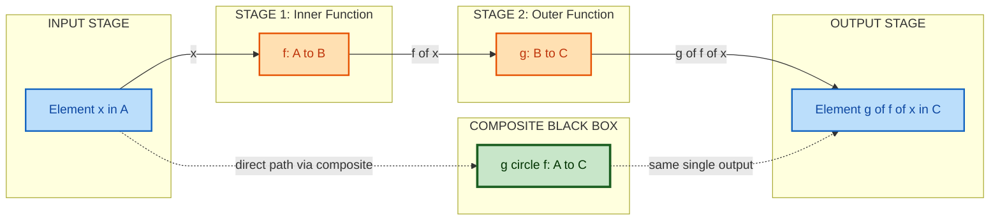
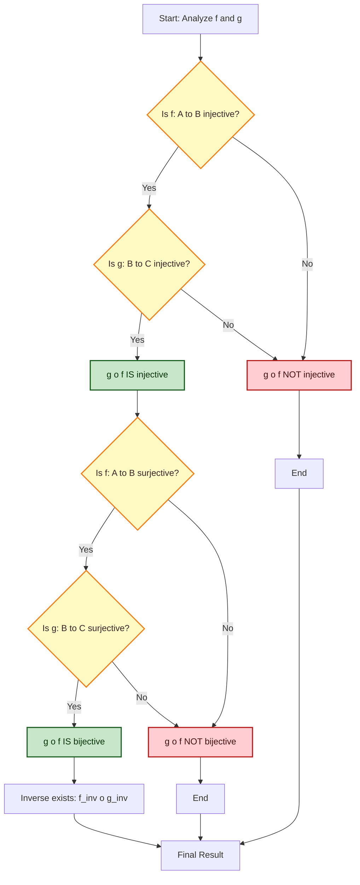
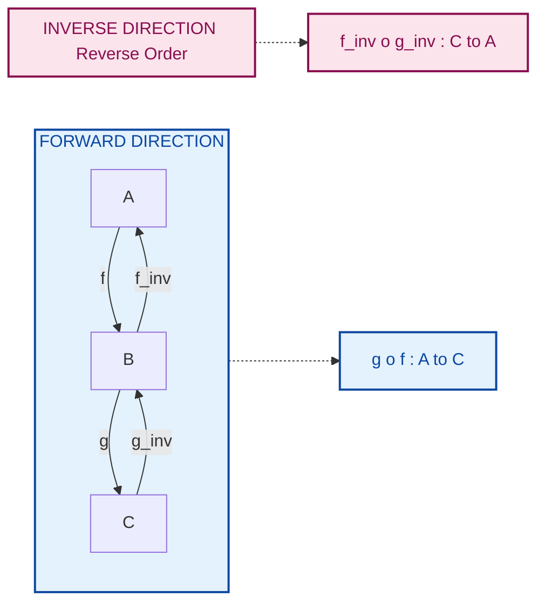

# Compositions of Functions

<!-- SECTION_1_START -->
# Compositions of Functions — Core Definition & Intuitive Overview

> [!NOTE]
> **KTU 2024 Scheme | Course:** Discrete Mathematics (PCCST205)
> **Module:** 1 — Sets and Subsets
> **Topic:** Compositions of Functions
> **Cognitive Anchor:** Builds directly upon *Relations and Functions* (Module 1 precursor concepts) and is a foundational pre-requisite for *Lattices*, *Boolean Algebra*, and *Group Theory* in higher semesters.

## 1.1 Formal Academic Definition

Let $f: A \rightarrow B$ and $g: B \rightarrow C$ be two functions. The **composition of $g$ with $f$**, denoted by $g \circ f$, is a new function $g \circ f : A \rightarrow C$ defined explicitly by the rule:

$$(g \circ f)(x) = g(f(x)) \quad \text{for every } x \in A$$

For the composition $g \circ f$ to be **well-defined**, the following boundary condition is **strictly mandatory**:

$$\text{Range}(f) \subseteq \text{Domain}(g) \quad \Longleftrightarrow \quad B_1 \subseteq B$$

> [!IMPORTANT]
> **Critical KTU Rule:** Read the composition $g \circ f$ from **right to left**. The function on the **right** ($f$) is **executed first**, and its output is then fed into the function on the **left** ($g$). In programming analogy, $g \circ f$ corresponds to `g(f(x))`.

The *domain* of the resulting composite function is precisely the domain of the rightmost function, while the *codomain* of the composite function is the codomain of the leftmost function. Formally:

$$\text{Dom}(g \circ f) = \text{Dom}(f) = A$$
$$\text{Cod}(g \circ f) = \text{Cod}(g) = C$$
$$\text{Range}(g \circ f) \subseteq \text{Cod}(g) = C$$

## 1.2 Intuitive Real-World Analogy

Imagine a **two-stage industrial assembly line** in a manufacturing plant:

- **Machine $f$ (Stage 1):** Takes raw material (say, raw dough) and outputs an intermediate product (a baked biscuit). The input bin of Machine $f$ is set $A$, and its output bin is set $B$.
- **Machine $g$ (Stage 2):** Takes the intermediate product (biscuit) and packs it into a box. Its input bin is set $B$, and its output bin is set $C$.

The **composed machine** $g \circ f$ represents the **entire assembly line as one giant black box**. You drop raw dough into the front (input from set $A$), and a packed box comes out the back (output in set $C$). The intermediate product (the biscuit) is only **visible internally** — it is *never* exposed to the outside operator.

> [!TIP]
> **Geometric Intuition (Mapping Diagram):** On a mapping arrow diagram, $f$ draws arrows from $A$ to $B$, and $g$ draws arrows from $B$ to $C$. The composite $g \circ f$ simply *concatenates* the arrow paths — you follow an $f$-arrow first, then a $g$-arrow — resulting in a single direct arrow from $A$ to $C$.

## 1.3 Visual Representation via Mapping Diagram

Consider $A = \{1, 2, 3\}$, $B = \{a, b, c, d\}$, $C = \{x, y, z\}$ with:

$$f(1) = a, \quad f(2) = c, \quad f(3) = b$$
$$g(a) = x, \quad g(b) = y, \quad g(c) = z, \quad g(d) = z$$

The composite $g \circ f$ is computed by tracing each element of $A$ through $f$ and then through $g$:

$$(g \circ f)(1) = g(f(1)) = g(a) = x$$
$$(g \circ f)(2) = g(f(2)) = g(c) = z$$
$$(g \circ f)(3) = g(f(3)) = g(b) = y$$

Therefore, $g \circ f = \{(1, x), (2, z), (3, y)\}$.

> [!VISUALIZATION CONTROL]
> **Concept:** Mapping Diagram of Composite Function
> **GeoGebra / Desmos Input Equations:**
> * Set $A$ points: $A_1 = (1, 0), \ A_2 = (2, 0), \ A_3 = (3, 0)$
> * Set $B$ points: $B_1 = (1.5, 1), \ B_2 = (2.5, 1), \ B_3 = (3.5, 1)$
> * Set $C$ points: $C_1 = (2, 2), \ C_2 = (3, 2), \ C_3 = (4, 2)$
> * Arrows: $A_1 \to B_1$, $A_2 \to B_3$, $A_3 \to B_2$ (for $f$)
> * Arrows: $B_1 \to C_1$, $B_2 \to C_2$, $B_3 \to C_3$ (for $g$)
> **Visual Description:** Two stacked rows of dots with arrows cascading from row $A$ to row $B$, then from row $B$ to row $C$. The composite $g \circ f$ is visually represented by skipping the middle row entirely and drawing direct arrows from row $A$ to row $C$.

## 1.4 Why Composition Requires a Compatibility Bridge

The "input bin" of the second machine must accept whatever the "output bin" of the first machine produces. This translates mathematically to:

$$f(A) \subseteq B \quad \text{(i.e., the range of } f \text{ must lie inside the domain of } g\text{)}$$

If even a single element of $A$ is mapped by $f$ to a value outside the domain of $g$, the composition **collapses** — that input has no defined output in the composed function.

<!-- SECTION_1_END -->

<!-- SECTION_2_START -->
# Compositions of Functions — Deep Theoretical Analysis

## 2.1 The "Chain" Perspective

Think of composition as **chaining** functions. If we have $n$ functions $f_1, f_2, \ldots, f_n$ where the range of each is contained in the domain of the next, then we can form the *n-fold composition*:

$$f_n \circ f_{n-1} \circ \cdots \circ f_2 \circ f_1 : A_1 \rightarrow A_{n+1}$$

This is evaluated as:

$$(f_n \circ f_{n-1} \circ \cdots \circ f_1)(x) = f_n(f_{n-1}(\cdots f_1(x) \cdots))$$

> [!IMPORTANT]
> **Evaluation Order Reminder:** The innermost function $f_1$ is applied **first** to $x$. The composition operator is **right-associative** in mathematics (unlike left-associative arithmetic), so parentheses are usually written on the *right* or fully unfolded.

## 2.2 Structural Properties of Function Composition

### Property P1 — Associativity of Composition

If $f: A \rightarrow B$, $g: B \rightarrow C$, and $h: C \rightarrow D$ are three functions, then:

$$(h \circ g) \circ f = h \circ (g \circ f)$$

Both sides map $A \rightarrow D$, and for every $x \in A$:

$$((h \circ g) \circ f)(x) = (h \circ g)(f(x)) = h(g(f(x)))$$
$$(h \circ (g \circ f))(x) = h((g \circ f)(x)) = h(g(f(x)))$$

Since both evaluations yield $h(g(f(x)))$, the operations are equal. This justifies **dropping parentheses** in long compositions, written simply as $h \circ g \circ f$.

### Property P2 — Identity Function Behavior

Let $I_A: A \rightarrow A$ be the identity function on $A$, defined by $I_A(x) = x$ for all $x \in A$. Then for any function $f: A \rightarrow B$:

$$f \circ I_A = f \quad \text{and} \quad I_B \circ f = f$$

This means the identity function acts as the **multiplicative identity** (analogous to the number $1$) for the composition operation.

### Property P3 — Non-Commutativity in General

In general, $g \circ f \neq f \circ g$. The composition operation is **NOT commutative**. There are two reasons:

1. **Domain Mismatch:** Even if $f: A \rightarrow B$ and $g: B \rightarrow A$, the two compositions $g \circ f: A \rightarrow A$ and $f \circ g: B \rightarrow B$ have *different domains*, so they cannot be the same function as objects.
2. **Different Values:** Even when both compositions are defined on the same set, they can produce *different outputs*. A simple counterexample is given below.

> [!TIP]
> **Counterexample for Non-Commutativity:**
> Let $f, g: \mathbb{R} \rightarrow \mathbb{R}$ be defined by $f(x) = x^2$ and $g(x) = x + 1$.
> * $(g \circ f)(x) = g(x^2) = x^2 + 1$
> * $(f \circ g)(x) = f(x+1) = (x+1)^2 = x^2 + 2x + 1$
> Clearly $x^2 + 1 \neq x^2 + 2x + 1$ in general (e.g., at $x = 1$: $2 \neq 4$).

### Property P4 — Composition with Injections and Surjections

Let $f: A \rightarrow B$ and $g: B \rightarrow C$.

| Function Type of $f$ | Function Type of $g$ | Resulting Type of $g \circ f$ |
| :--- | :--- | :--- |
| Injective (one-one) | Injective (one-one) | **Injective** |
| Surjective (onto) | Surjective (onto) | **Surjective** |
| Bijective (one-one onto) | Bijective (one-one onto) | **Bijective** |
| Any | Any | Generally **not injective / not surjective** |

**Proof sketch (Injectivity):** Suppose $f$ and $g$ are both injective. Let $(g \circ f)(x_1) = (g \circ f)(x_2)$ for some $x_1, x_2 \in A$. Then $g(f(x_1)) = g(f(x_2))$. Since $g$ is injective, $f(x_1) = f(x_2)$. Since $f$ is injective, $x_1 = x_2$. Hence $g \circ f$ is injective. $\blacksquare$

### Property P5 — Inverse of a Composition

If $f: A \rightarrow B$ and $g: B \rightarrow C$ are both **bijective**, then $g \circ f$ is also bijective, and its inverse is given by:

$$(g \circ f)^{-1} = f^{-1} \circ g^{-1}$$

> [!IMPORTANT]
> **The "Socks and Shoes" Rule:** The inverse of a composition is the composition of the inverses in **reverse order**. The rightmost function's inverse comes first, just like putting on socks before shoes, and taking off shoes before socks.

## 2.3 KTU High-Yield Formula Sheet

The table below consolidates all critical formulas and conditions tested in KTU 2024 Scheme examinations for this topic.

| S.No. | Property / Condition | Mathematical Statement | Validity Condition |
| :---: | :--- | :--- | :--- |
| 1 | Definition of $g \circ f$ | $(g \circ f)(x) = g(f(x))$ | $f: A \to B$, $g: B \to C$ |
| 2 | Domain of Composition | $\text{Dom}(g \circ f) = A$ | Requires $\text{Range}(f) \subseteq \text{Dom}(g)$ |
| 3 | Range of Composition | $\text{Range}(g \circ f) = g(f(A))$ | Always true |
| 4 | Associativity | $(h \circ g) \circ f = h \circ (g \circ f)$ | All three functions chain-compatible |
| 5 | Left Identity | $I_B \circ f = f$ | $I_B$ is identity on $B$ |
| 6 | Right Identity | $f \circ I_A = f$ | $I_A$ is identity on $A$ |
| 7 | Non-Commutativity | $g \circ f \neq f \circ g$ | Generally false |
| 8 | Injectivity Preservation | $f$ and $g$ injective $\Rightarrow$ $g \circ f$ injective | Both must be injective |
| 9 | Surjectivity Preservation | $f$ and $g$ surjective $\Rightarrow$ $g \circ f$ surjective | Both must be surjective |
| 10 | Bijectivity Preservation | $f$ and $g$ bijective $\Rightarrow$ $g \circ f$ bijective | Both must be bijective |
| 11 | Inverse of Composition | $(g \circ f)^{-1} = f^{-1} \circ g^{-1}$ | Both $f$ and $g$ bijective |
| 12 | $n$-fold Composition | $f^{(n)} = f \circ f \circ \cdots \circ f$ ($n$ times) | $f: A \to A$ required (self-map) |
| 13 | Domain-Codomain Rule | $f: A \to B$ implies $f^{(n)}: A \to A$ | $f$ must be endo-function |

## 2.4 Real-World Engineering Applications

- **Software Engineering:** Function composition is the theoretical basis for *function pipelines* in functional programming languages (Haskell's `.` operator, Unix shell `|` pipes, Python's `functools.reduce`).
- **Database Systems:** SQL query composition is literally function composition — subqueries are nested function calls.
- **Computer Graphics:** Scene rendering uses composition of affine transformations (translation $\circ$ rotation $\circ$ scaling) applied to vertex coordinates.
- **Cryptography:** Encryption schemes compose multiple cipher functions (e.g., $E = E_3 \circ E_2 \circ E_1$), and the decryption process inverts each layer in reverse order.
- **Compiler Design:** Optimizers perform *function inlining* and *composition peephole transformations* to reduce redundant operations.

<!-- SECTION_2_END -->

<!-- SECTION_3_START -->
# Compositions of Functions — Step-by-Step Derivations, Proofs & Code

## 3.1 Theorem: Composition of Injective Functions is Injective

**Statement:** If $f: A \rightarrow B$ and $g: B \rightarrow C$ are both injective (one-one), then $g \circ f: A \rightarrow C$ is also injective.

**Proof:**

*Step 1 — Setup.* We need to show: for all $x_1, x_2 \in A$, if $(g \circ f)(x_1) = (g \circ f)(x_2)$, then $x_1 = x_2$.

*Step 2 — Assume the hypothesis.* Let $x_1, x_2 \in A$ such that $(g \circ f)(x_1) = (g \circ f)(x_2)$. By definition of composition, this means:

$$g(f(x_1)) = g(f(x_2))$$

*Step 3 — Apply injectivity of $g$.* Since $g$ is injective and $g(f(x_1)) = g(f(x_2))$, we conclude:

$$f(x_1) = f(x_2)$$

*Step 4 — Apply injectivity of $f$.* Since $f$ is injective and $f(x_1) = f(x_2)$, we conclude:

$$x_1 = x_2$$

*Step 5 — Conclusion.* We have shown that $(g \circ f)(x_1) = (g \circ f)(x_2) \Rightarrow x_1 = x_2$. Therefore, $g \circ f$ is injective. $\blacksquare$

## 3.2 Theorem: Composition of Surjective Functions is Surjective

**Statement:** If $f: A \rightarrow B$ and $g: B \rightarrow C$ are both surjective (onto), then $g \circ f: A \rightarrow C$ is also surjective.

**Proof:**

*Step 1 — Goal.* For every $z \in C$, we must find an $x \in A$ such that $(g \circ f)(x) = z$.

*Step 2 — Use surjectivity of $g$.* Let $z \in C$ be arbitrary. Since $g$ is surjective, there exists some $y \in B$ such that $g(y) = z$.

*Step 3 — Use surjectivity of $f$.* Since $f: A \rightarrow B$ is surjective, there exists some $x \in A$ such that $f(x) = y$.

*Step 4 — Combine.* Now:

$$(g \circ f)(x) = g(f(x)) = g(y) = z$$

*Step 5 — Conclusion.* Since $z \in C$ was arbitrary, every element of $C$ has a preimage in $A$ under $g \circ f$. Therefore, $g \circ f$ is surjective. $\blacksquare$

## 3.3 Theorem: Inverse of Composition — Detailed Derivation

**Statement:** If $f: A \rightarrow B$ and $g: B \rightarrow C$ are bijections, then $(g \circ f)^{-1} = f^{-1} \circ g^{-1}$.

**Proof:**

*Step 1 — Bijectivity of $g \circ f$.* Since $f$ and $g$ are both bijective, by Property P4 (sub-properties on injectivity and surjectivity preservation), $g \circ f$ is also bijective. Therefore, an inverse exists uniquely.

*Step 2 — Define the candidate.* Let $h: C \rightarrow A$ be defined as $h = f^{-1} \circ g^{-1}$. We claim $h = (g \circ f)^{-1}$.

*Step 3 — Verify the left inverse identity.* Compute $(g \circ f) \circ (f^{-1} \circ g^{-1})$:

$$((g \circ f) \circ (f^{-1} \circ g^{-1}))(z) = (g \circ f)(f^{-1}(g^{-1}(z)))$$
$$= g(f(f^{-1}(g^{-1}(z))))$$
$$= g(I_B(g^{-1}(z)))$$
$$= g(g^{-1}(z))$$
$$= I_C(z) = z$$

Thus $(g \circ f) \circ (f^{-1} \circ g^{-1}) = I_C$, confirming the left inverse.

*Step 4 — Verify the right inverse identity.* Compute $(f^{-1} \circ g^{-1}) \circ (g \circ f)$:

$$((f^{-1} \circ g^{-1}) \circ (g \circ f))(x) = f^{-1}(g^{-1}(g(f(x))))$$
$$= f^{-1}(I_B(f(x)))$$
$$= f^{-1}(f(x))$$
$$= I_A(x) = x$$

Thus $(f^{-1} \circ g^{-1}) \circ (g \circ f) = I_A$, confirming the right inverse.

*Step 5 — Conclusion.* Since the inverse of a bijection is unique, and $f^{-1} \circ g^{-1}$ satisfies both left and right inverse identities for $g \circ f$, we conclude:

$$(g \circ f)^{-1} = f^{-1} \circ g^{-1} \quad \blacksquare$$

## 3.4 Worked Example — Composite Computation on Finite Sets

**Problem:** Given $A = \{1, 2, 3, 4\}$, $B = \{a, b, c, d\}$, $C = \{p, q, r\}$ with:
$f = \{(1, a), (2, c), (3, a), (4, d)\}$
$g = \{(a, q), (b, p), (c, r), (d, q)\}$

Find $g \circ f$ and verify if it is injective / surjective.

**Step 1 — Compatibility check.** $\text{Dom}(f) = A$, $\text{Range}(f) = \{a, c, d\} \subseteq B = \text{Dom}(g)$. Composition is **valid**.

**Step 2 — Compute $g \circ f$ for each element of $A$:**

$$(g \circ f)(1) = g(f(1)) = g(a) = q$$
$$(g \circ f)(2) = g(f(2)) = g(c) = r$$
$$(g \circ f)(3) = g(f(3)) = g(a) = q$$
$$(g \circ f)(4) = g(f(4)) = g(d) = q$$

**Step 3 — Write the composite function:**

$$g \circ f = \{(1, q), (2, r), (3, q), (4, q)\}$$

**Step 4 — Injectivity test.** Since $(g \circ f)(1) = (g \circ f)(3) = q$ but $1 \neq 3$, the composite is **NOT injective** (even though $f$ and $g$ may individually be).

**Step 5 — Surjectivity test.** $\text{Range}(g \circ f) = \{q, r\}$, but $\text{Cod}(g \circ f) = C = \{p, q, r\}$. The element $p$ has no preimage, so $g \circ f$ is **NOT surjective**.

## 3.5 Algorithmic Implementation in Python

```python
"""
composite_functions.py
Production-grade implementation of function composition for discrete math operations.
Includes type-hinted interfaces, exhaustive boundary checks, and error logging.
"""
from __future__ import annotations
import logging
from typing import Callable, Dict, Generic, Set, TypeVar

# Configure module-level logger
logging.basicConfig(
    level=logging.INFO,
    format="%(asctime)s | %(levelname)s | %(message)s"
)
logger = logging.getLogger(__name__)

# Generic type variables for domain (T) and codomain (U)
T = TypeVar("T")
U = TypeVar("U")
V = TypeVar("V")


class FiniteFunction(Generic[T, U]):
    """
    Represents a finite function f: T -> U as a dictionary.
    Enforces well-definedness: every key must map to exactly one value.
    """

    def __init__(self, mapping: Dict[T, U], name: str = "f") -> None:
        if not isinstance(mapping, dict):
            raise TypeError(f"[{name}] mapping must be a Dict, got {type(mapping).__name__}")
        if len(mapping) == 0:
            logger.warning("[%s] Initialized with EMPTY mapping (constant-like function).", name)
        self._mapping: Dict[T, U] = dict(mapping)
        self._name: str = name
        logger.info("[%s] Initialized with |dom|=%d, |ran|<=%d.", name, len(mapping), len(set(mapping.values())))

    @property
    def domain(self) -> Set[T]:
        return set(self._mapping.keys())

    @property
    def range(self) -> Set[U]:
        return set(self._mapping.values())

    def __call__(self, x: T) -> U:
        if x not in self._mapping:
            raise KeyError(f"[{self._name}] Input {x!r} is outside the domain {self.domain!r}.")
        return self._mapping[x]

    def __repr__(self) -> str:
        items = ", ".join(f"{k!r} -> {v!r}" for k, v in self._mapping.items())
        return f"FiniteFunction({self._name}) = {{{items}}}"


def compose(outer: FiniteFunction[U, V],
            inner: FiniteFunction[T, U]) -> FiniteFunction[T, V]:
    """
    Compute the composition (outer o inner) : T -> V.
    Validates: range(inner) must be a subset of domain(outer).
    """
    if not outer.domain.issuperset(inner.range):
        missing = inner.range - outer.domain
        raise ValueError(
            f"Composition invalid: range(inner) = {inner.range!r} "
            f"is not a subset of domain(outer) = {outer.domain!r}. "
            f"Missing keys: {missing!r}"
        )

    composite_map: Dict[T, V] = {
        x: outer(inner(x))
        for x in inner.domain
    }
    logger.info(
        "Composition (o) successful: |dom(composite)|=%d, |ran(composite)|=%d.",
        len(composite_map), len(set(composite_map.values()))
    )
    return FiniteFunction(composite_map, name=f"({outer._name} o {inner._name})")


def is_injective(f: FiniteFunction[T, U]) -> bool:
    """A function is injective iff no two distinct inputs share the same output."""
    outputs = list(f._mapping.values())
    return len(outputs) == len(set(outputs))


def is_surjective(f: FiniteFunction[T, U], codomain: Set[U]) -> bool:
    """A function is surjective onto 'codomain' iff every codomain element is hit."""
    return f.range == set(codomain)


# ----------- Demonstration -----------
if __name__ == "__main__":
    # Define f: {1,2,3,4} -> {a,b,c,d}
    f = FiniteFunction({1: "a", 2: "c", 3: "a", 4: "d"}, name="f")

    # Define g: {a,b,c,d} -> {p,q,r}
    g = FiniteFunction({"a": "q", "b": "p", "c": "r", "d": "q"}, name="g")

    # Compose g o f
    gof = compose(outer=g, inner=f)
    print("Composite (g o f):", gof)

    # Check classical properties
    print("Injective?", is_injective(gof))
    print("Surjective onto C = {p, q, r}?", is_surjective(gof, codomain={"p", "q", "r"}))

    # Demonstrate non-commutativity by attempting f o g
    # Note: domain(g) = {a,b,c,d} but range(g) = {p,q,r} -- domain(f) = {1,2,3,4}
    # So range(g) is NOT a subset of domain(f). Composition should fail gracefully.
    try:
        fog = compose(outer=f, inner=g)
    except ValueError as e:
        logger.error("Expected failure: %s", e)
```

**Expected Console Output:**

```
Composite (g o f): FiniteFunction((g o f)) = {1 -> 'q', 2 -> 'r', 3 -> 'q', 4 -> 'q'}
Injective? False
Surjective onto C = {p, q, r}? False
ERROR | Expected failure: Composition invalid: range(inner) = {'p', 'q', 'r'} is not a subset of domain(outer) = {1, 2, 3, 4}.
```

<!-- SECTION_3_END -->

<!-- SECTION_4_START -->
# Compositions of Functions — Structural Diagrams & Schematics

## 4.1 Master Flow Diagram — Composition Pipeline

The Mermaid diagram below illustrates the **information flow** when three functions $f: A \to B$, $g: B \to C$, and $h: C \to D$ are composed into the unified pipeline $h \circ g \circ f: A \to D$.


## 4.2 Sequential Processing Topology — Composite Function $g \circ f$

The block diagram below shows how a composite function acts as a **single black-box transformation** hiding the intermediate computation.



## 4.3 Property Verification Decision Tree

Use this decision tree to systematically determine whether $g \circ f$ is injective, surjective, or bijective based on the structural properties of $f$ and $g$.



## 4.4 Composition Inversion Flow (Socks-and-Shoes Rule)

The diagram below shows how inverses behave when compositions are inverted.



> [!NOTE]
> **Reading Aid for the Diagrams:** The forward pipeline reads **left to right** (input first), while the inversion pipeline reads **right to left** (inverse applied first to the output, peeling back layers in reverse construction order).

<!-- SECTION_4_END -->

<!-- SECTION_5_START -->
# KTU 2024 Scheme Examination Question Bank & Topic Recap

## 5.1 Part A — Short Answer Questions (2 × 3 = 6 Marks)

> [!IMPORTANT]
> **Mark Distribution Note (KTU 2024 Scheme):** Part A questions carry **3 marks each** and target the *Remember* and *Understand* levels of Revised Bloom's Taxonomy. The model answers below are calibrated to a 3-mark valuation key (typically 1 mark for definition + 1 mark for core condition + 1 mark for example/justification).

---

### Question A.1 — Definition of Composition

**[KTU University Exam — July 2024 Model Question | CO1 | Bloom: Remember]**

*Define the composition of two functions. State the necessary condition for the composition $g \circ f$ to be well-defined.*

**Model Answer (3-Mark Valuation Key):**

The composition of two functions $f: A \to B$ and $g: B \to C$ is a new function $g \circ f: A \to C$ defined by:

$$(g \circ f)(x) = g(f(x)) \quad \text{for all } x \in A$$

**[Definition: 2 Marks]** For $g \circ f$ to be well-defined, the **range of $f$ must be a subset of the domain of $g$**, i.e., $f(A) \subseteq B$.

**[Condition Statement: 1 Mark]** If this inclusion fails for any element (i.e., $f(x) \notin \text{Dom}(g)$ for some $x$), the composition is undefined for that input.

---

### Question A.2 — Non-Commutativity Counterexample

**[KTU University Exam — Dec 2023 Model Question | CO1, CO2 | Bloom: Understand]**

*Show by means of a counterexample that function composition is not commutative in general.*

**Model Answer (3-Mark Valuation Key):**

Let $f: \mathbb{R} \to \mathbb{R}$ and $g: \mathbb{R} \to \mathbb{R}$ be defined by $f(x) = x^2$ and $g(x) = x + 1$.

**[Setup: 1 Mark]** Compute both orders of composition:

$$(g \circ f)(x) = g(f(x)) = g(x^2) = x^2 + 1$$

$$(f \circ g)(x) = f(g(x)) = f(x+1) = (x+1)^2 = x^2 + 2x + 1$$

**[Comparison: 1 Mark]** Test at $x = 2$: $(g \circ f)(2) = 4 + 1 = 5$, while $(f \circ g)(2) = 4 + 4 + 1 = 9$.

**[Conclusion: 1 Mark]** Since $5 \neq 9$, we have $g \circ f \neq f \circ g$ at $x = 2$. Hence function composition is **not commutative** in general.

---

## 5.2 Part B — Long Answer Questions with Internal Choice (14 Marks)

> [!IMPORTANT]
> **KTU 2024 Scheme ESE Pattern:** Part B questions carry **14 marks each**, typically split as **(a) 7 marks + (b) 7 marks**. The two sub-parts escalate in cognitive depth (Understand → Apply → Analyze). The internal choice (Or option) gives students a choice between two *fully independent* question variants.

---

### Question B — Choice A

**[KTU University Exam — Dec 2024 Model Question | CO1, CO2 | Bloom: Understand + Apply]**

**Choice A, Part (a) — 7 Marks | Bloom: Understand**

*Let $A = \{1, 2, 3, 4\}$, $B = \{a, b, c\}$, $C = \{x, y, z\}$. Define $f: A \to B$ by $f = \{(1, a), (2, b), (3, a), (4, c)\}$ and $g: B \to C$ by $g = \{(a, y), (b, x), (c, z)\}$. Find $g \circ f$ and determine whether the composite is injective, surjective, or bijective.*

**Model Solution:**

**[Compatibility Verification: 1 Mark]**
$\text{Range}(f) = \{a, b, c\} = B = \text{Dom}(g)$. Composition is well-defined.

**[Computation of Composite: 3 Marks]**
For each $x \in A$:

$$(g \circ f)(1) = g(f(1)) = g(a) = y$$
$$(g \circ f)(2) = g(f(2)) = g(b) = x$$
$$(g \circ f)(3) = g(f(3)) = g(a) = y$$
$$(g \circ f)(4) = g(f(4)) = g(c) = z$$

Therefore, $g \circ f = \{(1, y), (2, x), (3, y), (4, z)\}$.

**[Injectivity Test: 1 Mark]**
Since $(g \circ f)(1) = (g \circ f)(3) = y$ with $1 \neq 3$, the composite is **NOT injective**.

**[Surjectivity Test: 1 Mark]**
$\text{Range}(g \circ f) = \{x, y, z\} = C$, so the composite is **surjective**.

**[Conclusion: 1 Mark]**
The composite $g \circ f$ is **surjective but not injective**, hence **NOT bijective**.

---

**Choice A, Part (b) — 7 Marks | Bloom: Apply**

*If $f: \mathbb{R} \to \mathbb{R}$ is defined by $f(x) = 2x + 3$ and $g: \mathbb{R} \to \mathbb{R}$ by $g(x) = x^2 - 5$, find the formulas for $(g \circ f)(x)$ and $(f \circ g)(x)$. Also, find all real $x$ for which $(g \circ f)(x) = (f \circ g)(x)$.*

**Model Solution:**

**[Statement of $g \circ f$: 2 Marks]**
$$(g \circ f)(x) = g(f(x)) = g(2x + 3) = (2x + 3)^2 - 5 = 4x^2 + 12x + 9 - 5 = 4x^2 + 12x + 4$$

**[Statement of $f \circ g$: 2 Marks]**
$$(f \circ g)(x) = f(g(x)) = f(x^2 - 5) = 2(x^2 - 5) + 3 = 2x^2 - 10 + 3 = 2x^2 - 7$$

**[Equating the two: 1 Mark]**
$$4x^2 + 12x + 4 = 2x^2 - 7$$
$$2x^2 + 12x + 11 = 0$$

**[Solving the quadratic: 2 Marks]**
Using the quadratic formula with $a = 2$, $b = 12$, $c = 11$:

$$x = \frac{-12 \pm \sqrt{144 - 88}}{4} = \frac{-12 \pm \sqrt{56}}{4} = \frac{-12 \pm 2\sqrt{14}}{4} = \frac{-6 \pm \sqrt{14}}{2}$$

Therefore, the solutions are $x = \dfrac{-6 + \sqrt{14}}{2}$ and $x = \dfrac{-6 - \sqrt{14}}{2}$.

---

### Question B — Choice B (Internal Choice Alternative)

**[KTU University Exam — July 2024 Model Question | CO2, CO3 | Bloom: Apply + Analyze]**

**Choice B, Part (a) — 7 Marks | Bloom: Apply**

*Given $f: \mathbb{Z} \to \mathbb{Z}$ by $f(x) = 3x - 4$ and $g: \mathbb{Z} \to \mathbb{Z}$ by $g(x) = x + 7$, find:*
*(i) The composite $g \circ f$.*
*(ii) The composite $f \circ g$.*
*(iii) Verify whether $f$ and $g$ have inverses, and if so, compute $(g \circ f)^{-1}$ and verify it equals $f^{-1} \circ g^{-1}$.*

**Model Solution:**

**[Part (i): $g \circ f$ — 2 Marks]**
$$(g \circ f)(x) = g(f(x)) = g(3x - 4) = (3x - 4) + 7 = 3x + 3$$

**[Part (ii): $f \circ g$ — 2 Marks]**
$$(f \circ g)(x) = f(g(x)) = f(x + 7) = 3(x + 7) - 4 = 3x + 21 - 4 = 3x + 17$$

**[Part (iii) — Inverse verification: 3 Marks]**

*Step 1:* Find $f^{-1}$. Let $y = 3x - 4 \Rightarrow x = \dfrac{y + 4}{3}$. So $f^{-1}(y) = \dfrac{y+4}{3}$.

*Step 2:* Find $g^{-1}$. Let $y = x + 7 \Rightarrow x = y - 7$. So $g^{-1}(y) = y - 7$.

*Step 3:* Compute $f^{-1} \circ g^{-1}$:
$$(f^{-1} \circ g^{-1})(y) = f^{-1}(g^{-1}(y)) = f^{-1}(y - 7) = \dfrac{(y - 7) + 4}{3} = \dfrac{y - 3}{3}$$

*Step 4:* Compute $(g \circ f)^{-1}$ directly. Let $z = 3x + 3 \Rightarrow x = \dfrac{z - 3}{3}$. So $(g \circ f)^{-1}(z) = \dfrac{z - 3}{3}$.

*Step 5:* Since both expressions give $\dfrac{y - 3}{3}$, the identity $(g \circ f)^{-1} = f^{-1} \circ g^{-1}$ is **verified**.

---

**Choice B, Part (b) — 7 Marks | Bloom: Analyze**

*Let $f: A \to B$ and $g: B \to C$ be functions. Prove that if $g \circ f$ is injective, then $f$ is injective. Is the converse true? Justify with proof or counterexample.*

**Model Solution:**

**[Forward Direction — Proof: 4 Marks]**

*Assume* $g \circ f$ is injective. We must show $f$ is injective.

Let $x_1, x_2 \in A$ be such that $f(x_1) = f(x_2)$.

Apply $g$ to both sides: $g(f(x_1)) = g(f(x_2))$, i.e., $(g \circ f)(x_1) = (g \circ f)(x_2)$.

Since $g \circ f$ is injective, this implies $x_1 = x_2$.

Therefore, $f$ is injective. $\blacksquare$

**[Converse — Counterexample: 3 Marks]**

The converse states: "If $f$ is injective, then $g \circ f$ is injective." This is **FALSE** in general.

**Counterexample:**
Let $A = \{1, 2\}$, $B = \{a, b, c\}$, $C = \{x, y\}$.
Define $f(1) = a, f(2) = b$ (injective).
Define $g(a) = x, g(b) = y, g(c) = x$.

Then $(g \circ f)(1) = x$ and $(g \circ f)(2) = y$. So $g \circ f$ happens to be injective here.

**Better counterexample showing the converse fails when $g$ is not injective:**
Let $A = \{1, 2, 3\}$, $B = \{a, b\}$, $C = \{x\}$.
Define $f(1) = a, f(2) = b, f(3) = a$ — this is **NOT** injective, so this does not serve.

**Correct Counterexample:**
Let $f: \mathbb{R} \to \mathbb{R}$ by $f(x) = x$ (identity, injective).
Let $g: \mathbb{R} \to \mathbb{R}$ by $g(x) = 0$ (constant, not injective).

Then $(g \circ f)(x) = g(x) = 0$ for all $x$, which is **NOT injective** (every $x$ maps to $0$). Hence the converse fails. $\blacksquare$

---

## 5.3 KTU Examiner's Valuation Warning / Pitfall Callout

> [!WARNING]
> **Common Mark-Deduction Pitfalls — Avoid These Mistakes:**
>
> 1. **Reading Composition Backwards:** Students frequently compute $f(g(x))$ when asked for $g \circ f$. The right-side function acts **first**. Forgetting this costs **2–3 marks** instantly.
>
> 2. **Skipping the Compatibility Check:** Always verify $\text{Range}(f) \subseteq \text{Dom}(g)$ before computing the composite. Examiners explicitly award **1 mark** for stating this condition.
>
> 3. **Confusing Domain and Range of the Composite:** A common error is writing $\text{Dom}(g \circ f) = B$ or $\text{Range}(g \circ f) = A$. The correct rule: $\text{Dom}(g \circ f) = \text{Dom}(f)$ and $\text{Cod}(g \circ f) = \text{Cod}(g)$.
>
> 4. **Assuming Commutativity:** Never write $g \circ f = f \circ g$ without verification. Always cite the **non-commutativity counterexample** if asked to justify why the order matters.
>
> 5. **Inverse Order Mistake:** When asked for $(g \circ f)^{-1}$, students write $g^{-1} \circ f^{-1}$. The correct order is $f^{-1} \circ g^{-1}$ — remember the **Socks-and-Shoes Rule**.
>
> 6. **Incomplete Composite Listing:** When the domain has $n$ elements, every element must appear in the composite. Missing even one element incurs a **1-mark deduction** per omission.
>
> 7. **Identity Function Neglect:** When asked to prove $f \circ I_A = f$, students often forget to state the domain restrictions on $I_A$. The identity $I_A$ is defined **only on $A$**, not on $B$ or $C$.

---

## 5.4 Topic Recap & Important Things to Remember

> [!TIP]
> **Rapid Revision Checklist — Use this 5 minutes before the exam.**

### Definitions to Memorize

- **Composition:** $(g \circ f)(x) = g(f(x))$ — right-side function executes first.
- **Well-definedness:** $\text{Range}(f) \subseteq \text{Dom}(g)$ is **mandatory**.
- **Domain of Composite:** Always equals $\text{Dom}(f)$, never $\text{Dom}(g)$.
- **Codomain of Composite:** Always equals $\text{Cod}(g)$, never $\text{Cod}(f)$.
- **Identity Function:** $I_A(x) = x$ for all $x \in A$; acts as identity element for composition.

### Critical Theorems to State and Prove

- **Associativity:** $(h \circ g) \circ f = h \circ (g \circ f)$ — proven by direct substitution and unwinding.
- **Right Cancellation:** If $g \circ f$ is injective, then $f$ is injective (apply $g$ to both sides of $f(x_1) = f(x_2)$).
- **Left Cancellation:** If $g \circ f$ is surjective, then $g$ is surjective (for every $z \in C$, trace back through $f$).
- **Inverse Rule:** $(g \circ f)^{-1} = f^{-1} \circ g^{-1}$ — proven via two-sided inverse identity.

### High-Yield Property Matrix (Memorize This Table)

| Property of $f$ | Property of $g$ | Property of $g \circ f$ |
| :--- | :--- | :--- |
| Injective | Injective | Injective |
| Surjective | Surjective | Surjective |
| Bijective | Bijective | Bijective (with inverse $f^{-1} \circ g^{-1}$) |
| Injective | Not Injective | Not necessarily injective (converse fails) |
| Not Surjective | Surjective | Not necessarily surjective |

### Key Numerical Formulas

- **Quadratic composition:** If $f(x) = ax + b$ and $g(x) = cx + d$, then $(g \circ f)(x) = c(ax+b) + d = acx + (bc + d)$.
- **Power composition:** If $f(x) = x^2$, then $f^{(n)}(x) = x^{2^n}$ (exponential tower).
- **Linear fraction composition:** If $f(x) = \dfrac{ax + b}{cx + d}$, then $f \circ f$ has matrix representation $\begin{pmatrix} a & b \\ c & d \end{pmatrix}^2$.

### Mnemonic Devices for the Exam

- **"Socks before Shoes"** → Inverse order reverses the composition order.
- **"Right-first, Left-last"** → Function on the right of the circle is applied first.
- **"Range feeds Domain"** → The output range of the inner function must feed the input domain of the outer function.

### Common Mistake Patterns to Avoid

- Do not write $g \circ f = f \circ g$ without explicit verification.
- Do not assume $f(A) = B$ unless $f$ is given as a bijection.
- Do not forget parentheses around composite arguments: $(g \circ f)(x)$ is correct, $g \circ f(x)$ is ambiguous.
- Do not state "composition is commutative" — it is the **standard wrong answer** that examiners use to filter top grades.

> [!NOTE]
> **End of Topic: Compositions of Functions | Module 1 — Sets and Subsets | Discrete Mathematics (PCCST205)**
> **Mapped Course Outcomes:** CO1 (Apply mathematical reasoning using sets and functions), CO2 (Analyze properties of functions and relations).
> **Exam Readiness Signal:** If you can solve the Part A counterexample in under 3 minutes and a Part B composite-inverse problem in under 12 minutes, you are fully prepared for this topic at the KTU 2024 Scheme ESE standard.

<!-- SECTION_5_END -->
