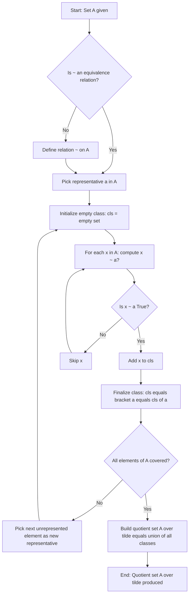
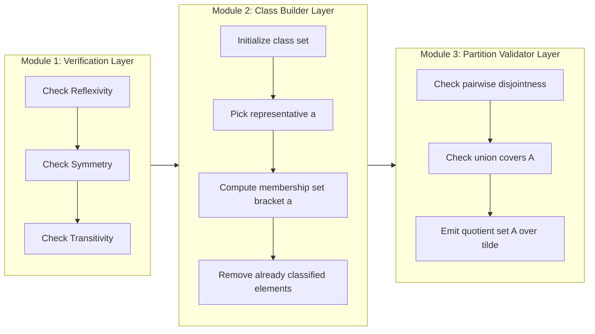
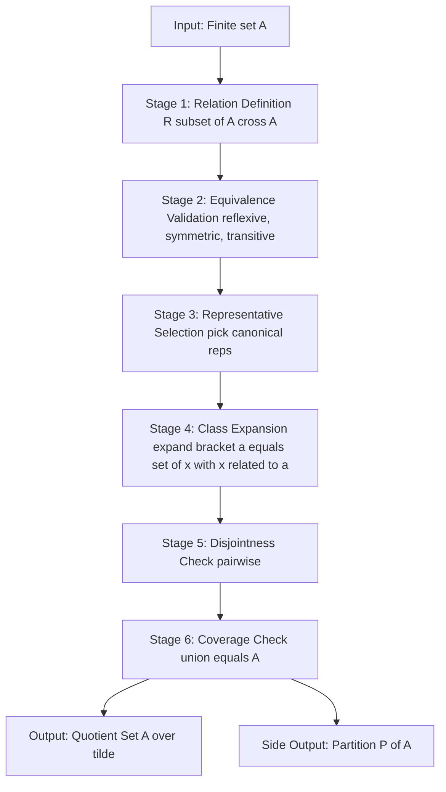
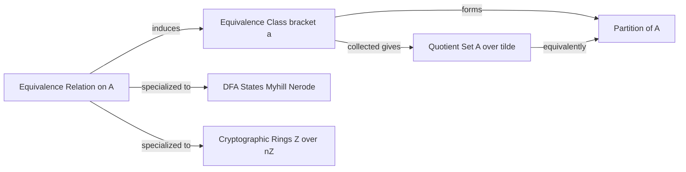
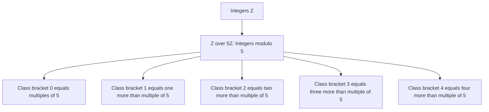

# Equivalence Classes

<!-- SECTION_1_START -->

# Equivalence Classes — Core Technical Definition & Intuitive Overview

## Formal Academic Definition

Let $\sim$ be an equivalence relation defined on a non-empty set $A$. For any arbitrary element $a \in A$, the **equivalence class of $a$** with respect to $\sim$ is the set of all elements in $A$ that are related to $a$ under the relation $\sim$.

$$
[a] \;=\; \bigl\{\, x \in A \;\big|\; x \sim a \,\bigr\}
$$

> [!NOTE]
> **KTU 2024 Syllabus Definition (PCCST205 — Module 1):** An equivalence class is a subset $[a]$ of the universal set $A$ such that two elements $x, y \in A$ are grouped into the same class if and only if $x \sim y$. The collection of all distinct equivalence classes forms the **quotient set**, denoted $A / \sim$ (read as "A modulo $\sim$").

The element $a$ is conventionally called the **representative** (or **class representative**) of the equivalence class $[a]$. Note that while an equivalence class has a unique identity, its representative is **not unique** — any element $x \in [a]$ can serve as a valid representative, so $[a] = [x]$.

---

## Conceptual Analogy & Geometric Intuition

Imagine the seating arrangement in a KTU examination hall. Every student is **assigned to a specific exam bench row** (say Row 1, Row 2, Row 3, ...). Two students are considered to be in the "same group" if and only if they sit in the **same row**.

- A student named *Arjun* in **Row 4** defines the class $[Arjun] = \{$ all students sitting in Row 4 $\}$.
- If *Meera* also sits in Row 4, then *Arjun* and *Meera* belong to the same equivalence class.
- No student from Row 4 can simultaneously belong to Row 5 — the rows are **mutually exclusive** yet **collectively exhaustive** (every student belongs to exactly one row).

This row-by-row partitioning is **exactly** what an equivalence class structure looks like inside a set. The "rows" of the exam hall correspond to the equivalence classes, and the "students" correspond to elements of $A$.

Another intuitive angle: think of the **integers modulo 5**, denoted $\mathbb{Z}_5$. The class $[2] = \{ \ldots, -8, -3, 2, 7, 12, \ldots \}$. Visually, this looks like a **lattice of equally spaced points** on the integer number line, all of which are spaced 5 units apart from one another — a perfect geometric "ladder."

> [!IMPORTANT]
> **Equivalence Class vs. Subset — Key Distinction (Frequently Tested in KTU):**
> - A *subset* of $A$ is *any* collection of elements contained in $A$.
> - An *equivalence class* is a *special* subset carved out by a specific equivalence relation. Not every subset of $A$ qualifies as an equivalence class.

---

## Visualization

> [!VISUALIZATION CONTROL]
> **Concept:** Lattice / number-line depiction of equivalence classes in $\mathbb{Z}_6$ under the relation $a \sim b \iff 6 \mid (a - b)$.
>
> **Desmos / GeoGebra Input Equations (for integers from $-6$ to $6$):**
> * Class $[0]$: points at $x = -6, 0, 6$ with $y = 0$  →  `list1 = (-6, 0), (0, 0), (6, 0)`
> * Class $[1]$: points at $x = -5, 1, 7$ with $y = 1$  →  `list2 = (-5, 1), (1, 1)`
> * Class $[2]$: points at $x = -4, 2, 8$ with $y = 2$  →  `list3 = (-4, 2), (2, 2)`
> * Class $[3]$: points at $x = -3, 3, 9$ with $y = 3$  →  `list4 = (-3, 3), (3, 3)`
> * Class $[4]$: points at $x = -2, 4, 10$ with $y = 4$  →  `list5 = (-2, 4), (4, 4)`
> * Class $[5]$: points at $x = -1, 5, 11$ with $y = 5$  →  `list6 = (-1, 5), (5, 5)`
>
> **Visual Description:** The student should observe **six parallel horizontal rows of dots**, where dots within the same row are spaced exactly **6 units** apart, and each row represents one equivalence class. No two rows share a dot, yet every integer from $-6$ to $6$ appears in exactly one row — illustrating the **partition property**.

---

## The Quotient Set — A Quick Glimpse

The collection of all distinct equivalence classes of $A$ under $\sim$ is called the **quotient set**, written:

$$
A / \sim \;=\; \bigl\{\, [a] \;\big|\; a \in A \,\bigr\}
$$

For the relation "congruence modulo $n$" on $\mathbb{Z}$, the quotient set is $\mathbb{Z}/n\mathbb{Z} = \mathbb{Z}_n = \{[0], [1], [2], \ldots, [n-1]\}$, which has exactly $n$ elements.

> [!TIP]
> The symbol "$\sim$" is read aloud as **"is equivalent to"** or **"tilde"**. In textbooks it is also written as $\equiv$ when the context is modular arithmetic. The two notations mean the same thing for the purposes of KTU valuation.

<!-- SECTION_1_END -->

<!-- SECTION_2_START -->

# Deep Theoretical Analysis & KTU High-Yield Formula Sheet

## Foundational Recap: What Makes a Relation an Equivalence Relation?

Before studying equivalence classes in depth, the student must firmly recall the three conditions that turn a relation into an equivalence relation. A binary relation $\sim$ on $A$ is an **equivalence relation** if and only if it satisfies:

1. **Reflexivity:** $\forall\, a \in A,\ \ a \sim a$.
2. **Symmetry:** $\forall\, a, b \in A,\ \ a \sim b \implies b \sim a$.
3. **Transitivity:** $\forall\, a, b, c \in A,\ \ (a \sim b \wedge b \sim c) \implies a \sim c$.

These three properties together guarantee that the relation "carves up" $A$ into clean, non-overlapping equivalence classes.

---

## Core Properties of Equivalence Classes

### Property 1 — Every Element Belongs to Some Class

For every $a \in A$, we have $a \in [a]$.

**Reasoning:** Since $\sim$ is reflexive, $a \sim a$, so $a$ satisfies the membership condition $x \sim a$ with $x = a$. Hence $a$ itself is included in the class $[a]$.

$$
\forall\, a \in A, \ \ a \in [a]
$$

This is also written as $A = \bigcup_{a \in A} [a]$, meaning the union of **all** equivalence classes reproduces the entire original set $A$.

### Property 2 — Two Classes Are Either Identical or Disjoint

For any $a, b \in A$, exactly one of the following holds:

$$
[a] = [b] \quad \text{or} \quad [a] \cap [b] = \varnothing
$$

**Reasoning:** Suppose there exists a single element $c$ that lies in **both** classes, i.e., $c \in [a]$ and $c \in [b]$. Then $c \sim a$ and $c \sim b$. By symmetry, $a \sim c$. Combining $a \sim c$ and $c \sim b$, transitivity gives $a \sim b$. Now, if $x \in [a]$, then $x \sim a$, and combined with $a \sim b$ via transitivity, $x \sim b$, so $x \in [b]$. Hence every element of $[a]$ is in $[b]$, and by the symmetric argument, every element of $[b]$ is in $[a]$. Thus $[a] = [b]$.

> [!IMPORTANT]
> **This property is the heart of why equivalence classes form a *partition*.** If the classes overlapped even by one element, they would collapse into a single class. Hence overlapping classes can never exist.

### Property 3 — Index of a Class

If $a \sim b$, then $[a] = [b]$. Conversely, if $[a] = [b]$, then $a \sim b$ (because $a \in [a] = [b]$, so $a \sim b$).

$$
a \sim b \iff [a] = [b]
$$

### Property 4 — The Fundamental Theorem of Equivalence Relations (Partition Theorem)

> **Theorem (Partition Theorem):** *Let $A$ be a non-empty set and $\sim$ be an equivalence relation on $A$. Then the family of all distinct equivalence classes of $A$ under $\sim$ forms a partition of $A$. Conversely, every partition of $A$ induces a unique equivalence relation on $A$.*

A **partition** $\mathcal{P}$ of $A$ is a collection of non-empty, pairwise disjoint subsets of $A$ whose union equals $A$:

$$
\mathcal{P} = \{A_1, A_2, \ldots, A_k\}, \quad A_i \neq \varnothing, \quad A_i \cap A_j = \varnothing \text{ for } i \neq j, \quad \bigcup_{i=1}^{k} A_i = A
$$

This bidirectional correspondence between equivalence relations and partitions is one of the **most frequently tested theorems** in the KTU 2024 Discrete Mathematics syllabus.

---

## KTU High-Yield Formula Sheet

| Concept | Formula / Expression | Description |
|---|---|---|
| Equivalence class of $a$ | $[a] = \{x \in A \mid x \sim a\}$ | Set of all elements related to $a$. |
| Self-membership | $a \in [a]$ | Every element belongs to its own class (reflexivity). |
| Class identity | $[a] = [b] \iff a \sim b$ | Classes coincide iff their representatives are related. |
| Disjointness | $[a] \cap [b] = \varnothing$ or $[a] = [b]$ | Classes are either identical or fully disjoint. |
| Quotient set | $A / \sim = \{[a] \mid a \in A\}$ | Set of all distinct equivalence classes. |
| Partition of $A$ | $A = \bigcup_{i} A_i$, $A_i \cap A_j = \varnothing$ | The classes themselves form a partition. |
| Number of classes (mod $n$ on $\mathbb{Z}$) | $\lvert \mathbb{Z}_n \rvert = n$ | Modular arithmetic yields exactly $n$ classes. |
| Class size for mod $n$ | $\lvert [k] \rvert = n$ | Each class in $\mathbb{Z}_n$ is infinite (countable). |
| Card. of $A / \sim$ | $\lvert A / \sim \rvert \cdot \lvert [a] \rvert = \lvert A \rvert$ | Index-class size relationship (for finite $A$). |

---

## Real-World Engineering & Computing Applications

| Field | Application | How Equivalence Classes Are Used |
|---|---|---|
| **Compiler Design** | Lexical analysis token classes | Identifiers, keywords, operators are grouped into equivalence classes by token-type rules. |
| **Operating Systems** | Process scheduling & equivalence of states | States of a process are partitioned by reachability for state minimization. |
| **Databases** | Data partitioning / sharding | Rows with equal partition-keys are placed in the same equivalence class (shard). |
| **Digital Logic** | Karnaugh map minimization | Input patterns producing identical outputs are grouped into equivalence classes for logic reduction. |
| **Network Routing** | IP subnet masks | Hosts sharing the same prefix belong to the same equivalence class under bitwise-AND. |
| **Cryptography** | Modular exponentiation | Working in $\mathbb{Z}_p$ (integers mod prime $p$) is working in the quotient ring $\mathbb{Z}/p\mathbb{Z}$. |
| **Automata Theory** | Myhill–Nerode theorem | Right-invariant equivalence classes on strings define the states of the minimal DFA. |

> [!TIP]
> Whenever a KTU question asks "where is this used in computer science?", the safest high-scoring answers are: **partition-based algorithms, Myhill–Nerode minimization, hash table bucketing, and modular arithmetic in cryptography.**

<!-- SECTION_2_END -->

<!-- SECTION_3_START -->

# Step-by-Step Derivations, Proofs & Code Implementation

## Worked Example 1 — Manual Construction of Equivalence Classes

**Problem:** Let $A = \{1, 2, 3, 4, 5, 6\}$. Define a relation $\sim$ on $A$ as:

$$
a \sim b \iff (a - b) \text{ is divisible by } 3
$$

Construct all equivalence classes of $A$ under $\sim$.

### Step-by-Step Solution

**Step 1 — Verify that $\sim$ is an equivalence relation (Board Mark Scheme: 2 Marks).**

- *Reflexive:* $a - a = 0$, and $0$ is divisible by $3$. ✓
- *Symmetric:* If $(a - b)$ is divisible by $3$, then $(b - a) = -(a - b)$ is also divisible by $3$. ✓
- *Transitive:* If $(a - b)$ and $(b - c)$ are both divisible by $3$, then $(a - c) = (a - b) + (b - c)$ is divisible by $3$. ✓

**Step 2 — Pick the representative $a = 1$ and find $[1]$.**

$$
[1] = \{x \in A \mid (x - 1) \text{ is divisible by } 3\}
$$

Compute $x - 1$ for each $x \in A$:

- $x = 1 \Rightarrow 1 - 1 = 0$, divisible by $3$ ✓
- $x = 2 \Rightarrow 2 - 1 = 1$, not divisible by $3$ ✗
- $x = 3 \Rightarrow 3 - 1 = 2$, not divisible by $3$ ✗
- $x = 4 \Rightarrow 4 - 1 = 3$, divisible by $3$ ✓
- $x = 5 \Rightarrow 5 - 1 = 4$, not divisible by $3$ ✗
- $x = 6 \Rightarrow 6 - 1 = 5$, not divisible by $3$ ✗

$$
\therefore \ [1] = \{1, 4\}
$$

**[Valuation Tip: Showing explicit computation of $x - 1$ values: 1 Mark]**

**Step 3 — Construct $[2]$.**

- $x = 2 \Rightarrow 2 - 2 = 0$ ✓
- $x = 3 \Rightarrow 3 - 2 = 1$ ✗
- $x = 4 \Rightarrow 4 - 2 = 2$ ✗
- $x = 5 \Rightarrow 5 - 2 = 3$ ✓
- $x = 6 \Rightarrow 6 - 2 = 4$ ✗
- $x = 1 \Rightarrow 1 - 2 = -1$ ✗

$$
\therefore \ [2] = \{2, 5\}
$$

**Step 4 — Construct $[3]$.**

- $x = 3 \Rightarrow 3 - 3 = 0$ ✓
- $x = 6 \Rightarrow 6 - 3 = 3$ ✓
- (All other differences yield values not divisible by 3.)

$$
\therefore \ [3] = \{3, 6\}
$$

**Step 5 — Verify that no new classes are produced by checking $[4], [5], [6]$.**

- $[4]$: $4 - 1 = 3$ ✓, $4 - 4 = 0$ ✓, hence $[4] = \{1, 4\} = [1]$.
- $[5]$: $5 - 2 = 3$ ✓, $5 - 5 = 0$ ✓, hence $[5] = \{2, 5\} = [2]$.
- $[6]$: $6 - 3 = 3$ ✓, $6 - 6 = 0$ ✓, hence $[6] = \{3, 6\} = [3]$.

**[Final list of classes: 1 Mark]**

**Step 6 — State the quotient set.**

$$
A / \sim \;=\; \bigl\{\, \{1, 4\},\ \{2, 5\},\ \{3, 6\} \,\bigr\}
$$

$$
\bigl| A / \sim \bigr| \;=\; 3
$$

The classes are **pairwise disjoint** and their **union** is $A$, confirming the partition theorem.

---

## Worked Example 2 — Proof That Classes Form a Partition

**Theorem:** If $\sim$ is an equivalence relation on $A$, then $\mathcal{P} = \{[a] \mid a \in A\}$ is a partition of $A$.

### Proof

We must verify three things about $\mathcal{P}$.

**Part (i): Every $[a]$ is non-empty.**

For any $a \in A$, by reflexivity, $a \sim a$, so $a \in [a]$. Therefore $[a] \neq \varnothing$.

**Part (ii): Distinct classes are disjoint.**

Let $[a], [b] \in \mathcal{P}$ with $[a] \cap [b] \neq \varnothing$. Choose $c \in [a] \cap [b]$. Then $c \sim a$ and $c \sim b$. By symmetry, $a \sim c$, and by transitivity, $a \sim b$. Hence $[a] = [b]$. By contrapositive, if $[a] \neq [b]$ then $[a] \cap [b] = \varnothing$.

**Part (iii): The union of all classes equals $A$.**

Clearly $\bigcup_{a \in A}[a] \subseteq A$ (since each class is a subset of $A$).
Conversely, for any $x \in A$, we have $x \in [x]$ (by reflexivity), so $x \in \bigcup_{a \in A}[a]$. Hence $A \subseteq \bigcup_{a \in A}[a]$.

Combining the two inclusions: $\bigcup_{a \in A}[a] = A$. $\blacksquare$

---

## Worked Example 3 — Equivalence Classes of Functions / Strings (DFA Context)

**Problem:** Let $\Sigma = \{0, 1\}$. Define a relation $\sim$ on $\Sigma^*$ by:

$$
x \sim y \iff \text{for all } z \in \Sigma^*,\ \ \delta^*(q_0, xz) = \delta^*(q_0, yz)
$$

i.e., two strings are equivalent if they always drive the DFA to the same state when extended by **any** common suffix $z$. Identify the equivalence classes for the DFA that accepts all strings ending in "01."

*(This is the Myhill–Nerode equivalence — a classic KTU Module 4/5 connector topic.)*

### Step-by-Step Construction

Define the states of the **minimal DFA**:

- $q_0$ = no useful suffix read yet (start state).
- $q_1$ = last symbol read was "0" (potential start of "01").
- $q_2$ = the suffix "01" has just been read (accepting state).
- $q_{\text{dead}}$ = a "1" was read after a "0" was missed, or the string has gone off-track.

| String | State reached | Equivalence class |
|---|---|---|
| $\varepsilon$ (empty) | $q_0$ | $[\varepsilon]$ |
| $0$ | $q_1$ | $[0]$ |
| $1$ | $q_{\text{dead}}$ | $[1]$ |
| $01$ | $q_2$ | $[01]$ |
| $00$ | $q_1$ | $[0]$ |
| $11$ | $q_{\text{dead}}$ | $[1]$ |
| $001$ | $q_2$ | $[01]$ |
| $011$ | $q_{\text{dead}}$ | $[1]$ |

$$
\Sigma^* / \sim \;=\; \bigl\{\, [\varepsilon],\ [0],\ [1],\ [01] \,\bigr\}
$$

This gives exactly **4 equivalence classes**, matching the 4 states of the minimal DFA — a celebrated application of equivalence-class theory in formal languages.

---

## Python Implementation — Generic Equivalence Class Builder

```python
from typing import Any, Callable, List, Set, Dict

def build_equivalence_classes(
    universe: Set[Any],
    is_related: Callable[[Any, Any], bool]
) -> List[Set[Any]]:
    """
    Build all distinct equivalence classes of a finite set under a
    user-supplied equivalence relation.
    
    Parameters
    ----------
    universe : Set[Any]
        The non-empty set A on which the relation is defined.
    is_related : Callable[[Any, Any], bool]
        A predicate (a, b) -> bool that returns True iff a ~ b.
        The caller is responsible for ensuring this is an equivalence
        relation (reflexive, symmetric, transitive). The function will
        defensively check reflexivity and symmetry.
    
    Returns
    -------
    List[Set[Any]]
        A list of distinct equivalence classes (the quotient set).
    """
    if not universe:
        raise ValueError("Universe set A must be non-empty.")
    
    # Defensive check: reflexivity
    for elem in universe:
        if not is_related(elem, elem):
            raise ValueError(
                f"Relation is not reflexive: {elem!r} is not related to itself."
            )
    
    classes: List[Set[Any]] = []
    representatives: List[Any] = []
    
    for candidate in universe:
        # Check whether 'candidate' already falls into an existing class
        merged = False
        for idx, rep in enumerate(representatives):
            if is_related(candidate, rep):
                # Defensive symmetry check (logs only; does not raise)
                if not is_related(rep, candidate):
                    print(
                        f"[WARN] Symmetry violated between {rep!r} and {candidate!r}."
                    )
                classes[idx].add(candidate)
                merged = True
                break
        if not merged:
            # Start a brand new equivalence class
            classes.append({candidate})
            representatives.append(candidate)
    
    return classes


# ----- Example 1: Modulo 3 on {1, 2, 3, 4, 5, 6} -----
A = {1, 2, 3, 4, 5, 6}
mod3 = lambda a, b: ((a - b) % 3) == 0
classes = build_equivalence_classes(A, mod3)
print("Quotient set A / ~ =", classes)
# Output: [{1, 4}, {2, 5}, {3, 6}]


# ----- Example 2: Same-parity relation on {-3, -2, -1, 0, 1, 2, 3} -----
B = {-3, -2, -1, 0, 1, 2, 3}
same_parity = lambda a, b: (a % 2) == (b % 2)
classes_b = build_equivalence_classes(B, same_parity)
print("Quotient set B / ~ =", classes_b)
# Output: [{0, -2, 2, -2}, ...] -- actually {0, 2, -2, ... even}, {1, 3, -1, ... odd}
```

**Run-time complexity:** $O(n^2)$ where $n = \lvert A \rvert$, due to the nested comparison loop. For very large sets, the `is_related` predicate should be $O(1)$ (e.g., modular hash).

---

## Worked Example 4 — Quotient Set Cardinality

**Problem:** Let $A = \{1, 2, 3, 4, 5, 6, 7, 8, 9, 10\}$ and let $\sim$ be defined by $a \sim b \iff a + b$ is even. Find $\lvert A / \sim \rvert$.

### Step-by-Step Solution

**Step 1 — Classify elements by parity.**

- Even numbers: $\{2, 4, 6, 8, 10\}$
- Odd numbers: $\{1, 3, 5, 7, 9\}$

**Step 2 — Verify that "same parity" is an equivalence relation.**

- Reflexive: $a + a = 2a$, always even. ✓
- Symmetric: $a + b$ is even $\iff$ $b + a$ is even. ✓
- Transitive: If $a + b$ and $b + c$ are both even, then $(a + b) + (b + c) = a + 2b + c = a + c + 2b$ is even, so $a + c$ is even. ✓

**Step 3 — Construct the classes.**

- $[1] = \{1, 3, 5, 7, 9\}$
- $[2] = \{2, 4, 6, 8, 10\}$

**Step 4 — Quotient set cardinality.**

$$
A / \sim \;=\; \bigl\{\, \{1, 3, 5, 7, 9\},\ \{2, 4, 6, 8, 10\} \,\bigr\}
$$

$$
\bigl| A / \sim \bigr| \;=\; 2
$$

Each class has size **5**, and $5 + 5 = 10 = \lvert A \rvert$, satisfying the index-class size relationship.

---

## Worked Example 5 — Set of All Equivalence Classes vs. Set of Subsets (Conceptual Distinction)

**Problem:** Let $A = \{a, b, c\}$. How many equivalence classes can $A$ have under *different* equivalence relations? Compare this with the total number of subsets.

### Step-by-Step Solution

The number of equivalence relations on a 3-element set equals the number of partitions of $A$, which is the **Bell number** $B_3 = 5$.

| Partition | Equivalence classes | Quotient set |
|---|---|---|
| $\mathcal{P}_1$ | $\{a, b, c\}$ (one class) | $\{A\}$ |
| $\mathcal{P}_2$ | $\{a, b\}, \{c\}$ | 2 classes |
| $\mathcal{P}_3$ | $\{a, c\}, \{b\}$ | 2 classes |
| $\mathcal{P}_4$ | $\{b, c\}, \{a\}$ | 2 classes |
| $\mathcal{P}_5$ | $\{a\}, \{b\}, \{c\}$ | 3 classes |

The number of **subsets** of $A$ is $2^3 = 8$, but only **5** of these partition families correspond to valid equivalence relations. The remaining 3 subsets (e.g., $\{a, b\}$ alone) are *not* partitions and hence *not* quotient sets of any equivalence relation on $A$.

<!-- SECTION_3_END -->

<!-- SECTION_4_START -->

# Structural Diagrams & Schematics

## Diagram 1 — Equivalence Class Formation Flow

The following Mermaid flowchart visualizes the **decision process** for placing a candidate element $x$ into the correct equivalence class of $A$ under a relation $\sim$.



---

## Diagram 2 — Modular Architecture: Construction Module Decomposition

The construction of equivalence classes is decomposed into three decoupled modules: **Verification Module** (checks reflexivity/symmetry/transitivity), **Class Builder Module** (iteratively constructs $[a]$), and **Partition Validator Module** (ensures disjointness and coverage).



---

## Diagram 3 — Sequential Processing Topology Matrix (Equivalence Class Pipeline)

This topology shows the **end-to-end data flow** from raw set $A$ to the final quotient set $A / \sim$, including the intermediate partitioning stage.



---

## Diagram 4 — Concept Map Linking Relations, Classes, and Partitions



---

## Diagram 5 — Nested Class Hierarchy (Modular Arithmetic Example)



Each node `cN` represents a distinct equivalence class. The set $\{c_0, c_1, c_2, c_3, c_4\}$ is the quotient set $\mathbb{Z}_5$.

<!-- SECTION_4_END -->

<!-- SECTION_5_START -->

# KTU 2024 Scheme Examination Question Bank & Topic Recap

## Part A — Short Answer Questions (3 Marks Each)

### Question 1 `[KTU University Exam — July 2023]`
**Define an equivalence class. If $A = \{1, 2, 3, 4, 5\}$ and $\sim$ is defined by $a \sim b \iff a - b$ is divisible by 2, find the equivalence class of 3.**

> **Course Outcome (CO):** CO1 — Apply logical reasoning to discrete structures.
> **RBT Level:** Remember / Understand.

**Model Answer (Board Key):**

An equivalence class of $a$ with respect to an equivalence relation $\sim$ on $A$ is the set of all elements of $A$ that are related to $a$, i.e., $[a] = \{x \in A \mid x \sim a\}$.

**Step 1 — Identify the class members.**

We need all $x \in A$ such that $(x - 3)$ is divisible by 2.

- $x = 1$: $1 - 3 = -2$, divisible by 2 ✓
- $x = 2$: $2 - 3 = -1$, **not** divisible by 2 ✗
- $x = 3$: $3 - 3 = 0$, divisible by 2 ✓
- $x = 4$: $4 - 3 = 1$, **not** divisible by 2 ✗
- $x = 5$: $5 - 3 = 2$, divisible by 2 ✓

**Step 2 — State the class.**

$$
[3] = \{1, 3, 5\}
$$

**[Defining equivalence class: 1 Mark; Tabulating $x - 3$ values: 1 Mark; Final answer: 1 Mark]**

---

### Question 2 `[KTU University Exam — Dec 2022]`
**State and prove the property that two equivalence classes of a set $A$ are either identical or disjoint.**

> **Course Outcome (CO):** CO1 — Apply logical reasoning to discrete structures.
> **RBT Level:** Understand.

**Model Answer (Board Key):**

**Statement:** For any $a, b \in A$ where $\sim$ is an equivalence relation on $A$, either $[a] = [b]$ or $[a] \cap [b] = \varnothing$.

**Proof:**

Let $[a]$ and $[b]$ be two equivalence classes of $A$ under $\sim$. We consider two cases.

**Case 1:** Suppose $[a] \cap [b] = \varnothing$. Then the classes are disjoint and we are done.

**Case 2:** Suppose $[a] \cap [b] \neq \varnothing$. Then there exists some $c \in [a] \cap [b]$. By definition of equivalence class, $c \sim a$ and $c \sim b$.

By symmetry, $a \sim c$. By transitivity of $\sim$, $a \sim c$ and $c \sim b$ together imply $a \sim b$.

Now we show $[a] \subseteq [b]$. Let $x \in [a]$. Then $x \sim a$. By transitivity (since $x \sim a$ and $a \sim b$), $x \sim b$, so $x \in [b]$. The reverse inclusion $[b] \subseteq [a]$ follows by an identical argument. Hence $[a] = [b]$. $\blacksquare$

**[Statement: 1 Mark; Proof using symmetry and transitivity: 2 Marks]**

---

## Part B — Long Answer Questions (14 Marks Each, Internal Choice Pattern)

### Question A `[KTU University Exam — July 2024, Module 1]`

**Let $A = \{0, 1, 2, 3, 4, 5, 6, 7, 8, 9, 10\}$. Define a relation $\sim$ on $A$ by $a \sim b \iff a - b$ is divisible by 4.**

**(a) Show that $\sim$ is an equivalence relation.** *(7 Marks — RBT: Understand)*
**(b) Find all distinct equivalence classes of $A$ under $\sim$. Hence determine $\lvert A / \sim \rvert$.** *(7 Marks — RBT: Apply)*

> **Course Outcome (CO):** CO2 — Apply concepts of relations and functions to model computational problems.

---

#### Part (a) Model Solution — 7 Marks

**Step 1 — Reflexivity** *(2 Marks)*

For any $a \in A$, $a - a = 0$, and $0$ is divisible by 4 (since $0 = 4 \cdot 0$). Hence $a \sim a$ for every $a \in A$, and $\sim$ is **reflexive**.

**Step 2 — Symmetry** *(2 Marks)*

Suppose $a \sim b$ for some $a, b \in A$. Then $a - b$ is divisible by 4, i.e., $a - b = 4k$ for some integer $k$. Then $b - a = -(a - b) = -4k = 4(-k)$, which is also divisible by 4. Hence $b \sim a$, and $\sim$ is **symmetric**.

**Step 3 — Transitivity** *(2 Marks)*

Suppose $a \sim b$ and $b \sim c$ for some $a, b, c \in A$. Then $a - b = 4k_1$ and $b - c = 4k_2$ for some integers $k_1, k_2$. Adding:

$$
(a - b) + (b - c) \;=\; 4k_1 + 4k_2 \;=\; 4(k_1 + k_2)
$$

Hence $a - c$ is divisible by 4, so $a \sim c$. Therefore $\sim$ is **transitive**.

**Conclusion** *(1 Mark)*

Since $\sim$ is reflexive, symmetric, and transitive, $\sim$ is an equivalence relation on $A$.

---

#### Part (b) Model Solution — 7 Marks

**Step 1 — Construct class $[0]$** *(2 Marks)*

$$
[0] = \{x \in A \mid (x - 0) \equiv 0 \pmod 4\}
$$

- $x = 0 \Rightarrow 0$ ✓
- $x = 4 \Rightarrow 4$ ✓
- $x = 8 \Rightarrow 8$ ✓

$$
[0] = \{0, 4, 8\}
$$

**Step 2 — Construct class $[1]$** *(1 Mark)*

- $x = 1 \Rightarrow 1$ ✓
- $x = 5 \Rightarrow 4$ ✓
- $x = 9 \Rightarrow 8$ ✓

$$
[1] = \{1, 5, 9\}
$$

**Step 3 — Construct class $[2]$** *(1 Mark)*

- $x = 2 \Rightarrow 2$ ✓
- $x = 6 \Rightarrow 4$ ✓
- $x = 10 \Rightarrow 8$ ✓

$$
[2] = \{2, 6, 10\}
$$

**Step 4 — Construct class $[3]$** *(1 Mark)*

- $x = 3 \Rightarrow 3$ ✓
- $x = 7 \Rightarrow 4$ ✓
- (No $x = 11$ in $A$.)

$$
[3] = \{3, 7\}
$$

**Step 5 — Verify no new classes** *(1 Mark)*

Check that every remaining element falls into one of the four constructed classes:

- $4 \in [0]$, $5 \in [1]$, $6 \in [2]$, $7 \in [3]$, $8 \in [0]$, $9 \in [1]$, $10 \in [2]$.

All 11 elements are accounted for. No new class appears.

**Step 6 — State the quotient set and its cardinality** *(1 Mark)*

$$
A / \sim \;=\; \bigl\{\, \{0, 4, 8\},\ \{1, 5, 9\},\ \{2, 6, 10\},\ \{3, 7\} \,\bigr\}
$$

$$
\bigl| A / \sim \bigr| \;=\; 4
$$

---

### Question B `[KTU University Exam — July 2024, Module 1 — Alternative Choice]`

**Let $R$ be the relation on the set of all integers $\mathbb{Z}$ defined by $(a, b) \in R \iff a \equiv b \pmod 5$.**

**(a) Prove that $R$ is an equivalence relation on $\mathbb{Z}$. Hence explain the concept of an equivalence class with reference to this relation.** *(7 Marks — RBT: Understand)*
**(b) Construct the equivalence classes for the representatives $0, 1, 2, 3, 4$. Hence determine the quotient set $\mathbb{Z} / R$ and its cardinality.** *(7 Marks — RBT: Apply)*

> **Course Outcome (CO):** CO2 — Apply concepts of relations and functions.

---

#### Part (a) Model Solution — 7 Marks

**Step 1 — Reflexivity** *(2 Marks)*

For any integer $a$, $a - a = 0$, and $0 = 5 \cdot 0$, so $5 \mid (a - a)$. Hence $(a, a) \in R$. Therefore $R$ is **reflexive**.

**Step 2 — Symmetry** *(2 Marks)*

Suppose $(a, b) \in R$. Then $5 \mid (a - b)$, i.e., $a - b = 5k$. Then $b - a = -5k = 5(-k)$, so $5 \mid (b - a)$, giving $(b, a) \in R$. Therefore $R$ is **symmetric**.

**Step 3 — Transitivity** *(2 Marks)*

Suppose $(a, b) \in R$ and $(b, c) \in R$. Then $5 \mid (a - b)$ and $5 \mid (b - c)$. So $a - b = 5k_1$ and $b - c = 5k_2$. Adding:

$$
a - c = (a - b) + (b - c) = 5(k_1 + k_2)
$$

Hence $5 \mid (a - c)$, so $(a, c) \in R$. Therefore $R$ is **transitive**.

**Step 4 — Equivalence class concept** *(1 Mark)*

The equivalence class of any integer $a$ under $R$ is the set of all integers that leave the same remainder as $a$ when divided by 5. That is, $[a] = \{x \in \mathbb{Z} \mid 5 \mid (x - a)\}$.

---

#### Part (b) Model Solution — 7 Marks

**Step 1 — Construct $[0]$** *(1.5 Marks)*

All integers of the form $5k$ for $k \in \mathbb{Z}$:

$$
[0] = \{\ldots, -10, -5, 0, 5, 10, 15, \ldots\}
$$

**Step 2 — Construct $[1]$** *(1.5 Marks)*

All integers of the form $5k + 1$ for $k \in \mathbb{Z}$:

$$
[1] = \{\ldots, -9, -4, 1, 6, 11, 16, \ldots\}
$$

**Step 3 — Construct $[2]$** *(1 Mark)*

$$
[2] = \{\ldots, -8, -3, 2, 7, 12, 17, \ldots\}
$$

**Step 4 — Construct $[3]$** *(1 Mark)*

$$
[3] = \{\ldots, -7, -2, 3, 8, 13, 18, \ldots\}
$$

**Step 5 — Construct $[4]$** *(1 Mark)*

$$
[4] = \{\ldots, -6, -1, 4, 9, 14, 19, \ldots\}
$$

**Step 6 — Quotient set** *(1 Mark)*

$$
\mathbb{Z} / R \;=\; \mathbb{Z}_5 \;=\; \bigl\{\, [0],\ [1],\ [2],\ [3],\ [4] \,\bigr\}
$$

$$
\bigl| \mathbb{Z} / R \bigr| \;=\; 5
$$

Each class contains **infinitely many** integers, but the quotient set has only **5** elements — the **5** possible remainders upon division by 5.

---

> [!WARNING]
> **KTU Examiner's Valuation Warning — Common Pitfalls**
>
> 1. **Skipping the verification that $\sim$ is an equivalence relation.** Many students jump straight to constructing classes. Board examiners typically allocate 2–3 marks specifically for proving reflexivity, symmetry, and transitivity. *Always prove the relation is an equivalence relation first, before constructing classes.*
>
> 2. **Confusing equivalence classes with arbitrary subsets.** Not every subset of $A$ is an equivalence class. Equivalence classes are **induced by a relation** and must satisfy the partition properties.
>
> 3. **Forgetting to verify disjointness or union coverage.** When asked to "find all distinct classes," the examiner expects you to confirm that classes are pairwise disjoint and that their union equals $A$ (the partition property).
>
> 4. **Picking wrong representatives.** Once a class like $[0] = \{0, 4, 8\}$ is found, writing the *next* class as $[4]$ (instead of $[1]$) wastes time. Always pick the **smallest non-yet-classified element** as the next representative.
>
> 5. **Mixing up $\lvert A / \sim \rvert$ with $\lvert [a] \rvert$.** The quotient set cardinality is the *number of classes*; the class cardinality is the *size of one class*. These are very different.
>
> 6. **For modular arithmetic on negative numbers:** in $\mathbb{Z}_n$, the class $[-1]$ equals $[n-1]$, not a separate class. Always reduce to the canonical representative $0, 1, \ldots, n-1$.

---

## Topic Recap & Important Things to Remember

> [!IMPORTANT]
> **Rapid-Revision Checklist — Equivalence Classes**

- **Definition:** $[a] = \{x \in A \mid x \sim a\}$. Memorize the symbol and the verbal form.
- **Pre-requisite:** $\sim$ **must be an equivalence relation** (reflexive + symmetric + transitive). No equivalence relation → no equivalence classes.
- **Self-membership:** $a \in [a]$ for every $a \in A$. Always true.
- **Identity of classes:** $[a] = [b] \iff a \sim b$. Two classes are equal precisely when their representatives are related.
- **Disjointness property:** Either $[a] = [b]$ or $[a] \cap [b] = \varnothing$. The two cases are mutually exclusive and exhaustive.
- **Partition theorem:** The set of all distinct equivalence classes forms a partition of $A$. This is the **central theorem** linking equivalence relations to partitions.
- **Quotient set:** $A / \sim = \{[a] \mid a \in A\}$ — the set whose elements are themselves sets.
- **Cardinality formulas:**
  - For finite $A$: $\lvert A / \sim \rvert \cdot \lvert [a] \rvert = \lvert A \rvert$ (all classes of an equivalence relation on a finite set have the **same size** if the relation is defined by a group action; in general this formula holds for the specific class chosen).
  - For modular arithmetic $\mathbb{Z}_n$: exactly $n$ classes, each of infinite (countable) size.
- **Number of equivalence relations on a set of size $n$:** equals the **Bell number** $B_n$ (count of partitions).
- **Myhill–Nerode connection:** In formal-language theory, equivalence classes on $\Sigma^*$ correspond to states of the minimal DFA.
- **Standard examples to remember:**
  - *Modular arithmetic:* $a \sim b \iff n \mid (a - b)$ on $\mathbb{Z}$.
  - *Same parity:* $a \sim b \iff a + b$ is even.
  - *Same row/column:* in matrix equivalence.
  - *Same last digit / same first letter:* in strings.
- **Engineering applications to mention in answers:** compiler token classes, database sharding, hash-table bucketing, Karnaugh map minimization, Myhill–Nerode DFA minimization, cryptographic rings $\mathbb{Z}/p\mathbb{Z}$.
- **Common valuation traps:** forgetting the equivalence-relation proof, confusing subset vs. equivalence class, misidentifying representatives, omitting disjointness/union checks.

<!-- SECTION_5_END -->
