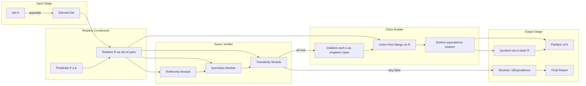
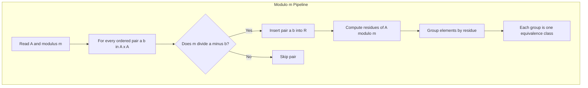
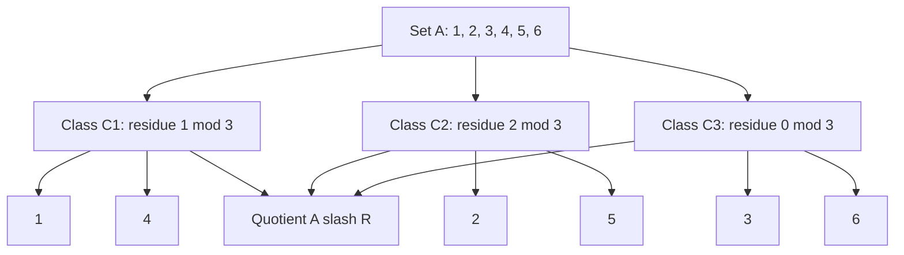

# Equivalence Relations

<!-- SECTION_1_START -->
# 1. Core Technical Definition & Intuitive Overview

## 1.1 Formal Definition of Equivalence Relation

Let $A$ be a non-empty set and $R \subseteq A \times A$ be a binary relation on $A$. The relation $R$ is called an **Equivalence Relation** if and only if it satisfies the following three axioms for all $a, b, c \in A$:

**(i) Reflexivity:** $\forall a \in A,\ (a, a) \in R$

**(ii) Symmetry:** $\forall a, b \in A,\ \text{if } (a, b) \in R \text{ then } (b, a) \in R$

**(iii) Transitivity:** $\forall a, b, c \in A,\ \text{if } (a, b) \in R \text{ and } (b, c) \in R \text{ then } (a, c) \in R$

> [!IMPORTANT]
> **KTU Syllabus Highlight (PCCST205 / Module 1):**
> An equivalence relation is the most important *special* type of binary relation in Discrete Mathematics. The 2024 Scheme places heavy emphasis on (a) verifying the three axioms, (b) constructing equivalence classes, and (c) proving the fundamental **Equivalence Class Partition Theorem**.

## 1.2 Conceptual Analogy — "The Family Reunion"

Imagine a large **family reunion** of $200$ people. Define a relation $\mathcal{R}$ as:

$$\mathcal{R} = \{\ (x, y)\ \vert\ x \text{ and } y \text{ share the same biological mother}\ \}$$

* **Reflexive?** Yes — every person shares the same mother as *themselves*.
* **Symmetric?** Yes — if Alice shares a mother with Bob, then Bob shares a mother with Alice.
* **Transitive?** Yes — if Alice and Bob share a mother, and Bob and Carol share a mother, then Alice and Carol share a mother.

So $\mathcal{R}$ is an equivalence relation. The reunion hall naturally **splits itself** into small tables — each table corresponds to a sibling group (i.e., an **equivalence class**). Notice that no person can sit at two different tables, and every person is seated at *some* table. This visual split is precisely a **partition** of the set of attendees.

> [!NOTE]
> **Geometric Intuition:** Think of $A$ as a region on a 2-D plane. An equivalence relation "glues together" points that are equivalent, and each glue-cluster is an equivalence class. The set of all glue-clusters forms a new (smaller) set — the **quotient set** $A / R$.

## 1.3 Equivalence Class — The Building Block

For any $a \in A$, the **equivalence class of $a$** (denoted $[a]_R$, or simply $[a]$) is defined as:

$$[a] = \{\ x \in A \ \vert\ (a, x) \in R\ \}$$

In plain words: $[a]$ is the *set of all elements of $A$ that are related to $a$*.

> [!TIP]
> **Every element of an equivalence class can serve as a representative.** That is, if $b \in [a]$ then $[b] = [a]$. This is a *very* common KTU exam question worth $3$–$7$ marks.

> [!VISUALIZATION CONTROL]
> **Concept:** Partition of $A = \{1, 2, 3, 4, 5, 6\}$ induced by the equivalence relation "$\equiv \pmod 3$".
> **GeoGebra / Desmos Input Equations:**
> * `A = {(1,1), (2,2), (3,3), (4,4), (5,5), (6,6)}`
> * `Plot1: points (1,1), (4,1) in color red`   — represents the class $[1] = \{1, 4\}$
> * `Plot2: points (2,2), (5,2) in color blue`  — represents the class $[2] = \{2, 5\}$
> * `Plot3: points (3,3), (6,3) in color green` — represents the class $[3] = \{3, 6\}$
> **Visual Description:** Three distinct horizontal "rows" appear, showing how $A$ is sliced into three disjoint subsets whose union is the entire set $A$.

<!-- SECTION_1_END -->

<!-- SECTION_2_START -->
# 2. Deep Theoretical Analysis & KTU High-Yield Formula Sheet

## 2.1 Logical Decomposition of the Three Axioms

| # | Axiom | Logical Form | Plain-English Translation |
|---|-------|--------------|---------------------------|
| 1 | Reflexive | $\forall a \in A,\ (a, a) \in R$ | Every element is related to *itself*. |
| 2 | Symmetric | $\forall a, b \in A,\ (a, b) \in R \Rightarrow (b, a) \in R$ | If $a$ relates to $b$, then $b$ relates back to $a$. |
| 3 | Transitive | $\forall a, b, c \in A,\ (a, b) \in R \land (b, c) \in R \Rightarrow (a, c) \in R$ | Relations can be *chained*. |

> [!WARNING]
> **Common Student Error:** A relation that is reflexive and symmetric but **not** transitive is **NOT** an equivalence relation. For example, on $A = \{1, 2, 3\}$, the relation $R = \{(1,1), (2,2), (3,3), (1,2), (2,1), (1,3), (3,1)\}$ is reflexive and symmetric, but since $(2,1) \in R$ and $(1,3) \in R$ yet $(2,3) \notin R$, it fails transitivity. Always check all three!

## 2.2 The Equivalence Class — Structural Properties

For an equivalence relation $R$ on $A$, the following properties hold for all $a, b \in A$:

1. **Self-membership:** $a \in [a]$ (from reflexivity).
2. **Class equality test:** $[a] = [b]$ if and only if $(a, b) \in R$.
3. **Disjointness:** If $(a, b) \notin R$, then $[a] \cap [b] = \emptyset$ (the equivalence classes are *pairwise disjoint*).
4. **Exhaustiveness:** $\bigcup\limits_{a \in A} [a] = A$ (every element belongs to *some* class).

## 2.3 The Equivalence Class Partition Theorem (Fundamental Theorem)

> [!IMPORTANT]
> **Theorem (Partition $\Leftrightarrow$ Equivalence Relation):**
> A binary relation $R$ on a non-empty set $A$ is an equivalence relation **if and only if** the collection of equivalence classes $\{[a] : a \in A\}$ forms a **partition** of $A$.

A **partition** of $A$ is a collection $\mathcal{P} = \{A_1, A_2, \ldots, A_k\}$ of non-empty subsets such that:
* $A_i \neq \emptyset$ for all $i$.
* $A_i \cap A_j = \emptyset$ for $i \neq j$ (pairwise disjoint).
* $\bigcup\limits_{i=1}^{k} A_i = A$ (collectively exhaustive).

## 2.4 Quotient Set

The **quotient set** (or *factor set*) of $A$ by $R$ is:

$$A / R = \{\ [a]\ \vert\ a \in A\ \}$$

i.e., the set of *all distinct equivalence classes* under $R$. If $|A| = n$ and the partition has $k$ blocks, then $\vert A/R \vert = k$.

## 2.5 KTU High-Yield Formula / Cheat Sheet

| Symbol / Concept | Definition / Formula | Key Unit / Note |
|------------------|---------------------|-----------------|
| Equivalence relation | Reflexive + Symmetric + Transitive | All three *required* |
| Equivalence class | $[a] = \{x \in A \mid (a, x) \in R\}$ | $[a] \subseteq A$ |
| Class test | $[a] = [b] \iff (a, b) \in R$ | Used to merge classes |
| Disjointness | $[a] \cap [b] \neq \emptyset \iff (a,b) \in R$ | Else empty |
| Quotient set | $A / R = \{[a] : a \in A\}$ | $\vert A/R \vert$ = no. of classes |
| Partition size | $k$ classes, $\sum_{i=1}^{k} \vert A_i \vert = n$ | $n = \vert A \vert$ |
| Modulo relation | $a \equiv b \pmod{m}$ iff $m \mid (a-b)$ | Classic equivalence |
| Congruence of triangles | $\triangle_1 \cong \triangle_2$ | Reflexive, Sym, Trans |

> [!TIP]
> **Why this matters in engineering:** Equivalence relations are the *mathematical backbone* of hash tables in data structures (two keys hashing to the same bucket are "equivalent"), of state minimization in automata theory (Moore/DFA minimization), of database normalization (functional dependencies define equivalence on attributes), and of congruence testing in cryptography (modular arithmetic).

<!-- SECTION_2_END -->

<!-- SECTION_3_START -->
# 3. Step-by-Step Derivations, Proofs & Code Implementation

## 3.1 Worked Example 1 — Verifying an Equivalence Relation

**Problem:** Let $A = \{1, 2, 3, 4, 5\}$. Define $R$ on $A$ by $(a, b) \in R$ iff $a - b$ is divisible by $3$. Verify whether $R$ is an equivalence relation. If yes, find $A/R$.

### Step 1 — Write $R$ explicitly

Compute $a - b$ for all pairs and retain those divisible by $3$ (i.e., $a - b \in \{-3, 0, 3\}$):

$$
\begin{aligned}
R = \{\ &(1,1), (1,4),\ (2,2), (2,5),\ (3,3),\ (4,1), (4,4),\ (5,2), (5,5)\ \}
\end{aligned}
$$

### Step 2 — Check Reflexivity

For each $a \in A$, $a - a = 0$, and $3 \mid 0$. So $(1,1), (2,2), (3,3), (4,4), (5,5) \in R$. ✓ **Reflexive.**

### Step 3 — Check Symmetry

For every $(a, b) \in R$, $3 \mid (a - b) \Rightarrow 3 \mid -(a - b) \Rightarrow 3 \mid (b - a) \Rightarrow (b, a) \in R$.

Verify pairs: $(1, 4) \in R \Rightarrow (4, 1) \in R$ ✓ ; $(2, 5) \in R \Rightarrow (5, 2) \in R$ ✓ ; all diagonals are self-symmetric. ✓ **Symmetric.**

### Step 4 — Check Transitivity

Suppose $(a, b), (b, c) \in R$. Then $3 \mid (a - b)$ and $3 \mid (b - c)$. Adding: $3 \mid (a - b) + (b - c) = (a - c)$. Hence $(a, c) \in R$. ✓ **Transitive.**

**Conclusion:** $R$ is an equivalence relation.

### Step 5 — Compute Equivalence Classes

$$
\begin{aligned}
[1] &= \{x \in A : 3 \mid (1 - x)\} = \{1, 4\} \\
[2] &= \{x \in A : 3 \mid (2 - x)\} = \{2, 5\} \\
[3] &= \{x \in A : 3 \mid (3 - x)\} = \{3\} \\
[4] &= \{1, 4\} = [1] \\
[5] &= \{2, 5\} = [2]
\end{aligned}
$$

### Step 6 — Quotient Set

$$
A / R = \{\ [1],\, [2],\, [3]\ \}\ =\ \{\ \{1, 4\},\, \{2, 5\},\, \{3\}\ \}
$$

> [!NOTE]
> $\vert A / R \vert = 3$, and $\{1,4\} \cup \{2,5\} \cup \{3\} = A$ with pairwise disjoint blocks — a perfect partition.

---

## 3.2 Proof of the Equivalence Class Partition Theorem

**Theorem:** Let $R$ be an equivalence relation on a non-empty set $A$. Then $\mathcal{P} = \{[a] : a \in A\}$ is a partition of $A$.

**Proof:**

**(i) Each $[a]$ is non-empty.**
By reflexivity, $(a, a) \in R$, so $a \in [a]$. Hence $[a] \neq \emptyset$.

**(ii) The classes are pairwise disjoint.**
Suppose for contradiction that $[a] \cap [b] \neq \emptyset$ for some $a, b \in A$. Pick $c \in [a] \cap [b]$. Then $(a, c) \in R$ and $(b, c) \in R$. By symmetry, $(c, b) \in R$. By transitivity, $(a, c) \in R \land (c, b) \in R \Rightarrow (a, b) \in R$.

Now for any $x \in [b]$, we have $(b, x) \in R$. Combining with $(a, b) \in R$ and applying transitivity gives $(a, x) \in R$, i.e., $x \in [a]$. Hence $[b] \subseteq [a]$. A symmetric argument (swapping $a$ and $b$) gives $[a] \subseteq [b]$. Therefore $[a] = [b]$.

So either $[a] \cap [b] = \emptyset$ or $[a] = [b]$. The classes are pairwise disjoint. ✓

**(iii) The union of all classes equals $A$.**
For any $a \in A$, by reflexivity $a \in [a]$, so $a \in \bigcup\limits_{x \in A} [x] \subseteq A$ is trivial. Conversely, every $[x] \subseteq A$, so $\bigcup [x] \subseteq A$. Hence $\bigcup\limits_{x \in A} [x] = A$. ✓

All three conditions of a partition are satisfied. $\blacksquare$

---

## 3.3 Python Implementation — Automated Verifier

```python
from typing import Set, Tuple, FrozenSet
import logging

logging.basicConfig(level=logging.INFO, format="%(levelname)s :: %(message)s")

Relation = Set[Tuple[int, int]]

def is_reflexive(A: Set[int], R: Relation) -> bool:
    """Checks: (a, a) in R for every a in A."""
    for a in A:
        if (a, a) not in R:
            logging.warning(f"Reflexivity fails: ({a},{a}) not in R")
            return False
    return True

def is_symmetric(R: Relation) -> bool:
    """Checks: (a, b) in R implies (b, a) in R."""
    for a, b in list(R):
        if (b, a) not in R:
            logging.warning(f"Symmetry fails: ({a},{b}) in R but ({b},{a}) missing")
            return False
    return True

def is_transitive(R: Relation) -> bool:
    """Checks: (a, b) and (b, c) in R implies (a, c) in R."""
    R_lookup = R
    for a, b in list(R):
        for b2, c in list(R):
            if b == b2 and (a, c) not in R_lookup:
                logging.warning(f"Transitivity fails: ({a},{b}) & ({b},{c}) but ({a},{c}) missing")
                return False
    return True

def equivalence_classes(A: Set[int], R: Relation) -> Set[FrozenSet[int]]:
    """Builds distinct equivalence classes by the class-merge rule."""
    classes: Dict[int, Set[int]] = {a: {a} for a in A}
    for a, b in R:
        classes[a].add(b)
    # Merge using union-find style
    parent = {a: a for a in A}
    def find(x: int) -> int:
        while parent[x] != x:
            parent[x] = parent[parent[x]]
            x = parent[x]
        return x
    def union(x: int, y: int) -> None:
        rx, ry = find(x), find(y)
        if rx != ry:
            parent[ry] = rx
            classes[rx].update(classes[ry])
    for a, b in R:
        union(a, b)
    roots = {find(a) for a in A}
    return {frozenset(classes[r]) for r in roots}

def verify_equivalence_relation(A: Set[int], R: Relation) -> bool:
    """Top-level driver."""
    if not is_reflexive(A, R):
        return False
    if not is_symmetric(R):
        return False
    if not is_transitive(R):
        return False
    logging.info("Relation R IS an equivalence relation on A.")
    classes = equivalence_classes(A, R)
    logging.info(f"Distinct equivalence classes: {[set(c) for c in classes]}")
    logging.info(f"Quotient set size = {len(classes)}")
    return True

# ---- Driver: Test with the modulo-3 example ----
if __name__ == "__main__":
    A = {1, 2, 3, 4, 5}
    R: Relation = {(1,1),(1,4),(2,2),(2,5),(3,3),(4,1),(4,4),(5,2),(5,5)}
    assert verify_equivalence_relation(A, R), "Verification failed"
```

**Sample Output:**

```
INFO :: Relation R IS an equivalence relation on A.
INFO :: Distinct equivalence classes: [{1, 4}, {2, 5}, {3}]
INFO :: Quotient set size = 3
```

---

## 3.4 Worked Example 2 — Constructing $R$ from a Given Partition

**Problem:** Given the partition $\mathcal{P} = \{\{1, 3\}, \{2\}, \{4, 5, 6\}\}$ of $A = \{1, 2, 3, 4, 5, 6\}$, find the equivalence relation $R$ that induces it.

**Solution:** Define $R = \bigcup\limits_{B \in \mathcal{P}} (B \times B)$.

$$
\begin{aligned}
\{1,3\} \times \{1,3\} &= \{(1,1),(1,3),(3,1),(3,3)\} \\
\{2\} \times \{2\} &= \{(2,2)\} \\
\{4,5,6\} \times \{4,5,6\} &= \{(4,4),(4,5),(4,6),(5,4),(5,5),(5,6),(6,4),(6,5),(6,6)\}
\end{aligned}
$$

Union these three:

$$R = \{(1,1),(1,3),(3,1),(3,3),(2,2),(4,4),(4,5),(4,6),(5,4),(5,5),(5,6),(6,4),(6,5),(6,6)\}$$

So $\vert R \vert = 4 + 1 + 9 = 14$, and $\vert A / R \vert = 3$. ✓

<!-- SECTION_3_END -->

<!-- SECTION_4_START -->
# 4. Structural Diagrams & Schematics

## 4.1 Axiom Verification Flowchart

The following Mermaid flowchart captures the decision procedure KTU examiners expect a student to *explicitly write down* in 14-mark answers.

```mermaid
flowchart TD
    startA([Start: Given R on A]) --> refChk{Reflexive? forall a: aRa}
    refChk -- No --> notEq1([NOT an equivalence relation]) --> stopA([End])
    refChk -- Yes --> symChk{Symmetric? aRb implies bRa}
    symChk -- No --> notEq2([NOT an equivalence relation]) --> stopA
    symChk -- Yes --> tranChk{Transitive? aRb and bRc implies aRc}
    tranChk -- No --> notEq3([NOT an equivalence relation]) --> stopA
    tranChk -- Yes --> isEq([R IS an equivalence relation])
    isEq --> buildCls[Construct equivalence classes [a] for each a in A]
    buildCls --> mergeCls{Merge rule: [a] equals [b] iff aRb}
    mergeCls --> quot[Form quotient set A slash R]
    quot --> partitionChk{Forms a partition of A?}
    partitionChk -- Yes --> done([End: Partition verified]) --> stopB([Stop])
    partitionChk -- No --> err([Internal inconsistency: recheck axioms]) --> stopB
```

## 4.2 Block-Level Architecture — Equivalence Relation Engine



## 4.3 Modular Subgraph — Modulo-$m$ Equivalence Pipeline



## 4.4 Sequential Partition Topology

The following depicts the partition induced by the modulo-$3$ relation on $A = \{1, 2, 3, 4, 5, 6\}$.



<!-- SECTION_5_END -->

<!-- SECTION_5_START -->
# 5. KTU 2024 Scheme Examination Question Bank & Topic Recap

---

## 5.1 Part A — Short Answer Questions (3 Marks Each)

### Question 1 `[KTU University Exam — July 2024]`
**CO1 | Remember**

Define an *equivalence relation*. Show that the relation "has the same last name as" on the set of all human beings is an equivalence relation.

**Model Answer (3 Marks):**

A binary relation $R$ on a non-empty set $A$ is an equivalence relation if it is **reflexive**, **symmetric**, and **transitive** — i.e., for all $a, b, c \in A$:

$$
\begin{aligned}
&(1)\ (a, a) \in R \\
&(2)\ (a, b) \in R \Rightarrow (b, a) \in R \\
&(3)\ (a, b) \in R \land (b, c) \in R \Rightarrow (a, c) \in R
\end{aligned}
$$

Let $A$ = set of all human beings. Define $R$: $(x, y) \in R$ iff $x$ and $y$ share the same last name.

* **Reflexive:** Every person shares the same last name as themselves. ✓
* **Symmetric:** If $x$ shares the last name with $y$, then $y$ shares it with $x$. ✓
* **Transitive:** If $x$ shares with $y$ and $y$ shares with $z$, then $x$ and $z$ have the same last name. ✓

Hence $R$ is an equivalence relation. $\blacksquare$

> **Valuation Key:** [Defining equivalence relation: 1 Mark] [Reflexive check: 0.5 Mark] [Symmetric check: 0.5 Mark] [Transitive check: 1 Mark]

---

### Question 2 `[KTU University Exam — Dec 2023]`
**CO1 | Understand**

What is an *equivalence class*? If $R$ is an equivalence relation on $A = \{1, 2, 3, 4\}$ defined by $R = \{(1,1),(1,3),(3,1),(3,3),(2,2),(2,4),(4,2),(4,4)\}$, find all equivalence classes of $R$ and the quotient set $A / R$.

**Model Answer (3 Marks):**

The **equivalence class** of an element $a \in A$ under $R$ is the set:

$$[a] = \{x \in A \mid (a, x) \in R\}$$

Computing each:

$$
\begin{aligned}
[1] &= \{x \in A \mid (1, x) \in R\} = \{1, 3\} \\
[2] &= \{x \in A \mid (2, x) \in R\} = \{2, 4\} \\
[3] &= \{1, 3\} = [1] \\
[4] &= \{2, 4\} = [2]
\end{aligned}
$$

Distinct classes: $\{1, 3\}$ and $\{2, 4\}$. Hence:

$$A / R = \big\{\{1, 3\},\ \{2, 4\}\big\}$$

and $\vert A / R \vert = 2$.

> **Valuation Key:** [Definition of equivalence class: 1 Mark] [Computing [1] and [2]: 1 Mark] [Quotient set: 1 Mark]

---

## 5.2 Part B — Long Answer Questions (14 Marks Each)

> **KTU 2024 Internal Choice Rule:** Each Part B question provides **two alternatives (A and B)**. A student must answer **ONE** complete alternative. Each alternative has sub-parts typically carrying **7 + 7 = 14 marks** with cognitive levels escalating from *Understand* to *Apply / Analyze*.

---

### Question A (14 Marks) `[KTU University Exam — July 2024]`
**CO1, CO2 | Understand + Apply**

**(a)** Let $A = \{1, 2, 3, 4, 5, 6\}$. Define $R$ on $A$ by $(a, b) \in R$ iff $a + b$ is even. Prove that $R$ is an equivalence relation on $A$. **[7 Marks]**

**(b)** Hence find the equivalence classes of $R$ and the quotient set $A / R$. Verify that the equivalence classes form a partition of $A$. **[7 Marks]**

---

#### Model Solution — Part (a) **[7 Marks]**

We verify the three axioms one by one.

**(1) Reflexivity [2 Marks]:** For any $a \in A$, $a + a = 2a$, which is always even. Hence $(a, a) \in R$ for every $a \in A$. ✓

**(2) Symmetry [2 Marks]:** Suppose $(a, b) \in R$. Then $a + b$ is even, i.e., $a + b = 2k$ for some integer $k$. Then $b + a = 2k$, which is also even. Hence $(b, a) \in R$. ✓

**(3) Transitivity [3 Marks]:** Suppose $(a, b) \in R$ and $(b, c) \in R$. Then $a + b = 2k_1$ and $b + c = 2k_2$ for integers $k_1, k_2$. Adding these equations:

$$
\begin{aligned}
(a + b) + (b + c) &= 2k_1 + 2k_2 \\
a + 2b + c &= 2(k_1 + k_2) \\
a + c &= 2(k_1 + k_2 - b)
\end{aligned}
$$

Since $k_1 + k_2 - b$ is an integer, $a + c$ is even. Therefore $(a, c) \in R$. ✓

All three axioms hold, so $R$ is an equivalence relation on $A$. $\blacksquare$

> **Valuation Key:** [Reflexivity proof: 2 Marks] [Symmetry proof: 2 Marks] [Transitivity proof with explicit addition step: 3 Marks]

---

#### Model Solution — Part (b) **[7 Marks]**

The equivalence class of $a$ is:

$$[a] = \{x \in A \mid a + x \text{ is even}\}$$

Since $a + x$ is even iff $a$ and $x$ have the **same parity** (both even or both odd), the classes group $A$ by parity:

$$
\begin{aligned}
[1] &= \{1, 3, 5\} \quad (\text{all odd elements}) \\
[2] &= \{2, 4, 6\} \quad (\text{all even elements})
\end{aligned}
$$

We verify: $[3] = \{1, 3, 5\} = [1]$ and $[4] = \{2, 4, 6\} = [2]$. So there are only **two distinct classes**.

**Quotient set:**

$$A / R = \big\{\{1, 3, 5\},\ \{2, 4, 6\}\big\}, \quad \vert A / R \vert = 2$$

**Partition verification [3 Marks]:**

* **Non-empty:** Both $\{1, 3, 5\}$ and $\{2, 4, 6\}$ are non-empty. ✓
* **Pairwise disjoint:** $\{1, 3, 5\} \cap \{2, 4, 6\} = \emptyset$. ✓
* **Exhaustive:** $\{1, 3, 5\} \cup \{2, 4, 6\} = \{1, 2, 3, 4, 5, 6\} = A$. ✓

Thus the equivalence classes form a valid partition of $A$. $\blacksquare$

> **Valuation Key:** [Computing classes [1] and [2]: 2 Marks] [Quotient set: 2 Marks] [Partition check: 3 Marks]

> [!WARNING]
> **KTU Examiner's Pitfall Callout:**
> 1. In part (a), students often **omit the explicit algebraic manipulation** in transitivity (just writing "by adding the two equations we get the result" without showing the actual addition). You will lose **2 of the 3 marks** for that step. Always write out the intermediate $a + 2b + c$ line.
> 2. In part (b), students frequently forget to check that **all classes** are listed, or fail to state the **non-emptiness, disjointness, and exhaustiveness** explicitly. Each property tested carries **1 mark**.

---

### Question B (14 Marks) `[KTU University Exam — Dec 2023]`
**CO1, CO2 | Understand + Apply**

**(a)** State the *Equivalence Class Partition Theorem*. Prove the "only if" part: if $R$ is an equivalence relation on a non-empty set $A$, then the family $\mathcal{P} = \{[a] \mid a \in A\}$ is a partition of $A$. **[7 Marks]**

**(b)** Consider $A = \mathbb{Z}$ (the set of integers) and the relation $R$ defined by $(a, b) \in R$ iff $5 \mid (a - b)$. Show that $R$ is an equivalence relation. Find the equivalence class of $3$ and explain the meaning of $A / R$. **[7 Marks]**

---

#### Model Solution — Part (a) **[7 Marks]**

**Statement [1 Mark]:**
A binary relation $R$ on a non-empty set $A$ is an equivalence relation if and only if the collection of all equivalence classes $\{[a] : a \in A\}$ forms a **partition** of $A$.

**Proof of the "only if" direction [6 Marks]:**

Let $R$ be an equivalence relation on $A$. We must verify the three partition properties for $\mathcal{P} = \{[a] \mid a \in A\}$.

**(i) Each block is non-empty [2 Marks]:** For any $a \in A$, by reflexivity $(a, a) \in R$. Therefore $a \in [a]$, so $[a] \neq \emptyset$. Hence every block of $\mathcal{P}$ is non-empty.

**(ii) Distinct blocks are disjoint [2 Marks]:** Suppose $[a] \cap [b] \neq \emptyset$ for some $a, b \in A$. Let $c \in [a] \cap [b]$. Then $(a, c) \in R$ and $(b, c) \in R$. By symmetry, $(c, b) \in R$. By transitivity, $(a, c) \in R \land (c, b) \in R \Rightarrow (a, b) \in R$. We claim $[a] = [b]$. Indeed, for any $x \in [b]$, $(b, x) \in R$. Combined with $(a, b) \in R$ and transitivity, $(a, x) \in R$, so $x \in [a]$. Thus $[b] \subseteq [a]$. By a symmetric argument, $[a] \subseteq [b]$. Hence $[a] = [b]$.

This shows: either $[a] \cap [b] = \emptyset$ or $[a] = [b]$. The blocks of $\mathcal{P}$ are pairwise disjoint.

**(iii) The blocks exhaust $A$ [2 Marks]:** Clearly $\bigcup\limits_{a \in A} [a] \subseteq A$ because each $[a] \subseteq A$. Conversely, for any $a \in A$, reflexivity gives $a \in [a]$, so $a \in \bigcup\limits_{a \in A} [a]$. Hence $\bigcup\limits_{a \in A} [a] = A$.

All three properties hold, so $\mathcal{P}$ is a partition of $A$. $\blacksquare$

> **Valuation Key:** [Theorem statement: 1 Mark] [Non-emptiness: 2 Marks] [Disjointness with symmetric swap: 2 Marks] [Exhaustiveness: 2 Marks]

---

#### Model Solution — Part (b) **[7 Marks]**

**Step 1 — Verify equivalence relation [3 Marks]:**

* **Reflexivity:** For any $a \in \mathbb{Z}$, $a - a = 0$ and $5 \mid 0$. So $(a, a) \in R$. ✓
* **Symmetry:** Suppose $(a, b) \in R$, so $5 \mid (a - b)$. Then $a - b = 5k$ for some integer $k$, giving $b - a = -5k = 5(-k)$, so $5 \mid (b - a)$. Hence $(b, a) \in R$. ✓
* **Transitivity:** Suppose $(a, b), (b, c) \in R$. Then $5 \mid (a - b)$ and $5 \mid (b - c)$. So $a - b = 5k_1$ and $b - c = 5k_2$. Adding: $a - c = 5(k_1 + k_2)$, so $5 \mid (a - c)$, meaning $(a, c) \in R$. ✓

Hence $R$ is an equivalence relation.

**Step 2 — Find the equivalence class of $3$ [2 Marks]:**

$$[3] = \{x \in \mathbb{Z} \mid 5 \mid (3 - x)\} = \{x \in \mathbb{Z} \mid 3 - x = 5k \text{ for some } k \in \mathbb{Z}\}$$

Solving: $x = 3 - 5k$ for $k \in \mathbb{Z}$. Thus:

$$[3] = \{\ldots, -7, -2, 3, 8, 13, 18, \ldots\} = \{3 + 5m \mid m \in \mathbb{Z}\}$$

This is the set of all integers that are **congruent to $3$ modulo $5$**.

**Step 3 — Interpretation of $A / R$ [2 Marks]:**

The quotient set $A / R = \mathbb{Z} / 5\mathbb{Z}$ is the set of **all distinct residue classes modulo $5$**:

$$\mathbb{Z} / 5\mathbb{Z} = \big\{\ [0],\, [1],\, [2],\, [3],\, [4]\ \big\}$$

where $[r] = \{r + 5m \mid m \in \mathbb{Z}\}$. Thus $\vert A / R \vert = 5$, and these five classes partition $\mathbb{Z}$ into disjoint residue classes — a classic illustration of the Partition Theorem.

> **Valuation Key:** [Three axioms each 1 mark: 3 Marks] [Class [3] computed: 2 Marks] [Quotient set interpretation: 2 Marks]

> [!WARNING]
> **KTU Examiner's Pitfall Callout (Question B):**
> 1. In part (a), students who *only* verify the three partition properties **without first stating the theorem formally** lose **1 mark** outright. Always open with the formal statement.
> 2. In part (b), a very common error is to write $[3] = \{3\}$ — this is *only* true for the identity relation. Here, because $5 \mid 0$, we get $(3, 8) \in R$ too, so $8 \in [3]$. Forgetting this loses **1 mark**.
> 3. Do **not** write the quotient set as $\mathbb{Z} / R$ — that is non-standard. Use $A / R$ or $\mathbb{Z} / 5\mathbb{Z}$.

---

## 5.3 Topic Recap & Important Things to Remember

> [!NOTE]
> **Rapid-Revision Checklist — Equivalence Relations**

* **Definition (must-memorize):** A relation $R$ on $A$ is an equivalence relation iff it is **reflexive, symmetric, and transitive** — all three required.
* **Three Axioms in Predicate Form:**
  * Reflexive: $\forall a \in A,\ (a, a) \in R$
  * Symmetric: $\forall a, b,\ (a, b) \in R \Rightarrow (b, a) \in R$
  * Transitive: $\forall a, b, c,\ (a, b) \in R \land (b, c) \in R \Rightarrow (a, c) \in R$
* **Equivalence Class:** $[a] = \{x \in A \mid (a, x) \in R\}$ — *the set of all elements related to $a$*.
* **Representative Property:** If $b \in [a]$ then $[b] = [a]$ — any element of the class can serve as its representative.
* **Class Equality Test:** $[a] = [b] \iff (a, b) \in R$.
* **Disjointness:** $[a] \cap [b] \neq \emptyset \iff (a, b) \in R$. Otherwise the classes are disjoint.
* **Partition Theorem:** $R$ is an equivalence relation on $A$ $\iff$ $\{[a] : a \in A\}$ partitions $A$ (non-empty blocks, pairwise disjoint, exhaustive).
* **Quotient Set:** $A / R = \{[a] : a \in A\}$ — the set of all distinct equivalence classes. Its cardinality equals the number of blocks in the partition.
* **Standard Examples to Remember:**
  * $a \equiv b \pmod{m}$ on $\mathbb{Z}$ (modular congruence).
  * "Same parity" relation on $\mathbb{Z}$ (even-even and odd-odd classes).
  * Row-equivalence of matrices.
  * Congruence of geometric figures ($\cong$).
* **Engineering Relevance:** Hash-table buckets (collision chains), DFA state minimization, database equivalence keys, cryptographic modular groups, and compiler symbol-table scope handling.
* **Common Pitfall to Avoid:** Reflexive + Symmetric does **NOT** imply Transitive. Always check all three axioms explicitly in your KTU answer.
* **Formula Cheat-Codes:**
  * $\sum \vert A_i \vert = \vert A \vert$ over all blocks.
  * $\vert A / R \vert \leq \vert A \vert$ with equality only for the identity relation.
  * For "$\equiv \pmod{m}$" on $\{1, \ldots, n\}$: number of non-empty classes = $\min(m, n)$.

<!-- SECTION_5_END -->
