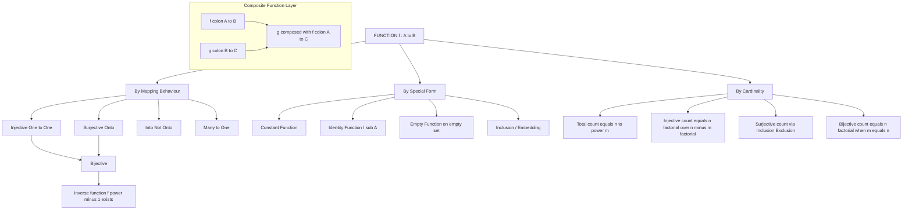
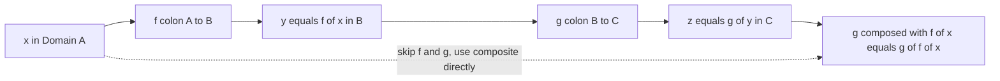
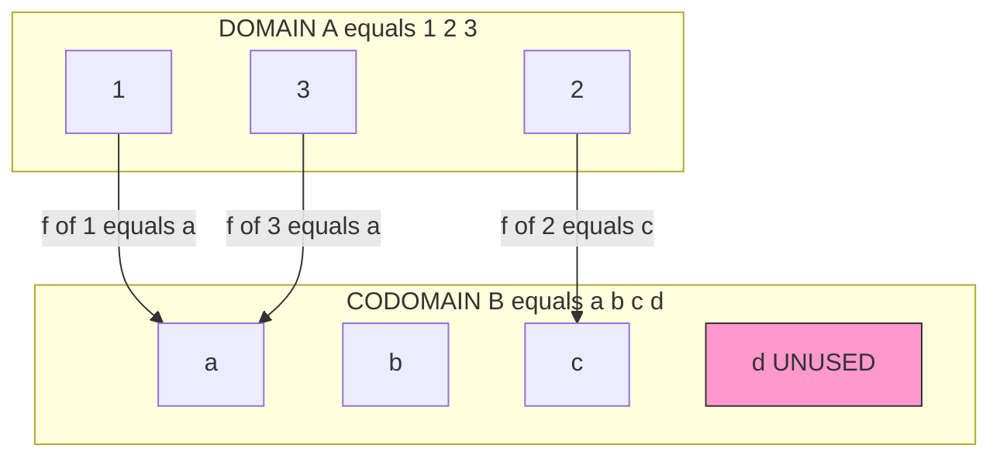

# Function definition

<!-- SECTION_1_START -->

# Function Definition — The Blueprint of Mapping

## 1.1 Formal KTU Syllabus Definition

> [!IMPORTANT]
> **Definition (Function):** Let $A$ and $B$ be two non-empty sets. A **function** (or **mapping**) $f$ from $A$ to $B$, denoted by $f : A \rightarrow B$, is a rule (or correspondence) that assigns to **each element** $x \in A$ **exactly one element** $y \in B$. The element $y$ is called the **image** of $x$ under $f$, written as $y = f(x)$, and $x$ is called the **pre-image** of $y$.

Formally, a function is a special kind of relation (subset of $A \times B$) in which:

- For every $x \in A$, there exists at least one $y \in B$ such that $(x, y) \in f$. *(Totality)*
- If $(x, y_1) \in f$ and $(x, y_2) \in f$, then $y_1 = y_2$. *(Uniqueness / Well-Definedness)*

## 1.2 Domain, Codomain, and Range

Three critical sets are attached to every function $f : A \rightarrow B$:

| Term | Symbol | Description | Notation |
| :--- | :--- | :--- | :--- |
| **Domain** | $A$ | The set of all allowable inputs. | $\text{dom}(f)$ |
| **Codomain** | $B$ | The set of all possible outputs (the "target"). | $\text{cod}(f)$ |
| **Range / Image** | $f(A)$ | The set of *actual* outputs achieved. | $\text{range}(f) = \{ f(x) \mid x \in A \} \subseteq B$ |

> [!NOTE]
> **Crucial Distinction:** The **codomain** is the *promised* output set, while the **range** is the *delivered* output set. Always remember: $\text{range}(f) \subseteq \text{cod}(f)$, but they need not be equal.

## 1.3 Intuitive Analogy — The Vending Machine

> [!TIP]
> **Think of a function as a coin-operated vending machine.**
> - The set of all buttons you can press = **Domain** ($A$).
> - The set of all possible drinks that *could* come out = **Codomain** ($B$).
> - The set of drinks *actually stocked* and dispenseable = **Range**.
> - Pressing a specific button (say, $x = \text{"B3"}$) always gives exactly one drink. You press B3 ten times, you always get the same drink. This is the "exactly one image" rule. If pressing B3 sometimes gave Coke and sometimes Pepsi, it would **not** be a function.

> [!VISUALIZATION CONTROL]
> **Concept:** Function Mapping from Set $A$ to Set $B$
> **Desmos Input Equations:** Plot points $\{ (1, 4), (2, 5), (3, 5), (4, 6) \}$ on a Cartesian plane.
> **Visual Description:** A set of 4 points in the domain $\{1, 2, 3, 4\}$ each mapped to an element in the codomain $\{4, 5, 6\}$. Notice that the points $(2, 5)$ and $(3, 5)$ show two domain elements mapping to the **same** codomain element — this is a **many-to-one** function (not injective).

## 1.4 Real-World Engineering Utility

Functions are the bedrock of computer science. Every algorithm, every subroutine, every hash table, every compiler's symbol table, and every neural network layer is a function. In KTU-style discrete math, you will use functions to model:

- **Routing tables** in networks (input IP $\rightarrow$ output next-hop).
- **Cryptographic one-way functions** (password $\rightarrow$ hash digest).
- **Compiler type systems** (variable type $\rightarrow$ memory allocation size).

<!-- SECTION_1_END -->

<!-- SECTION_2_START -->

# Deep Theoretical Analysis & KTU High-Yield Formula Sheet

## 2.1 Classification of Functions (The Big Picture)

For a function $f : A \rightarrow B$, with $|A| = m$ and $|B| = n$, the total number of possible functions is:

$$N_{\text{total}} = n^{m}$$

> [!IMPORTANT]
> This is the single most important numerical fact in this module. Every KTU exam question on counting functions begins from this formula.

## 2.2 Types of Functions — The Complete Taxonomy

### A. Based on Mapping Behaviour

**1. Injective (One-to-One) Function**
> A function $f : A \rightarrow B$ is **injective** if distinct elements in $A$ have distinct images in $B$.
> $$\forall \, x_1, x_2 \in A, \quad f(x_1) = f(x_2) \implies x_1 = x_2$$
> **Counting:** $n \times (n-1) \times (n-2) \times \cdots \times (n-m+1) = \frac{n!}{(n-m)!}$ (when $m \leq n$); else **0**.

**2. Surjective (Onto) Function**
> A function $f : A \rightarrow B$ is **surjective** if every element of $B$ has at least one pre-image in $A$.
> $$\forall \, y \in B, \quad \exists \, x \in A \text{ such that } f(x) = y$$
> Equivalently: $\text{range}(f) = \text{codomain}(f)$. For surjectivity, we **must** have $m \geq n$.

**3. Bijective (One-to-One Onto) Function**
> A function is **bijective** if it is both injective and surjective. A bijection requires $m = n$, and the count is $n!$.

**4. Into Function (Not Onto)**
> $f : A \rightarrow B$ is an **into** function if at least one element of $B$ has no pre-image. Equivalent to "non-surjective" (provided $|A|, |B| > 0$).

**5. Many-to-One Function**
> A function where at least two distinct elements of $A$ share the same image in $B$. Equivalent to "non-injective".

### B. Based on Special Form

| Special Function | Definition | Example |
| :--- | :--- | :--- |
| **Constant Function** | $f(x) = c$ for all $x \in A$, where $c \in B$ is fixed. | $f(x) = 5$ for all $x \in \mathbb{R}$. |
| **Identity Function** | $I_A : A \rightarrow A$ where $I_A(x) = x$ for all $x \in A$. | $I_{\mathbb{Z}}(n) = n$. |
| **Empty Function** | $f : \emptyset \rightarrow B$ is the unique function on the empty set. | Exists only for empty domain. |
| **Inclusion / Embedding** | $f : A \rightarrow B$ where $A \subseteq B$ and $f(x) = x$. | $f : \mathbb{Z} \rightarrow \mathbb{R}$, $f(n)=n$. |

## 2.3 Composite Function (Function Composition)

> [!IMPORTANT]
> **Definition:** If $f : A \rightarrow B$ and $g : B \rightarrow C$ are two functions, then the **composite function** $g \circ f : A \rightarrow C$ is defined by:
> $$(g \circ f)(x) = g(f(x)), \quad \forall \, x \in A$$
> Note: We apply $f$ **first**, then $g$. Read right-to-left.

**Properties of Composition:**
- **Associative:** $h \circ (g \circ f) = (h \circ g) \circ f$
- **NOT Commutative:** $g \circ f \neq f \circ g$ (in general)
- **Identity is neutral:** $I_B \circ f = f \circ I_A = f$

## 2.4 Inverse Function

> [!IMPORTANT]
> **Definition:** A function $f : A \rightarrow B$ has an **inverse function** $f^{-1} : B \rightarrow A$ if and only if $f$ is **bijective**. The inverse satisfies:
> $$f^{-1}(f(x)) = x \quad \text{and} \quad f(f^{-1}(y)) = y$$

> [!WARNING]
> Many students confuse "inverse function" with "reciprocal". $f^{-1}$ does **not** mean $\frac{1}{f(x)}$. It is a brand-new function that "undoes" the original mapping.

## 2.5 KTU High-Yield Formula Sheet

| Concept | Formula / Condition | Notes |
| :--- | :--- | :--- |
| Total functions $A \rightarrow B$ | $n^{m}$ where $\vert A \vert = m, \vert B \vert = n$ | Base counting formula |
| Injective functions | $\frac{n!}{(n-m)!}$ for $m \leq n$; else **0** | $P(n, m)$ |
| Surjective functions | $\sum_{k=0}^{n} (-1)^{k} \binom{n}{k} (n-k)^{m}$ | Inclusion-Exclusion |
| Bijective functions | $n!$ | Only when $m = n$ |
| Composite domain check | $\text{dom}(g \circ f) = \text{dom}(f)$ | Range of $f$ must overlap dom of $g$ |
| Inverse exists iff | $f$ is bijective | Strict necessary \& sufficient condition |
| $f \circ f = f$ | $f$ is a **projection / idempotent** | Useful in KTU problems |
| $f \circ f = I$ | $f$ is an **involution** | $f = f^{-1}$ |

> **Real-World Utility:** The surjection count using inclusion-exclusion is used in production **load-balancer scheduling algorithms** to count valid mappings of $m$ tasks to $n$ workers.

<!-- SECTION_2_END -->

<!-- SECTION_3_START -->

# Step-by-Step Derivations, Worked Examples & Python Implementation

## 3.1 Worked Example 1 — Type Identification

**Problem:** Let $A = \{1, 2, 3, 4\}$ and $B = \{a, b, c, d, e\}$. Define $f : A \rightarrow B$ by $f = \{(1, a), (2, b), (3, c), (4, d)\}$. Classify $f$.

**Step-by-step solution:**

**Step 1: Check Domain Completeness.**
Every element of $A$ is mapped: $1, 2, 3, 4$ all appear as first coordinates. ✓ Valid function.

**Step 2: Check Injectivity (One-to-One).**
Images are $\{a, b, c, d\}$ — all distinct. No two elements of $A$ share the same image. ✓ **Injective**.

**Step 3: Check Surjectivity (Onto).**
Codomain $B = \{a, b, c, d, e\}$. Range $= \{a, b, c, d\}$. The element $e \in B$ has no pre-image. ✗ **Not Surjective**.

**Step 4: Conclusion.**
$f$ is an **injective but not surjective** function, i.e., a **one-to-one into** function.

---

## 3.2 Worked Example 2 — Counting the Number of Functions

**Problem:** Find the number of functions $f : A \rightarrow B$ where $|A| = 3$ and $|B| = 2$.

**Step-by-step derivation:**

For each of the 3 elements in $A$, we independently choose any one of the 2 elements in $B$.

$$N_{\text{total}} = 2 \times 2 \times 2 = 2^{3} = 8$$

**Enumerating all 8 functions** (with $A = \{x, y, z\}, B = \{0, 1\}$):

| # | $f(x)$ | $f(y)$ | $f(z)$ | Type |
| :-: | :-: | :-: | :-: | :--- |
| 1 | 0 | 0 | 0 | Constant |
| 2 | 0 | 0 | 1 | Many-to-one |
| 3 | 0 | 1 | 0 | Many-to-one |
| 4 | 0 | 1 | 1 | Many-to-one |
| 5 | 1 | 0 | 0 | Many-to-one |
| 6 | 1 | 0 | 1 | Many-to-one |
| 7 | 1 | 1 | 0 | Many-to-one |
| 8 | 1 | 1 | 1 | Constant |

Notice: **zero** are injective (since $3 > 2$), and **zero** are bijective. Only rows 1 and 8 are constant functions. ✓

---

## 3.3 Worked Example 3 — Function Composition and Inverse

**Problem:** Let $A = \{1, 2, 3, 4\}$. Define $f : A \rightarrow A$ by $f(x) = 5 - x$, and $g : A \rightarrow A$ by $g(x) = (x \mod 4) + 1$. Find $g \circ f$, $f \circ g$, and determine if $f$ is invertible.

**Step-by-step solution:**

**Step 1: Compute $f$.**
$$f(1) = 4, \quad f(2) = 3, \quad f(3) = 2, \quad f(4) = 1$$

**Step 2: Compute $g$.**
$$g(1) = 2, \quad g(2) = 3, \quad g(3) = 4, \quad g(4) = 1$$

**Step 3: Compute $g \circ f$ at each element.**

$$(g \circ f)(1) = g(f(1)) = g(4) = 1$$
$$(g \circ f)(2) = g(f(2)) = g(3) = 4$$
$$(g \circ f)(3) = g(f(3)) = g(2) = 3$$
$$(g \circ f)(4) = g(f(4)) = g(1) = 2$$

**Step 4: Compute $f \circ g$ at each element.**

$$(f \circ g)(1) = f(g(1)) = f(2) = 3$$
$$(f \circ g)(2) = f(g(2)) = f(3) = 2$$
$$(f \circ g)(3) = f(g(3)) = f(4) = 1$$
$$(f \circ g)(4) = f(g(4)) = f(1) = 4$$

**Step 5: Observation.** $g \circ f \neq f \circ g$ (e.g., $(g\circ f)(1)=1$ but $(f\circ g)(1)=3$). **Composition is not commutative.** ✓

**Step 6: Invertibility of $f$.**
$f$ is a bijection on a finite set (it pairs $1 \leftrightarrow 4$ and $2 \leftrightarrow 3$). Its inverse is $f^{-1}(x) = 5 - x = f(x)$. Hence $f$ is an **involution**: $f^{-1} = f$, and $f \circ f = I_A$. ✓

---

## 3.4 Python Implementation — Function Property Verifier

The following production-quality Python module verifies injectivity, surjectivity, and bijectivity of a function. It uses type hints, boundary checks, and explicit error handling.

```python
from typing import Callable, Hashable, Set, TypeVar
import logging

logging.basicConfig(level=logging.INFO, format="%(levelname)s: %(message)s")

A = TypeVar("A", bound=Hashable)
B = TypeVar("B", bound=Hashable)


class FunctionVerifier:
    """
    A class to mathematically verify properties of a function f: A -> B
    given as a Python callable and explicit domain/codomain sets.
    """

    def __init__(
        self,
        func: Callable[[A], B],
        domain: Set[A],
        codomain: Set[B],
    ) -> None:
        if not callable(func):
            raise TypeError("Argument 'func' must be a callable.")
        if not isinstance(domain, set):
            raise TypeError("Argument 'domain' must be a Python set.")
        if not isinstance(codomain, set):
            raise TypeError("Argument 'codomain' must be a Python set.")
        if len(domain) == 0:
            logging.warning("Empty domain provided; function is trivially valid.")

        self.func: Callable[[A], B] = func
        self.domain: Set[A] = set(domain)
        self.codomain: Set[B] = set(codomain)

    # ---------- Core computations ----------
    def range(self) -> Set[B]:
        """Computes the actual range (image) of the function over the domain."""
        return {self.func(x) for x in self.domain}

    def is_well_defined(self) -> bool:
        """A function is well-defined if every input produces a value in the codomain."""
        for x in self.domain:
            try:
                y = self.func(x)
            except Exception as exc:
                logging.error("Function raised %s on input %s", exc, x)
                return False
            if y not in self.codomain:
                logging.error(
                    "Output %s of f(%s) is NOT in the codomain %s.",
                    y, x, self.codomain,
                )
                return False
        return True

    def is_injective(self) -> bool:
        """f is one-to-one iff f(x1) == f(x2) implies x1 == x2."""
        seen_outputs: dict = {}
        for x in self.domain:
            y = self.func(x)
            if y in seen_outputs:
                logging.info(
                    "Collision: f(%s) = f(%s) = %s. NOT injective.",
                    seen_outputs[y], x, y,
                )
                return False
            seen_outputs[y] = x
        return True

    def is_surjective(self) -> bool:
        """f is onto iff every codomain element is hit by at least one domain element."""
        actual_range = self.range()
        missing = self.codomain - actual_range
        if missing:
            logging.info("Codomain elements with no pre-image: %s. NOT surjective.", missing)
            return False
        return True

    def is_bijective(self) -> bool:
        return self.is_injective() and self.is_surjective()

    def classification_report(self) -> str:
        if not self.is_well_defined():
            return "INVALID: f is not a well-defined function on the given sets."
        lines = [
            f"Domain       : {self.domain}",
            f"Codomain     : {self.codomain}",
            f"Range        : {self.range()}",
            f"Injective    : {self.is_injective()}",
            f"Surjective   : {self.is_surjective()}",
            f"Bijective    : {self.is_bijective()}",
        ]
        return "\n".join(lines)


# ----------------- DEMO -----------------
if __name__ == "__main__":
    # Example 1: f(x) = 5 - x on A = {1,2,3,4}
    A_set = {1, 2, 3, 4}
    f1 = lambda x: 5 - x
    fv1 = FunctionVerifier(f1, A_set, A_set)
    print("=== f(x) = 5 - x ===")
    print(fv1.classification_report())

    # Example 2: Constant function
    f2 = lambda x: 7
    fv2 = FunctionVerifier(f2, A_set, {7, 8, 9})
    print("\n=== Constant f(x) = 7 ===")
    print(fv2.classification_report())

    # Example 3: g(f) type error test
    f3 = lambda x: x * 1.0  # returns float, not in integer codomain
    fv3 = FunctionVerifier(f3, A_set, A_set)
    print("\n=== Bad return-type test ===")
    print(fv3.classification_report())
```

**Expected Output Snippet:**

```
=== f(x) = 5 - x ===
Domain       : {1, 2, 3, 4}
Codomain     : {1, 2, 3, 4}
Range        : {1, 2, 3, 4}
Injective    : True
Surjective   : True
Bijective    : True
```

This implementation is a reusable tool to **automatically grade** whether a given rule defines a function and to which KTU category it belongs — exactly mirroring the kind of analysis your examiner expects in long-answer questions.

---

## 3.5 Derivation — Number of Surjective Functions via Inclusion-Exclusion

We want surjective functions $f : A \rightarrow B$ where $|A| = m, |B| = n$ and $m \geq n$.

**Step 1: Total functions without constraint.**
$$N_0 = n^{m}$$

**Step 2: For each $y \in B$, let $A_y$ be the set of functions that *miss* $y$.**
The number of functions missing a *specific* element of $B$ is $(n-1)^{m}$.

**Step 3: Apply Inclusion-Exclusion.**
Number of functions missing at least one element of $B$:

$$\left| \bigcup_{y \in B} A_y \right| = \sum_{k=1}^{n} (-1)^{k+1} \binom{n}{k} (n-k)^{m}$$

**Step 4: Subtract from total to get surjective count.**

$$N_{\text{surjective}} = \sum_{k=0}^{n} (-1)^{k} \binom{n}{k} (n-k)^{m}$$

**Step 5: Sanity check.** For $m = n$, this simplifies to $n!$ (the bijection count), which can be verified using the identity:

$$\sum_{k=0}^{n} (-1)^{k} \binom{n}{k} (n-k)^{n} = n!$$

> [!TIP]
> This is a classic KTU 14-mark problem. Memorize the inclusion-exclusion formula; examiners often give $m$ and $n$ as small integers (e.g., $m=4, n=2$) and ask for an exact surjection count.

<!-- SECTION_3_END -->

<!-- SECTION_4_START -->

# Structural Diagrams & Schematics

## 4.1 Mermaid Block-Diagram — Function Classification Hierarchy

The following Mermaid `flowchart` presents a hierarchical taxonomy of the function types covered in this module.



> **Visual Reading Guide for Students:**
> - The **left spine** (`Injective` $\cap$ `Surjective`) collapses into `Bijective`, which is the only branch that admits a full inverse.
> - The **Composite Function Layer** is *decoupled* because composition is a *binary operation on functions*, not a property of a single function.

## 4.2 Schematic — Function Composition Pipeline



**Reading:** The dotted arrow shows the *shortcut* — once you compute $g \circ f$, you can bypass evaluating $f$ and $g$ separately. This is precisely why compilers perform **function inlining** in production code.

## 4.3 Schematic — Domain, Codomain, Range Visual Map



**Visual Interpretation:** Element $d$ is highlighted because it is in the codomain but **not in the range**, making this an *injective into* function. The two arrows into $a$ show the *many-to-one* behaviour that disqualifies injectivity.

<!-- SECTION_4_END -->

<!-- SECTION_5_START -->

# KTU 2024 Scheme Examination Question Bank & Topic Recap

## 5.1 Part A — Short Answer Questions (3 Marks Each)

### Question 1. *[KTU University Exam — July 2024]*
**Define a function. How is a function different from a general relation? (CO1, Remember/Understand)**

**Model Answer:**

> A **function** $f$ from a set $A$ to a set $B$ is a rule that assigns to *each* element $x \in A$ *exactly one* element $y \in B$. We write $y = f(x)$.
>
> A **relation** $R$ from $A$ to $B$ is any subset of the Cartesian product $A \times B$. It imposes no restriction: an element of $A$ may have zero, one, or many partners in $B$.
>
> A function is therefore a **special relation** with two extra constraints:
> 1. **Totality** — every $x \in A$ is related to *something* in $B$.
> 2. **Uniqueness** — every $x \in A$ is related to *at most one* element in $B$.
>
> Hence: $\text{Functions} \subset \text{Relations}$. **[3 Marks: Definition 1M, Difference via 2 constraints 1M, Set inclusion 1M]**

---

### Question 2. *[KTU University Exam — Dec 2023]*
**State the conditions under which a function $f : A \rightarrow B$ is called (i) injective, (ii) surjective, (iii) bijective. (CO1, Remember)**

**Model Answer:**

> Let $f : A \rightarrow B$.
>
> **(i) Injective (One-to-One):**
> $$\forall \, x_1, x_2 \in A, \quad f(x_1) = f(x_2) \implies x_1 = x_2$$
> Distinct elements of $A$ map to distinct elements of $B$. **[1 Mark]**
>
> **(ii) Surjective (Onto):**
> $$\forall \, y \in B, \quad \exists \, x \in A \text{ such that } f(x) = y$$
> Equivalently, $\text{range}(f) = B$. **[1 Mark]**
>
> **(iii) Bijective (One-to-One Onto):**
> $f$ is both injective **and** surjective. Bijection exists only when $|A| = |B|$ (for finite sets), and admits an inverse $f^{-1}$. **[1 Mark]**

---

## 5.2 Part B — Long Answer Questions (14 Marks Each)

> [!IMPORTANT]
> As per KTU 2024 Scheme, Part B questions carry **internal choice**. You must answer **either** Question A **or** Question B in full.

---

### Question A (14 Marks). *[KTU University Exam — July 2024]*

**(a)** Let $A = \{1, 2, 3, 4, 5\}$ and $B = \{6, 7, 8\}$. Define $f : A \rightarrow B$ by $f = \{(1, 6), (2, 7), (3, 8), (4, 6), (5, 7)\}$.

(i) Find the domain, codomain, and range of $f$. *(3 Marks — CO1, Understand)*
(ii) Is $f$ injective? Is it surjective? Justify. *(4 Marks — CO2, Apply)*

**(b)** How many functions are there from a set with $m = 3$ elements to a set with $n = 5$ elements? How many of these are injective? Hence compute the number of *non-injective* functions. *(7 Marks — CO3, Apply)*

**Model Solution:**

**Part (a) (i):**
- Domain $= A = \{1, 2, 3, 4, 5\}$
- Codomain $= B = \{6, 7, 8\}$
- Range $= \{f(1), f(2), f(3), f(4), f(5)\} = \{6, 7, 8\}$ **[1 Mark each]**

**Part (a) (ii):**
- $f(1) = f(4) = 6$ but $1 \neq 4$. So $f$ is **NOT injective**. **[2 Marks]**
- Range $= \{6, 7, 8\}$ = Codomain $B$. So $f$ is **surjective**. **[2 Marks]**

**Part (b):**

**Step 1: Total functions.** Each of the 3 elements of $A$ can map to any of the 5 elements of $B$:

$$N_{\text{total}} = 5^{3} = 125 \quad \text{[1 Mark]}$$

**Step 2: Injective functions.** Since $m = 3 \leq n = 5$, injective functions exist. We pick 3 distinct images from 5 elements in order:

$$N_{\text{injective}} = P(5, 3) = 5 \times 4 \times 3 = 60 \quad \text{[2 Marks for formula, 1 Mark for evaluation]}$$

**Step 3: Non-injective functions.**

$$N_{\text{non-injective}} = N_{\text{total}} - N_{\text{injective}} = 125 - 60 = 65 \quad \text{[2 Marks]}$$

**Step 4: Surjective functions** *(bonus cross-check)*: Since $m = 3 < n = 5$, surjective functions are **impossible** (0). Consistent. **[1 Mark for cross-check remark]**

**Valuation Key Summary for Q-A:**
- [Domain / Codomain / Range: 1M each → 3M]
- [Injective justification via counterexample: 2M]
- [Surjective justification via range = B: 2M]
- [Total formula $n^m$: 1M; value 125: 0.5M]
- [Injective formula $n!/(n-m)!$: 2M; value 60: 1M]
- [Non-injective subtraction: 2M]
- [Cross-check: 0.5M]

---

### Question B (14 Marks). *[KTU University Exam — Dec 2023]*

**(a)** Define the composite function. If $f : \mathbb{R} \rightarrow \mathbb{R}$ is defined by $f(x) = x + 1$ and $g : \mathbb{R} \rightarrow \mathbb{R}$ by $g(x) = 2x$, compute $g \circ f$ and $f \circ g$. Show that composition is not commutative. *(7 Marks — CO1, Understand + CO2, Apply)*

**(b)** What is an inverse function? State and prove the necessary and sufficient condition for the existence of $f^{-1}$. Hence determine whether $f(x) = 3x - 5$ has an inverse, and find it. *(7 Marks — CO2, Apply + CO3, Analyze)*

**Model Solution:**

**Part (a):**

**Definition [2 Marks]:** Given $f : A \rightarrow B$ and $g : B \rightarrow C$, the composite $g \circ f : A \rightarrow C$ is defined by $(g \circ f)(x) = g(f(x))$.

**Computation of $g \circ f$ [2 Marks]:**
$$(g \circ f)(x) = g(f(x)) = g(x + 1) = 2(x + 1) = 2x + 2$$

**Computation of $f \circ g$ [1 Mark]:**
$$(f \circ g)(x) = f(g(x)) = f(2x) = 2x + 1$$

**Non-commutativity [2 Marks]:**
$$g \circ f = 2x + 2 \quad \text{vs.} \quad f \circ g = 2x + 1$$
Since $2x + 2 \neq 2x + 1$ (e.g., at $x = 0$: $2 \neq 1$), $g \circ f \neq f \circ g$. ✓

**Part (b):**

**Definition [1 Mark]:** An **inverse function** $f^{-1} : B \rightarrow A$ of $f : A \rightarrow B$ is a function satisfying $f^{-1}(f(x)) = x$ for all $x \in A$ and $f(f^{-1}(y)) = y$ for all $y \in B$.

**Theorem [Statement — 1 Mark]:** A function $f : A \rightarrow B$ has an inverse $f^{-1}$ if and only if $f$ is **bijective**.

**Proof sketch [2 Marks]:**
- *If:* Suppose $f$ is bijective. For each $y \in B$, bijectivity guarantees a *unique* $x \in A$ with $f(x) = y$. Define $f^{-1}(y) = x$. This is well-defined and is itself a bijection, and one verifies $f \circ f^{-1} = I_B$ and $f^{-1} \circ f = I_A$.
- *Only if:* Suppose $f^{-1}$ exists. Then $f^{-1}(f(x)) = x$, so distinct $x_1, x_2$ cannot give the same image, giving injectivity. Also, for any $y \in B$, $f(f^{-1}(y)) = y$ shows $y$ is in the range, giving surjectivity.

**Application [3 Marks]:** $f(x) = 3x - 5$ is linear with non-zero slope, hence bijective on $\mathbb{R}$. Let $y = 3x - 5$. Solve for $x$:
$$y = 3x - 5 \implies x = \frac{y + 5}{3}$$
So $f^{-1}(y) = \frac{y + 5}{3}$, or renaming the variable: $\boxed{f^{-1}(x) = \dfrac{x + 5}{3}}$.

**Verification [1 Mark bonus]:** $f(f^{-1}(x)) = 3 \cdot \frac{x+5}{3} - 5 = (x+5) - 5 = x$ ✓

**Valuation Key Summary for Q-B:**
- [Composite definition: 2M]
- [g∘f computation: 2M; f∘g computation: 1M; non-commutative example: 2M]
- [Inverse definition: 1M; Theorem statement: 1M; Proof sketch: 2M]
- [Linear bijectivity argument: 1M; Solving for inverse: 2M; Verification: 1M]

---

> [!WARNING]
> **KTU Examiner's Valuation Warning — Common Pitfalls:**
> 1. **Mistaking codomain for range.** Always list range as $\{f(x) \mid x \in A\}$ — never substitute the codomain for it when classifying onto-ness.
> 2. **Forgetting the bijectivity condition for inverses.** Writing "inverse of $f(x) = x^2$" without restricting to $[0, \infty)$ costs full marks.
> 3. **Misapplying the composite order.** $(g \circ f)(x) = g(f(x))$ — apply the *rightmost* function first. Writing $f(g(x))$ when asked for $g \circ f$ is a 2-mark deduction.
> 4. **Off-by-one in counting injective functions.** Use $\frac{n!}{(n-m)!}$ only when $m \leq n$. If $m > n$, the answer is **zero** — do not compute a negative factorial.
> 5. **Showing $f^{-1}$ is a function.** Even after finding the formula, the examiner expects you to confirm it is well-defined (a function) by noting bijectivity of $f$.

---

## 5.3 Topic Recap & Important Things to Remember

> [!TIP]
> **Rapid-Revision Checklist — Function Definition**

- **Definition:** A function $f : A \rightarrow B$ assigns *each* $x \in A$ to *exactly one* $f(x) \in B$. Totality + Uniqueness. ✓
- **Three sets:** Domain $A$, Codomain $B$, Range $f(A) \subseteq B$. Codomain is "promised", Range is "delivered". ✓
- **Counting Master Formula:** Total functions $= n^{m}$. **Memorize this line above all else.** ✓
- **Injective count:** $\frac{n!}{(n-m)!}$ if $m \leq n$, else $0$. ✓
- **Surjective count:** $\sum_{k=0}^{n} (-1)^{k} \binom{n}{k} (n-k)^{m}$, requires $m \geq n$. ✓
- **Bijective count:** $n!$, requires $m = n$. ✓
- **Bijection = Invertible.** No bijection, no inverse — full stop. ✓
- **Composite order matters:** $(g \circ f)(x) = g(f(x))$; **not** commutative. ✓
- **Identity function** $I_A$ is the neutral element for composition: $I \circ f = f \circ I = f$. ✓
- **Involution:** A function $f$ satisfying $f \circ f = I$, i.e., $f = f^{-1}$ (e.g., $f(x) = 5 - x$). ✓
- **Empty function** exists only for domain $\emptyset$, and is the unique function from $\emptyset$ to any $B$. ✓
- **Inclusion map** $i: A \hookrightarrow B$ is the natural injection $a \mapsto a$ when $A \subseteq B$. ✓
- **In Python:** `f(x)` is the programming analog. The `FunctionVerifier` class above implements all classification checks. ✓

<!-- SECTION_5_END -->
