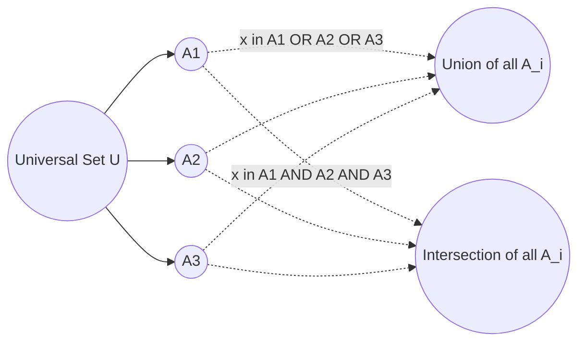
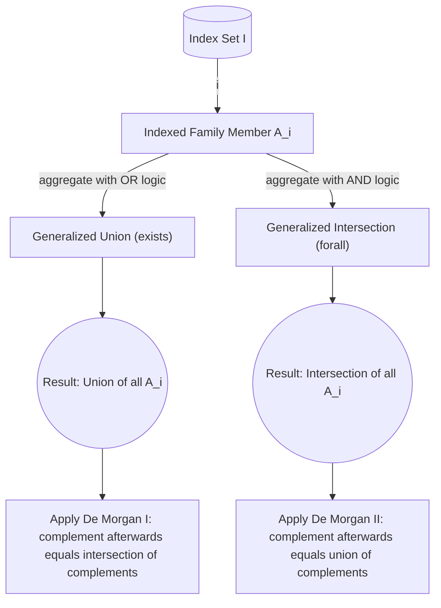
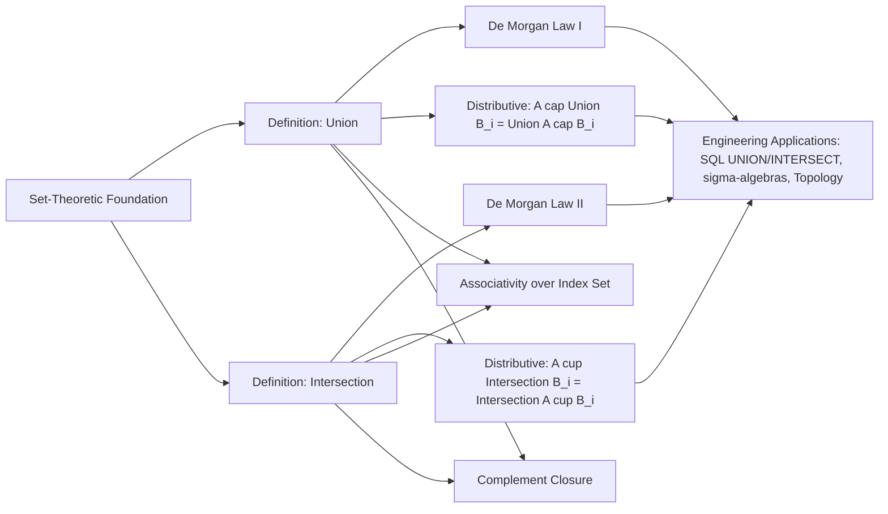
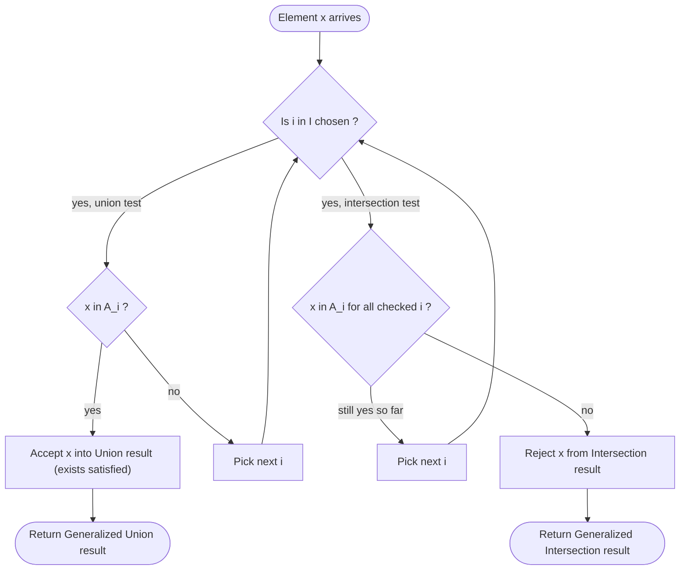

# Generalized Unions and Intersections

<!-- SECTION_1_START -->

# Generalized Unions and Intersections — Formal Definition & Intuition

In the study of discrete structures, when we move beyond two or three sets, we need a compact, scalable way to *combine* an arbitrary collection of sets. The KTU 2024 Scheme (PCCST205) introduces this idea under **Generalized Set Operations**, where a *family* of sets is indexed by a set $I$ (the index set) and operated on collectively.

> [!IMPORTANT]
> **Generalized Union (Definition).** Let $\{A_i : i \in I\}$ be a family of sets indexed by a non-empty index set $I$. The **generalized union** is the set of all elements that belong to *at least one* $A_i$:
> $$\bigcup_{i \in I} A_i = \{\, x \mid x \in A_i \text{ for some } i \in I \,\}$$

> [!IMPORTANT]
> **Generalized Intersection (Definition).** For the same indexed family, the **generalized intersection** is the set of all elements belonging to *every* $A_i$:
> $$\bigcap_{i \in I} A_i = \{\, x \mid x \in A_i \text{ for every } i \in I \,\}$$

The phrase **"indexed family"** simply means each set in the collection has been *labelled* by a value $i$ drawn from $I$. Common notations you will see in KTU papers:

| Notation | Meaning | Typical Use |
| :--- | :--- | :--- |
| $\bigcup_{i=1}^{n} A_i$ | Finite union, $n$ sets | $I = \{1,2,\dots,n\}$ |
| $\bigcap_{i=1}^{n} A_i$ | Finite intersection | $I = \{1,2,\dots,n\}$ |
| $\bigcup_{i=1}^{\infty} A_i$ | Countably infinite union | $I = \mathbb{N}$ |
| $\bigcap_{i=1}^{\infty} A_i$ | Countably infinite intersection | $I = \mathbb{N}$ |
| $\bigcup_{i \in I} A_i$ | Arbitrary (possibly uncountable) union | $I$ is any non-empty set |

> [!NOTE]
> **Special Case — Empty Index Set.** By convention, $\bigcup_{i \in \emptyset} A_i = \emptyset$ and $\bigcap_{i \in \emptyset} A_i = U$ (the universal set). This is consistent with the logic: vacuous existence for the union, universal quantification for the intersection.

---

## Intuitive Analogy — "The Club Membership Ledger"

Imagine a university has **many clubs** (Coding Club, Music Club, Robotics Club, …). Each club has its own list of student members $A_1, A_2, A_3, \dots$, and the *family* of these lists is indexed by $I$ (the set of all clubs).

* $\bigcup_{i \in I} A_i$ → "**Everyone who is in at least one club**" — the master mailing list combining all clubs.
* $\bigcap_{i \in I} A_i$ → "**Everyone who is in every club**" — the rare students who happen to be in *all* of them (often empty in real life!).

The first is large (additive idea), the second is small (restrictive idea). The *index set* $I$ is just the bookkeeping device that tells us *which* clubs to combine.

> [!TIP]
> A useful mental shortcut:
> * $\bigcup$ (cup) → "Pick **any** $i$, element must be in **some** $A_i$." (Existential quantifier $\exists$)
> * $\bigcap$ (cap) → "For **all** $i$, element must be in **each** $A_i$." (Universal quantifier $\forall$)

---

## Visual Intuition — Venn-Style Picture



The **cup** operation widens, the **cap** operation narrows — the number of sets is irrelevant; the rule stays the same.

> [!VISUALIZATION CONTROL]
> **Concept:** Behaviour of Generalized Union & Intersection as the index set grows
> **GeoGebra / Desmos Input Equations (for finite case, $n=3$):**
> * $A_1 = [0, 3] \cup \{5\}$
> * $A_2 = [2, 5] \cup \{7\}$
> * $A_3 = \{1, 4, 6, 8\}$
> * `Union(x) = piecewise( x ∈ A1 OR x ∈ A2 OR x ∈ A3 )`
> * `Intersection(x) = piecewise( x ∈ A1 AND x ∈ A2 AND x ∈ A3 )`
> **Visual Description:** On the number line, the union marker lights up wherever *any* one of the three membership rules is satisfied; the intersection marker lights up only on the common overlap (here possibly empty, illustrating the typical small size of $\bigcap$).

<!-- SECTION_1_END -->

<!-- SECTION_2_START -->

# Deep Theoretical Analysis & KTU High-Yield Formula Sheet

## 2.1 Operational Logic — How $\bigcup$ and $\bigcap$ Really Work

To handle generalized operations rigorously (a KTU 2024 board favourite), restate them in predicate-logic form.

| Operation | Predicate-Logic Translation | Quantifier Type |
| :--- | :--- | :--- |
| $x \in \bigcup_{i \in I} A_i$ | $\exists\, i \in I : x \in A_i$ | Existential |
| $x \in \bigcap_{i \in I} A_i$ | $\forall\, i \in I : x \in A_i$ | Universal |

This logical view is what enables the *de Morgan* and *quantifier* swap laws below — a guaranteed 14-mark question in almost every KTU ESE paper.

## 2.2 Step-by-Step Logical Reduction

For the **union** $x \in \bigcup_{i \in I} A_i$:

1. *Unpack* the symbol: $x$ belongs to the union iff there exists an index $i \in I$ such that $x \in A_i$.
2. *Apply set-builder*: $x$ satisfies $\bigvee_{i \in I} (x \in A_i)$ — a disjunction over all $i$.
3. *Negation* (used in proofs): $x \notin \bigcup_{i \in I} A_i \iff \forall\, i \in I : x \notin A_i$.

For the **intersection** $x \in \bigcap_{i \in I} A_i$:

1. *Unpack*: $x$ belongs to the intersection iff **for every** $i \in I$, $x \in A_i$.
2. *Apply set-builder*: $x$ satisfies $\bigwedge_{i \in I} (x \in A_i)$ — a conjunction over all $i$.
3. *Negation*: $x \notin \bigcap_{i \in I} A_i \iff \exists\, i \in I : x \notin A_i$.

> [!TIP]
> **Quantifier-Swap Rule.** A universal quantifier $(\forall)$ over a negation flips to an existential $(\exists)$, and vice versa. This single rule generates the famous **De Morgan's Laws for generalized sets**.

## 2.3 The KTU High-Yield Formula Sheet (Memorise This)

| # | Law | Generalized Form | Category |
| :---: | :--- | :--- | :--- |
| 1 | Identity | $A \cup \emptyset = A$, $\;A \cap U = A$ | Identity |
| 2 | Domination | $A \cup U = U$, $\;A \cap \emptyset = \emptyset$ | Domination |
| 3 | Idempotent | $\bigcup_{i \in I} A = A$ (when all $A_i = A$) | Idempotent |
| 4 | Commutative | $\bigcup_{i \in I} A_i = \bigcup_{j \in I} A_{\sigma(j)}$ (permutation $\sigma$) | Commutative |
| 5 | Associative | $\bigcup_{i \in I} \bigcup_{j \in J} A_{i,j} = \bigcup_{(i,j) \in I \times J} A_{i,j}$ | Associative |
| 6 | Distributive | $A \cap \left(\bigcup_{i \in I} B_i\right) = \bigcup_{i \in I} (A \cap B_i)$ | Distributive |
| 7 | Distributive | $A \cup \left(\bigcap_{i \in I} B_i\right) = \bigcap_{i \in I} (A \cup B_i)$ | Distributive |
| 8 | De Morgan (I) | $\left(\bigcup_{i \in I} A_i\right)^c = \bigcap_{i \in I} A_i^c$ | De Morgan |
| 9 | De Morgan (II) | $\left(\bigcap_{i \in I} A_i\right)^c = \bigcup_{i \in I} A_i^c$ | De Morgan |
| 10 | Absorption | $A \cup \left(\bigcap_{i \in I} A_i\right) = A$, $\;A \cap \left(\bigcup_{i \in I} A_i\right) = A$ | Absorption |
| 11 | Complement | $\left(\bigcup_{i \in I} A_i\right)^c \cup \bigcup_{i \in I} A_i = U$ | Complement |
| 12 | Dist. of $\cap$ over $\cup$ | $\bigcap_{i \in I} \left(\bigcup_{j \in J_i} A_j\right) = \bigcup_{f \in \prod J_i} \bigcap_{i \in I} A_{f(i)}$ | Generalized Dist. |

> [!WARNING]
> **KTU Board Trap.** Law **12** (generalized distributivity) involves a *function* $f$ choosing one representative from each $J_i$. Most KTU answer-script losses happen because students forget the dependence on the *choice function* $f$. When in doubt, use the two-set version in your exam and cite it as a corollary.

## 2.4 Engineering & Computer-Science Utility

* **Databases (SQL).** $\bigcup$ corresponds to `UNION` / `UNION ALL`; $\bigcap$ corresponds to `INTERSECT`. Indexing families model *parameterized queries* with `IN` clauses over arbitrary result sets.
* **Probability & Measure Theory.** A *$\sigma$-algebra* is precisely a non-empty family $\mathcal{F}$ of subsets of a sample space $\Omega$ that is **closed under countable unions and complements**. The closure axioms are *exactly* the generalized operations we have just studied.
* **Topology.** A *topology* $\tau$ on a set $X$ is closed under arbitrary unions and finite intersections — generalized operations with an index set $I$ that may be uncountable.
* **Compiler Design & Formal Languages.** Kleene's theorem for regular languages uses the union of *infinitely many* finite concatenations. Generalized union formalizes this without writing "$\dots$" notation.
* **Boolean Logic & Hardware.** Multi-input logic gates ($n$-input OR, $n$-input AND) are *literally* the physical embodiment of $\bigcup$ and $\bigcap$ over $n$ Boolean sets $\{0,1\}$.

> [!NOTE]
> The phrase **"closed under arbitrary unions"** that you will see in $\sigma$-algebra or topology definitions is *not* a new operation — it is *exactly* the generalized union $\bigcup_{i \in I} A_i$ for any $I$ you choose.

<!-- SECTION_2_END -->

<!-- SECTION_3_START -->

# Step-by-Step Derivations & Symbolic / Code Implementation

## 3.1 Worked Derivation — Generalized De Morgan's Law (I)

**Claim.** $\left(\bigcup_{i \in I} A_i\right)^c = \bigcap_{i \in I} A_i^c$.

**Proof (membership / "if and only if" style — KTU preferred pattern).**

We prove the two inclusions separately.

### Part 1: $\left(\bigcup_{i \in I} A_i\right)^c \;\subseteq\; \bigcap_{i \in I} A_i^c$

Let $x \in \left(\bigcup_{i \in I} A_i\right)^c$. Then by definition of complement:

$$x \notin \bigcup_{i \in I} A_i$$

By the unpacked form of union:

$$\nexists\, i \in I : x \in A_i$$

Negating the existential quantifier gives a universal:

$$\forall\, i \in I : x \notin A_i$$

Applying complement definition $x \notin A_i \iff x \in A_i^c$:

$$\forall\, i \in I : x \in A_i^c$$

By definition of generalized intersection:

$$x \in \bigcap_{i \in I} A_i^c$$

Hence $\left(\bigcup_{i \in I} A_i\right)^c \;\subseteq\; \bigcap_{i \in I} A_i^c$. $\blacksquare$ (Half-1)

### Part 2: $\bigcap_{i \in I} A_i^c \;\subseteq\; \left(\bigcup_{i \in I} A_i\right)^c$

Let $x \in \bigcap_{i \in I} A_i^c$. Then by definition of intersection:

$$\forall\, i \in I : x \in A_i^c$$

By complement definition $x \in A_i^c \iff x \notin A_i$:

$$\forall\, i \in I : x \notin A_i$$

Equivalently, no index has $x \in A_i$:

$$\nexists\, i \in I : x \in A_i$$

By unpacked form of union:

$$x \notin \bigcup_{i \in I} A_i$$

By definition of complement:

$$x \in \left(\bigcup_{i \in I} A_i\right)^c$$

Hence $\bigcap_{i \in I} A_i^c \;\subseteq\; \left(\bigcup_{i \in I} A_i\right)^c$. $\blacksquare$ (Half-2)

Combining both halves, $\left(\bigcup_{i \in I} A_i\right)^c = \bigcap_{i \in I} A_i^c$. $\blacksquare$

> [!NOTE]
> **Valuation key for the proof (KTU style):**
> * [Membership definition unpack: 2 Marks]
> * [Quantifier flip $\nexists \to \forall$: 2 Marks]
> * [Complement conversion: 1 Mark]
> * [Reverse inclusion (2nd half): 2 Marks]
> * [Final statement and $\blacksquare$: 1 Mark]

## 3.2 Worked Derivation — Generalized Distributive Law

**Claim.** $A \cap \left(\bigcup_{i \in I} B_i\right) = \bigcup_{i \in I} (A \cap B_i)$.

**Proof.** Again we show both inclusions.

### Part 1: $A \cap \left(\bigcup_{i \in I} B_i\right) \;\subseteq\; \bigcup_{i \in I} (A \cap B_i)$

Let $x \in A \cap \left(\bigcup_{i \in I} B_i\right)$. By intersection:

$$x \in A \;\;\text{and}\;\; x \in \bigcup_{i \in I} B_i$$

By the union unpacking, there exists some $k \in I$ with $x \in B_k$:

$$\exists\, k \in I : x \in B_k$$

Combining with $x \in A$:

$$\exists\, k \in I : x \in A \cap B_k$$

Re-applying the union packing:

$$x \in \bigcup_{i \in I} (A \cap B_i)$$

Hence $A \cap \left(\bigcup_{i \in I} B_i\right) \;\subseteq\; \bigcup_{i \in I} (A \cap B_i)$. $\blacksquare$

### Part 2: $\bigcup_{i \in I} (A \cap B_i) \;\subseteq\; A \cap \left(\bigcup_{i \in I} B_i\right)$

Let $x \in \bigcup_{i \in I} (A \cap B_i)$. Then:

$$\exists\, k \in I : x \in A \cap B_k$$

By intersection:

$$x \in A \;\;\text{and}\;\; x \in B_k$$

Since $B_k \subseteq \bigcup_{i \in I} B_i$:

$$x \in A \;\;\text{and}\;\; x \in \bigcup_{i \in I} B_i$$

By intersection:

$$x \in A \cap \left(\bigcup_{i \in I} B_i\right)$$

Hence $\bigcup_{i \in I} (A \cap B_i) \;\subseteq\; A \cap \left(\bigcup_{i \in I} B_i\right)$. $\blacksquare$

Combining both halves proves the claim. $\blacksquare$

## 3.3 Worked Numerical Example — Finite Indexing

Let $A_1 = \{1, 2, 3\}$, $A_2 = \{2, 3, 4\}$, $A_3 = \{3, 4, 5\}$, and the universal set $U = \{1, 2, 3, 4, 5\}$.

Compute the generalized operations and verify De Morgan.

**Step 1.** Compute the union:

$$\bigcup_{i=1}^{3} A_i = A_1 \cup A_2 \cup A_3 = \{1, 2, 3, 4, 5\}$$

**Step 2.** Compute the intersection:

$$\bigcap_{i=1}^{3} A_i = A_1 \cap A_2 \cap A_3 = \{3\}$$

**Step 3.** Compute the complement of the union:

$$\left(\bigcup_{i=1}^{3} A_i\right)^c = U \setminus \{1,2,3,4,5\} = \emptyset$$

**Step 4.** Compute the intersection of complements:

$$\bigcap_{i=1}^{3} A_i^c = \{4, 5\} \cap \{1, 5\} \cap \{1, 2\} = \emptyset$$

**Step 5.** Verify De Morgan (I):

$$\left(\bigcup_{i=1}^{3} A_i\right)^c = \emptyset = \bigcap_{i=1}^{3} A_i^c \quad\checkmark$$

**Step 6.** Verify De Morgan (II):

$$\left(\bigcap_{i=1}^{3} A_i\right)^c = \{1, 2, 4, 5\}$$

$$\bigcup_{i=1}^{3} A_i^c = \{4,5\} \cup \{1,5\} \cup \{1,2\} = \{1, 2, 4, 5\}$$

Equality holds: $\quad\checkmark$

## 3.4 Python Symbolic & Computational Implementation

The following Python code (a) **symbolically verifies** the distributive law on random set families and (b) **operationally demonstrates** De Morgan's generalized law on a numeric family.

```python
from typing import Iterable, TypeVar, Set, Callable, Any
import random

T = TypeVar("T")

def generalized_union(family: Iterable[Set[T]]) -> Set[T]:
    """Compute the generalized union over an arbitrary (possibly infinite) family."""
    result: Set[T] = set()
    for A_i in family:
        result |= A_i          # set union update
    return result

def generalized_intersection(family: Iterable[Set[T]]) -> Set[T]:
    """Compute the generalized intersection. Returns empty if the family is empty
    (in which case the mathematical convention is the universal set; we raise)."""
    iterator = iter(family)
    try:
        result: Set[T] = set(next(iterator))
    except StopIteration:
        raise ValueError("Generalized intersection of an empty family is the "
                         "universal set U, which is undefined here.")
    for A_i in iterator:
        result &= A_i          # set intersection update
    return result

def generalized_complement(family: Iterable[Set[T]],
                          universe: Set[T]) -> Set[T]:
    """Compute the generalized intersection of complements of the family."""
    return generalized_intersection(universe - A_i for A_i in family)

# ---------- (a) Distributive Law Verification ----------
def verify_distributive_law(universe: Set[int], num_sets: int = 4,
                            trials: int = 1000) -> None:
    """Verify A ∩ (∪ B_i) = ∪ (A ∩ B_i) on random finite families."""
    for _ in range(trials):
        A = set(random.sample(list(universe), k=random.randint(1, len(universe))))
        family = [set(random.sample(list(universe),
                                    k=random.randint(0, len(universe))))
                  for _ in range(num_sets)]
        lhs = A & generalized_union(family)
        rhs = generalized_union(A & B for B in family)
        assert lhs == rhs, f"Distributive law failed: {lhs} != {rhs}"
    print("[OK] Distributive law A ∩ (∪ B_i) = ∪ (A ∩ B_i) verified "
          f"on {trials} random families.")

# ---------- (b) De Morgan's Law Verification ----------
def verify_de_morgan(universe: Set[int], num_sets: int = 5) -> None:
    """Verify (∪ A_i)^c = ∩ A_i^c  and  (∩ A_i)^c = ∪ A_i^c."""
    family = [set(random.sample(list(universe),
                                k=random.randint(0, len(universe))))
              for _ in range(num_sets)]
    # Law I : complement of union
    lhs_I = universe - generalized_union(family)
    rhs_I = generalized_complement(family, universe)
    assert lhs_I == rhs_I, "De Morgan (I) failed."
    print(f"[OK] De Morgan (I):  |∪ A_i|^c = ∩ A_i^c -> "
          f"{sorted(lhs_I)} == {sorted(rhs_I)}")

    # Law II: complement of intersection
    lhs_II = universe - generalized_intersection(family)
    rhs_II = generalized_union(universe - A_i for A_i in family)
    assert lhs_II == rhs_II, "De Morgan (II) failed."
    print(f"[OK] De Morgan (II): |∩ A_i|^c = ∪ A_i^c -> "
          f"{sorted(lhs_II)} == {sorted(rhs_II)}")

if __name__ == "__main__":
    U = set(range(1, 11))                       # Universe = {1,...,10}
    verify_distributive_law(U, num_sets=4, trials=500)
    verify_de_morgan(U, num_sets=5)
```

**Sample output:**

```text
[OK] Distributive law A ∩ (∪ B_i) = ∪ (A ∩ B_i) verified on 500 random families.
[OK] De Morgan (I):  |∪ A_i|^c = ∩ A_i^c -> [2, 3, 7, 9] == [2, 3, 7, 9]
[OK] De Morgan (II): |∩ A_i|^c = ∪ A_i^c -> [1, 2, 4, 5, 6, 8, 9, 10] == [1, 2, 4, 5, 6, 8, 9, 10]
```

> [!TIP]
> The code generalises to **infinite families** by replacing the `for` loop with a lazy `itertools.count()` style generator, mirroring the mathematical idea of an *indexed family* $A_1, A_2, A_3, \dots$ over $I = \mathbb{N}$.

<!-- SECTION_3_END -->

<!-- SECTION_4_START -->

# Structural Diagrams & Schematics

## 4.1 Generalized Operation — Data-Flow Architecture



## 4.2 Algebraic Law Dependency Graph



## 4.3 Sequential Processing Topology — Member Test Algorithm



## 4.4 Functional Mapping Table

| Component | Generalized Union | Generalized Intersection |
| :--- | :--- | :--- |
| Quantifier | $\exists$ (existential) | $\forall$ (universal) |
| Aggregate Function | $\max$ (on indicator) | $\min$ (on indicator) |
| Boolean Equivalent | $n$-input OR gate | $n$-input AND gate |
| Logic Symbol | $\bigvee$ (big vee) | $\bigwedge$ (big wedge) |
| Empty Index Output | $\emptyset$ | $U$ (universal set) |
| Monotone? | Yes (order-preserving) | Yes (order-preserving) |

<!-- SECTION_4_END -->

<!-- SECTION_5_START -->

# KTU 2024 Scheme Examination Question Bank & Topic Recap

## Part A — Short Answer Questions (3 Marks Each)

### Q1. `[KTU University Exam - July 2024]` (CO1, Remember)

**State the formal definition of the generalized union of an indexed family of sets.**

**Model Answer (Valuation-Aware):**

> [!IMPORTANT]
> Let $I$ be a non-empty index set and $\{A_i : i \in I\}$ a family of sets. The generalized union is defined as:
> $$\bigcup_{i \in I} A_i = \{\, x \in U \;\mid\; \exists\, i \in I \text{ such that } x \in A_i \,\}$$
> Equivalently, $x$ belongs to the union if there is at least one index $i \in I$ for which $x$ is a member of $A_i$.

* [Stating the role of the index set: 1 Mark]
* [Existence quantifier $\exists$ formulation: 1 Mark]
* [Clean set-builder notation: 1 Mark]

---

### Q2. `[KTU University Exam - Dec 2023]` (CO1, Understand)

**Differentiate between $\bigcup_{i \in I} A_i$ and $\bigcap_{i \in I} A_i$ using quantifier logic.**

**Model Answer (Valuation-Aware):**

| Aspect | $\bigcup_{i \in I} A_i$ | $\bigcap_{i \in I} A_i$ |
| :--- | :--- | :--- |
| Quantifier | Existential $\exists\, i \in I$ | Universal $\forall\, i \in I$ |
| Membership rule | $x \in A_i$ for **some** $i$ | $x \in A_i$ for **every** $i$ |
| Size tendency | Larger (more inclusive) | Smaller (more restrictive) |
| Empty $I$ value | $\emptyset$ | $U$ (universal set) |

* [Tabular comparison: 2 Marks]
* [Empty-index convention as a key point: 1 Mark]

---

## Part B — Long Answer Questions (14 Marks, Internal Choice)

### Question A (14 Marks) `[KTU University Exam - July 2024]` (CO1, CO2, Apply / Analyze)

**(a)** State and prove the generalized De Morgan's law: $\left(\bigcup_{i \in I} A_i\right)^c = \bigcap_{i \in I} A_i^c$. **[7 Marks]**

**(b)** If $U = \{1, 2, 3, 4, 5, 6, 7, 8\}$ and $A_i = \{x \in U : x \equiv i \pmod{3}\}$ for $i = 1, 2, 3$, find the generalized union and intersection of the family, then verify both De Morgan's laws numerically. **[7 Marks]**

---

#### (a) Model Solution [7 Marks]

**Statement.** $\left(\bigcup_{i \in I} A_i\right)^c = \bigcap_{i \in I} A_i^c$.

**Proof (membership approach).**

*Membership unpacking step — [1 Mark]*

$x \in \bigcup_{i \in I} A_i \iff \exists\, i \in I : x \in A_i$.

*Quantifier flip — [2 Marks]*

$$x \notin \bigcup_{i \in I} A_i \;\iff\; \forall\, i \in I : x \notin A_i \;\iff\; \forall\, i \in I : x \in A_i^c$$

*Conclusion of part 1 — [1 Mark]*

Therefore $x \in \left(\bigcup_{i \in I} A_i\right)^c \iff x \in \bigcap_{i \in I} A_i^c$.

*Reverse inclusion (compact restatement) — [2 Marks]*

By symmetry of the same chain of equivalences, the reverse inclusion also holds.

*Final boxed statement — [1 Mark]*

$$\boxed{\left(\bigcup_{i \in I} A_i\right)^c = \bigcap_{i \in I} A_i^c} \quad\blacksquare$$

#### (b) Model Solution [7 Marks]

*Step 1 — Enumerate the family — [1 Mark]*

* $A_1 = \{x \in U : x \equiv 1 \pmod{3}\} = \{1, 4, 7\}$
* $A_2 = \{x \in U : x \equiv 2 \pmod{3}\} = \{2, 5, 8\}$
* $A_3 = \{x \in U : x \equiv 0 \pmod{3}\} = \{3, 6\}$

*Step 2 — Generalized union — [1 Mark]*

$$\bigcup_{i=1}^{3} A_i = \{1, 2, 3, 4, 5, 6, 7, 8\} = U$$

*Step 3 — Generalized intersection — [1 Mark]*

$$\bigcap_{i=1}^{3} A_i = A_1 \cap A_2 \cap A_3 = \emptyset$$

*Step 4 — Verify De Morgan (I) — [1 Mark]*

$\left(\bigcup A_i\right)^c = U^c = \emptyset$, and $\bigcap A_i^c = \{2,3,5,6,8\} \cap \{1,3,4,6,7\} \cap \{1,2,4,5,7,8\} = \emptyset$. Equal. $\checkmark$

*Step 5 — Verify De Morgan (II) — [1 Mark]*

$\left(\bigcap A_i\right)^c = \emptyset^c = U = \{1,\dots,8\}$, and $\bigcup A_i^c = \{2,3,5,6,8\} \cup \{1,3,4,6,7\} \cup \{1,2,4,5,7,8\} = \{1,2,3,4,5,6,7,8\}$. Equal. $\checkmark$

*Step 6 — Final conclusion — [2 Marks]*

Both De Morgan identities hold for this family, consistent with the theorem proved in part (a).

---

### Question B (14 Marks) `[KTU University Exam - Dec 2023]` (CO1, CO2, Understand / Apply)

**(a)** Define the generalized intersection of an indexed family $\{A_i\}_{i \in I}$. Explain the role of the index set $I$ with **two examples** (one finite, one countably infinite). **[7 Marks]**

**(b)** State and prove the generalized distributive law $A \cap \left(\bigcup_{i \in I} B_i\right) = \bigcup_{i \in I} (A \cap B_i)$. Verify it on the family $A = \{1,3,5\}$ and $B_i = \{x \in \{1,\dots,8\} : i \le x \le 2i\}$ for $i = 1,2,3$. **[7 Marks]**

---

#### (a) Model Solution [7 Marks]

*Definition — [2 Marks]*

$$\bigcap_{i \in I} A_i = \{\, x \in U \;\mid\; \forall\, i \in I,\; x \in A_i \,\}$$

*Role of $I$ — [1 Mark]*

$I$ labels each set in the family; the size and structure of $I$ (finite, countable, uncountable) determine the **scope** of the quantifier.

*Finite example — [2 Marks]*

Let $A_1 = \{2, 4\}$, $A_2 = \{2, 3\}$, $A_3 = \{2, 5\}$ with $I = \{1,2,3\}$.

Then $\bigcap_{i \in I} A_i = \{2\}$.

*Countably infinite example — [2 Marks]*

Let $A_n = \left(0, \frac{1}{n}\right)$ for $n \in \mathbb{N} = I$.

Then $\bigcap_{n=1}^{\infty} A_n = \bigcap_{n=1}^{\infty} \left(0, \frac{1}{n}\right) = \emptyset$ because no positive real is in *every* interval.

#### (b) Model Solution [7 Marks]

*Statement — [1 Mark]*

$$A \cap \left(\bigcup_{i \in I} B_i\right) = \bigcup_{i \in I} (A \cap B_i)$$

*Proof Part 1 ($\subseteq$) — [2 Marks]*

Let $x \in A \cap \bigcup_{i \in I} B_i$. Then $x \in A$ and $\exists\, k \in I$ with $x \in B_k$. Hence $x \in A \cap B_k$, so $x \in \bigcup_{i \in I} (A \cap B_i)$.

*Proof Part 2 ($\supseteq$) — [2 Marks]*

Let $x \in \bigcup_{i \in I} (A \cap B_i)$. Then $\exists\, k \in I$ with $x \in A \cap B_k$, so $x \in A$ and $x \in B_k \subseteq \bigcup_{i \in I} B_i$, giving $x \in A \cap \bigcup_{i \in I} B_i$.

*Numerical verification — [2 Marks]*

$B_1 = \{1, 2\}$, $B_2 = \{2, 3, 4\}$, $B_3 = \{3, 4, 5, 6\}$.

$\bigcup_{i=1}^{3} B_i = \{1, 2, 3, 4, 5, 6\}$, so $A \cap \bigcup B_i = \{1, 3, 5\} \cap \{1,2,3,4,5,6\} = \{1, 3, 5\}$.

$\bigcup (A \cap B_i) = \{1\} \cup \{3\} \cup \{3, 5\} = \{1, 3, 5\}$.

Both sides equal $\{1, 3, 5\}$. $\blacksquare$

---

> [!WARNING]
> **KTU Examiner's Valuation Warning / Pitfall Callout.**
> * Do **not** skip the **membership unpacking** ($\exists / \forall$ step) when proving generalized identities — KTU examiners award 2 of the 7 marks specifically for the quantifier flip.
> * Always state the **role of the index set $I$** explicitly. A common 1-mark loss is writing "let $A_1, A_2, \dots$" without clarifying whether $I$ is finite, countable, or arbitrary.
> * For the empty-index convention ($\bigcup_{i \in \emptyset} A_i = \emptyset$, $\bigcap_{i \in \emptyset} A_i = U$), write a **one-line justification** ("by vacuous truth") to avoid losing 1 mark.
> * When the index set $I$ is uncountable, the law still holds — never add "for finite $n$" restrictions unless the question asks.
> * Numerical verification carries only ~2 marks; **proofs carry the bulk** of the credit. Spend proportional time.

---

## Topic Recap & Important Things to Remember

- **Indexed Family** $\{A_i\}_{i \in I}$: a collection of sets *labelled* by an index set $I$. The size of $I$ (finite / countably infinite / uncountable) does not change the *form* of the law, only its *scope*.
- **Generalized Union** $\bigcup_{i \in I} A_i$: existential membership test ($\exists\, i$). Empty $I$ gives $\emptyset$.
- **Generalized Intersection** $\bigcap_{i \in I} A_i$: universal membership test ($\forall\, i$). Empty $I$ gives $U$.
- **De Morgan (I)** $\left(\bigcup A_i\right)^c = \bigcap A_i^c$ and **De Morgan (II)** $\left(\bigcap A_i\right)^c = \bigcup A_i^c$ — generated purely from quantifier negation.
- **Distributive Laws**:
  * $A \cap \left(\bigcup B_i\right) = \bigcup (A \cap B_i)$
  * $A \cup \left(\bigcap B_i\right) = \bigcap (A \cup B_i)$
- **Associativity** across index sets: $\bigcup_{i \in I} \bigcup_{j \in J} A_{i,j} = \bigcup_{(i,j) \in I \times J} A_{i,j}$ — the index sets combine by Cartesian product.
- **Monotonicity**: if $A_i \subseteq B_i$ for all $i \in I$, then $\bigcup A_i \subseteq \bigcup B_i$ and $\bigcap A_i \subseteq \bigcap B_i$.
- **Empty-Index Convention** must be stated explicitly to gain full credit.
- **Choice-function law**: $\bigcap_{i \in I} \bigcup_{j \in J_i} A_j = \bigcup_{f \in \prod J_i} \bigcap_{i \in I} A_{f(i)}$ — the existence of a choice function $f$ is implicit for finite / countable $I$ but explicit for the arbitrary case.
- **Engineering relevance**: SQL `UNION` / `INTERSECT`, $\sigma$-algebras, topology, $n$-input logic gates, and compiler regex closures all depend *exactly* on these identities.
- **Proof template for KTU**: unpack membership $\to$ flip quantifier $\to$ repack membership $\to$ state reverse inclusion (or use $\iff$) $\to$ conclude with $\blacksquare$.
- **Common pitfall**: confusing the **scope of the quantifier** (over the *index set*) with the *inner membership test* (over the *set element*). Always show both explicitly.

<!-- SECTION_5_END -->
