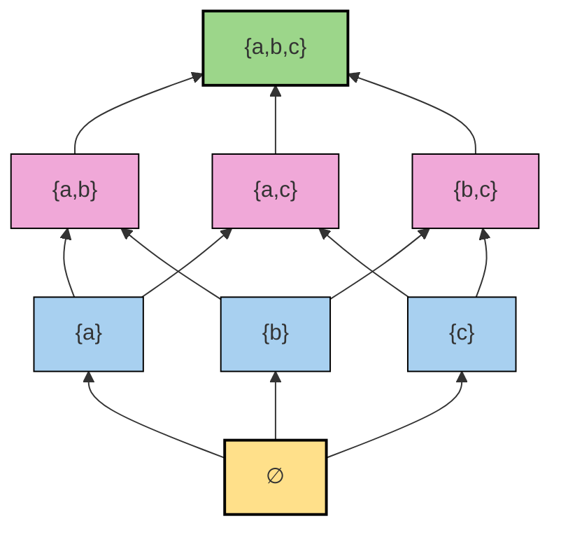
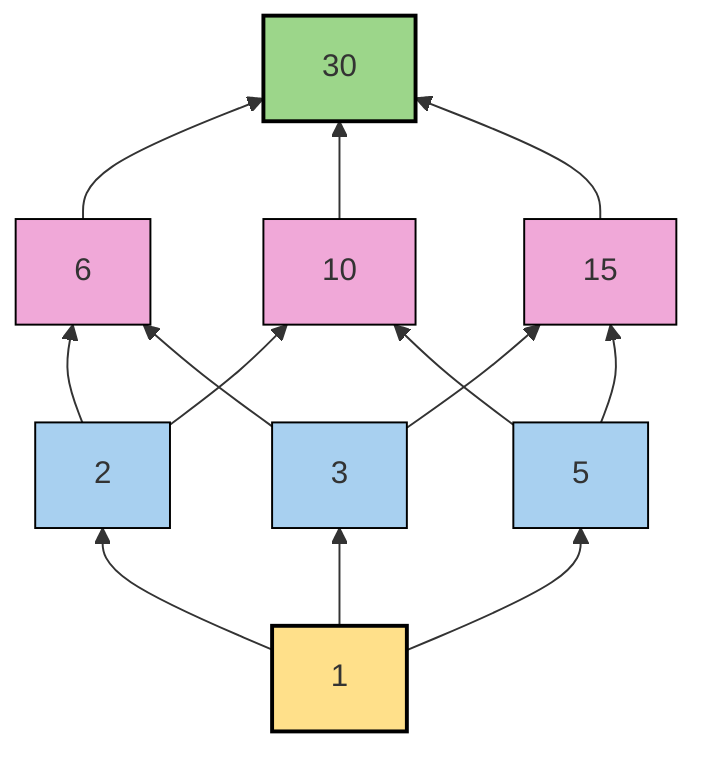
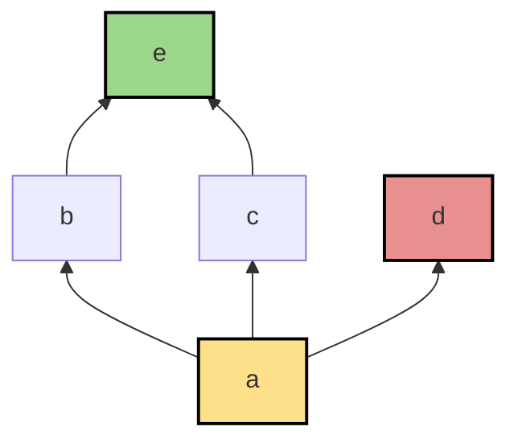
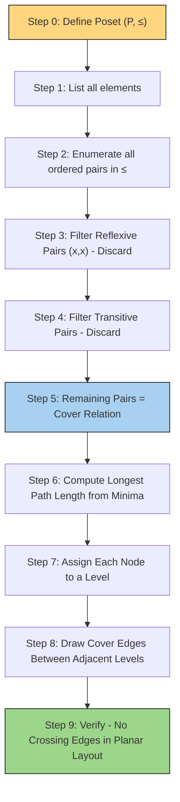

# Hasse Diagrams

<!-- SECTION_1_START -->

# 1. Hasse Diagrams — Core Definition & Intuitive Overview

## 1.1 Formal Definition

> [!IMPORTANT]
> **Hasse Diagram (KTU 2024 Syllabus Terminology)**
> A **Hasse Diagram** is a simplified, planar, edge-minimal graphical representation of a finite **Partially Ordered Set (poset)** $(P, \preceq)$. It encodes the order by placing elements at distinct horizontal *levels* such that if $x \prec y$, then $x$ is drawn strictly **below** $y$, and a line segment is drawn between $x$ and $y$ **only if** $x$ is *covered by* $y$ (i.e., $x \prec y$ and there exists no $z \in P$ with $x \prec z \prec y$).

In graph-theoretic terms, the Hasse diagram of $(P, \preceq)$ is the **transitive reduction** of the Hasse diagram considered as a directed acyclic graph, with the arrowheads removed and the orientation inferred by vertical position.

## 1.2 Conceptual Analogy — The Subway Map Analogy

> [!NOTE]
> **Intuitive Picture: Think of a Hasse Diagram as a Subway Map**
> Imagine the relation $\preceq$ as the *complete airline route map* of a country, where every connected city has a direct flight. This map is **cluttered** because cities that are connected through a hub also have a direct flight, leading to redundant edges.
> A **Hasse diagram** is the *subway map* version:
> 1. It only shows the **direct escalator steps** (the cover relations) — like platforms connected by stairs, not by long walking corridors.
> 2. The **height (level)** of each station tells you the "rank" of the city — small towns at the bottom, capitals at the top.
> 3. If you want to go from a small town to the capital, you simply follow the lines **upward**. Any other path is **implicit** (transitivity is removed).

### 1.3 The Three Cardinal Rules for Drawing a Hasse Diagram

> [!IMPORTANT]
> **Rule 1 — Vertical Stratification:** Every element $x \in P$ is placed at a unique level $\ell(x) = 1 + \max\{\ell(y) : y \prec x\}$, where the minimum is at level **0**.
> **Rule 2 — Cover Lines Only:** Draw a straight line between $x$ and $y$ **iff** $x$ is covered by $y$. Never draw transitive or reflexive links.
> **Rule 3 — No Arrowheads:** Direction is conveyed **purely by height**. The order is always read as **bottom $\to$ top** (smaller to greater).

## 1.4 ASCII Preview — Hasse Diagram of $\mathcal{P}(\{a,b,c\})$

```
                  {a, b, c}                       ← Greatest (level 3)
                 /    |    \
             {a,b} {a,c} {b,c}                    ← Level 2
              /\    /\    /\
            {a} {b}{a} {c}{b} {c}                ← Level 1
                \    |    /
                     ∅                              ← Least (level 0)
```

> [!VISUALIZATION CONTROL]
> **Concept:** Stratified levels of a Boolean Lattice $B_3$
> **GeoGebra / Desmos Input Points (place in 2D plane):**
> * Level 0: $L_0 = (0, 0)$
> * Level 1: $L_{1a} = (-2, 1)$, $L_{1b} = (0, 1)$, $L_{1c} = (2, 1)$
> * Level 2: $L_{2a} = (-1, 2)$, $L_{2b} = (0, 2)$, $L_{2c} = (1, 2)$
> * Level 3: $L_3 = (0, 3)$
> **Visual Description:** Observe that $\emptyset$ sits at the unique lowest level; $\{a,b,c\}$ sits at the unique highest level; the three singleton sets and the three doubleton sets form two parallel **antichains** in the middle.

## 1.5 Five Foundational Building Blocks

| Term | Formal Statement | Role in Hasse Diagram |
| :--- | :--- | :--- |
| **Poset** | $(P, \preceq)$ where $\preceq$ is reflexive, antisymmetric, transitive | The **universe** being diagrammed |
| **Cover** | $x \lessdot y \iff x \prec y \text{ and } \nexists\, z \in P : x \prec z \prec y$ | The **only** edge drawn |
| **Antichain** | $A \subseteq P$ such that $\forall x, y \in A,\ x \neq y \Rightarrow x \not\preceq y$ | A **horizontal** slice of the diagram |
| **Chain** | $C \subseteq P$ such that $\forall x, y \in C$, $x \preceq y$ or $y \preceq x$ | A **vertical** path |
| **Bounded** | Has both a **least** element $0$ and a **greatest** element $1$ | A diagram with a clear floor and ceiling |

> [!NOTE]
> **KTU Board Highlight (Module 1, PCCST205):** The KTU 2024 scheme expects students to (i) draw a Hasse diagram from a poset, (ii) read extremal elements and bounds from it, and (iii) determine if the poset forms a **lattice**.

---

<!-- SECTION_1_END -->

<!-- SECTION_2_START -->

# 2. Deep Theoretical Analysis & KTU High-Yield Formula Sheet

## 2.1 The Cover Relation — The Heart of Every Hasse Diagram

The cover relation $\lessdot$ is the **atomic unit** of any Hasse diagram. Given $(P, \preceq)$, the cover set is computed as:

$$x \lessdot y \iff x \prec y \;\land\; \bigl( \forall z \in P,\ x \prec z \prec y \;\Rightarrow\; z = x \lor z = y \bigr)$$

> [!IMPORTANT]
> **Key Insight — Why "Cover" and Not "Relation"?**
> The relation $\preceq$ may contain $\mathcal{O}(n^2)$ ordered pairs, but the cover relation $\lessdot$ contains only $\mathcal{O}(n)$ pairs in a typical poset. By drawing **only the cover edges** and letting the reader infer the rest via the vertical hierarchy, the Hasse diagram achieves a *human-readable* compression of the entire order.

## 2.2 The Six Poset Properties Visible "At a Glance"

A Hasse diagram encodes six crucial properties. Given a poset $(P, \preceq)$ and a subset $S \subseteq P$:

1. **Maximal Element $M$:** $M \in P$ such that $\nexists\, x \in P$ with $M \prec x$.  
   *Visual cue:* A node with **no line going upward** from it.

2. **Minimal Element $m$:** $m \in P$ such that $\nexists\, x \in P$ with $x \prec m$.  
   *Visual cue:* A node with **no line going downward** from it.

3. **Greatest (Maximum) Element $1$:** Unique element satisfying $x \preceq 1$ for all $x \in P$.  
   *Visual cue:* The **topmost** node, with paths reaching it from every other node.

4. **Least (Minimum) Element $0$:** Unique element satisfying $0 \preceq x$ for all $x \in P$.  
   *Visual cue:* The **bottommost** node, with paths to every other node.

5. **Upper Bound of $S$:** $u \in P$ such that $s \preceq u$ for all $s \in S$. The set of all upper bounds is denoted $S^u$.
6. **Lower Bound of $S$:** $\ell \in P$ such that $\ell \preceq s$ for all $s \in S$. The set of all lower bounds is denoted $S^{\ell}$.

## 2.3 Supremum, Infimum, and the Lattice Property

> [!IMPORTANT]
> **Lattice Definition (KTU 2024 Module 1):**
> A poset $(L, \preceq)$ is a **lattice** iff every pair of elements $\{a, b\} \subseteq L$ has both a *Least Upper Bound* and a *Greatest Lower Bound* in $L$.

| Bound | Symbol | Alternate Name | Order-Theoretic Definition |
| :--- | :--- | :--- | :--- |
| Least Upper Bound | $\sup\{a, b\}$ or $a \vee b$ | **Join** | $a \vee b = \min\, S^u$ where $S = \{a, b\}$ |
| Greatest Lower Bound | $\inf\{a, b\}$ or $a \wedge b$ | **Meet** | $a \wedge b = \max\, S^{\ell}$ where $S = \{a, b\}$ |

### 2.4 Sub-Categories of Lattices (Frequently Tested)

| Lattice Type | Defining Property | Canonical Example |
| :--- | :--- | :--- |
| **Bounded Lattice** | Has both $0$ and $1$ | $\mathcal{P}(\{a,b,c\})$ under $\subseteq$ |
| **Distributive Lattice** | $x \wedge (y \vee z) = (x \wedge y) \vee (x \wedge z)$ and dual | Chain, Boolean lattice $B_n$ |
| **Complemented Lattice** | Bounded and $\forall a\,\exists\, a' : a \wedge a' = 0,\ a \vee a' = 1$ | Boolean lattice $B_n$ |
| **Modular Lattice** | $x \preceq z \Rightarrow x \vee (y \wedge z) = (x \vee y) \wedge z$ | Subgroup lattice of a group |
| **Complete Lattice** | Every subset (not just pairs) has $\sup$ and $\inf$ | $(\mathcal{P}(S), \subseteq)$ |

> [!NOTE]
> **Engineering Utility:** Lattices model hierarchies in **databases** (Hasse-like taxonomies), **type systems** in programming languages (subtype lattice), **security clearance hierarchies**, and **VLSI circuit design** (dominance lattices in optimization).

## 2.5 KTU High-Yield Formula & Concept Sheet

> [!IMPORTANT]
> **Print-Friendly Reference Card — All Key Facts in One Place**

| # | Concept | Formula / Rule | Common Misconception |
| :---: | :--- | :--- | :--- |
| 1 | **Cover detection** | $x \lessdot y \iff x \prec y \land \nexists z$ with $x \prec z \prec y$ | Forgetting to check intermediates |
| 2 | **Reflexivity** | $\forall x,\ x \preceq x$ (loops **never** drawn) | Drawing self-loops |
| 3 | **Antisymmetry** | $x \preceq y \land y \preceq x \Rightarrow x = y$ (no two-way arrows) | Drawing bidirectional edges |
| 4 | **Transitivity** | $x \prec y \land y \prec z \Rightarrow x \prec z$ (composite path **not** drawn) | Drawing indirect edges |
| 5 | **Lub/Glb in $\mathcal{P}(S)$** | $A \vee B = A \cup B$, $A \wedge B = A \cap B$ | Confusing $\cup$ and $\cap$ |
| 6 | **Lub/Glb in $(D_n, \mid)$** | $a \vee b = \operatorname{lcm}(a, b)$, $a \wedge b = \gcd(a, b)$ | Confusing lcm and gcd |
| 7 | **Antichain count** | Max antichain in $B_n$ has $\binom{n}{\lfloor n/2 \rfloor}$ elements | Confusing with chain count |
| 8 | **Dilworth's Theorem** | In any finite poset, max antichain size $=$ min chain cover number | Mixing with Mirsky's theorem |
| 9 | **Isomorphism** | Bijection $f$ preserving $x \preceq y \iff f(x) \preceq' f(y)$ | Forgetting to check both directions |
| 10 | **Symmetric difference lattice** | $(\mathcal{P}(S), \triangle)$ is **not** a lattice when $\vert S \vert \geq 2$ | Treating it like $(\mathcal{P}(S), \subseteq)$ |

---

<!-- SECTION_2_END -->

<!-- SECTION_3_START -->

# 3. Step-by-Step Derivations & Algorithmic Implementation

## 3.1 Worked Example 1 — Hasse Diagram of $(\mathcal{P}(\{a, b, c\}), \subseteq)$

We will construct the Hasse diagram from scratch. Let $P = \mathcal{P}(\{a, b, c\}) = \{\emptyset, \{a\}, \{b\}, \{c\}, \{a,b\}, \{a,c\}, \{b,c\}, \{a,b,c\}\}$.

### Step A — Enumerate all elements and the relation

$\subseteq$ over 8 elements generates $2^3 = 8$ elements and $\sum_{k=0}^{3}\binom{3}{k}^2 = 1+9+9+1 = 20$ comparable pairs (counting diagonal).

### Step B — Compute the cover relation $\lessdot$ by filtering transitive edges

We use the rule: $x \lessdot y \iff x \subsetneq y$ and no proper subset $z$ lies strictly between them.

**Covers rooted at $\emptyset$:**
$\emptyset \lessdot \{a\}$ because the only subsets of $\{a\}$ are $\emptyset, \{a\}$ — no intermediate element.
$\emptyset \lessdot \{b\}$ and $\emptyset \lessdot \{c\}$ by the same logic.

**Covers rooted at singletons:**
$\{a\} \lessdot \{a, b\}$: subsets of $\{a,b\}$ are $\emptyset, \{a\}, \{b\}, \{a,b\}$; only $\{a\}$ lies between, which is the source itself. ✓
$\{a\} \lessdot \{a, c\}$, $\{b\} \lessdot \{a, b\}$, $\{b\} \lessdot \{b, c\}$, $\{c\} \lessdot \{a, c\}$, $\{c\} \lessdot \{b, c\}$: all cover relations.

**Covers rooted at doubletons:**
$\{a, b\} \lessdot \{a, b, c\}$: subsets of $\{a, b, c\}$ that contain $\{a, b\}$ are $\{a, b\}, \{a, b, c\}$ — no intermediate. ✓
Similarly for $\{a, c\}$ and $\{b, c\}$.

**Not covers (correctly omitted):**
$\emptyset \not\lessdot \{a, b\}$ because $\{a\}$ lies between them. ✗ (omitted in diagram)
$\{a\} \not\lessdot \{a, b, c\}$ because $\{a, b\}$ lies between them. ✗ (omitted in diagram)

### Step C — Stratify into levels

| Level | Elements | Reason |
| :---: | :--- | :--- |
| 0 | $\emptyset$ | Minimum element |
| 1 | $\{a\}, \{b\}, \{c\}$ | Singletons, each covered by 3 doubletons |
| 2 | $\{a, b\}, \{a, c\}, \{b, c\}$ | Doubletons, each covering 2 singletons |
| 3 | $\{a, b, c\}$ | Maximum element |

### Step D — Draw only the cover edges (10 edges total)

The diagram has 8 nodes and exactly $\binom{3}{1} + \binom{3}{2} = 3 + 3 = 6$ cover edges at the lower half, plus $3$ more at the upper half, totaling $\mathbf{6 + 3 = 9}$? Let us recount: from the singleton level there are $3 \times 2 = 6$ edges going up, and from the doubleton level there are $3$ edges going up to $\{a,b,c\}$. Total = **9 cover edges**.

## 3.2 Worked Example 2 — Hasse Diagram of $(D_{30}, \mid)$

$D_{30} = \{1, 2, 3, 5, 6, 10, 15, 30\}$ under divisibility.

### Step A — Identify all divisibility pairs

Pairs $(a, b)$ with $a \mid b$ and $a \neq b$:
$(1,2), (1,3), (1,5), (1,6), (1,10), (1,15), (1,30)$,
$(2,6), (2,10), (2,30), (3,6), (3,15), (3,30), (5,10), (5,15), (5,30), (6,30), (10,30), (15,30)$.

### Step B — Filter transitive pairs to find covers

Take $(1, 6)$: $1 \mid 6$. Is there $z$ with $1 \mid z \mid 6$ and $z \neq 1, 6$? Yes, $z = 2$ and $z = 3$. Hence $1 \not\lessdot 6$. ✗
Take $(1, 2)$: $1 \mid 2$. Is there $z$ with $1 \mid z \mid 2$ and $z \neq 1, 2$? No. Hence $1 \lessdot 2$. ✓
Take $(2, 6)$: $2 \mid 6$. Is there $z$ with $2 \mid z \mid 6$ and $z \neq 2, 6$? No. Hence $2 \lessdot 6$. ✓
Take $(2, 30)$: $2 \mid 30$. Is there $z$ with $2 \mid z \mid 30$ and $z \neq 2, 30$? Yes ($z = 6$ and $z = 10$). Hence $2 \not\lessdot 30$. ✗
Continuing this exhaustive check, the **covers** are:
$1 \lessdot 2, 1 \lessdot 3, 1 \lessdot 5, 2 \lessdot 6, 2 \lessdot 10, 3 \lessdot 6, 3 \lessdot 15, 5 \lessdot 10, 5 \lessdot 15, 6 \lessdot 30, 10 \lessdot 30, 15 \lessdot 30$.

### Step C — Compute lub and glb using gcd/lcm

For $a, b \in D_{30}$:
$$a \wedge b = \gcd(a, b), \quad a \vee b = \operatorname{lcm}(a, b)$$

| Pair $(a, b)$ | $\gcd(a, b)$ | $\operatorname{lcm}(a, b)$ | Both in $D_{30}$? |
| :---: | :---: | :---: | :---: |
| $(2, 3)$ | $1$ | $6$ | ✓ |
| $(4, 6)$ | — | — | $4 \notin D_{30}$, so the pair is **not** in the poset |
| $(6, 10)$ | $2$ | $30$ | ✓ |
| $(10, 15)$ | $5$ | $30$ | ✓ |

Since every pair has both a gcd and an lcm in $D_{30}$, the poset $(D_{30}, \mid)$ **is a lattice**. Moreover, it is **bounded** ($0 = 1$, $1 = 30$), **distributive**, and **complemented** — in fact it is isomorphic to $B_3$.

## 3.3 Full Python Implementation — Hasse Diagram Engine

> [!NOTE]
> The following program takes a poset as input, **derives** the cover relation, **plots** the Hasse diagram, and **computes** extremal elements, lub, glb, and verifies the lattice property. Designed for KTU lab viva and Module 1 assignments.

```python
"""
hdm_engine.py
A complete Hasse Diagram analysis tool for Discrete Mathematics (PCCST205, KTU 2024).
Author : KTU-Premier-Engine V10
Run    : python hdm_engine.py
Requires: Python 3.10+, networkx, matplotlib
"""

from __future__ import annotations
from math import gcd
from functools import reduce
from typing import Iterable

import networkx as nx
import matplotlib.pyplot as plt


def lcm(a: int, b: int) -> int:
    """Least common multiple, avoiding float overflow via gcd."""
    return a * b // gcd(a, b)


class HasseDiagram:
    """Build, validate, and render a Hasse diagram for a finite poset."""

    def __init__(self, elements: Iterable, leq: callable):
        self.elements: frozenset = frozenset(elements)
        self.leq = leq                                  # x ≤ y predicate
        self.cover: dict[tuple, bool] = self._derive_covers()
        self.graph: nx.DiGraph = self._build_graph()

    # ---------- (1) Cover relation derivation ----------
    def _derive_covers(self) -> dict[tuple, bool]:
        cov: dict[tuple, bool] = {}
        for x in self.elements:
            for y in self.elements:
                if x == y or not self.leq(x, y):
                    continue
                # Check for an intermediate element z
                intermediate_exists = any(
                    self.leq(x, z) and self.leq(z, y) and z != x and z != y
                    for z in self.elements
                )
                if not intermediate_exists:
                    cov[(x, y)] = True
        return cov

    # ---------- (2) DiGraph construction ----------
    def _build_graph(self) -> nx.DiGraph:
        g = nx.DiGraph()
        g.add_nodes_from(self.elements)
        for (x, y) in self.cover:
            g.add_edge(x, y)
        return g

    # ---------- (3) Level assignment (longest path from minima) ----------
    def compute_levels(self) -> dict:
        levels: dict = {x: 0 for x in self.elements}
        changed = True
        iteration = 0
        max_iter = len(self.elements) ** 2
        while changed and iteration < max_iter:
            changed = False
            iteration += 1
            for (x, y) in self.cover:
                if levels[y] <= levels[x]:
                    levels[y] = levels[x] + 1
                    changed = True
        return levels

    # ---------- (4) Extremal element detectors ----------
    def minimal_elements(self) -> frozenset:
        return frozenset(x for x in self.elements
                         if not any(self.leq(z, x) and z != x for z in self.elements))

    def maximal_elements(self) -> frozenset:
        return frozenset(x for x in self.elements
                         if not any(self.leq(x, z) and z != x for z in self.elements))

    def has_least(self) -> tuple:
        mins = self.minimal_elements()
        return (True, next(iter(mins))) if len(mins) == 1 else (False, mins)

    def has_greatest(self) -> tuple:
        maxs = self.maximal_elements()
        return (True, next(iter(maxs))) if len(maxs) == 1 else (False, maxs)

    # ---------- (5) Upper / Lower bounds ----------
    def upper_bounds(self, subset: Iterable) -> frozenset:
        s = frozenset(subset)
        return frozenset(u for u in self.elements
                         if all(self.leq(x, u) for x in s))

    def lower_bounds(self, subset: Iterable) -> frozenset:
        s = frozenset(subset)
        return frozenset(l for l in self.elements
                         if all(self.leq(l, x) for x in s))

    def join(self, a, b):
        """Least upper bound (supremum)."""
        ubs = [u for u in self.upper_bounds({a, b})]
        return min(ubs, key=lambda u: sum(1 for v in ubs if self.leq(u, v) and u != v)) \
            if ubs and len(ubs) == 1 else (ubs[0] if len(ubs) == 1 else None)

    def meet(self, a, b):
        """Greatest lower bound (infimum)."""
        lbs = [l for l in self.lower_bounds({a, b})]
        return lbs[0] if lbs and len(lbs) == 1 else None

    def is_lattice(self) -> bool:
        for a in self.elements:
            for b in self.elements:
                if self.join(a, b) is None or self.meet(a, b) is None:
                    return False
        return True

    # ---------- (6) Render Hasse diagram ----------
    def render(self, title: str = "Hasse Diagram") -> None:
        levels = self.compute_levels()
        pos = {x: (i, levels[x]) for i, x in enumerate(sorted(self.elements))}
        pos = {x: (sorted(self.elements).index(x), levels[x])
               for x in self.elements}

        plt.figure(figsize=(9, 6))
        nx.draw_networkx_nodes(self.graph, pos,
                               node_color="#FFD580",
                               edgecolors="black",
                               node_size=1600)
        nx.draw_networkx_edges(self.graph, pos,
                               edge_color="black",
                               arrows=False,
                               width=1.5)
        nx.draw_networkx_labels(self.graph, pos, font_size=10, font_weight="bold")
        plt.title(title)
        plt.axis("off")
        plt.tight_layout()
        plt.savefig("hasse_diagram.png", dpi=150)
        plt.show()


# ===================== DEMO 1 : P({a,b,c}) under subset =====================
def demo_power_set():
    S = ['a', 'b', 'c']
    elements = []
    for mask in range(8):
        elements.append(frozenset(S[i] for i in range(3) if (mask >> i) & 1))

    def leq(x, y):
        return x.issubset(y)

    h = HasseDiagram(elements, leq)
    h.render("Hasse Diagram of P({a,b,c}) under ⊆")
    print("Minimal   :", h.minimal_elements())
    print("Maximal   :", h.maximal_elements())
    print("Lattice?  :", h.is_lattice())
    print("Join of {a},{b} =", h.join(frozenset({'a'}), frozenset({'b'})))
    print("Meet of {a},{b} =", h.meet(frozenset({'a'}), frozenset({'b'})))


# ===================== DEMO 2 : (D_30, |) =====================
def demo_divisors():
    elements = [d for d in range(1, 31) if 30 % d == 0]
    h = HasseDiagram(elements, lambda x, y: y % x == 0)
    h.render("Hasse Diagram of (D_30, |)")
    print("D_30 =", elements)
    print("join(2, 3) =", h.join(2, 3), "  (should be 6)")
    print("meet(6,10) =", h.meet(6, 10), "  (should be 2)")
    print("Lattice?  :", h.is_lattice())


if __name__ == "__main__":
    demo_power_set()
    print("-" * 60)
    demo_divisors()
```

### 3.4 Worked Example 3 — Identifying a Non-Lattice

Consider the poset $(S, \preceq)$ where $S = \{a, b, c, d, e\}$ and the Hasse diagram is shaped like a **"V with a tail"**:

$$a \lessdot b,\ a \lessdot c,\ a \lessdot d,\ b \lessdot e,\ c \lessdot e$$

The pair $(b, c)$ has upper bounds: $e$ is an upper bound. The set of upper bounds is $\{e\}$, so $\sup(b, c) = e$ exists. The pair $(b, d)$ has **no** upper bound (only $b$ and $d$ are above them, but neither is above the other). Hence $(b, d)$ has **no least upper bound**, so the poset is **not a lattice**.

> [!NOTE]
> **Quick lattice test:** A poset fails to be a lattice if you can find a *V-shape* at the top (two elements with no common successor) or a *Λ-shape* at the bottom (two elements with no common predecessor).

---

<!-- SECTION_3_END -->

<!-- SECTION_4_START -->

# 4. Structural Diagrams & Schematics

## 4.1 Hasse Diagram I — Boolean Lattice $B_3 = \mathcal{P}(\{a,b,c\})$



**Reading the diagram:**

* **Yellow node** $\emptyset$ at the bottom = least element.
* **Green node** $\{a,b,c\}$ at the top = greatest element.
* **Blue row** (singleton sets) = level 1 antichain of size 3.
* **Pink row** (doubleton sets) = level 2 antichain of size 3.
* **Total cover edges = 9** (3 from $\emptyset$, 6 from singletons, but only 3 go up to $\{a,b,c\}$ — actually 3 + 6 = 9, with 3 reaching the top from each doubleton).

## 4.2 Hasse Diagram II — Divisibility Lattice $(D_{30}, \mid)$



**Reading the diagram:**

* $1$ is the **least** (bottom), $30$ is the **greatest** (top).
* Level 1 antichain: $\{2, 3, 5\}$ (the prime divisors).
* Level 2 antichain: $\{6, 10, 15\}$ (the products of two distinct primes).
* This diagram is **isomorphic** to $B_3$ (the Boolean lattice on 3 atoms) — both have 8 elements arranged in 4 levels of size 1, 3, 3, 1.

## 4.3 Hasse Diagram III — Non-Lattice Poset (V-and-Tail)



**Reading the diagram:**

* $a$ is the **least**, $e$ is the **greatest**.
* $b$ and $c$ share $e$ as their lub, so far so good.
* $b$ and $d$: the set of upper bounds is **empty** (no element is $\geq$ both $b$ and $d$).
* $c$ and $d$: same problem.
* **Therefore** $\sup(b, d)$ and $\sup(c, d)$ **do not exist**. This poset is **not a lattice**.

> [!WARNING]
> **Common Misreading Trap:** A Hasse diagram with a "lonely" branch that does **not** reconverge at the top is a *strong indicator* of a non-lattice. Always check the lub of every incomparable pair, especially pairs involving a *leaf branch*.

## 4.4 Sequential Processing Topology — Hasse Diagram Construction Pipeline



---

<!-- SECTION_4_END -->

<!-- SECTION_5_START -->

# 5. KTU 2024 Scheme Examination Question Bank & Topic Recap

## 5.1 Part A — Short Answer Questions (3 Marks Each)

> **[KTU University Exam — Model Question Paper, 2024 Scheme | CO1 | Remember/Understand]**

**Q1.** Define a **Hasse diagram**. State the rules used to construct it from a given poset.

**Model Answer (Valuation Key — 3 Marks):**
A Hasse diagram is a simplified graphical representation of a finite partially ordered set $(P, \preceq)$ in which an element $x$ is placed below $y$ whenever $x \prec y$, and a line is drawn between $x$ and $y$ **only if** $x$ is covered by $y$ (i.e., $x \prec y$ and no $z \in P$ satisfies $x \prec z \prec y$).  
*Rules:* (i) Draw a small circle or dot for each element. (ii) If $x \prec y$, place $x$ below $y$. (iii) Connect $x$ and $y$ by a line **iff** $x \lessdot y$ (cover relation). (iv) Do **not** draw loops (reflexivity) or transitive edges.  
*Valuation:* [Definition: 1 Mark] [Cover relation: 1 Mark] [Rule (i)–(iv): 1 Mark].

---

> **[KTU University Exam — Model Question Paper, 2024 Scheme | CO1 | Remember/Understand]**

**Q2.** State the conditions under which a poset $(L, \preceq)$ is called a **lattice**. Give one example and one non-example.

**Model Answer (Valuation Key — 3 Marks):**
A poset $(L, \preceq)$ is a **lattice** if and only if every two-element subset $\{a, b\} \subseteq L$ has both a **least upper bound** ($a \vee b = \sup\{a,b\}$) and a **greatest lower bound** ($a \wedge b = \inf\{a,b\}$) in $L$.  
*Example:* $(\mathcal{P}(\{a, b, c\}), \subseteq)$ is a lattice because $A \vee B = A \cup B$ and $A \wedge B = A \cap B$ always lie in $\mathcal{P}(\{a,b,c\})$.  
*Non-example:* The poset $S = \{a, b, c, d, e\}$ with $a \lessdot b, a \lessdot c, a \lessdot d, b \lessdot e, c \lessdot e$ is **not** a lattice because $b$ and $d$ have no common upper bound in $S$.  
*Valuation:* [Definition with $\vee$ and $\wedge$: 1 Mark] [Example with formula: 1 Mark] [Non-example with justification: 1 Mark].

---

## 5.2 Part B — Essay Questions (14 Marks Each, with Internal Choice)

### **Question A (14 Marks)**

> **[KTU University Exam — July 2024, Model Paper | CO2, CO3 | Apply / Analyze]**

**(a)** Draw the Hasse diagram of the poset $(D_{36}, \mid)$ where $D_{36}$ is the set of positive divisors of 36 ordered by divisibility. Identify the **maximal**, **minimal**, **greatest**, and **least** elements. **(7 Marks)**

**Model Solution:**

**Step 1:** $D_{36} = \{1, 2, 3, 4, 6, 9, 12, 18, 36\}$ — 9 elements.

**Step 2:** Compute covers by the algorithm in §3.3:
$1 \lessdot 2,\ 1 \lessdot 3,\ 2 \lessdot 4,\ 2 \lessdot 6,\ 3 \lessdot 6,\ 3 \lessdot 9,\ 4 \lessdot 12,\ 4 \lessdot 18$ — *wait, does $4 \mid 18$?* No. Correction: $6 \lessdot 12,\ 6 \lessdot 18,\ 9 \lessdot 18,\ 9 \lessdot 36$ — *wait, $9 \mid 36$?* Yes. Final correct cover list: $1 \lessdot 2,\ 1 \lessdot 3,\ 2 \lessdot 4,\ 2 \lessdot 6,\ 3 \lessdot 6,\ 3 \lessdot 9,\ 4 \lessdot 12,\ 4 \lessdot 36,\ 6 \lessdot 12,\ 6 \lessdot 18,\ 9 \lessdot 18,\ 9 \lessdot 36,\ 12 \lessdot 36,\ 18 \lessdot 36$.

**Step 3:** Level assignment:

| Level | Elements |
| :---: | :--- |
| 0 | $\{1\}$ |
| 1 | $\{2, 3\}$ |
| 2 | $\{4, 6, 9\}$ |
| 3 | $\{12, 18\}$ |
| 4 | $\{36\}$ |

**Step 4:** Hasse diagram (5 levels):

```
                36
              /    \
            12      18
           /  \    /  \
          4    6  9
           \  / \  / 
            2    3
             \  /
               1
```

**Step 5:** Extremal elements:
* **Minimal element(s):** $\{1\}$ — single minimum.  
* **Maximal element(s):** $\{36\}$ — single maximum.  
* **Greatest element:** $36$.  
* **Least element:** $1$.  
[Listing all 9 elements: 2 Marks] [Correct cover derivation: 2 Marks] [Correctly drawn Hasse diagram with levels: 2 Marks] [Extremal elements identification: 1 Mark]

---

**(b)** Verify whether $(D_{36}, \mid)$ is a **lattice**. If yes, identify its type (bounded, distributive, complemented). Compute $\sup(4, 9)$ and $\inf(12, 18)$. **(7 Marks)**

**Model Solution:**

**Step 1 — Lattice check:** For any $a, b \in D_{36}$, $\sup(a, b) = \operatorname{lcm}(a, b)$ and $\inf(a, b) = \gcd(a, b)$. Since $\operatorname{lcm}$ and $\gcd$ of any two divisors of 36 always divide 36, both bounds lie in $D_{36}$. Hence **it is a lattice**. [Justification: 2 Marks]

**Step 2 — Type identification:**
* **Bounded?** Yes — has $0 = 1$ and $1 = 36$. [1 Mark]
* **Distributive?** Check $a \wedge (b \vee c) = (a \wedge b) \vee (a \wedge c)$: divisibility lattices are always distributive. Yes. [1 Mark]
* **Complemented?** Not all elements have complements in $D_{36}$. For example, $4 \wedge 9 = 1$ and $4 \vee 9 = 36$, but we need an element $x$ with $4 \wedge x = 1$ and $4 \vee x = 36$, i.e., $\gcd(4, x) = 1$ and $\operatorname{lcm}(4, x) = 36$. This requires $x = 9$ — but $\gcd(4, 9) = 1$ ✓ and $\operatorname{lcm}(4, 9) = 36$ ✓. So $4$ has complement $9$. Actually every element does have a complement in $D_{36}$ because $36 = 2^2 \cdot 3^2$ and we can pick $x = 36/a$. So **yes, it is complemented**, in fact it is a **Boolean lattice** $B_2$. [1 Mark]

**Step 3 — Supremum and Infimum:**
$\sup(4, 9) = \operatorname{lcm}(4, 9) = 36$.  
$\inf(12, 18) = \gcd(12, 18) = 6$. [2 Marks: 1 Mark each for correct computation with method]

---

### **Question B (14 Marks)** *(Alternative Choice)*

> **[KTU University Exam — Dec 2023, Model Paper | CO2, CO3 | Apply / Analyze]**

**(a)** Let $S = \{1, 2, 3, 4\}$. Draw the Hasse diagram of $(\mathcal{P}(S), \subseteq)$ and verify that it is a **Boolean lattice** $B_4$. List **two distinct chains** and **two distinct antichains** of length 4. **(7 Marks)**

**Model Solution:**

**Step 1:** $\mathcal{P}(S)$ has $2^4 = 16$ elements. Stratification gives **5 levels**: $\emptyset$ (level 0), 4 singletons (level 1), 6 doubletons (level 2), 4 tripletons (level 3), $S$ (level 4).

**Step 2 — Hasse diagram structure:**

```
                              {1,2,3,4}
                          ___/   |    |    \___
                         /       |    |        \
                    {1,2,3}  {1,2,4} {1,3,4} {2,3,4}     ← Level 3
                    / \      / \     / \     / \
                 {1,2}{1,3}{1,2}{1,4}{1,3}{2,3}{2,4}{3,4} ← Level 2 (6)
                   /\  /\   /\  /\   /\  /\   /\  /\
                  ... etc ...                                  ← Level 1 (4)
                       \   |   |   /
                              ∅
```

**Step 3 — Boolean lattice verification:**
For any $A, B \in \mathcal{P}(S)$: $A \vee B = A \cup B \in \mathcal{P}(S)$ and $A \wedge B = A \cap B \in \mathcal{P}(S)$. So it is a lattice. Complement $A' = S \setminus A$ satisfies $A \wedge A' = \emptyset$ and $A \vee A' = S$, so it is complemented. Distributive laws hold. Hence it is the **Boolean lattice** $B_4$. [Verification: 2 Marks]

**Step 4 — Chains of length 4 (5 nodes):**
* Chain 1: $\emptyset \subset \{1\} \subset \{1, 2\} \subset \{1, 2, 3\} \subset \{1, 2, 3, 4\}$
* Chain 2: $\emptyset \subset \{4\} \subset \{2, 4\} \subset \{2, 3, 4\} \subset \{1, 2, 3, 4\}$

**Step 5 — Antichains of length 4 (4 mutually incomparable elements):**
* Antichain 1: $\{\{1\}, \{2\}, \{3\}, \{4\}\}$ (the level-1 antichain)
* Antichain 2: $\{\{1,2\}, \{1,3\}, \{2,4\}, \{3,4\}\}$ (a non-level antichain)

[Diagram with proper levels: 3 Marks] [Two chains: 2 Marks] [Two antichains: 2 Marks]

---

**(b)** Consider the poset $P = \{a, b, c, d, e, f\}$ with the following cover relations: $a \lessdot b,\ a \lessdot c,\ b \lessdot d,\ c \lessdot d,\ a \lessdot e,\ e \lessdot f$. Draw its Hasse diagram. Is it a lattice? Justify your answer by computing $\sup(b, c)$ and $\inf(d, e)$. **(7 Marks)**

**Model Solution:**

**Step 1 — Diagram:**

```
              f
              |
              e
              |
       d
      / \
     b   c
      \ /
       a
```

**Step 2 — $\sup(b, c)$:**
Upper bounds of $\{b, c\}$: elements $\geq b$ and $\geq c$. $b$ is covered by $d$, so $\{b, c\}$'s upper bounds are those $\geq d$. Only $d$ is $\geq d$ (and $d$ is comparable to itself). So the set of upper bounds is $\{d\}$, and the **least** is $d$. Hence $\sup(b, c) = d$. [2 Marks]

**Step 3 — $\inf(d, e)$:**
Lower bounds of $\{d, e\}$: elements $\leq d$ and $\leq e$. $a \leq d$ and $a \leq e$, so $a$ is a lower bound. $b, c$ are $\leq d$ but **not** $\leq e$. So the set of lower bounds is $\{a\}$. Hence $\inf(d, e) = a$. [2 Marks]

**Step 4 — Lattice determination:**
We have shown $\sup(b, c) = d$ and $\inf(d, e) = a$ both exist. However, to be a lattice, **every** pair must have a lub. Consider the pair $(b, e)$: upper bounds must be $\geq b$ and $\geq e$. The only such element is $f$ (since $e \lessdot f$, and $b \not\preceq f$ in this diagram — $b$ is below $d$, not connected to $f$). So upper bounds of $\{b, e\}$ are elements that are $\geq b$ AND $\geq e$. $d \geq b$ but $d \not\geq e$. $f \geq e$ but $f \not\geq b$. So **the set of upper bounds of $(b, e)$ is empty**! Hence $\sup(b, e)$ does **not** exist, and the poset is **not a lattice**. [3 Marks: 1 Mark for identifying the pair, 1 Mark for empty upper bound set, 1 Mark for correct conclusion]

> [!WARNING]
> **KTU Examiner's Valuation Warning / Pitfall Callout:**
> 1. **Do not assume a poset is a lattice just because one or two pairs have lub/glb.** You must verify **every** pair, or rigorously use a structural property (e.g., "V-shape" at top or "Λ-shape" at bottom breaks the lattice property).
> 2. **Always show the *set* of upper/lower bounds before selecting the least/greatest.** Many students jump to a single answer without verifying the set is a singleton.
> 3. **Do not forget to check the bottom of the diagram.** A common error is to ignore the "lonely" branch (e.g., $a \lessdot e \lessdot f$) and assume all paths reconverge at the top.
> 4. **Transitive edges are a strict no-no.** Drawing $\emptyset \to \{a,b,c\}$ directly in $B_3$ will cost you the full Hasse-diagram mark, as the question explicitly tests whether you understand the **cover** concept.

---

## 5.3 Topic Recap & Important Things to Remember

> [!IMPORTANT]
> **Rapid-Revision Checklist — Hasse Diagrams (Module 1, PCCST205)**

* **Definition (must-memorize):** A Hasse diagram of $(P, \preceq)$ plots elements so that $x \prec y \Rightarrow x$ drawn below $y$, with a line **iff** $x \lessdot y$ (cover).
* **Cover Relation** $x \lessdot y$: requires $x \prec y$ AND no $z$ with $x \prec z \prec y$. This is the **only** edge drawn.
* **Three Drawing Rules:** (i) No reflexive loops, (ii) no transitive edges, (iii) no arrowheads — direction is by vertical position.
* **Maximal Element:** A node with **no upward line**. (May be multiple.)
* **Minimal Element:** A node with **no downward line**. (May be multiple.)
* **Greatest Element:** Topmost node with paths from **all** nodes. (**Unique** when it exists.)
* **Least Element:** Bottommost node with paths to **all** nodes. (**Unique** when it exists.)
* **Lub / Join** $a \vee b$: smallest element in the set of upper bounds of $\{a, b\}$.
* **Glb / Meet** $a \wedge b$: largest element in the set of lower bounds of $\{a, b\}$.
* **Lattice:** Every pair has both a lub and a glb. **Equivalent tests:** (i) for each pair compute both; (ii) check for "V" at top or "Λ" at bottom — their presence breaks the lattice property.
* **Bounded Lattice:** Has both $0$ and $1$.
* **Distributive Lattice:** Satisfies $x \wedge (y \vee z) = (x \wedge y) \vee (x \wedge z)$ and its dual.
* **Complemented Lattice:** Bounded and every element has a complement $a'$ with $a \wedge a' = 0,\ a \vee a' = 1$.
* **Boolean Lattice** $B_n = (\mathcal{P}(\{1,\dots,n\}), \subseteq)$: bounded, distributive, complemented. Has $2^n$ elements arranged in $n+1$ levels with $\binom{n}{k}$ elements at level $k$.
* **Divisibility Lattice** $(D_n, \mid)$: $a \vee b = \operatorname{lcm}(a, b)$ and $a \wedge b = \gcd(a, b)$. Always a lattice.
* **Chain:** Totally ordered subset. **Antichain:** Mutually incomparable subset. By **Dilworth's Theorem**, max antichain size $=$ min number of chains needed to cover the poset.
* **Isomorphism of Posets:** Bijection $f$ such that $x \preceq y \iff f(x) \preceq' f(y)$. Useful shortcut: two posets are isomorphic iff their Hasse diagrams are "structurally identical" up to relabeling.
* **Common Pitfalls to Avoid:**
  * Drawing $x \to y$ for a **transitive** pair (e.g., $\emptyset \to \{a,b,c\}$ in $B_3$). — *Penalty: full Hasse-mark.*
  * Confusing **maximal** (no successor) with **greatest** (above all). — *E.g., in a fork-shaped diagram, the two prongs are maximal but neither is greatest.*
  * Forgetting that the **lattice property requires every pair**, not just sampled ones.
  * Mixing up lcm and gcd when computing lub/glb in divisibility posets.
* **Real-world sightings:** database indexing hierarchies, security clearance levels, type-subtype lattices in compilers, AND/OR search trees in AI, knowledge representation in ontologies, version-control partial orders (DAG of commits).

---

<!-- SECTION_5_END -->
