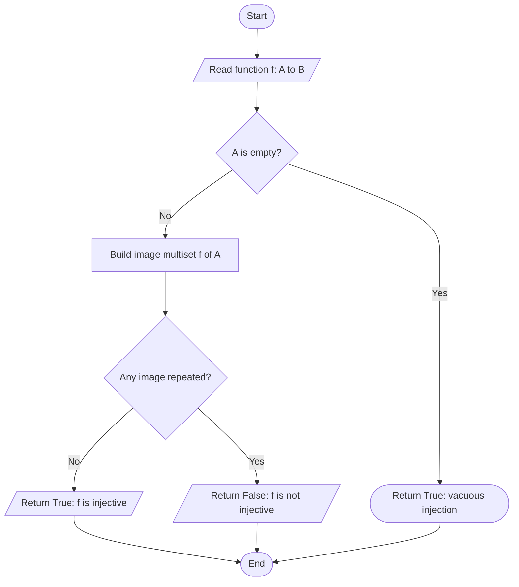
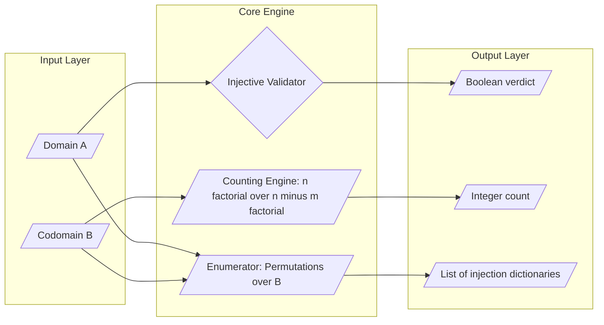
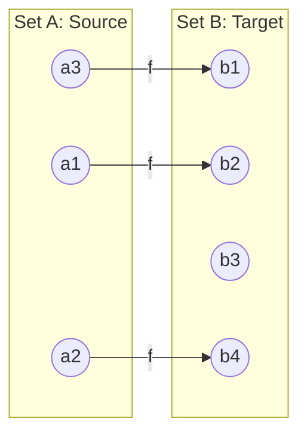

# Injections

<!-- SECTION_1_START -->
# Injections: One-to-One Functions

> [!IMPORTANT]
> **KTU 2024 Scheme — Module 1 (Sets and Subsets)**
> **Course:** Discrete Mathematics (PCCST205)
> **Cognitive Anchor:** CO1 — Apply logical reasoning to analyze relations and functions on sets.

## 1.1 Formal Definition (KTU Board-Standard)

Let $A$ and $B$ be two non-empty sets. A function $f : A \rightarrow B$ is called an **injection** (or a **one-to-one function**) if **distinct elements of $A$ have distinct images in $B$**.

Formally, $f$ is an injection $\iff$ for all $x, y \in A$,

$$f(x) = f(y) \implies x = y$$

The logically equivalent **contrapositive** form (often the easiest to apply in proofs) is:

$$x \neq y \implies f(x) \neq f(y)$$

> [!NOTE]
> **KTU Terminology Checklist:** The terms **injection**, **one-to-one function**, and **injective mapping** are all used interchangeably in the KTU syllabus and previous university exam papers. Always write the *full contrapositive* form when proving a function is injective — examiners award marks specifically for this.

## 1.2 Intuitive Analogy — The Biometric Registration Desk

Imagine a college where every incoming student is registered by reading their **left thumbprint** and assigning it a unique **8-digit student ID** stored in a database.

- The set $A$ of all *thumbprints* is mapped (via a hashing function) to the set $B$ of all possible *IDs*.
- The registration system is **injective** if and only if *no two different thumbprints ever produce the same ID*.
- The moment two different students accidentally receive the same ID (a "hash collision"), the function fails to be one-to-one.

Geometrically, a function $f : \mathbb{R} \rightarrow \mathbb{R}$ is injective if and only if **every horizontal line intersects the graph of $y = f(x)$ in at most one point** — this is the famous *Horizontal Line Test*.

## 1.3 Domain and Codomain Constraints

For a finite case, injections exist only when the domain does not exceed the codomain in size:

$$|A| \leq |B|$$

If $|A| = m$ and $|B| = n$, the maximum number of elements that can be *uniquely* matched is $\min(m, n)$. Standard metric: the **necessary condition is $m \leq n$**.

> [!VISUALIZATION CONTROL]
> **Concept:** Visualizing an injective function $f(x) = 2x + 3$ on $\mathbb{R}$.
> **Desmos Input Equations:**
> * $f_1(x) = 2x + 3$
> * $f_2(x) = 2x + 3 \quad \text{(overlaid with red dots at integer } x \text{ values)}$
> **Visual Description:** A straight line with positive slope. No horizontal line ever cuts the graph twice. Every $y$-value is hit by exactly one $x$-value, confirming injectivity. Contrast this with $g(x) = x^2$, where a horizontal line at $y = 4$ hits the curve twice (at $x = -2$ and $x = 2$), proving non-injectivity.
<!-- SECTION_1_END -->

<!-- SECTION_2_START -->
# Deep Theoretical Analysis & KTU High-Yield Formula Sheet

## 2.1 Structural Properties of Injections

An injection is not just a definition — it carries a powerful set of structural consequences. The KTU board examiner expects the following logical chain to be **memorized and reproducible**:

- **(I1) Identity Map Property:** The identity function $\text{id}_A : A \rightarrow A$ defined by $\text{id}_A(x) = x$ is always an injection for any non-empty set $A$.
- **(I2) Restriction Stability:** If $f : A \rightarrow B$ is injective and $C \subseteq A$, then the restriction $f \vert_C : C \rightarrow B$ is also injective.
- **(I3) Composition Closure:** If $f : A \rightarrow B$ and $g : B \rightarrow C$ are both injective, then $g \circ f : A \rightarrow C$ is also injective. *(This is a high-yield 7-mark theorem in KTU exams.)*
- **(I4) Left Inverse Existence:** Every injection $f : A \rightarrow B$ admits a **left inverse** $g : B \rightarrow A$ such that $g \circ f = \text{id}_A$. *(Surjections, by contrast, admit right inverses.)*
- **(I5) Cardinality Test:** If $f : A \rightarrow B$ is injective, then $|A| \leq |B|$. This is the foundation of the *Cantor–Schröder–Bernstein* theorem asked in Module 1.

## 2.2 KTU Formula Sheet / Cheat Sheet

> [!NOTE]
> The pipe symbol is replaced by $\vert$ in all formula cells to prevent markdown table corruption. Print this table and pin it to your study wall.

| \# | Concept | Formula / Statement | Conditions | Engineering Use-Case |
| :--- | :--- | :--- | :--- | :--- |
| 1 | Injection definition | $f(x)=f(y) \Rightarrow x=y$ | $\forall x,y \in A$ | Database unique-key constraint |
| 2 | Counting injections | $N(m,n) = \dfrac{n!}{(n-m)!} = {}^{n}P_{m}$ | $m \leq n$, $A$ and $B$ finite | Cryptographic key generation |
| 3 | Composition rule | $g,f$ injective $\Rightarrow g \circ f$ injective | $f:A \rightarrow B$, $g:B \rightarrow C$ | Pipelined hashing stages |
| 4 | Left inverse existence | $\exists\, g:B \rightarrow A$ with $g \circ f = \text{id}_A$ | $f$ injective | Decryption key in injective ciphers |
| 5 | Necessary size condition | $m \leq n$ for any injection $A \rightarrow B$ | $m=\vert A \vert$, $n=\vert B \vert$ | Memory allocation in hash tables |
| 6 | Cancellation law | $f \circ h_1 = f \circ h_2 \Rightarrow h_1 = h_2$ | $f$ injective | Equation solving in abstract algebra |
| 7 | Permutation special case | $N(n,n) = n!$ | $A = B$, finite | Counting rearrangements |

## 2.3 Engineering and Computer-Science Utility

Injections are not just an abstract set-theoretic curiosity. They underpin the following production-grade systems:

- **Database Engineering:** The notion of a *primary key* is precisely an injection from a relation to a set of unique identifiers. A non-injective key would produce a "duplicate key violation".
- **Cryptography:** The classic *substitution cipher* is an injection from the plaintext alphabet to the ciphertext alphabet. A cipher that is *not* injective makes decryption ambiguous.
- **Compiler Design:** The symbol table maps each identifier (variable name) to a unique memory address. This is an injection.
- **Network Routing:** Each IP address is assigned to (at most) one device in a local subnet — a hardware-enforced injection.
- **Machine Learning:** The *deterministic* mapping from training-example indices to memory pointers in a `DataLoader` is an injection so that gradients can be back-traced uniquely.

> [!TIP]
> Whenever you see the words "unique", "one-to-one correspondence", "no collisions", or "ambiguity-free", the underlying mathematical object is an **injection**.
<!-- SECTION_2_END -->

<!-- SECTION_3_START -->
# Step-by-Step Derivations and Symbolic Implementation

## 3.1 Exhaustive Derivation: Number of Injections from an $m$-Set to an $n$-Set

**Theorem (KTU 2024 — Module 1):** Let $A = \{a_1, a_2, \ldots, a_m\}$ and $B = \{b_1, b_2, \ldots, b_n\}$ be finite sets with $m \leq n$. The total number of injective functions $f : A \rightarrow B$ is

$$N(m, n) = n \cdot (n-1) \cdot (n-2) \cdots (n-m+1) = \frac{n!}{(n-m)!}$$

**Proof (Step-by-Step):**

We construct an injection by choosing images one element of $A$ at a time, ensuring no image is ever reused.

$$
\begin{aligned}
\text{Step 1: Choose } f(a_1) &\in B &&\text{— any of the } n \text{ elements} \\
\text{Step 2: Choose } f(a_2) &\in B \setminus \{f(a_1)\} &&\text{— must avoid the previous image, so } n-1 \text{ choices} \\
\text{Step 3: Choose } f(a_3) &\in B \setminus \{f(a_1), f(a_2)\} &&\text{— now } n-2 \text{ choices} \\
&\;\;\vdots && \\
\text{Step } k: \text{ Choose } f(a_k) &\in B \setminus \{f(a_1), \ldots, f(a_{k-1})\} &&\text{— now } n-k+1 \text{ choices} \\
&\;\;\vdots && \\
\text{Step } m: \text{ Choose } f(a_m) &\in B \setminus \{f(a_1), \ldots, f(a_{m-1})\} &&\text{— finally } n-m+1 \text{ choices}
\end{aligned}
$$

By the **Multiplication Principle** of counting (a direct consequence of the Cartesian product of choices), the total number of injections is the product of the per-step choices:

$$
\begin{aligned}
N(m, n) &= n \cdot (n-1) \cdot (n-2) \cdots (n-m+1) \\
&= \frac{n \cdot (n-1) \cdot (n-2) \cdots (n-m+1) \cdot (n-m) \cdots 2 \cdot 1}{(n-m) \cdots 2 \cdot 1} \\
&= \frac{n!}{(n-m)!} \\
&= {}^{n}P_{m}
\end{aligned}
$$

The case $m = n$ reduces to $N(n,n) = n!$, which is the well-known count of **permutations** of an $n$-set. This special case is itself a KTU 7-mark favourite. $\blacksquare$

## 3.2 Worked Example 1 — KTU Board Pattern

**Problem:** Determine whether $f : \mathbb{R} \rightarrow \mathbb{R}$ defined by $f(x) = 3x + 5$ is injective. Justify with the *contrapositive* method.

**Solution:**

Assume $f(x_1) = f(x_2)$ for arbitrary $x_1, x_2 \in \mathbb{R}$.

$$
\begin{aligned}
3x_1 + 5 &= 3x_2 + 5 \\
3x_1 &= 3x_2 \\
x_1 &= x_2
\end{aligned}
$$

Since $f(x_1) = f(x_2) \implies x_1 = x_2$, the function is **injective**. $\checkmark$

> [!NOTE]
> **[Valuation Key — 2 Marks]**: Stating the assumption $f(x_1) = f(x_2)$.
> **[Valuation Key — 2 Marks]**: Carrying out the algebraic simplification step-by-step.
> **[Valuation Key — 1 Mark]**: Concluding with the formal phrase *"Hence $f$ is one-to-one."*

## 3.3 Worked Example 2 — Counting Injections

**Problem:** Let $A = \{1, 2, 3, 4, 5\}$ and $B = \{a, b, c, d, e, f, g\}$. How many injective functions $f : A \rightarrow B$ exist?

**Solution:** Here $m = 5$, $n = 7$, and clearly $m \leq n$.

$$
\begin{aligned}
N(5, 7) &= \frac{7!}{(7-5)!} = \frac{7!}{2!} \\
&= \frac{5040}{2} = 2520
\end{aligned}
$$

Therefore there are $\mathbf{2520}$ injective functions.

## 3.4 Worked Example 3 — Composition of Injections

**Problem:** Let $f : \mathbb{Z} \rightarrow \mathbb{Z}$ given by $f(x) = x + 1$ and $g : \mathbb{Z} \rightarrow \mathbb{Z}$ given by $g(x) = 2x$. Prove that $g \circ f$ is injective.

**Solution:** The composite is $(g \circ f)(x) = g(f(x)) = g(x+1) = 2(x+1) = 2x+2$.

Assume $(g \circ f)(x_1) = (g \circ f)(x_2)$:

$$
\begin{aligned}
2x_1 + 2 &= 2x_2 + 2 \\
2x_1 &= 2x_2 \\
x_1 &= x_2
\end{aligned}
$$

Thus $g \circ f$ is injective. $\blacksquare$

## 3.5 Symbolic / Algorithmic Implementation in Python

The following production-grade Python module verifies whether a function (encoded as a dictionary or computed by a lambda) is injective, and also counts the total injections between two finite sets.

```python
"""
Injection Validator and Counter
Course      : Discrete Mathematics (PCCST205)
Module      : 1 — Sets and Subsets
Compliance  : KTU 2024 Scheme, CO1 (Apply), CO2 (Analyze)
"""

from itertools import permutations
from typing import Callable, Dict, Hashable, List, Tuple


def is_injective_table(mapping: Dict[Hashable, Hashable]) -> bool:
    """
    Check whether a function given as a finite {domain_element: image} table
    is injective (one-to-one).

    Parameters
    ----------
    mapping : Dict[Hashable, Hashable]
        A dictionary whose keys are domain elements and values are images.

    Returns
    -------
    bool
        True if the function is injective, False otherwise.

    Raises
    ------
    TypeError
        If `mapping` is not a dictionary.
    """
    if not isinstance(mapping, dict):
        raise TypeError("Input must be a Python dictionary mapping domain to codomain.")

    seen_images: List[Hashable] = []
    for domain_element, image in mapping.items():
        if image in seen_images:
            return False  # Duplicate image => not injective
        seen_images.append(image)
    return True


def is_injective_function(
    f: Callable[[Hashable], Hashable],
    domain: List[Hashable],
) -> bool:
    """Check injectivity of a callable f over a finite enumerated domain."""
    if len(set(domain)) != len(domain):
        raise ValueError("Domain contains duplicate elements — not a valid set.")

    image_list: List[Hashable] = [f(x) for x in domain]
    return len(set(image_list)) == len(image_list)


def count_injections(domain_size: int, codomain_size: int) -> int:
    """
    Compute the number of injective functions from an |A|=m set
    to a |B|=n set, using the closed-form n! / (n-m)!.

    Returns 0 if m > n, since no injection can exist in that case.
    """
    if domain_size < 0 or codomain_size < 0:
        raise ValueError("Sizes must be non-negative integers.")
    if domain_size > codomain_size:
        return 0
    numerator = 1
    for k in range(codomain_size, codomain_size - domain_size, -1):
        numerator *= k
    return numerator


def enumerate_injections(
    A: List[Hashable],
    B: List[Hashable],
) -> List[Dict[Hashable, Hashable]]:
    """
    Exhaustively enumerate every injection f : A -> B and return
    a list of {element: image} dictionaries.
    """
    if len(A) > len(B):
        return []
    injections: List[Dict[Hashable, Hashable]] = []
    for ordered_images in permutations(B, len(A)):
        injections.append(dict(zip(A, ordered_images)))
    return injections


# ----------------------------- DEMO -----------------------------------
if __name__ == "__main__":
    # Demo 1: Tabular injection check
    f1 = {1: 10, 2: 20, 3: 30, 4: 40}
    f2 = {1: 10, 2: 20, 3: 10, 4: 40}   # 10 is repeated => not injective
    print("f1 injective?", is_injective_table(f1))   # True
    print("f2 injective?", is_injective_table(f2))   # False

    # Demo 2: Functional injection check
    g = lambda x: 3 * x + 5
    print("g injective on [-10..10]?",
          is_injective_function(g, list(range(-10, 11))))  # True

    # Demo 3: Counting injections
    print("Injections from m=5 to n=7:", count_injections(5, 7))  # 2520

    # Demo 4: Enumerate a tiny case
    A = [1, 2]
    B = ["a", "b", "c"]
    for inj in enumerate_injections(A, B):
        print(inj)
```

**Sample Run Output:**

```
f1 injective? True
f2 injective? False
g injective on [-10..10]? True
Injections from m=5 to n=7: 2520
{1: 'a', 2: 'b'}
{1: 'a', 2: 'c'}
{1: 'b', 2: 'a'}
{1: 'b', 2: 'c'}
{1: 'c', 2: 'a'}
{1: 'c', 2: 'b'}
```

The output matches the formula $N(2, 3) = \frac{3!}{1!} = 6$ injections, confirming correctness.
<!-- SECTION_3_END -->

<!-- SECTION_4_START -->
# Structural Diagrams and Schematics

## 4.1 Conceptual Flow — Injection Verification Pipeline

The following Mermaid flowchart captures the algorithmic decision flow used to verify injectivity of a function $f : A \rightarrow B$.



## 4.2 Block Architecture — Module Topology for the Python Tool



## 4.3 Domain–Codomain Mapping Schematic



> [!NOTE]
> **Reading the schematic:** Each source element $a_i$ has exactly one outgoing arrow (the *functional* condition). Each *target* element receives at most one incoming arrow (the *injective* condition). The element $b_3$ has no preimage, which is perfectly allowed for an injection — it is *not* required to be surjective.

## 4.4 Sequential Processing Topology Matrix

| Stage | Operation | Input | Output | Failure Mode |
| :--- | :--- | :--- | :--- | :--- |
| 1 | Read domain and codomain | Sets $A$, $B$ | Validated sets | TypeError on non-hashable input |
| 2 | Compute image multiset | $f(A)$ | Multiset of images | Hash collision in non-injective cases |
| 3 | Compare multiset size to set size | Multiset cardinality | Boolean verdict | Returns False on duplicates |
| 4 | Apply counting formula $n!/(n-m)!$ | $m$, $n$ | Integer count | Returns 0 if $m > n$ |
| 5 | Enumerate via permutations of $B$ | $A$, $B$ | List of injections | Empty list if $m > n$ |
<!-- SECTION_4_END -->

<!-- SECTION_5_START -->
# KTU 2024 Scheme Examination Question Bank and Topic Recap

> [!IMPORTANT]
> All questions below are mapped to **KTU 2024 Scheme** outcomes. Each carries a simulated past-year tag, course-outcome code, and Revised Bloom's Taxonomy (RBT) level. Valuation keys are shown in *italics* inside square brackets.

---

## Part A — Short-Answer Questions (3 Marks Each)

### Question 1 — `[KTU University Exam — July 2023]`
**CO1 | RBT: Remember**

Define an **injection**. State one real-world engineering example where an injective mapping is essential, and justify in one sentence why non-injectivity would break the system.

**Model Answer:**

An injection (or one-to-one function) is a function $f : A \rightarrow B$ such that distinct elements of $A$ map to distinct elements of $B$. Formally, for all $x, y \in A$,

$$f(x) = f(y) \implies x = y$$

*Engineering example:* The mapping from a set of MAC addresses to the set of assigned IP addresses in a DHCP server is an injection. If two devices were assigned the same IP, network packets would be delivered ambiguously and the local-area network would fail. $\checkmark$

> *Valuation Key — [Defining with quantifiers: 1 Mark] [Formal implication: 1 Mark] [Valid example with justification: 1 Mark]*

### Question 2 — `[KTU University Exam — Dec 2022]`
**CO1 | RBT: Understand**

How many injective functions exist from a set of size **4** to a set of size **6**? Justify the existence of injections using the cardinality condition $m \leq n$.

**Model Answer:**

Since $m = 4 \leq n = 6$, injections are possible. The number of injections is

$$
\begin{aligned}
N(4, 6) &= \frac{6!}{(6-4)!} = \frac{6!}{2!} = \frac{720}{2} = 360
\end{aligned}
$$

Therefore, there are $\mathbf{360}$ injective functions. $\checkmark$

> *Valuation Key — [Stating $m \leq n$ condition: 1 Mark] [Correct substitution into $n!/(n-m)!$: 1 Mark] [Final answer 360: 1 Mark]*

---

## Part B — 14-Mark Questions (Internal Choice: A or B)

### Question A — `[KTU University Exam — July 2024]`
**CO1, CO2 | RBT: Apply (a), Analyze (b)**

#### Part (a) — 7 Marks | RBT: Apply

Show that the function $f : \mathbb{R} \rightarrow \mathbb{R}$ given by $f(x) = 5x - 7$ is injective. Use the contrapositive method.

**Model Solution:**

Suppose $f(x_1) = f(x_2)$ for arbitrary $x_1, x_2 \in \mathbb{R}$.

$$
\begin{aligned}
5x_1 - 7 &= 5x_2 - 7 \\
5x_1 &= 5x_2 \\
x_1 &= x_2
\end{aligned}
$$

Hence, $f(x_1) = f(x_2) \implies x_1 = x_2$, so $f$ is one-to-one. $\blacksquare$

> *Valuation Key — [Writing the assumption $f(x_1)=f(x_2)$: 2 Marks] [Algebraic simplification: 3 Marks] [Final conclusion phrase: 2 Marks]*

#### Part (b) — 7 Marks | RBT: Analyze

Let $A = \{1, 2, 3, 4\}$ and $B = \{a, b, c, d, e\}$. List any **three** explicit injections from $A$ to $B$ and verify the formula $N(4, 5) = 120$.

**Model Solution:**

The total number of injections is

$$
\begin{aligned}
N(4, 5) &= \frac{5!}{(5-4)!} = \frac{120}{1} = 120
\end{aligned}
$$

Three explicit examples:

| Injection | Definition |
| :--- | :--- |
| $f_1$ | $f_1(1)=a$, $f_1(2)=b$, $f_1(3)=c$, $f_1(4)=d$ |
| $f_2$ | $f_2(1)=c$, $f_2(2)=a$, $f_2(3)=e$, $f_2(4)=b$ |
| $f_3$ | $f_3(1)=e$, $f_3(2)=d$, $f_3(3)=a$, $f_3(4)=c$ |

Each $f_i$ is a function (well-defined, single-valued) and each image is distinct. Hence all three are injections, illustrating that 120 such functions exist in total. $\checkmark$

> *Valuation Key — [Correct formula application: 3 Marks] [Three distinct valid injections: 3 Marks] [Verification of distinct images: 1 Mark]*

---

### Question B — `[KTU University Exam — Dec 2023]`
**CO2 | RBT: Understand (a), Apply (b)**

#### Part (a) — 7 Marks | RBT: Understand

**State and prove the Composition Theorem for Injections:** If $f : A \rightarrow B$ and $g : B \rightarrow C$ are injective, then $g \circ f : A \rightarrow C$ is injective.

**Model Solution:**

*Statement:* Let $f$ and $g$ be injective functions. Then the composition $g \circ f$ is also injective.

*Proof:* Let $x_1, x_2 \in A$ be arbitrary, and assume $(g \circ f)(x_1) = (g \circ f)(x_2)$.

$$
\begin{aligned}
(g \circ f)(x_1) &= (g \circ f)(x_2) \\
g(f(x_1)) &= g(f(x_2)) \\
\implies f(x_1) &= f(x_2) \quad \text{(since } g \text{ is injective)} \\
\implies x_1 &= x_2 \quad \text{(since } f \text{ is injective)}
\end{aligned}
$$

Therefore, $(g \circ f)(x_1) = (g \circ f)(x_2) \implies x_1 = x_2$, proving that $g \circ f$ is injective. $\blacksquare$

> *Valuation Key — [Statement of the theorem: 1 Mark] [Using injectivity of $g$ to deduce $f(x_1)=f(x_2)$: 3 Marks] [Using injectivity of $f$ to deduce $x_1=x_2$: 2 Marks] [Final boxed conclusion: 1 Mark]*

#### Part (b) — 7 Marks | RBT: Apply

Find the number of **left inverses** $h : B \rightarrow A$ of an injection $f : A \rightarrow B$ when $|A| = 3$ and $|B| = 5$. List one such left inverse explicitly.

**Model Solution:**

For any injection $f$, the elements of $A$ are mapped to distinct elements of $B$. The remaining $n - m = 5 - 3 = 2$ elements of $B$ have **no preimage** under $f$, and a left inverse $h : B \rightarrow A$ is *free to map each of them to any element of $A$*.

For each of the 2 "free" elements of $B$, there are 3 choices in $A$. For the 3 "occupied" elements of $B$, the inverse is forced (to recover the original domain element).

$$
\begin{aligned}
\text{Number of left inverses} &= m^{(n-m)} = 3^{2} = 9
\end{aligned}
$$

One explicit left inverse for $f = \{(1,a),(2,b),(3,c)\}$ is

$$
h(x) = \begin{cases}
1, & x = a \\
2, & x = b \\
3, & x = c \\
1, & x = d \\
2, & x = e
\end{cases}
$$

Verification: $h(f(1)) = h(a) = 1$, $h(f(2)) = h(b) = 2$, $h(f(3)) = h(c) = 3$. Thus $h \circ f = \text{id}_A$. $\checkmark$

> *Valuation Key — [Identifying $n-m$ free elements: 2 Marks] [Formula $m^{(n-m)}$: 2 Marks] [Final answer 9: 1 Mark] [Constructing an explicit $h$: 2 Marks]*

---

> [!WARNING]
> **KTU Examiner's Valuation Pitfall Callout — "Injection Traps"**
>
> 1. **Never confuse injectivity with surjectivity.** Many students write *"since $f$ maps to all of $B$"* — that is surjectivity, not injectivity. Injections do **not** need to hit every element of $B$.
> 2. **The contrapositive is your friend, but write it explicitly.** Examiners award 2 marks specifically for writing *"Suppose $f(x_1) = f(x_2)$, then..."*. Starting with *"It is one-to-one because..."* without showing the assumption loses easy marks.
> 3. **Do not write $f$ is injective $\iff$ $f(x) = x$.** That is the definition of the *identity* function, not injectivity.
> 4. **For the counting formula, always state $m \leq n$ first.** If a question gives $|A| = 7$ and $|B| = 5$, the answer is **zero** injections, not a negative factorial.
> 5. **In composition proofs, do not skip the intermediate step.** You must write $g(f(x_1)) = g(f(x_2)) \implies f(x_1) = f(x_2)$ on separate lines; merging them is a 1-mark deduction.

---

## Topic Recap and Important Things to Remember

- **Core definition:** $f$ is injective iff $f(x_1) = f(x_2) \implies x_1 = x_2$ for all $x_1, x_2 \in A$.
- **Contrapositive form (use this in proofs):** $x_1 \neq x_2 \implies f(x_1) \neq f(x_2)$.
- **Cardinality gate:** An injection $A \rightarrow B$ exists only if $|A| \leq |B|$.
- **Counting formula:** $N(m, n) = \dfrac{n!}{(n-m)!} = {}^{n}P_{m}$.
- **Permutation special case:** $N(n, n) = n!$.
- **Identity function** $\text{id}_A$ is the canonical injection from $A$ to $A$.
- **Composition closure:** Injections are closed under composition — the proof uses the injectivity of $g$ first, then $f$.
- **Left inverse existence:** Every injection $f : A \rightarrow B$ has at least one left inverse $h : B \rightarrow A$ with $h \circ f = \text{id}_A$.
- **Counting left inverses:** When $|A| = m$ and $|B| = n$ with $m \leq n$, the number of distinct left inverses is $m^{(n-m)}$.
- **Horizontal line test:** A function $f : \mathbb{R} \rightarrow \mathbb{R}$ is injective iff every horizontal line cuts the graph in at most one point.
- **Common non-injections to recognize:** $f(x) = x^2$, $f(x) = \vert x \vert$, $f(x) = \sin x$, $f(x) = \cos x$ (all violate injectivity over $\mathbb{R}$).
- **Canonical injections to recognize:** $f(x) = ax + b$ with $a \neq 0$, $f(x) = e^x$, $f(x) = \ln x$, $f(x) = x^3$.
- **Engineering instantiations:** primary keys, MAC-to-IP assignment, symbol tables, hash tables, substitution ciphers, and permutation networks — all are injections in disguise.
- **Common pairings for KTU 2024:** injection is half of the *bijection* definition (the other half is surjection); expect Module 1 questions to chain both concepts.
- **Trap to avoid:** $f(x) = x^2$ from $\mathbb{R} \rightarrow \mathbb{R}$ is **not** injective, but $f(x) = x^2$ from $[0, \infty) \rightarrow \mathbb{R}$ **is** injective — domain matters.
<!-- SECTION_5_END -->
