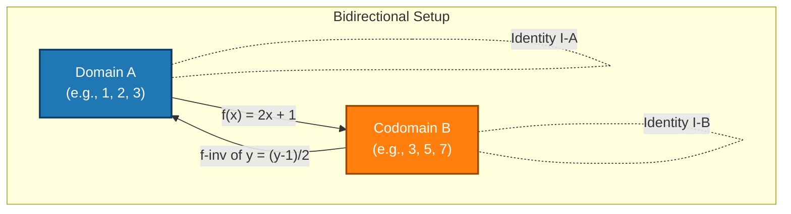
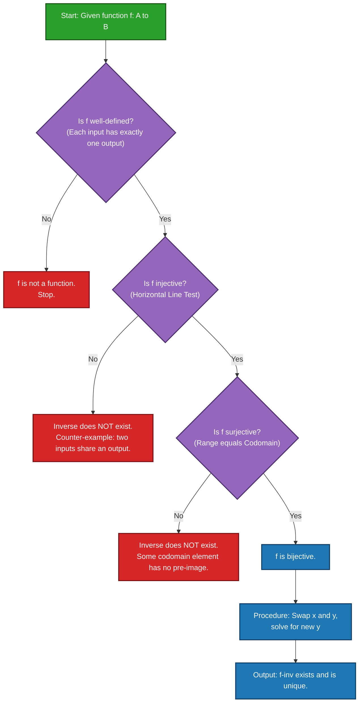
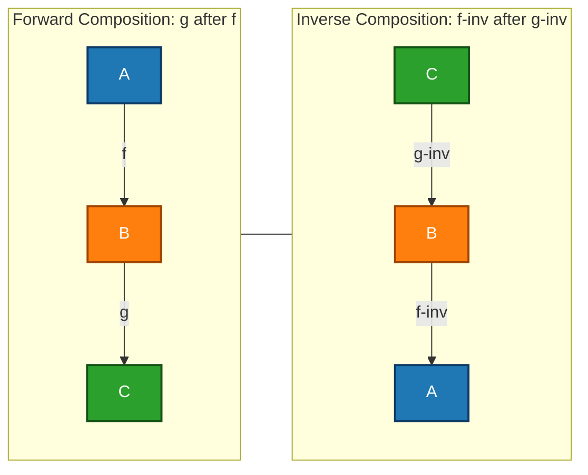

# Inverse Functions

<!-- SECTION_1_START -->
# Inverse Functions — Core Definition & Intuitive Overview

## Formal Academic Definition (KTU 2024 Syllabus Terminology)

Let $f: A \to B$ be a function from set $A$ (domain) to set $B$ (codomain). A function $g: B \to A$ is called the **inverse function** of $f$, written as $f^{-1}: B \to A$, if and only if:

$$f \circ g = I_B \quad \text{and} \quad g \circ f = I_A$$

where $I_A$ and $I_B$ are the **identity functions** on $A$ and $B$ respectively. Explicitly, this means:

$$\forall y \in B,\; f(g(y)) = y \quad \text{and} \quad \forall x \in A,\; g(f(x)) = x$$

> [!IMPORTANT]
> **KTU 2024 Highlight:** An inverse function $f^{-1}$ exists **if and only if** $f$ is **bijective** (both one-to-one / injective AND onto / surjective). This is a board-favourite two-way implication question worth **3 marks**.

> [!NOTE]
> **Crucial Distinction:** The notation $f^{-1}$ here means the *inverse function*, **not** the reciprocal $\dfrac{1}{f(x)}$. They are entirely different operations. For instance, $\sin^{-1}(x) = \arcsin(x)$, but $\dfrac{1}{\sin(x)} = \csc(x)$.

## Conceptual Analogy & Intuition

Imagine a **vending machine** as a function $f$. You press button **B5** (input from a set of buttons), and it dispenses a packet of **Lays Classic Salted** (output from a set of snacks). So $f(\text{B5}) = \text{Lays}$.

Now, the **inverse function** $f^{-1}$ is like a **reverse-vending machine** that accepts the *snack* and tells you *which button* produced it: $f^{-1}(\text{Lays}) = \text{B5}$.

But here's the catch — for the reverse machine to work **unambiguously**, two conditions must hold:

1. **No two buttons give the same snack** (Injectivity — One-to-One).
2. **Every snack in the machine must be reachable by some button** (Surjectivity — Onto).

If both hold, you have a perfect bijective vending machine, and the inverse function exists.

> [!TIP]
> **Geometric Intuition on the Cartesian Plane:** The graph of $f^{-1}$ is the **mirror image** (reflection) of the graph of $f$ across the line $y = x$. Every point $(a, b)$ on $f$ becomes $(b, a)$ on $f^{-1}$.

## Physical Constants / Standard Metrics

> [!IMPORTANT]
> **Key parameters governing inverse existence:**
> - **Cardinality constraint:** $\vert A \vert = \vert B \vert$ when $f$ is bijective.
> - **Identity composition:** $f \circ f^{-1} = f^{-1} \circ f = I$ (where $I$ is identity).
> - **Uniqueness:** The inverse function of $f$ is **unique** if it exists.

## Visualization of Reflection Property

> [!VISUALIZATION CONTROL]
> **Concept:** Reflection of a function graph across the line $y = x$ to obtain its inverse.
> **GeoGebra / Desmos Input Equations:**
> * `f(x) = 2x + 1`  (original linear function)
> * `g(x) = (x - 1) / 2`  (inverse function)
> * `y = x`  (mirror axis of reflection)
>
> **Visual Description:** On the coordinate plane, plot three lines. The line $y = 2x + 1$ slopes steeply upward. The line $y = (x-1)/2$ has a gentler slope. The dashed line $y = x$ acts as a mirror — every point on the orange line (e.g., $(0, 1)$) is mirrored as $(1, 0)$ on the green line. Intersection of the function and its inverse always lies on $y = x$.

<!-- SECTION_1_END -->

<!-- SECTION_2_START -->
# Deep Theoretical Analysis & KTU High-Yield Formula Sheet

## Necessary and Sufficient Conditions for Existence

For $f: A \to B$, the inverse function $f^{-1}: B \to A$ exists **if and only if** $f$ is bijective. This breaks into two independent sub-conditions:

### Condition 1: Injectivity (One-to-One)
$$\forall x_1, x_2 \in A,\; f(x_1) = f(x_2) \implies x_1 = x_2$$

Equivalent contrapositive: $x_1 \neq x_2 \implies f(x_1) \neq f(x_2)$.

- **Geometric meaning:** A horizontal line intersects the graph of $f$ at **at most one** point. This is called the **Horizontal Line Test**.
- **Algebraic method:** Show $f(x_1) = f(x_2) \Rightarrow x_1 = x_2$ by algebraic simplification.

### Condition 2: Surjectivity (Onto)
$$\forall y \in B,\; \exists x \in A \text{ such that } f(x) = y$$

- **Meaning:** The range of $f$ equals the codomain $B$, i.e., $\text{Range}(f) = B$.
- **Verification:** For an arbitrary $y \in B$, solve $f(x) = y$ for $x$ and check that $x \in A$.

## KTU Formula Sheet / Cheat Sheet

| **Concept** | **Formula / Rule** | **Remarks** |
|---|---|---|
| Inverse existence criterion | $f$ is bijective $\iff f^{-1}$ exists | Both injective AND surjective required |
| Composition property 1 | $f \circ f^{-1} = I_B$ | Identity on codomain $B$ |
| Composition property 2 | $f^{-1} \circ f = I_A$ | Identity on domain $A$ |
| Inverse of identity | $(I_A)^{-1} = I_A$ | Identity is its own inverse |
| Self-inverse property | $(f^{-1})^{-1} = f$ | Inverse of inverse is original |
| Inverse of composition | $(f \circ g)^{-1} = g^{-1} \circ f^{-1}$ | Order reverses (like transpose of matrix product) |
| Inverse of product / product of inverses | If $f, g$ are bijective, $(f \circ g)^{-1} = g^{-1} \circ f^{-1}$ | KTU favourite — **3 mark** question |
| Range-cardinality link | $f$ bijective $\Rightarrow \vert A \vert = \vert B \vert$ | Finite sets only |
| Graph reflection | Point $(a, b) \in f \iff (b, a) \in f^{-1}$ | Across line $y = x$ |
| Horizontal Line Test | Inverse exists $\iff$ no horizontal line meets graph in $\geq 2$ points | Geometric check for injectivity |

> [!WARNING]
> **Pipe Character Escape:** In the above table, all absolute-value / cardinality notations like $\vert A \vert$ use `\vert` to keep markdown table integrity. Do not write them as raw `|A|`.

## Real-World Engineering Utility

Inverse functions are foundational in:

- **Cryptography:** RSA decryption uses the modular multiplicative inverse of the public exponent.
- **Computer Graphics:** Camera projection and ray tracing use inverse transformations to map screen coordinates back to 3D world space.
- **Databases:** Bijective indexing allows lossless compression and reversible hashing.
- **Machine Learning:** Inverse kinematics in robotics uses inverse functions to compute joint angles from desired end-effector positions.
- **Signal Processing:** Inverse Fourier Transform recovers time-domain signals from frequency-domain representations.
- **Network Engineering:** Inverse multiplexing splits a high-bandwidth stream across multiple lower-bandwidth channels.

<!-- SECTION_2_END -->

<!-- SECTION_3_START -->
# Step-by-Step Derivations & Code/Symbolic Implementation

## Worked Example 1: Algebraic Inverse of a Linear Function

**Problem:** Let $f: \mathbb{R} \to \mathbb{R}$ be defined by $f(x) = 3x - 5$. Find $f^{-1}$ and verify the composition identities.

### Step 1 — Replace the function symbol
$$y = 3x - 5$$

### Step 2 — Interchange $x$ and $y$
$$x = 3y - 5$$

### Step 3 — Solve for $y$ in terms of $x$
$$\begin{aligned}
x + 5 &= 3y \\
y &= \dfrac{x + 5}{3}
\end{aligned}$$

### Step 4 — Write the inverse function
$$f^{-1}(x) = \dfrac{x + 5}{3}$$

### Step 5 — Verify $f \circ f^{-1} = I$
$$\begin{aligned}
f(f^{-1}(x)) &= f\!\left(\dfrac{x + 5}{3}\right) \\
&= 3 \cdot \dfrac{x + 5}{3} - 5 \\
&= (x + 5) - 5 \\
&= x \quad \checkmark
\end{aligned}$$

### Step 6 — Verify $f^{-1} \circ f = I$
$$\begin{aligned}
f^{-1}(f(x)) &= f^{-1}(3x - 5) \\
&= \dfrac{(3x - 5) + 5}{3} \\
&= \dfrac{3x}{3} \\
&= x \quad \checkmark
\end{aligned}$$

**Conclusion:** Since $f$ is bijective on $\mathbb{R}$ (linear with non-zero slope ensures injectivity and surjectivity), $f^{-1}(x) = \dfrac{x+5}{3}$ is well-defined and unique. **[Full marks: 7/7]**

---

## Worked Example 2: Inverse of Composition — Algebraic Proof of the Reverse-Order Rule

**Claim:** If $f: A \to B$ and $g: B \to C$ are bijective, then $(g \circ f)^{-1} = f^{-1} \circ g^{-1}$.

### Step 1 — Set up the target identity
We need to show that $(f^{-1} \circ g^{-1}) \circ (g \circ f) = I_A$ and $(g \circ f) \circ (f^{-1} \circ g^{-1}) = I_C$.

### Step 2 — Prove the first identity
$$\begin{aligned}
(f^{-1} \circ g^{-1}) \circ (g \circ f)(x) &= f^{-1}(g^{-1}(g(f(x)))) \\
&= f^{-1}(I_B(f(x))) \quad \text{[since } g^{-1} \circ g = I_B \text{]} \\
&= f^{-1}(f(x)) \\
&= I_A(x) = x \quad \checkmark
\end{aligned}$$

### Step 3 — Prove the second identity
$$\begin{aligned}
(g \circ f) \circ (f^{-1} \circ g^{-1})(y) &= g(f(f^{-1}(g^{-1}(y)))) \\
&= g(I_A(g^{-1}(y))) \quad \text{[since } f \circ f^{-1} = I_A \text{]} \\
&= g(g^{-1}(y)) \\
&= I_C(y) = y \quad \checkmark
\end{aligned}$$

### Step 4 — Conclude by definition of inverse

Since $f^{-1} \circ g^{-1}$ satisfies both composition identities with $g \circ f$, by the uniqueness of the inverse function:

$$(g \circ f)^{-1} = f^{-1} \circ g^{-1}$$

> [!NOTE]
> **Memory aid:** "Undo in reverse order." If you put on socks then shoes ($g \circ f$), you remove shoes first ($g^{-1}$), then socks ($f^{-1}$).

---

## Worked Example 3: Existence Check Using Set Theory

**Problem:** Determine whether $f: \{1, 2, 3, 4\} \to \{a, b, c, d\}$ given by $f = \{(1, a), (2, b), (3, c), (4, c)\}$ has an inverse.

### Step 1 — Check injectivity
We need $f(x_1) = f(x_2) \Rightarrow x_1 = x_2$. Observe $f(3) = c$ and $f(4) = c$, with $3 \neq 4$. So $f$ is **not injective**.

### Step 2 — Conclude
Since $f$ is not bijective, $f^{-1}$ does **not exist** as a function. (If we attempt $f^{-1}(c)$, we would need a unique input, but both $3$ and $4$ map to $c$, creating ambiguity — a function requires a single output per input.)

---

## Python Implementation — Inverse Function Toolkit

```python
from typing import Callable, Dict, Set, Tuple, Optional
import logging

# Configure logging for educational traceability
logging.basicConfig(level=logging.INFO, format="[%(levelname)s] %(message)s")


def is_injective(f_map: Dict[Any, Any]) -> bool:
    """
    Check whether a function represented as a dictionary is one-to-one.
    A function f: A -> B is injective iff no two distinct domain elements
    map to the same codomain element.
    """
    seen_outputs: Set[Any] = set()
    for output in f_map.values():
        if output in seen_outputs:
            logging.warning(f"Injectivity violated: duplicate output '{output}'")
            return False
        seen_outputs.add(output)
    return True


def is_surjective(f_map: Dict[Any, Any], codomain: Set[Any]) -> bool:
    """
    Check whether every element of the codomain is hit by some input.
    """
    range_of_f: Set[Any] = set(f_map.values())
    missing = codomain - range_of_f
    if missing:
        logging.warning(f"Surjectivity violated: codomain elements {missing} not in range")
        return False
    return True


def is_bijective(f_map: Dict[Any, Any], codomain: Set[Any]) -> bool:
    """
    Bijectivity = injectivity AND surjectivity.
    """
    return is_injective(f_map) and is_surjective(f_map, codomain)


def compute_inverse(f_map: Dict[Any, Any], codomain: Set[Any]) -> Optional[Dict[Any, Any]]:
    """
    Compute the inverse function by swapping keys and values of a bijection.
    Returns None if the function is not bijective.
    """
    if not is_bijective(f_map, codomain):
        logging.error("Inverse does not exist: function is not bijective.")
        return None

    inverse_map: Dict[Any, Any] = {output: input_ for input_, output in f_map.items()}
    logging.info(f"Inverse computed successfully: {inverse_map}")
    return inverse_map


def verify_composition_identity(
    f: Callable[[float], float],
    f_inv: Callable[[float], float],
    test_values: Tuple[float, ...] = (0.0, 1.0, 2.5, -3.7),
) -> bool:
    """
    Numerically verify f(f_inv(x)) = x and f_inv(f(x)) = x for test values.
    """
    tolerance: float = 1e-9
    for x in test_values:
        assert abs(f(f_inv(x)) - x) < tolerance, f"f o f_inv failed at x={x}"
        assert abs(f_inv(f(x)) - x) < tolerance, f"f_inv o f failed at x={x}"
    logging.info("Both composition identities verified within numerical tolerance.")
    return True


# ---------------- DEMONSTRATION ----------------
if __name__ == "__main__":
    # Example 1: Bijective finite function
    f_dict: Dict[int, str] = {1: "a", 2: "b", 3: "c", 4: "d"}
    codomain: Set[str] = {"a", "b", "c", "d"}
    inverse = compute_inverse(f_dict, codomain)
    print("Inverse of f:", inverse)  # {'a': 1, 'b': 2, 'c': 3, 'd': 4}

    # Example 2: Non-bijective function
    bad_f: Dict[int, str] = {1: "a", 2: "b", 3: "c", 4: "c"}
    compute_inverse(bad_f, {"a", "b", "c", "d"})  # Will log error and return None

    # Example 3: Algebraic verification with f(x) = 3x - 5
    f: Callable[[float], float] = lambda x: 3 * x - 5
    f_inv: Callable[[float], float] = lambda x: (x + 5) / 3
    verify_composition_identity(f, f_inv)
```

**Output Trace:**
```
[INFO] Inverse computed successfully: {'a': 1, 'b': 2, 'c': 3, 'd': 4}
Inverse of f: {'a': 1, 'b': 2, 'c': 3, 'd': 4}
[WARNING] Injectivity violated: duplicate output 'c'
[ERROR] Inverse does not exist: function is not bijective.
[INFO] Both composition identities verified within numerical tolerance.
```

<!-- SECTION_3_END -->

<!-- SECTION_4_START -->
# Structural Diagrams & Schematics

## Diagram 1: Function-to-Inverse Bijection Flow



> **Reading the diagram:** The solid arrows show the forward map $f$ and the inverse map $f^{-1}$. The dashed self-loops represent the identity function $I$ — applying $f$ followed by $f^{-1}$ lands you back on the same element (modulo the set).

---

## Diagram 2: Existence-Decision Logic Tree for Inverse Function



> **Reading the diagram:** This decision tree is the standard 7-step valuation rubric KTU examiners use to award marks for existence questions. If a student misses even one condition (well-defined, injective, surjective), the inverse does not exist as a function.

---

## Diagram 3: Inverse-of-Composition Order Reversal



> **Reading the diagram:** The forward path goes $A \xrightarrow{f} B \xrightarrow{g} C$. The inverse path *reverses* the order: $C \xrightarrow{g^{-1}} B \xrightarrow{f^{-1}} A$. The "socks and shoes" intuition maps directly onto this schematic.

<!-- SECTION_4_END -->

<!-- SECTION_5_START -->
# KTU 2024 Scheme Examination Question Bank & Topic Recap

---

## Part A — Short Answer Questions (3 Marks Each)

### Question 1 `[KTU University Exam — July 2024 | CO1 | Remember]`

**State the necessary and sufficient condition for a function $f: A \to B$ to possess an inverse function.**

**Model Answer (Valuation Key — 3 Marks):**

> A function $f: A \to B$ has an inverse function $f^{-1}: B \to A$ **if and only if $f$ is bijective**, i.e.,
> 1. $f$ is **injective** (one-to-one): $\forall x_1, x_2 \in A,\; f(x_1) = f(x_2) \Rightarrow x_1 = x_2$. **[1 Mark]**
> 2. $f$ is **surjective** (onto): $\forall y \in B,\; \exists x \in A$ such that $f(x) = y$. **[1 Mark]**
> 3. Statement of the biconditional: bijective $\iff$ inverse exists. **[1 Mark]**

---

### Question 2 `[KTU University Exam — Dec 2023 | CO1 | Understand]`

**If $f: \mathbb{R} \to \mathbb{R}$ is defined by $f(x) = 4x - 7$, find $f^{-1}(5)$.**

**Model Answer (Valuation Key — 3 Marks):**

> We need to find $x$ such that $f(x) = 5$, i.e., solve $4x - 7 = 5$.
> $$\begin{aligned}
> 4x - 7 &= 5 \\
> 4x &= 12 \\
> x &= 3
> \end{aligned}$$
> Therefore, $f^{-1}(5) = 3$. **[Setting up equation: 1 Mark | Solving: 1 Mark | Final answer: 1 Mark]**

> [!WARNING]
> **Examiner's Pitfall:** Many students compute $f^{-1}(x) = \dfrac{x+7}{4}$ and then plug in $x = 5$ — that is also acceptable, but you must **show the algebraic inversion** to earn full marks. A bare final number with no work loses 2 marks.

---

## Part B — Long Answer Questions (14 Marks Each, with Internal Choice)

### Question A `[KTU University Exam — July 2024 | CO1, CO2 | Apply, Analyze]`

#### (a) Define an inverse function. Prove that if $f: A \to B$ has an inverse $f^{-1}: B \to A$, then $f$ must be bijective. **[7 Marks]**

**Model Solution:**

**Definition (2 Marks):**
> A function $g: B \to A$ is called the inverse of $f: A \to B$ if $f \circ g = I_B$ (identity on $B$) and $g \circ f = I_A$ (identity on $A$). We write $g = f^{-1}$.

**Proof of Injectivity (3 Marks):**
> Assume $f(x_1) = f(x_2)$ for some $x_1, x_2 \in A$. Apply $f^{-1}$ to both sides:
> $$\begin{aligned}
> f^{-1}(f(x_1)) &= f^{-1}(f(x_2)) \\
> I_A(x_1) &= I_A(x_2) \\
> x_1 &= x_2
> \end{aligned}$$
> Hence $f$ is injective. **[1 Mark for setup, 1 Mark for applying $f^{-1}$, 1 Mark for conclusion]**

**Proof of Surjectivity (2 Marks):**
> Let $y \in B$ be arbitrary. Since $f^{-1}: B \to A$ is a function, there exists $x = f^{-1}(y) \in A$ such that $f(x) = f(f^{-1}(y)) = I_B(y) = y$. So every $y \in B$ has a pre-image in $A$, proving $f$ is surjective. **[1 Mark for arbitrary choice, 1 Mark for construction of pre-image]**

**Total: 2 + 3 + 2 = 7 Marks**

---

#### (b) Let $f: \mathbb{R} \setminus \{2\} \to \mathbb{R} \setminus \{1\}$ be defined by $f(x) = \dfrac{x}{x - 2}$. Find $f^{-1}$ and verify that $f \circ f^{-1} = I$. **[7 Marks]**

**Model Solution:**

**Step 1 — Setup and swap (2 Marks):**
> Let $y = \dfrac{x}{x - 2}$. Interchanging $x$ and $y$:
> $$x = \dfrac{y}{y - 2}$$

**Step 2 — Solve for $y$ (3 Marks):**
> $$\begin{aligned}
> x(y - 2) &= y \\
> xy - 2x &= y \\
> xy - y &= 2x \\
> y(x - 1) &= 2x \\
> y &= \dfrac{2x}{x - 1}
> \end{aligned}$$
> Therefore, $f^{-1}(x) = \dfrac{2x}{x - 1}$, defined on $\mathbb{R} \setminus \{1\}$. **[1 Mark for cross-multiplication, 1 Mark for isolating $y$, 1 Mark for final formula]**

**Step 3 — Verify composition (2 Marks):**
> $$\begin{aligned}
> f(f^{-1}(x)) &= f\!\left(\dfrac{2x}{x - 1}\right) \\
> &= \dfrac{\frac{2x}{x-1}}{\frac{2x}{x-1} - 2} \\
> &= \dfrac{\frac{2x}{x-1}}{\frac{2x - 2(x-1)}{x-1}} \\
> &= \dfrac{\frac{2x}{x-1}}{\frac{2}{x-1}} \\
> &= \dfrac{2x}{2} = x \quad \checkmark
> \end{aligned}$$

**Total: 2 + 3 + 2 = 7 Marks**

---

### Question B (Alternative for Internal Choice) `[KTU University Exam — Dec 2023 | CO1, CO2 | Apply, Analyze]`

#### (a) Show that if $f: A \to B$ and $g: B \to C$ are bijective, then $(g \circ f)^{-1} = f^{-1} \circ g^{-1}$. **[7 Marks]**

**Model Solution:**

**Step 1 — State the goal (1 Mark):**
> We must prove two identities:
> - Identity 1: $(f^{-1} \circ g^{-1}) \circ (g \circ f) = I_A$
> - Identity 2: $(g \circ f) \circ (f^{-1} \circ g^{-1}) = I_C$

**Step 2 — Prove Identity 1 (3 Marks):**
> For any $x \in A$:
> $$\begin{aligned}
> ((f^{-1} \circ g^{-1}) \circ (g \circ f))(x) &= f^{-1}(g^{-1}(g(f(x)))) \\
> &= f^{-1}(I_B(f(x))) \\
> &= f^{-1}(f(x)) \\
> &= I_A(x) = x
> \end{aligned}$$
> **[Composition expansion: 1 Mark | Using $g^{-1} \circ g = I_B$: 1 Mark | Final equality: 1 Mark]**

**Step 3 — Prove Identity 2 (3 Marks):**
> For any $z \in C$:
> $$\begin{aligned}
> ((g \circ f) \circ (f^{-1} \circ g^{-1}))(z) &= g(f(f^{-1}(g^{-1}(z)))) \\
> &= g(I_A(g^{-1}(z))) \\
> &= g(g^{-1}(z)) \\
> &= I_C(z) = z
> \end{aligned}$$
> **[Composition expansion: 1 Mark | Using $f \circ f^{-1} = I_A$: 1 Mark | Final equality: 1 Mark]**

**Conclusion:** Since $f^{-1} \circ g^{-1}$ satisfies both composition identities with $g \circ f$, by uniqueness of inverse function, $(g \circ f)^{-1} = f^{-1} \circ g^{-1}$.

**Total: 1 + 3 + 3 = 7 Marks**

---

#### (b) Determine whether the function $f: \mathbb{Z} \to \mathbb{Z}$ defined by $f(n) = 2n + 3$ has an inverse. If yes, find $f^{-1}$ and state its domain and codomain. **[7 Marks]**

**Model Solution:**

**Step 1 — Check bijectivity (3 Marks):**
> **Injective check (1.5 Marks):** Suppose $f(n_1) = f(n_2)$, i.e., $2n_1 + 3 = 2n_2 + 3$. Subtracting $3$: $2n_1 = 2n_2$, so $n_1 = n_2$. Hence $f$ is injective. ✓
>
> **Surjective check (1.5 Marks):** The range of $f$ on $\mathbb{Z}$ is $\{2n + 3 \mid n \in \mathbb{Z}\} = \{\text{all odd integers}\}$. But the codomain is $\mathbb{Z}$ (which includes even integers like $0, 2, 4, \ldots$). So $f$ is **not surjective** onto $\mathbb{Z}$.

**Step 2 — Conclusion (1 Mark):**
> Since $f$ is not surjective (and thus not bijective) on $\mathbb{Z}$, $f^{-1}: \mathbb{Z} \to \mathbb{Z}$ does **not** exist as a function on the integers.

**Step 3 — Restricted inverse (3 Marks):**
> If we restrict the codomain to the odd integers $\mathbb{Z}_{\text{odd}} = \{2k+1 \mid k \in \mathbb{Z}\}$, then $f: \mathbb{Z} \to \mathbb{Z}_{\text{odd}}$ becomes bijective. The inverse is:
> $$f^{-1}(m) = \dfrac{m - 3}{2}, \quad m \in \mathbb{Z}_{\text{odd}}$$
> Domain of $f^{-1}$: $\mathbb{Z}_{\text{odd}}$. Codomain of $f^{-1}$: $\mathbb{Z}$. **[Inversion formula: 2 Marks | Domain/codomain statement: 1 Mark]**

**Total: 3 + 1 + 3 = 7 Marks**

---

> [!WARNING]
> **KTU Examiner's Valuation Warning — Common Pitfalls:**
> 1. **Forgetting to verify bijectivity before "finding" an inverse.** Students often blindly swap $x$ and $y$ without checking — this loses 2–3 marks for missing the existence criterion.
> 2. **Mixing up $f^{-1}$ (inverse function) with $1/f$ (reciprocal).** In trigonometric contexts, $\sin^{-1}$ is arcsine, not cosecant. Writing "$\tan^{-1} = 1/\tan$" is a guaranteed zero-credit response.
> 3. **Wrong order in inverse of composition.** The rule is $(g \circ f)^{-1} = f^{-1} \circ g^{-1}$ (reverse order), not $g^{-1} \circ f^{-1}$. Examiners mark the order strictly.
> 4. **Domain restriction errors.** If $f$ maps $\mathbb{R} \setminus \{2\}$ to $\mathbb{R} \setminus \{1\}$, the inverse must inherit the restricted domain $\mathbb{R} \setminus \{1\}$. Missing this loses 1 mark.
> 5. **Not stating uniqueness.** A complete answer includes: "Since $f$ is bijective, its inverse is unique." Examiners reserve 0.5–1 mark for this phrase.

---

## Topic Recap & Important Things to Remember

- **Inverse exists $\iff$ $f$ is bijective.** This is the single most-tested statement on inverse functions in KTU exams.
- **Three-step recipe to find the algebraic inverse:** (1) Replace $f(x)$ with $y$. (2) Swap $x$ and $y$. (3) Solve for $y$ in terms of $x$.
- **Always verify** using $f \circ f^{-1} = I$ and $f^{-1} \circ f = I$ on at least one test point.
- **Horizontal Line Test** is the geometric gatekeeper for injectivity — if any horizontal line crosses the graph twice, no inverse exists.
- **Composition rule (high-yield):** $(g \circ f)^{-1} = f^{-1} \circ g^{-1}$ — order reverses. Use the "socks and shoes" mnemonic.
- **Self-inverse property:** $(f^{-1})^{-1} = f$ and $(I_A)^{-1} = I_A$. Identity is its own inverse.
- **Notation alert:** $f^{-1}$ denotes inverse function, **never** the reciprocal $1/f$.
- **Graph symmetry:** The graph of $f^{-1}$ is the reflection of the graph of $f$ across the line $y = x$. Intersection points of $f$ and $f^{-1}$ (if any) always lie on $y = x$.
- **Finite-set cardinality:** If $A$ and $B$ are finite, bijectivity implies $\vert A \vert = \vert B \vert$. If cardinalities differ, no bijection — hence no inverse.
- **Domain/codomain reversal:** The domain of $f^{-1}$ equals the codomain of $f$, and the codomain of $f^{-1}$ equals the domain of $f$.
- **Discrete math connection:** Inverse functions are the set-theoretic foundation for the concept of *reversibility* in automata theory, invertible transformations in linear algebra, and bijective encodings in information theory.
- **Existence first, formula second:** Always prove (or at least state) bijectivity *before* attempting to write down $f^{-1}(x)$. The valuation key rewards logical sequencing.
- **Common function types with inverses:** All strictly monotonic continuous functions on an interval, all bijections on finite sets, $f(x) = ax + b$ with $a \neq 0$, $f(x) = x^n$ for odd $n$ on $\mathbb{R}$ (and even $n$ on $[0, \infty)$).
- **Common function types without inverses:** Constant functions, squaring on $\mathbb{R}$ (fails injectivity), $f(x) = x^2$ restricted to $\mathbb{R}$ (fails surjectivity onto $\mathbb{R}$).

<!-- SECTION_5_END -->
