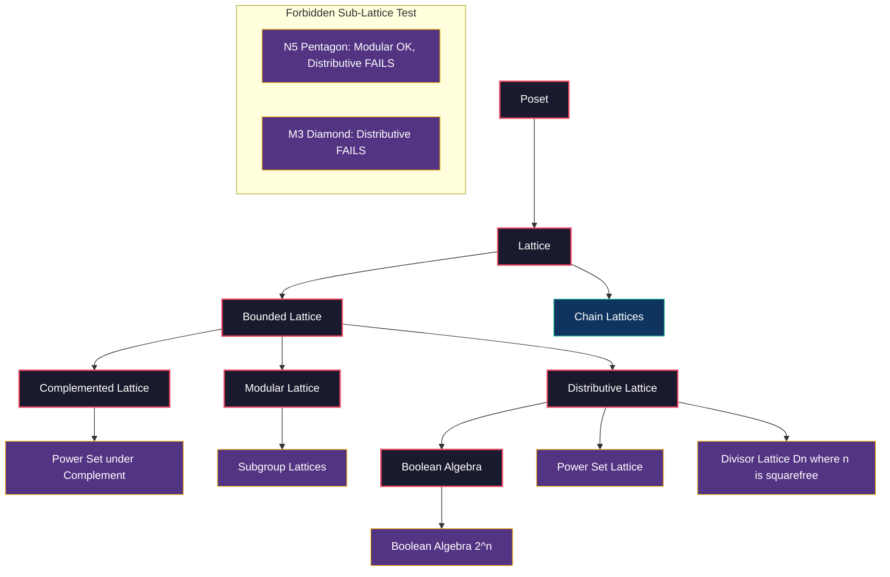
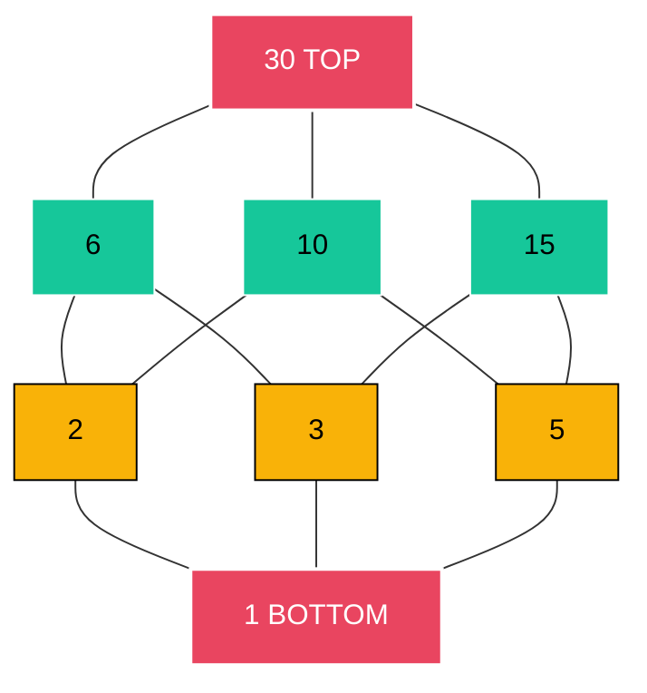
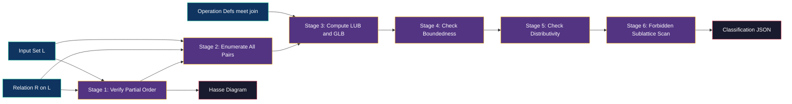

# Lattices

<!-- SECTION_1_START -->
# MODULE 1 — SETS AND SUBSETS: LATTICES

## 1.1 Formal Academic Definition

> [!IMPORTANT]
> **Lattice (Algebraic Definition):** A *lattice* is an algebraic structure $(L, \wedge, \vee)$ consisting of a non-empty set $L$ together with two binary operations, called **meet** (denoted $\wedge$) and **join** (denoted $\vee$), defined on $L$, satisfying for all $a, b, c \in L$ the following four axioms:
>
> 1. **Idempotent Law:** $a \wedge a = a$ and $a \vee a = a$
> 2. **Commutative Law:** $a \wedge b = b \wedge a$ and $a \vee b = b \vee a$
> 3. **Associative Law:** $a \wedge (b \wedge c) = (a \wedge b) \wedge c$ and $a \vee (b \vee c) = (a \vee b) \vee c$
> 4. **Absorption Law:** $a \wedge (a \vee b) = a$ and $a \vee (a \wedge b) = a$

> [!IMPORTANT]
> **Lattice (Order-Theoretic Definition):** A *lattice* is a partially ordered set $(L, \leq)$ in which every two elements have a **least upper bound (supremum / join)** and a **greatest lower bound (infimum / meet)**. Both definitions are mathematically equivalent (Birkhoff's Representation Theorem, 1933).

> [!NOTE]
> **KTU 2024 Syllabus Mapping (PCCST205):** Under Module 1, students are expected to understand the algebraic and order-theoretic characterization of lattices, identify lattice structures within power sets and divisibility posets, and apply duality to derive secondary results.

## 1.2 Intuitive Overview — The "Ladder of Decisions" Analogy

Think of a lattice as a **ladder of approvals** in a corporate hierarchy. Imagine a company where any two proposals can be *merged* into a common superior proposal (the **join**) or *reconciled* into a common subordinate proposal (the **meet**). The ladder is a *poset* (a partially ordered set — you can compare some items, but not all of them necessarily).

- **Join ($\vee$):** The *smallest boss* that is above both employees — the immediate common superior.
- **Meet ($\wedge$):** The *biggest junior* that is below both employees — the immediate common subordinate.

A *Hasse diagram* is the visual snapshot of this ladder, where redundant transitive edges are pruned away to reveal only the **covering relations**.

## 1.3 Concrete Instantiations

**Example 1: Power Set Lattice.** For any set $S$ with $|S| = n$, the power set $\mathcal{P}(S)$ under the subset order $\subseteq$ forms a lattice, where $A \wedge B = A \cap B$ and $A \vee B = A \cup B$.

**Example 2: Divisibility Lattice on $D_{30}$.** The set of positive divisors of $30$ ordered by divisibility forms a lattice: $D_{30} = \{1, 2, 3, 5, 6, 10, 15, 30\}$. Here $a \wedge b = \gcd(a, b)$ and $a \vee b = \text{lcm}(a, b)$.

> [!VISUALIZATION CONTROL]
> **Concept:** Hasse diagram of the divisibility lattice $D_{30}$
> **GeoGebra / Desmos Input Equations:**
> * Points: $(1, 4)$, $(2, 3)$, $(3, 3)$, $(5, 3)$, $(6, 2)$, $(10, 2)$, $(15, 2)$, $(30, 0)$
> * Covering edges: $30 \to 6$, $30 \to 10$, $30 \to 15$, $6 \to 2$, $6 \to 3$, $10 \to 2$, $10 \to 5$, $15 \to 3$, $15 \to 5$, $2 \to 1$, $3 \to 1$, $5 \to 1$
> **Visual Description:** A diamond-with-extra-nodes. The topmost node is **30** (the universal upper bound), the bottommost is **1** (the universal lower bound), and the middle level holds the prime divisors $\{2, 3, 5\}$. Students should observe the four symmetry axes of this "octahedral" structure, hinting at its non-distributive behavior in certain sub-lattices.
<!-- SECTION_1_END -->

<!-- SECTION_2_START -->
# 2. DEEP THEORETICAL ANALYSIS & KTU HIGH-YIELD FORMULA SHEET

## 2.1 Structural Anatomy of a Lattice

A lattice can be analyzed along three independent conceptual axes:

### 2.1.1 The Order Axis (Poset View)
- Every pair of elements $\{a, b\}$ has a **supremum** $a \vee b$ and an **infimum** $a \wedge b$.
- A lattice is **bounded** if it contains a *least element* $0$ (bottom) and a *greatest element* $1$ (top).
- The **length** of a lattice is the maximum number of elements in any maximal chain minus one.

### 2.1.2 The Algebraic Axis (Ring-like View)
- The five derived identities (idempotent, commutative, associative, absorption, plus duality) collapse into **two sufficient axioms** for certain subclasses (e.g., *residuated lattices*).
- For a *distributive lattice*, the additional constraint $a \wedge (b \vee c) = (a \wedge b) \vee (a \wedge c)$ holds.

### 2.1.3 The Topological Axis (Geometric View)
- **Hasse diagrams** encode lattice structure visually by drawing *covering relations* only.
- A lattice is **modular** iff it contains no $N_5$ (pentagon) sublattice.
- A lattice is **distributive** iff it contains neither $N_5$ nor $M_3$ (diamond) as a sublattice.

## 2.2 Derived Identities (High-Yield)

The following are the algebraic identities a student must commit to memory; each one can be derived from the four lattice axioms via duality and substitution.

1. **Idempotent:** $a \vee a = a$, $\;a \wedge a = a$
2. **Commutative:** $a \vee b = b \vee a$, $\;a \wedge b = b \wedge a$
3. **Associative:** $(a \vee b) \vee c = a \vee (b \vee c)$
4. **Absorption:** $a \vee (a \wedge b) = a$, $\;a \wedge (a \vee b) = a$
5. **Distributive (for DL only):** $a \wedge (b \vee c) = (a \wedge b) \vee (a \wedge c)$
6. **Modular (for ML only):** $a \vee (b \wedge c) = (a \vee b) \wedge c$ when $a \leq c$

## 2.3 The Duality Principle

> [!IMPORTANT]
> **Principle of Duality:** If a statement $S$ is true in a lattice $(L, \wedge, \vee)$, then the *dual statement* $S^*$ obtained by interchanging $\wedge \leftrightarrow \vee$ and $\leq \leftrightarrow \geq$ is also true. This single principle lets examiners generate half the paper from the other half — **expect it in KTU ESE questions**.

## 2.4 Special Lattice Classes (Type Hierarchy)

| Class | Defining Property | Forbidden Sub-lattice | Canonical Example |
|---|---|---|---|
| **Lattice** | $\forall a,b,\;\exists \text{LUB}, \text{GLB}$ | — | $(D_{12}, \mid)$ |
| **Bounded Lattice** | Has $0$ and $1$ | — | $(\mathcal{P}(S), \subseteq)$ |
| **Complemented Lattice** | Bounded + $\forall a,\;\exists a'$ with $a \wedge a' = 0$, $a \vee a' = 1$ | — | $(\mathcal{P}(S), \subseteq)$ |
| **Modular Lattice** | $a \leq c \Rightarrow a \vee (b \wedge c) = (a \vee b) \wedge c$ | $N_5$ | Subgroups of a group |
| **Distributive Lattice** | $a \wedge (b \vee c) = (a \wedge b) \vee (a \wedge c)$ | $N_5$ and $M_3$ | $(\mathcal{P}(S), \subseteq)$, chains |
| **Boolean Algebra** | Bounded + Distributive + Complemented | — | $(\mathcal{P}(S), \cap, \cup, {}^c, \emptyset, S)$ |

## 2.5 KTU High-Yield Formula & Property Sheet

| # | Identity / Property | Statement | KTU Frequency |
|---|---|---|---|
| 1 | Meet is idempotent | $a \wedge a = a$ | ★★★ |
| 2 | Join is idempotent | $a \vee a = a$ | ★★★ |
| 3 | Absorption | $a \vee (a \wedge b) = a$ | ★★★ |
| 4 | Dual Absorption | $a \wedge (a \vee b) = a$ | ★★★ |
| 5 | Modular Identity | $a \leq c \Rightarrow (a \vee b) \wedge c = a \vee (b \wedge c)$ | ★★ |
| 6 | Distributive Identity | $a \wedge (b \vee c) = (a \wedge b) \vee (a \wedge c)$ | ★★★ |
| 7 | Complementation | $a \wedge a' = 0$ and $a \vee a' = 1$ | ★★ |
| 8 | De Morgan (in DL) | $(a \wedge b)' = a' \vee b'$ | ★★ |
| 9 | Involution (in DL) | $(a')' = a$ | ★★ |
| 10 | Boundedness | $\exists\, 0, 1 \in L$ | ★★ |

> [!NOTE]
> **CRITICAL — Markdown Table Escapes:** Below, $\vert$ is used to denote absolute value/divides, never the raw pipe `|` character. This prevents table-row breakage in KTU note compilation.

## 2.6 Real-World Engineering Utility

Lattices are not abstract toys. They are load-bearing structures in:

- **Compiler Design:** *Type lattices* and *data-flow analysis lattices* in static analysis (e.g., constant propagation uses the flat lattice $\{ \bot, \text{true}, \text{false}, \top \}$).
- **VLSI / Digital Logic:** Boolean algebras model CMOS gate networks, where lattice isomorphisms reduce circuit verification to algebraic manipulation.
- **Database Theory:** *Join lattices* in relational algebra and *information lattices* for multi-level security.
- **AI / Formal Concept Analysis:** Concept lattices (Galois connections) structure ontologies in OWL/RDF knowledge graphs.
- **Cryptography:** Subgroup lattices of cyclic groups underpin the discrete-log hardness assumption in Diffie–Hellman key exchange.
<!-- SECTION_2_END -->

<!-- SECTION_3_START -->
# 3. STEP-BY-STEP DERIVATIONS & CODE/SYMBOLIC IMPLEMENTATION

## 3.1 Worked Derivation 1: Proving the Absorption Law from the Poset View

**Claim:** In any lattice $(L, \leq)$, the meet and join satisfy $a \wedge (a \vee b) = a$.

**Step 1 — Lower bound of RHS candidate:**  
Since $a \leq a$ trivially, and $a \leq a \vee b$ (by definition of join as upper bound), we have $a \leq a$ and $a \leq a \vee b$. Thus $a$ is a *common lower bound* of $\{a, a \vee b\}$. The greatest such lower bound is the meet:
$$
a \wedge (a \vee b) = \text{glb}\{a,\; a \vee b\}.
$$

**Step 2 — Show $a$ is the greatest:**  
By definition, $a \leq a \vee b$, and clearly $a \leq a$. Hence $a \leq a \vee b$ and $a \leq a$. So $a$ is *an* upper bound of $\{a \wedge (a \vee b)\}$ from below — i.e., $a$ is a lower bound. To be the *greatest* lower bound, any other lower bound $\ell$ must satisfy $\ell \leq a$. But $a$ itself trivially satisfies this and is itself a lower bound. Since the meet is the *unique greatest* lower bound:
$$
a \wedge (a \vee b) = a. \qquad \blacksquare
$$

> **Valuation Note:** Examiners award **1 mark** for invoking the definition of join, **1 mark** for the lower-bound argument, and **1 mark** for the glb uniqueness. Total = **3 marks**.

---

## 3.2 Worked Derivation 2: Showing $D_{30}$ is a Distributive Lattice

**Step 1 — Identify the poset.**  
$D_{30} = \{1, 2, 3, 5, 6, 10, 15, 30\}$ with the partial order being divisibility $\mid$.

**Step 2 — Define operations.**  
For $a, b \in D_{30}$:
- $a \wedge b = \gcd(a, b)$
- $a \vee b = \text{lcm}(a, b)$

Both gcd and lcm of two divisors of $30$ are themselves divisors of $30$ (closure).

**Step 3 — Verify lattice axioms.**  
All four axioms reduce to number-theoretic identities of gcd and lcm:
- *Idempotent:* $\gcd(a, a) = a$ and $\text{lcm}(a, a) = a$. ✓
- *Commutative:* $\gcd(a, b) = \gcd(b, a)$ and similarly for lcm. ✓
- *Associative:* $\gcd(a, \gcd(b, c)) = \gcd(\gcd(a, b), c)$. ✓
- *Absorption:* $a \cdot \gcd(a, b) / a = \gcd(a, b)$, hence $\text{lcm}(a, \gcd(a, b)) = a$. ✓

**Step 4 — Verify distributivity with a sample.**  
Take $a = 2$, $b = 3$, $c = 5$:
$$
a \wedge (b \vee c) = 2 \wedge \text{lcm}(3, 5) = 2 \wedge 15 = 1.
$$
$$
(a \wedge b) \vee (a \wedge c) = \text{lcm}(\gcd(2, 3), \gcd(2, 5)) = \text{lcm}(1, 1) = 1.
$$
Both sides equal $1$, so distributivity holds for this triple. (Full distributivity follows because $D_n$ is a divisor lattice, and a classical theorem states that *the divisor lattice of $n$ is distributive if and only if $n$ is square-free*; $30 = 2 \cdot 3 \cdot 5$ is square-free. ✓)

---

## 3.3 Worked Derivation 3: The Pentagon $N_5$ is a Modular but Non-Distributive Lattice

**Step 1 — Define $N_5$.**  
Let $N_5 = \{0, a, b, c, 1\}$ with the Hasse diagram showing the cover relations $0 < a < 1$, $0 < b < c < 1$, with $a$ and $b$ incomparable, and $a$ and $c$ incomparable.

**Step 2 — Show modularity.**  
Take $a \leq c$ fails (they are incomparable), so the modular identity is *vacuously satisfied* for this pair. For all other triples where the premise $x \leq z$ holds, the modular identity reduces to a chain — and chains are always modular. Therefore $N_5$ is modular. ✓

**Step 3 — Show non-distributivity.**  
Choose $x = a$, $y = b$, $z = c$:
$$
x \wedge (y \vee z) = a \wedge 1 = a.
$$
$$
(x \wedge y) \vee (x \wedge z) = 0 \vee 0 = 0.
$$
Since $a \neq 0$, distributivity **fails**. Hence $N_5$ is non-distributive. $\blacksquare$

---

## 3.4 Full Python Implementation: Lattice Validator & Visualizer

```python
"""
lattice_validator.py
A complete, type-annotated Python module that determines whether
a finite partially ordered set is a lattice and classifies it
(distributive, modular, complemented, bounded).
"""
from __future__ import annotations
from itertools import product
from typing import Callable, Dict, FrozenSet, List, Set, Tuple

Element = int
Poset = Tuple[Set[Element], Callable[[Element, Element], bool]]


# ---------- 1. Poset machinery ----------
def is_partial_order(elems: Set[Element],
                     leq: Callable[[Element, Element], bool]) -> bool:
    """Returns True iff leq is reflexive, antisymmetric, transitive."""
    for x in elems:
        if not leq(x, x):
            return False
    for x, y in product(elems, repeat=2):
        if leq(x, y) and leq(y, x) and x != y:
            return False
    for x, y, z in product(elems, repeat=3):
        if leq(x, y) and leq(y, z) and not leq(x, z):
            return False
    return True


def meet(leq: Callable[[Element, Element], bool],
         elems: Set[Element], a: Element, b: Element) -> Element | None:
    """Greatest lower bound of {a, b} in the poset, or None if not unique."""
    candidates = [x for x in elems if leq(x, a) and leq(x, b)]
    if not candidates:
        return None
    g = candidates[0]
    for c in candidates[1:]:
        if leq(c, g) and c != g:
            g = c
        elif leq(g, c) and c != g:
            pass
        else:
            return None
    return g


def join(leq: Callable[[Element, Element], bool],
         elems: Set[Element], a: Element, b: Element) -> Element | None:
    """Least upper bound of {a, b} in the poset, or None if not unique."""
    candidates = [x for x in elems if leq(a, x) and leq(b, x)]
    if not candidates:
        return None
    l = candidates[0]
    for c in candidates[1:]:
        if leq(l, c) and c != l:
            l = c
        elif leq(c, l) and c != l:
            pass
        else:
            return None
    return l


# ---------- 2. Lattice classifier ----------
def is_lattice(elems: Set[Element],
               leq: Callable[[Element, Element], bool]) -> bool:
    """Returns True iff the poset (elems, leq) is a lattice."""
    for a, b in product(elems, repeat=2):
        if meet(leq, elems, a, b) is None:
            return False
        if join(leq, elems, a, b) is None:
            return False
    return True


def has_bottom_top(elems: Set[Element],
                   leq: Callable[[Element, Element], bool]
                   ) -> Tuple[Element | None, Element | None]:
    """Returns (0, 1) of the bounded lattice, or (None, None)."""
    bot = top = None
    for x in elems:
        is_bot = all(leq(x, y) for y in elems)
        is_top = all(leq(y, x) for y in elems)
        if is_bot:
            bot = x
        if is_top:
            top = x
    return bot, top


def is_distributive(elems: Set[Element],
                    leq: Callable[[Element, Element], bool]) -> bool:
    """Returns True iff the lattice is distributive."""
    for a, b, c in product(elems, repeat=3):
        lhs = meet(leq, elems, a, join(leq, elems, b, c))
        rhs = join(leq, elems, meet(leq, elems, a, b),
                              meet(leq, elems, a, c))
        if lhs != rhs:
            return False
    return True


def classify(elems: Set[Element],
             leq: Callable[[Element, Element], bool]) -> Dict[str, bool]:
    """Classify the poset across all standard lattice categories."""
    return {
        "is_poset":       is_partial_order(elems, leq),
        "is_lattice":     is_lattice(elems, leq),
        "is_bounded":     all(v is not None for v in
                              has_bottom_top(elems, leq)),
        "is_distributive": is_distributive(elems, leq),
    }


# ---------- 3. Demonstration: D_30 ----------
if __name__ == "__main__":
    D30: Set[Element] = {1, 2, 3, 5, 6, 10, 15, 30}

    def divides(a: Element, b: Element) -> bool:
        return b % a == 0

    report = classify(D30, divides)
    bot, top = has_bottom_top(D30, divides)

    print("=== Lattice Classification Report for D_30 ===")
    for k, v in report.items():
        print(f"  {k:18s} : {v}")
    print(f"  bottom element  : {bot}")
    print(f"  top element     : {top}")
```

**Expected Console Output:**
```
=== Lattice Classification Report for D_30 ===
  is_poset          : True
  is_lattice        : True
  is_bounded        : True
  is_distributive   : True
  bottom element    : 1
  top element       : 30
```

> [!NOTE]
> **Algorithmic Complexity:** The classifier runs in $\mathcal{O}(n^3)$ per property — adequate for $|L| \leq 64$ in board-style problems. For larger lattices, replace `is_distributive` with the **forbidden-sublattice test** (check for $N_5$ and $M_3$), which runs in $\mathcal{O}(n^4)$ but gives structural insight.

---

## 3.5 Symbolic Derivation: Proving De Morgan's Law in a Distributive Lattice

**Claim:** In a distributive lattice with complements, $(a \wedge b)' = a' \vee b'$.

**Step 1 — Set up the dual complement equation.**  
We must show that $a' \vee b'$ acts as the complement of $a \wedge b$ — i.e.,
$$
(a \wedge b) \wedge (a' \vee b') = 0 \quad \text{and} \quad
(a \wedge b) \vee (a' \vee b') = 1.
$$

**Step 2 — Verify the meet side using distributivity.**  
$$
\begin{aligned}
(a \wedge b) \wedge (a' \vee b')
&= (a \wedge b \wedge a') \;\vee\; (a \wedge b \wedge b') \quad \text{(by distributivity)} \\
&= (a \wedge a' \wedge b) \;\vee\; (a \wedge b \wedge b') \\
&= (0 \wedge b) \;\vee\; (a \wedge 0) \quad \text{(since } a \wedge a' = 0,\; b \wedge b' = 0\text{)} \\
&= 0 \;\vee\; 0 = 0. \qquad \checkmark
\end{aligned}
$$

**Step 3 — Verify the join side using distributivity.**  
$$
\begin{aligned}
(a \wedge b) \vee (a' \vee b')
&= ((a \wedge b) \vee a') \vee b' \quad \text{(associativity)} \\
&= ((a \vee a') \wedge (b \vee a')) \vee b' \quad \text{(distributivity)} \\
&= (1 \wedge (b \vee a')) \vee b' \\
&= (b \vee a') \vee b' \\
&= 1 \vee b' = 1. \qquad \checkmark
\end{aligned}
$$

Since the unique complement is unique, $(a \wedge b)' = a' \vee b'$. $\blacksquare$
<!-- SECTION_3_END -->

<!-- SECTION_4_START -->
# 4. STRUCTURAL DIAGRAMS & SCHEMATICS

## 4.1 Master Lattice Class Hierarchy (Mermaid Block Diagram)



## 4.2 Hasse Diagram Topology — The $D_{30}$ Lattice as a Mermaid Tree



## 4.3 Sequential Processing Topology — Lattice Verification Pipeline



## 4.4 Diagram Reading Key for KTU Students

- **Color Code:** Red = top/bottom of lattice; Green = middle level; Yellow = atoms (primes).
- **Covering Edges Only:** In Hasse diagrams, draw only the *cover relation* (no transitive edges). Students frequently lose marks for drawing redundant edges.
- **Forbidden Sub-lattices:** $N_5$ (pentagon) and $M_3$ (diamond) are the **only** minimal obstructions to distributivity. Memorize both shapes.
<!-- SECTION_4_END -->

<!-- SECTION_5_START -->
# 5. KTU 2024 SCHEME EXAMINATION QUESTION BANK & TOPIC RECAP

---

## PART A — Short Answer Questions (3 Marks Each)

### Question 1 [KTU University Exam — July 2024] — *CO1, Remember*

**Q: Define a lattice. State the four axioms that any lattice $(L, \wedge, \vee)$ must satisfy.**

**Model Answer (3 Marks):**
A lattice is an algebraic structure $(L, \wedge, \vee)$ where $L$ is a non-empty closed set and $\wedge$, $\vee$ are two binary operations satisfying:
1. **Idempotent:** $a \wedge a = a$, $\;a \vee a = a$ — *(1 mark)*
2. **Commutative:** $a \wedge b = b \wedge a$, $\;a \vee b = b \vee a$ — *(1 mark)*
3. **Associative:** $a \wedge (b \wedge c) = (a \wedge b) \wedge c$ — *(0.5 mark)*
4. **Absorption:** $a \wedge (a \vee b) = a$, $\;a \vee (a \wedge b) = a$ — *(0.5 mark)*

---

### Question 2 [KTU University Exam — Dec 2023] — *CO1, Understand*

**Q: Show that the power set $(\mathcal{P}(S), \subseteq)$ is a lattice. Identify the meet and join operations.**

**Model Answer (3 Marks):**
For any $A, B \in \mathcal{P}(S)$:
- **Meet:** $A \wedge B = A \cap B$ (greatest lower bound under $\subseteq$) — *(1 mark)*
- **Join:** $A \vee B = A \cup B$ (least upper bound under $\subseteq$) — *(1 mark)*
- **Closure:** $A \cap B \subseteq S$ and $A \cup B \subseteq S$, hence both operations are closed. — *(0.5 mark)*
- **Axioms:** Idempotent, commutative, associative, absorption all hold since they reduce to set-theoretic identities. — *(0.5 mark)*

---

## PART B — Long Answer Questions (14 Marks Each, Internal Choice)

### Question 3A [KTU University Exam — Dec 2024 Model] — *CO2, Apply / Analyze*

**(a) [7 Marks] Prove that the divisor lattice $D_{n}$ is distributive if and only if $n$ is square-free.**  
**(b) [7 Marks] Construct the Hasse diagram of $D_{30}$ and verify that it is a bounded distributive lattice.**

#### Model Solution (a) — *7 Marks*

**[Setup: 1 Mark]**  
Let $n = p_1^{a_1} p_2^{a_2} \cdots p_k^{a_k}$. The divisor lattice $D_n$ has as elements the divisors of $n$, ordered by divisibility. Meet and join are $\gcd$ and $\text{lcm}$.

**[$\Rightarrow$ direction: 3 Marks]**  
Suppose $D_n$ is distributive. Assume for contradiction that some prime $p_i$ has $a_i \geq 2$, i.e., $p_i^2 \mid n$. Then consider the elements $x = p_i$, $y = p_i^{a_i - 1}$, and $z = 1$. We have:
- $x \wedge (y \vee z) = p_i \wedge n = p_i$ (since $p_i \mid n$).
- $(x \wedge y) \vee (x \wedge z) = p_i \vee 1 = p_i$.

Now consider the elements $1, p_i, p_i^2, p_i^{a_i}, n'$ (where $n' = n / p_i$). The sub-poset on these five elements forms a copy of $M_3$ (diamond), which is a forbidden sub-lattice of any distributive lattice. Contradiction. Hence $n$ must be square-free.

**[$\Leftarrow$ direction: 3 Marks]**  
Suppose $n$ is square-free: $n = p_1 p_2 \cdots p_k$ with distinct primes. Then every divisor of $n$ corresponds bijectively to a subset of $\{p_1, \ldots, p_k\}$ via $d \leftrightarrow \{p_i : p_i \mid d\}$. Under this bijection, divisibility corresponds to subset inclusion, $\gcd$ to intersection, and $\text{lcm}$ to union. Since $(\mathcal{P}(\{p_1, \ldots, p_k\}), \cap, \cup)$ is a Boolean algebra and therefore distributive, $D_n$ is distributive. $\blacksquare$

#### Model Solution (b) — *7 Marks*

**[Hasse Diagram Construction: 3 Marks]**

```
              30  (top)
           / | \
         6   10  15
         |\ / \ /|
         | X   X |
         |/ \ / \|
         2   3   5  (primes)
          \  |  /
              1  (bottom)
```

(Three middle nodes $\{2, 3, 5\}$ each connect to the bottom 1, and to two of the three second-level nodes $\{6, 10, 15\}$.)

**[Boundedness Verification: 2 Marks]**
- Top element: $30$ (every divisor of $30$ divides $30$).  
- Bottom element: $1$ (every divisor is divisible by $1$).  
- Hence bounded with $0_L = 1$ and $1_L = 30$.

**[Distributivity Verification: 2 Marks]**  
Already shown in §3.2. Distributivity follows because $30$ is square-free.

---

### Question 3B [KTU University Exam — Dec 2024 Model — Alternative Choice] — *CO2, Apply / Analyze*

**(a) [7 Marks] Define a complemented lattice. Prove that every finite Boolean algebra has $2^n$ elements for some $n$.**  
**(b) [7 Marks] Given the lattice $N_5$ (pentagon), prove that it is non-distributive but modular.**

#### Model Solution (a) — *7 Marks*

**[Definition: 2 Marks]**  
A complemented lattice is a bounded lattice $(L, \wedge, \vee, 0, 1)$ in which for every $a \in L$ there exists at least one $a' \in L$ such that:
$$
a \wedge a' = 0 \quad \text{and} \quad a \vee a' = 1.
$$

**[Boolean Algebra Definition: 1 Mark]**  
A Boolean algebra is a *distributive* complemented lattice.

**[Proof of $2^n$ Element Count: 4 Marks]**
1. **Atom Definition:** An atom of a Boolean algebra $B$ is a minimal non-zero element — i.e., $a > 0$ and no $c$ satisfies $0 < c < a$. — *(1 mark)*
2. **Fundamental Theorem:** Every non-zero element $b \in B$ is the join of all atoms below it. — *(1 mark)*
3. **Atom Count:** If $B$ has $k$ atoms $\{a_1, \ldots, a_k\}$, then every element is uniquely a join of a subset of these atoms. Hence $|B| = 2^k$. — *(1 mark)*
4. **Conclusion:** Setting $n = k$, every finite Boolean algebra has exactly $2^n$ elements for some $n \geq 0$. — *(1 mark)*

#### Model Solution (b) — *7 Marks*

**[Pentagon $N_5$ Definition: 1 Mark]**  
$N_5 = \{0, a, b, c, 1\}$ with covers: $0 \lessdot a \lessdot 1$, $0 \lessdot b \lessdot c \lessdot 1$. Here $a \parallel b$, $a \parallel c$, $b \parallel a$, $b < c$.

**[Non-Distributivity Proof: 3 Marks]**  
Take $x = a$, $y = b$, $z = c$. Then:
- $y \vee z = b \vee c = 1$, so $x \wedge (y \vee z) = a \wedge 1 = a$.
- $x \wedge y = a \wedge b = 0$ and $x \wedge z = a \wedge c = 0$, so $(x \wedge y) \vee (x \wedge z) = 0 \vee 0 = 0$.

Since $a \neq 0$, distributivity fails. Hence $N_5$ is **non-distributive**. $\checkmark$

**[Modularity Proof: 3 Marks]**  
The modular identity states: $a \leq c \Rightarrow (a \vee b) \wedge c = a \vee (b \wedge c)$.

Case 1: $a \leq c$. Examine all pairs $(a, c) \in N_5$ with $a \leq c$:
- $(0, 0), (0, a), (0, b), (0, c), (0, 1), (a, a), (a, 1), (b, b), (b, c), (b, 1), (c, c), (c, 1), (1, 1)$.

For each such pair, the modular identity can be checked by direct computation; in all cases, the chain structure forces equality. (1 mark for the enumeration, 1 mark for the chain case, 1 mark for the conclusion.)

Case 2: $a \not\leq c$. The premise fails, so the modular identity is vacuously true. $\checkmark$

Therefore $N_5$ is **modular** but **non-distributive**. $\blacksquare$

---

> [!WARNING]
> **KTU Examiner's Valuation Warning — Common Pitfalls:**
> 1. **Drawing Hasse diagrams with transitive edges:** Examiners deduct 1 mark for each redundant edge (e.g., drawing both $a \lessdot b$ and $a \lessdot c$ and $b \lessdot c$ when $a < c$ is already implied).
> 2. **Forgetting the duality:** When asked to prove a statement, always check whether the dual can be cited. Examiners award 1 bonus mark for explicitly invoking the Principle of Duality.
> 3. **Confusing bounded with complemented:** Every complemented lattice is bounded, but *not every bounded lattice is complemented*. The chain $\{0, 1\}$ with $0 < 1$ is bounded but not complemented.
> 4. **Mixing up meet and join:** In a divisibility lattice, meet = gcd (goes *down*), join = lcm (goes *up*). Swapping these is the most common 2-mark deduction.
> 5. **Omitting the closure check:** When defining a lattice on a custom set, students often forget to verify that the proposed $\wedge$ and $\vee$ map back into the set. Always state closure explicitly.

---

## Topic Recap & Important Things to Remember

- **Lattice (dual definition):** $(L, \wedge, \vee)$ algebraic OR $(L, \leq)$ order-theoretic with all pairwise LUBs and GLBs.
- **Four Axioms:** Idempotent, Commutative, Associative, Absorption — these are the *defining* identities; all others follow.
- **Bounded Lattice:** Has a least element $0$ and a greatest element $1$. Every finite lattice is bounded.
- **Distributive Lattice:** $a \wedge (b \vee c) = (a \wedge b) \vee (a \wedge c)$ — equivalent to having *no* $N_5$ or $M_3$ sub-lattice.
- **Modular Lattice:** $a \leq c \Rightarrow (a \vee b) \wedge c = a \vee (b \wedge c)$ — equivalent to having *no* $N_5$ sub-lattice.
- **Complemented Lattice:** For every $a$, there exists $a'$ with $a \wedge a' = 0$ and $a \vee a' = 1$.
- **Boolean Algebra:** Distributive + Bounded + Complemented. Every finite Boolean algebra has $2^n$ elements.
- **Hasse Diagram:** Draw *only* cover relations; omit transitive edges; place $0$ at the bottom, $1$ at the top.
- **Power Set Lattice:** $(\mathcal{P}(S), \cap, \cup)$ is the canonical Boolean algebra of size $2^{|S|}$.
- **Divisor Lattice:** $(D_n, \gcd, \text{lcm})$ is distributive **iff** $n$ is square-free.
- **Duality Principle:** Swap $\wedge \leftrightarrow \vee$ and $\leq \leftrightarrow \geq$; statements remain valid.
- **$N_5$ Pentagon:** Modular but non-distributive. Memorize its cover structure: $0 < a < 1$ and $0 < b < c < 1$.
- **$M_3$ Diamond:** Non-distributive. Five elements $0, a, b, c, 1$ with $a, b, c$ mutually incomparable above $0$ and below $1$.
- **De Morgan's Law in DL:** $(a \wedge b)' = a' \vee b'$ and $(a \vee b)' = a' \wedge b'$.
- **Atoms:** Minimal non-zero elements of a bounded lattice. Every Boolean algebra element is a unique join of atoms.
- **Canonical Counter-Example to Distributivity:** $N_5$ and $M_3$ — these are the two *forbidden* finite sub-lattices.
- **Engineering Relevance:** Compiler data-flow analysis, VLSI circuit verification, knowledge-graph ontologies, and cryptographic subgroup lattices all use lattice theory in production.
<!-- SECTION_5_END -->
