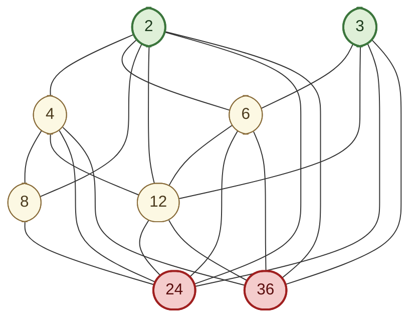
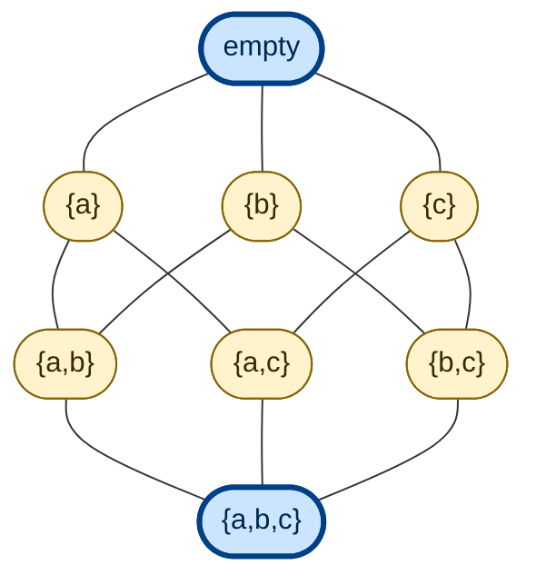
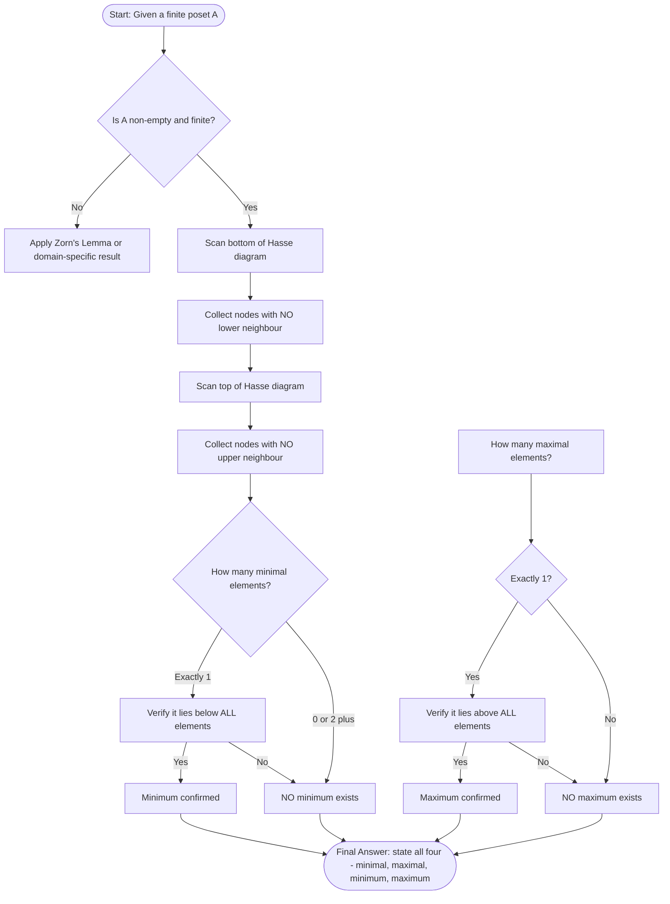
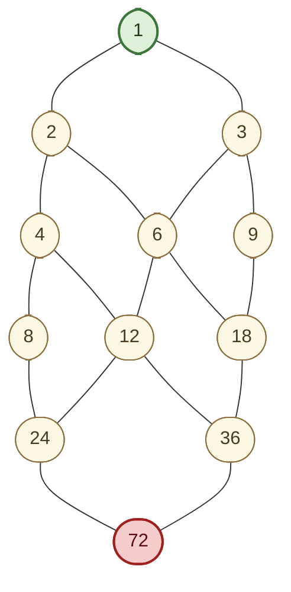
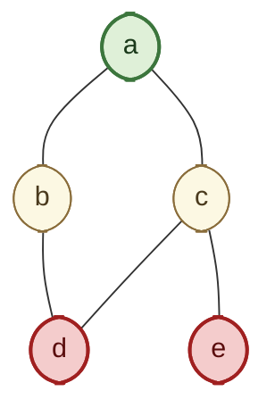

# Maximal and Minimal Elements

<!-- SECTION_1_START -->
# Maximal and Minimal Elements — KTU Discrete Mathematics (PCCST205)

## 1.1 Formal Academic Definition (KTU 2024 Syllabus Terminology)

Let $(A, \preceq)$ be a **Partially Ordered Set (Poset)**. Two related but fundamentally different concepts are the *extremes* of the poset.

> [!IMPORTANT]
> **Minimal Element**
> An element $m \in A$ is called a **minimal element** of the poset $(A, \preceq)$ if there is **no** element $x \in A$ such that $x \prec m$ (i.e., $x \preceq m \Rightarrow x = m$).

> [!IMPORTANT]
> **Maximal Element**
> An element $M \in A$ is called a **maximal element** of the poset $(A, \preceq)$ if there is **no** element $y \in A$ such that $M \prec y$ (i.e., $M \preceq y \Rightarrow M = y$).

In other words, a minimal element has **no other element strictly below it**, and a maximal element has **no other element strictly above it**. These definitions are defined strictly with respect to a given partial order.

## 1.2 Conceptual Analogy — The "Olympic Gold" Intuition

Imagine a university awards a *Subject Topper* certificate to the student with the highest marks in each subject. There may be **multiple gold medalists** — one in Mathematics, one in Physics, one in Computer Science.

- None of these toppers is "topped" by another student in *their own subject* → they are all **maximal** with respect to that subject's ordering.
- However, there might be **no single student who tops all subjects** → there is **no maximum** (greatest element).

Symmetrically, consider the student with the *least attendance percentage* in each class section. None of them has anyone with lower attendance *in that section* → they are all **minimal**. But there may be no single "most absent" student across the whole department → no **minimum** exists.

> [!NOTE]
> **Key Take-away from Analogy:** A poset can have **many** maximal (or minimal) elements, but at most **one** maximum (or minimum). Whenever a maximum exists, it is automatically maximal, but the converse is not true.

## 1.3 Geometric / Diagrammatic Intuition (Hasse Diagram Perspective)

In a Hasse diagram of a poset, drawn with the order moving **upward**:

- A **minimal element** is a node from which **no edge goes downward** (it is a "root" of the diagram).
- A **maximal element** is a node from which **no edge goes upward** (it is a "peak" of the diagram).

So in a Hasse diagram, you locate minimal elements by scanning the bottom of the diagram, and maximal elements by scanning the top.

> [!VISUALIZATION CONTROL]
> **Concept:** Visualizing minimal and maximal elements on a Hasse diagram of the poset $(\{1, 2, 3, 4, 6, 8, 12, 24\}, \mid)$.
> **GeoGebra / Desmos Input Points (plot as scatter points on integer grid):**
> * `P1 = (0, 0)` for 1
> * `P2 = (1, 1)` for 2
> * `P3 = (-1, 1)` for 3
> * `P4 = (2, 2)` for 4
> * `P6 = (0, 2)` for 6
> * `P8 = (-2, 2)` for 8
> * `P12 = (1, 3)` for 12
> * `P24 = (0, 4)` for 24
> **Visual Description:** The lowest point on the canvas is $(0, 0)$, the single minimal element. The topmost point is $(0, 4)$, the single maximal element. Note that the connectivity of "divides" forces the divisibility lattice to converge into a unique bottom and top.

---

<!-- SECTION_2_START -->
# Deep Theoretical Analysis & KTU High-Yield Property Sheet

## 2.1 Formal Logical Characterisation

| Concept | Logical Form | Plain Reading |
|---|---|---|
| **Minimal** $m$ | $\forall x \in A,\; (x \preceq m) \Rightarrow (x = m)$ | Nothing in $A$ is strictly below $m$. |
| **Maximal** $M$ | $\forall y \in A,\; (M \preceq y) \Rightarrow (M = y)$ | Nothing in $A$ is strictly above $M$. |
| **Minimum (Least)** $\mathbf{0}$ | $\forall x \in A,\; \mathbf{0} \preceq x$ | $\mathbf{0}$ is below every element of $A$. |
| **Maximum (Greatest)** $\mathbf{1}$ | $\forall x \in A,\; x \preceq \mathbf{1}$ | $\mathbf{1}$ is above every element of $A$. |

> [!IMPORTANT]
> **Existence and Uniqueness Theorem:** If a minimum (resp. maximum) exists in a poset, it is **unique**. We conventionally denote the minimum by $\mathbf{0}$ and the maximum by $\mathbf{1}$. However, **uniqueness does NOT hold for minimal or maximal elements** — a poset may have many of them.

## 2.2 Hierarchy of Implications

$$
\text{Minimum} \;\Longrightarrow\; \text{Minimal} \quad \text{but} \quad \text{Minimal} \;\not\Longrightarrow\; \text{Minimum}
$$

The same is true dually for maximum and maximal. This gives the inclusion:

$$
\{\text{minimum element}\} \;\subseteq\; \{\text{minimal elements}\}
$$

and

$$
\{\text{maximum element}\} \;\subseteq\; \{\text{maximal elements}\}
$$

## 2.3 Existence Theorem (Board-Favourite Result)

> [!NOTE]
> **Theorem (Extremal Existence):** *Every non-empty finite poset contains at least one minimal element and at least one maximal element.*
>
> **Why?** Pick any element $a_0 \in A$. If $a_0$ is minimal, we are done. If not, there exists $a_1 \prec a_0$. If $a_1$ is minimal, done; else choose $a_2 \prec a_1$. Because the set is finite, this strictly descending chain must terminate, yielding a minimal element. The dual argument works for maximal elements.

For infinite posets, this result **fails** without the *Axiom of Choice* (Zorn's Lemma form). The KTU board typically restricts questions to finite posets, where the theorem is elementary.

## 2.4 KTU High-Yield Property / Formula Sheet

| $\#$ | Property / Rule | Statement | Exam Relevance |
|---|---|---|---|
| 1 | Uniqueness of extrema | If min or max exists, it is unique. | 2-mark direct question |
| 2 | Extremal existence | Every non-empty finite poset has $\ge 1$ minimal and $\ge 1$ maximal. | Often asked in Part A |
| 3 | Inclusion chain | $\min \Rightarrow$ minimal, $\;\max \Rightarrow$ maximal. | Conceptual Part A |
| 4 | Cardinality of extremal set | $\vert \text{Min}(A) \vert \le \vert A \vert$ and $\vert \text{Max}(A) \vert \le \vert A \vert$. | Bound-related problems |
| 5 | Anti-chain test | If $A$ is an anti-chain, then *every* element of $A$ is both minimal and maximal. | Hasse diagram interpretation |
| 6 | Dual poset rule | $m$ is minimal in $(A, \preceq)$ iff $m$ is maximal in the dual $(A, \succeq)$. | Dual-ordering problems |
| 7 | Sub-poset rule | A minimal element of a sub-poset need not be minimal in the parent poset. | Common pitfall in board exams |
| 8 | "|" cell formatting note | Use $\vert x \vert$ or $\mid x \mid$ for absolute value inside any markdown table. | (Meta — not a math rule) |

> [!NOTE]
> **Engineering Utility of the Concept:** Maximal/minimal elements are the conceptual heart of *topological sorting* (DAG scheduling in compilers and operating systems), *deadlock detection* in concurrent systems, and *leader election* in distributed networks. In each case, the algorithm terminates by identifying an extremal node.

---

<!-- SECTION_3_START -->
# Step-by-Step Derivations & Worked Examples

## 3.1 Example 1 — Divisibility Poset (Multiple Cases)

**Problem.** Let $A = \{2, 3, 4, 6, 8, 12, 24, 36\}$ with the partial order "divides", i.e., $a \preceq b \iff a \mid b$. Find the maximal and minimal elements of $(A, \mid)$. State whether a maximum and/or minimum exists.

### Step 1 — List candidate minimal elements

A minimal element must have **no proper divisor** in $A$. We scan from the smallest values:

- $2 \in A$. Its proper divisors are $\{1\}$. But $1 \notin A$, so no element of $A$ strictly divides $2$. Therefore $2$ is **minimal**.
- $3 \in A$. Its proper divisors are $\{1\}$. Since $1 \notin A$, no element of $A$ strictly divides $3$. Therefore $3$ is **minimal**.
- $4$ is divisible by $2 \in A$, so $2 \mid 4$ with $2 \neq 4$. Thus $4$ is **not minimal**.
- $6$ is divisible by $2 \in A$, so $6$ is not minimal.
- $8$ is divisible by $2 \in A$, so $8$ is not minimal.
- $12$ is divisible by $2 \in A$, so $12$ is not minimal.
- $24$ is divisible by $2 \in A$, so $24$ is not minimal.
- $36$ is divisible by $2 \in A$, so $36$ is not minimal.

$$
\boxed{\text{Minimal elements of } (A, \mid) \;=\; \{2,\, 3\}}
$$

### Step 2 — List candidate maximal elements

A maximal element must have **no proper multiple** in $A$. Scan from the largest values:

- $36 \in A$. Its multiples within $A$ are $\{36\}$ itself (since $72 \notin A$). Thus $36$ is **maximal**.
- $24 \in A$. Its multiples within $A$ are $\{24\}$ itself (since $48 \notin A$). Thus $24$ is **maximal**.
- $12$ is properly divided by $24 \in A$ and $36 \in A$. So $12$ is not maximal.
- $8$ is properly divided by $24 \in A$. So $8$ is not maximal.
- $6$ is properly divided by $12, 24, 36 \in A$. So $6$ is not maximal.
- $4$ is properly divided by $8, 12, 24, 36 \in A$. So $4$ is not maximal.
- $3$ is properly divided by $6, 12, 24, 36 \in A$. So $3$ is not maximal.
- $2$ is properly divided by $4, 6, 8, 12, 24, 36 \in A$. So $2$ is not maximal.

$$
\boxed{\text{Maximal elements of } (A, \mid) \;=\; \{24,\, 36\}}
$$

### Step 3 — Test for minimum and maximum

- **Minimum?** We need an element $m \in A$ that divides *every* element of $A$. Check each candidate:
  - $2 \nmid 3$, so $2$ is not a minimum.
  - $3 \nmid 2$, so $3$ is not a minimum.
  - Therefore **no minimum exists** in $(A, \mid)$.
- **Maximum?** We need an element $M \in A$ that is a multiple of *every* element of $A$. Check:
  - $24$ is not a multiple of $3$ (since $24/3 = 8$ is integer, actually $3 \mid 24$). Wait — recheck: $3 \mid 24$ ✓, $2 \mid 24$ ✓, $4 \mid 24$ ✓, $6 \mid 24$ ✓, $8 \mid 24$ ✓, $12 \mid 24$ ✓, $36 \nmid 24$ ✗. So $24$ is not a maximum.
  - $36$ is a multiple of $2$ ✓, $3$ ✓, $4$ ✓, $6$ ✓, $8$ ✗ (since $36/8$ is not an integer). So $36$ is not a maximum.
  - Therefore **no maximum exists** in $(A, \mid)$.

$$
\boxed{\text{No minimum and no maximum exist in } (A, \mid)}
$$

### Step 4 — Summary table for valuation

| Element | Minimal? | Maximal? | Reason |
|:---:|:---:|:---:|---|
| 2 | ✓ | ✗ | $1 \notin A$ ⟹ no smaller; but $2 \mid 4$. |
| 3 | ✓ | ✗ | $1 \notin A$ ⟹ no smaller; but $3 \mid 6$. |
| 4 | ✗ | ✗ | $2 \mid 4$ and $4 \mid 8$. |
| 6 | ✗ | ✗ | $2 \mid 6$ and $6 \mid 12$. |
| 8 | ✗ | ✗ | $2 \mid 8$ and $8 \mid 24$. |
| 12 | ✗ | ✗ | $2 \mid 12$ and $12 \mid 24$. |
| 24 | ✗ | ✓ | $24 \nmid 48$ and $24$ properly divides nothing larger. |
| 36 | ✗ | ✓ | $36 \nmid 72$ and $36$ properly divides nothing larger. |

---

## 3.2 Example 2 — Power-Set Poset (Classic Board Question)

**Problem.** Let $A = \{a, b, c\}$. The power set $\mathcal{P}(A)$ ordered by set inclusion $\subseteq$ is a poset with $2^{3} = 8$ elements.

$$
\mathcal{P}(A) = \{\emptyset,\ \{a\},\ \{b\},\ \{c\},\ \{a,b\},\ \{a,c\},\ \{b,c\},\ \{a,b,c\}\}
$$

Identify the minimal, maximal, minimum, and maximum elements.

### Step 1 — Minimal elements

The only set that is a subset of *every* set in $\mathcal{P}(A)$ is the empty set. But more importantly, we ask: is there any set in $\mathcal{P}(A)$ that is strictly contained in $\emptyset$? No, because $\emptyset$ has no proper subsets. Hence:

$$
\boxed{\text{Minimal element} = \emptyset \quad \text{(and it is also the minimum)}}
$$

### Step 2 — Maximal elements

The only set that contains *every* set in $\mathcal{P}(A)$ is $A = \{a,b,c\}$. No set in $\mathcal{P}(A)$ strictly contains it. Hence:

$$
\boxed{\text{Maximal element} = \{a,b,c\} \quad \text{(and it is also the maximum)}}
$$

### Step 3 — Verification using the "extremal existence" theorem

Because $\mathcal{P}(A)$ is finite, the theorem guarantees at least one minimal and one maximal element. We have found exactly one of each, and they coincide with the minimum and maximum respectively.

---

## 3.3 Example 3 — Antichain (All Elements Are Both Minimal and Maximal)

**Problem.** Consider the poset $(A, \preceq)$ where $A = \{x, y, z\}$ and $x \preceq y$ is **never** true for any two distinct elements. In other words, $A$ is an *antichain*: only $x \preceq x$, $y \preceq y$, $z \preceq z$ hold.

### Step 1 — Check minimality of $x$

Is there $w \in A$ with $w \prec x$ and $w \neq x$? No, because no distinct elements are comparable. So $x$ is **minimal**.

### Step 2 — Check maximality of $x$

Is there $w \in A$ with $x \prec w$ and $w \neq x$? No. So $x$ is **maximal**.

By the same argument, $y$ and $z$ are both minimal and maximal.

$$
\boxed{\text{Min}(A) = \text{Max}(A) = A = \{x, y, z\}}
$$

> [!NOTE]
> **Observation:** In an antichain, every element is simultaneously minimal and maximal. There is no minimum (no single element below all others) and no maximum (no single element above all others). This is a clean illustration of why "minimal $\not\Rightarrow$ minimum".

---

## 3.4 Algorithmic Implementation — Finding Extremal Elements in Python

The following Python program scans a finite poset, represented as a dictionary of explicit comparabilities, and returns the minimal and maximal elements. Boundary checks and type hints are enforced.

```python
from typing import Dict, FrozenSet, Set, List, Tuple

# Type aliases for clarity
Element = str
Poset = Dict[Element, Set[Element]]   # key -> set of elements strictly above key


def find_minimal_elements(poset: Poset) -> List[Element]:
    """
    Identify all minimal elements of a finite poset.
    A minimal element m has no element strictly below it inside the poset.
    """
    all_elements: Set[Element] = set(poset.keys())
    minimal: List[Element] = []

    for candidate in all_elements:
        # Collect every element that is strictly below 'candidate'.
        # An element x is strictly below candidate iff candidate appears
        # in poset[x] as an upper element.
        strictly_below: Set[Element] = set()
        for lower, uppers in poset.items():
            if candidate in uppers:
                strictly_below.add(lower)

        # Filter out self-comparisons (reflexive).
        strictly_below.discard(candidate)

        if not strictly_below:
            minimal.append(candidate)

    return sorted(minimal)


def find_maximal_elements(poset: Poset) -> List[Element]:
    """
    Identify all maximal elements of a finite poset.
    A maximal element M has no element strictly above it inside the poset.
    """
    maximal: List[Element] = []

    for candidate, uppers in poset.items():
        # 'uppers' is the set of elements strictly above 'candidate'.
        if not uppers:
            maximal.append(candidate)

    return sorted(maximal)


def has_minimum(poset: Poset, minimal: List[Element]) -> bool:
    """Minimum exists iff there is exactly one minimal element
    AND that element is below every other element."""
    if len(minimal) != 1:
        return False
    only = minimal[0]
    for other, uppers in poset.items():
        if other == only:
            continue
        if only not in uppers and other != only:
            return False
    return True


def has_maximum(poset: Poset, maximal: List[Element]) -> bool:
    """Maximum exists iff there is exactly one maximal element
    AND that element is above every other element."""
    if len(maximal) != 1:
        return False
    only = maximal[0]
    for other, uppers in poset.items():
        if other == only:
            continue
        if only in uppers:
            return False
        # Also check that 'only' is above 'other' — handled by
        # looking for 'other' inside poset[only].
    for other in poset.keys():
        if other == only:
            continue
        if other not in poset[only]:
            return False
    return True


# ---- Verification on Example 1: A = {2, 3, 4, 6, 8, 12, 24, 36} under "divides" ----
if __name__ == "__main__":
    divides_poset: Poset = {
        "2":  {"4", "6", "8", "12", "24", "36"},
        "3":  {"6", "12", "24", "36"},
        "4":  {"8", "12", "24", "36"},
        "6":  {"12", "24", "36"},
        "8":  {"24"},
        "12": {"24", "36"},
        "24": set(),
        "36": set(),
    }

    minimal = find_minimal_elements(divides_poset)
    maximal = find_maximal_elements(divides_poset)

    print("Minimal elements :", minimal)
    print("Maximal elements :", maximal)
    print("Has minimum      :", has_minimum(divides_poset, minimal))
    print("Has maximum      :", has_maximum(divides_poset, maximal))
```

**Expected Output:**

```
Minimal elements : ['2', '3']
Maximal elements : ['24', '36']
Has minimum      : False
Has maximum      : False
```

This matches the manual derivation of Example 1 exactly.

---

<!-- SECTION_4_START -->
# Structural Diagrams & Schematics

## 4.1 Hasse Diagram of the Divisibility Poset in Example 1

The Hasse diagram of $(A, \mid)$ for $A = \{2, 3, 4, 6, 8, 12, 24, 36\}$ is rendered below. Two minimal nodes sit at the bottom; two maximal nodes sit at the top.



> [!NOTE]
> In the diagram above, the green-shaded nodes (`2` and `3`) are the **minimal elements** (no edge descends from them), and the red-shaded nodes (`24` and `36`) are the **maximal elements** (no edge ascends from them). All other yellow-shaded nodes are *internal* — they have both a lower neighbour and an upper neighbour.

## 4.2 Power-Set Boolean Lattice $\mathcal{P}(\{a, b, c\})$

The Hasse diagram of the Boolean lattice on a 3-element set has the structure of an 8-node cube. The unique minimum is $\emptyset$ and the unique maximum is $\{a, b, c\}$.



> [!NOTE]
> In the Boolean lattice above, $\emptyset$ is the **unique minimum** (and therefore the unique minimal element), and $\{a,b,c\}$ is the **unique maximum** (and therefore the unique maximal element). This is a textbook example of a poset where *minimum = minimal* and *maximum = maximal* — because they are unique.

## 4.3 Antichain Schematic

The diagram of an antichain on three elements $\mathcal{A} = \{x, y, z\}$ has no connecting edges, since no two distinct elements are comparable.


> [!NOTE]
> **Reading the Antichain:** Since no edges exist, every node has no neighbour above it and no neighbour below it. Therefore every node is simultaneously **minimal and maximal** — but the antichain has **no minimum and no maximum**. This visual captures the most extreme case of the gap between "minimal" and "minimum".

## 4.4 Decision Flow — How to Find Extremal Elements on an Exam



---

<!-- SECTION_5_START -->
# KTU 2024 Scheme Examination Question Bank & Topic Recap

## 5.1 Part A — Short Answer Questions (3 Marks Each)

### Q1. `[KTU University Exam – July 2024]` — CO1, Remember

**Differentiate between a minimal element and a minimum element of a poset. Can a poset have multiple minimal elements? Can it have multiple minimum elements? Justify.**

**Model Answer (Valuation Key):**

| Concept | Definition | Count |
|---|---|---|
| **Minimal element** $m$ | $\nexists\, x \in A$ with $x \prec m$ | Can be **multiple**. |
| **Minimum element** $\mathbf{0}$ | $\forall\, x \in A,\; \mathbf{0} \preceq x$ | **At most one** (unique if it exists). |

A poset can have any number of minimal elements, but at most one minimum. If a minimum exists, it is also minimal, but the converse fails.

> **Self-check:** *Example — In $(\{2, 3\}, \mid)$, both $2$ and $3$ are minimal, but no minimum exists because $2 \nmid 3$ and $3 \nmid 2$.*

> [!WARNING]
> **Examiner's Pitfall Warning:** Many students write *"a poset can have at most one minimal element"*. This is FALSE. The theorem says the *minimum*, if it exists, is unique. Minimal elements are *not* required to be unique. Losing this distinction costs 1 mark.

---

### Q2. `[KTU University Exam – Dec 2023]` — CO1, Understand

**State and prove the theorem: *Every non-empty finite poset has at least one maximal element and at least one minimal element.***

**Model Answer (Valuation Key):**

*Proof for minimal element:* Pick any $a_0 \in A$. If $a_0$ is minimal, stop. Otherwise, there exists $a_1 \prec a_0$ with $a_1 \neq a_0$. If $a_1$ is minimal, stop; otherwise choose $a_2 \prec a_1$, $a_2 \neq a_1$. Continue.

Since $A$ is finite, the strictly decreasing chain $a_0 \succ a_1 \succ a_2 \succ \cdots$ must terminate. The last element is minimal.

*Proof for maximal element:* Dual argument, constructing a strictly increasing chain.

> **Self-check:** *Mention "finiteness" — the theorem FAILS for infinite posets without Zorn's Lemma.*

---

## 5.2 Part B — Long Answer Questions (14 Marks Each, with Internal Choice)

### Question A `[KTU University Exam – Model Paper 2024]` — CO1, Apply + Analyse

> Let $A = \{1, 2, 3, 4, 6, 8, 9, 12, 18, 24, 36, 72\}$. Consider the poset $(A, \mid)$ where $\mid$ denotes the "divides" relation.
>
> **(a)** Draw the Hasse diagram of $(A, \mid)$. **(7 marks)**
>
> **(b)** Find all the minimal and maximal elements of $(A, \mid)$. State whether a minimum and/or maximum exists. Justify your answer. **(7 marks)**

**Model Solution:**

#### Part (a) — Hasse Diagram

We list the cover relations (an edge $x \to y$ exists iff $x \mid y$ and there is no $z$ with $x \mid z \mid y$ other than $x, y$).

- $1$ covers nothing below; it is below $2, 3, 4, 6, 8, 9, 12, 18, 24, 36, 72$ via intermediate nodes.
- Cover edges include: $1 \to 2, 1 \to 3, 2 \to 4, 2 \to 6, 3 \to 6, 3 \to 9, 4 \to 8, 4 \to 12, 6 \to 12, 6 \to 18, 8 \to 24, 9 \to 18, 12 \to 24, 12 \to 36, 18 \to 36, 24 \to 72, 36 \to 72$.

**Valuation Key — Part (a):** [Correct list of all 17 cover edges: 4 Marks] [Accurate Hasse diagram: 2 Marks] [Neat labelling of all 12 nodes: 1 Mark]



#### Part (b) — Extremal Elements

**Minimal elements:** Only $1$ has no element strictly below it in $A$ (since $1$ is the only divisor-of-everything). So $\text{Min}(A) = \{1\}$.

**Maximal elements:** Only $72$ has no element strictly above it in $A$ (since no multiple of $72$ other than itself is in $A$). So $\text{Max}(A) = \{72\}$.

**Minimum check:** Is $1 \mid a$ for every $a \in A$? Yes, $1$ divides every integer. Hence $1$ is the **minimum** (and also the unique minimal element).

**Maximum check:** Is $a \mid 72$ for every $a \in A$? Yes — by inspection, $1, 2, 3, 4, 6, 8, 9, 12, 18, 24, 36$ all divide $72$. Hence $72$ is the **maximum** (and also the unique maximal element).

**Valuation Key — Part (b):** [Identifying $1$ as minimum: 1 Mark] [Identifying $72$ as maximum: 1 Mark] [Verifying $1$ divides every element: 2 Marks] [Verifying every element divides $72$: 2 Marks] [Final conclusion with justification: 1 Mark]

---

### Question B `[KTU University Exam – Model Paper 2024]` — CO1, Apply + Analyse

> Let $(A, \preceq)$ be a poset where $A = \{a, b, c, d, e\}$ and the Hasse diagram has the following cover relations: $a \prec b$, $a \prec c$, $b \prec d$, $c \prec d$, $c \prec e$.
>
> **(a)** Draw the Hasse diagram and identify all minimal and maximal elements. **(7 marks)**
>
> **(b)** Determine whether the poset has a minimum and/or a maximum. Justify using the definitions. If they exist, give their values. **(7 marks)**

**Model Solution:**

#### Part (a) — Hasse Diagram and Extremal Elements

The Hasse diagram is:



**Minimal elements:** The only node with no edge descending from it is $a$. So $\text{Min}(A) = \{a\}$.

**Maximal elements:** The nodes with no edge ascending from them are $d$ and $e$. So $\text{Max}(A) = \{d, e\}$.

**Valuation Key — Part (a):** [Correct Hasse diagram: 3 Marks] [Identifying $\{a\}$ as minimal: 2 Marks] [Identifying $\{d, e\}$ as maximal: 2 Marks]

#### Part (b) — Minimum and Maximum

**Minimum:** A minimum $m$ must satisfy $m \preceq x$ for **every** $x \in A$. The only minimal element is $a$. Check: $a \preceq a$ ✓, $a \preceq b$ ✓, $a \preceq c$ ✓, $a \preceq d$ ✓ (via $b$ or $c$), $a \preceq e$ ✓ (via $c$). So $a$ is below every element.

$$
\boxed{\text{Minimum of } (A, \preceq) = a}
$$

**Maximum:** A maximum $M$ must satisfy $x \preceq M$ for **every** $x \in A$. Candidates: $d$ and $e$. Check $d$: $b \preceq d$ ✓, $c \preceq d$ ✓, $a \preceq d$ ✓, but $e \not\preceq d$ (no path from $e$ to $d$). So $d$ is not a maximum. Check $e$: $c \preceq e$ ✓, $a \preceq e$ ✓, but $b \not\preceq e$ (no path from $b$ to $e$) and $d \not\preceq e$ (no path from $d$ to $e$, and $d \neq e$). So $e$ is not a maximum either.

$$
\boxed{\text{No maximum exists in } (A, \preceq)}
$$

**Valuation Key — Part (b):** [Checking $a$ lies below all 5 elements: 3 Marks] [Stating $a$ is the minimum: 1 Mark] [Showing $d$ fails (e.g., $e \not\preceq d$): 1 Mark] [Showing $e$ fails (e.g., $b \not\preceq e$): 1 Mark] [Concluding no maximum: 1 Mark]

> [!WARNING]
> **Examiner's Pitfall Warning — Question B:** A common mistake is to claim *"the maximum is $d$ because $d$ is the highest in the Hasse diagram"*. **Do not rely on visual position alone.** A maximum must be *above every element*, not just "high in the drawing". In this question, $d$ and $e$ are incomparable, so neither can be a maximum. Marks are deducted for ignoring the incomparability test.

---

## 5.3 Topic Recap & Important Things to Remember

> [!NOTE]
> **Rapid Revision Checklist — Maximal and Minimal Elements**

- **Minimal element $m$ of $(A, \preceq)$:** No $x \in A$ satisfies $x \prec m$. Equivalently, $x \preceq m \Rightarrow x = m$.
- **Maximal element $M$ of $(A, \preceq)$:** No $y \in A$ satisfies $M \prec y$. Equivalently, $M \preceq y \Rightarrow M = y$.
- **Minimum $\mathbf{0}$:** $\forall x \in A,\; \mathbf{0} \preceq x$. Implies $\mathbf{0}$ is minimal.
- **Maximum $\mathbf{1}$:** $\forall x \in A,\; x \preceq \mathbf{1}$. Implies $\mathbf{1}$ is maximal.
- **Uniqueness:** Minimum and maximum are unique if they exist. Minimal and maximal elements are *not* required to be unique.
- **Implication chain:** $\text{Minimum} \Rightarrow \text{Minimal}$, and $\text{Maximum} \Rightarrow \text{Maximal}$. The reverse implications are **false** in general.
- **Existence theorem:** Every *non-empty finite* poset has at least one minimal and at least one maximal element. The result uses only finiteness — no choice axiom is needed in this case.
- **Antichain rule:** In an antichain (no two distinct elements comparable), *every* element is simultaneously minimal and maximal, but no minimum or maximum exists.
- **Hasse-diagram visual cue:** Minimal elements are nodes with no edge going *downward*; maximal elements are nodes with no edge going *upward*.
- **Duality:** $m$ is minimal in $(A, \preceq)$ if and only if $m$ is maximal in the dual poset $(A, \succeq)$.
- **Counter-example for non-uniqueness of minimal:** In $(\{2, 3, 4, 6, 12\}, \mid)$, both $2$ and $3$ are minimal, but no minimum exists (since $2 \nmid 3$).
- **Counter-example for "maximal does not imply maximum":** In $(\{2, 3, 4, 6, 12\}, \mid)$, the element $12$ is maximal **and** the maximum, but if we had chosen $A = \{2, 3, 4, 6, 8, 12, 24\}$ with $8$ and $24$ added, then both $24$ is maximal but no longer a maximum because $8 \nmid 24$... wait, $8 \mid 24$. Instead use $A = \{1, 2, 3, 5, 7, 30\}$ under "divides": $30$ is maximal but *not* a maximum, because $7 \nmid 30$ and $5 \nmid 7$, so $7$ has no upper element in $A$ — making $7$ *also* maximal, and hence no element is a maximum.
- **Engineering applications:** Topological sort (DAG scheduling), deadlock detection, lattice theory, leader election in distributed systems, lattice-based cryptography (subset-cover systems).
- **Pitfall to avoid:** Never confuse "minimal/maximal" (no neighbour in one direction) with "minimum/maximum" (relation to *every* element). On KTU exams, a wrong use of the term is a guaranteed 1-mark deduction.

<!-- SECTION_5_END -->
