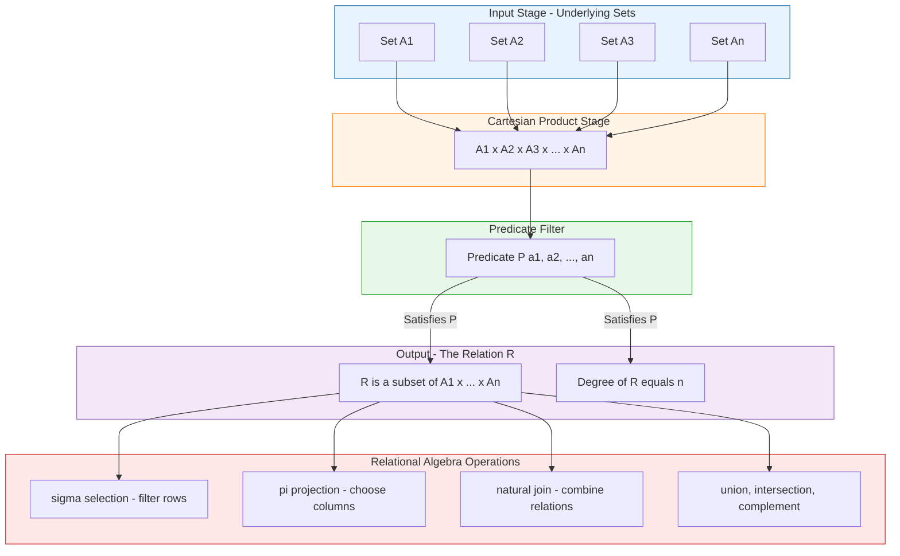
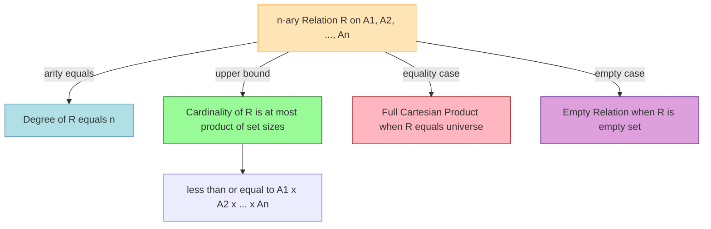

# n-ary Relations

<!-- SECTION_1_START -->

# n-ary Relations — Sets and Subsets (Module 1)

## 1. Core Technical Definition

> [!IMPORTANT]
> **Formal KTU 2024 Definition**
> Let $A_1, A_2, A_3, \ldots, A_n$ be $n$ non-empty sets. An **n-ary relation** $R$ on these sets is a subset of the Cartesian product $A_1 \times A_2 \times A_3 \times \cdots \times A_n$. That is,
> $$R \subseteq A_1 \times A_2 \times A_3 \times \cdots \times A_n$$
> The integer $n$ is called the **degree** (or **arity**) of the relation. The set of all $n$-tuples belonging to $R$ is called the **extension** of $R$.

### Special Cases of n-ary Relations

| Degree (n) | Name | Cartesian Form | Typical Example |
|:---:|:---|:---|:---|
| $n = 1$ | Unary Relation | $R \subseteq A$ | Property of elements (e.g., $Prime(x)$) |
| $n = 2$ | **Binary Relation** | $R \subseteq A \times B$ | $a < b$, $a = b$ |
| $n = 3$ | Ternary Relation | $R \subseteq A \times B \times C$ | $(a, b, c)$ forming a triangle |
| $n \geq 4$ | General n-ary Relation | $R \subseteq A_1 \times \cdots \times A_n$ | Relational database tables |

### Conceptual Analogy / Intuition

> [!NOTE]
> **Intuition: A Database Table is an n-ary Relation!**
> Imagine a college mark-list. Each row is a record (an n-tuple), and the full table is the relation itself.
> - The **columns** = the underlying sets $A_1, A_2, \ldots, A_n$ (e.g., RegNo, Name, Marks).
> - The **rows** = the $n$-tuples $(a_1, a_2, \ldots, a_n)$ that belong to $R$.
> - The **whole table** = the set $R \subseteq A_1 \times A_2 \times \cdots \times A_n$.
> 
> So whenever you see a database table with $n$ columns, you are looking at an $n$-ary relation in disguise.

### Domain and Range of an n-ary Relation

> [!IMPORTANT]
> **Domain of R:**
> $$\text{Dom}(R) = \{a_1 : (a_1, a_2, \ldots, a_n) \in R\}$$
> 
> **Range of R:**
> $$\text{Ran}(R) = \{a_n : (a_1, a_2, \ldots, a_n) \in R\}$$
> 
> **Active Domain (Total Domain):**
> $$\text{ADom}(R) = A_1 \cup A_2 \cup \cdots \cup A_n$$

### Visualization Control

> [!VISUALIZATION CONTROL]
> **Concept:** Visualizing a ternary (3-ary) relation as a 3D cube of points
> 
> **GeoGebra Input Equations:**
> * Points: $(1,1,1), (1,1,2), (2,1,1), (1,2,2), (2,2,1)$
> * Sets: $A_1 = A_2 = A_3 = \{1, 2\}$
> 
> **Visual Description:** A $2 \times 2 \times 2$ unit cube on a 3D coordinate system. Each highlighted point represents a valid triple $(a, b, c) \in R$. Empty grid cells indicate triples NOT in $R$. The student should see that $R$ is a sparse selection of the full Cartesian lattice.

---

<!-- SECTION_1_END -->

<!-- SECTION_2_START -->

## 2. Deep Theoretical Analysis & KTU High-Yield Formula Sheet

### 2.1 Logical Structure of n-ary Relations

An $n$-ary relation $R$ on sets $A_1, A_2, \ldots, A_n$ is constructed by the following logical steps:

- **Step 1 — Form the Universe:** Construct the Cartesian product $A_1 \times A_2 \times \cdots \times A_n$. This contains **every** possible $n$-tuple formed by taking one element from each set.
- **Step 2 — Apply Predicate Filter:** Define a logical predicate $P(a_1, a_2, \ldots, a_n)$ which is either *True* or *False* for each tuple.
- **Step 3 — Collect Satisfying Tuples:** $R = \{(a_1, a_2, \ldots, a_n) \in A_1 \times \cdots \times A_n : P(a_1, a_2, \ldots, a_n) \text{ is True}\}$.
- **Why this matters:** This is the **declarative definition** of a relation — first you describe the universe, then you specify the rule that selects which tuples belong. This is the exact mechanism used by SQL `WHERE` clauses.

### 2.2 Fundamental Operations on n-ary Relations

> [!NOTE]
> These three operations are the **backbone of relational algebra** (proposed by E. F. Codd, 1970) and form the basis of all database query languages like SQL.

#### (a) Selection ($\sigma$)
Selects rows (tuples) that satisfy a given condition $C$.

$$\sigma_{C}(R) = \{t \in R : C(t) = \text{True}\}$$

#### (b) Projection ($\pi$)
Removes unwanted columns. If $R$ has arity $n$, projecting on indices $i_1, i_2, \ldots, i_k$ gives:

$$\pi_{i_1, i_2, \ldots, i_k}(R) = \{(t_{i_1}, t_{i_2}, \ldots, t_{i_k}) : t \in R\}$$

> [!IMPORTANT]
> **Duplicate Elimination Rule:** Projection automatically removes duplicate tuples because the result is a **set**.

#### (c) Natural Join ($\bowtie$)
Combines two relations $R \subseteq A_1 \times \cdots \times A_m$ and $S \subseteq B_1 \times \cdots \times B_p$ on their common attributes:

$$R \bowtie S = \{t : t \text{ is an } (m+p-c)\text{-tuple, where } c \text{ common attributes match}\}$$

### 2.3 Set-Theoretic Operations on Relations

Since relations are sets, all standard set operations apply:

| Operation | Symbol | Definition | Effect on n-ary Relations |
|:---|:---:|:---|:---|
| Union | $R \cup S$ | Tuples in $R$ **or** $S$ | Requires **same arity and same domain sets** |
| Intersection | $R \cap S$ | Tuples in both $R$ **and** $S$ | Requires same arity and same domain sets |
| Difference | $R - S$ | Tuples in $R$ but not in $S$ | Requires same arity and same domain sets |
| Complement | $\overline{R}$ | Tuples in $A_1 \times \cdots \times A_n$ but not in $R$ | Defined over the full Cartesian product |
| Cartesian Product | $R \times S$ | Concatenates tuples from $R$ and $S$ | Arity becomes $\text{arity}(R) + \text{arity}(S)$ |

### 2.4 KTU High-Yield Formula Sheet

| # | Concept | Formula / Property | Notes |
|:---:|:---|:---|:---|
| 1 | n-ary Relation | $R \subseteq A_1 \times A_2 \times \cdots \times A_n$ | Definition |
| 2 | Degree / Arity | $\text{arity}(R) = n$ | Number of sets in Cartesian product |
| 3 | Domain | $\text{Dom}(R) = \{a_1 : (a_1, a_2, \ldots, a_n) \in R\}$ | First coordinate projection |
| 4 | Range | $\text{Ran}(R) = \{a_n : (a_1, a_2, \ldots, a_n) \in R\}$ | Last coordinate projection |
| 5 | Active Domain | $\text{ADom}(R) = A_1 \cup A_2 \cup \cdots \cup A_n$ | All values appearing |
| 6 | Selection | $\sigma_{C}(R) \subseteq R$ | Vertical slicing (rows) |
| 7 | Projection | $\pi_{i_1,\ldots,i_k}(R)$ | Horizontal slicing (columns) |
| 8 | Natural Join | $R \bowtie S$ | Combines relations on common attributes |
| 9 | $\vert R \vert$ Cardinality | $\vert R \vert \leq \prod_{i=1}^{n} \vert A_i \vert$ | Bound on number of tuples |
| 10 | Binary reduction | $R \subseteq A \times B$ is a binary relation | $n = 2$ special case |

### 2.5 Real-World Engineering Utility

- **Relational Databases (SQL):** Every table in MySQL, PostgreSQL, Oracle, or SQLite is an $n$-ary relation. Operations like `SELECT`, `PROJECT`, `JOIN` are direct implementations of $\sigma, \pi, \bowtie$.
- **Knowledge Graphs & Semantic Web:** RDF triples (Subject, Predicate, Object) form a ternary relation, and SPARQL queries use projection/selection.
- **Data Warehousing:** Star and snowflake schemas use multi-way joins on $n$-ary relations.
- **Formal Verification:** State machines and transition systems use $n$-ary relations over state variables.

---

<!-- SECTION_2_END -->

<!-- SECTION_3_START -->

## 3. Step-by-Step Derivations & Code/Symbolic Implementation

### 3.1 Worked Example 1 — Constructing a Ternary Relation

**Problem:** Let $A_1 = \{1, 2\}$, $A_2 = \{1, 2\}$, $A_3 = \{1, 2\}$. Define $R$ as the ternary relation where $a_1 + a_2 + a_3$ is an even number. List all elements of $R$.

**Step 1 — Form the Cartesian Product:**
$$A_1 \times A_2 \times A_3 = \{1,2\} \times \{1,2\} \times \{1,2\}$$

The Cartesian product has $2 \times 2 \times 2 = 8$ triples.

**Step 2 — Enumerate All Triples and Apply the Predicate:**

| # | Triple $(a_1, a_2, a_3)$ | $a_1 + a_2 + a_3$ | Even? | In R? |
|:---:|:---:|:---:|:---:|:---:|
| 1 | $(1, 1, 1)$ | $3$ | No | $\times$ |
| 2 | $(1, 1, 2)$ | $4$ | Yes | $\checkmark$ |
| 3 | $(1, 2, 1)$ | $4$ | Yes | $\checkmark$ |
| 4 | $(1, 2, 2)$ | $5$ | No | $\times$ |
| 5 | $(2, 1, 1)$ | $4$ | Yes | $\checkmark$ |
| 6 | $(2, 1, 2)$ | $5$ | No | $\times$ |
| 7 | $(2, 2, 1)$ | $5$ | No | $\times$ |
| 8 | $(2, 2, 2)$ | $6$ | Yes | $\checkmark$ |

**Step 3 — Final Relation:**
$$R = \{(1, 1, 2), (1, 2, 1), (2, 1, 1), (2, 2, 2)\}$$

**Step 4 — Verify Cardinality Bound:**
$$\vert R \vert = 4 \leq \vert A_1 \vert \cdot \vert A_2 \vert \cdot \vert A_3 \vert = 8 \quad \checkmark$$

### 3.2 Worked Example 2 — Domain, Range, and Active Domain

**Problem:** Given $R = \{(1, a, 5), (2, b, 6), (1, a, 7), (3, a, 6)\}$ as a ternary relation, find the domain, range, and active domain.

**Step 1 — Domain (First Coordinates):**
$$\text{Dom}(R) = \{1, 2, 3\}$$
(set of all distinct first elements)

**Step 2 — Range (Last Coordinates):**
$$\text{Ran}(R) = \{5, 6, 7\}$$
(set of all distinct third elements)

**Step 3 — Active Domain (All Coordinates):**
$$\text{ADom}(R) = \{1, 2, 3\} \cup \{a, b\} \cup \{5, 6, 7\} = \{1, 2, 3, a, b, 5, 6, 7\}$$

### 3.3 Worked Example 3 — Selection and Projection

**Problem:** Consider the database relation
$$R = \{(101, \text{Raj}, 85), (102, \text{Anu}, 92), (103, \text{Raj}, 78), (104, \text{Meera}, 85)\}$$
where columns are $(RollNo, Name, Marks)$. Compute $\sigma_{Marks > 80}(R)$ and $\pi_{Name}(R)$.

**Step 1 — Selection $\sigma_{Marks > 80}(R)$:**
$$\sigma_{Marks > 80}(R) = \{(101, \text{Raj}, 85), (102, \text{Anu}, 92), (104, \text{Meera}, 85)\}$$
Tuples with marks $> 80$ are retained. $(103, \text{Raj}, 78)$ is dropped.

**Step 2 — Projection $\pi_{Name}(R)$:**
$$\pi_{Name}(R) = \{\text{Raj}, \text{Anu}, \text{Meera}\}$$
Duplicate "Raj" appears twice in $R$ but appears **once** in the projection (set semantics).

### 3.4 Worked Example 4 — Natural Join

**Problem:** Let
$$R = \{(1, a, x), (2, b, y), (3, c, z)\} \text{ (attributes } A, B, C\text{)}$$
$$S = \{(x, 10), (y, 20), (w, 30)\} \text{ (attributes } C, D\text{)}$$

Compute $R \bowtie S$ (natural join on common attribute $C$).

**Step-by-step Join:**
- $(1, a, x) \in R$ matches $(x, 10) \in S$ on $C = x$ → Produces $(1, a, x, 10)$
- $(2, b, y) \in R$ matches $(y, 20) \in S$ on $C = y$ → Produces $(2, b, y, 20)$
- $(3, c, z) \in R$ has no match in $S$ on $C = z$ → **Dropped**

**Result:**
$$R \bowtie S = \{(1, a, x, 10), (2, b, y, 20)\}$$
The result has arity $3 + 2 - 1 = 4$ (one common attribute merged).

### 3.5 Full Python Implementation

```python
"""
n-ary Relations — Complete Operations Library
Course: PCCST205 — Discrete Mathematics (KTU 2024 Scheme)
Module 1: Sets and Subsets
"""

from itertools import product
from typing import Any, Callable, List, Set, Tuple


# Type alias for n-ary tuples
NTuple = Tuple[Any, ...]


def cartesian_product(sets: List[Set[Any]]) -> Set[NTuple]:
    """
    Compute the Cartesian product of a list of sets.
    Returns the universe U = A_1 x A_2 x ... x A_n
    """
    if not sets:
        return {()}
    result: Set[NTuple] = set()
    for combo in product(*sets):
        result.add(combo)
    return result


def build_relation(sets: List[Set[Any]],
                   predicate: Callable[[NTuple], bool]) -> Set[NTuple]:
    """
    Construct an n-ary relation R from sets and a predicate.
    R = {t in A_1 x ... x A_n : predicate(t) is True}
    """
    universe = cartesian_product(sets)
    relation: Set[NTuple] = set()
    for tuple_ in universe:
        if predicate(tuple_):
            relation.add(tuple_)
    return relation


def domain(relation: Set[NTuple]) -> Set[Any]:
    """Return Dom(R) = {a_1 : (a_1, ..., a_n) in R}"""
    return {t[0] for t in relation}


def range_relation(relation: Set[NTuple]) -> Set[Any]:
    """Return Ran(R) = {a_n : (a_1, ..., a_n) in R}"""
    if not relation:
        return set()
    return {t[-1] for t in relation}


def active_domain(relation: Set[NTuple]) -> Set[Any]:
    """Return ADom(R) = union of all coordinates appearing in R"""
    result: Set[Any] = set()
    for t in relation:
        result.update(t)
    return result


def selection(relation: Set[NTuple],
              condition: Callable[[NTuple], bool]) -> Set[NTuple]:
    """sigma_C(R) = {t in R : C(t) is True}"""
    return {t for t in relation if condition(t)}


def projection(relation: Set[NTuple],
               indices: List[int]) -> Set[NTuple]:
    """
    pi_{i1, i2, ..., ik}(R)
    Keeps only the columns at the given indices (0-based).
    Duplicate tuples are automatically removed (set semantics).
    """
    return {tuple(t[i] for i in indices) for t in relation}


def natural_join(R: Set[NTuple],
                 S: Set[NTuple],
                 R_common: List[int],
                 S_common: List[int]) -> Set[NTuple]:
    """
    R ⋈ S on common attribute positions.
    R_common : indices in R that correspond to S_common in S.
    """
    result: Set[NTuple] = set()
    for t_r in R:
        for t_s in S:
            if all(t_r[i] == t_s[j] for i, j in zip(R_common, S_common)):
                # Build merged tuple: R columns first, then S columns
                # excluding the common S columns
                s_extra = tuple(t_s[k] for k in range(len(t_s))
                                if k not in S_common)
                merged = t_r + s_extra
                result.add(merged)
    return result


# ============================================================
# DEMONSTRATION
# ============================================================
if __name__ == "__main__":
    # --- Example 1: Ternary relation (sum is even) ---
    A = [{1, 2}, {1, 2}, {1, 2}]
    R = build_relation(A, lambda t: (t[0] + t[1] + t[2]) % 2 == 0)
    print(f"Ternary relation R: {R}")
    print(f"|R| = {len(R)}")
    print(f"Dom(R)   = {domain(R)}")
    print(f"Ran(R)   = {range_relation(R)}")
    print(f"ADom(R)  = {active_domain(R)}")

    # --- Example 2: Student database with 3 columns ---
    students = {
        (101, "Raj", 85),
        (102, "Anu", 92),
        (103, "Raj", 78),
        (104, "Meera", 85),
    }
    print(f"\nOriginal students: {students}")
    print(f"σ_(Marks>80) : "
          f"{selection(students, lambda t: t[2] > 80)}")
    print(f"π_(Name)     : "
          f"{projection(students, [1])}")

    # --- Example 3: Natural join ---
    R2 = {(1, "a", "x"), (2, "b", "y"), (3, "c", "z")}
    S2 = {("x", 10), ("y", 20), ("w", 30)}
    print(f"\nR = {R2}")
    print(f"S = {S2}")
    joined = natural_join(R2, S2, R_common=[2], S_common=[0])
    print(f"R ⋈ S = {joined}")
```

**Expected Output:**

```
Ternary relation R: {(1, 1, 2), (1, 2, 1), (2, 1, 1), (2, 2, 2)}
|R| = 4
Dom(R)   = {1, 2}
Ran(R)   = {1, 2}
ADom(R)  = {1, 2}

Original students: {(101, 'Raj', 85), (102, 'Anu', 92), (103, 'Raj', 78), (104, 'Meera', 85)}
σ_(Marks>80) : {(101, 'Raj', 85), (102, 'Anu', 92), (104, 'Meera', 85)}
π_(Name)     : {'Raj', 'Anu', 'Meera'}

R = {(1, 'a', 'x'), (2, 'b', 'y'), (3, 'c', 'z')}
S = {('x', 10), ('y', 20), ('w', 30)}
R ⋈ S = {(2, 'b', 'y', 20), (1, 'a', 'x', 10)}
```

---

<!-- SECTION_3_END -->

<!-- SECTION_4_START -->

## 4. Structural Diagrams & Schematics

### 4.1 Mermaid — Architecture of n-ary Relation Operations



### 4.2 Mermaid — Sequential Processing Topology for Query Execution

```mermaid
flowchart LR
    subgraph Stage1["Stage 1: Universe Construction"]
        U1["Form A1 x A2 x ... x An"]
    end

    subgraph Stage2["Stage 2: Selection sigma"]
        S1["Apply condition C"]
        S2["Keep matching tuples"]
    end

    subgraph Stage3["Stage 3: Projection pi"]
        PR1["Choose target indices"]
        PR2["Eliminate duplicate rows"]
    end

    subgraph Stage4["Stage 4: Join bowtie"]
        J1["Identify common attributes"]
        J2["Match and merge tuples"]
    end

    subgraph Stage5["Stage 5: Final Result"]
        F1["Output reduced relation"]
    end

    U1 --> S1
    S1 --> S2
    S2 --> PR1
    PR1 --> PR2
    PR2 --> J1
    J1 --> J2
    J2 --> F1

    style Stage1 fill:#FFF8DC,stroke:#DAA520
    style Stage2 fill:#E0F8E0,stroke:#228B22
    style Stage3 fill:#E6E6FA,stroke:#483D8B
    style Stage4 fill:#FFE4E1,stroke:#DC143C
    style Stage5 fill:#E0FFFF,stroke:#008B8B
```



### 4.3 Mermaid — Cardinality Bound Topology



---

<!-- SECTION_4_END -->

<!-- SECTION_5_START -->

## 5. KTU 2024 Scheme Examination Question Bank & Topic Recap

### 5.1 Part A Questions (3 Marks Each)

---

**Q1. [KTU University Exam — July 2024, Model Question]**

Define an *n-ary relation*. State its degree and the formula for its cardinality bound. **(CO1, Remember)**

**Model Answer:**

An **n-ary relation** $R$ on sets $A_1, A_2, \ldots, A_n$ is a subset of their Cartesian product:
$$R \subseteq A_1 \times A_2 \times \cdots \times A_n$$

- The **degree** (or arity) of $R$ is $n$.
- The **cardinality bound** is:
$$\vert R \vert \leq \prod_{i=1}^{n} \vert A_i \vert$$

> [!NOTE]
> **[Valuation Key — 3 Marks]**
> * Correct definition of n-ary relation: **1 Mark**
> * Stating degree is $n$: **1 Mark**
> * Cardinality bound formula: **1 Mark**

---

**Q2. [KTU University Exam — Dec 2023]**

Explain the operations **selection ($\sigma$)** and **projection ($\pi$)** on an n-ary relation with a suitable example. **(CO1, Understand)**

**Model Answer:**

- **Selection** $\sigma_C(R)$ filters rows (tuples) of $R$ that satisfy a given condition $C$:
$$\sigma_{C}(R) = \{t \in R : C(t) = \text{True}\}$$
Example: From $R = \{(1,2,3), (4,5,6), (7,8,9)\}$, $\sigma_{a_1 > 3}(R) = \{(4,5,6), (7,8,9)\}$.

- **Projection** $\pi_{i_1, \ldots, i_k}(R)$ selects only the specified columns and removes duplicates:
$$\pi_{i_1, \ldots, i_k}(R) = \{(t_{i_1}, \ldots, t_{i_k}) : t \in R\}$$
Example: From the same $R$, $\pi_{a_1, a_3}(R) = \{(1,3), (4,6), (7,9)\}$.

> [!NOTE]
> **[Valuation Key — 3 Marks]**
> * Definition with formula for selection: **1 Mark**
> * Definition with formula for projection: **1 Mark**
> * Correct illustrative example for each: **1 Mark**

---

### 5.2 Part B Questions (14 Marks Each — Module Internal Choice)

---

#### **Question A (14 Marks)**

**Q. (a)** [7 Marks] Let $A = \{1, 2, 3\}$, $B = \{1, 2\}$, $C = \{2, 3\}$. Define a ternary relation $R \subseteq A \times B \times C$ as
$$R = \{(a, b, c) : a + b = c\}$$
List all elements of $R$. Find its domain, range, and active domain. **(CO1, Apply)**

**Model Solution:**

**Step 1 — Form the Cartesian Product (Total: 18 tuples, $3 \times 2 \times 3$):**
$$A \times B \times C = \{(a,b,c) : a \in \{1,2,3\}, b \in \{1,2\}, c \in \{2,3\}\}$$

**Step 2 — Test Each Tuple Against $a + b = c$:**

| $a$ | $b$ | $c$ | $a+b$ | $a+b=c$? | In R? |
|:---:|:---:|:---:|:---:|:---:|:---:|
| 1 | 1 | 2 | 2 | Yes | $\checkmark$ |
| 1 | 1 | 3 | 2 | No | $\times$ |
| 1 | 2 | 2 | 3 | No | $\times$ |
| 1 | 2 | 3 | 3 | Yes | $\checkmark$ |
| 2 | 1 | 2 | 3 | No | $\times$ |
| 2 | 1 | 3 | 3 | Yes | $\checkmark$ |
| 2 | 2 | 2 | 4 | No | $\times$ |
| 2 | 2 | 3 | 4 | No | $\times$ |
| 3 | 1 | 2 | 4 | No | $\times$ |
| 3 | 1 | 3 | 4 | No | $\times$ |
| 3 | 2 | 2 | 5 | No | $\times$ |
| 3 | 2 | 3 | 5 | No | $\times$ |

**Step 3 — Final Relation:**
$$R = \{(1, 1, 2), (1, 2, 3), (2, 1, 3)\}$$

**Step 4 — Domain, Range, Active Domain:**
$$\text{Dom}(R) = \{1, 2\}$$
$$\text{Ran}(R) = \{2, 3\}$$
$$\text{ADom}(R) = \{1, 2\} \cup \{1, 2\} \cup \{2, 3\} = \{1, 2, 3\}$$

> [!NOTE]
> **[Valuation Key — 7 Marks]**
> * Forming Cartesian product (or systematic enumeration): **2 Marks**
> * Correctly applying predicate $a+b=c$: **2 Marks**
> * Listing all 3 valid triples: **1 Mark**
> * Domain, Range, Active Domain correct: **2 Marks**

---

**Q. (b)** [7 Marks] Consider the following two relations:
$$R = \{(1, \text{Maths}, 90), (2, \text{Physics}, 85), (3, \text{Chemistry}, 90)\} \text{ (Schema: ID, Subject, Marks)}$$
$$S = \{(90, A), (85, B)\} \text{ (Schema: Marks, Grade)}$$

Compute $R \bowtie S$ (natural join on the common attribute **Marks**). Also compute $\pi_{Subject, Grade}(R \bowtie S)$. **(CO1, CO2, Apply)**

**Model Solution:**

**Step 1 — Identify Common Attribute:** Both $R$ and $S$ contain the attribute **Marks**.

**Step 2 — Perform Natural Join:**

For each tuple in $R$, find matching tuples in $S$ on `Marks`:

- $(1, \text{Maths}, 90) \in R$ matches $(90, A) \in S$ → Join yields $(1, \text{Maths}, 90, A)$
- $(2, \text{Physics}, 85) \in R$ matches $(85, B) \in S$ → Join yields $(2, \text{Physics}, 85, B)$
- $(3, \text{Chemistry}, 90) \in R$ matches $(90, A) \in S$ → Join yields $(3, \text{Chemistry}, 90, A)$

**Result:**
$$R \bowtie S = \{(1, \text{Maths}, 90, A), (2, \text{Physics}, 85, B), (3, \text{Chemistry}, 90, A)\}$$

**Step 3 — Apply Projection $\pi_{Subject, Grade}$:**

Keep only the Subject and Grade columns:

$$\pi_{Subject, Grade}(R \bowtie S) = \{(\text{Maths}, A), (\text{Physics}, B), (\text{Chemistry}, A)\}$$

> [!NOTE]
> **[Valuation Key — 7 Marks]**
> * Identifying common attribute (Marks): **1 Mark**
> * Correct join tuples (all 3): **3 Marks**
> * Correct final relation: **1 Mark**
> * Correct projection with subject and grade only: **2 Marks**

---

#### **Question B (14 Marks) — Alternative Choice**

**Q. (a)** [7 Marks] Define an n-ary relation. Given $A_1 = \{1, 2, 3\}$, $A_2 = \{a, b\}$, $A_3 = \{x, y\}$, construct a 3-ary relation
$$R = \{(a_1, a_2, a_3) \in A_1 \times A_2 \times A_3 : a_1 \text{ is even and } a_2 = a\}$$
List all elements of $R$. Verify the cardinality bound. **(CO1, Apply)**

**Model Solution:**

**Step 1 — Definition (1 Mark):** An n-ary relation $R$ on $A_1, A_2, \ldots, A_n$ is a subset of the Cartesian product $A_1 \times A_2 \times \cdots \times A_n$.

**Step 2 — Identify Conditions:** $a_1 \in \{2\}$ (the only even number in $A_1$) and $a_2 = a$, $a_3$ can be either $x$ or $y$.

**Step 3 — Build $R$:**
$$R = \{(2, a, x), (2, a, y)\}$$

**Step 4 — Verify Cardinality Bound:**
$$\prod_{i=1}^{3} \vert A_i \vert = 3 \times 2 \times 2 = 12$$
$$\vert R \vert = 2 \leq 12 \quad \checkmark$$

> [!NOTE]
> **[Valuation Key — 7 Marks]**
> * Definition of n-ary relation: **1 Mark**
> * Identifying $a_1 = 2$ and $a_2 = a$ as fixed: **2 Marks**
> * Listing all valid tuples (both pairs): **2 Marks**
> * Verifying cardinality bound with calculation: **2 Marks**

---

**Q. (b)** [7 Marks] Consider the relation
$$R = \{(1, 2, 3), (4, 5, 6), (7, 8, 9), (1, 2, 3), (4, 5, 5)\}$$
Compute the following and explain each step:
(i) $\sigma_{a_1 + a_3 > 8}(R)$
(ii) $\pi_{a_2, a_3}(R)$
(iii) $\text{Dom}(R)$, $\text{Ran}(R)$ **(CO2, Apply)**

**Model Solution:**

First, remove the duplicate tuple $(1, 2, 3)$ (since $R$ is a **set**):
$$R = \{(1, 2, 3), (4, 5, 6), (7, 8, 9), (4, 5, 5)\}$$

**(i) Selection $\sigma_{a_1 + a_3 > 8}(R)$:**

Test each tuple:
- $(1, 2, 3)$: $1 + 3 = 4$, not $> 8$ → Drop
- $(4, 5, 6)$: $4 + 6 = 10 > 8$ → Keep
- $(7, 8, 9)$: $7 + 9 = 16 > 8$ → Keep
- $(4, 5, 5)$: $4 + 5 = 9 > 8$ → Keep

$$\sigma_{a_1 + a_3 > 8}(R) = \{(4, 5, 6), (7, 8, 9), (4, 5, 5)\}$$

**(ii) Projection $\pi_{a_2, a_3}(R)$:**

Keep only the 2nd and 3rd columns of each tuple, eliminating duplicates:
$$\pi_{a_2, a_3}(R) = \{(2, 3), (5, 6), (8, 9), (5, 5)\}$$

**(iii) Domain and Range:**
$$\text{Dom}(R) = \{1, 4, 7\}$$
$$\text{Ran}(R) = \{3, 5, 6, 9\}$$

> [!NOTE]
> **[Valuation Key — 7 Marks]**
> * Correctly removing duplicate from input relation: **1 Mark**
> * Part (i) correct selection with condition check: **2 Marks**
> * Part (ii) correct projection with duplicate elimination: **2 Marks**
> * Part (iii) correct domain and range: **2 Marks**

---

> [!WARNING]
> **KTU Examiner's Valuation Warning — Common Pitfalls**
> 
> 1. **Forgetting to remove duplicates in projection.** Projection is a set operation. A student who writes $\pi_{Name}$ and gets $\{\text{Raj}, \text{Anu}, \text{Raj}\}$ will lose 1 full mark.
> 2. **Confusing Domain with Active Domain.** $\text{Dom}(R)$ is only the first coordinate projection, NOT the union of all coordinates. Use $\text{ADom}(R)$ for that.
> 3. **Skipping the predicate when defining a relation.** Always write the predicate explicitly: $R = \{(a, b, c) \in A \times B \times C : P(a,b,c)\}$. Examiners look for this format.
> 4. **Misapplying natural join.** Common attribute must appear in **both** relations. A student may try to "join" on attributes that exist in only one relation — this is a Cartesian product, not a natural join.
> 5. **Cardinality bound direction.** It is $\vert R \vert \leq \prod \vert A_i \vert$, **not** $\geq$. The relation is a **subset** of the Cartesian product.

---

### 5.3 Topic Recap & Important Things to Remember

- **Definition:** An n-ary relation is a subset of the Cartesian product of $n$ sets: $R \subseteq A_1 \times A_2 \times \cdots \times A_n$.
- **Degree (Arity):** The number $n$ of sets in the Cartesian product.
- **Binary relation is the special case** $n = 2$, which is the most commonly studied type in graph theory and order theory.
- **Domain of R:** Projection onto the first coordinate — $\text{Dom}(R) = \{a_1 : (a_1, \ldots, a_n) \in R\}$.
- **Range of R:** Projection onto the last coordinate — $\text{Ran}(R) = \{a_n : (a_1, \ldots, a_n) \in R\}$.
- **Active Domain:** $\text{ADom}(R) = A_1 \cup A_2 \cup \cdots \cup A_n$ — the universe of all values appearing in $R$.
- **Cardinality Bound:** $\vert R \vert \leq \prod_{i=1}^{n} \vert A_i \vert$. Equality holds iff $R$ is the full Cartesian product.
- **Selection $\sigma_C(R)$:** Vertical slicing — picks rows that satisfy condition $C$.
- **Projection $\pi_{i_1, \ldots, i_k}(R)$:** Horizontal slicing — picks columns and removes duplicates automatically.
- **Natural Join $R \bowtie S$:** Combines two relations on common attributes. Resulting arity = $\text{arity}(R) + \text{arity}(S) - (\text{number of common attributes})$.
- **Set operations apply directly:** Union, intersection, difference, complement (complement is over the full Cartesian product).
- **Database analogy:** Every relational database table is an n-ary relation; SQL `WHERE` is $\sigma$, `SELECT` columns is $\pi$, and `JOIN` is $\bowtie$.
- **Predicate definition format:** Always write $R = \{(a_1, \ldots, a_n) \in A_1 \times \cdots \times A_n : P(a_1, \ldots, a_n)\}$ — this is the canonical KTU answer format.
- **The role of n-ary relations in engineering:** Relational databases, RDF/semantic web triples, knowledge graphs, formal verification, and data warehousing.

<!-- SECTION_5_END -->
