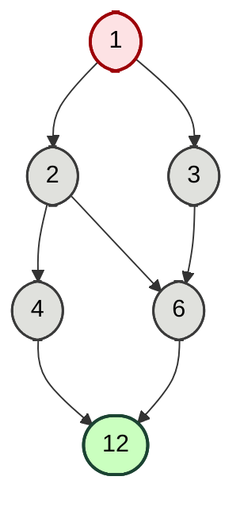
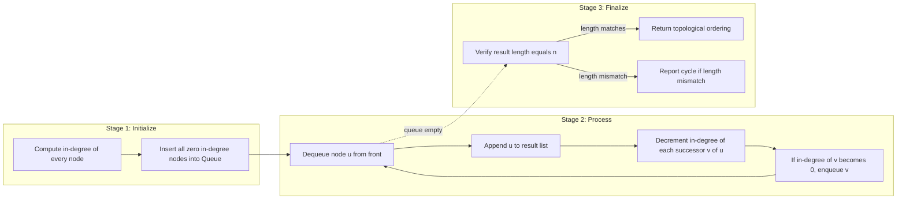
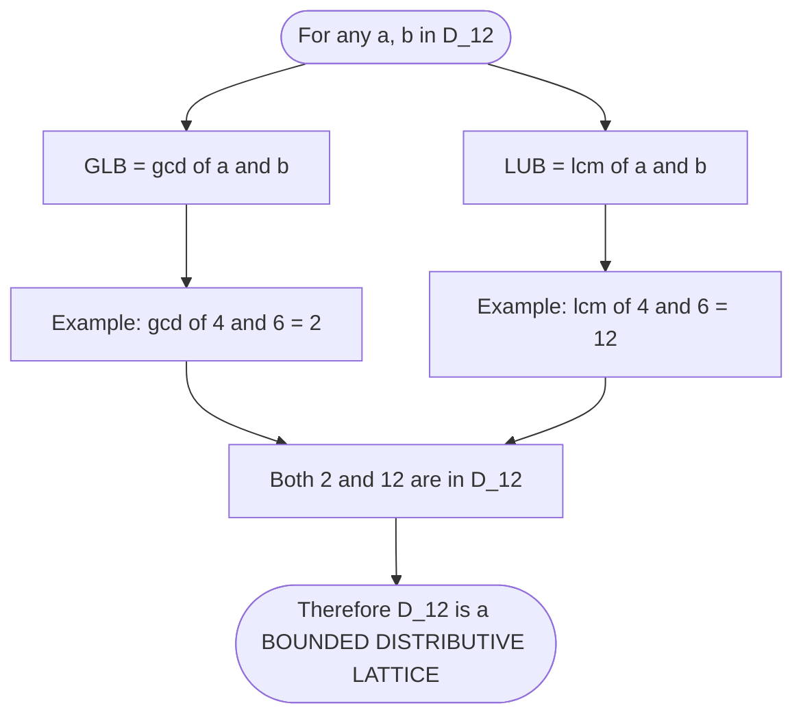

# Partial Orderings

<!-- SECTION_1_START -->
# Partial Orderings — Sets & Subsets (Module 1)

> [!IMPORTANT]
> **KTU 2024 Scheme | Course:** Discrete Mathematics (PCCST205)
> **Module Focus:** Posets, Hasse Diagrams, Lattices, Topological Sorting.
> **Cognitive Emphasis:** Understand → Apply → Analyze.

---

## 1.1 Formal Definition

Let $R$ be a binary relation defined on a non-empty set $S$. The relation $R$ is called a **Partial Order (or Partial Ordering)** on $S$ if, and only if, $R$ satisfies the following three axioms simultaneously for all $a, b, c \in S$:

$$
\begin{aligned}
&\text{(i) Reflexivity: } (a, a) \in R \\
&\text{(ii) Antisymmetry: } (a, b) \in R \text{ and } (b, a) \in R \;\Rightarrow\; a = b \\
&\text{(iii) Transitivity: } (a, b) \in R \text{ and } (b, c) \in R \;\Rightarrow\; (a, c) \in R
\end{aligned}
$$

The pair $(S, R)$ is then called a **Partially Ordered Set**, abbreviated as **Poset**. When the relation $R$ is understood from context, we simply refer to the set $S$ as a poset.

> [!NOTE]
> **Symbolic Convention:** A generic partial order is usually denoted by the symbol "$\preceq$" (precedes or equals). The reverse relation "$\succeq$" is also a partial order and is called the **dual (or converse)** of the poset.

---

## 1.2 Intuitive Analogy — The Organization Chart

Imagine the hierarchy of a software company:

* Every employee is at least equal to themselves (Reflexive).
* If Alice reports to Bob, Bob **cannot** simultaneously report to Alice unless Alice **is** Bob (Antisymmetry).
* If Alice reports to Bob, and Bob reports to Carol, then Alice also reports to Carol (Transitivity).

However, two employees in **different** branches — say a tester in the QA team and a designer in the UX team — may have **no reportable relationship** between them at all. This is the essence of "**partial**" ordering: not every pair of elements needs to be comparable.

> [!TIP]
> **Classic Examples of Posets**
> * $(\mathbb{Z}, \leq)$ — integers under usual less-than-or-equal.
> * $(\mathcal{P}(S), \subseteq)$ — power set under subset inclusion.
> * $(\mathbb{N}, \mid)$ — natural numbers under divisibility.
> * $(D_n, \mid)$ — set of divisors of $n$ under divisibility.

> [!VISUALIZATION CONTROL]
> **Concept:** Hasse Diagram of Divisibility Poset on $D_{12} = \{1, 2, 3, 4, 6, 12\}$
>
> **GeoGebra / Desmos Input (Plot Points and Line Segments):**
> * `P1 = (0, 0)`, `P2 = (-1, 1)`, `P3 = (1, 1)`, `P4 = (-1, 2)`, `P5 = (1, 2)`, `P6 = (0, 3)`
> * `Segment(P1, P2)`, `Segment(P1, P3)`, `Segment(P2, P4)`, `Segment(P2, P5)`, `Segment(P3, P5)`, `Segment(P4, P6)`, `Segment(P5, P6)`
>
> **Visual Description:** A diamond-shaped lattice floating above the origin. The number **1** sits at the bottom, **12** at the top. Lower elements divide higher elements, and edges connect divisors that differ by a single prime multiplication. The structure is symmetric, illustrating the lattice property of $D_{12}$.

---

## 1.3 Comparable vs. Incomparable Elements

In a poset $(S, \preceq)$:

* Two elements $a, b \in S$ are **comparable** if $a \preceq b$ or $b \preceq a$.
* They are **incomparable** (written $a \parallel b$) if neither $a \preceq b$ nor $b \preceq a$ holds.

> [!WARNING]
> **Common KTU Mistake:** The word "partial" does **not** mean "some properties hold" — it means **not all pairs are required to be comparable**. Reflexivity, antisymmetry, and transitivity must hold for **all** elements in $S$.

<!-- SECTION_1_END -->

<!-- SECTION_2_START -->
# Deep Theoretical Analysis & KTU High-Yield Formula Sheet

---

## 2.1 The Three Defining Axioms — Decoded

| Axiom | Formal Statement | Plain Meaning | Failure Consequence |
|---|---|---|---|
| **Reflexive** | $\forall a \in S, \; a \preceq a$ | Every element is related to itself. | The relation would be a *strict* order, not a partial order. |
| **Antisymmetric** | $(a \preceq b) \wedge (b \preceq a) \Rightarrow a = b$ | Two-way comparability forces equality. | Equality relation fails; relation is not a true order. |
| **Transitive** | $(a \preceq b) \wedge (b \preceq c) \Rightarrow a \preceq c$ | Comparability cascades. | Poset would have "broken" chains; would not be an order at all. |

> [!IMPORTANT]
> **Symmetry vs Antisymmetry:** Symmetric means $(a, b) \in R \Rightarrow (b, a) \in R$ for all pairs. Antisymmetric is **far weaker** — it only forbids mutual ordering of **distinct** elements. The relation "$\leq$" is antisymmetric but not symmetric.

---

## 2.2 Hasse Diagram — The Visual Signature of a Poset

A **Hasse Diagram** is a simplified, directed-acyclic-graph representation of a finite poset. It is drawn using the following **transitive reduction rules**:

1. Represent each element of $S$ as a vertex (small circle or dot).
2. If $a \prec b$ (i.e., $a \preceq b$ and $a \neq b$), place $a$ **below** $b$.
3. Draw a line segment from $a$ to $b$ **only if** there is no intermediate element $c$ with $a \prec c \prec b$. This is the **cover relation**.
4. Omit all self-loops (reflexivity) and transitive edges (transitivity).

> [!TIP]
> **Engineering Utility:** Hasse diagrams model precedence constraints in **build systems** (e.g., Make, Bazel), **task scheduling**, **compiler dependency graphs**, and **class inheritance hierarchies** in object-oriented design.

---

## 2.3 Chains and Antichains

| Concept | Definition | Example in $(\{1, 2, 3, 4, 6, 12\}, \mid)$ |
|---|---|---|
| **Chain** | A subset $C \subseteq S$ in which every pair of elements is comparable. | $\{1, 2, 4, 12\}$ is a chain of length 4. |
| **Antichain** | A subset $A \subseteq S$ in which **no** two distinct elements are comparable. | $\{4, 6, 9\}$ (in some $D_n$) — no element divides another. |
| **Length of a chain** | $\vert C \vert - 1$ (number of comparabilities). | $\{1, 2, 4\}$ has length 2. |
| **Height of poset** | Length of the longest chain in $S$. | In $D_{12}$, height = 3 (chain $1 \to 2 \to 4 \to 12$). |
| **Width of poset** | Maximum cardinality of any antichain. | In $D_{12}$, width = 2 (e.g., $\{4, 6\}$). |

> [!NOTE]
> **Dilworth's Theorem (Mention for Context):** In any finite poset, the minimum number of chains required to cover the poset equals the size of the largest antichain. This is highly relevant to algorithmic problems like bipartite matching.

---

## 2.4 Bounds, LUB, GLB, and Lattices

Let $A$ be a non-empty subset of a poset $(S, \preceq)$.

| Concept | Symbol | Definition |
|---|---|---|
| **Upper Bound of $A$** | $u \in S$ | $\forall a \in A, \; a \preceq u$ |
| **Lower Bound of $A$** | $\ell \in S$ | $\forall a \in A, \; \ell \preceq a$ |
| **Least Upper Bound (Supremum)** | $\sup(A)$ or $\text{LUB}(A)$ | $u$ is an upper bound, AND for every upper bound $u'$, $u \preceq u'$. |
| **Greatest Lower Bound (Infimum)** | $\inf(A)$ or $\text{GLB}(A)$ | $\ell$ is a lower bound, AND for every lower bound $\ell'$, $\ell' \preceq \ell$. |
| **Maximum Element** | — | An element $m \in S$ such that $\forall a \in S, \; a \preceq m$. Denoted $\mathbf{1}$ (top). |
| **Minimum Element** | — | An element $m \in S$ such that $\forall a \in S, \; m \preceq a$. Denoted $\mathbf{0}$ (bottom). |
| **Lattice** | — | A poset in which every pair of elements $\{a, b\}$ has **both** $\text{LUB}(a, b)$ and $\text{GLB}(a, b)$. |
| **Bounded Lattice** | — | A lattice that contains **both** a maximum $\mathbf{1}$ and a minimum $\mathbf{0}$. |
| **Distributive Lattice** | — | A lattice satisfying $a \wedge (b \vee c) = (a \wedge b) \vee (a \wedge c)$ and its dual. |

---

## 2.5 Well-Ordering

A poset $(S, \preceq)$ is **well-ordered** if every non-empty subset of $S$ contains a **least element** (minimum with respect to the subset).

* **Example:** $(\mathbb{N}, \leq)$ is well-ordered.
* **Counter-example:** $(\mathbb{Z}, \leq)$ is **not** well-ordered because the subset $\mathbb{Z}$ itself has no least element.

---

## 2.6 Topological Sorting

A **Topological Sort** of a finite poset $(S, \preceq)$ is a linear ordering (sequence) of all the elements of $S$ such that if $a \preceq b$ in the poset, then $a$ appears **before** $b$ in the sequence.

> [!IMPORTANT]
> **Existence Guarantee:** Every finite poset admits at least one topological sort. (Proven by repeatedly removing minimal elements — the same principle used in Kahn's Algorithm.)

> [!TIP]
> **Real-World Application:** In **package managers** (apt, npm, pip), the dependency graph of a project is a poset. Topological sort determines the safe installation order so that a package is installed *after* all its dependencies.

---

## 2.7 KTU High-Yield Formula Sheet

| # | Property / Formula | Statement | Notes |
|---|---|---|---|
| 1 | Partial Order Test | $R$ reflexive $\wedge$ antisymmetric $\wedge$ transitive | All three are mandatory. |
| 2 | Cover Relation | $a \lessdot b \iff a \prec b$ and no $c$ with $a \prec c \prec b$ | Used to draw Hasse diagram. |
| 3 | Chain Length | $\vert C \vert - 1$ | For chain of $\vert C \vert$ elements. |
| 4 | Height $h(S)$ | $\max$ length of any chain in $S$ | Always exists in finite poset. |
| 5 | Width $w(S)$ | $\max \vert A \vert$ for any antichain $A$ | By Dilworth: chain cover size = $w(S)$. |
| 6 | LUB Uniqueness | If $\sup(A)$ exists, it is **unique**. | The least upper bound is unique when it exists. |
| 7 | Lattice Condition | $\forall a, b \in S, \; a \vee b \in S$ and $a \wedge b \in S$ | $a \vee b = \text{LUB}(a, b)$, $a \wedge b = \text{GLB}(a, b)$. |
| 8 | Bounded Lattice | $\exists\, \mathbf{0}, \mathbf{1} \in S$ | Every finite lattice is bounded. |
| 9 | Distributive Identity | $a \wedge (b \vee c) = (a \wedge b) \vee (a \wedge c)$ | Holds for Boolean algebra, divisibility on $D_{n}$ when $n$ is squarefree. |
| 10 | Topological Sort Output | Linear order $\sigma$ such that $a \preceq b \Rightarrow \sigma^{-1}(a) < \sigma^{-1}(b)$ | Used in DAG scheduling. |

<!-- SECTION_2_END -->

<!-- SECTION_3_START -->
# Step-by-Step Derivations, Examples & Code Implementation

---

## 3.1 Worked Example 1 — Hasse Diagram of $D_{12}$

**Problem:** Construct the Hasse diagram of the poset $(D_{12}, \mid)$ where $D_{12} = \{1, 2, 3, 4, 6, 12\}$.

### Step 1 — Verify Partial Order on $D_{12}$

We must show that the divisibility relation "$\mid$" is a partial order on $D_{12}$.

* **Reflexivity:** For any $a \in D_{12}$, $a \mid a$ trivially. (1, 1), (2, 2), … all present. ✓
* **Antisymmetry:** If $a \mid b$ and $b \mid a$ with $a, b \in D_{12}$, then $a = b$ (since both are positive integers). ✓
* **Transitivity:** If $a \mid b$ and $b \mid c$, then $a \mid c$. (Standard property of divisibility.) ✓

### Step 2 — Compute the Cover Relation

We tabulate the divisibility pairs $(a, b)$ where $a \neq b$:

$$
\begin{aligned}
&1 \mid 2, \; 1 \mid 3, \; 1 \mid 4, \; 1 \mid 6, \; 1 \mid 12 \\
&2 \mid 4, \; 2 \mid 6, \; 2 \mid 12 \\
&3 \mid 6, \; 3 \mid 12 \\
&4 \mid 12, \; 6 \mid 12
\end{aligned}
$$

### Step 3 — Reduce to Covers

A pair $(a, b)$ is a **cover** $a \lessdot b$ if there is no $c \in D_{12}$ with $a \prec c \prec b$.

| Divisibility Pair | Has Intermediary? | Cover? |
|---|---|---|
| $1 \mid 2$ | No | **Yes** (1 ⋖ 2) |
| $1 \mid 3$ | No | **Yes** (1 ⋖ 3) |
| $1 \mid 4$ | Yes — $1 \mid 2 \mid 4$ | No |
| $1 \mid 6$ | Yes — $1 \mid 2 \mid 6$ (or $1 \mid 3 \mid 6$) | No |
| $1 \mid 12$ | Yes | No |
| $2 \mid 4$ | No | **Yes** (2 ⋖ 4) |
| $2 \mid 6$ | No | **Yes** (2 ⋖ 6) |
| $2 \mid 12$ | Yes — $2 \mid 4 \mid 12$ | No |
| $3 \mid 6$ | No | **Yes** (3 ⋖ 6) |
| $3 \mid 12$ | Yes — $3 \mid 6 \mid 12$ | No |
| $4 \mid 12$ | No | **Yes** (4 ⋖ 12) |
| $6 \mid 12$ | No | **Yes** (6 ⋖ 12) |

### Step 4 — Identify Bounds and LUB/GLB

For the entire poset $D_{12}$:

* **Minimum element:** $\mathbf{0} = 1$ (every element of $D_{12}$ is divisible by 1).
* **Maximum element:** $\mathbf{1} = 12$ (12 is divisible by every element of $D_{12}$).
* For any pair $a, b \in D_{12}$:
  * $\text{LUB}(a, b) = \text{lcm}(a, b)$
  * $\text{GLB}(a, b) = \gcd(a, b)$

**Concrete example:** $\text{LUB}(4, 6) = \text{lcm}(4, 6) = 12$ and $\text{GLB}(4, 6) = \gcd(4, 6) = 2$.

> [!TIP]
> **Insight:** $(D_n, \mid)$ is a **bounded distributive lattice** for **every** positive integer $n$, with join = lcm and meet = gcd. This is one of the most elegant posets in number theory.

---

## 3.2 Worked Example 2 — Topological Sort via Repeated Minimal Element Removal

**Problem:** Topologically sort the poset $(D_{12}, \mid)$.

**Algorithm (Kahn's Method):**

1. Find all **minimal** elements (elements with no predecessors other than themselves).
2. Output them, remove from the poset.
3. Repeat until the poset is empty.

### Execution Trace

| Step | Current Minimal Elements | Output Order | Remaining Poset |
|---|---|---|---|
| 1 | $\{1\}$ | $1$ | $\{2, 3, 4, 6, 12\}$ |
| 2 | $\{2, 3\}$ | $1, 2, 3$ | $\{4, 6, 12\}$ |
| 3 | $\{4, 6\}$ | $1, 2, 3, 4, 6$ | $\{12\}$ |
| 4 | $\{12\}$ | $1, 2, 3, 4, 6, 12$ | $\emptyset$ |

**Topological Sort:** $\;1, 2, 3, 4, 6, 12$ ✓

> [!NOTE]
> The order is **not unique**. For example, $1, 3, 2, 4, 6, 12$ and $1, 2, 3, 6, 4, 12$ are equally valid topological sorts.

---

## 3.3 Python Implementation — Partial Order Verifier

```python
from typing import Set, Tuple, FrozenSet
import logging

logging.basicConfig(level=logging.INFO, format="%(levelname)s :: %(message)s")

Relation = Set[Tuple[int, int]]


def is_reflexive(rel: Relation, universe: Set[int]) -> bool:
    """All (a, a) pairs must be present in the relation."""
    return all((a, a) in rel for a in universe)


def is_antisymmetric(rel: Relation) -> bool:
    """(a, b) and (b, a) with a != b is forbidden."""
    for (a, b) in rel:
        if a != b and (b, a) in rel:
            return False
    return True


def is_transitive(rel: Relation) -> bool:
    """If (a, b) and (b, c) are in rel, then (a, c) must also be in rel."""
    rel_map: dict[int, Set[int]] = {}
    for (a, b) in rel:
        rel_map.setdefault(a, set()).add(b)

    for a in rel_map:
        for b in list(rel_map[a]):
            for c in rel_map.get(b, set()):
                if c not in rel_map[a]:
                    return False
    return True


def is_partial_order(rel: Relation, universe: Set[int]) -> bool:
    """Combined test for poset (S, R)."""
    try:
        if not is_reflexive(rel, universe):
            logging.error("Reflexivity FAILED — missing self-loops.")
            return False
        if not is_antisymmetric(rel):
            logging.error("Antisymmetry FAILED — found (a,b) and (b,a) with a != b.")
            return False
        if not is_transitive(rel):
            logging.error("Transitivity FAILED — chain has a missing link.")
            return False
        return True
    except Exception as exc:
        logging.exception("Unexpected error while validating poset: %s", exc)
        return False


# --- Test on D_12 divisibility ---
universe: FrozenSet[int] = frozenset({1, 2, 3, 4, 6, 12})
divides: Relation = {(a, b) for a in universe for b in universe if b % a == 0}

print(f"Universe D_12 = {sorted(universe)}")
print(f"Poset valid?  {is_partial_order(divides, set(universe))}")
```

**Expected Output:**
```
Universe D_12 = [1, 2, 3, 4, 6, 12]
Poset valid?  True
```

---

## 3.4 Python Implementation — Topological Sort (Kahn's Algorithm)

```python
from collections import deque
from typing import Dict, List, Set
import logging

logging.basicConfig(level=logging.INFO, format="%(levelname)s :: %(message)s")


def topological_sort_kahn(adj: Dict[int, Set[int]], all_nodes: Set[int]) -> List[int]:
    """
    Perform Kahn's algorithm for topological sorting.
    adj[u]  = set of nodes v such that u < v (i.e., u must come before v).
    """
    in_degree: Dict[int, int] = {node: 0 for node in all_nodes}
    for u in adj:
        for v in adj[u]:
            in_degree[v] = in_degree.get(v, 0) + 1

    queue: deque[int] = deque(sorted([n for n, d in in_degree.items() if d == 0]))
    result: List[int] = []

    while queue:
        u = queue.popleft()
        result.append(u)
        for v in sorted(adj.get(u, set())):
            in_degree[v] -= 1
            if in_degree[v] == 0:
                queue.append(v)

    if len(result) != len(all_nodes):
        logging.error("Cycle detected — poset invalid, no topological sort exists.")
        return []
    return result


# --- Test on D_12 ---
all_nodes: Set[int] = {1, 2, 3, 4, 6, 12}
covers: Dict[int, Set[int]] = {
    1: {2, 3},
    2: {4, 6},
    3: {6},
    4: {12},
    6: {12},
    12: set(),
}
print("Topological sort of D_12:", topological_sort_kahn(covers, all_nodes))
```

**Expected Output:**
```
Topological sort of D_12: [1, 2, 3, 4, 6, 12]
```

---

## 3.5 Symbolic Derivation — Distributive Law Check on $D_{12}$

To verify that $(D_{12}, \mid)$ is distributive, we must check:

$$
a \wedge (b \vee c) = (a \wedge b) \vee (a \wedge c)
$$

Using $\wedge = \gcd$ and $\vee = \text{lcm}$, the identity becomes:

$$
\gcd(a, \text{lcm}(b, c)) = \text{lcm}(\gcd(a, b), \gcd(a, c))
$$

This is a **standard number-theoretic identity**, true for all positive integers. Hence $(D_{12}, \mid)$ is a **distributive lattice** — and indeed, the same holds for $(D_n, \mid)$ for **every** $n$.

> [!TIP]
> **Note for Advanced Reading:** The lattice of divisors $D_n$ is a **Boolean lattice** (isomorphic to a power-set lattice) **if and only if** $n$ is squarefree. For $D_{12}$, since $12 = 2^2 \cdot 3$ is not squarefree, the lattice is distributive but not Boolean.

<!-- SECTION_3_END -->

<!-- SECTION_4_START -->
# Structural Diagrams & Schematics

---

## 4.1 Hasse Diagram of $(D_{12}, \mid)$ — Mermaid Flow Representation



**Reading the Diagram:**

* The number **1** is the unique minimum (bottom element, **0**).
* The number **12** is the unique maximum (top element, **1**).
* Edges represent **cover relations** (e.g., $1 \lessdot 2$).
* Transitive edges (like $1 \to 12$ or $2 \to 12$) are **omitted** to keep the diagram minimal.

---

## 4.2 Modular Flow — Topological Sort Processing Topology



---

## 4.3 Lattice Property Map — Meet and Join Operations



<!-- SECTION_4_END -->

<!-- SECTION_5_START -->
# KTU 2024 Scheme Examination Question Bank & Topic Recap

---

## PART A — Short Answer Questions (3 Marks Each)

> **Cognitive Levels:** Remember / Understand
> **Target Time:** 4–5 minutes per question

---

### Q1. `[KTU University Exam – July 2024]`
**(3 Marks) | CO1 | Remember**

**Define a partial ordering on a set. State the three properties that a relation must satisfy to be a partial order.**

#### Model Answer:

A relation $R$ on a non-empty set $S$ is a **partial order** if it satisfies:

1. **Reflexivity:** $\forall a \in S, \; (a, a) \in R$.
2. **Antisymmetry:** $\forall a, b \in S, \; (a, b) \in R \wedge (b, a) \in R \Rightarrow a = b$.
3. **Transitivity:** $\forall a, b, c \in S, \; (a, b) \in R \wedge (b, c) \in R \Rightarrow (a, c) \in R$.

The set $S$ together with $R$, denoted $(S, R)$, is called a **partially ordered set (poset)**.

**Valuation Key:**
* [Stating partial order definition: 1 Mark]
* [Listing all 3 properties with symbols: 2 Marks]

---

### Q2. `[KTU University Exam – Dec 2023]`
**(3 Marks) | CO1 | Understand**

**Differentiate between a chain and an antichain in a poset. Give one example for each from the poset $(\{1, 2, 3, 4, 6, 12\}, \mid)$.**

#### Model Answer:

| Feature | Chain | Antichain |
|---|---|---|
| **Definition** | A subset in which every pair of elements is comparable. | A subset in which no two distinct elements are comparable. |
| **Example in $(D_{12}, \mid)$** | $\{1, 2, 4, 12\}$ — every element divides the next. | $\{4, 6\}$ — neither $4 \mid 6$ nor $6 \mid 4$ holds. |

**Valuation Key:**
* [Clear definition of chain: 1 Mark]
* [Clear definition of antichain: 1 Mark]
* [Correct example for each: 1 Mark]

---

## PART B — Long Answer Questions (14 Marks Each, with Internal Choice)

> **Format:** Each question has sub-parts (a) and (b), each carrying 7 marks.
> **Cognitive Escalation:** (a) tests Understand/Analyze; (b) tests Apply/Evaluate.

---

### Question A `[KTU University Exam – July 2024]`
**(14 Marks) | CO1, CO2 | Apply + Analyze**

**Consider the poset $(D_{30}, \mid)$ where $D_{30} = \{1, 2, 3, 5, 6, 10, 15, 30\}$.**

**(a)** Draw the **Hasse diagram** of $(D_{30}, \mid)$ and identify the maximum and minimum elements.
**(7 Marks)**

**(b)** Find $\text{LUB}(6, 10)$, $\text{GLB}(6, 10)$, $\text{LUB}(2, 15)$, and $\text{GLB}(2, 15)$. Verify that $(D_{30}, \mid)$ is a **bounded distributive lattice**.
**(7 Marks)**

#### Model Solution:

##### Part (a) — Hasse Diagram

**Step 1:** List all cover relations by eliminating transitive pairs.

Divisibility pairs: $1\mid 2, 1\mid 3, 1\mid 5, 1\mid 6, 1\mid 10, 1\mid 15, 1\mid 30$, $2\mid 6, 2\mid 10, 2\mid 30$, $3\mid 6, 3\mid 15, 3\mid 30$, $5\mid 10, 5\mid 15, 5\mid 30$, $6\mid 30$, $10\mid 30$, $15\mid 30$.

**Step 2:** Eliminate pairs with intermediaries. Final cover set:

$$
1 \lessdot 2, \; 1 \lessdot 3, \; 1 \lessdot 5, \; 2 \lessdot 6, \; 2 \lessdot 10, \; 3 \lessdot 6, \; 3 \lessdot 15, \; 5 \lessdot 10, \; 5 \lessdot 15, \; 6 \lessdot 30, \; 10 \lessdot 30, \; 15 \lessdot 30
$$

**Step 3:** The Hasse diagram is a **cubic / Boolean**-like structure:

```
                30
              / | \
            6  10  15
           /|  /   /|
          2 3    5
           \|   |  /
            (2,3,5 connect up)
              \ | /
                1
```

* **Minimum element:** $1$ (since $1 \mid x$ for all $x \in D_{30}$).
* **Maximum element:** $30$ (since $x \mid 30$ for all $x \in D_{30}$).

**Valuation Key:**
* [Listing cover relations: 3 Marks]
* [Drawing correct Hasse diagram (sketch acceptable): 3 Marks]
* [Identifying max and min: 1 Mark]

##### Part (b) — LUB/GLB and Lattice Verification

Using $\text{LUB} = \text{lcm}$ and $\text{GLB} = \gcd$:

$$
\begin{aligned}
&\text{LUB}(6, 10) = \text{lcm}(6, 10) = 30 \\
&\text{GLB}(6, 10) = \gcd(6, 10) = 2 \\
&\text{LUB}(2, 15) = \text{lcm}(2, 15) = 30 \\
&\text{GLB}(2, 15) = \gcd(2, 15) = 1
\end{aligned}
$$

All four results $30, 2, 30, 1$ lie in $D_{30}$.

**Lattice verification:** For any $a, b \in D_{30}$, $\text{lcm}(a, b) \mid 30$ and $\gcd(a, b) \mid 30$, so both lie in $D_{30}$. Therefore $(D_{30}, \mid)$ is a **lattice**.

**Bounded:** Minimum = $1$, Maximum = $30$ — both exist. ✓

**Distributive:** For all $a, b, c \in D_{30}$, the number-theoretic identity

$$
\gcd(a, \text{lcm}(b, c)) = \text{lcm}(\gcd(a, b), \gcd(a, c))
$$

holds. Therefore $(D_{30}, \mid)$ is **distributive**. ✓

**Conclusion:** $(D_{30}, \mid)$ is a **bounded distributive lattice**.

**Valuation Key:**
* [Correct LUB and GLB for (6, 10): 2 Marks]
* [Correct LUB and GLB for (2, 15): 2 Marks]
* [Lattice + bounded + distributive verification: 3 Marks]

---

### Question B `[KTU University Exam – Dec 2023]`
**(14 Marks) | CO1, CO2 | Apply + Evaluate**

**Consider the poset $(S, \mid)$ where $S = \{1, 2, 3, 6, 9, 18\}$.**

**(a)** Draw the Hasse diagram of $(S, \mid)$ and list **all** chains of maximum length.
**(7 Marks)**

**(b)** Perform a **topological sort** of this poset using repeated removal of minimal elements. Show the step-by-step process.
**(7 Marks)**

#### Model Solution:

##### Part (a) — Hasse Diagram and Maximum Chains

**Cover relations** (after removing transitive edges):

$$
1 \lessdot 2, \; 1 \lessdot 3, \; 2 \lessdot 6, \; 3 \lessdot 9, \; 6 \lessdot 18, \; 9 \lessdot 18
$$

**Hasse Diagram Sketch:**

```
         18
        /  \
       6    9
       |    |
       2    3
        \  /
          1
```

**Chains of maximum length (= 3, since longest has 4 elements):**

1. $\{1, 2, 6, 18\}$
2. $\{1, 3, 9, 18\}$

These are the only two chains with 4 elements (length 3). All other chains have at most 3 elements.

**Valuation Key:**
* [Cover relation identification: 2 Marks]
* [Correct Hasse diagram: 2 Marks]
* [Listing all max-length chains: 3 Marks]

##### Part (b) — Topological Sort

**Step-by-step minimal-element removal:**

| Step | Minimal Elements | Output | Remaining Set |
|---|---|---|---|
| 1 | $\{1\}$ | $1$ | $\{2, 3, 6, 9, 18\}$ |
| 2 | $\{2, 3\}$ | $1, 2, 3$ | $\{6, 9, 18\}$ |
| 3 | $\{6, 9\}$ | $1, 2, 3, 6, 9$ | $\{18\}$ |
| 4 | $\{18\}$ | $1, 2, 3, 6, 9, 18$ | $\emptyset$ |

**Final Topological Sort:** $1 \to 2 \to 3 \to 6 \to 9 \to 18$

> [!NOTE]
> Other valid topological sorts: $1, 3, 2, 6, 9, 18$ and $1, 2, 3, 9, 6, 18$ (any order that respects the cover relations).

**Valuation Key:**
* [Step 1 minimal element identification: 2 Marks]
* [Step 2–4 progression: 3 Marks]
* [Final valid topological sort: 2 Marks]

---

> [!WARNING]
> **KTU Examiner's Valuation Warning — Common Pitfalls**
> 1. **Forgetting reflexivity check:** Many students omit checking that every element is related to itself, leading to loss of 1–2 marks in property-based questions.
> 2. **Drawing transitive edges in Hasse diagram:** Always **eliminate** pairs that have an intermediary. Drawing $1 \to 18$ alongside $1 \to 2 \to 6 \to 18$ is a **valuation error** — the Hasse diagram must be a transitive reduction.
> 3. **Confusing LUB with maximum element:** The LUB of a subset may or may not belong to the subset. The maximum element **must** belong to the entire poset and dominate everything.
> 4. **Assuming uniqueness of topological sort:** Topological sort is **not unique** in general. Any valid linear extension is acceptable.
> 5. **Misidentifying chains as antichains:** Verify each pair of elements in the candidate set — if **any** pair is comparable, the set is a chain (not an antichain).

---

## 📌 Topic Recap & Important Things to Remember

* **Partial Order** = Reflexive + Antisymmetric + Transitive. The poset is denoted $(S, \preceq)$.
* **Comparable** $a \preceq b$ or $b \preceq a$; **Incomparable** $a \parallel b$ when neither holds.
* **Hasse Diagram** = transitive reduction of a poset drawn with minimal elements at the bottom. **Self-loops and transitive edges are removed.**
* **Cover Relation** $a \lessdot b$ = $a \prec b$ with no element strictly between them.
* **Chain** = totally ordered subset. **Antichain** = pairwise incomparable subset.
* **Height** = length of longest chain. **Width** = size of largest antichain (used in Dilworth's theorem).
* **Upper Bound** $u$: every element of the subset lies below $u$.
* **Lower Bound** $\ell$: every element of the subset lies above $\ell$.
* **LUB (supremum)** = least upper bound (always unique when it exists). **GLB (infimum)** = greatest lower bound.
* **Lattice** = poset where every pair has both LUB and GLB.
* **Bounded Lattice** = lattice with both top ($\mathbf{1}$) and bottom ($\mathbf{0}$) elements.
* **Distributive Lattice** = lattice satisfying $a \wedge (b \vee c) = (a \wedge b) \vee (a \wedge c)$ and its dual.
* **Well-Order** = every non-empty subset has a least element. $\mathbb{N}$ is well-ordered; $\mathbb{Z}$ is not.
* **Topological Sort** = linear extension of a poset. Always exists for finite posets. Used in task scheduling, build systems, package managers.
* **$(D_n, \mid)$** is always a **bounded distributive lattice** with $\wedge = \gcd$ and $\vee = \text{lcm}$.
* **$(D_n, \mid)$ is Boolean (isomorphic to a power-set lattice) iff $n$ is squarefree.**

<!-- SECTION_5_END -->
