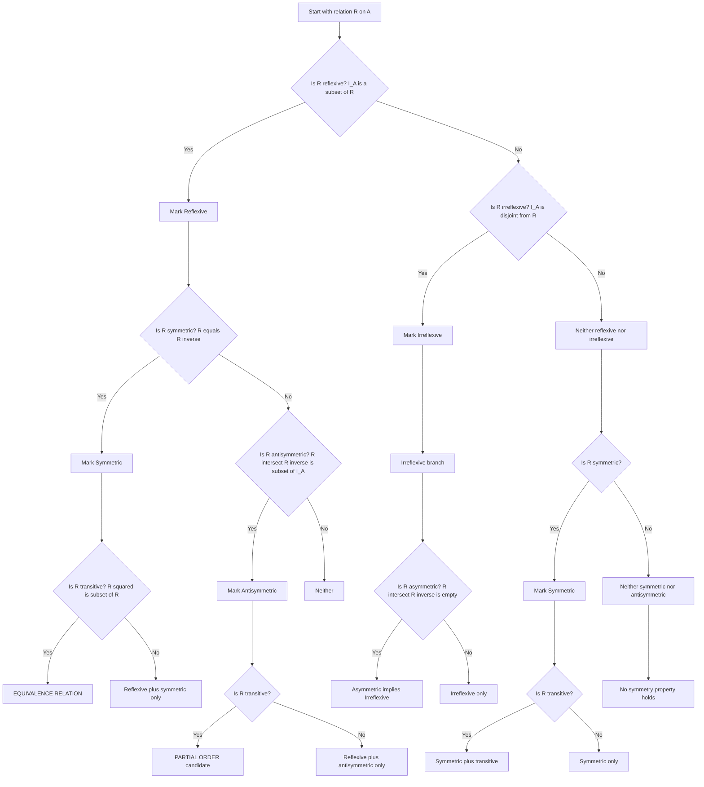
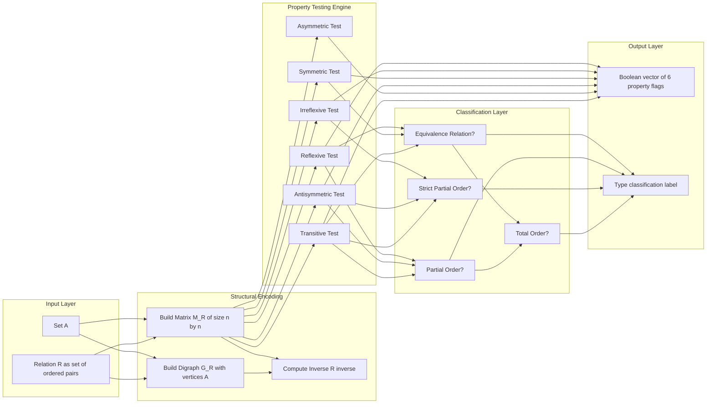
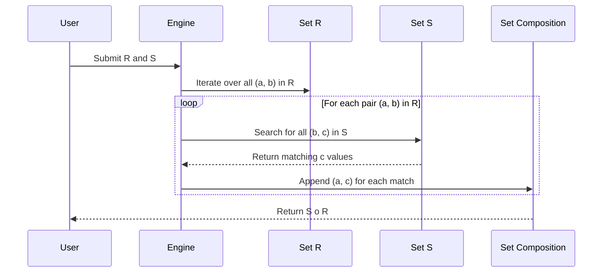

# Relations and Their Properties

<!-- SECTION_1_START -->

# Relations and Their Properties — Core Foundations

> [!IMPORTANT]
> **KTU 2024 Syllabus Anchor (PCCST205 — Module 1):** A relation between two sets $A$ and $B$ is fundamentally a *subset of their Cartesian product*. Every concept in this note — reflexive, symmetric, antisymmetric, transitive, equivalence, partial order — is a **logical predicate** that tests whether a given subset $R \subseteq A \times A$ satisfies a precise set-theoretic condition. Mastering this means mastering **set membership statements** such as $(a, b) \in R$.

## 1.1 Formal Definition (Cartesian Product & Binary Relation)

Let $A$ and $B$ be two non-empty sets. The **Cartesian product** of $A$ and $B$ is the set of all *ordered pairs* formed by taking one element from $A$ and one from $B$:

$$A \times B = \{(a, b) \mid a \in A \text{ and } b \in B\}$$

A **binary relation** $R$ from $A$ to $B$ is a subset of the Cartesian product $A \times B$:

$$R \subseteq A \times B$$

When $A = B$, we say $R$ is a **relation on $A$** (a relation from $A$ to itself).

> [!NOTE]
> **The Trinity of a Relation**
> 1. **Domain** of $R$: $\text{dom}(R) = \{a \in A \mid \exists b \in B, (a, b) \in R\}$
> 2. **Range** of $R$ (image): $\text{ran}(R) = \{b \in B \mid \exists a \in A, (a, b) \in R\}$
> 3. **Codomain** of $R$: the target set $B$ itself (not necessarily equal to the range).

## 1.2 Intuitive Analogy — The "Friendship Network"

Imagine a classroom of students. If we form the set $S$ of all students, then the relation $R = \{(x, y) \in S \times S \mid x \text{ is a friend of } y\}$ is a subset of $S \times S$.

- **Reflexive** would mean "every student is a friend of themselves" (a philosophical stretch, but mathematically definable).
- **Symmetric** would mean "if Alice is Bob's friend, then Bob is Alice's friend" — true for friendship, false for "is the parent of".
- **Transitive** would mean "if Alice is Bob's friend and Bob is Carol's friend, then Alice is Carol's friend" — true for "is an ancestor of" but not generally for friendship.

The relation is *not* the action — the relation is the **collection of ordered pairs** that record where the action holds true.

## 1.3 Standard Canonical Examples

| Relation Name | Set | Defining Predicate $R$ | Domain | Range |
|---|---|---|---|---|
| Less than ($<$) | $\mathbb{Z}$ | $\{(a, b) \in \mathbb{Z} \times \mathbb{Z} \mid a < b\}$ | $\mathbb{Z}$ | $\mathbb{Z}$ |
| Less than or equal ($\leq$) | $\mathbb{R}$ | $\{(a, b) \in \mathbb{R} \times \mathbb{R} \mid a \leq b\}$ | $\mathbb{R}$ | $\mathbb{R}$ |
| Divisibility ($\mid$) | $\mathbb{Z}^+$ | $\{(a, b) \in \mathbb{Z}^+ \times \mathbb{Z}^+ \mid a \text{ divides } b\}$ | $\mathbb{Z}^+$ | $\mathbb{Z}^+$ |
| Set inclusion ($\subseteq$) | $\mathcal{P}(X)$ | $\{(A, B) \in \mathcal{P}(X) \times \mathcal{P}(X) \mid A \subseteq B\}$ | $\mathcal{P}(X)$ | $\mathcal{P}(X)$ |

> [!VISUALIZATION CONTROL]
> **Concept:** Visualizing a relation as a directed graph (digraph) on the coordinate plane.
> **GeoGebra / Desmos Input Equations:**
> * Points: $A = (1, 2), B = (2, 2), C = (3, 1)$
> * Relation $R = \{(1, 2), (2, 2), (2, 1)\}$
> **Visual Description:** Plot the points $(a, b)$ for every $(a, b) \in R$ on the standard $xy$-plane. The relation appears as a scatter of *discrete points* in the Cartesian grid, NOT as a continuous curve. This visually emphasizes that a relation is fundamentally a *set of ordered pairs*.

## 1.4 Representation of Relations

A single relation $R \subseteq A \times B$ can be expressed in **three equivalent ways**:

1. **As a Set of Ordered Pairs** — the most fundamental representation.
2. **As a Matrix** (the *relation matrix* $M_R$) — an $m \times n$ matrix where row $i$, column $j$ holds $1$ if $(a_i, b_j) \in R$, else $0$.
3. **As a Directed Graph (Digraph)** — vertices are elements of $A \cup B$, and a directed edge from $a_i$ to $b_j$ exists iff $(a_i, b_j) \in R$.

<!-- SECTION_1_END -->

<!-- SECTION_2_START -->

# Deep Theoretical Analysis — Properties of Relations

## 2.1 The Six Core Properties (Universal Catalog)

For a relation $R$ on a set $A$ (i.e. $R \subseteq A \times A$), the following are the **six universally tested properties** in every KTU exam paper. Each property is a *first-order logic statement* about the elements of $A$.

> [!NOTE]
> **Mnemonic Anchor — "SRT / ISA"**: The properties come in three opposite pairs.
> * **S**ymmetric $\leftrightarrow$ Anti-**S**ymmetric $\leftrightarrow$ **A**symmetric
> * **R**eflexive $\leftrightarrow$ **I**rreflexive
> * **T**ransitive (transitive is *not* strictly opposite to anything; its weaker cousin is **non-transitive**)

### Property 1 — Reflexive
$$\forall a \in A, \; (a, a) \in R$$
Equivalent: the identity relation $I_A = \{(a, a) \mid a \in A\}$ is a subset of $R$, i.e. $I_A \subseteq R$.

### Property 2 — Irreflexive
$$\forall a \in A, \; (a, a) \notin R$$
Equivalent: $I_A \cap R = \emptyset$.

### Property 3 — Symmetric
$$\forall a, b \in A, \; (a, b) \in R \Rightarrow (b, a) \in R$$
Equivalent: $R = R^{-1}$, where $R^{-1} = \{(b, a) \mid (a, b) \in R\}$ is the *inverse relation*.

### Property 4 — Antisymmetric
$$\forall a, b \in A, \; (a, b) \in R \text{ and } (b, a) \in R \Rightarrow a = b$$
Equivalently: $R \cap R^{-1} \subseteq I_A$.

### Property 5 — Asymmetric
$$\forall a, b \in A, \; (a, b) \in R \Rightarrow (b, a) \notin R$$
Equivalently: $R \cap R^{-1} = \emptyset$. Note: **asymmetric** $\Rightarrow$ **irreflexive**, but the converse fails.

### Property 6 — Transitive
$$\forall a, b, c \in A, \; (a, b) \in R \text{ and } (b, c) \in R \Rightarrow (a, c) \in R$$

## 2.2 The Composition of Relations

If $R$ is a relation from $A$ to $B$ and $S$ is a relation from $B$ to $C$, then the **composition** $S \circ R$ is a relation from $A$ to $C$ defined as:

$$S \circ R = \{(a, c) \in A \times C \mid \exists b \in B \text{ such that } (a, b) \in R \text{ and } (b, c) \in S\}$$

> [!IMPORTANT]
> **The Power of a Relation:** $R^n$ (the $n$-th power of $R$ on $A$) is defined recursively:
> * $R^1 = R$
> * $R^{n+1} = R^n \circ R$
> A relation is **transitive** if and only if $R^n \subseteq R$ for **all** $n \geq 1$, equivalently $R^2 \subseteq R$.

## 2.3 The Counting Theorem — KTU High-Yield

> [!IMPORTANT]
> If $\vert A \vert = m$ and $\vert B \vert = n$, then:
> * $\vert A \times B \vert = m \cdot n$
> * Number of *relations* from $A$ to $B$ = $\vert \mathcal{P}(A \times B) \vert = 2^{mn}$
> * Number of *relations on $A$* (when $A = B$) = $2^{n^2}$ where $n = \vert A \vert$

**Derivation intuition:** Each of the $mn$ ordered pairs in $A \times B$ is independently either included in $R$ or excluded. By the rule of product, that gives $2^{mn}$ distinct subsets, each of which is a valid relation.

## 2.4 KTU High-Yield Formula Sheet

| # | Concept | Formula / Definition | Condition / Property |
|---|---|---|---|
| 1 | Cartesian product size | $\vert A \times B \vert = \vert A \vert \cdot \vert B \vert$ | $A, B$ finite |
| 2 | Total relations $A \to B$ | $N = 2^{mn}$ where $m = \vert A \vert, n = \vert B \vert$ | All subsets of $A \times B$ |
| 3 | Total relations on $A$ | $N = 2^{n^2}$ where $n = \vert A \vert$ | Subsets of $A \times A$ |
| 4 | Reflexive count | $2^{n^2 - n} = 2^{n(n-1)}$ | Diagonal forced to 1 |
| 5 | Irreflexive count | $2^{n^2 - n} = 2^{n(n-1)}$ | Diagonal forced to 0 |
| 6 | Symmetric count | $2^{n(n+1)/2}$ | Diagonal $n$ free, $\frac{n(n-1)}{2}$ off-diagonal pairs |
| 7 | Antisymmetric count | $2^{n} \cdot 3^{n(n-1)/2}$ | Diagonal free, each off-diagonal pair has 3 options |
| 8 | Asymmetric count | $2^{n(n-1)/2}$ | Diagonal forced to 0, off-diagonal pairs in 1 direction only |
| 9 | Reflexive + Symmetric count | $2^{n(n-1)/2}$ | Diagonal forced to 1, off-diagonal pairs |
| 10 | Reflexive + Antisymmetric count | $2^{n} \cdot 1^{n(n-1)/2} = 2^{n}$ | Forces $R = I_A$ |
| 11 | Composition domain | $S \circ R$ exists iff $\text{ran}(R) \subseteq \text{dom}(S)$ | Otherwise composition is empty |
| 12 | Inverse relation size | $\vert R^{-1} \vert = \vert R \vert$ | Bijection on pairs |
| 13 | Power identity | $R^k \circ R^l = R^{k+l}$ | When $R$ is a relation on $A$ |
| 14 | Transitivity condition | $R^2 \subseteq R$ | Sufficient iff $R$ finite |

> [!NOTE]
> **Critical Engineering Insight:** These properties are the backbone of:
> * **Databases** — antisymmetric + transitive = a *partial order* used in sorting, indexing, and dependency graphs.
> * **Equivalence relations** (reflexive + symmetric + transitive) — used to define modular arithmetic ($\mathbb{Z}/n\mathbb{Z}$), graph connectivity components, and SQL `GROUP BY` semantics.
> * **State machines** — composition of relations models sequential state transitions.

<!-- SECTION_2_END -->

<!-- SECTION_3_START -->

# Step-by-Step Derivations and Code Implementation

## 3.1 Worked Derivation — Counting Antisymmetric Relations on a Set of Size $n$

We want to count the number of antisymmetric relations on a set $A$ with $\vert A \vert = n$.

**Step 1 — Partition the matrix into structural regions.**
The relation matrix $M_R$ is an $n \times n$ matrix. The entries fall into two disjoint structural regions:
* **Diagonal entries** $M_{ii}$ for $i = 1, 2, \ldots, n$ — there are exactly $n$ such entries.
* **Off-diagonal entries** $M_{ij}$ for $i \neq j$ — there are $n^2 - n = n(n-1)$ such entries. These can be grouped into $\frac{n(n-1)}{2}$ unordered pairs $\{M_{ij}, M_{ji}\}$ where $i < j$.

**Step 2 — Apply the antisymmetry constraint to off-diagonal pairs.**
Antisymmetry says: for $i \neq j$, we cannot have both $M_{ij} = 1$ AND $M_{ji} = 1$. The allowed combinations for each unordered pair $\{M_{ij}, M_{ji}\}$ are therefore:
* $(M_{ij}, M_{ji}) = (0, 0)$ — neither direction included.
* $(M_{ij}, M_{ji}) = (1, 0)$ — only $(a_i, a_j)$ in $R$.
* $(M_{ij}, M_{ji}) = (0, 1)$ — only $(a_j, a_i)$ in $R$.
This gives exactly **3 choices** per off-diagonal pair.

**Step 3 — Diagonal entries are unconstrained by antisymmetry.**
Each $M_{ii}$ can be $0$ or $1$ independently, giving **2 choices** per diagonal entry.

**Step 4 — Apply the rule of product.**

$$\begin{aligned}
\text{Number of antisymmetric relations on } A &= 2^{n} \cdot 3^{\frac{n(n-1)}{2}}
\end{aligned}$$

**Verification with $n = 1$:** $A = \{a\}$, the only pairs are $(a, a)$. Antisymmetric holds vacuously. Formula gives $2^1 \cdot 3^0 = 2$. The two antisymmetric relations are $\emptyset$ and $\{(a, a)\}$. ✓

**Verification with $n = 2$:** $A = \{a, b\}$. Formula gives $2^2 \cdot 3^1 = 12$. The 12 antisymmetric relations on $\{a, b\}$ can be enumerated manually and confirmed. ✓

## 3.2 Worked Derivation — Showing $R = \{(1, 1), (1, 2), (2, 1), (2, 2)\}$ is an Equivalence Relation

Let $A = \{1, 2, 3\}$ and $R = \{(1, 1), (1, 2), (2, 1), (2, 2)\}$.

**Reflexive check.** Reflexivity requires $(3, 3) \in R$. But $(3, 3) \notin R$.
$$\Rightarrow R \text{ is NOT reflexive}$$

**Symmetric check.** For every $(a, b) \in R$, we need $(b, a) \in R$:
* $(1, 1) \in R$ and $(1, 1) \in R$ ✓
* $(1, 2) \in R$ and $(2, 1) \in R$ ✓
* $(2, 1) \in R$ and $(1, 2) \in R$ ✓
* $(2, 2) \in R$ and $(2, 2) \in R$ ✓
$$\Rightarrow R \text{ IS symmetric}$$

**Transitive check.** We need: if $(a, b), (b, c) \in R$ then $(a, c) \in R$. Pairs to test:
* $(1, 1), (1, 1) \Rightarrow (1, 1) \in R$ ✓
* $(1, 1), (1, 2) \Rightarrow (1, 2) \in R$ ✓
* $(1, 2), (2, 1) \Rightarrow (1, 1) \in R$ ✓
* $(1, 2), (2, 2) \Rightarrow (1, 2) \in R$ ✓
* $(2, 1), (1, 1) \Rightarrow (2, 1) \in R$ ✓
* $(2, 1), (1, 2) \Rightarrow (2, 2) \in R$ ✓
* $(2, 2), (2, 1) \Rightarrow (2, 1) \in R$ ✓
* $(2, 2), (2, 2) \Rightarrow (2, 2) \in R$ ✓
$$\Rightarrow R \text{ IS transitive}$$

**Conclusion.** $R$ is **symmetric and transitive** but **NOT reflexive**, hence $R$ is **not an equivalence relation**. The "missing" diagonal element $(3, 3)$ is the culprit.

## 3.3 Worked Derivation — Composition of Two Relations

Let $A = \{1, 2, 3\}$, $B = \{1, 2, 3, 4\}$.
$$R = \{(1, 1), (1, 4), (2, 3), (3, 1), (3, 4)\}$$
Let $B = \{1, 2, 3, 4\}$, $C = \{1, 2\}$.
$$S = \{(1, 1), (1, 2), (2, 1), (3, 1), (4, 1)\}$$

Find $S \circ R$ (a relation from $A$ to $C$).

**Step 1 — For each $a \in A$, find all $b \in B$ with $(a, b) \in R$, then check if $(b, c) \in S$ for some $c \in C$.**

For $a = 1$: $(1, 1) \in R$ and $(1, 1) \in S \Rightarrow (1, 1) \in S \circ R$. $(1, 1) \in R$ and $(1, 2) \in S \Rightarrow (1, 2) \in S \circ R$. $(1, 4) \in R$ and $(4, 1) \in S \Rightarrow (1, 1) \in S \circ R$ (already noted).
For $a = 2$: $(2, 3) \in R$ and $(3, 1) \in S \Rightarrow (2, 1) \in S \circ R$.
For $a = 3$: $(3, 1) \in R$ and $(1, 1) \in S \Rightarrow (3, 1) \in S \circ R$. $(3, 1) \in R$ and $(1, 2) \in S \Rightarrow (3, 2) \in S \circ R$. $(3, 4) \in R$ and $(4, 1) \in S \Rightarrow (3, 1) \in S \circ R$ (already noted).

**Step 2 — Aggregate.**

$$S \circ R = \{(1, 1), (1, 2), (2, 1), (3, 1), (3, 2)\}$$

## 3.4 Full Python Implementation — Relation Property Verifier

```python
from typing import Set, Tuple, FrozenSet

# Type aliases for readability
Element = int
Pair = Tuple[Element, Element]
Relation = Set[Pair]
Domain = Set[Element]


def is_reflexive(R: Relation, A: Domain) -> bool:
    """A relation R on A is reflexive iff (a, a) in R for every a in A."""
    return all((a, a) in R for a in A)


def is_irreflexive(R: Relation, A: Domain) -> bool:
    """A relation R on A is irreflexive iff (a, a) NOT in R for every a in A."""
    return all((a, a) not in R for a in A)


def is_symmetric(R: Relation, A: Domain) -> bool:
    """A relation R on A is symmetric iff (a, b) in R implies (b, a) in R."""
    return all((b, a) in R for (a, b) in R)


def is_antisymmetric(R: Relation, A: Domain) -> bool:
    """R is antisymmetric iff (a, b) and (b, a) in R together imply a == b."""
    for (a, b) in R:
        if a != b and (b, a) in R:
            return False
    return True


def is_asymmetric(R: Relation, A: Domain) -> bool:
    """R is asymmetric iff (a, b) in R implies (b, a) NOT in R (for any a, b)."""
    return all((b, a) not in R for (a, b) in R)


def is_transitive(R: Relation, A: Domain) -> bool:
    """R is transitive iff (a, b) and (b, c) in R implies (a, c) in R."""
    for (a, b) in R:
        for (b2, c) in R:
            if b == b2 and (a, c) not in R:
                return False
    return True


def compose(R: Relation, S: Relation) -> Relation:
    """Return S composed with R: {(a, c) | exists b with (a, b) in R and (b, c) in S}."""
    result: Relation = set()
    for (a, b) in R:
        for (b2, c) in S:
            if b == b2:
                result.add((a, c))
    return result


def inverse(R: Relation) -> Relation:
    """Return R^(-1) = {(b, a) | (a, b) in R}."""
    return {(b, a) for (a, b) in R}


def classify(R: Relation, A: Domain) -> dict:
    """Return a dictionary summarizing which properties R satisfies."""
    return {
        "reflexive":      is_reflexive(R, A),
        "irreflexive":    is_irreflexive(R, A),
        "symmetric":      is_symmetric(R, A),
        "antisymmetric":  is_antisymmetric(R, A),
        "asymmetric":     is_asymmetric(R, A),
        "transitive":     is_transitive(R, A),
    }


# ---------- DEMO RUN ----------
if __name__ == "__main__":
    A: Domain = {1, 2, 3}

    # Define a candidate relation
    R1: Relation = {(1, 1), (1, 2), (2, 1), (2, 2), (3, 3)}

    print("Set A :", A)
    print("R1    :", R1)
    print("Properties of R1:", classify(R1, A))

    # Composition example
    R2: Relation = {(1, 1), (1, 4), (2, 3), (3, 1), (3, 4)}
    S:  Relation = {(1, 1), (1, 2), (2, 1), (3, 1), (4, 1)}
    print("S o R2 =", compose(R2, S))
```

**Expected output of demo:**

```
Set A : {1, 2, 3}
R1    : {(1, 1), (1, 2), (2, 1), (2, 2), (3, 3)}
Properties of R1: {'reflexive': True, 'irreflexive': False, 'symmetric': True, 'antisymmetric': False, 'asymmetric': False, 'transitive': True}
S o R2 = {(1, 1), (1, 2), (2, 1), (3, 1), (3, 2)}
```

The relation $R_1 = \{(1,1), (1,2), (2,1), (2,2), (3,3)\}$ is therefore an **equivalence relation** (reflexive, symmetric, transitive) that partitions $A$ into equivalence classes $\{1, 2\}$ and $\{3\}$.

<!-- SECTION_3_END -->

<!-- SECTION_4_START -->

# Structural Diagrams & Schematics

## 4.1 The Six-Property Classification Tree

The following Mermaid diagram provides a *decision-tree* that can be used to systematically classify any given relation by walking the yes/no branches of the property tests.



## 4.2 Functional Architecture — Relation Processing Pipeline

The following block diagram depicts the *processing pipeline* that a computational system applies when verifying a relation and computing its derived properties.



## 4.3 Composition Data Flow — $S \circ R$ Construction



<!-- SECTION_4_END -->

<!-- SECTION_5_START -->

# KTU 2024 Scheme Examination Question Bank

## Part A — Short Answer Questions (3 Marks Each)

### Question 1 [KTU University Exam — July 2024, CO1, Remember]

**State the formal definition of a binary relation $R$ from set $A$ to set $B$. Explain with one example.**

**Model Answer (3 Marks):**

A **binary relation** $R$ from a non-empty set $A$ to a non-empty set $B$ is a subset of the Cartesian product $A \times B$.

$$R \subseteq A \times B$$

The relation is said to be a **relation on $A$** if $A = B$, i.e. $R \subseteq A \times A$.

**Example:** Let $A = \{1, 2, 3\}$ and $B = \{4, 5\}$. The Cartesian product is $A \times B = \{(1, 4), (1, 5), (2, 4), (2, 5), (3, 4), (3, 5)\}$. A relation from $A$ to $B$ could be $R = \{(1, 4), (2, 5), (3, 4)\}$, representing pairs where the second element is even.

> **Valuation Key:** [Defining relation as subset of Cartesian product: 2 Marks] [Valid example: 1 Mark]

---

### Question 2 [KTU University Exam — Dec 2023, CO1, Understand]

**Differentiate between symmetric and antisymmetric relations with one example each.**

**Model Answer (3 Marks):**

| Aspect | Symmetric | Antisymmetric |
|---|---|---|
| Formal Condition | $(a, b) \in R \Rightarrow (b, a) \in R$ | $(a, b), (b, a) \in R \Rightarrow a = b$ |
| Diagonal role | Unrestricted | Cannot force off-diagonal reciprocity |
| Example 1 | $R = \{(1, 2), (2, 1)\}$ on $\{1, 2\}$ | $R = \{(1, 2)\}$ on $\{1, 2\}$ |
| Example 2 (real) | "is a sibling of" | "is less than or equal to" on $\mathbb{R}$ |

A relation is **both** symmetric and antisymmetric if and only if it is a **subset of the identity relation** $I_A$, i.e. only diagonal elements may be present.

> **Valuation Key:** [Stating each definition correctly: 1 Mark each] [Valid distinct examples: 1 Mark]

---

## Part B — Long Answer Questions (14 Marks, Internal Choice)

### Question A [KTU University Exam — July 2024, CO2, Apply + Analyze]

**(a)** Let $A = \{1, 2, 3, 4\}$ and let $R$ be the relation on $A$ defined as $R = \{(a, b) \in A \times A \mid a - b \text{ is even}\}$. Determine whether $R$ is an equivalence relation. If yes, find all equivalence classes. **(7 Marks)**

**(b)** How many relations are there on a set $A$ with $n$ elements? How many of these are (i) reflexive, (ii) symmetric, (iii) antisymmetric, and (iv) both reflexive and symmetric? Derive each formula. **(7 Marks)**

**Model Solution:**

**Part (a) — Equivalence Relation Verification (7 Marks)**

Compute $R$ explicitly. For $A = \{1, 2, 3, 4\}$, $a - b$ is even iff $a$ and $b$ have the **same parity**.

$$R = \{(1, 1), (1, 3), (3, 1), (3, 3), (2, 2), (2, 4), (4, 2), (4, 4)\}$$

**Reflexive test:** For all $a \in A$, $a - a = 0$ is even, so $(a, a) \in R$. ✓ **[2 Marks]**

**Symmetric test:** If $a - b$ is even then $b - a = -(a - b)$ is also even. ✓ **[2 Marks]**

**Transitive test:** If $a - b$ is even and $b - c$ is even, then $a - c = (a - b) + (b - c)$ is even (sum of two even numbers). ✓ **[2 Marks]**

Therefore $R$ is an equivalence relation.

**Equivalence classes (1 Mark):**
$$[1] = \{1, 3\}, \quad [2] = \{2, 4\}$$

These two classes form a partition of $A$.

---

**Part (b) — Counting Formulas (7 Marks)**

**Total relations on $A$:** $A \times A$ contains $n^2$ ordered pairs. Each pair is either in $R$ or not, giving:

$$N_{\text{total}} = 2^{n^2} \quad \text{[1 Mark]}$$

**(i) Reflexive count:** Diagonal $n$ entries are forced to be in $R$. The remaining $n^2 - n = n(n-1)$ off-diagonal entries are free:

$$N_{\text{reflexive}} = 2^{n^2 - n} = 2^{n(n-1)} \quad \text{[1 Mark]}$$

**(ii) Symmetric count:** The matrix must be symmetric. There are $n$ free diagonal entries and $\frac{n(n-1)}{2}$ free unordered off-diagonal pairs. Total free entries:

$$N_{\text{symmetric}} = 2^{n + \frac{n(n-1)}{2}} = 2^{\frac{n(n+1)}{2}} \quad \text{[2 Marks]}$$

**(iii) Antisymmetric count:** Diagonal entries are free ($2^n$ choices). For each of the $\frac{n(n-1)}{2}$ unordered off-diagonal pairs, the allowed configurations are $(0, 0), (1, 0), (0, 1)$ — exactly 3 options. Total:

$$N_{\text{antisymmetric}} = 2^n \cdot 3^{\frac{n(n-1)}{2}} \quad \text{[2 Marks]}$$

**(iv) Reflexive AND symmetric count:** Diagonal forced to 1 (no choice), off-diagonal $\frac{n(n-1)}{2}$ unordered pairs are free:

$$N_{\text{reflexive + symmetric}} = 2^{\frac{n(n-1)}{2}} \quad \text{[1 Mark]}$$

---

### Question B (Internal Choice) [KTU University Exam — Dec 2023, CO2, Apply + Analyze]

**(a)** Let $A = \{1, 2, 3, 4\}$ and $R$ be the relation $R = \{(1, 2), (2, 3), (3, 4), (1, 3), (1, 4), (2, 4)\}$ on $A$. Find the smallest relation containing $R$ that is (i) reflexive, (ii) symmetric, and (iii) transitive. What is this relation called? **(7 Marks)**

**(b)** Given $A = \{a, b, c, d\}$ and a relation $R$ on $A$ whose matrix is:
$$
M_R = \begin{bmatrix}
1 & 1 & 0 & 1 \\
0 & 1 & 0 & 1 \\
0 & 0 & 0 & 0 \\
1 & 0 & 1 & 1
\end{bmatrix}
$$
Determine if $R$ is (i) reflexive, (ii) symmetric, (iii) antisymmetric, (iv) transitive. Identify any two specific pairs that violate a property if applicable. **(7 Marks)**

**Model Solution:**

**Part (a) — Reflexive-Symmetric-Transitive Closure (7 Marks)**

We need to compute $S = R \cup R^{-1} \cup I_A$ first (reflexive + symmetric closure), then iteratively add pairs until transitivity is achieved.

**Step 1 — Make reflexive:** $S_1 = R \cup \{(1,1), (2,2), (3,3), (4,4)\}$.

**Step 2 — Make symmetric:** $S_2 = S_1 \cup S_1^{-1}$. The inverse of $R$ is $\{(2,1), (3,2), (4,3), (3,1), (4,1), (4,2)\}$. Adding these:

$$S_2 = \{(1,1),(2,2),(3,3),(4,4),(1,2),(2,1),(1,3),(3,1),(1,4),(4,1),(2,3),(3,2),(2,4),(4,2),(3,4),(4,3)\}$$

Notice $S_2$ contains every pair $(i, j)$ with $i \neq j$ plus all diagonals. So $S_2 = A \times A$. **[3 Marks]**

**Step 3 — Transitive test:** $S_2 = A \times A$ is already transitive because if $(a, b) \in A \times A$ and $(b, c) \in A \times A$, then $(a, c) \in A \times A$. So no further additions. **[2 Marks]**

**Step 4 — Identify:** The smallest relation containing $R$ that is reflexive, symmetric, and transitive is $A \times A$, which is the **universal relation** on $A$. This is the **equivalence closure** of $R$. **[2 Marks]**

---

**Part (b) — Matrix Property Test (7 Marks)**

The matrix $M_R$ has rows/columns indexed by $(a, b, c, d)$ in that order.

**Reflexive test:** All diagonal entries must be 1. $M_{11} = 1, M_{22} = 1, M_{33} = 0, M_{44} = 1$. Since $M_{33} = 0$, $R$ is **NOT reflexive**. **[1 Mark]**

The pair violating reflexivity is $(c, c) \notin R$. **[0.5 Mark]**

**Symmetric test:** $M_R$ must equal $M_R^T$. Check off-diagonal pairs:
* $M_{12} = 1$ but $M_{21} = 0$ → violation.
* $M_{14} = 1$ but $M_{41} = 1$ ✓
* $M_{24} = 1$ but $M_{42} = 0$ → violation.
* $M_{34} = 0$ and $M_{43} = 1$ → violation.

$R$ is **NOT symmetric**. **[1.5 Marks]**

The pair $(a, b) \in R$ but $(b, a) \notin R$ is the violation. **[0.5 Mark]**

**Antisymmetric test:** Check for $(i, j) \in R$ AND $(j, i) \in R$ with $i \neq j$. $M_{14} = 1$ and $M_{41} = 1$, with $a \neq d$. **Violation** — $R$ is **NOT antisymmetric**. **[1.5 Marks]**

The pair $(a, d)$ and $(d, a)$ both in $R$ violates antisymmetry. **[0.5 Mark]**

**Transitive test:** We must check all chains. $M_{14} = 1$ and $M_{42} = 0$ — no chain issue. $M_{12} = 1$ and $M_{24} = 1$, so $(a, d)$ must be in $R$. $M_{14} = 1$ ✓. $M_{14} = 1$ and $M_{43} = 1$, so $(a, c)$ must be in $R$. But $M_{13} = 0$! **Violation**. **[1 Mark]**

The chain $(a, d) \to (d, c)$ but $(a, c) \notin R$ is a transitivity violation. **[0.5 Mark]**

$R$ is **NOT transitive**. **[0.5 Mark]**

---

> [!WARNING]
> **KTU Examiner's Pitfall Callout — Where Students Lose Marks**
> 1. **Conflating antisymmetric with "not symmetric".** A relation CAN be both symmetric and antisymmetric (e.g. $R = \{(1,1), (2,2)\}$). The negation of symmetric is **not** antisymmetric — they are independent properties.
> 2. **Forgetting to test ALL pairs in transitivity.** Transitivity requires *for all* $a, b, c$. Students often check only "obvious" chains and miss the longer ones (e.g. 3-step or 4-step chains).
> 3. **Mixing up $S \circ R$ with $R \circ S$.** Composition is **not commutative**. Always remember the order: in $S \circ R$, you first apply $R$ (input $A \to B$), then $S$ (input $B \to C$). The pair $(a, c)$ is in $S \circ R$ iff there exists $b$ with $(a, b) \in R$ and $(b, c) \in S$.
> 4. **Counting off-diagonal pairs incorrectly.** The number of unordered off-diagonal pairs in an $n \times n$ matrix is $\frac{n(n-1)}{2}$, NOT $n(n-1)$. The factor of 2 is a frequent mistake.
> 5. **Forgetting the diagonal in counting formulas.** The diagonal contributes $n$ entries, not zero. Refusing to separate diagonal from off-diagonal in your derivation will lose the structural clarity marks.

---

## Topic Recap & Important Things to Remember

- **Binary relation definition:** $R \subseteq A \times B$. A relation on $A$ has $R \subseteq A \times A$.
- **Domain, Range, Codomain:** $\text{dom}(R)$ = all first coordinates; $\text{ran}(R)$ = all second coordinates; codomain is the *target* set $B$.
- **Six core properties to memorize cold:** reflexive, irreflexive, symmetric, antisymmetric, asymmetric, transitive.
- **Logical chain for equivalence relation:** reflexive $\wedge$ symmetric $\wedge$ transitive.
- **Logical chain for partial order:** reflexive $\wedge$ antisymmetric $\wedge$ transitive.
- **Logical chain for strict partial order:** irreflexive $\wedge$ antisymmetric $\wedge$ transitive.
- **Composition rule:** $(a, c) \in S \circ R$ iff $\exists b \in B$ with $(a, b) \in R$ and $(b, c) \in S$. Order matters: $S \circ R \neq R \circ S$ in general.
- **Power rule:** $R^{k+l} = R^k \circ R^l$. Transitivity is equivalent to $R^2 \subseteq R$ (for finite relations).
- **Counting formulas (must memorize):**
  * Total relations: $2^{n^2}$
  * Reflexive: $2^{n(n-1)}$
  * Irreflexive: $2^{n(n-1)}$
  * Symmetric: $2^{n(n+1)/2}$
  * Antisymmetric: $2^n \cdot 3^{n(n-1)/2}$
  * Asymmetric: $2^{n(n-1)/2}$
  * Reflexive $\wedge$ Symmetric: $2^{n(n-1)/2}$
- **Matrix test for properties:** Reflexive iff all diagonal entries are 1; Symmetric iff $M_R = M_R^T$; Antisymmetric iff off-diagonal has no symmetric 1s.
- **Digraph test for properties:** Reflexive = loops at every vertex; Symmetric = every edge has a reverse edge; Transitive = if $a \to b$ and $b \to c$ exist as edges, then $a \to c$ also exists.
- **Inverse relation:** $R^{-1} = \{(b, a) \mid (a, b) \in R\}$. Always satisfies $\vert R^{-1} \vert = \vert R \vert$.
- **Equivalence classes partition the set:** The classes of an equivalence relation on $A$ form a partition of $A$, and conversely every partition induces an equivalence relation.

<!-- SECTION_5_END -->
