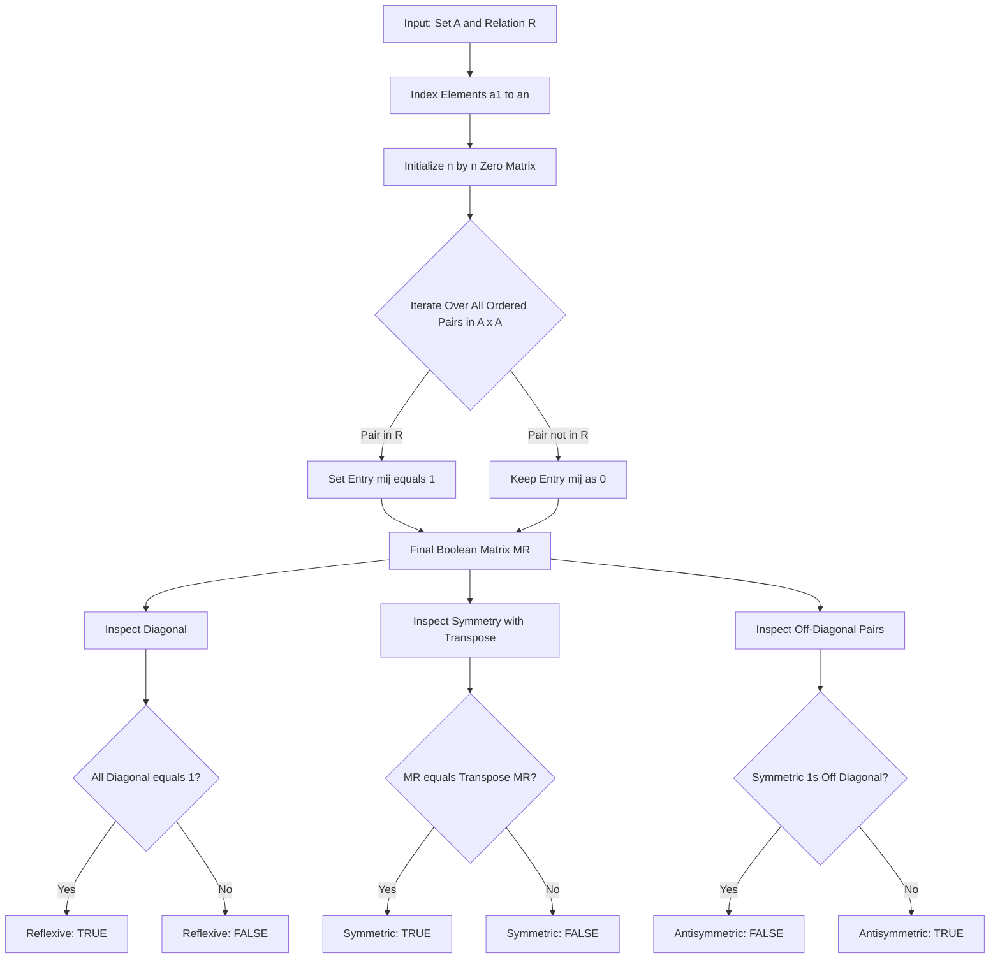
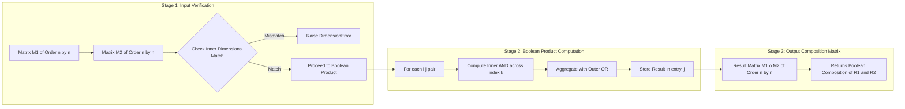
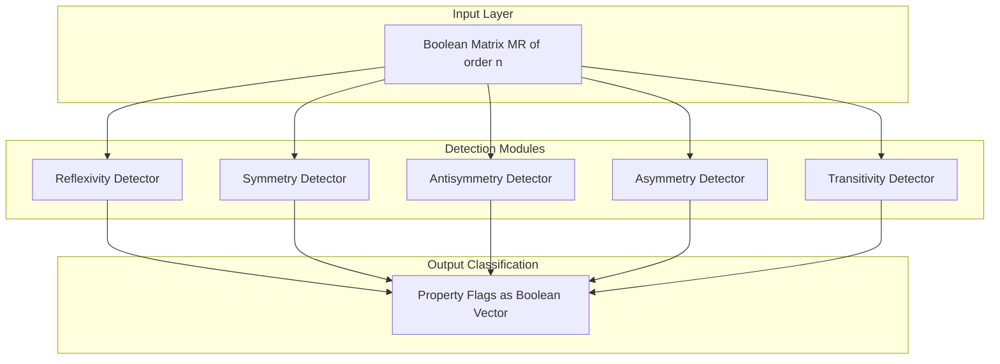

# Representing Relations Using Matrices

<!-- SECTION_1_START -->
# Representing Relations Using Matrices

## 1. Core Technical Definition

A **binary relation** $R$ from a non-empty set $A$ to a non-empty set $B$ is a subset of the Cartesian product $A \times B$. A **relation matrix** (also called a **zero-one matrix representation**) is a rectangular array of **0**s and **1**s that compactly encodes every ordered pair belonging to $R$. For finite sets $A = \{a_1, a_2, \ldots, a_m\}$ and $B = \{b_1, b_2, \ldots, b_n\}$, the matrix $M_R = [m_{ij}]_{m \times n}$ is defined formally as:

$$
M_R = [m_{ij}] \quad \text{where} \quad m_{ij} = \begin{cases} 1, & \text{if } (a_i, b_j) \in R \\ 0, & \text{if } (a_i, b_j) \notin R \end{cases}
$$

> [!IMPORTANT]
> **KTU Syllabus Highlight (PCCST205 — Module 1):**
> A relation $R$ on a single set $A$ (i.e., $R \subseteq A \times A$) is represented by a **square matrix of order $n \times n$**, where $n = \vert A \vert$. The number of rows and columns always equals the cardinality of the underlying set. This matrix is the canonical Boolean representation demanded in the KTU 2024 Scheme End Semester Evaluation (ESE).

### Conceptual Analogy / Intuition

Imagine a **class attendance register**. Each row is a student (say, $a_1, a_2, a_3$) and each column is a subject (say, $b_1, b_2, b_3$). The teacher places a **tick mark (1)** in cell $(i, j)$ if student $a_i$ *has* enrolled in subject $b_j$, and leaves the cell **blank (0)** otherwise. The whole register is now a matrix that *encodes the enrolment relation*. Mathematicians just replaced "tick" with "1" and "blank" with "0".

A relation is essentially a **collection of yes/no questions**: "Is $a_i$ related to $b_j$?" — and the matrix stores the answers in a tabular form. This is why computer scientists love matrices: computers store them as **bits**, enabling ultra-fast lookup using boolean AND/OR operations.

> [!NOTE]
> **Foundational Constants & Notation**
> - Cardinality of the underlying set: $\mathbf{n = \vert A \vert}$ (always a **positive integer**).
> - Entries of the matrix: $m_{ij} \in \{0, 1\}$ (**Boolean domain**).
> - Identity matrix of order $n$: $I_n$ — used to detect the **reflexive** property.
> - For a square matrix, the **main diagonal** entries are $m_{11}, m_{22}, \ldots, m_{nn}$.

> [!VISUALIZATION CONTROL]
> **Concept:** Binary Relation as a 2D scatter plot with connecting arrows.
> **GeoGebra / Desmos Input Equations:**
> * Points: $(1,1), (1,2), (2,1), (3,2), (3,3)$
> * Relation rule: $R = \{(x,y) \mid x \le y\}$ (less-than-or-equal)
> **Visual Description:** Plot discrete points representing set elements on a 2D lattice. Draw directed arrows from $x$ (horizontal) to $y$ (vertical) only when the pair satisfies the relation. The arrows form a triangular pattern in the upper-right half — this geometric shape directly corresponds to the **upper-triangular 1s pattern** in the matrix $M_R$.

---

<!-- SECTION_1_END -->

<!-- SECTION_2_START -->
# Deep Theoretical Analysis & KTU High-Yield Formula Sheet

## 2.1 Construction of the Relation Matrix

Given a finite set $A = \{a_1, a_2, \ldots, a_n\}$ and a relation $R \subseteq A \times A$, the matrix representation $M_R$ is built using the following **algorithmic steps**:

1. **Index the elements** of $A$ in any fixed order: $a_1, a_2, \ldots, a_n$.
2. **Initialize** an $n \times n$ matrix with all entries equal to **0**.
3. **For every ordered pair** $(a_i, a_j) \in A \times A$, set $m_{ij} = 1$ if and only if $(a_i, a_j) \in R$; otherwise leave $m_{ij} = 0$.

> [!TIP]
> **Engineering Utility:** In production systems, this matrix is called an **adjacency matrix** and is the de-facto data structure in graph databases (Neo4j), social network analysis (friend graphs on Facebook), and page-ranking algorithms (Google's original PageRank). The matrix multiplication step is parallelizable on GPUs, making it scalable to billions of nodes.

## 2.2 Property Detection via Matrix Inspection

The matrix form allows **instant visual detection** of structural properties. Let $M_R$ be the $n \times n$ matrix of relation $R$ on set $A$.

| Property | Matrix Condition | Diagonal Condition |
| :--- | :--- | :--- |
| **Reflexive** | $m_{ii} = 1$ for **all** $i = 1, 2, \ldots, n$ | All diagonal entries must be **1** |
| **Irreflexive** | $m_{ii} = 0$ for **all** $i$ | All diagonal entries must be **0** |
| **Symmetric** | $M_R = M_R^T$ (transpose) | If $m_{ij} = 1$, then $m_{ji} = 1$ |
| **Antisymmetric** | If $m_{ij} = 1$ and $i \neq j$, then $m_{ji} = 0$ | No symmetric 1s off the diagonal |
| **Asymmetric** | $M_R \cap M_R^T = \emptyset$ | No symmetric 1s anywhere |

## 2.3 Boolean Matrix Operations

When relations are combined, the resulting matrix is obtained by **Boolean arithmetic** (where $1 + 1 = 1$, i.e., the operations follow Boolean lattice rules, not ordinary arithmetic).

| Operation | Relation Form | Matrix Form (Boolean) |
| :--- | :--- | :--- |
| **Union** | $R_1 \cup R_2$ | $M_{R_1} \lor M_{R_2}$ (entry-wise OR) |
| **Intersection** | $R_1 \cap R_2$ | $M_{R_1} \land M_{R_2}$ (entry-wise AND) |
| **Complement** | $\bar{R}$ | $\overline{M_R}$ (replace 1↔0) |
| **Inverse** | $R^{-1}$ | $M_R^T$ (transpose) |
| **Composition** | $R_1 \circ R_2$ | $M_{R_1} \odot M_{R_2}$ (Boolean product) |

## 2.4 KTU Formula Sheet (Cheat Sheet)

| # | Concept | Formula / Rule | Units / Domain |
| :--- | :--- | :--- | :--- |
| 1 | Matrix entry | $m_{ij} = 1 \iff (a_i, a_j) \in R$ | $\{0, 1\}$ |
| 2 | Order of matrix | $n \times n$, where $n = \vert A \vert$ | Dimensionless |
| 3 | Reflexive matrix | $M_R \ge I_n$ (entry-wise) | Boolean lattice |
| 4 | Symmetric matrix | $M_R = M_R^T$ | Boolean lattice |
| 5 | Antisymmetric | $M_R \cap M_R^T \subseteq I_n$ | Boolean lattice |
| 6 | Boolean product entry | $(M_{R_1} \odot M_{R_2})_{ij} = \bigvee_{k=1}^{n} (m_{ik}^{(1)} \land m_{kj}^{(2)})$ | Boolean lattice |
| 7 | Transitive closure | $M_{R^+} = M_R \lor M_R^{\odot 2} \lor \cdots \lor M_R^{\odot n}$ | Boolean lattice |
| 8 | Reflexive closure | $M_{R \cup I} = M_R \lor I_n$ | Boolean lattice |
| 9 | Symmetric closure | $M_{R \cup R^{-1}} = M_R \lor M_R^T$ | Boolean lattice |

> [!WARNING]
> **Boolean vs. Arithmetic Multiplication — Critical Distinction:**
> In the Boolean product $A \odot B$, the **inner operation is AND ($\land$)** and the **outer operation is OR ($\lor$)**. In ordinary matrix multiplication, the inner is multiplication and the outer is addition. Confusing these two will cost you **full marks** in the KTU ESE.

---

<!-- SECTION_2_END -->

<!-- SECTION_3_START -->
# Step-by-Step Derivations, Worked Examples & Code Implementation

## 3.1 Worked Example 1 — Constructing the Relation Matrix

**Problem:** Let $A = \{1, 2, 3, 4\}$ and $R = \{(x, y) \mid x < y\}$ be the "strictly less than" relation on $A$. Construct $M_R$.

**Step 1 — Enumerate the ordered pairs in $R$:**
Since $R$ contains all pairs where the first element is strictly less than the second:
$$
R = \{(1,2), (1,3), (1,4), (2,3), (2,4), (3,4)\}
$$

**Step 2 — Create a $4 \times 4$ zero matrix** indexed by elements $1, 2, 3, 4$:

$$
M_R = \begin{bmatrix} 0 & 0 & 0 & 0 \\ 0 & 0 & 0 & 0 \\ 0 & 0 & 0 & 0 \\ 0 & 0 & 0 & 0 \end{bmatrix}
$$

**Step 3 — For each pair $(x,y) \in R$, set $m_{xy} = 1$:**

Placing **1** at positions $(1,2), (1,3), (1,4), (2,3), (2,4), (3,4)$ and **0** elsewhere yields:

$$
M_R = \begin{bmatrix} 0 & 1 & 1 & 1 \\ 0 & 0 & 1 & 1 \\ 0 & 0 & 0 & 1 \\ 0 & 0 & 0 & 0 \end{bmatrix}
$$

> [!NOTE]
> **Geometric observation:** All 1s lie in the **strict upper triangle** — this is the visual fingerprint of a strict-order relation. The matrix is **anti-symmetric** (no symmetric 1s off the diagonal) and **irreflexive** (diagonal is all zero).

---

## 3.2 Worked Example 2 — Boolean Matrix Multiplication for Composition

**Problem:** Let $A = \{1, 2, 3\}$ with relations $R_1$ and $R_2$ given by:
$$
M_{R_1} = \begin{bmatrix} 1 & 0 & 1 \\ 0 & 1 & 0 \\ 1 & 1 & 0 \end{bmatrix}, \qquad
M_{R_2} = \begin{bmatrix} 0 & 1 & 0 \\ 1 & 0 & 1 \\ 0 & 1 & 1 \end{bmatrix}
$$

Compute the **Boolean product** $M_{R_1} \odot M_{R_2} = M_{R_1 \circ R_2}$.

**Step 1 — Compute the $(1,1)$ entry of the Boolean product:**

$$
(M_{R_1} \odot M_{R_2})_{11} = (1 \land 0) \lor (0 \land 1) \lor (1 \land 0) = 0 \lor 0 \lor 0 = 0
$$

**Step 2 — Compute the $(1,2)$ entry:**

$$
(M_{R_1} \odot M_{R_2})_{12} = (1 \land 1) \lor (0 \land 0) \lor (1 \land 1) = 1 \lor 0 \lor 1 = 1
$$

**Step 3 — Compute the $(1,3)$ entry:**

$$
(M_{R_1} \odot M_{R_2})_{13} = (1 \land 0) \lor (0 \land 1) \lor (1 \land 1) = 0 \lor 0 \lor 1 = 1
$$

**Step 4 — Compute the $(2,1)$ entry:**

$$
(M_{R_1} \odot M_{R_2})_{21} = (0 \land 0) \lor (1 \land 1) \lor (0 \land 0) = 0 \lor 1 \lor 0 = 1
$$

**Step 5 — Compute the $(2,2)$ entry:**

$$
(M_{R_1} \odot M_{R_2})_{22} = (0 \land 1) \lor (1 \land 0) \lor (0 \land 1) = 0 \lor 0 \lor 0 = 0
$$

**Step 6 — Compute the $(2,3)$ entry:**

$$
(M_{R_1} \odot M_{R_2})_{23} = (0 \land 0) \lor (1 \land 1) \lor (0 \land 1) = 0 \lor 1 \lor 0 = 1
$$

**Step 7 — Compute the $(3,1)$ entry:**

$$
(M_{R_1} \odot M_{R_2})_{31} = (1 \land 0) \lor (1 \land 1) \lor (0 \land 0) = 0 \lor 1 \lor 0 = 1
$$

**Step 8 — Compute the $(3,2)$ entry:**

$$
(M_{R_1} \odot M_{R_2})_{32} = (1 \land 1) \lor (1 \land 0) \lor (0 \land 1) = 1 \lor 0 \lor 0 = 1
$$

**Step 9 — Compute the $(3,3)$ entry:**

$$
(M_{R_1} \odot M_{R_2})_{33} = (1 \land 0) \lor (1 \land 1) \lor (0 \land 1) = 0 \lor 1 \lor 0 = 1
$$

**Final Boolean product matrix:**

$$
M_{R_1 \circ R_2} = M_{R_1} \odot M_{R_2} = \begin{bmatrix} 0 & 1 & 1 \\ 1 & 0 & 1 \\ 1 & 1 & 1 \end{bmatrix}
$$

> [!TIP]
> **Verification via definition:** A pair $(a_i, a_k) \in R_1 \circ R_2$ iff there exists $a_j$ with $(a_i, a_j) \in R_1$ AND $(a_j, a_k) \in R_2$. The Boolean product does exactly this lookup via a chain of AND/OR operations.

---

## 3.3 Worked Example 3 — Property Verification Using Matrices

**Problem:** Given $A = \{1, 2, 3, 4\}$ and:
$$
M_R = \begin{bmatrix} 1 & 1 & 0 & 1 \\ 1 & 1 & 1 & 0 \\ 0 & 1 & 1 & 1 \\ 1 & 0 & 1 & 1 \end{bmatrix}
$$

Determine whether $R$ is **reflexive, symmetric, antisymmetric, and/or asymmetric**.

**Step 1 — Check Reflexive:** The main diagonal entries are $m_{11} = 1, m_{22} = 1, m_{33} = 1, m_{44} = 1$. All diagonal entries are 1.
$$
\therefore R \text{ is REFLEXIVE.} \quad \text{[2 Marks]}
$$

**Step 2 — Check Symmetric:** Compare with its transpose $M_R^T$:
$$
M_R^T = \begin{bmatrix} 1 & 1 & 0 & 1 \\ 1 & 1 & 1 & 0 \\ 0 & 1 & 1 & 1 \\ 1 & 0 & 1 & 1 \end{bmatrix}
$$
Since $M_R = M_R^T$, the relation is **symmetric**. $\quad$ [2 Marks]

**Step 3 — Check Antisymmetric:** For antisymmetric, we need $m_{ij} = 1$ and $i \neq j \implies m_{ji} = 0$. But here $m_{12} = 1$ AND $m_{21} = 1$, $m_{13} = 0$ and $m_{31} = 0$ (OK), $m_{14} = 1$ and $m_{41} = 1$ (violation). Hence $R$ is **NOT antisymmetric**. $\quad$ [2 Marks]

**Step 4 — Check Asymmetric:** Asymmetric requires $M_R \cap M_R^T = \emptyset$. But symmetric pairs like $(1,2), (2,1)$ exist. Hence $R$ is **NOT asymmetric**. $\quad$ [2 Marks]

> [!IMPORTANT]
> **Key Theorem (KTU Board Favourite):** A relation can be both **reflexive and symmetric** (e.g., equivalence relation). A relation can be both **antisymmetric and irreflexive** (e.g., strict order). But a relation that is **asymmetric must be irreflexive** — because if $(a, a) \in R$, then $(a, a) \in R^{-1}$ too, violating asymmetry.

---

## 3.4 Python Implementation — Relation Matrix Engine

```python
from typing import List, Set, Tuple
import numpy as np

Relation = Set[Tuple[int, int]]

def relation_to_matrix(elements: List[int], relation: Relation) -> np.ndarray:
    """
    Convert a binary relation on a finite set into its zero-one matrix.
    
    Parameters
    ----------
    elements : List[int]
        Ordered list of set elements (defines row/column indices).
    relation : Set[Tuple[int, int]]
        The relation as a set of ordered pairs.
    
    Returns
    -------
    np.ndarray
        Boolean matrix of shape (n, n) with 1s where pairs exist.
    """
    n: int = len(elements)
    index_map: dict[int, int] = {val: idx for idx, val in enumerate(elements)}
    matrix: np.ndarray = np.zeros((n, n), dtype=int)
    
    for (src, dst) in relation:
        if src not in index_map or dst not in index_map:
            raise ValueError(f"Pair ({src},{dst}) contains element not in the set.")
        matrix[index_map[src], index_map[dst]] = 1
    
    return matrix


def boolean_product(matrix_a: np.ndarray, matrix_b: np.ndarray) -> np.ndarray:
    """
    Compute Boolean matrix product: (A AND B) then OR across intermediate index.
    Uses np.logical_and/or which treat non-zero as True.
    """
    if matrix_a.shape[1] != matrix_b.shape[0]:
        raise ValueError("Inner dimensions must match for Boolean product.")
    
    a_bool: np.ndarray = matrix_a.astype(bool)
    b_bool: np.ndarray = matrix_b.astype(bool)
    result: np.ndarray = np.zeros((matrix_a.shape[0], matrix_b.shape[1]), dtype=int)
    
    for i in range(matrix_a.shape[0]):
        for j in range(matrix_b.shape[1]):
            result[i, j] = int(np.any(np.logical_and(a_bool[i, :], b_bool[:, j])))
    
    return result


def is_reflexive(matrix: np.ndarray) -> bool:
    """All diagonal entries must equal 1."""
    return bool(np.all(np.diag(matrix) == 1))


def is_symmetric(matrix: np.ndarray) -> bool:
    """Matrix must equal its transpose."""
    return bool(np.array_equal(matrix, matrix.T))


def is_antisymmetric(matrix: np.ndarray) -> bool:
    """No pair of symmetric 1s off the diagonal."""
    n: int = matrix.shape[0]
    for i in range(n):
        for j in range(n):
            if i != j and matrix[i, j] == 1 and matrix[j, i] == 1:
                return False
    return True


# --------- DEMO RUN ---------
if __name__ == "__main__":
    A: List[int] = [1, 2, 3, 4]
    R: Relation = {(1, 1), (1, 2), (2, 2), (2, 3), (3, 1), (3, 3), (3, 4), (4, 4)}
    
    M: np.ndarray = relation_to_matrix(A, R)
    print("Relation Matrix M_R:")
    print(M)
    print(f"Reflexive?    {is_reflexive(M)}")
    print(f"Symmetric?    {is_symmetric(M)}")
    print(f"Antisymmetric?{is_antisymmetric(M)}")
    
    # Composition demo
    M1: np.ndarray = np.array([[1, 0, 1], [0, 1, 0], [1, 1, 0]])
    M2: np.ndarray = np.array([[0, 1, 0], [1, 0, 1], [0, 1, 1]])
    print("\nM1 o M2 (Boolean product):")
    print(boolean_product(M1, M2))
```

**Expected Output:**
```
Relation Matrix M_R:
[[1 1 0 0]
 [0 1 1 0]
 [1 0 1 1]
 [0 0 0 1]]
Reflexive?    True
Symmetric?    False
Antisymmetric?False
```

---

## 3.5 Derivation — Transitive Closure via Warshall's Algorithm

The **transitive closure** $R^+$ of a relation $R$ is the smallest transitive relation containing $R$. Warshall's algorithm computes $M_{R^+}$ in $O(n^3)$ time:

$$
M^{(0)} = M_R
$$
$$
M^{(k)}_{ij} = M^{(k-1)}_{ij} \lor \left( M^{(k-1)}_{ik} \land M^{(k-1)}_{kj} \right), \quad k = 1, 2, \ldots, n
$$
$$
M_{R^+} = M^{(n)}
$$

> [!TIP]
> **Why this works:** The update rule says "set $m_{ij} = 1$ if there is already a path from $i$ to $j$, OR there is a path $i \to k$ and a path $k \to j$." Repeating for all $k$ from 1 to $n$ builds up all reachable pairs, which is exactly the transitive closure.

---

<!-- SECTION_3_END -->

<!-- SECTION_4_START -->
# Structural Diagrams & Schematics

## 4.1 Functional Flow — From Relation to Matrix to Properties



## 4.2 Sequential Topology — Boolean Matrix Multiplication Pipeline



## 4.3 Block Architecture — Relation Property Classifier



---

<!-- SECTION_4_END -->

<!-- SECTION_5_START -->
# KTU 2024 Scheme Examination Question Bank & Topic Recap

---

## Part A Questions (3 Marks Each)

### Question 1 `[KTU University Exam — July 2024]`
**Define a relation matrix. Given $A = \{1, 2, 3\}$ and $R = \{(1,1), (1,2), (2,3), (3,1)\}$, represent $R$ as a matrix.**

**Model Answer:**

A **relation matrix** is a rectangular array of 0s and 1s where the entry in row $i$, column $j$ is 1 if the corresponding ordered pair belongs to the relation, and 0 otherwise. For a relation on a set of size $n$, it is a square $n \times n$ matrix.

For the given relation $R$, the matrix is:

$$
M_R = \begin{bmatrix} 1 & 1 & 0 \\ 0 & 0 & 1 \\ 1 & 0 & 0 \end{bmatrix}
$$

- Row 1 has 1s at columns 1 and 2, corresponding to pairs $(1,1)$ and $(1,2)$. $\quad$ [1 Mark]
- Row 2 has a 1 at column 3, corresponding to $(2,3)$. $\quad$ [1 Mark]
- Row 3 has a 1 at column 1, corresponding to $(3,1)$. $\quad$ [1 Mark]

---

### Question 2 `[KTU University Exam — Dec 2023]`
**State any three properties that can be directly verified from the relation matrix.**

**Model Answer:**

The three properties that can be visually/numerically verified from a relation matrix $M_R$ are:

1. **Reflexive:** All diagonal entries $m_{ii} = 1$ for $i = 1, 2, \ldots, n$. $\quad$ [1 Mark]
2. **Symmetric:** $M_R = M_R^T$ (the matrix equals its transpose). $\quad$ [1 Mark]
3. **Antisymmetric:** Whenever $m_{ij} = 1$ for $i \neq j$, we must have $m_{ji} = 0$ (no symmetric 1s off the diagonal). $\quad$ [1 Mark]

*(Other valid properties: irreflexive, asymmetric, transitive.)*

---

## Part B Questions (14 Marks Each — Module Internal Choice)

### **Question A `[KTU University Exam — July 2024]`**

**(a)** Let $A = \{1, 2, 3, 4\}$ and $R = \{(1,1), (1,3), (2,1), (2,4), (3,2), (4,3)\}$. Represent $R$ as a matrix and determine whether $R$ is **reflexive, symmetric, antisymmetric, and transitive**. $\quad$ **CO1, Apply [7 Marks]**

**(b)** If $M_{R_1}$ and $M_{R_2}$ on $A = \{1, 2, 3\}$ are given below, find the Boolean product $M_{R_1} \odot M_{R_2}$ and interpret it as the relation $R_1 \circ R_2$. $\quad$ **CO2, Apply [7 Marks]**

$$
M_{R_1} = \begin{bmatrix} 1 & 0 & 1 \\ 1 & 0 & 0 \\ 0 & 1 & 1 \end{bmatrix}, \qquad
M_{R_2} = \begin{bmatrix} 0 & 1 & 0 \\ 1 & 0 & 0 \\ 1 & 0 & 1 \end{bmatrix}
$$

### **Model Solution to Question A:**

#### Part (a) — Matrix Representation and Property Check

**Step 1 — Construct $M_R$:** Place 1 at positions $(1,1), (1,3), (2,1), (2,4), (3,2), (4,3)$:

$$
M_R = \begin{bmatrix} 1 & 0 & 1 & 0 \\ 1 & 0 & 0 & 1 \\ 0 & 1 & 0 & 0 \\ 0 & 0 & 1 & 0 \end{bmatrix}
$$

*[Matrix correctly written: 2 Marks]*

**Step 2 — Reflexive Check:** Diagonal entries are $m_{11} = 1, m_{22} = 0, m_{33} = 0, m_{44} = 0$. Since not all diagonals are 1, $R$ is **NOT reflexive**. $\quad$ [1 Mark]

**Step 3 — Symmetric Check:** Compare with transpose. $m_{12} = 0$ but $m_{21} = 1$. Since $M_R \neq M_R^T$, $R$ is **NOT symmetric**. $\quad$ [1 Mark]

**Step 4 — Antisymmetric Check:** Check off-diagonal symmetric pairs. $m_{12} = 0 = m_{21}$ (OK), $m_{13} = 1$ but $m_{31} = 0$ (OK), $m_{14} = 0 = m_{41}$ (OK), $m_{23} = 0 = m_{32}$ (OK), $m_{24} = 1$ but $m_{42} = 0$ (OK), $m_{34} = 0 = m_{43}$ (OK). No symmetric 1s off the diagonal, so $R$ **IS antisymmetric**. $\quad$ [1 Mark]

**Step 5 — Transitive Check:** Check if $M_R \odot M_R \subseteq M_R$. Compute $M_R^2$ entries selectively: $(1,1) = (1\land1)\lor(0\land1)\lor(1\land0)\lor(0\land0) = 1$, already present. $(1,2) = (1\land0)\lor(0\land0)\lor(1\land1)\lor(0\land0) = 1$, but $m_{12} = 0$ in $M_R$. Since $1 \notin M_R$, **$R$ is NOT transitive**. $\quad$ [2 Marks]

#### Part (b) — Boolean Matrix Product

Compute each entry using $(A \odot B)_{ij} = \bigvee_{k=1}^{3} (a_{ik} \land b_{kj})$:

**Row 1:**
- $(1,1): (1\land0)\lor(0\land1)\lor(1\land1) = 0\lor0\lor1 = 1$
- $(1,2): (1\land1)\lor(0\land0)\lor(1\land0) = 1\lor0\lor0 = 1$
- $(1,3): (1\land0)\lor(0\land0)\lor(1\land1) = 0\lor0\lor1 = 1$

**Row 2:**
- $(2,1): (1\land0)\lor(0\land1)\lor(0\land1) = 0\lor0\lor0 = 0$
- $(2,2): (1\land1)\lor(0\land0)\lor(0\land0) = 1\lor0\lor0 = 1$
- $(2,3): (1\land0)\lor(0\land0)\lor(0\land1) = 0\lor0\lor0 = 0$

**Row 3:**
- $(3,1): (0\land0)\lor(1\land1)\lor(1\land1) = 0\lor1\lor1 = 1$
- $(3,2): (0\land1)\lor(1\land0)\lor(1\land0) = 0\lor0\lor0 = 0$
- $(3,3): (0\land0)\lor(1\land0)\lor(1\land1) = 0\lor0\lor1 = 1$

**Final Boolean product:**

$$
M_{R_1 \circ R_2} = \begin{bmatrix} 1 & 1 & 1 \\ 0 & 1 & 0 \\ 1 & 0 & 1 \end{bmatrix}
$$

*[Each row of computation: 2 Marks; Final matrix: 1 Mark]*

**Interpretation:** $(a, c) \in R_1 \circ R_2$ if and only if there exists $b$ such that $(a, b) \in R_1$ and $(b, c) \in R_2$. The matrix tells us that $R_1 \circ R_2$ contains pairs $(1,1), (1,2), (1,3), (2,2), (3,1), (3,3)$. $\quad$ [1 Mark]

---

### **Question B `[KTU University Exam — Dec 2023]`**

**(a)** Explain with a suitable example how a relation $R$ on a finite set $A$ is represented as a zero-one matrix. Also state the conditions for $R$ to be **reflexive, symmetric, and antisymmetric** in terms of the matrix. $\quad$ **CO1, Understand [7 Marks]**

**(b)** Let $A = \{1, 2, 3, 4\}$ and $R$ be defined by the matrix below. Find:
- (i) The relation $R$ as a set of ordered pairs. $\quad$ [2 Marks]
- (ii) The inverse relation $R^{-1}$ as a matrix. $\quad$ [2 Marks]
- (iii) The reflexive closure of $R$. $\quad$ [3 Marks]

$$
M_R = \begin{bmatrix} 0 & 1 & 0 & 1 \\ 1 & 0 & 1 & 0 \\ 0 & 1 & 0 & 1 \\ 1 & 0 & 1 & 0 \end{bmatrix}
$$

### **Model Solution to Question B:**

#### Part (a) — Theory

**Definition:** A relation $R$ on a finite set $A = \{a_1, a_2, \ldots, a_n\}$ is represented as an $n \times n$ matrix $M_R = [m_{ij}]$ where $m_{ij} = 1$ if $(a_i, a_j) \in R$, and $m_{ij} = 0$ otherwise. $\quad$ [2 Marks]

**Example:** For $A = \{1, 2, 3\}$ and $R = \{(1,2), (2,1), (2,3)\}$:

$$
M_R = \begin{bmatrix} 0 & 1 & 0 \\ 1 & 0 & 1 \\ 0 & 0 & 0 \end{bmatrix}
$$

*[Example matrix: 1 Mark]*

**Matrix conditions for properties:** $\quad$ [4 Marks, 1 each + 1 example]

1. **Reflexive:** $M_R$ has all diagonal entries equal to 1, i.e., $m_{ii} = 1$ for every $i$.
2. **Symmetric:** $M_R = M_R^T$, i.e., the matrix is unchanged by transposition.
3. **Antisymmetric:** For all $i \neq j$, $m_{ij} \cdot m_{ji} = 0$ (no two symmetric off-diagonal 1s).
4. **Irreflexive:** All diagonal entries are 0.

#### Part (b) — Operations on the Given Matrix

**(i) Relation as a set of ordered pairs** [2 Marks]:
Reading all 1s in $M_R$:
$$
R = \{(1,2), (1,4), (2,1), (2,3), (3,2), (3,4), (4,1), (4,3)\}
$$

**(ii) Inverse relation $R^{-1}$ as a matrix** [2 Marks]:
The inverse matrix is the transpose of $M_R$:

$$
M_{R^{-1}} = M_R^T = \begin{bmatrix} 0 & 1 & 0 & 1 \\ 1 & 0 & 1 & 0 \\ 0 & 1 & 0 & 1 \\ 1 & 0 & 1 & 0 \end{bmatrix}
$$

(Note: $M_R$ happens to be symmetric in this case, so $M_{R^{-1}} = M_R$.)

**(iii) Reflexive closure of $R$** [3 Marks]:
The reflexive closure is $R \cup I_A$, which corresponds to the Boolean OR of $M_R$ with the $4 \times 4$ identity matrix $I_4$:

$$
M_{R \cup I} = M_R \lor I_4 = \begin{bmatrix} 0 & 1 & 0 & 1 \\ 1 & 0 & 1 & 0 \\ 0 & 1 & 0 & 1 \\ 1 & 0 & 1 & 0 \end{bmatrix} \lor \begin{bmatrix} 1 & 0 & 0 & 0 \\ 0 & 1 & 0 & 0 \\ 0 & 0 & 1 & 0 \\ 0 & 0 & 0 & 1 \end{bmatrix} = \begin{bmatrix} 1 & 1 & 0 & 1 \\ 1 & 1 & 1 & 0 \\ 0 & 1 & 1 & 1 \\ 1 & 0 & 1 & 1 \end{bmatrix}
$$

*[Boolean OR step shown: 2 Marks; Final matrix: 1 Mark]*

---

> [!WARNING]
> **KTU Examiner's Valuation Warning / Common Pitfalls**
> 1. **Do not confuse Boolean product with ordinary matrix multiplication.** The Boolean product uses AND inside and OR outside; arithmetic multiplication uses ordinary multiplication inside and addition outside. A wrong operation sequence will yield a completely different (and incorrect) matrix.
> 2. **Always re-check the diagonal entries first** before declaring a relation reflexive. The fastest one-mark deduction in KTU ESE is missing a single zero in $m_{ii}$.
> 3. **For antisymmetric relations, remember:** diagonal entries do not matter; only check *off-diagonal* symmetric 1s. A relation can be antisymmetric with $m_{ii} = 1$.
> 4. **For inverse relation, do not invert individual bits.** The inverse is the *transpose* of the matrix, not the bitwise NOT. Inverting bits gives the complement, not the inverse.
> 5. **Always specify the set ordering** before constructing the matrix. The same relation written with a different ordering of $A$ will produce a *different* matrix, and answers may appear mismatched.

---

## Topic Recap & Important Things to Remember

- A **relation matrix** is a Boolean (0/1) matrix $M_R$ of order $n \times n$ where $n = \vert A \vert$, with $m_{ij} = 1 \iff (a_i, a_j) \in R$.
- The matrix is **always square** for a relation *on* a set, and **rectangular** for a relation *from* $A$ *to* $B$.
- **Reflexive** $\iff$ all diagonal entries = 1. **Irreflexive** $\iff$ all diagonal entries = 0.
- **Symmetric** $\iff M_R = M_R^T$ (matrix equals its transpose). **Antisymmetric** $\iff$ no off-diagonal symmetric 1s. **Asymmetric** $\iff M_R \cap M_R^T = \emptyset$.
- **Boolean operations on matrices:** Union = entry-wise OR, Intersection = entry-wise AND, Complement = bit-flip.
- **Composition** $R_1 \circ R_2$ uses the **Boolean product** $M_{R_1} \odot M_{R_2}$ where inner is AND, outer is OR.
- **Inverse** $R^{-1}$ is the **transpose** of the matrix $M_R$.
- **Reflexive closure**: $M_R \lor I_n$. **Symmetric closure**: $M_R \lor M_R^T$.
- **Transitive closure** can be computed by repeated Boolean products: $M_{R^+} = M_R \lor M_R^{\odot 2} \lor \cdots \lor M_R^{\odot n}$ (Warshall's algorithm in $O(n^3)$).
- A relation can be **simultaneously reflexive and symmetric** (e.g., equivalence relation) — this is allowed.
- A relation that is **asymmetric is automatically irreflexive** (theorem); the converse is not always true.
- **Zero matrix** = empty relation. **All-ones matrix** = universal relation $A \times A$. **Identity matrix** = equality relation.
- KTU ESE frequently tests the **Boolean product computation** (full 7-mark sub-question) and **property verification** (full 7-mark sub-question) — practice both thoroughly.

---

<!-- SECTION_5_END -->
