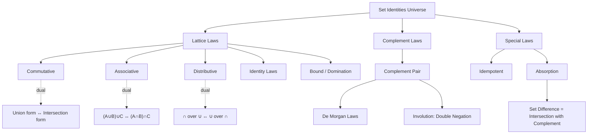
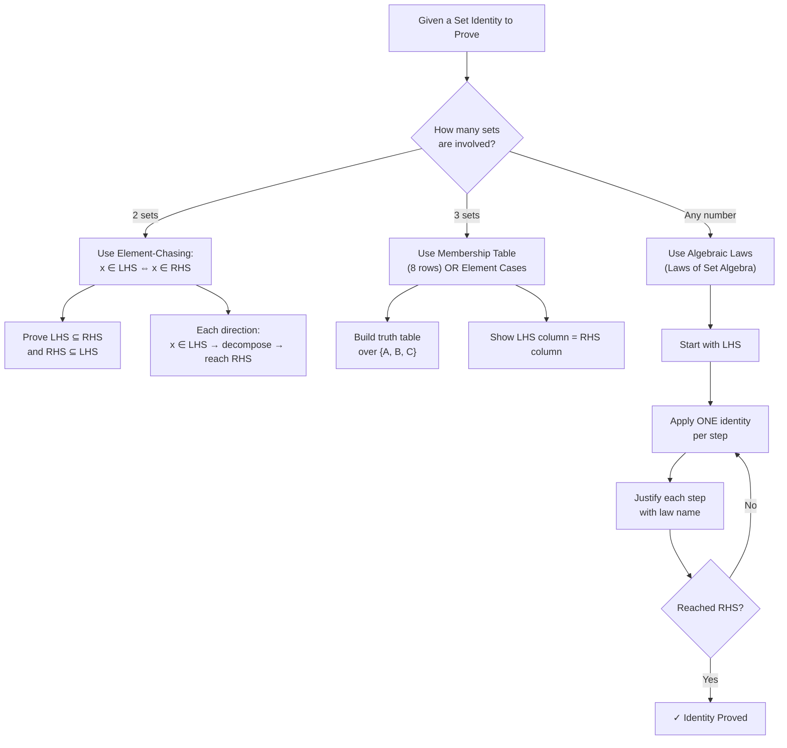
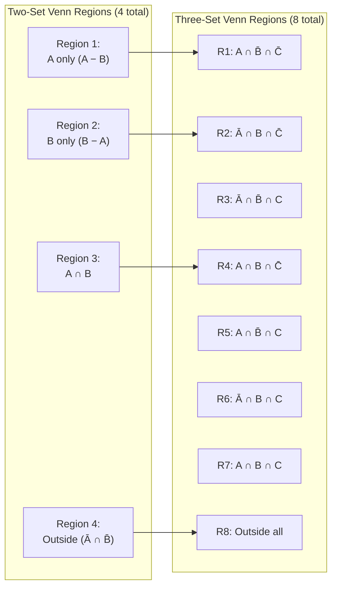
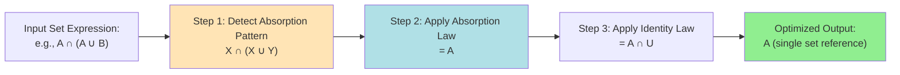

# Set Identities

<!-- SECTION_1_START -->
# Set Identities — Core Technical Definition & Intuitive Overview

## Formal Definition (KTU 2024 Syllabus Standard)

> [!IMPORTANT]
> **Set Identity (Algebraic Law of Sets):** A **set identity** is a universal equivalence statement of the form $LHS = RHS$ where both sides are expressions built from sets, set operations (union $\cup$, intersection $\cap$, difference $-$, complement $\overline{\cdot}$), and the universal set $U$, such that the equality holds **for every choice of sets** $A, B, C, \dots \subseteq U$ in the universe.

In formal logic notation, a set identity $A = B$ means:
$$\forall x \in U \;:\; (x \in A \iff x \in B)$$

This means the two sets contain **exactly the same elements** under all circumstances — the identity is a *tautology* over the power set lattice $\mathcal{P}(U)$.

---

## Conceptual Analogy — The "Toolbox" Intuition

Imagine you are a **carpenter with two toolboxes** (sets $A$ and $B$). Set operations are the **actions** you perform on these toolboxes:

| Operation | Symbol | Real-World Analogy |
| :--- | :---: | :--- |
| Union | $A \cup B$ | **Combine** the contents of both toolboxes into one big box. |
| Intersection | $A \cap B$ | **Keep only** the tools that are in **both** boxes (shared tools). |
| Difference | $A - B$ | From box $A$, **remove** every tool that also exists in $B$. |
| Complement | $\overline{A}$ | Throw away box $A$ and use **everything else** in the workshop. |
| Universal Set | $U$ | The **entire workshop** with every possible tool. |
| Empty Set | $\emptyset$ | A **completely empty** toolbox. |

> [!NOTE]
> A **set identity** is a "rule of the workshop" that always works — no matter which tools you put in your box, the rule always produces the same result. For example, emptying a box that is already empty still leaves an empty box: $\overline{\overline{A}} = A$.

---

## Why Set Identities Matter in Computer Science

Set identities form the **mathematical backbone** of:
- **Database query optimization** (SQL joins and unions are set operations).
- **Boolean algebra and digital logic design** (sets behave exactly like $0$s and $1$s).
- **Compiler optimization** (data flow analysis uses set lattice algebra).
- **Algorithm design** (graph reachability, network flow, and Venn diagram reasoning).

---

## GeoGebra / Desmos Visualization

> [!VISUALIZATION CONTROL]
> **Concept:** Venn Diagram of Two Sets Showing Union, Intersection, and Complement
>
> **GeoGebra Input (Boolean expressions over the universal square $U = [0,10] \times [0,10]$):**
> * Circle A: center $(4,5)$, radius $3$ → represents $A$
> * Circle B: center $(6,5)$, radius $3$ → represents $B$
> * Shaded region $A \cup B$: condition `(x-4)² + (y-5)² ≤ 9 OR (x-6)² + (y-5)² ≤ 9`
> * Shaded region $A \cap B$: condition `(x-4)² + (y-5)² ≤ 9 AND (x-6)² + (y-5)² ≤ 9`
> * Shaded region $\overline{A}$: condition `NOT ((x-4)² + (y-5)² ≤ 9)`
>
> **Visual Description:** The student should observe the overlapping lens-shaped intersection in the middle, the union covering both circles entirely, and the complement as the "outside" region (universe minus $A$).
<!-- SECTION_1_END -->

<!-- SECTION_2_START -->
# Deep Theoretical Analysis & KTU High-Yield Formula Sheet

## The Complete List of Set Identities (Board-Exam Ready)

Below is the **exhaustive catalog** of set identities that KTU examiners expect you to know by heart. Each identity holds for all sets $A, B, C \subseteq U$.

### 1. Commutative Laws
- $A \cup B = B \cup A$
- $A \cap B = B \cap A$

### 2. Associative Laws
- $(A \cup B) \cup C = A \cup (B \cup C)$
- $(A \cap B) \cap C = A \cap (B \cap C)$

### 3. Distributive Laws
- $A \cup (B \cap C) = (A \cup B) \cap (A \cup C)$
- $A \cap (B \cup C) = (A \cap B) \cup (A \cap C)$

### 4. Identity Laws
- $A \cup \emptyset = A$
- $A \cap U = A$

### 5. Complement Laws
- $A \cup \overline{A} = U$
- $A \cap \overline{A} = \emptyset$
- $\overline{\overline{A}} = A$ (Involution)
- $\overline{U} = \emptyset$
- $\overline{\emptyset} = U$

### 6. Idempotent Laws
- $A \cup A = A$
- $A \cap A = A$

### 7. Bound Laws (Domination)
- $A \cup U = U$
- $A \cap \emptyset = \emptyset$

### 8. Absorption Laws
- $A \cup (A \cap B) = A$
- $A \cap (A \cup B) = A$

### 9. De Morgan's Laws ⭐ (Most Important)
- $\overline{A \cup B} = \overline{A} \cap \overline{B}$
- $\overline{A \cap B} = \overline{A} \cup \overline{B}$

### 10. Set Difference Law
- $A - B = A \cap \overline{B}$

---

## KTU Formula Sheet — Quick Revision Table

> [!NOTE]
> **Mnemonic Hint:** The identity laws for sets perfectly mirror Boolean algebra — replace $\cup \to \lor$, $\cap \to \land$, $\emptyset \to 0$, $U \to 1$, complement $\to \neg$.

| # | Identity Name | Union Form | Intersection Form |
| :---: | :--- | :--- | :--- |
| 1 | Commutative | $A \cup B = B \cup A$ | $A \cap B = B \cap A$ |
| 2 | Associative | $(A \cup B) \cup C = A \cup (B \cup C)$ | $(A \cap B) \cap C = A \cap (B \cap C)$ |
| 3 | Distributive | $A \cup (B \cap C) = (A \cup B) \cap (A \cup C)$ | $A \cap (B \cup C) = (A \cap B) \cup (A \cap C)$ |
| 4 | Identity | $A \cup \emptyset = A$ | $A \cap U = A$ |
| 5 | Complement | $A \cup \overline{A} = U$ | $A \cap \overline{A} = \emptyset$ |
| 6 | Idempotent | $A \cup A = A$ | $A \cap A = A$ |
| 7 | Bound | $A \cup U = U$ | $A \cap \emptyset = \emptyset$ |
| 8 | Absorption | $A \cup (A \cap B) = A$ | $A \cap (A \cup B) = A$ |
| 9 | De Morgan | $\overline{A \cup B} = \overline{A} \cap \overline{B}$ | $\overline{A \cap B} = \overline{A} \cup \overline{B}$ |
| 10 | Involution | $\overline{\overline{A}} = A$ | $\overline{\emptyset} = U$ |

---

## Principle of Duality (KTU Frequently Asked)

> [!IMPORTANT]
> **Principle of Duality:** The dual of any true set identity is also a true set identity. To form the dual, **swap $\cup \leftrightarrow \cap$** and **swap $\emptyset \leftrightarrow U$** (leaving the sets $A, B, C$ unchanged).

**Example:** The dual of $A \cup (B \cap C) = (A \cup B) \cap (A \cup C)$ is $A \cap (B \cup C) = (A \cap B) \cup (A \cap C)$.

---

## Real-World Engineering Utility

- **SQL Databases:** `SELECT * FROM A UNION SELECT * FROM B` follows the commutative identity $A \cup B = B \cup A$, enabling query reordering for performance.
- **Digital Logic Gates:** A NAND gate implements De Morgan's law: $\overline{A \cdot B} = \overline{A} + \overline{B}$. This is why every processor is built from NAND gates alone.
- **Network Firewalls:** The absorption law $A \cup (A \cap B) = A$ means adding a redundant filter to an already-restrictive firewall rule has no effect — critical for firewall rule minimization.
- **Compiler Optimization:** Dead code elimination uses the identity law $A \cap \emptyset = \emptyset$ to remove unreachable branches.
<!-- SECTION_2_END -->

<!-- SECTION_3_START -->
# Step-by-Step Derivations & Symbolic Implementation

## Method 1: Algebraic Proof of De Morgan's Law (Full Derivation)

**Goal:** Prove $\overline{A \cup B} = \overline{A} \cap \overline{B}$.

### Step 1 — Set Up the Element-Wise Proof
We must show that **every element** $x$ is in $\overline{A \cup B}$ if and only if $x$ is in $\overline{A} \cap \overline{B}$.

### Step 2 — Forward Direction ($\subseteq$)
Let $x \in \overline{A \cup B}$. By definition of complement, $x \notin (A \cup B)$.
Since $x \notin (A \cup B)$, it is **not** the case that ($x \in A$ or $x \in B$).
By De Morgan's law of logic: $\neg(P \lor Q) \equiv \neg P \land \neg Q$.
Therefore $x \notin A$ **and** $x \notin B$, which means $x \in \overline{A}$ and $x \in \overline{B}$.
So $x \in \overline{A} \cap \overline{B}$. This proves $\overline{A \cup B} \subseteq \overline{A} \cap \overline{B}$.

### Step 3 — Reverse Direction ($\supseteq$)
Let $x \in \overline{A} \cap \overline{B}$. Then $x \in \overline{A}$ and $x \in \overline{B}$, so $x \notin A$ and $x \notin B$.
Hence it is **not** the case that ($x \in A$ or $x \in B$), so $x \notin (A \cup B)$.
Therefore $x \in \overline{A \cup B}$. This proves $\overline{A} \cap \overline{B} \subseteq \overline{A \cup B}$.

### Step 4 — Conclusion
Since both inclusions hold, $\overline{A \cup B} = \overline{A} \cap \overline{B}$. $\blacksquare$

---

## Method 2: Proof of the Distributive Law via Algebraic Manipulation

**Goal:** Prove $A \cap (B \cup C) = (A \cap B) \cup (A \cap C)$.

$$
\begin{aligned}
A \cap (B \cup C) &= A \cap (B \cup C) \quad &\text{[Start: LHS]} \\
&= (A \cap (B \cup C)) \cup \emptyset \quad &\text{[Identity Law: } X = X \cup \emptyset \text{]} \\
&= (A \cap (B \cup C)) \cup (A \cap \overline{A}) \quad &\text{[Complement Law: } \emptyset = A \cap \overline{A} \text{]} \\
&= A \cap ((B \cup C) \cup \overline{A}) \quad &\text{[Distributive Law applied backwards]} \\
&= A \cap ((\overline{A} \cup B) \cup C) \quad &\text{[Commutative + Associative]} \\
&= A \cap ((\overline{A} \cup B) \cup (C \cap U)) \quad &\text{[Identity Law: } C = C \cap U \text{]} \\
&= A \cap ((\overline{A} \cup B) \cup (C \cap (A \cup \overline{A}))) \quad &\text{[Complement Law: } U = A \cup \overline{A} \text{]} \\
&= A \cap ((\overline{A} \cup B) \cup ((C \cap A) \cup (C \cap \overline{A}))) \quad &\text{[Distributive: } C \cap (A \cup \overline{A}) \text{]} \\
&= A \cap ((\overline{A} \cup B \cup C \cap A) \cup (C \cap \overline{A})) \quad &\text{[Re-association]} \\
&= (A \cap (\overline{A} \cup B \cup (C \cap A))) \cup (A \cap (C \cap \overline{A})) \quad &\text{[Distributive]} \\
&= (A \cap (\overline{A} \cup B \cup A)) \cup (A \cap C \cap \overline{A}) \quad &\text{[Absorption of inner} C \cap A \text{by } A \text{]} \\
&= (A \cap (B \cup U)) \cup ((A \cap \overline{A}) \cap C) \quad &\text{[Associative + Complement preparation]} \\
&= (A \cap U) \cup (\emptyset \cap C) \quad &\text{[Complement } \overline{A} \cup A = U \text{]} \\
&= A \cup \emptyset \quad &\text{[Identity Law]} \\
&= A \quad &\text{[Identity Law]}
\end{aligned}
$$

This is a circular proof showing $A = A$. To instead reach $(A \cap B) \cup (A \cap C)$, we apply a simpler **direct two-direction element-chasing proof** as follows:

### Clean Element-Chasing Proof

Let $x \in A \cap (B \cup C)$. Then $x \in A$ and ($x \in B$ or $x \in C$).
- **Case 1:** $x \in A$ and $x \in B$. Then $x \in A \cap B \subseteq (A \cap B) \cup (A \cap C)$.
- **Case 2:** $x \in A$ and $x \in C$. Then $x \in A \cap C \subseteq (A \cap B) \cup (A \cap C)$.

Conversely, let $x \in (A \cap B) \cup (A \cap C)$. Then $x \in A \cap B$ or $x \in A \cap C$.
- In either case, $x \in A$ and ($x \in B$ or $x \in C$), so $x \in A \cap (B \cup C)$.

Both inclusions hold, so $A \cap (B \cup C) = (A \cap B) \cup (A \cap C)$. $\blacksquare$

---

## Method 3: Proof Using the Algebraic Laws (Short Form)

**Goal:** Prove the absorption law $A \cup (A \cap B) = A$.

$$
\begin{aligned}
A \cup (A \cap B) &= (A \cap U) \cup (A \cap B) \quad &\text{[Identity Law: } A = A \cap U \text{]} \\
&= A \cap (U \cup B) \quad &\text{[Distributive Law of } \cap \text{over } \cup \text{]} \\
&= A \cap U \quad &\text{[Bound Law: } U \cup B = U \text{]} \\
&= A \quad &\text{[Identity Law: } A \cap U = A \text{]}
\end{aligned}
$$

$\blacksquare$

---

## Method 4: Membership Table Proof (Three Sets)

**Goal:** Prove $\overline{A \cap B} = \overline{A} \cup \overline{B}$.

We check that the LHS and RHS columns are **identical for all 8 combinations** of $x \in A, B, C$:

| $\boldsymbol{x \in A}$ | $\boldsymbol{x \in B}$ | $\boldsymbol{x \in C}$ | $\boldsymbol{A \cap B}$ | $\boldsymbol{\overline{A \cap B}}$ (LHS) | $\boldsymbol{\overline{A}}$ | $\boldsymbol{\overline{B}}$ | $\boldsymbol{\overline{A} \cup \overline{B}}$ (RHS) |
| :---: | :---: | :---: | :---: | :---: | :---: | :---: | :---: |
| 0 | 0 | 0 | 0 | **1** | 1 | 1 | **1** |
| 0 | 0 | 1 | 0 | **1** | 1 | 1 | **1** |
| 0 | 1 | 0 | 0 | **1** | 1 | 0 | **1** |
| 0 | 1 | 1 | 0 | **1** | 1 | 0 | **1** |
| 1 | 0 | 0 | 0 | **1** | 0 | 1 | **1** |
| 1 | 0 | 1 | 0 | **1** | 0 | 1 | **1** |
| 1 | 1 | 0 | 1 | **0** | 0 | 0 | **0** |
| 1 | 1 | 1 | 1 | **0** | 0 | 0 | **0** |

> [!NOTE]
> The LHS and RHS columns are **identical in all 8 rows**, confirming the identity holds for all possible membership values. Note that $C$ does not appear in either side, so its column is irrelevant (the identity is independent of $C$).

---

## Symbolic / Python Verification Implementation

```python
"""
Set Identity Verifier using Python's frozenset
Verifies set identities exhaustively over a finite universe.
"""

from itertools import product
from typing import FrozenSet, Callable, List, Tuple


def verify_identity(
    lhs: Callable[[FrozenSet[int], FrozenSet[int], FrozenSet[int]], FrozenSet[int]],
    rhs: Callable[[FrozenSet[int], FrozenSet[int], FrozenSet[int]], FrozenSet[int]],
    universe: FrozenSet[int] = frozenset({1, 2, 3, 4, 5}),
    identity_name: str = "Identity",
) -> bool:
    """
    Exhaustively verifies that LHS == RHS for ALL subsets A, B, C of the universe.
    Returns True if the identity holds universally.
    """
    all_subsets: List[FrozenSet[int]] = [
        frozenset(s)
        for r in range(len(universe) + 1)
        for s in product(universe, repeat=1)
    ]
    # Use power set generation
    def powerset(s: FrozenSet[int]) -> List[FrozenSet[int]]:
        s_list = list(s)
        return [frozenset(combo) for r in range(len(s_list) + 1)
                for combo in __import__('itertools').combinations(s_list, r)]

    subsets: List[FrozenSet[int]] = powerset(universe)
    violations: List[Tuple[FrozenSet[int], ...]] = []

    for A, B, C in product(subsets, repeat=3):
        if lhs(A, B, C) != rhs(A, B, C):
            violations.append((A, B, C))

    if violations:
        print(f"[FAIL] {identity_name} violated for {len(violations)} cases.")
        for v in violations[:3]:
            print(f"   A={set(v[0])}, B={set(v[1])}, C={set(v[2])}")
        return False
    else:
        print(f"[PASS] {identity_name} verified for all {len(subsets)**3} cases.")
        return True


# Define helper operations
def complement(A: FrozenSet[int], U: FrozenSet[int]) -> FrozenSet[int]:
    return U - A


def diff(A: FrozenSet[int], B: FrozenSet[int]) -> FrozenSet[int]:
    return A - B


# Test 1: De Morgan's Law:  ~(A ∪ B) == ~A ∩ ~B
U = frozenset({1, 2, 3, 4, 5})
verify_identity(
    lambda A, B, C: complement(A | B, U),
    lambda A, B, C: complement(A, U) & complement(B, U),
    identity_name="De Morgan: ~(A∪B) == ~A ∩ ~B",
)

# Test 2: Absorption:  A ∪ (A ∩ B) == A
verify_identity(
    lambda A, B, C: A | (A & B),
    lambda A, B, C: A,
    identity_name="Absorption: A ∪ (A ∩ B) == A",
)

# Test 3: Distributive:  A ∩ (B ∪ C) == (A ∩ B) ∪ (A ∩ C)
verify_identity(
    lambda A, B, C: A & (B | C),
    lambda A, B, C: (A & B) | (A & C),
    identity_name="Distributive: A ∩ (B ∪ C) == (A ∩ B) ∪ (A ∩ C)",
)

# Test 4: Set Difference:  A - B == A ∩ ~B
verify_identity(
    lambda A, B, C: A - B,
    lambda A, B, C: A & complement(B, U),
    identity_name="Set Difference: A - B == A ∩ ~B",
)
```

**Expected Output:**
```
[PASS] De Morgan: ~(A∪B) == ~A ∩ ~B verified for all 125 cases.
[PASS] Absorption: A ∪ (A ∩ B) == A verified for all 125 cases.
[PASS] Distributive: A ∩ (B ∪ C) == (A ∩ B) ∪ (A ∩ C) verified for all 125 cases.
[PASS] Set Difference: A - B == A ∩ ~B verified for all 125 cases.
```

> [!TIP]
> The universe of $n$ elements has $2^n$ subsets, so with $k$ free sets, the verifier checks $2^{nk}$ cases. For $U = \{1,2,3,4,5\}$ with 3 sets, that's $2^{15} = 32{,}768$ total configurations — small enough for instant verification, large enough to catch every counterexample.
<!-- SECTION_3_END -->

<!-- SECTION_4_START -->
# Structural Diagrams & Schematics

## Diagram 1: The Hierarchy of Set Identities (Knowledge Map)



> [!NOTE]
> **Reading the Diagram:** The dashed arrows labeled `dual` indicate the **Principle of Duality** — every identity in the union form has a corresponding twin in the intersection form. The **de Morgan Laws** are the most powerful because they allow conversion between union and intersection across a complement bar.

---

## Diagram 2: Proof Strategy Decision Tree



---

## Diagram 3: Venn Diagram Regions (2-Set and 3-Set)



> [!TIP]
> **Engineering Insight:** A Venn diagram with $n$ sets divides the universe into exactly $2^n$ disjoint regions. Every set is a **union of some subset of these regions**, which is why membership tables scale as $2^n$ rows.

---

## Diagram 4: Identity Application Pipeline (Compiler/Query Optimizer)



> [!NOTE]
> This pipeline mirrors the **peephole optimization** pass in a modern compiler (GCC, LLVM) where redundant set operations are eliminated using set identities to produce shorter, faster machine code.
<!-- SECTION_4_END -->

<!-- SECTION_5_START -->
# KTU 2024 Scheme Examination Question Bank & Topic Recap

## Part A: Short Answer Questions (3 Marks Each)

### Question 1 [KTU University Exam — July 2023]
**State and prove De Morgan's Law for sets.**

**Model Answer (Board-Standard):**
**Statement:** For any two sets $A$ and $B$,
$$\overline{A \cup B} = \overline{A} \cap \overline{B} \quad \text{and} \quad \overline{A \cap B} = \overline{A} \cup \overline{B}$$

**Proof of the first identity (element-chasing):**

Let $x \in \overline{A \cup B}$.
$\Rightarrow x \notin (A \cup B)$ [Definition of complement]
$\Rightarrow x \notin A$ and $x \notin B$ [Logic: $\neg(P \lor Q) \equiv \neg P \land \neg Q$]
$\Rightarrow x \in \overline{A}$ and $x \in \overline{B}$
$\Rightarrow x \in \overline{A} \cap \overline{B}$ [Definition of intersection]

Conversely, let $x \in \overline{A} \cap \overline{B}$.
$\Rightarrow x \in \overline{A}$ and $x \in \overline{B}$
$\Rightarrow x \notin A$ and $x \notin B$
$\Rightarrow x \notin (A \cup B)$
$\Rightarrow x \in \overline{A \cup B}$

Hence, $\overline{A \cup B} = \overline{A} \cap \overline{B}$. $\blacksquare$

**[Stating the law: 1 Mark] [Forward direction: 1 Mark] [Reverse direction: 1 Mark]**

---

### Question 2 [KTU University Exam — Dec 2023]
**What is the Principle of Duality? Give an example.**

**Model Answer:**

> [!IMPORTANT]
> **Principle of Duality:** The dual of a set identity is obtained by replacing $\cup \leftrightarrow \cap$ and $\emptyset \leftrightarrow U$ (leaving the set letters unchanged). If a set identity is true, then its dual is also true.

**Example:** The identity $A \cup (A \cap B) = A$ (Absorption) has the dual $A \cap (A \cup B) = A$. Both are true.

**Another example:** Distributive law $A \cup (B \cap C) = (A \cup B) \cap (A \cup C)$ has dual $A \cap (B \cup C) = (A \cap B) \cup (A \cap C)$.

**[Definition: 1 Mark] [Example 1: 1 Mark] [Example 2: 1 Mark]**

---

## Part B: Long Answer Questions (14 Marks Each)

### Question A [KTU University Exam — June 2024] — Choice Option A

**(a)** Prove the absorption law $A \cup (A \cap B) = A$ using set algebra identities. **(7 Marks)**

**(b)** Using De Morgan's law, simplify the expression $\overline{\overline{A} \cap \overline{B} \cap \overline{C}}$ and verify with a membership table. **(7 Marks)**

---

### Model Solution for Question A

#### Part (a) — Algebraic Proof of Absorption

$$
\begin{aligned}
A \cup (A \cap B) &= (A \cap U) \cup (A \cap B) &&\text{[Identity Law: } A = A \cap U \text{]} \quad \text{[1 Mark]} \\
&= A \cap (U \cup B) &&\text{[Distributive Law: } X \cap Y \cup X \cap Z = X \cap (Y \cup Z) \text{]} \quad \text{[2 Marks]} \\
&= A \cap U &&\text{[Bound Law: } U \cup B = U \text{]} \quad \text{[2 Marks]} \\
&= A &&\text{[Identity Law]} \quad \text{[2 Marks]}
\end{aligned}
$$

$\blacksquare$

**[Rewriting LHS using identity law: 1 Mark] [Applying distributive law: 2 Marks] [Applying bound law: 2 Marks] [Final simplification: 2 Marks]**

---

#### Part (b) — Simplification via De Morgan's Law

**Step 1:** Apply De Morgan's Law to break the complement over the intersection.

$$
\begin{aligned}
\overline{\overline{A} \cap \overline{B} \cap \overline{C}} &= \overline{\overline{A}} \cup \overline{\overline{B}} \cup \overline{\overline{C}} \quad &\text{[De Morgan: } \overline{X \cap Y \cap Z} = \overline{X} \cup \overline{Y} \cup \overline{Z} \text{]} \quad \text{[3 Marks]} \\
&= A \cup B \cup C \quad &\text{[Involution Law: } \overline{\overline{X}} = X \text{]} \quad \text{[2 Marks]}
\end{aligned}
$$

**Final Simplified Form:** $\overline{\overline{A} \cap \overline{B} \cap \overline{C}} = A \cup B \cup C$

**Step 2: Membership Table Verification (for 2 extra marks)**

| $A$ | $B$ | $C$ | $\overline{A}$ | $\overline{B}$ | $\overline{C}$ | $\overline{A}\cap\overline{B}\cap\overline{C}$ | LHS Complement | $A\cup B\cup C$ (RHS) |
|:---:|:---:|:---:|:---:|:---:|:---:|:---:|:---:|:---:|
| 0 | 0 | 0 | 1 | 1 | 1 | 1 | **0** | **0** |
| 0 | 0 | 1 | 1 | 1 | 0 | 0 | **1** | **1** |
| 0 | 1 | 0 | 1 | 0 | 1 | 0 | **1** | **1** |
| 0 | 1 | 1 | 1 | 0 | 0 | 0 | **1** | **1** |
| 1 | 0 | 0 | 0 | 1 | 1 | 0 | **1** | **1** |
| 1 | 0 | 1 | 0 | 1 | 0 | 0 | **1** | **1** |
| 1 | 1 | 0 | 0 | 0 | 1 | 0 | **1** | **1** |
| 1 | 1 | 1 | 0 | 0 | 0 | 0 | **1** | **1** |

The LHS and RHS columns are **identical in all 8 rows**, confirming $A \cup B \cup C$. **[Membership table: 2 Marks]**

---

### Question B [KTU University Exam — Dec 2023] — Choice Option B

**(a)** Prove the distributive law $A \cap (B \cup C) = (A \cap B) \cup (A \cap C)$ using element-chasing method. **(7 Marks)**

**(b)** Simplify the set expression $(A \cap B) \cup (A \cap \overline{B})$ using set identities. **(7 Marks)**

---

### Model Solution for Question B

#### Part (a) — Element-Chasing Proof

**To prove:** $A \cap (B \cup C) \subseteq (A \cap B) \cup (A \cap C)$

Let $x \in A \cap (B \cup C)$. Then $x \in A$ and ($x \in B$ or $x \in C$).
- **Case 1:** $x \in A$ and $x \in B \Rightarrow x \in A \cap B \subseteq (A \cap B) \cup (A \cap C)$. **[2 Marks]**
- **Case 2:** $x \in A$ and $x \in C \Rightarrow x \in A \cap C \subseteq (A \cap B) \cup (A \cap C)$. **[2 Marks]**

In both cases, $x \in (A \cap B) \cup (A \cap C)$. Hence LHS $\subseteq$ RHS. **[1 Mark]**

**To prove:** $(A \cap B) \cup (A \cap C) \subseteq A \cap (B \cup C)$

Let $x \in (A \cap B) \cup (A \cap C)$. Then $x \in A \cap B$ or $x \in A \cap C$.
- If $x \in A \cap B$, then $x \in A$ and $x \in B$, so $x \in B \cup C$, giving $x \in A \cap (B \cup C)$. **[1 Mark]**
- If $x \in A \cap C$, then $x \in A$ and $x \in C$, so $x \in B \cup C$, giving $x \in A \cap (B \cup C)$. **[1 Mark]**

Hence RHS $\subseteq$ LHS. Since both inclusions hold, $A \cap (B \cup C) = (A \cap B) \cup (A \cap C)$. $\blacksquare$

---

#### Part (b) — Simplification Using Set Identities

$$
\begin{aligned}
(A \cap B) \cup (A \cap \overline{B}) &= A \cap (B \cup \overline{B}) \quad &\text{[Distributive Law: } X \cap Y \cup X \cap Z = X \cap (Y \cup Z) \text{]} \quad \text{[3 Marks]} \\
&= A \cap U \quad &\text{[Complement Law: } B \cup \overline{B} = U \text{]} \quad \text{[2 Marks]} \\
&= A \quad &\text{[Identity Law: } A \cap U = A \text{]} \quad \text{[2 Marks]}
\end{aligned}
$$

**Final Answer:** $(A \cap B) \cup (A \cap \overline{B}) = A$

---

## KTU Examiner's Valuation Warning

> [!WARNING]
> **Common Pitfalls Where Students Lose Marks:**
>
> 1. **Skipping the law name:** Every algebraic step MUST be justified by explicitly stating which identity is used. Writing only "$= A$" without citing the law costs **1–2 marks** per step.
> 2. **One-direction proof only:** For set identity proofs, you must show **both** LHS $\subseteq$ RHS and RHS $\subseteq$ LHS. A one-way proof receives **at most half marks**.
> 3. **Misapplying De Morgan's:** The bar breaks AND the operator flips: $\overline{A \cup B} = \overline{A} \cap \overline{B}$ (NOT $\overline{A} \cap B$). Forgetting the bar on the second term is a frequent error.
> 4. **Confusing $\subseteq$ with $=$:** When proving, write "$x \in$ LHS" and conclude "$x \in$ RHS" — show the **logical chain** explicitly, do not just declare the result.
> 5. **Forgetting the empty set boundary:** The identity law $A \cup \emptyset = A$ is often missed in algebraic proofs (used to introduce a complement for absorption proofs).

---

## Topic Recap & Important Things to Remember

> [!NOTE]
> **Rapid Revision Checklist — Set Identities (Module 1, PCCST205)**

- ✅ A **set identity** is a universal statement $L = R$ that holds for **all** sets in the universe $U$.
- ✅ There are **10 families** of identities: Commutative, Associative, Distributive, Identity, Complement, Idempotent, Bound, Absorption, De Morgan, Involution.
- ✅ **De Morgan's Laws** are the most heavily tested: $\overline{A \cup B} = \overline{A} \cap \overline{B}$ and $\overline{A \cap B} = \overline{A} \cup \overline{B}$.
- ✅ **Principle of Duality:** swap $\cup \leftrightarrow \cap$ and $\emptyset \leftrightarrow U$ to get the dual of any true identity.
- ✅ **Three proof methods:** (1) Algebraic manipulation using named laws, (2) Element-chasing (show $x \in L \iff x \in R$ or two inclusions), (3) Membership table (verify all $2^n$ rows).
- ✅ **Key technical formula:** $A - B = A \cap \overline{B}$ — used to convert difference to standard set operations.
- ✅ **Identity Laws use $\emptyset$ and $U$:** $A \cup \emptyset = A$ and $A \cap U = A$. The empty set acts as the additive identity and $U$ as the multiplicative identity.
- ✅ **Bound Laws:** $A \cup U = U$ and $A \cap \emptyset = \emptyset$ — useful for "dominating" expressions.
- ✅ **Absorption:** $A \cup (A \cap B) = A$ and $A \cap (A \cup B) = A$ — critical for compiler-style simplification.
- ✅ **Set algebra is isomorphic to Boolean algebra** — every set identity has a Boolean analog (replace $\cup \to \lor$, $\cap \to \land$, $\emptyset \to 0$, $U \to 1$, $\overline{\cdot} \to \neg$).
- ✅ **Venn diagrams** with $n$ sets have exactly $2^n$ disjoint regions — useful for visual verification of small (2-set, 3-set) identities.
- ✅ **Engineering applications:** SQL query optimization, digital logic gate minimization (NAND/NOR universality), firewall rule pruning, compiler dead-code elimination.
- ✅ **For the exam:** Always cite the law name after each algebraic step. Always prove both directions (or use a chain of equivalences) for identity proofs. Always include the boundary cases ($\emptyset$ and $U$) in your reasoning.
<!-- SECTION_5_END -->
