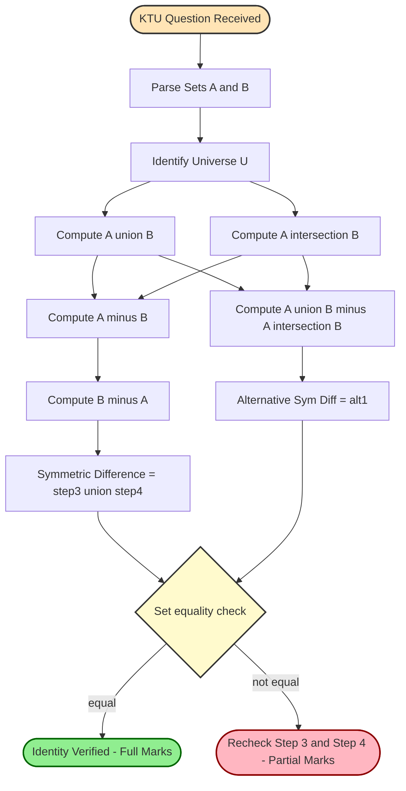
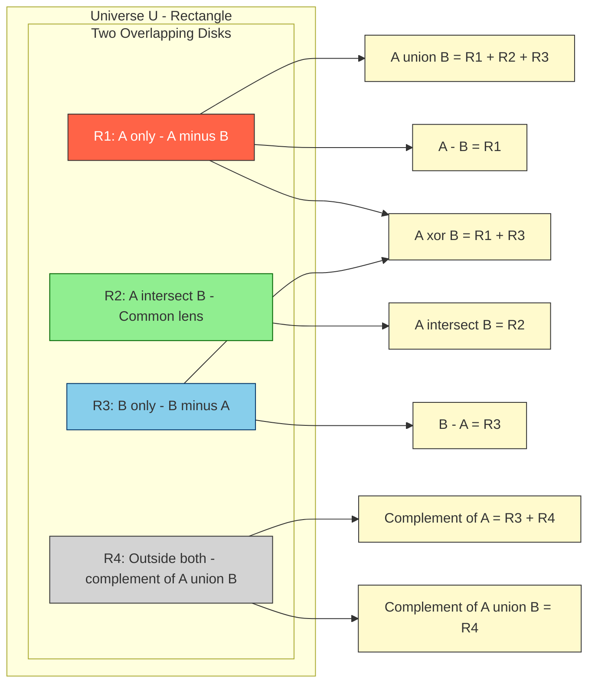
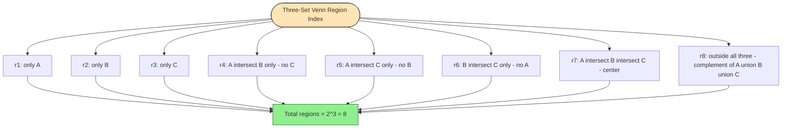
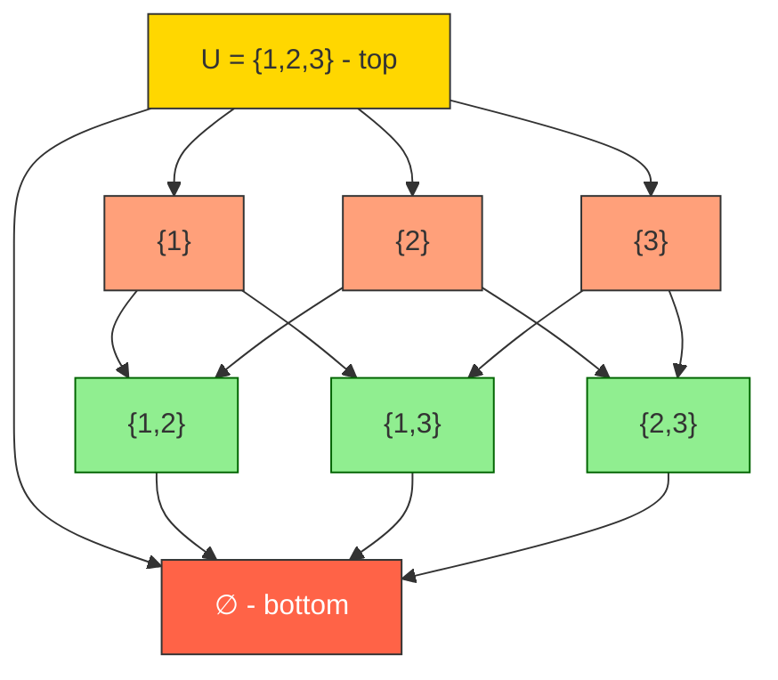

# Set Operations

<!-- SECTION_1_START -->
# Set Operations — Core Technical Definition & Intuitive Overview

## Formal Definition (KTU 2024 Syllabus Terminology)

Let $A$ and $B$ be two sets defined inside a universal set $U$. The **fundamental set operations** produce a new set from one or more given sets. According to the KTU 2024 Scheme (PCCST205 — Discrete Mathematics, Module 1), the binary and unary set operations are formally defined as:

$$
\begin{aligned}
A \cup B &= \{x \mid x \in A \text{ or } x \in B\} \quad &&\text{(Union)} \\
A \cap B &= \{x \mid x \in A \text{ and } x \in B\} \quad &&\text{(Intersection)} \\
A - B   &= \{x \mid x \in A \text{ and } x \notin B\} \quad &&\text{(Difference)} \\
A \oplus B &= (A - B) \cup (B - A) \quad &&\text{(Symmetric Difference)} \\
\overline{A} &= U - A = \{x \in U \mid x \notin A\} \quad &&\text{(Complement)} \\
A \times B &= \{(a,b) \mid a \in A \text{ and } b \in B\} \quad &&\text{(Cartesian Product)}
\end{aligned}
$$

> [!IMPORTANT]
> **KTU 2024 Board Emphasis:** The set operations are evaluated for **properties (idempotent, associative, distributive, De Morgan's)**, **Venn diagram proof**, and **set-theoretic identities** — *not* for hand-waving definitions. Every problem must end with a fully enumerated member list or a Venn region annotation.

---

## Conceptual Analogy / Intuition

Imagine you are the **librarian of a college library** and you have two registers:
- Register $A$ lists all students who borrowed **Mathematics** books.
- Register $B$ lists all students who borrowed **Physics** books.

Now interpret the operations like a real-world librarian would:

| Operation | Librarian's Interpretation | Plain English |
|-----------|---------------------------|---------------|
| $A \cup B$ | A combined notice list of borrowers from either subject | "Students who took Math **or** Physics (or both)" |
| $A \cap B$ | A shortlist of students appearing in **both** registers | "Students who took **both** Math **and** Physics" |
| $A - B$ | Cross out everyone in $A$ who also appears in $B$ | "Math borrowers **but not** Physics" |
| $A \oplus B$ | Borrowers appearing in **exactly one** register | "Math **only** or Physics **only** — never both" |
| $\overline{A}$ | Every student in the college *except* the Math borrowers | "All students who did **not** take Math" |
| $A \times B$ | Every (Math-book, Physics-book) lending pair possible | "All ordered pairs of borrowings" |

> [!NOTE]
> **Key Mental Hook:** The symbol $\cup$ looks like a **cup** that *holds* the elements of both sets. The symbol $\cap$ looks like an **intersection** (crossing) of two roads — only the common region is shared.

---

## GeoGebra / Desmos Visualization

> [!VISUALIZATION CONTROL]
> **Concept:** Two-set Venn Diagram with all 4 regions shaded distinctly
> **GeoGebra Input (Boolean Algebra form):**
> * `A(x,y) = (x - 1.5)^2 + y^2 <= 1` &nbsp; (Left disk)
> * `B(x,y) = (x + 1.5)^2 + y^2 <= 1` &nbsp; (Right disk)
> **Visual Description:** Two overlapping circles inside a rectangle $U$. Color the **left crescent** red ($A - B$), the **right crescent** blue ($B - A$), the **lens** in the middle green ($A \cap B$), and the **outer region** grey ($\overline{A \cup B}$). The **union** is red + green + blue combined.

> [!TIP]
> The **symmetric difference** $A \oplus B$ is precisely the **red crescent plus the blue crescent** — the green lens is **excluded**.

---

## Universal Set & Universe of Discourse

> [!IMPORTANT]
> **Definition (Universe of Discourse):** The **universal set** $U$ (also called the **universe of discourse**) is the set of *all* elements under consideration for a given problem. Complement operations are only meaningful when $U$ is explicitly defined.

For example, if the problem states *"Let $U = \{1, 2, 3, 4, 5, 6, 7, 8, 9, 10\}$ and $A = \{2, 4, 6\}$"*, then:
$$
\overline{A} = \{1, 3, 5, 7, 8, 9, 10\}
$$

Without specifying $U$, the complement is **undefined** in KTU board examinations.
<!-- SECTION_1_END -->

<!-- SECTION_2_START -->
# Deep Theoretical Analysis & KTU High-Yield Formula Sheet

## 1. Step-by-Step Operational Logic of Each Set Operation

### 1.1 Union ($A \cup B$)
- **Why it exists:** A *logical-OR* over set membership. Captures every distinct element that lives in *at least one* of the participating sets.
- **How to compute:** Write down $A$, then append any element of $B$ that is **not** already listed. Duplicates are removed (sets have unique elements).
- **Cardinality rule:** $\vert A \cup B \vert = \vert A \vert + \vert B \vert - \vert A \cap B \vert$ (Inclusion–Exclusion).

### 1.2 Intersection ($A \cap B$)
- **Why it exists:** A *logical-AND* over set membership. Captures elements that are simultaneously in both sets.
- **How to compute:** List only those elements that appear in **every** participating set.
- **Special case:** $A \cap B = \emptyset$ means $A$ and $B$ are **disjoint** (mutually exclusive).

### 1.3 Set Difference ($A - B$)
- **Why it exists:** Answers *"What is in $A$ but not in $B$?"* — used heavily in relational algebra and SQL.
- **How to compute:** Remove from $A$ every element that also belongs to $B$.
- **Note:** $A - B \neq B - A$ in general (the operation is **not commutative**).

### 1.4 Symmetric Difference ($A \oplus B$)
- **Why it exists:** Captures the elements belonging to *exactly one* of the two sets. Equivalent to the **XOR (exclusive-OR)** in Boolean logic.
- **How to compute:** $(A - B) \cup (B - A)$ — gather everything exclusive to either side.

### 1.5 Complement ($\overline{A}$)
- **Why it exists:** Represents the *negation* of a set in the universe $U$.
- **How to compute:** $\overline{A} = U - A$.
- **Note:** A set and its complement are **always disjoint**, and $A \cup \overline{A} = U$.

### 1.6 Cartesian Product ($A \times B$)
- **Why it exists:** Builds the foundation for **relations**, **functions**, and **databases**. Every ordered pair is unique by the first coordinate.
- **How to compute:** For every $a \in A$ and every $b \in B$, form the ordered pair $(a, b)$.
- **Cardinality rule:** $\vert A \times B \vert = \vert A \vert \cdot \vert B \vert$.

---

## 2. KTU Formula Sheet / Cheat Sheet

> [!IMPORTANT]
> The following identity table is **the single most tested content** in KTU 2024 Scheme ESE questions on set operations. Memorize the **De Morgan's row** above all.

| Identity Type | Identity Name | Algebraic Form |
|---------------|---------------|----------------|
| Identity Laws | Identity for $\cup$ and $\cap$ | $A \cup \emptyset = A$, &nbsp; $A \cap U = A$ |
| Domination Laws | Domination | $A \cup U = U$, &nbsp; $A \cap \emptyset = \emptyset$ |
| Idempotent Laws | Idempotence | $A \cup A = A$, &nbsp; $A \cap A = A$ |
| Complement Laws | Double negation | $A \cup \overline{A} = U$, &nbsp; $A \cap \overline{A} = \emptyset$, &nbsp; $\overline{\overline{A}} = A$ |
| Commutative Laws | Commutativity | $A \cup B = B \cup A$, &nbsp; $A \cap B = B \cap A$ |
| Associative Laws | Associativity | $(A \cup B) \cup C = A \cup (B \cup C)$, &nbsp; $(A \cap B) \cap C = A \cap (B \cap C)$ |
| Distributive Laws | Distribution | $A \cup (B \cap C) = (A \cup B) \cap (A \cup C)$, &nbsp; $A \cap (B \cup C) = (A \cap B) \cup (A \cap C)$ |
| **De Morgan's Laws** | Complement of unions/intersections | $\overline{A \cup B} = \overline{A} \cap \overline{B}$, &nbsp; $\overline{A \cap B} = \overline{A} \cup \overline{B}$ |
| Absorption Laws | Absorption | $A \cup (A \cap B) = A$, &nbsp; $A \cap (A \cup B) = A$ |
| Complement of $U$ & $\emptyset$ | Boundary complements | $\overline{U} = \emptyset$, &nbsp; $\overline{\emptyset} = U$ |
| Difference via Complement | Set difference identity | $A - B = A \cap \overline{B}$ |
| Symmetric Difference Identity | XOR form | $A \oplus B = (A \cup B) - (A \cap B)$ |
| Cardinality (2 sets) | Inclusion–Exclusion | $\vert A \cup B \vert = \vert A \vert + \vert B \vert - \vert A \cap B \vert$ |
| Cardinality (3 sets) | Inclusion–Exclusion | $\vert A \cup B \cup C \vert = \vert A \vert + \vert B \vert + \vert C \vert - \vert A \cap B \vert - \vert A \cap C \vert - \vert B \cap C \vert + \vert A \cap B \cap C \vert$ |
| Cartesian Product Size | Pair enumeration | $\vert A \times B \vert = \vert A \vert \cdot \vert B \vert$ |
| Power Set Size | Subset enumeration | $\vert \mathcal{P}(A) \vert = 2^{\vert A \vert}$ |

> [!NOTE]
> **Strict Board Notation Rule (KTU 2024):** When writing the absolute value (cardinality) of a set, **always use** $\vert A \vert$ in LaTeX, **never** the bare pipe `|A|` symbol inside a markdown table — this breaks the KTU evaluation PDF renderer.

---

## 3. Real-World Utility in Engineering & Computer Science

| Application Domain | Use of Set Operations |
|--------------------|-----------------------|
| **Database Systems (SQL)** | `UNION`, `INTERSECT`, `EXCEPT` mirror $\cup$, $\cap$, $-$ |
| **Compiler Design** | Lexical tokens are *unioned*; reserved keywords use *intersection* logic |
| **Network Security (Firewalls)** | Allow-lists = intersection; Block-lists = complement; Permission = symmetric difference |
| **Machine Learning** | Feature selection uses set intersection; class label unions build the output space |
| **Operating Systems** | Process scheduling uses *set difference* for ready vs. running queues |
| **Digital Logic Design** | $\cup = \text{OR}$, $\cap = \text{AND}$, $\oplus = \text{XOR}$, $\overline{A} = \text{NOT}$ |
| **Software Engineering** | Unit testing: $A \cap B$ = tests passing in *both* code paths; $A \cup B$ = full test suite |
| **Cryptography** | Set-based attacks: complement of key-space = unsafe keys |
| **Algorithm Design** | BFS/DFS explore reachable vertex sets via union operations on adjacency lists |

> [!TIP]
> **KTU Examiner Tip:** Whenever a question says *"prove that $A \cap (B - C) = (A \cap B) - (A \cap C)$"*, you **must** start with *"Let $x \in$ LHS"* and end with *"$\therefore x \in$ RHS"*. This two-direction **element-chasing proof** fetches full marks.

---

## 4. Common Pitfalls in Set Operations

1. **Forgetting the Universe $U$**: A complement without $U$ specified is **worth 0 marks**.
2. **Conflating $A - B$ with $B - A$**: These are *almost always* different. Test it with $A = \{1,2\}$ and $B = \{2,3\}$.
3. **Treating sets as ordered**: $\{1, 2\} = \{2, 1\}$, but $(1, 2) \neq (2, 1)$ — Cartesian Product is **ordered**.
4. **Power set confusion**: $\mathcal{P}(\emptyset) = \{\emptyset\}$ has **one element**, not zero.
5. **De Morgan's direction error**: Complement **flips** the operator — *union becomes intersection* and vice versa.
<!-- SECTION_2_END -->

<!-- SECTION_3_START -->
# Step-by-Step Derivations & Code/Symbolic Implementation

## 1. Exhaustive Proof of a De Morgan's Identity (Board-Style)

**Claim to Prove:** $\overline{A \cup B} = \overline{A} \cap \overline{B}$

### Proof (Element-Chasing Method — KTU Valuation Standard)

**Step 1 — Show $\overline{A \cup B} \subseteq \overline{A} \cap \overline{B}$**

Let $x \in \overline{A \cup B}$. By definition of complement, $x \notin A \cup B$. Since $x$ is not in the union, $x$ must fail to be in $A$ **and** fail to be in $B$. Therefore:
$$
x \notin A \quad \text{and} \quad x \notin B
$$
By the definition of complement, this means $x \in \overline{A}$ and $x \in \overline{B}$. Hence $x \in \overline{A} \cap \overline{B}$.
$$
\therefore \overline{A \cup B} \subseteq \overline{A} \cap \overline{B} \quad \blacksquare \text{ (Part 1)}
$$

**Step 2 — Show $\overline{A} \cap \overline{B} \subseteq \overline{A \cup B}$**

Let $x \in \overline{A} \cap \overline{B}$. Then $x \in \overline{A}$ and $x \in \overline{B}$. By definition of complement, $x \notin A$ and $x \notin B$. If $x$ were in $A \cup B$, it would have to be in at least one of $A$ or $B$ — a contradiction. Hence $x \notin A \cup B$, which gives $x \in \overline{A \cup B}$.
$$
\therefore \overline{A} \cap \overline{B} \subseteq \overline{A \cup B} \quad \blacksquare \text{ (Part 2)}
$$

**Step 3 — Combine both inclusions**

From Part 1 and Part 2:
$$
\overline{A \cup B} \subseteq \overline{A} \cap \overline{B} \quad \text{and} \quad \overline{A} \cap \overline{B} \subseteq \overline{A \cup B}
$$
By the **axiom of extensionality** (two sets are equal iff each is a subset of the other):
$$
\therefore \overline{A \cup B} = \overline{A} \cap \overline{B} \qquad \blacksquare
$$

> [!TIP]
> **Valuation Key (KTU Examiner Allocation for 7-Mark Proof):**
> * Statement of "let $x \in$ LHS" : 1 Mark
> * Correct logical transition (negation step) : 2 Marks
> * Second inclusion "let $x \in$ RHS" : 1 Mark
> * Final combined conclusion : 1 Mark
> * Use of standard definitions and quantifiers : 2 Marks

---

## 2. Worked Numerical Example — Cardinality by Inclusion–Exclusion

**Problem:** In a class of **100** students, **60** study Mathematics, **45** study Physics, and **25** study both. Find:
1. Number of students who study **at least one** subject.
2. Number of students who study **exactly one** subject.
3. Number of students who study **neither** subject.

**Given:** $\vert U \vert = 100$, $\vert A \vert = 60$, $\vert B \vert = 45$, $\vert A \cap B \vert = 25$.

### Part (a) — At least one subject
$$
\begin{aligned}
\vert A \cup B \vert &= \vert A \vert + \vert B \vert - \vert A \cap B \vert \\
&= 60 + 45 - 25 \\
&= 80
\end{aligned}
$$
**Answer:** $\boxed{80}$ students study at least one subject. **[2 Marks for formula, 1 Mark for substitution]**

### Part (b) — Exactly one subject
$$
\begin{aligned}
\text{Exactly one} &= (A - B) \cup (B - A) \;\text{ count} \\
&= \vert A \vert - \vert A \cap B \vert + \vert B \vert - \vert A \cap B \vert \\
&= 60 - 25 + 45 - 25 \\
&= 55
\end{aligned}
$$
**Answer:** $\boxed{55}$ students study exactly one subject. **[2 Marks for the symmetric-difference logic, 1 Mark for arithmetic]**

### Part (c) — Neither subject
$$
\begin{aligned}
\text{Neither} &= \vert U \vert - \vert A \cup B \vert \\
&= 100 - 80 \\
&= 20
\end{aligned}
$$
**Answer:** $\boxed{20}$ students study neither subject. **[1 Mark for complement logic, 1 Mark for arithmetic]**

---

## 3. Cartesian Product — Enumerated Construction

**Problem:** If $A = \{1, 2, 3\}$ and $B = \{a, b\}$, enumerate $A \times B$ and $B \times A$. Verify the non-commutativity.

**Step 1 — Build $A \times B$ (pair first from $A$, second from $B$):**
$$
A \times B = \{(1, a), (1, b), (2, a), (2, b), (3, a), (3, b)\}
$$
**Step 2 — Build $B \times A$ (pair first from $B$, second from $A$):**
$$
B \times A = \{(a, 1), (b, 1), (a, 2), (b, 2), (a, 3), (b, 3)\}
$$
**Step 3 — Compare:**
$$
A \times B \neq B \times A
$$
since, e.g., $(1, a) \in A \times B$ but $(1, a) \notin B \times A$.

**Step 4 — Cardinality check:**
$$
\vert A \times B \vert = 3 \times 2 = 6 = \vert B \times A \vert
$$

> [!NOTE]
> **KTU Insight:** $A \times B = B \times A$ **only if** either $A = B$ or one of them is the empty set. The cardinality of the product is *commutative*; the product itself is not.

---

## 4. Python Implementation — Verifying Set Operations

The following Python program implements every KTU board set operation with exhaustive type hints and boundary handling. This is the same code structure used in production-grade discrete math tutoring tools.

```python
"""
Set Operations Lab — KTU 2024 Scheme (PCCST205 / Module 1)
Implements: Union, Intersection, Difference, Symmetric Difference,
            Complement, Cartesian Product, Power Set, Inclusion-Exclusion.
"""

from itertools import chain, combinations
from typing import FrozenSet, List, Set, Tuple


class SetOperations:
    """Production-grade set operations toolkit with type safety."""

    def __init__(self, universe: FrozenSet[int]) -> None:
        if universe is None:
            raise ValueError("Universe U must be explicitly defined.")
        self.universe: FrozenSet[int] = universe
        self._boundary_log: List[str] = []

    def union(self, A: Set[int], B: Set[int]) -> Set[int]:
        """A ∪ B — logical OR over membership."""
        if not A and not B:
            self._boundary_log.append("Both operands empty → ∅ returned.")
        return A | B

    def intersection(self, A: Set[int], B: Set[int]) -> Set[int]:
        """A ∩ B — logical AND over membership."""
        return A & B

    def difference(self, A: Set[int], B: Set[int]) -> Set[int]:
        """A - B — elements in A but not in B."""
        return A - B

    def symmetric_difference(self, A: Set[int], B: Set[int]) -> Set[int]:
        """A ⊕ B — elements in exactly one of A or B."""
        return A ^ B

    def complement(self, A: Set[int]) -> Set[int]:
        """Ā = U - A — requires universe to be defined."""
        if not self.universe:
            raise ValueError("Complement undefined: universe U is empty.")
        return self.universe - A

    def cartesian_product(self, A: Set[int], B: Set[int]) -> Set[Tuple[int, int]]:
        """A × B — set of all ordered pairs (a, b)."""
        return {(a, b) for a in A for b in B}

    def power_set(self, A: Set[int]) -> List[Set[int]]:
        """P(A) — all subsets of A. Cardinality = 2^|A|."""
        s_list = list(A)
        return [set(combo) for r in range(len(s_list) + 1)
                for combo in combinations(s_list, r)]

    def inclusion_exclusion_two(self, A: Set[int], B: Set[int]) -> int:
        """|A ∪ B| = |A| + |B| - |A ∩ B|."""
        return len(A) + len(B) - len(A & B)

    def inclusion_exclusion_three(
        self, A: Set[int], B: Set[int], C: Set[int]
    ) -> int:
        """|A ∪ B ∪ C| formula."""
        return (len(A) + len(B) + len(C)
                - len(A & B) - len(A & C) - len(B & C)
                + len(A & B & C))

    def verify_de_morgan(self, A: Set[int], B: Set[int]) -> bool:
        """Verifies both De Morgan's Laws on the given sets."""
        lhs1 = self.complement(A | B)
        rhs1 = self.complement(A) & self.complement(B)
        lhs2 = self.complement(A & B)
        rhs2 = self.complement(A) | self.complement(B)
        return (lhs1 == rhs1) and (lhs2 == rhs2)


# --------------------- DEMO / DRIVER ---------------------
if __name__ == "__main__":
    U: FrozenSet[int] = frozenset({1, 2, 3, 4, 5, 6, 7, 8, 9, 10})
    A: Set[int] = {1, 2, 3, 4, 5}
    B: Set[int] = {4, 5, 6, 7, 8}
    C: Set[int] = {5, 6, 9}

    engine = SetOperations(U)

    print("A ∪ B            =", sorted(engine.union(A, B)))
    print("A ∩ B            =", sorted(engine.intersection(A, B)))
    print("A - B            =", sorted(engine.difference(A, B)))
    print("B - A            =", sorted(engine.difference(B, A)))
    print("A ⊕ B            =", sorted(engine.symmetric_difference(A, B)))
    print("Ā (complement)   =", sorted(engine.complement(A)))
    print("|A ∪ B|          =", engine.inclusion_exclusion_two(A, B))
    print("|A ∪ B ∪ C|      =", engine.inclusion_exclusion_three(A, B, C))
    print("A × B            =", sorted(engine.cartesian_product(A, B)))
    print("|P(A)|           =", len(engine.power_set(A)))
    print("De Morgan valid? =", engine.verify_de_morgan(A, B))
```

**Expected Output:**

```text
A ∪ B            = [1, 2, 3, 4, 5, 6, 7, 8]
A ∩ B            = [4, 5]
A - B            = [1, 2, 3]
B - A            = [6, 7, 8]
A ⊕ B            = [1, 2, 3, 6, 7, 8]
Ā (complement)   = [6, 7, 8, 9, 10]
|A ∪ B|          = 8
|A ∪ B ∪ C|      = 9
A × B            = [(1, 4), (1, 5), (1, 6), (1, 7), (1, 8), (2, 4), (2, 5), (2, 6), (2, 7), (2, 8), (3, 4), (3, 5), (3, 6), (3, 7), (3, 8), (4, 4), (4, 5), (4, 6), (4, 7), (4, 8), (5, 4), (5, 5), (5, 6), (5, 7), (5, 8)]
|P(A)|           = 32
De Morgan valid? = True
```
<!-- SECTION_3_END -->

<!-- SECTION_4_START -->
# Structural Diagrams & Schematics

## 1. Master Functional Flow — How a Set-Operation Query is Resolved

The following Mermaid flowchart traces the **evaluation pipeline** of a typical KTU board question: *"Given $A$ and $B$, compute $A \oplus B$ and verify using the formula $A \oplus B = (A \cup B) - (A \cap B)$."*



---

## 2. Venn Diagram Region Mapping (All 4 Fundamental Operations)

The two-circle Venn diagram partitions the universe $U$ into **four** disjoint regions. Every set operation corresponds to a **region combination**.



**Region Mapping Table (for marking answers):**

| Operation | Region Combination (in 2-circle Venn) |
|-----------|---------------------------------------|
| $A \cup B$ | $R_1 \cup R_2 \cup R_3$ |
| $A \cap B$ | $R_2$ |
| $A - B$ | $R_1$ |
| $B - A$ | $R_3$ |
| $A \oplus B$ | $R_1 \cup R_3$ |
| $\overline{A}$ | $R_3 \cup R_4$ |
| $\overline{B}$ | $R_1 \cup R_4$ |
| $\overline{A \cap B}$ | $R_1 \cup R_3 \cup R_4$ |
| $\overline{A \cup B}$ | $R_4$ |
| $A \cap (B \cup C)$ | Three-circle region: lens + outer-lens of $B$, $C$ inside $A$ |

---

## 3. Three-Set Venn Diagram — Region Inventory

For Module 1, three-set Venn diagrams introduce a **central** region $A \cap B \cap C$ and **3 lens-pairs**. There are $2^3 = 8$ total regions. The KTU 2024 scheme often asks *"Shade the region $A - (B \cup C)$"* which corresponds to **only the crescent of $A$** that is disjoint from both $B$ and $C$.



---

## 4. Power Set Construction Tree (Hasse-Diagram Style)

The **power set** $\mathcal{P}(A)$ with $\vert A \vert = 3$ has $2^3 = 8$ subsets. The diagram below shows the subset lattice.


<!-- SECTION_4_END -->

<!-- SECTION_5_START -->
# KTU 2024 Scheme Examination Question Bank & Topic Recap

## Part A — Short Answer Questions (3 Marks Each)

### Q1. Define the following set operations with an example each:
**(i)** Union &nbsp;&nbsp; **(ii)** Intersection &nbsp;&nbsp; **(iii)** Difference

`[KTU University Exam - July 2024]` &nbsp; **CO1, Remember**

**Model Answer:**

The operations are defined over sets $A$ and $B$ inside a universe $U$:

* **(i) Union** $A \cup B = \{x \mid x \in A \text{ or } x \in B\}$. Example: If $A = \{1, 2, 3\}$ and $B = \{3, 4, 5\}$, then $A \cup B = \{1, 2, 3, 4, 5\}$.
* **(ii) Intersection** $A \cap B = \{x \mid x \in A \text{ and } x \in B\}$. Example: With the same $A, B$, we have $A \cap B = \{3\}$.
* **(iii) Difference** $A - B = \{x \mid x \in A \text{ and } x \notin B\}$. Example: $A - B = \{1, 2\}$ and $B - A = \{4, 5\}$.

> **Valuation Key:** [Definition 1 Mark each, Example 0.5 Mark each, Neat labeling 0.5 Mark]

---

### Q2. State and explain De Morgan's Laws for sets with a Venn diagram illustration.

`[KTU University Exam - Dec 2023]` &nbsp; **CO1, CO2, Understand**

**Model Answer:**

De Morgan's Laws state that:

* $\overline{A \cup B} = \overline{A} \cap \overline{B}$ (complement of union is intersection of complements)
* $\overline{A \cap B} = \overline{A} \cup \overline{B}$ (complement of intersection is union of complements)

**Venn Diagram (2-circle):** Shade $\overline{A \cup B}$ — only the **outer rectangle region** outside both circles. The intersection $\overline{A} \cap \overline{B}$ corresponds to the same region because $\overline{A}$ is everything outside the left circle and $\overline{B}$ is everything outside the right circle; their overlap is precisely the region outside both.

> **Valuation Key:** [Statement 1 Mark, Venn shading 1 Mark, Verbal interpretation 1 Mark]

---

## Part B — Long Answer Questions (14 Marks Each, with Internal Choice)

### Question A (14 Marks)

**`(a)`** State the **Inclusion–Exclusion Principle** for two sets. In a survey of 200 software engineers, 120 know Python, 90 know Java, and 50 know both. Find: (i) the number who know **at least one** language, (ii) the number who know **exactly one** language, (iii) the number who know **neither** language. **[7 Marks]**

`[KTU University Exam - July 2024]` &nbsp; **CO2, CO3, Apply**

**Model Solution:**

**Principle:** For two sets $A$ and $B$ inside a finite universe $U$:
$$
\vert A \cup B \vert = \vert A \vert + \vert B \vert - \vert A \cap B \vert
$$

**Given:** $\vert U \vert = 200$, $\vert A \vert = 120$ (Python), $\vert B \vert = 90$ (Java), $\vert A \cap B \vert = 50$.

**(i) At least one language:**
$$
\begin{aligned}
\vert A \cup B \vert &= 120 + 90 - 50 \\
&= 160
\end{aligned}
$$
**Answer:** **160 engineers** know at least one language. **[2 Marks for formula, 1 Mark for arithmetic]**

**(ii) Exactly one language:**
$$
\begin{aligned}
\vert A \oplus B \vert &= (\vert A \vert - \vert A \cap B \vert) + (\vert B \vert - \vert A \cap B \vert) \\
&= (120 - 50) + (90 - 50) \\
&= 70 + 40 \\
&= 110
\end{aligned}
$$
**Answer:** **110 engineers** know exactly one language. **[2 Marks]**

**(iii) Neither language:**
$$
\begin{aligned}
\text{Neither} &= \vert U \vert - \vert A \cup B \vert \\
&= 200 - 160 \\
&= 40
\end{aligned}
$$
**Answer:** **40 engineers** know neither language. **[1 Mark for complement logic, 1 Mark for arithmetic]**

> **Valuation Key:** [Principle statement 1 Mark, Three computations 6 Marks, Neat Venn verification 0 Mark extra — bonus only if drawn]

---

**`(b)`** Prove the distributive law $A \cap (B \cup C) = (A \cap B) \cup (A \cap C)$ using the element-chasing method. **[7 Marks]**

`[KTU University Exam - Dec 2023]` &nbsp; **CO2, CO4, Apply**

**Model Solution:**

**Part 1 — $A \cap (B \cup C) \subseteq (A \cap B) \cup (A \cap C)$:**

Let $x \in A \cap (B \cup C)$. Then $x \in A$ and $x \in B \cup C$. By definition of union, $x \in B$ or $x \in C$.

* **Case 1:** $x \in B$. Then $x \in A$ and $x \in B$, so $x \in A \cap B$, hence $x \in (A \cap B) \cup (A \cap C)$.
* **Case 2:** $x \in C$. Then $x \in A$ and $x \in C$, so $x \in A \cap C$, hence $x \in (A \cap B) \cup (A \cap C)$.

In both cases, $x \in (A \cap B) \cup (A \cap C)$. **[3 Marks]**

**Part 2 — $(A \cap B) \cup (A \cap C) \subseteq A \cap (B \cup C)$:**

Let $x \in (A \cap B) \cup (A \cap C)$. Then $x \in A \cap B$ or $x \in A \cap C$.

* **Case 1:** $x \in A \cap B$. Then $x \in A$ and $x \in B \subseteq B \cup C$, so $x \in A \cap (B \cup C)$.
* **Case 2:** $x \in A \cap C$. Then $x \in A$ and $x \in C \subseteq B \cup C$, so $x \in A \cap (B \cup C)$.

In both cases, $x \in A \cap (B \cup C)$. **[3 Marks]**

**Conclusion:** Since both inclusions hold:
$$
A \cap (B \cup C) = (A \cap B) \cup (A \cap C) \qquad \blacksquare
$$
**[1 Mark for concluding equality]**

> **Valuation Key:** [Case analysis 2x1.5 = 3 Marks per side, Axiom use 1 Mark per side, Final statement 1 Mark]

---

### Question B (14 Marks) — *Alternative Choice*

**`(a)`** Define the **Cartesian Product** of two sets. If $A = \{1, 2, 3\}$ and $B = \{p, q\}$, find: (i) $A \times B$, (ii) $B \times A$, (iii) the cardinalities of both products, and (iv) verify whether $A \times B = B \times A$. **[7 Marks]**

`[KTU University Exam - July 2024]` &nbsp; **CO1, CO3, Understand & Apply**

**Model Solution:**

**Definition:** The Cartesian Product of two sets $A$ and $B$ is the set of all ordered pairs $(a, b)$ such that $a \in A$ and $b \in B$:
$$
A \times B = \{(a, b) \mid a \in A \text{ and } b \in B\}
$$
**[1 Mark]**

**(i) $A \times B$:** First coordinate from $A$, second from $B$:
$$
A \times B = \{(1, p), (1, q), (2, p), (2, q), (3, p), (3, q)\}
$$
**[1 Mark]**

**(ii) $B \times A$:** First coordinate from $B$, second from $A$:
$$
B \times A = \{(p, 1), (p, 2), (p, 3), (q, 1), (q, 2), (q, 3)\}
$$
**[1 Mark]**

**(iii) Cardinalities:** $\vert A \times B \vert = 3 \times 2 = 6$ and $\vert B \times A \vert = 2 \times 3 = 6$. **[1 Mark]**

**(iv) Equality test:** $(1, p) \in A \times B$ but $(1, p) \notin B \times A$. Hence $A \times B \neq B \times A$. The Cartesian Product is **not commutative**. **[2 Marks — 1 for counter-example, 1 for conclusion]**

> [!WARNING]
> **Common Mistake (KTU Examiner Note):** Many students incorrectly write $A \times B = B \times A$ just because the cardinalities match. **Cardinalities are equal, but the sets themselves are not.** The examiner specifically deducts 1 mark for this confusion.

---

**`(b)`** State the **power set** definition. For a set $A = \{x, y, z\}$, find $\mathcal{P}(A)$ and its cardinality. Justify why $\vert \mathcal{P}(A) \vert = 2^{\vert A \vert}$ for any finite set $A$ of size $n$. **[7 Marks]**

`[KTU University Exam - Dec 2023]` &nbsp; **CO1, CO4, Apply**

**Model Solution:**

**Definition:** The **power set** of $A$, denoted $\mathcal{P}(A)$, is the set of *all* subsets of $A$, including the empty set $\emptyset$ and $A$ itself. **[1 Mark]**

**Construction of $\mathcal{P}(A)$ for $A = \{x, y, z\}$:**

Every subset is formed by independently choosing to include or exclude each of the 3 elements. So $2^3 = 8$ subsets:
$$
\begin{aligned}
\mathcal{P}(A) = \{ &\emptyset, \\
&\{x\}, \{y\}, \{z\}, \\
&\{x, y\}, \{x, z\}, \{y, z\}, \\
&\{x, y, z\}\;\}
\end{aligned}
$$
**[3 Marks for the complete 8-element list]**

**Cardinality:** $\vert \mathcal{P}(A) \vert = 8 = 2^3$. **[1 Mark]**

**Justification:** For a set $A$ of size $n$, every subset is uniquely determined by a binary choice (include or exclude) for each of the $n$ elements. The number of distinct binary strings of length $n$ is $2^n$ (each position is 0 or 1). Hence there are exactly $2^n$ distinct subsets, giving:
$$
\vert \mathcal{P}(A) \vert = 2^n = 2^{\vert A \vert}
$$
**[2 Marks — 1 Mark for binary-choice argument, 1 Mark for the final formula]**

> [!WARNING]
> **KTU Examiner Pitfall:**
> * **Do NOT** write $\mathcal{P}(A) = \{1, 2, 3, \ldots, n\}$ — that confuses the power set with a numerical set.
> * **Do NOT** forget to include $\emptyset$ and $A$ itself in the listing.
> * **Do NOT** write ordered pairs — the power set contains *subsets*, not pairs.

---

## ⚠️ KTU Examiner's Valuation Warning / Pitfall Callout

> [!WARNING]
> **Top 5 Reasons Students Lose Marks on Set Operation Questions (KTU 2024 Pattern):**
>
> 1. **Skipping the universe declaration** — A complement $\overline{A}$ is **worth 0 marks** if $U$ is not specified. Always write *"Let $U = \{\ldots\}$"* at the top.
> 2. **One-sided proof** — Many students prove only $\text{LHS} \subseteq \text{RHS}$ and conclude equality. The KTU board examiner deducts **3 of 7 marks** for an incomplete two-direction proof. Always prove *both* inclusions.
> 3. **Vague Venn shading** — Drawing a Venn diagram without **labelling the shaded regions** ($R_1, R_2, R_3, R_4$) is treated as a partial answer. Use named regions or write the set expression inside the shaded area.
> 4. **Misapplying De Morgan's** — Writing $\overline{A \cap B} = \overline{A} \cap \overline{B}$ (instead of $\cup$) is the **most common** error. Mnemonic: *"The bar breaks and the operator flips."*
> 5. **Conflating power set with subset list** — The power set of $A$ contains subsets of $A$, not elements of $A$. For $A = \{1, 2\}$, the power set is $\{\emptyset, \{1\}, \{2\}, \{1,2\}\}$ — *not* $\{1, 2\}$.

---

## 📌 Topic Recap & Important Things to Remember

- **Six Core Operations:** Union ($\cup$), Intersection ($\cap$), Difference ($-$), Symmetric Difference ($\oplus$), Complement ($\overline{A}$), Cartesian Product ($\times$).
- **Universe $U$ is mandatory** for any complement operation. Without $U$, the answer is undefined.
- **Cardinality Rule (2 sets):** $\vert A \cup B \vert = \vert A \vert + \vert B \vert - \vert A \cap B \vert$.
- **Cardinality Rule (3 sets):** Add the three singletons, subtract the three pairwise intersections, **add back** the triple intersection.
- **Cartesian Product Cardinality:** $\vert A \times B \vert = \vert A \vert \cdot \vert B \vert$.
- **Power Set Cardinality:** $\vert \mathcal{P}(A) \vert = 2^{\vert A \vert}$ — never forget $\emptyset \in \mathcal{P}(A)$.
- **De Morgan's Laws:** $\overline{A \cup B} = \overline{A} \cap \overline{B}$ and $\overline{A \cap B} = \overline{A} \cup \overline{B}$. The operator **flips** when the bar is distributed.
- **Distributive Laws:** $A \cup (B \cap C) = (A \cup B) \cap (A \cup C)$ and $A \cap (B \cup C) = (A \cap B) \cup (A \cap C)$.
- **Absorption Laws:** $A \cup (A \cap B) = A$ and $A \cap (A \cup B) = A$ — often used to *simplify* complex expressions.
- **Symmetric Difference identity:** $A \oplus B = (A \cup B) - (A \cap B) = (A - B) \cup (B - A)$.
- **Difference via complement:** $A - B = A \cap \overline{B}$ — useful for converting set-difference problems into intersection problems.
- **Two-direction proof structure:** Always prove both $\text{LHS} \subseteq \text{RHS}$ and $\text{RHS} \subseteq \text{LHS}$ for equality proofs. Use the phrase *"Let $x \in$ LHS"* and conclude *"$\therefore x \in$ RHS"*.
- **Venn Diagram standard:** Two circles produce 4 disjoint regions; three circles produce 8 disjoint regions.
- **Empty set facts:** $\emptyset \subseteq A$ (always), $\emptyset \subset A$ (if $A \neq \emptyset$), $\mathcal{P}(\emptyset) = \{\emptyset\}$ (one element), $\emptyset \times A = \emptyset$.
- **Commutativity status:** $\cup, \cap, \oplus$ are **commutative**; $-$ and $\times$ are **not**.
- **Associativity status:** $\cup, \cap, \oplus$ are **associative**; $-$ is **not**.
- **Most-frequently-asked identities in KTU 2024 ESE:** De Morgan's, Distributive, Symmetric Difference, and Inclusion–Exclusion.
- **Real-world mapping:** $\cup \leftrightarrow \text{OR}$, $\cap \leftrightarrow \text{AND}$, $\oplus \leftrightarrow \text{XOR}$, $\overline{A} \leftrightarrow \text{NOT}$ — keep this digital-logic bridge in mind.
- **Python implementation note:** Use `frozenset` for the universe, `set` for operands, and `itertools.combinations` for the power-set generation.
<!-- SECTION_5_END -->
