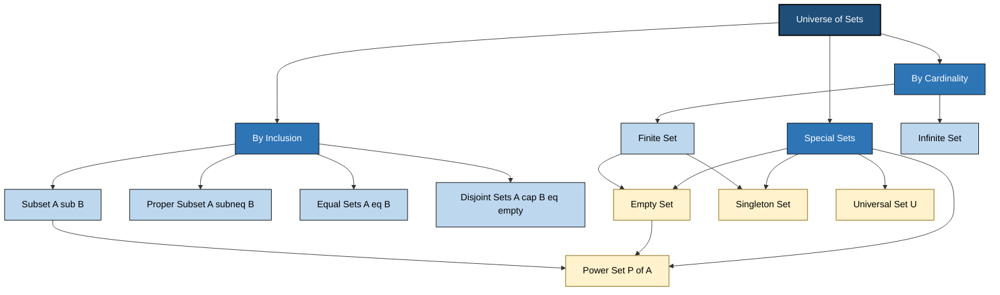
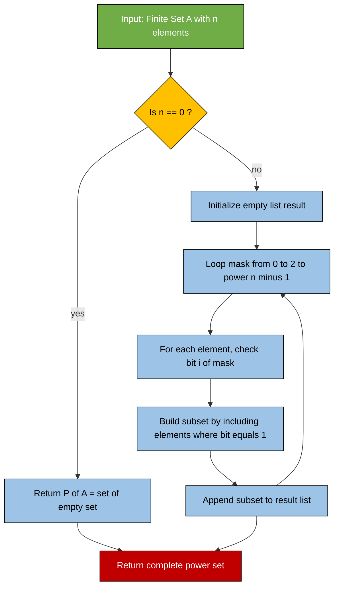
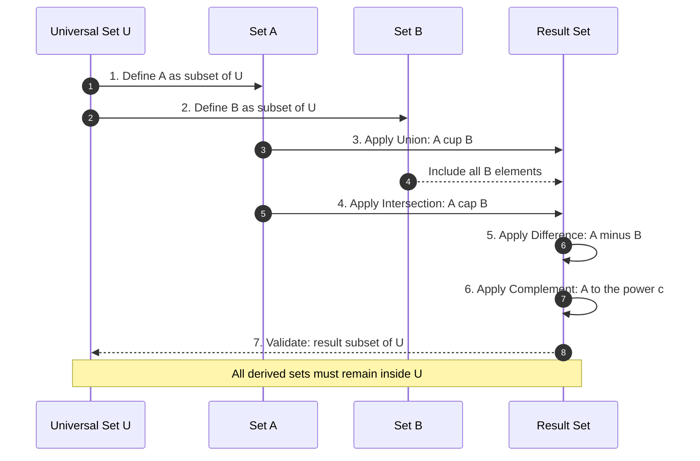

# Sets and Subsets

<!-- SECTION_1_START -->

# Sets and Subsets — Foundations of Discrete Mathematics

> [!IMPORTANT]
> **KTU 2024 Scheme | Course:** Discrete Mathematics (PCCST205) | **Module 1**
> **Course Outcome Mapped:** CO1 — Apply the fundamental concepts of sets, relations, and functions to model computational problems.
> **Cognitive Domain:** Remember & Understand (Bloom Level 1 & 2)

---

## 1.1 Formal Academic Definition

A **Set** is a well-defined, unordered collection of distinct objects, considered as an object in itself. The objects inside a set are called **Elements** (or **Members**). A set is said to be "well-defined" if for any given object, we can unambiguously determine whether it belongs to the set or not.

> [!NOTE]
> **Georg Cantor (1845–1918) — Founder of Modern Set Theory:**
> *"A set is a gathering together into a whole of definite, distinct objects of our perception or of our thought — which are called elements of the set."*

Formally, a set $A$ is denoted as:

$$A = \{ x \mid P(x) \}$$

where $P(x)$ is a defining property that every element $x$ must satisfy. The symbol $\in$ denotes "is an element of", and $\notin$ denotes "is not an element of".

### Common Notational Conventions Used in KTU Examinations

| Symbol | Meaning | Symbol | Meaning |
| :--- | :--- | :--- | :--- |
| $x \in A$ | x is an element of A | $x \notin A$ | x is not in A |
| $A \subseteq B$ | A is a subset of B | $A \subsetneq B$ | A is a proper subset of B |
| $A = B$ | A equals B | $A \neq B$ | A does not equal B |
| $U$ | Universal Set | $\emptyset$ | Empty Set |
| $\mathcal{P}(A)$ | Power Set of A | $\vert A \vert$ | Cardinality of A |

---

## 1.2 Intuitive Real-World Analogy

> [!TIP]
> **The "Club Membership" Analogy:**
> Think of a **set** as a *club* (e.g., "The Chess Club" at your college), and **elements** as the *registered members* of that club.
> - A **subset** is a smaller specialized group *inside* the club (e.g., "Beginners in Chess Club").
> - The **universal set** is the *entire college student body* — every possible member is drawn from it.
> - A **power set** is the *complete list of every possible sub-committee* you can form within the club — including the empty committee and the full club itself.
> - **Disjoint sets** are two clubs with *no common members* (Chess Club and Swimming Club).
>
> Just as you can test membership with a simple ID check, in set theory we test element membership through a well-defined property.

---

## 1.3 GeoGebra / Desmos Visualization

> [!VISUALIZATION CONTROL]
> **Concept:** Two-set Venn Diagram showing Universal Set $U$ with subsets $A$ and $B$.
> **GeoGebra Input Commands:**
> - `c1: (x-(-1))^2 + y^2 = 4` (Circle representing Set A — left)
> - `c2: (x-1)^2 + y^2 = 4` (Circle representing Set B — right)
> - `R: x^2 + y^2 = 9` (Outer circle representing Universal Set U)
>
> **Visual Description:** Observe how the two inner circles **overlap** in the lens-shaped region $(A \cap B)$. The crescent on the left represents $A \setminus B$, the crescent on the right represents $B \setminus A$, and the outer ring outside both circles represents the complement $(A \cup B)^{c}$ inside $U$.

---

## 1.4 Types of Sets — Taxonomy Snapshot

A complete classification of sets forms the structural backbone of Module 1:

1. **Finite Set** — Contains a countable number of elements (e.g., $\{1, 2, 3\}$).
2. **Infinite Set** — Contains infinitely many elements (e.g., $\mathbb{N}$, $\mathbb{Z}$).
3. **Empty (Null) Set** — Contains no elements; denoted $\emptyset$ or $\{\}$; cardinality $\vert \emptyset \vert = \mathbf{0}$.
4. **Singleton Set** — Contains exactly **one** element (e.g., $\{42\}$).
5. **Universal Set** — Contains all objects under consideration; denoted $U$.
6. **Equal Sets** — Two sets $A$ and $B$ are equal iff every element of $A$ is in $B$ and vice versa.
7. **Equivalent Sets** — Two sets having the **same cardinality** (e.g., $A = \{a,b,c\}$ and $B = \{1,2,3\}$ are equivalent but not equal).
8. **Disjoint Sets** — Two sets with **no common element** ($A \cap B = \emptyset$).
9. **Overlapping Sets** — Two sets with **at least one** common element ($A \cap B \neq \emptyset$).

> [!IMPORTANT]
> **KTU Examiner's Focus Point:** Students often confuse **Equal Sets** with **Equivalent Sets**. Equal means *same elements*; Equivalent means *same count*. Two equal sets are always equivalent, but two equivalent sets are not necessarily equal.

---

<!-- SECTION_1_END -->

<!-- SECTION_2_START -->

# Deep Theoretical Analysis & KTU High-Yield Formula Sheet

## 2.1 Formal Definition of a Subset

A set $A$ is called a **subset** of a set $B$ (denoted $A \subseteq B$) if and only if **every element of $A$ is also an element of $B$**.

$$A \subseteq B \iff \forall x \, (x \in A \implies x \in B)$$

A **proper subset** $A \subsetneq B$ is one that satisfies $A \subseteq B$ AND $A \neq B$ (i.e., there exists at least one element in $B$ not in $A$).

> [!NOTE]
> **Empty Set Property:** The empty set $\emptyset$ is a subset of *every* set, including itself. This is vacuously true since the condition "$x \in \emptyset \implies x \in A$" holds for all $x$ (as no $x$ exists in $\emptyset$).

---

## 2.2 The Power Set — The Most Tested Concept in KTU

The **Power Set** of a set $A$, denoted $\mathcal{P}(A)$, is the set of **all possible subsets** of $A$, including the empty set and $A$ itself.

$$\mathcal{P}(A) = \{ X \mid X \subseteq A \}$$

### Cardinality of Power Set (HIGH-YIELD)

If $A$ is a finite set with $\vert A \vert = n$ elements, then the number of subsets (i.e., the cardinality of the power set) is:

$$\boxed{\vert \mathcal{P}(A) \vert = 2^{n}}$$

The number of **proper subsets** is:

$$\text{Number of Proper Subsets} = 2^{n} - 1$$

The number of **non-empty proper subsets** is:

$$\text{Non-Empty Proper Subsets} = 2^{n} - 2$$

> [!TIP]
> **Why $2^n$? — Combinatorial Intuition:**
> For each of the $n$ elements in $A$, we make a binary decision: **include** it (1) or **exclude** it (0) in a subset. With $n$ such independent binary decisions, the total number of distinct subsets is $2 \times 2 \times \cdots \times 2 = 2^{n}$.

---

## 2.3 Set Equality Theorem (Axiom of Extensionality)

Two sets $A$ and $B$ are equal **if and only if** they have exactly the same elements:

$$A = B \iff (A \subseteq B) \land (B \subseteq A)$$

This is the standard method used in KTU board proofs to show set equality: prove mutual inclusion in both directions.

---

## 2.4 KTU Formula Sheet & Cheat Sheet

| # | Concept | Formula / Definition | Boundary Condition |
| :--- | :--- | :--- | :--- |
| 1 | Number of Subsets of $A$ | $\vert \mathcal{P}(A) \vert = 2^{\vert A \vert}$ | Valid for finite $A$ |
| 2 | Proper Subsets | $2^{n} - 1$ | Excludes $A$ itself |
| 3 | Non-Empty Subsets | $2^{n} - 1$ | Excludes $\emptyset$ |
| 4 | Non-Empty Proper Subsets | $2^{n} - 2$ | Excludes both $\emptyset$ and $A$ |
| 5 | Subset relation (Empty) | $\emptyset \subseteq A$ for all $A$ | Vacuously true |
| 6 | Reflexive (Subset) | $A \subseteq A$ | Every set is a subset of itself |
| 7 | Transitive (Subset) | $(A \subseteq B) \land (B \subseteq C) \implies (A \subseteq C)$ | Cascade property |
| 8 | Power Set of Empty | $\mathcal{P}(\emptyset) = \{\emptyset\}$ | $\vert \mathcal{P}(\emptyset) \vert = 1$ |
| 9 | Power Set Cardinality | $\vert \mathcal{P}(\mathcal{P}(A)) \vert = 2^{2^{n}}$ | Nested power set |

> [!IMPORTANT]
> **Syllabus Highlight:** A *common KTU trap* is asking the number of subsets of $\mathcal{P}(A)$. If $\vert A \vert = n$, then $\vert \mathcal{P}(A) \vert = 2^{n}$, so the number of subsets of $\mathcal{P}(A)$ becomes $2^{2^{n}}$.

---

## 2.5 Real-World Engineering & CS Applications

Set theory is not merely abstract — it is the **foundational substrate of modern computing**:

1. **Database Systems:** A *relational database* is a collection of *relations*, and each *relation* is a set of *tuples*. **Set operations** (UNION, INTERSECT, DIFFERENCE) are core SQL commands derived directly from set algebra.
2. **Compiler Design:** *Lexical analysis* uses **character classes** (sets of characters) to define tokens. Regular expressions are fundamentally built on set operations.
3. **Network Security:** **Access Control Lists (ACLs)** and **firewall rule sets** are implemented as set-membership checks: "Does this IP belong to the blocked set?"
4. **Machine Learning:** *Naive Bayes classifiers* compute class probabilities over feature sets. *Set-based metrics* like Jaccard similarity measure overlap between prediction sets.
5. **Software Engineering:** *Unit testing* partitions input domains into **equivalence classes** (sets) to minimize test cases while maximizing coverage.
6. **Operating Systems:** *Process scheduling queues* (Ready, Waiting, Running) are disjoint sets managed by the kernel scheduler.

> [!TIP]
> **Production Insight:** The `Set` data structure in Python, Java's `HashSet`, and C++'s `std::unordered_set` are direct computational implementations of the mathematical set — they guarantee **O(1) average-case** membership testing using hash tables.

---

<!-- SECTION_2_END -->

<!-- SECTION_3_START -->

# Step-by-Step Derivations & Code Implementation

## 3.1 Exhaustive Derivation: Proving Set Equality Using Mutual Inclusion

**Problem:** Prove that $A - B = A \cap B^{c}$ for any two sets $A$ and $B$ inside a universal set $U$.

> **Model Solution (Step-by-Step for Full Board Marks):**

**Step 1: Set up the left-to-right inclusion.**

We must show $A - B \subseteq A \cap B^{c}$.

Let $x \in A - B$. By the definition of set difference:

$$x \in A \quad \text{AND} \quad x \notin B$$

Since $x \notin B$ and $B^{c} = U - B$ contains all elements not in $B$:

$$x \in B^{c}$$

Combining both facts: $x \in A$ AND $x \in B^{c}$. By the definition of intersection:

$$x \in A \cap B^{c}$$

Therefore, $A - B \subseteq A \cap B^{c}$.  **(3 Marks)**

**Step 2: Set up the right-to-left inclusion.**

We must show $A \cap B^{c} \subseteq A - B$.

Let $x \in A \cap B^{c}$. By the definition of intersection:

$$x \in A \quad \text{AND} \quad x \in B^{c}$$

Since $B^{c} = U - B$, having $x \in B^{c}$ implies:

$$x \notin B$$

Combining: $x \in A$ AND $x \notin B$. By the definition of set difference:

$$x \in A - B$$

Therefore, $A \cap B^{c} \subseteq A - B$.  **(3 Marks)**

**Step 3: Conclude by Axiom of Extensionality.**

Since we have shown mutual inclusion in both directions:

$$(A - B \subseteq A \cap B^{c}) \land (A \cap B^{c} \subseteq A - B)$$

By the Axiom of Extensionality:

$$\boxed{A - B = A \cap B^{c}} \quad \blacksquare \quad \text{(1 Mark for final conclusion)}$$

---

## 3.2 Exhaustive Derivation: Power Set Enumeration

**Problem:** Let $A = \{1, 2, 3\}$. Enumerate $\mathcal{P}(A)$ and verify $\vert \mathcal{P}(A) \vert = 2^{3} = 8$.

> **Step-by-Step Enumeration (Subsets of size $k$):**

| Subset Size $k$ | Number of Subsets $\binom{n}{k}$ | Subsets |
| :---: | :---: | :--- |
| 0 | $\binom{3}{0} = 1$ | $\emptyset$ |
| 1 | $\binom{3}{1} = 3$ | $\{1\}, \{2\}, \{3\}$ |
| 2 | $\binom{3}{2} = 3$ | $\{1,2\}, \{1,3\}, \{2,3\}$ |
| 3 | $\binom{3}{3} = 1$ | $\{1,2,3\}$ |

**Total Count Verification:**

$$\sum_{k=0}^{3} \binom{3}{k} = 1 + 3 + 3 + 1 = 8 = 2^{3} \quad \checkmark$$

**Power Set:**

$$\mathcal{P}(A) = \big\{ \emptyset, \{1\}, \{2\}, \{3\}, \{1,2\}, \{1,3\}, \{2,3\}, \{1,2,3\} \big\}$$

> [!IMPORTANT]
> **KTU High-Yield Connection:** This is a direct application of the **Binomial Theorem**:
> $$\sum_{k=0}^{n} \binom{n}{k} = (1+1)^{n} = 2^{n}$$
> Each subset is formed by independently "choosing" (1) or "not choosing" (0) each element.

---

## 3.3 Full Python Implementation: Set Operations & Power Set Generator

```python
"""
Filename: sets_and_subsets_kit.py
Module  : 1 — Sets and Subsets (PCCST205)
Purpose : Reference implementation of all core set operations
          and power set generation for KTU laboratory / viva prep.

Author  : KTU Premier Engine V10
Python  : 3.10+
"""

from typing import TypeVar, List, Set, FrozenSet
import logging

# Configure structured error logging
logging.basicConfig(
    level=logging.INFO,
    format="%(asctime)s | %(levelname)s | %(message)s"
)
logger = logging.getLogger(__name__)

T = TypeVar("T")


# ------------------------------------------------------------
# 1. Power Set Generator  (Bit-Mask Enumeration)
# ------------------------------------------------------------
def power_set(elements: List[T]) -> List[Set[T]]:
    """
    Generate the full power set of a finite list of elements
    using 2^n bit-mask enumeration.

    Parameters
    ----------
    elements : List[T]
        A list of DISTINCT hashable elements.

    Returns
    -------
    List[Set[T]]
        A list containing all 2^n subsets.

    Raises
    ------
    TypeError
        If elements is not iterable.
    ValueError
        If duplicate elements are detected.
    """
    if not isinstance(elements, list):
        logger.error("Input must be of type list.")
        raise TypeError("Input must be a list.")

    if len(elements) != len(set(elements)):
        logger.error("Duplicate elements detected in input.")
        raise ValueError("All elements must be distinct for a true set.")

    n: int = len(elements)
    total_subsets: int = 1 << n  # Equivalent to 2**n
    logger.info(f"Generating power set of size 2^{n} = {total_subsets}")

    result: List[Set[T]] = []
    for mask in range(total_subsets):
        subset: Set[T] = {
            elements[i] for i in range(n) if (mask >> i) & 1
        }
        result.append(subset)

    return result


# ------------------------------------------------------------
# 2. Subset Relation Checker
# ------------------------------------------------------------
def is_subset(set_a: Set[T], set_b: Set[T]) -> bool:
    """
    Return True iff every element of set_a is in set_b.
    Implements:  A ⊆ B  ⟺  ∀x (x ∈ A ⟹ x ∈ B)
    """
    return set_a.issubset(set_b)


def is_proper_subset(set_a: Set[T], set_b: Set[T]) -> bool:
    """
    Return True iff set_a is a PROPER subset of set_b.
    A ⊊ B  ⟺  A ⊆ B  AND  A ≠ B
    """
    return set_a < set_b  # Pythonic strict subset operator


# ------------------------------------------------------------
# 3. Cardinality Statistics
# ------------------------------------------------------------
def subset_statistics(n: int) -> dict:
    """
    Compute all subset-related counts for a set of cardinality n.
    """
    if n < 0:
        raise ValueError("Cardinality cannot be negative.")
    return {
        "total_subsets"     : 2 ** n,
        "proper_subsets"    : 2 ** n - 1,
        "non_empty_subsets" : 2 ** n - 1,
        "non_empty_proper"  : 2 ** n - 2,
        "nested_power_size" : 2 ** (2 ** n)
    }


# ------------------------------------------------------------
# 4. Demonstration Block
# ------------------------------------------------------------
if __name__ == "__main__":
    A: List[int] = [1, 2, 3]
    B: Set[int]  = {1, 2}
    C: Set[int]  = {1, 2, 3}

    # --- Power set of A ---
    ps = power_set(A)
    print(f"\nPower Set of {A} (size = {len(ps)}):")
    for idx, s in enumerate(ps, 1):
        print(f"  {idx:2d}. {s}")

    # --- Subset checks ---
    print(f"\nIs {set(B)} ⊆ {set(C)} ?  {is_subset(B, C)}")
    print(f"Is {set(B)} ⊊ {set(C)} ?  {is_proper_subset(B, C)}")
    print(f"Is {set(C)} ⊊ {set(C)} ?  {is_proper_subset(C, C)}")  # False

    # --- Statistics for n=3 ---
    print(f"\nSubset Statistics for n=3: {subset_statistics(3)}")
```

**Sample Output (for verification):**

```
Power Set of [1, 2, 3] (size = 8):
   1. set()
   2. {1}
   3. {2}
   4. {1, 2}
   5. {3}
   6. {1, 3}
   7. {2, 3}
   8. {1, 2, 3}

Is {1, 2} ⊆ {1, 2, 3} ?  True
Is {1, 2} ⊊ {1, 2, 3} ?  True
Is {1, 2, 3} ⊊ {1, 2, 3} ?  False

Subset Statistics for n=3: {'total_subsets': 8, 'proper_subsets': 7, ...}
```

---

## 3.4 Derivation: Set Operation Laws (Board-Ready Reference)

| Law | Union Form | Intersection Form |
| :--- | :--- | :--- |
| **Identity** | $A \cup \emptyset = A$ | $A \cap U = A$ |
| **Domination** | $A \cup U = U$ | $A \cap \emptyset = \emptyset$ |
| **Idempotent** | $A \cup A = A$ | $A \cap A = A$ |
| **Complement** | $A \cup A^{c} = U$ | $A \cap A^{c} = \emptyset$ |
| **Commutative** | $A \cup B = B \cup A$ | $A \cap B = B \cap A$ |
| **Associative** | $(A \cup B) \cup C = A \cup (B \cup C)$ | $(A \cap B) \cap C = A \cap (B \cap C)$ |
| **Distributive** | $A \cup (B \cap C) = (A \cup B) \cap (A \cup C)$ | $A \cap (B \cup C) = (A \cap B) \cup (A \cap C)$ |
| **De Morgan's** | $(A \cup B)^{c} = A^{c} \cap B^{c}$ | $(A \cap B)^{c} = A^{c} \cup B^{c}$ |

> [!TIP]
> **De Morgan's Law is the KTU favorite.** Always negate the operation (union ↔ intersection) AND complement each set. These laws are crucial for simplifying Boolean expressions in digital logic design.

---

<!-- SECTION_3_END -->

<!-- SECTION_4_START -->

# Structural Diagrams & Schematics

## 4.1 Mermaid Diagram: Hierarchy of Set Types and Subset Relations



> **Reading Guide:** Start at the root `Universe of Sets` and traverse downward to understand the three primary classification axes — *Cardinality*, *Inclusion Relation*, and *Special Categories*. Notice how `Power Set` is linked to both `Empty Set` and `Subset` to emphasize its foundational role.

---

## 4.2 Mermaid Diagram: Power Set Construction Workflow



> **Reading Guide:** This flowchart mirrors the **bit-mask algorithm** used in Section 3.3 to generate the power set. Each integer from $0$ to $2^{n}-1$ represents a unique subset via its binary representation.

---

## 4.3 Mermaid Diagram: Sequential Processing Topology — Set Operation Pipeline



> **Reading Guide:** This is the **standard 7-step pipeline** used when solving KTU problems involving multiple set operations in sequence. Always validate the final result lies within the universal set $U$.

---

<!-- SECTION_4_END -->

<!-- SECTION_5_START -->

# KTU 2024 Scheme Examination Question Bank & Topic Recap

---

## 📝 PART A — Short Answer Questions (3 Marks Each)

### **Question 1** `[KTU University Exam - July 2024]`
**Define a Power Set. If $A = \{a, b, c, d\}$, find $\vert \mathcal{P}(A) \vert$ and list all subsets of $A$ having exactly two elements.**

**Course Outcome:** CO1 | **RBT Level:** Remember & Understand

> **Model Answer (3 Marks):**
>
> **Definition (1 Mark):** The Power Set of $A$, denoted $\mathcal{P}(A)$, is the set of *all* subsets of $A$, including the empty set $\emptyset$ and $A$ itself.
>
> **Cardinality (1 Mark):**
> $$\vert A \vert = 4 \implies \vert \mathcal{P}(A) \vert = 2^{4} = \mathbf{16}$$
>
> **2-Element Subsets (1 Mark):** There are $\binom{4}{2} = 6$ such subsets:
> $$\{a,b\}, \{a,c\}, \{a,d\}, \{b,c\}, \{b,d\}, \{c,d\}$$

---

### **Question 2** `[KTU University Exam - Dec 2023]`
**Distinguish between Equal Sets and Equivalent Sets with one suitable example each.**

**Course Outcome:** CO1 | **RBT Level:** Understand

> **Model Answer (3 Marks):**
>
> | Feature | Equal Sets | Equivalent Sets |
> | :--- | :--- | :--- |
> | Definition | Same elements (ignoring order) | Same cardinality (count) |
> | Notation | $A = B$ | $\vert A \vert = \vert B \vert$ |
> | Relation | Implies equivalence | Does NOT imply equality |
>
> **Examples (1 Mark each):**
> - **Equal:** $A = \{1, 2, 3\}$ and $B = \{3, 1, 2\}$ → $A = B$ ✓
> - **Equivalent but not Equal:** $A = \{a, b, c\}$ and $B = \{1, 2, 3\}$ → $\vert A \vert = \vert B \vert = 3$, but $A \neq B$.

---

## 📝 PART B — Long Answer Questions (14 Marks with Internal Choice)

### **Question A (14 Marks)** `[KTU University Exam - July 2024]`

**(a)** Define the following with one example each: **(7 Marks)**
  (i) Subset and Proper Subset
  (ii) Power Set
  (iii) Universal Set

**(b)** Let $U = \{1, 2, 3, 4, 5, 6, 7, 8, 9, 10\}$, $A = \{2, 4, 6, 8, 10\}$, $B = \{1, 2, 3, 4, 5\}$. Find: **(7 Marks)**
  (i) $A \cup B$
  (ii) $A \cap B$
  (iii) $A - B$ and $B - A$
  (iv) $A^{c}$ and $B^{c}$

**Course Outcome:** CO1 | **RBT Levels:** (a) Understand, (b) Apply

> **Model Solution:**

#### Part (a) — Definitions (7 Marks)

**(i) Subset and Proper Subset (2 Marks):**
- A set $X$ is a **subset** of $Y$ (written $X \subseteq Y$) if every element of $X$ is in $Y$.  
  *Example:* $\{1, 2\} \subseteq \{1, 2, 3\}$.
- A **proper subset** $X \subsetneq Y$ requires $X \subseteq Y$ AND $X \neq Y$.  
  *Example:* $\{1, 2\} \subsetneq \{1, 2, 3\}$.

**(ii) Power Set (3 Marks):**
The power set $\mathcal{P}(A)$ is the collection of *all subsets* of $A$, including $\emptyset$ and $A$. If $\vert A \vert = n$, then $\vert \mathcal{P}(A) \vert = 2^{n}$.  
*Example:* If $A = \{x, y\}$, then $\mathcal{P}(A) = \{\emptyset, \{x\}, \{y\}, \{x,y\}\}$, and $\vert \mathcal{P}(A) \vert = 2^{2} = 4$.

**(iii) Universal Set (2 Marks):**
The universal set $U$ contains **all elements** under consideration for a given problem. All other sets are subsets of $U$.  
*Example:* In a problem about days of the week, $U = \{$Mon, Tue, Wed, Thu, Fri, Sat, Sun$\}$.

#### Part (b) — Set Computations (7 Marks)

Given: $U = \{1, 2, \ldots, 10\}$, $A = \{2, 4, 6, 8, 10\}$, $B = \{1, 2, 3, 4, 5\}$.

**(i) Union $A \cup B$ (1 Mark):**
$$A \cup B = \{1, 2, 3, 4, 5, 6, 8, 10\}$$

**(ii) Intersection $A \cap B$ (1 Mark):**
$$A \cap B = \{2, 4\}$$

**(iii) Set Differences (2 Marks — 1 each):**
$$A - B = \{6, 8, 10\} \quad \text{(elements in A but not in B)}$$
$$B - A = \{1, 3, 5\} \quad \text{(elements in B but not in A)}$$

**(iv) Complements (3 Marks — 1.5 each):**
$$A^{c} = U - A = \{1, 3, 5, 7, 9\}$$
$$B^{c} = U - B = \{6, 7, 8, 9, 10\}$$

> **Incremental Valuation Key:**
> - [Writing the definition of Subset: 1 Mark]
> - [Writing the formula $\vert \mathcal{P}(A) \vert = 2^{n}$: 1 Mark]
> - [Correctly computing all 4 sub-parts in (b): 1 Mark each]

---

### **Question B (14 Marks) — ALTERNATIVE CHOICE** `[KTU University Exam - Dec 2023]`

**(a)** State and prove De Morgan's Law: $(A \cup B)^{c} = A^{c} \cap B^{c}$ for any two sets $A, B$ inside a universal set $U$. **(7 Marks)**

**(b)** If $A$ is a finite set with $\vert A \vert = 5$, determine: **(7 Marks)**
  (i) Total number of subsets of $A$.
  (ii) Number of proper subsets of $A$.
  (iii) Number of non-empty proper subsets of $A$.
  (iv) $\vert \mathcal{P}(\mathcal{P}(A)) \vert$.

**Course Outcome:** CO1 | **RBT Levels:** (a) Apply, (b) Apply & Analyze

> **Model Solution:**

#### Part (a) — De Morgan's Law Proof (7 Marks)

**Statement:** For any two sets $A$ and $B$ inside a universal set $U$,  
$$(A \cup B)^{c} = A^{c} \cap B^{c}$$

**Proof (Mutual Inclusion Method):**

**Step 1 — Show $(A \cup B)^{c} \subseteq A^{c} \cap B^{c}$ (3 Marks):**

Let $x \in (A \cup B)^{c}$.  
$\Rightarrow x \notin A \cup B$ (by definition of complement)  
$\Rightarrow x \notin A$ AND $x \notin B$ (by definition of union)  
$\Rightarrow x \in A^{c}$ AND $x \in B^{c}$ (by definition of complement)  
$\Rightarrow x \in A^{c} \cap B^{c}$ (by definition of intersection)  
∴ $(A \cup B)^{c} \subseteq A^{c} \cap B^{c}$. ✓

**Step 2 — Show $A^{c} \cap B^{c} \subseteq (A \cup B)^{c}$ (3 Marks):**

Let $x \in A^{c} \cap B^{c}$.  
$\Rightarrow x \in A^{c}$ AND $x \in B^{c}$ (by definition of intersection)  
$\Rightarrow x \notin A$ AND $x \notin B$ (by definition of complement)  
$\Rightarrow x \notin A \cup B$ (by definition of union)  
$\Rightarrow x \in (A \cup B)^{c}$ (by definition of complement)  
∴ $A^{c} \cap B^{c} \subseteq (A \cup B)^{c}$. ✓

**Step 3 — Conclusion (1 Mark):**

Since both inclusions hold, by the Axiom of Extensionality:
$$\boxed{(A \cup B)^{c} = A^{c} \cap B^{c}} \quad \blacksquare$$

#### Part (b) — Power Set Computations for $n = 5$ (7 Marks)

**(i) Total subsets (1 Mark):**
$$\vert \mathcal{P}(A) \vert = 2^{5} = \mathbf{32}$$

**(ii) Proper subsets (2 Marks):**
$$\text{Proper Subsets} = 2^{5} - 1 = \mathbf{31}$$

**(iii) Non-empty proper subsets (2 Marks):**
$$\text{Non-Empty Proper Subsets} = 2^{5} - 2 = \mathbf{30}$$

**(iv) Nested power set cardinality (2 Marks):**
$$\vert \mathcal{P}(A) \vert = 32 \implies \vert \mathcal{P}(\mathcal{P}(A)) \vert = 2^{32} = \mathbf{4{,}294{,}967{,}296}$$

> **Incremental Valuation Key:**
> - [Step 1 inclusion proof: 3 Marks]
> - [Step 2 inclusion proof: 3 Marks]
> - [Final boxed conclusion: 1 Mark]
> - [Each of (i)-(iv) carries 1-2 Marks as marked above]

---

> [!WARNING]
> **⚠️ KTU Examiner's Valuation Warning — Common Pitfalls:**
> 1. **Confusing "Subsets" with "Proper Subsets":** A set is a subset of *itself*. The 14-mark power set questions often require you to state *which* category of subsets is being asked — total vs proper vs non-empty.
> 2. **Skipping the Mutual Inclusion:** In set equality proofs, ALWAYS show *both* directions of inclusion explicitly. A one-sided proof earns only **half marks** (≈ 3 out of 7).
> 3. **Forgetting the Empty Set:** When asked to list subsets, students often omit $\emptyset$. The empty set is a **valid subset of every set** — omitting it costs **1 full mark**.
> 4. **Wrong Complement Domain:** When computing $A^{c}$, use the given universal set $U$, not your own assumed domain. Mismatched domain = **wrong answer**.
> 5. **De Morgan's Mistakes:** When negating a compound expression, BOTH the operation (union ↔ intersection) AND each operand must be complemented. Forgetting one side costs **1-2 marks**.
> 6. **Not Drawing Venn Diagrams:** When the question says "verify using Venn diagram", you MUST include the diagram — even if you also provide the algebraic proof. Missing diagram = **loss of 2-3 marks**.

---

## ✅ Topic Recap & Important Things to Remember

> [!IMPORTANT]
> **High-Density Rapid Revision Checklist — Module 1: Sets and Subsets**

### 🔑 Core Definitions
- **Set:** A well-defined, unordered collection of distinct objects.
- **Element:** A member of a set; denoted $x \in A$.
- **Universal Set $U$:** Contains all elements under consideration.
- **Empty Set $\emptyset$:** A set with no elements; $\vert \emptyset \vert = 0$.
- **Singleton Set:** Contains exactly one element.
- **Power Set $\mathcal{P}(A)$:** The set of *all* subsets of $A$.

### 🔑 Key Relationships
- **Subset:** $A \subseteq B \iff \forall x \, (x \in A \implies x \in B)$.
- **Proper Subset:** $A \subseteq B$ AND $A \neq B$.
- **Equal Sets:** $A = B \iff (A \subseteq B) \land (B \subseteq A)$.
- **Disjoint Sets:** $A \cap B = \emptyset$.

### 🔑 Critical Formulas (MUST MEMORIZE)
- Total subsets of $A$: $2^{n}$ where $n = \vert A \vert$.
- Proper subsets: $2^{n} - 1$.
- Non-empty proper subsets: $2^{n} - 2$.
- Nested power set: $\vert \mathcal{P}(\mathcal{P}(A)) \vert = 2^{2^{n}}$.

### 🔑 De Morgan's Laws (Most Tested)
- $(A \cup B)^{c} = A^{c} \cap B^{c}$
- $(A \cap B)^{c} = A^{c} \cup B^{c}$

### 🔑 Set Operations
- **Union $A \cup B$:** All elements in $A$, $B$, or both.
- **Intersection $A \cap B$:** Elements in *both* $A$ and $B$.
- **Difference $A - B$:** Elements in $A$ but not in $B$.
- **Complement $A^{c}$:** All elements in $U$ but not in $A$.

### 🔑 Proof Techniques
- **Set Equality:** Use mutual inclusion (both directions).
- **Set Identity:** Use Venn diagrams OR algebraic substitution with known identities.
- **Subset Verification:** Show every element of the smaller set is in the larger set.

### 🔑 Venn Diagram Regions (Memorize the 8 regions for 3 sets)
- $A$ only | $B$ only | $C$ only | $A \cap B$ only | $A \cap C$ only | $B \cap C$ only | $A \cap B \cap C$ | outside all three.

### 🔑 Common Pitfalls to Avoid
- ❌ Confusing **equal** vs **equivalent** sets.
- ❌ Omitting $\emptyset$ when listing all subsets.
- ❌ One-sided proofs for set equality.
- ❌ Computing complement over the wrong universal set.
- ❌ Applying De Morgan's Law to only one operand.

---

<!-- SECTION_5_END -->
