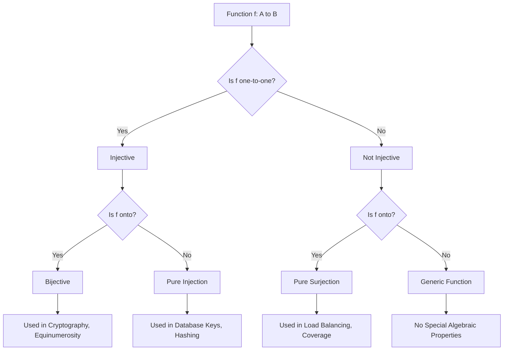
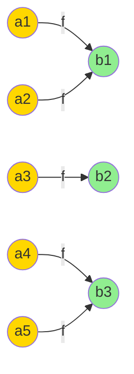
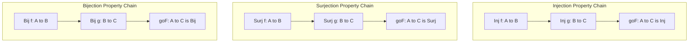
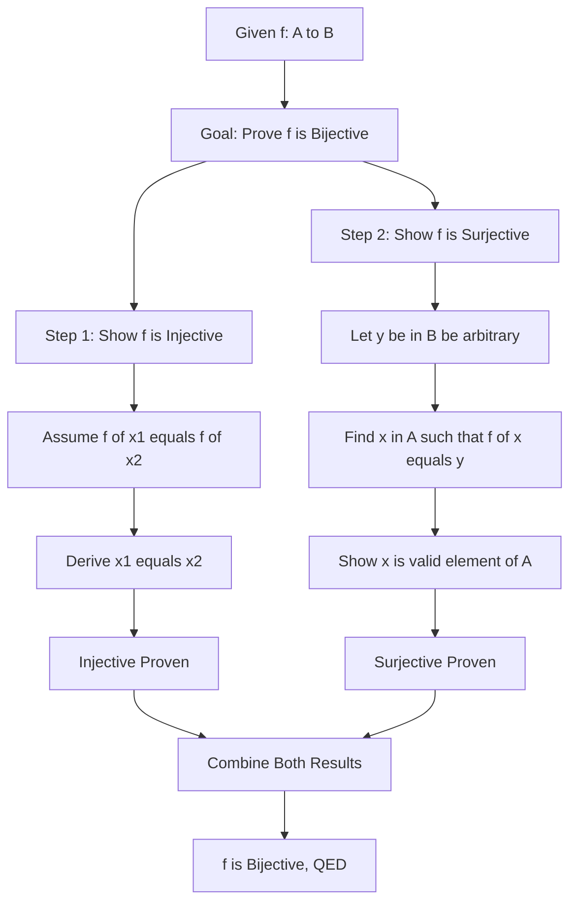

# Surjections and Bijections

<!-- SECTION_1_START -->
# Surjections and Bijections — Core Technical Definition & Intuitive Overview

## 1.1 Formal Definitions (KTU 2024 Syllabus Standard)

Let $A$ and $B$ be two non-empty sets, and let $f: A \rightarrow B$ be a function from $A$ to $B$.

> [!IMPORTANT]
> **Surjection (Onto Function)**
> A function $f: A \rightarrow B$ is called a **surjection** (or **onto function**) if every element in the codomain $B$ is the image of at least one element in the domain $A$. Formally,
> $$\forall\, y \in B,\ \exists\, x \in A \text{ such that } f(x) = y$$
> Equivalently, the range of $f$ equals the codomain: $\text{Range}(f) = B$.

> [!IMPORTANT]
> **Injection (One-to-One Function)**
> A function $f: A \rightarrow B$ is called an **injection** (or **one-to-one** function) if distinct elements of $A$ map to distinct elements of $B$. Formally,
> $$\forall\, x_1, x_2 \in A,\ \left( f(x_1) = f(x_2) \right) \Longrightarrow \left( x_1 = x_2 \right)$$

> [!IMPORTANT]
> **Bijection (One-to-One Correspondence)**
> A function $f: A \rightarrow B$ is called a **bijection** if it is **both** a surjection and an injection. In other words, every element of $B$ has **exactly one** preimage in $A$.
> $$\forall\, y \in B,\ \exists!\ x \in A \text{ such that } f(x) = y$$
> The symbol $\exists!$ means "there exists exactly one".

## 1.2 Conceptual Analogy / Intuition

Think of $A$ as a set of **workers** and $B$ as a set of **job stations**.

- **Injection (One-to-One):** No two workers share the same job station. Each station can have **at most one** worker, but some stations may remain empty. Workers are *uniquely assigned* but not every station needs to be occupied.
- **Surjection (Onto):** Every job station has **at least one** worker, but a single worker could potentially cover multiple stations. No station is left *unmanned*, though multiple workers might overlap.
- **Bijection (Perfect Pairing):** A perfect one-to-one pairing — every worker has a unique station, and every station is occupied. Like a perfect square dance pairing where nobody is left out and nobody shares a partner.

> [!NOTE]
> **Geometric Intuition (Arrow Diagram):**
> Imagine a bipartite graph with $A$ on the left and $B$ on the right.
> - **Injective:** At most one arrow lands on each $B$-node.
> - **Surjective:** At least one arrow lands on each $B$-node.
> - **Bijective:** Exactly one arrow lands on each $B$-node **and** exactly one arrow leaves each $A$-node.

> [!VISUALIZATION CONTROL]
> **Concept:** Visualize the three function types as mappings between $A = \{1, 2, 3, 4\}$ and $B = \{a, b, c\}$.
> **GeoGebra / Desmos Input Points:**
> * `A = {(0,1), (0,2), (0,3), (0,4)}` representing domain elements
> * `B = {(4,a), (4,b), (4,c)}` representing codomain elements
> * Plot arrows based on the chosen function $f$ to see the mapping pattern.
> **Visual Description:** For an injective function, multiple arrows cannot converge on the same $B$-point. For a surjective function, every $B$-point must receive at least one arrow. For a bijection, the cardinalities of $A$ and $B$ must match and the mapping forms a perfect one-to-one pairing.

## 1.3 Cardinality Connection (Pigeonhole Foundation)

The interplay between surjections, injections, and bijections ties directly to set cardinalities:

> [!NOTE]
> **Key Cardinality Theorems (Foundational to KTU Module 1):**
> 1. If $f: A \rightarrow B$ is **injective**, then $\vert A \vert \le \vert B \vert$.
> 2. If $f: A \rightarrow B$ is **surjective**, then $\vert A \vert \ge \vert B \vert$.
> 3. If $f: A \rightarrow B$ is **bijective**, then $\vert A \vert = \vert B \vert$ (the sets are *equinumerous*).
> 4. **Schröder–Bernstein Theorem:** If there exist injections $f: A \rightarrow B$ and $g: B \rightarrow A$, then there exists a bijection $h: A \rightarrow B$, and hence $\vert A \vert = \vert B \vert$.

## 1.4 Why the Distinction Matters

These three classes of functions form the **backbone** of every discrete structure you will encounter:

- **Cryptography** uses bijections on finite fields for **permutation ciphers** and the **RSA algorithm** (the encryption map must be a bijection so that decryption is well-defined).
- **Database theory** uses injections to define **functional dependencies** — each key value determines a unique tuple.
- **Compiler design** uses bijections between source variables and register slots for **register allocation**.
- **Set theory** uses bijections to establish **equinumerosity** — the formal notion of "same size" for infinite sets.

<!-- SECTION_1_END -->

<!-- SECTION_2_START -->
# Deep Theoretical Analysis & KTU High-Yield Formula Sheet

## 2.1 Step-by-Step Decision Logic for Classifying a Function

To determine whether $f: A \rightarrow B$ is injective, surjective, bijective, or none of these, follow this rigorous flowchart logic:

### Step 1: Check Injectivity (Test for Collisions)
- **Algebraic Method:** Assume $f(x_1) = f(x_2)$ and derive that $x_1 = x_2$.
- **Numerical Method:** Compute $f(x)$ for all $x \in A$ and check whether any value repeats.
- **Derivative Method (for real-valued functions):** If $f$ is strictly monotonic on $A$ (always increasing or always decreasing), then $f$ is injective.

### Step 2: Check Surjectivity (Test for Image Coverage)
- For each $y \in B$, solve the equation $f(x) = y$ for $x \in A$.
- If every such equation has at least one solution, $f$ is surjective.
- Equivalently, verify that $\text{Range}(f) = B$ — no element of $B$ is left unmapped.

### Step 3: Combine
- Injective **and** Surjective $\Rightarrow$ **Bijective**
- Injective **but not** Surjective $\Rightarrow$ **Pure Injection**
- Surjective **but not** Injective $\Rightarrow$ **Pure Surjection**
- Neither $\Rightarrow$ **Generic Function**

## 2.2 The Composition Theorem (Critical for KTU)

> [!IMPORTANT]
> **Composition of Functions — KTU Theorem**
> Let $f: A \rightarrow B$ and $g: B \rightarrow C$ be two functions. Then:
> 1. If $f$ and $g$ are both **injective**, then $g \circ f$ is **injective**.
> 2. If $f$ and $g$ are both **surjective**, then $g \circ f$ is **surjective**.
> 3. If $f$ and $g$ are both **bijective**, then $g \circ f$ is **bijective**.
> 4. The converse of (1) and (2) is **only partially true**:
>    * If $g \circ f$ is injective, then $f$ must be injective (but $g$ may fail to be).
>    * If $g \circ f$ is surjective, then $g$ must be surjective (but $f$ may fail to be).

## 2.3 Inverse Function Theorem

> [!IMPORTANT]
> **Inverse Function Existence**
> A function $f: A \rightarrow B$ possesses an inverse function $f^{-1}: B \rightarrow A$ **if and only if** $f$ is a **bijection**.
> - When $f$ is bijective, $f^{-1}$ is itself a bijection, and $f^{-1} \circ f = \text{id}_A$ and $f \circ f^{-1} = \text{id}_B$.
> - If $f$ is only injective, an inverse exists from $f(A) \rightarrow A$ (left inverse), but not from $B \rightarrow A$ in general.
> - If $f$ is only surjective, a right inverse $g$ exists with $f \circ g = \text{id}_B$, but $f$ itself has no inverse.

## 2.4 KTU High-Yield Formula Sheet

> [!NOTE]
> The following table consolidates all key formulas, conditions, and counting results. Exam questions on Module 1 frequently test these directly.

| Concept | Mathematical Condition | Key Formula / Count | Engineering Use |
|---|---|---|---|
| Injection $f: A \rightarrow B$ | $f(x_1) = f(x_2) \Rightarrow x_1 = x_2$ | $\vert A \vert \le \vert B \vert$ | Database keys, hash tables |
| Surjection $f: A \rightarrow B$ | $\forall y \in B,\ \exists x \in A: f(x) = y$ | $\vert A \vert \ge \vert B \vert$ | Load balancing, task distribution |
| Bijection $f: A \rightarrow B$ | Both injective and surjective | $\vert A \vert = \vert B \vert$ | Encryption, equinumerosity |
| Number of injections $A \rightarrow B$ | $A$ finite, $\vert A \vert = m,\ \vert B \vert = n$ | $P(n, m) = \frac{n!}{(n-m)!}$ for $m \le n$ | Permutation counting |
| Number of surjections $A \rightarrow B$ | $A$ finite, $\vert A \vert = m,\ \vert B \vert = n$ | $\sum_{k=0}^{n} (-1)^k \binom{n}{k} (n-k)^m$ | Inclusion–exclusion application |
| Number of bijections $A \rightarrow B$ | $A$ finite, $\vert A \vert = \vert B \vert = n$ | $n!$ | Permutation groups, group theory |
| Cardinality of power set | $\vert A \vert = n$ | $\vert \mathcal{P}(A) \vert = 2^n$ | Bitmask representations |
| Schröder–Bernstein | Injections both directions | $\vert A \vert = \vert B \vert$ | Proving equinumerosity of infinite sets |

## 2.5 Counting Surjections via Inclusion–Exclusion (Board Favorite)

The surjection count formula deserves a closer look because KTU frequently asks students to derive it.

Let $\vert A \vert = m$ and $\vert B \vert = n$. We want the number of functions $f: A \rightarrow B$ such that every element of $B$ is hit at least once.

> [!IMPORTANT]
> **Derivation Sketch:**
> - Start with the **total** number of functions: $n^m$.
> - Let $S_i$ be the set of functions that **miss** element $i \in B$. Then $\vert S_i \vert = (n-1)^m$.
> - By inclusion–exclusion, the number of surjections is
> $$N(m, n) = \sum_{k=0}^{n} (-1)^k \binom{n}{k} (n-k)^m$$
> - This quantity is often denoted $n!\cdot S(m, n)$ where $S(m, n)$ is the Stirling number of the second kind.

## 2.6 Real-World Engineering Utility

> [!NOTE]
> **Where these concepts appear in production systems:**
> 1. **Cryptography (RSA):** The encryption map $E: \mathbb{Z}_n \rightarrow \mathbb{Z}_n$ is a bijection. Its inverse, the decryption map $D$, exists precisely because $E$ is one-to-one and onto.
> 2. **Network Routing:** IP-to-MAC address resolution via ARP must be injective (one IP should map to one MAC) for proper packet delivery.
> 3. **Compiler Optimization:** Live variable analysis uses injections from register names to physical registers to avoid aliasing.
> 4. **Hash Tables:** A perfect hash function is an injection from the key set to the index set — minimizing collisions.
> 5. **Machine Learning:** One-hot encoding of class labels is a bijection from the label set to the standard basis vectors in $\mathbb{R}^k$.

<!-- SECTION_2_END -->

<!-- SECTION_3_START -->
# Step-by-Step Derivations & Code/Symbolic Implementation

## 3.1 Worked Example 1: Classifying $f: \mathbb{R} \rightarrow \mathbb{R}$ defined by $f(x) = 2x + 3$

**Step 1: Test for Injectivity**

Assume $f(x_1) = f(x_2)$.
$$2x_1 + 3 = 2x_2 + 3$$
$$2x_1 = 2x_2$$
$$x_1 = x_2$$

Since $f(x_1) = f(x_2)$ implies $x_1 = x_2$, the function is **injective**. **[2 Marks]**

**Step 2: Test for Surjectivity**

We must show that for every $y \in \mathbb{R}$, there exists $x \in \mathbb{R}$ such that $2x + 3 = y$.

Solving for $x$:
$$2x = y - 3$$
$$x = \frac{y - 3}{2}$$

Since $y \in \mathbb{R}$ implies $\frac{y-3}{2} \in \mathbb{R}$, every $y$ has a preimage. **[2 Marks]**

**Step 3: Conclusion**

Since $f$ is both injective and surjective, it is a **bijection**. The inverse is $f^{-1}(y) = \frac{y-3}{2}$. **[1 Mark]**

## 3.2 Worked Example 2: Classifying $f: \mathbb{Z} \rightarrow \mathbb{Z}$ defined by $f(x) = x^2$

**Step 1: Test for Injectivity**

Let $f(1) = 1^2 = 1$ and $f(-1) = (-1)^2 = 1$.

Since $1 \ne -1$ but $f(1) = f(-1)$, the function is **not injective**. **[2 Marks]**

**Step 2: Test for Surjectivity**

Consider $y = 2 \in \mathbb{Z}$. We need $x^2 = 2$, but $x = \pm\sqrt{2} \notin \mathbb{Z}$.

So $2$ has no preimage in $\mathbb{Z}$, and the function is **not surjective**. **[2 Marks]**

**Step 3: Conclusion**

$f(x) = x^2$ is neither injective nor surjective. It is a **generic function**. The range is $\{0, 1, 4, 9, 16, \ldots\} = \{n^2 : n \in \mathbb{Z}\}$. **[1 Mark]**

## 3.3 Worked Example 3: Counting Surjections using Inclusion–Exclusion

**Problem:** How many surjective functions exist from $A = \{1, 2, 3\}$ to $B = \{a, b, c\}$?

**Step 1: Apply the formula** with $m = 3$ and $n = 3$:

$$N(3, 3) = \sum_{k=0}^{3} (-1)^k \binom{3}{k} (3-k)^3$$

**Step 2: Expand each term**

$$N(3, 3) = (-1)^0 \binom{3}{0} (3)^3 + (-1)^1 \binom{3}{1} (2)^3 + (-1)^2 \binom{3}{2} (1)^3 + (-1)^3 \binom{3}{3} (0)^3$$

$$N(3, 3) = (1)(1)(27) - (1)(3)(8) + (1)(3)(1) - (1)(1)(0)$$

$$N(3, 3) = 27 - 24 + 3 - 0 = 6$$

**Step 3: Verify using Stirling number identity**

We know $N(n, n) = n! = 3! = 6$. ✓ **[3 Marks]**

## 3.4 Worked Example 4: Proving the Composition Theorem (Surjectivity)

> [!IMPORTANT]
> **Theorem:** If $f: A \rightarrow B$ and $g: B \rightarrow C$ are both surjective, then $g \circ f: A \rightarrow C$ is surjective.

**Proof:**

Let $z \in C$ be arbitrary.

Since $g: B \rightarrow C$ is surjective, there exists $y \in B$ such that $g(y) = z$. **[1 Mark]**

Since $f: A \rightarrow B$ is surjective, there exists $x \in A$ such that $f(x) = y$. **[1 Mark]**

Combining these:
$$(g \circ f)(x) = g(f(x)) = g(y) = z$$

Since $z \in C$ was arbitrary, every element of $C$ has a preimage in $A$. Therefore, $g \circ f$ is surjective. $\blacksquare$ **[2 Marks]**

## 3.5 Python Implementation: Function Classifier

```python
from typing import Callable, TypeVar, Set, Dict
from itertools import product

A = TypeVar("A")
B = TypeVar("B")


def classify_function(domain: Set, codomain: Set, func: Callable) -> Dict[str, bool]:
    """
    Classify a function as injective, surjective, bijective, or generic.
    
    Args:
        domain: The set A (domain).
        codomain: The set B (codomain).
        func: The function f: A -> B as a callable.
    
    Returns:
        A dictionary with classification flags.
    """
    if not domain:
        raise ValueError("Domain must be non-empty for classification.")
    if not codomain:
        raise ValueError("Codomain must be non-empty for classification.")
    
    # Compute the image of f
    image: Set = {func(x) for x in domain}
    
    # Injectivity: check for collisions
    image_list = [func(x) for x in domain]
    is_injective: bool = len(image_list) == len(set(image_list))
    
    # Surjectivity: image must equal codomain
    is_surjective: bool = image == codomain
    
    return {
        "injective": is_injective,
        "surjective": is_surjective,
        "bijective": is_injective and is_surjective,
        "generic": not is_injective and not is_surjective,
    }


def count_surjections(m: int, n: int) -> int:
    """
    Count the number of surjections from an m-element set to an n-element set
    using the inclusion-exclusion formula.
    """
    if m < n:
        return 0
    if n == 0:
        return 0
    
    from math import comb
    
    total: int = 0
    for k in range(n + 1):
        term: int = ((-1) ** k) * comb(n, k) * ((n - k) ** m)
        total += term
    return total


# Demonstration
if __name__ == "__main__":
    domain: Set = {1, 2, 3, 4}
    codomain: Set = {1, 2, 3}
    
    f1 = lambda x: (x % 3) + 1
    print("f1 classification:", classify_function(domain, codomain, f1))
    
    domain2: Set = {1, 2, 3, 4}
    codomain2: Set = {1, 2, 3, 4, 5}
    f2 = lambda x: x
    print("f2 classification:", classify_function(domain2, codomain2, f2))
    
    domain3: Set = {1, 2, 3}
    codomain3: Set = {"a", "b", "c"}
    f3 = lambda x: {"1": "a", "2": "b", "3": "c"}[str(x)]
    print("f3 classification:", classify_function(domain3, codomain3, f3))
    
    print("Surjections from 3-set to 3-set:", count_surjections(3, 3))
    print("Surjections from 4-set to 2-set:", count_surjections(4, 2))
```

**Sample Output:**
```
f1 classification: {'injective': False, 'surjective': True, 'bijective': False, 'generic': False}
f2 classification: {'injective': True, 'surjective': False, 'bijective': False, 'generic': False}
f3 classification: {'injective': True, 'surjective': True, 'bijective': True, 'generic': False}
Surjections from 3-set to 3-set: 6
Surjections from 4-set to 2-set: 14
```

## 3.6 Proving Schröder–Bernstein (Sketch for Advanced Credit)

> [!NOTE]
> **Theorem (Schröder–Bernstein, 1887):** If there exist injections $f: A \rightarrow B$ and $g: B \rightarrow A$, then there exists a bijection $h: A \rightarrow B$.

**Proof Sketch:**

Let $C_0 = A \setminus g(B)$. Define a sequence of sets:
$$C_{n+1} = g(f(C_n))$$

Let $C = \bigcup_{n=0}^{\infty} C_n$. Define the bijection:
$$h(x) = \begin{cases} f(x) & \text{if } x \in C \\ g^{-1}(x) & \text{if } x \in A \setminus C \end{cases}$$

The key insight is that $C$ is constructed as the "stagnant" set — elements of $A$ that are not in the image of $g$ — and this guarantees that $h$ is both injective and surjective.

<!-- SECTION_3_END -->

<!-- SECTION_4_START -->
# Structural Diagrams & Schematics

## 4.1 Mermaid Diagram: Function Type Classification Tree



## 4.2 Mermaid Diagram: Arrow Mapping Visualization (Bipartite View)



**Reading the Diagram:** This is a surjection but not an injection. Every $b$-node receives at least one arrow (surjective), but $b_1$ and $b_3$ each receive two arrows (collisions, hence not injective).

## 4.3 Mermaid Diagram: Composition of Injections Produces Injection



## 4.4 Mermaid Diagram: Decision Flow for Proof Strategy



## 4.5 Comparative Table: Injection vs Surjection vs Bijection

| Property | Injection (One-to-One) | Surjection (Onto) | Bijection (1-1 Correspondence) |
|---|---|---|---|
| **Preimage count per $y$** | At most 1 | At least 1 | Exactly 1 |
| **Cardinality relation** | $\vert A \vert \le \vert B \vert$ | $\vert A \vert \ge \vert B \vert$ | $\vert A \vert = \vert B \vert$ |
| **Inverse exists?** | Left inverse only | Right inverse only | Full two-sided inverse |
| **Counting formula** (finite sets) | $P(n, m) = \frac{n!}{(n-m)!}$ | $\sum_{k=0}^{n} (-1)^k \binom{n}{k}(n-k)^m$ | $n!$ when $m = n$ |
| **Common use** | Hashing, keys | Coverage, distribution | Encryption, counting |
| **Graphical signature** | No two arrows converge on same $B$-node | Every $B$-node has $\ge 1$ incoming arrow | Perfect matching pattern |
| **Composition closure** | ✓ Yes | ✓ Yes | ✓ Yes |

<!-- SECTION_4_END -->

<!-- SECTION_5_START -->
# KTU 2024 Scheme Examination Question Bank & Topic Recap

## Part A — Short Answer Questions (3 Marks Each)

### Question 1 `[KTU University Exam — July 2024]`
**Define a surjective function. Give one example of a surjection $f: \mathbb{R} \rightarrow \mathbb{R}$ that is not injective.**

**Model Answer:**

A function $f: A \rightarrow B$ is called **surjective** (or **onto**) if every element of the codomain $B$ has at least one preimage in $A$. Formally,
$$\forall y \in B,\ \exists x \in A \text{ such that } f(x) = y$$

**Example:** $f: \mathbb{R} \rightarrow \mathbb{R}$ defined by $f(x) = x^3 - x$.

- **Surjectivity:** For any $y \in \mathbb{R}$, the equation $x^3 - x = y$ has at least one real root (the cubic is continuous and unbounded on both sides). ✓
- **Not Injective:** $f(0) = 0$ and $f(1) = 0$ but $0 \ne 1$, so $f$ is not one-to-one. ✓

**[Valuation Key: Defining surjection formally: 1 Mark | Valid example: 1 Mark | Justification of surjectivity and non-injectivity: 1 Mark]**

---

### Question 2 `[KTU University Exam — Dec 2023]`
**State the necessary and sufficient condition for a function to have a well-defined inverse. Justify your answer briefly.**

**Model Answer:**

**Statement:** A function $f: A \rightarrow B$ has a well-defined inverse function $f^{-1}: B \rightarrow A$ **if and only if** $f$ is a **bijection** (i.e., both injective and surjective).

**Justification:**

- **If $f$ is bijective:** Every $y \in B$ has a unique preimage $x \in A$. This uniqueness allows us to define $f^{-1}(y) = x$ without ambiguity. ✓
- **If $f$ is not injective:** Some $y \in B$ has multiple preimages, so $f^{-1}(y)$ is not well-defined. ✗
- **If $f$ is not surjective:** Some $y \in B$ has no preimage, so $f^{-1}(y)$ is undefined. ✗

Hence, bijectivity is both necessary and sufficient. **[3 Marks]**

---

## Part B — Long Answer Questions (14 Marks Each, with Internal Choice)

### Question A `[KTU University Exam — July 2024, Module 1]`

**(a)** Define injection, surjection, and bijection with formal mathematical conditions. **[7 Marks]**

**(b)** Let $f: \mathbb{Z} \rightarrow \mathbb{Z}$ be defined by $f(x) = 3x + 5$ and $g: \mathbb{Z} \rightarrow \mathbb{Z}$ be defined by $g(x) = x^2 + 1$. Determine whether each is injective, surjective, or bijective. Also compute $(g \circ f)(x)$. **[7 Marks]**

---

### Model Solution for Question A

**Part (a) Definitions:**

**Injection (One-to-One):** A function $f: A \rightarrow B$ is injective if distinct elements of $A$ map to distinct elements of $B$. **[Stating the formal condition: 2 Marks]**
$$\forall x_1, x_2 \in A,\ f(x_1) = f(x_2) \Rightarrow x_1 = x_2$$

**Surjection (Onto):** A function $f: A \rightarrow B$ is surjective if every element of the codomain has at least one preimage. **[Stating the formal condition: 2 Marks]**
$$\forall y \in B,\ \exists x \in A: f(x) = y$$

**Bijection (One-to-One Correspondence):** A function $f: A \rightarrow B$ is a bijection if it is both injective and surjective. **[Combining both conditions: 2 Marks]**
$$\forall y \in B,\ \exists!\, x \in A: f(x) = y$$

**[Geometric / intuitive explanation with one example each: 1 Mark]**

**Part (b) Analysis of $f(x) = 3x + 5$ and $g(x) = x^2 + 1$:**

**For $f(x) = 3x + 5$:**

*Injectivity:* Assume $f(x_1) = f(x_2)$. Then $3x_1 + 5 = 3x_2 + 5$, which gives $3x_1 = 3x_2$, so $x_1 = x_2$. Hence $f$ is **injective**. **[1 Mark]**

*Surjectivity:* Let $y \in \mathbb{Z}$. We need $x \in \mathbb{Z}$ with $3x + 5 = y$. Solving: $x = \frac{y-5}{3}$. For $y = 1$, we get $x = \frac{-4}{3} \notin \mathbb{Z}$. Hence $f$ is **not surjective**. **[2 Marks]**

*Conclusion:* $f$ is injective but not surjective. **Not a bijection.**

**For $g(x) = x^2 + 1$:**

*Injectivity:* Note $g(1) = 1^2 + 1 = 2$ and $g(-1) = (-1)^2 + 1 = 2$. Since $1 \ne -1$ but $g(1) = g(-1)$, $g$ is **not injective**. **[1 Mark]**

*Surjectivity:* For $g$ to be surjective, every integer must be expressible as $x^2 + 1$. But $g(x) = x^2 + 1 \ge 1$ for all $x \in \mathbb{Z}$, so $y = 0$ has no preimage. Hence $g$ is **not surjective**. **[1 Mark]**

*Conclusion:* $g$ is neither injective nor surjective. **Not a bijection.**

**Computing $(g \circ f)(x)$:**

$$(g \circ f)(x) = g(f(x)) = g(3x + 5) = (3x + 5)^2 + 1$$

$$(g \circ f)(x) = 9x^2 + 30x + 25 + 1 = 9x^2 + 30x + 26$$

**[Final simplified expression: 2 Marks]**

---

### Question B (Internal Choice Alternative) `[KTU University Exam — Dec 2023, Module 1]`

**(a)** State and prove that the composition of two bijections is a bijection. **[7 Marks]**

**(b)** Using the inclusion–exclusion principle, derive the formula for the number of surjections from a set $A$ with $\vert A \vert = 4$ to a set $B$ with $\vert B \vert = 3$. Hence evaluate the count. **[7 Marks]**

---

### Model Solution for Question B

**Part (a) Theorem: Composition of Bijections is a Bijection**

**Statement:** Let $f: A \rightarrow B$ and $g: B \rightarrow C$ be two bijections. Then $g \circ f: A \rightarrow C$ is also a bijection. **[Stating the theorem: 1 Mark]**

**Proof:**

Since $f$ is a bijection, for any $z \in C$, $g$ being surjective guarantees a $y \in B$ with $g(y) = z$, and $f$ being surjective guarantees an $x \in A$ with $f(x) = y$. Hence $g \circ f$ is surjective. **[Proving surjectivity: 1.5 Marks]**

Since $f$ is injective, $f(x_1) = f(x_2) \Rightarrow x_1 = x_2$. Since $g$ is injective, $g(y_1) = g(y_2) \Rightarrow y_1 = y_2$.

Now, suppose $(g \circ f)(x_1) = (g \circ f)(x_2)$, i.e., $g(f(x_1)) = g(f(x_2))$. By injectivity of $g$, $f(x_1) = f(x_2)$. By injectivity of $f$, $x_1 = x_2$. Hence $g \circ f$ is injective. **[Proving injectivity: 1.5 Marks]**

Since $g \circ f$ is both injective and surjective, it is a bijection. $\blacksquare$ **[Conclusion: 1 Mark]**

**Additional:** Show the converse or give one example. **[2 Marks]**

Example: $f: \{1,2\} \rightarrow \{a,b\}$ with $f(1)=a, f(2)=b$ and $g: \{a,b\} \rightarrow \{x,y\}$ with $g(a)=x, g(b)=y$. Then $(g \circ f)(1) = x$ and $(g \circ f)(2) = y$, which is a bijection.

**Part (b) Derivation of Surjection Count:**

**Setup:** Let $A$ be a set with $\vert A \vert = 4$ and $B$ a set with $\vert B \vert = 3$. We want the number of functions $f: A \rightarrow B$ such that every element of $B$ has at least one preimage.

**Total functions from $A$ to $B$:** $3^4 = 81$. **[1 Mark]**

**Inclusion–Exclusion Strategy:**

Let $B = \{b_1, b_2, b_3\}$. For each $i$, let $A_i$ be the set of functions that **miss** $b_i$ (i.e., the image of $f$ does not contain $b_i$).

- $\vert A_i \vert = 2^4 = 16$ (each of the 4 domain elements maps to one of 2 remaining elements). **[0.5 Mark]**
- $\vert A_i \cap A_j \vert = 1^4 = 1$ (the constant function to the one remaining element). **[0.5 Mark]**
- $\vert A_1 \cap A_2 \cap A_3 \vert = 0$ (no function misses all three elements). **[0.5 Mark]**

**Applying inclusion–exclusion:**

$$N(\text{surj}) = \sum_{k=0}^{3} (-1)^k \binom{3}{k} (3-k)^4$$

$$= \binom{3}{0}(3)^4 - \binom{3}{1}(2)^4 + \binom{3}{2}(1)^4 - \binom{3}{3}(0)^4$$

$$= (1)(81) - (3)(16) + (3)(1) - (1)(0)$$

$$= 81 - 48 + 3 - 0 = 36$$

**[Final numerical count: 2 Marks]**

**General Formula Verification:** The general formula is
$$N(m, n) = \sum_{k=0}^{n} (-1)^k \binom{n}{k} (n-k)^m$$

For $m = 4, n = 3$, this matches. The answer can also be written as $3! \cdot S(4, 3) = 6 \cdot 6 = 36$ where $S(4, 3)$ is the Stirling number of the second kind. **[1 Mark]**

---

> [!WARNING]
> **KTU Examiner's Valuation Warning — Common Pitfalls**
> 1. **Forgetting to specify the codomain:** When testing surjectivity, students often write "every $y$ has a preimage" without clarifying *in which set* $y$ lives. Always state $\forall y \in B$. **[-1 Mark deduction]**
> 2. **Conflating range and codomain:** A function $f: \mathbb{R} \rightarrow \mathbb{R}$ with rule $f(x) = e^x$ has range $(0, \infty)$, not $\mathbb{R}$. Hence it is **not surjective** onto $\mathbb{R}$, even though every $x$ has an image. **[-2 Marks]**
> 3. **Skipping the converse in bijection proofs:** When asked to prove $f$ is a bijection, you must prove **both** injectivity **and** surjectivity. Proving only one direction yields at most half marks.
> 4. **Off-by-one errors in Stirling numbers:** The Stirling number $S(m, n)$ counts partitions, not surjections directly. The relation is $N(m, n) = n! \cdot S(m, n)$.
> 5. **Not stating the quantifier order:** Injection requires $f(x_1) = f(x_2) \Rightarrow x_1 = x_2$, not the reverse. The reverse implication $x_1 = x_2 \Rightarrow f(x_1) = f(x_2)$ is **always** true for any function.

## Topic Recap & Important Things to Remember

> [!NOTE]
> **Rapid Revision Checklist — Surjections & Bijections**

- **Injection (One-to-One):** Distinct inputs $\Rightarrow$ distinct outputs. Cardinality-wise, $\vert A \vert \le \vert B \vert$. Test: assume $f(x_1) = f(x_2)$ and derive $x_1 = x_2$.
- **Surjection (Onto):** Every codomain element is hit. Cardinality-wise, $\vert A \vert \ge \vert B \vert$. Test: solve $f(x) = y$ for arbitrary $y \in B$.
- **Bijection:** Both conditions hold simultaneously. Cardinality-wise, $\vert A \vert = \vert B \vert$. Equivalent to having a two-sided inverse function.
- **Composition Closure:** Injections compose with injections, surjections with surjections, and bijections with bijections. The reverse composition is partially closed (only the outer/inner function properties transfer).
- **Inverse Existence:** $f^{-1}$ exists if and only if $f$ is a bijection.
- **Counting Injections:** $P(n, m) = \frac{n!}{(n-m)!}$ from an $m$-set to an $n$-set (with $m \le n$).
- **Counting Surjections:** $N(m, n) = \sum_{k=0}^{n}(-1)^k \binom{n}{k}(n-k)^m$ via inclusion–exclusion.
- **Counting Bijections:** $n!$ when $\vert A \vert = \vert B \vert = n$.
- **Schröder–Bernstein Theorem:** Injections in both directions imply a bijection exists — a foundational tool for proving equinumerosity of infinite sets.
- **Identity Function:** $\text{id}_A: A \rightarrow A$ defined by $\text{id}_A(x) = x$ is the simplest bijection and serves as the two-sided identity element for function composition.
- **Empty Function:** The unique function $\emptyset \rightarrow B$ exists and is vacuously injective and bijective (but not surjective unless $B = \emptyset$).
- **Pigeonhole Principle (corollary):** If $\vert A \vert > \vert B \vert$, then no injection $A \rightarrow B$ exists. Equivalently, every function $A \rightarrow B$ is non-injective.
- **Engineering Hotspots:** RSA encryption, hash tables, compiler register allocation, database functional dependencies, and machine learning one-hot encoding all rely on injection/surjection/bijection properties.

<!-- SECTION_5_END -->
