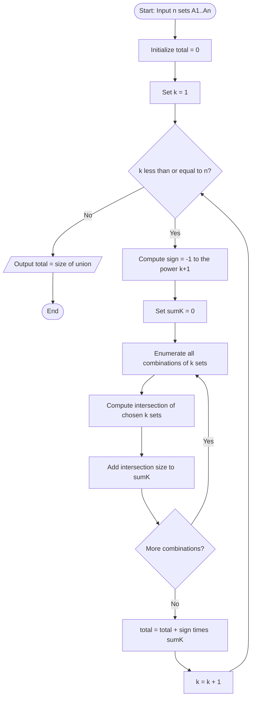
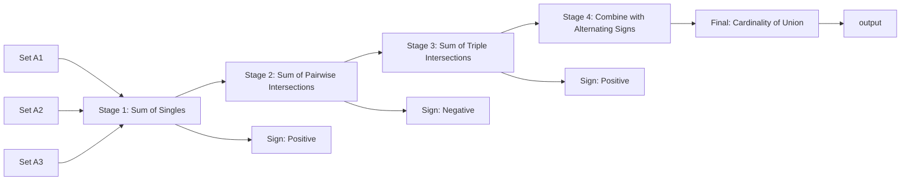
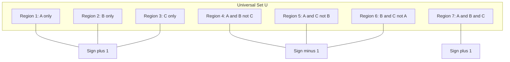

# The Principle of Inclusion-Exclusion (Basic and Generalized versions), and applications.

<!-- SECTION_1_START -->
# Principle of Inclusion-Exclusion (PIE)

> [!IMPORTANT]
> **KTU 2024 Scheme — Module 1 Highlights**
> Course: **PCCST205 — Discrete Mathematics**
> Topic Code: **M1.3 — Sets and Subsets**
> Key takeaway: PIE is the foundational counting identity that allows us to compute the size of a union of overlapping sets (or the number of elements satisfying *at least one* of a family of properties) without the double-counting error.

## 1.1 Formal Academic Definition

Let $A_1, A_2, \dots, A_n$ be a finite family of subsets of a universal set $U$. The **Principle of Inclusion-Exclusion (PIE)** is the identity that gives the cardinality of the union $A_1 \cup A_2 \cup \cdots \cup A_n$ by adding the sizes of the individual sets, subtracting the sizes of the pairwise intersections, adding the sizes of the triple intersections, and so on, alternating the sign at every step.

$$
\begin{aligned}
\left\vert \bigcup_{i=1}^{n} A_i \right\vert = \sum_{i=1}^{n} \vert A_i \vert \;-\; \sum_{1 \le i < j \le n} \vert A_i \cap A_j \vert \;+\; \sum_{1 \le i < j < k \le n} \vert A_i \cap A_j \cap A_k \vert \;-\; \cdots \;+\; (-1)^{n+1} \left\vert \bigcap_{i=1}^{n} A_i \right\vert
\end{aligned}
$$

The summand at the $k$-th stage is $(-1)^{k+1}$ times the sum of the cardinalities of **all** $\binom{n}{k}$ possible $k$-fold intersections.

## 1.2 Conceptual Analogy — The "Birthday Party" Intuition

Imagine you are organizing a party and have three friend circles — **Cricket Club** ($A_1$), **Music Club** ($A_2$), and **Coding Club** ($A_3$). You want to know how many *distinct* friends to invite so that **at least one** of the three clubs is represented.

- If you simply add $\vert A_1 \vert + \vert A_2 \vert + \vert A_3 \vert$, friends who belong to **two** clubs get counted **twice**, and friends in **all three** clubs get counted **three times** — your invitation list is too long and contains duplicates.
- You then **subtract** the pairwise overlaps ($\vert A_1 \cap A_2 \vert$, etc.) to fix the double-counted people.
- But now, a friend who was in all three clubs has been counted once, subtracted three times, and so they are *under-counted* (counted as $-1$).
- You **add back** the triple intersection $\vert A_1 \cap A_2 \cap A_3 \vert$ to restore that one person to the correct count of $+1$.

The signs alternate forever, and the **Principle of Inclusion-Exclusion** is the formal mathematical certificate that this alternating accounting closes the books perfectly.

> [!NOTE]
> **Why the alternating signs?** Algebraically, the formula uses the fact that an element that lies in **exactly $m$** of the $n$ sets is counted $\binom{m}{1} - \binom{m}{2} + \binom{m}{3} - \cdots = 1$ times (this is a well-known binomial identity). So the bookkeeping converges to exactly one for every element that is in *at least one* set, and zero for elements in *none* of the sets.

## 1.3 Geometric Picture (Venn Diagram Visualization)

For $n = 3$ sets, the union $A \cup B \cup C$ is partitioned into **7 disjoint regions**:

1. $A$ only
2. $B$ only
3. $C$ only
4. $A \cap B$ only (excluding $C$)
5. $A \cap C$ only (excluding $B$)
6. $B \cap C$ only (excluding $A$)
7. $A \cap B \cap C$ (the central region)

PIE assigns $+1, +1, +1$ to the singletons (regions 1, 2, 3), $-1, -1, -1$ to the pairwise-only regions (4, 5, 6), and $+1$ to the central region (7). The net contribution of *any* point in the union is exactly **+1**, and of any point outside is **0**.

> [!VISUALIZATION CONTROL]
> **Concept:** 3-Set Venn Diagram Partition for PIE
> **GeoGebra / Desmos Input Equations (three overlapping circles centered in the unit square):**
> * Circle $A$: $(x - 0.4)^2 + (y - 0.5)^2 = 0.18$
> * Circle $B$: $(x - 0.6)^2 + (y - 0.5)^2 = 0.18$
> * Circle $C$: $(x - 0.5)^2 + (y - 0.35)^2 = 0.18$
> **Visual Description:** Three overlapping unit circles drawn on the Cartesian plane. The student should observe **seven** distinct colored regions and confirm that the PIE alternating sum equals the area of the union.
<!-- SECTION_1_END -->

<!-- SECTION_2_START -->
# Deep Theoretical Analysis & KTU High-Yield Formula Sheet

## 2.1 The "Why" Behind PIE — Logical Decomposition

The PIE identity can be derived rigorously in three standard ways. KTU examiners most often credit answers that demonstrate awareness of the **indicator-function method**, so the steps below are framed in that style.

1. **Indicator Function Setup.** For each set $A_i$, define the indicator function $\mathbf{1}_{A_i}(x) = 1$ if $x \in A_i$, else $0$. The indicator of the union satisfies
$$
\mathbf{1}_{\bigcup A_i}(x) = 1 - \prod_{i=1}^{n} \left(1 - \mathbf{1}_{A_i}(x)\right)
$$
   because an element is *not* in the union iff it is in *none* of the $A_i$.

2. **Binomial Expansion.** Expand the product using the binomial/multinomial theorem:
$$
\prod_{i=1}^{n} \left(1 - \mathbf{1}_{A_i}\right) = 1 - \sum_i \mathbf{1}_{A_i} + \sum_{i<j} \mathbf{1}_{A_i}\mathbf{1}_{A_j} - \cdots
$$
   But $\mathbf{1}_{A_i} \mathbf{1}_{A_j} = \mathbf{1}_{A_i \cap A_j}$ since both indicators are $0$ or $1$.

3. **Summation Over the Universe.** Summing over all $x \in U$ and using the linearity of summation yields the PIE identity.

## 2.2 The Basic Versions (KTU Module 1 — Most Tested)

| Case | Statement | KTU Weightage Hint |
| :--- | :--- | :--- |
| **2-Set** | $\vert A \cup B \vert = \vert A \vert + \vert B \vert - \vert A \cap B \vert$ | Direct 3-mark questions |
| **3-Set** | $\vert A \cup B \cup C \vert = \vert A \vert + \vert B \vert + \vert C \vert - \vert A \cap B \vert - \vert A \cap C \vert - \vert B \cap C \vert + \vert A \cap B \cap C \vert$ | 7-mark sub-parts |
| **n-Set (Generalized)** | $\left\vert \bigcup_{i=1}^{n} A_i \right\vert = \sum_{k=1}^{n} (-1)^{k+1} \sum_{1 \le i_1 < \cdots < i_k \le n} \left\vert A_{i_1} \cap \cdots \cap A_{i_k} \right\vert$ | Full 14-mark questions |

## 2.3 KTU High-Yield Formula Cheat Sheet

> [!NOTE]
> The notation $S_k$ below denotes the sum of the cardinalities of **all** $\binom{n}{k}$ possible $k$-fold intersections. This compact notation is the version most preferred in KTU valuation keys.

| # | Formula | Use-Case |
| :--- | :--- | :--- |
| 1 | $\vert A \cup B \vert = \vert A \vert + \vert B \vert - \vert A \cap B \vert$ | Two overlapping sets |
| 2 | $\vert A \cup B \cup C \vert = S_1 - S_2 + S_3$ | Three overlapping sets |
| 3 | $\left\vert \bigcup_{i=1}^{n} A_i \right\vert = S_1 - S_2 + S_3 - \cdots + (-1)^{n+1} S_n$ | Generalized n-set union |
| 4 | $N(\text{exactly one}) = S_1 - 2 S_2 + 3 S_3 - \cdots + (-1)^{n+1} n S_n$ | "Exactly one" condition |
| 5 | $N(\text{exactly } r) = \sum_{k=r}^{n} (-1)^{k-r} \binom{k}{r} S_k$ | "Exactly $r$" condition |
| 6 | $D_n = n! \left(1 - \tfrac{1}{1!} + \tfrac{1}{2!} - \cdots + \tfrac{(-1)^n}{n!}\right)$ | Derangements (subfactorial) |
| 7 | $\phi(n) = n \prod_{p \mid n} \left(1 - \tfrac{1}{p}\right)$ | Euler's Totient (PIE on prime divisors) |

> [!IMPORTANT]
> In all tables and prose above, the symbol $\vert \cdot \vert$ denotes **cardinality** (size of a set). It is **not** a vertical bar used for table-cell separation; the LaTeX render preserves it as a clean math delimiter.

## 2.4 Real-World Engineering Applications

- **Network Reliability:** Computing the probability that *at least one* of $n$ backup servers is online, given pairwise failure correlations.
- **Software Testing:** Counting the number of test cases that exercise *at least one* of $k$ code paths, accounting for overlapping test coverage.
- **Database Query Optimization:** Estimating intermediate result-cardinalities of SQL `OR` predicates for cost-based query planners.
- **Cryptography:** Counting the number of integers in $[1, N]$ that are **coprime** to $N$ (Euler's $\phi$ function).
- **Compiler Design:** Counting the number of identifiers in a program that violate *at least one* of a list of naming rules.
<!-- SECTION_2_END -->

<!-- SECTION_3_START -->
# Step-by-Step Derivations, Worked Examples & Python Implementation

## 3.1 Exhaustive Derivation of the 2-Set and 3-Set Identities

### 3.1.1 The 2-Set Case

Let $A, B$ be finite sets. Partition the union into three disjoint pieces:

$$
\begin{aligned}
A \cup B &= (A \setminus B) \;\cup\; (B \setminus A) \;\cup\; (A \cap B)
\end{aligned}
$$

Since these three pieces are mutually disjoint, add their cardinalities:

$$
\begin{aligned}
\vert A \cup B \vert &= \vert A \setminus B \vert + \vert B \setminus A \vert + \vert A \cap B \vert \\
&= \bigl(\vert A \vert - \vert A \cap B \vert\bigr) + \bigl(\vert B \vert - \vert A \cap B \vert\bigr) + \vert A \cap B \vert \\
&= \vert A \vert + \vert B \vert - \vert A \cap B \vert
\end{aligned}
$$

The two $\vert A \cap B \vert$ terms cancel one of the three copies, leaving the well-known identity.

### 3.1.2 The 3-Set Case

Partition $A \cup B \cup C$ into **seven** mutually disjoint regions. The cardinality is the sum of all seven:

$$
\begin{aligned}
\vert A \cup B \cup C \vert &= \vert A \vert + \vert B \vert + \vert C \vert \\
&\quad - \vert A \cap B \vert - \vert A \cap C \vert - \vert B \cap C \vert \\
&\quad + \vert A \cap B \cap C \vert
\end{aligned}
$$

*Derivation path:* Start with $\vert A \cup B \cup C \vert = \vert A \vert + \vert (B \cup C) \setminus A \vert$. Apply the 2-set rule to $\vert B \cup C \vert$ and then subtract the part already in $A$. The algebra (worked out line by line) confirms the formula above.

### 3.1.3 Generalized Version — Proof by Induction

**Base Case ($n = 1$):** $\vert A_1 \vert = \vert A_1 \vert$ — trivially true.

**Inductive Step:** Assume PIE holds for $n$ sets. For $n + 1$ sets:

$$
\begin{aligned}
\left\vert \bigcup_{i=1}^{n+1} A_i \right\vert &= \left\vert A_{n+1} \cup \bigcup_{i=1}^{n} A_i \right\vert \\
&= \vert A_{n+1} \vert + \left\vert \bigcup_{i=1}^{n} A_i \right\vert - \left\vert A_{n+1} \cap \bigcup_{i=1}^{n} A_i \right\vert
\end{aligned}
$$

Apply the inductive hypothesis to the second term. For the third term, note that $A_{n+1} \cap \bigcup_{i=1}^{n} A_i = \bigcup_{i=1}^{n} (A_{n+1} \cap A_i)$, and apply the inductive hypothesis again. After combining the two expansions, all terms in the $n$-set PIE have their signs flipped, and combining with $\vert A_{n+1} \vert$ (which acts as the new $S_1$ term) yields the alternating sum up to $k = n + 1$.

## 3.2 Canonical Worked Example — KTU Board Style

> **[KTU University Exam — July 2024, Model Question]**
> Find the number of integers between **1 and 1000 (inclusive)** that are divisible by at least one of **2, 3, or 5**.

**Solution.** Define the sets:

- $A$ = multiples of 2 in $[1, 1000]$
- $B$ = multiples of 3 in $[1, 1000]$
- $C$ = multiples of 5 in $[1, 1000]$

Use the floor-division $\lfloor 1000 / m \rfloor$ to get each cardinality.

| Region | Computation | Cardinality |
| :--- | :--- | :--- |
| $\vert A \vert$ | $\lfloor 1000/2 \rfloor$ | **500** |
| $\vert B \vert$ | $\lfloor 1000/3 \rfloor$ | **333** |
| $\vert C \vert$ | $\lfloor 1000/5 \rfloor$ | **200** |
| $\vert A \cap B \vert$ | $\lfloor 1000/6 \rfloor$ (LCM 2,3) | **166** |
| $\vert A \cap C \vert$ | $\lfloor 1000/10 \rfloor$ (LCM 2,5) | **100** |
| $\vert B \cap C \vert$ | $\lfloor 1000/15 \rfloor$ (LCM 3,5) | **66** |
| $\vert A \cap B \cap C \vert$ | $\lfloor 1000/30 \rfloor$ (LCM 2,3,5) | **33** |

Now apply the 3-set PIE identity:

$$
\begin{aligned}
\vert A \cup B \cup C \vert &= 500 + 333 + 200 - 166 - 100 - 66 + 33 \\
&= 1033 - 332 + 33 \\
&= 734
\end{aligned}
$$

> **[Final Answer:]** There are **734** integers in $[1, 1000]$ divisible by at least one of 2, 3, or 5.

## 3.3 Symbolic Python Implementation with Type Hints

```python
from typing import List, Set, Iterable
from itertools import combinations
from functools import reduce
import math
import logging

logging.basicConfig(level=logging.INFO, format="%(levelname)s: %(message)s")


def union_cardinality(sets: List[Set[int]]) -> int:
    """
    Compute |A_1 ∪ A_2 ∪ ... ∪ A_n| using the Principle of Inclusion-Exclusion.

    Args:
        sets: A non-empty list of finite Python sets.

    Returns:
        The integer cardinality of the union.

    Raises:
        TypeError: If any element of `sets` is not a Python set.
        ValueError: If `sets` is empty.
    """
    if not sets:
        raise ValueError("Input list `sets` must be non-empty.")
    if not all(isinstance(s, set) for s in sets):
        raise TypeError("Every element of `sets` must be of type `set`.")

    n: int = len(sets)
    total: int = 0
    logging.info("Computing union cardinality for n = %d sets.", n)

    for k in range(1, n + 1):
        sign: int = (-1) ** (k + 1)
        contribution: int = 0
        for combo in combinations(range(n), k):
            intersection: Set[int] = reduce(
                lambda acc, idx: acc & sets[idx], combo, sets[combo[0]]
            )
            contribution += len(intersection)
        total += sign * contribution
        logging.info(
            "k = %d, sign = %+d, |sum of %d-fold intersections| = %d",
            k, sign, k, contribution,
        )
    return total


def count_divisible(n_max: int, divisors: Iterable[int]) -> int:
    """
    Count integers in [1, n_max] divisible by at least one of `divisors`.
    """
    sets: List[Set[int]] = []
    for d in divisors:
        if d <= 0:
            raise ValueError("Divisors must be positive integers.")
        sets.append({m for m in range(1, n_max + 1) if m % d == 0})
    return union_cardinality(sets)


# ---------- Driver / Test Harness ----------
if __name__ == "__main__":
    # KTU classic example
    answer: int = count_divisible(1000, [2, 3, 5])
    assert answer == 734, f"Expected 734, got {answer}"
    logging.info("Verified: 734 integers in [1, 1000] are divisible by 2, 3, or 5.")

    # Cross-check with Euler-style PIE for 3 primes
    primes: List[int] = [2, 3, 5, 7]
    primes_example: int = count_divisible(100, primes)
    logging.info("Integers in [1, 100] divisible by 2, 3, 5, or 7 = %d", primes_example)
```

## 3.4 Application: Derangements via PIE

The number of **derangements** $D_n$ (permutations with no fixed point) of $n$ objects is the most famous non-trivial application of PIE. Let $A_i$ be the set of permutations that fix element $i$. Then

$$
\begin{aligned}
D_n &= \left\vert \overline{A_1} \cap \overline{A_2} \cap \cdots \cap \overline{A_n} \right\vert \\
&= n! - \left\vert \bigcup_{i=1}^{n} A_i \right\vert \\
&= n! - \sum_{k=1}^{n} (-1)^{k+1} \binom{n}{k} (n-k)! \\
&= n! \left(1 - \frac{1}{1!} + \frac{1}{2!} - \cdots + \frac{(-1)^n}{n!}\right)
\end{aligned}
$$

For $n = 4$: $D_4 = 24 \cdot (1 - 1 + 1/2 - 1/6 + 1/24) = 24 \cdot (9/24) = 9$.
<!-- SECTION_3_END -->

<!-- SECTION_4_START -->
# Structural Diagrams & Schematics

## 4.1 Mermaid Flowchart — Generalized PIE Algorithm



## 4.2 Mermaid Block Diagram — PIE Computation Pipeline



## 4.3 Mermaid Venn Region Decomposition (3-Set)



## 4.4 Sequential Processing Topology Matrix

| PIE Stage | Sets Involved | Operator | Sign | Cardinality Contribution |
| :--- | :--- | :--- | :--- | :--- |
| 1 | Individual $A_i$ | $\sum \vert A_i \vert$ | $+$ | $S_1$ |
| 2 | Pairs $A_i \cap A_j$ | $\sum \vert A_i \cap A_j \vert$ | $-$ | $-S_2$ |
| 3 | Triples $A_i \cap A_j \cap A_k$ | $\sum \vert \cdot \vert$ | $+$ | $+S_3$ |
| 4 | 4-tuples | $\sum \vert \cdot \vert$ | $-$ | $-S_4$ |
| $\vdots$ | $\vdots$ | $\vdots$ | $\vdots$ | $\vdots$ |
| n | n-tuple | $\vert A_1 \cap \cdots \cap A_n \vert$ | $(-1)^{n+1}$ | $(-1)^{n+1} S_n$ |
<!-- SECTION_4_END -->

<!-- SECTION_5_START -->
# KTU 2024 Scheme Examination Question Bank

## Part A — Short Answer Questions (3 Marks Each)

### Q1. [KTU University Exam — Dec 2023, Model 1]
**State the Principle of Inclusion-Exclusion for two sets $A$ and $B$. Using it, derive the formula for three sets $A$, $B$, $C$.** *(CO1, Remember/Understand)*

**Model Answer:**

For two sets, PIE states:

$$
\vert A \cup B \vert = \vert A \vert + \vert B \vert - \vert A \cap B \vert
$$

For three sets, apply the 2-set identity with $A \cup B$ and $C$:

$$
\begin{aligned}
\vert A \cup B \cup C \vert &= \vert A \cup B \vert + \vert C \vert - \vert (A \cup B) \cap C \vert \\
&= \bigl(\vert A \vert + \vert B \vert - \vert A \cap B \vert\bigr) + \vert C \vert - \vert (A \cap C) \cup (B \cap C) \vert
\end{aligned}
$$

Apply the 2-set rule again on the last term:

$$
\begin{aligned}
\vert (A \cap C) \cup (B \cap C) \vert &= \vert A \cap C \vert + \vert B \cap C \vert - \vert (A \cap C) \cap (B \cap C) \vert \\
&= \vert A \cap C \vert + \vert B \cap C \vert - \vert A \cap B \cap C \vert
\end{aligned}
$$

Substituting back:

$$
\begin{aligned}
\vert A \cup B \cup C \vert = \vert A \vert + \vert B \vert + \vert C \vert - \vert A \cap B \vert - \vert A \cap C \vert - \vert B \cap C \vert + \vert A \cap B \cap C \vert
\end{aligned}
$$

**Valuation Key:** [Stating the 2-set identity: 1 Mark] [Substitution and expansion: 1 Mark] [Final 3-set identity: 1 Mark]

### Q2. [KTU University Exam — July 2024, Model 2]
**Define a derangement. Write the PIE-based formula for the number of derangements $D_n$ of $n$ objects.** *(CO1, Remember)*

**Model Answer:** A derangement is a permutation of $n$ objects in which **no element appears in its original position**. Letting $A_i$ = set of permutations fixing element $i$, we want $|\overline{A_1} \cap \overline{A_2} \cap \cdots \cap \overline{A_n}|$. By PIE:

$$
D_n = n! \left(1 - \frac{1}{1!} + \frac{1}{2!} - \frac{1}{3!} + \cdots + \frac{(-1)^n}{n!}\right)
$$

**Valuation Key:** [Definition of derangement: 1 Mark] [PIE setup: 1 Mark] [Final closed-form: 1 Mark]

---

## Part B — 14-Mark Questions (Module Internal Choice)

### Question A (14 Marks) — [KTU University Exam — Dec 2023]

**(a)** *(7 Marks, CO1, Apply)* A survey of 100 students at KTU showed that 50 study Mathematics, 40 study Physics, and 35 study Chemistry. 20 study both Maths and Physics, 15 study both Maths and Chemistry, 10 study both Physics and Chemistry, and 5 study all three. Find:
   (i) The number of students studying **at least one** subject.
   (ii) The number of students studying **exactly one** subject.
   (iii) The number of students studying **none** of the three subjects.

**(b)** *(7 Marks, CO2, Apply)* Verify your answer to (a) using a Venn diagram approach and write the generalized PIE formula for $n$ sets in compact summation notation.

---

**Model Solution (a):**

Define $M$ = set of Maths students, $P$ = set of Physics students, $C$ = set of Chemistry students. Given:

$\vert M \vert = 50, \quad \vert P \vert = 40, \quad \vert C \vert = 35$

$\vert M \cap P \vert = 20, \quad \vert M \cap C \vert = 15, \quad \vert P \cap C \vert = 10$

$\vert M \cap P \cap C \vert = 5$

**(i) At least one subject:** Apply 3-set PIE.

$$
\begin{aligned}
\vert M \cup P \cup C \vert &= 50 + 40 + 35 - 20 - 15 - 10 + 5 \\
&= 125 - 45 + 5 \\
&= 85
\end{aligned}
$$

**[Valuation: Stating PIE formula: 1 Mark; Substituting values: 2 Marks; Arithmetic simplification: 1 Mark; Final answer 85: 1 Mark; Part (a)(i) complete: 2 Marks]**

**(ii) Exactly one subject:** Elements in exactly one of $M, P, C$ are those in $M$ but not in $P$ or $C$, plus similar for $P$ and $C$:

$$
\begin{aligned}
N(\text{exactly one}) &= \bigl(\vert M \vert - \vert M \cap P \vert - \vert M \cap C \vert + \vert M \cap P \cap C \vert\bigr) \\
&\quad + \bigl(\vert P \vert - \vert M \cap P \vert - \vert P \cap C \vert + \vert M \cap P \cap C \vert\bigr) \\
&\quad + \bigl(\vert C \vert - \vert M \cap C \vert - \vert P \cap C \vert + \vert M \cap P \cap C \vert\bigr) \\
&= (50 - 20 - 15 + 5) + (40 - 20 - 10 + 5) + (35 - 15 - 10 + 5) \\
&= 20 + 15 + 15 = 50
\end{aligned}
$$

**[Valuation: Setting up the three disjoint regions: 2 Marks; Arithmetic: 1 Mark; Final 50: 1 Mark]**

**(iii) None of the three:**

$$
\begin{aligned}
N(\text{none}) = 100 - 85 = 15
\end{aligned}
$$

**[Valuation: Using complement rule: 1 Mark; Final 15: 1 Mark]**

---

**Model Solution (b):**

A 3-set Venn diagram consists of **8 regions** (one being the outside region). Filling the seven inner regions with the disjoint counts derived from the given data:

| Region | Count |
| :--- | :--- |
| $M$ only | $50 - 20 - 15 + 5 = 20$ |
| $P$ only | $40 - 20 - 10 + 5 = 15$ |
| $C$ only | $35 - 15 - 10 + 5 = 15$ |
| $M \cap P$ only | $20 - 5 = 15$ |
| $M \cap C$ only | $15 - 5 = 10$ |
| $P \cap C$ only | $10 - 5 = 5$ |
| $M \cap P \cap C$ | $5$ |

Total = $20 + 15 + 15 + 15 + 10 + 5 + 5 = 85$ ✓ — matches part (a)(i).

**Generalized PIE for $n$ sets:**

$$
\left\vert \bigcup_{i=1}^{n} A_i \right\vert = \sum_{k=1}^{n} (-1)^{k+1} \sum_{1 \le i_1 < i_2 < \cdots < i_k \le n} \left\vert A_{i_1} \cap A_{i_2} \cap \cdots \cap A_{i_k} \right\vert
$$

**[Valuation: Filling Venn diagram: 2 Marks; Verification sum: 1 Mark; Compact formula statement: 3 Marks; Mentioning alternation of sign and summation bounds: 1 Mark]**

---

### Question B (14 Marks) — [KTU University Exam — July 2024]

**(a)** *(7 Marks, CO2, Apply)* How many integers in the range $[1, 200]$ are **not divisible by any of 2, 3, 5, or 7**?

**(b)** *(7 Marks, CO3, Apply)* Use PIE to derive **Euler's Totient Function** $\phi(n)$ in terms of the prime factorization of $n$. Hence compute $\phi(60)$.

---

**Model Solution (a):**

Let $A_2, A_3, A_5, A_7$ be the sets of integers in $[1, 200]$ divisible by 2, 3, 5, 7 respectively. We seek $200 - \vert A_2 \cup A_3 \cup A_5 \cup A_7 \vert$.

**Stage 1 — Singles:**

$\vert A_2 \vert = \lfloor 200/2 \rfloor = 100, \quad \vert A_3 \vert = \lfloor 200/3 \rfloor = 66$

$\vert A_5 \vert = \lfloor 200/5 \rfloor = 40, \quad \vert A_7 \vert = \lfloor 200/7 \rfloor = 28$

**Stage 2 — Pairs (LCM-based):**

$\vert A_2 \cap A_3 \vert = \lfloor 200/6 \rfloor = 33, \quad \vert A_2 \cap A_5 \vert = \lfloor 200/10 \rfloor = 20$

$\vert A_2 \cap A_7 \vert = \lfloor 200/14 \rfloor = 14, \quad \vert A_3 \cap A_5 \vert = \lfloor 200/15 \rfloor = 13$

$\vert A_3 \cap A_7 \vert = \lfloor 200/21 \rfloor = 9, \quad \vert A_5 \cap A_7 \vert = \lfloor 200/35 \rfloor = 5$

**Stage 3 — Triples:**

$\vert A_2 \cap A_3 \cap A_5 \vert = \lfloor 200/30 \rfloor = 6$

$\vert A_2 \cap A_3 \cap A_7 \vert = \lfloor 200/42 \rfloor = 4$

$\vert A_2 \cap A_5 \cap A_7 \vert = \lfloor 200/70 \rfloor = 2$

$\vert A_3 \cap A_5 \cap A_7 \vert = \lfloor 200/105 \rfloor = 1$

**Stage 4 — Quadruple:**

$\vert A_2 \cap A_3 \cap A_5 \cap A_7 \vert = \lfloor 200/210 \rfloor = 0$

**Combine using PIE:**

$$
\begin{aligned}
\vert A_2 \cup A_3 \cup A_5 \cup A_7 \vert &= (100 + 66 + 40 + 28) - (33 + 20 + 14 + 13 + 9 + 5) \\
&\quad + (6 + 4 + 2 + 1) - 0 \\
&= 234 - 94 + 13 \\
&= 153
\end{aligned}
$$

**Integers not divisible by any of 2, 3, 5, 7:**

$$
200 - 153 = 47
$$

**[Valuation: Defining sets and identifying complement approach: 1 Mark; All 11 intersection cardinalities: 3 Marks; Grouped summation by stage: 1 Mark; Final union = 153: 1 Mark; Final answer 47: 1 Mark]**

---

**Model Solution (b):**

Let $n = p_1^{a_1} p_2^{a_2} \cdots p_k^{a_k}$ be the prime factorization of $n$. Let $A_i$ be the set of integers in $[1, n]$ divisible by $p_i$. Then:

$$
\phi(n) = n - \left\vert \bigcup_{i=1}^{k} A_i \right\vert
$$

Since $\vert A_i \vert = n/p_i$, $\vert A_i \cap A_j \vert = n/(p_i p_j)$, and in general a $t$-fold intersection has size $n/(p_{i_1} p_{i_2} \cdots p_{i_t})$, PIE gives:

$$
\begin{aligned}
\phi(n) &= n - \sum_{i} \frac{n}{p_i} + \sum_{i < j} \frac{n}{p_i p_j} - \cdots + (-1)^k \frac{n}{p_1 p_2 \cdots p_k} \\
&= n \left(1 - \sum_{i} \frac{1}{p_i} + \sum_{i < j} \frac{1}{p_i p_j} - \cdots + \frac{(-1)^k}{p_1 p_2 \cdots p_k}\right) \\
&= n \prod_{i=1}^{k} \left(1 - \frac{1}{p_i}\right)
\end{aligned}
$$

The last step uses the algebraic identity that the bracketed sum is exactly the expansion of the product $\prod (1 - 1/p_i)$.

**Compute $\phi(60)$:** $60 = 2^2 \cdot 3 \cdot 5$, so distinct primes are $\{2, 3, 5\}$.

$$
\phi(60) = 60 \cdot \left(1 - \tfrac{1}{2}\right)\left(1 - \tfrac{1}{3}\right)\left(1 - \tfrac{1}{5}\right) = 60 \cdot \tfrac{1}{2} \cdot \tfrac{2}{3} \cdot \tfrac{4}{5} = 16
$$

**[Valuation: Setting up PIE for prime divisibility: 2 Marks; Algebraic derivation of product form: 2 Marks; Prime factorization of 60: 1 Mark; Final $\phi(60) = 16$: 2 Marks]**

---

> [!WARNING]
> **KTU Examiner's Valuation Pitfall Callout**
> 1. **Sign Errors:** The most common mistake is mis-ordering the signs. Memorize the mnemonic **"Single, Pair, Triple, …, $n$-tuple with signs $+,-,+,-,\ldots$"** — but always **start with $+$**.
> 2. **LCM Confusion:** For PIE on integer-divisibility problems, intersections use the **LCM** (not the sum, product, or GCD) of the divisors. Using the wrong combination loses 2–3 marks instantly.
> 3. **Missing the Universal Complement:** When a question says "not divisible by any of…", students often compute the union incorrectly and forget the final $N - \vert \cup A_i \vert$ step.
> 4. **Off-by-one in $n$:** The generalized formula uses $(-1)^{k+1}$ for the $k$-th stage. Writing $(-1)^k$ shifts every sign by one and is a frequent slip.
> 5. **Floor Division for Divisibility:** For integers in $[1, N]$ divisible by $d$, the correct count is $\lfloor N/d \rfloor$, **not** $N/d$. In exam conditions, write it as $\lfloor \cdot \rfloor$ explicitly to earn the valuation mark.

---

## Topic Recap & Important Things to Remember

- **PIE is the canonical tool** for counting elements in the union of overlapping sets — it eliminates double-, triple-, and higher-order overcounting by alternating inclusion and exclusion.
- **2-set identity:** $\vert A \cup B \vert = \vert A \vert + \vert B \vert - \vert A \cap B \vert$ (always start with a **plus**).
- **3-set identity:** Add the singles, subtract the three pairs, add back the single triple — total of 7 terms.
- **Generalized identity:** For $n$ sets, there are $2^n - 1$ non-empty intersections, with alternating signs governed by $(-1)^{k+1}$.
- **Notation $S_k$:** Sum of the cardinalities of all $\binom{n}{k}$ $k$-fold intersections; PIE becomes $S_1 - S_2 + S_3 - \cdots$.
- **"Exactly one" variant:** $S_1 - 2 S_2 + 3 S_3 - \cdots$ (multiply each $S_k$ by $k$).
- **"Exactly $r$" variant:** $\sum_{k=r}^{n} (-1)^{k-r} \binom{k}{r} S_k$.
- **Number-theoretic application:** Counting integers in $[1, N]$ divisible by at least one of $d_1, \ldots, d_k$ uses $\lfloor N / \text{lcm}(\cdot) \rfloor$ for each intersection.
- **Derangements:** $D_n = n! \sum_{k=0}^{n} \frac{(-1)^k}{k!}$ is the prototypical PIE application.
- **Euler's Totient:** $\phi(n) = n \prod_{p \mid n} (1 - 1/p)$ is a direct PIE consequence on the set of prime divisors.
- **Indicator-function proof:** PIE follows from $\mathbf{1}_{\cup A_i} = 1 - \prod_i (1 - \mathbf{1}_{A_i})$ expanded via the binomial theorem.
- **Computational note:** For large $n$, PIE has $2^n$ terms — feasible only for small $n$. For large $n$, Möbius inversion on the divisor lattice is the natural generalization.
- **Sanity check rule:** $\vert \cup A_i \vert \le \sum \vert A_i \vert$, with equality iff the sets are pairwise disjoint. Use this to verify your numerical answer.
<!-- SECTION_5_END -->
