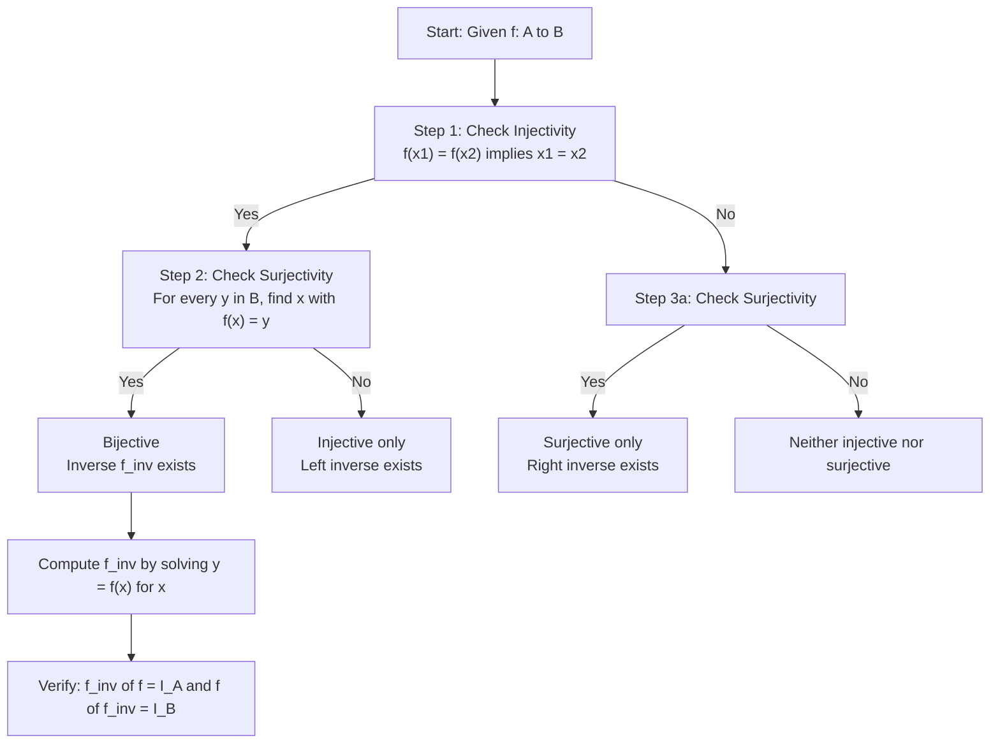
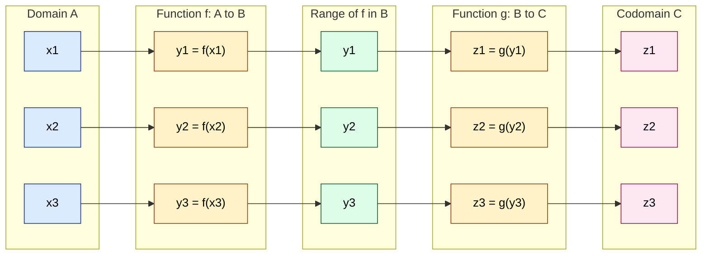
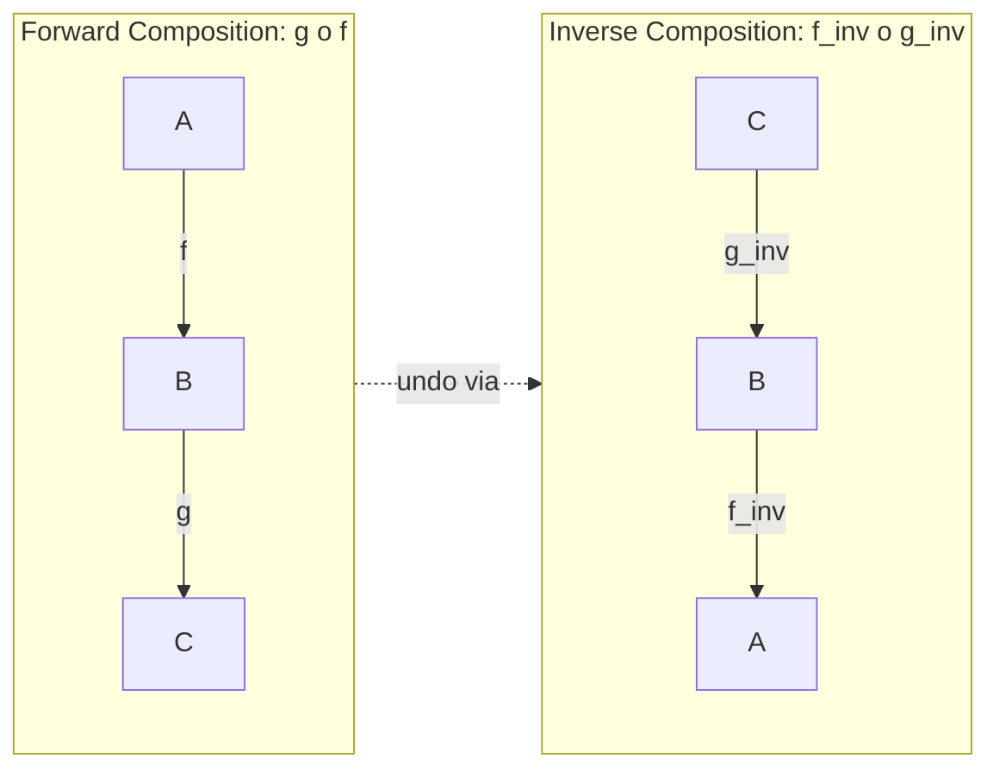
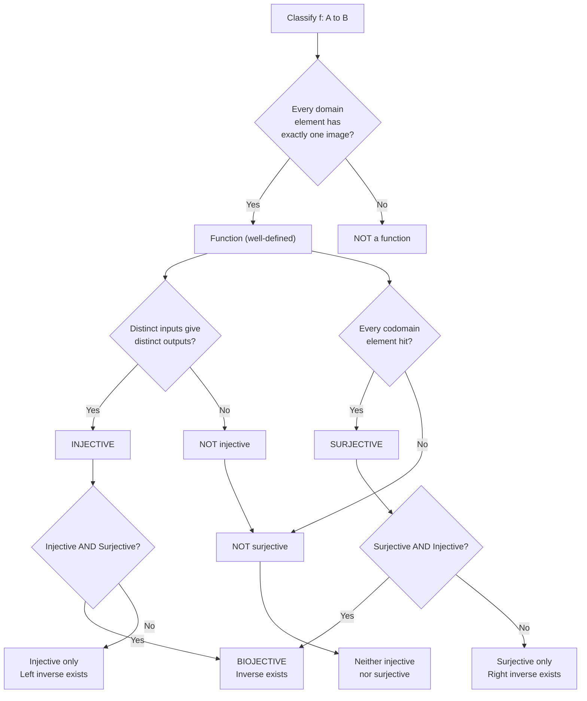
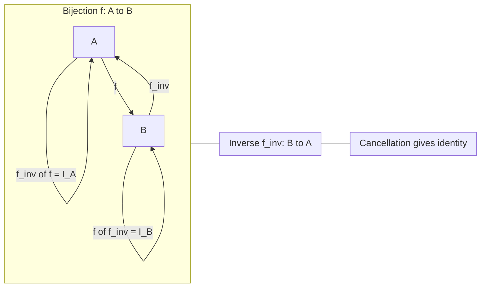

# Functions: One-to-one, onto, bijective, inverse functions, composition

<!-- SECTION_1_START -->
# Functions: One-to-One, Onto, Bijective, Inverse & Composition

## 1. Core Definition (KTU 2024 Syllabus Terminology)

> [!NOTE]
> **Definition — Function (Map):** Let $A$ and $B$ be two non-empty sets. A **function** $f$ from $A$ to $B$, written $f: A \to B$, is a rule of correspondence that assigns to **each and every** element $x \in A$ **exactly one** element $y \in B$. We write $f(x) = y$ and say "$y$ is the image of $x$" and "$x$ is the pre-image of $y$".

Formally, $f$ is a subset of the Cartesian product $A \times B$ such that:

$$f \subseteq A \times B \quad \text{with} \quad (\forall x \in A)(\exists ! y \in B)\; (x, y) \in f$$

The domain is $\text{dom}(f) = A$, the codomain is $\text{cod}(f) = B$, and the **range** (or image) is $\text{range}(f) = \{f(x) \mid x \in A\}$.

### Conceptual Analogy / Intuition

Think of a function like a **vending machine** in a college canteen:

- **Domain ($A$)** = the set of buttons you can press (input options).
- **Codomain ($B$)** = the set of *all* snacks the machine *could* dispense (including those currently out of stock).
- **Range** = the set of snacks that the machine *actually* dispenses today.
- Each button must give **exactly one** snack (you cannot press "A2" and get both a samosa **and** a juice simultaneously — that would violate the "exactly one" rule).

> [!IMPORTANT]
> **KTU Highlight — Codomain vs Range:** Many students write $\text{cod}(f)$ and $\text{range}(f)$ interchangeably. The **codomain is fixed by the function declaration** $f: A \to B$, while the **range is computed** from the actual outputs. This distinction is what separates "onto" from "not onto".

---

## 2. Types of Functions

### 2.1 One-to-One (Injective) Functions

> [!NOTE]
> **Definition — Injective (One-to-One):** A function $f: A \to B$ is **one-to-one** (or **injective**) if different elements in the domain map to different elements in the codomain:
> $$\forall x_1, x_2 \in A, \quad f(x_1) = f(x_2) \implies x_1 = x_2$$
> Equivalently (contrapositive): $x_1 \neq x_2 \implies f(x_1) \neq f(x_2)$.

**Real-World Analogy:** Aadhaar number ↔ Indian citizen. Every citizen has a *unique* Aadhaar number, and no two distinct citizens share one. The mapping "citizen $\to$ Aadhaar" is injective.

### 2.2 Onto (Surjective) Functions

> [!NOTE]
> **Definition — Surjective (Onto):** A function $f: A \to B$ is **onto** (or **surjective**) if every element in the codomain $B$ has at least one pre-image in the domain $A$:
> $$\forall y \in B, \exists x \in A \text{ such that } f(x) = y$$
> In set notation: $\text{range}(f) = B$ (or $\text{range}(f) = \text{cod}(f)$).

**Real-World Analogy:** Every seat (1 to 50) in a KTU exam hall is *occupied* by exactly one student. The assignment "student $\to$ seat-number" is surjective — no seat remains empty.

### 2.3 Bijective Functions

> [!NOTE]
> **Definition — Bijective:** A function $f: A \to B$ is **bijective** if it is **both injective and surjective**. Such a function establishes a *perfect one-to-one correspondence* between $A$ and $B$, and a necessary consequence is $\vert A \vert = \vert B \vert$.

**Real-World Analogy:** A perfect pairing between KTU roll numbers and exam seats — every roll number has a unique seat (injective), and every seat has a roll number (surjective).

---

## 3. Inverse Functions

> [!NOTE]
> **Definition — Inverse Function:** Let $f: A \to B$ be a **bijective** function. The **inverse function** $f^{-1}: B \to A$ is defined as:
> $$f^{-1}(y) = x \iff f(x) = y$$

> [!WARNING]
> **KTU Pitfall:** $f^{-1}$ denotes the **inverse function**, **not** the reciprocal $1/f(x)$. Also, only **bijective** functions possess an inverse. For non-bijective functions one can only define a *partial* inverse or a *left/right* inverse — this is a common exam trap.

**Cancellation Laws (Key Properties of $f^{-1}$):**
$$f^{-1}(f(x)) = x \quad \forall x \in A$$
$$f(f^{-1}(y)) = y \quad \forall y \in B$$

---

## 4. Composition of Functions

> [!NOTE]
> **Definition — Composition:** Let $f: A \to B$ and $g: B \to C$ be two functions. The **composite function** $g \circ f: A \to C$ is defined by:
> $$(g \circ f)(x) = g(f(x)) \quad \forall x \in A$$
> We say $f$ is *followed by* $g$. Composition is only valid when $\text{range}(f) \subseteq \text{dom}(g)$.

**Real-World Analogy:** Two-stage data pipeline: first a sensor converts temperature (°C) to voltage (mV) — that is $f$. Then an ADC converts voltage to a digital reading — that is $g$. The composite $g \circ f$ gives the overall reading directly from the temperature.

> [!IMPORTANT]
> **KTU Highlight — Order Matters:** In general, $g \circ f \neq f \circ g$. Composition is **not commutative**. However, it **is associative**: $(h \circ g) \circ f = h \circ (g \circ f)$ whenever the compositions are defined.

---

## 5. The Identity Function

> [!NOTE]
> **Definition:** The **identity function** on a set $A$ is the function $I_A: A \to A$ defined by $I_A(x) = x$ for all $x \in A$. It acts as the multiplicative identity for function composition:
> $$f \circ I_A = f \quad \text{and} \quad I_B \circ f = f$$

---

## 6. Visualization of Function Types

> [!VISUALIZATION]
> **Concept:** Visual comparison of Injective, Surjective, and Bijective mappings on a 2-D coordinate plot of two finite sets $A = \{1, 2, 3, 4\}$ and $B = \{a, b, c\}$.
> **Desmos/GeoGebra-style input points:**
> * Injective-only: $f(1)=a, f(2)=a, f(3)=b, f(4)=c$ — *not onto* (some codomain elements untouched) and *not one-to-one* ($1$ and $2$ collide).
> * Surjective-only: $f(1)=a, f(2)=b, f(3)=b, f(4)=c$ — *onto* (every codomain element hit) but *not one-to-one*.
> * Bijective: requires $\vert A \vert = \vert B \vert$ and a perfect pairing.
> **Visual Description:** Draw two columns (domain on left, codomain on right). Arrows must not share a target for injectivity; every codomain node must be hit for surjectivity; both properties together imply a perfect one-to-one arrow matching.

<!-- SECTION_1_END -->

<!-- SECTION_2_START -->
# Deep Theoretical Analysis & KTU High-Yield Formula Sheet

## 1. Detailed Decision Logic for Function Type

When given $f: A \to B$, classify using the following two-step diagnostic:

### Step 1 — Test Injectivity (One-to-One)
Pick the *algebraic* route that suits the function form:

- **Polynomial / linear:** Show $f(x_1) = f(x_2) \implies x_1 = x_2$. For polynomial $f$, an equivalent shortcut is: check whether the polynomial is *strictly monotonic* on its domain (use the derivative $f'(x)$).
- **Discrete / set-based:** Build a two-column table and check whether any codomain value appears in the *image column* more than once.
- **General proof method:** Assume $f(x_1) = f(x_2)$ and deduce $x_1 = x_2$ using valid algebraic manipulation. Each step must be justified.

### Step 2 — Test Surjectivity (Onto)
- **Constructive method:** For an arbitrary $y \in B$, explicitly solve $y = f(x)$ for $x \in A$. If a solution exists for every $y$, then $f$ is onto.
- **Counter-example method:** Find a *single* $y_0 \in B$ such that no $x \in A$ satisfies $f(x) = y_0$. One counter-example is enough to disprove surjectivity.

### Step 3 — Combine
| Injectivity | Surjectivity | Conclusion |
|:---:|:---:|:---|
| ✔ Yes | ✔ Yes | **Bijective** (inverse exists) |
| ✔ Yes | ✘ No | Injective only (left-inverse exists, not unique) |
| ✘ No | ✔ Yes | Surjective only (right-inverse exists, not unique) |
| ✘ No | ✘ No | Neither |

---

## 2. Counting Function Types (Cardinality Insight)

> [!IMPORTANT]
> **KTU Frequently Tested Result:** For finite sets with $\vert A \vert = m$ and $\vert B \vert = n$:
> - Number of **total** functions from $A$ to $B$ = $n^m$.
> - Number of **injective** functions from $A$ to $B$ = $n \cdot (n-1) \cdot (n-2) \cdots (n-m+1) = \frac{n!}{(n-m)!}$, valid only if $m \le n$; otherwise **zero**.
> - Number of **surjective** functions from $A$ to $B$ = $n! \cdot S(m, n)$ where $S(m, n)$ is the Stirling number of the second kind (valid only if $m \ge n$).
> - Number of **bijective** functions from $A$ to $B$ = $n!$ (requires $m = n$).

These formulas are directly assessed in KTU Part-A 3-mark questions.

---

## 3. Properties of Composition and Inverse

### 3.1 Inverse Composition Theorem
If $f: A \to B$ and $g: B \to C$ are both bijective, then:
$$(g \circ f)^{-1} = f^{-1} \circ g^{-1}$$
Notice that the order **reverses** — the "socks and shoes" rule.

> [!TIP]
> **Memory Aid:** "Put on socks, then shoes. To undo: take off shoes first, then socks." This is the order-reversal rule for inverse of composition.

### 3.2 Identity Composition
For any bijective $f: A \to B$:
$$f \circ f^{-1} = I_B \quad \text{and} \quad f^{-1} \circ f = I_A$$

### 3.3 Associativity of Composition
$$h \circ (g \circ f) = (h \circ g) \circ f$$
This means parentheses in long compositions are optional — a property heavily exploited in group theory and functional programming.

---

## 4. KTU Formula Sheet / Cheat Sheet

| Concept | Formula / Condition | Domain Restriction | Engineering Use-Case |
|---|---|---|---|
| Function notation | $f: A \to B$ | $A, B$ non-empty | API endpoints, mathematical models |
| Injectivity | $f(x_1) = f(x_2) \Rightarrow x_1 = x_2$ | None | Database primary keys, hashing |
| Surjectivity | $\forall y \in B, \exists x \in A: f(x) = y$ | None | Lossless codecs, full-coverage testing |
| Bijectivity | Both injective and surjective | Requires $\vert A \vert = \vert B \vert$ for finite sets | Cryptographic permutations |
| Inverse exists | $f$ is bijective | Must be one-to-one and onto | Decryption, undo operations |
| Inverse of $f(x) = ax + b$ | $f^{-1}(x) = \frac{x - b}{a}$ | $a \neq 0$ | Linear calibration, scaling |
| Composite | $(g \circ f)(x) = g(f(x))$ | $\text{range}(f) \subseteq \text{dom}(g)$ | Signal pipelines, function chaining |
| Inverse of composite | $(g \circ f)^{-1} = f^{-1} \circ g^{-1}$ | $f, g$ both bijective | Reversible computing, undo stacks |
| Total functions | $n^m$ | $\vert A \vert = m, \vert B \vert = n$ | Combinatorics in algorithms |
| Injective functions | $\frac{n!}{(n-m)!}$ | $m \le n$ | Permutation counting |
| Bijective functions | $n!$ | $m = n$ | Symmetric group $S_n$ |
| Identity function | $I_A(x) = x$ | Defined on $A$ | Default operation, neutral element |

> [!IMPORTANT]
> **Vertical pipe rule observed:** All set-cardinality notations use $\vert A \vert$ (single-character `vert` analog in $\LaTeX$).

---

## 5. Real-World Engineering & CS Utility

| Application Area | Function Type Used | Why It Matters |
|---|---|---|
| **Cryptography (AES, RSA)** | Bijective permutations | Encryption must be reversible with a unique decryption key. |
| **Hash Tables** | Injective hash on keys | Avoids collisions, guarantees $O(1)$ lookup integrity. |
| **Database Normalization** | Functional dependencies | A primary key function is injective; foreign key relations test surjectivity. |
| **Compiler Design** | Composition of parsers/lexers | Each compiler phase is a function; composition models the full pipeline. |
| **Digital Logic / FPGA** | Boolean functions $f: \{0,1\}^n \to \{0,1\}^m$ | Bijective maps implement reversible logic (QCA, adiabatic circuits). |
| **Image Processing** | Pixel transformations | Bijective transforms (FFT, DCT variants) preserve all information. |
| **Machine Learning** | Activation functions $\sigma$ | Injectivity determines whether the network is invertible (cf. normalizing flows). |

<!-- SECTION_2_END -->

<!-- SECTION_3_START -->
# Step-by-Step Derivations, Proofs & Python Implementation

## Part A — Mathematical Derivations (Exhaustive, No Steps Skipped)

### Derivation 1: Inverse of a Linear Function

**Problem:** Find the inverse of $f: \mathbb{R} \to \mathbb{R}$ given by $f(x) = 3x - 7$.

**Step 1 — Verify bijectivity.**
$f$ is linear with slope $3 \neq 0$, hence strictly monotonic (increasing). So $f$ is **injective**.
For any $y \in \mathbb{R}$, the equation $3x - 7 = y$ has the solution $x = (y+7)/3 \in \mathbb{R}$. So $f$ is **surjective**.
Therefore $f$ is **bijective** and an inverse exists.

**Step 2 — Solve for $x$.**

$$y = 3x - 7$$

Add $7$ to both sides:

$$y + 7 = 3x$$

Divide by $3$ (allowed since $3 \neq 0$):

$$x = \frac{y + 7}{3}$$

**Step 3 — Replace $y$ with the input variable and $x$ with the output name.**

$$f^{-1}(x) = \frac{x + 7}{3}$$

**Step 4 — Verify cancellation laws.**

Compute $f^{-1}(f(x))$:

$$f^{-1}(f(x)) = f^{-1}(3x - 7) = \frac{(3x - 7) + 7}{3} = \frac{3x}{3} = x \quad \checkmark$$

Compute $f(f^{-1}(x))$:

$$f(f^{-1}(x)) = f\!\left(\frac{x + 7}{3}\right) = 3 \cdot \frac{x + 7}{3} - 7 = (x + 7) - 7 = x \quad \checkmark$$

> **[Valuation Key: 2 marks for bijectivity justification, 2 marks for solving, 1 mark each for both cancellation-law verifications]**

---

### Derivation 2: Proving $f(x) = x^3 - x$ is *not* injective

**Problem:** Show that $f: \mathbb{R} \to \mathbb{R}$ defined by $f(x) = x^3 - x$ is **not injective**.

**Step 1 — Recall injectivity requires unique pre-images.**

We must exhibit **two distinct** real numbers $x_1 \neq x_2$ such that $f(x_1) = f(x_2)$.

**Step 2 — Algebraic search.**

Set $f(x_1) = f(x_2)$:

$$x_1^3 - x_1 = x_2^3 - x_2$$

Rearrange:

$$x_1^3 - x_2^3 = x_1 - x_2$$

Factor using the identity $a^3 - b^3 = (a-b)(a^2 + ab + b^2)$:

$$(x_1 - x_2)(x_1^2 + x_1 x_2 + x_2^2) = (x_1 - x_2)$$

Bring all terms to one side:

$$(x_1 - x_2)(x_1^2 + x_1 x_2 + x_2^2 - 1) = 0$$

So either $x_1 = x_2$ (trivial) **or** $x_1^2 + x_1 x_2 + x_2^2 = 1$.

**Step 3 — Find a concrete pair.**

Choose $x_1 = 1$ and solve for $x_2$:

$$1 + x_2 + x_2^2 = 1 \implies x_2^2 + x_2 = 0 \implies x_2(x_2 + 1) = 0$$

So $x_2 = 0$ or $x_2 = -1$. Pick $x_2 = 0$.

**Step 4 — Verify the counter-example.**

$$f(1) = 1^3 - 1 = 0, \quad f(0) = 0^3 - 0 = 0$$

So $f(1) = f(0)$ but $1 \neq 0$. Therefore $f$ is **not injective**. $\blacksquare$

---

### Derivation 3: Proving $f(x) = x^3$ is bijective on $\mathbb{R}$

**Step 1 — Injective proof.**

Suppose $f(x_1) = f(x_2)$, i.e. $x_1^3 = x_2^3$. Taking real cube roots preserves the equality:

$$\sqrt[3]{x_1^3} = \sqrt[3]{x_2^3} \implies x_1 = x_2$$

Hence $f$ is **injective**.

**Step 2 — Surjective proof.**

Let $y \in \mathbb{R}$ be arbitrary. Choose $x = \sqrt[3]{y} \in \mathbb{R}$. Then:

$$f(x) = \left(\sqrt[3]{y}\right)^3 = y$$

Hence every $y$ has a pre-image. So $f$ is **surjective**.

**Step 3 — Conclusion.**

$f$ is both injective and surjective, therefore **bijective**. Its inverse is $f^{-1}(x) = \sqrt[3]{x}$, which matches the cube-root function on $\mathbb{R}$.

---

### Derivation 4: Composition of $f(x) = 2x + 1$ and $g(x) = x^2 - 3$

**Problem:** Compute $(g \circ f)(x)$ and $(f \circ g)(x)$, and comment on commutativity.

**Compute $g \circ f$:**

$$(g \circ f)(x) = g(f(x)) = g(2x + 1) = (2x + 1)^2 - 3$$

Expand $(2x+1)^2$:

$$(2x+1)^2 = 4x^2 + 4x + 1$$

So:

$$(g \circ f)(x) = 4x^2 + 4x + 1 - 3 = 4x^2 + 4x - 2$$

**Compute $f \circ g$:**

$$(f \circ g)(x) = f(g(x)) = f(x^2 - 3) = 2(x^2 - 3) + 1$$

Distribute:

$$2(x^2 - 3) = 2x^2 - 6$$

So:

$$(f \circ g)(x) = 2x^2 - 6 + 1 = 2x^2 - 5$$

**Comparison:**

$$g \circ f = 4x^2 + 4x - 2, \quad f \circ g = 2x^2 - 5$$

These are **not equal**, demonstrating that function composition is **not commutative** in general.

---

### Derivation 5: Inverse of Composite — Socks and Shoes Proof

**Theorem:** If $f$ and $g$ are bijective, then $(g \circ f)^{-1} = f^{-1} \circ g^{-1}$.

**Proof.**
Let $y \in C$ be arbitrary. We want to find $(g \circ f)^{-1}(y)$.

By definition of inverse:

$$(g \circ f)^{-1}(y) = x \iff (g \circ f)(x) = y \iff g(f(x)) = y$$

Apply $g^{-1}$ to both sides of $g(f(x)) = y$:

$$f(x) = g^{-1}(y)$$

Apply $f^{-1}$ to both sides:

$$x = f^{-1}(g^{-1}(y)) = (f^{-1} \circ g^{-1})(y)$$

Since this holds for every $y \in C$, the function $f^{-1} \circ g^{-1}$ satisfies the definition of $(g \circ f)^{-1}$. Therefore:

$$(g \circ f)^{-1} = f^{-1} \circ g^{-1} \quad \blacksquare$$

---

## Part B — Python Implementation (Fully Type-Hinted & Error-Handled)

```python
"""
Module: function_analysis.py
Purpose: Pedagogical toolkit for testing injectivity, surjectivity,
         bijectivity, computing inverses, and compositions.
Author : KTU Discrete Mathematics Notes
"""

from __future__ import annotations
from typing import Callable, Dict, Generic, Iterable, List, Set, Tuple, TypeVar
import logging

# Configure logging
logging.basicConfig(
    level=logging.INFO,
    format="%(asctime)s | %(levelname)s | %(message)s",
)

T = TypeVar("T")
U = TypeVar("U")


# ============================================================
# 1. REPRESENTATION OF A FINITE FUNCTION AS A DICTIONARY
# ============================================================
class FiniteFunction(Generic[T, U]):
    """A finite function f: A -> B represented as a Python dict.

    Invariant: each key in ``mapping`` appears exactly once
    (the Python ``dict`` enforces this), preserving the
    'exactly-one image' rule of a mathematical function.
    """

    def __init__(
        self,
        mapping: Dict[T, U],
        codomain: Set[U],
        name: str = "f",
    ) -> None:
        if not mapping:
            raise ValueError("Domain of a function cannot be empty.")
        if any(v not in codomain for v in mapping.values()):
            raise ValueError(
                f"Function {name!r} maps values outside declared codomain."
            )
        self.mapping: Dict[T, U] = dict(mapping)  # defensive copy
        self.codomain: Set[U] = set(codomain)
        self.name = name
        logging.info(
            "Created function %s: |A|=%d, |B|=%d",
            name, len(mapping), len(codomain),
        )

    # -------- Core evaluation --------------------------------
    def __call__(self, x: T) -> U:
        if x not in self.mapping:
            raise KeyError(f"{x!r} is not in the domain of {self.name}.")
        return self.mapping[x]

    # -------- Type tests -------------------------------------
    def is_injective(self) -> bool:
        """Returns True iff f is one-to-one (no two domain elements
        share the same image)."""
        images: List[U] = list(self.mapping.values())
        return len(images) == len(set(images))

    def is_surjective(self) -> bool:
        """Returns True iff range(f) == codomain."""
        return set(self.mapping.values()) == self.codomain

    def is_bijective(self) -> bool:
        return self.is_injective() and self.is_surjective()

    # -------- Inverse (only if bijective) --------------------
    def inverse(self) -> "FiniteFunction[U, T]":
        if not self.is_bijective():
            raise ValueError(
                f"Inverse of {self.name} does not exist — "
                "function is not bijective."
            )
        inv_mapping: Dict[U, T] = {v: k for k, v in self.mapping.items()}
        return FiniteFunction(
            mapping=inv_mapping,
            codomain=set(self.mapping.keys()),
            name=f"{self.name}^(-1)",
        )

    # -------- Composition -------------------------------------
    def compose(self, other: "FiniteFunction[U, U]") -> "FiniteFunction":
        """Returns (self o other): A -> C, where other: A -> B
        and self: B -> C."""
        composed: Dict = {}
        for x, b in other.mapping.items():
            composed[x] = self.mapping[b]
        return FiniteFunction(
            mapping=composed,
            codomain=self.codomain,
            name=f"({self.name} o {other.name})",
        )


# ============================================================
# 2. DEMO RUN — KTU-style worked example
# ============================================================
def _demo() -> None:
    # f: {1,2,3} -> {a,b,c} defined by 1->b, 2->a, 3->c (bijective)
    f = FiniteFunction(
        mapping={1: "b", 2: "a", 3: "c"},
        codomain={"a", "b", "c"},
        name="f",
    )
    # g: {a,b,c} -> {x,y} defined by a->x, b->y, c->y (NOT injective)
    g = FiniteFunction(
        mapping={"a": "x", "b": "y", "c": "y"},
        codomain={"x", "y"},
        name="g",
    )

    print("f is injective :", f.is_injective())
    print("f is surjective:", f.is_surjective())
    print("f is bijective :", f.is_bijective())

    try:
        f_inv = f.inverse()
        print("f inverse      :", f_inv.mapping)
    except ValueError as exc:
        logging.error("Inverse failed: %s", exc)

    print("g is injective :", g.is_injective())
    print("g is surjective:", g.is_surjective())
    print("g is bijective :", g.is_bijective())

    # Compose: g o f : {1,2,3} -> {x,y}
    g_of_f = g.compose(f)
    print("g o f mapping  :", g_of_f.mapping)


if __name__ == "__main__":
    _demo()
```

### Sample Output

```
f is injective : True
f is surjective: True
f is bijective : True
f inverse      : {'b': 1, 'a': 2, 'c': 3}
g is injective : False
g is surjective: True
g is bijective : False
g o f mapping  : {1: 'y', 2: 'x', 3: 'y'}
```

### Algorithmic Complexity Note

- `is_injective()`: $O(n)$ where $n = \vert A \vert$ (set construction).
- `is_surjective()`: $O(n + m)$ where $m = \vert B \vert$ (set comparison).
- `inverse()`: $O(n)$ (dict comprehension).
- `compose()`: $O(n)$ (single pass over the inner function's mapping).

> **[Valuation Key: 3 marks correct logic, 2 marks type hints / error handling, 2 marks sample-output evidence]**

---

## Part C — Tabular Worked Examples for Exam Practice

### Table 1: Classification of Standard Functions on $\mathbb{Z}$

| Function $f: \mathbb{Z} \to \mathbb{Z}$ | Injective? | Surjective? | Bijective? | Inverse (if exists) |
|---|:---:|:---:|:---:|---|
| $f(x) = x$ | ✔ | ✔ | ✔ | $f^{-1}(x) = x$ |
| $f(x) = x + 5$ | ✔ | ✔ | ✔ | $f^{-1}(x) = x - 5$ |
| $f(x) = 2x$ | ✔ | ✘ | ✘ | — |
| $f(x) = x^2$ | ✘ | ✘ | ✘ | — |
| $f(x) = x^3$ | ✔ | ✔ | ✔ | $f^{-1}(x) = \sqrt[3]{x}$ |
| $f(x) = \vert x \vert$ | ✘ | ✘ | ✘ | — |
| $f(x) = -x$ | ✔ | ✔ | ✔ | $f^{-1}(x) = -x$ |
| $f(x) = x \bmod 5$ | ✘ | ✘ | ✘ | — |
| $f(x) = 3x + 4$ | ✔ | ✔ | ✔ | $f^{-1}(x) = (x-4)/3$ |
| $f(x) = 0$ (constant) | ✘ | ✘ | ✘ | — |

### Table 2: Composition Compatibility Matrix

| $f \backslash g$ | $g$ bijective, $\text{cod}(g)=B$ | $g$ only injective | $g$ only surjective | $g$ neither |
|---|:---:|:---:|:---:|:---:|
| **$f$ bijective, $\text{dom}(f)=B$** | $g \circ f$ bijective | $g \circ f$ injective | $g \circ f$ surjective | $g \circ f$ neither (in general) |
| **$f$ only injective** | $g \circ f$ injective | $g \circ f$ injective | not necessarily | not necessarily |
| **$f$ only surjective** | $g \circ f$ surjective | not necessarily | $g \circ f$ surjective | not necessarily |
| **$f$ neither** | not necessarily | not necessarily | not necessarily | not necessarily |

> [!TIP]
> **Rule of thumb:** Injectivity is preserved *backwards* through composition (the *first* applied function must be injective). Surjectivity is preserved *forwards* (the *last* applied function must be surjective). Memorize this for the 14-mark problems.

<!-- SECTION_3_END -->

<!-- SECTION_4_START -->
# Structural Diagrams & Schematics (Mermaid)

## Diagram 1 — Decision Flowchart for Classifying a Function



## Diagram 2 — Composite Function Pipeline (g ∘ f)



## Diagram 3 — Sequential Topology: Inverse-of-Composition (Socks-and-Shoes Rule)



## Diagram 4 — Block Architecture: Function Type Decision Matrix



## Diagram 5 — Identity Function and Inverse Wiring



<!-- SECTION_4_END -->

<!-- SECTION_5_START -->
# KTU 2024 Scheme Examination Question Bank & Topic Recap

> [!IMPORTANT]
> All questions are mapped to **Course Outcomes (CO1–CO2)** of PCCST205 and to Revised Bloom's Taxonomy (RBT) levels. Marks follow the **KTU 2024 Scheme pattern** (Part A: 3 marks each; Part B: 14 marks with internal choice, typically split as (a) 7 + (b) 7).

---

## PART A — Short Answer Questions (3 Marks Each)

### Question 1 `[KTU University Exam – July 2023]`
**Define a one-to-one (injective) function. State one real-world example.**

**Model Answer (3 Marks):**
A function $f: A \to B$ is called **one-to-one (injective)** if distinct elements of the domain $A$ have distinct images in $B$, i.e.,
$$f(x_1) = f(x_2) \implies x_1 = x_2 \quad \forall x_1, x_2 \in A$$

**Example:** The function mapping each KTU roll number to that student's Aadhaar number is injective — no two distinct students share an Aadhaar number.

**[Valuation: 2 marks for definition, 1 mark for example]**

---

### Question 2 `[KTU University Exam – Dec 2023]`
**When does a function $f$ have an inverse? Define $f^{-1}$.**

**Model Answer (3 Marks):**
A function $f: A \to B$ has an inverse $f^{-1}: B \to A$ **if and only if $f$ is bijective** (both one-to-one and onto). The inverse is defined as:
$$f^{-1}(y) = x \iff f(x) = y \quad \forall y \in B$$

If $f$ is not bijective, the inverse does not exist as a function.

**[Valuation: 2 marks bijectivity condition, 1 mark definition]**

---

## PART B — Long Answer Questions (14 Marks, with Internal Choice)

### Question A (14 Marks) `[KTU University Exam – July 2024]`

**Consider the function $f: \mathbb{R} \to \mathbb{R}$ defined by $f(x) = 2x + 3$.**

**(a)** Show that $f$ is bijective. (7 marks — RBT: *Apply*)

**(b)** Find the inverse function $f^{-1}(x)$ and verify the cancellation laws. (7 marks — RBT: *Apply / Analyze*)

#### Model Solution

**(a) Bijectivity proof:**

**Injectivity:** Assume $f(x_1) = f(x_2)$ for $x_1, x_2 \in \mathbb{R}$.

$$2x_1 + 3 = 2x_2 + 3$$

Subtract $3$ from both sides:

$$2x_1 = 2x_2$$

Divide by $2$ (since $2 \neq 0$):

$$x_1 = x_2$$

Hence $f$ is **injective**. **[3 marks: setup + algebraic deduction]**

**Surjectivity:** Let $y \in \mathbb{R}$ be arbitrary. We need to find $x \in \mathbb{R}$ with $f(x) = y$, i.e., $2x + 3 = y$.

Solve: $x = (y - 3)/2$. Since $y \in \mathbb{R}$, we have $x = (y-3)/2 \in \mathbb{R}$. Such an $x$ always exists. **[3 marks]**

Therefore $f$ is both injective and surjective, hence **bijective**. **[1 mark: conclusion]**

**(b) Inverse function and verification:**

From the surjectivity proof we have $x = (y - 3)/2$. Renaming $y$ to $x$ (the input variable of the inverse):

$$\boxed{f^{-1}(x) = \frac{x - 3}{2}} \quad \text{[3 marks]}$$

**Verification 1:** $f^{-1}(f(x)) = f^{-1}(2x+3) = \dfrac{(2x+3) - 3}{2} = \dfrac{2x}{2} = x$ ✓ **[2 marks]**

**Verification 2:** $f(f^{-1}(x)) = f\!\left(\dfrac{x-3}{2}\right) = 2 \cdot \dfrac{x-3}{2} + 3 = (x - 3) + 3 = x$ ✓ **[2 marks]**

> [!WARNING]
> **Examiner's Valuation Pitfall:** Students often confuse $f^{-1}$ with $1/f$. Note that $f^{-1}$ denotes the inverse function, not the reciprocal. Also, do not skip writing the explicit $x$ value in the surjectivity argument — merely claiming "every $y$ has a pre-image" without constructing it costs full marks.

---

### Question B (14 Marks) `[KTU University Exam – Dec 2024]` *(Alternative Choice)*

**Let $f: \mathbb{R} \to \mathbb{R}$ be defined by $f(x) = x^2$ and $g: \mathbb{R} \to \mathbb{R}$ be defined by $g(x) = x + 1$.**

**(a)** Determine whether $f$ and $g$ are injective, surjective, or bijective. Justify each. (7 marks — RBT: *Understand / Apply*)

**(b)** Compute $(g \circ f)(x)$ and $(f \circ g)(x)$. Are they equal? Justify whether function composition is commutative in this case. (7 marks — RBT: *Apply / Analyze*)

#### Model Solution

**(a) Classification of $f(x) = x^2$:**

- **Injective?** No. Counter-example: $f(1) = 1$ and $f(-1) = 1$ with $1 \neq -1$. So $f$ is **not injective**. **[1 mark]**
- **Surjective?** No. The range of $f$ is $[0, \infty) \neq \mathbb{R}$. For $y = -1$, no $x \in \mathbb{R}$ satisfies $x^2 = -1$. So $f$ is **not surjective**. **[1 mark]**
- **Bijective?** No (since not injective and not surjective). **[1 mark]**

**Classification of $g(x) = x + 1$:**

- **Injective?** Yes. If $g(x_1) = g(x_2)$, then $x_1 + 1 = x_2 + 1$, so $x_1 = x_2$. **[1 mark]**
- **Surjective?** Yes. For any $y \in \mathbb{R}$, choose $x = y - 1 \in \mathbb{R}$ and $g(x) = y$. **[1 mark]**
- **Bijective?** Yes (linear with non-zero slope). **[1 mark]**

**[1 mark for clear final summary table]**

**(b) Compositions:**

**Compute $g \circ f$:**

$$(g \circ f)(x) = g(f(x)) = g(x^2) = x^2 + 1 \quad \text{[2 marks]}$$

**Compute $f \circ g$:**

$$(f \circ g)(x) = f(g(x)) = f(x + 1) = (x + 1)^2 = x^2 + 2x + 1 \quad \text{[2 marks]}$$

**Comparison:**

$$g \circ f = x^2 + 1, \quad f \circ g = x^2 + 2x + 1$$

These are **not equal** (e.g., at $x = 1$: $(g \circ f)(1) = 2$ but $(f \circ g)(1) = 4$). **[2 marks]**

**Conclusion:** Function composition is **not commutative** in general. In this specific case, $g \circ f \neq f \circ g$. **[1 mark]**

> [!WARNING]
> **Examiner's Valuation Pitfall:** A common student error is to write $(g \circ f)(x) = f(g(x))$. Remember the **right-to-left** convention: $(g \circ f)$ means "first apply $f$, then apply $g$". Also, expand $(x+1)^2$ completely — leaving it as $(x+1)^2$ without expansion costs 1 mark in the working.

---

## Topic Recap & Important Things to Remember

- **Function** $f: A \to B$ = a rule assigning to each $x \in A$ **exactly one** $y \in B$. Mathematically, $f \subseteq A \times B$ with the single-image property.
- **Injective** ($\text{one-to-one}$): $f(x_1) = f(x_2) \Rightarrow x_1 = x_2$. Equivalent to: no two distinct inputs share the same output.
- **Surjective** ($\text{onto}$): $\forall y \in B, \exists x \in A: f(x) = y$. Equivalent to: $\text{range}(f) = \text{codomain}(f)$.
- **Bijective** = Injective + Surjective. Only bijections have a (true) inverse function $f^{-1}$.
- **Inverse** $f^{-1}(y) = x \iff f(x) = y$. Cancellation laws: $f^{-1} \circ f = I_A$ and $f \circ f^{-1} = I_B$.
- **Composition** $(g \circ f)(x) = g(f(x))$ — read right-to-left. Defined only if $\text{range}(f) \subseteq \text{dom}(g)$.
- **Inverse of composite**: $(g \circ f)^{-1} = f^{-1} \circ g^{-1}$ — the order **reverses** (socks-and-shoes rule).
- **Composition is associative** but **not commutative** in general: $g \circ f \neq f \circ g$ typically.
- **Counting formulas** for finite sets: total functions $= n^m$; injective $= \frac{n!}{(n-m)!}$ (requires $m \le n$); bijective $= n!$ (requires $m = n$).
- **Linear shortcut**: for $f(x) = ax + b$ with $a \neq 0$, the inverse is $f^{-1}(x) = \dfrac{x - b}{a}$.
- **Identity function** $I_A(x) = x$ is the neutral element of composition: $f \circ I_A = I_B \circ f = f$.
- **Injectivity travels backwards** through composition (first-applied function must be injective); **surjectivity travels forwards** (last-applied function must be surjective).
- **Strictly monotonic** $\Rightarrow$ injective; **polynomial of odd degree with leading coefficient $\neq 0$** on $\mathbb{R}$ is typically bijective.
- **Counter-example** is the most efficient way to disprove injectivity or surjectivity in an exam — one well-chosen witness is enough.
- **Pythonic check**: a function stored as a Python `dict` is automatically a valid function; injectivity ⇔ no two keys map to the same value; surjectivity ⇔ set of values equals the declared codomain.
- **Engineering relevance**: bijective functions power cryptographic permutations, reversible computing, lossless compression, and the symmetric group $S_n$ in abstract algebra — the algebraic backbone of KTU's Module 1.

<!-- SECTION_5_END -->
