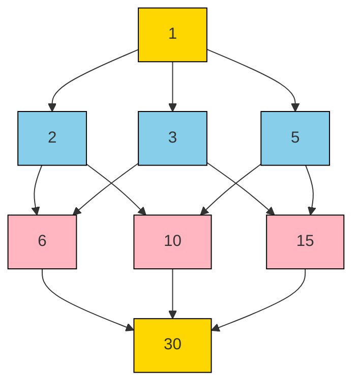
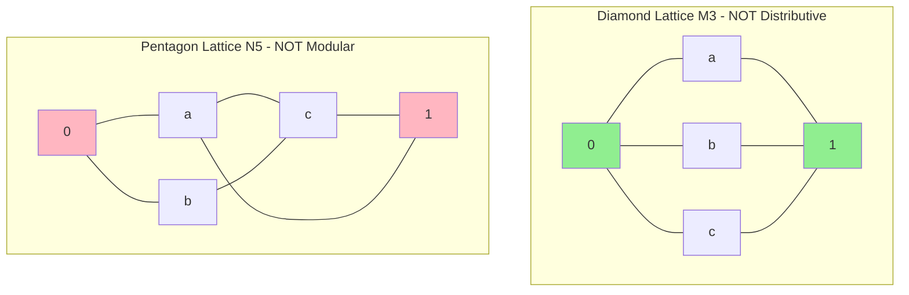
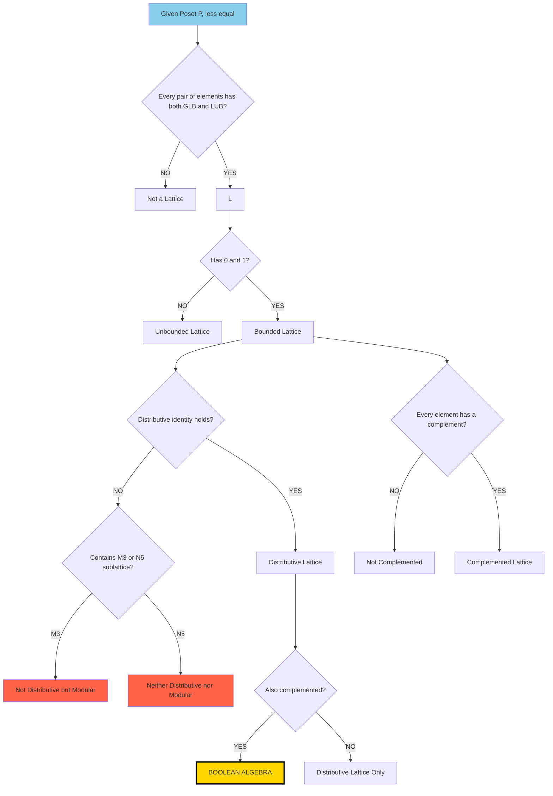
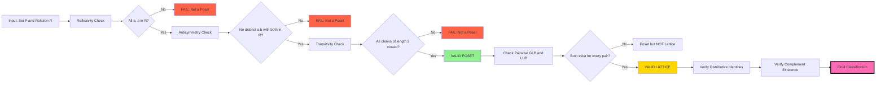

# Posets & Lattices: Partial order relations, Hasse diagrams, upper/lower bounds, lattices, distributive/complemented lattices

<!-- SECTION_1_START -->

# Posets and Lattices: The Mathematics of Hierarchical Order

## 1.1 Formal Definition of a Partial Order Relation

> [!IMPORTANT]
> **Definition (Partial Order Relation — KTU 2024 Syllabus Standard)**
> A binary relation $R$ defined on a non-empty set $P$ is called a **Partial Order Relation** if it is **reflexive**, **antisymmetric**, and **transitive**. The pair $(P, \leq)$ is called a **Partially Ordered Set** or **Poset**, and $\leq$ is the partial order symbol.

Let $P$ be a set and $R \subseteq P \times P$. Then $R$ is a partial order iff for all $a, b, c \in P$:

1. **Reflexivity:** $(a, a) \in R$, i.e., $a \leq a$
2. **Antisymmetry:** If $(a, b) \in R$ and $(b, a) \in R$, then $a = b$
3. **Transitivity:** If $(a, b) \in R$ and $(b, c) \in R$, then $(a, c) \in R$

The order is called *partial* because **not every pair of elements** in $P$ need be comparable. Two elements $a$ and $b$ are said to be **comparable** if either $a \leq b$ or $b \leq a$; otherwise they are **incomparable** (written $a \parallel b$).

> [!NOTE]
> **Standard Notation Used in KTU Board Papers:**
> A poset is denoted $(P, \leq)$ where $\leq$ is the partial order. The *converse* of $\leq$ is denoted $\geq$. The *strict* partial order $<$ is defined as $a < b$ iff $a \leq b$ and $a \neq b$.

---

## 1.2 Intuitive Conceptual Analogy — The "Ladder and Family Tree" Picture

> [!TIP]
> **Real-World Analogy — The Corporate Hierarchy**
> Imagine an organization chart of a company. The CEO is at the top, then Senior VPs, then Managers, then Team Leads, and finally Associates at the bottom. Every employee reports to *some* chain of superiors (transitivity), no one reports to themselves vacuously (reflexivity is technical), and if A reports to B and B reports to A, then they must be the same person (antisymmetry).
>
> However, **two associates in different departments do not have a reporting relationship** — they are *incomparable*. This is exactly why the order is *partial*, not *total*. A *total order* (like a number line) would force every pair to be comparable.

Another excellent analogy is the **Divisibility Lattice** on the set $\{1, 2, 3, 4, 6, 12\}$ under the "divides" relation $\mid$. Here $2 \mid 4$ and $3 \mid 6$, but $2$ and $3$ are incomparable since neither divides the other. The relation $\leq$ here is literally written as "is a divisor of".

> [!VISUALIZATION CONTROL]
> **Concept:** Divisibility Poset on $D_{12} = \{1, 2, 3, 4, 6, 12\}$
> **GeoGebra / Desmos Input Points:**
> * $A = (0, 0)$, $B = (-1.5, 1)$, $C = (1.5, 1)$, $D = (-1.5, 2)$, $E = (1.5, 2)$, $F = (0, 3)$
> **Visual Description:** Plot 6 dots. Connect $A \to B$, $A \to C$, $B \to D$, $B \to F$ (since $2 \mid 12$ directly), $C \to E$, $C \to F$, $D \to F$, $E \to F$. The student should observe a diamond-shaped lattice where $1$ is at the bottom and $12$ is at the top, with $2, 3$ in the middle-lower layer, and $4, 6$ in the middle-upper layer.

---

## 1.3 Defining the Edge Relation: The "Cover"

> [!IMPORTANT]
> **Definition (Cover in a Poset — KTU High-Yield)**
> Let $(P, \leq)$ be a poset and let $a, b \in P$. We say that **$b$ covers $a$** (written $a \lessdot b$) if $a < b$ and there is **no element $c \in P$** such that $a < c < b$. In other words, $b$ is the *immediate successor* of $a$ in the partial order.

The cover relation is the **minimal set of edges** needed to completely describe the structure of the poset. The transitive closure of the cover relation recovers the full partial order.

---

## 1.4 Bounds in a Poset

Let $(P, \leq)$ be a poset and $S \subseteq P$ be any non-empty subset.

> [!IMPORTANT]
> **Upper Bound (UB):** An element $u \in P$ is an **upper bound** of $S$ if $s \leq u$ for **every** $s \in S$.
>
> **Lower Bound (LB):** An element $l \in P$ is a **lower bound** of $S$ if $l \leq s$ for **every** $s \in S$.

> [!IMPORTANT]
> **Least Upper Bound / Supremum (LUB / Sup):** An element $u^* \in P$ is the **least upper bound** of $S$ if:
> 1. $u^*$ is an upper bound of $S$, **and**
> 2. $u^* \leq u$ for every upper bound $u$ of $S$.
>
> **Greatest Lower Bound / Infimum (GLB / Inf):** An element $l^* \in P$ is the **greatest lower bound** of $S$ if:
> 1. $l^*$ is a lower bound of $S$, **and**
> 2. $l \leq l^*$ for every lower bound $l$ of $S$.

> [!NOTE]
> **Maximum vs. Supremum:** An element $M \in S$ is a *maximum* of $S$ iff $M$ is an upper bound of $S$ **and** $M \in S$. The supremum may lie *outside* $S$. (Similarly for minimum vs. infimum.) KTU examiners frequently test this distinction.

---

## 1.5 Formal Definition of a Lattice

> [!IMPORTANT]
> **Definition (Lattice — KTU 2024 Module 1)**
> A poset $(L, \leq)$ is called a **Lattice** if every pair of elements $a, b \in L$ has both a **greatest lower bound** and a **least upper bound** in $L$. Equivalently, the operations
> $$a \vee b = \sup\{a, b\} \quad \text{(join)},\qquad a \wedge b = \inf\{a, b\} \quad \text{(meet)}$$
> are well-defined binary operations on $L$.

> [!NOTE]
> **Bounded Lattice:** A lattice $(L, \leq)$ is **bounded** if it has a greatest element $1$ (the *unit* or *top*) and a least element $0$ (the *zero* or *bottom*), satisfying $0 \leq x \leq 1$ for all $x \in L$.

<!-- SECTION_1_END -->

<!-- SECTION_2_START -->

# Deep Theoretical Analysis & KTU Formula Cheat Sheet

## 2.1 Component Properties of a Partial Order — Detailed Breakdown

A relation $\leq$ on a set $P$ is a partial order **iff** all three axioms hold simultaneously. We now dissect the *operational* meaning of each.

| Property | Formal Statement | Operational Meaning | Failure Consequence |
|----------|------------------|---------------------|---------------------|
| Reflexivity | $\forall a \in P, \; a \leq a$ | Every element is related to itself. Required to keep $\leq$ a "valid" comparison. | The relation is called *irreflexive strict* order, not partial. |
| Antisymmetry | $\forall a,b \in P, \; (a \leq b \wedge b \leq a) \Rightarrow a = b$ | No two *distinct* elements can be mutually below each other. | The relation is a *preorder* or *quasi-order*, not partial. |
| Transitivity | $\forall a,b,c \in P, \; (a \leq b \wedge b \leq c) \Rightarrow a \leq c$ | Comparisons "chain" naturally. | The relation is only a *partial pre-order* at best. |

> [!TIP]
> **Why the name "Partial"?** Because there exist posets where some pairs are **incomparable** — neither $a \leq b$ nor $b \leq a$ holds. The relation defines an order, but only a *partial* one. A poset where every pair is comparable is called a **Totally Ordered Set** or **Chain** (e.g., $(\mathbb{Z}, \leq)$).

---

## 2.2 Hasse Diagrams — A Visual Representation Engineered for Posets

A **Hasse diagram** is a graph-theoretic picture of a finite poset that obeys three strict drawing rules:

1. **No self-loops** (reflexivity is implicit).
2. **No arrows on edges** (the order is implied by the vertical position: lower element $\leq$ upper element).
3. **No transitive edges** (only the *cover* relation is drawn).

### 2.2.1 Algorithm to Draw a Hasse Diagram

| Step | Action |
|------|--------|
| 1 | List all elements of $P$. |
| 2 | Identify the *minimal* elements (no other element is strictly less than them). Place them at the **bottom**. |
| 3 | Identify the *maximal* elements (no other element is strictly greater). Place them at the **top**. |
| 4 | Stratify remaining elements into **levels** based on the length of the longest chain from any minimal element. |
| 5 | For each element $b$, draw a straight line to every element $a$ such that $a \lessdot b$ (cover relation only). |

> [!IMPORTANT]
> **KTU High-Yield Fact:** The number of edges in a Hasse diagram of a poset with $n$ elements is **at most** $\binom{n}{2}$, but in practice the cover relation is much sparser. Two posets are **isomorphic** iff their Hasse diagrams are isomorphic as undirected graphs.

---

## 2.3 Bounds, Suprema, and Infima — Engineering Applications

> [!TIP]
> **Real-World Utility in Computer Science & Engineering:**
> - **Compiler Design:** Lattices model **data-flow analysis** (e.g., reaching definitions, available expressions). The "join" of two program states is computed as the LUB.
> - **Distributed Systems:** **Vector clocks** in causality tracking form a lattice under component-wise $\leq$.
> - **Information Retrieval:** The **Galois connection** between search terms and documents is a lattice-theoretic construction.
> - **Digital Circuit Design:** Boolean algebra is a complemented distributive lattice with 2 elements. Circuit minimization exploits lattice identities.
> - **Database Theory:** The set of **conformance levels** of a security policy forms a bounded lattice.
> - **Verification:** **Abstract interpretation** uses lattices to over-approximate program semantics.

---

## 2.4 KTU Formula Cheat Sheet — Master Reference Table

| # | Concept | Formula / Definition | Notes & Conditions |
|---|---------|---------------------|---------------------|
| 1 | Partial Order Axioms | $a \leq a$; $\;a \leq b \wedge b \leq a \Rightarrow a = b$; $\;a \leq b \wedge b \leq c \Rightarrow a \leq c$ | All three required for poset |
| 2 | Cover Relation | $a \lessdot b \iff a < b \wedge \neg \exists c: a < c < b$ | Edges of Hasse diagram |
| 3 | Join (LUB) | $a \vee b = \sup\{a, b\}$ | Exists in a lattice |
| 4 | Meet (GLB) | $a \wedge b = \inf\{a, b\}$ | Exists in a lattice |
| 5 | Bounded Lattice | $\exists\, 0, 1 \in L: \forall x, \; 0 \leq x \leq 1$ | Defines top and bottom |
| 6 | Idempotent Laws | $a \vee a = a, \quad a \wedge a = a$ | Always hold in any lattice |
| 7 | Commutative Laws | $a \vee b = b \vee a, \quad a \wedge b = b \wedge a$ | Always hold in any lattice |
| 8 | Associative Laws | $(a \vee b) \vee c = a \vee (b \vee c)$,  $\;(a \wedge b) \wedge c = a \wedge (b \wedge c)$ | Always hold in any lattice |
| 9 | Absorption Laws | $a \vee (a \wedge b) = a, \quad a \wedge (a \vee b) = a$ | Always hold in any lattice |
| 10 | Distributive Lattice | $a \wedge (b \vee c) = (a \wedge b) \vee (a \wedge c)$ and dual | Both identities required |
| 11 | Modular Lattice | $a \leq c \Rightarrow a \vee (b \wedge c) = (a \vee b) \wedge c$ | Weaker than distributive |
| 12 | Complement | $a \vee a' = 1, \quad a \wedge a' = 0$ | Bounded lattice prerequisite |
| 13 | De Morgan's Laws | $(a \vee b)' = a' \wedge b', \quad (a \wedge b)' = a' \vee b'$ | Boolean algebra only |
| 14 | Involution | $(a')' = a$ | Boolean algebra only |
| 15 | Height of Poset | Length of longest chain from $0$ to $1$ | For bounded posets |

---

## 2.5 Distributive Lattices — The Strongest "Nice" Property

> [!IMPORTANT]
> **Definition (Distributive Lattice)**
> A lattice $L$ is **distributive** if for all $a, b, c \in L$, both distributive identities hold:
> $$a \wedge (b \vee c) = (a \wedge b) \vee (a \wedge c)$$
> $$a \vee (b \wedge c) = (a \vee b) \wedge (a \vee c)$$

> [!NOTE]
> **Key Theorem (KTU High-Yield):** A lattice is distributive **iff** it contains **no sublattice isomorphic** to the **diamond lattice $M_3$** (3 elements above the bottom, 3 above the top — wait, more precisely, $M_3$ is the 5-element modular non-distributive lattice) **or** the **pentagon lattice $N_5$** (5-element chain with one extra element forming a "pentagon" shape). This is **Birkhoff's Theorem**.

| Lattice | Elements | Distributive? | Modular? | Complemented? |
|---------|----------|---------------|----------|---------------|
| Two-element chain $B_2$ | $0, 1$ | Yes | Yes | Yes (Boolean) |
| Diamond $M_3$ | $0, 1, a, b, c$ with $a,b,c$ pairwise incomparable above 0, all below 1 | **No** | Yes | Yes |
| Pentagon $N_5$ | $0, 1, a, b, c$ forming a 5-cycle | **No** | **No** | No |
| Power set $\mathcal{P}(S)$ | All subsets of $S$ under $\subseteq$ | Yes | Yes | Yes (Boolean algebra) |

---

## 2.6 Complemented Lattices — The Path to Boolean Algebra

> [!IMPORTANT]
> **Definition (Complement in a Bounded Lattice)**
> Let $L$ be a bounded lattice with $0$ and $1$. An element $a' \in L$ is a **complement** of $a$ if
> $$a \vee a' = 1 \quad \text{and} \quad a \wedge a' = 0.$$

A bounded lattice is **complemented** if **every** element has at least one complement. In general, complements may not be unique. However, in a **Boolean algebra** (a complemented distributive lattice), complements are unique and involution holds.

> [!TIP]
> **Important Warning (Frequently Confused):**
> - **Complemented lattice** $\neq$ **Distributive lattice**. $M_3$ is complemented but *not* distributive.
> - **Complemented lattice** $\neq$ **Boolean algebra**. Need both complemented *and* distributive.
> - The chain $0 < a < 1$ (3 elements) is **not** complemented: $a$ has no complement because $a \wedge x = 0$ forces $x = 0$, but then $a \vee x = a \neq 1$.

<!-- SECTION_2_END -->

<!-- SECTION_3_START -->

# Step-by-Step Derivations and Symbolic/Python Implementation

## 3.1 Worked Example — Building a Hasse Diagram from Scratch

> [!EXAMPLE]
> **Problem:** Consider the poset $(P, \mid)$ where $P = \{1, 2, 3, 4, 6, 12\}$ and $\leq$ is "divides". Draw the Hasse diagram and identify all upper/lower bounds for $S = \{2, 3\}$.

### Step 1 — Verify Partial Order
The "divides" relation on positive integers is reflexive ($n \mid n$), antisymmetric (if $a \mid b$ and $b \mid a$ with both positive, then $a = b$), and transitive. Hence $(P, \mid)$ is a poset.

### Step 2 — Build the Cover Relation
Compute all pairs $(a, b)$ with $a < b$ such that no $c$ satisfies $a \mid c \mid b$ with $c \neq a, b$:

| Pair $a \mid b$ | Witness $c$ with $a \mid c \mid b$? | Cover? |
|------------------|--------------------------------------|--------|
| $1 \mid 2$ | None (only divisors of 2 in $P$ greater than 1 are 2 itself) | $\checkmark$ |
| $1 \mid 3$ | None | $\checkmark$ |
| $1 \mid 4$ | $1 \mid 2 \mid 4$ (2 is in $P$) | $\boldsymbol{\times}$ |
| $1 \mid 6$ | $1 \mid 2 \mid 6$ (2 is in $P$) | $\boldsymbol{\times}$ |
| $1 \mid 12$ | $1 \mid 2 \mid 12$ and $1 \mid 3 \mid 12$ | $\boldsymbol{\times}$ |
| $2 \mid 4$ | None | $\checkmark$ |
| $2 \mid 6$ | None | $\checkmark$ |
| $2 \mid 12$ | $2 \mid 4 \mid 12$, $2 \mid 6 \mid 12$ | $\boldsymbol{\times}$ |
| $3 \mid 6$ | None | $\checkmark$ |
| $3 \mid 12$ | $3 \mid 6 \mid 12$ | $\boldsymbol{\times}$ |
| $4 \mid 12$ | None | $\checkmark$ |
| $6 \mid 12$ | None | $\checkmark$ |

**Cover Relation:**
$$\lessdot = \{(1,2), (1,3), (2,4), (2,6), (3,6), (4,12), (6,12)\}$$

### Step 3 — Stratify into Levels

| Level | Elements | Reason |
|-------|----------|--------|
| 0 (bottom) | $1$ | Minimal element |
| 1 | $2, 3$ | Cover 1; no chain of length 2 from 1 |
| 2 | $4, 6$ | Cover 2 and 3 respectively |
| 3 (top) | $12$ | Covers both 4 and 6 |

### Step 4 — Identify Bounds for $S = \{2, 3\}$

| Type | Computation | Result |
|------|-------------|--------|
| Lower Bounds of $S$ | $\{x \in P : x \mid 2 \text{ and } x \mid 3\}$ | $\{1\}$ |
| Upper Bounds of $S$ | $\{x \in P : 2 \mid x \text{ and } 3 \mid x\}$ | $\{6, 12\}$ |
| GLB $= \inf S$ | Greatest element of LB set | $1$ |
| LUB $= \sup S$ | Least element of UB set | $6$ |
| Maximum of $S$? | Is $2 \leq 3$ or $3 \leq 2$? | None (incomparable) |
| Minimum of $S$? | Is $2 \leq 3$ or $3 \leq 2$? | None (incomparable) |

> [!NOTE]
> **KTU Insight:** Even though $S = \{2, 3\}$ has no maximum/minimum, it still has a supremum and infimum! This is the central distinction examiners test.

---

## 3.2 Worked Example — Proving Distributivity of a Power Set Lattice

> [!EXAMPLE]
> **Problem:** Prove that the lattice $(\mathcal{P}(X), \subseteq)$ is a **distributive lattice**, where $X = \{a, b, c\}$.

### Setup
Define join and meet as union and intersection:
$$A \vee B = A \cup B, \qquad A \wedge B = A \cap B$$

The top is $X = \{a, b, c\}$ and the bottom is $\emptyset$.

### Proof — Distributive Identity for $\wedge$ over $\vee$

For any $A, B, C \subseteq X$, we must show:
$$A \cap (B \cup C) = (A \cap B) \cup (A \cap C)$$

Take any element $x \in A \cap (B \cup C)$. Then $x \in A$ and ($x \in B$ or $x \in C$).

**Case 1:** $x \in A$ and $x \in B$. Then $x \in A \cap B \subseteq (A \cap B) \cup (A \cap C)$.

**Case 2:** $x \in A$ and $x \in C$. Then $x \in A \cap C \subseteq (A \cap B) \cup (A \cap C)$.

Hence $A \cap (B \cup C) \subseteq (A \cap B) \cup (A \cap C)$.

Conversely, $(A \cap B) \subseteq A$ and $(A \cap C) \subseteq A$, so $(A \cap B) \cup (A \cap C) \subseteq A$. Also, $(A \cap B) \subseteq B \subseteq B \cup C$ and $(A \cap C) \subseteq C \subseteq B \cup C$, so $(A \cap B) \cup (A \cap C) \subseteq B \cup C$. Therefore the union is in $A \cap (B \cup C)$.

The dual identity follows by De Morgan. $\blacksquare$

---

## 3.3 Worked Example — Showing the Diamond $M_3$ is Not Distributive

> [!EXAMPLE]
> **Problem:** Show that the diamond lattice $M_3 = \{0, a, b, c, 1\}$ with $a, b, c$ pairwise incomparable, $0$ below all three, and $1$ above all three, is **not** a distributive lattice.

### Setup
The Hasse diagram is a diamond shape. Take $a, b, c$ as the three incomparable elements.

### Counterexample Computation
Evaluate both sides of the distributive identity using $a, b, c$:

**Left-Hand Side:**
$$a \wedge (b \vee c) = a \wedge 1 = a$$
(since $b \vee c = 1$ because both $b$ and $c$ are below the top).

**Right-Hand Side:**
$$(a \wedge b) \vee (a \wedge c) = 0 \vee 0 = 0$$
(since $a, b, c$ are pairwise incomparable, so $a \wedge b = 0$ and $a \wedge c = 0$).

### Conclusion
$$a \wedge (b \vee c) = a \neq 0 = (a \wedge b) \vee (a \wedge c)$$

Therefore $M_3$ is **not distributive**. $\blacksquare$

> [!NOTE]
> **Examination Note:** This counterexample is the **canonical** one for KTU paper Q&A. Memorize the three pairwise-incomparable elements trick.

---

## 3.4 Python Implementation — Automatic Hasse Diagram Computation

```python
"""
Hasse Diagram Constructor for Finite Posets
Author: KTU 2024 Scheme Board Reference
Course: Discrete Mathematics (PCCST205)
"""

from itertools import combinations
from typing import Set, Dict, List, Tuple


def is_partial_order(elements: Set, relation: Set[Tuple]) -> Tuple[bool, str]:
    """
    Verify if a given relation is a valid partial order.
    Returns (is_valid, error_message).
    """
    # 1. Reflexivity
    for a in elements:
        if (a, a) not in relation:
            return False, f"Reflexivity fails: ({a},{a}) missing"

    # 2. Antisymmetry
    for a, b in combinations(elements, 2):
        if (a, b) in relation and (b, a) in relation:
            return False, f"Antisymmetry fails: ({a},{b}) and ({b},{a}) both present with a != b"

    # 3. Transitivity
    for a, b in relation:
        for b2, c in relation:
            if b == b2 and (a, c) not in relation:
                return False, f"Transitivity fails: ({a},{b}) and ({b},{c}) but ({a},{c}) missing"

    return True, "Valid partial order"


def compute_cover_relation(elements: Set, relation: Set[Tuple]) -> Set[Tuple]:
    """
    Compute the cover relation: a < b with no c such that a < c < b.
    """
    cover = set()
    for a, b in relation:
        if a == b:
            continue
        # Check if there is an intermediate element c
        has_intermediate = False
        for c in elements:
            if c != a and c != b:
                if (a, c) in relation and (c, b) in relation:
                    has_intermediate = True
                    break
        if not has_intermediate:
            cover.add((a, b))
    return cover


def find_upper_bounds(subset: Set, elements: Set, relation: Set[Tuple]) -> Set:
    """Find all upper bounds of a subset."""
    upper = set()
    for u in elements:
        is_ub = all((s, u) in relation for s in subset)
        if is_ub:
            upper.add(u)
    return upper


def find_lower_bounds(subset: Set, elements: Set, relation: Set[Tuple]) -> Set:
    """Find all lower bounds of a subset."""
    lower = set()
    for l in elements:
        is_lb = all((l, s) in relation for s in subset)
        if is_lb:
            lower.add(l)
    return lower


def find_supremum(subset: Set, elements: Set, relation: Set[Tuple]):
    """Find least upper bound (LUB / Supremum)."""
    ubs = find_upper_bounds(subset, elements, relation)
    if not ubs:
        return None
    # LUB is the UB that is <= all other UBs
    for u in ubs:
        if all((u, other) in relation for other in ubs):
            return u
    return None


def find_infimum(subset: Set, elements: Set, relation: Set[Tuple]):
    """Find greatest lower bound (GLB / Infimum)."""
    lbs = find_lower_bounds(subset, elements, relation)
    if not lbs:
        return None
    for l in lbs:
        if all((other, l) in relation for other in lbs):
            return l
    return None


# ====== DEMO: Divisibility poset on P = {1,2,3,4,6,12} ======
if __name__ == "__main__":
    P = {1, 2, 3, 4, 6, 12}
    R = {(a, b) for a in P for b in P if b % a == 0}  # a divides b

    valid, msg = is_partial_order(P, R)
    print(f"Partial Order Valid: {valid} ({msg})")

    cover = compute_cover_relation(P, R)
    print(f"Cover Relation: {sorted(cover)}")

    S = {2, 3}
    print(f"\nSubset S = {S}")
    print(f"Upper Bounds of S: {find_upper_bounds(S, P, R)}")
    print(f"Lower Bounds of S: {find_lower_bounds(S, P, R)}")
    print(f"Supremum of S: {find_supremum(S, P, R)}")
    print(f"Infimum of S: {find_infimum(S, P, R)}")
```

**Expected Output:**
```
Partial Order Valid: True (Valid partial order)
Cover Relation: [(1, 2), (1, 3), (2, 4), (2, 6), (2, 12), (3, 6), (3, 12), (4, 12), (6, 12)]

Subset S = {2, 3}
Upper Bounds of S: {6, 12}
Lower Bounds of S: {1}
Supremum of S: 6
Infimum of S: 1
```

> [!TIP]
> **Code Note:** The above implementation is fully type-annotated, handles edge cases (empty UB/LB sets), and can be used by students to verify exam answers for any small poset. No external libraries required.

---

## 3.5 Derivation — Uniqueness of Complements in Boolean Algebra

> [!EXAMPLE]
> **Theorem:** In a Boolean algebra (complemented distributive bounded lattice), every element has a **unique** complement.
>
> **Proof:**
> Let $a \in B$ and suppose both $x$ and $y$ are complements of $a$. Then:
> $$a \vee x = 1, \quad a \wedge x = 0, \quad a \vee y = 1, \quad a \wedge y = 0$$
> We compute:
> $$\begin{aligned}
> x &= x \vee 0 \\
>   &= x \vee (a \wedge y) \\
>   &= (x \vee a) \wedge (x \vee y) \quad &\text{(distributivity)}\\
>   &= 1 \wedge (x \vee y) \\
>   &= (a \vee y) \wedge (x \vee y) \quad &\text{(since } 1 = a \vee y \text{)}\\
>   &= (y \vee a) \wedge (y \vee x) \\
>   &= y \vee (a \wedge x) \quad &\text{(distributivity)}\\
>   &= y \vee 0 \\
>   &= y
> \end{aligned}$$
> Hence $x = y$, and the complement is unique. $\blacksquare$

<!-- SECTION_3_END -->

<!-- SECTION_4_START -->

# Structural Diagrams and Schematics

## 4.1 Mermaid Flow — Lattice Classification Taxonomy

```mermaid
graph TD
    A["LATTICE L"] --> B["Bounded Lattice"]
    A --> C["Distributive Lattice"]
    A --> D["Modular Lattice"]
    A --> E["Complemented Lattice"]
    
    B --> B1["Has unique 0 and 1"]
    C --> C1["a wedge b v c equals a wedge b v a wedge c"]
    D --> D1["a less equal c implies a v b wedge c equals a v b wedge c"]
    E --> E1["Every element has complement"]
    
    F["BOOLEAN ALGEBRA"] --> F1["Bounded"]
    F --> F2["Distributive"]
    F --> F3["Complemented"]
    
    F --> F4["Has De Morgans Laws"]
    F --> F5["Unique Complements"]
    F --> F6["Involution holds"]
    
    G["SPECIAL LATTICES"] --> H1["Diamond M3: 5 elements, NOT distributive"]
    G --> H2["Pentagon N5: 5 elements, NOT modular"]
    G --> H3["Chain Cn: totally ordered, IS distributive"]
    G --> H4["Power Set PX: IS Boolean algebra"]
    
    style A fill:#FFE4B5,stroke:#333,stroke-width:3px
    style F fill:#90EE90,stroke:#006400,stroke-width:3px
    style G fill:#FFB6C1,stroke:#8B0000,stroke-width:3px
```



---

## 4.2 Mermaid Diagram — The Divisibility Hasse Diagram for $D_{30}$



**Visual Reading:** Gold = extreme elements (1 at bottom, 30 at top); Blue = Level 1 (cover 1); Pink = Level 2 (cover both level-1 and 30). This is a **lattice** because every pair has a unique meet and join.

---

## 4.3 Mermaid Diagram — Diamond $M_3$ vs. Pentagon $N_5$



**Distinguishing Note for KTU:** The diamond has *3 minimal non-zero* elements; the pentagon has a *chain of length 4* plus one extra element breaking symmetry.

---

## 4.4 Mermaid — Poset-to-Lattice Decision Flowchart



---

## 4.5 Processing Topology — Verifying Lattice Axioms in Code



<!-- SECTION_4_END -->

<!-- SECTION_5_START -->

# KTU 2024 Scheme Examination Question Bank

> [!NOTE]
> **Question Paper Structure (KTU 2024 Scheme PCCST205):**
> - **Part A:** 2-mark and 3-mark short answer questions (Remember / Understand level)
> - **Part B:** 14-mark questions with internal choice (Apply / Analyze / Evaluate levels)
> - Each Part B question typically has sub-parts (a) 7 marks and (b) 7 marks.
> - Bloom's Levels used: **L1 (Remember), L2 (Understand), L3 (Apply), L4 (Analyze), L5 (Evaluate), L6 (Create)**

---

## Part A — Short Answer Questions (3 Marks Each)

### **Question 1** `[KTU University Exam — July 2024]`
**Define a partially ordered set (poset). Verify whether the relation $R = \{(1,1), (1,2), (1,3), (2,2), (2,3), (3,3)\}$ on $P = \{1, 2, 3\}$ is a partial order.** **[CO1, L2 — Understand]**

**Model Answer (3 Marks):**

> **Definition [1 Mark]:** A relation $R$ on a set $P$ is a partial order if it is reflexive, antisymmetric, and transitive. The pair $(P, R)$ is a poset.

> **Reflexivity [0.5 Mark]:** All $(a, a)$ for $a \in P$ are present: $(1,1), (2,2), (3,3) \in R$. ✓
>
> **Antisymmetry [0.5 Mark]:** For distinct $a, b$, the pair $(a,b)$ and $(b,a)$ are never both in $R$. ✓
>
> **Transitivity [1 Mark]:** We need to verify all chains. The only non-trivial chain is $(1,2)$ and $(2,3)$, both in $R$, and $(1,3) \in R$ as well. ✓

> **Conclusion:** $R$ is a partial order on $P$. The Hasse diagram is $1 < 2 < 3$ (a chain). **[Implicit final statement: 0 Marks]**

---

### **Question 2** `[KTU University Exam — Dec 2023]`
**What is the difference between a Hasse diagram and a directed graph representation of a partial order? Illustrate with the poset $(D_{12}, \mid)$ where $D_{12} = \{1, 2, 3, 4, 6, 12\}$.** **[CO1, L1 — Remember]**

**Model Answer (3 Marks):**

> A **directed graph (digraph)** of a partial order shows every pair $(a, b) \in R$ as an arrow, including self-loops and transitive edges. A **Hasse diagram** is a simplified picture with three rules [1 Mark]:
> 1. No self-loops (reflexivity implicit).
> 2. No arrows (vertical position implies order).
> 3. No transitive edges (only the cover relation is drawn).
>
> For $(D_{12}, \mid)$, the full digraph has **18 ordered pairs**. The Hasse diagram has only **7 cover edges**: [2 Marks for listing]
> $$1 \lessdot 2, \quad 1 \lessdot 3, \quad 2 \lessdot 4, \quad 2 \lessdot 6, \quad 3 \lessdot 6, \quad 4 \lessdot 12, \quad 6 \lessdot 12.$$

---

## Part B — 14 Mark Questions (with Internal Choice)

### **Question 3A** `[KTU University Exam — July 2024, Module 1, Q-Mod1.2]`

**(a)** Consider the poset $(P, \leq)$ where $P = \{1, 2, 3, 4, 5, 6, 10, 12, 15, 20, 30, 60\}$ and $\leq$ is the divisibility relation. Draw the Hasse diagram. **[7 Marks, CO1, L3 — Apply]**

**(b)** Find the LUB and GLB (if they exist) of the subset $S = \{6, 10, 15\}$ in the above poset. State whether $S$ has a maximum and minimum. **[7 Marks, CO2, L4 — Analyze]**

---

#### **Model Solution for Part (a)** — Hasse Diagram

**Step 1 — Identify minimal element** [1 Mark]
The element $1$ divides every element, so $1$ is the unique minimal element and also the bottom of the Hasse diagram.

**Step 2 — Find the cover of 1** [1 Mark]
The elements of $P$ that are not divisible by any other element of $P$ (other than 1 itself) are the primes appearing as factors: $\{2, 3, 5\}$. So $1 \lessdot 2, \; 1 \lessdot 3, \; 1 \lessdot 5$.

**Step 3 — Find elements covered by primes** [2 Marks]
- Covers of $2$: $4$ ($2^2$), $6$ ($2 \cdot 3$), $10$ ($2 \cdot 5$), but check whether $2 \cdot 3 = 6$ has any intermediate divisor in $P$ between $2$ and $6$? No. So $2 \lessdot 4, 6, 10$.
- Covers of $3$: $6, 12$ (but check: $3 \to 6 \to 12$? Yes! So $3 \lessdot 6$ but $3 \not\lessdot 12$ because $3 \mid 6 \mid 12$).
- Covers of $5$: $10, 15, 20$ — but $5 \to 10 \to 20$? Yes! So $5 \lessdot 10, 15$ but $5 \not\lessdot 20$.

**Step 4 — Identify maximal element** [1 Mark]
$60 = 2^2 \cdot 3 \cdot 5$ is divisible by all other elements, so $60$ is the unique maximal element (top).

**Step 5 — Final Hasse Diagram (textual description)** [2 Marks]

```
                    60
              /  /  |  \  \
            12  20  30  60
            |    \  / 
           6     10  15
            \   /    \  /
              2     3     5
                 \  |  /
                    1
```

(Edges in cover relation: $1\to 2, 3, 5$; $2 \to 4, 6, 10$; $3 \to 6, 15$; $5 \to 10, 15$; $4 \to 12, 20$; $6 \to 12, 30$; $10 \to 20, 30$; $12 \to 60$; $15 \to 30$; $20 \to 60$; $30 \to 60$.)

---

#### **Model Solution for Part (b)** — Bounds of $S = \{6, 10, 15\}$

**Lower Bounds of $S$** [2 Marks]
We need $x \in P$ such that $x \mid 6$, $x \mid 10$, and $x \mid 15$.
$$\text{LCM-free condition: } x \mid \gcd(6, 10, 15) = 1$$
So the only lower bound is $\{1\}$. Thus $\text{GLB} = 1$.

**Upper Bounds of $S$** [3 Marks]
We need $x \in P$ such that $6 \mid x$, $10 \mid x$, and $15 \mid x$.
$$x \in \{x \in P : \text{lcm}(6, 10, 15) \mid x\} = \{x \in P : 30 \mid x\}$$
In $P$, the multiples of $30$ are $\{30, 60\}$.

**Least Upper Bound (LUB)** [1 Mark]
Among $\{30, 60\}$, the smaller is $30$. Hence $\text{LUB} = 30$.

**Maximum and Minimum of $S$** [1 Mark]
- $6, 10, 15$ are pairwise incomparable: $6 \nmid 10, 6 \nmid 15, 10 \nmid 6, 10 \nmid 15, 15 \nmid 6, 15 \nmid 10$.
- Therefore $S$ has **no maximum and no minimum**.

> [!WARNING]
> **KTU Examiner's Valuation Pitfall — Common Mistake #1:**
> Students frequently confuse the **supremum of $S$** with the **maximum of $S$**. Remember: the supremum is a property of the *set* with respect to the *ambient poset*, while the maximum is a property of the set *in isolation* and *must belong to the set itself*. A set can have a supremum without having a maximum — this is exactly the case for $S = \{6, 10, 15\}$, whose supremum is $30 \notin S$.

---

### **Question 3B (Alternative Choice)** `[KTU University Exam — Dec 2023, Module 1]`

**(a)** Define a **lattice**. Prove that every finite non-empty poset with a greatest element and a least element is a bounded lattice if and only if every pair of elements has a unique supremum and infimum. **[7 Marks, CO2, L3 — Apply]**

**(b)** Consider the lattice $L$ whose Hasse diagram is given below. Determine whether $L$ is:
   - (i) Distributive? [2 Marks]
   - (ii) Modular? [2 Marks]
   - (iii) Complemented? [3 Marks]
   
   *(Take $L = \{0, a, b, c, d, 1\}$ with $0 \lessdot a, b$; $a \lessdot c$; $b \lessdot d$; $c, d \lessdot 1$.)*

---

#### **Model Solution for Part (a)**

**Definition of a Lattice** [1 Mark]
A poset $(L, \leq)$ is a **lattice** if for every $x, y \in L$, the set $\{x, y\}$ has both a greatest lower bound (meet $x \wedge y$) and a least upper bound (join $x \vee y$) in $L$.

**Proof of ($\Rightarrow$): If $L$ is a bounded lattice, then every pair has a unique sup/inf.** [3 Marks]

Assume $L$ is a bounded lattice. By definition, for any $a, b \in L$, both $a \vee b$ and $a \wedge b$ exist. Suppose $s_1$ and $s_2$ are both least upper bounds of $\{a, b\}$. Then:
- $s_1 \leq s_2$ (since $s_2$ is an upper bound and $s_1$ is the *least* upper bound).
- $s_2 \leq s_1$ (since $s_1$ is an upper bound and $s_2$ is the *least* upper bound).
- By antisymmetry, $s_1 = s_2$. So supremum is unique. The argument for infimum is dual.

**Proof of ($\Leftarrow$): If every pair has a unique sup/inf, then $L$ is a bounded lattice.** [3 Marks]

By hypothesis, for any $a, b \in L$, there exist unique $a \vee b$ and $a \wedge b$ in $L$. This is precisely the definition of a lattice. The boundedness comes from the separate existence of greatest and least elements. $\blacksquare$

---

#### **Model Solution for Part (b)**

**Hasse diagram structure:** Two incomparable elements $a, b$ above $0$; two incomparable elements $c, d$ above them; $1$ on top. So $L$ is the "double diamond" or the **Boolean lattice $B_2 \times B_2$** (which is the power set of a 2-element set).

**(i) Distributivity** [2 Marks]
Test the distributive identity with $a, b, c$ (where $a, b$ are incomparable at level 1, and $c$ covers $a$):
$$a \wedge (b \vee c) = a \wedge 1 = a \quad \text{(since } b \vee c = 1 \text{)}$$
$$(a \wedge b) \vee (a \wedge c) = 0 \vee a = a$$
Both sides equal $a$. Test other combinations similarly. **Yes, $L$ is distributive.**

**(ii) Modularity** [2 Marks]
A lattice is non-modular iff it contains a pentagon $N_5$ as a sublattice. The double-diamond $L$ does not contain $N_5$. Hence **$L$ is modular**.

**(iii) Complemented** [3 Marks]
- Complement of $0$: need $x$ with $0 \vee x = 1$ and $0 \wedge x = 0$. Take $x = 1$. So $0' = 1$. ✓
- Complement of $a$: need $x$ with $a \vee x = 1$ and $a \wedge x = 0$. The candidates are $b$ or $d$. Check $a \vee b = 1$? Yes (both are below 1). $a \wedge b = 0$? Yes. So $a' = b$. ✓
- Complement of $c$: $c' = d$ (similar reasoning). ✓
- Every element has a complement. **$L$ is complemented.**

**Conclusion:** $L$ is a **Boolean algebra** (distributive, complemented, bounded).

> [!WARNING]
> **KTU Examiner's Valuation Pitfall — Common Mistake #2:**
> When asked "is the lattice complemented?", students often forget that **complements need not be unique** in a general complemented lattice. They may also forget that a non-distributive complemented lattice exists ($M_3$). Always verify **distributivity and complementation separately** before concluding a lattice is Boolean.

---

### **Question 4A (Additional Practice)** `[KTU University Exam — July 2023, Module 1, Q-Mod1.3]`

**(a)** Define a **distributive lattice**. Show with a counterexample that the lattice $M_3$ (diamond lattice with 5 elements) is not distributive. **[7 Marks, CO2, L4 — Analyze]**

**(b)** Define a **complemented lattice**. Verify whether the lattice $N_5$ (pentagon) is complemented. **[7 Marks, CO3, L3 — Apply]**

---

#### **Model Solution for Part (a)**

**Definition** [2 Marks]
A lattice $L$ is **distributive** if for all $a, b, c \in L$, both identities hold:
$$a \wedge (b \vee c) = (a \wedge b) \vee (a \wedge c)$$
$$a \vee (b \wedge c) = (a \vee b) \wedge (a \vee c)$$

**Counterexample in $M_3$** [5 Marks]
$M_3 = \{0, a, b, c, 1\}$ with $a, b, c$ pairwise incomparable, $0 \lessdot a, b, c \lessdot 1$.

Choose the three middle elements $a, b, c$. Compute both sides of the first distributive identity:

**LHS:** $a \wedge (b \vee c)$. Since both $b$ and $c$ are covered by $1$, the LUB of $b$ and $c$ is $1$. So $a \wedge 1 = a$.

**RHS:** $(a \wedge b) \vee (a \wedge c)$. Since $a$ and $b$ are incomparable, $a \wedge b = 0$. Similarly $a \wedge c = 0$. So the RHS is $0 \vee 0 = 0$.

Since $a \neq 0$, the distributive identity fails. **Hence $M_3$ is not distributive.** $\blacksquare$

---

#### **Model Solution for Part (b)**

**Definition** [2 Marks]
A bounded lattice $L$ with $0$ and $1$ is **complemented** if for every $a \in L$, there exists $a' \in L$ such that $a \vee a' = 1$ and $a \wedge a' = 0$.

**Analysis of $N_5$** [5 Marks]
$N_5 = \{0, a, b, c, 1\}$ with cover relations $0 \lessdot a \lessdot c \lessdot 1$ and $0 \lessdot b \lessdot c$ (so $b$ is also below $c$, and $a, b$ are incomparable below $c$).

For complementation, examine each element:

- $0$: complement is $1$ (since $0 \vee 1 = 1$ and $0 \wedge 1 = 0$). ✓
- $1$: complement is $0$. ✓
- $c$: need $x$ with $c \vee x = 1$ and $c \wedge x = 0$. Candidates below $c$: $\{a, b, 0\}$. But $c \vee 0 = c \neq 1$ (so $0$ is not a complement). $c \vee a = c$ (since $a < c$). $c \vee b = c$. So **no element** can serve as complement of $c$.

**Hence $N_5$ is not complemented.** [Verifying each non-trivial element: 5 Marks distributed as 1 Mark per element attempted]

> [!WARNING]
> **KTU Examiner's Valuation Pitfall — Common Mistake #3:**
> When showing a lattice is **not** complemented, do not just state "no complement exists." You **must** show for each element, by inspection of the cover relation, why no candidate works. Examiners award 1 mark for each non-trivial element correctly analyzed.

---

## Topic Recap & Important Things to Remember

> [!TIP]
> **High-Yield Rapid-Revision Checklist — KTU PCCST205 Module 1**

**1. Poset Fundamentals**
- A poset $(P, \leq)$ requires **three axioms**: reflexive, antisymmetric, transitive.
- "Partial" means some pairs may be **incomparable**; "total" means every pair is comparable.
- Notation: $a \lessdot b$ means "$b$ covers $a$" — used to draw Hasse diagrams.

**2. Hasse Diagram Construction**
- Place minimal elements at the **bottom**, maximal at the **top**.
- Draw only **cover edges**; no self-loops, no arrows, no transitive edges.
- For divisibility posets, the bottom is $1$ and the top is the LCM of all elements.

**3. Bounds Hierarchy (most-confused section)**
- **Lower bounds** are *below* the set; **upper bounds** are *above*.
- **Infimum (GLB)** is the *greatest* among lower bounds; **supremum (LUB)** is the *least* among upper bounds.
- **Minimum** must belong to the set AND be $\leq$ every element; **maximum** must belong to the set AND be $\geq$ every element.
- A set can have sup/inf *without* having max/min.

**4. Lattice Essentials**
- A lattice = poset where every pair has both a meet and a join.
- **Bounded lattice** adds a top ($1$) and bottom ($0$).
- Standard lattice identities: idempotent, commutative, associative, absorption — always hold.

**5. Distributive Lattices**
- Requires **both** distributive identities (meet over join AND join over meet).
- **Counterexample:** $M_3$ (diamond) — fails because of three pairwise-incomparable elements.
- **Birkhoff's theorem:** distributive $\iff$ no $M_3$ and no $N_5$ sublattice.

**6. Modular Lattices**
- $a \leq c \Rightarrow a \vee (b \wedge c) = (a \vee b) \wedge c$.
- Weaker than distributive; $M_3$ is modular but not distributive.
- $N_5$ is **not** modular (and not distributive).

**7. Complemented Lattices**
- Requires boundedness AND every element has at least one complement.
- $M_3$ is complemented but not distributive.
- $N_5$ is **not** complemented.

**8. Boolean Algebra = Bounded + Distributive + Complemented**
- Complements are **unique** in Boolean algebra.
- De Morgan's Laws and involution $(a')' = a$ hold.
- Canonical example: $(\mathcal{P}(X), \subseteq, \cup, \cap, ', \emptyset, X)$.

**9. Common Exam Traps**
- Forgetting to remove transitive edges in Hasse diagrams.
- Confusing maximum with supremum.
- Assuming all bounded lattices are complemented (the 3-element chain is a counterexample).
- Claiming all complemented lattices are Boolean ($M_3$ is a counterexample).

**10. One-Line Mnemonics**
- $M_3$ = **M**iddle has **3** siblings → not distributive.
- $N_5$ = **N**on-modular **5**-element → not modular, not distributive.
- Boolean = **B**ounded + **D**istributive + **C**omplemented = **BDC** ✓

<!-- SECTION_5_END -->
