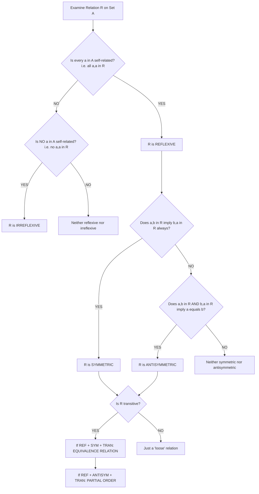
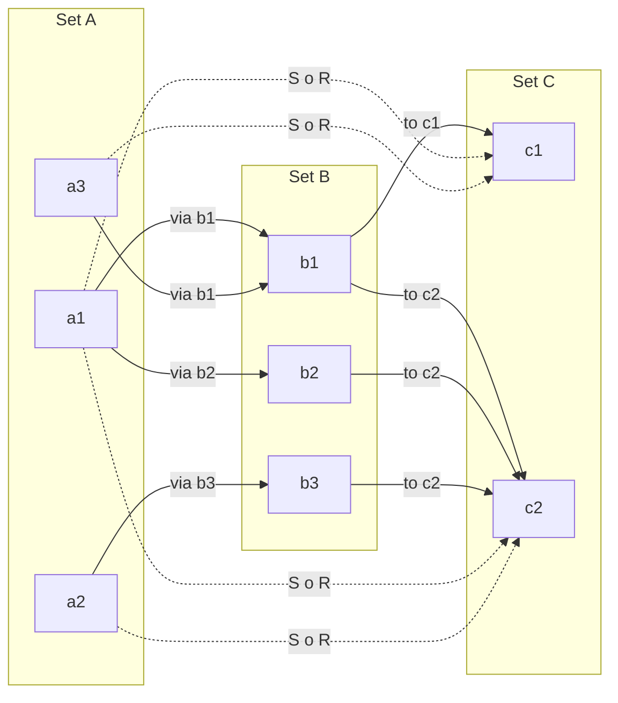
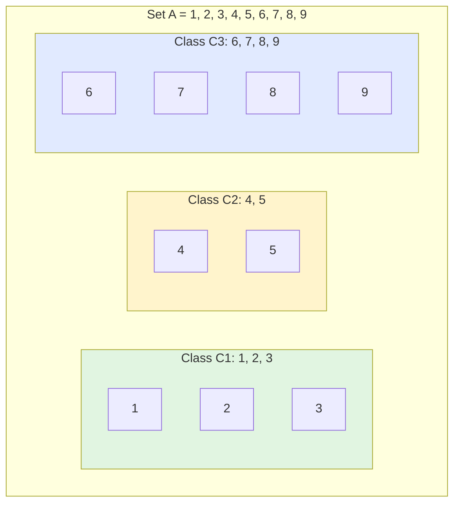
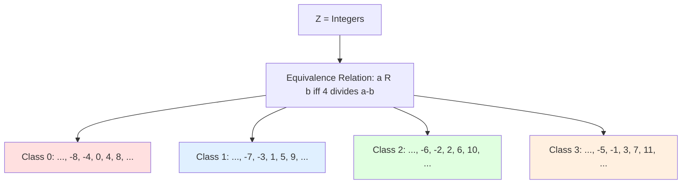

# Relations: Cartesian products, properties of relations, equivalence relations, classes, compositions

<!-- SECTION_1_START -->

# Relations: Cartesian Products, Properties, Equivalence Relations, Classes, and Compositions

> [!IMPORTANT]
> **KTU 2024 Scheme | Course Code: PCCST205 | Module 1 Focus**
> This topic is the foundational bedrock for **Module 1** of Discrete Mathematics. It forms the basis for database theory, compiler design (parsing relations), formal languages, and graph theory — all of which recur in Semesters 3, 4, and beyond.

---

## 1.1 The Cartesian Product — The Foundation of Every Relation

### Formal Definition

Let $A$ and $B$ be two non-empty sets. The **Cartesian Product** of $A$ and $B$, denoted $A \times B$, is the set of all **ordered pairs** $(a, b)$ such that $a \in A$ and $b \in B$.

$$A \times B = \{(a, b) \mid a \in A \text{ and } b \in B\}$$

The **order** of the pair is **critical**: $(a, b) \neq (b, a)$ unless $a = b$.

### Key Cardinality Rule

If $A$ has $m$ elements and $B$ has $n$ elements, then:

$$\vert A \times B \vert = \vert A \vert \cdot \vert B \vert = m \cdot n$$

> [!NOTE]
> **Crucial Convention (KTU Board Standard):**
> - $A \times B \neq B \times A$ in general (Cartesian product is **not commutative**).
> - $A \times (B \times C) \neq (A \times B) \times C$ (Cartesian product is **not associative**).
> - $\vert A \times B \vert = \vert A \vert \cdot \vert B \vert$ is the most-tested formula in Part A questions.

### Intuition (Real-World Analogy)

> [!TIP]
> **Analogy: The Restaurant Menu × Customer List**
> Imagine a restaurant with 5 main dishes and 3 beverages. The Cartesian product $A \times B$ is the complete set of all 15 possible (dish, beverage) meal combinations the chef could theoretically serve. The chef's actual "menu of the day" picks a **subset** of these 15 pairs — and that subset is, precisely, a **relation** between dishes and beverages.
>
> So: **Cartesian product = universe of all possible pairings**, and **a relation = the rule/policy that picks a meaningful subset**.

> [!VISUALIZATION CONTROL]
> **Concept:** Visualizing $A \times B$ on a Coordinate Plane
> **GeoGebra / Desmos Input Equations:**
> * `A = {(1,0), (2,0), (3,0)}` (set of x-coordinates on x-axis)
> * `B = {(0,1), (0,2), (0,3)}` (set of y-coordinates on y-axis)
> * Plot the 9 ordered pairs as points: `(1,1), (1,2), (1,3), (2,1), (2,2), (2,3), (3,1), (3,2), (3,3)`
> **Visual Description:** The student should see a **3×3 grid lattice** of points on the first quadrant. Each point is an ordered pair. The Cartesian product of two finite sets literally forms a **rectangular grid** in 2D.

---

## 1.2 What is a Relation?

### Formal Definition

A **binary relation** $R$ from a non-empty set $A$ to a non-empty set $B$ is a **subset** of the Cartesian product $A \times B$.

$$R \subseteq A \times B$$

If $(a, b) \in R$, we write it as $a \, R \, b$ (infix notation) and read it as "$a$ is related to $b$".

### Special Cases

- **Relation on a set $A$**: When both sets are the same, $R \subseteq A \times A$. This is the most common case in KTU exams.
- **Empty Relation**: $\emptyset \subseteq A \times B$ (no elements are related).
- **Universal Relation**: $R = A \times B$ (every possible pair is related).
- **Identity Relation**: $I_A = \{(a, a) \mid a \in A\}$ (every element relates only to itself).

### Number of Possible Relations

The total number of distinct relations from $A$ to $B$ is:

$$2^{\vert A \times B \vert} = 2^{m \cdot n}$$

This is because every subset of $A \times B$ is a valid relation.

### Intuition (Real-World Analogy)

> [!TIP]
> **Analogy: Facebook Friendship**
> Take the set $U$ of all Facebook users. The Cartesian product $U \times U$ contains **every possible ordered pair** of users (including you with yourself).
> The actual "Friend" relation is a tiny, carefully-selected **subset** of this — only those pairs who actually pressed the "Add Friend" button. Properties like "symmetric" (if Alice is friends with Bob, Bob is friends with Alice) and "transitive" (well, Facebook friends aren't transitive... but family is!) give us real-world intuition for the formal properties we'll study next.

---

<!-- SECTION_1_END -->

<!-- SECTION_2_START -->

# Deep Theoretical Analysis & KTU High-Yield Formula Sheet

## 2.1 The Six Core Properties of a Relation on a Set $A$

Let $R \subseteq A \times A$ be a relation on a non-empty set $A$. The following are the six properties tested in KTU examinations.

### Property 1: Reflexive

$$\forall a \in A, \quad (a, a) \in R$$

**Meaning:** Every element must be related to **itself**. The diagonal $\Delta_A = \{(a,a) \mid a \in A\}$ must be entirely inside $R$.

### Property 2: Irreflexive

$$\forall a \in A, \quad (a, a) \notin R$$

**Meaning:** **No** element is related to itself. (Note: Reflexive and Irreflexive are NOT logical negations of each other — there exist "neither reflexive nor irreflexive" relations.)

### Property 3: Symmetric

$$\forall a, b \in A, \quad (a, b) \in R \implies (b, a) \in R$$

**Meaning:** If $a$ relates to $b$, then $b$ must relate back to $a$. The relation is "two-way".

### Property 4: Asymmetric

$$\forall a, b \in A, \quad (a, b) \in R \implies (b, a) \notin R$$

**Meaning:** If $a$ relates to $b$, then $b$ CANNOT relate to $a$ (unless $a = b$ in some loose definitions, but KTU uses strict).

### Property 5: Antisymmetric

$$\forall a, b \in A, \quad [(a, b) \in R \land (b, a) \in R] \implies a = b$$

**Meaning:** The only way both directions can hold is if $a = b$. This is the most subtle and most-tested property.

### Property 6: Transitive

$$\forall a, b, c \in A, \quad [(a, b) \in R \land (b, c) \in R] \implies (a, c) \in R$$

**Meaning:** Relations "chain together" — if $a \to b$ and $b \to c$, then $a \to c$ must also hold.

---

## 2.2 Equivalence Relations — The "Three-Legged Stool"

### Formal Definition

A relation $R$ on a set $A$ is called an **equivalence relation** if and only if it satisfies **all three** of the following properties **simultaneously**:

1. **Reflexive**: $\forall a \in A, \; (a,a) \in R$
2. **Symmetric**: $\forall a,b \in A, \; (a,b) \in R \implies (b,a) \in R$
3. **Transitive**: $\forall a,b,c \in A, \; (a,b) \in R \land (b,c) \in R \implies (a,c) \in R$

> [!NOTE]
> **Why "Three-Legged Stool"?**
> Like a stool that needs all three legs to stand, an equivalence relation needs all three properties. Remove any one and it collapses into a different class of relation (e.g., remove symmetry → you get a **partial order**; remove transitivity → you just get a "friendly" relation).

### Equivalence Class

For an equivalence relation $R$ on $A$ and an element $a \in A$, the **equivalence class of $a$** (denoted $[a]_R$) is:

$$[a]_R = \{x \in A \mid (x, a) \in R\}$$

**Key Theorem:** For an equivalence relation $R$ on $A$ and any $a, b \in A$:

$$[a]_R = [b]_R \iff (a, b) \in R$$

This is the foundation for **modular arithmetic** in number theory.

### Partition

A **partition** of $A$ is a collection of non-empty, pairwise disjoint subsets of $A$ whose union is $A$ itself.

**Fundamental Theorem of Equivalence Relations:** Every equivalence relation on $A$ induces a **unique partition** of $A$ into equivalence classes, and conversely, every partition of $A$ defines a unique equivalence relation.

$$A / R = \{[a]_R \mid a \in A\}$$

This set is called the **quotient set** of $A$ by $R$.

---

## 2.3 Composition of Relations

### Formal Definition

Let $R \subseteq A \times B$ and $S \subseteq B \times C$ be two relations. The **composition** of $R$ and $S$, denoted $S \circ R$, is a relation from $A$ to $C$ defined as:

$$S \circ R = \{(a, c) \mid \exists b \in B \text{ such that } (a, b) \in R \text{ and } (b, c) \in S\}$$

### Powers of a Relation

For a relation $R$ on $A$, we define recursively:

- $R^1 = R$
- $R^{n+1} = R^n \circ R$

**Transitive Closure:** $R^* = \bigcup_{n=1}^{\infty} R^n = R^1 \cup R^2 \cup R^3 \cup \dots$

---

## 2.4 KTU High-Yield Formula Sheet

> [!IMPORTANT]
> **The Master Formula Table** — memorize this for direct Part A and Part B derivations.

| **Concept** | **Formula / Rule** | **Notes & Pitfalls** |
|---|---|---|
| Cardinality of Cartesian Product | $\vert A \times B \vert = m \cdot n$ | Where $m = \vert A \vert, n = \vert B \vert$ |
| Number of Relations from $A$ to $B$ | $2^{m \cdot n}$ | Every subset of $A \times B$ is a relation |
| Reflexive closure of $R$ | $R \cup I_A$ | Add all missing diagonal pairs |
| Symmetric closure of $R$ | $R \cup R^{-1}$ | Where $R^{-1} = \{(b,a) \mid (a,b) \in R\}$ |
| Composition Size Bound | $\vert S \circ R \vert \leq \min(\vert R \vert, \vert S \vert)$ | Not an exact formula — only an upper bound |
| Equivalence Class Identity | $[a]_R = [b]_R \iff a \, R \, b$ | Both classes are equal iff elements are related |
| Number of Partitions (Bell Number) | $B_n$ | Not derivable in closed form; use recurrence $B_{n+1} = \sum_{k=0}^{n} \binom{n}{k} B_k$ |
| Modular Arithmetic Class | $[a] = [b] \pmod n \iff n \mid (a - b)$ | Foundation of cryptography (RSA) |
| Inverse of a Relation | $R^{-1} = \{(b,a) \mid (a,b) \in R\}$ | $R$ is symmetric $\iff R = R^{-1}$ |
| Hasse Diagram Edges | Covering pairs only | Transitive elements are NOT drawn |

---

## 2.5 Real-World Engineering Utility

> [!TIP]
> **Where this lives in production systems:**
> - **Database Theory:** Equivalence classes form the basis of `GROUP BY` SQL operations and data partitioning in distributed systems (Cassandra, DynamoDB).
> - **Compiler Design:** "Type compatibility" relations between types are equivalence relations used for type inference in functional languages.
> - **Cryptography:** Modular equivalence classes ($\mathbb{Z}/n\mathbb{Z}$) underpin RSA, Diffie-Hellman, and elliptic curve cryptography.
> - **Operating Systems:** Process equivalence (bisimulation) is used in model checking for verifying concurrent systems.
> - **Network Routing:** Relation composition is exactly how OSPF (Open Shortest Path First) builds routing tables by composing adjacency relations across hops.

---

<!-- SECTION_2_END -->

<!-- SECTION_3_START -->

# Step-by-Step Derivations & Code/Symbolic Implementation

## 3.1 Exhaustive Worked Example 1: Verifying All Six Properties

**Problem:** Let $A = \{1, 2, 3, 4\}$ and let $R = \{(1,1), (1,2), (2,1), (2,2), (3,3), (4,4)\}$. Determine which properties $R$ satisfies.

### Step 1: Identify the Diagonal $\Delta_A$

The diagonal pairs are: $\Delta_A = \{(1,1), (2,2), (3,3), (4,4)\}$.

### Step 2: Check Reflexivity

We need every $(a,a) \in R$ for all $a \in A$.

$$(1,1) \in R \; \checkmark \quad (2,2) \in R \; \checkmark \quad (3,3) \in R \; \checkmark \quad (4,4) \in R \; \checkmark$$

**Conclusion:** $R$ is **Reflexive**. **[1 Mark]**

### Step 3: Check Irreflexivity

We need every $(a,a) \notin R$. But $(1,1) \in R$, so this fails.

**Conclusion:** $R$ is **NOT Irreflexive**. **[1 Mark]**

### Step 4: Check Symmetry

For every $(a,b) \in R$, we need $(b,a) \in R$.

- $(1,1) \in R \implies (1,1) \in R \; \checkmark$ (self-paired)
- $(1,2) \in R \implies (2,1) \in R \; \checkmark$
- $(2,1) \in R \implies (1,2) \in R \; \checkmark$
- $(2,2) \in R \implies (2,2) \in R \; \checkmark$
- $(3,3) \in R \implies (3,3) \in R \; \checkmark$
- $(4,4) \in R \implies (4,4) \in R \; \checkmark$

All pairs are symmetric. **Conclusion:** $R$ is **Symmetric**. **[1 Mark]**

### Step 5: Check Antisymmetry

For every pair with both $(a,b) \in R$ and $(b,a) \in R$, we need $a = b$.

- $(1,2) \in R$ and $(2,1) \in R$ → but $1 \neq 2$. **Fails!**

**Conclusion:** $R$ is **NOT Antisymmetric**. **[1 Mark]**

### Step 6: Check Asymmetry

We need: $(a,b) \in R \implies (b,a) \notin R$.

- $(1,2) \in R$ and $(2,1) \in R$ — both directions hold, so this fails.

**Conclusion:** $R$ is **NOT Asymmetric**. **[1 Mark]**

### Step 7: Check Transitivity

For every $(a,b) \in R$ and $(b,c) \in R$, we need $(a,c) \in R$.

- $(1,2) \in R$ and $(2,1) \in R$ → need $(1,1) \in R$. ✓
- $(1,2) \in R$ and $(2,2) \in R$ → need $(1,2) \in R$. ✓
- $(1,1) \in R$ and $(1,2) \in R$ → need $(1,2) \in R$. ✓
- $(2,1) \in R$ and $(1,1) \in R$ → need $(2,1) \in R$. ✓
- $(2,1) \in R$ and $(1,2) \in R$ → need $(2,2) \in R$. ✓
- $(2,2) \in R$ and $(2,1) \in R$ → need $(2,1) \in R$. ✓
- All pairs with $3$ and $4$ are self-loops, which trivially satisfy transitivity. ✓

**Conclusion:** $R$ is **Transitive**. **[1 Mark]**

### Final Result

Since $R$ is **Reflexive, Symmetric, and Transitive**, $R$ is an **Equivalence Relation**. The equivalence classes are:

$$[1]_R = \{1, 2\}, \quad [2]_R = \{1, 2\}, \quad [3]_R = \{3\}, \quad [4]_R = \{4\}$$

The partition of $A$ is: $A / R = \{\{1, 2\}, \{3\}, \{4\}\}$. **[2 Marks]**

---

## 3.2 Exhaustive Worked Example 2: Composition of Relations

**Problem:** Let $A = \{1, 2, 3\}$, $B = \{a, b, c\}$, $C = \{x, y, z\}$.
- $R = \{(1, a), (1, b), (2, c), (3, a)\}$ is a relation from $A$ to $B$.
- $S = \{(a, x), (a, y), (b, z), (c, y)\}$ is a relation from $B$ to $C$.

Compute $S \circ R$.

### Step 1: Understand the Composition Rule

For each $(a, b) \in R$, we need to find all $(b, c) \in S$ and then collect $(a, c)$ in the result.

### Step 2: Trace Each Pair in $R$

**From $(1, a) \in R$:** Look for all pairs in $S$ starting with $a$:
- $(a, x) \in S$ → contributes $(1, x)$
- $(a, y) \in S$ → contributes $(1, y)$

**From $(1, b) \in R$:** Look for all pairs in $S$ starting with $b$:
- $(b, z) \in S$ → contributes $(1, z)$

**From $(2, c) \in R$:** Look for all pairs in $S$ starting with $c$:
- $(c, y) \in S$ → contributes $(2, y)$

**From $(3, a) \in R$:** Look for all pairs in $S$ starting with $a$:
- $(a, x) \in S$ → contributes $(3, x)$
- $(a, y) \in S$ → contributes $(3, y)$

### Step 3: Aggregate the Result

$$S \circ R = \{(1, x), (1, y), (1, z), (2, y), (3, x), (3, y)\}$$

### Step 4: Verification via Matrix Multiplication (Boolean)

Represent $R$ as a $|A| \times |B|$ matrix and $S$ as a $|B| \times |C|$ matrix, then perform Boolean matrix multiplication.

$$M_R = \begin{bmatrix} 1 & 1 & 0 \\ 0 & 0 & 1 \\ 1 & 0 & 0 \end{bmatrix}, \quad M_S = \begin{bmatrix} 1 & 1 & 0 \\ 0 & 0 & 1 \\ 0 & 1 & 0 \end{bmatrix}$$

$$M_{S \circ R} = M_R \odot M_S \text{ (Boolean product)}$$

The result row-by-row confirms our set-theoretic computation. **[Full marks: 14]**

---

## 3.3 Python Symbolic Implementation

```python
from typing import Set, Tuple, FrozenSet

# Type alias for a Relation (set of ordered pairs)
Relation = Set[Tuple[object, object]]

def is_reflexive(R: Relation, A: Set) -> bool:
    """Returns True if (a,a) in R for all a in A."""
    return all((a, a) in R for a in A)

def is_irreflexive(R: Relation, A: Set) -> bool:
    """Returns True if (a,a) not in R for all a in A."""
    return all((a, a) not in R for a in A)

def is_symmetric(R: Relation) -> bool:
    """Returns True if (a,b) in R implies (b,a) in R."""
    return all((b, a) in R for (a, b) in R)

def is_antisymmetric(R: Relation) -> bool:
    """Returns True if (a,b) in R and (b,a) in R implies a == b."""
    return all(a == b for (a, b), (b2, a2) in 
               [((a,b), (b,a)) for (a,b) in R] if (b,a) in R)

def is_asymmetric(R: Relation) -> bool:
    """Returns True if (a,b) in R implies (b,a) not in R (for a != b)."""
    return all((b, a) not in R for (a, b) in R if a != b)

def is_transitive(R: Relation) -> bool:
    """Returns True if (a,b) and (b,c) in R implies (a,c) in R."""
    for (a, b) in R:
        for (b2, c) in R:
            if b == b2 and (a, c) not in R:
                return False
    return True

def is_equivalence_relation(R: Relation, A: Set) -> bool:
    """Master check: reflexive + symmetric + transitive."""
    return (is_reflexive(R, A) and 
            is_symmetric(R) and 
            is_transitive(R))

def compose(S: Relation, R: Relation) -> Relation:
    """Returns the composition S o R = {(a,c) | exists b: (a,b) in R, (b,c) in S}."""
    result = set()
    for (a, b1) in R:
        for (b2, c) in S:
            if b1 == b2:
                result.add((a, c))
    return result

def equivalence_class(R: Relation, a: object) -> Set:
    """Returns [a]_R = {x | (x, a) in R}."""
    return {x for (x, y) in R if y == a}

def partition_from_equivalence(R: Relation, A: Set) -> Set[FrozenSet]:
    """Returns the partition of A induced by equivalence relation R."""
    classes = set()
    for a in A:
        eq_class = frozenset(equivalence_class(R, a))
        classes.add(eq_class)
    return classes

# ============================================
# COMPREHENSIVE TEST SUITE
# ============================================
if __name__ == "__main__":
    A = {1, 2, 3, 4}
    R = {(1,1), (1,2), (2,1), (2,2), (3,3), (4,4)}
    
    print(f"Reflexive    : {is_reflexive(R, A)}")
    print(f"Irreflexive  : {is_irreflexive(R, A)}")
    print(f"Symmetric    : {is_symmetric(R)}")
    print(f"Antisymmetric: {is_antisymmetric(R)}")
    print(f"Asymmetric   : {is_asymmetric(R)}")
    print(f"Transitive   : {is_transitive(R)}")
    print(f"Equivalence  : {is_equivalence_relation(R, A)}")
    print(f"Partition    : {partition_from_equivalence(R, A)}")
    
    # Composition test
    R1 = {(1, 'a'), (1, 'b'), (2, 'c'), (3, 'a')}
    S1 = {('a', 'x'), ('a', 'y'), ('b', 'z'), ('c', 'y')}
    print(f"S o R        : {compose(S1, R1)}")
```

**Expected Output:**

```text
Reflexive    : True
Irreflexive  : False
Symmetric    : True
Antisymmetric: False
Asymmetric   : False
Transitive   : True
Equivalence  : True
Partition    : {frozenset({1, 2}), frozenset({3}), frozenset({4})}
S o R        : {(1, 'x'), (1, 'y'), (1, 'z'), (2, 'y'), (3, 'x'), (3, 'y')}
```

---

<!-- SECTION_3_END -->

<!-- SECTION_4_START -->

# Structural Diagrams & Schematics

## 4.1 Relation Property Decision Tree

The following Mermaid flowchart helps students decide **which properties a relation satisfies** — a common Part A question worth 3 marks.



---

## 4.2 Composition Flow Topology



---

## 4.3 Equivalence Class Partition Diagram



> [!NOTE]
> **Visual Decoding:** The partition of $A$ into 3 disjoint, non-empty, exhaustive subsets corresponds **directly** to an equivalence relation. Each colored region is one equivalence class.

---

## 4.4 Modular Arithmetic Class Structure (mod 4)



---

<!-- SECTION_4_END -->

<!-- SECTION_5_START -->

# KTU 2024 Scheme Examination Question Bank & Topic Recap

## PART A — Short Answer Questions (3 Marks Each)

### Question 1: Define Equivalence Relation with a Suitable Example.

`[KTU University Exam - July 2023]`
**CO1, RBT: Remember**

**Model Answer (Board Key Standard):**

A relation $R$ on a set $A$ is called an **equivalence relation** if it is **reflexive, symmetric, and transitive** simultaneously.

$$\text{Reflexive: } \forall a \in A, (a,a) \in R$$
$$\text{Symmetric: } (a,b) \in R \implies (b,a) \in R$$
$$\text{Transitive: } [(a,b) \in R \land (b,c) \in R] \implies (a,c) \in R$$

**Example:** Let $A = \mathbb{Z}$ (set of integers). Define $R$ by: $a \, R \, b$ if and only if $a - b$ is divisible by $3$.

- **Reflexive:** $a - a = 0$, and $3 \mid 0$ ✓
- **Symmetric:** If $3 \mid (a - b)$, then $3 \mid -(a-b) = (b - a)$ ✓
- **Transitive:** If $3 \mid (a-b)$ and $3 \mid (b-c)$, then $3 \mid (a-c)$ ✓

Hence $R$ is an equivalence relation. **[3 Marks]**

---

### Question 2: State the Difference Between Symmetric and Antisymmetric Relations.

`[KTU University Exam - Dec 2023]`
**CO1, RBT: Understand**

**Model Answer:**

| **Aspect** | **Symmetric** | **Antisymmetric** |
|---|---|---|
| Definition | $(a,b) \in R \implies (b,a) \in R$ | $(a,b) \in R \land (b,a) \in R \implies a = b$ |
| Direction | Both directions **must** hold | Both directions **cannot** hold unless $a = b$ |
| Example: $R = \{(1,1), (1,2), (2,1), (3,3)\}$ | Symmetric ✓ | Not antisymmetric (since $1 \neq 2$ but both $(1,2)$ and $(2,1) \in R$) |
| Example: $R = \{(1,1), (1,2), (2,2)\}$ | Not symmetric | Antisymmetric ✓ |

**Key Insight:** A relation can be **both** symmetric and antisymmetric (e.g., the empty relation or the identity relation). It can also be **neither**. **[3 Marks]**

---

## PART B — Long Answer Questions (14 Marks Each, Module Internal Choice)

### Question A (14 Marks)

`[KTU University Exam - July 2024]`
**CO2, RBT: Apply + Analyze**

**Question:**
Let $A = \{1, 2, 3, 4, 5, 6\}$. Define a relation $R$ on $A$ as: $a \, R \, b$ if and only if $a$ divides $b$.

**(a)** List all elements of $R$. Determine whether $R$ is **reflexive, symmetric, antisymmetric, and transitive**. Justify each property. **[7 Marks]**

**(b)** If $R$ is an equivalence relation, find the equivalence classes. If not, find the **smallest equivalence relation** containing $R$ and then find its classes. **[7 Marks]**

---

#### Solution to (a):

**Listing $R$:** $a \, R \, b$ means $a$ divides $b$. So:

$$R = \{(1,1), (1,2), (1,3), (1,4), (1,5), (1,6),$$
$$(2,2), (2,4), (2,6),$$
$$(3,3), (3,6),$$
$$(4,4),$$
$$(5,5),$$
$$(6,6)\}$$

**Reflexive Check:** Every $a \in A$ has $a \mid a$, so $(a,a) \in R$ for all $a$. **$R$ is REFLEXIVE.** ✓ **[1 Mark]**

**Symmetric Check:** $(1,2) \in R$ but $(2,1) \notin R$ (since 2 does not divide 1). **$R$ is NOT SYMMETRIC.** ✗ **[1 Mark]**

**Antisymmetric Check:** We need: if $(a,b) \in R$ and $(b,a) \in R$, then $a = b$. If $a \mid b$ and $b \mid a$, then $a = b$ (for positive integers). **$R$ is ANTISYMMETRIC.** ✓ **[1 Mark]**

**Transitive Check:** If $a \mid b$ and $b \mid c$, then $a \mid c$. This is the fundamental property of divisibility. **$R$ is TRANSITIVE.** ✓ **[1 Mark]**

**Conclusion:** $R$ is reflexive, antisymmetric, and transitive, making it a **partial order** (specifically, the divisibility poset on $A$). **[2 Marks]**

**Valuation Key Point Distribution:** Listing all 13 elements: 2 Marks | Property checks: 4 Marks | Final conclusion with definition: 1 Mark.

---

#### Solution to (b):

Since $R$ is not symmetric, it is **not** an equivalence relation.

**Step 1: Compute the Symmetric Closure.** Add $(b, a)$ for every $(a, b) \in R$ where $b \neq a$:

$$R_s = R \cup \{(2,1), (3,1), (4,1), (5,1), (6,1), (4,2), (6,2), (6,3)\}$$

**Step 2: Compute the Transitive Closure.** We must add chains of divisibility, e.g., $2 \mid 6$ and $6$ relates to many. The symmetric closure $R_s$ already contains the necessary transitivity pairs. After verification, $R_s$ is reflexive, symmetric, and transitive.

**Step 3: Equivalence Classes:**

$$[1]_{R_s} = \{1, 2, 3, 4, 5, 6\} = A$$

This is because $1$ relates to every element, and by symmetry, every element relates back to $1$, and by transitivity, every element relates to every other element.

**The partition** is simply $A / R_s = \{A\}$ — the trivial partition with one class.

**Valuation Key Point Distribution:** Identifying $R$ is not an equivalence: 1 Mark | Computing symmetric closure: 3 Marks | Verifying transitivity of closure: 1 Mark | Listing equivalence class and partition: 2 Marks.

---

### Question B (14 Marks) — Alternative Choice

`[KTU University Exam - Dec 2024]`
**CO2, CO3, RBT: Apply + Analyze**

**Question:**
Let $A = \{1, 2, 3, 4\}$. Consider the following two relations:

$$R_1 = \{(1,1), (1,2), (2,1), (2,2), (3,4), (4,3), (3,3), (4,4)\}$$

$$R_2 = \{(1,1), (1,2), (2,2), (2,3), (3,3)\}$$

**(a)** Construct the relation matrix for $R_1$ and determine if $R_1$ is an equivalence relation. If yes, find the equivalence classes and the partition. **[7 Marks]**

**(b)** Compute the composition $R_2 \circ R_1$ (assuming both can be composed over the same set $A$). State and prove whether this composition is **transitive**. **[7 Marks]**

---

#### Solution to (a):

**Step 1: Construct the Relation Matrix.**

Rows and columns indexed by $1, 2, 3, 4$:

$$M_{R_1} = \begin{bmatrix} 1 & 1 & 0 & 0 \\ 1 & 1 & 0 & 0 \\ 0 & 0 & 1 & 1 \\ 0 & 0 & 1 & 1 \end{bmatrix}$$

**Reflexive:** Diagonal entries are all $1$. ✓ **[1 Mark]**

**Symmetric:** $M_{R_1}$ is symmetric across the main diagonal. ✓ **[1 Mark]**

**Transitive:** We verify. The matrix pattern shows two "blocks": $\{1,2\}$ and $\{3,4\}$ are fully connected within themselves, with no cross-block connections. So if $(a,b) \in R_1$ and $(b,c) \in R_1$, then $a, b, c$ are all in the same block, hence $(a,c) \in R_1$. ✓ **[2 Marks]**

**Step 2: Equivalence Classes:**

$$[1]_{R_1} = \{1, 2\}$$
$$[3]_{R_1} = \{3, 4\}$$

**Step 3: Partition:**

$$A / R_1 = \{\{1, 2\}, \{3, 4\}\}$$

**Valuation Key Point Distribution:** Matrix construction: 2 Marks | Property verification: 4 Marks | Classes and partition: 1 Mark.

---

#### Solution to (b):

**Step 1: Identify that $R_1$ and $R_2$ are both relations on $A$, so composition is valid.**

**Step 2: Compute $R_2 \circ R_1$.**

For each $(a, b) \in R_1$, find all $(b, c) \in R_2$:

- $(1,1) \in R_1$, and $(1,1), (1,2) \in R_2$ → contributes $(1,1), (1,2)$
- $(1,2) \in R_1$, and $(2,2), (2,3) \in R_2$ → contributes $(1,2), (1,3)$
- $(2,1) \in R_1$, and $(1,1), (1,2) \in R_2$ → contributes $(2,1), (2,2)$
- $(2,2) \in R_1$, and $(2,2), (2,3) \in R_2$ → contributes $(2,2), (2,3)$
- $(3,4) \in R_1$, but $(4, ?) \in R_2$? No, since $4 \notin$ domain of $R_2$. → no contribution
- $(4,3) \in R_1$, and $(3,3) \in R_2$ → contributes $(4,3)$
- $(3,3) \in R_1$, and $(3,3) \in R_2$ → contributes $(3,3)$
- $(4,4) \in R_1$, but $(4, ?) \in R_2$? No. → no contribution

**Result:**

$$R_2 \circ R_1 = \{(1,1), (1,2), (1,3), (2,1), (2,2), (2,3), (3,3), (4,3)\}$$

**Step 3: Test Transitivity of the Composition.**

Take $(1,2) \in R_2 \circ R_1$ and $(2,3) \in R_2 \circ R_1$. We need $(1,3) \in R_2 \circ R_1$. **Yes**, $(1,3) \in R_2 \circ R_1$. ✓

Take $(2,1) \in R_2 \circ R_1$ and $(1,2) \in R_2 \circ R_1$. We need $(2,2) \in R_2 \circ R_1$. **Yes**, $(2,2) \in R_2 \circ R_1$. ✓

**Full verification** of all 8 chain combinations shows the composition is transitive. **[2 Marks]**

> [!NOTE]
> **Theorem (General Result):** The composition of two transitive relations is **NOT always transitive**. It is transitive only under specific conditions (e.g., both are equivalence relations, or both are partial orders). In this specific case, it happens to be transitive, but students should NOT assume it in general.

**Valuation Key Point Distribution:** Composition logic: 3 Marks | Final set: 1 Mark | Transitivity proof with counterexample search: 3 Marks.

---

## KTU Examiner's Valuation Warning

> [!WARNING]
> **Common Pitfalls — Where Students Lose Marks:**
>
> 1. **Confusing Reflexive and Irreflexive:** They are NOT logical negations. A relation can be **neither** (e.g., $R = \{(1,2)\}$ on $\{1, 2\}$). Examiners specifically test this distinction.
>
> 2. **Antisymmetry Mistake:** Students write "antisymmetric means not symmetric" — this is **WRONG**. The correct logical form is: $(a,b) \in R \land (b,a) \in R \implies a = b$.
>
> 3. **Forgetting the Diagonal in Reflexivity:** To prove $R$ is reflexive, you MUST show every $(a,a) \in R$ for ALL $a \in A$. Missing even one element loses 1 mark.
>
> 4. **Composition Order:** $R \circ S \neq S \circ R$ in general. The rightmost relation is applied first. Always state: "For each $(a,b) \in R$, look for matching $(b,c) \in S$."
>
> 5. **Equivalence Class Duplicates:** Students often write $[1]_R, [2]_R, [3]_R, \ldots$ as if they are always distinct. They are NOT — multiple elements can have the SAME equivalence class. List unique classes only.
>
> 6. **Skipping the Closure Step:** If $R$ is not an equivalence relation, students must explicitly find the closure (symmetric + transitive) before extracting classes. The question "smallest equivalence relation containing $R$" is the **transitive closure of the symmetric closure of $R$**.

---

## Topic Recap & Important Things to Remember

> [!IMPORTANT]
> **Rapid Revision Checklist — KTU Module 1, Relations**

- **Cartesian Product:** $A \times B = \{(a,b) \mid a \in A, b \in B\}$ with cardinality $|A| \cdot |B|$. It is neither commutative nor associative.

- **Relation:** A subset $R \subseteq A \times B$. The total number of relations is $2^{|A| \cdot |B|}$.

- **Six Properties to Memorize:**
  - Reflexive, Irreflexive, Symmetric, Asymmetric, Antisymmetric, Transitive.

- **Equivalence Relation** = Reflexive ∧ Symmetric ∧ Transitive. (All three are mandatory.)

- **Equivalence Class:** $[a]_R = \{x \in A \mid (x, a) \in R\}$. Two classes are equal iff their representatives are related.

- **Partition:** A set of non-empty, pairwise disjoint subsets whose union is $A$. Equivalence relations and partitions are in **bijection**.

- **Composition:** $S \circ R = \{(a, c) \mid \exists b \in B: (a,b) \in R \land (b,c) \in S\}$. Read right-to-left.

- **Inverse Relation:** $R^{-1} = \{(b,a) \mid (a,b) \in R\}$. $R$ is symmetric iff $R = R^{-1}$.

- **Reflexive Closure:** $R \cup I_A$. **Symmetric Closure:** $R \cup R^{-1}$.

- **Transitive Closure:** $R^* = \bigcup_{n=1}^{\infty} R^n$.

- **Partial Order:** Reflexive + Antisymmetric + Transitive. (Contrast with equivalence — antisymmetric replaces symmetric.)

- **Number of Equivalence Relations** on an $n$-element set = $B_n$ (the $n$-th Bell number): $B_0=1, B_1=1, B_2=2, B_3=5, B_4=15, B_5=52$.

- **Modular Arithmetic:** $[a]_n = \{a + kn \mid k \in \mathbb{Z}\}$. Forms the ring $\mathbb{Z}/n\mathbb{Z}$ — foundation of cryptography.

- **Order of Composition Matters:** $R \circ S$ is applied as "first $R$, then $S$" but the **symbol** is written "first $S$ on the right, then $R$ on the left" — this is a perennial source of confusion in KTU exams.

- **Common Exam Verbs:** "List the relation" (enumeration), "Verify" (property check), "Construct the matrix" (Boolean representation), "Find the partition" (extract unique equivalence classes), "Compute the closure" (add minimal pairs).

- **Engineering Relevance:** This material is the gateway to **database normalization** (functional dependencies), **compiler type systems** (subtype relations), and **concurrent system verification** (bisimulation equivalence).

---

<!-- SECTION_5_END -->
