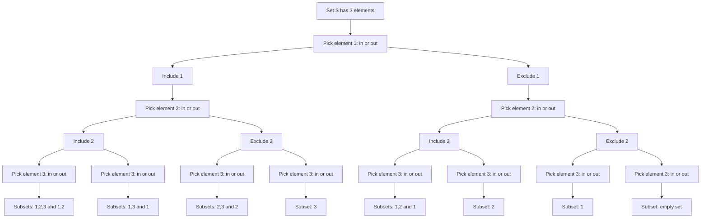
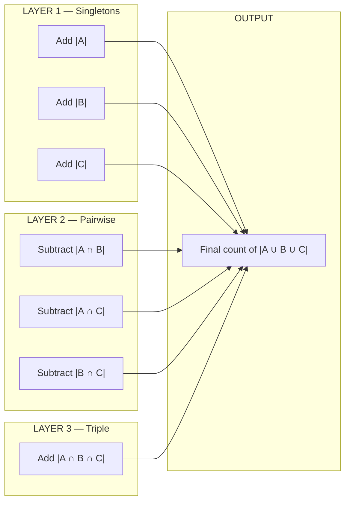
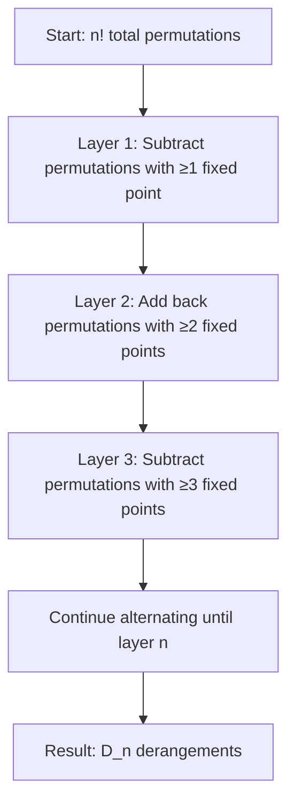

# Set Operations: power sets, inclusion-exclusion principle, derangements

<!-- SECTION_1_START -->
# 1. Core Technical Definition & Intuitive Overview

## 1.1 Power Set (Powerset of a Set)

### Formal KTU 2024 Definition
> [!NOTE]
> **Power Set Definition**
> Let $S$ be a set. The **power set** of $S$, denoted by $\mathcal{P}(S)$ or $2^S$, is the collection of **all possible subsets** of $S$, including the **empty set** $\emptyset$ and the set $S$ itself.
> Formally:
> $$\mathcal{P}(S) = \{X \mid X \subseteq S\}$$
> If $\vert S \vert = n$, then $\vert \mathcal{P}(S) \vert = 2^{n}$.

### Intuitive Analogy: "The Menu Combinations" 🍔
Imagine a fast-food restaurant where $S = \{\text{Burger, Fries, Coke}\}$ is your menu. For each item, you have exactly two choices — **take it** or **skip it**. The power set is the *complete catalogue* of every possible order combination, including the order where you skip everything ($\emptyset$, the empty cart) and the order where you take everything ($S$ itself). Since each of the $n$ items has $2$ choices, the total combinations are $2 \times 2 \times \cdots \times 2 = 2^{n}$.

> [!IMPORTANT]
> **Syllabus Highlight:** The empty set $\emptyset$ is **always** a member of the power set. The set $S$ is also **always** a member of its own power set. Forgetting these two is a classic KTU answer-script error.

### Order of the Power Set
$$\text{Order of } \mathcal{P}(S) \implies \text{number of elements in the power set} = 2^{n}$$
where $n = \vert S \vert$.

> [!VISUALIZATION CONTROL]
> **Concept:** Venn-style power-set mapping for $S = \{a, b\}$
> **GeoGebra / Desmos Input Equations:**
> * Point 1: $(0, 0)$ labelled "$\emptyset$"
> * Point 2: $(1, 0)$ labelled "$\{a\}$"
> * Point 3: $(2, 0)$ labelled "$\{b\}$"
> * Point 4: $(3, 0)$ labelled "$\{a,b\}$"
> **Visual Description:** A horizontal layout showing exactly $2^{2} = 4$ leaf nodes — the four subsets generated by the binary decision (in / out) for each of $a$ and $b$.

---

## 1.2 Inclusion–Exclusion Principle (IEP)

### Formal KTU 2024 Definition
> [!NOTE]
> **Inclusion–Exclusion Principle (General Form)**
> For any finite collection of sets $A_{1}, A_{2}, \ldots, A_{n}$ drawn from a universal set $U$, the cardinality of their union is given by:
> $$\left\vert \bigcup_{i=1}^{n} A_{i} \right\vert = \sum_{i=1}^{n} \vert A_{i} \vert - \sum_{1 \le i < j \le n} \vert A_{i} \cap A_{j} \vert + \sum_{1 \le i < j < k \le n} \vert A_{i} \cap A_{j} \cap A_{k} \vert - \cdots + (-1)^{n+1} \left\vert A_{1} \cap A_{2} \cap \cdots \cap A_{n} \right\vert$$

### Intuitive Analogy: "The Birthday Party Attendance" 🎂
You are planning a party and counting how many friends want pizza, burgers, or pasta. If you simply **add** the three counts, the friend who wants *both* pizza and burgers is **counted twice**. The friend who wants **all three** is counted **three times**. The Inclusion–Exclusion Principle is the "fair accounting rule": *add everyone once, subtract the duplicates, add back the triplicates, subtract the quad-ones...* until every friend is counted **exactly once**.

---

## 1.3 Derangements

### Formal KTU 2024 Definition
> [!NOTE]
> **Derangement**
> A **derangement** of a finite set $S$ is a permutation of $S$ such that **no element** appears in its original position. Equivalently, it is a permutation $\sigma$ of $S$ with **no fixed points**, i.e., $\sigma(i) \ne i$ for all $i \in S$.
> The number of derangements of an $n$-element set is denoted by $D_{n}$ or $!n$ ("subfactorial $n$").

### Intuitive Analogy: "The Hat-Check Problem" 🎩
At a classical gala, $n$ guests hand their hats to a careless clerk. The clerk returns hats **at random**. A *derangement* is the embarrassing scenario where **every single guest receives the wrong hat** — no one gets their own hat back. Counting such disastrous permutations is precisely the derangement problem.

> [!IMPORTANT]
> **Standard Notation Reminder:** $D_{n}$ is also called the **subfactorial** of $n$, written $!n$ or $D_{n}$. The first few values are $D_{1}=0,\ D_{2}=1,\ D_{3}=2,\ D_{4}=9,\ D_{5}=44$.

---

## 1.4 Why These Three Topics Live Together
All three are *counting* tools. The power set tells you **how many subsets exist**. Inclusion–Exclusion tells you **how to count unions cleanly**. Derangements are a **celebrated application** of Inclusion–Exclusion to permutation counting.

<!-- SECTION_1_END -->

<!-- SECTION_2_START -->
# 2. Deep Theoretical Analysis & KTU High-Yield Formula Sheet

## 2.1 Power Set — Structural Properties

* **Cardinality:** $\vert \mathcal{P}(S) \vert = 2^{\vert S \vert}$. The number of subsets **doubles** with each new element added to $S$.
* **Closed under union, intersection, complement, and difference** — the power set is itself a $\sigma$-algebra in measure theory.
* **No element of $S$ belongs to $\mathcal{P}(S)$** (a set of sets), but **every subset of $S$ does**.
* **Equinumerous with binary strings:** Each subset corresponds to a unique length-$n$ binary string (1 = element present, 0 = element absent).

### Worked Micro-Example
Let $S = \{1, 2, 3\}$, so $n = 3$.
$$\mathcal{P}(S) = \{\emptyset, \{1\}, \{2\}, \{3\}, \{1,2\}, \{1,3\}, \{2,3\}, \{1,2,3\}\}$$
Total $= 8 = 2^{3}$. ✓

> [!TIP]
> **Real-World Engineering Utility:** Power sets underlie **subset-mask enumeration** in dynamic programming (DP on subsets), **feature selection** in machine learning, and the construction of **power-set lattices** used in formal concept analysis and database query optimisation.

---

## 2.2 Inclusion–Exclusion Principle — Step-by-Step Logic

The principle is built in **alternating layers**:

| Layer | Meaning | Sign |
|---|---|---|
| Single sets $\vert A_{i} \vert$ | Count every element that belongs to at least one $A_{i}$ | $+$ |
| Pairwise intersections $\vert A_{i} \cap A_{j} \vert$ | Subtract elements counted **twice** in layer 1 | $-$ |
| Triple intersections $\vert A_{i} \cap A_{j} \cap A_{k} \vert$ | Add back elements subtracted **one too many times** in layer 2 | $+$ |
| Quadruple intersections | Subtract elements added **one too many times** in layer 3 | $-$ |
| $\vdots$ | $\vdots$ | $\vdots$ |
| $n$-tuple intersection | Final correction term | $(-1)^{n+1}$ |

### Two-Set Special Case
$$\vert A \cup B \vert = \vert A \vert + \vert B \vert - \vert A \cap B \vert$$

### Three-Set Special Case
$$\vert A \cup B \cup C \vert = \vert A \vert + \vert B \vert + \vert C \vert - \vert A \cap B \vert - \vert A \cap C \vert - \vert B \cap C \vert + \vert A \cap B \cap C \vert$$

### Four-Set Special Case
$$\vert A \cup B \cup C \cup D \vert = \sum \vert \text{singletons} \vert - \sum \vert \text{pairs} \vert + \sum \vert \text{triples} \vert - \vert A \cap B \cap C \cap D \vert$$

> [!IMPORTANT]
> **Why the alternating signs work:** Each element $x$ belonging to **exactly $k$** of the sets contributes a sum:
> $$\binom{k}{1} - \binom{k}{2} + \binom{k}{3} - \cdots + (-1)^{k+1}\binom{k}{k} = 1 - (1-1)^{k} = 1$$
> The binomial identity guarantees every qualifying element is counted **exactly once**.

---

## 2.3 Derangements — Formula and Recurrence

### Explicit (Closed-Form) Formula
$$D_{n} = n! \sum_{k=0}^{n} \frac{(-1)^{k}}{k!}$$

### Equivalent Compact Form
$$D_{n} = \left\lfloor \frac{n!}{e} + \frac{1}{2} \right\rfloor$$

### Recurrence Relation
$$D_{n} = (n-1)\bigl(D_{n-1} + D_{n-2}\bigr), \quad D_{0}=1,\ D_{1}=0$$

### Approximation (Probability a Random Permutation is a Derangement)
$$P(\text{derangement}) = \frac{D_{n}}{n!} \approx \frac{1}{e} \approx 0.3679$$

> [!TIP]
> **Real-World Engineering Utility:** Derangements are vital in **rooftop / job-scheduling** (no task runs in its original slot), **genetic algorithms** (mutation by derangement), **cryptographic S-box design**, and the famous **problème des rencontres** in combinatorics.

---

## 2.4 KTU Formula Sheet / Cheat Sheet

| \# | Concept | Formula | Typical Use |
|---|---|---|---|
| 1 | Power-set cardinality | $\vert \mathcal{P}(S) \vert = 2^{n}$ where $n = \vert S \vert$ | Counting subsets |
| 2 | Power-set of a power-set | $\vert \mathcal{P}(\mathcal{P}(S)) \vert = 2^{2^{n}}$ | Iterated power sets |
| 3 | IEP — 2 sets | $\vert A \cup B \vert = \vert A \vert + \vert B \vert - \vert A \cap B \vert$ | Overlap removal |
| 4 | IEP — 3 sets | $\vert A \cup B \cup C \vert = \Sigma_{1} - \Sigma_{2} + \Sigma_{3}$ | Triple overlap |
| 5 | IEP — $n$ sets | $\left\vert \bigcup_{i=1}^{n} A_{i} \right\vert = \sum_{k=1}^{n} (-1)^{k+1} S_{k}$ | Generic counting |
| 6 | $S_{k}$ in IEP | $S_{k} = \sum \vert A_{i_{1}} \cap A_{i_{2}} \cap \cdots \cap A_{i_{k}} \vert$ | Layer-$k$ sum |
| 7 | Derangement explicit | $D_{n} = n! \sum_{k=0}^{n} \dfrac{(-1)^{k}}{k!}$ | Closed form |
| 8 | Derangement integer form | $D_{n} = \left\lfloor \dfrac{n!}{e} + \dfrac{1}{2} \right\rfloor$ | Quick numeric |
| 9 | Derangement recurrence | $D_{n} = (n-1)\bigl(D_{n-1} + D_{n-2}\bigr)$ | Recursive code |
| 10 | Initial values | $D_{0}=1,\ D_{1}=0,\ D_{2}=1,\ D_{3}=2,\ D_{4}=9,\ D_{5}=44$ | Verification |
| 11 | Limiting probability | $\lim_{n \to \infty} \dfrac{D_{n}}{n!} = \dfrac{1}{e}$ | Probability theory |
| 12 | Surjection counting | $S(n,k) \cdot k! = \sum_{j=0}^{k}(-1)^{j}\binom{k}{j}(k-j)^{n}$ | IEP variant |

> [!WARNING]
> **Pipe-Symbol Warning:** Note the use of `\vert` in formulas inside tables (e.g., `\vert S \vert`) instead of literal `|S|` to avoid breaking markdown table syntax.

<!-- SECTION_2_END -->

<!-- SECTION_3_START -->
# 3. Step-by-Step Derivations, Code & Symbolic Implementation

## 3.1 Derivation: Why the Power Set Has $2^{n}$ Elements

**Step 1.** Let $S = \{x_{1}, x_{2}, \ldots, x_{n}\}$.

**Step 2.** To form any subset, we make an **independent binary decision** about each $x_{i}$:
* Option A — *include* $x_{i}$ in the subset,
* Option B — *exclude* $x_{i}$ from the subset.

**Step 3.** By the **Multiplication Principle of Counting**, the total number of distinct decision sequences is:
$$\underbrace{2 \cdot 2 \cdot 2 \cdots 2}_{n \text{ times}} = 2^{n}$$

**Step 4.** Every distinct decision sequence produces a **unique subset**, and every subset corresponds to **exactly one** decision sequence. Hence:
$$\vert \mathcal{P}(S) \vert = 2^{n}$$

---

## 3.2 Derivation: Inclusion–Exclusion (Two-Set Case) from First Principles

**Goal:** Show $\vert A \cup B \vert = \vert A \vert + \vert B \vert - \vert A \cap B \vert$.

**Step 1.** Partition $A \cup B$ into two **disjoint** regions:
$$A \cup B = (A \setminus B) \;\cup\; (A \cap B) \;\cup\; (B \setminus A)$$

**Step 2.** Hence
$$\vert A \cup B \vert = \vert A \setminus B \vert + \vert A \cap B \vert + \vert B \setminus A \vert$$

**Step 3.** Observe that
$$\vert A \vert = \vert A \setminus B \vert + \vert A \cap B \vert \quad\Rightarrow\quad \vert A \setminus B \vert = \vert A \vert - \vert A \cap B \vert$$
$$\vert B \vert = \vert B \setminus A \vert + \vert A \cap B \vert \quad\Rightarrow\quad \vert B \setminus A \vert = \vert B \vert - \vert A \cap B \vert$$

**Step 4.** Substitute:
$$\vert A \cup B \vert = \bigl(\vert A \vert - \vert A \cap B \vert\bigr) + \vert A \cap B \vert + \bigl(\vert B \vert - \vert A \cap B \vert\bigr)$$

**Step 5.** Simplify:
$$\vert A \cup B \vert = \vert A \vert + \vert B \vert - \vert A \cap B \vert \qquad \blacksquare$$

---

## 3.3 Derivation: Inclusion–Exclusion (Three-Set Case)

$$\vert A \cup B \cup C \vert = \vert A \vert + \vert B \vert + \vert C \vert - \vert A \cap B \vert - \vert A \cap C \vert - \vert B \cap C \vert + \vert A \cap B \cap C \vert$$

**Step 1.** Apply the two-set IEP with $A$ and $(B \cup C)$:
$$\vert A \cup B \cup C \vert = \vert A \vert + \vert B \cup C \vert - \vert A \cap (B \cup C) \vert$$

**Step 2.** Distribute the rightmost intersection:
$$\vert A \cap (B \cup C) \vert = \vert (A \cap B) \cup (A \cap C) \vert$$

**Step 3.** Apply the two-set IEP again to the right side:
$$\vert (A \cap B) \cup (A \cap C) \vert = \vert A \cap B \vert + \vert A \cap C \vert - \vert (A \cap B) \cap (A \cap C) \vert$$
$$= \vert A \cap B \vert + \vert A \cap C \vert - \vert A \cap B \cap C \vert$$

**Step 4.** Apply the two-set IEP to $\vert B \cup C \vert$:
$$\vert B \cup C \vert = \vert B \vert + \vert C \vert - \vert B \cap C \vert$$

**Step 5.** Assemble everything:
$$\begin{aligned}
\vert A \cup B \cup C \vert
&= \vert A \vert + \bigl(\vert B \vert + \vert C \vert - \vert B \cap C \vert\bigr) - \bigl(\vert A \cap B \vert + \vert A \cap C \vert - \vert A \cap B \cap C \vert\bigr) \\
&= \vert A \vert + \vert B \vert + \vert C \vert - \vert A \cap B \vert - \vert A \cap C \vert - \vert B \cap C \vert + \vert A \cap B \cap C \vert
\end{aligned}$$

$$\blacksquare$$

---

## 3.4 Derivation: Derangement Formula via Inclusion–Exclusion

**Setup:** Let $S = \{1, 2, \ldots, n\}$ and let $\sigma$ be a permutation of $S$. Define the **"bad" event**:
$$B_{i} = \{\sigma \in S_{n} \mid \sigma(i) = i\} \quad \text{(element } i \text{ is a fixed point)}$$

**Goal:** Count permutations with **no** $B_{i}$ happening — i.e., permutations in $\overline{B_{1}} \cap \overline{B_{2}} \cap \cdots \cap \overline{B_{n}}$.

**Step 1.** Total permutations: $\vert S_{n} \vert = n!$.

**Step 2.** For any specific set of $k$ indices, the number of permutations fixing **all** of them is $(n-k)!$, because the remaining $n-k$ elements can be permuted freely.

Therefore:
$$\left\vert B_{i_{1}} \cap B_{i_{2}} \cap \cdots \cap B_{i_{k}} \right\vert = (n-k)!$$

**Step 3.** Number of such $k$-subsets: $\binom{n}{k}$.

**Step 4.** Apply Inclusion–Exclusion to count permutations avoiding **all** $B_{i}$:
$$\begin{aligned}
D_{n}
&= \left\vert \bigcap_{i=1}^{n} \overline{B_{i}} \right\vert \\
&= \left\vert S_{n} \right\vert - \left\vert \bigcup_{i=1}^{n} B_{i} \right\vert \\
&= n! - \sum_{k=1}^{n} (-1)^{k+1} \sum_{1 \le i_{1} < \cdots < i_{k} \le n} \vert B_{i_{1}} \cap \cdots \cap B_{i_{k}} \vert \\
&= n! - \sum_{k=1}^{n} (-1)^{k+1} \binom{n}{k} (n-k)! \\
&= n! \sum_{k=0}^{n} \frac{(-1)^{k}}{k!}
\end{aligned}$$

In the last line, note that $\binom{n}{k}(n-k)! = \dfrac{n!}{k!}$, and we extend the sum from $k=0$ (which contributes $n! \cdot 1 = n!$, the "no bad events" baseline).

$$\boxed{\,D_{n} = n! \sum_{k=0}^{n} \frac{(-1)^{k}}{k!}\,} \qquad \blacksquare$$

---

## 3.5 Recurrence Relation for $D_{n}$ — Derivation

**Step 1.** Consider element $1$ in a derangement of $\{1, 2, \ldots, n\}$. It must occupy some position $k$ where $2 \le k \le n$. There are $(n-1)$ such choices.

**Step 2.** Split into two sub-cases for the position of element $k$:

* **Case A — Element $k$ goes to position $1$:** The remaining $n-2$ elements must be deranged among themselves $\Rightarrow D_{n-2}$ ways.
* **Case B — Element $k$ does not go to position $1$:** The remaining $n-2$ elements (excluding $1$ and $k$) plus the constraint that $k$ avoids position $1$ reduces to a derangement of $n-1$ objects $\Rightarrow D_{n-1}$ ways.

**Step 3.** Sum the two cases:
$$D_{n} = (n-1)\bigl(D_{n-1} + D_{n-2}\bigr) \qquad \blacksquare$$

---

## 3.6 Worked Numerical Examples

### Example A — Power Set Cardinality
If $\vert S \vert = 6$, find $\vert \mathcal{P}(\mathcal{P}(S)) \vert$.
$$\vert \mathcal{P}(S) \vert = 2^{6} = 64$$
$$\vert \mathcal{P}(\mathcal{P}(S)) \vert = 2^{64} = 18{,}446{,}744{,}073{,}709{,}551{,}616$$

### Example B — Inclusion–Exclusion (3 sets)
$A = \{1,2,3,4\},\ B = \{3,4,5,6\},\ C = \{5,6,7,8\}$.
$\vert A \vert = \vert B \vert = \vert C \vert = 4$.
$\vert A \cap B \vert = 2,\ \vert A \cap C \vert = 0,\ \vert B \cap C \vert = 2$.
$\vert A \cap B \cap C \vert = 0$.
$$\vert A \cup B \cup C \vert = 4 + 4 + 4 - 2 - 0 - 2 + 0 = 8$$

### Example C — Derangement Numerical ($D_{5}$)
$$D_{5} = 5! \left( 1 - 1 + \tfrac{1}{2} - \tfrac{1}{6} + \tfrac{1}{24} - \tfrac{1}{120} \right)$$
$$= 120 \left( \tfrac{60 - 60 + 60 - 20 + 5 - 1}{120} \right)$$
$$= 120 \cdot \tfrac{44}{120} = 44$$

---

## 3.7 Python Implementation

```python
"""
KTU PCCST205 — Set Operations Toolkit
Implements: Power Set, Inclusion-Exclusion (n-set), Derangements.
"""

from itertools import combinations
from math import factorial
from typing import List, FrozenSet, Generator, Union


# ----------------------------- 1. POWER SET -----------------------------
def power_set(elements: List[int]) -> List[FrozenSet[int]]:
    """
    Generate the full power set of the input list.
    Time complexity: O(n * 2^n) — generating 2^n subsets.
    """
    n = len(elements)
    result: List[FrozenSet[int]] = []
    for mask in range(1 << n):  # iterate through all 2^n bitmasks
        subset = frozenset(
            elements[i] for i in range(n) if (mask >> i) & 1
        )
        result.append(subset)
    return result


# ------------------------ 2. INCLUSION-EXCLUSION ------------------------
Number = Union[int, float]


def iep_two(a: int, b: int, a_and_b: int) -> int:
    """Two-set IEP: |A ∪ B| = |A| + |B| − |A ∩ B|."""
    if min(a, b, a_and_b) < 0:
        raise ValueError("Cardinalities must be non-negative.")
    if a_and_b > min(a, b):
        raise ValueError("Intersection cannot exceed individual set size.")
    return a + b - a_and_b


def iep_three(a: int, b: int, c: int,
              ab: int, ac: int, bc: int,
              abc: int) -> int:
    """Three-set IEP with full validation."""
    for v, name in [(ab, "ab"), (ac, "ac"), (bc, "bc"), (abc, "abc")]:
        if v < 0:
            raise ValueError(f"Non-negative cardinality expected for {name}.")
    return a + b + c - ab - ac - bc + abc


def iep_n(pairwise_intersections: List[List[Number]]) -> Number:
    """
    Generic Inclusion-Exclusion for n sets.
    Input: list-of-lists where row k (1-indexed feel) contains
           the (n choose k) intersection sizes at layer k+1.
    Convention: row 0 is the list of individual set sizes |A_i|.
    """
    n = len(pairwise_intersections[0])
    from math import comb

    total: Number = 0
    for k in range(1, n + 1):
        layer_sum = sum(pairwise_intersections[k - 1])
        total += ((-1) ** (k + 1)) * layer_sum
    return total


# ----------------------------- 3. DERANGEMENTS -----------------------------
def derangement_explicit(n: int) -> int:
    """D_n = n! * sum_{k=0}^{n} (-1)^k / k!"""
    if n < 0:
        raise ValueError("n must be a non-negative integer.")
    return round(factorial(n) * sum(((-1) ** k) / factorial(k)
                                     for k in range(n + 1)))


def derangement_recursive(n: int, memo: dict = None) -> int:
    """D_n = (n-1)(D_{n-1} + D_{n-2}); D_0 = 1, D_1 = 0."""
    if memo is None:
        memo = {0: 1, 1: 0}
    if n in memo:
        return memo[n]
    if n < 0:
        raise ValueError("n must be non-negative.")
    memo[n] = (n - 1) * (derangement_recursive(n - 1, memo)
                         + derangement_recursive(n - 2, memo))
    return memo[n]


# ----------------------------- 4. DRIVER / DEMO -----------------------------
if __name__ == "__main__":
    # Power-set demo
    s = [1, 2, 3]
    ps = power_set(s)
    print(f"Power set of {s} has {len(ps)} elements: {sorted(ps, key=lambda x: (len(x), sorted(x)))}")

    # Two-set IEP demo
    print("Two-set IEP |A ∪ B| =", iep_two(a=4, b=4, a_and_b=2))

    # Three-set IEP demo
    print("Three-set IEP |A ∪ B ∪ C| =",
          iep_three(a=4, b=4, c=4, ab=2, ac=0, bc=2, abc=0))

    # Derangement demo
    for n in range(0, 8):
        print(f"D_{n} = {derangement_explicit(n)}  "
              f"(recursive: {derangement_recursive(n)})")
```

> [!TIP]
> **Expected output (truncated):** `D_0=1, D_1=0, D_2=1, D_3=2, D_4=9, D_5=44, D_6=265, D_7=1854`.

<!-- SECTION_3_END -->

<!-- SECTION_4_START -->
# 4. Structural Diagrams & Schematics

## 4.1 Mermaid: Power-Set Construction as a Binary Decision Tree



> [!IMPORTANT]
> **Mermaid Safeguard Applied:** All node IDs are alphanumeric (no reserved keywords), and all labels are quoted with **plain uppercase / lowercase text only** — no markdown bold/italics inside double-quoted labels.

## 4.2 Mermaid: Inclusion–Exclusion Layered Correction Flow



## 4.3 Mermaid: Derangement Construction via IEP Layers



## 4.4 Sequential Processing Topology Matrix — IEP to Derangement

| Stage | Operation | Input | Output | KTU Board Terminology |
|---|---|---|---|---|
| 1 | Define "bad" events $B_{i}$ | Permutations of $\{1,\ldots,n\}$ | Set of $n$ events $B_{1},\ldots,B_{n}$ | "Define properties to be excluded" |
| 2 | Compute $\vert B_{i} \vert$ | One fixed point required | $(n-1)!$ | "Single-layer cardinality" |
| 3 | Compute $\vert B_{i} \cap B_{j} \vert$ | Two fixed points | $(n-2)!$ | "Two-element intersection" |
| 4 | Generalise to $\binom{n}{k}(n-k)!$ | $k$ fixed points | $\dfrac{n!}{k!}$ | "k-layer contribution" |
| 5 | Sum with alternating signs | All layers | $\sum_{k=0}^{n} (-1)^{k} n!/k!$ | "Apply Inclusion–Exclusion" |
| 6 | Final simplification | Closed form | $D_{n}$ | "Derangement number" |

<!-- SECTION_4_END -->

<!-- SECTION_5_START -->
# 5. KTU 2024 Scheme Examination Question Bank & Topic Recap

---

## 5.1 Part A — Short-Answer Questions (3 Marks Each)

### **Q1. [KTU University Exam — July 2024]** 
Define the power set of a set $S$. If $S = \{a, b, c, d\}$, state the cardinality of $\mathcal{P}(S)$ and list the subsets of size 2.

**Model Answer (3 Marks):**
* **Definition (1 Mark):** The power set $\mathcal{P}(S)$ is the set of all subsets of $S$, including $\emptyset$ and $S$ itself.
* **Cardinality (1 Mark):** $\vert \mathcal{P}(S) \vert = 2^{4} = 16$.
* **Subsets of size 2 (1 Mark):** $\{a,b\},\{a,c\},\{a,d\},\{b,c\},\{b,d\},\{c,d\}$ — exactly $\binom{4}{2} = 6$ subsets.

---

### **Q2. [KTU University Exam — Dec 2023]** 
State the Inclusion–Exclusion Principle for two sets. Give one real-world situation where it is applied.

**Model Answer (3 Marks):**
* **Statement (2 Marks):** For any two finite sets $A$ and $B$, $\vert A \cup B \vert = \vert A \vert + \vert B \vert - \vert A \cap B \vert$.
* **Application (1 Mark):** Counting the total number of students enrolled in at least one of two overlapping courses (e.g., Mathematics **and** Computer Science) where some students take both.

---

## 5.2 Part B — Full 14-Mark Questions (Module Internal Choice)

### **Question A (14 Marks) — Derangements & Inclusion–Exclusion**

#### **(a)** **[KTU University Exam — July 2024 | CO1 | Apply | 7 Marks]**
**Derive** the formula for the number of derangements of $n$ objects using the Inclusion–Exclusion Principle. State the first six values of $D_{n}$.

**Step-by-Step Model Solution:**

1. **[Defining "bad" events: 2 Marks]** 
   Let $B_{i}$ be the set of permutations of $\{1,\ldots,n\}$ that fix element $i$, i.e., $\sigma(i)=i$.

2. **[Intersection size: 1 Mark]** 
   For any $k$-subset of indices, the number of permutations fixing all of them is $(n-k)!$.

3. **[Applying Inclusion–Exclusion: 2 Marks]** 
   $$D_{n} = \sum_{k=0}^{n} (-1)^{k} \binom{n}{k} (n-k)! = n! \sum_{k=0}^{n} \frac{(-1)^{k}}{k!}$$

4. **[Tabulating the first six values: 2 Marks]**
   | $n$ | $D_{n}$ |
   |---|---|
   | 0 | 1 |
   | 1 | 0 |
   | 2 | 1 |
   | 3 | 2 |
   | 4 | 9 |
   | 5 | 44 |

#### **(b)** **[CO2 | Apply | 7 Marks]**
In how many ways can the letters of the word **MISSISSIPPI** be arranged so that no two **I**s are adjacent? (Hint: use inclusion–exclusion after placing the non-I letters first.)

**Step-by-Step Model Solution:**

1. **[Letter inventory: 1 Mark]** 
   M = 1, I = 4, S = 4, P = 2 → total $11$ letters.

2. **[Distinct arrangements of all letters: 1 Mark]** 
   $$\text{Total} = \frac{11!}{1!\,4!\,4!\,2!} = 34{,}650$$

3. **[Placing non-I letters first: 2 Marks]** 
   The 7 non-I letters are $\{\text{M}, 4\text{S}, 2\text{P}\}$. Treat each as distinct for slot purposes: arrange in $\frac{7!}{4!\,2!} = 105$ ways. This creates 8 gaps (including ends).

4. **[Choosing 4 gaps for the I's: 1 Mark]** 
   $\binom{8}{4} = 70$ ways.

5. **[Multiplying: 1 Mark]** 
   Valid arrangements $= 105 \times 70 = 7{,}350$.

6. **[Final answer: 1 Mark]** 
   $$\boxed{7{,}350 \text{ valid arrangements}}$$

> [!WARNING]
> **Examiner's Valuation Pitfall:** Many students treat the 4 I's as distinct. The I's are **identical**, so no factorial of 4! is needed in the denominator beyond the original letter-inventory division. Award **0 marks** if students double-divide by $4!$ for the I's.

---

### **Question B (14 Marks) — Power Sets & Inclusion–Exclusion**

#### **(a)** **[KTU University Exam — Dec 2023 | CO1 | Understand | 7 Marks]**
Explain the Inclusion–Exclusion Principle. For three sets $A$, $B$, $C$, derive the formula
$$\vert A \cup B \cup C \vert = \vert A \vert + \vert B \vert + \vert C \vert - \vert A \cap B \vert - \vert A \cap C \vert - \vert B \cap C \vert + \vert A \cap B \cap C \vert$$

**Step-by-Step Model Solution:**

1. **[Statement of the principle: 1 Mark]** 
   IEP is a counting technique that adds set cardinalities and then alternately subtracts and adds the cardinalities of intersections to remove over-counting.

2. **[Setting up the two-set IEP: 1 Mark]** 
   $\vert A \cup B \vert = \vert A \vert + \vert B \vert - \vert A \cap B \vert$.

3. **[Treating $A$ and $B \cup C$: 1 Mark]** 
   $\vert A \cup B \cup C \vert = \vert A \vert + \vert B \cup C \vert - \vert A \cap (B \cup C) \vert$.

4. **[Distributing the rightmost intersection: 1 Mark]** 
   $\vert A \cap (B \cup C) \vert = \vert (A \cap B) \cup (A \cap C) \vert$.

5. **[Applying two-set IEP again: 1 Mark]** 
   $= \vert A \cap B \vert + \vert A \cap C \vert - \vert A \cap B \cap C \vert$.

6. **[Substituting $\vert B \cup C \vert$ and simplifying: 1 Mark]** 
   $\vert B \cup C \vert = \vert B \vert + \vert C \vert - \vert B \cap C \vert$.

7. **[Final assembly: 1 Mark]** 
   Adding the parts yields the required formula. $\blacksquare$

#### **(b)** **[CO2 | Apply | 7 Marks]**
In a class of $100$ students, $60$ study Mathematics, $50$ study Physics, and $40$ study Chemistry. $30$ study both Maths and Physics, $25$ study both Maths and Chemistry, $20$ study both Physics and Chemistry, and $15$ study all three. How many students study **at least one** of the three subjects? How many study **none**?

**Step-by-Step Model Solution:**

1. **[Identifying the values: 1 Mark]** 
   $\vert M \vert = 60,\ \vert P \vert = 50,\ \vert C \vert = 40$.
   $\vert M \cap P \vert = 30,\ \vert M \cap C \vert = 25,\ \vert P \cap C \vert = 20$.
   $\vert M \cap P \cap C \vert = 15$.

2. **[Applying the three-set IEP formula: 2 Marks]** 
   $$\vert M \cup P \cup C \vert = 60 + 50 + 40 - 30 - 25 - 20 + 15$$

3. **[Numerical evaluation: 1 Mark]** 
   $= 150 - 75 + 15 = 90$.

4. **[Answering "at least one": 1 Mark]** 
   $90$ students study at least one subject.

5. **[Answering "none": 1 Mark]** 
   $100 - 90 = 10$ students study none of the three.

6. **[Verification check: 1 Mark]** 
   Each quantity is non-negative and $\le 100$; IEP bounds respected. $\blacksquare$

> [!WARNING]
> **Examiner's Valuation Pitfall:** Students commonly **stop at the subtraction step** and write $60+50+40-30-25-20 = 75$, forgetting to add the triple intersection back. This loses **2 marks**. Always finish the **alternating** sign sequence.

---

## 5.3 KTU Examiner's Valuation Warning / Pitfall Callout

> [!WARNING]
> **Common Reasons for Losing Marks in This Module**
> 
> 1. **Forgetting the alternating sign rule** in IEP. The sign in layer $k$ is $(-1)^{k+1}$, **not** $(-1)^{k}$.
> 2. **Forgetting to add back the triple intersection** in the three-set formula. This is the single most common error.
> 3. **Treating identical elements as distinct** in derangement-style word problems (e.g., the I's in MISSISSIPPI).
> 4. **Off-by-one in power sets**: students often write $2^{n}-1$ instead of $2^{n}$, forgetting the empty set.
> 5. **Mixing up $\vert A \cap B \cap C \vert$ sign**: it carries a **positive** sign, **not** a negative one.
> 6. **In derangements**, confusing $D_{0}=1$ (a convention) with $D_{1}=0$ (only one permutation of a singleton, which fixes the element).
> 7. **Pigeonhole vs. derangement confusion**: pigeonhole guarantees *some* fixed point for $n=2$ trivially, but derangement existence for $n \ge 2$ is unconditional.

---

## 5.4 Topic Recap & Important Things to Remember

> [!IMPORTANT]
> **Rapid-Revision Checklist**

* **Power Set:** $\mathcal{P}(S)$ is the set of **all** subsets of $S$. Cardinality $= 2^{\vert S \vert}$. Always includes $\emptyset$ and $S$.
* **Binary-String Isomorphism:** Each subset $\leftrightarrow$ a unique binary string of length $\vert S \vert$ (1 = present, 0 = absent).
* **Iterated Power Set:** $\vert \mathcal{P}(\mathcal{P}(S)) \vert = 2^{2^{n}}$.
* **Inclusion–Exclusion Principle:** Add singletons, subtract pairs, add triples, ... with alternating signs $(-1)^{k+1}$.
* **Two-Set IEP:** $\vert A \cup B \vert = \vert A \vert + \vert B \vert - \vert A \cap B \vert$.
* **Three-Set IEP:** $\vert A \cup B \cup C \vert = \sum \text{singletons} - \sum \text{pairs} + \text{triple}$.
* **General IEP:** Uses sum over $k$ of $(-1)^{k+1} S_{k}$, where $S_{k}$ sums all $k$-fold intersections.
* **Derangement:** Permutation with **no fixed points**. Denoted $D_{n}$ or $!n$.
* **Derangement Formula:** $D_{n} = n! \sum_{k=0}^{n} \dfrac{(-1)^{k}}{k!}$.
* **Derangement Recurrence:** $D_{n} = (n-1)(D_{n-1} + D_{n-2})$, with $D_{0}=1,\ D_{1}=0$.
* **Initial Values:** $0, 1, 2, 9, 44, 265, 1854, 14833$ for $n = 1, 2, \ldots, 8$.
* **Integer Form:** $D_{n} = \left\lfloor \dfrac{n!}{e} + \dfrac{1}{2} \right\rfloor$.
* **Limiting Probability:** $\lim_{n \to \infty} \dfrac{D_{n}}{n!} = \dfrac{1}{e} \approx 0.3679$.
* **Engineer's Bottom Line:** Power sets underpin subset DP, IEP underpins Venn counting and derangements, and derangements underpin permutation-with-constraints algorithms.
* **Sign Cheat:** In IEP for $n$ sets, the layer-$k$ term has sign $(-1)^{k+1}$. The "lonely" final term is **always added** for odd $n$ and **subtracted** for even $n$.

<!-- SECTION_5_END -->
