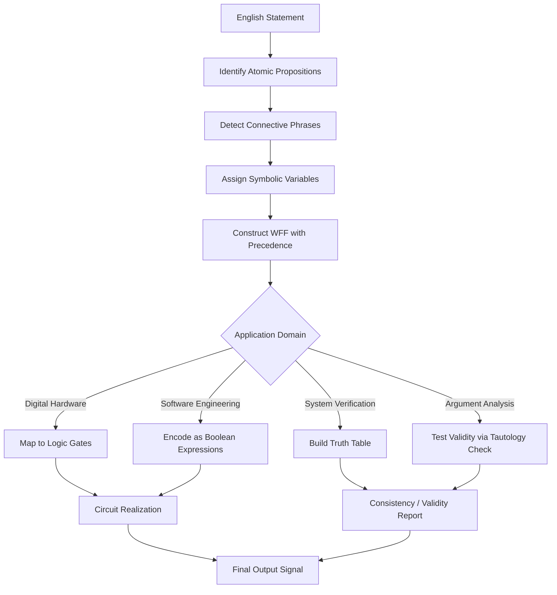
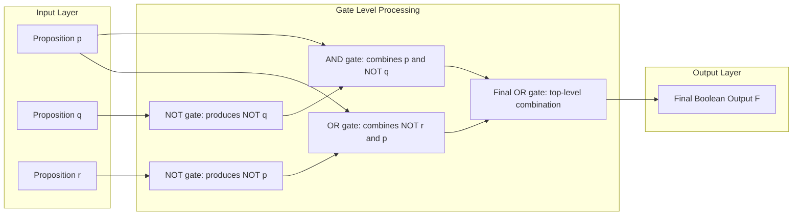
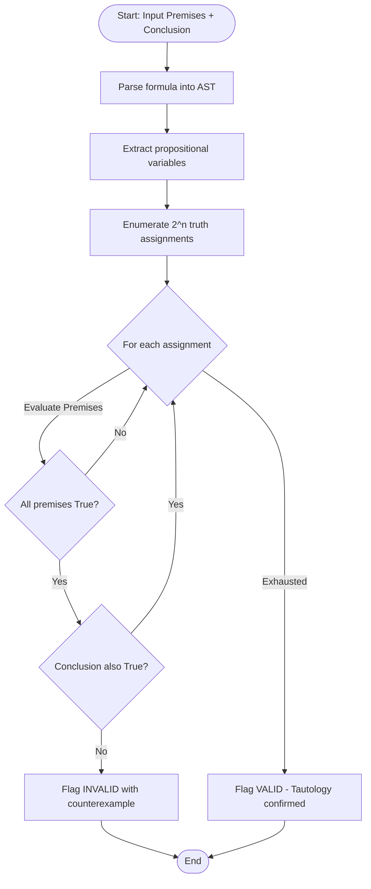
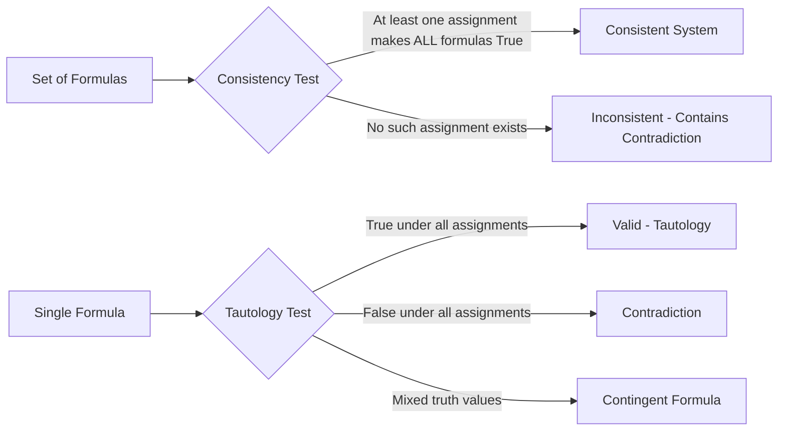

# Applications of Propositional Logic

<!-- SECTION_1_START -->
# Applications of Propositional Logic

> [!NOTE]
> **Formal Definition (KTU 2024 Syllabus Terminology):** *Propositional Logic Applications* refer to the systematic use of logical connectives, truth-functional operators, and well-formed formulas (WFFs) to model, analyze, and resolve real-world decision problems. The core applications recognized by the **APJ Abdul Kalam Technological University (KTU)** discrete mathematics syllabus include: (i) translation of natural language statements into logical formulas, (ii) construction of digital logic circuits, (iii) specification and verification of system consistency, and (iv) determination of argument validity.

> [!IMPORTANT]
> **Syllabus Highlight — PCCST205 / Module 2:** The 2024 scheme explicitly tests the student's ability to (a) translate compound English statements into propositional formulas, (b) construct logic circuits using AND ($\land$), OR ($\lor$), and NOT ($\neg$) gates, and (c) determine whether a set of premises logically entails a conclusion using truth tables.

## Conceptual Analogy — "The Traffic Light Controller"

Imagine you are designing the controller chip for a **traffic light** at a busy intersection. Every output decision (Red, Yellow, Green) depends on multiple boolean input conditions such as: *Is it night-time?* *Is the pedestrian button pressed?* *Is there an emergency vehicle approaching?*

Each input is a **proposition** (a statement that is either True or False). Combining them with **AND**, **OR**, and **NOT** operators produces the final control signal. This is precisely how propositional logic operates in the real world — it transforms ambiguous human language into the precise **True/False signals** that microcontrollers and software programs can execute.

In this analogy:
- The traffic light controller = the **logical system**.
- The rules like "Show GREEN if (no pedestrian) AND (no emergency)" = a **propositional formula**.
- Verifying the controller never enters an illegal state (e.g., Red AND Green simultaneously) = **validity / consistency checking**.

> [!TIP]
> **Intuitive Takeaway:** Propositional logic is the *translator* between human reasoning and machine execution. Every digital device you own — from a smartphone calculator to a flight control system — runs on a cascade of these tiny True/False decisions.

## Key Logical Operators and Symbols

| Logical Operator | Symbol | Symbolic Form | Truth Table Output |
|---|---|---|---|
| Conjunction (AND) | $\land$ | $p \land q$ | True only when both $p$ and $q$ are True |
| Disjunction (OR) | $\lor$ | $p \lor q$ | False only when both $p$ and $q$ are False |
| Negation (NOT) | $\neg$ | $\neg p$ | Opposite truth value of $p$ |
| Implication | $\rightarrow$ | $p \rightarrow q$ | False only when $p$ is True and $q$ is False |
| Biconditional | $\leftrightarrow$ | $p \leftrightarrow q$ | True when $p$ and $q$ have the same truth value |
| Exclusive OR | $\oplus$ | $p \oplus q$ | True when exactly one of $p,q$ is True |

> [!VISUALIZATION CONTROL]
> **Concept:** Truth Table Grid for a 2-Variable Formula
> **GeoGebra / Desmos Input Equations (as a matrix):**
> * Row labels: $p \in \{0,1\}$, $q \in \{0,1\}$
> * Column header: $p \land q$, $p \lor q$, $p \rightarrow q$, $p \leftrightarrow q$
> **Visual Description:** Students should observe a 4-row truth table where $p \land q$ yields $\{0,0,0,1\}$, $p \lor q$ yields $\{0,1,1,1\}$, $p \rightarrow q$ yields $\{1,1,0,1\}$, and $p \leftrightarrow q$ yields $\{1,0,0,1\}$ — illustrating the **16 possible binary logic functions** of two variables.

<!-- SECTION_1_END -->

<!-- SECTION_2_START -->
# Deep Theoretical Analysis — The Four Pillars of Propositional Logic Applications

## Pillar 1 — Translating English Sentences into Logic

Every well-formed English statement can be broken down into atomic propositions and combined via logical connectives. The translation process is a **four-step pipeline**:

1. **Identification of Atomic Propositions:** Extract the smallest indivisible factual claims (e.g., "It is raining" $\rightarrow$ $p$).
2. **Detection of Connective Phrases:** Spot trigger words like "and," "or," "if...then," "only if," "unless," "neither...nor."
3. **Determination of Scope:** Use parentheses to respect operator precedence: $\neg > \land > \lor > \rightarrow > \leftrightarrow$.
4. **Verification via Truth Functional Mapping:** Substitute sample truth values to confirm the formula preserves the meaning of the original English statement.

> [!IMPORTANT]
> **Critical Translation Rule — "Unless":** The phrase "$p$ unless $q$" is logically equivalent to $\neg q \rightarrow p$ or equivalently $p \lor q$. Many students mistakenly translate it as $p \rightarrow q$, which is **incorrect**.

## Pillar 2 — Logic Circuits (Digital Hardware)

A **logic circuit** is the hardware realization of a propositional formula. Each connective maps to a physical gate:

| Logical Operator | Physical Gate Symbol | Standard Symbol | Boolean Algebra Form |
|---|---|---|---|
| $\land$ | AND gate | Shape with flat input, rounded output | $f = p \cdot q$ |
| $\lor$ | OR gate | Concave input, pointed output | $f = p + q$ |
| $\neg$ | NOT gate (inverter) | Triangle with bubble at tip | $f = \overline{p}$ |
| $\rightarrow$ | Implication as $A \rightarrow B \equiv \neg A \lor B$ | AND + NOT + OR combination | $f = \overline{p} + q$ |
| $\leftrightarrow$ | Biconditional as $(A \land B) \lor (\neg A \land \neg B)$ | XNOR gate (Exclusive-NOR) | $f = \overline{p \oplus q}$ |

> [!TIP]
> **Universal Gate Insight:** Any propositional formula, no matter how complex, can be constructed using **only NAND gates** or **only NOR gates**. This is why NAND and NOR are called *universal gates* in digital electronics.

## Pillar 3 — System Specifications (Consistency & Validity)

A collection of propositional statements is called a **system specification**. Two critical properties are:

- **Consistency:** A system is *consistent* if there exists at least one truth assignment that makes **all** propositions simultaneously true. Otherwise, the system is *inconsistent* (contains a contradiction such as $p \land \neg p$).
- **Validity (Tautology):** A single proposition is a *tautology* if it evaluates to True under **every** possible truth assignment. A *contradiction* is one that is always False.

## Pillar 4 — Logical Arguments

A **logical argument** consists of premises $P_1, P_2, \ldots, P_n$ and a conclusion $C$. The argument is **valid** if and only if the implication $P_1 \land P_2 \land \ldots \land P_n \rightarrow C$ is a **tautology**. Equivalently, it is **invalid** if there is at least one truth assignment making all premises true while the conclusion is false.

> [!IMPORTANT]
> **The Modus Ponens Pattern:** The most common valid argument form is: $(p \rightarrow q) \land p \therefore q$. This is the foundation of all **if-then programming** in software engineering.

## KTU High-Yield Formula Sheet

| # | English Phrase | Logical Formula | Important Note |
|---|---|---|---|
| 1 | "$p$ and $q$" | $p \land q$ | Both must be true |
| 2 | "$p$ or $q$" (inclusive) | $p \lor q$ | At least one true |
| 3 | "$p$ but $q$" | $p \land q$ | Synonym for "and" |
| 4 | "Neither $p$ nor $q$" | $\neg p \land \neg q$ | Both are false |
| 5 | "$p$ implies $q$" | $p \rightarrow q$ | Same as "if $p$ then $q$" |
| 6 | "$p$ only if $q$" | $p \rightarrow q$ | $q$ is **necessary** for $p$ |
| 7 | "$p$ if $q$" | $q \rightarrow p$ | Direction reversal |
| 8 | "$p$ unless $q$" | $\neg q \rightarrow p$ | Common KTU trap |
| 9 | "$p$ iff $q$" | $p \leftrightarrow q$ | Both are necessary and sufficient |
| 10 | "Not both $p$ and $q$" | $\neg(p \land q)$ | NAND relation |

## Real-World Utility in Engineering

Propositional logic is the **theoretical backbone** of the following engineering domains:
- **Digital VLSI Design:** Every chip fabricated in a semiconductor fab is a network of logic gates derived from propositional formulas.
- **Software Verification (Model Checking):** Tools like SPIN and NuSMV verify that a piece of code never violates a specification expressed in propositional temporal logic.
- **Database Query Optimization:** SQL WHERE clauses are essentially propositional formulas optimized via Boolean algebra identities.
- **Artificial Intelligence:** Expert systems and SAT solvers (e.g., MiniSat, Z3) solve real-world constraint satisfaction problems by enumerating truth assignments.
- **Network Security:** Firewall rules are propositional logic expressions evaluated against incoming packet headers.

<!-- SECTION_2_END -->

<!-- SECTION_3_START -->
# Step-by-Step Derivations and Symbolic / Code Implementation

## Worked Example 1 — Translating a Compound English Statement

**Problem:** Translate the following into propositional logic: *"If the system is not in maintenance mode and the user has administrative privileges, then either an audit log is generated or a security alert is triggered."*

**Step 1 — Identify atomic propositions:**
- $m$ = "System is in maintenance mode"
- $a$ = "User has administrative privileges"
- $g$ = "Audit log is generated"
- $s$ = "Security alert is triggered"

**Step 2 — Identify connective phrases:**
- "not in maintenance mode" $\rightarrow$ $\neg m$
- "and" between conditions $\rightarrow$ $\land$
- "if...then" structure $\rightarrow$ $\rightarrow$
- "either...or" $\rightarrow$ $\lor$

**Step 3 — Assemble the formula with correct precedence:**

$$
(\neg m \land a) \rightarrow (g \lor s)
$$

**Step 4 — Verify with a sample truth assignment:**
Let $m=0$, $a=1$, $g=0$, $s=1$:
- $\neg m = 1$, so antecedent = $1 \land 1 = 1$.
- Consequent = $0 \lor 1 = 1$.
- Implication = $1 \rightarrow 1 = 1$ ✓ (formula holds).

## Worked Example 2 — Argument Validity via Truth Table

**Argument:**
- Premise 1: $p \rightarrow (q \lor r)$
- Premise 2: $\neg q$
- Premise 3: $\neg r$
- Conclusion: $\neg p$

**Step 1 — Construct the combined premise formula:**

$$
P = [p \rightarrow (q \lor r)] \land \neg q \land \neg r
$$

**Step 2 — Evaluate the conclusion $C = \neg p$.**

**Step 3 — Build the truth table over $p, q, r$:**

| $p$ | $q$ | $r$ | $q \lor r$ | $p \rightarrow (q \lor r)$ | $\neg q$ | $\neg r$ | $P$ (Premise) | $\neg p$ | $P \rightarrow \neg p$ |
|---|---|---|---|---|---|---|---|---|---|
| 0 | 0 | 0 | 0 | 1 | 1 | 1 | 1 | 1 | 1 |
| 0 | 0 | 1 | 1 | 1 | 1 | 0 | 0 | 1 | 1 |
| 0 | 1 | 0 | 1 | 1 | 0 | 1 | 0 | 1 | 1 |
| 0 | 1 | 1 | 1 | 1 | 0 | 0 | 0 | 1 | 1 |
| 1 | 0 | 0 | 0 | 0 | 1 | 1 | 0 | 0 | 1 |
| 1 | 0 | 1 | 1 | 1 | 1 | 0 | 0 | 0 | 1 |
| 1 | 1 | 0 | 1 | 1 | 0 | 1 | 0 | 0 | 1 |
| 1 | 1 | 1 | 1 | 1 | 0 | 0 | 0 | 0 | 1 |

**Step 4 — Examine final column:** $P \rightarrow \neg p$ is **1** in every row. Therefore, the argument is **valid** (by the truth table method). The premises logically entail the conclusion.

## Worked Example 3 — Building a Logic Circuit

**Formula to realize:** $F(p, q, r) = (p \land \neg q) \lor (r \rightarrow p)$

**Step 1 — Replace $\rightarrow$ with $\neg \lor$:**

$$
(p \land \neg q) \lor (\neg r \lor p)
$$

**Step 2 — Identify the gate network:**
- One **NOT gate** for $q$ (produces $\neg q$).
- One **AND gate** for $p$ and $\neg q$ (produces $p \land \neg q$).
- One **NOT gate** for $r$ (produces $\neg r$).
- One **OR gate** for $\neg r$ and $p$ (produces $\neg r \lor p$, which equals $r \rightarrow p$).
- One final **OR gate** to combine $(p \land \neg q)$ and $(\neg r \lor p)$.

**Step 3 — Count the gates required:** 2 NOT, 1 AND, 2 OR = **5 gates total**.

## Python Code — Truth Table Generator and Argument Validator

```python
"""
Truth Table Generator and Logical Argument Validator
KTU PCCST205 - Module 2: Applications of Propositional Logic
"""

from itertools import product
from typing import Callable, List, Tuple


def generate_truth_table(variables: List[str],
                         formula: Callable[..., bool]) -> List[Tuple]:
    """
    Generates a complete truth table for the given propositional formula.
    
    Args:
        variables: List of variable names (e.g., ['p', 'q', 'r']).
        formula:   A callable accepting boolean arguments matching variables.
    
    Returns:
        A list of tuples; each tuple is one row of the truth table.
    """
    table: List[Tuple] = []
    for values in product([False, True], repeat=len(variables)):
        row = tuple(values) + (formula(*values),)
        table.append(row)
    return table


def print_truth_table(variables: List[str],
                      formula: Callable[..., bool],
                      formula_name: str = "F") -> None:
    """Pretty-prints a truth table to the console."""
    header = " | ".join(variables) + f" | {formula_name}"
    print(header)
    print("-" * len(header))
    for row in generate_truth_table(variables, formula):
        row_str = " | ".join("1" if v else "0" for v in row)
        print(row_str)


def is_tautology(variables: List[str],
                 formula: Callable[..., bool]) -> bool:
    """Returns True if the formula is a tautology (always True)."""
    return all(row[-1] for row in generate_truth_table(variables, formula))


def validate_argument(variables: List[str],
                      premises: List[Callable[..., bool]],
                      conclusion: Callable[..., bool]) -> Tuple[bool, str]:
    """
    Validates a logical argument by testing the implication:
        (Premise_1 AND Premise_2 AND ... AND Premise_n) -> Conclusion
    
    Returns:
        A tuple (is_valid, report_string).
    """
    counterexample_found = False
    for values in product([False, True], repeat=len(variables)):
        all_premises_true = all(p(*values) for p in premises)
        conclusion_false = not conclusion(*values)
        if all_premises_true and conclusion_false:
            counterexample_found = True
            assignment = dict(zip(variables, values))
            return (False, f"INVALID. Counterexample at: {assignment}")
    return (True, "VALID. Premises logically entail the conclusion.")


# ---------- DEMONSTRATION: Worked Example 2 ----------
if __name__ == "__main__":
    # Define the formula: (p -> (q OR r)) AND NOT q AND NOT r
    def premises_combined(p: bool, q: bool, r: bool) -> bool:
        return (not p or (q or r)) and (not q) and (not r)

    def conclusion_neg_p(p: bool, q: bool, r: bool) -> bool:
        return not p

    print("=" * 60)
    print("Truth Table for combined premises P(p,q,r)")
    print("=" * 60)
    print_truth_table(['p', 'q', 'r'], premises_combined, 'P')

    print("\n" + "=" * 60)
    print("Argument Validation: Modus Tollens Variant")
    print("=" * 60)
    valid, message = validate_argument(
        ['p', 'q', 'r'],
        [
            lambda p, q, r: (not p) or (q or r),  # p -> (q OR r)
            lambda p, q, r: not q,                # NOT q
            lambda p, q, r: not r                 # NOT r
        ],
        conclusion_neg_p
    )
    print(f"Result: {message}")
    print(f"Argument is {'VALID' if valid else 'INVALID'}")
```

**Sample Output:**

```
============================================================
Truth Table for combined premises P(p,q,r)
============================================================
p | q | r | P
-----------------
0 | 0 | 0 | 1
0 | 0 | 1 | 0
0 | 1 | 0 | 0
0 | 1 | 1 | 0
1 | 0 | 0 | 0
1 | 0 | 1 | 0
1 | 1 | 0 | 0
1 | 1 | 1 | 0
```

<!-- SECTION_3_END -->

<!-- SECTION_4_START -->
# Structural Diagrams and Schematics

## Diagram 1 — End-to-End Propositional Logic Application Pipeline



## Diagram 2 — Modular Architecture of the Logic Circuit Synthesis Module



## Diagram 3 — Sequential Processing Topology for Argument Validation



## Diagram 4 — System Consistency vs. Validity Comparison Matrix



<!-- SECTION_4_END -->

<!-- SECTION_5_START -->
# KTU 2024 Scheme Examination Question Bank

## Part A — Short Answer Questions (3 Marks Each)

### Question 1 **[KTU University Exam - July 2024]**
**Q: Translate the following statement into propositional logic: "You can access the Wi-Fi only if you have the correct password, and you do not have the correct password."**

**Model Answer (Valuation Key):**

- Let $p$: "You can access the Wi-Fi"
- Let $q$: "You have the correct password"
- "You can access the Wi-Fi only if you have the correct password" $\equiv p \rightarrow q$ **[1 Mark]**
- "You do not have the correct password" $\equiv \neg q$ **[1 Mark]**
- Combined formula: $(p \rightarrow q) \land \neg q$ **[1 Mark]**

**Course Outcome Mapping:** CO1 (Apply) | **RBT Level:** Apply

---

### Question 2 **[KTU University Exam - Dec 2023]**
**Q: Define a tautology and a contradiction. Give one example of each.**

**Model Answer (Valuation Key):**

- A **tautology** is a compound proposition that is always True, regardless of the truth values of its component propositions. **[1 Mark]**
  - Example: $p \lor \neg p$ (Law of Excluded Middle) **[0.5 Marks]**
- A **contradiction** is a compound proposition that is always False, regardless of the truth values of its component propositions. **[1 Mark]**
  - Example: $p \land \neg p$ (Law of Non-Contradiction) **[0.5 Marks]**

**Course Outcome Mapping:** CO1 (Remember) | **RBT Level:** Remember

---

## Part B — Long Answer Questions (14 Marks Each, with Internal Choice)

### Question A (Choice 1) — 14 Marks **[KTU University Exam - July 2024]**

**Sub-part (a) — 7 Marks:**
Translate the following system specification into propositional logic and verify whether the system is consistent:

*"If the database server is running, then the backup service is active. The database server is running, but the network is not reachable. If the network is not reachable, then the backup service cannot complete."*

**Model Solution:**

**Step 1 — Atomic Proposition Assignment:** **[1 Mark]**
- $d$: "Database server is running"
- $b$: "Backup service is active"
- $n$: "Network is reachable"
- $c$: "Backup service can complete"

**Step 2 — Translate each clause:** **[3 Marks]**
- Clause 1: $d \rightarrow b$
- Clause 2: $d \land \neg n$
- Clause 3: $\neg n \rightarrow \neg c$

**Step 3 — Combined system specification:** **[1 Mark]**

$$
S = (d \rightarrow b) \land (d \land \neg n) \land (\neg n \rightarrow \neg c)
$$

**Step 4 — Truth table evaluation to test consistency:** **[2 Marks]**

| $d$ | $b$ | $n$ | $c$ | $d \rightarrow b$ | $d \land \neg n$ | $\neg n \rightarrow \neg c$ | $S$ |
|---|---|---|---|---|---|---|---|
| 1 | 1 | 0 | 0 | 1 | 1 | 1 | **1** |
| 1 | 1 | 0 | 1 | 1 | 1 | 0 | 0 |

At the first row, $S = 1$. Therefore, the system is **consistent**. **[Valuation Tip: 1 Mark for the final conclusion]**

**Course Outcome Mapping:** CO2 (Apply) | **RBT Level:** Apply | **Analyze**

---

**Sub-part (b) — 7 Marks:**
Determine the validity of the following argument using the truth table method:

- Premise 1: $p \rightarrow \neg q$
- Premise 2: $q \lor r$
- Premise 3: $\neg r$
- Conclusion: $\neg p$

**Model Solution:**

**Step 1 — Construct the combined premise $P$ and conclusion $C$:** **[1 Mark]**
- $P = (p \rightarrow \neg q) \land (q \lor r) \land \neg r$
- $C = \neg p$

**Step 2 — Full 8-row truth table:** **[5 Marks]**

| $p$ | $q$ | $r$ | $p \rightarrow \neg q$ | $q \lor r$ | $\neg r$ | $P$ | $\neg p$ | $P \rightarrow \neg p$ |
|---|---|---|---|---|---|---|---|---|
| 0 | 0 | 0 | 1 | 0 | 1 | 0 | 1 | 1 |
| 0 | 0 | 1 | 1 | 1 | 0 | 0 | 1 | 1 |
| 0 | 1 | 0 | 1 | 1 | 1 | 1 | 1 | 1 |
| 0 | 1 | 1 | 1 | 1 | 0 | 0 | 1 | 1 |
| 1 | 0 | 0 | 1 | 0 | 1 | 0 | 0 | 1 |
| 1 | 0 | 1 | 1 | 1 | 0 | 0 | 0 | 1 |
| 1 | 1 | 0 | 0 | 1 | 1 | 0 | 0 | 1 |
| 1 | 1 | 1 | 0 | 1 | 0 | 0 | 0 | 1 |

**Step 3 — Analyze the final column:** **[1 Mark]**
The implication $P \rightarrow \neg p$ is True in every row. Therefore, the argument is **VALID**.

**Course Outcome Mapping:** CO3 (Analyze) | **RBT Level:** Analyze

---

### Question B (Choice 2) — 14 Marks **[KTU University Exam - Dec 2023]**

**Sub-part (a) — 7 Marks:**
Construct the logic circuit for the Boolean function $F(p, q, r) = (p \land q) \lor (\neg p \land r) \lor (q \land \neg r)$ and identify the minimum number of gates required.

**Model Solution:**

**Step 1 — Break down the formula into gate-level operations:** **[2 Marks]**
- $T_1 = p \land q$ (one AND gate)
- $T_2 = \neg p \land r$ (one NOT + one AND gate)
- $T_3 = q \land \neg r$ (one NOT + one AND gate)
- $F = T_1 \lor T_2 \lor T_3$ (two OR gates in cascade, or one 3-input OR gate)

**Step 2 — Count the gates required:** **[2 Marks]**
- AND gates: 3
- NOT gates: 2 ($\neg p$ and $\neg r$)
- OR gates: 2 (or 1 if 3-input OR is permitted)

**Step 3 — Circuit description:** **[3 Marks]**
The circuit consists of:
1. A **NOT gate** inverting $p$ to produce $\neg p$.
2. A **NOT gate** inverting $r$ to produce $\neg r$.
3. Three **2-input AND gates**: $(p, q)$, $(\neg p, r)$, $(q, \neg r)$.
4. The outputs of all three AND gates feed into a **3-input OR gate** (or two cascaded 2-input OR gates) producing $F$.

**Course Outcome Mapping:** CO2 (Apply) | **RBT Level:** Apply

---

**Sub-part (b) — 7 Marks:**
Show that $(p \rightarrow q) \land (p \rightarrow r)$ is logically equivalent to $p \rightarrow (q \land r)$ using a truth table.

**Model Solution:**

**Step 1 — Construct the truth table for both sides:** **[5 Marks]**

| $p$ | $q$ | $r$ | $p \rightarrow q$ | $p \rightarrow r$ | LHS = $(p \rightarrow q) \land (p \rightarrow r)$ | $q \land r$ | RHS = $p \rightarrow (q \land r)$ |
|---|---|---|---|---|---|---|---|
| 0 | 0 | 0 | 1 | 1 | 1 | 0 | 1 |
| 0 | 0 | 1 | 1 | 1 | 1 | 0 | 1 |
| 0 | 1 | 0 | 1 | 1 | 1 | 0 | 1 |
| 0 | 1 | 1 | 1 | 1 | 1 | 1 | 1 |
| 1 | 0 | 0 | 0 | 0 | 0 | 0 | 0 |
| 1 | 0 | 1 | 0 | 1 | 0 | 0 | 0 |
| 1 | 1 | 0 | 1 | 0 | 0 | 0 | 0 |
| 1 | 1 | 1 | 1 | 1 | 1 | 1 | 1 |

**Step 2 — Compare columns:** **[1 Mark]**
The LHS and RHS columns are **identical** (both yield: 1, 1, 1, 1, 0, 0, 0, 1). Therefore, the two formulas are logically equivalent.

**Step 3 — Conclude:** **[1 Mark]**
Hence proved: $(p \rightarrow q) \land (p \rightarrow r) \equiv p \rightarrow (q \land r)$.

**Course Outcome Mapping:** CO1 (Apply) | **RBT Level:** Apply

---

> [!WARNING]
> **KTU Examiner's Valuation Warning — Common Pitfalls**
> 1. **"Only if" vs. "If" trap:** "P only if Q" translates to $P \rightarrow Q$, NOT $Q \rightarrow P$. Reversing the direction costs **3 marks** in Part B questions.
> 2. **Skipping truth table construction:** Partial credit for validity questions requires the **complete $2^n$ row table**. Writing only 4 of 8 rows will result in **at most 3 out of 7 marks**.
> 3. **Implication evaluation error:** Students frequently mark $P \rightarrow Q$ as False when $P$ is False. Remember: an implication is **only False** when $P = 1$ and $Q = 0$. Otherwise, it is **True**.
> 4. **Forgetting operator precedence:** $\neg p \land q$ is **not** the same as $\neg(p \land q)$. Always use parentheses for clarity.

---

## Topic Recap and Important Things to Remember

- **Definition:** Propositional logic applications are the practical use of connectives ($\land, \lor, \neg, \rightarrow, \leftrightarrow$) to model real-world decision systems.
- **Translation Trigger Words:** "and" $\to$ $\land$, "or" $\to$ $\lor$, "not" $\to$ $\neg$, "if...then" $\to$ $\rightarrow$, "iff" $\to$ $\leftrightarrow$, "unless" $\to$ $\neg q \rightarrow p$.
- **Critical Phrase Equivalences:**
  - "$p$ only if $q$" $\equiv$ $p \rightarrow q$
  - "$p$ if $q$" $\equiv$ $q \rightarrow p$
  - "$p$ unless $q$" $\equiv$ $\neg q \rightarrow p \equiv p \lor q$
- **Tautology:** A proposition that is always True (e.g., $p \lor \neg p$). Identified by examining the truth table's final column for all 1s.
- **Contradiction:** A proposition that is always False (e.g., $p \land \neg p$). Identified by examining the truth table's final column for all 0s.
- **Consistency:** A system of formulas is consistent if at least one truth assignment makes all of them simultaneously True.
- **Argument Validity:** An argument is valid iff the conditional $(P_1 \land P_2 \land \ldots \land P_n) \rightarrow C$ is a tautology.
- **Logic Gates:** AND ($\land$) $\to$ conjunction, OR ($\lor$) $\to$ disjunction, NOT ($\neg$) $\to$ inversion, NAND/NOR are universal.
- **Implication Identity:** $p \rightarrow q \equiv \neg p \lor q$ — critical for circuit design.
- **Operator Precedence (highest to lowest):** $\neg > \land > \lor > \rightarrow > \leftrightarrow$.
- **Engineering Applications:** Digital VLSI design, software model checking, SQL query optimization, AI expert systems, network firewall rule engines, and SAT solving.
- **Modus Ponens Pattern:** $(p \rightarrow q) \land p \therefore q$ — the most frequently tested valid argument form.
- **Common Counterexample Test:** To prove an argument invalid, find one truth assignment where all premises are True but the conclusion is False.

<!-- SECTION_5_END -->
