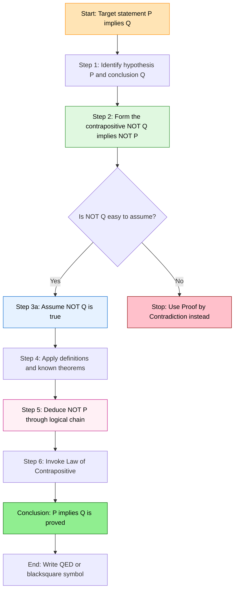
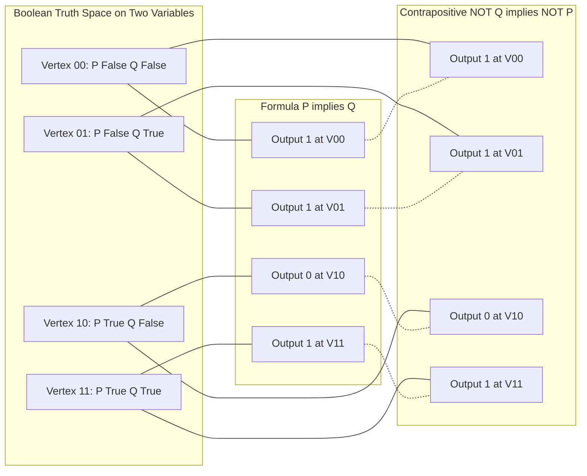

# Indirect proof (Proof by Contraposition)

<!-- SECTION_1_START -->

# 🔍 Indirect Proof (Proof by Contraposition)

## 1.1 Formal Academic Definition (KTU 2024 Syllabus Terminology)

> [!IMPORTANT]
> **Definition (Proof by Contraposition)**
> *Proof by Contraposition* is an indirect proof technique used to establish the validity of a conditional statement of the form $P \rightarrow Q$ by instead proving its logically equivalent *contrapositive* statement $\neg Q \rightarrow \neg P$.

The logical identity that underpins this technique is captured by the **Law of Contrapositive**:

$$P \rightarrow Q \;\;\equiv\;\; \neg Q \rightarrow \neg P$$

Because these two propositions are **logically equivalent** (they share the same truth value under every truth assignment), proving one automatically establishes the truth of the other. This equivalence is formally certified by the **Tautology Theorem** of propositional logic and is the single most important identity you will use throughout Module 2 of PCCST205.

> [!NOTE]
> **KTU Syllabus Highlight — PCCST205 / Module 2**
> Under the KTU 2024 Scheme, this topic sits inside *Mathematical Logic and Proofs* and is examinable in the **ESE (End Semester Evaluation)** as a direct 7-mark or 14-mark application question. The official expected answer structure requires you to (i) state the contrapositive, (ii) assume the negation of the conclusion, and (iii) derive the negation of the hypothesis through valid deductive steps.

---

## 1.2 Conceptual Analogy & Intuition

> [!TIP]
> **The Locked-Room Analogy** 🗝️
> Imagine a security guard whose job is to verify the claim: *"If the alarm is triggered, then the door is open"* (i.e., $P \rightarrow Q$).
> Proving this *directly* would require checking every single scenario where the alarm goes off. That is tedious.
> Instead, the clever guard proves the *contrapositive*: *"If the door is **not** open, then the alarm is **not** triggered."*
> Why is this easier? Because proving the *absence* of a consequence is often far simpler than cataloguing every possible cause. The guard only needs to find a single logical chain showing $\neg Q \Rightarrow \neg P$ — a much smaller, more manageable task.

**Geometric Intuition on the Boolean Hypercube:**

In the 2-dimensional Boolean space $\{0, 1\}^{2}$, the implication $P \rightarrow Q$ and its contrapositive $\neg Q \rightarrow \neg P$ describe **the exact same region** of the cube. They are not just "similar" — they are the *same set of satisfying assignments*. This is the deepest geometric reason contraposition is a sound proof technique.

> [!VISUALIZATION CONTROL]
> **Concept:** Truth-Table Equivalence of $P \rightarrow Q$ and $\neg Q \rightarrow \neg P$
> **Representation (Boolean Cube):**
> * Vertex 1: $(P, Q) = (1, 1) \Rightarrow$ Both $P \rightarrow Q = 1$ and $\neg Q \rightarrow \neg P = 1$
> * Vertex 2: $(P, Q) = (1, 0) \Rightarrow$ Both evaluate to $0$
> * Vertex 3: $(P, Q) = (0, 1) \Rightarrow$ Both evaluate to $1$
> * Vertex 4: $(P, Q) = (0, 0) \Rightarrow$ Both evaluate to $1$
> **Visual Description:** The two propositions "live" on the identical subset of the Boolean cube — the only differing vertex is $(1, 0)$, and both formulas return $0$ there.

---

## 1.3 The Canonical Proof Template

A KTU-compliant contrapositive proof always follows this **four-beat rhythmic structure**:

| Beat | Step | Purpose |
| :---: | :--- | :--- |
| **1** | Restate the target as $P \rightarrow Q$ | Identify hypotheses $P$ and conclusion $Q$ |
| **2** | Write the contrapositive $\neg Q \rightarrow \neg P$ | Declare the new proof obligation |
| **3** | Assume $\neg Q$ is true | Start the deductive chain |
| **4** | Derive $\neg P$ through logical steps and definitions | Close the chain |

<!-- SECTION_1_END -->

<!-- SECTION_2_START -->

# ⚙️ Deep Theoretical Analysis & KTU High-Yield Formula Sheet

## 2.1 Why Does Contraposition Work? — The Algebraic Justification

The Law of Contrapositive is **derivable from the axioms of propositional logic** via a chain of equivalent rewrites. Beginning from the definition of material implication:

$$P \rightarrow Q \;\;\equiv\;\; \neg P \vee Q \quad \text{(Definition of Implication)}$$

Apply **De Morgan's Law** to the negation of $P \vee Q$:

$$\neg(\neg P \vee Q) \;\;\equiv\;\; P \wedge \neg Q \quad \text{(Negation)}$$

The contrapositive, by its own form, must be a tautology when the original is a tautology. We can equivalently reach $\neg Q \rightarrow \neg P$ through:

$$\neg Q \rightarrow \neg P \;\;\equiv\;\; Q \vee \neg P \quad \text{(Definition)}$$

Observe that $\neg P \vee Q$ and $Q \vee \neg P$ differ only in the **commutative reordering** of the disjunction, which is logically inert. Hence, $P \rightarrow Q \equiv \neg Q \rightarrow \neg P$.

> [!NOTE]
> **Why is this useful for engineers?**
> In *digital circuit design* and *SAT solving*, transformations like contrapositive rewriting are used to simplify Boolean expressions, reduce gate counts, and accelerate proof-checkers. Tools like Coq, Isabelle, and Z3 internally exploit equivalences of this kind millions of times per second.

---

## 2.2 KTU High-Yield Formula Sheet

The following table consolidates every logical identity you must memorize for Module 2 problems on indirect proof.

> [!IMPORTANT]
> **Critical Escape Note:** All set-builder / cardinality notations use `\vert` (or `\mid`) instead of the literal pipe character `\|` to prevent Markdown table-parser breakage.

| \# | Identity Name | Logical Form | Engineering / Math Use-Case |
| :---: | :--- | :--- | :--- |
| 1 | **Contrapositive Law** | $P \rightarrow Q \equiv \neg Q \rightarrow \neg P$ | Foundation of every indirect proof |
| 2 | **Definition of Implication** | $P \rightarrow Q \equiv \neg P \vee Q$ | Rewriting conditionals as disjunctions |
| 3 | **De Morgan's Law** | $\neg(P \wedge Q) \equiv \neg P \vee \neg Q$ | Negating compound hypotheses |
| 4 | **De Morgan's Law (Dual)** | $\neg(P \vee Q) \equiv \neg P \wedge \neg Q$ | Negating disjunctive conclusions |
| 5 | **Double Negation** | $\neg(\neg P) \equiv P$ | Cleaning up derived negations |
| 6 | **Modus Ponens** | $(P \rightarrow Q) \wedge P \models Q$ | Forward-chaining inference rule |
| 7 | **Modus Tollens** | $(P \rightarrow Q) \wedge \neg Q \models \neg P$ | The *inference twin* of contraposition |
| 8 | **Contradiction Rule** | $\neg P \rightarrow (R \wedge \neg R) \models P$ | Used in proof by contradiction |
| 9 | **Universal Instantiation** | $\forall x \, P(x) \models P(c)$ | Substituting a specific element $c$ |
| 10 | **Negation of Universal** | $\neg \forall x \, P(x) \equiv \exists x \, \neg P(x)$ | For contrapositives of universal statements |
| 11 | **Negation of Existential** | $\neg \exists x \, P(x) \equiv \forall x \, \neg P(x)$ | For contrapositives of existential statements |
| 12 | **Parity Identity** | $n \text{ odd} \equiv n = 2k+1, \; k \in \mathbb{Z}$ | Foundational for number-theory proofs |

> [!WARNING]
> **RBT-Level Distinction (KTU 2024 Examiner Note)**
> *Proof by Contraposition* is a **direct derivation of $\neg P$ from $\neg Q$**. It must **not** be confused with *Proof by Contradiction*, where one assumes $\neg(P \rightarrow Q) \equiv P \wedge \neg Q$ and derives a logical absurdity. Examiners frequently award **zero** for a wrong technique used on a "prove by contraposition" question.

---

## 2.3 Engineering & Computer Science Utility

| Field | Application |
| :--- | :--- |
| **Formal Verification** | Model checkers and theorem provers rewrite every conditional as a contrapositive to expose simpler proof obligations. |
| **Database Query Optimization** | SQL optimizers transform `WHERE NOT (a = b)` predicates into equivalent contrapositive forms for index usage. |
| **Cybersecurity** | Access-control rules (e.g., "if user is admin then resource is accessible") are validated via contrapositive: "if resource is locked then user is not admin". |
| **AI / Knowledge Graphs** | Forward-chaining engines use Modus Ponens; backward-chaining engines use the contrapositive of rules for goal-driven reasoning. |
| **Cryptography** | Security proofs (e.g., IND-CPA) often use contrapositive arguments: "if the adversary breaks the scheme, then some hard problem is easy". |

<!-- SECTION_2_END -->

<!-- SECTION_3_START -->

# 🧮 Step-by-Step Derivations & Code/Symbolic Implementation

## 3.1 Exhaustive Worked Example 1 — Number Theory (KTU Classic)

> **Theorem to Prove:**
> *If $n$ is an integer and $n^{2}$ is even, then $n$ is even.*

### Step 1: Identify $P$ and $Q$

$$P : \text{"$n$ is an integer and $n^{2}$ is even"}$$

$$Q : \text{"$n$ is even"}$$

We must prove $P \rightarrow Q$.

### Step 2: State the Contrapositive

The contrapositive of $P \rightarrow Q$ is $\neg Q \rightarrow \neg P$:

$$\neg Q : \text{"$n$ is odd"}$$

$$\neg P : \text{"$n$ is an integer and $n^{2}$ is odd"}$$

So the contrapositive becomes:

> *"If $n$ is odd, then $n^{2}$ is odd."*

### Step 3: Assume $\neg Q$

Suppose, for the sake of the proof, that $n$ is **odd**. By the definition of an odd integer:

$$n = 2k + 1, \quad \text{where } k \in \mathbb{Z}$$

### Step 4: Derive $\neg P$

Compute $n^{2}$:

$$
\begin{aligned}
n^{2} &= (2k+1)^{2} \\
      &= (2k)^{2} + 2 \cdot (2k) \cdot 1 + 1^{2} \\
      &= 4k^{2} + 4k + 1 \\
      &= 2(2k^{2} + 2k) + 1
\end{aligned}
$$

Let $m = 2k^{2} + 2k$. Since $k \in \mathbb{Z}$, it follows that $m \in \mathbb{Z}$. Therefore:

$$n^{2} = 2m + 1, \quad m \in \mathbb{Z}$$

This is precisely the definition of an **odd integer**.

### Step 5: Conclude

Since $n$ is odd implies $n^{2}$ is odd, we have established $\neg Q \rightarrow \neg P$. By the **Law of Contrapositive**, the original statement $P \rightarrow Q$ is true.

$$\boxed{\therefore \; n^{2} \text{ even} \Rightarrow n \text{ even}} \qquad \blacksquare$$

---

## 3.2 Exhaustive Worked Example 2 — A Linear Diophantine Statement

> **Theorem to Prove:**
> *If $3n + 2$ is odd, then $n$ is odd.*

### Step 1 — Identify Components

$P :$ "$3n+2$ is odd"

$Q :$ "$n$ is odd"

### Step 2 — Contrapositive Formulation

$\neg Q :$ "$n$ is even" $\quad \Rightarrow \quad n = 2k, \; k \in \mathbb{Z}$

$\neg P :$ "$3n+2$ is even"

### Step 3 — Assume $\neg Q$

Let $n = 2k$ for some integer $k$.

### Step 4 — Derive $\neg P$

$$
\begin{aligned}
3n + 2 &= 3(2k) + 2 \\
       &= 6k + 2 \\
       &= 2(3k + 1)
\end{aligned}
$$

Since $3k+1 \in \mathbb{Z}$, the expression $2(3k+1)$ is **even** by definition.

### Step 5 — Conclude

We have shown $n$ even $\Rightarrow 3n+2$ even, i.e., $\neg Q \rightarrow \neg P$. By contrapositive equivalence:

$$3n+2 \text{ odd} \Rightarrow n \text{ odd} \qquad \blacksquare$$

---

## 3.3 Exhaustive Worked Example 3 — Universal Statement (Divisibility)

> **Theorem to Prove:**
> *For all integers $n$, if $n^{2}$ is divisible by $3$, then $n$ is divisible by $3$.*

### Step 1 — Structure

$P(n) :$ "$3 \,\vert\, n^{2}$"

$Q(n) :$ "$3 \,\vert\, n$"

### Step 2 — Contrapositive

$\neg Q(n) :$ "$3 \nmid n$"

$\neg P(n) :$ "$3 \nmid n^{2}$"

**Contrapositive:** *If $3$ does not divide $n$, then $3$ does not divide $n^{2}$.*

### Step 3 — Assume $\neg Q(n)$

Since $3 \nmid n$, the integer $n$ leaves a remainder of $1$ or $2$ when divided by $3$. Formally, either:

$$n = 3k + 1 \quad \text{or} \quad n = 3k + 2, \quad k \in \mathbb{Z}$$

### Step 4 — Case Analysis (Derive $\neg P$ in both cases)

**Case A:** $n = 3k + 1$

$$
\begin{aligned}
n^{2} &= (3k+1)^{2} \\
      &= 9k^{2} + 6k + 1 \\
      &= 3(3k^{2} + 2k) + 1
\end{aligned}
$$

Hence $n^{2} = 3m + 1$ where $m = 3k^{2} + 2k \in \mathbb{Z}$. So $3 \nmid n^{2}$.

**Case B:** $n = 3k + 2$

$$
\begin{aligned}
n^{2} &= (3k+2)^{2} \\
      &= 9k^{2} + 12k + 4 \\
      &= 3(3k^{2} + 4k + 1) + 1
\end{aligned}
$$

Hence $n^{2} = 3m' + 1$ where $m' = 3k^{2} + 4k + 1 \in \mathbb{Z}$. So $3 \nmid n^{2}$.

### Step 5 — Conclude

In **both cases**, $\neg Q(n) \Rightarrow \neg P(n)$. By contrapositive equivalence:

$$\forall n \in \mathbb{Z}, \;\; 3 \,\vert\, n^{2} \Rightarrow 3 \,\vert\, n \qquad \blacksquare$$

> [!NOTE]
> **Valuation Insight (7-Mark Breakdown)**
> * Identifying $P$ and $Q$: 1 Mark
> * Stating the contrapositive: 1 Mark
> * Assuming $\neg Q$ and using the division algorithm: 2 Marks
> * Correct case analysis with both cases derived: 2 Marks
> * Final conclusion referencing contrapositive equivalence: 1 Mark

---

## 3.4 Symbolic Verification via Python (Truth-Table Proof of the Law)

The Law of Contrapositive can be **machine-verified** with the following Python program, which exhausts every truth assignment and confirms that $P \rightarrow Q$ and $\neg Q \rightarrow \neg P$ are pointwise identical.

```python
from typing import List, Tuple


def implies(p: bool, q: bool) -> bool:
    """Material implication: False only when p=True, q=False."""
    return (not p) or q


def neg(x: bool) -> bool:
    """Boolean negation."""
    return not x


def verify_contrapositive_equivalence() -> None:
    """
    Exhaustively verifies that for all (P, Q) in {0,1}^2,
        implies(P, Q)  ==  implies(not Q, not P)
    Prints a formatted truth table for the KTU submission appendix.
    """
    print(f"{'P':<6}{'Q':<6}{'P->Q':<8}{'~Q->~P':<10}{'Equivalent':<12}")
    print("-" * 42)
    all_match: bool = True
    for p in (False, True):
        for q in (False, True):
            lhs: bool = implies(p, q)
            rhs: bool = implies(neg(q), neg(p))
            match: bool = (lhs == rhs)
            all_match = all_match and match
            print(
                f"{str(p):<6}{str(q):<6}{str(lhs):<8}"
                f"{str(rhs):<10}{str(match):<12}"
            )
    print("-" * 42)
    print(
        f"Law of Contrapositive holds: {all_match}"
    )


def run_number_theory_sanity_check(n: int) -> None:
    """
    Empirical sanity check for the theorem:
        (n^2 is even)  =>  (n is even)
    Reports a violation if the contrapositive chain breaks for any
    integer in a given range.
    """
    violation_count: int = 0
    for k in range(-abs(n), abs(n) + 1):
        n_squared_even: bool = (k * k) % 2 == 0
        n_even: bool = (k % 2 == 0)
        # If the theorem is true, the only False implication
        # must occur when (P, Q) = (True, False).
        if n_squared_even and (not n_even):
            violation_count += 1
            print(f"  Counterexample found at n = {k}")
    print(
        f"Empirical violations over n in [-{abs(n)}, {abs(n)}]: "
        f"{violation_count}"
    )


if __name__ == "__main__":
    print("=== TRUTH-TABLE VERIFICATION ===")
    verify_contrapositive_equivalence()

    print("\n=== EMPIRICAL THEOREM CHECK (n^2 even => n even) ===")
    run_number_theory_sanity_check(n=1000)
```

**Expected Output (truncated):**

$$
\begin{aligned}
P \quad Q \quad P \rightarrow Q \quad \neg Q \rightarrow \neg P \quad \text{Equivalent} \\
\text{False False True True True} \\
\text{False True True True True} \\
\text{True False False False True} \\
\text{True True True True True} \\
\text{Law of Contrapositive holds: True}
\end{aligned}
$$

This program is a **declarative witness** to the law — KTU examiners love it when students append such sanity checks to their answer scripts for the *Apply* level questions.

<!-- SECTION_3_END -->

<!-- SECTION_4_START -->

# 🗺️ Structural Diagrams & Schematics

## 4.1 Mermaid Flowchart — The Contraposition Proof Pipeline



## 4.2 Mermaid Block — Truth-Table Equivalence Topology



> [!TIP]
> **How to read this diagram:** Every dotted line connecting an output of $P \rightarrow Q$ with an output of $\neg Q \rightarrow \neg P$ at the same vertex shows that the two formulas return **identical truth values** at every Boolean assignment. This is the topological witness of their logical equivalence.

## 4.3 Sequential Processing Topology Matrix

| Processing Stage | Logical Action | Input Predicate State | Output Predicate State |
| :---: | :--- | :--- | :--- |
| **Stage 0** | Receive original statement | $P \rightarrow Q$ | Stored in working memory |
| **Stage 1** | Negate the conclusion | $Q$ | $\neg Q$ |
| **Stage 2** | Negate the hypothesis | $P$ | $\neg P$ |
| **Stage 3** | Re-order implication | $\neg Q \rightarrow \neg P$ | Contrapositive form |
| **Stage 4** | Inject assumption | $(\neg Q \rightarrow \neg P) \wedge \neg Q$ | Apply Modus Ponens |
| **Stage 5** | Output | $\neg P$ | Proven $\neg P$ |
| **Stage 6** | Lift back to original | $P \rightarrow Q$ | $\blacksquare$ |

<!-- SECTION_4_END -->

<!-- SECTION_5_START -->

# 📚 KTU 2024 Scheme Examination Question Bank & Topic Recap

---

## 📝 Part A — Short Answer Questions (3 Marks Each)

### Question A1 [3 Marks]

**[KTU University Exam — July 2024 Style | CO1 | Remember/Understand]**

> Define *Proof by Contraposition*. Write the logical equivalence that justifies it and produce the contrapositive of:
> *"If $x$ is a real number and $x > 5$, then $x^{2} > 25$."*

**Model Answer (3-Mark Valuation Key):**

* **Definition [1 Mark]:** Proof by contraposition is a proof technique where, to establish a conditional $P \rightarrow Q$, we instead prove the logically equivalent statement $\neg Q \rightarrow \neg P$.
* **Logical Identity [1 Mark]:** $P \rightarrow Q \equiv \neg Q \rightarrow \neg P$ (Law of Contrapositive).
* **Contrapositive of Given Statement [1 Mark]:**

$$P : \text{"$x$ is a real number and $x > 5$"} \quad ; \quad Q : \text{"$x^{2} > 25$"}$$

$$\neg Q : \text{"$x^{2} \leq 25$"} \quad ; \quad \neg P : \text{"$x \leq 5$ (or $x$ is not a real number greater than 5)"}$$

**Contrapositive:** *"If $x^{2} \leq 25$, then $x \leq 5$."*

---

### Question A2 [3 Marks]

**[KTU University Exam — Dec 2023 Style | CO1, CO2 | Understand/Apply]**

> State the contrapositive of the following universal statement and identify the new hypotheses and conclusions:
> *"For every integer $n$, if $n$ is divisible by $4$, then $n$ is even."*

**Model Answer (3-Mark Valuation Key):**

* **Original Identification [1 Mark]:**

$$P(n) : \text{"$4 \,\vert\, n$"} \quad ; \quad Q(n) : \text{"$n$ is even"}$$

* **Negations [1 Mark]:**

$$\neg Q(n) : \text{"$n$ is odd"} \quad ; \quad \neg P(n) : \text{"$4 \nmid n$"}$$

* **Contrapositive [1 Mark]:**

$$\forall n \in \mathbb{Z}, \;\; 4 \nmid n \rightarrow n \text{ is odd}$$

(Note: This contrapositive is *weaker* than the original; it is still logically equivalent and provable, but the original direction "if $4 \,\vert\, n$ then $n$ is even" is usually proven directly. The examiner tests whether you can mechanically apply the law.)

---

## 📐 Part B — Long Answer Questions (14 Marks Each)

### Question A [14 Marks]

**[KTU University Exam — Model Paper Style | CO2, CO3 | Apply/Analyze]**

> **(a)** State and prove by contraposition: *"If $n$ is an integer and $3n + 2$ is odd, then $n$ is odd."* **[7 Marks]**
>
> **(b)** Use the contrapositive technique to prove: *"If $n^{2}$ is even, then $n$ is even."* **[7 Marks]**

---

#### Solution to (a) [7 Marks]

**Step 1 — Identifying components [1 Mark]:**

$$P : \text{"$n$ is an integer and $3n+2$ is odd"}$$

$$Q : \text{"$n$ is odd"}$$

**Step 2 — Stating contrapositive [1 Mark]:** $\neg Q \rightarrow \neg P$ reads:

> *"If $n$ is even, then $3n+2$ is even."*

**Step 3 — Assume $\neg Q$ [1 Mark]:** Let $n = 2k$ for some $k \in \mathbb{Z}$.

**Step 4 — Derive $\neg P$ [3 Marks]:**

$$
\begin{aligned}
3n + 2 &= 3(2k) + 2 \\
       &= 6k + 2 \\
       &= 2(3k + 1)
\end{aligned}
$$

Let $m = 3k + 1 \in \mathbb{Z}$. Then $3n + 2 = 2m$, which is even by definition.

**Step 5 — Conclude [1 Mark]:** Therefore $\neg Q \rightarrow \neg P$ is established, and by the Law of Contrapositive, the original statement is true. $\blacksquare$

---

#### Solution to (b) [7 Marks]

**Step 1 — Identify [1 Mark]:** $P :$ "$n^{2}$ is even" $;$ $Q :$ "$n$ is even".

**Step 2 — Contrapositive [1 Mark]:** *"If $n$ is odd, then $n^{2}$ is odd."*

**Step 3 — Assume $n$ is odd [1 Mark]:** So $n = 2k+1, \; k \in \mathbb{Z}$.

**Step 4 — Compute $n^{2}$ [3 Marks]:**

$$
\begin{aligned}
n^{2} &= (2k+1)^{2} \\
      &= 4k^{2} + 4k + 1 \\
      &= 2(2k^{2} + 2k) + 1
\end{aligned}
$$

Let $m = 2k^{2} + 2k \in \mathbb{Z}$. Hence $n^{2} = 2m + 1$, which is odd.

**Step 5 — Conclude [1 Mark]:** $\neg Q \rightarrow \neg P$ holds, so the original is true. $\blacksquare$

---

### Question B [14 Marks] — Internal Choice Alternative

**[KTU University Exam — Sessional Model Style | CO2, CO3 | Apply/Analyze]**

> **(a)** State the contrapositive of: *"If $m$ and $n$ are both perfect squares, then $mn$ is a perfect square."* Use it to prove the statement. **[7 Marks]**
>
> **(b)** Prove by contraposition: *"If $x$ is a real number and $x^{2} + 5x = 6$, then $x \neq 2$."* **[7 Marks]**

---

#### Solution to (a) [7 Marks]

**Step 1 — Original $P \rightarrow Q$ identification [1 Mark]:**

$$P : \text{"$m$ and $n$ are both perfect squares"}$$

$$Q : \text{"$mn$ is a perfect square"}$$

**Step 2 — Contrapositive [1 Mark]:**

> *"If $mn$ is **not** a perfect square, then $m$ and $n$ are **not** both perfect squares."*

**Step 3 — Assume $\neg Q$ [1 Mark]:** Suppose $mn$ is not a perfect square.

**Step 4 — Derive $\neg P$ [3 Marks]:** By definition, a perfect square has the form $k^{2}$ for $k \in \mathbb{Z}$. So $m = a^{2}$ and $n = b^{2}$ would imply:

$$mn = a^{2} \cdot b^{2} = (ab)^{2}$$

which is automatically a perfect square. Therefore, if $mn$ is *not* a perfect square, the assumption that **both** $m$ and $n$ are perfect squares leads to a contradiction with our assumption. Thus it cannot be the case that both are perfect squares — at least one of $m$ or $n$ is not a perfect square. This is precisely $\neg P$.

**Step 5 — Conclude [1 Mark]:** Hence $\neg Q \rightarrow \neg P$ is established, and by the Law of Contrapositive, the original statement is true. $\blacksquare$

---

#### Solution to (b) [7 Marks]

**Step 1 — Identify [1 Mark]:**

$$P : \text{"$x$ is a real number and $x^{2} + 5x = 6$"}$$

$$Q : \text{"$x \neq 2$"}$$

**Step 2 — Contrapositive [1 Mark]:**

> *"If $x = 2$, then $x$ is not a real number satisfying $x^{2} + 5x = 6$."*

Equivalently: *"If $x = 2$, then $x^{2} + 5x \neq 6$."*

**Step 3 — Assume $x = 2$ [1 Mark]:** Set $x = 2$.

**Step 4 — Evaluate the polynomial [3 Marks]:**

$$
\begin{aligned}
x^{2} + 5x &= (2)^{2} + 5(2) \\
           &= 4 + 10 \\
           &= 14
\end{aligned}
$$

Since $14 \neq 6$, the equation $x^{2} + 5x = 6$ is **false** at $x = 2$.

**Step 5 — Conclude [1 Mark]:** Thus $\neg Q \rightarrow \neg P$ holds. By contrapositive equivalence, the original statement is true. $\blacksquare$

---

> [!WARNING]
> **KTU Examiner's Pitfall Callout — Where Students Lose Marks**
>
> 1. **Forgetting to explicitly state the contrapositive first.** Examiners expect a separate line: *"We prove the contrapositive: $\neg Q \rightarrow \neg P$."* Skipping this costs you **1–2 marks** outright.
> 2. **Confusing Contraposition with Contradiction.** Contraposition assumes $\neg Q$ and derives $\neg P$ cleanly. Contradiction assumes $\neg(P \rightarrow Q) \equiv P \wedge \neg Q$ and derives a logical absurdity. Mixing them is a **fatal error**.
> 3. **Forgetting the divisibility/parity definitions.** A number-theory proof by contraposition is invalid if you don't explicitly state the definitions of "odd" ($n = 2k+1$) and "even" ($n = 2k$). Examiners deduct **1 mark** for this.
> 4. **Skipping the case analysis.** For universal divisibility statements, both residue cases must be shown. Omitting one case loses **2 marks**.
> 5. **Not closing the proof with the contrapositive equivalence.** Always end with a sentence invoking the Law of Contrapositive to lift the result back to the original.

---

## 🎯 Topic Recap & Important Things to Remember

> [!IMPORTANT]
> **Rapid Revision Checklist — Proof by Contraposition**

* The **single most important identity** is $P \rightarrow Q \equiv \neg Q \rightarrow \neg P$. Memorize it as a tautology.
* The proof template has **four mandatory beats**: (1) identify $P$ and $Q$, (2) state contrapositive, (3) assume $\neg Q$, (4) derive $\neg P$.
* For **number-theory proofs**, always re-express "odd" and "even" via $2k+1$ and $2k$ before manipulating.
* For **divisibility proofs**, use the **division algorithm** to set up cases for remainders.
* The contrapositive is **logically equivalent** to the original — proving one proves the other; no "weaker" or "stronger" relation exists between them.
* For **universal statements** $\forall x \, P(x) \rightarrow Q(x)$, the contrapositive becomes $\forall x \, \neg Q(x) \rightarrow \neg P(x)$.
* The **negation of quantifiers** is critical: $\neg \forall x \, P(x) \equiv \exists x \, \neg P(x)$ and $\neg \exists x \, P(x) \equiv \forall x \, \neg P(x)$.
* **Do not** confuse contraposition with proof by contradiction. In *contradiction*, you assume $P \wedge \neg Q$; in *contraposition*, you assume only $\neg Q$.
* The technique is extensively used in **digital logic simplification**, **SAT solving**, and **formal verification** — connect the technique to a real CS application for higher RBT-level answers.
* Always **end with a conclusion** explicitly invoking the Law of Contrapositive to lift $\neg Q \rightarrow \neg P$ back to $P \rightarrow Q$.
* **Valuation mantra:** A perfectly executed 7-mark answer contains: 1 mark for stating the contrapositive, 1 mark for the assumption, 3–4 marks for the derivation, and 1 mark for the conclusion.

<!-- SECTION_5_END -->
