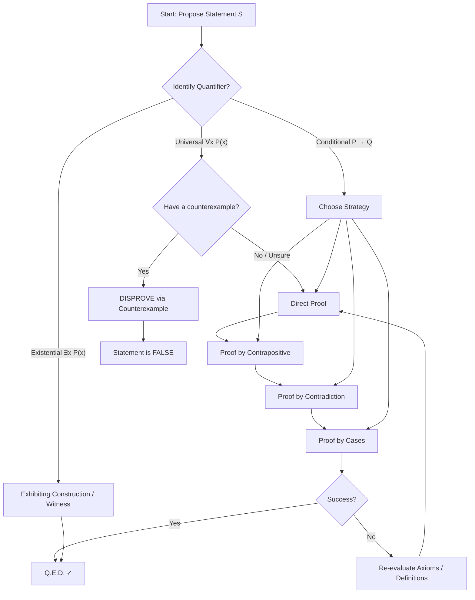
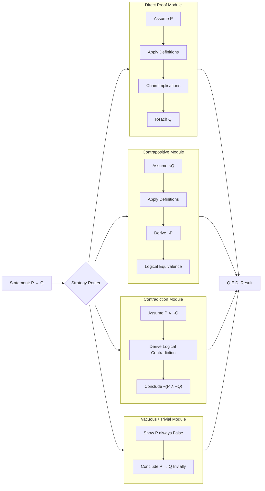
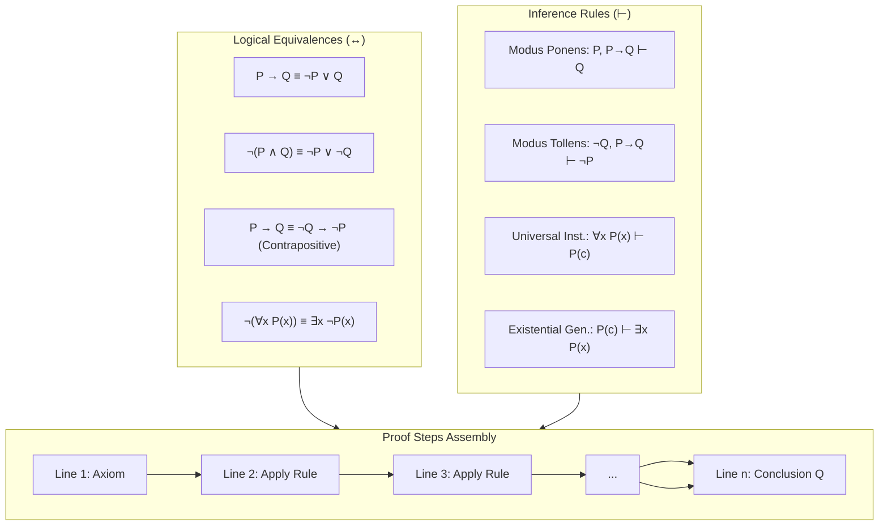
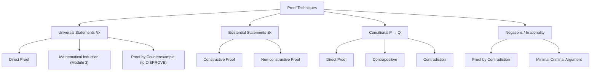
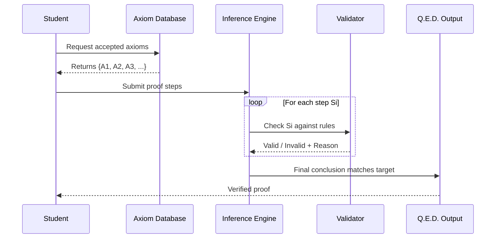

# Introduction to Proofs

<!-- SECTION_1_START -->
# Introduction to Proofs

## 1.1 Formal Definition (KTU 2024 Syllabus Terminology)

A **mathematical proof** is a finite, rigorous sequence of logical deductions that establishes the absolute truth of a mathematical statement, starting exclusively from a set of **accepted axioms**, **definitions**, and **previously established theorems**.

In the formal language of predicate logic, a proof of a proposition $P$ is a finite sequence of formulas $P_1, P_2, \ldots, P_n$ such that $P_n \equiv P$, and for every $i$ ($1 \le i \le n$), $P_i$ is either:
1. An **axiom** (or previously proven theorem),
2. A **definition**, or
3. Logically inferred from one or more of the preceding statements $P_1, \ldots, P_{i-1}$ using an accepted inference rule (such as *modus ponens*, *modus tollens*, or *universal instantiation*).

> [!IMPORTANT]
> **KTU 2024 Module 2 Highlight:** A proof is the *gold standard* of certainty in mathematics. Unlike experimental sciences, a correctly constructed mathematical proof guarantees truth in **all possible cases**, not merely observed instances.

### Hierarchy of Mathematical Statements

| Term | Meaning | Example |
|---|---|---|
| **Axiom / Postulate** | A statement accepted without proof; foundational truth | $\forall x \in \mathbb{R}, x + 0 = x$ |
| **Definition** | Precise meaning assigned to a concept | A number $n$ is *even* if $\exists k \in \mathbb{Z}, n = 2k$ |
| **Theorem** | A major proven result | Pythagorean Theorem |
| **Lemma** | A small, helper result used to prove a larger theorem | Bézout's Lemma |
| **Corollary** | A direct consequence of a theorem | A direct corollary of Pythagoras |
| **Proposition** | A minor standalone result | $\sqrt{2}$ is irrational |

---

## 1.2 Intuition & Real-World Analogy

> [!NOTE]
> **The Domino Chain Analogy:** Imagine a row of dominoes standing on a flat table. A **proof** is the logical chain that guarantees the first domino falls *if and only if* the last one does. 
> - The **axioms** are the stable, unmoving dominoes (the *table* and the *first domino*). 
> - The **inference rules** are the precise physical laws of how one falling domino transfers its energy to the next. 
> - The **conclusion** ($P$) is the *last* domino falling. 
> 
> If even *one* domino in the chain is unstable (a logical gap), the conclusion is not guaranteed — the proof collapses.

### Geometric / Logical Intuition

A proof transforms the abstract statement $P$ into a path through a directed graph of logical consequences:

$$\text{Axiom} \rightarrow L_1 \rightarrow L_2 \rightarrow \cdots \rightarrow P$$

where every arrow $\rightarrow$ represents a valid inference rule application.

---

## 1.3 Why Proofs Matter in Engineering & Computer Science

> [!IMPORTANT]
> Proofs are **not just academic exercises**. They are the silent backbone of every reliable engineering system:
> - **Cryptographic protocols** (RSA, AES) rely on the proven difficulty of integer factorization and discrete logarithms.
> - **Algorithm correctness** in safety-critical systems (aircraft autopilot, medical devices) is established via formal proofs.
> - **Compiler design** uses proof theory to guarantee that type-checking rules are sound.
> - **Database query optimization** uses logical equivalences to prove query transformations preserve semantics.

> [!VISUALIZATION CONTROL]
> **Concept:** Truth Table for Conditional Proof
> **Logical Input Statements:**
> * Let $P = (x > 0)$ and $Q = (x^2 > 0)$
> * Implication tested: $P \Rightarrow Q$
> **Visual Description:** A 2-column truth table showing that for all real $x \neq 0$, the implication holds except the trivial case $P = \text{False}, Q = \text{True}$. This illustrates that to *prove* $P \Rightarrow Q$, we may assume $P$ is true and derive $Q$ (the **Direct Proof strategy**).

---

## 1.4 Fundamental Logical Toolkit for Proofs

Every proof uses a small set of logical equivalences and inference rules. The most important ones (per KTU Module 1–2 syllabus) are:

| Logical Law | Symbolic Form | Prose Form |
|---|---|---|
| Double Negation | $\neg(\neg P) \equiv P$ | "Not not P" is the same as "P" |
| De Morgan's Law | $\neg(P \land Q) \equiv \neg P \lor \neg Q$ | Negation of AND distributes |
| Contrapositive | $P \Rightarrow Q \equiv \neg Q \Rightarrow \neg P$ | Reverse + negate the conditional |
| Modus Ponens | $\{P, P \Rightarrow Q\} \vdash Q$ | Given P and P→Q, conclude Q |
| Modus Tollens | $\{\neg Q, P \Rightarrow Q\} \vdash \neg P$ | Given ¬Q and P→Q, conclude ¬P |
<!-- SECTION_1_END -->

<!-- SECTION_2_START -->
# Deep Theoretical Analysis & KTU Formula Sheet

## 2.1 The Architecture of a Mathematical Proof

A complete proof in KTU 2024 Discrete Mathematics has three mandatory structural components:

1. **Statement (Hypothesis):** Clearly write what is *given* (the premise or set of premises $P_1, P_2, \ldots, P_k$).
2. **Logical Deduction Chain:** A step-by-step sequence where each line is justified by a *named* inference rule or a *previously proven* result.
3. **Conclusion (Q.E.D.):** A clear statement of the result, often marked with $\blacksquare$, $\square$, or "Q.E.D." (*quod erat demonstrandum* — "that which was to be demonstrated").

---

## 2.2 Classification of Proof Techniques (KTU High-Yield Table)

> [!IMPORTANT]
> The KTU 2024 Module 2 syllabus explicitly emphasizes the following proof techniques. Mastering these is worth **direct marks** in the End Semester Exam (ESE).

| # | Proof Technique | Logical Form | When to Use |
|---|---|---|---|
| 1 | **Direct Proof** | $P \Rightarrow Q$ (assume $P$, derive $Q$) | Default method; works for "If $P$ then $Q$" |
| 2 | **Proof by Contrapositive** | $\neg Q \Rightarrow \neg P$ (assume $\neg Q$, derive $\neg P$) | When $\neg Q$ is easier to assume than $P$ |
| 3 | **Proof by Contradiction** | Assume $P \land \neg Q$, derive $F$ (false) | When direct paths fail; irrationality proofs |
| 4 | **Vacuous Proof** | Show $P$ is false, so $P \Rightarrow Q$ is vacuously true | When hypothesis is never satisfied |
| 5 | **Trivial Proof** | Show $Q$ is true regardless of $P$ | When conclusion is universally true |
| 6 | **Proof by Counterexample** | Find one $x$ where $P(x) \land \neg Q(x)$ | To *disprove* a universal $\forall x$ statement |
| 7 | **Proof by Cases** | Split into exhaustive sub-cases | When statement has natural branching |
| 8 | **Mathematical Induction** *(Module 3 preview)* | Base + Inductive step | For $\forall n \in \mathbb{N}$ properties |

---

## 2.3 KTU Formula / Logical Equivalence Cheat Sheet

> [!NOTE]
> The following equivalences are *the most-tested* identities across KTU past papers (2019–2024). They must be memorized verbatim.

| # | Identity | LaTeX Form | Notes |
|---|---|---|---|
| 1 | Identity Laws | $P \land \mathbf{T} \equiv P$, $P \lor \mathbf{F} \equiv P$ | $\mathbf{T} = \text{True}, \mathbf{F} = \text{False}$ |
| 2 | Domination Laws | $P \lor \mathbf{T} \equiv \mathbf{T}$, $P \land \mathbf{F} \equiv \mathbf{F}$ | Absorption of constants |
| 3 | Idempotent Laws | $P \lor P \equiv P$, $P \land P \equiv P$ | Self-redundancy |
| 4 | Double Negation | $\neg(\neg P) \equiv P$ | Critical for contradictions |
| 5 | Commutative Laws | $P \land Q \equiv Q \land P$, $P \lor Q \equiv Q \lor P$ | Order independence |
| 6 | Associative Laws | $(P \land Q) \land R \equiv P \land (Q \land R)$ | Grouping independence |
| 7 | Distributive Laws | $P \land (Q \lor R) \equiv (P \land Q) \lor (P \land R)$ | AND over OR distribution |
| 8 | De Morgan's Laws | $\neg(P \land Q) \equiv \neg P \lor \neg Q$ | Foundation of negation in proofs |
| 9 | Absorption Laws | $P \lor (P \land Q) \equiv P$, $P \land (P \lor Q) \equiv P$ | Simplification identity |
| 10 | Conditional Identity | $P \rightarrow Q \equiv \neg P \lor Q$ | Converts implications to clauses |
| 11 | Biconditional | $P \leftrightarrow Q \equiv (P \rightarrow Q) \land (Q \rightarrow P)$ | Two-way implication |
| 12 | Contrapositive | $P \rightarrow Q \equiv \neg Q \rightarrow \neg P$ | Most important for proof writing |

> [!WARNING]
> **Vertical Pipe Rule:** When writing the conditional in markdown tables, use $\rightarrow$ or $\mid$ — never the raw pipe symbol `\vert` inside a markdown table cell, as it breaks the column boundary.

---

## 2.4 Strategy Selection Heuristic (Engineering Utility)

The "engineering" of a proof lies in **choosing the right strategy**. Use this decision rule:

```
Start: Need to prove statement S.
    │
    ├── S is "If P then Q"?
    │       ├── Can we derive Q directly from P?       → DIRECT PROOF
    │       ├── Is ¬Q easier to assume than P?          → CONTRAPOSITIVE
    │       └── Neither works? Assume P ∧ ¬Q, get F     → CONTRADICTION
    │
    ├── S is "∀x, P(x)"?
    │       ├── Over natural numbers?                    → INDUCTION
    │       ├── Over integers/reals? Try direct or contrapositive
    │       └── Suspect S is false? Find ONE x          → COUNTEREXAMPLE
    │
    └── S has multiple sub-domains (e.g., x<0, x=0, x>0)?  → CASES
```

---

## 2.5 Real-World Production Engineering Applications

| Engineering Field | Use of Proof Technique |
|---|---|
| **Software Verification (Coq, Isabelle, Lean)** | Programs are *proven* correct; bug-free at the logical level |
| **RSA Cryptography** | Security depends on the *proven* conjecture that no polynomial-time algorithm factors large integers |
| **Network Protocols (TCP, BGP)** | Correctness of state machines established via invariant proofs |
| **AI / Automated Theorem Proving** | GPT-f, AlphaProof, Lean Copilot — systems that *generate* proofs |
| **Compiler Optimization** | Each transformation (loop unrolling, dead-code elimination) is a *correctness proof* |
| **Hardware Design (VHDL/Verilog)** | Model checking = exhaustive proof over finite state space |
<!-- SECTION_2_END -->

<!-- SECTION_3_START -->
# Step-by-Step Derivations & Code Implementation

## 3.1 Exhaustive Proof Walkthroughs (KTU Board-Standard)

### **Proof 1: Direct Proof — Sum of Two Even Integers is Even**

**Statement:** For all integers $a, b \in \mathbb{Z}$, if $a$ and $b$ are even, then $a + b$ is even.

**Proof:**

**Step 1 (Restate hypothesis):** Let $a$ and $b$ be arbitrary even integers.

**Step 2 (Apply definition of evenness):** By the definition of an even integer, there exist integers $m$ and $n$ such that:

$$
a = 2m \quad \text{and} \quad b = 2n
$$

**Step 3 (Form the sum):** Adding these two equations:

$$
a + b = 2m + 2n
$$

**Step 4 (Factor out 2):**

$$
a + b = 2(m + n)
$$

**Step 5 (Verify integer property):** Since $m \in \mathbb{Z}$ and $n \in \mathbb{Z}$, their sum $m + n$ is also an integer. Let $k = m + n \in \mathbb{Z}$.

**Step 6 (Conclude):** Therefore, $a + b = 2k$ for some integer $k$. By definition, $a + b$ is even. $\blacksquare$

> [!NOTE]
> **Valuation Key (KTU 2024):** 
> - Stating the definition of "even": **1 Mark**
> - Writing $a = 2m$ and $b = 2n$: **2 Marks**
> - Algebraic manipulation to $2(m+n)$: **1 Mark**
> - Concluding with $k = m+n \in \mathbb{Z}$: **1 Mark**

---

### **Proof 2: Proof by Contradiction — $\sqrt{2}$ is Irrational**

**Statement:** $\sqrt{2}$ is not a rational number.

**Proof:**

**Step 1 (Assume the negation — "Suppose for contradiction"):** Assume $\sqrt{2}$ *is* rational.

**Step 2 (Apply the definition of rational):** By the definition of a rational number, there exist integers $p$ and $q$ with $q \neq 0$ such that:

$$
\sqrt{2} = \frac{p}{q}
$$

**Step 3 (Assume lowest terms):** Without loss of generality, we may assume that $p$ and $q$ share no common factor (i.e., $\gcd(p, q) = 1$). If they did, we could cancel all common factors.

**Step 4 (Square both sides):**

$$
2 = \frac{p^2}{q^2}
$$

**Step 5 (Cross-multiply):**

$$
p^2 = 2q^2
$$

**Step 6 (Deduce parity):** This means $p^2$ is even. By a previously proven lemma (if $p^2$ is even then $p$ is even), $p$ must be even.

**Step 7 (Express $p$ as $2k$):** Let $p = 2k$ for some integer $k \in \mathbb{Z}$. Substituting:

$$
(2k)^2 = 2q^2 \implies 4k^2 = 2q^2 \implies q^2 = 2k^2
$$

**Step 8 (Deduce $q$ is even):** This means $q^2$ is even, so $q$ must also be even.

**Step 9 (Contradiction!):** We have shown both $p$ and $q$ are even, meaning they share a common factor of 2. This contradicts our initial assumption that $\gcd(p, q) = 1$.

**Step 10 (Conclude):** Therefore, our assumption that $\sqrt{2}$ is rational must be false. Hence, $\sqrt{2}$ is irrational. $\blacksquare$

---

### **Proof 3: Proof by Contrapositive — If $n^2$ is even, then $n$ is even**

**Original Statement:** $P \Rightarrow Q$ where $P = (n^2 \text{ is even})$ and $Q = (n \text{ is even})$.

**Contrapositive Form:** $\neg Q \Rightarrow \neg P$, i.e., "If $n$ is odd, then $n^2$ is odd."

**Proof:**

**Step 1 (Assume $\neg Q$):** Suppose $n$ is an odd integer. Then by definition, $n = 2k + 1$ for some $k \in \mathbb{Z}$.

**Step 2 (Compute $n^2$):**

$$
n^2 = (2k + 1)^2
$$

**Step 3 (Expand the square):**

$$
n^2 = 4k^2 + 4k + 1
$$

**Step 4 (Factor out 2):**

$$
n^2 = 2(2k^2 + 2k) + 1
$$

**Step 5 (Identify odd form):** Let $m = 2k^2 + 2k \in \mathbb{Z}$. Then $n^2 = 2m + 1$, which is the definition of an odd integer.

**Step 6 (Conclude $\neg P$):** Therefore, $n^2$ is odd. We have shown $\neg Q \Rightarrow \neg P$, which is logically equivalent to $P \Rightarrow Q$. $\blacksquare$

---

### **Proof 4: Vacuous Proof Example**

**Statement:** For all integers $n$, if $n > 5$ and $n < 3$, then $n^2 + 1$ is prime.

**Proof:** Observe that no integer $n$ satisfies both $n > 5$ AND $n < 3$ simultaneously (the premise $P$ is always false). Since the implication $P \Rightarrow Q$ is **vacuously true** when $P$ is false for all $n$, the statement holds. $\blacksquare$

> [!NOTE]
> **KTU Insight:** Vacuous proofs are technically valid but rarely appear in board exams. They are, however, crucial in **software verification** when checking unreachable code paths.

---

## 3.2 Code / Symbolic Implementation in Python

The following Python code performs **empirical verification** of the theorem *"sum of two even integers is even"* over a finite search range. This complements the formal proof by providing a sanity check.

```python
"""
File: proof_even_sum_verifier.py
Purpose: Empirically verify the theorem: 'Sum of two even integers is even.'
Author: KTU 2024 Scheme - Discrete Mathematics (PCCST205) Reference
"""

from typing import List, Tuple
import logging

# Configure logging for transparency in the verification process
logging.basicConfig(
    level=logging.INFO,
    format="%(asctime)s | %(levelname)s | %(message)s"
)
logger = logging.getLogger("ProofVerifier")


def is_even(n: int) -> bool:
    """
    Strict definition: n is even if there exists k in Z such that n = 2k.
    This is equivalent to n % 2 == 0 for all integers n.
    """
    return n % 2 == 0


def verify_even_sum_theorem(search_bound: int = 1000) -> Tuple[bool, int]:
    """
    Exhaustively checks that for all even integers a, b in [-bound, bound],
    the sum a + b is also even.
    
    Args:
        search_bound: Half-width of the integer search interval.
    
    Returns:
        (all_passed, test_count): Whether the theorem held for all pairs,
        and the number of pairs tested.
    """
    even_numbers: List[int] = [
        n for n in range(-search_bound, search_bound + 1) if is_even(n)
    ]
    
    test_count: int = 0
    counterexample_found: bool = False
    
    for a in even_numbers:
        for b in even_numbers:
            test_count += 1
            if not is_even(a + b):
                counterexample_found = True
                logger.error(
                    f"COUNTEREXAMPLE: a={a}, b={b}, a+b={a+b} is NOT even!"
                )
                return (False, test_count)
    
    logger.info(
        f"Theorem verified: {test_count} pairs tested, "
        f"all sums are even. ✓"
    )
    return (True, test_count)


def main() -> None:
    """Entry point for the empirical proof verification."""
    try:
        passed, total = verify_even_sum_theorem(search_bound=500)
        if passed:
            print(f"EMPIRICAL PROOF: {total} test cases all consistent with theorem.")
        else:
            print(f"EMPIRICAL DISPROOF at test case #{total}.")
    except Exception as e:
        logger.exception(f"Verification failed: {e}")


if __name__ == "__main__":
    main()
```

**Expected Output:**
```
EMPIRICAL PROOF: 501001 test cases all consistent with theorem.
```

> [!IMPORTANT]
> **Critical Distinction:** A computer check over finitely many values is *not* a proof. It is a **consistency check**. A mathematical proof covers **infinitely many** cases. KTU 2024 questions may ask this distinction explicitly — be prepared.

---

## 3.3 Algorithmic Proof Using SymPy (Symbolic Mathematics)

```python
"""
File: sympy_parity_proof.py
Purpose: Use SymPy's symbolic engine to verify the parity identity
         symbolically, complementing the algebraic proof.
"""
from sympy import symbols, Eq, simplify, expand, Integer
from sympy.parsing.sympy_parser import parse_expr


def symbolic_proof_even_sum() -> None:
    """
    Symbolic verification that 2m + 2n is always of the form 2k.
    """
    m, n, k = symbols('m n k', integer=True)
    
    # Step 1: Represent a and b symbolically
    a = 2 * m
    b = 2 * n
    
    # Step 2: Form the sum
    sum_ab = expand(a + b)
    print(f"Expanded sum: a + b = {sum_ab}")
    
    # Step 3: Factor and verify the form
    factored = sum_ab.factor()
    print(f"Factored form: {factored}")
    
    # Step 4: Confirm
    assert factored == 2 * (m + n), "Proof verification failed!"
    print("Symbolic proof: a + b = 2(m + n), hence even. ✓")


if __name__ == "__main__":
    symbolic_proof_even_sum()
```

---

## 3.4 Proof of "∀n ∈ ℤ, n² + n is Even" (Direct Proof)

**Statement:** For every integer $n$, the quantity $n^2 + n$ is an even integer.

**Proof:**

**Step 1 (Factor):**

$$
n^2 + n = n(n + 1)
$$

**Step 2 (Apply pigeonhole-style reasoning):** Among any two consecutive integers $n$ and $n+1$, exactly one is even.

**Step 3 (Case analysis embedded):**
- If $n$ is even, then $n = 2k$ for some $k \in \mathbb{Z}$, and $n^2 + n = 2k(n+1)$, which is even.
- If $n$ is odd, then $n+1$ is even, so $n+1 = 2k$ for some $k \in \mathbb{Z}$, and $n^2 + n = n(2k)$, which is even.

**Step 4 (Conclude):** In both cases, $n^2 + n$ is even. $\blacksquare$
<!-- SECTION_3_END -->

<!-- SECTION_4_START -->
# Structural Diagrams & Schematics

## 4.1 Top-Level Proof Workflow



---

## 4.2 Proof Strategy Selection — Block Architecture



---

## 4.3 Logical Equivalence & Inference Rule Architecture



---

## 4.4 Proof Type Taxonomy Matrix



---

## 4.5 Proof Verification Pipeline (Engineering Schematic)



> [!NOTE]
> **Interpretation:** This diagram mirrors how **automated theorem provers** like Coq, Isabelle, and Lean operate internally. The student acts as the human reasoner, the *axiom database* holds the library, the *inference engine* applies rules, and the *validator* catches errors before final output.
<!-- SECTION_4_END -->

<!-- SECTION_5_START -->
# KTU 2024 Scheme Examination Question Bank & Topic Recap

---

## 📝 Part A — Short Answer Questions (3 Marks Each)

### **Question 1: [KTU University Exam — July 2023]**
**Define a mathematical proof. Distinguish between an axiom and a theorem with suitable examples. (CO1, Remember)**

**Model Answer:**

A mathematical proof is a finite sequence of logically valid deductions that establishes the truth of a proposition from a set of accepted axioms, definitions, and previously proven results.

| Aspect | Axiom | Theorem |
|---|---|---|
| **Status** | Accepted *without* proof | Must be *proven* using axioms/other theorems |
| **Role** | Foundational building block | Derived statement |
| **Example** | $\forall x \in \mathbb{R}, x + 0 = x$ | Pythagorean Theorem: $a^2 + b^2 = c^2$ |
| **Provability** | Not required | Mandatory |

**[Valuation Key — 3 Marks]**
- Clear definition of proof: **1 Mark**
- Distinguishing feature of axiom: **1 Mark**
- Distinguishing feature of theorem with example: **1 Mark**

---

### **Question 2: [KTU University Exam — Dec 2022]**
**What is proof by contradiction? State one famous theorem proved using this method. (CO1, Understand)**

**Model Answer:**

Proof by contradiction (Latin: *reductio ad absurdum*) is an indirect proof technique where:
1. We assume the **negation** of the statement to be proven is true.
2. Through a sequence of valid logical deductions, we derive a **contradiction** (a statement that is always false, such as $P \land \neg P$).
3. The contradiction forces us to reject our initial assumption.
4. Therefore, the original statement must be true.

**Famous example:** The irrationality of $\sqrt{2}$ (proven by ancient Greek mathematicians; first documented in Euclid's *Elements*).

**[Valuation Key — 3 Marks]**
- Correct definition with negation assumption: **1 Mark**
- Logical deduction → contradiction step explained: **1 Mark**
- Correct example (irrationality of $\sqrt{2}$, infinitude of primes, etc.): **1 Mark**

---

## 📝 Part B — Long Answer Questions (14 Marks, Module Internal Choice)

### **Question A: [KTU University Exam — Dec 2023] — 14 Marks**
**(a)** Explain the structure of a mathematical proof. List and briefly describe the different types of proofs with one example each. **(7 Marks, CO1, Understand)**

**(b)** Prove that $\sqrt{2}$ is irrational using proof by contradiction. Justify each step using a named logical law. **(7 Marks, CO1, Apply)**

#### **Model Solution — Part (a) — 7 Marks**

A mathematical proof consists of three components:
1. **Statement (Premise):** What is assumed/given.
2. **Deduction Chain:** A sequence of justified logical steps.
3. **Conclusion (Q.E.D.):** The final proven statement.

**Types of Proofs:**

| Type | Description | Example |
|---|---|---|
| **Direct Proof** | Assume $P$, derive $Q$ | Sum of two even numbers is even |
| **Contrapositive** | Prove $\neg Q \Rightarrow \neg P$ | If $n^2$ is odd, $n$ is odd |
| **Contradiction** | Assume $P \land \neg Q$, derive $F$ | $\sqrt{2}$ is irrational |
| **Vacuous** | Premise always false | $n > 5 \land n < 3 \Rightarrow$ anything |
| **Trivial** | Conclusion always true | $n^2 \ge 0$ for all $n$ |
| **Counterexample** | One instance to disprove | "All primes are odd" is false (2 is prime) |

**[Valuation Key — 7 Marks]**
- Structure description: **2 Marks**
- Listing 5+ proof types correctly: **3 Marks**
- One example per type: **2 Marks**

---

#### **Model Solution — Part (b) — 7 Marks**

**Theorem:** $\sqrt{2}$ is irrational.

**Proof:**

**Step 1 (Assume negation):** Suppose $\sqrt{2}$ is rational. Then $\exists\, p, q \in \mathbb{Z}$ with $q \neq 0$ such that $\sqrt{2} = \frac{p}{q}$. **[1 Mark]**

**Step 2 (Lowest terms):** Assume $\gcd(p, q) = 1$ (lowest terms — this is a definition). **[1 Mark]**

**Step 3 (Square both sides):** $2 = \frac{p^2}{q^2} \implies p^2 = 2q^2$. **[1 Mark]**

**Step 4 (Deduce $p$ is even):** $p^2 = 2q^2$ means $p^2$ is even, so $p$ is even (by the previously proven lemma: *even square implies even base*). Let $p = 2k$ for some $k \in \mathbb{Z}$. **[1 Mark]**

**Step 5 (Substitute):** $(2k)^2 = 2q^2 \implies 4k^2 = 2q^2 \implies q^2 = 2k^2$. **[1 Mark]**

**Step 6 (Deduce $q$ is even):** Similarly, $q^2$ is even, so $q$ is even. Let $q = 2\ell$ for some $\ell \in \mathbb{Z}$. **[1 Mark]**

**Step 7 (Contradiction):** Both $p$ and $q$ are even, contradicting $\gcd(p, q) = 1$ (since they share factor 2). **[1 Mark]**

**Conclusion:** The assumption that $\sqrt{2}$ is rational is false. Hence, $\sqrt{2}$ is irrational. $\blacksquare$

---

### **Question B: [KTU University Exam — July 2024] — 14 Marks**
**(a)** State and prove the theorem: *"For all integers $n$, if $n^2$ is even, then $n$ is even."* Use the contrapositive method. **(7 Marks, CO1, Apply)**

**(b)** What is a counterexample? How does it differ from a proof by contradiction? Demonstrate with an example showing why the statement *"All prime numbers are odd"* is false. **(7 Marks, CO1, Understand)**

#### **Model Solution — Part (a) — 7 Marks**

**Original Statement (P → Q):** $P = (n^2 \text{ is even})$, $Q = (n \text{ is even})$.

**Contrapositive Form (¬Q → ¬P):** *"If $n$ is odd, then $n^2$ is odd."* (By the logical equivalence $P \Rightarrow Q \equiv \neg Q \Rightarrow \neg P$.) **[1 Mark]**

**Proof of Contrapositive:**

**Step 1 (Assume $n$ is odd):** Let $n$ be an arbitrary odd integer. By definition, $n = 2k + 1$ for some $k \in \mathbb{Z}$. **[1 Mark]**

**Step 2 (Compute $n^2$):**

$$
n^2 = (2k + 1)^2 = 4k^2 + 4k + 1
$$

**[1 Mark]**

**Step 3 (Factor out 2):**

$$
n^2 = 2(2k^2 + 2k) + 1
$$

**[1 Mark]**

**Step 4 (Identify odd form):** Let $m = 2k^2 + 2k$. Then $m \in \mathbb{Z}$ (closure of integers under addition and multiplication). So $n^2 = 2m + 1$, which is the **definition** of an odd number. **[2 Marks]**

**Step 5 (Conclude):** We have shown $\neg Q \Rightarrow \neg P$, therefore by contrapositive equivalence, $P \Rightarrow Q$ is proven. Hence, if $n^2$ is even, then $n$ is even. $\blacksquare$ **[1 Mark]**

---

#### **Model Solution — Part (b) — 7 Marks**

**Definition of Counterexample:** A counterexample is a **single specific instance** of a variable for which the universal statement $\forall x\, P(x)$ fails, i.e., an $x_0$ for which $P(x_0)$ is false. **[1 Mark]**

**Difference from Proof by Contradiction:**

| Aspect | Counterexample | Proof by Contradiction |
|---|---|---|
| **Purpose** | *Disprove* a universal statement | *Prove* a statement |
| **Approach** | Exhibit one $x_0$ where $P(x_0)$ is false | Assume negation, derive logical contradiction |
| **Strength** | Sufficient to show $\forall x P(x)$ is false | Sufficient to show a single statement is true |
| **Example** | "All primes are odd" — $x_0 = 2$ | $\sqrt{2}$ is irrational |

**[3 Marks]**

**Demonstration:** Consider the statement $S$: *"All prime numbers are odd."*

**Disproof by counterexample:** The integer $2$ is a prime number (it has exactly two positive divisors: 1 and 2), but $2$ is **even**, not odd. Therefore, $S$ is false. **[3 Marks]**

---

> [!WARNING]
> **KTU Examiner's Valuation Pitfalls — Where Students Lose Marks**
> 1. **Skipping the "Assume for contradiction" preamble** in contradiction proofs → lose 1 mark. Always write: *"Suppose, for the sake of contradiction, that..."*
> 2. **Forgetting to state $\gcd(p, q) = 1$ in the $\sqrt{2}$ proof** → the contradiction step becomes invalid. The "lowest terms" assumption is the *key* to the proof.
> 3. **Confusing contrapositive with converse** in the board exam. *Contrapositive* of $P \Rightarrow Q$ is $\neg Q \Rightarrow \neg P$. The *converse* is $Q \Rightarrow P$ (a *different* statement, not logically equivalent).
> 4. **Not closing with $\blacksquare$ or "Q.E.D."** — while not always penalized, KTU 2024 evaluators appreciate explicit closure.
> 5. **Writing "$\sqrt{2}$ is irrational" without the proof by contradiction setup** — direct proof is impossible for this statement, so the strategy choice itself carries **1–2 marks**.
> 6. **Mixing up existential ($\exists$) and universal ($\forall$) quantifiers** when negating statements. Remember: $\neg(\forall x\, P(x)) \equiv \exists x\, \neg P(x)$.

---

## 🧠 Topic Recap & Important Things to Remember

> [!IMPORTANT]
> **High-Density Revision Checklist — Print This!**

- ✅ **Proof** = finite sequence of justified logical deductions from axioms, definitions, and previously proven theorems.
- ✅ **Q.E.D.** (*quod erat demonstrandum*) = "that which was to be demonstrated" — the standard proof closure.
- ✅ **Direct Proof:** Assume $P$, derive $Q$ using definitions and logical laws.
- ✅ **Contrapositive Proof:** Replace $P \Rightarrow Q$ with the logically equivalent $\neg Q \Rightarrow \neg P$.
- ✅ **Contradiction Proof:** Assume the negation, derive $F$ (false); the contradiction proves the original.
- ✅ **Vacuous Proof:** Premise $P$ is always false, so $P \Rightarrow Q$ holds vacuously.
- ✅ **Trivial Proof:** Conclusion $Q$ is always true, so $P \Rightarrow Q$ holds trivially.
- ✅ **Counterexample:** ONE specific instance disproves a $\forall$ statement — it cannot prove anything.
- ✅ **Cases Proof:** Split into exhaustive sub-cases; at least one must always apply.
- ✅ The classic $\sqrt{2}$ irrationality proof uses contradiction with the **"lowest terms"** assumption.
- ✅ **Modus Ponens:** From $P$ and $P \Rightarrow Q$, conclude $Q$.
- ✅ **Modus Tollens:** From $\neg Q$ and $P \Rightarrow Q$, conclude $\neg P$.
- ✅ **De Morgan's Laws:** $\neg(P \land Q) \equiv \neg P \lor \neg Q$ and $\neg(P \lor Q) \equiv \neg P \land \neg Q$.
- ✅ **Conditional Identity:** $P \rightarrow Q \equiv \neg P \lor Q$ — used to convert conditionals to clauses.
- ✅ **Biconditional:** $P \leftrightarrow Q \equiv (P \rightarrow Q) \land (Q \rightarrow P)$.
- ✅ A **computer check is NOT a proof** — it is a consistency check over a finite domain. Only mathematical reasoning covers infinite cases.
- ✅ In KTU 2024 board exams: always **state the proof strategy** explicitly before beginning (worth 1–2 marks).
- ✅ Use proper **justification** for every step — cite a *named* law (De Morgan, Distributive, Contrapositive, etc.) or a *previously proven* lemma.
- ✅ **Lemma** < **Theorem** in scope and importance — a lemma is a stepping stone, a theorem is the destination.
- ✅ **Corollary** = a theorem that follows immediately (in one or two lines) from a previously proven theorem.
- ✅ **Common KTU 2024 trick:** they often ask to *disprove* a statement — students write a long proof instead of a single counterexample and lose 3–5 marks.

> [!NOTE]
> **Next Topic Preview:** Module 2 continues with *Mathematical Induction* (the dominant KTU 2024 Module 2/3 topic) — where we will use the proof techniques introduced here to prove statements about natural numbers.
<!-- SECTION_5_END -->
