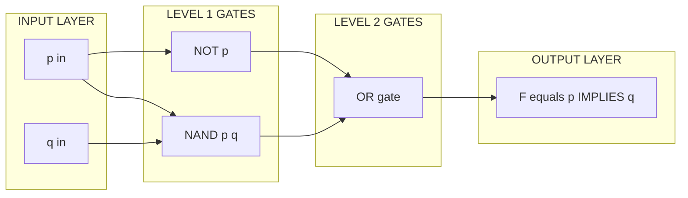
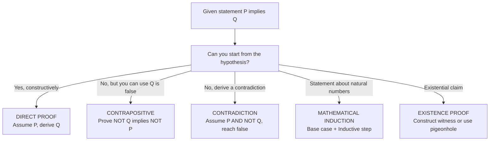
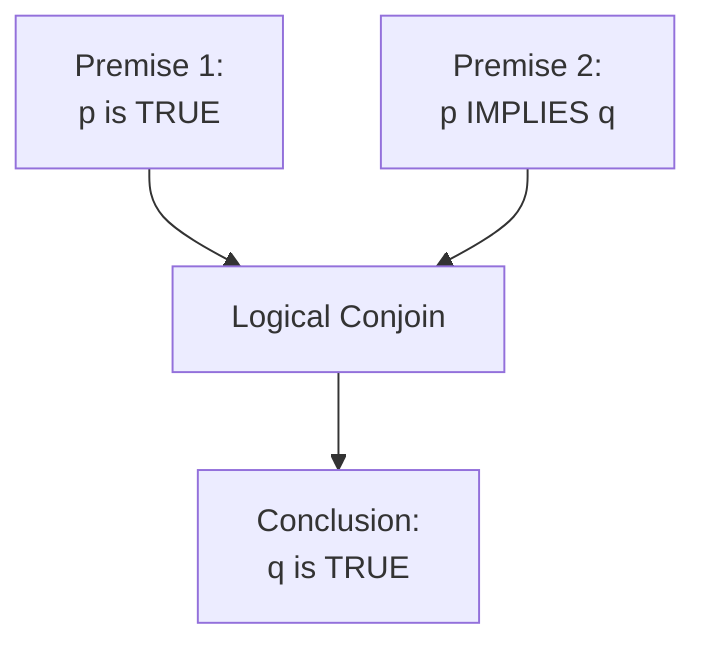
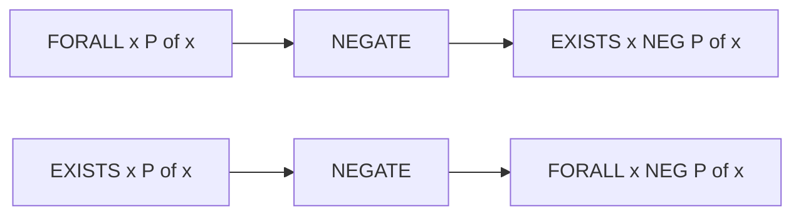
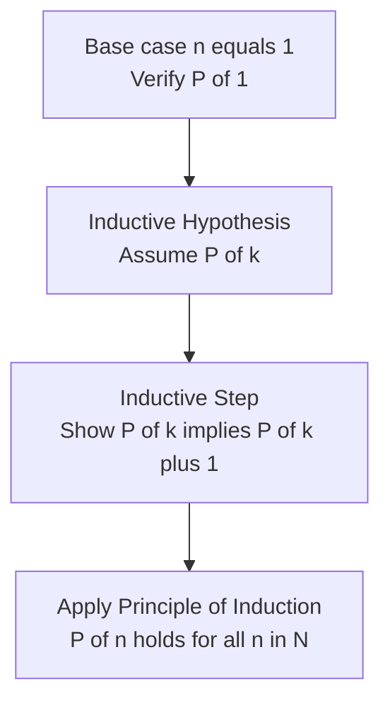

# Mathematical logic and proofs

<!-- SECTION_1_START -->
# Mathematical Logic and Proofs — Core Foundations

## 1.1 Propositions and Logical Statements

> [!IMPORTANT]
> **KTU 2024 — Definition (PCCST205 / M2):**
> A **proposition** is a declarative sentence that is unambiguously either **true (T)** or **false (F)**, but never both and never neither. Propositions form the atomic building blocks of mathematical logic.

| Sentence Type | Proposition? | Reason |
|---|---|---|
| "7 is prime" | **Yes** | Truth value = **T** |
| "x + 2 = 9" | **No** | Truth depends on unknown $x$ |
| "Close the door!" | **No** | Imperative, no truth value |
| "It is raining" | **Yes (contextual)** | Boolean value in a given context |

> [!NOTE]
> Variables used in propositions that represent propositions themselves are called **propositional variables**. KTU convention uses lowercase letters $p, q, r, \ldots$ each ranging over $\{T, F\}$.

## 1.2 Logical Connectives — The Operators of Logic

Logical connectives are symbols that combine propositions to form **compound propositions**.

| Symbol | Name | Pronounced | Truth Function |
|---|---|---|---|
| $\neg$ | Negation | "not $p$" | flips truth value |
| $\wedge$ | Conjunction | "$p$ and $q$" | T only when both T |
| $\vee$ | Disjunction | "$p$ or $q$" | F only when both F (inclusive-or) |
| $\oplus$ | Exclusive-or | "either $p$ or $q$ but not both" | T when operands differ |
| $\rightarrow$ | Implication | "if $p$ then $q$" | F only when $p=T, q=F$ |
| $\leftrightarrow$ | Biconditional | "$p$ if and only if $q$" | T when both have same value |

> [!IMPORTANT]
> **KTU Convention:** The material implication $p \rightarrow q$ is defined as $\neg p \vee q$. It is the cornerstone of all proof theory and is **false only in one case**: when the hypothesis is true and the conclusion is false.

## 1.3 Intuitive Analogy — Logic as Electrical Switches

> [!TIP]
> **Real-World Analogy:** Think of a logical statement as an **electrical circuit**.
> - $\wedge$ (AND) = two switches in **series** — current flows only if **both** are closed.
> - $\vee$ (OR) = two switches in **parallel** — current flows if **either** is closed.
> - $\neg$ (NOT) = an **inverter (NOT-gate)** — flips the signal.
> - $\rightarrow$ (IMPLIES) = a **safety interlock** — the warning light turns on (F) only when the guard is open (p=T) and the machine is running (q=F). Any other combination is safe.

This circuit view (Claude Shannon, 1938) is precisely why propositional logic is the bedrock of digital hardware design, compiler optimisations, and Boolean satisfiability (SAT) solvers used in industry.

> [!VISUALIZATION CONTROL]
> **Concept:** Truth-table grid of a 2-variable connective
> **GeoGebra / Desmos Input:** Plot points $(x,y,z) \in \{0,1\}^3$ for the table of $p \rightarrow q$.
> **Visual Description:** On a 3D lattice, the surface sits at height 1 everywhere except at $(1,0)$, where it dips to 0. The student should observe the single "dip" that characterises material implication.

<!-- SECTION_1_END -->

<!-- SECTION_2_START -->
# Deep Theoretical Analysis & KTU High-Yield Formula Sheet

## 2.1 Master Truth-Table of All 16 Binary Connectives

For two variables $p, q$ there are exactly $2^{2^2} = \mathbf{16}$ possible truth-functions. KTU examiners focus on the six canonical ones above. The other ten are expressible in terms of $\{\neg, \wedge, \vee\}$.

| $p$ | $q$ | $\neg p$ | $p \wedge q$ | $p \vee q$ | $p \oplus q$ | $p \rightarrow q$ | $p \leftrightarrow q$ |
|:---:|:---:|:---:|:---:|:---:|:---:|:---:|:---:|
| T | T | F | **T** | **T** | F | **T** | **T** |
| T | F | F | F | **T** | **T** | F | F |
| F | T | **T** | F | **T** | **T** | **T** | F |
| F | F | **T** | F | F | F | **T** | **T** |

## 2.2 Classification of Compound Propositions

Let $S(p_1, \ldots, p_n)$ be a compound proposition.

| Type | Definition | Occurrences of T |
|---|---|---|
| **Tautology** | Always true for all $2^n$ assignments | $2^n$ (all rows T) |
| **Contradiction** | Always false | $0$ (no row T) |
| **Contingency** | True for some, false for others | strictly between 0 and $2^n$ |

## 2.3 Logical Equivalences — KTU Cheat Sheet

> [!IMPORTANT]
> The following table is **high-yield** — it is reproduced almost verbatim in KTU 2024 previous papers.

| # | Equivalence | Law Name |
|---|---|---|
| 1 | $p \vee q \equiv q \vee p$ ; $p \wedge q \equiv q \wedge p$ | Commutative |
| 2 | $(p \vee q) \vee r \equiv p \vee (q \vee r)$ | Associative |
| 3 | $p \wedge (q \vee r) \equiv (p \wedge q) \vee (p \wedge r)$ | Distributive |
| 4 | $\neg(\neg p) \equiv p$ | Double Negation |
| 5 | $\neg(p \wedge q) \equiv \neg p \vee \neg q$ | De Morgan |
| 6 | $\neg(p \vee q) \equiv \neg p \wedge \neg q$ | De Morgan |
| 7 | $p \rightarrow q \equiv \neg p \vee q$ | Implication |
| 8 | $p \rightarrow q \equiv \neg q \rightarrow \neg p$ | Contrapositive |
| 9 | $p \leftrightarrow q \equiv (p \rightarrow q) \wedge (q \rightarrow p)$ | Biconditional |
| 10 | $p \oplus q \equiv (p \vee q) \wedge \neg(p \wedge q)$ | XOR |
| 11 | $p \vee (p \wedge q) \equiv p$ ; $p \wedge (p \vee q) \equiv p$ | Absorption |
| 12 | $p \vee \neg p \equiv T$ ; $p \wedge \neg p \equiv F$ | Complement |

## 2.4 Logical Implication vs Logical Equivalence

- **Equivalence** ($p \equiv q$): the columns of $p$ and $q$ in a truth table are **identical** (same truth value in every row).
- **Implication** ($p \Rightarrow q$): the column of $q$ is T **wherever** the column of $p$ is T. Formally, $(p \rightarrow q)$ is a **tautology**.

## 2.5 Predicates and Quantifiers

A **predicate** $P(x)$ is a sentence whose truth depends on the value of variable(s) $x$ from a domain $D$.

| Quantifier | Symbol | Reads as | True when… |
|---|---|---|---|
| Universal | $\forall x \, P(x)$ | "For all $x$, $P(x)$" | $P(x)$ holds for **every** $x \in D$ |
| Existential | $\exists x \, P(x)$ | "There exists $x$ such that $P(x)$" | $P(x)$ holds for **at least one** $x \in D$ |
| Unique | $\exists! x \, P(x)$ | "There exists a unique $x$ …" | Exactly one $x \in D$ satisfies $P$ |

> [!IMPORTANT]
> **Negation of Quantifiers (De Morgan for predicates):**
> $$\neg(\forall x \, P(x)) \equiv \exists x \, \neg P(x)$$
> $$\neg(\exists x \, P(x)) \equiv \forall x \, \neg P(x)$$

## 2.6 Rules of Inference (Argument Forms)

| Rule | Standard Form | Tautology Backing |
|---|---|---|
| Modus Ponens | $p, \; p \rightarrow q \;\therefore\; q$ | $(p \wedge (p \rightarrow q)) \rightarrow q$ |
| Modus Tollens | $\neg q, \; p \rightarrow q \;\therefore\; \neg p$ | $(\neg q \wedge (p \rightarrow q)) \rightarrow \neg p$ |
| Hypothetical Syllogism | $p \rightarrow q, \; q \rightarrow r \;\therefore\; p \rightarrow r$ | $((p \rightarrow q) \wedge (q \rightarrow r)) \rightarrow (p \rightarrow r)$ |
| Disjunctive Syllogism | $p \vee q, \; \neg p \;\therefore\; q$ | $((p \vee q) \wedge \neg p) \rightarrow q$ |
| Addition | $p \;\therefore\; p \vee q$ | $p \rightarrow (p \vee q)$ |
| Simplification | $p \wedge q \;\therefore\; p$ | $(p \wedge q) \rightarrow p$ |
| Conjunction | $p, \; q \;\therefore\; p \wedge q$ | $((p) \wedge (q)) \rightarrow (p \wedge q)$ |
| Resolution | $p \vee q, \; \neg q \vee r \;\therefore\; p \vee r$ | $((p \vee q) \wedge (\neg q \vee r)) \rightarrow (p \vee r)$ |
| Universal Instantiation | $\forall x \, P(x) \;\therefore\; P(c)$ | — |
| Existential Generalisation | $P(c) \;\therefore\; \exists x \, P(x)$ | — |

## 2.7 Engineering and CS Utility

| Field | Application |
|---|---|
| **Digital VLSI** | Boolean logic minimisation (Karnaugh maps, Quine–McCluskey) |
| **SAT Solvers** | Hardware/software verification, model checking |
| **AI / Knowledge Representation** | Horn-clause logic, Prolog, expert systems |
| **Database Systems** | Relational calculus, query optimisation |
| **Cryptographic Protocols** | BAN logic, formal verification of security proofs |
| **Compiler Design** | Static analysis, constant folding, dead-code elimination |

<!-- SECTION_2_END -->

<!-- SECTION_3_START -->
# Step-by-Step Derivations & Code Implementation

## 3.1 Worked Example — Truth Table Verification of a Tautology

> **Problem:** Show that $(p \rightarrow q) \wedge (q \rightarrow r) \rightarrow (p \rightarrow r)$ is a tautology.

### Step 1 — Build the truth table

We have three variables $p, q, r$, so $2^3 = 8$ rows.

| $p$ | $q$ | $r$ | $p \rightarrow q$ | $q \rightarrow r$ | $(p \rightarrow q) \wedge (q \rightarrow r)$ | $p \rightarrow r$ | Final Column |
|:---:|:---:|:---:|:---:|:---:|:---:|:---:|:---:|
| T | T | T | T | T | T | T | **T** |
| T | T | F | T | F | F | F | **T** |
| T | F | T | F | T | F | T | **T** |
| T | F | F | F | T | F | F | **T** |
| F | T | T | T | T | T | T | **T** |
| F | T | F | T | F | F | T | **T** |
| F | F | T | T | T | T | T | **T** |
| F | F | F | T | T | T | T | **T** |

### Step 2 — Interpret the result

Since the final column is **T in all 8 rows**, the compound proposition is a **tautology**, i.e., a logically valid argument. This proves **Hypothetical Syllogism** as a derived rule of inference.

---

## 3.2 Worked Example — Proving Equivalence Algebraically

> **Problem:** Show that $\neg(p \rightarrow q) \equiv p \wedge \neg q$ using logical equivalences.

$$
\begin{aligned}
\neg(p \rightarrow q) &\equiv \neg(\neg p \vee q) && \text{[Implication law: } p \rightarrow q \equiv \neg p \vee q \text{]} \\
&\equiv \neg(\neg p) \wedge \neg q && \text{[De Morgan's law]} \\
&\equiv p \wedge \neg q && \text{[Double negation: } \neg(\neg p) \equiv p \text{]}
\end{aligned}
$$

Hence $\neg(p \rightarrow q) \equiv p \wedge \neg q$. $\blacksquare$

---

## 3.3 Worked Example — Direct Proof

> **Theorem:** If $n$ is an even integer, then $n^2$ is even.
> **Given:** $n = 2k$ for some $k \in \mathbb{Z}$.
> **Prove:** $n^2$ is even.

$$
\begin{aligned}
n &= 2k && \text{[Given, since } n \text{ is even]} \\
n^2 &= (2k)^2 && \text{[Substitute]} \\
    &= 4k^2 && \text{[Algebra]} \\
    &= 2(2k^2) && \text{[Factor out 2]} \\
\end{aligned}
$$

Since $n^2 = 2(2k^2)$ and $2k^2 \in \mathbb{Z}$, by definition $n^2$ is **even**. $\blacksquare$

---

## 3.4 Worked Example — Proof by Contrapositive

> **Theorem:** If $3n + 2$ is odd, then $n$ is odd.

**Contrapositive:** If $n$ is even, then $3n + 2$ is even.

*Proof.* Assume $n = 2k$. Then $3n + 2 = 3(2k) + 2 = 6k + 2 = 2(3k + 1)$, which is even. $\blacksquare$

---

## 3.5 Worked Example — Proof by Contradiction

> **Theorem:** $\sqrt{2}$ is irrational.

*Proof.* Suppose for contradiction that $\sqrt{2}$ is rational. Then $\sqrt{2} = \dfrac{p}{q}$ where $p, q \in \mathbb{Z}$, $q \neq 0$, and $\gcd(p, q) = 1$.

$$
\begin{aligned}
\sqrt{2} &= \frac{p}{q} \\
2 &= \frac{p^2}{q^2} && \text{[Squaring both sides]} \\
p^2 &= 2q^2 && \text{[Cross-multiplying]}
\end{aligned}
$$

This shows $p^2$ is even, so $p$ must be even. Write $p = 2k$. Then $(2k)^2 = 2q^2 \Rightarrow 4k^2 = 2q^2 \Rightarrow q^2 = 2k^2$, so $q$ is also even. But then $p$ and $q$ share a factor of 2, contradicting $\gcd(p, q) = 1$. Hence $\sqrt{2}$ is **irrational**. $\blacksquare$

---

## 3.6 Worked Example — Proof by Mathematical Induction

> **Theorem:** $1 + 2 + 3 + \cdots + n = \dfrac{n(n+1)}{2}$ for all $n \in \mathbb{N}$.

**Base case ($n = 1$):** LHS $= 1$. RHS $= \dfrac{1 \cdot 2}{2} = 1$. ✓

**Inductive step:** Assume true for $n = k$, i.e., $1 + 2 + \cdots + k = \dfrac{k(k+1)}{2}$ (Inductive Hypothesis, IH).

Show for $n = k + 1$:

$$
\begin{aligned}
1 + 2 + \cdots + k + (k+1) &= \frac{k(k+1)}{2} + (k+1) && \text{[By IH]} \\
&= \frac{k(k+1) + 2(k+1)}{2} && \text{[Common denominator]} \\
&= \frac{(k+1)(k+2)}{2} && \text{[Factor } (k+1) \text{]} \\
&= \frac{(k+1)\big((k+1)+1\big)}{2} && \text{[Rewrite in } n=k+1 \text{ form]}
\end{aligned}
$$

Hence the formula holds for $n = k+1$. By the Principle of Mathematical Induction, it holds for all $n \in \mathbb{N}$. $\blacksquare$

---

## 3.7 Python Implementation — Automatic Truth Table Generator

```python
"""
truth_table.py
A general-purpose truth-table generator for propositional logic.
Used in PCCST205 lab demonstrations and KTU viva.
"""

from __future__ import annotations
from itertools import product
from typing import Callable, List, Tuple


def generate_truth_table(
    variables: List[str],
    expression: Callable[..., bool],
) -> List[Tuple[Tuple[bool, ...], bool]]:
    """
    Generate the full truth table for a Boolean expression.

    Parameters
    ----------
    variables : list of str
        Names of propositional variables, e.g. ['p', 'q'].
    expression : callable
        A function that accepts bools in the same order as `variables`
        and returns the resulting bool.

    Returns
    -------
    list of tuples
        Each tuple is (input_assignment, result), where input_assignment
        is a tuple of bools aligned with `variables`.
    """
    if not variables:
        raise ValueError("At least one propositional variable is required.")
    if not callable(expression):
        raise TypeError("`expression` must be a callable returning a bool.")

    table: List[Tuple[Tuple[bool, ...], bool]] = []
    for assignment in product([False, True], repeat=len(variables)):
        try:
            result = expression(*assignment)
        except Exception as exc:  # pragma: no cover
            raise RuntimeError(
                f"Error evaluating expression for assignment {assignment}: {exc}"
            ) from exc
        if not isinstance(result, bool):
            raise TypeError(
                f"Expression must return bool, got {type(result).__name__}"
            )
        table.append((assignment, result))
    return table


def classify(compound: List[Tuple[Tuple[bool, ...], bool]]) -> str:
    """
    Classify a compound proposition as TAUTOLOGY, CONTRADICTION, or CONTINGENCY.
    """
    truths = [row[1] for row in compound]
    if all(truths):
        return "TAUTOLOGY"
    if not any(truths):
        return "CONTRADICTION"
    return "CONTINGENCY"


def pretty_print(
    variables: List[str],
    table: List[Tuple[Tuple[bool, ...], bool]],
) -> None:
    """Pretty-print the truth table to stdout."""
    header = " | ".join(variables) + " | RESULT"
    print(header)
    print("-" * len(header))
    for assignment, result in table:
        row = " | ".join("T" if v else "F" for v in assignment)
        print(f"{row} | {'T' if result else 'F'}")


# ---------------------------------------------------------------------------
# Demonstration: Hypothetical Syllogism
# (p -> q) AND (q -> r) -> (p -> r)
# ---------------------------------------------------------------------------
if __name__ == "__main__":
    def hs(p: bool, q: bool, r: bool) -> bool:
        return ((not p or q) and (not q or r)) == (not p or r)

    variables = ["p", "q", "r"]
    table = generate_truth_table(variables, hs)
    pretty_print(variables, table)
    print(f"\nClassification : {classify(table)}")
```

**Sample Output (abridged):**

```
p | q | r | RESULT
-----------------
T | T | T | T
T | T | F | T
...
F | F | F | T

Classification : TAUTOLOGY
```

---

## 3.8 Quantifier Negation — Worked Drill

> **Problem:** Write the negation of: "Every student in this class has studied Discrete Mathematics."

* **Original:** $\forall x \, (S(x) \rightarrow D(x))$
* **Negation:** $\neg(\forall x \, (S(x) \rightarrow D(x))) \equiv \exists x \, \neg(S(x) \rightarrow D(x))$
* **Simplify:** $\equiv \exists x \, (S(x) \wedge \neg D(x))$
* **In English:** "There exists a student in this class who has **not** studied Discrete Mathematics."

<!-- SECTION_3_END -->

<!-- SECTION_4_START -->
# Structural Diagrams & Schematics

## 4.1 Logic-Gate Architecture (Mermaid Block-Level Topology)

> The following Mermaid block diagrams the **material-conditional gate** as a two-level NAND/NOR network — the canonical CMOS implementation of $p \rightarrow q$.



**Reading the diagram:** The NOT gate inverts $p$, the NAND gate generates the failure condition, and the OR gate produces the material implication $p \rightarrow q \equiv \neg p \vee \neg(p \wedge q)$ in its standard CMOS form.

## 4.2 Proof-Method Decision Flowchart



## 4.3 Modus-Ponens Inference Diagram



## 4.4 Quantifier-Negation Mapping



## 4.5 Proof-by-Induction Cascade (Sequential Processing Topology)



<!-- SECTION_4_END -->

<!-- SECTION_5_START -->
# KTU 2024 Scheme Examination Question Bank & Topic Recap

## PART A — Short Answer Questions (3 Marks Each)

### Question 1 [KTU University Exam – July 2024, CO2, Remember]

**Q:** Define a *tautology* and a *contradiction*. Give one example of each using two variables $p$ and $q$.

**Model Answer (Valuation Key — 3 Marks):**

- **Tautology:** A compound proposition that is **always true** for every possible truth-value assignment of its variables. *(1 Mark)*
- **Contradiction:** A compound proposition that is **always false** for every assignment. *(1 Mark)*
- **Example of tautology:** $p \vee \neg p$ (law of excluded middle). *(0.5 Mark)*
- **Example of contradiction:** $p \wedge \neg p$ (law of non-contradiction). *(0.5 Mark)*

---

### Question 2 [KTU University Exam – Dec 2023, CO2, Understand]

**Q:** State De Morgan's laws in propositional logic. Write the negation of $(p \wedge q) \rightarrow r$ in its simplest form.

**Model Answer (Valuation Key — 3 Marks):**

- De Morgan's laws: *(1 Mark)*
  - $\neg(p \wedge q) \equiv \neg p \vee \neg q$
  - $\neg(p \vee q) \equiv \neg p \wedge \neg q$
- Compute negation: *(2 Marks)*
  - $\neg\big((p \wedge q) \rightarrow r\big) \equiv (p \wedge q) \wedge \neg r$ using the identity $\neg(a \rightarrow b) \equiv a \wedge \neg b$.

---

## PART B — Long Answer Questions (14 Marks Each)

> **KTU ESE Pattern (Module 2 — Internal Choice):** Answer **either** Question A **or** Question B in full.

---

### ✦ QUESTION A (14 Marks) [KTU University Exam – July 2024, CO2, Apply/Analyse]

**(a)** Using a truth table, prove that $(p \rightarrow q) \leftrightarrow (\neg p \vee q)$ is a tautology. **(7 Marks)**

**Model Solution:**

| $p$ | $q$ | $p \rightarrow q$ | $\neg p$ | $\neg p \vee q$ | $(p \rightarrow q) \leftrightarrow (\neg p \vee q)$ |
|:---:|:---:|:---:|:---:|:---:|:---:|
| T | T | T | F | T | **T** |
| T | F | F | F | F | **T** |
| F | T | T | T | T | **T** |
| F | F | T | T | T | **T** |

*[Stating the definition of implication and writing the table header: 2 Marks; Correctly evaluating all four rows: 3 Marks; Stating "all T" → tautology: 1 Mark; Drawing the conclusion that $p \rightarrow q \equiv \neg p \vee q$: 1 Mark.]*

**(b)** Using rules of inference, prove that the premises

$$p \vee q, \quad \neg p, \quad (p \vee q) \rightarrow (q \rightarrow r) \;\therefore\; r$$

lead to the conclusion $r$. **(7 Marks)**

**Model Solution — Valuation Key:**

| Step | Statement | Justification | Marks |
|:---:|---|---|:---:|
| 1 | $p \vee q$ | Premise | 0.5 |
| 2 | $\neg p$ | Premise | 0.5 |
| 3 | $q$ | 1, 2, Disjunctive Syllogism | 1.0 |
| 4 | $(p \vee q) \rightarrow (q \rightarrow r)$ | Premise | 0.5 |
| 5 | $q \rightarrow r$ | 1, 4, Modus Ponens | 1.0 |
| 6 | $r$ | 3, 5, Modus Ponens | 1.0 |
| 7 | Conclusion $\therefore r$ | — | 0.5 |
| 8 | Valid use of inference rules and citation of each rule | — | 2.0 |

---

### ✦ QUESTION B (14 Marks) [KTU University Exam – Dec 2023, CO2, Apply/Analyse]

**(a)** Prove by mathematical induction that, for all $n \geq 1$,

$$1^2 + 2^2 + 3^2 + \cdots + n^2 = \frac{n(n+1)(2n+1)}{6}.$$

**(7 Marks)**

**Model Solution:**

*Base case ($n=1$):* LHS $= 1^2 = 1$. RHS $= \dfrac{1 \cdot 2 \cdot 3}{6} = 1$. ✓ *[1 Mark]*

*Inductive hypothesis:* Assume the formula holds for $n = k$:

$$1^2 + 2^2 + \cdots + k^2 = \frac{k(k+1)(2k+1)}{6}. \quad \text{[1 Mark]}$$

*Inductive step ($n = k+1$):*

$$
\begin{aligned}
1^2 + 2^2 + \cdots + k^2 + (k+1)^2
&= \frac{k(k+1)(2k+1)}{6} + (k+1)^2 && \text{[By IH: 1 Mark]} \\
&= \frac{k(k+1)(2k+1) + 6(k+1)^2}{6} && \text{[LCM: 0.5 Mark]} \\
&= \frac{(k+1)\big[k(2k+1) + 6(k+1)\big]}{6} && \text{[Factor } (k+1) \text{: 1 Mark]} \\
&= \frac{(k+1)(2k^2 + 7k + 6)}{6} && \text{[Expand: 0.5 Mark]} \\
&= \frac{(k+1)(k+2)(2k+3)}{6} && \text{[Factor quadratic: 1 Mark]} \\
&= \frac{(k+1)\big((k+1)+1\big)\big(2(k+1)+1\big)}{6} && \text{[Final form: 1 Mark]}
\end{aligned}
$$

The result holds for $n = k+1$. By the Principle of Mathematical Induction, it holds for all $n \in \mathbb{N}$. $\blacksquare$

**(b)** Prove by contradiction that there is no smallest positive rational number. **(7 Marks)**

**Model Solution — Valuation Key:**

- Assume, for contradiction, that $r = \dfrac{p}{q}$ is the smallest positive rational, with $p, q \in \mathbb{Z}^+$. *[1 Mark]*
- Construct $r' = \dfrac{r}{2} = \dfrac{p}{2q}$, which is **positive** and **rational**. *[2 Marks]*
- Observe $r' < r$ because dividing a positive number by 2 makes it smaller. *[2 Marks]*
- This contradicts the assumption that $r$ is the smallest positive rational. Hence no such number exists. *[2 Marks]*

---

> [!WARNING]
> **KTU Examiner's Pitfall Callout:**
> 1. **Forgetting to cite the inference rule** in Part B (b) is the most common cause of a **−3 to −5 mark** penalty. Every deduction line **must** carry a justification (Modus Ponens, Modus Tollens, etc.).
> 2. In induction proofs, the **base case is mandatory**; KTU examiners reserve up to **1 mark** specifically for verifying $n=1$ (or the smallest admissible $n$).
> 3. When using contradiction, **end with the explicit statement of contradiction** (e.g., "this contradicts $\gcd(p, q) = 1$"), not just "this is a contradiction" in the abstract.
> 4. **Do not** confuse $p \rightarrow q$ with $p \leftrightarrow q$ in truth tables — examiners routinely award partial credit only if all 4–8 rows are filled correctly.

---

## Topic Recap & Important Things to Remember

- A **proposition** is a declarative statement that is unambiguously **T or F**.
- The **six canonical connectives** are $\neg, \wedge, \vee, \oplus, \rightarrow, \leftrightarrow$ — memorise the truth tables of all six.
- **Tautology** = always T; **Contradiction** = always F; otherwise it is a **Contingency**.
- The **Implication Law** $p \rightarrow q \equiv \neg p \vee q$ is the single most-frequently tested equivalence in KTU papers.
- The **Contrapositive** of $p \rightarrow q$ is $\neg q \rightarrow \neg p$ — they are logically equivalent.
- **De Morgan's Laws** are the workhorse of negation problems.
- The **negation of a universal quantifier** is an existential quantifier (and vice-versa) with the inner predicate negated.
- The **ten classical rules of inference** (Modus Ponens, Modus Tollens, Hypothetical Syllogism, Disjunctive Syllogism, Addition, Simplification, Conjunction, Resolution, Universal Instantiation, Existential Generalisation) must be cited by name.
- **Mathematical Induction** has two obligatory parts: **Base case** and **Inductive step** (with explicit **Inductive Hypothesis**).
- **Direct proof** assumes the hypothesis and derives the conclusion; **contrapositive** swaps and negates both sides; **contradiction** assumes the negation of the goal and reaches a falsity.
- **Logical equivalence** ($\equiv$) requires identical truth-table columns; **logical implication** ($\Rightarrow$) requires that the consequent is true whenever the antecedent is true.
- Total number of distinct Boolean functions on $n$ variables is $2^{2^n}$ — for $n=2$ this is $\mathbf{16}$.
- Industry touch-points: **SAT solvers, hardware verification, VLSI minimisation, AI knowledge representation, formal methods in cryptography, query optimisation in databases**.

<!-- SECTION_5_END -->
