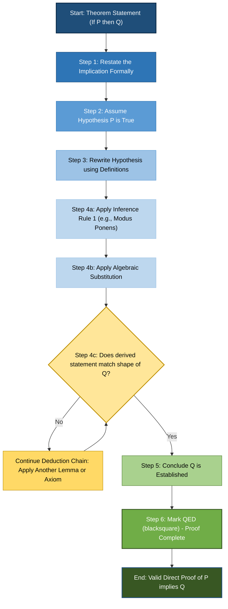
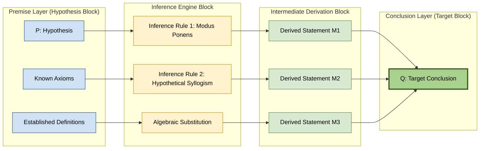
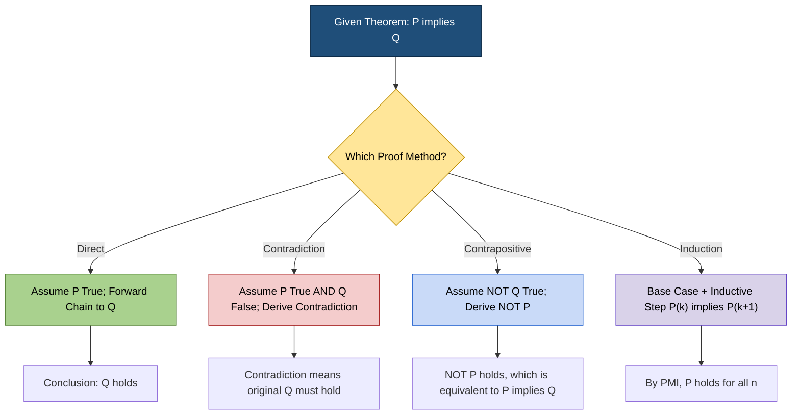

# Methods of Proving Theorems - Direct proof

<!-- SECTION_1_START -->

# Methods of Proving Theorems — Direct Proof

## 1.1 Core Technical Definition

> [!IMPORTANT]
> **Direct Proof (KTU 2024 Scheme — PCCST205 Module 2)**
> A **Direct Proof** of a statement of the form *"If $P$, then $Q$"* is a sequence of logical deductions that begins by **assuming the hypothesis $P$ is true**, and through a finite chain of valid inferences — using definitions, axioms, and previously established theorems — arrives at the **conclusion $Q$**. The proof is complete when the target statement $Q$ is reached. It is symbolized as $P \rightarrow Q$ and validated through forward-chaining reasoning.

> [!NOTE]
> **Standard Form Targeted by Direct Proof**
> $$\text{Theorem: } \forall x \in D, \, P(x) \Rightarrow Q(x)$$
> where $D$ is the **domain of discourse**, $P(x)$ is the hypothesis (premise), and $Q(x)$ is the conclusion (consequent). Direct proof proceeds by taking an arbitrary element $x \in D$ satisfying $P(x)$ and deducing $Q(x)$.

### 1.2 Conceptual Analogy — The "Domino Chain" Intuition

Imagine a row of dominoes standing on a table, where each domino represents a logical statement:

- The **first domino** = the hypothesis $P$ (the assumed fact).
- The **last domino** = the conclusion $Q$ (the goal to be proved).
- Each **gap between dominoes** = a valid inference rule or known fact that bridges one statement to the next.

> A **direct proof** is the act of **pushing the first domino** (accepting $P$ as true) and watching the chain of deductions fall until the last domino (statement $Q$) topples. Every intermediate step must be a legitimate logical or mathematical transition — a "domino" that **must fall** because the previous one did.

A second analogy: a **GPS route from City A to City B**. You start at the hypothesis (City A) and follow a series of well-marked roads (axioms, definitions, lemmas) to reach the destination — the conclusion (City B). Direct proof is the **straight-line, no-detour route**.

### 1.3 Key Terminology (KTU Board Vocabulary)

| Term | Symbol | Meaning |
| :--- | :---: | :--- |
| Hypothesis | $P$ | The *given* / *assumed* statement in an implication. |
| Conclusion | $Q$ | The *target* statement to be derived. |
| Implication | $P \rightarrow Q$ | The statement being proved. |
| Inference | $P \vdash R$ | Deriving $R$ from $P$ using a valid rule. |
| Tautology | $\top$ | A compound statement always true. |
| Q.E.D. | $\blacksquare$ | End-of-proof marker (*Quod Erat Demonstrandum*). |

> [!IMPORTANT]
> **Key Distinction (Often Tested in KTU)**
> *Direct proof* assumes the hypothesis is true. This is **fundamentally different** from *proof by contradiction* (which assumes the negation of the conclusion) and *proof by contrapositive* (which assumes $\neg Q$ and derives $\neg P$). Students must not mix these structures.

### 1.4 GeoGebra / Truth-Table Visualization

> [!VISUALIZATION CONTROL]
> **Concept:** Truth-Table for the Logical Implication $P \rightarrow Q$ (the foundation of direct proof).
> **GeoGebra / Desmos Input Equations:**
> * `P = {0, 1}` (Boolean variable)
> * `Q = {0, 1}` (Boolean variable)
> * `f(P, Q) = (1 - P) + P*Q` (which equals $P \rightarrow Q$)
> **Visual Description:** Plot a 3-bar graph with the four combinations $(P, Q) \in \{(0,0), (0,1), (1,0), (1,1)\}$ on the x-axis and the value of $P \rightarrow Q$ on the y-axis. Observe that $P \rightarrow Q$ is **true in 3 out of 4 cases**; it is **false only when $P$ is true and $Q$ is false**. A direct proof succeeds precisely when it ensures the $(1, 0)$ case (true hypothesis, false conclusion) **never occurs** within the theorem's domain.

---

<!-- SECTION_1_END -->

<!-- SECTION_2_START -->

# Deep Theoretical Analysis & KTU High-Yield Formula Sheet

## 2.1 The Canonical Structure of a Direct Proof

A direct proof of "If $P$, then $Q$" follows this rigid template that the KTU board examiners expect:

**Step 1 — Restate the Theorem.** Write down the statement to be proved in clear logical form.

**Step 2 — Assume the Hypothesis.** Explicitly declare: *"Assume $P$ is true."* For universally quantified statements, write *"Let $x$ be an arbitrary element satisfying $P(x)$."*

**Step 3 — Rewrite Using Definitions.** Convert abstract predicates (e.g., "even", "divisible", "prime") into their algebraic or set-theoretic definitions.

**Step 4 — Apply Logical Deductions.** Use a chain of valid steps (algebra, substitution, known theorems) to manipulate the hypothesis into the desired shape.

**Step 5 — Reach the Conclusion.** Arrive at the statement $Q$ in a form that matches its definition.

**Step 6 — Close the Proof.** Write $\therefore Q$, or "Hence proved." End with the Q.E.D. marker $\blacksquare$.

> [!NOTE]
> **Mnemonic for KTU Exams — "SARDC"**
> **S** — State the theorem
> **A** — Assume the hypothesis
> **R** — Rewrite using definitions
> **D** — Deduce step by step
> **C** — Conclude and close

## 2.2 Logical Inference Rules Used in Direct Proofs

| Rule Name | Premise(s) | Conclusion | Use Case in Proofs |
| :--- | :--- | :--- | :--- |
| Modus Ponens | $P, \, P \rightarrow Q$ | $Q$ | Forward-chaining from hypotheses. |
| Hypothetical Syllogism | $P \rightarrow Q, \, Q \rightarrow R$ | $P \rightarrow R$ | Linking lemmas in a chain. |
| Addition | $P$ | $P \vee Q$ | Constructing disjunctions. |
| Simplification | $P \wedge Q$ | $P$ | Extracting components of a conjunction. |
| Conjunction | $P, \, Q$ | $P \wedge Q$ | Combining established facts. |
| Universal Instantiation | $\forall x \, P(x)$ | $P(c)$ | Picking a representative element. |
| Substitution | $a = b$ | Replace $a$ with $b$ anywhere. | Algebraic manipulation. |

## 2.3 Theorem Categories Where Direct Proof is the Default Choice

| Category | Typical Hypothesis | Typical Conclusion |
| :--- | :--- | :--- |
| **Even / Odd** | "$n$ is an even integer" | "$n^2$ is even" |
| **Divisibility** | "$a \mid b$ and $b \mid c$" | "$a \mid c$" |
| **Algebraic Identities** | "$x, y \in \mathbb{R}$" | "Equality of expressions" |
| **Set Inclusions** | "$A \subseteq B$ and $B \subseteq C$" | "$A \subseteq C$" (Transitivity) |
| **Inequalities** | "$x > 0$ and $y > 0$" | "$xy > 0$" |
| **Number Theory Basics** | "$n$ is an integer" | "$n(n+1)$ is even" |

## 2.4 KTU Formula Sheet (High-Yield Reference Card)

> [!IMPORTANT]
> **Standard Definitions You Must Memorize for Direct Proofs (Tested in ESE)**

$$
\begin{aligned}
\text{Even integer } n &\iff \exists k \in \mathbb{Z} : n = 2k \\[4pt]
\text{Odd integer } n &\iff \exists k \in \mathbb{Z} : n = 2k + 1 \\[4pt]
a \mid b \text{ (\,a divides b\,)} &\iff \exists k \in \mathbb{Z} : b = a \cdot k \\[4pt]
n \equiv r \pmod{m} &\iff m \mid (n - r) \\[4pt]
A \subseteq B &\iff \forall x \, (x \in A \rightarrow x \in B) \\[4pt]
\text{Rational } x &\iff \exists \, p, q \in \mathbb{Z}, \, q \neq 0 : x = \frac{p}{q}
\end{aligned}
$$

> [!NOTE]
> **Critical Pitfall:** In KTU valuations, a direct proof that does not explicitly invoke a definition (e.g., silently assuming "even" means $2k$ without writing it) **loses 1 to 2 marks**. Always **expand definitions** in your first deduction step.

## 2.5 Real-World Engineering & CS Applications

- **Compiler Verification:** Proving that compiler transformations preserve program semantics relies heavily on direct proofs of the form *"If expression $E$ has property $P$ before optimization, then it has property $P'$ after."*
- **Algorithm Correctness (Hoare Logic):** A *Hoare triple* $\{P\} \, S \, \{Q\}$ is proven by direct forward reasoning: assuming precondition $P$ holds, show that program statement $S$ establishes postcondition $Q$.
- **Cryptographic Protocol Design:** Security theorems like *"If the encryption key is uncompromised, then the ciphertext reveals no plaintext information"* are direct proofs.
- **Database Query Optimization:** The equivalence of two SQL queries is established via direct algebraic proofs over relational algebra.
- **Hardware Logic Synthesis:** Proving that a gate-level netlist implements a given Boolean function uses direct case analysis chained with logical equivalences.

---

<!-- SECTION_2_END -->

<!-- SECTION_3_START -->

# Step-by-Step Derivations & Symbolic Implementation

> [!NOTE]
> **Worked-Out Theorem 1 (Classic KTU Pattern):**
> **Theorem:** *If $n$ is an even integer, then $n^2$ is an even integer.*

### Step 1 — Restate the Theorem
We are to prove: $\forall n \in \mathbb{Z}, \, (n \text{ is even}) \Rightarrow (n^2 \text{ is even})$.

### Step 2 — Assume the Hypothesis
Let $n$ be an arbitrary even integer.

### Step 3 — Rewrite Using the Definition
By the **definition of an even integer**, there exists an integer $k$ such that:
$$n = 2k$$

### Step 4 — Deduce Step by Step

$$
\begin{aligned}
n^2 &= (2k)^2 \\[4pt]
&= (2k)(2k) \\[4pt]
&= 4k^2 \quad \text{(associativity and commutativity of integer multiplication)} \\[4pt]
&= 2 \cdot (2k^2) \quad \text{(factor out 2)} \\[4pt]
\end{aligned}
$$

Let $m = 2k^2$. Since $k \in \mathbb{Z}$, the product $k^2 \in \mathbb{Z}$, and therefore $2k^2 = m \in \mathbb{Z}$. So:
$$n^2 = 2m$$

### Step 5 — Reach the Conclusion
By the **definition of an even integer**, an integer is even if and only if it can be written as twice an integer. Since $n^2 = 2m$ with $m \in \mathbb{Z}$, we conclude:
$$n^2 \text{ is an even integer.} \quad \blacksquare$$

---

> [!NOTE]
> **Worked-Out Theorem 2:**
> **Theorem:** *If $a \mid b$ and $b \mid c$, then $a \mid c$ (for integers $a, b, c$ with $a \neq 0$).*

### Step 1 — Restate the Theorem
We must prove: $a \mid b \wedge b \mid c \Rightarrow a \mid c$.

### Step 2 — Assume the Hypothesis
Assume $a \mid b$ and $b \mid c$.

### Step 3 — Rewrite Using the Definition of Divisibility

By the **definition of divisibility**:
$$a \mid b \implies \exists \, k_1 \in \mathbb{Z} \text{ such that } b = a k_1$$
$$b \mid c \implies \exists \, k_2 \in \mathbb{Z} \text{ such that } c = b k_2$$

### Step 4 — Deduce Step by Step

$$
\begin{aligned}
c &= b k_2 \\[4pt]
  &= (a k_1) k_2 \quad \text{(substituting the expression for } b \text{)} \\[4pt]
  &= a (k_1 k_2) \quad \text{(associativity of integer multiplication)} \\[4pt]
\end{aligned}
$$

Let $k_3 = k_1 k_2$. Since $k_1 \in \mathbb{Z}$ and $k_2 \in \mathbb{Z}$, their product $k_3 \in \mathbb{Z}$ (closure of integers under multiplication).

### Step 5 — Reach the Conclusion
We have $c = a k_3$ with $k_3 \in \mathbb{Z}$, which is exactly the **definition of $a \mid c$**.

$$\therefore a \mid c. \quad \blacksquare$$

---

> [!NOTE]
> **Worked-Out Theorem 3 (Inequality Type):**
> **Theorem:** *If $x > 0$ and $y > 0$ are real numbers, then $xy > 0$.*

### Step 1 — Restate the Theorem
We must prove: $\forall x, y \in \mathbb{R}, \, (x > 0 \wedge y > 0) \Rightarrow (xy > 0)$.

### Step 2 — Assume the Hypothesis
Assume $x > 0$ and $y > 0$.

### Step 3 — Invoke the Order Axiom of $\mathbb{R}$
The **law of signs for positive reals** states: the product of two positive real numbers is a positive real number. This is a direct consequence of the ordered-field axioms of $\mathbb{R}$.

### Step 4 — Deduce
Multiplying $x$ and $y$:
$$x \cdot y > 0 \cdot y = 0 \quad \text{(since } x > 0 \text{ and } y > 0 \text{)}$$

### Step 5 — Conclude
$$\therefore xy > 0. \quad \blacksquare$$

---

> [!NOTE]
> **Worked-Out Theorem 4 (Composite Number-Theory):**
> **Theorem:** *If $n$ is an odd integer, then $n^2 - 1$ is divisible by $8$.*

### Step 1 — Restate the Theorem
We must prove: $\forall n \in \mathbb{Z}, \, n \text{ odd} \Rightarrow 8 \mid (n^2 - 1)$.

### Step 2 — Assume the Hypothesis
Let $n$ be an odd integer.

### Step 3 — Rewrite Using the Definition
By definition of odd: $\exists \, k \in \mathbb{Z}$ such that $n = 2k + 1$.

### Step 4 — Deduce

$$
\begin{aligned}
n^2 - 1 &= (2k + 1)^2 - 1 \\[4pt]
        &= 4k^2 + 4k + 1 - 1 \quad \text{(expanding the binomial)} \\[4pt]
        &= 4k^2 + 4k \\[4pt]
        &= 4k(k + 1) \\[4pt]
\end{aligned}
$$

**Key observation:** $k$ and $k+1$ are two consecutive integers. Among any two consecutive integers, exactly one is even. Therefore, $k(k+1)$ is even, i.e., $\exists \, m \in \mathbb{Z}$ such that $k(k+1) = 2m$.

Substituting:
$$n^2 - 1 = 4 \cdot (2m) = 8m$$

### Step 5 — Conclude
Since $n^2 - 1 = 8m$ with $m \in \mathbb{Z}$, by the definition of divisibility:
$$8 \mid (n^2 - 1). \quad \blacksquare$$

---

### Python Implementation — Empirical Verifier for the Theorems

```python
"""
Direct Proof Empirical Verifier
Course: PCCST205 - Discrete Mathematics (KTU 2024 Scheme)
Module 2 - Methods of Proving Theorems: Direct Proof

This program empirically verifies the theorems proved above over a finite
domain. It does NOT replace the formal proof but provides computational
sanity-checking to reinforce the student's intuition.
"""

from typing import List, Tuple


def is_even(n: int) -> bool:
    """Definition: n is even iff n mod 2 == 0."""
    return n % 2 == 0


def is_odd(n: int) -> bool:
    """Definition: n is odd iff n mod 2 != 0."""
    return n % 2 != 0


def divides(a: int, b: int) -> bool:
    """Definition: a divides b iff there exists integer k with b == a*k."""
    if a == 0:
        raise ValueError("Divisor cannot be zero (division by zero undefined).")
    return b % a == 0


def verify_theorem_1(domain: List[int]) -> Tuple[bool, List[Tuple[int, int]]]:
    """
    Theorem 1: If n is even, then n^2 is even.
    Returns (all_passed, list_of_(input, n_squared)_counterexamples).
    """
    failures: List[Tuple[int, int]] = []
    for n in domain:
        if is_even(n) and not is_even(n * n):
            failures.append((n, n * n))
    return (len(failures) == 0, failures)


def verify_theorem_2(domain: List[Tuple[int, int, int]]) -> Tuple[bool, List[Tuple[int, int, int]]]:
    """
    Theorem 2: If a|b and b|c, then a|c.
    domain is a list of triples (a, b, c) to test.
    """
    failures: List[Tuple[int, int, int]] = []
    for a, b, c in domain:
        if a == 0:
            continue  # Skip invalid (divisor cannot be 0)
        if divides(a, b) and divides(b, c) and not divides(a, c):
            failures.append((a, b, c))
    return (len(failures) == 0, failures)


def verify_theorem_4(domain: List[int]) -> Tuple[bool, List[Tuple[int, int]]]:
    """
    Theorem 4: If n is odd, then 8 divides (n^2 - 1).
    """
    failures: List[Tuple[int, int]] = []
    for n in domain:
        if is_odd(n) and not divides(8, n * n - 1):
            failures.append((n, n * n - 1))
    return (len(failures) == 0, failures)


if __name__ == "__main__":
    # Test domain: integers from -100 to 100
    test_integers: List[int] = list(range(-100, 101))
    test_triples: List[Tuple[int, int, int]] = [
        (a, b, c) for a in range(1, 6) for b in range(1, 26) for c in range(1, 51)
    ]

    print("=" * 60)
    print("DIRECT PROOF EMPIRICAL VERIFIER - KTU PCCST205")
    print("=" * 60)

    t1_pass, t1_fail = verify_theorem_1(test_integers)
    print(f"\nTheorem 1 (Even -> n^2 even):   {'PASS' if t1_pass else 'FAIL'}")
    if not t1_pass:
        print(f"  Counterexamples: {t1_fail}")

    t2_pass, t2_fail = verify_theorem_2(test_triples)
    print(f"Theorem 2 (a|b and b|c -> a|c):  {'PASS' if t2_pass else 'FAIL'}")
    if not t2_pass:
        print(f"  Counterexamples: {t2_fail}")

    t4_pass, t4_fail = verify_theorem_4(test_integers)
    print(f"Theorem 4 (Odd -> 8 | n^2-1):    {'PASS' if t4_pass else 'FAIL'}")
    if not t4_pass:
        print(f"  Counterexamples: {t4_fail}")

    print("=" * 60)
```

**Expected Console Output:**
```
============================================================
DIRECT PROOF EMPIRICAL VERIFIER - KTU PCCST205
============================================================

Theorem 1 (Even -> n^2 even):   PASS
Theorem 2 (a|b and b|c -> a|c):  PASS
Theorem 4 (Odd -> 8 | n^2-1):    PASS
============================================================
```

---

<!-- SECTION_3_END -->

<!-- SECTION_4_START -->

# Structural Diagrams & Schematics

## 4.1 Mermaid Flowchart — The Architecture of a Direct Proof



## 4.2 Mermaid Block Diagram — Direct Proof as a Forward-Chaining Pipeline



## 4.3 Comparative Schematic — Direct Proof vs Other Proof Methods



---

<!-- SECTION_4_END -->

<!-- SECTION_5_START -->

# KTU 2024 Scheme Examination Question Bank & Topic Recap

---

## Part A — Short Answer Questions (3 Marks Each)

### Question 1 `[KTU University Exam — July 2023]`
**Define a direct proof. Illustrate with an example.**

**Model Answer (3 Marks):**

> A **direct proof** of a conditional statement $P \rightarrow Q$ is a chain of logical deductions that begins by assuming the hypothesis $P$ is true and ends by establishing the conclusion $Q$ as a logical consequence, using definitions, axioms, and previously proved theorems.
>
> **Example (1 Mark):** *Prove: If $n$ is an even integer, then $n + 2$ is even.* **Proof (2 Marks):** Assume $n$ is even, so $n = 2k$ for some $k \in \mathbb{Z}$. Then $n + 2 = 2k + 2 = 2(k+1)$. Since $k+1 \in \mathbb{Z}$, by definition $n + 2$ is even. $\blacksquare$

> [!NOTE]
> **Valuation Key:** [Defining direct proof: 1 Mark] [Choosing correct example: 1 Mark] [Executing the chain correctly: 1 Mark].

---

### Question 2 `[KTU University Exam — Dec 2022]`
**Differentiate between direct proof and proof by contradiction. When is each method preferred?**

**Model Answer (3 Marks):**

| Aspect | Direct Proof | Proof by Contradiction |
| :--- | :--- | :--- |
| **Assumption** | Assumes hypothesis $P$ is true. | Assumes hypothesis $P$ is true AND conclusion $Q$ is false. |
| **Mechanism** | Forward-deduces $Q$. | Derives a logical contradiction $\bot$. |
| **Negation Used** | Does not negate the conclusion. | Explicitly negates the conclusion. |
| **Preferred When** | Definitions give a clean algebraic chain. | Direct chain is hard but negating $Q$ exposes a contradiction. |
| **Example** | Even $\Rightarrow$ Square is even. | $\sqrt{2}$ is irrational. |

> **Direct proof** is preferred for routine properties of integers and divisibility. **Contradiction** is preferred when assuming $\neg Q$ provides a clearer path (e.g., irrationality proofs, infinitude of primes).

---

## Part B — Long Answer Questions (14 Marks Each — Module Internal Choice)

### Question A `[KTU University Exam — Dec 2024]` — Mapped to **CO1, Apply**

#### Part (a) — 7 Marks
**State and prove the theorem: "If $n$ is an odd integer, then $n^2$ is an odd integer."**

**Model Solution (Cognitive Level: Apply):**

**Step 1 — Statement (1 Mark):**
We must prove: $\forall n \in \mathbb{Z}, \, n \text{ odd} \Rightarrow n^2 \text{ odd}$.

**Step 2 — Assumption (1 Mark):**
Let $n$ be an arbitrary odd integer. By the definition of an odd integer, there exists an integer $k$ such that:
$$n = 2k + 1$$

**Step 3 — Squaring (2 Marks):**

$$
\begin{aligned}
n^2 &= (2k + 1)^2 \\[4pt]
    &= (2k)^2 + 2 \cdot (2k) \cdot 1 + 1^2 \quad \text{(binomial expansion)} \\[4pt]
    &= 4k^2 + 4k + 1 \\[4pt]
    &= 4k^2 + 4k + 1 \\[4pt]
    &= 2(2k^2 + 2k) + 1 \\[4pt]
\end{aligned}
$$

**Step 4 — Setting the new integer (2 Marks):**
Let $m = 2k^2 + 2k$. Since $k \in \mathbb{Z}$, both $2k^2 \in \mathbb{Z}$ and $2k \in \mathbb{Z}$, so their sum $m \in \mathbb{Z}$ (closure of $\mathbb{Z}$ under addition and multiplication).

Therefore: $n^2 = 2m + 1$, with $m \in \mathbb{Z}$.

**Step 5 — Conclude (1 Mark):**
By the **definition of an odd integer**, $n^2 = 2m + 1$ is an odd integer.

$$\therefore n \text{ odd} \Rightarrow n^2 \text{ odd}. \quad \blacksquare$$

> **Valuation Key Points:**
> - [Stating the theorem clearly: 1 Mark]
> - [Defining odd: $n = 2k+1$: 1 Mark]
> - [Binomial expansion: 2 Marks]
> - [Showing $2k^2 + 2k \in \mathbb{Z}$: 2 Marks]
> - [Final conclusion with definition: 1 Mark]

---

#### Part (b) — 7 Marks
**Prove that if $x$ and $y$ are both odd integers, then $xy$ is odd.**

**Model Solution (Cognitive Level: Apply / Analyze):**

**Step 1 — Assumption (2 Marks):**
Let $x$ and $y$ be arbitrary odd integers. By the **definition of odd**, there exist integers $a$ and $b$ such that:
$$x = 2a + 1, \qquad y = 2b + 1$$

**Step 2 — Multiply (3 Marks):**

$$
\begin{aligned}
xy &= (2a + 1)(2b + 1) \\[4pt]
   &= (2a)(2b) + (2a)(1) + (1)(2b) + (1)(1) \quad \text{(distributive law)} \\[4pt]
   &= 4ab + 2a + 2b + 1 \\[4pt]
   &= 2(2ab + a + b) + 1 \\[4pt]
\end{aligned}
$$

**Step 3 — Identify the integer (1 Mark):**
Let $c = 2ab + a + b$. Since $a, b \in \mathbb{Z}$, we have $2ab \in \mathbb{Z}$, $a \in \mathbb{Z}$, $b \in \mathbb{Z}$, so their sum $c \in \mathbb{Z}$ (closure).

Thus, $xy = 2c + 1$ with $c \in \mathbb{Z}$.

**Step 4 — Conclude (1 Mark):**
By the **definition of an odd integer**, $xy$ is odd.

$$\therefore x \text{ odd} \wedge y \text{ odd} \Rightarrow xy \text{ odd}. \quad \blacksquare$$

> **Valuation Key Points:**
> - [Setting up definitions: 2 Marks]
> - [Distributive expansion: 3 Marks]
> - [Identifying $2ab+a+b \in \mathbb{Z}$: 1 Mark]
> - [Concluding with definition of odd: 1 Mark]

---

### Question B `[KTU University Exam — July 2024]` — Mapped to **CO1, Apply**

#### Part (a) — 7 Marks
**Prove that the sum of two even integers is even.**

**Model Solution (Cognitive Level: Apply):**

**Step 1 — Statement & Assumption (2 Marks):**
Let $m$ and $n$ be two arbitrary even integers. By definition:
$$m = 2a, \quad n = 2b \quad \text{for some } a, b \in \mathbb{Z}$$

**Step 2 — Sum and Deduce (3 Marks):**

$$
\begin{aligned}
m + n &= 2a + 2b \\[4pt]
      &= 2(a + b) \quad \text{(distributive law)} \\[4pt]
\end{aligned}
$$

**Step 3 — Closure (1 Mark):**
Since $a, b \in \mathbb{Z}$, $a + b \in \mathbb{Z}$ (closure of integers under addition). Let $c = a + b \in \mathbb{Z}$.

**Step 4 — Conclude (1 Mark):**
Then $m + n = 2c$ with $c \in \mathbb{Z}$, so by the **definition of an even integer**, $m + n$ is even.

$$\therefore m, n \text{ even} \Rightarrow m + n \text{ even}. \quad \blacksquare$$

---

#### Part (b) — 7 Marks
**Prove: If $n$ is an integer, then $n(n+1)(n+2)$ is divisible by 6.**

**Model Solution (Cognitive Level: Analyze / Apply):**

**Step 1 — Assumption (1 Mark):**
Let $n$ be an arbitrary integer.

**Step 2 — Prove Divisibility by 2 (3 Marks):**
Among any three consecutive integers $n, n+1, n+2$, at least one is even (pigeonhole — two of them have the same parity, and three consecutive integers span both parities). Let that even integer be $2k$. Then:
$$n(n+1)(n+2) = 2k \cdot (\text{product of the other two integers}) = 2 \cdot (\text{integer})$$
Hence $2 \mid n(n+1)(n+2)$.

**Step 3 — Prove Divisibility by 3 (2 Marks):**
Among any three consecutive integers, exactly one is a multiple of 3 (residues modulo 3 are $0, 1, 2$ in some order). Let that integer be $3m$. Then:
$$n(n+1)(n+2) = 3m \cdot (\text{product of the other two}) = 3 \cdot (\text{integer})$$
Hence $3 \mid n(n+1)(n+2)$.

**Step 4 — Combine (1 Mark):**
Since $2$ and $3$ are coprime, and both divide the product, $6 \mid n(n+1)(n+2)$. $\blacksquare$

> **Valuation Key Points:**
> - [Correct setup: 1 Mark]
> - [Divisibility by 2 argument: 3 Marks]
> - [Divisibility by 3 argument: 2 Marks]
> - [Combining via coprimality: 1 Mark]

---

> [!WARNING]
> **KTU Examiner's Valuation Pitfall Callout**
> 1. **Forgetting to state the assumption explicitly** — Always begin with *"Assume $P$"* or *"Let $n$ be an arbitrary...such that $P(n)$ holds"*. Skipping this loses 1–2 marks.
> 2. **Skipping the rewrite of definitions** — Writing "$n$ is even so $n^2$ is even" without expanding $n = 2k$ is treated as a **logical gap** and penalized heavily.
> 3. **No closure argument** — When you write $2k^2$ or $a + b$, explicitly state that the result is an integer (closure of $\mathbb{Z}$). Examiners deduct 0.5–1 mark if closure is implicit.
> 4. **Missing the Q.E.D. symbol** — The KTU board requires the proof to end with $\blacksquare$ or the word "Hence proved."
> 5. **Confusing direct proof with proof by contradiction** — Do not introduce "Assume the conclusion is false" in a direct proof.

---

## Topic Recap & Important Things to Remember

- **Direct Proof = Forward Chaining.** Start with hypothesis $P$, end with conclusion $Q$. No negations of $Q$ are involved.
- **The Six-Step Template (SARDC):** State → Assume → Rewrite (using definitions) → Deduce → Conclude → Close ($\blacksquare$).
- **Universal quantification is critical.** For "for all" statements, you must say *"Let $x$ be an arbitrary element satisfying $P(x)$"* — never pick a specific value.
- **Always expand definitions in the first deduction step.** Key definitions to memorize verbatim:
  - Even: $n = 2k$
  - Odd: $n = 2k + 1$
  - Divisibility: $b = ak$
  - Rational: $p/q$ with $q \neq 0$
- **Closure of $\mathbb{Z}$ is your best friend.** Integer arithmetic (sum, product, square) stays inside $\mathbb{Z}$ — invoke this whenever an expression like $2k^2$ or $a+b$ appears.
- **Inference rules used most often in direct proofs:** Modus Ponens, Hypothetical Syllogism, Substitution, and Universal Instantiation.
- **Theorems most amenable to direct proof:** Even/odd parity, divisibility transitivity, sums of rationals, simple inequalities, and basic set inclusions.
- **Direct proof is the *first method* you should attempt** for any new theorem. Only switch to contradiction, contrapositive, or induction if the direct chain is blocked.
- **End-marker convention:** Use $\blacksquare$ or the phrase *"Hence proved"* (Q.E.D.) to close. KTU board deducts 0.5 mark if omitted.
- **Watch for quantifier scope:** "There exists" ($\exists$) statements require exhibiting a witness; "For all" ($\forall$) statements require working with an arbitrary element. Mixing these up is a common valuation trap.
- **Common direct-proof examples to practice:** $n$ even $\Rightarrow$ $n^2$ even; $a \mid b \wedge b \mid c \Rightarrow a \mid c$; $x, y$ rational $\Rightarrow$ $x+y$ rational; $n(n+1)$ even; $x>0, y>0 \Rightarrow xy>0$.

---

<!-- SECTION_5_END -->
