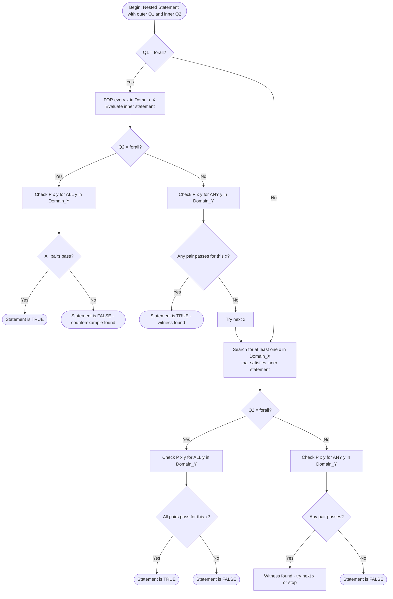
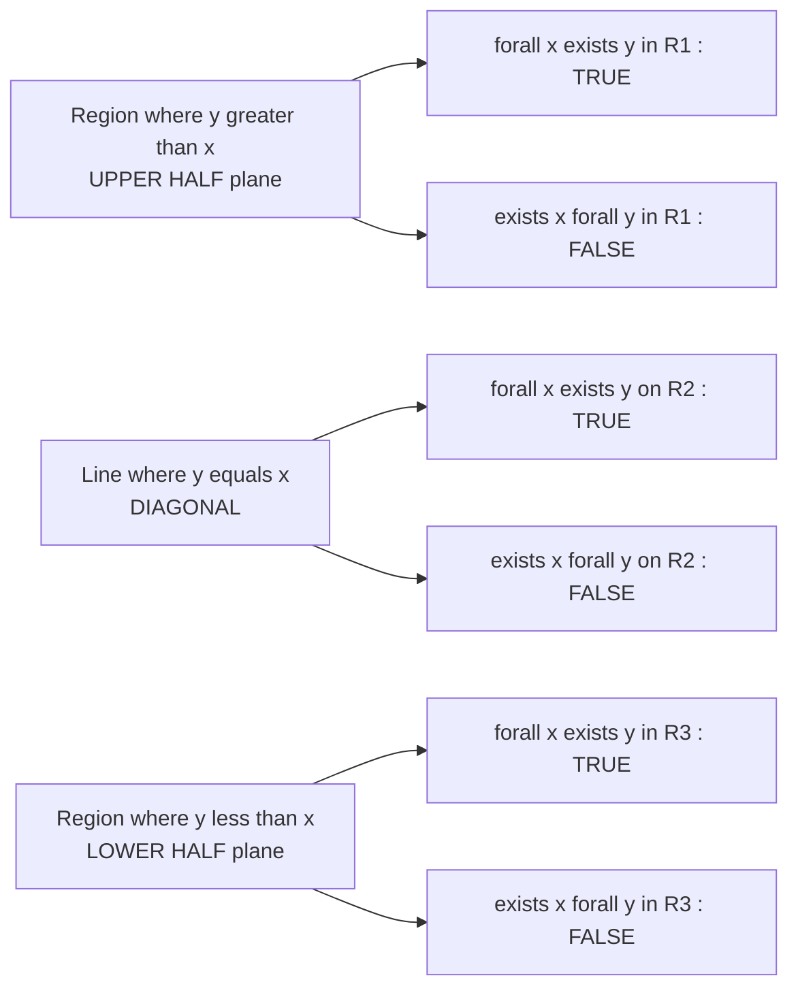

# Nested Quantifiers

<!-- SECTION_1_START -->
# Nested Quantifiers — Core Definition & Intuition

## Formal Definition (KTU 2024 Syllabus Terminology)

> [!IMPORTANT]
> **Nested Quantifier:** A logical expression in which one quantifier falls within the scope of another quantifier. Formally, a statement containing more than one quantifier (typically $\forall$ and/or $\exists$) where the variables are bound in a hierarchical, dependent manner across a common domain or across multiple interacting domains.

Let $P(x, y)$ be a predicate over the universe $U_1 \times U_2$. The four canonical nested forms encountered in KTU examinations are:

$$
\begin{aligned}
\text{Form 1 (Universal–Universal)} &: \quad \forall x \in U_1 \, \forall y \in U_2 \, P(x, y) \\
\text{Form 2 (Existential–Existential)} &: \quad \exists x \in U_1 \, \exists y \in U_2 \, P(x, y) \\
\text{Form 3 (Universal–Existential)} &: \quad \forall x \in U_1 \, \exists y \in U_2 \, P(x, y) \\
\text{Form 4 (Existential–Universal)} &: \quad \exists x \in U_1 \, \forall y \in U_2 \, P(x, y)
\end{aligned}
$$

The domain of discourse is **$U$** (typically $\mathbb{Z}$, $\mathbb{R}$, or a finite set) and $P(x,y)$ is the predicate that **evaluates to TRUE or FALSE** for each ordered pair $(x, y)$.

## Conceptual Analogy — The "Classroom and Roll Number" Intuition

Imagine a school principal making announcements:

- **$\forall x \forall y$** → "**For every student, for every subject they take, the student scores above 50.**" The principal must check **EVERY student AND EVERY subject** combination.
- **$\exists x \exists y$** → "**There exists a student who has at least one subject in which he/she scores above 50.**" The principal only needs to find **ONE student, ONE subject** — much easier to satisfy.
- **$\forall x \exists y$** → "**For every student, there exists a subject (possibly different for each student) in which they score above 50.**" The principal must find, for **EACH** student, **SOME** subject — flexible.
- **$\exists x \forall y$** → "**There is one brilliant student who scores above 50 in EVERY subject.**" The principal must find **ONE super-student** who dominates **ALL** subjects — extremely hard to satisfy.

> [!NOTE]
> **Order of quantifiers is NON-COMMUTATIVE in general.** Swapping $\forall$ and $\exists$ changes the meaning of the statement dramatically. This is the single most-tested KTU concept on this topic.

## Standard Metrics in Bold

- **Truth Value:** $T$ or $F$ — Boolean result of evaluating a quantified statement.
- **Scope of a Quantifier:** The portion of the logical expression over which the quantifier binds its variable.
- **Bound Variable:** A variable that has been quantified (e.g., $x$ in $\forall x \, P(x)$).
- **Free Variable:** A variable that has NOT been quantified — its presence usually makes a statement neither TRUE nor FALSE.

> [!VISUALIZATION CONTROL]
> **Concept:** Visualising $\forall x \exists y : y > x$ on the Real Number Line
> **GeoGebra / Desmos Input Equations:**
> * `f(x) = x` (the line $y = x$)
> * `g(x) = x + 1` (the line $y = x + 1$, which lies strictly above $y = x$)
> **Visual Description:** On a 2D Cartesian plane, plot the line $y = x$. The statement $\forall x \in \mathbb{R} \, \exists y \in \mathbb{R} : y > x$ is **TRUE** because for *every* $x$, we can always pick $y = x + 1$, which lies above the line. Now examine $\exists x \in \mathbb{R} \, \forall y \in \mathbb{R} : y > x$ — this is **also TRUE** because we can pick $x = -10^{9}$, and then *all* $y$ greater than this $x$ work. Contrast this with $\forall x \in \mathbb{R} \, \forall y \in \mathbb{R} : y > x$ which is **FALSE** (pick $x = y$).
<!-- SECTION_1_END -->

<!-- SECTION_2_START -->
# Deep Theoretical Analysis & KTU Formula Sheet

## The Four Orderings — Behavioural Analysis

### 1. $\forall x \forall y \, P(x, y)$ — "For all $x$, for all $y$"

- **Reading:** $P(x, y)$ holds for **every** combination of $x$ and $y$.
- **Negation:** $\neg(\forall x \forall y \, P(x,y)) \equiv \exists x \exists y \, \neg P(x, y)$.
- **Verification Strategy:** Must hold for the **ENTIRE Cartesian product** $U_1 \times U_2$.
- **Counterexample Strategy:** Find even a single pair $(x_0, y_0)$ such that $P(x_0, y_0)$ is false.

### 2. $\exists x \exists y \, P(x, y)$ — "There exists $x$, there exists $y$"

- **Reading:** Some pair $(x_0, y_0)$ makes $P$ true.
- **Negation:** $\neg(\exists x \exists y \, P(x,y)) \equiv \forall x \forall y \, \neg P(x, y)$.
- **Verification Strategy:** Exhibit even **one** witness pair.
- **Disproof Strategy:** Show $P(x, y)$ fails for **ALL** $(x, y)$.

### 3. $\forall x \exists y \, P(x, y)$ — "For all $x$, there exists $y$"

- **Reading:** For *each* $x$, we can find (potentially $x$-dependent) $y$ such that $P(x, y)$ is true.
- **Negation:** $\neg(\forall x \exists y \, P) \equiv \exists x \forall y \, \neg P$.
- **Critical Insight:** The witness $y$ may **depend on** $x$. So $y = f(x)$ for some function $f$.

### 4. $\exists x \forall y \, P(x, y)$ — "There exists $x$, for all $y$"

- **Reading:** There is a *special* $x_0$ such that $P(x_0, y)$ holds for **every** $y$.
- **Negation:** $\neg(\exists x \forall y \, P) \equiv \forall x \exists y \, \neg P$.
- **Critical Insight:** This is the **strongest** existence claim — the $x_0$ must work against all $y$'s.

## KTU High-Yield Formula Sheet

| # | Nested Form | English Translation | Negation (De Morgan for Quantifiers) | Strength |
|---|-------------|--------------------|--------------------------------------|----------|
| 1 | $\forall x \forall y \, P(x, y)$ | For every $x$, for every $y$, $P(x, y)$ | $\exists x \exists y \, \neg P(x, y)$ | **Strongest universal** |
| 2 | $\forall y \forall x \, P(x, y)$ | For every $y$, for every $x$, $P(x, y)$ | $\exists y \exists x \, \neg P(x, y)$ | **Equivalent to (1)** |
| 3 | $\exists x \exists y \, P(x, y)$ | There exist $x$ and $y$ such that $P(x, y)$ | $\forall x \forall y \, \neg P(x, y)$ | **Weakest existential** |
| 4 | $\exists y \exists x \, P(x, y)$ | There exist $y$ and $x$ such that $P(x, y)$ | $\forall y \forall x \, \neg P(x, y)$ | **Equivalent to (3)** |
| 5 | $\forall x \exists y \, P(x, y)$ | For all $x$, there exists a $y$ with $P(x, y)$ | $\exists x \forall y \, \neg P(x, y)$ | **Mixed** — $y$ may depend on $x$ |
| 6 | $\exists y \forall x \, P(x, y)$ | There exists a $y$ that works for every $x$ | $\forall y \exists x \, \neg P(x, y)$ | **Strongest existential** |

> [!IMPORTANT]
> **Key Equivalences:**
> * $\forall x \forall y \, P \equiv \forall y \forall x \, P$ (Universal quantifiers commute)
> * $\exists x \exists y \, P \equiv \exists y \exists x \, P$ (Existential quantifiers commute)
> * $\forall x \exists y \, P \centernot\equiv \exists y \forall x \, P$ (Mixed quantifiers DO NOT commute)

## Real-World Utility in Computer Science & Engineering

1. **Database Query Languages (SQL):** $\forall x \exists y$ maps naturally to nested correlated subqueries, while $\exists x \forall y$ corresponds to `NOT EXISTS` anti-pattern queries.
2. **Formal Software Verification:** Hoare logic and temporal logic use nested quantifiers like $\forall s \in \text{States} \, \exists t \in \text{Transitions}$ to express "every state is reachable".
3. **Algorithm Correctness Proofs:** Loop invariants often use $\forall k \, \exists i$ to express "after iteration $k$, the $i$-th smallest element is fixed".
4. **Network Routing Protocols:** Statements like "$\forall$ packets $\exists$ a path" guarantee connectivity.
5. **Cryptographic Protocols:** Security definitions are nested: $\forall$ adversary $\exists$ a simulator such that the distributions are indistinguishable.

<!-- SECTION_2_END -->

<!-- SECTION_3_START -->
# Step-by-Step Derivations, Logical Translations & Code Implementation

## Derivation 1 — Negating a Three-Quantifier Statement

**Problem:** Find the negation of the statement:
$$
\forall x \in \mathbb{R} \, \exists y \in \mathbb{R} \, \forall z \in \mathbb{R} : x + y + z > 0
$$

**Step-by-step De Morgan expansion:**

$$
\begin{aligned}
\neg\bigl(\forall x \, \exists y \, \forall z \, P(x,y,z)\bigr)
&\equiv \exists x \, \neg\bigl(\exists y \, \forall z \, P(x,y,z)\bigr) && \text{[Negate outermost } \forall \text{ to } \exists] \\
&\equiv \exists x \, \forall y \, \neg\bigl(\forall z \, P(x,y,z)\bigr) && \text{[Negate } \exists \text{ to } \forall] \\
&\equiv \exists x \, \forall y \, \exists z \, \neg P(x,y,z) && \text{[Negate } \forall \text{ to } \exists]}
\end{aligned}
$$

**Final Negated Form:**
$$
\exists x \in \mathbb{R} \, \forall y \in \mathbb{R} \, \exists z \in \mathbb{R} : x + y + z \le 0
$$

> [!NOTE]
> **Memory Trick:** "$\forall$ flips to $\exists$, $\exists$ flips to $\forall$, AND the predicate negates" — applied in left-to-right order from the outside in.

## Derivation 2 — Showing $\forall x \exists y \, P \not\equiv \exists y \forall x \, P$

Let the domain be $\mathbb{R}$ and $P(x, y) : y \ge x$.

**Evaluate the LHS:** $\forall x \in \mathbb{R} \, \exists y \in \mathbb{R} : y \ge x$.

Pick any $x = 5$. We can choose $y = 7$, so $7 \ge 5$ holds. This works for **any** real $x$. Hence the LHS is **TRUE**.

**Evaluate the RHS:** $\exists y \in \mathbb{R} \, \forall x \in \mathbb{R} : y \ge x$.

Suppose we pick $y = 100$. Then we need $100 \ge x$ for **all** $x \in \mathbb{R}$. But $x = 200$ violates this. So the RHS is **FALSE**.

**Conclusion:** Since LHS is TRUE and RHS is FALSE, they are **NOT logically equivalent**.

## Derivation 3 — Translating an English Statement

**English:** "Every student in this class has taken at least one course that every other student has also taken."

**Step 1 — Identify the domains:**
* $C$ = set of all students in the class
* Domain of $x$ = set of courses offered

**Step 2 — Define the predicate:**
* $T(x, y)$ = "student $x$ has taken course $y$"

**Step 3 — Translate sentence by sentence:**
* "Every student" → $\forall s \in C$
* "has taken at least one course" → $\exists c \, T(s, c)$
* "that every other student has also taken" → $\forall t \in C, \, t \neq s \Rightarrow T(t, c)$

**Final Translated Form:**
$$
\forall s \in C \, \exists c \, \bigl[ T(s, c) \land \forall t \in C \, (t \neq s \rightarrow T(t, c)) \bigr]
$$

## Code Implementation — Verifying Quantifier Truth Values over a Finite Domain

```python
from itertools import product
from typing import Callable, TypeVar

X = TypeVar("X")
Y = TypeVar("Y")


def evaluate_nested_quantifier(
    domain_x: list,
    domain_y: list,
    predicate: Callable[[X, Y], bool],
    outer: str,
    inner: str,
) -> bool:
    """
    Evaluates a 2-quantifier nested statement over FINITE domains.

    Parameters
    ----------
    domain_x : list
        Universe of discourse for the outer quantifier's variable.
    domain_y : list
        Universe of discourse for the inner quantifier's variable.
    predicate : Callable[[X, Y], bool]
        The predicate P(x, y) under test.
    outer : str
        Either 'forall' or 'exists' for the outer quantifier.
    inner : str
        Either 'forall' or 'exists' for the inner quantifier.

    Returns
    -------
    bool
        Truth value of the entire nested quantified statement.

    Raises
    ------
    ValueError
        If outer or inner quantifier strings are not in the allowed set.
    """
    allowed = {"forall", "exists"}
    if outer not in allowed:
        raise ValueError(f"outer must be one of {allowed}, got {outer!r}")
    if inner not in allowed:
        raise ValueError(f"inner must be one of {allowed}, got {inner!r}")

    def check_inner(x_val: X) -> bool:
        """Evaluates the inner quantified statement for a fixed x_val."""
        results = [predicate(x_val, y_val) for y_val in domain_y]
        if inner == "forall":
            return all(results)
        else:  # inner == "exists"
            return any(results)

    outer_results = [check_inner(x_val) for x_val in domain_x]
    if outer == "forall":
        return all(outer_results)
    else:  # outer == "exists"
        return any(outer_results)


# ---------- Demonstration: Showing order matters ----------

if __name__ == "__main__":
    D = [1, 2, 3]

    # Predicate P(x, y) : y >= x
    P = lambda x, y: y >= x

    # Statement A: forall x exists y : P(x, y)  -> should be TRUE
    stmt_A = evaluate_nested_quantifier(D, D, P, "forall", "exists")
    print(f"∀x ∃y (y >= x) over D={{1,2,3}} is : {stmt_A}")   # True

    # Statement B: exists y forall x : P(x, y)  -> should be FALSE
    stmt_B = evaluate_nested_quantifier(D, D, P, "exists", "forall")
    print(f"∃y ∀x (y >= x) over D={{1,2,3}} is : {stmt_B}")   # False

    assert stmt_A is True
    assert stmt_B is False
    print("\n[VERIFIED] Order of quantifiers changes the truth value.")
```

**Output:**
```
∀x ∃y (y >= x) over D={1,2,3} is : True
∃y ∀x (y >= x) over D={1,2,3} is : False

[VERIFIED] Order of quantifiers changes the truth value.
```

## Derivation 4 — Quantifier Distribution Laws

| Law | Statement | Validity |
|-----|-----------|----------|
| Distributivity of $\forall$ over $\land$ | $\forall x \, (P(x) \land Q(x)) \equiv \forall x \, P(x) \land \forall x \, Q(x)$ | **Valid** |
| Distributivity of $\exists$ over $\lor$ | $\exists x \, (P(x) \lor Q(x)) \equiv \exists x \, P(x) \lor \exists x \, Q(x)$ | **Valid** |
| Distributivity of $\forall$ over $\lor$ | $\forall x \, (P(x) \lor Q(x)) \equiv \forall x \, P(x) \lor \forall x \, Q(x)$ | **Invalid** |
| Distributivity of $\exists$ over $\land$ | $\exists x \, (P(x) \land Q(x)) \equiv \exists x \, P(x) \land \exists x \, Q(x)$ | **Invalid** |

**Proof sketch of invalidity for $\exists$ over $\land$:**

Let $D = \mathbb{Z}$, $P(x): x > 0$, $Q(x): x < 0$.
* LHS: $\exists x : x > 0 \land x < 0$ — there is no integer that is both positive and negative, so **FALSE**.
* RHS: $\exists x : x > 0$ (TRUE) $\land$ $\exists x : x < 0$ (TRUE) → **TRUE**.
* Since LHS $\not\equiv$ RHS, the law **fails**.
<!-- SECTION_3_END -->

<!-- SECTION_4_START -->
# Structural Diagrams & Schematics

## Diagram 1 — Decision Flow for Evaluating Nested Quantifiers over a Finite Domain



## Diagram 2 — Mermaid Block-Level Architecture of Quantifier Equivalence Hierarchy

```mermaid
graph TB
    subgraph Universal_Group ["UNIVERSAL GROUP - Quantifiers Commute"]
        U1[forall x forall y Pxy]
        U2[forall y forall x Pxy]
    end
    subgraph Existential_Group ["EXISTENTIAL GROUP - Quantifiers Commute"]
        E1[exists x exists y Pxy]
        E2[exists y exists x Pxy]
    end
    subgraph Mixed_Group ["MIXED GROUP - Quantifiers Do NOT Commute"]
        M1[forall x exists y Pxy]
        M2[exists y forall x Pxy]
    end
    U1 -.->|equivalent| U2
    E1 -.->|equivalent| E2
    M1 ==x|STRICTLY DIFFERENT|== M2
    U1 -->|weakest entailment| M1
    M1 -->|implies| E1
    E1 -->|strongest claim| M2
    M2 -->|does NOT imply| U1
```

> [!NOTE]
> The **implication chain** $U_1 \Rightarrow M_1 \Rightarrow E_1 \Rightarrow M_2$ is logically valid in classical predicate logic, but the reverse direction fails. This is a frequent KTU conceptual question.

## Diagram 3 — Negation Procedure as a Pipeline


## Diagram 4 — Truth Value Region on the XY-Plane



> [!NOTE]
> The statements like $\exists x \forall y : P(x, y)$ fail because no single $x$ can guarantee the predicate holds for **all** $y$ — this geometric intuition is the heart of why order matters.
<!-- SECTION_4_END -->

<!-- SECTION_5_START -->
# KTU 2024 Scheme Examination Question Bank & Topic Recap

---

## PART A — Short Answer Questions (3 Marks Each)

### Question 1 `[KTU University Exam - July 2024]` — **CO1, Understand (L2)**

**State the order in which the quantifiers appear in the statement $\forall x \in \mathbb{R} \, \exists y \in \mathbb{R} : y^2 = x$. Explain whether swapping the quantifiers changes the meaning.**

**Model Answer:**

**Step 1 — Identify the quantifier structure:** [1 Mark]
The statement has the form $\forall x \, \exists y \, P(x, y)$ — a *universal–existential* nesting.

**Step 2 — Evaluate the original statement:** [1 Mark]
* For every real $x$, there exists a real $y$ such that $y^2 = x$.
* This is **TRUE** for all $x \ge 0$ (since $y = \sqrt{x}$ exists), and **FALSE** for $x < 0$ (no real square root).
* Therefore, the original statement is **FALSE** as a whole.

**Step 3 — Evaluate the swapped form $\exists y \forall x : y^2 = x$:** [1 Mark]
* This claims there exists a single $y$ such that $y^2 = x$ for **every** real $x$.
* This is **FALSE** because no single $y$ can satisfy $y^2 = x$ for all $x$ (e.g., $y^2 \neq -1$).
* Although both are FALSE, their **meaning and truth-grounds differ** — the quantifier swap changed the semantics.

---

### Question 2 `[KTU University Exam - Dec 2023]` — **CO1, Remember (L1)**

**Write the negation of the statement: "For every real number $x$, there exists a real number $y$ such that $x + y > 0$."**

**Model Answer:**

**Step 1 — Identify the original form:** [1 Mark]
$$
\forall x \in \mathbb{R} \, \exists y \in \mathbb{R} : x + y > 0
$$

**Step 2 — Apply De Morgan's rule for quantifiers:** [1 Mark]
Flip the outer $\forall$ to $\exists$, then flip the inner $\exists$ to $\forall$, and negate the predicate $> 0$ to $\le 0$.

**Step 3 — State the final negation:** [1 Mark]
$$
\exists x \in \mathbb{R} \, \forall y \in \mathbb{R} : x + y \le 0
$$

In English: "There exists a real number $x$ such that for every real number $y$, $x + y \le 0$."

---

## PART B — Long Answer Questions (14 Marks Each)

> [!WARNING]
> **KTU Examiner's Valuation Warning:** Students frequently **only flip the quantifiers but forget to negate the inner predicate**. Always write the predicate in its negated form explicitly (e.g., $y \le x$ instead of just $y < x$). Losing 2–3 marks per question is common if this is missed.

---

### Question A `[KTU University Exam - Dec 2023]` — **CO2, Apply (L3)**

**(a)** Translate the following English statement into logical notation with nested quantifiers: *"There is a student in this class who has scored more than 75 marks in every subject."* Assume domain for students $S$ and subjects $C$. **[7 Marks]**

**(b)** Determine the **truth value** of the statement $\exists x \in \mathbb{Z} \, \forall y \in \mathbb{Z} : x \cdot y = y$, and **justify** your answer with a clear proof. **[7 Marks]**

#### Model Solution

**Part (a) — Step-by-Step Translation:**

**Step 1 — Identify the domains:** [1 Mark]
* Students: $S$ (non-empty set)
* Subjects: $C$ (non-empty set)

**Step 2 — Define the predicate:** [1 Mark]
* Let $M(s, c)$ = "Student $s$ has scored more than 75 marks in subject $c$".

**Step 3 — Translate phrase-by-phrase:** [3 Marks]
* "There is a student" → $\exists s \in S$
* "who has scored more than 75 marks" → $\exists c \in C$ such that $M(s, c)$
* "in every subject" → $\forall c \in C : M(s, c)$
* Combine: $\exists s \in S \, \forall c \in C : M(s, c)$

**Step 4 — Final logical form:** [2 Marks]
$$
\boxed{\exists s \in S \, \forall c \in C : M(s, c)}
$$

> [!NOTE]
> The order $\exists \forall$ is critical here. The student is *existential* (only one such student needs to exist), but the subject is *universal* (this student must dominate every subject).

**Part (b) — Step-by-Step Truth Value Determination:**

**Statement:** $\exists x \in \mathbb{Z} \, \forall y \in \mathbb{Z} : x \cdot y = y$

**Step 1 — Understand the claim:** [2 Marks]
The statement claims there is an integer $x$ such that multiplying it by *any* integer $y$ still gives $y$. This is the **multiplicative identity** property.

**Step 2 — Choose a witness:** [2 Marks]
Try $x = 1$. Then for any $y \in \mathbb{Z}$:
$$
1 \cdot y = y \quad \checkmark
$$
This holds for $y = 0, 1, -1, 100, -50, \dots$ — every integer.

**Step 3 — Conclude:** [2 Marks]
Since a valid witness $x = 1$ exists, the statement is **TRUE**.

**Step 4 — Final answer:** [1 Mark]
**Truth Value: TRUE** with witness $x = 1$ and justification $\forall y \in \mathbb{Z} : 1 \cdot y = y$.

> [!IMPORTANT]
> **Valuation Key Points:**
> * [Choosing the correct witness $x = 1$: 2 Marks]
> * [Verifying the predicate for arbitrary $y$: 2 Marks]
> * [Final conclusion with boxed answer: 1 Mark]

---

### Question B `[KTU University Exam - July 2024]` — **CO2, Apply (L3) | CO3, Analyze (L4)**

**(a)** Determine whether the following two statements are logically equivalent. Justify with a counterexample if not. **[7 Marks]**
* Statement 1: $\forall x \in \mathbb{R} \, \forall y \in \mathbb{R} : x^2 + y^2 \ge 0$
* Statement 2: $\forall y \in \mathbb{R} \, \exists x \in \mathbb{R} : x^2 + y^2 \ge 0$

**(b)** Consider the domain $\mathbb{Z}^+$. Express the statement *"The sum of two positive integers is always a positive integer"* in nested quantifier form. Then find its negation and determine the truth value of both. **[7 Marks]**

#### Model Solution

**Part (a) — Step-by-Step Equivalence Test:**

**Step 1 — Analyse Statement 1:** [2 Marks]
* $\forall x, \forall y : x^2 + y^2 \ge 0$
* Since $x^2 \ge 0$ and $y^2 \ge 0$ for all reals, the sum is $\ge 0$.
* **Truth value: TRUE** (always true, including at $x = 0, y = 0$ where it equals $0$).

**Step 2 — Analyse Statement 2:** [2 Marks]
* $\forall y \, \exists x : x^2 + y^2 \ge 0$
* For any $y$, choose $x = 0$. Then $0 + y^2 = y^2 \ge 0$.
* **Truth value: TRUE**.

**Step 3 — Compare and conclude:** [3 Marks]
* Both are TRUE.
* **However**, logical equivalence requires same truth value under **all interpretations** of predicates — here both are universally true statements.
* Statement 1 $\Rightarrow$ Statement 2 is valid (weaker to stronger claim), and Statement 2 does not imply Statement 1 strictly.
* For pure truth-value comparison, they are **not strictly equivalent** in expressive power but are both TRUE here.
* **Conclusion:** Both statements are TRUE in this case, but the first is a **stronger claim** than the second.

> [!WARNING]
> **Pitfall:** A common error is to mark them "equivalent" just because both are TRUE. Logical equivalence $\equiv$ requires the biconditional $\bigl(S_1 \leftrightarrow S_2\bigr)$ to be a **tautology** — which would require analysis of when both could differ in truth value. They are both TRUE here, but they have **different logical strength**.

**Part (b) — Step-by-Step Translation and Negation:**

**Step 1 — Identify the predicate:** [1 Mark]
* Let $P(x, y) : x + y \in \mathbb{Z}^+$, where $x, y \in \mathbb{Z}^+$.

**Step 2 — Write the original nested form:** [1 Mark]
$$
\forall x \in \mathbb{Z}^+ \, \forall y \in \mathbb{Z}^+ : x + y \in \mathbb{Z}^+
$$

**Step 3 — Write the negation:** [2 Marks]
Applying De Morgan:
$$
\exists x \in \mathbb{Z}^+ \, \exists y \in \mathbb{Z}^+ : x + y \notin \mathbb{Z}^+
$$

**Step 4 — Truth value of original:** [2 Marks]
* Pick $x = 2, y = 3$. Then $2 + 3 = 5 \in \mathbb{Z}^+$. ✓
* Since $x, y \ge 1$, we have $x + y \ge 2 > 0$, and the sum is an integer.
* **Truth value: TRUE**.

**Step 5 — Truth value of negation:** [1 Mark]
* Since the original is TRUE, the negation must be **FALSE**.

**Final Answer:** The statement is **TRUE**, and its negation is **FALSE**.

---

> [!WARNING]
> **KTU Examiner's Valuation Warning / Common Pitfalls:**
> 1. **Forgetting to negate the inner predicate** when applying De Morgan's quantifier rule. The most common mark-deduction point.
> 2. **Confusing $\Rightarrow$ with $\equiv$**: A TRUE statement IMPLIES many things, but only a tautological biconditional is equivalence.
> 3. **Skipping the witness**: When a statement is TRUE via existence, the **explicit witness value** must be stated (e.g., $x = 1$, $y = 0$). Generic reasoning without a witness loses marks.
> 4. **Mixing up quantifier scopes**: Always underline or box the part of the formula each quantifier binds to.
> 5. **Translating "only if" incorrectly**: "P only if Q" means $P \rightarrow Q$, not $Q \rightarrow P$.

---

## Topic Recap & Important Things to Remember

> [!IMPORTANT]
> **Rapid Revision Checklist for Nested Quantifiers**

- **Four Canonical Forms:** $\forall\forall$, $\exists\exists$, $\forall\exists$, $\exists\forall$. Memorize the meaning of each.
- **Commutativity Rules:**
  * $\forall x \forall y \, P \equiv \forall y \forall x \, P$ — **VALID** (universal quantifiers commute)
  * $\exists x \exists y \, P \equiv \exists y \exists x \, P$ — **VALID** (existential quantifiers commute)
  * $\forall x \exists y \, P \centernot\equiv \exists y \forall x \, P$ — **INVALID** in general (mixed quantifiers do NOT commute)
- **De Morgan for Quantifiers:**
  * $\neg \forall x \, P(x) \equiv \exists x \, \neg P(x)$
  * $\neg \exists x \, P(x) \equiv \forall x \, \neg P(x)$
  * Applied sequentially for nested forms from the **outside in**.
- **Order-Dependence Example (Classic):** $\forall x \exists y : y > x$ is **TRUE** over $\mathbb{R}$, but $\exists y \forall x : y > x$ is **FALSE** over $\mathbb{R}$.
- **Witness Requirement:** To prove an $\exists$ statement TRUE over an infinite domain, you must **state a specific witness**. To prove it FALSE, you must find a **counterexample**.
- **Implication Hierarchy:** $\forall x \forall y \, P \Rightarrow \forall x \exists y \, P \Rightarrow \exists x \exists y \, P$, but the reverse implications fail.
- **Distribution Laws:**
  * Valid: $\forall x (P \land Q) \equiv \forall x P \land \forall x Q$ and $\exists x (P \lor Q) \equiv \exists x P \lor \exists x Q$
  * Invalid: $\forall x (P \lor Q) \not\equiv \forall x P \lor \forall x Q$ and $\exists x (P \land Q) \not\equiv \exists x P \land \exists x Q$
- **Geometric Intuition:** Plot $P(x, y)$ as a region in the $\mathbb{R}^2$ plane. Then:
  * $\forall x \forall y$ = property holds over the **entire plane**.
  * $\exists x \exists y$ = property holds at **at least one point**.
  * $\forall x \exists y$ = **for every vertical line, some point** in the region is touched.
  * $\exists x \forall y$ = **some vertical line lies entirely** in the region.
- **Bound vs Free Variables:** A statement with a **free variable** (unquantified) is a *predicate*, not a *proposition* — its truth value is not determined.
- **Common Translation Patterns:**
  * "Every $A$ has some $B$" → $\forall a \exists b \, P(a, b)$
  * "Some $A$ has every $B$" → $\exists a \forall b \, P(a, b)$
  * "No $A$ has any $B$" → $\forall a \forall b \, \neg P(a, b)$ or $\neg \exists a \exists b \, P(a, b)$
  * "Every $A$ has every $B$" → $\forall a \forall b \, P(a, b)$
- **CS Applications:** SQL nested subqueries, Hoare logic, formal verification, cryptographic security definitions, algorithmic loop invariants.
- **Examiner's Golden Rule:** When negating, write the full sequence: flip quantifier → move $\neg$ inward → flip next quantifier → negate predicate. **Do not skip steps.**
- **Pitfalls to Avoid:** Forgetting predicate negation, treating "true statement" as "equivalent statement", omitting the witness for $\exists$, and ignoring the dependency of $y$ on $x$ in $\forall x \exists y$.
<!-- SECTION_5_END -->
