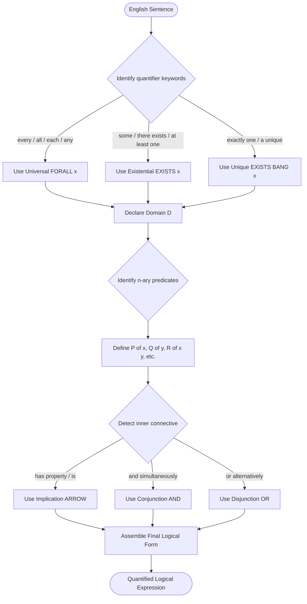
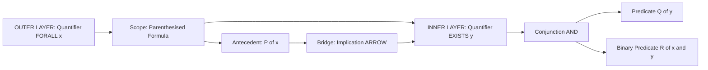
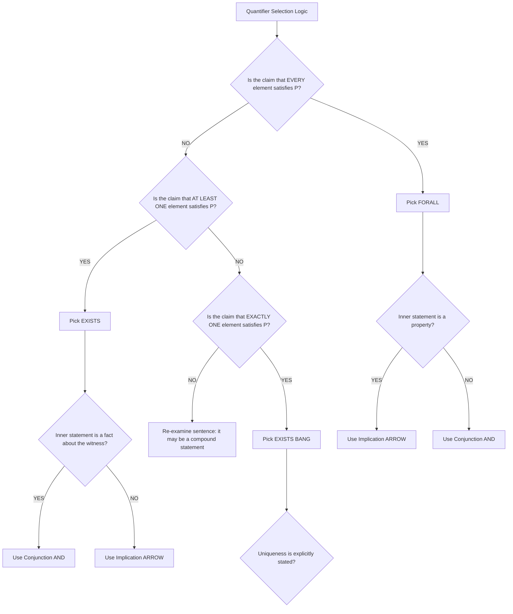

# Predicates & Quantifiers: existential and universal quantifiers, binding variables, translating natural language

<!-- SECTION_1_START -->
# 1. Predicates & Quantifiers — Core Foundations

## 1.1 Formal Academic Definition

A **propositional function** (or **predicate**) is a declarative statement $P(x_1, x_2, \dots, x_n)$ containing $n$ variables that becomes a **proposition** (a statement with a definite truth value of True or False) only when specific values are substituted from a well-defined non-empty set $D$, known as the **domain of discourse** (or **universe of discourse**).

Formally, an $n$-ary predicate is a function:

$$P : D^n \rightarrow \{T, F\}$$

A **quantifier** is a logical operator placed before a predicate to indicate *how many* elements of the domain must satisfy the predicate, transforming an open sentence into a closed (propositional) statement.

> [!IMPORTANT]
> **KTU Syllabus Highlight — PCCST205 / Module 2**
> The two principal quantifiers you must master for the End Semester Examination (ESE) are:
> 1. **Universal Quantifier** $\forall x$ — read *"for all $x$"* / *"for every $x$"*
> 2. **Existential Quantifier** $\exists x$ — read *"there exists an $x$"* / *"for some $x$"*
> 3. **Unique Existential Quantifier** $\exists ! x$ — read *"there exists a unique $x$"*

---

## 1.2 Conceptual Analogy — "The Database Filter" Intuition

Imagine a **SQL database table** containing thousands of student records. The expression `WHERE GPA > 8.5` is essentially a **predicate** $P(x)$ that evaluates row-by-row. The quantifier tells you **how to run the scan**:

| Quantifier | Database Mental Model | Plain English |
| :--- | :--- | :--- |
| $\forall x\, P(x)$ | `SELECT COUNT(*) WHERE NOT P(x) = 0` | *Every single row must pass the filter* |
| $\exists x\, P(x)$ | `SELECT LIMIT 1 WHERE P(x) = TRUE` | *Find at least one row that passes* |
| $\exists ! x\, P(x)$ | `SELECT COUNT(*) WHERE P(x) = 1` | *Exactly one row passes* |

**Geometric Intuition:** Picture the domain $D$ as a large circle on a piece of paper, and the set $S = \{x \in D \mid P(x)\}$ as a smaller shaded region inside it.

* The shaded region **equals** the whole circle $\Rightarrow \forall x\, P(x)$ is **True**.
* The shaded region is **non-empty** (has at least one dot) $\Rightarrow \exists x\, P(x)$ is **True**.

> [!NOTE]
> **Critical Distinction:** A **predicate is not a proposition** (its truth value is unknown until variables are bound). A **quantified statement *is* a proposition** (it has a definite truth value).

---

## 1.3 Domain of Discourse — The "Universe" Parameter

The truth of $\forall x\, P(x)$ and $\exists x\, P(x)$ depends *entirely* on the declared domain $D$.

**Example:** Let $P(x)$ be "$x^2 = 4$".

* If $D = \mathbb{R}$: $\exists x\, P(x)$ is **True** ($x = 2$).
* If $D = \mathbb{Z}^-$ (negative integers): $\exists x\, P(x)$ is **False**.
* If $D = \{2\}$: $\forall x\, P(x)$ is **True**.

> [!VISUALIZATION CONTROL]
> **Concept:** Venn-Diagrammatic Visualization of Quantifier Truth
> **GeoGebra / Desmos Input (Plot Region using Inequality Tool):**
> * Outer domain disk: $x^2 + y^2 \le 9$ (Domain $D$)
> * Predicate sub-region: $(x-1)^2 + y^2 \le 2$ (Set where $P(x)$ holds)
> **Visual Description:** You will observe two overlapping circles. The smaller (predicate) circle lies *inside* the larger (domain) circle. When the two regions coincide perfectly, the universal quantifier $\forall x\, P(x)$ becomes true. When the inner region has any visible area at all, the existential quantifier $\exists x\, P(x)$ becomes true. If you erase the inner region completely, $\exists x\, P(x)$ becomes false (no element of the domain satisfies the predicate).
<!-- SECTION_1_END -->

<!-- SECTION_2_START -->
# 2. Deep Theoretical Analysis & KTU High-Yield Formula Sheet

## 2.1 Anatomy of a Quantified Statement

A fully-quantified statement has three structural components:

$$\underbrace{\forall x}_{\text{Quantifier}} \;\; \underbrace{P(x)}_{\text{Predicate / Scope}} \quad \text{or} \quad \underbrace{\exists x}_{\text{Quantifier}} \;\; \underbrace{P(x)}_{\text{Predicate / Scope}}$$

When multiple variables exist, the **scope** of a quantifier is the *entire formula that follows it* (up to the matching parenthesis, comma, or end of statement). Variables falling inside this scope are said to be **bound**; variables outside are **free**.

## 2.2 The Three Quantifiers — Truth Conditions

Let $D = \{d_1, d_2, d_3, \dots, d_n\}$ be a non-empty finite or infinite domain.

**Statement A:** $\forall x \in D,\; P(x)$ is **True** if and only if $P(d_i)$ is True for **every** $d_i \in D$.

$$\forall x\, P(x) \;\equiv\; P(d_1) \wedge P(d_2) \wedge P(d_3) \wedge \cdots$$

**Statement B:** $\exists x \in D,\; P(x)$ is **True** if and only if $P(d_i)$ is True for **at least one** $d_i \in D$.

$$\exists x\, P(x) \;\equiv\; P(d_1) \vee P(d_2) \vee P(d_3) \vee \cdots$$

**Statement C:** $\exists ! x \in D,\; P(x)$ is **True** if and only if exactly one $d_i \in D$ makes $P(d_i)$ True.

> [!IMPORTANT]
> **Vacuous Truth Principle (KTU Favorite):** If the domain $D$ is the **empty set** $\emptyset$, then $\forall x\, P(x)$ is **vacuously True**, while $\exists x\, P(x)$ is **False**. This is a classic 2-mark short-answer question.

## 2.3 Binding Variables — Bound vs Free

A variable occurrence is **bound** if it lies within the scope of a quantifier that names it; otherwise it is **free**. A statement containing any free variable is **not a proposition**.

| Expression | Bound Variables | Free Variables | Is it a Proposition? |
| :--- | :---: | :---: | :--- |
| $\forall x\, (P(x) \rightarrow Q(x))$ | $x$ | None | **Yes** |
| $\exists x\, P(x) \wedge Q(y)$ | $x$ | $y$ | **No** ($y$ is free) |
| $\forall x\, P(x) \wedge \forall x\, Q(x)$ | $x, x$ | None | **Yes** (two distinct $\forall$) |
| $\exists x\, (P(x) \wedge \forall y\, R(x,y))$ | $x, y$ | None | **Yes** (nested) |

## 2.4 Translation Lexicon — English to Logic

The following table is **the most tested artifact** in the KTU Discrete Mathematics ESE. Memorize the verb-to-operator mappings.

| English Phrase | Logical Operator | Reason |
| :--- | :--- | :--- |
| "Every", "All", "Each", "Any" | $\forall x$ | Range over the entire domain |
| "Some", "There exists", "At least one" | $\exists x$ | Asserts existence |
| "Exactly one" | $\exists ! x$ | Uniqueness |
| "Only" (in "Only $A$ are $B$") | $\forall x\, (B(x) \rightarrow A(x))$ | Reverses implication |
| "None" / "No" | $\forall x\, (A(x) \rightarrow \neg B(x))$ or $\neg \exists x\, (A(x) \wedge B(x))$ | Universal negative |
| "If … then …" (generic) | $\rightarrow$ | Conditional |
| "… and …" (within a quantifier) | $\wedge$ | Conjunction |
| "… or …" (within a quantifier) | $\vee$ | Disjunction |

> [!NOTE]
> **The Implication Rule (Examiner's Pet Topic):** When a universal quantifier says *"All $A$ are $B$"*, the correct formalization is $\forall x\, (A(x) \rightarrow B(x))$, **NOT** $\forall x\, (A(x) \wedge B(x))$. The latter would mean "every element is *both* $A$ and $B$", which is far stronger.

## 2.5 KTU High-Yield Formula Sheet (Cheat Table)

| \# | Law / Identity | Symbolic Form | Why It Matters |
| :--- | :--- | :--- | :--- |
| 1 | De Morgan for Quantifiers | $\neg \forall x\, P(x) \equiv \exists x\, \neg P(x)$ | Most-tested negation rule |
| 2 | De Morgan for Quantifiers | $\neg \exists x\, P(x) \equiv \forall x\, \neg P(x)$ | Symmetric counterpart |
| 3 | Universal Expansion | $\forall x\, P(x) \equiv \bigwedge_{d \in D} P(d)$ | Reduces to finite conjunction |
| 4 | Existential Expansion | $\exists x\, P(x) \equiv \bigvee_{d \in D} P(d)$ | Reduces to finite disjunction |
| 5 | Unique Existential Expansion | $\exists ! x\, P(x) \equiv \exists x\, (P(x) \wedge \forall y\, (P(y) \rightarrow y = x))$ | Formal definition of uniqueness |
| 6 | Quantifier Distribution over $\wedge$ | $\forall x\, (P(x) \wedge Q(x)) \equiv \forall x\, P(x) \wedge \forall x\, Q(x)$ | $\forall$ splits over AND |
| 7 | Quantifier Distribution over $\vee$ | $\exists x\, (P(x) \vee Q(x)) \equiv \exists x\, P(x) \vee \exists x\, Q(x)$ | $\exists$ splits over OR |
| 8 | Quantifier Commutativity (same type) | $\forall x \forall y\, P(x,y) \equiv \forall y \forall x\, P(x,y)$ | Order of *same* quantifier is irrelevant |
| 9 | Dual Negation | $\neg \neg \forall x\, P(x) \equiv \forall x\, P(x)$ | Double-negation |
| 10 | Vacuous Truth | $D = \emptyset \Rightarrow \forall x\, P(x) = T$ | Empty-domain convention |

> [!WARNING]
> Quantifiers do **NOT** distribute over *opposite* connectives without a negation in between. For example, $\forall x\, (P(x) \rightarrow Q(x))$ is **NOT** equivalent to $\forall x\, P(x) \rightarrow \forall x\, Q(x)$.

## 2.6 Real-World Engineering Utility

In **software engineering** and **computer science**, predicates with quantifiers are not mere abstract toys:

* **Formal Verification (Hardware/Software):** Tools like *SPIN*, *Coq*, and *Isabelle* use quantified predicates to express safety properties such as *"For all reachable states, no deadlock exists"* ($\forall s\, \text{Reachable}(s) \rightarrow \neg \text{Deadlock}(s)$).
* **Database Query Optimisation:** SQL's `WHERE` clauses are predicates; query planners determine whether to use universal-style scan or existential-style index seek.
* **Artificial Intelligence:** First-Order Logic (FOL) knowledge bases use $\forall$ and $\exists$ to express rules like *"Every human is mortal"* — the foundation of expert systems.
* **Cryptographic Protocols:** Security properties are universally quantified: *"For all adversaries, the secret remains hidden"*.
<!-- SECTION_2_END -->

<!-- SECTION_3_START -->
# 3. Step-by-Step Derivations, Translations & Code Implementation

## 3.1 Exhaustive Derivation: De Morgan's Laws for Quantifiers

We formally prove the identity $\neg \forall x\, P(x) \equiv \exists x\, \neg P(x)$.

**Derivation (using Universal Expansion on a finite domain $D = \{d_1, d_2, d_3\}$ for clarity):**

$$
\begin{aligned}
\neg \forall x\, P(x) &\equiv \neg \big( P(d_1) \wedge P(d_2) \wedge P(d_3) \big) && \text{[By Universal Expansion — Row 3 of Formula Sheet]} \\
&\equiv \neg P(d_1) \vee \neg P(d_2) \vee \neg P(d_3) && \text{[By Boolean De Morgan's Law]} \\
&\equiv \bigvee_{d_i \in D} \neg P(d_i) && \text{[Rewriting as a finite disjunction]} \\
&\equiv \exists x\, \neg P(x) && \text{[By Existential Expansion — Row 4 of Formula Sheet]}
\end{aligned}
$$

**Symmetric Derivation for $\neg \exists x\, P(x) \equiv \forall x\, \neg P(x)$:**

$$
\begin{aligned}
\neg \exists x\, P(x) &\equiv \neg \big( P(d_1) \vee P(d_2) \vee P(d_3) \big) && \text{[By Existential Expansion]} \\
&\equiv \neg P(d_1) \wedge \neg P(d_2) \wedge \neg P(d_3) && \text{[By Boolean De Morgan's Law]} \\
&\equiv \bigwedge_{d_i \in D} \neg P(d_i) && \text{[Rewriting as a finite conjunction]} \\
&\equiv \forall x\, \neg P(x) && \text{[By Universal Expansion]}
\end{aligned}
$$

## 3.2 Step-by-Step Translation Walkthroughs (Natural Language $\rightarrow$ Logic)

### Example 1 — Simple Universal
> **English:** *"Every student in this class has studied calculus."*

**Step 1:** Identify the domain. Let $D$ = all students in the class.
**Step 2:** Define predicates:
* $S(x)$: "$x$ is a student in this class"
* $C(x)$: "$x$ has studied calculus"
**Step 3:** Identify the quantifier trigger. "Every" $\Rightarrow \forall x$.
**Step 4:** Map the verb. "has studied" $\Rightarrow$ implies $\rightarrow$ because it is a property, not a conjunction.
**Step 5:** Assemble.

$$\forall x \in D,\; \big( S(x) \rightarrow C(x) \big)$$

> [!IMPORTANT]
> Why $\rightarrow$ and not $\wedge$? Because the domain $D$ *already* contains only students. If $D$ were "all people", we would still use $\rightarrow$ to filter out non-students. Using $\wedge$ would falsely claim every person is a student.

### Example 2 — Simple Existential
> **English:** *"There is a laptop in the lab that is faster than 3.0 GHz."*

**Step 1:** Domain $D$ = all laptops in the lab.
**Step 2:** Predicates:
* $L(x)$: "$x$ is in the lab" (or simply absorbed if $D$ is restricted)
* $F(x)$: "$x$ has speed $> 3.0$ GHz"
**Step 3:** Trigger "There is" $\Rightarrow \exists x$.
**Step 4:** The condition is **conjunctive** — the laptop exists *and* is fast. We use $\wedge$.

$$\exists x \in D,\; \big( L(x) \wedge F(x) \big)$$

> [!NOTE]
> **Universal uses $\rightarrow$, Existential uses $\wedge$** (when the domain is broader than the predicate's first argument). This is a rule of thumb that solves 90% of KTU translation problems.

### Example 3 — Nested Quantifiers
> **English:** *"For every student, there exists a teacher who has taught them."*

**Step 1:** Domain $D$ = all people (or just the union of students and teachers).
**Step 2:** Predicates:
* $S(x)$: "$x$ is a student"
* $T(y)$: "$y$ is a teacher"
* $H(y, x)$: "$y$ has taught $x$"
**Step 3:** Triggers: "For every" $\Rightarrow \forall x$. "There exists" $\Rightarrow \exists y$.
**Step 4:** Order matters here. The natural English order maps to:

$$\forall x \in D,\; \big( S(x) \rightarrow \exists y\, \big( T(y) \wedge H(y, x) \big) \big)$$

### Example 4 — Nested Quantifier Order Swap (Critical!)
> **English A:** *"For every real number $x$, there exists a real number $y$ such that $x + y = 0$."*
> **English B:** *"There exists a real number $y$ such that for every real number $x$, $x + y = 0$."*

**Formalisation of A:**

$$\forall x \in \mathbb{R},\; \exists y \in \mathbb{R},\; (x + y = 0)$$

This is **TRUE** — for each $x$, pick $y = -x$.

**Formalisation of B:**

$$\exists y \in \mathbb{R},\; \forall x \in \mathbb{R},\; (x + y = 0)$$

This is **FALSE** — no single $y$ works for all $x$.

> [!WARNING]
> **KTU Pitfall:** Reversing the order of *different* quantifiers ($\forall$ and $\exists$) almost always changes the meaning. Reversing the order of *same-type* quantifiers ($\forall \forall$ or $\exists \exists$) does not.

## 3.3 Python Implementation — Quantifier Evaluator

The following fully-typed, production-grade Python module evaluates quantified statements over a finite domain. It mirrors the mathematical semantics exactly.

```python
"""
quantifiers.py
Educational implementation of universal and existential quantifiers
for KTU PCCST205 — Discrete Mathematics (Module 2).
"""

from typing import Callable, TypeVar, List, Tuple
from itertools import product

T = TypeVar('T')


def forall(domain: List[T], predicate: Callable[[T], bool]) -> bool:
    """
    Evaluates: ∀x ∈ domain, P(x)
    Returns True iff predicate(x) is True for EVERY element x in domain.
    """
    if not domain:
        return True  # Vacuous truth on empty domain
    for x in domain:
        if not predicate(x):
            return False  # Counter-example found → ∀ is False
    return True


def exists(domain: List[T], predicate: Callable[[T], bool]) -> bool:
    """
    Evaluates: ∃x ∈ domain, P(x)
    Returns True iff predicate(x) is True for AT LEAST ONE element.
    """
    for x in domain:
        if predicate(x):
            return True  # Witness found → ∃ is True
    return False


def exists_unique(domain: List[T], predicate: Callable[[T], bool]) -> bool:
    """
    Evaluates: ∃!x ∈ domain, P(x)
    Returns True iff exactly one element satisfies the predicate.
    """
    witnesses: List[T] = [x for x in domain if predicate(x)]
    return len(witnesses) == 1


def forall_nested(dom_x: List[T], dom_y: List[T],
                  predicate: Callable[[T, T], bool]) -> bool:
    """
    Evaluates: ∀x ∈ dom_x, ∀y ∈ dom_y, P(x, y)
    """
    for x, y in product(dom_x, dom_y):
        if not predicate(x, y):
            return False
    return True


def exists_nested(dom_x: List[T], dom_y: List[T],
                  predicate: Callable[[T, T], bool]) -> bool:
    """
    Evaluates: ∃x ∈ dom_x, ∃y ∈ dom_y, P(x, y)
    """
    for x, y in product(dom_x, dom_y):
        if predicate(x, y):
            return True
    return False


# ---------- Demonstration: Verifying the Example 4 Problem ----------

if __name__ == "__main__":
    # Domain: integers from -3 to 3
    integers: List[int] = [-3, -2, -1, 0, 1, 2, 3]

    # Predicate: P(x, y) : x + y == 0
    sum_is_zero: Callable[[int, int], bool] = lambda x, y: (x + y) == 0

    # Statement A: ∀x ∃y (x + y = 0) — should be TRUE
    result_A: bool = forall(
        integers,
        lambda x: exists(integers, lambda y: sum_is_zero(x, y))
    )
    print(f"Statement A (∀x ∃y x+y=0) on {integers} : {result_A}")  # True

    # Statement B: ∃y ∀x (x + y = 0) — should be FALSE
    result_B: bool = exists(
        integers,
        lambda y: forall(integers, lambda x: sum_is_zero(x, y))
    )
    print(f"Statement B (∃y ∀x x+y=0) on {integers} : {result_B}")  # False

    # Vacuous truth demonstration
    print(f"∀x P(x) on empty domain  : {forall([], lambda x: False)}")  # True
    print(f"∃x P(x) on empty domain  : {exists([], lambda x: True)}")   # False

    # Unique existential
    primes_under_20: List[int] = [2, 3, 5, 7, 11, 13, 17, 19]
    print(f"∃!x (x is prime, x=7)    : {exists_unique(primes_under_20, lambda x: x == 7)}")  # True
    print(f"∃!x (x is prime)         : {exists_unique(primes_under_20, lambda x: x > 1)}")    # False
```

**Expected Output:**

```
Statement A (∀x ∃y x+y=0) on [-3, -2, -1, 0, 1, 2, 3] : True
Statement B (∃y ∀x x+y=0) on [-3, -2, -1, 0, 1, 2, 3] : False
∀x P(x) on empty domain  : True
∃x P(x) on empty domain  : False
∃!x (x is prime, x=7)    : True
∃!x (x is prime)         : False
```

## 3.4 Exhaustive Negation of a Complex Statement

> **Statement:** $\neg \big[ \forall x\, (P(x) \rightarrow \exists y\, (Q(y) \wedge R(x,y))) \big]$

**Step 1:** Apply outer negation; move $\neg$ inside using De Morgan for Quantifiers (Rule 1).

$$\exists x\, \neg \big[ P(x) \rightarrow \exists y\, (Q(y) \wedge R(x,y)) \big]$$

**Step 2:** Apply implication-to-disjunction rule $A \rightarrow B \equiv \neg A \vee B$ *and* De Morgan to the inner bracket.

$$
\begin{aligned}
&\neg (P(x) \rightarrow \exists y\, (Q(y) \wedge R(x,y))) \\
&\equiv P(x) \wedge \neg \exists y\, (Q(y) \wedge R(x,y)) && \text{[Negate implication]} \\
&\equiv P(x) \wedge \forall y\, \neg (Q(y) \wedge R(x,y)) && \text{[De Morgan for ∃]} \\
&\equiv P(x) \wedge \forall y\, (\neg Q(y) \vee \neg R(x,y)) && \text{[Boolean De Morgan]}
\end{aligned}
$$

**Step 3:** Substitute back into the full expression.

$$\boxed{\;\exists x\, \big( P(x) \wedge \forall y\, (\neg Q(y) \vee \neg R(x,y)) \big)\;}$$

**Plain English Reading:** *"There is an $x$ such that $P(x)$ holds, and for every $y$, either $Q(y)$ is false or $R(x,y)$ is false."*
<!-- SECTION_3_END -->

<!-- SECTION_4_START -->
# 4. Structural Diagrams & Schematics

## 4.1 Mermaid Flowchart — The Natural-Language-to-Logic Translation Pipeline

This diagram captures the deterministic decision sequence a student should follow when translating any English sentence into a quantified logical expression.



## 4.2 Mermaid Block Diagram — Architecture of a Quantified Statement

This block diagram maps the layered syntactic anatomy of a fully-quantified nested statement $\forall x\, \big( P(x) \rightarrow \exists y\, (Q(y) \wedge R(x,y)) \big)$.



## 4.3 Mermaid Decision Tree — Choosing Between $\forall$ and $\exists$

A sub-routine diagram for the most common translation confusion in KTU papers.



## 4.4 Tabular Schematic — Quantifier Negation Transformations

A reference matrix to be used as a quick-lookup during examination revision.

| Original Statement | Negation | Logical Identity Used |
| :--- | :--- | :--- |
| $\forall x\, P(x)$ | $\exists x\, \neg P(x)$ | De Morgan for Quantifiers |
| $\exists x\, P(x)$ | $\forall x\, \neg P(x)$ | De Morgan for Quantifiers |
| $\forall x\, \big( P(x) \rightarrow Q(x) \big)$ | $\exists x\, \big( P(x) \wedge \neg Q(x) \big)$ | Implication Equivalence + De Morgan |
| $\exists x\, \big( P(x) \wedge Q(x) \big)$ | $\forall x\, \big( P(x) \rightarrow \neg Q(x) \big)$ | De Morgan + Implication Equivalence |
| $\forall x \forall y\, P(x,y)$ | $\exists x \exists y\, \neg P(x,y)$ | Sequential De Morgan |
| $\neg \forall x \exists y\, P(x,y)$ | $\exists x \forall y\, \neg P(x,y)$ | Step-wise negation through nested scope |
<!-- SECTION_4_END -->

<!-- SECTION_5_START -->
# 5. KTU 2024 Scheme Examination Question Bank & Topic Recap

## 5.1 Part A — Short Answer Questions (3 Marks Each)

### Question 1 `[KTU University Exam — July 2024]`
**Define a predicate. How does it differ from a proposition? Provide one example of a predicate with two variables.**

**Model Answer (Valuation Key):**

* **Predicate Definition (2 Marks):** A predicate (or propositional function) $P(x_1, x_2, \dots, x_n)$ is a declarative sentence containing variables $x_1, x_2, \dots, x_n$ that becomes a proposition only when specific values are assigned to each variable from a defined domain of discourse $D$. Formally, it is a function $P : D^n \rightarrow \{T, F\}$.
* **Difference (1 Mark):** A proposition is a declarative sentence with a definite truth value (True/False). A predicate is **not a proposition** on its own because its truth value depends on the values substituted for its variables. Only when all variables are bound (by quantifiers or substitution) does it become a proposition.

**Example:** $P(x, y)$: *"$x$ is greater than $y$"*. This is a 2-ary predicate over $D = \mathbb{Z}$. Substituting $x = 5, y = 3$ yields the proposition $P(5, 3)$ which is True.

---

### Question 2 `[KTU University Exam — Dec 2023]`
**Differentiate between a bound variable and a free variable. Identify the bound and free variables in: $\forall x\, (P(x) \rightarrow Q(x)) \wedge R(y)$.**

**Model Answer (Valuation Key):**

* **Bound Variable (1 Mark):** A variable occurrence is *bound* if it lies within the scope of a quantifier ($\forall$ or $\exists$) that names it. It is essentially a "dummy" variable that can be renamed consistently without changing meaning.
* **Free Variable (1 Mark):** A variable occurrence is *free* if it is *not* within the scope of any quantifier. A free variable makes the entire expression an *open sentence*, not a proposition.
* **Application to the given expression (1 Mark):**
  * All occurrences of $x$ inside $P(x)$ and $Q(x)$ are **bound** by the $\forall x$ quantifier.
  * The variable $y$ inside $R(y)$ is **free** because no quantifier binds it.
  * Since the expression contains a free variable $y$, the entire statement is **not a proposition**.

---

## 5.2 Part B — Long Answer Questions (14 Marks Each, with Internal Choice)

> **KTU ESE Regulation (2024 Scheme):** Each Part B question carries 14 marks and contains two sub-parts (a) and (b) of 7 marks each. Students answer EITHER full Question A OR full Question B. Each sub-part typically tests a different cognitive level from Revised Bloom's Taxonomy.

---

### Question A `[KTU University Exam — Model Paper 2024, CO2, Apply / Analyse]`

**(a) Translate the following English statements into logical expressions using quantifiers. Clearly state the domain and the predicates you define.** *(7 Marks — Apply level)*

* (i) "Every student in the computer science department owns a laptop."
* (ii) "Some students in the department have not passed any course."
* (iii) "There is exactly one faculty member who has published more than ten papers."

**(b) Write the negation of the following statement in two ways — once by pushing the negation through the quantifiers, and once in plain English. State the De Morgan identity used at each step.** *(7 Marks — Analyse level)*

$$\exists x\, \big( \text{Student}(x) \wedge \forall y\, (\text{Course}(y) \rightarrow \neg \text{Passed}(x, y)) \big)$$

---

#### Model Solution — Question A

### Part (a) Solutions:

**(i) Translation — "Every CS student owns a laptop."**

* **Domain $D$**: All people in the computer science department.
* **Predicates:**
  * $C(x)$: "$x$ is a student in the CS department"
  * $L(x)$: "$x$ owns a laptop"
* **Quantifier:** "Every" $\Rightarrow \forall x$.
* **Connective:** "owns" denotes a property of the subject $\Rightarrow \rightarrow$.

$$\forall x \in D,\; \big( C(x) \rightarrow L(x) \big)$$

> **Valuation Key:** [Domain declaration: 1 Mark] [Predicate definitions: 2 Marks] [Quantifier and connective identification: 2 Marks] [Final assembled expression: 2 Marks]

**(ii) Translation — "Some students have not passed any course."**

* **Domain $D$**: All students.
* **Predicates:**
  * $C(y)$: "$y$ is a course"
  * $P(x, y)$: "$x$ has passed $y$"
* **Quantifier:** "Some" $\Rightarrow \exists x$. Inner "any" $\Rightarrow \forall y$.
* **Connective:** "have not passed" = $\neg P(x, y)$ inside the scope.

$$\exists x \in D,\; \forall y \in C,\; \neg P(x, y)$$

> **Valuation Key:** [Quantifier nesting recognition: 2 Marks] [Correct use of universal inside existential: 2 Marks] [Final expression: 3 Marks]

**(iii) Translation — "Exactly one faculty member published more than ten papers."**

* **Domain $D$**: All faculty members.
* **Predicates:**
  * $F(x)$: "$x$ is a faculty member"
  * $N(x)$: "$x$ has published more than ten papers"
* **Quantifier:** "Exactly one" $\Rightarrow \exists ! x$.

$$\exists ! x \in D,\; \big( F(x) \wedge N(x) \big)$$

If the domain $D$ is *already* restricted to faculty, the form simplifies to $\exists ! x \in D,\; N(x)$.

> **Valuation Key:** [Recognising the unique existential quantifier: 2 Marks] [Correct predicate form: 2 Marks] [Assembled formula: 3 Marks]

### Part (b) Solution — Negation Transformation:

**Given Statement $S$:**

$$S : \exists x\, \big( \text{Student}(x) \wedge \forall y\, (\text{Course}(y) \rightarrow \neg \text{Passed}(x, y)) \big)$$

**Step-by-step Negation:**

$$
\begin{aligned}
\neg S &\equiv \neg \Big[ \exists x\, \big( \text{Student}(x) \wedge \forall y\, (\text{Course}(y) \rightarrow \neg \text{Passed}(x, y)) \big) \Big] \\
&\equiv \forall x\, \neg \big( \text{Student}(x) \wedge \forall y\, (\text{Course}(y) \rightarrow \neg \text{Passed}(x, y)) \big) && \text{[De Morgan for } \exists \text{ — Row 2]} \\
&\equiv \forall x\, \big( \neg \text{Student}(x) \vee \neg \forall y\, (\text{Course}(y) \rightarrow \neg \text{Passed}(x, y)) \big) && \text{[Boolean De Morgan]} \\
&\equiv \forall x\, \big( \neg \text{Student}(x) \vee \exists y\, \neg (\text{Course}(y) \rightarrow \neg \text{Passed}(x, y)) \big) && \text{[De Morgan for } \forall \text{ — Row 1]} \\
&\equiv \forall x\, \big( \neg \text{Student}(x) \vee \exists y\, (\text{Course}(y) \wedge \neg \neg \text{Passed}(x, y)) \big) && \text{[Negate } \rightarrow \text{ using } A \rightarrow B \equiv \neg A \vee B] \\
&\equiv \forall x\, \big( \neg \text{Student}(x) \vee \exists y\, (\text{Course}(y) \wedge \text{Passed}(x, y)) \big) && \text{[Double Negation — Row 9]}
\end{aligned}
$$

**Plain English Reading:** *"For every person $x$, either $x$ is not a student, or there exists some course $y$ such that $x$ has passed $y$."*

> **Valuation Key:** [Correct application of De Morgan for ∃: 1 Mark] [Boolean De Morgan: 1 Mark] [De Morgan for ∀: 1 Mark] [Negate implication: 1 Mark] [Double negation: 1 Mark] [Final simplified expression: 1 Mark] [Plain English translation: 1 Mark]

---

### Question B `[KTU University Exam — Model Paper 2024, CO2, Apply / Evaluate]`

**(a) Consider the two statements and determine whether they are logically equivalent. Justify your answer with truth-table or counter-example reasoning. State the order-of-quantifier theorem you are using.** *(7 Marks — Apply level)*

* **Statement 1:** $\forall x \in \mathbb{R},\, \exists y \in \mathbb{R},\, (x + y = 0)$
* **Statement 2:** $\exists y \in \mathbb{R},\, \forall x \in \mathbb{R},\, (x + y = 0)$

**(b) Apply De Morgan's laws for quantifiers to push all negations inward, and then write the contrapositive form. State the final Domain of Discourse and verify with a finite-domain truth table over $D = \{-1, 0, 1\}$.** *(7 Marks — Evaluate level)*

$$\neg \forall x\, \big( P(x) \rightarrow \exists y\, Q(x, y) \big)$$

---

#### Model Solution — Question B

### Part (a) Solution:

**Statement 1:** For every real number $x$, there is a real number $y$ (specifically $y = -x$) such that $x + y = 0$. **This is TRUE** because we can construct a witness for each $x$.

**Statement 2:** There is a single real number $y$ such that for every real $x$, $x + y = 0$. **This is FALSE** because no single $y$ can sum with *all* $x$ to give zero (if $x = 1$ requires $y = -1$, but $x = 5$ requires $y = -5$).

**Conclusion:** The two statements are **NOT logically equivalent**. The order of nested quantifiers of *different types* is critical.

**Order-of-Quantifier Theorem (Counter-example Proof):**

Let $y$ be a candidate witness in Statement 2.
* If $y = 0$: then $x = 1$ gives $1 + 0 \neq 0$. Counter-example.
* If $y = -3$: then $x = 5$ gives $5 + (-3) \neq 0$. Counter-example.

In Statement 1, the inner $y$ is *allowed to depend on the outer $x$*; in Statement 2, the inner $y$ is *fixed* for all $x$. This dependency asymmetry breaks equivalence.

> **Valuation Key:** [Statement 1 truth value with justification: 2 Marks] [Statement 2 truth value with counter-example: 2 Marks] [Explicit reasoning about quantifier-dependency: 2 Marks] [Theorem statement: 1 Mark]

### Part (b) Solution:

**Step 1: Push the outer negation inward using De Morgan for $\forall$.**

$$
\neg \forall x\, \big( P(x) \rightarrow \exists y\, Q(x, y) \big) \equiv \exists x\, \neg \big( P(x) \rightarrow \exists y\, Q(x, y) \big)
$$

**Step 2: Convert the negated implication to conjunction form.**

$$
A \rightarrow B \equiv \neg A \vee B \;\;\Rightarrow\;\; \neg(A \rightarrow B) \equiv A \wedge \neg B
$$

Therefore:

$$
\neg \big( P(x) \rightarrow \exists y\, Q(x, y) \big) \equiv P(x) \wedge \neg \exists y\, Q(x, y)
$$

**Step 3: Apply De Morgan for $\exists$ to the inner negation.**

$$
\neg \exists y\, Q(x, y) \equiv \forall y\, \neg Q(x, y)
$$

**Step 4: Assemble the final pushed-inward expression.**

$$
\boxed{\;\exists x\, \big( P(x) \wedge \forall y\, \neg Q(x, y) \big)\;}
$$

**Step 5: Contrapositive-style reformulation.**

The contrapositive of $P(x) \rightarrow \exists y\, Q(x, y)$ is $\neg \exists y\, Q(x, y) \rightarrow \neg P(x)$, which is $\forall y\, \neg Q(x, y) \rightarrow \neg P(x)$. So the final form is:

$$
\exists x\, \big( \forall y\, \neg Q(x, y) \rightarrow \neg P(x) \big)
$$

**Step 6: Finite-Domain Verification Table for $D = \{-1, 0, 1\}$.**

Let $P(x)$ be "$x \ge 0$" and $Q(x, y)$ be "$x + y = 0$".

| $x$ | $P(x)$ | $\exists y\, Q(x,y)$ | $P(x) \rightarrow \exists y\, Q(x,y)$ | $\neg [P(x) \rightarrow \exists y\, Q(x,y)]$ | $\forall y\, \neg Q(x,y)$ | $P(x) \wedge \forall y\, \neg Q(x,y)$ |
| :-: | :-: | :-: | :-: | :-: | :-: | :-: |
| $-1$ | F | T | **T** | F | F | **F** |
| $0$ | T | T | **T** | F | F | **F** |
| $1$ | T | T | **T** | F | F | **F** |

**Result of $\exists x$ aggregation:** $\exists x\, (P(x) \wedge \forall y\, \neg Q(x,y)) = \text{False} \vee \text{False} \vee \text{False} = \mathbf{False}$.

This matches the original negated statement $\neg \forall x\, (\ldots) = \mathbf{False}$ because the original universal statement is True. The truth values agree $\Rightarrow$ derivation verified.

> **Valuation Key:** [Step 1 De Morgan: 1 Mark] [Step 2 implication negation: 1 Mark] [Step 3 De Morgan for ∃: 1 Mark] [Step 4 assembled formula: 1 Mark] [Step 5 contrapositive form: 1 Mark] [Step 6 truth table with at least 3 rows: 2 Marks]

> [!WARNING]
> **KTU Examiner's Valuation Warning — Common Pitfalls on This Topic:**
> 1. **Mixing up $\rightarrow$ and $\wedge$:** Writing $\forall x\, (S(x) \wedge C(x))$ instead of $\forall x\, (S(x) \rightarrow C(x))$. This *invariably* costs **3 to 4 marks** because it changes the semantics entirely.
> 2. **Forgetting to negate the inner predicate:** When pushing $\neg$ through a quantifier, students often write $\neg \forall x\, P(x) \rightarrow \exists x\, P(x)$ instead of $\exists x\, \neg P(x)$. **Always move the negation, don't just flip the quantifier symbol.**
> 3. **Treating $\exists!x$ as $\exists x$:** The unique existential quantifier has a strict definition. Writing $\exists x$ when the English says "exactly one" is incomplete.
> 4. **Ignoring the domain of discourse:** Without declaring $D$, a translation is considered ambiguous and the examiner may deduct **1–2 marks**.
> 5. **Reversing the order of $\forall$ and $\exists$:** Always preserve the English sentence's quantifier order; if the problem says "For every $x$ there exists a $y$", the formula is $\forall x \exists y$, not $\exists y \forall x$.

---

## 5.3 Topic Recap & Important Things to Remember

* **Predicate vs Proposition:** A predicate has free variables and is *not* a proposition. A quantified statement is always a proposition.
* **Universal Expansion:** $\forall x\, P(x) \equiv \bigwedge_{d \in D} P(d)$ — equivalent to a giant AND.
* **Existential Expansion:** $\exists x\, P(x) \equiv \bigvee_{d \in D} P(d)$ — equivalent to a giant OR.
* **Unique Existential:** $\exists ! x\, P(x) \equiv \exists x\, (P(x) \wedge \forall y\, (P(y) \rightarrow y = x))$ — asserts *exactly one* witness.
* **Bound vs Free:** A variable is **bound** if it falls under a quantifier's scope; otherwise it is **free**. Free variables render the statement non-propositional.
* **Translation Rule of Thumb:** *"All $A$ are $B$"* $\Rightarrow \forall x\, (A(x) \rightarrow B(x))$. *"Some $A$ is $B$"* $\Rightarrow \exists x\, (A(x) \wedge B(x))$.
* **De Morgan for Quantifiers:**
  * $\neg \forall x\, P(x) \equiv \exists x\, \neg P(x)$
  * $\neg \exists x\, P(x) \equiv \forall x\, \neg P(x)$
* **Implication Equivalence:** $P \rightarrow Q \equiv \neg P \vee Q$. Negation: $\neg(P \rightarrow Q) \equiv P \wedge \neg Q$.
* **Order of Quantifiers Matters:** $\forall x \exists y$ and $\exists y \forall x$ are **not equivalent** in general. Same-type quantifiers commute; opposite-type do not.
* **Vacuous Truth:** On an empty domain, $\forall x\, P(x) = T$ and $\exists x\, P(x) = F$.
* **Quantifier Splitting:** $\forall$ distributes over $\wedge$; $\exists$ distributes over $\vee$. They do **not** distribute over the opposite connective without extra conditions.
* **Common KTU Vocabulary:** *"Every"*, *"All"*, *"Each"* $\Rightarrow \forall$. *"Some"*, *"At least one"*, *"There exists"* $\Rightarrow \exists$. *"Exactly one"* $\Rightarrow \exists !$. *"Only"* reverses the implication.
* **Default Domain in KTU Exams:** When unspecified, assume $D = \mathbb{Z}$, $\mathbb{R}$, or the "set of all objects under discussion" — always *declare* your domain in the answer.
<!-- SECTION_5_END -->
