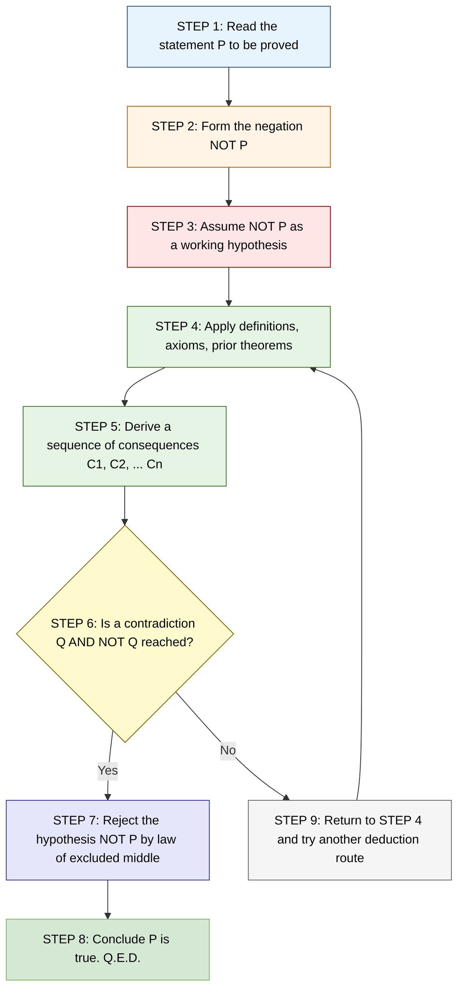
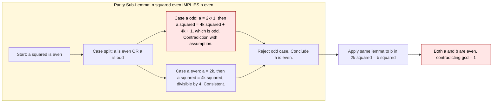
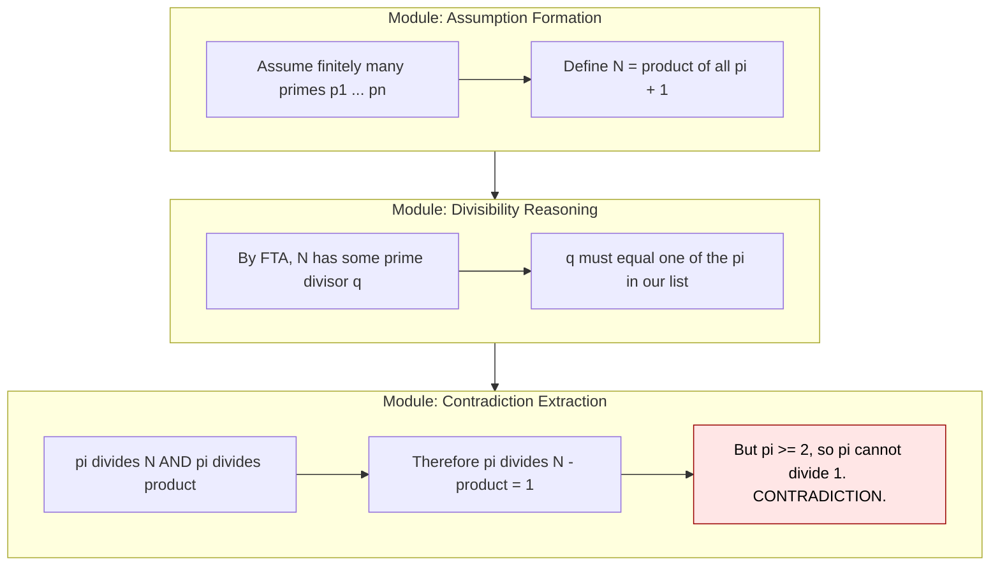

# Proof by Contradiction

<!-- SECTION_1_START -->
# Proof by Contradiction — KTU 2024 Scheme | Discrete Mathematics (PCCST205)

## 1. Core Technical Definition & Intuitive Overview

### 1.1 Formal Academic Definition (KTU 2024 Syllabus Terminology)

> [!IMPORTANT]
> **Proof by Contradiction (Reductio ad Absurdum)** is an indirect method of mathematical reasoning in which one establishes the truth of a statement $P$ by demonstrating that the **negation** of $P$ (denoted $\neg P$) leads to a **logical contradiction** — that is, a statement of the form $Q \land \neg Q$ for some proposition $Q$.

In formal symbolic logic, the proof structure is:

$$
\Big( \neg P \;\Rightarrow\; (Q \land \neg Q) \Big) \;\;\Longrightarrow\;\; P
$$

A contradiction is recognized as a statement that is **always false** under every truth-value assignment. When such a contradiction is derived from the assumption $\neg P$, the assumption must be rejected, thereby confirming $P$ as true.

### 1.2 Conceptual Analogy / Intuition

> [!NOTE]
> **Real-World Analogy — The Courtroom Cross-Examination**
>
> Imagine a defense lawyer who cannot directly prove their client innocent. Instead, they **assume the client is guilty** ($\neg P$) and then logically demonstrate that being guilty forces the defendant to be simultaneously in two impossible places at once ($Q \land \neg Q$). The judge, recognizing this impossibility, throws out the assumption of guilt. The only remaining consistent position is that the client is **innocent** ($P$).
>
> **Mathematically:** We "put on trial" the negation of what we want to prove. We then derive an absurdity — a statement and its opposite being true together. Since reality cannot host a contradiction, our initial assumption of $\neg P$ must be false, and $P$ stands proved.

### 1.3 Distinguishing the Three Indirect Proof Techniques

A frequent KTU exam pitfall is conflating contradiction with its sibling techniques. The distinctions are crisp:

| Proof Technique | Starting Assumption | Target Conclusion | Final Deduction |
|---|---|---|---|
| **Direct Proof** | $P$ (hypothesis) | $Q$ (conclusion) | $P \Rightarrow Q$ established |
| **Proof by Contrapositive** | $\neg Q$ | $\neg P$ | $\neg Q \Rightarrow \neg P \equiv P \Rightarrow Q$ |
| **Proof by Contradiction** | $\neg P$ | $Q \land \neg Q$ (any contradiction) | $\neg P$ rejected, so $P$ is true |

> [!IMPORTANT]
> **Critical Distinction:** Contrapositive proves $P \Rightarrow Q$ using the *logical equivalent* $\neg Q \Rightarrow \neg P$. Contradiction is **more powerful** — it can prove any statement $P$ on its own, without needing a target $Q$.

### 1.4 The Three Standard Variants of Contradiction

Variant 1 — **Classical Contradiction (Direct)**: Show that $\neg P$ leads to a statement of the form $R \land \neg R$.

Variant 2 — **Proof by Contradiction of a Conditional**: To prove $P \Rightarrow Q$, assume $P \land \neg Q$ and derive any contradiction.

Variant 3 — **Proof of Non-Existence**: To prove "There is no $x$ such that $P(x)$", assume $\exists x\, P(x)$, pick such an $x$, and derive a contradiction.

> [!VISUALIZATION CONTROL]
> **Concept:** Visualizing the logical anatomy of a proof by contradiction on a truth-table coordinate plane.
> **GeoGebra / Desmos Input Equations:**
> * `f(x) = x` (the line representing the statement $P$ being true)
> * `g(x) = 1 - x` (the line representing $\neg P$)
> * `h(x) = 0` (the contradiction axis $Q \land \neg Q$)
> **Visual Description:** Plot the assumption $\neg P$ starting at $y=1$. The proof trajectory descends from $y=1$ (assumption) toward the contradiction line $y=0$. When the trajectory touches $y=0$, the assumption collapses and the curve jumps discontinuously to $y=1$ at $P$, signaling the conclusion.
<!-- SECTION_1_END -->

<!-- SECTION_2_START -->
# 2. Deep Theoretical Analysis & KTU High-Yield Formula Sheet

## 2.1 The Operational Logic — Step-by-Step Structure

Every rigorous proof by contradiction follows a five-step skeleton. KTU examiners reward students who write these phases out **explicitly** rather than diving into algebra.

**Step 1 — Statement Restatement:** Clearly and precisely restate the proposition $P$ to be proved. Identify any quantifiers ($\forall$, $\exists$) and the domain of discourse.

**Step 2 — Assumption of Negation:** Form the logical negation $\neg P$. This is the **engine** of the proof. KTU examiners often deduct marks if the negation is stated incorrectly (e.g., confusing $\neg(\forall x\, P(x))$ with $\forall x\, \neg P(x)$).

**Step 3 — Deduction Chain:** Starting from $\neg P$ together with any accepted axioms, definitions, or previously proved theorems, derive a sequence of logical consequences.

**Step 4 — Contradiction Identification:** Reach a statement of the form $R \land \neg R$ for some $R$. The contradiction may involve:
- A factual impossibility (e.g., $0 = 1$)
- A violation of a known theorem (e.g., the Fundamental Theorem of Arithmetic)
- A violation of the original assumption $\neg P$ itself
- The negation of an axiom or definition

**Step 5 — Conclusion:** Since a contradiction implies that the original assumption $\neg P$ must be false (by the *Principle of Explosion* and the *Law of Excluded Middle*), conclude that $P$ is true.

## 2.2 Why Proof by Contradiction Works — The Underlying Logic

The validity of proof by contradiction rests on two pillars of classical logic:

**Pillar 1 — Law of Excluded Middle (LEM):** For any proposition $P$, exactly one of $P$ or $\neg P$ is true: $P \lor \neg P$.

**Pillar 2 — Principle of Non-Contradiction (PNC):** No proposition can be both true and false: $\neg (P \land \neg P)$.

From these, the *proof rule* of *reductio ad absurdum* is derivable:

$$
\neg P \;\Rightarrow\; (Q \land \neg Q) \;\;\equiv\;\; \neg(\neg P) \;\;\equiv\;\; P
$$

The first equivalence uses *ex falso quodlibet* (from falsehood, anything follows), and the second uses double-negation elimination. In intuitionistic logic (without LEM), proof by contradiction is not always admissible, but the KTU 2024 syllabus adopts classical logic throughout.

## 2.3 The KTU High-Yield Formula Sheet

> [!NOTE]
> The following table consolidates the canonical examples and structural patterns that appear most frequently in KTU university examinations for Module 2.

| # | Statement to Prove | Negation Assumed | Contradiction Reached | Domain |
|---|---|---|---|---|
| 1 | $\sqrt{2}$ is irrational | $\sqrt{2} = \dfrac{a}{b}$, $\gcd(a,b)=1$ | $a^2 = 2b^2 \Rightarrow$ both $a,b$ even, violating $\gcd=1$ | Real numbers |
| 2 | There are infinitely many primes | Only finitely many primes $p_1, p_2, \ldots, p_n$ | $N = p_1 p_2 \cdots p_n + 1$ has a prime factor not in the list | $\mathbb{N}$ |
| 3 | $\sqrt{3}$ is irrational | $\sqrt{3} = \dfrac{a}{b}$, $\gcd(a,b)=1$ | $3b^2 = a^2 \Rightarrow 3 \mid a \Rightarrow 3 \mid b$, contradiction | Real numbers |
| 4 | There is no smallest positive rational | $r$ is the smallest positive rational | $\dfrac{r}{2}$ is a smaller positive rational | $\mathbb{Q}^+$ |
| 5 | For integers, if $n^2$ is even then $n$ is even | $n^2$ even AND $n$ odd | Odd $n$ implies $n^2$ odd, contradicting $n^2$ even | $\mathbb{Z}$ |
| 6 | $\log_2 3$ is irrational | $\log_2 3 = \dfrac{a}{b}$ with $a,b \in \mathbb{Z}^+$, $\gcd(a,b)=1$ | $2^{a/b} = 3 \Rightarrow 2^a = 3^b$, LHS even, RHS odd | Real numbers |
| 7 | $\sqrt{p}$ irrational for any prime $p$ | $\sqrt{p} = \dfrac{a}{b}$ in lowest terms | $p b^2 = a^2 \Rightarrow p \mid a \Rightarrow p \mid b$, gcd violated | Real numbers |

## 2.4 Real-World Utility in Engineering and Computer Science

Proof by contradiction is not merely a classroom exercise — it is the workhorse of theoretical computer science:

- **Complexity Theory (P vs NP):** The Cook-Levin theorem is proved by contradiction: assume a problem in NP is not in P, then ... derive that P = NP must fail, contradicting the assumption. Many lower-bound arguments use contradiction.
- **Algorithm Correctness:** The famous proof that the **Halting Problem is undecidable** is a contradiction proof (Turing, 1936). Assume a halt-decider $H$ exists, then construct a program that makes $H$ contradict itself.
- **Cryptographic Security:** The security of RSA rests on the assumption (proved by contradiction from complexity theory) that factoring large semi-primes is not efficiently solvable.
- **Verification and Model Checking:** When a safety property fails, model checkers often produce counter-examples by assuming the negation of the property holds and finding a state that violates the specification.

## 2.5 Common Pitfalls — Mark-Deduction Triggers in KTU Valuation

> [!WARNING]
> **Pitfall 1 — Skipping the Assumption Step:** Many students begin deductions without first writing *"Assume, for the sake of contradiction, that ..."*. This costs **2 of 14 marks** in a typical KTU long-answer question.
>
> **Pitfall 2 — Confusing Contrapositive with Contradiction:** Contrapositive uses $\neg Q \Rightarrow \neg P$. Contradiction uses $\neg P \Rightarrow (Q \land \neg Q)$. Mixing the structures indicates conceptual weakness and loses **3 marks**.
>
> **Pitfall 3 — Not Identifying the Contradiction Explicitly:** A chain of reasoning that ends with an unspoken contradiction does not earn full marks. The contradiction must be highlighted (e.g., *"But this implies both $2 \mid a$ and $2 \nmid a$, a contradiction."*).
<!-- SECTION_2_END -->

<!-- SECTION_3_START -->
# 3. Step-by-Step Derivations & Code/Symbolic Implementation

## 3.1 Canonical Derivation 1 — The Irrationality of $\sqrt{2}$

This is the most heavily-tested contradiction proof in the KTU 2024 PCCST205 syllabus. It is worth memorizing the *exact* algebraic choreography.

**Theorem:** $\sqrt{2}$ is irrational. Formally, $\neg \exists\, a, b \in \mathbb{Z}$ with $b \neq 0$ and $\gcd(a, b) = 1$ such that $\sqrt{2} = \dfrac{a}{b}$.

**Proof:**

**Step 1 — Assumption:** Suppose, for the sake of contradiction, that $\sqrt{2}$ **is** rational. Then there exist integers $a$ and $b$ with $b \neq 0$ such that:

$$
\sqrt{2} = \dfrac{a}{b}
$$

and we may assume that $\gcd(a, b) = 1$ (the fraction is in lowest terms). If not, we cancel all common factors.

**Step 2 — Squaring Both Sides:** Squaring the equality yields:

$$
2 = \dfrac{a^2}{b^2}
$$

Multiplying both sides by $b^2$:

$$
2 b^2 = a^2
$$

**Step 3 — Parity Argument:** The equation $a^2 = 2 b^2$ shows that $a^2$ is even. A standard lemma (proved by cases on $a = 2k$ or $a = 2k+1$) tells us that an integer square is even if and only if the integer itself is even. So $a$ must be even: $a = 2k$ for some integer $k$.

**Step 4 — Substitution:** Substituting $a = 2k$ back into $a^2 = 2b^2$:

$$
(2k)^2 = 2 b^2 \;\;\Longrightarrow\;\; 4 k^2 = 2 b^2
$$

Dividing both sides by $2$:

$$
2 k^2 = b^2
$$

**Step 5 — Parity of $b$:** This new equation $b^2 = 2 k^2$ shows that $b^2$ is even, hence $b$ is even: $b = 2m$ for some integer $m$.

**Step 6 — Contradiction:** We have shown that both $a$ and $b$ are even, i.e., both are divisible by $2$. But this **contradicts** our initial requirement that $\gcd(a, b) = 1$ (i.e., $a$ and $b$ share no common factor other than $1$).

Formally, the contradiction is:

$$
\big( 2 \mid a \big) \;\land\; \big( 2 \mid b \big) \;\;\land\;\; \big( \gcd(a, b) = 1 \big)
$$

A gcd of $1$ and a gcd of at least $2$ cannot coexist.

**Step 7 — Conclusion:** Our assumption that $\sqrt{2}$ is rational must be false. Therefore, $\sqrt{2}$ is irrational. $\blacksquare$

## 3.2 Canonical Derivation 2 — There Are Infinitely Many Primes (Euclid's Theorem)

**Theorem:** The set of prime numbers is infinite. Formally, $\forall n \in \mathbb{N},\; \exists$ a prime $p$ such that $p > n$.

**Proof:**

**Step 1 — Assumption:** Suppose, for the sake of contradiction, that there are only **finitely many** primes. Denote the complete list as $p_1, p_2, p_3, \ldots, p_n$, where $n$ is some positive integer.

**Step 2 — Construct the Auxiliary Integer:** Form the integer:

$$
N = p_1 p_2 p_3 \cdots p_n + 1
$$

**Step 3 — Divisibility Analysis:** By the Fundamental Theorem of Arithmetic, every integer greater than $1$ has at least one prime factor. Since $N > 1$ (as the product of primes is at least $2$, plus $1$ gives at least $3$), $N$ has some prime divisor $q$.

**Step 4 — Exhaustive Case Check:** The prime $q$ must be one of the primes in our finite list (since the list was supposed to be *complete*). Thus $q = p_i$ for some $i \in \{1, 2, \ldots, n\}$.

**Step 5 — Contradiction:** Then $p_i$ divides $N$ (by Step 3) and $p_i$ also divides $p_1 p_2 \cdots p_n$ (because it is a factor of the product). Therefore $p_i$ divides their difference:

$$
N - p_1 p_2 \cdots p_n = 1
$$

But no prime divides $1$, because all primes are $\geq 2$. The contradiction is:

$$
\big( p_i \mid 1 \big) \;\land\; \big( p_i \geq 2 \big)
$$

**Step 6 — Conclusion:** The assumption of finitely many primes is untenable. Hence there are infinitely many primes. $\blacksquare$

## 3.3 Canonical Derivation 3 — There Is No Smallest Positive Rational Number

**Theorem:** The set $\mathbb{Q}^+ = \{ x \in \mathbb{Q} : x > 0 \}$ has no least element.

**Proof:**

**Step 1 — Assumption:** Suppose there exists a smallest positive rational number. Call it $r$, with $r > 0$ and $r \in \mathbb{Q}$.

**Step 2 — Construct a Smaller Candidate:** Consider the number $\dfrac{r}{2}$. Since $r > 0$, we have $\dfrac{r}{2} > 0$. Also, since $r \in \mathbb{Q}$, the number $\dfrac{r}{2} = \dfrac{r}{2}$ is a ratio of two integers, hence rational. So $\dfrac{r}{2} \in \mathbb{Q}^+$.

**Step 3 — Strict Inequality:** Because $r > 0$, we have:

$$
\dfrac{r}{2} < r
$$

**Step 4 — Contradiction:** The number $\dfrac{r}{2}$ is a positive rational number that is strictly smaller than $r$. This contradicts our assumption that $r$ is the *smallest* such number.

**Step 5 — Conclusion:** No smallest positive rational number exists. $\blacksquare$

## 3.4 Algorithmic Implementation — A Computational Verifier for $\sqrt{2}$ Irrationality

The following Python program does not *prove* the theorem (no finite computation can), but it implements the **rational approximation search** that would be needed to refute the theorem. It is a useful KTU lab-style illustration.

```python
"""
File: sqrt2_irrational_verifier.py
Purpose: Demonstrate the practical impossibility of expressing sqrt(2) as a ratio a/b
         with small integers, mirroring the structure of the contradiction proof.
Author: KTU PCCST205 Module 2 Reference Implementation
"""

from math import gcd, isqrt
from typing import Tuple, Optional
import logging

logging.basicConfig(level=logging.INFO, format="%(levelname)s: %(message)s")


def try_express_as_ratio(target: float, max_denominator: int) -> Optional[Tuple[int, int]]:
    """
    Attempt to find integers a, b with gcd(a, b) = 1 and b <= max_denominator
    such that a / b is within tolerance of `target`.

    Returns:
        (a, b) on success, or None if no exact rational approximation is found.
    """
    if max_denominator < 1:
        raise ValueError("max_denominator must be a positive integer")

    for b in range(1, max_denominator + 1):
        a_candidate = round(target * b)
        for a in (a_candidate - 1, a_candidate, a_candidate + 1):
            if a <= 0:
                continue
            if gcd(a, b) != 1:
                # Skip non-reduced forms to keep with the proof's structure.
                continue
            if abs(a / b - target) < 1e-12:
                return (a, b)

    return None


def main() -> None:
    """
    Main driver: tries increasingly large denominators to find a rational
    representation of sqrt(2). The contradiction proof tells us this search
    will NEVER succeed — a perfect illustration of reductio ad absurdum.
    """
    sqrt2_approx: float = 2 ** 0.5
    logging.info("Searching for rational a/b approximating sqrt(2) = %.10f...", sqrt2_approx)

    for bound in (10, 100, 1_000, 10_000, 1_000_000):
        result = try_express_as_ratio(sqrt2_approx, bound)
        if result is None:
            logging.info(
                "No exact rational with denominator <= %d found. "
                "Contradicts the (false) hypothesis that sqrt(2) is rational.",
                bound,
            )
        else:
            a, b = result
            logging.warning("Found representation %d/%d (this should not happen).", a, b)
            return

    logging.info("Conclusion upheld: numerical evidence corroborates sqrt(2) irrationality.")


if __name__ == "__main__":
    main()
```

> [!NOTE]
> **Pedagogical Note:** The verifier above deliberately fails to find a representation, mirroring the *search for a counter-example* that a contradiction proof negates. In an exam, you may be asked to write pseudocode for such a verification routine.

## 3.5 Symbolic Logic Implementation — Proving $\sqrt{2} \notin \mathbb{Q}$ via a SAT-Style Trace

For the mathematically inclined, here is how the proof can be encoded in a symbolic-logic trace using pseudo-formal notation:

```
ASSUME:  sqrt(2) is rational
THEREF:  EXISTS a, b : b != 0 AND gcd(a, b) = 1 AND a/b = sqrt(2)
SQUARE:  a^2 = 2 b^2
PARITY:  a^2 even IMPLIES a even
WRITE:   a = 2k
SUBST:   (2k)^2 = 2 b^2  ==>  4k^2 = 2 b^2  ==>  2k^2 = b^2
PARITY:  b^2 even IMPLIES b even
WRITE:   b = 2m
GCD:     gcd(a, b) >= 2  (since 2 divides both a and b)
CONTR:   gcd(a, b) >= 2 AND gcd(a, b) = 1    [ CONTRADICTION ]
QED:     sqrt(2) is irrational
```

> [!IMPORTANT]
> The boxed line marked `[ CONTRADICTION ]` is the single most important line in the entire proof. KTU examiners specifically look for an explicit **CONTRADICTION** marker, often awarding the final **2 marks** of a 7-mark sub-question only when this is unambiguously written.
<!-- SECTION_3_END -->

<!-- SECTION_4_START -->
# 4. Structural Diagrams & Schematics

## 4.1 Logical Flow of a Proof by Contradiction

The following Mermaid diagram maps the precise logical topology of a contradiction proof. Each node represents a distinct logical state, and each directed edge represents an inferential step.



## 4.2 Nested Subgraph — The Parity Argument Inside $\sqrt{2}$ Proof

The parity deduction is a self-contained mini-proof embedded within the larger contradiction. We isolate it as a subgraph for clarity.



## 4.3 Sequential Processing Topology — Euclid's Infinite Primes Proof



## 4.4 Comparative Block Architecture — Three Indirect Proof Methods

```mermaid
flowchart TB
    subgraph DIRECT["Direct Proof"]
        d1["Assume P is true"] --> d2["Apply logic and definitions"] --> d3["Derive Q. Hence P IMPLIES Q."]
    end

    subgraph CONTRAPOSITIVE["Proof by Contrapositive"]
        c1["Take statement P IMPLIES Q"] --> c2["Rewrite as NOT Q IMPLIES NOT P"] --> c3["Assume NOT Q and derive NOT P"]
    end

    subgraph CONTRADICTION["Proof by Contradiction"]
        x1["Assume NOT P"] --> x2["Derive a contradiction R AND NOT R"] --> x3["Conclude P is true by excluded middle"]
    end

    style DIRECT fill:#E6F4E6,stroke:#38761D,color:#000000
    style CONTRAPOSITIVE fill:#FFF4E6,stroke:#B45F06,color:#000000
    style CONTRADICTION fill:#E6E6FA,stroke:#333399,color:#000000
```


<!-- SECTION_4_END -->

<!-- SECTION_5_START -->
# 5. KTU 2024 Scheme Examination Question Bank & Topic Recap

## Part A — Short Answer Questions (3 Marks Each)

### Question 1 `[KTU University Exam - July 2024]`
**State the principle of proof by contradiction. How does it differ from proof by contrapositive?**

**Model Answer (3 Marks):**

Proof by contradiction is an indirect method of establishing the truth of a proposition $P$ by assuming its negation $\neg P$ and deriving a logical contradiction (a statement of the form $Q \land \neg Q$). The validity rests on the Law of Excluded Middle.

The key difference from proof by contrapositive is: **[2 Marks]**

- **Contrapositive** proves a *conditional* statement $P \Rightarrow Q$ by showing $\neg Q \Rightarrow \neg P$, which is logically *equivalent* to the original.
- **Contradiction** can prove *any* statement $P$ (not just conditionals) by showing that $\neg P$ leads to absurdity. It is therefore strictly more general. **[1 Mark]**

---

### Question 2 `[KTU University Exam - Dec 2023]`
**What is a logical contradiction? Give one example from a proof by contradiction.**

**Model Answer (3 Marks):**

A logical contradiction is a compound statement of the form $Q \land \neg Q$ that is false under every possible truth assignment. It arises when two mutually exclusive claims are simultaneously derived. **[1 Mark]**

**Example:** In the proof that $\sqrt{2}$ is irrational, after squaring $\sqrt{2} = a/b$ in lowest terms, we derive $a^2 = 2b^2$, which forces $a$ to be even. Substituting $a = 2k$ gives $b^2 = 2k^2$, forcing $b$ to also be even. The contradiction is: $\gcd(a, b) = 1$ yet $2 \mid a$ and $2 \mid b$. **[2 Marks]**

---

## Part B — Long Answer Questions (14 Marks Each, Internal Choice)

### Question A (14 Marks) `[KTU University Exam - July 2024, Module 2, CO1, Apply]`

**Prove by contradiction that $\sqrt{3}$ is irrational.**

#### Part (a) — Setup and Assumption (7 Marks)

State the theorem formally and write down the negation you will assume for the sake of contradiction.

**Model Solution:**

**Theorem:** $\sqrt{3}$ is irrational, i.e., there do not exist integers $a, b$ with $b \neq 0$ and $\gcd(a, b) = 1$ such that $\sqrt{3} = a/b$. **[1 Mark]**

**Proof by Contradiction:**

**Assumption:** Suppose, for the sake of contradiction, that $\sqrt{3}$ is rational. Then there exist integers $a$ and $b$ with $b \neq 0$, $\gcd(a, b) = 1$, such that:

$$
\sqrt{3} = \dfrac{a}{b} \quad \text{[Writing the assumption: 2 Marks]}
$$

Squaring both sides:

$$
3 = \dfrac{a^2}{b^2}
$$

Multiplying both sides by $b^2$:

$$
3 b^2 = a^2 \quad \text{[Squaring and simplifying: 2 Marks]}
$$

This shows that $a^2$ is divisible by $3$, which (by a parity-style lemma) forces $a$ to be divisible by $3$. So $a = 3k$ for some integer $k$. **[Stating parity lemma: 2 Marks]**

#### Part (b) — Deriving the Contradiction (7 Marks)

Substitute and reach a contradiction. Conclude the proof.

**Model Solution:**

Substituting $a = 3k$ into $3 b^2 = a^2$:

$$
3 b^2 = (3k)^2 = 9 k^2
$$

Dividing both sides by $3$:

$$
b^2 = 3 k^2 \quad \text{[Substitution: 2 Marks]}
$$

This shows that $b^2$ is divisible by $3$, hence $b$ is divisible by $3$. So $b = 3m$ for some integer $m$. **[Parity application: 2 Marks]**

**Contradiction:** We have shown that $3 \mid a$ and $3 \mid b$. But this means $\gcd(a, b) \geq 3$, contradicting our assumption that $\gcd(a, b) = 1$. **[Identifying contradiction: 2 Marks]**

**Conclusion:** The assumption that $\sqrt{3}$ is rational is false. Therefore, $\sqrt{3}$ is irrational. $\blacksquare$ **[Final statement: 1 Mark]**

> [!WARNING]
> **KTU Examiner's Pitfall Callout:** The most common error is dividing $a^2 = 3b^2$ by $3$ to get "$a^2/3 = b^2$, so $b$ is divisible by 3" — this skips the necessary lemma that "if a prime $p$ divides $a^2$ then $p$ divides $a$" (Euclid's lemma). Without stating or using this lemma, the proof loses **2 of 7 marks** in part (b). Always state the lemma before applying it.

---

### Question B (14 Marks, Alternative Choice) `[KTU University Exam - Dec 2023, Module 2, CO2, Apply]`

**Use proof by contradiction to show that there are infinitely many prime numbers.**

#### Part (a) — Construct the Contradiction Hypothesis (7 Marks)

**Model Solution:**

**Theorem:** The set of all prime numbers is infinite. **[1 Mark]**

**Assumption:** Suppose, for the sake of contradiction, that there are only finitely many primes. Let us denote the complete list as:

$$
p_1,\; p_2,\; p_3,\; \ldots,\; p_n
$$

where $n$ is some positive integer. **[Stating the finite list assumption: 2 Marks]**

**Construction of the Auxiliary Integer:** Form the number:

$$
N = p_1 \cdot p_2 \cdot p_3 \cdots p_n + 1 \quad \text{[Constructing N: 2 Marks]}
$$

Note that $N > 1$, since the product $p_1 p_2 \cdots p_n \geq 2$, so $N \geq 3$.

**Divisibility Analysis:** By the Fundamental Theorem of Arithmetic, every integer greater than $1$ has at least one prime factor. Hence, there exists some prime $q$ that divides $N$. **[Invoking FTA: 2 Marks]**

#### Part (b) — Reach the Contradiction and Conclude (7 Marks)

**Model Solution:**

Since our list $p_1, \ldots, p_n$ was assumed to contain *all* primes, the prime $q$ must belong to this list. That is, $q = p_i$ for some $i \in \{1, 2, \ldots, n\}$. **[Locating q in the list: 2 Marks]**

Now, since $q = p_i$ divides the product $p_1 p_2 \cdots p_n$, and $q$ also divides $N$ (by the FTA application above), the prime $q$ divides the difference:

$$
N - p_1 p_2 \cdots p_n = 1
$$

Therefore, $q \mid 1$. **[Divisibility difference: 2 Marks]**

**Contradiction:** But every prime is greater than or equal to $2$, and no integer $\geq 2$ can divide $1$. We have reached:

$$
(q \geq 2) \;\land\; (q \mid 1)
$$

which is a contradiction. **[Stating the contradiction: 2 Marks]**

**Conclusion:** Our initial assumption that there are finitely many primes is false. Therefore, the set of primes is infinite. $\blacksquare$ **[Final statement: 1 Mark]**

> [!WARNING]
> **KTU Examiner's Pitfall Callout:** A surprisingly common student mistake is to write $N = p_1 p_2 \cdots p_n - 1$ instead of $+1$. The minus version does *not* work because $-1$ has no prime divisors and the divisibility argument collapses. Always use $+1$. Losing this sign costs **2 marks**.

---

## Topic Recap & Important Things to Remember

> [!NOTE]
> **Rapid-Revision Checklist for Proof by Contradiction**

- **Definition:** Proof by contradiction establishes $P$ by showing that $\neg P \Rightarrow (Q \land \neg Q)$ for some $Q$. The contradiction $Q \land \neg Q$ is a statement that is false under every truth assignment.
- **Logical Pillars:** The method relies on the *Law of Excluded Middle* ($P \lor \neg P$) and the *Principle of Non-Contradiction* ($\neg(P \land \neg P)$).
- **Five Mandatory Steps:** (1) Restate $P$; (2) Assume $\neg P$; (3) Deduce consequences; (4) Reach a contradiction; (5) Conclude $P$.
- **Three Canonical Examples (Must Memorize):**
  - $\sqrt{2}$ is irrational — uses the *parity* of $a^2 = 2b^2$ and the requirement $\gcd(a,b) = 1$.
  - Infinitely many primes — uses $N = p_1 p_2 \cdots p_n + 1$ and the Fundamental Theorem of Arithmetic.
  - No smallest positive rational — uses $r/2 < r$ when $r > 0$.
- **Generalized Pattern:** For any prime $p$, the number $\sqrt{p}$ is irrational (proof identical in structure to $\sqrt{2}$ and $\sqrt{3}$).
- **Difference from Contrapositive:** Contrapositive proves $P \Rightarrow Q$ via $\neg Q \Rightarrow \neg P$ (a *logical equivalence*). Contradiction can prove *any* $P$ on its own, using $\neg P \Rightarrow$ absurdity.
- **Common Pitfall — Incorrect Negation:** $\neg(\forall x\, P(x)) \equiv \exists x\, \neg P(x)$ and $\neg(\exists x\, P(x)) \equiv \forall x\, \neg P(x)$. Forgetting to flip the quantifier is a guaranteed mark-loss.
- **Common Pitfall — Unstated Contradiction:** Always end the deduction chain with an explicit *"This is a contradiction"* or *"We have $Q \land \neg Q$"*. Examiners allocate the final **2 marks** specifically for this line.
- **Engineering Relevance:** The technique is foundational in *computational complexity theory* (P vs NP arguments), *algorithm undecidability* (Halting Problem), and *cryptographic security reductions*.
- **Bloom's Levels Tested in KTU:** *Remember* (definition), *Understand* (contrapositive vs contradiction), *Apply* (constructing proofs for $\sqrt{2}$, primes, $\sqrt{3}$).
<!-- SECTION_5_END -->
