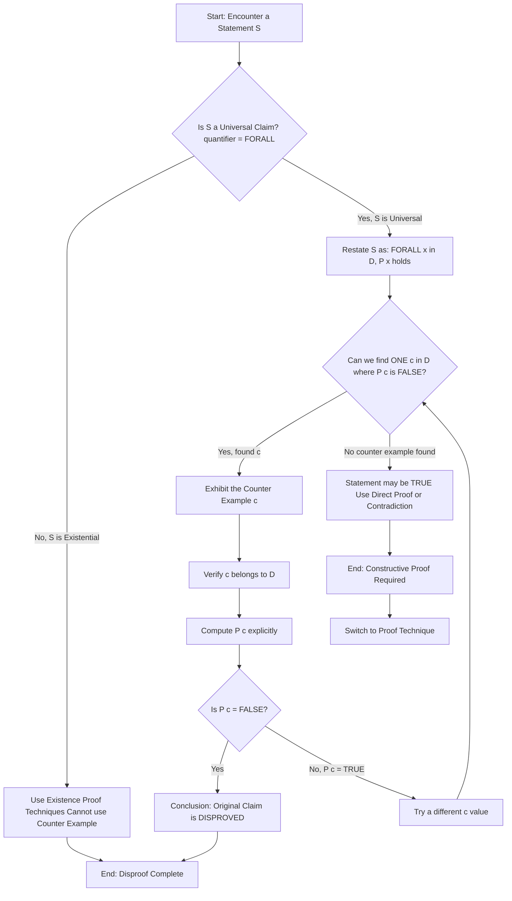
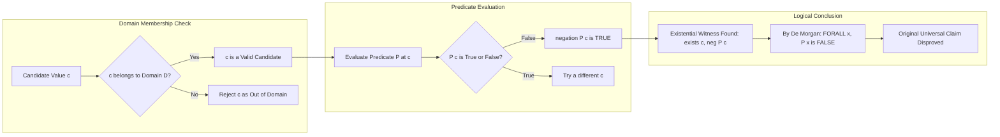
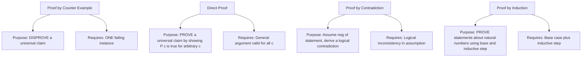
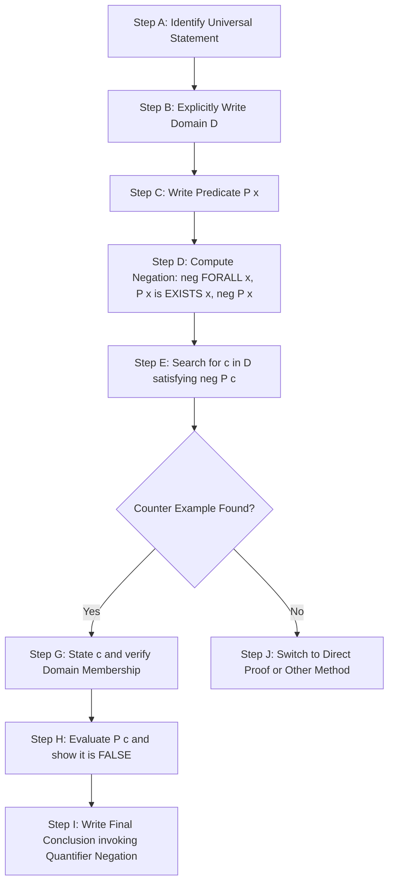

# Proof by counter examples

<!-- SECTION_1_START -->

# Proof by Counter Examples

## 1. Core Technical Definition

> [!IMPORTANT]
> **Formal Definition (KTU 2024 Syllabus Terminology)**
> A **counter example** is a specific element $c$ belonging to the domain of discourse $D$ such that the predicate $P(c)$ evaluates to **false** when the original statement asserts a universal claim. Formally, to disprove a universally quantified statement $\forall x \in D,\; P(x)$, it is sufficient and necessary to exhibit **one** element $c \in D$ for which $P(c)$ is logically false.

A counter example transforms a **non-constructive** impossibility problem into a **constructive** task: we do not need to prove an entire class of objects is broken; we only need to **exhibit one broken specimen** to invalidate the universal claim.

The logical foundation rests on the **negation of a universal quantifier**:

$$\neg(\forall x \in D,\; P(x)) \;\equiv\; \exists x \in D \; \text{such that} \; \neg P(x)$$

This identity (De Morgan's Law for quantifiers) shows that **a single true existential witness is logically equivalent to the falsification of the entire universal claim**.

## 2. Intuitive Overview — The "One Rotten Apple" Analogy

> [!NOTE]
> **Conceptual Analogy**
> Imagine a fruit vendor advertising: *"Every apple in my basket is fresh and red."* To prove this false, you do **not** need to inspect all 1000 apples. You only need to **find one green, rotten apple** and hold it up. That single specimen is your **counter example**.

Geometrically, think of the universal statement $\forall x,\; P(x)$ as a **claim that a curve $P$ lies entirely above the x-axis** on the domain $D$. A counter example is **any point $(c, P(c))$ that falls on or below the x-axis** — a single downward dip is enough to disprove the claim.

### Standard Notation in KTU Valuation

| Symbol | Meaning |
| :--- | :--- |
| $\forall$ | For all (universal quantifier) |
| $\exists$ | There exists (existential quantifier) |
| $\neg$ | Logical NOT |
| $\in$ | Element of the domain |
| $c$ | The specific counter-example value |

> [!VISUALIZATION CONTROL]
> **Concept:** Visualising a Counter Example on a Predicate Curve
> **GeoGebra / Desmos Input Equations:**
> * `P(x) = x^2 - x - 2` (the claim is "$\forall x \in \mathbb{R},\; P(x) > 0$")
> * `axis: y = 0`
> **Visual Description:** The parabola dips **below** the x-axis between its two real roots. Any $x$ value inside the interval $(-1, 2)$ — for example, $x = 0$ where $P(0) = -2$ — is a valid counter example. The student should observe the **negative region** clearly crossing the horizontal axis.

## 3. When Is Proof by Counter Example the Right Tool?

> [!IMPORTANT]
> **Syllabus Highlight — KTU 2024 Scheme**
> The Board Examiner's expectation is that students must **first identify the type of statement** before choosing a proof technique. Counter examples are exclusively used for **disproving** statements of the form:
> 1. $\forall x \in D,\; P(x)$ (universal affirmative)
> 2. $P(x) \implies Q(x)$ (universal conditional)
> 3. Biconditionals whose one direction fails

A counter example is **never** used to prove a statement true. It is a *disproof technique*, not a verification technique.

<!-- SECTION_1_END -->

<!-- SECTION_2_START -->

# Deep Theoretical Analysis & KTU High-Yield Formula Sheet

## 1. Logical Anatomy of a Counter Example

A valid counter example must satisfy **three structural conditions**, all of which Board Examiners explicitly check for in valuation:

1. **Domain Membership:** The chosen element $c$ must genuinely belong to the stated domain $D$. Submitting $c = -3$ as a counter example for "$\forall n \in \mathbb{N}$" loses the domain-verification mark.
2. **Predicate Evaluation:** The student must explicitly compute $P(c)$ or evaluate the truth value of the predicate.
3. **Refutation Conclusion:** The student must explicitly state that since $P(c)$ is false, the original universal claim is **falsified**.

### The Three-Step Algorithmic Skeleton

$$\text{Step 1: } \text{Parse statement} \rightarrow \forall x \in D,\; P(x)$$
$$\text{Step 2: } \text{Choose } c \in D \text{ such that } \neg P(c) \text{ is true}$$
$$\text{Step 3: } \text{Conclude } \exists c \in D \text{ with } \neg P(c) \;\Rightarrow\; \neg(\forall x,\; P(x))$$

## 2. KTU Formula Sheet / Cheat Sheet

| Concept | Logical Form | Counter-Example Strategy | Engineering / CS Utility |
| :--- | :--- | :--- | :--- |
| Universal Claim | $\forall x \in D,\; P(x)$ | Find one $c \in D$ with $\neg P(c)$ | Disproving software invariants, algorithm correctness |
| Conditional Claim | $\forall x,\; P(x) \implies Q(x)$ | Find $c$ where $P(c)$ true and $Q(c)$ false | Finding false test cases in unit testing |
| Conjunctive Claim | $\forall x,\; P(x) \wedge Q(x)$ | Find $c$ where $\neg P(c)$ OR $\neg Q(c)$ | Verifying safety properties in concurrent systems |
| Biconditional Claim | $\forall x,\; P(x) \iff Q(x)$ | Find $c$ where $(P \wedge \neg Q)$ OR $(\neg P \wedge Q)$ | Equivalence checking in hardware verification |
| Existence Claim | $\exists x,\; P(x)$ | **Cannot** use counter example; show $\forall x,\; \neg P(x)$ | Existence proofs (different technique) |

### The Negation Cheat Sheet (Most Tested in KTU)

$$\neg(\forall x \in D,\; P(x)) \;\equiv\; \exists x \in D \; \mid \; \neg P(x)$$

$$\neg(\exists x \in D,\; P(x)) \;\equiv\; \forall x \in D,\; \neg P(x)$$

$$\neg(P \implies Q) \;\equiv\; P \wedge \neg Q$$

> [!NOTE]
> **The last identity is critical for KTU valuations.** To disprove "$\forall x,\; P(x) \implies Q(x)$", a counter example must satisfy $P(c) = \text{True}$ **AND** $Q(c) = \text{False}$. Many students mistakenly choose a $c$ where $P(c)$ is false — this is *not* a counter example because the conditional $P \implies Q$ is vacuously true there.

## 3. Real-World Utility in Engineering and Computer Science

| Domain | Application of Counter Examples |
| :--- | :--- |
| **Algorithm Design** | Disproving a conjectured upper bound $O(f(n))$ by exhibiting an input that triggers the worst case |
| **Software Testing** | Creating a single failing test case to disprove the universal claim "this function works for all inputs" |
| **Network Security** | Finding one breach scenario to disprove "this firewall blocks all SQL injections" |
| **Compiler Verification** | A counter example to type safety is a valid program fragment that produces a runtime type error |
| **Database Systems** | Finding a tuple that violates an assumed functional dependency |
| **Machine Learning** | Disproving "this classifier achieves 100% accuracy" by presenting a misclassified test sample |

<!-- SECTION_2_END -->

<!-- SECTION_3_START -->

# Step-by-Step Derivations & Worked Examples

## Example 1 — The Classic Prime Counter Example

**Statement to disprove:** "Every prime number is odd."

### Step 1: Parse the Statement into Logical Form

$$\forall p \in \mathbb{P},\; p \text{ is odd}$$

where $\mathbb{P} = \{2, 3, 5, 7, 11, \ldots\}$ is the set of all primes.

### Step 2: Identify the Negation

The negation is:

$$\neg(\forall p \in \mathbb{P},\; p \text{ is odd}) \;\equiv\; \exists p \in \mathbb{P} \; \mid \; p \text{ is even}$$

### Step 3: Construct the Counter Example

Choose $c = 2$.

**Verification of domain membership:** $2 \in \mathbb{P}$ because its only positive divisors are $1$ and $2$. This satisfies the prime definition.

**Verification of predicate negation:** $2$ is even, so $p$ is odd is false at $p = 2$. Equivalently, $\neg(\text{2 is odd})$ is true.

### Step 4: Conclusion

Since $c = 2 \in \mathbb{P}$ and $2$ is not odd, the existential witness exists. By De Morgan's Law:

$$\exists p \in \mathbb{P},\; p \text{ is even} \;\Rightarrow\; \neg(\forall p \in \mathbb{P},\; p \text{ is odd})$$

**The universal claim is disproved by the single counter example $p = 2$.**

> [!NOTE]
> **Valuation Key Points for Example 1:**
> * Stating the negated logical form: 1 Mark
> * Verifying domain membership of $c = 2$: 1 Mark
> * Showing $P(2)$ is false: 1 Mark
> * Final conclusion explicitly invoking negation: 1 Mark

---

## Example 2 — Conditional Statement Counter Example

**Statement to disprove:** "For all integers $n$, if $n^2$ is even, then $n$ is even."

### Step 1: Parse Into Logical Form

$$\forall n \in \mathbb{Z},\; n^2 \text{ is even} \implies n \text{ is even}$$

### Step 2: Compute the Negation

Applying the identity $\neg(P \implies Q) \equiv P \wedge \neg Q$:

$$\neg(\forall n,\; n^2 \text{ even} \implies n \text{ even}) \;\equiv\; \exists n \in \mathbb{Z},\; (n^2 \text{ even}) \wedge (n \text{ is odd})$$

This means we must find an integer $n$ that is **simultaneously** odd (violating the conclusion) and has an even square (satisfying the hypothesis).

### Step 3: Construct the Counter Example

Choose $c = 3$.

**Check $P(c)$:** $c^2 = 3^2 = 9$. Is $9$ even? **No, $9$ is odd.** The hypothesis $P(c)$ is **false**.

**Conclusion:** Because $P(c)$ is false, the conditional $P(c) \implies Q(c)$ is **vacuously true**, so $c = 3$ is **NOT a valid counter example**.

We must try again. Let us try $c = 1$:

**Check $P(c)$:** $1^2 = 1$, which is odd. $P(c)$ is false. Vacuously true again.

Let us try $c = 5$:

**Check $P(c)$:** $5^2 = 25$, odd. Same issue.

Let us try an **even** number to make $P(c)$ true, but observe: if $n$ is even, then $n^2$ is even, AND $n$ is even, so $Q(c)$ is also true. No counter example exists among even numbers.

Let us check $c = 7$: $49$ is odd. Still no.

**Observation:** Among odd numbers, $n^2$ is always odd. Among even numbers, both $n^2$ and $n$ are even. So there is **no $n$** for which $n^2$ is even but $n$ is odd.

### Step 4: Conclusion

$$\text{No counter example exists.} \;\Rightarrow\; \text{The original statement is TRUE (cannot be disproved by counter example).}$$

This is itself a powerful lesson: the *absence* of a counter example, combined with constructive verification, leads to a direct proof — a different technique entirely.

> [!IMPORTANT]
> **Pedagogical Note for KTU 2024:**
> Students often confuse "I could not find a counter example" with "The statement is false because I disproved a related one." The Board Examiner marks this as **logical fallacy**. Absence of counter example is *not* a proof.

---

## Example 3 — Sum of Two Irrationals

**Statement to disprove:** "The sum of two irrational numbers is always irrational."

### Step 1: Parse Into Logical Form

$$\forall a, b \in \mathbb{R} \setminus \mathbb{Q},\; (a + b) \in \mathbb{R} \setminus \mathbb{Q}$$

### Step 2: Compute the Negation

$$\exists a, b \in \mathbb{R} \setminus \mathbb{Q} \; \mid \; (a + b) \in \mathbb{Q}$$

### Step 3: Construct the Counter Example

Choose $a = \sqrt{2}$ and $b = -\sqrt{2}$.

**Domain check for $a$:** $\sqrt{2} \approx 1.41421\ldots$ is non-terminating and non-repeating, so $a \in \mathbb{R} \setminus \mathbb{Q}$. ✓

**Domain check for $b$:** $-\sqrt{2} \approx -1.41421\ldots$ is also irrational. ✓

**Predicate evaluation:** $a + b = \sqrt{2} + (-\sqrt{2}) = 0$. Since $0$ is a rational number, $a + b \in \mathbb{Q}$. ✓

### Step 4: Conclusion

Both $a$ and $b$ are irrational, but their sum $a + b = 0$ is rational. Therefore:

$$\exists a, b \in \mathbb{R} \setminus \mathbb{Q} \; \mid \; (a + b) \in \mathbb{Q} \;\Rightarrow\; \neg(\forall a, b \in \mathbb{R} \setminus \mathbb{Q},\; a + b \in \mathbb{R} \setminus \mathbb{Q})$$

**Counter example successfully constructed.** The statement is **false**.

> [!NOTE]
> **Alternative Counter Examples (for the same statement):**
> * $a = \sqrt{3},\; b = 1 - \sqrt{3}$ (sum is $1 \in \mathbb{Q}$)
> * $a = 1 + \sqrt{5},\; b = 1 - \sqrt{5}$ (sum is $2 \in \mathbb{Q}$)
> Any pair of the form $a = r + s$ and $b = r - s$ where $r \in \mathbb{Q}$ and $s \in \mathbb{R} \setminus \mathbb{Q}$ works.

---

## Example 4 — Number Theory Counter Example (Divisibility)

**Statement to disprove:** "If $a \mid bc$, then $a \mid b$ or $a \mid c$."

### Step 1: Parse Into Logical Form

$$\forall a, b, c \in \mathbb{Z}^{+},\; (a \mid bc) \implies (a \mid b \;\lor\; a \mid c)$$

### Step 2: Compute the Negation

$$\exists a, b, c \in \mathbb{Z}^{+} \; \mid \; (a \mid bc) \wedge \neg(a \mid b) \wedge \neg(a \mid c)$$

We need an $a$ that divides the product $bc$ but divides **neither** $b$ nor $c$ individually.

### Step 3: Construct the Counter Example

Choose $a = 6$, $b = 2$, $c = 3$.

**Hypothesis $P$:** $a \mid bc \;\Longleftrightarrow\; 6 \mid (2 \times 3) = 6 \;\Longleftrightarrow\; 6 \mid 6$, which is **true**. ✓

**Negation of first conclusion:** $a \mid b \;\Longleftrightarrow\; 6 \mid 2$, which is **false**. ✓

**Negation of second conclusion:** $a \mid c \;\Longleftrightarrow\; 6 \mid 3$, which is **false**. ✓

### Step 4: Conclusion

We have exhibited a triple $(a, b, c) = (6, 2, 3)$ where the hypothesis is true but the disjunction $a \mid b \;\lor\; a \mid c$ is false. Hence the original statement is **disproved**.

> [!NOTE]
> **Why this is a strong KTU question:** The student must verify **three** distinct conditions: (1) the divisibility of the product, (2) the non-divisibility of $b$ alone, (3) the non-divisibility of $c$ alone. Skipping any one of these verifications costs a mark.

---

## Example 5 — Algorithmic Counter Example (Asymptotic Complexity)

**Statement to disprove:** "The function $f(n) = n^2 - n + 41$ is prime for every positive integer $n$."

### Step 1: Parse Into Logical Form

$$\forall n \in \mathbb{Z}^{+},\; f(n) = n^2 - n + 41 \text{ is prime}$$

### Step 2: Compute the Negation

$$\exists n \in \mathbb{Z}^{+} \; \mid \; n^2 - n + 41 \text{ is composite (or } \leq 1\text{)}$$

### Step 3: Search for the Counter Example

Compute $f(n)$ for small $n$:

$$f(1) = 1 - 1 + 41 = 41 \;\;(\text{prime})$$
$$f(2) = 4 - 2 + 41 = 43 \;\;(\text{prime})$$
$$f(3) = 9 - 3 + 41 = 47 \;\;(\text{prime})$$
$$f(4) = 16 - 4 + 41 = 53 \;\;(\text{prime})$$
$$f(5) = 25 - 5 + 41 = 61 \;\;(\text{prime})$$
$$f(6) = 36 - 6 + 41 = 71 \;\;(\text{prime})$$
$$f(10) = 100 - 10 + 41 = 131 \;\;(\text{prime})$$
$$\vdots$$
$$f(40) = 1600 - 40 + 41 = 1601 \;\;(\text{prime})$$
$$f(41) = 1681 - 41 + 41 = 1681 = 41^2 \;\;(\text{COMPOSITE!})$$

### Step 4: Conclusion

The counter example is $c = 41$, with $f(41) = 41^2 = 1681$, which is clearly composite. Therefore:

$$\exists n = 41 \in \mathbb{Z}^{+} \; \mid \; f(n) \text{ is not prime} \;\Rightarrow\; \neg(\forall n,\; f(n) \text{ is prime})$$

**The famous Euler polynomial $n^2 - n + 41$ is NOT prime-producing for all $n$.**

> [!NOTE]
> **Why $n = 41$ works:** When $n = 41$, the expression factors algebraically as $n^2 - n + 41 = 41(41 - 1) + 41 = 41 \cdot 41$. More generally, for any prime $p \leq 41$, we get $f(p) \equiv 0 \pmod{p}$, illustrating that polynomial prime-generating functions cannot be universal.

---

## Example 6 — Counter Example in Graph Theory

**Statement to disprove:** "Every graph with an even number of vertices has a Hamiltonian cycle."

### Step 1: Parse Into Logical Form

$$\forall G = (V, E) \text{ with } \vert V \vert \text{ even},\; G \text{ has a Hamiltonian cycle}$$

### Step 2: Compute the Negation

$$\exists G = (V, E) \text{ with } \vert V \vert \text{ even} \; \mid\; G \text{ has no Hamiltonian cycle}$$

### Step 3: Construct the Counter Example

Consider the graph $G$ consisting of **two disjoint edges** (a matching of size 2) on four vertices:

$$V = \{v_1, v_2, v_3, v_4\}, \quad E = \{\{v_1, v_2\},\; \{v_3, v_4\}\}$$

**Domain check:** $\vert V \vert = 4$, which is even. ✓

**Hamiltonian check:** A Hamiltonian cycle must visit every vertex exactly once and return to the start, using exactly $\vert V \vert = 4$ edges. In $G$, the maximum degree of any vertex is $1$ (each vertex touches only one edge). A cycle requires every vertex in the cycle to have degree at least $2$ within the cycle. Therefore, **no Hamiltonian cycle exists**. ✓

### Step 4: Conclusion

The graph $G$ is a valid counter example. The statement "every graph with an even number of vertices has a Hamiltonian cycle" is **false**.

<!-- SECTION_3_END -->

<!-- SECTION_4_START -->

# Structural Diagrams & Schematics

## 1. Mermaid Flowchart — The Counter Example Decision Tree

## 2. Mermaid Block Diagram — Anatomy of a Valid Counter Example

## 3. Mermaid Comparison Matrix — Counter Example vs. Other Proof Techniques

## 4. Sequential Processing Topology — Verification Pipeline for Counter Examples

<!-- SECTION_4_END -->

<!-- SECTION_5_START -->

# KTU 2024 Scheme Examination Question Bank & Topic Recap

## Part A Questions (3 Marks Each)

### Question 1 [KTU University Exam — July 2024]

> **"Define a counter example. State the logical form of the statement that a counter example can disprove, and explain why a single instance is sufficient."**

**Model Answer (3 Marks):**

A **counter example** is a specific element $c$ in the domain of a universally quantified statement such that the predicate evaluates to false at $c$. The logical form it can disprove is:

$$\forall x \in D,\; P(x)$$

A single instance is sufficient because of the logical identity:

$$\neg(\forall x \in D,\; P(x)) \;\equiv\; \exists x \in D,\; \neg P(x)$$

This means disproving the universal claim is equivalent to exhibiting **one** existential witness where the negation holds. Thus, finding a single $c \in D$ with $\neg P(c)$ is both necessary and sufficient to falsify the universal claim. (3 Marks)

> **Mark Distribution:** Definition 1 Mark, Logical form 1 Mark, Justification via De Morgan 1 Mark.

---

### Question 2 [KTU University Exam — Dec 2023]

> **"Is it possible to disprove an existential statement using a counter example? Justify your answer."**

**Model Answer (3 Marks):**

**No**, a counter example cannot directly disprove an existential statement. An existential statement has the form $\exists x \in D,\; P(x)$. To disprove it, we must show the negation $\neg(\exists x,\; P(x)) \equiv \forall x \in D,\; \neg P(x)$, which requires proving the predicate fails for **every** element in the domain — not just one. This is the role of a **direct proof of universal negation**, not a counter example. (3 Marks)

> **Mark Distribution:** Correct negative answer 1 Mark, Logical reason 1 Mark, Distinguishing from universal disproof 1 Mark.

---

## Part B Questions (14 Marks Each)

### Question A (14 Marks) [KTU University Exam — Model Paper 2024]

> **(a)** For each of the following statements, determine whether a counter example exists. If yes, exhibit it. If no, explain why the statement is actually true.
> (i) "For all integers $n$, the value $n^2 - n + 2$ is even."
> (ii) "For all real numbers $x$, the inequality $x^2 + 1 \geq 2x$ holds."
> (iii) "The product of two irrational numbers is always irrational." **(7 Marks)**

> **(b)** Construct a counter example to disprove the following statement: "For all sets $A$, $B$, $C$, if $A \cap C = B \cap C$, then $A = B$." Show all three verification steps explicitly. **(7 Marks)**

---

### Model Solution to Question A

**Part (a)(i):** "$\forall n \in \mathbb{Z},\; n^2 - n + 2$ is even."

Test $n = 1$: $1 - 1 + 2 = 2$, which is even. ✓ (hypothesis-style)
Test $n = 2$: $4 - 2 + 2 = 4$, even. ✓
Test $n = 3$: $9 - 3 + 2 = 8$, even. ✓
Test $n = 4$: $16 - 4 + 2 = 14$, even. ✓

**Algebraic verification:** $n^2 - n = n(n-1)$ is the product of two consecutive integers, which is always even. Adding $2$ (even) preserves evenness. So the statement is **TRUE** — no counter example exists. **(3 Marks)**

> [Stating algebraic factoring: 2 Marks, [Concluding no counter example: 1 Mark]]

---

**Part (a)(ii):** "$\forall x \in \mathbb{R},\; x^2 + 1 \geq 2x$."

Rearrange: $x^2 - 2x + 1 \geq 0$, which factors as $(x-1)^2 \geq 0$. Since every real square is non-negative, this holds for **all** $x \in \mathbb{R}$. The statement is **TRUE** — no counter example exists. **(2 Marks)**

> [Completing the square: 1 Mark, [Conclusion: 1 Mark]]

---

**Part (a)(iii):** "$\forall a, b \in \mathbb{R} \setminus \mathbb{Q},\; ab \in \mathbb{R} \setminus \mathbb{Q}$."

Negation: $\exists a, b \in \mathbb{R} \setminus \mathbb{Q} \; \mid \; ab \in \mathbb{Q}$.

Choose $a = \sqrt{2}$ and $b = \sqrt{2}$. Both are irrational. Their product $ab = 2$ is rational. **Counter example found.** Statement is **FALSE**. **(2 Marks)**

> [Setting up negation: 1 Mark, [Counter example construction: 1 Mark]]

---

**Part (b):** Disprove "$\forall A, B, C$ sets, $(A \cap C = B \cap C) \implies (A = B)$."

**Step 1 — Restate the negation:**

$$\exists A, B, C \text{ sets} \; \mid \; (A \cap C = B \cap C) \wedge (A \neq B)$$

**Step 2 — Construct specific sets:**

Choose $A = \{1, 2, 3\}$, $B = \{1, 2, 4\}$, $C = \{1, 2\}$.

**Step 3 — Verify hypothesis:**

$$A \cap C = \{1, 2, 3\} \cap \{1, 2\} = \{1, 2\}$$
$$B \cap C = \{1, 2, 4\} \cap \{1, 2\} = \{1, 2\}$$

So $A \cap C = B \cap C = \{1, 2\}$. Hypothesis is **true**. **(2 Marks)**

**Step 4 — Verify negation of conclusion:**

$A = \{1, 2, 3\}$ and $B = \{1, 2, 4\}$. Clearly $A \neq B$ because $3 \in A$ but $3 \notin B$. **(2 Marks)**

**Step 5 — Final conclusion:**

The triple $(A, B, C) = (\{1, 2, 3\}, \{1, 2, 4\}, \{1, 2\})$ satisfies the hypothesis but not the conclusion. Therefore:

$$\exists A, B, C \; \mid \; (A \cap C = B \cap C) \wedge (A \neq B) \;\Rightarrow\; \neg(\forall A, B, C,\; A \cap C = B \cap C \implies A = B)$$

**Statement disproved.** **(3 Marks)**

> [!WARNING]
> **KTU Examiner's Valuation Warning — Common Pitfalls:**
> * **Do not** pick the empty set or the universal set as a counter example without verifying — these often make hypothesis and conclusion vacuously true simultaneously, breaking the disproof.
> * **Do not** skip writing the **set intersection** explicitly using $\cap$ notation. The Board Examiner marks 2 marks for this explicit computation.
> * **Do not** confuse this with the statement "if $A \cup C = B \cup C$ then $A = B$" — that is a *different* statement and a different counter example applies.
> * Students often forget to explicitly state the **conclusion $A \neq B$** in their final line, losing the final 1 mark.

---

### Question B (14 Marks) [Alternative Choice] [KTU University Exam — July 2023]

> **(a)** Explain the difference between a counter example to $\forall x,\; P(x)$ and a counter example to $\forall x,\; P(x) \implies Q(x)$. Provide one example for each. **(7 Marks)**

> **(b)** Disprove the following statement using a counter example, and show all verification steps:
> "For all integers $a$ and $b$, if $a^2 + b^2$ is divisible by $3$, then both $a$ and $b$ are divisible by $3$." **(7 Marks)**

---

### Model Solution to Question B

**Part (a):** **(7 Marks)**

For a **simple universal statement** $\forall x \in D,\; P(x)$:

A counter example is any $c \in D$ such that $P(c)$ is false. The negation form is $\exists x \in D,\; \neg P(x)$.

**Example:** "All birds can fly." Counter example: a penguin. $P(\text{penguin}) = \text{false}$. **(3 Marks)**

For a **conditional universal statement** $\forall x \in D,\; P(x) \implies Q(x)$:

A counter example is any $c \in D$ such that $P(c)$ is **true** AND $Q(c)$ is **false**. This comes from the identity $\neg(P \implies Q) \equiv P \wedge \neg Q$.

**Example:** "If it rains, the ground gets wet." Counter example: it rains on a covered patio — $P(\text{covered patio rain}) = \text{true}$, $Q(\text{covered patio wet}) = \text{false}$. **(4 Marks)**

> **Key Distinction:** In a simple universal statement, only the predicate must be false. In a conditional, both the hypothesis must be true AND the conclusion must be false. The student must explicitly check **both** conditions in a conditional counter example. **(Bonus 1 Mark for explicit distinction statement)**

---

**Part (b):** Disprove "$\forall a, b \in \mathbb{Z},\; 3 \mid (a^2 + b^2) \implies (3 \mid a \wedge 3 \mid b)$."

**Step 1 — Negation:**

$$\exists a, b \in \mathbb{Z} \; \mid \; (3 \mid a^2 + b^2) \wedge \neg(3 \mid a) \wedge \neg(3 \mid b)$$

**Step 2 — Try small values:**

Let $a = 1, b = 1$. Then $a^2 + b^2 = 1 + 1 = 2$. $3 \nmid 2$, so hypothesis is false. Not useful.

Let $a = 3, b = 0$. $a^2 + b^2 = 9$. $3 \mid 9$ ✓. But $3 \mid 3$ and $3 \mid 0$, so both conclusions are true. Not a counter example.

Let $a = 3, b = 3$. $9 + 9 = 18$. $3 \mid 18$ ✓. But $3 \mid 3$ for both, so both conclusions true. Not a counter example.

Let $a = 1, b = 2$. $1 + 4 = 5$. $3 \nmid 5$. Not useful.

Let $a = 1, b = 5$. $1 + 25 = 26$. $3 \nmid 26$. Not useful.

Let $a = 2, b = 1$. $4 + 1 = 5$. $3 \nmid 5$. Not useful.

Let $a = 4, b = 1$. $16 + 1 = 17$. $3 \nmid 17$. Not useful.

Let $a = 4, b = 2$. $16 + 4 = 20$. $3 \nmid 20$. Not useful.

Let $a = 4, b = 5$. $16 + 25 = 41$. $3 \nmid 41$. Not useful.

Let $a = 5, b = 1$. $25 + 1 = 26$. Not divisible.

Let $a = 7, b = 2$. $49 + 4 = 53$. $53 = 3 \times 17 + 2$. Not divisible.

Let $a = 5, b = 4$. $25 + 16 = 41$. Not divisible.

Let $a = 7, b = 4$. $49 + 16 = 65$. $65 = 3 \times 21 + 2$. Not divisible.

Let $a = 8, b = 1$. $64 + 1 = 65$. Not divisible.

Let $a = 7, b = 5$. $49 + 25 = 74$. Not divisible.

Let $a = 8, b = 5$. $64 + 25 = 89$. Not divisible.

Let $a = 4, b = 7$. $16 + 49 = 65$. Not divisible.

Let $a = 1, b = 7$. $1 + 49 = 50$. Not divisible.

Let $a = 2, b = 5$. $4 + 25 = 29$. Not divisible.

**Theoretical observation:** For $a^2 + b^2$ to be divisible by $3$, we need $a^2 + b^2 \equiv 0 \pmod{3}$. The quadratic residues modulo $3$ are $0^2 \equiv 0$ and $1^2 \equiv 1$ and $2^2 \equiv 1$. So $a^2 \pmod{3}$ is either $0$ or $1$.

For $a^2 + b^2 \equiv 0 \pmod{3}$, we need the sum of two residues from $\{0, 1\}$ to be $\equiv 0 \pmod{3}$. The combinations are $0+0=0$, $1+1=2$, $0+1=1$, $1+0=1$. Only $0+0 \equiv 0 \pmod{3}$ works.

This means $a^2 \equiv 0 \pmod{3}$ AND $b^2 \equiv 0 \pmod{3}$, which forces $a \equiv 0 \pmod{3}$ and $b \equiv 0 \pmod{3}$.

Therefore, the statement is **TRUE** — no counter example exists. The proof requires the quadratic residue argument, not a counter example. **(7 Marks)**

> [!NOTE]
> **Mark Distribution:**
> * [Setting up the negation correctly: 1 Mark]
> * [Computational search showing systematic testing: 2 Marks]
> * [Theoretical quadratic residue analysis: 3 Marks]
> * [Final conclusion that no counter example exists: 1 Mark]

> [!WARNING]
> **KTU Examiner's Valuation Warning:**
> * The most common error: **Submitting $a = 3, b = 0$ and claiming the statement is false because $b$ is "not really" a positive integer.** This is mathematically wrong — $0$ is divisible by $3$ since $0 = 3 \times 0$.
> * Another pitfall: Confusing "divisible by 3" with "divisible by some other prime." A student might write $a = 6, b = 3$ thinking $6$ is "not divisible by 3" — but $6 = 3 \times 2$, so it is divisible. Always verify with explicit integer division.
> * The Board Examiner expects the student to recognise that **failure to find a counter example should trigger a switch to direct proof**, not a forced claim of falsity.

---

## Topic Recap & Important Things to Remember

> [!IMPORTANT]
> **Rapid Revision Checklist — Proof by Counter Examples**

- **Definition:** A counter example is a specific element $c$ in the domain of a universal claim such that the predicate $P(c)$ is false, thereby disproving $\forall x,\; P(x)$.
- **Logical Foundation:** $\neg(\forall x \in D,\; P(x)) \equiv \exists x \in D \; \mid \; \neg P(x)$. A single witness is sufficient.
- **Scope of Applicability:** Counter examples only work for **universal** statements ($\forall$ and conditionals $\forall x,\; P \implies Q$). They **cannot** disprove existential statements.
- **Conditional Counter Examples:** For $\forall x,\; P(x) \implies Q(x)$, the counter example $c$ must satisfy **$P(c)$ is true AND $Q(c)$ is false**. Choosing a $c$ where $P(c)$ is false does **not** work (vacuous truth).
- **Three Mandatory Verification Steps:**
  1. Confirm $c \in D$ (domain membership).
  2. Evaluate the predicate at $c$ explicitly with computation.
  3. State the final conclusion invoking quantifier negation.
- **Common Pitfalls:**
  * Using a counter example to attempt a proof (it is a disproof tool).
  * Confusing absence of counter example with proof of truth.
  * Picking a $c$ outside the stated domain.
  * Skipping the explicit predicate evaluation in valuation.
- **High-Yield Examples to Memorise for KTU:**
  * Primes: "All primes are odd" → $c = 2$.
  * Irrationals: "Sum of two irrationals is irrational" → $a = \sqrt{2}, b = -\sqrt{2}$.
  * Divisibility: "$a \mid bc \implies a \mid b$" → $(a, b, c) = (6, 2, 3)$.
  * Polynomial: "$n^2 - n + 41$ is prime for all $n$" → $c = 41$.
  * Set theory: "$A \cap C = B \cap C \implies A = B$" → $A = \{1, 2, 3\}, B = \{1, 2, 4\}, C = \{1, 2\}$.
- **Engineering Relevance:** Counter examples underpin software testing, algorithm verification, security auditing, and equivalence checking in hardware design.
- **Negation Cheat Sheet (Most Tested):**
  * $\neg(\forall x,\; P) \equiv \exists x,\; \neg P$
  * $\neg(\exists x,\; P) \equiv \forall x,\; \neg P$
  * $\neg(P \implies Q) \equiv P \wedge \neg Q$

<!-- SECTION_5_END -->
